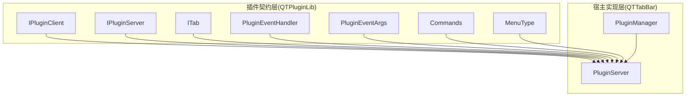
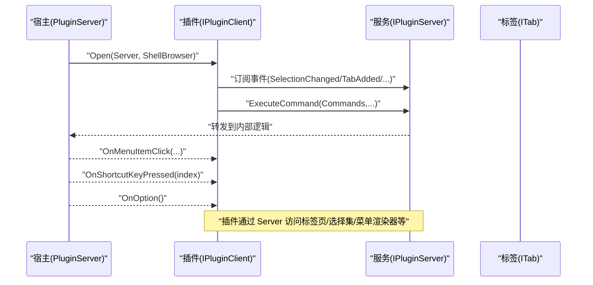
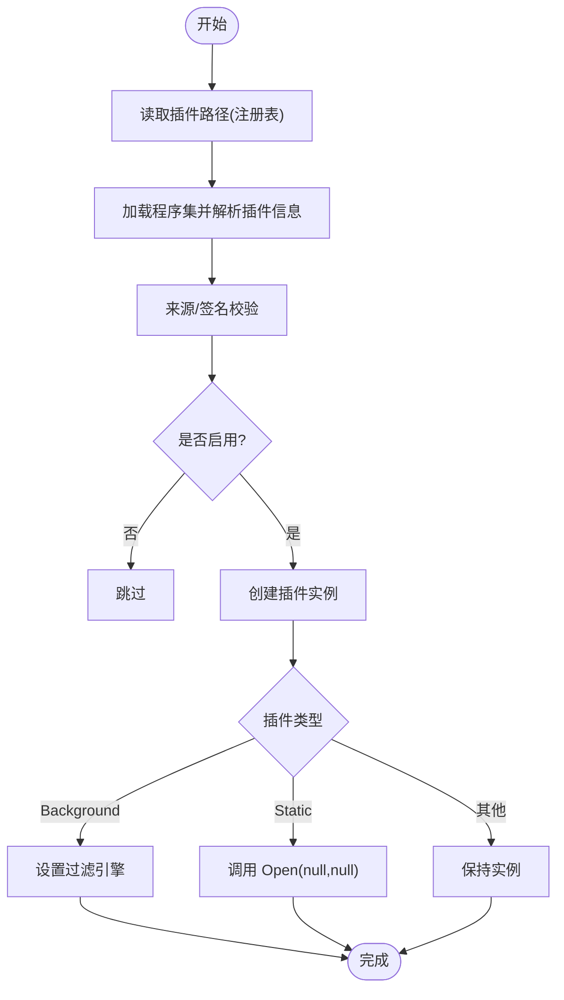
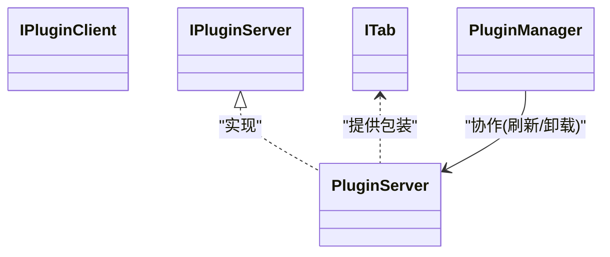

# API 参考文档

<cite>
**本文引用的文件**   
- [IPluginClient.cs](file://QTPluginLib/IPluginClient.cs)
- [IPluginServer.cs](file://QTPluginLib/IPluginServer.cs)
- [ITab.cs](file://QTPluginLib/ITab.cs)
- [PluginEventArgs.cs](file://QTPluginLib/PluginEventArgs.cs)
- [PluginEventHandler.cs](file://QTPluginLib/PluginEventHandler.cs)
- [MenuType.cs](file://QTPluginLib/MenuType.cs)
- [Commands.cs](file://QTPluginLib/Commands.cs)
- [PluginManager.cs](file://QTTabBar/PluginManager.cs)
- [PluginServer.cs](file://QTTabBar/PluginServer.cs)
</cite>

## 目录
1. [简介](#简介)
2. [项目结构](#项目结构)
3. [核心组件](#核心组件)
4. [架构总览](#架构总览)
5. [详细组件分析](#详细组件分析)
6. [依赖关系分析](#依赖关系分析)
7. [性能与线程模型](#性能与线程模型)
8. [错误处理与异常指南](#错误处理与异常指南)
9. [版本兼容性与弃用说明](#版本兼容性与弃用说明)
10. [结论](#结论)
11. [附录：常用用法模式与示例路径](#附录常用用法模式与示例路径)

## 简介
本 API 参考文档面向 QTTabBar-Next 插件开发者，系统化梳理并记录以下接口与方法：
- 插件客户端接口 IPluginClient：插件实现侧的回调入口、选项页开关、快捷键注册等。
- 插件服务端接口 IPluginServer：宿主提供给插件的能力集合，包括标签页控制、选择集操作、菜单渲染、事件订阅、命令执行、分组管理等。
- 标签页抽象 ITab：对单个标签页的浏览、历史、克隆、插入、关闭等操作。
- 事件与参数：PluginEventHandler、PluginEventArgs 以及 ExplorerWindowActions（通过枚举类型在事件中使用）。
- 命令与菜单：Commands 枚举与 MenuType 标志位。
- 插件加载与管理：PluginManager、PluginServer 的职责边界、生命周期与错误处理策略。

本参考文档以“渐进式复杂度”组织内容，先给出高层架构图，再深入到每个接口的成员说明、调用时序与注意事项，最后提供常见使用模式与排错建议。

## 项目结构
与 API 直接相关的代码主要分布在两个工程：
- QTPluginLib：定义对外暴露的插件契约（接口、枚举、事件委托与参数）。
- QTTabBar：实现插件运行时（插件加载、实例管理、事件派发、命令分发、UI 集成）。

图表来源
- [IPluginClient.cs:1-32](file://QTPluginLib/IPluginClient.cs#L1-L32)
- [IPluginServer.cs:1-78](file://QTPluginLib/IPluginServer.cs#L1-L78)
- [ITab.cs:1-41](file://QTPluginLib/ITab.cs#L1-L41)
- [PluginEventArgs.cs:1-54](file://QTPluginLib/PluginEventArgs.cs#L1-L54)
- [PluginEventHandler.cs:1-21](file://QTPluginLib/PluginEventHandler.cs#L1-L21)
- [MenuType.cs:1-29](file://QTPluginLib/MenuType.cs#L1-L29)
- [Commands.cs:1-50](file://QTPluginLib/Commands.cs#L1-L50)
- [PluginManager.cs:1-772](file://QTTabBar/PluginManager.cs#L1-L772)
- [PluginServer.cs:1-800](file://QTTabBar/PluginServer.cs#L1-L800)

章节来源
- [IPluginClient.cs:1-32](file://QTPluginLib/IPluginClient.cs#L1-L32)
- [IPluginServer.cs:1-78](file://QTPluginLib/IPluginServer.cs#L1-L78)
- [ITab.cs:1-41](file://QTPluginLib/ITab.cs#L1-L41)
- [PluginEventArgs.cs:1-54](file://QTPluginLib/PluginEventArgs.cs#L1-L54)
- [PluginEventHandler.cs:1-21](file://QTPluginLib/PluginEventHandler.cs#L1-L21)
- [MenuType.cs:1-29](file://QTPluginLib/MenuType.cs#L1-L29)
- [Commands.cs:1-50](file://QTPluginLib/Commands.cs#L1-L50)
- [PluginManager.cs:1-772](file://QTTabBar/PluginManager.cs#L1-L772)
- [PluginServer.cs:1-800](file://QTTabBar/PluginServer.cs#L1-L800)

## 核心组件
本节概述各核心组件的职责与交互方式，为后续详细分析奠定基础。

- IPluginClient（插件实现）
  - 由插件实现，用于接收宿主回调（如菜单点击、快捷键、选项页打开）、声明是否支持选项页、注册快捷键动作列表、在 Open 中获取 IPluginServer 进行能力调用。
- IPluginServer（宿主服务）
  - 由宿主提供，向插件开放标签页控制、选择集读写、菜单渲染器、事件订阅、命令执行、分组管理、本地化字符串读取、错误日志写入等能力。
- ITab（标签页抽象）
  - 表示一个标签页，提供浏览、前进后退、克隆、插入、关闭、历史与分支访问、选中状态与文本设置等。
- 事件与参数
  - PluginEventHandler 委托 + PluginEventArgs 参数，承载索引、地址或窗口动作等信息。
- 命令与菜单
  - Commands 枚举覆盖导航、标签页管理、UI 控制、属性面板、搜索框、排序等；MenuType 标志位用于区分菜单注册位置（标签/工具栏/两者）。
- 插件管理器与服务器
  - PluginManager：负责插件程序集发现、安全校验、静态/后台插件加载与卸载、编码检测器缓存等。
  - PluginServer：实现 IPluginServer，封装对 UI、Shell、分组、选择集、菜单渲染器的访问，并向插件派发事件。

章节来源
- [IPluginClient.cs:1-32](file://QTPluginLib/IPluginClient.cs#L1-L32)
- [IPluginServer.cs:1-78](file://QTPluginLib/IPluginServer.cs#L1-L78)
- [ITab.cs:1-41](file://QTPluginLib/ITab.cs#L1-L41)
- [PluginEventArgs.cs:1-54](file://QTPluginLib/PluginEventArgs.cs#L1-L54)
- [PluginEventHandler.cs:1-21](file://QTPluginLib/PluginEventHandler.cs#L1-L21)
- [MenuType.cs:1-29](file://QTPluginLib/MenuType.cs#L1-L29)
- [Commands.cs:1-50](file://QTPluginLib/Commands.cs#L1-L50)
- [PluginManager.cs:1-772](file://QTTabBar/PluginManager.cs#L1-L772)
- [PluginServer.cs:1-800](file://QTTabBar/PluginServer.cs#L1-L800)

## 架构总览
下图展示了插件与宿主的典型交互流程：插件在 Open 中持有 IPluginServer，随后通过该服务订阅事件、执行命令、操控标签页与选择集；宿主在合适时机触发事件回调到插件。

图表来源
- [PluginServer.cs:1-800](file://QTTabBar/PluginServer.cs#L1-L800)
- [IPluginClient.cs:1-32](file://QTPluginLib/IPluginClient.cs#L1-L32)
- [IPluginServer.cs:1-78](file://QTPluginLib/IPluginServer.cs#L1-L78)
- [ITab.cs:1-41](file://QTPluginLib/ITab.cs#L1-L41)

## 详细组件分析

### IPluginClient 接口（插件实现端）
职责
- 接收宿主回调：菜单项点击、快捷键按下、选项页打开。
- 声明是否提供选项页。
- 在 Open 中获取 IPluginServer 以便调用宿主能力。
- 注册快捷键动作名称数组。

成员摘要
- void Close(EndCode endCode)
- void OnMenuItemClick(MenuType menuType, string menuText, ITab tab)
- void OnOption()
- void OnShortcutKeyPressed(int index)
- void Open(IPluginServer pluginServer, IShellBrowser shellBrowser)
- bool QueryShortcutKeys(out string[] actions)
- bool HasOption { get; }

使用要点
- Open 是插件初始化入口，应保存 IPluginServer 引用以便后续调用。
- OnMenuItemClick 中的 ITab 可能为 null（取决于上下文），需判空。
- QueryShortcutKeys 返回的动作名应与宿主配置一致，index 对应注册的顺序。
- HasOption 为 true 时，宿主会显示“选项”入口并调用 OnOption。

章节来源
- [IPluginClient.cs:1-32](file://QTPluginLib/IPluginClient.cs#L1-L32)

### IPluginServer 接口（宿主服务端）
职责
- 提供事件订阅：ExplorerStateChanged、MenuRendererChanged、MouseEnter/Leave、NavigationComplete、PointedTabChanged、SelectionChanged、SettingsChanged、TabAdded/Changed/Removed。
- 标签页控制：CreateTab、GetTabs、HitTest、SelectedTab。
- 选择集操作：TryGetSelection、TrySetSelection。
- 命令执行：ExecuteCommand(Commands, object)。
- 分组管理：AddGroup、RemoveGroup、GetGroupPaths、Groups、OpenGroup。
- 应用快捷方式：AddApplication、RemoveApplication、GetApplications。
- 菜单渲染：GetMenuRenderer、RegisterMenu。
- 本地化：TryGetLocalizedStrings。
- 更新按钮项：UpdateItem。
- 错误日志：MakeErrorLog。
- 句柄与选项：ExplorerHandle、Handle、TabBarOption。

成员摘要
- 事件
  - event PluginEventHandler ExplorerStateChanged
  - event EventHandler MenuRendererChanged
  - event EventHandler MouseEnter
  - event EventHandler MouseLeave
  - event PluginEventHandler NavigationComplete
  - event PluginEventHandler PointedTabChanged
  - event PluginEventHandler SelectionChanged
  - event PluginEventHandler SettingsChanged
  - event PluginEventHandler TabAdded
  - event PluginEventHandler TabChanged
  - event PluginEventHandler TabRemoved
- 方法
  - bool AddApplication(string name, ProcessStartInfo startInfo)
  - bool AddGroup(string groupName, string[] paths)
  - bool CreateTab(Address address, int index, bool fLocked, bool fSelect)
  - bool CreateWindow(Address address)
  - bool ExecuteCommand(Commands command, object arg)
  - ProcessStartInfo[] GetApplications(string name)
  - string[] GetGroupPaths(string groupName)
  - ToolStripRenderer GetMenuRenderer()
  - ITab[] GetTabs()
  - ITab HitTest(Point pnt)
  - void OpenGroup(string[] groupNames)
  - void RegisterMenu(IPluginClient pluginClient, MenuType menuType, string menuText, bool fRegister)
  - bool RemoveApplication(string name)
  - bool RemoveGroup(string groupName)
  - bool TryGetLocalizedStrings(IPluginClient pluginClient, int count, out string[] arrStrings)
  - bool TryGetSelection(out Address[] selectedItems)
  - bool TrySetSelection(Address[] itemsToSelect, bool fDeselectOthers)
  - void UpdateItem(IBarButton barItem, bool fEnabled, bool fRefreshImage)
  - void MakeErrorLog(Exception ex, string optional = null)
- 属性
  - IntPtr ExplorerHandle { get; }
  - string[] Groups { get; }
  - IntPtr Handle { get; }
  - ITab SelectedTab { get; set; }
  - TabBarOption TabBarOption { get; set; }

使用要点
- 事件订阅应在 Open 后尽早完成，避免错过关键生命周期事件。
- ExecuteCommand 的参数类型因命令而异，请根据命令要求传入正确类型。
- TryGetSelection/TrySetSelection 基于当前视图的选择集，注意跨视图行为。
- RegisterMenu 用于将插件菜单项注册到系统菜单或标签菜单，fRegister=true 表示注册，false 表示注销。
- UpdateItem 用于刷新背景按钮的状态与图像。

章节来源
- [IPluginServer.cs:1-78](file://QTPluginLib/IPluginServer.cs#L1-L78)
- [PluginServer.cs:1-800](file://QTTabBar/PluginServer.cs#L1-L800)

### ITab 接口（标签页抽象）
职责
- 对单个标签页进行浏览、历史、克隆、插入、关闭、选中与文本设置等。

成员摘要
- bool Browse(Address address)
- bool Browse(bool fBack)
- void Clone(int index, bool fSelect)
- bool Close()
- Address[] GetBraches()
- Address[] GetHistory(bool fBack)
- bool Insert(int index)
- Address Address { get; }
- int Index { get; }
- bool Locked { get; set; }
- bool Selected { get; set; }
- string SubText { get; set; }
- string Text { get; set; }

使用要点
- Browse(address) 在当前标签页导航到目标地址；Browse(fBack) 用于前进/后退。
- Clone 可复制当前标签到新位置并可立即选中。
- GetHistory 返回历史栈（按方向），GetBraches 返回分支历史。
- Insert 可将当前标签移动到指定索引位置。

章节来源
- [ITab.cs:1-41](file://QTPluginLib/ITab.cs#L1-L41)

### 事件与参数
- PluginEventHandler(object sender, PluginEventArgs e)
- PluginEventArgs
  - int Index
  - Address Address
  - ExplorerWindowActions WindowAction

使用要点
- 不同事件携带的 Index/Address 含义不同，例如 TabAdded/TabChanged/TabRemoved 包含新/当前/移除标签的地址信息。
- ExplorerStateChanged 使用 WindowAction 指示资源管理器窗口动作。

章节来源
- [PluginEventHandler.cs:1-21](file://QTPluginLib/PluginEventHandler.cs#L1-L21)
- [PluginEventArgs.cs:1-54](file://QTPluginLib/PluginEventArgs.cs#L1-L54)

### 命令与菜单
- Commands 枚举
  - 导航：GoBack、GoForward、GoUpOneLevel、RefreshBrowser
  - 标签页：CloseCurrentTab、CloseLeft、CloseRight、CloseAllButCurrent、CloseAllButOne、UndoClose
  - 窗口：CloseWindow、ToggleTopMost、FocusFileList
  - 对话框：OpenTabBarOptionDialog、OpenButtonBarOptionDialog
  - 可见性：IsFolderTreeVisible、IsButtonBarVisible、ShowFolderTree、ShowButtonBar
  - 工具：MD5、ShowProperties、SetModalState、SetSearchBoxStr
  - 排序：ReorderTabsByName、ReorderTabsByPath、ReorderTabsByActv、ReorderTabsRevers
- MenuType 标志位
  - None、Tab、Bar、Both

使用要点
- ExecuteCommand 的第二个参数类型随命令变化，例如 GoBack/GoForward 需要 int 参数，ShowFolderTree 需要 bool 参数，CloseAllButOne 需要 ITab 包装对象等。
- RegisterMenu 的 menuType 决定菜单出现在标签菜单还是工具栏菜单，Both 表示同时注册。

章节来源
- [Commands.cs:1-50](file://QTPluginLib/Commands.cs#L1-L50)
- [MenuType.cs:1-29](file://QTPluginLib/MenuType.cs#L1-L29)
- [PluginServer.cs:1-800](file://QTTabBar/PluginServer.cs#L1-L800)

### 插件加载与管理（PluginManager 与 PluginServer）
职责
- PluginManager
  - 扫描与加载插件程序集，解析元数据与图标。
  - 安全校验：受信任目录与签名验证（保守策略，默认允许继续加载但记录日志，可通过配置阻断不受信任插件）。
  - 静态/后台插件实例管理与刷新。
  - 编码检测器缓存。
- PluginServer
  - 实现 IPluginServer，封装对 UI、Shell、分组、选择集、菜单渲染器的访问。
  - 启动时加载已启用插件，维护插件实例字典，派发事件。
  - 提供命令分发、菜单注册、本地化字符串读取、错误日志写入。

关键流程
- 初始化：读取注册表中的插件路径，加载程序集，解析插件信息，启用配置的插件。
- 启动加载：遍历已启用插件，按类型加载（Background/Static/其他），必要时设置 Filter 插件。
- 刷新：对比当前启用列表，卸载不再启用的插件，重新加载启用的插件，广播通知所有标签条刷新。
- 卸载：清理事件、关闭实例、从字典移除、释放资源。

图表来源
- [PluginManager.cs:1-772](file://QTTabBar/PluginManager.cs#L1-L772)
- [PluginServer.cs:1-800](file://QTTabBar/PluginServer.cs#L1-L800)

章节来源
- [PluginManager.cs:1-772](file://QTTabBar/PluginManager.cs#L1-L772)
- [PluginServer.cs:1-800](file://QTTabBar/PluginServer.cs#L1-L800)

## 依赖关系分析
- 插件契约层（QTPluginLib）被宿主实现层（QTTabBar）引用。
- PluginServer 实现 IPluginServer，并在内部使用 Shell 浏览器、分组管理器、UI 控件等。
- PluginManager 负责程序集加载与实例管理，与 PluginServer 协作完成插件生命周期。

图表来源
- [IPluginClient.cs:1-32](file://QTPluginLib/IPluginClient.cs#L1-L32)
- [IPluginServer.cs:1-78](file://QTPluginLib/IPluginServer.cs#L1-L78)
- [ITab.cs:1-41](file://QTPluginLib/ITab.cs#L1-L41)
- [PluginServer.cs:1-800](file://QTTabBar/PluginServer.cs#L1-L800)
- [PluginManager.cs:1-772](file://QTTabBar/PluginManager.cs#L1-L772)

## 性能与线程模型
- 事件派发
  - 宿主在 UI 线程上触发事件，插件应避免在事件处理中进行耗时操作，必要时异步处理。
- 选择集操作
  - TrySetSelection 可能触发大量 UI 更新，批量操作时应减少调用次数。
- 插件刷新
  - RefreshPlugins 会卸载与重新加载插件，频繁刷新会影响性能，建议在用户显式操作时触发。
- 菜单渲染器
  - GetMenuRenderer 返回当前渲染器，仅在主题切换时变化，无需频繁查询。

[本节为通用指导，不直接分析具体文件]

## 错误处理与异常指南
- 插件异常捕获
  - 宿主在加载、关闭、获取图片等阶段捕获异常并通过统一入口记录日志与提示。
- 错误日志
  - 通过 IPluginServer.MakeErrorLog 写入宿主错误日志，便于排查问题。
- 来源/签名校验
  - 默认保守策略：校验失败仅告警仍继续加载；若配置 BlockUntrustedPlugins 为 true，则阻断不受信任插件。

章节来源
- [PluginManager.cs:1-772](file://QTTabBar/PluginManager.cs#L1-L772)
- [PluginServer.cs:1-800](file://QTTabBar/PluginServer.cs#L1-L800)

## 版本兼容性与弃用说明
- 兼容性
  - 插件契约位于 QTPluginLib，宿主实现位于 QTTabBar。升级宿主时，应保持 IPluginClient/IPluginServer/ITab 等接口稳定，避免破坏现有插件。
- 弃用
  - 未发现明确的弃用标记；新增成员应以向后兼容方式添加，避免影响旧插件。

[本节为通用指导，不直接分析具体文件]

## 结论
本文档系统化梳理了 QTTabBar-Next 的插件 API，涵盖 IPluginClient、IPluginServer、ITab 及其相关事件、命令与菜单机制，并结合 PluginManager 与 PluginServer 的实现说明了插件生命周期、事件派发与错误处理策略。开发者可据此快速集成与扩展功能，遵循最佳实践以获得更稳定的体验。

[本节为总结，不直接分析具体文件]

## 附录：常用用法模式与示例路径
- 订阅事件
  - 在 Open 中订阅 SelectionChanged、TabAdded/Changed/Removed、NavigationComplete 等事件，以响应标签页与选择集变化。
  - 参考路径：[PluginServer.cs:1-800](file://QTTabBar/PluginServer.cs#L1-L800)
- 执行命令
  - 使用 ExecuteCommand 执行导航、标签页管理、UI 控制等命令，注意参数类型匹配。
  - 参考路径：[Commands.cs:1-50](file://QTPluginLib/Commands.cs#L1-L50)、[PluginServer.cs:1-800](file://QTTabBar/PluginServer.cs#L1-L800)
- 标签页操作
  - 通过 ITab 进行浏览、历史、克隆、插入、关闭等操作。
  - 参考路径：[ITab.cs:1-41](file://QTPluginLib/ITab.cs#L1-L41)
- 选择集读写
  - 使用 TryGetSelection/TrySetSelection 获取或设置当前视图的选择集。
  - 参考路径：[PluginServer.cs:1-800](file://QTTabBar/PluginServer.cs#L1-L800)
- 菜单注册
  - 使用 RegisterMenu 将插件菜单项注册到标签菜单或工具栏菜单。
  - 参考路径：[MenuType.cs:1-29](file://QTPluginLib/MenuType.cs#L1-L29)、[PluginServer.cs:1-800](file://QTTabBar/PluginServer.cs#L1-L800)
- 本地化字符串
  - 通过 TryGetLocalizedStrings 读取插件本地化资源。
  - 参考路径：[PluginServer.cs:1-800](file://QTTabBar/PluginServer.cs#L1-L800)
- 错误日志
  - 使用 MakeErrorLog 记录异常与可选信息。
  - 参考路径：[PluginServer.cs:1-800](file://QTTabBar/PluginServer.cs#L1-L800)