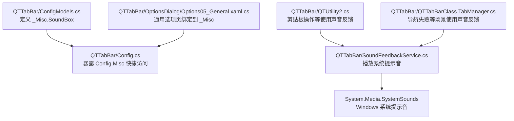
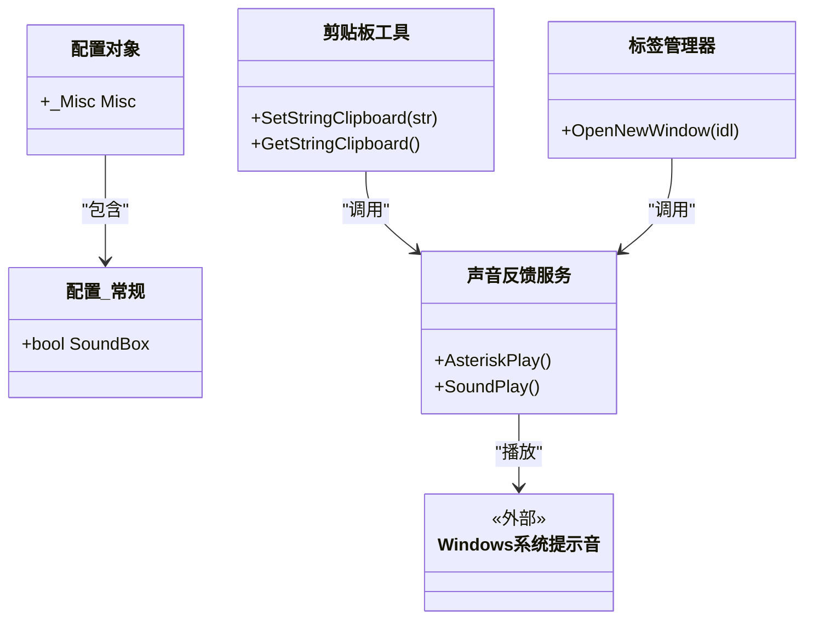
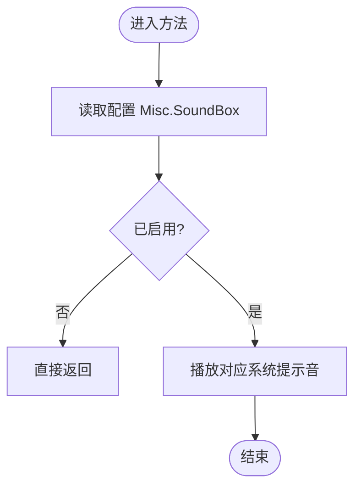
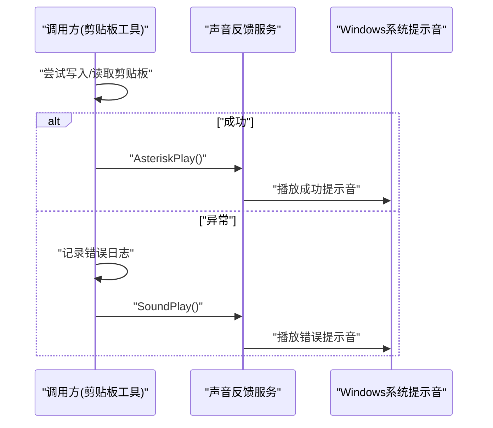
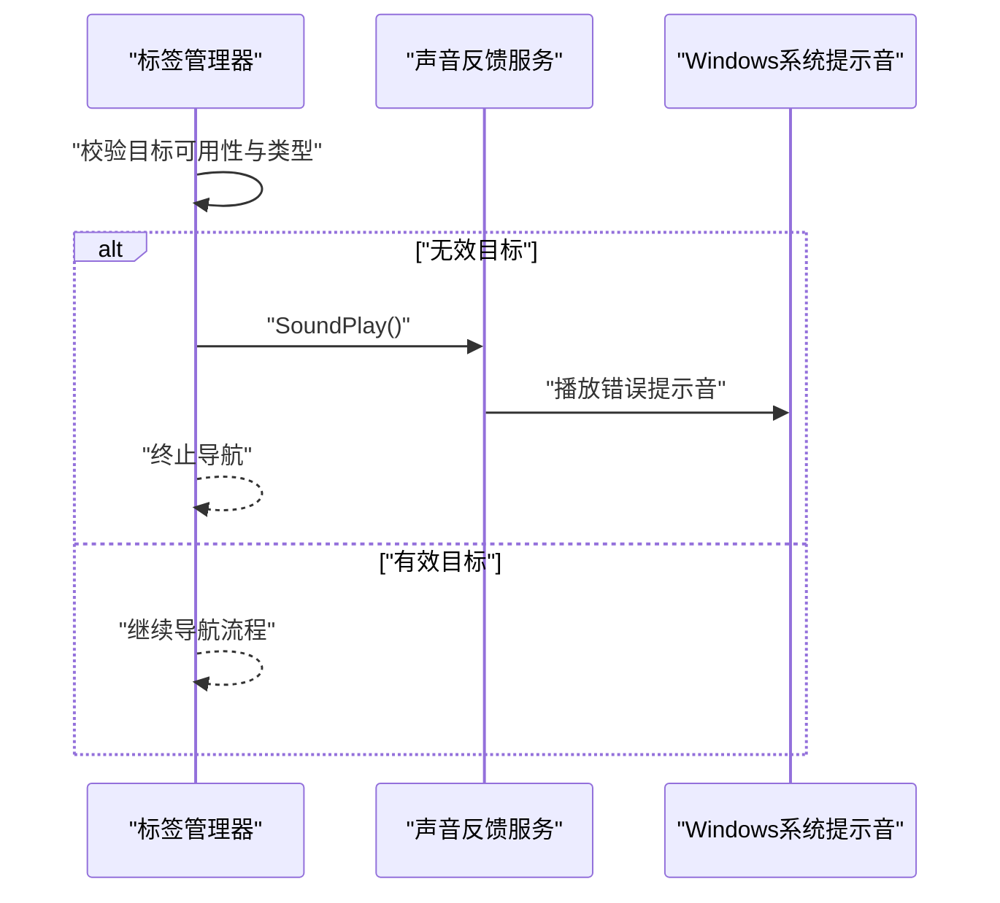
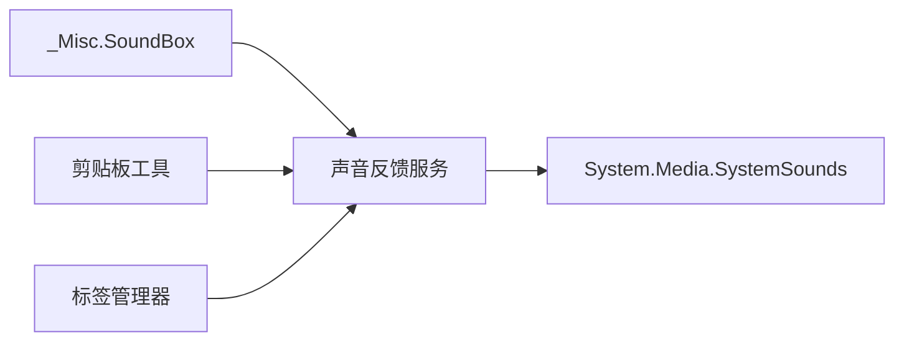

# 声音反馈服务

<cite>
**本文引用的文件**   
- [SoundFeedbackService.cs](file://QTTabBar/SoundFeedbackService.cs)
- [ConfigModels.cs](file://QTTabBar/ConfigModels.cs)
- [Config.cs](file://QTTabBar/Config.cs)
- [Options05_General.xaml.cs](file://QTTabBar/OptionsDialog/Options05_General.xaml.cs)
- [QTUtility2.cs](file://QTTabBar/QTUtility2.cs)
- [QTTabBarClass.TabManager.cs](file://QTTabBar/QTTabBarClass.TabManager.cs)
</cite>

## 目录
1. [简介](#简介)
2. [项目结构](#项目结构)
3. [核心组件](#核心组件)
4. [架构总览](#架构总览)
5. [详细组件分析](#详细组件分析)
6. [依赖关系分析](#依赖关系分析)
7. [性能与可用性考虑](#性能与可用性考虑)
8. [故障排查指南](#故障排查指南)
9. [结论](#结论)

## 简介
本文件聚焦于 QTTabBar-Next 中的“声音反馈服务”，说明其职责、配置开关、调用点以及与其他模块的交互方式。该服务提供两类系统提示音：成功类提示音与错误/警告类提示音，并通过全局配置项控制是否启用。

## 项目结构
声音反馈相关代码位于主工程 QTTabBar 下，核心实现为单一静态服务类；配置项定义在配置模型中；选项对话框负责将用户设置持久化到配置对象；多处业务逻辑通过该服务进行音频反馈。

图表来源
- [ConfigModels.cs:494-518](file://QTTabBar/ConfigModels.cs#L494-L518)
- [Config.cs:40-54](file://QTTabBar/Config.cs#L40-L54)
- [Options05_General.xaml.cs:32-42](file://QTTabBar/OptionsDialog/Options05_General.xaml.cs#L32-L42)
- [QTUtility2.cs:460-494](file://QTTabBar/QTUtility2.cs#L460-L494)
- [QTTabBarClass.TabManager.cs:130-145](file://QTTabBar/QTTabBarClass.TabManager.cs#L130-L145)
- [SoundFeedbackService.cs:1-18](file://QTTabBar/SoundFeedbackService.cs#L1-L18)

章节来源
- [ConfigModels.cs:494-518](file://QTTabBar/ConfigModels.cs#L494-L518)
- [Config.cs:40-54](file://QTTabBar/Config.cs#L40-L54)
- [Options05_General.xaml.cs:32-42](file://QTTabBar/OptionsDialog/Options05_General.xaml.cs#L32-L42)
- [QTUtility2.cs:460-494](file://QTTabBar/QTUtility2.cs#L460-L494)
- [QTTabBarClass.TabManager.cs:130-145](file://QTTabBar/QTTabBarClass.TabManager.cs#L130-L145)
- [SoundFeedbackService.cs:1-18](file://QTTabBar/SoundFeedbackService.cs#L1-L18)

## 核心组件
- 声音反馈服务
  - 提供两类方法：成功提示音与错误/警告提示音。
  - 仅在配置项开启时播放，避免不必要的系统资源占用。
- 配置项
  - 位于“常规”配置分组中，默认关闭。
  - 通过配置对象的 Misc 属性暴露给全局。
- 选项对话框
  - “通用”选项页绑定到 _Misc 配置对象，用于修改 SoundBox 等常规设置。

章节来源
- [SoundFeedbackService.cs:1-18](file://QTTabBar/SoundFeedbackService.cs#L1-L18)
- [ConfigModels.cs:494-518](file://QTTabBar/ConfigModels.cs#L494-L518)
- [Config.cs:40-54](file://QTTabBar/Config.cs#L40-L54)
- [Options05_General.xaml.cs:32-42](file://QTTabBar/OptionsDialog/Options05_General.xaml.cs#L32-L42)

## 架构总览
声音反馈服务作为轻量级中间层，屏蔽了 System.Media.SystemSounds 的使用细节，并在上层统一受配置控制。各业务模块无需关心具体音效类型或系统 API，只需调用服务提供的语义化方法。

图表来源
- [ConfigModels.cs:494-518](file://QTTabBar/ConfigModels.cs#L494-L518)
- [Config.cs:40-54](file://QTTabBar/Config.cs#L40-L54)
- [SoundFeedbackService.cs:1-18](file://QTTabBar/SoundFeedbackService.cs#L1-L18)
- [QTUtility2.cs:460-494](file://QTTabBar/QTUtility2.cs#L460-L494)
- [QTTabBarClass.TabManager.cs:130-145](file://QTTabBar/QTTabBarClass.TabManager.cs#L130-L145)

## 详细组件分析

### 声音反馈服务
- 职责
  - 封装系统提示音播放逻辑。
  - 根据配置决定是否播放。
- 关键方法
  - AsteriskPlay：成功/信息类提示音。
  - SoundPlay：错误/警告类提示音。
- 行为要点
  - 若未启用配置项，则直接返回，不产生任何 I/O 或音频输出。
  - 使用系统内置提示音，避免额外资源加载。

图表来源
- [SoundFeedbackService.cs:1-18](file://QTTabBar/SoundFeedbackService.cs#L1-L18)
- [ConfigModels.cs:494-518](file://QTTabBar/ConfigModels.cs#L494-L518)

章节来源
- [SoundFeedbackService.cs:1-18](file://QTTabBar/SoundFeedbackService.cs#L1-L18)
- [ConfigModels.cs:494-518](file://QTTabBar/ConfigModels.cs#L494-L518)

### 配置项与选项界面
- 配置项位置
  - 位于“常规”配置分组，属性名为 SoundBox，默认值为 false。
- 选项界面
  - “通用”选项页通过数据绑定将 UI 控件与 _Misc 对象关联，从而修改 SoundBox。
- 默认行为
  - 首次安装或未显式开启时，不会播放提示音。

章节来源
- [ConfigModels.cs:494-518](file://QTTabBar/ConfigModels.cs#L494-L518)
- [Options05_General.xaml.cs:32-42](file://QTTabBar/OptionsDialog/Options05_General.xaml.cs#L32-L42)

### 典型调用流程：剪贴板操作
- 成功路径
  - 写入/读取剪贴板成功后，播放成功提示音。
- 异常路径
  - 发生异常时，记录日志并播放错误提示音。

图表来源
- [QTUtility2.cs:460-494](file://QTTabBar/QTUtility2.cs#L460-L494)
- [SoundFeedbackService.cs:1-18](file://QTTabBar/SoundFeedbackService.cs#L1-L18)

章节来源
- [QTUtility2.cs:460-494](file://QTTabBar/QTUtility2.cs#L460-L494)
- [SoundFeedbackService.cs:1-18](file://QTTabBar/SoundFeedbackService.cs#L1-L18)

### 典型调用流程：标签导航失败
- 当目标不可用、非文件夹或驱动器未就绪时，立即播放错误提示音并中止后续操作。

图表来源
- [QTTabBarClass.TabManager.cs:130-145](file://QTTabBar/QTTabBarClass.TabManager.cs#L130-L145)
- [SoundFeedbackService.cs:1-18](file://QTTabBar/SoundFeedbackService.cs#L1-L18)

章节来源
- [QTTabBarClass.TabManager.cs:130-145](file://QTTabBar/QTTabBarClass.TabManager.cs#L130-L145)
- [SoundFeedbackService.cs:1-18](file://QTTabBar/SoundFeedbackService.cs#L1-L18)

## 依赖关系分析
- 内部依赖
  - 服务依赖配置对象以获取 SoundBox 开关。
  - 多个业务模块（如剪贴板工具、标签管理器）通过服务进行音频反馈。
- 外部依赖
  - 使用 System.Media.SystemSounds 播放系统提示音，属于操作系统内置能力，无额外第三方库依赖。

图表来源
- [ConfigModels.cs:494-518](file://QTTabBar/ConfigModels.cs#L494-L518)
- [QTUtility2.cs:460-494](file://QTTabBar/QTUtility2.cs#L460-L494)
- [QTTabBarClass.TabManager.cs:130-145](file://QTTabBar/QTTabBarClass.TabManager.cs#L130-L145)
- [SoundFeedbackService.cs:1-18](file://QTTabBar/SoundFeedbackService.cs#L1-L18)

章节来源
- [ConfigModels.cs:494-518](file://QTTabBar/ConfigModels.cs#L494-L518)
- [QTUtility2.cs:460-494](file://QTTabBar/QTUtility2.cs#L460-L494)
- [QTTabBarClass.TabManager.cs:130-145](file://QTTabBar/QTTabBarClass.TabManager.cs#L130-L145)
- [SoundFeedbackService.cs:1-18](file://QTTabBar/SoundFeedbackService.cs#L1-L18)

## 性能与可用性考虑
- 零开销路径
  - 当配置关闭时，服务直接返回，不触发任何系统调用，确保高频调用路径的性能。
- 低耦合
  - 通过静态服务集中管理音频播放，便于统一开关与未来扩展（例如替换自定义音效）。
- 可发现性
  - 方法命名语义清晰（成功/错误），有助于调用方正确选择提示音类型。

[本节为通用指导，不涉及具体文件分析]

## 故障排查指南
- 现象：未听到提示音
  - 检查“常规”选项中的“声音框”开关是否启用。
  - 确认系统音量与提示音未被静音。
- 现象：频繁提示音影响体验
  - 关闭 SoundBox 或在调用点减少不必要的反馈。
- 现象：异常路径未播放错误音
  - 确认异常分支确实调用了错误提示音方法。
  - 检查配置是否正确加载且未被覆盖。

章节来源
- [ConfigModels.cs:494-518](file://QTTabBar/ConfigModels.cs#L494-L518)
- [Options05_General.xaml.cs:32-42](file://QTTabBar/OptionsDialog/Options05_General.xaml.cs#L32-L42)
- [QTUtility2.cs:460-494](file://QTTabBar/QTUtility2.cs#L460-L494)
- [QTTabBarClass.TabManager.cs:130-145](file://QTTabBar/QTTabBarClass.TabManager.cs#L130-L145)
- [SoundFeedbackService.cs:1-18](file://QTTabBar/SoundFeedbackService.cs#L1-L18)

## 结论
声音反馈服务以最小依赖和清晰接口为 QTTabBar 提供了统一的音频反馈能力。通过配置项控制，既保证了默认安静体验，又允许用户在需要时开启提示音。当前实现简洁高效，易于维护与扩展。

[本节为总结性内容，不涉及具体文件分析]