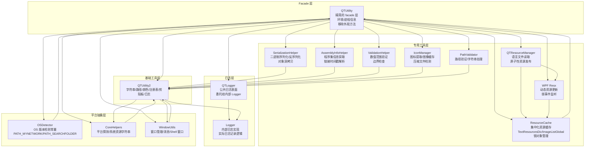
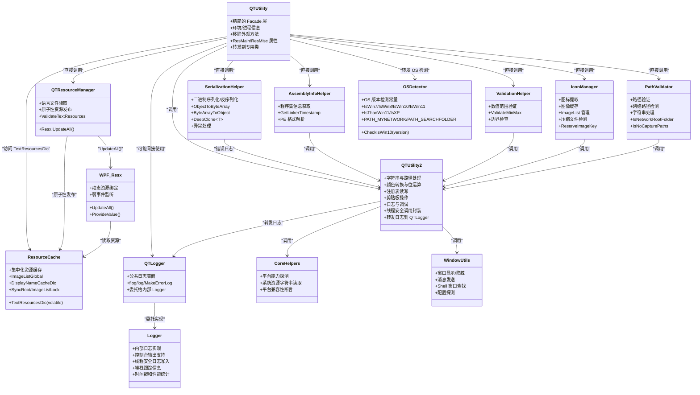
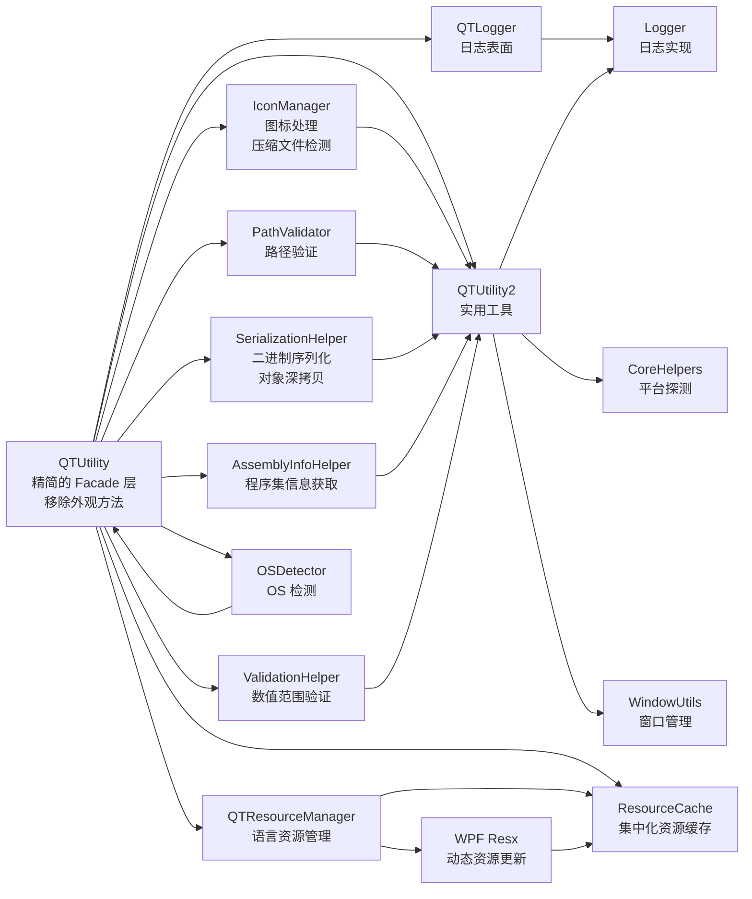

# 工具类 API

<cite>
**本文引用的文件**   
- [QTUtility.cs](file://QTTabBar/QTUtility.cs)
- [SerializationHelper.cs](file://QTTabBar/SerializationHelper.cs)
- [AssemblyInfoHelper.cs](file://QTTabBar/AssemblyInfoHelper.cs)
- [ValidationHelper.cs](file://QTTabBar\ValidationHelper.cs)
- [IconManager.cs](file://QTTabBar/IconManager.cs)
- [PathValidator.cs](file://QTTabBar/PathValidator.cs)
- [QTResourceManager.cs](file://QTTabBar/QTResourceManager.cs)
- [ResourceCache.cs](file://QTTabBar/ResourceCache.cs)
- [WPFUtils.cs](file://QTTabBar/WPFUtils.cs)
- [OSDetector.cs](file://QTTabBar/OSDetector.cs)
- [QTLogger.cs](file://QTTabBar/QTLogger.cs)
- [Logger.cs](file://QTTabBar/Logger.cs)
- [QTUtility2.cs](file://QTTabBar/QTUtility2.cs)
- [CoreHelpers.cs](file://QTTabBar/Common/CoreHelpers.cs)
- [WindowUtils.cs](file://QTTabBar/WindowUtils.cs)
</cite>

## 更新摘要
**所做更改**   
- 新增 AssemblyInfoHelper 类，提供程序集链接时间戳获取功能
- 新增 ValidationHelper 类，提供数值范围验证方法
- 增强 SerializationHelper 类，添加 DeepClone<T> 泛型深拷贝方法
- IconManager 类扩展压缩文件扩展名检测功能和增强的图像键预留逻辑
- QTUtility.cs 从 812 行精简到 585 行，通过提取实用函数到专用辅助类实现代码重构

## 目录
1. [简介](#简介)
2. [项目结构](#项目结构)
3. [核心组件](#核心组件)
4. [架构总览](#架构总览)
5. [详细组件分析](#详细组件分析)
6. [依赖关系分析](#依赖关系分析)
7. [性能考虑](#性能考虑)
8. [故障排查指南](#故障排查指南)
9. [结论](#结论)
10. [附录](#附录)

## 简介
本 API 参考文档聚焦于 QTTabBar-Next 中的通用工具与辅助库，采用分层架构设计，覆盖以下关键类：
- **QTUtility**：精简的 facade 层，专注于版本与环境检测、进程信息获取等核心功能。
- **SerializationHelper**：专门处理二进制序列化和反序列化操作，支持对象深拷贝。
- **AssemblyInfoHelper**：提供程序集信息获取和链接时间戳解析功能。
- **ValidationHelper**：提供数值范围验证和边界检查功能。
- **IconManager**：专门处理图标提取、图像缓存和全局 ImageList 管理，支持压缩文件检测。
- **PathValidator**：专注于路径验证、网络路径检测和字符串处理。
- **QTResourceManager**：负责语言文件读取和文本资源验证，提供原子性资源发布机制。
- **ResourceCache**：集中化的资源缓存容器，管理 TextResourcesDic、ImageListGlobal 等共享状态。
- **WPF Resx**：WPF 标记扩展类，支持动态资源更新和弱事件监听。
- **OSDetector**：集中化的操作系统版本检测常量和方法，提供 IsWin7、IsWin8、IsWin10、IsWin11、IsThanWin11、IsXP 等平台检测标志。
- **QTLogger**：公共日志表面接口，委托给内部 Logger 机制，提供统一的日志访问点。
- **QTUtility2**：字符串与路径处理、颜色转换、注册表读写、剪贴板操作、日志与调试、线程安全调用封装等。
- **CoreHelpers（Common）**：平台能力探测、系统资源字符串读取、平台兼容性断言。
- **WindowUtils**：Windows 窗口枚举、显示/隐藏、消息发送、任务栏与 Shell 窗口查找等。

文档提供方法说明、参数与返回值类型、使用示例和注意事项，并给出性能建议以及与 Windows API 的集成方式与兼容性处理要点。

## 项目结构
本节从代码组织角度概览工具类所在位置及其职责边界：
- **QTTabBar/QTUtility.cs**：精简的 facade 层转发到专用类，移除了外观方法，代码量从 812 行减少到 585 行。
- **QTTabBar/SerializationHelper.cs**：专门的二进制序列化/反序列化处理器，支持对象深拷贝。
- **QTTabBar/AssemblyInfoHelper.cs**：程序集信息获取专用类，提供链接时间戳解析功能。
- **QTTabBar\ValidationHelper.cs**：数值验证专用类，提供范围检查和边界验证。
- **QTTabBar/IconManager.cs**：图标提取与图像缓存专用类，支持压缩文件扩展名检测。
- **QTTabBar/PathValidator.cs**：路径验证与字符串处理专用类。
- **QTTabBar/QTResourceManager.cs**：语言资源管理专用类，提供原子性资源发布机制。
- **QTTabBar/ResourceCache.cs**：集中化的资源缓存容器，管理共享状态和锁对象。
- **QTTabBar/WPFUtils.cs**：WPF 工具类，包含 Resx 标记扩展支持动态资源更新。
- **QTTabBar/OSDetector.cs**：操作系统版本检测常量和方法的集中化管理。
- **QTTabBar/QTLogger.cs**：公共日志表面接口，委托给内部 Logger。
- **QTTabBar/Logger.cs**：内部日志实现，包含实际的日志记录逻辑。
- **QTTabBar/QTUtility2.cs**：更偏向实用函数集合，涵盖字符串、路径、颜色、注册表、剪贴板、日志等。
- **QTTabBar/Common/CoreHelpers.cs**：跨平台能力探测与系统资源字符串读取。
- **QTTabBar/WindowUtils.cs**：Windows 窗口相关操作封装。

**图表来源**
- [QTUtility.cs:1-585](file://QTTabBar/QTUtility.cs#L1-L585)
- [SerializationHelper.cs:29-73](file://QTTabBar/SerializationHelper.cs#L29-L73)
- [AssemblyInfoHelper.cs:5-30](file://QTTabBar/AssemblyInfoHelper.cs#L5-L30)
- [ValidationHelper.cs:4-22](file://QTTabBar\ValidationHelper.cs#L4-L22)
- [IconManager.cs:34-386](file://QTTabBar/IconManager.cs#L34-L386)
- [PathValidator.cs:25-74](file://QTTabBar/PathValidator.cs#L25-L74)
- [QTResourceManager.cs:36-173](file://QTTabBar/QTResourceManager.cs#L36-L173)
- [ResourceCache.cs:22-47](file://QTTabBar/ResourceCache.cs#L22-L47)
- [WPFUtils.cs:156-287](file://QTTabBar/WPFUtils.cs#L156-L287)
- [OSDetector.cs:8-31](file://QTTabBar/OSDetector.cs#L8-L31)
- [QTLogger.cs:8-28](file://QTTabBar/QTLogger.cs#L8-L28)
- [Logger.cs:35-200](file://QTTabBar/Logger.cs#L35-L200)
- [QTUtility2.cs:218-293](file://QTTabBar/QTUtility2.cs#L218-L293)
- [CoreHelpers.cs:10-100](file://QTTabBar/Common/CoreHelpers.cs#L10-L100)
- [WindowUtils.cs:24-116](file://QTTabBar/WindowUtils.cs#L24-L116)

**章节来源**
- [QTUtility.cs:1-585](file://QTTabBar/QTUtility.cs#L1-L585)
- [SerializationHelper.cs:1-73](file://QTTabBar/SerializationHelper.cs#L1-L73)
- [AssemblyInfoHelper.cs:1-30](file://QTTabBar/AssemblyInfoHelper.cs#L1-L30)
- [ValidationHelper.cs:1-22](file://QTTabBar\ValidationHelper.cs#L1-L22)
- [IconManager.cs:1-386](file://QTTabBar/IconManager.cs#L1-L386)
- [PathValidator.cs:1-76](file://QTTabBar/PathValidator.cs#L1-L76)
- [QTResourceManager.cs:1-173](file://QTTabBar/QTResourceManager.cs#L1-L173)
- [ResourceCache.cs:1-49](file://QTTabBar/ResourceCache.cs#L1-L49)
- [WPFUtils.cs:150-287](file://QTTabBar/WPFUtils.cs#L150-L287)
- [OSDetector.cs:1-33](file://QTTabBar/OSDetector.cs#L1-L33)
- [QTLogger.cs:1-30](file://QTTabBar/QTLogger.cs#L1-L30)
- [Logger.cs:1-339](file://QTTabBar/Logger.cs#L1-L339)
- [QTUtility2.cs:1-809](file://QTTabBar/QTUtility2.cs#L1-L809)
- [CoreHelpers.cs:1-100](file://QTTabBar/Common/CoreHelpers.cs#L1-L100)
- [WindowUtils.cs:1-232](file://QTTabBar/WindowUtils.cs#L1-L232)

## 核心组件
本节对各个核心类的公共接口进行分层梳理，便于快速定位所需功能。

### Facade 层 - QTUtility（已精简）
- **作用**：作为统一入口，转发调用到专用类，保持向后兼容性，移除了外观方法
- **关键方法与用途**
  - **环境与版本**：IsWindows7/LaterThan7/LaterThan8_1/IsWindows8_1/IsWindows10AndLater/LaterThan10Beta17666 等属性与方法；DefaultFontName；RightToLeft。
  - **进程信息**：GetParentProcessName、GetParent(Process)。
  - **其他**：MakeMouseChord、SoundPlay/AsteriskPlay、SaveClosing/SaveRecentFiles/SaveRecentlyClosed、RefreshLockedTabsList。
  - **改进的资源管理属性**：ResMain、ResMisc 从静态字段转换为属性，直接读取 TextResourcesDic。
  - **移除的外观方法**：不再提供 ObjectToByteArray/ByteArrayToObject、ExtHasIcon/ExtIsCompressed、IsNetworkRootFolder、ReadLanguageFile、ValidateTextResources 等方法。

### 专用工具层

#### SerializationHelper
- **作用**：专门处理二进制序列化和反序列化操作，提供安全的对象序列化功能
- **关键方法与用途**
  - **对象序列化**：ObjectToByteArray(SerializeDelegate obj) - 将对象序列化为字节数组。
  - **对象反序列化**：ByteArrayToObject(byte[] arrBytes) - 从字节数组反序列化为对象。
  - **对象深拷贝**：DeepClone<T>(T obj) - 使用 BinaryFormatter 进行对象的二进制深拷贝。
  - **异常处理**：包含详细的异常捕获和错误日志记录。
  - **安全性**：使用 PreMergeToMergedDeserializationBinder 确保反序列化安全。
- **使用示例**
  - 序列化对象：`byte[] data = SerializationHelper.ObjectToByteArray(new SerializeDelegate(action));`
  - 反序列化对象：`object obj = SerializationHelper.ByteArrayToObject(data);`
  - 对象深拷贝：`var clonedObj = SerializationHelper.DeepClone(originalObj);`
- **注意事项**
  - 反序列化失败时返回 null 并记录错误日志
  - 需要正确的权限才能执行序列化操作
  - 适用于 IPC 通信和配置持久化场景

#### AssemblyInfoHelper
- **作用**：提供程序集信息获取和链接时间戳解析功能
- **关键方法与用途**
  - **链接时间戳获取**：GetLinkerTimestamp() - 从 PE 头中解析程序的链接时间戳。
  - **PE 格式解析**：直接读取可执行文件的 PE 头部信息获取编译时间。
- **使用示例**
  - 获取程序编译时间：`DateTime buildTime = AssemblyInfoHelper.GetLinkerTimestamp();`
- **注意事项**
  - 需要读取程序集文件的权限
  - 仅适用于 .NET 程序集文件
  - 时间戳基于 Unix 纪元时间计算

#### ValidationHelper
- **作用**：提供数值范围验证和边界检查功能
- **关键方法与用途**
  - **数值范围验证**：ValidateMinMax(int value, int min, max) - 将数值限制在指定范围内。
  - **引用参数验证**：ValidateMinMax(ref int value, int min, int max) - 直接修改传入的数值。
- **使用示例**
  - 范围验证：`int clampedValue = ValidationHelper.ValidateMinMax(userInput, 1, 100);`
  - 引用参数验证：`ValidationHelper.ValidateMinMax(ref userInput, 1, 100);`
- **注意事项**
  - 自动处理 min > max 的情况，交换最小值和最大值
  - 适用于用户输入验证和配置参数校验

#### IconManager
- **作用**：专门处理图标提取、图像缓存和全局 ImageList 管理
- **关键方法与用途**
  - **图标提取**：GetIcon(IntPtr pIDL)、GetIcon(string path, bool fExtension)
  - **图像键管理**：GetImageKey(string path, string ext)、SetImageKey(string key, string itemPath)
  - **扩展名检查**：ExtHasIcon(string ext)
  - **压缩文件检测**：ExtIsCompressed(string ext) - 检测是否为压缩文件格式。
  - **图像缓存**：LoadReservedImage(ImageReservationKey irk)、AddImageToGlobal、ImageGlobalContainsKey、GetImageFromGlobal
  - **图像键预留**：ReserveImageKey(QMenuItem qmi, string path, string ext) - 智能预留图像键。
- **使用示例**
  - 获取网络路径图标：调用 GetImageKey(path, ext)，自动识别网络路径并返回相应键。
  - 预加载系统图标：使用 LoadReservedImage 预加载常用图标类型。
  - 检测压缩文件：调用 ExtIsCompressed(".zip") 判断是否为压缩文件。
- **注意事项**
  - 使用 imageListLock 确保线程安全，避免死锁
  - 遵循锁顺序：先释放 syncRoot，再获取 imageListLock
  - 图标提取涉及 P/Invoke 与 COM 对象释放，需正确处理资源

#### PathValidator
- **作用**：专注于路径验证、网络路径检测和字符串处理
- **关键方法与用途**
  - **网络路径检测**：IsNetworkRootFolder(string path)、IsNetPath(string path)
  - **路径过滤**：IsNoCapturePaths(string path)
  - **字符串处理**：IsEmptyStr(string strs)、IsSimpleDateStr(string input)、IsShortDateStr(string input)
- **使用示例**
  - 验证网络根文件夹：调用 IsNetworkRootFolder(@"\\server\share") 判断是否为网络根路径。
  - 过滤特殊路径：使用 IsNoCapturePaths 排除控制面板和打印机路径。
- **注意事项**
  - 正则表达式使用 Unicode 字符，确保编码兼容性
  - 路径判断算法经过优化，避免不必要的字符串操作

#### QTResourceManager
- **作用**：负责语言文件读取和文本资源验证，提供原子性资源发布机制
- **关键方法与用途**
  - **语言文件读取**：ReadLanguageFile(string path) - 读取 XML 语言文件，支持多行值与转义替换。
  - **资源验证**：ValidateTextResources()、ValidateTextResources(ref Dictionary<string, string[]> dict) - 验证并更新文本资源字典。
  - **原子性发布**：在 lock(QTUtility.syncRoot) 下一次性发布新字典，避免竞态条件。
  - **WPF 资源更新**：调用 Resx.UpdateAll() 通知 WPF 界面更新。
- **使用示例**
  - 加载自定义语言文件：调用 ReadLanguageFile("custom.xml") 获取翻译资源。
  - 验证内置资源：调用 ValidateTextResources() 确保资源完整性。
- **注意事项**
  - URL 键（SiteURL、PayPalURL）不会被外部语言文件覆盖
  - 支持 URL 键的特殊处理，防止被外部语言文件覆盖
  - 错误处理包含详细的异常信息和用户友好的错误对话框

#### ResourceCache
- **作用**：集中化的资源缓存容器，管理共享状态和锁对象，消除过时引用风险
- **关键字段与方法**
  - **共享状态管理**：ImageListGlobal、DisplayNameCacheDic、TextResourcesDic（volatile 修饰）
  - **锁对象代理**：SyncRoot（代理 QTUtility.syncRoot）、ImageListLock（代理 QTUtility.imageListLock）
  - **线程安全保证**：volatile 修饰确保多线程环境下的可见性
- **使用示例**
  - 访问文本资源：`var dict = ResourceCache.TextResourcesDic;`
  - 获取锁对象：`lock(ResourceCache.SyncRoot) { /* 同步操作 */ }`
- **注意事项**
  - 不引入新的锁对象，复用现有的 QTUtility 锁对象
  - TextResourcesDic 使用 volatile 修饰，确保多线程可见性
  - 保持原有的 near-read-only / UpdateConfig-reassign 行为

#### WPF Resx
- **作用**：WPF 标记扩展类，支持动态资源更新和弱事件监听
- **关键特性**
  - **动态资源绑定**：通过 ProvideValue 方法实现 XAML 绑定
  - **弱事件监听**：使用 WeakEventManager 避免内存泄漏
  - **实时更新**：当资源变化时自动更新 UI 显示
  - **参数支持**：支持索引和格式化参数
- **使用示例**
  - XAML 中使用：`<TextBlock Text="{res:Resx TabBar_Menu, Index=0}" />`
  - 设置调试模式：`Resx.DebugMode = true;`
- **注意事项**
  - 使用弱事件模式避免内存泄漏
  - 支持参数化和索引访问
  - 自动处理空值和越界情况

### 平台抽象层

#### OSDetector
- **作用**：集中化的操作系统版本检测常量和方法，提供跨平台的 OS 检测功能
- **关键字段与方法**
  - **平台检测常量**：IsRTL、IsWin7、IsWin8、IsWin10、IsWin11、IsThanWin11、IsXP、OsVersion
  - **路径常量**：PATH_MYNETWORK、PATH_SEARCHFOLDER（根据 XP 或其他版本返回不同的 GUID）
  - **版本检测方法**：CheckIsWin10(Version version) - 检查是否为 Windows 10 或更早版本
- **使用示例**
  - 检查 Windows 版本：`if (OSDetector.IsWin11) { /* Win11 特定逻辑 */ }`
  - 获取网络路径常量：`string myNetwork = OSDetector.PATH_MYNETWORK;`
- **注意事项**
  - 所有常量在类加载时初始化，避免重复计算
  - PATH_MYNETWORK 和 PATH_SEARCHFOLDER 根据 IsXP 标志返回不同的 GUID

#### CoreHelpers
- **作用**：提供平台能力探测与系统资源字符串读取，常用于跨版本兼容分支
- **关键方法与用途**
  - **平台探测**：RunningOnVista、RunningOnWin7、RunningOnXP。
  - **系统资源字符串**：GetStringResource(resourceId)。
  - **平台断言**：ThrowIfNotVista/ThrowIfNotWin7/ThrowIfNotXP。

#### WindowUtils
- **作用**：封装常用 Windows 窗口操作，包括前台切换、消息发送、子窗口枚举、Shell 窗口查找等
- **关键方法与用途**
  - **窗口控制**：BringExplorerToFront(hwnd)/BringExplorerToFront()、CloseExplorer(hwnd, code, doAsync)、HideExplorer(hwnd)、HideBasebarCloseButton(hwndRebar)。
  - **窗口查找**：FindChildWindow(parent, pred)、GetShellTabWindowClass(hwndExplr)、GetShellTrayWnd。
  - **配置探测**：IsExplorerProcessSeparated。

### 日志层

#### QTLogger
- **作用**：公共日志表面接口，委托给内部 Logger 机制，提供统一的日志访问点
- **关键方法与用途**
  - **基础日志**：flog(string optional) - 强制日志输出，不受 ENABLE_LOGGER 控制
  - **条件日志**：log(string optional) - 受 ENABLE_LOGGER 控制的日志输出
  - **高级日志**：log(string level, string optional, Dictionary<string, string> dic = null) - 带级别和附加信息的日志
  - **错误日志**：MakeErrorLog(Exception ex, string optional = null)、MakeErrorLog(string optional = null) - 错误信息记录
- **使用示例**
  - 简单日志：`QTLogger.log("Application started");`
  - 错误日志：`QTLogger.MakeErrorLog(ex, "Failed to load configuration");`
  - 详细日志：`QTLogger.log("debug", "Processing item", new Dictionary<string, string> { {"itemId", id} });`
- **注意事项**
  - 所有方法都委托给内部 Logger 类，保持 API 稳定性
  - flog 方法始终输出日志，适用于关键调试信息

#### Logger（内部实现）
- **作用**：内部日志实现，包含实际的日志记录逻辑
- **关键特性**
  - 控制台输出支持：AllocDebugConsole() 分配调试控制台
  - 线程安全的日志写入：使用 Mutex 确保并发安全
  - 堆栈跟踪信息：自动捕获调用方法和类名
  - 时间戳和性能统计：记录线程执行时间
  - 日志过滤：IGNORES 列表过滤特定日志
- **使用示例**
  - 启用控制台日志：`Logger.AllocDebugConsole();`
  - 设置日志开关：`Logger.ENABLE_LOGGER = true;`
- **注意事项**
  - 日志文件存储在 %APPDATA%\QTTabBar\QTTabBarException.log
  - 使用 Mutex 确保多线程环境下的日志一致性

### 基础工具层

#### QTUtility2
- **作用**：提供广泛使用的实用函数，涵盖字符串、路径、颜色、注册表、剪贴板、日志、线程安全调用等
- **关键方法与用途**
  - **字符串与文本**：Enquote、MakeNameEllipsis、SanitizePathString、Replace(Regex)、StringJoin 重载、IsEmpty/IsNotEmpty。
  - **路径与文件系统**：PathExists、IsValidExecutablePath、PathEquals/PathStartsWith、MakeRootName、GetDriveDisplayText、IsDrive。
  - **颜色与位运算**：MakeColor/MakCOLORREF、HiWord/LoWord、Make_INT/Make_LPARAM、PointFromLPARAM。
  - **注册表**：GetValueSafe、ReadRegBinary<T>/WriteRegBinary<T>、ReadRegHandle/WriteRegHandle。
  - **剪贴板**：SetStringClipboard/GetStringClipboard。
  - **线程与 UI**：Invoke(Control)/Invoke<T>(Control)。
  - **日志与调试**：ENABLE_LOGGER、log/flog/err、MakeErrorLog、debugMessage(Message/MSG)（全部转发到 QTLogger）。
  - **进程**：CurrentProcessId、KillCurrentProcess（占位实现）。
  - **其他**：RangeSelect、Interleave、Round、HasFlag。

**章节来源**
- [QTUtility.cs:1-585](file://QTTabBar/QTUtility.cs#L1-L585)
- [SerializationHelper.cs:29-73](file://QTTabBar/SerializationHelper.cs#L29-L73)
- [AssemblyInfoHelper.cs:5-30](file://QTTabBar/AssemblyInfoHelper.cs#L5-L30)
- [ValidationHelper.cs:4-22](file://QTTabBar\ValidationHelper.cs#L4-L22)
- [IconManager.cs:34-386](file://QTTabBar/IconManager.cs#L34-L386)
- [PathValidator.cs:25-74](file://QTTabBar/PathValidator.cs#L25-L74)
- [QTResourceManager.cs:36-173](file://QTTabBar/QTResourceManager.cs#L36-L173)
- [ResourceCache.cs:22-47](file://QTTabBar/ResourceCache.cs#L22-L47)
- [WPFUtils.cs:156-287](file://QTTabBar/WPFUtils.cs#L156-L287)
- [OSDetector.cs:8-31](file://QTTabBar/OSDetector.cs#L8-L31)
- [QTLogger.cs:8-28](file://QTTabBar/QTLogger.cs#L8-L28)
- [Logger.cs:35-200](file://QTTabBar/Logger.cs#L35-L200)
- [QTUtility2.cs:218-293](file://QTTabBar/QTUtility2.cs#L218-L293)
- [CoreHelpers.cs:10-100](file://QTTabBar/Common/CoreHelpers.cs#L10-L100)
- [WindowUtils.cs:24-116](file://QTTabBar/WindowUtils.cs#L24-L116)

## 架构总览
下图展示工具类之间的主要依赖关系与交互方向，体现了分层架构设计和外观模式移除后的新结构。

**图表来源**
- [QTUtility.cs:1-585](file://QTTabBar/QTUtility.cs#L1-L585)
- [SerializationHelper.cs:29-73](file://QTTabBar/SerializationHelper.cs#L29-L73)
- [AssemblyInfoHelper.cs:5-30](file://QTTabBar/AssemblyInfoHelper.cs#L5-L30)
- [ValidationHelper.cs:4-22](file://QTTabBar\ValidationHelper.cs#L4-L22)
- [IconManager.cs:34-386](file://QTTabBar/IconManager.cs#L34-L386)
- [PathValidator.cs:25-74](file://QTTabBar/PathValidator.cs#L25-L74)
- [QTResourceManager.cs:36-173](file://QTTabBar/QTResourceManager.cs#L36-L173)
- [ResourceCache.cs:22-47](file://QTTabBar/ResourceCache.cs#L22-L47)
- [WPFUtils.cs:156-287](file://QTTabBar/WPFUtils.cs#L156-L287)
- [OSDetector.cs:8-31](file://QTTabBar/OSDetector.cs#L8-L31)
- [QTLogger.cs:8-28](file://QTTabBar/QTLogger.cs#L8-L28)
- [Logger.cs:35-200](file://QTTabBar/Logger.cs#L35-L200)
- [QTUtility2.cs:218-293](file://QTTabBar/QTUtility2.cs#L218-L293)
- [CoreHelpers.cs:10-100](file://QTTabBar/Common/CoreHelpers.cs#L10-L100)
- [WindowUtils.cs:24-116](file://QTTabBar/WindowUtils.cs#L24-L116)

## 详细组件分析

### Facade 层 - QTUtility 类（已精简）
- **作用**
  - 作为统一入口点，集中提供与 Explorer 外壳扩展相关的通用工具方法
  - 通过 facade 模式转发调用到专用类，保持向后兼容性
  - 维护版本检测、进程信息等核心功能
  - **外观模式移除**：移除了 ObjectToByteArray/ByteArrayToObject、ExtHasIcon/ExtIsCompressed、IsNetworkRootFolder、ReadLanguageFile/ValidateTextResources 等外观方法
  - **代码精简**：从 812 行减少到 585 行，提高了代码可维护性
  - **改进的资源管理**：ResMain 和 ResMisc 从静态字段转换为属性，直接读取 TextResourcesDic
- **关键方法与用途**
  - **版本与环境**
    - IsWindows7/LaterThan7/LaterThan8_1/IsWindows8_1/IsWindows10AndLater/LaterThan10Beta17666 等：用于条件分支兼容不同 Windows 版本。
    - DefaultFontName：根据 UI 文化与系统版本选择默认字体。
    - RightToLeft：是否从右到左布局。
  - **进程信息**
    - GetParentProcessName()/GetParent(Process)：通过 WMI 查询父进程。
  - **其他**
    - MakeMouseChord(button, modifiers)：组合鼠标按键与修饰键。
    - SoundPlay/AsteriskPlay：播放系统提示音（受配置开关控制）。
    - SaveClosing/SaveRecentFiles/SaveRecentlyClosed：将最近关闭/执行记录写入注册表。
    - RefreshLockedTabsList：刷新锁定标签页列表。
  - **改进的资源管理属性**
    - **ResMain**：属性形式访问 TabBar_Menu 资源数组，直接从 TextResourcesDic 读取
    - **ResMisc**：属性形式访问 Misc_Strings 资源数组，直接从 TextResourcesDic 读取
  - **移除的外观方法**
    - ~~ObjectToByteArray~~：现在直接调用 SerializationHelper.ObjectToByteArray
    - ~~ByteArrayToObject~~：现在直接调用 SerializationHelper.ByteArrayToObject
    - ~~ExtHasIcon~~：现在直接调用 IconManager.ExtHasIcon
    - ~~ExtIsCompressed~~：现在直接调用 IconManager.ExtIsCompressed
    - ~~IsNetworkRootFolder~~：现在直接调用 PathValidator.IsNetworkRootFolder
    - ~~ReadLanguageFile~~：现在直接调用 QTResourceManager.ReadLanguageFile
    - ~~ValidateTextResources~~：现在直接调用 QTResourceManager.ValidateTextResources
- **使用示例**
  - 获取父进程名称：调用 GetParentProcessName() 获取当前进程的父进程名称。
  - 检查操作系统版本：使用 IsWindows10AndLater 或 LaterThan10Beta17666 进行版本判断。
  - 访问主菜单资源：`string[] menuItems = QTUtility.ResMain;`
  - 访问杂项字符串：`string[] miscStrings = QTUtility.ResMisc;`
  - 使用专用类：`SerializationHelper.ObjectToByteArray(obj)`、`IconManager.ExtHasIcon(ext)`、`PathValidator.IsNetworkRootFolder(path)`、`QTResourceManager.ReadLanguageFile(path)`
- **注意事项**
  - Facade 方法都是单行转发，无额外逻辑开销
  - 所有专用类方法都通过 facade 暴露，保持 API 一致性
  - 线程安全由专用类内部管理
  - **ResMain/ResMisc 属性每次访问都会重新读取 TextResourcesDic，确保数据新鲜度**
  - **外观方法已移除，需要直接调用专用类**

**Updated** QTUtility 已从 812 行精简到 585 行，移除了更多外观模式方法，进一步提升了代码的可维护性

**章节来源**
- [QTUtility.cs:1-585](file://QTTabBar/QTUtility.cs#L1-L585)

### SerializationHelper 类（增强）
- **作用**
  - 专门处理二进制序列化和反序列化操作
  - 提供安全的对象序列化功能，支持 IPC 通信和配置持久化
  - 包含完善的异常处理和错误日志记录
- **关键方法与用途**
  - **对象序列化**
    - ObjectToByteArray(SerializeDelegate obj)：将对象序列化为字节数组。
  - **对象反序列化**
    - ByteArrayToObject(byte[] arrBytes)：从字节数组反序列化为对象。
  - **对象深拷贝**
    - DeepClone<T>(T obj)：使用 BinaryFormatter 进行对象的二进制深拷贝，支持泛型类型。
  - **异常处理**
    - 包含详细的异常捕获和错误日志记录。
    - 使用 PreMergeToMergedDeserializationBinder 确保反序列化安全。
- **使用示例**
  - 序列化对象：`byte[] data = SerializationHelper.ObjectToByteArray(new SerializeDelegate(action));`
  - 反序列化对象：`object obj = SerializationHelper.ByteArrayToObject(data);`
  - 对象深拷贝：`var clonedObj = SerializationHelper.DeepClone(originalObj);`
  - 在 IPC 通信中使用：`private static byte[] DelToByte(Delegate del) { return SerializationHelper.ObjectToByteArray(new SerializeDelegate(del)); }`
- **注意事项**
  - 反序列化失败时返回 null 并记录错误日志
  - 需要正确的权限才能执行序列化操作
  - 适用于 IPC 通信和配置持久化场景
  - 使用 BinaryFormatter 进行序列化，注意安全性考虑

**Updated** 新增了 DeepClone<T> 泛型方法，提供更强大的对象复制功能

**章节来源**
- [SerializationHelper.cs:29-73](file://QTTabBar/SerializationHelper.cs#L29-L73)

### AssemblyInfoHelper 类（新增）
- **作用**
  - 提供程序集信息获取和链接时间戳解析功能
  - 直接从 PE 格式文件中解析编译时间信息
  - 支持 .NET 程序集的构建时间检测
- **关键方法与用途**
  - **链接时间戳获取**
    - GetLinkerTimestamp()：从 PE 头中解析程序的链接时间戳，返回本地时区的时间。
  - **PE 格式解析**
    - 直接读取可执行文件的 PE 头部信息，偏移量 60 处为 PE 头指针，偏移量 8 处为链接时间戳。
- **使用示例**
  - 获取程序编译时间：`DateTime buildTime = AssemblyInfoHelper.GetLinkerTimestamp();`
  - 比较版本信息：`if (AssemblyInfoHelper.GetLinkerTimestamp() < cutoffDate) { /* 旧版本处理 */ }`
- **注意事项**
  - 需要读取程序集文件的权限
  - 仅适用于 .NET 程序集文件
  - 时间戳基于 Unix 纪元时间计算，会自动转换为本地时区
  - 文件大小限制为 2048 字节，足以覆盖 PE 头部信息

**章节来源**
- [AssemblyInfoHelper.cs:5-30](file://QTTabBar/AssemblyInfoHelper.cs#L5-L30)

### ValidationHelper 类（新增）
- **作用**
  - 提供数值范围验证和边界检查功能
  - 简化常见的数值验证逻辑，提高代码可读性
  - 支持值类型和引用参数的验证
- **关键方法与用途**
  - **数值范围验证**
    - ValidateMinMax(int value, int min, int max)：将数值限制在指定范围内，返回验证后的值。
  - **引用参数验证**
    - ValidateMinMax(ref int value, int min, int max)：直接修改传入的数值，使其符合范围要求。
- **使用示例**
  - 范围验证：`int clampedValue = ValidationHelper.ValidateMinMax(userInput, 1, 100);`
  - 引用参数验证：`ValidationHelper.ValidateMinMax(ref userInput, 1, 100);`
  - 配置参数验证：`ValidationHelper.ValidateMinMax(ref config.Value, config.Min, config.Max);`
- **注意事项**
  - 自动处理 min > max 的情况，交换最小值和最大值
  - 适用于用户输入验证和配置参数校验
  - 支持负数范围和零值

**章节来源**
- [ValidationHelper.cs:4-22](file://QTTabBar\ValidationHelper.cs#L4-L22)

### IconManager 类（增强）
- **作用**
  - 专门处理图标提取、图像缓存和全局 ImageList 管理
  - 提供线程安全的图像缓存访问机制
  - 优化图标提取性能，避免重复 I/O 操作
  - **压缩文件检测**：新增压缩文件扩展名检测功能
  - **图像键预留**：增强图像键预留逻辑，支持更多场景
- **关键方法与用途**
  - **图标提取**
    - GetIcon(IntPtr pIDL)：通过 SHGetFileInfo 从 PIDL 获取图标。
    - GetIcon(string path, bool fExtension)：根据路径或扩展名获取图标。
  - **图像键管理**
    - GetImageKey(string path, string ext)：智能判断路径类型并返回合适的图像键。
    - SetImageKey(string key, string itemPath)：设置图像键并缓存对应图标。
  - **扩展名检查**
    - ExtHasIcon(string ext)：检查扩展名是否有专属图标。
  - **压缩文件检测**
    - ExtIsCompressed(string ext)：检查扩展名是否为压缩文件格式（.zip, .lzh, .cab）。
  - **图像缓存**
    - LoadReservedImage(ImageReservationKey irk)：预加载指定类型的图标。
    - AddImageToGlobal/AddImageToGlobal：向全局 ImageList 添加图像。
    - ImageGlobalContainsKey/GetImageFromGlobal：线程安全的图像缓存访问。
  - **图像键预留**
    - ReserveImageKey(QMenuItem qmi, string path, string ext)：智能预留图像键，支持多种路径类型和文件类型。
- **使用示例**
  - 获取网络路径图标：调用 GetImageKey(path, ext)，自动识别网络路径并返回相应键。
  - 检测压缩文件：调用 ExtIsCompressed(".zip") 判断是否为压缩文件。
  - 预加载系统图标：使用 LoadReservedImage 预加载常用图标类型。
  - 智能预留图像键：调用 ReserveImageKey(qmi, path, ext) 获取合适的图像键预留信息。
- **注意事项**
  - 使用 imageListLock 确保线程安全，避免死锁
  - 遵循锁顺序：先释放 syncRoot，再获取 imageListLock
  - 图标提取涉及 P/Invoke 与 COM 对象释放，需正确处理资源
  - 压缩文件检测支持常见格式，可根据需要扩展 CompressedExtensions 数组

**Updated** 新增了压缩文件扩展名检测功能和增强的图像键预留逻辑

**章节来源**
- [IconManager.cs:34-386](file://QTTabBar/IconManager.cs#L34-L386)

### PathValidator 类
- **作用**
  - 专注于路径验证、网络路径检测和字符串处理
  - 提供高性能的路径判断算法
  - 支持多种日期格式验证
- **关键方法与用途**
  - **网络路径检测**
    - IsNetworkRootFolder(string path)：判断是否为网络根文件夹。
    - IsNetPath(string path)：判断是否为网络路径。
  - **路径过滤**
    - IsNoCapturePaths(string path)：过滤不应被捕获的路径。
  - **字符串处理**
    - IsEmptyStr(string strs)：空字符串判断。
    - IsSimpleDateStr(string input)：简单日期格式验证。
    - IsShortDateStr(string input)：短日期格式验证（支持中文星期）。
- **使用示例**
  - 验证网络路径：调用 IsNetPath(@"\\server\share") 返回 true。
  - 过滤特殊路径：使用 IsNoCapturePaths 排除控制面板和打印机路径。
  - 判断网络根文件夹：调用 IsNetworkRootFolder(@"\\server\share") 判断是否为网络根路径。
- **注意事项**
  - 正则表达式使用 Unicode 字符，确保编码兼容性
  - 路径判断算法经过优化，避免不必要的字符串操作

**章节来源**
- [PathValidator.cs:25-74](file://QTTabBar/PathValidator.cs#L25-L74)

### QTResourceManager 类
- **作用**
  - 负责语言文件读取和文本资源验证，提供原子性资源发布机制
  - 支持多语言资源管理和动态加载
  - 提供线程安全的资源发布机制
- **关键方法与用途**
  - **语言文件读取**
    - ReadLanguageFile(string path)：读取 XML 语言文件，支持多行值和转义替换。
  - **资源验证**
    - ValidateTextResources()：验证并更新文本资源字典，原子性发布。
    - ValidateTextResources(ref Dictionary<string, string[]> dict)：验证指定的资源字典。
  - **原子性发布**
    - 在 lock(QTUtility.syncRoot) 下一次性发布新字典，避免竞态条件
    - 调用 Resx.UpdateAll() 通知 WPF 界面更新
  - **特殊处理**
    - URL 键（SiteURL、PayPalURL）不会被外部语言文件覆盖
    - 支持 URL 键的特殊处理，防止被外部语言文件覆盖
- **使用示例**
  - 加载自定义语言文件：调用 ReadLanguageFile("custom.xml") 获取翻译资源。
  - 验证内置资源：调用 ValidateTextResources() 确保资源完整性。
  - 指定字典验证：调用 ValidateTextResources(ref customDict) 验证自定义资源。
- **注意事项**
  - 资源验证过程中使用 lock(QTUtility.syncRoot) 确保线程安全
  - URL 键的特殊处理确保网站链接不被覆盖
  - 错误处理包含详细的异常信息和用户友好的错误对话框
  - 验证完成后自动调用 Resx.UpdateAll() 更新 WPF 界面

**章节来源**
- [QTResourceManager.cs:36-173](file://QTTabBar/QTResourceManager.cs#L36-L173)

### ResourceCache 类
- **作用**
  - 集中化的资源缓存容器，管理共享状态和锁对象
  - 消除过时引用风险，提供线程安全的资源访问
  - 复用现有的锁对象，保持原有锁定语义
- **关键字段与方法**
  - **共享状态管理**
    - ImageListGlobal：全局图像列表
    - DisplayNameCacheDic：显示名称缓存字典
    - TextResourcesDic：文本资源字典（volatile 修饰）
  - **锁对象代理**
    - SyncRoot：代理 QTUtility.syncRoot，用于 DisplayNameCacheDic 同步
    - ImageListLock：代理 QTUtility.imageListLock，用于 ImageListGlobal 同步
  - **线程安全保证**
    - volatile 修饰确保多线程环境下的可见性
    - 不引入新的锁对象，复用现有锁机制
- **使用示例**
  - 访问文本资源：`var dict = ResourceCache.TextResourcesDic;`
  - 获取锁对象：`lock(ResourceCache.SyncRoot) { /* 同步操作 */ }`
  - 访问图像列表：`ImageList list = ResourceCache.ImageListGlobal;`
- **注意事项**
  - 不引入新的锁对象，复用现有的 QTUtility 锁对象
  - TextResourcesDic 使用 volatile 修饰，确保多线程可见性
  - 保持原有的 near-read-only / UpdateConfig-reassign 行为
  - 所有锁操作都通过代理访问，保持原有锁定语义

**章节来源**
- [ResourceCache.cs:22-47](file://QTTabBar/ResourceCache.cs#L22-L47)

### WPF Resx 类
- **作用**
  - WPF 标记扩展类，支持动态资源更新和弱事件监听
  - 提供 XAML 绑定的资源访问机制
  - 实现资源变化的自动 UI 更新
- **关键特性**
  - **动态资源绑定**
    - ProvideValue 方法实现 XAML 绑定
    - 支持 Key 和 Index 参数
    - 支持格式化参数
  - **弱事件监听**
    - 使用 WeakEventManager 避免内存泄漏
    - 自动订阅和取消订阅资源更新事件
  - **实时更新**
    - 当资源变化时自动更新 UI 显示
    - 通过 OnUpdate 事件通知所有监听者
  - **调试支持**
    - DebugMode 属性用于开发调试
    - 显示原始键名而非实际值
- **使用示例**
  - XAML 中使用：`<TextBlock Text="{res:Resx TabBar_Menu, Index=0}" />`
  - 设置调试模式：`Resx.DebugMode = true;`
  - 使用参数：`<TextBlock Text="{res:Resx ErrorMessage, Param='file.txt'}" />`
- **注意事项**
  - 使用弱事件模式避免内存泄漏
  - 支持参数化和索引访问
  - 自动处理空值和越界情况
  - 调试模式下显示原始键名便于开发

**章节来源**
- [WPFUtils.cs:156-287](file://QTTabBar/WPFUtils.cs#L156-L287)

### OSDetector 类
- **作用**
  - 集中化的操作系统版本检测常量和方法，提供跨平台的 OS 检测功能
  - 统一管理 Windows 版本判断逻辑，避免分散的版本检测代码
  - 提供不同操作系统版本的特定路径常量
- **关键字段与方法**
  - **平台检测常量**
    - IsRTL：当前文化是否为从右到左布局
    - IsWin7：是否为 Windows 7 或更高版本
    - IsWin8：是否为 Windows 8 或 8.1
    - IsWin10：是否为 Windows 10（不包括 Win11）
    - IsWin11：是否为 Windows 11（Build >= 22000）
    - IsThanWin11：是否为 Windows 11 或更高版本
    - IsXP：是否为 Windows XP 或更低版本
    - OsVersion：当前操作系统版本
  - **路径常量**
    - PATH_MYNETWORK：我的网络的 Shell 路径（XP 和其他版本使用不同的 GUID）
    - PATH_SEARCHFOLDER：搜索文件夹的 Shell 路径（XP 和其他版本使用不同的 GUID）
  - **版本检测方法**
    - CheckIsWin10(Version version)：检查指定版本是否为 Windows 10 或更早版本
- **使用示例**
  - 检查操作系统版本：`if (OSDetector.IsWin11) { /* Win11 特定逻辑 */ }`
  - 获取网络路径常量：`string myNetwork = OSDetector.PATH_MYNETWORK;`
  - 版本判断：`bool isWin10 = OSDetector.CheckIsWin10(Environment.OSVersion.Version);`
- **注意事项**
  - 所有常量在类加载时初始化，避免重复计算
  - PATH_MYNETWORK 和 PATH_SEARCHFOLDER 根据 IsXP 标志返回不同的 GUID
  - CheckIsWin10 方法正确处理 Windows 10 和 Windows Server 2016 的情况

**章节来源**
- [OSDetector.cs:8-31](file://QTTabBar/OSDetector.cs#L8-L31)

### QTLogger 类
- **作用**
  - 公共日志表面接口，委托给内部 Logger 机制，提供统一的日志访问点
  - 简化日志 API 的使用，屏蔽内部实现细节
  - 保持向后兼容性，允许未来替换日志实现
- **关键方法与用途**
  - **基础日志**
    - flog(string optional)：强制日志输出，不受 ENABLE_LOGGER 控制，适用于关键调试信息
    - log(string optional)：受 ENABLE_LOGGER 控制的日志输出
  - **高级日志**
    - log(string level, string optional, Dictionary<string, string> dic = null)：带级别和附加信息的日志
  - **错误日志**
    - MakeErrorLog(Exception ex, string optional = null)：记录异常信息和可选描述
    - MakeErrorLog(string optional = null)：记录错误信息和可选描述
- **使用示例**
  - 简单日志：`QTLogger.log("Application started");`
  - 错误日志：`QTLogger.MakeErrorLog(ex, "Failed to load configuration");`
  - 详细日志：`QTLogger.log("debug", "Processing item", new Dictionary<string, string> { {"itemId", id} });`
  - 强制日志：`QTLogger.flog("Critical operation completed");`
- **注意事项**
  - 所有方法都委托给内部 Logger 类，保持 API 稳定性
  - flog 方法始终输出日志，适用于关键调试信息
  - 支持附加信息的字典参数，便于结构化日志记录

**章节来源**
- [QTLogger.cs:8-28](file://QTTabBar/QTLogger.cs#L8-L28)

### Logger 类（内部实现）
- **作用**
  - 内部日志实现，包含实际的日志记录逻辑
  - 提供控制台输出、文件写入、堆栈跟踪等功能
  - 实现线程安全的日志写入机制
- **关键特性**
  - **控制台输出支持**：AllocDebugConsole() 分配调试控制台，支持实时日志查看
  - **线程安全的日志写入**：使用 Mutex 确保多线程环境下的日志一致性
  - **堆栈跟踪信息**：自动捕获调用方法和类名，便于问题定位
  - **时间戳和性能统计**：记录线程执行时间，帮助性能分析
  - **日志过滤**：IGNORES 列表过滤特定日志，减少噪音
- **使用示例**
  - 启用控制台日志：`Logger.AllocDebugConsole();`
  - 设置日志开关：`Logger.ENABLE_LOGGER = true;`
  - 添加忽略规则：`Logger.IGNORES.Add("ReleaseComObject");`
- **注意事项**
  - 日志文件存储在 %APPDATA%\QTTabBar\QTTabBarException.log
  - 使用 Mutex 确保多线程环境下的日志一致性
  - 控制台输出需要管理员权限才能正常工作

**章节来源**
- [Logger.cs:35-200](file://QTTabBar/Logger.cs#L35-L200)

### QTUtility2 类
- **作用**
  - 提供广泛使用的实用函数，涵盖字符串、路径、颜色、注册表、剪贴板、日志、线程安全调用等
- **关键方法与用途**
  - **字符串与文本**
    - Enquote(s)：为字符串添加引号。
    - MakeNameEllipsis(name[, out fTruncated])：超长名称截断并省略。
    - SanitizePathString(path)：过滤非法字符与控制字符。
    - Replace(s, regex, replaceWith)：基于正则的安全替换包装。
    - StringJoin(list, separator)：集合元素拼接。
    - IsEmpty/IsNotEmpty(text)：空串判断。
  - **路径与文件系统**
    - PathExists(path)：综合判断路径有效性，支持 Shell::、UNC、HTTP/FTP、压缩包等。
    - IsValidExecutablePath(path)：检查是否为可执行文件路径。
    - PathEquals/PathStartsWith：不区分大小写的比较。
    - MakeRootName(path)：提取 UNC 或盘符根。
    - GetDriveDisplayText(path)：获取驱动器显示名称。
    - IsDrive(path)：判断是否为盘符根。
  - **颜色与位运算**
    - MakeColor(colorref)/MakCOLORREF(Color)：RGB 与 COLORREF 互转。
    - HiWord/LoWord(int/IntPtr)、Make_INT/Make_LPARAM、PointFromLPARAM：WM_* 消息参数解析。
  - **注册表**
    - GetValueSafe<T>(rk, valName, defaultVal)：安全取值。
    - ReadRegBinary<T>(name, rk)/WriteRegBinary<T>(array, name, rk)：二进制序列化数组读写。
    - ReadRegHandle/WriteRegHandle：跨 32/64 位句柄读写。
  - **剪贴板**
    - SetStringClipboard(str)/GetStringClipboard()：设置/获取文本，带音效反馈与异常处理。
  - **线程与 UI**
    - Invoke(Control)/Invoke<T>(Control)：在控件所属线程上执行委托。
  - **日志与调试（转发到 QTLogger）**
    - ENABLE_LOGGER：开关日志。
    - log/flog/err/MakeErrorLog：统一日志输出（全部转发到 QTLogger）。
    - debugMessage(Message/MSG)：条件性打印消息，便于调试。
  - **进程**
    - CurrentProcessId()：当前进程 ID。
    - KillCurrentProcess()：占位实现，未实际终止进程。
  - **其他**
    - RangeSelect(i, converter)/Interleave(first, second)：集合生成与交错合并。
    - Round(float)：四舍五入。
    - HasFlag(Enum variable, Enum value)：兼容 .NET 3.5 的 HasFlag。
- **使用示例**
  - 路径显示优化：调用 MakePathDisplayText(path, fToolTip) 以智能截取长路径或返回驱动器显示名，必要时缓存至 DisplayNameCacheDic。
  - 注册表安全读取：GetValueSafe<int>(rk, "ShowInfoTip", 1) 避免类型转换异常。
  - 线程安全 UI 更新：control.Invoke(() => control.Text = "done")。
  - 日志记录：QTUtility2.log("Operation completed") 或 QTUtility2.MakeErrorLog(ex, "Error occurred")。
- **注意事项**
  - 注册表二进制读写使用 BinaryFormatter，需注意反序列化绑定器与安全性。
  - 剪贴板操作可能抛出异常，已做兜底与音效提示，调用方无需再次捕获。
  - 路径判断对网络驱动与 Shell 命名空间有特殊逻辑，请结合 IsNetworkPath/IsShellPathButNotFileSystem 使用。
  - 日志方法现在转发到 QTLogger，保持 API 稳定性

**章节来源**
- [QTUtility2.cs:218-293](file://QTTabBar/QTUtility2.cs#L218-L293)
- [QTUtility2.cs:319-409](file://QTTabBar/QTUtility2.cs#L319-L409)

### CoreHelpers 类（Common）
- **作用**
  - 提供平台能力探测与系统资源字符串读取，常用于跨版本兼容分支
- **关键方法与用途**
  - **平台探测**
    - RunningOnVista/RunningOnWin7/RunningOnXP：基于 Environment.OSVersion 判断。
  - **系统资源字符串**
    - GetStringResource(resourceId)：通过 LoadLibrary/LoadString 从系统 DLL 加载字符串资源。
  - **平台断言**
    - ThrowIfNotVista/ThrowIfNotWin7/ThrowIfNotXP：不满足平台要求时抛出 PlatformNotSupportedException。
- **使用示例**
  - 在仅 Vista 及以上可用的功能前调用 ThrowIfNotVista() 进行前置校验。
  - 通过 GetStringResource("shell32.dll,-12345") 获取系统本地化字符串。
- **注意事项**
  - 资源 ID 格式需符合"库名,编号"，且库名支持环境变量展开。
  - 加载系统资源需要正确权限与路径，失败时返回 null。

**章节来源**
- [CoreHelpers.cs:10-100](file://QTTabBar/Common/CoreHelpers.cs#L10-L100)

### WindowUtils 类
- **作用**
  - 封装常用 Windows 窗口操作，包括前台切换、消息发送、子窗口枚举、Shell 窗口查找等
- **关键方法与用途**
  - **窗口控制**
    - BringExplorerToFront(hwnd)/BringExplorerToFront()：将指定或前台窗口置于前台，并根据最小化状态恢复。
    - CloseExplorer(hwnd, nCode, doAsync=false)：向 Explorer 窗口发送 WM_CLOSE，XP 或异步模式使用 PostMessage。
    - HideExplorer(hwnd)/HideBasebarCloseButton(hwndRebar)：隐藏窗口或特定工具栏按钮。
  - **窗口查找**
    - FindChildWindow(parent, pred)：枚举子窗口并返回匹配项。
    - GetShellTabWindowClass(hwndExplr)：查找 ShellTabWindowClass 子窗口。
    - GetShellTrayWnd()：查找任务栏窗口。
  - **配置探测**
    - IsExplorerProcessSeparated()：读取用户配置判断是否启用"每个窗口一个进程"。
- **使用示例**
  - 关闭当前 Explorer 窗口：获取前台窗口句柄后调用 CloseExplorer(hwnd, code, false)。
  - 隐藏 BaseBar 关闭按钮：先找到 Rebar 窗口，再查找 ToolbarWindow32 子窗口并调用 HideBasebarCloseButton。
- **注意事项**
  - 发送消息时需确保目标窗口有效且处于可接收消息的状态。
  - 枚举子窗口时应避免长时间持有回调，尽快返回 false 停止枚举。

**章节来源**
- [WindowUtils.cs:24-116](file://QTTabBar/WindowUtils.cs#L24-L116)

## 依赖关系分析
- **组件耦合**
  - **Facade 层**：QTUtility 作为统一入口，转发调用到专用类和 OSDetector，访问 ResourceCache，移除了外观方法
  - **专用工具层**：SerializationHelper、AssemblyInfoHelper、ValidationHelper、PathValidator、QTResourceManager、ResourceCache、WPF Resx、IconManager 各司其职
  - **平台抽象层**：OSDetector 提供集中的 OS 检测功能，CoreHelpers 和 WindowUtils 封装底层细节
  - **日志层**：QTLogger 作为公共表面，委托给内部 Logger 实现
  - **基础工具层**：QTUtility2 提供通用实用函数，依赖 CoreHelpers 进行平台探测与系统资源字符串读取
- **外部依赖**
  - **P/Invoke**：PInvoke.*（如 ShowWindow、SendMessage、FindWindowEx、EnumChildWindows 等）
  - **Shell API**：SHGetFileInfo、ILCreateFromPath、CoTaskMemFree 等
  - **WMI**：ManagementObjectSearcher 查询父进程
  - **注册表**：Microsoft.Win32.RegistryKey
  - **剪贴板**：System.Windows.Forms.Clipboard
  - **日志**：Logger（由 QTLogger 暴露开关）
  - **WPF**：MarkupExtension、WeakEventManager、DependencyProperty
  - **序列化**：BinaryFormatter、PreMergeToMergedDeserializationBinder
- **潜在循环依赖**
  - 分层架构避免了循环依赖，各层职责清晰
  - Facade 层只转发调用，不包含业务逻辑
  - 专用类之间通过 QTUtility2 进行通信，避免直接耦合
  - 日志层通过 QTLogger 解耦，便于替换实现
  - 资源管理层通过 ResourceCache 解耦，避免直接耦合

**图表来源**
- [QTUtility.cs:1-585](file://QTTabBar/QTUtility.cs#L1-L585)
- [SerializationHelper.cs:29-73](file://QTTabBar/SerializationHelper.cs#L29-L73)
- [AssemblyInfoHelper.cs:5-30](file://QTTabBar/AssemblyInfoHelper.cs#L5-L30)
- [ValidationHelper.cs:4-22](file://QTTabBar\ValidationHelper.cs#L4-L22)
- [PathValidator.cs:25-74](file://QTTabBar/PathValidator.cs#L25-L74)
- [QTResourceManager.cs:36-173](file://QTTabBar/QTResourceManager.cs#L36-L173)
- [ResourceCache.cs:22-47](file://QTTabBar/ResourceCache.cs#L22-L47)
- [WPFUtils.cs:156-287](file://QTTabBar/WPFUtils.cs#L156-L287)
- [IconManager.cs:34-386](file://QTTabBar/IconManager.cs#L34-L386)
- [OSDetector.cs:8-31](file://QTTabBar/OSDetector.cs#L8-L31)
- [QTLogger.cs:8-28](file://QTTabBar/QTLogger.cs#L8-L28)
- [Logger.cs:35-200](file://QTTabBar/Logger.cs#L35-L200)
- [QTUtility2.cs:218-293](file://QTTabBar/QTUtility2.cs#L218-L293)
- [CoreHelpers.cs:10-100](file://QTTabBar/Common/CoreHelpers.cs#L10-L100)
- [WindowUtils.cs:24-116](file://QTTabBar/WindowUtils.cs#L24-L116)

**章节来源**
- [QTUtility.cs:1-585](file://QTTabBar/QTUtility.cs#L1-L585)
- [SerializationHelper.cs:29-73](file://QTTabBar/SerializationHelper.cs#L29-L73)
- [AssemblyInfoHelper.cs:5-30](file://QTTabBar/AssemblyInfoHelper.cs#L5-L30)
- [ValidationHelper.cs:4-22](file://QTTabBar\ValidationHelper.cs#L4-L22)
- [PathValidator.cs:25-74](file://QTTabBar/PathValidator.cs#L25-L74)
- [QTResourceManager.cs:36-173](file://QTTabBar/QTResourceManager.cs#L36-L173)
- [ResourceCache.cs:22-47](file://QTTabBar/ResourceCache.cs#L22-L47)
- [WPFUtils.cs:156-287](file://QTTabBar/WPFUtils.cs#L156-L287)
- [IconManager.cs:34-386](file://QTTabBar/IconManager.cs#L34-L386)
- [OSDetector.cs:8-31](file://QTTabBar/OSDetector.cs#L8-L31)
- [QTLogger.cs:8-28](file://QTTabBar/QTLogger.cs#L8-L28)
- [Logger.cs:35-200](file://QTTabBar/Logger.cs#L35-L200)
- [QTUtility2.cs:218-293](file://QTTabBar/QTUtility2.cs#L218-L293)
- [CoreHelpers.cs:10-100](file://QTTabBar/Common/CoreHelpers.cs#L10-L100)
- [WindowUtils.cs:24-116](file://QTTabBar/WindowUtils.cs#L24-L116)

## 性能考虑
- **分层架构优势**
  - Facade 层转发调用开销极小，仅为单行方法调用
  - 专用类职责单一，便于优化和维护
  - 避免大类的臃肿，提高代码可读性和可测试性
  - OSDetector 集中化 OS 检测，避免重复计算
  - **外观模式移除**：减少了中间层的调用开销，提高了性能
  - **代码精简**：QTUtility 从 812 行减少到 585 行，降低了内存占用
- **序列化优化**
  - **SerializationHelper 专用化**：独立的序列化处理器，避免在 QTUtility 中混杂序列化逻辑
  - **异常处理优化**：详细的异常捕获和错误日志记录，便于问题诊断
  - **安全性增强**：使用 PreMergeToMergedDeserializationBinder 确保反序列化安全
  - **DeepClone 优化**：新增的泛型深拷贝方法提供高效的对象复制功能
- **程序集信息获取优化**
  - **AssemblyInfoHelper 专用化**：独立的程序集信息获取类，避免在主类中混杂 PE 格式解析逻辑
  - **PE 头解析优化**：直接读取文件头信息，避免反射开销
  - **内存管理**：使用 FileStream 和 try-finally 确保文件句柄正确释放
- **数值验证优化**
  - **ValidationHelper 专用化**：独立的数值验证类，提供简洁的 API 接口
  - **边界检查优化**：自动处理 min > max 的情况，减少调用方的复杂度
  - **引用参数支持**：支持直接修改传入参数，避免额外的赋值操作
- **图标与图像缓存优化**
  - **IconManager 增强**：新增压缩文件检测功能和增强的图像键预留逻辑
  - **压缩文件检测**：ExtIsCompressed 方法快速判断压缩文件格式
  - **图像键预留**：ReserveImageKey 方法智能判断路径类型，减少不必要的图标提取
  - **使用 GetImageKey 与全局 ImageList 缓存减少重复图标提取开销**
  - **加锁范围尽量短小，仅在集合操作时使用 imageListLock，避免嵌套锁导致死锁**
  - **遵循锁顺序：先释放 syncRoot，再获取 imageListLock**
- **资源管理优化**
  - **TextResourcesDic 按需读取**：ResMain/ResMisc 属性每次访问都重新读取字典，确保数据新鲜度，避免过时引用
  - **ResourceCache 集中管理**：volatile 修饰确保多线程可见性，避免竞态条件
  - **原子性资源发布**：QTResourceManager 在锁保护下一次性发布新字典，避免中间状态
  - **WPF 动态更新**：Resx.UpdateAll() 通过弱事件机制高效更新 UI，避免内存泄漏
- **OS 检测优化**
  - OSDetector 在类加载时初始化所有常量，避免运行时重复判断
  - PATH_MYNETWORK 和 PATH_SEARCHFOLDER 根据 IsXP 标志预先计算
  - CheckIsWin10 方法高效判断 Windows 10 版本
- **日志性能**
  - QTLogger 作为轻量级代理，委托给内部 Logger
  - Logger 使用 Mutex 确保线程安全，避免日志丢失
  - 支持控制台输出和文件写入，可根据需要启用
  - IGNORES 列表过滤特定日志，减少 I/O 开销
- **路径与网络判断**
  - PathValidator 提供优化的路径判断算法，避免不必要的 I/O 与异常
  - 频繁路径显示建议使用 QTUtility2.MakePathDisplayText 并利用 DisplayNameCacheDic 缓存
- **注册表与序列化**
  - 二进制读写使用 BinaryFormatter，注意大数组序列化时的内存占用与 GC 压力
  - 批量写入时合并多次写操作，减少注册表访问次数
- **线程与 UI**
  - 使用 Invoke 将 UI 更新调度到 UI 线程，避免跨线程异常
  - 耗时操作（WMI 查询、文件 I/O）应在后台线程执行
  - QtResourceManager 使用 lock(QTUtility.syncRoot) 确保资源发布的原子性
  - **WPF Resx 使用弱事件模式**：避免内存泄漏，提高性能
- **日志**
  - 生产环境建议关闭或限制日志级别，避免 I/O 瓶颈
  - 使用 flog 方法记录关键调试信息，不受 ENABLE_LOGGER 控制

**Updated** 新增了 AssemblyInfoHelper、ValidationHelper 的性能优势和 IconManager 的压缩文件检测优化

## 故障排查指南
- **外观方法缺失问题**
  - **现象**：调用 QTUtility.ObjectToByteArray 或 QTUtility.ByteArrayToObject 时报错
  - **排查**：确认是否使用了已移除的外观方法
  - **解决方案**：改用 SerializationHelper.ObjectToByteArray 或 SerializationHelper.ByteArrayToObject
- **路径验证问题**
  - **现象**：调用 QTUtility.IsNetworkRootFolder 时报错
  - **排查**：确认是否使用了已移除的外观方法
  - **解决方案**：改用 PathValidator.IsNetworkRootFolder
- **语言资源问题**
  - **现象**：调用 QTUtility.ReadLanguageFile 或 QTUtility.ValidateTextResources 时报错
  - **排查**：确认是否使用了已移除的外观方法
  - **解决方案**：改用 QTResourceManager.ReadLanguageFile 或 QTResourceManager.ValidateTextResources
- **程序集信息获取问题**
  - **现象**：AssemblyInfoHelper.GetLinkerTimestamp() 返回错误或异常
  - **排查**：检查程序集文件是否存在；确认读取权限；查看文件路径是否正确
  - **解决方案**：确保程序集文件可访问；检查文件权限；验证 PE 格式完整性
- **数值验证问题**
  - **现象**：ValidationHelper.ValidateMinMax 返回错误的结果
  - **排查**：检查传入的参数范围；确认 min 和 max 的值是否正确
  - **解决方案**：验证参数类型；检查数值范围逻辑；确认边界条件处理
- **序列化问题**
  - **现象**：SerializationHelper 序列化失败或反序列化返回 null
  - **排查**：检查对象是否可序列化；确认权限是否足够；查看错误日志
  - **解决方案**：确保对象标记为 [Serializable]；检查反序列化绑定器配置
- **图标缓存问题**
  - **现象**：图标显示异常或内存泄漏
  - **排查**：检查 imageListLock 的使用是否正确；确认 P/Invoke 资源释放；验证锁顺序是否符合规范
  - **解决方案**：检查锁使用模式；确保资源正确释放；验证线程安全
- **压缩文件检测问题**
  - **现象**：ExtIsCompressed 无法正确识别压缩文件
  - **排查**：检查扩展名列表；确认文件格式是否在支持的列表中
  - **解决方案**：扩展 CompressedExtensions 数组；添加新的压缩格式支持
- **资源管理问题**
  - **现象**：ResMain 或 ResMisc 返回 null 或过时数据
  - **排查**：检查 TextResourcesDic 是否正确初始化；确认 ValidateTextResources 是否被调用；查看 ResourceCache 的 volatile 修饰是否正确
  - **解决方案**：确保在访问资源前先调用 ValidateTextResources()；检查多线程访问的同步机制
- **OS 检测问题**
  - **现象**：OSDetector 常量返回错误的操作系统版本
  - **排查**：检查 Environment.OSVersion 是否正确；确认 CheckIsWin10 方法的版本判断逻辑
- **日志输出问题**
  - **现象**：日志文件未创建或日志内容不完整
  - **排查**：检查 Logger.ENABLE_LOGGER 是否启用；确认 %APPDATA%\QTTabBar 目录是否存在；查看控制台输出是否正常
- **语言文件解析失败**
  - **现象**：弹出错误对话框并返回 null
  - **排查**：检查 XML 结构与换行转义是否正确；查看 MakeErrorLog 输出的异常详情
- **WPF 资源更新问题**
  - **现象**：UI 界面不更新或出现内存泄漏
  - **排查**：检查 Resx.UpdateAll() 是否被调用；确认弱事件监听是否正确；查看 DebugMode 输出
  - **解决方案**：确保 ValidateTextResources 完成后调用 Resx.UpdateAll()；检查 XAML 绑定语法
- **剪贴板操作异常**
  - **现象**：无法设置或获取剪贴板内容
  - **排查**：确认应用运行在 UI 线程；检查是否有其他进程独占剪贴板；观察音效提示是否触发
- **注册表读写失败**
  - **现象**：ReadRegBinary 返回 null 或 WriteRegBinary 未生效
  - **排查**：检查键是否存在、权限是否足够；确认序列化数据格式一致；查看 MakeErrorLog 输出
- **窗口消息无效**
  - **现象**：CloseExplorer 无响应
  - **排查**：确认窗口句柄有效；XP 或异步模式下使用 PostMessage；检查目标窗口是否已销毁
- **父进程查询为空**
  - **现象**：GetParent 返回 null
  - **排查**：WMI 服务不可用或权限不足；增加超时与重试策略
- **Facade 转发失效**
  - **现象**：调用 QTUtility 方法无响应或行为异常
  - **排查**：检查专用类是否正确初始化；验证 facade 方法转发逻辑；查看单元测试是否通过
- **OS 路径常量问题**
  - **现象**：PATH_MYNETWORK 或 PATH_SEARCHFOLDER 返回错误的 GUID
  - **排查**：检查 IsXP 标志是否正确；确认 CheckIsWin10 方法的版本判断逻辑

**Updated** 新增了 AssemblyInfoHelper、ValidationHelper 和 IconManager 增强功能的故障排查指南

**章节来源**
- [SerializationHelper.cs:29-73](file://QTTabBar/SerializationHelper.cs#L29-L73)
- [AssemblyInfoHelper.cs:5-30](file://QTTabBar/AssemblyInfoHelper.cs#L5-L30)
- [ValidationHelper.cs:4-22](file://QTTabBar\ValidationHelper.cs#L4-L22)
- [IconManager.cs:34-386](file://QTTabBar/IconManager.cs#L34-L386)
- [PathValidator.cs:25-74](file://QTTabBar/PathValidator.cs#L25-L74)
- [QTResourceManager.cs:36-173](file://QTTabBar/QTResourceManager.cs#L36-L173)
- [ResourceCache.cs:22-47](file://QTTabBar/ResourceCache.cs#L22-L47)
- [WPFUtils.cs:156-287](file://QTTabBar/WPFUtils.cs#L156-L287)
- [QTUtility.cs:1-585](file://QTTabBar/QTUtility.cs#L1-L585)
- [OSDetector.cs:8-31](file://QTTabBar/OSDetector.cs#L8-L31)
- [QTLogger.cs:8-28](file://QTTabBar/QTLogger.cs#L8-L28)
- [Logger.cs:35-200](file://QTTabBar/Logger.cs#L35-L200)
- [QTUtility2.cs:218-293](file://QTTabBar/QTUtility2.cs#L218-L293)
- [WindowUtils.cs:24-116](file://QTTabBar/WindowUtils.cs#L24-L116)

## 结论
QTTabBar-Next 的工具类经过 Task 3.3 重构后，采用了更加清晰的分层架构设计，并在外观模式方面进行了重要改进：
- **精简 Facade 层**：QTUtility 作为统一入口，移除了外观方法，保持向后兼容性，代码量从 812 行减少到 585 行
- **专用工具层**：SerializationHelper、AssemblyInfoHelper、ValidationHelper、PathValidator、QTResourceManager、ResourceCache、WPF Resx、IconManager 各司其职
- **平台抽象层**：OSDetector 集中化 OS 检测功能，CoreHelpers 和 WindowUtils 封装底层细节
- **日志层**：QTLogger 作为公共表面，委托给内部 Logger 实现，提供更好的日志管理
- **基础工具层**：QTUtility2 提供通用实用函数，转发日志到 QTLogger

**关键改进**：
- **外观模式移除**：移除了 QTUtility 中的 ObjectToByteArray/ByteArrayToObject、ExtHasIcon/ExtIsCompressed、IsNetworkRootFolder、ReadLanguageFile/ValidateTextResources 等外观方法
- **新增专用类**：AssemblyInfoHelper 提供程序集信息获取，ValidationHelper 提供数值范围验证
- **SerializationHelper 增强**：新增 DeepClone<T> 泛型深拷贝方法
- **IconManager 扩展**：新增压缩文件扩展名检测功能和增强的图像键预留逻辑
- **TextResourcesDic 按需读取**：ResMain/ResMisc 从静态字段转换为属性，消除过时引用风险
- **原子性资源发布**：QTResourceManager 在锁保护下一次性发布新字典，避免竞态条件
- **WPF 动态更新**：Resx.UpdateAll() 通过弱事件机制高效更新 UI，避免内存泄漏
- **集中化资源管理**：ResourceCache 统一管理共享状态，提高代码可维护性

这种架构提高了代码的可维护性、可测试性和性能，同时保持了 API 的稳定性。通过合理的缓存、线程安全与异常处理，这些工具类为上层功能提供了稳定高效的支撑。建议在扩展新功能时遵循现有模式，保持低耦合与高内聚，并注意性能与兼容性。

**Updated** 新增的 AssemblyInfoHelper、ValidationHelper 类和 IconManager 的增强功能进一步提升了系统的功能完整性和可维护性

## 附录

### 常用方法速查（含参数与返回值）
- **QTUtility（精简 Facade 层）**
  - IsWindows7/IsWindows8_1/IsWindows10AndLater/LaterThan7/LaterThan8_1/LaterThan10Beta17666: bool
  - DefaultFontName: string
  - RightToLeft: bool
  - GetParentProcessName(): string
  - GetParent(process): Process
  - MakeMouseChord(button, modifiers): MouseChord
  - SoundPlay/AsteriskPlay: void
  - SaveClosing/SaveRecentFiles/SaveRecentlyClosed: void
  - RefreshLockedTabsList: void
  - **ResMain**: string[]（属性，直接读取 TextResourcesDic）
  - **ResMisc**: string[]（属性，直接读取 TextResourcesDic）
  - **移除的方法**：ObjectToByteArray、ByteArrayToObject、ExtHasIcon、ExtIsCompressed、IsNetworkRootFolder、ReadLanguageFile、ValidateTextResources

- **SerializationHelper（专用工具层）**
  - ObjectToByteArray(obj): byte[]
  - ByteArrayToObject(arrBytes): object
  - DeepClone<T>(obj): T

- **AssemblyInfoHelper（专用工具层）**
  - GetLinkerTimestamp(): DateTime

- **ValidationHelper（专用工具层）**
  - ValidateMinMax(value, min, max): int
  - ValidateMinMax(ref value, min, max): void

- **IconManager（专用工具层）**
  - GetIcon(pIDL): Icon
  - GetIcon(path, fExtension): Icon
  - GetImageKey(path, ext): string
  - SetImageKey(key, itemPath): void
  - ExtHasIcon(ext): bool
  - ExtIsCompressed(ext): bool
  - LoadReservedImage(irk): void
  - AddImageToGlobal(key, image/icon): void
  - ImageGlobalContainsKey(key): bool
  - GetImageFromGlobal(key): Image
  - ReserveImageKey(qmi, path, ext): ImageReservationKey

- **PathValidator（专用工具层）**
  - IsNetworkRootFolder(path): bool
  - IsNetPath(path): bool
  - IsNoCapturePaths(path): bool
  - IsEmptyStr(strs): bool
  - IsSimpleDateStr(input): bool
  - IsShortDateStr(input): bool

- **QTResourceManager（专用工具层）**
  - ReadLanguageFile(path): Dictionary<string,string[]>
  - ValidateTextResources(): void（原子性发布）
  - ValidateTextResources(ref dict): void

- **ResourceCache（专用工具层）**
  - TextResourcesDic: Dictionary<string,string[]>（volatile）
  - ImageListGlobal: ImageList
  - DisplayNameCacheDic: Dictionary<string,string>
  - SyncRoot: object（代理 QTUtility.syncRoot）
  - ImageListLock: object（代理 QTUtility.imageListLock）

- **WPF Resx（专用工具层）**
  - UpdateAll(): void（触发资源更新）
  - DebugMode: bool（调试模式）
  - ProvideValue(serviceProvider): object（XAML 绑定）

- **OSDetector（平台抽象层）**
  - IsRTL/IsWin7/IsWin8/IsWin10/IsWin11/IsThanWin11/IsXP: bool
  - PATH_MYNETWORK/PATH_SEARCHFOLDER: string
  - OsVersion: Version
  - CheckIsWin10(version): bool

- **QTLogger（日志层）**
  - flog(optional): void
  - log(optional): void
  - log(level, optional, dic): void
  - MakeErrorLog(ex, optional): void
  - MakeErrorLog(optional): void

- **Logger（内部实现）**
  - AllocDebugConsole(): void
  - ENABLE_LOGGER: bool
  - IGNORES: string[]

- **QTUtility2（基础工具层）**
  - MakeNameEllipsis(name[, out fTruncated]): string
  - SanitizePathString(path): string
  - PathExists(path): bool
  - GetValueSafe<T>(rk, valName, defaultVal): T
  - ReadRegBinary<T>(name, rk): T[]
  - WriteRegBinary<T>(array, name, rk): void
  - SetStringClipboard(str): void
  - GetStringClipboard(): string
  - Invoke(control, action): void
  - MakeColor(colorref): Color
  - MakCOLORREF(clr): int
  - log/flog/err/MakeErrorLog: void（转发到 QTLogger）

- **CoreHelpers（平台抽象）**
  - RunningOnVista/RunningOnWin7/RunningOnXP: bool
  - GetStringResource(resourceId): string
  - ThrowIfNotVista/ThrowIfNotWin7/ThrowIfNotXP: void

- **WindowUtils（平台抽象）**
  - BringExplorerToFront(hwnd): void
  - CloseExplorer(hwnd, nCode, doAsync): void
  - FindChildWindow(parent, pred): IntPtr
  - GetShellTabWindowClass(hwndExplr): IntPtr
  - GetShellTrayWnd(): IntPtr
  - HideExplorer(hwnd): void
  - HideBasebarCloseButton(hwndRebar): void
  - IsExplorerProcessSeparated(): bool