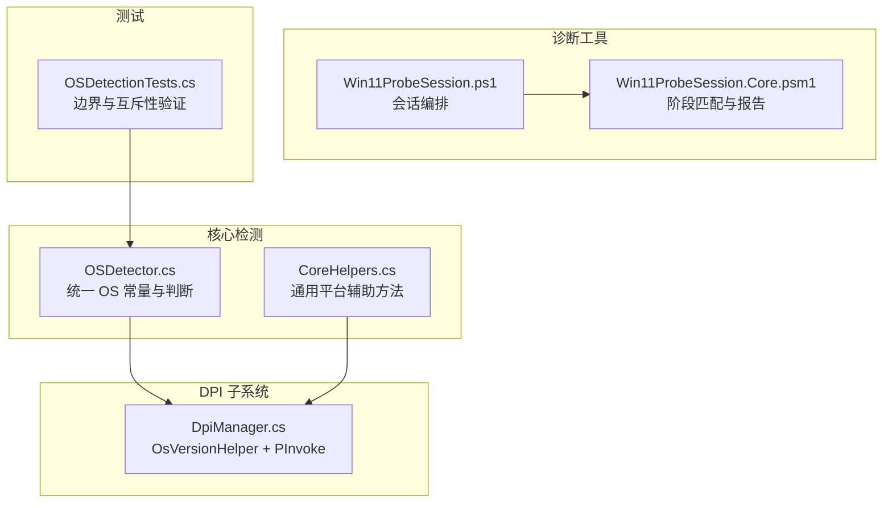
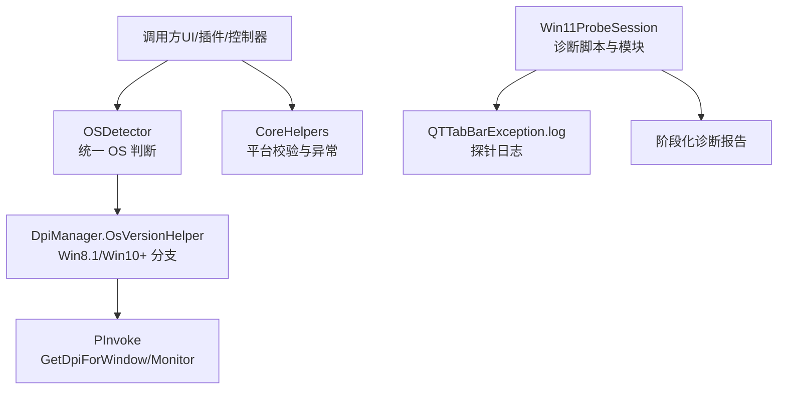
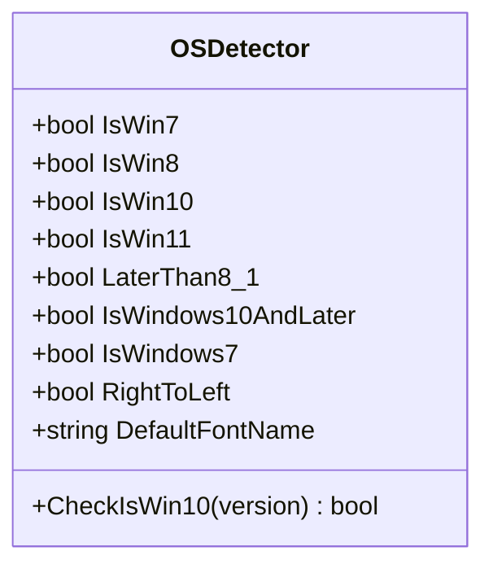
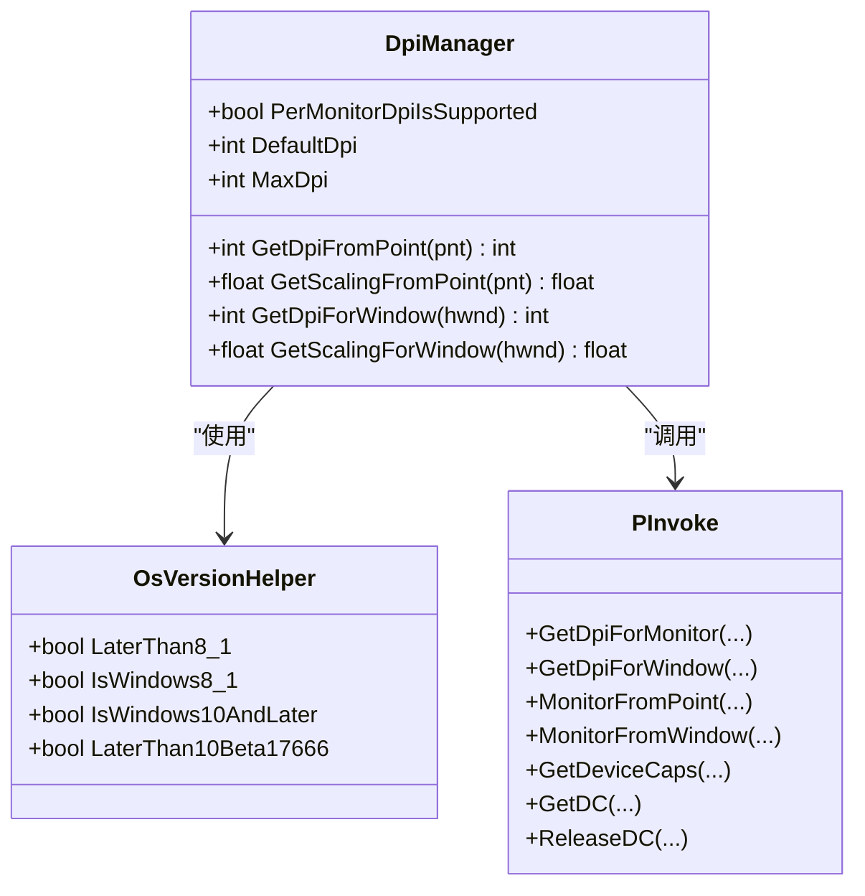
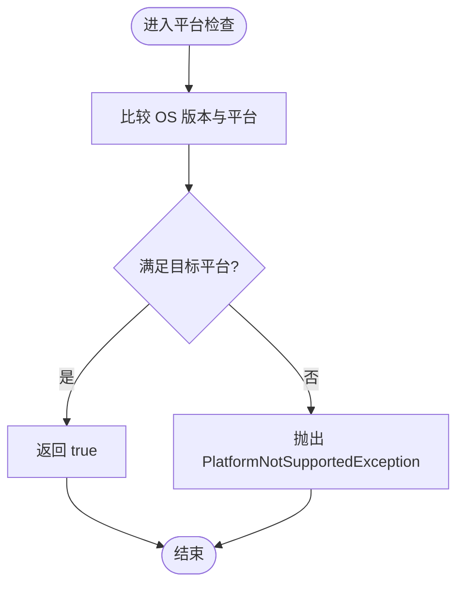
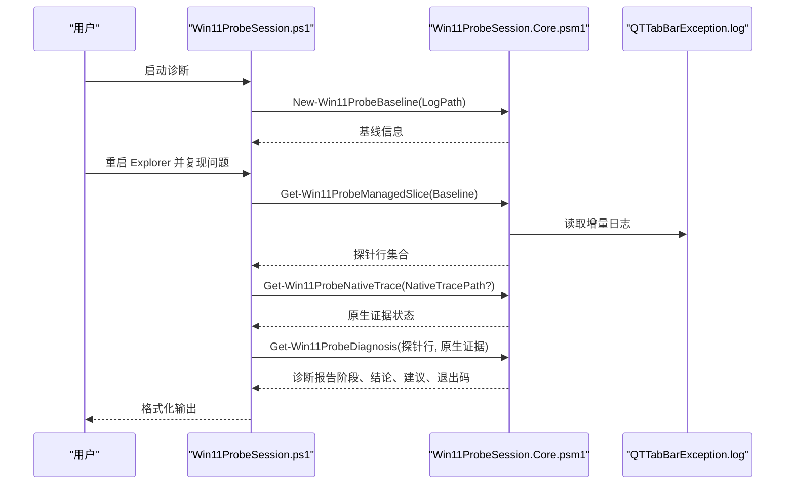
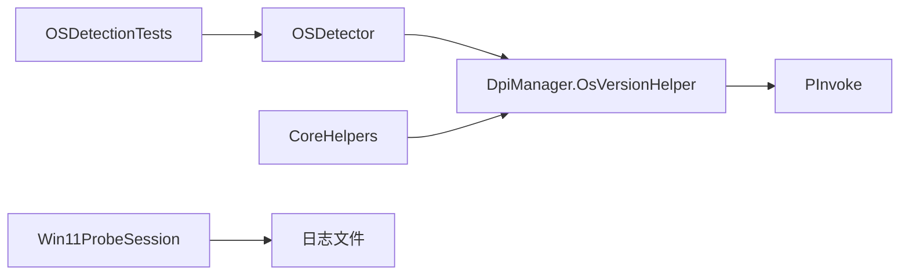

# 操作系统检测服务

<cite>
**本文引用的文件**   
- [OSDetector.cs](file://QTTabBar/OSDetector.cs)
- [DpiManager.cs](file://BandObjectLib/Dpi/DpiManager.cs)
- [CoreHelpers.cs](file://QTTabBar/Common/CoreHelpers.cs)
- [OSDetectionTests.cs](file://Tests/QTTtabBarTests/OSDetectionTests.cs)
- [Win11ProbeSession.ps1](file://Tools/Win11ProbeSession.ps1)
- [Win11ProbeSession.Core.psm1](file://Tools/Win11ProbeSession.Core.psm1)
</cite>

## 目录
1. [简介](#简介)
2. [项目结构](#项目结构)
3. [核心组件](#核心组件)
4. [架构总览](#架构总览)
5. [详细组件分析](#详细组件分析)
6. [依赖关系分析](#依赖关系分析)
7. [性能考量](#性能考量)
8. [故障排查指南](#故障排查指南)
9. [结论](#结论)
10. [附录](#附录)

## 简介
本文件聚焦于“操作系统检测服务”，梳理并解释在 Windows 资源管理器扩展（QTTabBar）中用于识别当前运行系统版本、分支与构建号的检测能力。该服务由多个层次组成：
- 统一的 OS 常量与判断入口（集中式静态类）
- DPI 子系统对 Win8.1/Win10+ 的差异化支持
- 通用平台辅助方法（Vista/Win7/XP 判定与异常抛出）
- 针对 Windows 11 的诊断工具链（日志探针与阶段化诊断）
- 单元测试覆盖关键边界条件（如 Win10 vs Win11 互斥性）

通过上述分层，系统在兼容性、可维护性与可观测性之间取得平衡，既保证在不同 Windows 版本上的行为正确，又便于定位复杂问题。

## 项目结构
围绕“操作系统检测”的相关代码主要分布在以下位置：
- QTTabBar/OSDetector.cs：统一提供 OS 版本常量与判断方法
- BandObjectLib/Dpi/DpiManager.cs：DPI 相关功能中对 OS 版本的探测与分支逻辑
- QTTabBar/Common/CoreHelpers.cs：通用平台辅助方法（Vista/Win7/XP 判定）
- Tests/QTTtabBarTests/OSDetectionTests.cs：针对 CheckIsWin10 等方法的测试用例
- Tools/Win11ProbeSession.ps1 与 Core.psm1：Windows 11 诊断脚本与模块，基于日志探针进行阶段化诊断

图表来源
- [OSDetector.cs:1-49](file://QTTabBar/OSDetector.cs#L1-L49)
- [DpiManager.cs:159-207](file://BandObjectLib/Dpi/DpiManager.cs#L159-L207)
- [CoreHelpers.cs:12-38](file://QTTabBar/Common/CoreHelpers.cs#L12-L38)
- [Win11ProbeSession.ps1:1-45](file://Tools/Win11ProbeSession.ps1#L1-L45)
- [Win11ProbeSession.Core.psm1:97-214](file://Tools/Win11ProbeSession.Core.psm1#L97-L214)
- [OSDetectionTests.cs:10-68](file://Tests/QTTtabBarTests/OSDetectionTests.cs#L10-L68)

章节来源
- [OSDetector.cs:1-49](file://QTTabBar/OSDetector.cs#L1-L49)
- [DpiManager.cs:159-207](file://BandObjectLib/Dpi/DpiManager.cs#L159-L207)
- [CoreHelpers.cs:12-38](file://QTTabBar/Common/CoreHelpers.cs#L12-L38)
- [OSDetectionTests.cs:10-68](file://Tests/QTTtabBarTests/OSDetectionTests.cs#L10-L68)
- [Win11ProbeSession.ps1:1-45](file://Tools/Win11ProbeSession.ps1#L1-L45)
- [Win11ProbeSession.Core.psm1:97-214](file://Tools/Win11ProbeSession.Core.psm1#L97-L214)

## 核心组件
- OSDetector：集中定义 IsWin7/IsWin8/IsWin10/IsWin11/LaterThan8_1 等布尔常量，以及 CheckIsWin10 方法；同时提供区域设置与默认字体选择等衍生常量。
- OsVersionHelper（位于 DpiManager 内部）：为 DPI 子系统提供 LaterThan8_1、IsWindows10AndLater、LaterThan10Beta17666 等判断，封装了 GetDpiForWindow/GetDpiForMonitor 等调用。
- CoreHelpers：提供 RunningOnVista、RunningOnWin7、RunningOnXP 等方法，并在不满足平台要求时抛出 PlatformNotSupportedException。
- Win11 诊断工具：通过 PowerShell 脚本与模块解析日志中的探针标记，按阶段输出诊断结果与下一步建议。
- 单元测试：覆盖 CheckIsWin10 在 Win10/Win11/Win7/Win8 及兼容版本下的真假值，确保 IsWin10 与 IsWin11 互斥。

章节来源
- [OSDetector.cs:8-46](file://QTTabBar/OSDetector.cs#L8-L46)
- [DpiManager.cs:159-207](file://BandObjectLib/Dpi/DpiManager.cs#L159-L207)
- [CoreHelpers.cs:12-38](file://QTTabBar/Common/CoreHelpers.cs#L12-L38)
- [Win11ProbeSession.ps1:12-33](file://Tools/Win11ProbeSession.ps1#L12-L33)
- [Win11ProbeSession.Core.psm1:97-214](file://Tools/Win11ProbeSession.Core.psm1#L97-L214)
- [OSDetectionTests.cs:10-68](file://Tests/QTTtabBarTests/OSDetectionTests.cs#L10-L68)

## 架构总览
下图展示了“操作系统检测服务”的整体结构与交互关系：上层业务与 UI 通过 OSDetector 获取 OS 信息；DPI 子系统使用 OsVersionHelper 决定 API 路径；诊断工具读取运行时日志，结合阶段化探针给出结论与建议。

图表来源
- [OSDetector.cs:8-46](file://QTTabBar/OSDetector.cs#L8-L46)
- [DpiManager.cs:159-207](file://BandObjectLib/Dpi/DpiManager.cs#L159-L207)
- [Win11ProbeSession.ps1:12-33](file://Tools/Win11ProbeSession.ps1#L12-L33)
- [Win11ProbeSession.Core.psm1:97-214](file://Tools/Win11ProbeSession.Core.psm1#L97-L214)

## 详细组件分析

### OSDetector 组件
- 职责
  - 提供跨模块一致的 OS 版本常量（Win7/8/10/11、是否大于等于某版本、RTL 语言环境等）。
  - 提供 CheckIsWin10 方法，明确区分 Win10 与 Win11（以 Build 22000 为界），避免误判。
- 关键实现要点
  - 使用 Environment.OSVersion.Version 比较 Major/Minor/Build。
  - 将 IsWin11 定义为 Major==10 且 Build>=22000；CheckIsWin10 排除 Build>=22000 的情况。
  - 提供 IsWindows10AndLater、LaterThan8_1 等组合谓词，简化上层判断。
- 复杂度与性能
  - 所有判断均为 O(1) 的整数比较，无 I/O 或反射开销。
- 错误处理
  - 不涉及外部资源访问，无需额外异常处理。
- 优化建议
  - 若未来需要更细粒度的特性开关，可在 OSDetector 中新增特性级常量（例如特定 API 可用性）。

图表来源
- [OSDetector.cs:8-46](file://QTTabBar/OSDetector.cs#L8-L46)

章节来源
- [OSDetector.cs:8-46](file://QTTabBar/OSDetector.cs#L8-L46)

### DpiManager 与 OsVersionHelper
- 职责
  - 根据 OS 版本选择 DPI 获取策略：优先使用 GetDpiForWindow（Win10+），回退到 GetDpiForMonitor，再回退到 GDI GetDeviceCaps。
  - 暴露 PerMonitorDpiIsSupported、DefaultDpi、MaxDpi 等属性，供 UI 缩放计算。
- 关键实现要点
  - OsVersionHelper.LaterThan8_1 控制是否启用每显示器 DPI。
  - IsWindows10AndLater 用于决定是否尝试 GetDpiForWindow。
  - 通过 PInvoke 调用 Shcore.dll 与 user32.dll 的函数。
- 复杂度与性能
  - 首次调用可能触发 PInvoke 与系统查询，后续可通过缓存属性减少重复调用。
- 错误处理
  - 对 GetDpiForWindow 调用进行 try/catch 保护，失败则回退。
- 优化建议
  - 可将常用 DPI 值缓存至实例或全局缓存，避免频繁系统调用。

图表来源
- [DpiManager.cs:25-157](file://BandObjectLib/Dpi/DpiManager.cs#L25-L157)
- [DpiManager.cs:159-207](file://BandObjectLib/Dpi/DpiManager.cs#L159-L207)
- [DpiManager.cs:209-242](file://BandObjectLib/Dpi/DpiManager.cs#L209-L242)

章节来源
- [DpiManager.cs:25-157](file://BandObjectLib/Dpi/DpiManager.cs#L25-L157)
- [DpiManager.cs:159-207](file://BandObjectLib/Dpi/DpiManager.cs#L159-L207)
- [DpiManager.cs:209-242](file://BandObjectLib/Dpi/DpiManager.cs#L209-L242)

### CoreHelpers 组件
- 职责
  - 提供 RunningOnVista、RunningOnWin7、RunningOnXP 等平台检测方法。
  - 在不满足平台要求时抛出 PlatformNotSupportedException，帮助快速失败。
- 关键实现要点
  - 使用 Environment.OSVersion.Platform 与 Version 比较。
  - 提供 ThrowIfNotVista/ThrowIfNotWin7/ThrowIfNotXP 便捷方法。
- 复杂度与性能
  - O(1) 判断，无外部依赖。
- 错误处理
  - 通过异常表达平台不满足情况，调用方可据此降级或提示。

图表来源
- [CoreHelpers.cs:12-38](file://QTTabBar/Common/CoreHelpers.cs#L12-L38)
- [CoreHelpers.cs:74-98](file://QTTabBar/Common/CoreHelpers.cs#L74-L98)

章节来源
- [CoreHelpers.cs:12-38](file://QTTabBar/Common/CoreHelpers.cs#L12-L38)
- [CoreHelpers.cs:74-98](file://QTTabBar/Common/CoreHelpers.cs#L74-L98)

### Windows 11 诊断流程（Win11ProbeSession）
- 职责
  - 采集基线日志，等待用户复现后对比增量日志，提取“探针行”。
  - 将探针行与预定义阶段模式匹配，生成诊断结论与下一步建议。
- 关键实现要点
  - 阶段列表包含：BHO 进入、BrowserBar 请求、Attach 流程进入、IShellBrowser 查询、原生钩子请求与结果、钩子后继续执行等。
  - 解析原生钩子返回码，非零即视为失败。
  - 根据命中阶段与缺失阶段推断置信度与退出码。
- 复杂度与性能
  - 主要开销为日志读取与正则匹配，通常轻量。
- 错误处理
  - 当日志不存在或缩小时报错；未提供原生追踪时标注“不可用”。

图表来源
- [Win11ProbeSession.ps1:12-33](file://Tools/Win11ProbeSession.ps1#L12-L33)
- [Win11ProbeSession.Core.psm1:20-75](file://Tools/Win11ProbeSession.Core.psm1#L20-L75)
- [Win11ProbeSession.Core.psm1:97-214](file://Tools/Win11ProbeSession.Core.psm1#L97-L214)

章节来源
- [Win11ProbeSession.ps1:12-33](file://Tools/Win11ProbeSession.ps1#L12-L33)
- [Win11ProbeSession.Core.psm1:20-75](file://Tools/Win11ProbeSession.Core.psm1#L20-L75)
- [Win11ProbeSession.Core.psm1:97-214](file://Tools/Win11ProbeSession.Core.psm1#L97-L214)

### 单元测试：CheckIsWin10 与互斥性
- 覆盖场景
  - Win11 高构建号不应被识别为 Win10。
  - Win10 不同构建号应被识别为 Win10。
  - Win7/Win8 不应被识别为 Win10。
  - 兼容模式下 6.4 应被视为 Win10。
  - IsWin10 与 IsWin11 互斥。
- 价值
  - 保障关键分支逻辑的正确性与稳定性，防止回归。

章节来源
- [OSDetectionTests.cs:10-68](file://Tests/QTTtabBarTests/OSDetectionTests.cs#L10-L68)

## 依赖关系分析
- OSDetector 作为统一入口，被多处消费（包括 UI、控制器、DPI 子系统间接使用）。
- DpiManager 依赖 OsVersionHelper 来决定 API 路径，并通过 PInvoke 与系统交互。
- CoreHelpers 独立于其他检测组件，提供通用平台校验。
- Win11 诊断工具与运行时日志解耦，仅依赖日志格式与探针约定。

图表来源
- [OSDetector.cs:8-46](file://QTTabBar/OSDetector.cs#L8-L46)
- [DpiManager.cs:159-207](file://BandObjectLib/Dpi/DpiManager.cs#L159-L207)
- [CoreHelpers.cs:12-38](file://QTTabBar/Common/CoreHelpers.cs#L12-L38)
- [Win11ProbeSession.ps1:12-33](file://Tools/Win11ProbeSession.ps1#L12-L33)
- [OSDetectionTests.cs:10-68](file://Tests/QTTtabBarTests/OSDetectionTests.cs#L10-L68)

章节来源
- [OSDetector.cs:8-46](file://QTTabBar/OSDetector.cs#L8-L46)
- [DpiManager.cs:159-207](file://BandObjectLib/Dpi/DpiManager.cs#L159-L207)
- [CoreHelpers.cs:12-38](file://QTTabBar/Common/CoreHelpers.cs#L12-L38)
- [Win11ProbeSession.ps1:12-33](file://Tools/Win11ProbeSession.ps1#L12-L33)
- [OSDetectionTests.cs:10-68](file://Tests/QTTtabBarTests/OSDetectionTests.cs#L10-L68)

## 性能考量
- 所有 OS 判断均为常数时间操作，不会引入明显延迟。
- DPI 子系统在首次获取 DPI 时会进行系统调用，建议在应用生命周期内复用结果，避免频繁查询。
- 诊断脚本仅在排障时运行，日志读取与匹配开销可控。

## 故障排查指南
- 现象：Win11 上某些功能未按预期工作
  - 步骤：
    1) 运行诊断脚本，记录基线日志。
    2) 重启 Explorer 并复现问题。
    3) 再次运行脚本，查看阶段匹配与诊断结论。
    4) 若原生钩子返回码非零，检查 HookLib 加载与初始化过程。
- 现象：DPI 缩放异常
  - 步骤：
    1) 确认 PerMonitorDpiIsSupported 是否为真（取决于 OS 版本）。
    2) 检查 GetDpiForWindow 是否可用，必要时回退到 GetDpiForMonitor。
    3) 观察 DefaultDpi/MaxDpi 是否符合预期。
- 现象：平台不支持导致崩溃
  - 步骤：
    1) 使用 CoreHelpers 的 ThrowIfNot* 方法进行前置校验。
    2) 捕获 PlatformNotSupportedException 并给出友好提示或降级方案。

章节来源
- [Win11ProbeSession.ps1:12-33](file://Tools/Win11ProbeSession.ps1#L12-L33)
- [Win11ProbeSession.Core.psm1:97-214](file://Tools/Win11ProbeSession.Core.psm1#L97-L214)
- [DpiManager.cs:25-157](file://BandObjectLib/Dpi/DpiManager.cs#L25-L157)
- [CoreHelpers.cs:74-98](file://QTTabBar/Common/CoreHelpers.cs#L74-L98)

## 结论
“操作系统检测服务”通过集中化的版本判断、清晰的 DPI 分支策略、严格的平台校验与完善的诊断工具链，实现了跨 Windows 版本的稳定运行与高效排障。单元测试保障了关键分支的正确性，而诊断脚本提供了从日志到结论的闭环能力。建议在未来持续完善特性级常量与缓存策略，进一步提升可维护性与性能。

## 附录
- 术语
  - 探针：在关键路径写入的固定文本标记，便于诊断脚本匹配阶段。
  - 阶段：诊断流程中的关键节点，如 BHO 进入、BrowserBar 请求、Attach 流程等。
- 参考
  - 诊断脚本入口：[Win11ProbeSession.ps1](file://Tools/Win11ProbeSession.ps1)
  - 诊断模块：[Win11ProbeSession.Core.psm1](file://Tools/Win11ProbeSession.Core.psm1)
  - 统一检测入口：[OSDetector.cs](file://QTTabBar/OSDetector.cs)
  - DPI 子系统：[DpiManager.cs](file://BandObjectLib/Dpi/DpiManager.cs)
  - 平台辅助：[CoreHelpers.cs](file://QTTabBar/Common/CoreHelpers.cs)
  - 测试用例：[OSDetectionTests.cs](file://Tests/QTTtabBarTests/OSDetectionTests.cs)