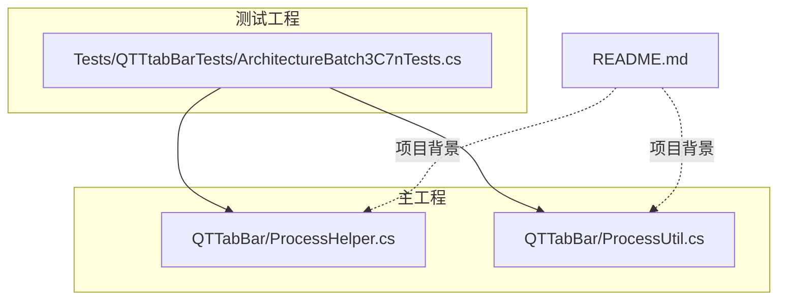
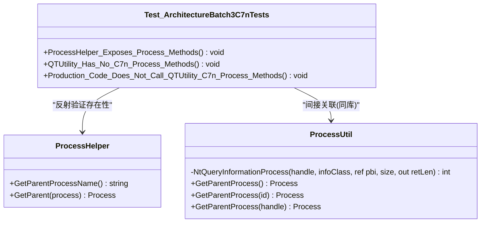
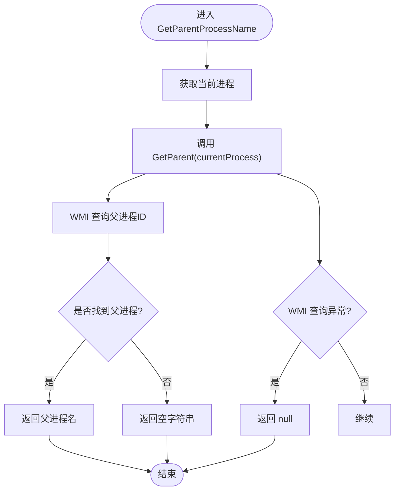
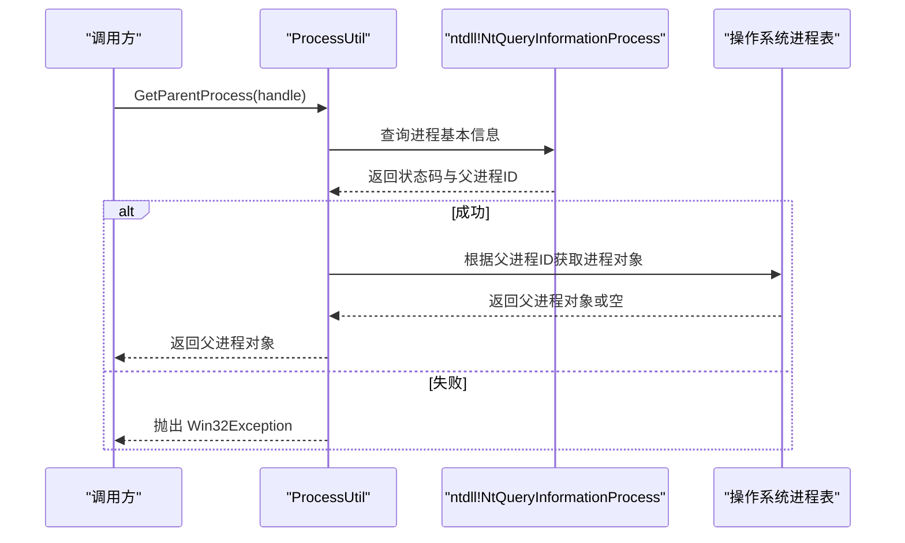
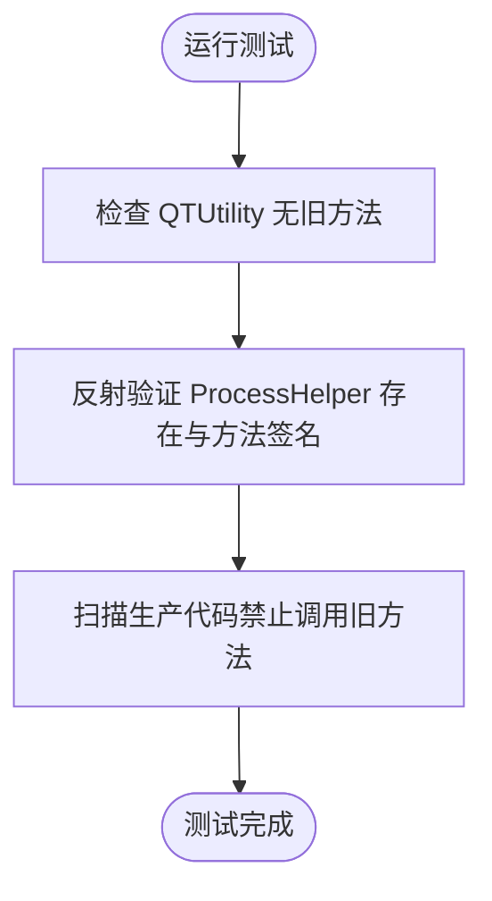
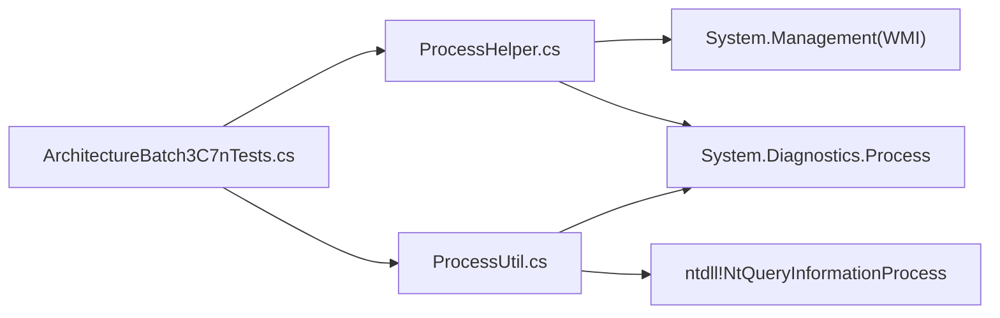

# 进程管理辅助类

<cite>
**本文引用的文件**   
- [ProcessHelper.cs](file://QTTabBar/ProcessHelper.cs)
- [ProcessUtil.cs](file://QTTabBar/ProcessUtil.cs)
- [ArchitectureBatch3C7nTests.cs](file://Tests/QTTtabBarTests/ArchitectureBatch3C7nTests.cs)
- [README.md](file://README.md)
</cite>

## 目录
1. [简介](#简介)
2. [项目结构](#项目结构)
3. [核心组件](#核心组件)
4. [架构总览](#架构总览)
5. [详细组件分析](#详细组件分析)
6. [依赖关系分析](#依赖关系分析)
7. [性能与可靠性考虑](#性能与可靠性考虑)
8. [故障排查指南](#故障排查指南)
9. [结论](#结论)
10. [附录](#附录)

## 简介
本文件聚焦于 QTTabBar-Next 中的“进程管理辅助类”，主要覆盖两个用于获取父进程的辅助实现：
- 基于 WMI 的托管实现（ProcessHelper）
- 基于未公开 NT API 的高性能实现（ProcessUtil）

这些工具在重构过程中从通用工具类中剥离，形成独立、职责单一的模块，便于测试与维护。

## 项目结构
与进程管理相关的代码位于主工程 QTTabBar 下，测试用例位于 Tests 目录。整体结构如下：
- 进程辅助实现：QTTabBar/ProcessHelper.cs、QTTabBar/ProcessUtil.cs
- 架构回归测试：Tests/QTTtabBarTests/ArchitectureBatch3C7nTests.cs
- 项目说明：README.md

图表来源
- [ProcessHelper.cs:1-31](file://QTTabBar/ProcessHelper.cs#L1-L31)
- [ProcessUtil.cs:1-72](file://QTTabBar/ProcessUtil.cs#L1-L72)
- [ArchitectureBatch3C7nTests.cs:1-69](file://Tests/QTTtabBarTests/ArchitectureBatch3C7nTests.cs#L1-L69)
- [README.md:1-60](file://README.md#L1-L60)

章节来源
- [README.md:1-60](file://README.md#L1-L60)

## 核心组件
- ProcessHelper：提供基于 WMI 的父进程查询能力，返回父进程名或父进程对象；对异常进行吞并处理，保证调用方稳定。
- ProcessUtil：通过 NtQueryInformationProcess 直接读取内核态信息，性能更高，适合频繁调用场景；失败时抛出 Win32Exception。

章节来源
- [ProcessHelper.cs:1-31](file://QTTabBar/ProcessHelper.cs#L1-L31)
- [ProcessUtil.cs:1-72](file://QTTabBar/ProcessUtil.cs#L1-L72)

## 架构总览
两个组件均围绕“获取父进程”这一目标，但采用不同技术路径：
- ProcessHelper 使用 System.Management 访问 WMI，跨平台友好度更高（在当前 Windows 环境下），但开销较大。
- ProcessUtil 直接调用 ntdll!NtQueryInformationProcess，避免 WMI 开销，但属于非公开接口，需关注兼容性与权限。

图表来源
- [ProcessHelper.cs:1-31](file://QTTabBar/ProcessHelper.cs#L1-L31)
- [ProcessUtil.cs:1-72](file://QTTabBar/ProcessUtil.cs#L1-L72)
- [ArchitectureBatch3C7nTests.cs:1-69](file://Tests/QTTtabBarTests/ArchitectureBatch3C7nTests.cs#L1-L69)

## 详细组件分析

### ProcessHelper 分析
- 设计要点
  - GetParentProcessName：获取当前进程父进程名称，若不可用则返回空字符串。
  - GetParent(Process)：通过 WMI 查询指定进程的父进程 ID，再反查为 Process 实例；捕获异常并返回 null，确保上层稳定。
- 复杂度与成本
  - 每次调用会发起 WMI 查询，涉及系统服务通信，延迟较高，不适合高频调用。
- 错误处理
  - 内部 try/catch 吞掉异常，对外暴露安全返回值（null 或空串）。
- 适用场景
  - 低频诊断、启动阶段一次性判断等。

图表来源
- [ProcessHelper.cs:7-28](file://QTTabBar/ProcessHelper.cs#L7-L28)

章节来源
- [ProcessHelper.cs:1-31](file://QTTabBar/ProcessHelper.cs#L1-L31)

### ProcessUtil 分析
- 设计要点
  - 定义与 PROCESS_BASIC_INFORMATION 对应的结构体，包含 InheritedFromUniqueProcessId 字段。
  - 通过 P/Invoke 调用 ntdll!NtQueryInformationProcess，以最小开销获取父进程 ID，再转换为 Process 对象。
  - 提供三种重载：按当前进程、按进程 ID、按进程句柄。
- 复杂度与成本
  - 直接内核调用，开销极低，适合高频或热路径。
- 错误处理
  - 当 NtQueryInformationProcess 返回非零状态码时抛出 Win32Exception；若父进程已退出导致找不到对应进程，返回 null。
- 风险与兼容性
  - 使用未公开 API，未来版本可能变更行为；需要谨慎评估升级影响。

图表来源
- [ProcessUtil.cs:23-69](file://QTTabBar/ProcessUtil.cs#L23-L69)

章节来源
- [ProcessUtil.cs:1-72](file://QTTabBar/ProcessUtil.cs#L1-L72)

### 架构回归测试（C7n）
- 目的
  - 验证从 QTUtility 迁移出的进程相关方法不再存在于公共 API，且新模块 ProcessHelper 暴露所需方法。
- 关键断言
  - QTUtility 不应再包含 GetParentProcessName、GetParent 等公共静态方法。
  - ProcessHelper 类型与方法应可通过反射发现。
  - 生产代码不得再调用 QTUtility 中被移除的方法。

图表来源
- [ArchitectureBatch3C7nTests.cs:10-55](file://Tests/QTTtabBarTests/ArchitectureBatch3C7nTests.cs#L10-L55)

章节来源
- [ArchitectureBatch3C7nTests.cs:1-69](file://Tests/QTTtabBarTests/ArchitectureBatch3C7nTests.cs#L1-L69)

## 依赖关系分析
- ProcessHelper
  - 依赖 System.Diagnostics.Process、System.Linq、System.Management（WMI）。
  - 优点：API 稳定、易读；缺点：WMI 开销大。
- ProcessUtil
  - 依赖 System.Runtime.InteropServices、System.Diagnostics.Process、ntdll.dll 未公开函数。
  - 优点：高性能；缺点：非公开接口，潜在兼容风险。
- 测试
  - 通过反射与源码扫描验证迁移正确性，不引入运行时耦合。

图表来源
- [ProcessHelper.cs:1-31](file://QTTabBar/ProcessHelper.cs#L1-L31)
- [ProcessUtil.cs:1-72](file://QTTabBar/ProcessUtil.cs#L1-L72)
- [ArchitectureBatch3C7nTests.cs:1-69](file://Tests/QTTtabBarTests/ArchitectureBatch3C7nTests.cs#L1-L69)

章节来源
- [ProcessHelper.cs:1-31](file://QTTabBar/ProcessHelper.cs#L1-L31)
- [ProcessUtil.cs:1-72](file://QTTabBar/ProcessUtil.cs#L1-L72)
- [ArchitectureBatch3C7nTests.cs:1-69](file://Tests/QTTtabBarTests/ArchitectureBatch3C7nTests.cs#L1-L69)

## 性能与可靠性考虑
- 性能对比
  - ProcessUtil 直接内核调用，延迟低，适合热路径。
  - ProcessHelper 走 WMI，延迟高，仅建议低频使用。
- 可靠性
  - ProcessHelper 内部吞异常，对外更稳健。
  - ProcessUtil 失败时抛异常，调用方可据此快速失败或降级。
- 选择建议
  - 初始化阶段或诊断场景：优先 ProcessHelper。
  - 高频路径或性能敏感场景：优先 ProcessUtil，并做好异常与降级处理。

[本节为通用指导，无需特定文件引用]

## 故障排查指南
- 现象：调用 ProcessUtil.GetParentProcess 抛出异常
  - 可能原因：权限不足、目标进程不存在、NT API 返回错误码。
  - 建议：捕获 Win32Exception，记录状态码与上下文；必要时回退到 ProcessHelper。
- 现象：调用 ProcessHelper.GetParentProcessName 返回空字符串
  - 可能原因：WMI 查询失败、父进程已退出、权限受限。
  - 建议：检查 WMI 服务可用性；增加重试与日志；确认运行环境权限。
- 现象：单元测试失败
  - 可能原因：构建产物未更新、反射路径变化、源码扫描路径不正确。
  - 建议：清理重建；确认测试工程引用最新主工程输出；核对仓库根定位逻辑。

章节来源
- [ProcessUtil.cs:54-69](file://QTTabBar/ProcessUtil.cs#L54-L69)
- [ProcessHelper.cs:14-28](file://QTTabBar/ProcessHelper.cs#L14-L28)
- [ArchitectureBatch3C7nTests.cs:23-55](file://Tests/QTTtabBarTests/ArchitectureBatch3C7nTests.cs#L23-L55)

## 结论
- 将进程父进程查询从通用工具类中拆分，提升了内聚性与可测试性。
- 提供两种实现以满足不同场景：ProcessHelper 强调稳定性与易用性，ProcessUtil 强调性能。
- 配套架构测试确保迁移边界清晰，避免历史 API 被误用。

[本节为总结性内容，无需特定文件引用]

## 附录
- 构建与运行测试
  - 参考 README 中的构建与测试说明，使用 dotnet test 执行测试套件。

章节来源
- [README.md:26-40](file://README.md#L26-L40)