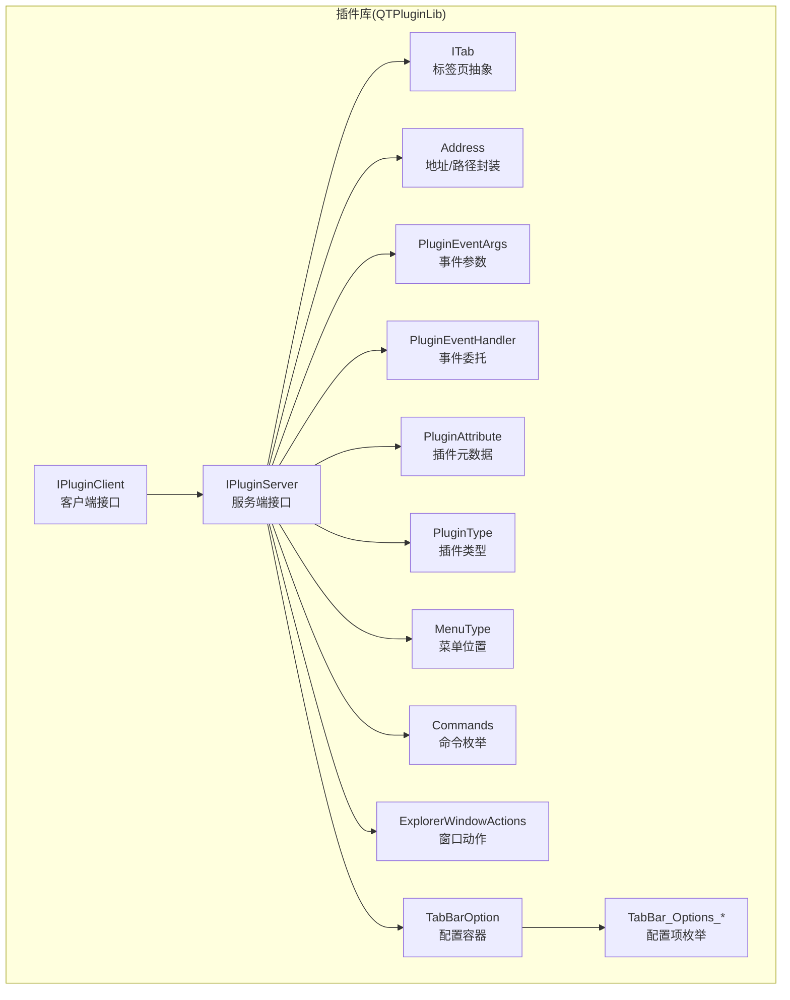
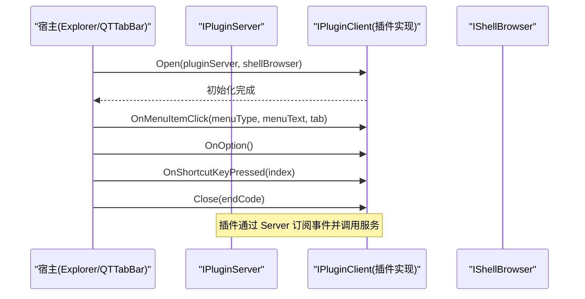
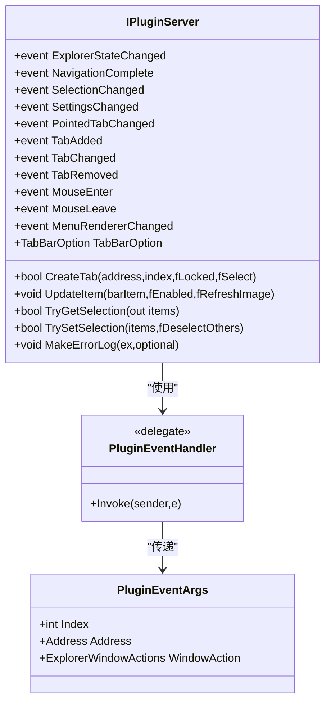
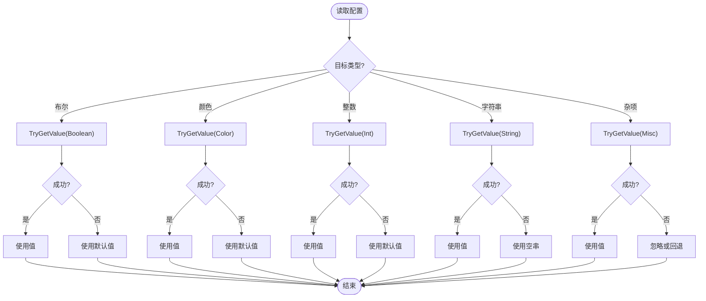
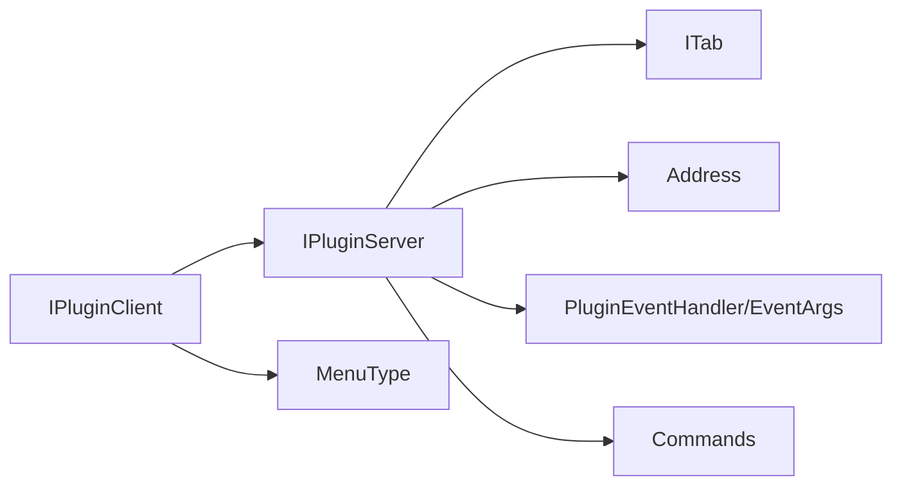

# 插件 API

<cite>
**本文引用的文件**   
- [IPluginClient.cs](file://QTPluginLib/IPluginClient.cs)
- [IPluginServer.cs](file://QTPluginLib/IPluginServer.cs)
- [ITab.cs](file://QTPluginLib/ITab.cs)
- [Address.cs](file://QTPluginLib/Address.cs)
- [PluginType.cs](file://QTPluginLib/PluginType.cs)
- [PluginEventArgs.cs](file://QTPluginLib/PluginEventArgs.cs)
- [PluginEventHandler.cs](file://QTPluginLib/PluginEventHandler.cs)
- [PluginAttribute.cs](file://QTPluginLib/PluginAttribute.cs)
- [MenuType.cs](file://QTPluginLib/MenuType.cs)
- [Commands.cs](file://QTPluginLib/Commands.cs)
- [ExplorerWindowActions.cs](file://QTPluginLib/ExplorerWindowActions.cs)
- [TabBarOption.cs](file://QTPluginLib/TabBarOption.cs)
- [TabBar_Options_Boolean.cs](file://QTPluginLib/TabBar_Options_Boolean.cs)
- [TabBar_Options_Color.cs](file://QTPluginLib/TabBar_Options_Color.cs)
- [TabBar_Options_Int.cs](file://QTPluginLib/TabBar_Options_Int.cs)
- [TabBar_Options_Misc.cs](file://QTPluginLib/TabBar_Options_Misc.cs)
- [TabBar_Options_String.cs](file://QTPluginLib/TabBar_Options_String.cs)
</cite>

## 目录
1. [简介](#简介)
2. [项目结构](#项目结构)
3. [核心组件](#核心组件)
4. [架构总览](#架构总览)
5. [详细组件分析](#详细组件分析)
6. [依赖关系分析](#依赖关系分析)
7. [性能考虑](#性能考虑)
8. [故障排查指南](#故障排查指南)
9. [结论](#结论)
10. [附录](#附录)

## 简介
本文件为 QTTabBar-Next 插件系统的完整 API 参考，面向插件开发者。内容覆盖：
- IPluginClient 接口与生命周期方法（Open、Close、OnMenuItemClick、OnOption 等）
- IPluginServer 接口提供的服务器端服务（文件系统操作、UI 交互、配置管理等）
- PluginType 枚举及各类插件特性
- 插件事件系统（PluginEventArgs、PluginEventHandler 及事件处理模式）
- 插件元数据定义与属性使用（PluginAttribute）
- 开发示例与调试建议
- 安全模型与权限控制说明

## 项目结构
插件相关 API 主要位于 QTPluginLib 库中，采用“接口 + 类型 + 事件”的清晰分层：
- 客户端接口：IPluginClient（插件实现侧）
- 服务端接口：IPluginServer（宿主提供）
- 领域对象：ITab、Address
- 事件体系：PluginEventArgs、PluginEventHandler
- 元数据与类型：PluginAttribute、PluginType、MenuType、Commands、ExplorerWindowActions
- 配置访问：TabBarOption 及其子选项枚举

图表来源
- [IPluginClient.cs:1-32](file://QTPluginLib/IPluginClient.cs#L1-L32)
- [IPluginServer.cs:1-78](file://QTPluginLib/IPluginServer.cs#L1-L78)
- [ITab.cs:1-41](file://QTPluginLib/ITab.cs#L1-L41)
- [Address.cs:1-41](file://QTPluginLib/Address.cs#L1-L41)
- [PluginEventArgs.cs:1-54](file://QTPluginLib/PluginEventArgs.cs#L1-L54)
- [PluginEventHandler.cs:1-21](file://QTPluginLib/PluginEventHandler.cs#L1-L21)
- [PluginAttribute.cs:1-65](file://QTPluginLib/PluginAttribute.cs#L1-L65)
- [PluginType.cs:1-26](file://QTPluginLib/PluginType.cs#L1-L26)
- [MenuType.cs:1-29](file://QTPluginLib/MenuType.cs#L1-L29)
- [Commands.cs:1-50](file://QTPluginLib/Commands.cs#L1-L50)
- [ExplorerWindowActions.cs:1-26](file://QTPluginLib/ExplorerWindowActions.cs#L1-L26)
- [TabBarOption.cs:1-114](file://QTPluginLib/TabBarOption.cs#L1-L114)
- [TabBar_Options_Boolean.cs:1-64](file://QTPluginLib/TabBar_Options_Boolean.cs#L1-L64)
- [TabBar_Options_Color.cs:1-28](file://QTPluginLib/TabBar_Options_Color.cs#L1-L28)
- [TabBar_Options_Int.cs:1-37](file://QTPluginLib/TabBar_Options_Int.cs#L1-L37)
- [TabBar_Options_Misc.cs:1-25](file://QTPluginLib/TabBar_Options_Misc.cs#L1-L25)
- [TabBar_Options_String.cs:1-27](file://QTPluginLib/TabBar_Options_String.cs#L1-L27)

章节来源
- [IPluginClient.cs:1-32](file://QTPluginLib/IPluginClient.cs#L1-L32)
- [IPluginServer.cs:1-78](file://QTPluginLib/IPluginServer.cs#L1-L78)
- [ITab.cs:1-41](file://QTPluginLib/ITab.cs#L1-L41)
- [Address.cs:1-41](file://QTPluginLib/Address.cs#L1-L41)
- [PluginEventArgs.cs:1-54](file://QTPluginLib/PluginEventArgs.cs#L1-L54)
- [PluginEventHandler.cs:1-21](file://QTPluginLib/PluginEventHandler.cs#L1-L21)
- [PluginAttribute.cs:1-65](file://QTPluginLib/PluginAttribute.cs#L1-L65)
- [PluginType.cs:1-26](file://QTPluginLib/PluginType.cs#L1-L26)
- [MenuType.cs:1-29](file://QTPluginLib/MenuType.cs#L1-L29)
- [Commands.cs:1-50](file://QTPluginLib/Commands.cs#L1-L50)
- [ExplorerWindowActions.cs:1-26](file://QTPluginLib/ExplorerWindowActions.cs#L1-L26)
- [TabBarOption.cs:1-114](file://QTPluginLib/TabBarOption.cs#L1-L114)
- [TabBar_Options_Boolean.cs:1-64](file://QTPluginLib/TabBar_Options_Boolean.cs#L1-L64)
- [TabBar_Options_Color.cs:1-28](file://QTPluginLib/TabBar_Options_Color.cs#L1-L28)
- [TabBar_Options_Int.cs:1-37](file://QTPluginLib/TabBar_Options_Int.cs#L1-L37)
- [TabBar_Options_Misc.cs:1-25](file://QTPluginLib/TabBar_Options_Misc.cs#L1-L25)
- [TabBar_Options_String.cs:1-27](file://QTPluginLib/TabBar_Options_String.cs#L1-L27)

## 核心组件
本节概述插件系统的关键接口与类型，帮助快速建立整体认知。

- IPluginClient（插件实现侧）
  - 生命周期：Open、Close
  - 用户交互：OnMenuItemClick、OnOption、OnShortcutKeyPressed
  - 快捷键声明：QueryShortcutKeys
  - 可选配置入口：HasOption

- IPluginServer（宿主提供）
  - 事件总线：ExplorerStateChanged、NavigationComplete、SelectionChanged、TabAdded/Changed/Removed、SettingsChanged、PointedTabChanged、MouseEnter/Leave、MenuRendererChanged
  - UI 与导航：CreateTab、CreateWindow、GetTabs、SelectedTab、HitTest、UpdateItem
  - 选择与浏览：TryGetSelection、TrySetSelection、ExecuteCommand
  - 应用与分组：AddApplication/RemoveApplication、GetApplications、AddGroup/RemoveGroup、GetGroupPaths、OpenGroup
  - 本地化：TryGetLocalizedStrings
  - 渲染器：GetMenuRenderer
  - 错误日志：MakeErrorLog
  - 句柄与配置：ExplorerHandle、Handle、TabBarOption

- 领域对象
  - ITab：标签页浏览、历史、克隆、关闭、插入、锁定、选中状态、文本与副标题
  - Address：Shell IDL 与路径的统一表示

- 事件系统
  - PluginEventHandler：统一的事件委托签名
  - PluginEventArgs：携带 Index、Address、WindowAction 等上下文

- 元数据与类型
  - PluginAttribute：作者、名称、版本、描述、插件类型；支持本地化提供者
  - PluginType：Interactive、Background、BackgroundMultiple、Static
  - MenuType：None、Tab、Bar、Both
  - Commands：内置命令集合
  - ExplorerWindowActions：窗口最大化/最小化/还原

- 配置访问
  - TabBarOption：以强类型方式读写布尔、颜色、整数、字符串与杂项配置
  - TabBar_Options_*：具体配置项枚举

章节来源
- [IPluginClient.cs:1-32](file://QTPluginLib/IPluginClient.cs#L1-L32)
- [IPluginServer.cs:1-78](file://QTPluginLib/IPluginServer.cs#L1-L78)
- [ITab.cs:1-41](file://QTPluginLib/ITab.cs#L1-L41)
- [Address.cs:1-41](file://QTPluginLib/Address.cs#L1-L41)
- [PluginEventArgs.cs:1-54](file://QTPluginLib/PluginEventArgs.cs#L1-L54)
- [PluginEventHandler.cs:1-21](file://QTPluginLib/PluginEventHandler.cs#L1-L21)
- [PluginAttribute.cs:1-65](file://QTPluginLib/PluginAttribute.cs#L1-L65)
- [PluginType.cs:1-26](file://QTPluginLib/PluginType.cs#L1-L26)
- [MenuType.cs:1-29](file://QTPluginLib/MenuType.cs#L1-L29)
- [Commands.cs:1-50](file://QTPluginLib/Commands.cs#L1-L50)
- [ExplorerWindowActions.cs:1-26](file://QTPluginLib/ExplorerWindowActions.cs#L1-L26)
- [TabBarOption.cs:1-114](file://QTPluginLib/TabBarOption.cs#L1-L114)
- [TabBar_Options_Boolean.cs:1-64](file://QTPluginLib/TabBar_Options_Boolean.cs#L1-L64)
- [TabBar_Options_Color.cs:1-28](file://QTPluginLib/TabBar_Options_Color.cs#L1-L28)
- [TabBar_Options_Int.cs:1-37](file://QTPluginLib/TabBar_Options_Int.cs#L1-L37)
- [TabBar_Options_Misc.cs:1-25](file://QTPluginLib/TabBar_Options_Misc.cs#L1-L25)
- [TabBar_Options_String.cs:1-27](file://QTPluginLib/TabBar_Options_String.cs#L1-L27)

## 架构总览
下图展示了插件在宿主中的基本交互：宿主通过 IPluginServer 向插件暴露能力，插件通过 IPluginClient 回调通知宿主其状态变化或请求操作。

图表来源
- [IPluginClient.cs:1-32](file://QTPluginLib/IPluginClient.cs#L1-L32)
- [IPluginServer.cs:1-78](file://QTPluginLib/IPluginServer.cs#L1-L78)

## 详细组件分析

### IPluginClient 接口详解
职责：插件需要实现的客户端接口，用于接收宿主的生命周期回调与用户交互事件，并向宿主注册菜单项、查询快捷键等。

- 生命周期
  - Open(IPluginServer pluginServer, IShellBrowser shellBrowser)
    - 作用：插件初始化入口，获取服务端能力与 Shell 浏览器实例
    - 时机：插件加载后由宿主调用一次
    - 注意：应在此处保存引用、订阅事件、构建 UI 资源
  - Close(EndCode endCode)
    - 作用：插件释放资源、取消订阅、清理状态
    - 时机：插件卸载或宿主退出时调用

- 用户交互
  - OnMenuItemClick(MenuType menuType, string menuText, ITab tab)
    - 作用：响应插件注册的菜单点击事件
    - 参数：menuType 指示菜单来源（标签栏/工具栏/两者），tab 为当前上下文标签
  - OnOption()
    - 作用：打开插件配置对话框（当 HasOption 为 true 时）
  - OnShortcutKeyPressed(int index)
    - 作用：响应自定义快捷键触发，index 对应 QueryShortcutKeys 返回的动作索引

- 快捷键
  - QueryShortcutKeys(out string[] actions)
    - 作用：声明插件支持的快捷键动作列表，供宿主显示与绑定

- 配置入口
  - HasOption
    - 作用：指示是否提供可配置的选项界面

章节来源
- [IPluginClient.cs:1-32](file://QTPluginLib/IPluginClient.cs#L1-L32)

### IPluginServer 接口详解
职责：宿主提供给插件的服务端接口，涵盖事件、UI 操作、选择与浏览、应用与分组管理、本地化、渲染器、错误日志与配置访问。

- 事件总线（推荐在 Open 中订阅，在 Close 中取消）
  - ExplorerStateChanged(ExplorerWindowActions)
  - NavigationComplete(Address)
  - SelectionChanged(Address[])
  - SettingsChanged
  - PointedTabChanged(ITab)
  - TabAdded/TabChanged/TabRemoved(ITab)
  - MouseEnter/MouseLeave
  - MenuRendererChanged

- UI 与导航
  - CreateTab(Address address, int index, bool fLocked, bool fSelect)
  - CreateWindow(Address address)
  - GetTabs() -> ITab[]
  - SelectedTab (get/set)
  - HitTest(Point pnt) -> ITab
  - UpdateItem(IBarButton barItem, bool fEnabled, bool fRefreshImage)

- 选择与浏览
  - TryGetSelection(out Address[] selectedItems)
  - TrySetSelection(Address[] itemsToSelect, bool fDeselectOthers)
  - ExecuteCommand(Commands command, object arg)

- 应用与分组
  - AddApplication(string name, ProcessStartInfo startInfo) / RemoveApplication(name) / GetApplications(name)
  - AddGroup(groupName, string[] paths) / RemoveGroup(groupName) / GetGroupPaths(groupName) / OpenGroup(string[] groupNames)

- 本地化与渲染
  - TryGetLocalizedStrings(IPluginClient pluginClient, int count, out string[] arrStrings)
  - GetMenuRenderer() -> ToolStripRenderer

- 错误日志
  - MakeErrorLog(Exception ex, string optional = null)

- 句柄与配置
  - ExplorerHandle / Handle
  - TabBarOption (get/set)

章节来源
- [IPluginServer.cs:1-78](file://QTPluginLib/IPluginServer.cs#L1-L78)

### ITab 与 Address
- ITab
  - 浏览与历史：Browse(Address)、Browse(bool fBack)、GetBraches()、GetHistory(bool fBack)
  - 生命周期：Clone(int index, bool fSelect)、Insert(int index)、Close()
  - 状态与标识：Index、Address、Locked、Selected、Text、SubText

- Address
  - 统一表示 Shell IDL 与路径
  - 构造：从 IntPtr(pidl)、string(path)、byte 等多种来源

章节来源
- [ITab.cs:1-41](file://QTPluginLib/ITab.cs#L1-L41)
- [Address.cs:1-41](file://QTPluginLib/Address.cs#L1-L41)

### 事件系统与处理模式
- 事件委托
  - PluginEventHandler(object sender, PluginEventArgs e)

- 事件参数
  - PluginEventArgs
    - 构造：基于 ExplorerWindowActions 或 (int index, Address address)
    - 属性：Index、Address、WindowAction

- 典型处理模式
  - 在 Open 中订阅 IPluginServer 事件
  - 在 Close 中取消订阅，避免内存泄漏
  - 对 UI 更新确保在宿主线程执行（通过宿主提供的渲染器或句柄）

图表来源
- [IPluginServer.cs:1-78](file://QTPluginLib/IPluginServer.cs#L1-L78)
- [PluginEventHandler.cs:1-21](file://QTPluginLib/PluginEventHandler.cs#L1-L21)
- [PluginEventArgs.cs:1-54](file://QTPluginLib/PluginEventArgs.cs#L1-L54)

章节来源
- [PluginEventHandler.cs:1-21](file://QTPluginLib/PluginEventHandler.cs#L1-L21)
- [PluginEventArgs.cs:1-54](file://QTPluginLib/PluginEventArgs.cs#L1-L54)

### 插件元数据与属性
- PluginAttribute
  - 字段：Author、Description、Name、Version、PluginType
  - 构造函数：
    - 直接指定类型与本地化提供者类型（自动填充 Author/Name/Description）
    - 直接指定 Name/Author/Version/Description
  - 用途：标记插件类，提供元数据与本地化信息

- PluginType
  - Interactive：交互式插件，通常拥有 UI 控件
  - Background：后台插件，无 UI，监听事件执行逻辑
  - BackgroundMultiple：可同时存在多个实例的后台插件
  - Static：静态插件，生命周期与宿主一致

章节来源
- [PluginAttribute.cs:1-65](file://QTPluginLib/PluginAttribute.cs#L1-L65)
- [PluginType.cs:1-26](file://QTPluginLib/PluginType.cs#L1-L26)

### 菜单与命令
- MenuType
  - None、Tab、Bar、Both
  - 用于区分菜单来源，配合 OnMenuItemClick 进行路由

- Commands
  - 内置命令：如 GoBack、GoForward、RefreshBrowser、CloseCurrentTab、ShowProperties、ReorderTabsBy* 等
  - 通过 ExecuteCommand 触发宿主行为

章节来源
- [MenuType.cs:1-29](file://QTPluginLib/MenuType.cs#L1-L29)
- [Commands.cs:1-50](file://QTPluginLib/Commands.cs#L1-L50)

### 配置系统（TabBarOption）
- TabBarOption
  - 提供强类型的 SetValue/TryGetValue 方法族，分别针对：
    - 布尔：TabBar_Options_Boolean
    - 颜色：TabBar_Options_Color
    - 整数：TabBar_Options_Int
    - 字符串：TabBar_Options_String
    - 杂项：TabBar_Options_Misc
  - 通过 IPluginServer.TabBarOption 读写宿主配置

图表来源
- [TabBarOption.cs:1-114](file://QTPluginLib/TabBarOption.cs#L1-L114)
- [TabBar_Options_Boolean.cs:1-64](file://QTPluginLib/TabBar_Options_Boolean.cs#L1-L64)
- [TabBar_Options_Color.cs:1-28](file://QTPluginLib/TabBar_Options_Color.cs#L1-L28)
- [TabBar_Options_Int.cs:1-37](file://QTPluginLib/TabBar_Options_Int.cs#L1-L37)
- [TabBar_Options_String.cs:1-27](file://QTPluginLib/TabBar_Options_String.cs#L1-L27)
- [TabBar_Options_Misc.cs:1-25](file://QTPluginLib/TabBar_Options_Misc.cs#L1-L25)

章节来源
- [TabBarOption.cs:1-114](file://QTPluginLib/TabBarOption.cs#L1-L114)
- [TabBar_Options_Boolean.cs:1-64](file://QTPluginLib/TabBar_Options_Boolean.cs#L1-L64)
- [TabBar_Options_Color.cs:1-28](file://QTPluginLib/TabBar_Options_Color.cs#L1-L28)
- [TabBar_Options_Int.cs:1-37](file://QTPluginLib/TabBar_Options_Int.cs#L1-L37)
- [TabBar_Options_String.cs:1-27](file://QTPluginLib/TabBar_Options_String.cs#L1-L27)
- [TabBar_Options_Misc.cs:1-25](file://QTPluginLib/TabBar_Options_Misc.cs#L1-L25)

## 依赖关系分析
- 耦合关系
  - IPluginClient 依赖 IPluginServer 与 ITab、Address、MenuType、Commands 等
  - IPluginServer 聚合大量宿主能力，作为插件唯一对外通道
  - 事件系统通过委托与参数解耦事件生产者与消费者
- 外部依赖
  - IShellBrowser：由宿主注入，用于与 Windows Shell 交互（在 Open 中传入）
- 潜在循环
  - 插件不应持有对宿主的强引用，仅通过 IPluginServer 间接访问，避免循环依赖

图表来源
- [IPluginClient.cs:1-32](file://QTPluginLib/IPluginClient.cs#L1-L32)
- [IPluginServer.cs:1-78](file://QTPluginLib/IPluginServer.cs#L1-L78)
- [ITab.cs:1-41](file://QTPluginLib/ITab.cs#L1-L41)
- [Address.cs:1-41](file://QTPluginLib/Address.cs#L1-L41)
- [PluginEventHandler.cs:1-21](file://QTPluginLib/PluginEventHandler.cs#L1-L21)
- [PluginEventArgs.cs:1-54](file://QTPluginLib/PluginEventArgs.cs#L1-L54)
- [MenuType.cs:1-29](file://QTPluginLib/MenuType.cs#L1-L29)
- [Commands.cs:1-50](file://QTPluginLib/Commands.cs#L1-L50)

章节来源
- [IPluginClient.cs:1-32](file://QTPluginLib/IPluginClient.cs#L1-L32)
- [IPluginServer.cs:1-78](file://QTPluginLib/IPluginServer.cs#L1-L78)
- [ITab.cs:1-41](file://QTPluginLib/ITab.cs#L1-L41)
- [Address.cs:1-41](file://QTPluginLib/Address.cs#L1-L41)
- [PluginEventHandler.cs:1-21](file://QTPluginLib/PluginEventHandler.cs#L1-L21)
- [PluginEventArgs.cs:1-54](file://QTPluginLib/PluginEventArgs.cs#L1-L54)
- [MenuType.cs:1-29](file://QTPluginLib/MenuType.cs#L1-L29)
- [Commands.cs:1-50](file://QTPluginLib/Commands.cs#L1-L50)

## 性能考虑
- 事件订阅与取消
  - 在 Open 中订阅，Close 中取消，避免长时间驻留导致内存泄漏
- UI 更新
  - 尽量批量更新 UI，减少频繁刷新；必要时使用宿主提供的渲染器
- 选择与浏览
  - TrySetSelection 与 Browse 可能触发宿主重绘，谨慎在高频事件中调用
- 配置读写
  - 使用强类型 TryGetValue 避免装箱拆箱与异常分支
- 本地化
  - TryGetLocalizedStrings 按需调用，避免重复分配

[本节为通用指导，不直接分析具体文件]

## 故障排查指南
- 常见问题
  - 未正确订阅/取消事件：导致内存泄漏或重复处理
  - 在非宿主线程更新 UI：可能导致崩溃或不可预期行为
  - 配置键不存在：使用 TryGetValue 的安全分支，避免异常
  - 菜单未注册：确认 RegisterMenu 调用与 MenuType 匹配
- 诊断手段
  - 使用 MakeErrorLog 记录异常堆栈与可选上下文
  - 利用 SelectedTab、GetTabs、HitTest 定位当前上下文
  - 通过 ExplorerHandle/Handle 辅助调试窗口消息

章节来源
- [IPluginServer.cs:1-78](file://QTPluginLib/IPluginServer.cs#L1-L78)

## 结论
本 API 文档系统化梳理了 QTTabBar-Next 插件系统的核心接口、事件机制、元数据与配置访问方式。遵循本文档的约定与最佳实践，可高效开发稳定、可维护且安全的插件。

[本节为总结性内容，不直接分析具体文件]

## 附录

### 插件开发示例（步骤式）
- 创建插件类并标注元数据
  - 使用 PluginAttribute 指定类型、名称、作者、版本与描述
- 实现 IPluginClient
  - Open：保存 IPluginServer 引用，订阅必要事件，构建 UI
  - OnMenuItemClick：根据 MenuType 与 menuText 路由到相应逻辑
  - OnOption：弹出配置界面（若 HasOption 为真）
  - QueryShortcutKeys：返回动作数组，供宿主绑定快捷键
  - Close：取消订阅，释放资源
- 使用 IPluginServer
  - 通过 CreateTab/CreateWindow 创建新标签或窗口
  - 通过 TryGetSelection/TrySetSelection 管理选择集
  - 通过 ExecuteCommand 触发宿主内置命令
  - 通过 TabBarOption 读写配置
  - 通过 MakeErrorLog 记录错误
- 本地化
  - 使用 TryGetLocalizedStrings 获取多语言字符串
- 发布与安装
  - 将编译产物放置于宿主可发现目录并按要求注册

[本节为概念性流程，不直接分析具体文件]

### 调试指南
- 启用日志
  - 在关键路径调用 MakeErrorLog，附带可选上下文信息
- 断点与输出
  - 在 Open/Close、事件回调、菜单点击处设置断点
- 上下文检查
  - 使用 SelectedTab、GetTabs、HitTest 验证当前上下文
- 配置校验
  - 使用 TryGetValue 打印实际值与默认值对比

[本节为概念性流程，不直接分析具体文件]

### 安全模型与权限控制
- 进程边界
  - 插件运行在宿主进程内，具备宿主授予的能力范围
- 能力边界
  - 所有对宿主能力的访问均通过 IPluginServer 暴露的方法，避免直接 COM 调用
- 输入校验
  - 对用户输入与外部数据严格校验，防止非法路径或参数
- 资源管理
  - 及时释放非托管资源，避免泄露
- 错误隔离
  - 捕获异常并通过 MakeErrorLog 上报，避免影响宿主稳定性

[本节为概念性说明，不直接分析具体文件]