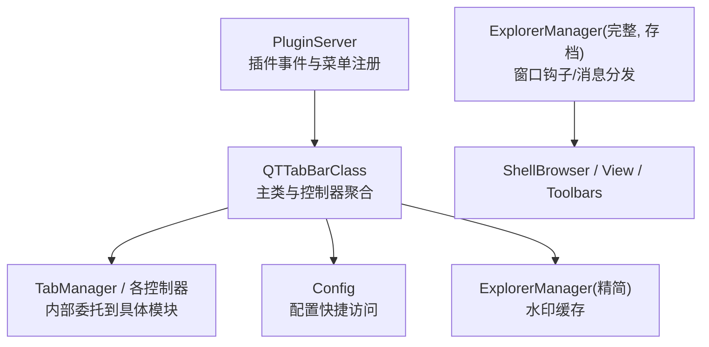
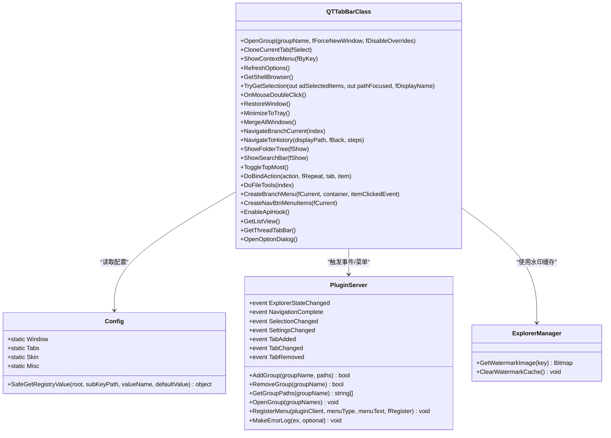
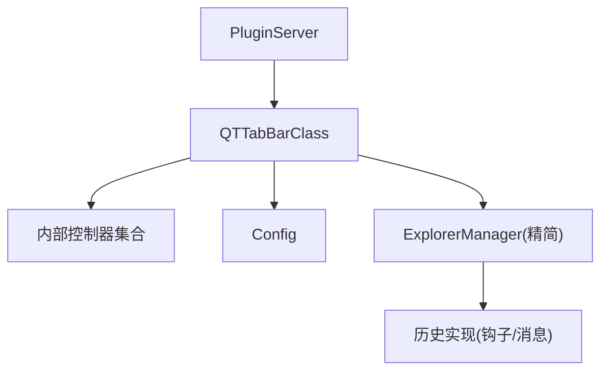

# 核心 API

<cite>
**本文引用的文件**   
- [QTTabBarClass.cs](file://QTTabBar/QTTabBarClass.cs)
- [Config.cs](file://QTTabBar/Config.cs)
- [ExplorerManager.cs](file://QTTabBar/ExplorerManager.cs)
- [ExplorerManager.full.cs](file://docs/archive/ExplorerManager.full.cs)
- [PluginServer.cs](file://QTTabBar/PluginServer.cs)
- [ConfigModels.cs](file://QTTabBar/ConfigModels.cs)
</cite>

## 目录
1. [简介](#简介)
2. [项目结构](#项目结构)
3. [核心组件](#核心组件)
4. [架构总览](#架构总览)
5. [详细组件分析](#详细组件分析)
6. [依赖关系分析](#依赖关系分析)
7. [性能与异步调用](#性能与异步调用)
8. [故障排查指南](#故障排查指南)
9. [结论](#结论)
10. [附录：常用场景与最佳实践](#附录常用场景与最佳实践)

## 简介
本参考文档聚焦于 QTTabBar-Next 的核心 API，面向插件开发者与二次集成者。重点覆盖以下方面：
- QTTabBarClass 类的公共方法与属性、事件（标签页管理、文件操作、配置访问等）
- Config 类的配置读写接口、数据类型支持与序列化机制
- ExplorerManager 提供的资源管理器集成能力（含历史实现与当前精简版）
- 参数说明、返回值类型、异常处理与代码示例路径
- 异步调用模式与回调机制
- 常见使用场景的最佳实践与性能优化建议

## 项目结构
围绕核心 API 的相关源码主要分布在如下位置：
- 主类入口与控制器聚合：QTTabBar/QTTabBarClass.cs
- 配置模型与快捷访问：QTTabBar/Config.cs、QTTabBar/ConfigModels.cs
- 资源管理器集成（精简版与历史完整版）：QTTabBar/ExplorerManager.cs、docs/archive/ExplorerManager.full.cs
- 插件服务与事件总线：QTTabBar/PluginServer.cs

图表来源
- [QTTabBarClass.cs:51-120](file://QTTabBar/QTTabBarClass.cs#L51-L120)
- [Config.cs:39-116](file://QTTabBar/Config.cs#L39-L116)
- [ExplorerManager.cs:8-20](file://QTTabBar/ExplorerManager.cs#L8-L20)
- [ExplorerManager.full.cs:145-210](file://docs/archive/ExplorerManager.full.cs#L145-L210)
- [PluginServer.cs:30-64](file://QTTabBar/PluginServer.cs#L30-L64)

章节来源
- [QTTabBarClass.cs:51-120](file://QTTabBar/QTTabBarClass.cs#L51-L120)
- [Config.cs:39-116](file://QTTabBar/Config.cs#L39-L116)
- [ExplorerManager.cs:8-20](file://QTTabBar/ExplorerManager.cs#L8-L20)
- [ExplorerManager.full.cs:145-210](file://docs/archive/ExplorerManager.full.cs#L145-L210)
- [PluginServer.cs:30-64](file://QTTabBar/PluginServer.cs#L30-L64)

## 核心组件
本节概述三大核心组件的职责与对外暴露的 API 面。

- QTTabBarClass
  - 作为 Shell Band 对象的主入口，聚合多个控制器（如 TabManager、ShellCommandController、WindowManagementController 等），提供标签页管理、导航、UI 控制、拖放、快捷键等能力。
  - 通过内部方法将调用转发给对应控制器，保持类职责清晰且可扩展。

- Config
  - 提供对配置对象的便捷静态访问（如 Window、Tabs、Skin 等）。
  - 包含安全读取注册表值的工具方法 SafeGetRegistryValue，具备完善的异常捕获与日志记录。

- ExplorerManager
  - 当前精简版仅暴露水印图像缓存相关方法。
  - 历史完整版位于 docs/archive/ExplorerManager.full.cs，负责窗口钩子、消息分发、视图同步、命令执行等复杂逻辑。

章节来源
- [QTTabBarClass.cs:51-120](file://QTTabBar/QTTabBarClass.cs#L51-L120)
- [Config.cs:39-116](file://QTTabBar/Config.cs#L39-L116)
- [ExplorerManager.cs:8-20](file://QTTabBar/ExplorerManager.cs#L8-L20)
- [ExplorerManager.full.cs:145-210](file://docs/archive/ExplorerManager.full.cs#L145-L210)

## 架构总览
下图展示核心组件之间的交互关系与数据流。

图表来源
- [QTTabBarClass.cs:228-237](file://QTTabBar/QTTabBarClass.cs#L228-L237)
- [QTTabBarClass.cs:279-287](file://QTTabBar/QTTabBarClass.cs#L279-L287)
- [QTTabBarClass.cs:573-587](file://QTTabBar/QTTabBarClass.cs#L573-L587)
- [QTTabBarClass.cs:621-638](file://QTTabBar/QTTabBarClass.cs#L621-L638)
- [QTTabBarClass.cs:694-709](file://QTTabBar/QTTabBarClass.cs#L694-L709)
- [QTTabBarClass.cs:741-744](file://QTTabBar/QTTabBarClass.cs#L741-L744)
- [Config.cs:42-54](file://QTTabBar/Config.cs#L42-L54)
- [Config.cs:65-85](file://QTTabBar/Config.cs#L65-L85)
- [ExplorerManager.cs:12-18](file://QTTabBar/ExplorerManager.cs#L12-L18)
- [PluginServer.cs:39-50](file://QTTabBar/PluginServer.cs#L39-L50)
- [PluginServer.cs:70-74](file://QTTabBar/PluginServer.cs#L70-L74)
- [PluginServer.cs:174-178](file://QTTabBar/PluginServer.cs#L174-L178)
- [PluginServer.cs:184-204](file://QTTabBar/PluginServer.cs#L184-L204)

## 详细组件分析

### QTTabBarClass 公共 API 参考
该类是插件与扩展的主要接入点，提供标签页管理、导航、UI 控制、选择项获取、系统托盘与窗口管理等能力。以下为关键公共方法的说明与要点。

- 标签组与标签页
  - OpenGroup(string groupName, bool fForceNewWindow, bool fDisableOverrides = false)
    - 作用：打开指定标签组；可强制在新窗口中打开或禁用覆盖策略。
    - 参数：groupName 为组名；fForceNewWindow 控制是否新窗口；fDisableOverrides 控制是否禁用覆盖行为。
    - 返回：无。
    - 异常：取决于底层 TabManager 实现，建议在调用前校验组是否存在。
    - 示例路径：[OpenGroup:573-575](file://QTTabBar/QTTabBarClass.cs#L573-L575)
  - CloneCurrentTab(bool fSelect = true)
    - 作用：克隆当前标签页，可选择是否立即选中。
    - 参数：fSelect 表示是否选中克隆后的标签。
    - 返回：无。
    - 示例路径：[CloneCurrentTab:279-281](file://QTTabBar/QTTabBarClass.cs#L279-L281)

- 导航与历史
  - NavigateBranchCurrent(int index)
    - 作用：在当前分支进行导航。
    - 参数：index 为目标索引。
    - 返回：无。
    - 示例路径：[NavigateBranchCurrent:522-524](file://QTTabBar/QTTabBarClass.cs#L522-L524)
  - NavigateToHistory(string displayPath, bool fBack, int steps)
    - 作用：按历史记录进行导航，支持前进/后退步数。
    - 参数：displayPath 显示路径；fBack 是否后退；steps 步数。
    - 返回：无。
    - 示例路径：[NavigateToHistory:538-540](file://QTTabBar/QTTabBarClass.cs#L538-L540)

- UI 控制
  - ShowContextMenu(bool fByKey)
    - 作用：显示上下文菜单；可按键盘或鼠标位置定位。
    - 参数：fByKey 指示是否基于键盘焦点定位。
    - 返回：无。
    - 示例路径：[ShowContextMenu:621-623](file://QTTabBar/QTTabBarClass.cs#L621-L623)
  - RefreshOptions()
    - 作用：刷新选项（如主题、颜色等）。
    - 返回：无。
    - 示例路径：[RefreshOptions:596-596](file://QTTabBar/QTTabBarClass.cs#L596-L596)
  - ShowFolderTree(bool fShow)、ShowSearchBar(bool fShow)、ToggleTopMost()
    - 作用：显示/隐藏文件夹树、搜索栏；切换置顶状态。
    - 返回：无。
    - 示例路径：[ShowFolderTree:630-630](file://QTTabBar/QTTabBarClass.cs#L630-L630), [ShowSearchBar:638-638](file://QTTabBar/QTTabBarClass.cs#L638-L638), [ToggleTopMost:692-692](file://QTTabBar/QTTabBarClass.cs#L692-L692)

- 选择与列表视图
  - TryGetSelection(out Address[] adSelectedItems, out string pathFocused, bool fDisplayName)
    - 作用：获取当前选择项数组与焦点路径；支持是否返回显示名称。
    - 参数：adSelectedItems 输出选择项；pathFocused 输出焦点路径；fDisplayName 是否返回显示名称。
    - 返回：bool 表示是否成功获取。
    - 示例路径：[TryGetSelection:707-709](file://QTTabBar/QTTabBarClass.cs#L707-L709)
  - GetListView()
    - 作用：获取当前列表视图实例。
    - 返回：AbstractListView。
    - 示例路径：[GetListView:640-642](file://QTTabBar/QTTabBarClass.cs#L640-L642)

- 绑定动作与文件工具
  - DoBindAction(BindAction action, bool fRepeat = false, QTabItem tab = null, IDLWrapper item = null)
    - 作用：执行绑定动作（如复制、粘贴、打开等）。
    - 参数：action 动作枚举；fRepeat 是否重复执行；tab/item 上下文。
    - 返回：bool 表示是否成功执行。
    - 示例路径：[DoBindAction:91-92](file://QTTabBar/QTTabBarClass.cs#L91-L92)
  - DoFileTools(int index)
    - 作用：执行文件工具（如 MD5 计算等）。
    - 参数：index 工具索引。
    - 返回：bool 表示是否成功执行。
    - 示例路径：[DoFileTools:89-89](file://QTTabBar/QTTabBarClass.cs#L89-L89)

- 菜单与按钮条
  - CreateBranchMenu(bool fCurrent, IContainer container, ToolStripItemClickedEventHandler itemClickedEvent)
    - 作用：创建分支菜单项。
    - 返回：List<ToolStripItem>。
    - 示例路径：[CreateBranchMenu:320-322](file://QTTabBar/QTTabBarClass.cs#L320-L322)
  - CreateNavBtnMenuItems(bool fCurrent)
    - 作用：创建导航按钮菜单项。
    - 返回：List<QMenuItem>。
    - 示例路径：[CreateNavBtnMenuItems:349-351](file://QTTabBar/QTTabBarClass.cs#L349-L351)
  - ProcessButtonBarClick(int buttonID)
    - 作用：处理按钮条点击事件。
    - 参数：buttonID 按钮标识。
    - 返回：无。
    - 示例路径：[ProcessButtonBarClick:591-591](file://QTTabBar/QTTabBarClass.cs#L591-L591)

- 系统窗口与托盘
  - RestoreWindow()、MinimizeToTray()、MergeAllWindows()
    - 作用：恢复窗口、最小化到托盘、合并所有窗口。
    - 返回：无。
    - 示例路径：[RestoreWindow:741-744](file://QTTabBar/QTTabBarClass.cs#L741-L744), [MinimizeToTray:516-518](file://QTTabBar/QTTabBarClass.cs#L516-L518), [MergeAllWindows:142-142](file://QTTabBar/QTTabBarClass.cs#L142-L142)

- 其他实用方法
  - EnableApiHook()
    - 作用：启用 API Hook（用于输入拦截等）。
    - 返回：无。
    - 示例路径：[EnableApiHook:313-313](file://QTTabBar/QTTabBarClass.cs#L313-L313)
  - GetShellBrowser()
    - 作用：获取 ShellBrowser 实例以访问 Shell 功能。
    - 返回：ShellBrowserEx。
    - 示例路径：[GetShellBrowser:482-484](file://QTTabBar/QTTabBarClass.cs#L482-L484)
  - OnMouseDoubleClick()
    - 作用：模拟鼠标双击事件。
    - 返回：无。
    - 示例路径：[OnMouseDoubleClick:554-556](file://QTTabBar/QTTabBarClass.cs#L554-L556)
  - GetThreadTabBar()、OpenOptionDialog()
    - 作用：获取线程内 TabBar 实例；打开选项对话框。
    - 返回：QTTabBarClass / 无。
    - 示例路径：[GetThreadTabBar:233-236](file://QTTabBar/QTTabBarClass.cs#L233-L236), [OpenOptionDialog:228-231](file://QTTabBar/QTTabBarClass.cs#L228-L231)

章节来源
- [QTTabBarClass.cs:228-237](file://QTTabBar/QTTabBarClass.cs#L228-L237)
- [QTTabBarClass.cs:279-287](file://QTTabBar/QTTabBarClass.cs#L279-L287)
- [QTTabBarClass.cs:522-540](file://QTTabBar/QTTabBarClass.cs#L522-L540)
- [QTTabBarClass.cs:596-596](file://QTTabBar/QTTabBarClass.cs#L596-L596)
- [QTTabBarClass.cs:621-638](file://QTTabBar/QTTabBarClass.cs#L621-L638)
- [QTTabBarClass.cs:640-642](file://QTTabBar/QTTabBarClass.cs#L640-L642)
- [QTTabBarClass.cs:694-709](file://QTTabBar/QTTabBarClass.cs#L694-L709)
- [QTTabBarClass.cs:741-744](file://QTTabBar/QTTabBarClass.cs#L741-L744)
- [QTTabBarClass.cs:313-313](file://QTTabBar/QTTabBarClass.cs#L313-L313)
- [QTTabBarClass.cs:482-484](file://QTTabBar/QTTabBarClass.cs#L482-L484)
- [QTTabBarClass.cs:554-556](file://QTTabBar/QTTabBarClass.cs#L554-L556)

### Config 配置读写接口
Config 提供对配置模型的便捷访问与安全读取注册表的方法。

- 便捷属性
  - Window、Tabs、Tweaks、Tips、Misc、Skin、BBar、Mouse、Keys、Plugin、Lang、Desktop、Security
    - 作用：直接访问已加载的配置对象，便于快速读取与写入。
    - 示例路径：[便捷属性:42-54](file://QTTabBar/Config.cs#L42-L54)

- 安全读取注册表
  - SafeGetRegistryValue(RegistryKey root, string subKeyPath, string valueName, object defaultValue)
    - 作用：安全读取注册表值；在键不存在、权限不足或异常时返回默认值并记录错误日志。
    - 参数：root 根键；subKeyPath 子键路径；valueName 值名；defaultValue 默认值。
    - 返回：object 读取到的值或默认值。
    - 异常处理：捕获 UnauthorizedAccessException 与其他异常，记录日志后返回默认值。
    - 示例路径：[SafeGetRegistryValue:65-85](file://QTTabBar/Config.cs#L65-L85)

- 配置模型
  - _Window、_Tabs、_Skin 等模型定义在 ConfigModels.cs，包含大量布尔、整型、字符串、颜色、字体、Padding 等类型字段，并提供默认值初始化。
  - 示例路径：[_Window 默认值:243-283](file://QTTabBar/ConfigModels.cs#L243-L283), [_Tabs 默认值:306-341](file://QTTabBar/ConfigModels.cs#L306-L341), [_Skin 默认值:554-619](file://QTTabBar/ConfigModels.cs#L554-L619)

章节来源
- [Config.cs:42-54](file://QTTabBar/Config.cs#L42-L54)
- [Config.cs:65-85](file://QTTabBar/Config.cs#L65-L85)
- [ConfigModels.cs:243-283](file://QTTabBar/ConfigModels.cs#L243-L283)
- [ConfigModels.cs:306-341](file://QTTabBar/ConfigModels.cs#L306-L341)
- [ConfigModels.cs:554-619](file://QTTabBar/ConfigModels.cs#L554-L619)

### ExplorerManager 资源管理器集成
- 当前精简版（QTTabBar/ExplorerManager.cs）
  - 提供水印图像的缓存访问与清理方法，用于提升渲染性能。
  - 方法：
    - GetWatermarkImage(BmpCacheKey key): Bitmap
    - ClearWatermarkCache(): void
  - 示例路径：[水印缓存:12-18](file://QTTabBar/ExplorerManager.cs#L12-L18)

- 历史完整版（docs/archive/ExplorerManager.full.cs）
  - 负责 Windows 钩子安装、消息分发、窗口子类化、视图同步、命令执行等复杂逻辑。
  - 关键特性：
    - 线程单例与句柄管理（ThreadInstance、ThreadExplorerHandle）
    - 钩子：键盘、鼠标、GetMsg、CallWndProc
    - 事件：KeyDown、KeyUp、MouseHookProc、NavigationComplete、ExplorerManagerEvent 等
    - 命令执行：InvokeCommand、BeginInvoke/Invoke（跨线程调度）
  - 示例路径：[构造与初始化:145-210](file://docs/archive/ExplorerManager.full.cs#L145-L210), [Invoke/BeginInvoke:291-295](file://docs/archive/ExplorerManager.full.cs#L291-L295)

章节来源
- [ExplorerManager.cs:12-18](file://QTTabBar/ExplorerManager.cs#L12-L18)
- [ExplorerManager.full.cs:145-210](file://docs/archive/ExplorerManager.full.cs#L145-L210)
- [ExplorerManager.full.cs:291-295](file://docs/archive/ExplorerManager.full.cs#L291-L295)

### 插件服务与事件（PluginServer）
- 事件
  - ExplorerStateChanged、NavigationComplete、SelectionChanged、SettingsChanged、TabAdded、TabChanged、TabRemoved、MouseEnter、MouseLeave、MenuRendererChanged
  - 示例路径：[事件声明:39-50](file://QTTabBar/PluginServer.cs#L39-L50)

- 组管理
  - AddGroup(groupName, paths): bool
  - RemoveGroup(groupName): bool
  - GetGroupPaths(groupName): string[]
  - OpenGroup(groupNames): void
  - 示例路径：[组管理:70-74](file://QTTabBar/PluginServer.cs#L70-L74), [OpenGroup:174-178](file://QTTabBar/PluginServer.cs#L174-L178)

- 菜单注册
  - RegisterMenu(IPluginClient pluginClient, MenuType menuType, string menuText, bool fRegister): void
  - 示例路径：[菜单注册:184-204](file://QTTabBar/PluginServer.cs#L184-L204)

- 日志
  - MakeErrorLog(Exception ex, string optional): void
  - 示例路径：[日志:180-182](file://QTTabBar/PluginServer.cs#L180-L182)

章节来源
- [PluginServer.cs:39-50](file://QTTabBar/PluginServer.cs#L39-L50)
- [PluginServer.cs:70-74](file://QTTabBar/PluginServer.cs#L70-L74)
- [PluginServer.cs:174-178](file://QTTabBar/PluginServer.cs#L174-L178)
- [PluginServer.cs:184-204](file://QTTabBar/PluginServer.cs#L184-L204)
- [PluginServer.cs:180-182](file://QTTabBar/PluginServer.cs#L180-L182)

## 依赖关系分析
- QTTabBarClass 依赖多个内部控制器（如 TabManager、ShellCommandController、WindowManagementController 等），并通过内部方法转发调用，降低耦合度。
- Config 通过静态属性暴露配置模型，供各类组件快速访问。
- ExplorerManager 精简版仅承担水印缓存职责；完整版承担更广泛的系统集成任务。
- PluginServer 提供事件总线与组管理能力，供插件订阅与扩展。

图表来源
- [QTTabBarClass.cs:51-120](file://QTTabBar/QTTabBarClass.cs#L51-L120)
- [Config.cs:42-54](file://QTTabBar/Config.cs#L42-L54)
- [ExplorerManager.cs:12-18](file://QTTabBar/ExplorerManager.cs#L12-L18)
- [ExplorerManager.full.cs:145-210](file://docs/archive/ExplorerManager.full.cs#L145-L210)
- [PluginServer.cs:39-50](file://QTTabBar/PluginServer.cs#L39-L50)

章节来源
- [QTTabBarClass.cs:51-120](file://QTTabBar/QTTabBarClass.cs#L51-L120)
- [Config.cs:42-54](file://QTTabBar/Config.cs#L42-L54)
- [ExplorerManager.cs:12-18](file://QTTabBar/ExplorerManager.cs#L12-L18)
- [ExplorerManager.full.cs:145-210](file://docs/archive/ExplorerManager.full.cs#L145-L210)
- [PluginServer.cs:39-50](file://QTTabBar/PluginServer.cs#L39-L50)

## 性能与异步调用
- 异步与跨线程
  - 历史版 ExplorerManager 提供 Invoke/BeginInvoke 与 InvokeRequired，用于在 UI 线程上执行委托，避免跨线程访问控件导致的异常。
  - 示例路径：[Invoke/BeginInvoke:291-295](file://docs/archive/ExplorerManager.full.cs#L291-L295)

- 缓存与资源释放
  - ExplorerManager 的水印缓存减少重复绘制开销；提供 ClearWatermarkCache 以便在必要时清理缓存。
  - 示例路径：[水印缓存:12-18](file://QTTabBar/ExplorerManager.cs#L12-L18)

- 配置读取优化
  - SafeGetRegistryValue 在失败时返回默认值并记录日志，避免频繁异常抛出影响性能。
  - 示例路径：[SafeGetRegistryValue:65-85](file://QTTabBar/Config.cs#L65-L85)

章节来源
- [ExplorerManager.full.cs:291-295](file://docs/archive/ExplorerManager.full.cs#L291-L295)
- [ExplorerManager.cs:12-18](file://QTTabBar/ExplorerManager.cs#L12-L18)
- [Config.cs:65-85](file://QTTabBar/Config.cs#L65-L85)

## 故障排查指南
- 注册表访问失败
  - 现象：读取注册表值失败或权限不足。
  - 处理：使用 SafeGetRegistryValue，确保传入默认值；检查日志中的错误信息。
  - 示例路径：[SafeGetRegistryValue:65-85](file://QTTabBar/Config.cs#L65-L85)

- 跨线程调用异常
  - 现象：在非 UI 线程访问控件导致异常。
  - 处理：使用 ExplorerManager.Invoke/BeginInvoke 或在调用前检查 InvokeRequired。
  - 示例路径：[Invoke/BeginInvoke:291-295](file://docs/archive/ExplorerManager.full.cs#L291-L295)

- 插件事件未触发
  - 现象：订阅的事件未收到通知。
  - 处理：确认事件订阅是否正确；检查 PluginServer 的 ClearEvents 是否被调用清空了事件。
  - 示例路径：[ClearEvents:76-88](file://QTTabBar/PluginServer.cs#L76-L88)

章节来源
- [Config.cs:65-85](file://QTTabBar/Config.cs#L65-L85)
- [ExplorerManager.full.cs:291-295](file://docs/archive/ExplorerManager.full.cs#L291-L295)
- [PluginServer.cs:76-88](file://QTTabBar/PluginServer.cs#L76-L88)

## 结论
QTTabBar-Next 的核心 API 围绕 QTTabBarClass 展开，通过内部控制器聚合实现高内聚低耦合的设计。Config 提供便捷安全的配置访问，ExplorerManager 在精简版中专注于水印缓存，在完整版中承担复杂的系统集成工作。PluginServer 为插件生态提供了事件与组管理能力。遵循本文档的 API 参考与最佳实践，可有效提升开发效率与系统稳定性。

## 附录：常用场景与最佳实践
- 打开标签组
  - 使用 OpenGroup 打开指定组；如需在新窗口打开，设置 fForceNewWindow 为 true。
  - 示例路径：[OpenGroup:573-575](file://QTTabBar/QTTabBarClass.cs#L573-L575)

- 克隆当前标签
  - 使用 CloneCurrentTab 快速复制当前标签；根据需求决定是否选中。
  - 示例路径：[CloneCurrentTab:279-281](file://QTTabBar/QTTabBarClass.cs#L279-L281)

- 获取选择项
  - 使用 TryGetSelection 获取当前选择项与焦点路径；注意 fDisplayName 的使用。
  - 示例路径：[TryGetSelection:707-709](file://QTTabBar/QTTabBarClass.cs#L707-L709)

- 安全读取配置
  - 使用 SafeGetRegistryValue 读取注册表；始终提供默认值并检查日志。
  - 示例路径：[SafeGetRegistryValue:65-85](file://QTTabBar/Config.cs#L65-L85)

- 跨线程调用
  - 在需要更新 UI 时，使用 ExplorerManager.Invoke/BeginInvoke 确保在 UI 线程执行。
  - 示例路径：[Invoke/BeginInvoke:291-295](file://docs/archive/ExplorerManager.full.cs#L291-L295)

- 插件事件订阅
  - 订阅 PluginServer 的事件以响应标签变化、导航完成等；避免内存泄漏需适时取消订阅。
  - 示例路径：[事件声明:39-50](file://QTTabBar/PluginServer.cs#L39-L50)