# UI 组件体系

<cite>
**本文引用的文件**
- [QTabControl.cs](file://QTTabBar/QTabControl.cs)
- [QTabItem.cs](file://QTTabBar/QTabItem.cs)
- [QTButtonBar.cs](file://QTTabBar/QTButtonBar.cs)
- [FluentThemeManager.cs](file://QTTabBar/FluentThemeManager.cs)
- [FluentThemeTokens.cs](file://QTTabBar/FluentThemeTokens.cs)
- [Options06_Appearance.xaml.cs](file://QTTabBar/OptionsDialog/Options06_Appearance.xaml.cs)
- [DpiAwareControl.cs](file://BandObjectLib/Dpi/DpiAwareControl.cs)
- [DpiManager.cs](file://BandObjectLib/Dpi/DpiManager.cs)
- [ShellContextMenu.cs](file://QTTabBar/ShellContextMenu.cs)
- [WPFUtils.cs](file://QTTabBar/WPFUtils.cs)
- [ShellColors.cs](file://QTTabBar/ShellColors.cs)
- [QTDesktopTool.cs](file://QTTabBar/QTDesktopTool.cs)
- [QTDesktopTool.TooltipController.cs](file://QTTabBar/QTDesktopTool.TooltipController.cs)
- [QTTabBarClass.TabTooltipController.cs](file://QTTabBar/QTTabBarClass.TabTooltipController.cs)
- [QTTabBarClass.ShellUiController.cs](file://QTTabBar/QTTabBarClass.ShellUiController.cs)
- [QTTabBarClass.BandLifecycleController.cs](file://QTTabBar/QTTabBarClass.BandLifecycleController.cs)
- [QTTabBarClass.ExplorerController.cs](file://QTTabBar/QTTabBarClass.ExplorerController.cs)
- [QTTabBarClass.WindowManagementController.cs](file://QTTabBar/QTTabBarClass.WindowManagementController.cs)
- [QTTabBarClass.MenuController.cs](file://QTTabBar/QTTabBarClass.MenuController.cs)
- [QTTabBarClass.TabManager.cs](file://QTTabBar/QTTabBarClass.TabManager.cs)
- [QTTabBarClass.cs](file://QTTabBar/QTTabBarClass.cs)
- [OptionsDialog.xaml.cs](file://QTTabBar/OptionsDialog/OptionsDialog.xaml.cs)
</cite>

## 更新摘要
**所做更改**
- 移除了Fluent UI预览功能相关文档，包括FluentOptionsPoCLauncher、OptionsFluentPoCWindow等实验性组件的说明
- 简化了OptionsDialog架构描述，移除了ShowStandalonePreview()方法相关内容
- 更新了测试验证机制，反映生产代码中不再包含预览入口点
- 保持了核心UI组件体系的完整性，仅移除了已删除的实验性功能

## 目录
1. [简介](#简介)
2. [项目结构](#项目结构)
3. [核心组件](#核心组件)
4. [控制器架构模式](#控制器架构模式)
5. [架构总览](#架构总览)
6. [详细组件分析](#详细组件分析)
7. [依赖关系分析](#依赖关系分析)
8. [性能与内存管理](#性能与内存管理)
9. [故障排查指南](#故障排查指南)
10. [结论](#结论)
11. [附录：使用示例与自定义指南](#附录使用示例与自定义指南)

## 简介
本文件面向 QTTabBar-Next 的 UI 组件体系，聚焦以下方面：
- 自定义控件实现：QTabControl（标签控件）、按钮栏组件、上下文菜单系统
- 控制器架构模式：基于控制器的UI组件设计，包括ShellUiController、BandLifecycleController等专用控制器
- Fluent Design 主题集成：主题切换机制、深色/浅色模式支持、自定义样式注入
- WPF 与 WinForms 混合编程：交互边界、资源与消息传递、最佳实践
- 高 DPI 适配与多显示器支持：DPI 感知、缩放因子计算、窗口重排
- 用户界面定制选项：颜色、字体、布局和个人化设置
- 响应式设计与可访问性：布局自适应、键盘导航、屏幕阅读器友好
- 性能优化策略与内存管理：绘制优化、对象生命周期、COM 释放

## 项目结构
UI 相关代码主要分布在以下模块：
- WinForms 自定义控件与工具栏：QTabControl、QTButtonBar
- 控制器层：ShellUiController、BandLifecycleController、ExplorerControllerModule等专用控制器
- 工具提示控制器：QTDesktopTool.TooltipController、TabTooltipController
- Fluent 主题与外观配置：FluentThemeManager、FluentThemeTokens、Options06_Appearance
- Shell 上下文菜单：ShellContextMenu
- DPI 感知：DpiAwareControl、DpiManager
- 混合桥接与辅助：WPFUtils、ShellColors

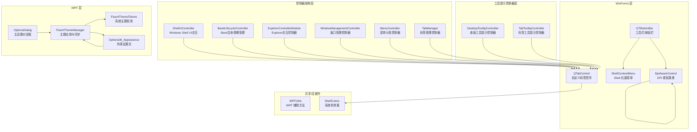

**图表来源**
- [QTTabBarClass.ShellUiController.cs:9-96](file://QTTabBar/QTTabBarClass.ShellUiController.cs#L9-L96)
- [QTTabBarClass.BandLifecycleController.cs:11-47](file://QTTabBar/QTTabBarClass.BandLifecycleController.cs#L11-L47)
- [QTTabBarClass.ExplorerController.cs:58-800](file://QTTabBar/QTTabBarClass.ExplorerController.cs#L58-L800)
- [QTTabBarClass.WindowManagementController.cs:8-57](file://QTTabBar/QTTabBarClass.WindowManagementController.cs#L8-L57)
- [QTTabBarClass.MenuController.cs:58-200](file://QTTabBar/QTTabBarClass.MenuController.cs#L58-L200)
- [QTTabBarClass.TabManager.cs:58-200](file://QTTabBar/QTTabBarClass.TabManager.cs#L58-L200)
- [OptionsDialog.xaml.cs:60-240](file://QTTabBar/OptionsDialog/OptionsDialog.xaml.cs#L60-L240)

## 核心组件
- QTabControl：自绘标签控件，支持多行布局、关闭按钮、图标、阴影、视觉样式渲染器、夜间模式配色等。提供丰富的选择变更事件与滚动控制。
- QTButtonBar：基于 BandObject 的工具栏，承载内置按钮、分组、最近关闭、应用启动器、搜索框、透明度滑块、插件扩展项等，并维护下拉菜单与拖拽排序。
- DesktopTooltipController：从 QTDesktopTool 中提取的专用工具提示控制器，负责子目录提示的显示、隐藏和矩形计算逻辑。
- TabTooltipController：标签工具提示控制器，处理标签相关的工具提示交互逻辑。
- ShellUiController：Windows Shell UI交互控制器，封装了刷新选项、显示文件夹树、搜索栏、置顶切换等Shell相关UI操作。
- BandLifecycleController：Band生命周期控制器，处理Band显示/隐藏、激活状态、DPI变化时的高度刷新等生命周期管理。
- ExplorerControllerModule：Explorer交互控制器，处理导航、事件处理、消息捕获等与Explorer外壳的交互逻辑。
- WindowManagementController：窗口管理控制器，负责窗口合并、最小化到托盘、恢复窗口等窗口管理功能。
- MenuController：菜单分发控制器，处理右键菜单的点击事件和动态内容生成。
- TabManager：标签管理控制器，封装标签创建、打开、克隆、关闭等标签管理操作。
- FluentThemeManager：在 WPF 侧统一应用 Fluent 主题，依据系统深浅色自动切换，动态插入主题资源字典。
- Options06_Appearance：外观设置页，负责皮肤颜色、Rebar 背景色、导入导出注册表皮肤等。
- OptionsDialog：主设置对话框，采用Fluent UI框架，提供统一的设置界面管理。
- ShellContextMenu：封装 IContextMenu2，显示系统级右键菜单，处理"打开父文件夹"和"从菜单移除"等命令。
- DpiAwareControl/DpiManager：为 WinForms 控件提供 DPI 变化通知与缩放因子计算，支撑多显示器与高 DPI 场景。

**章节来源**
- [QTTabBarClass.ShellUiController.cs:9-96](file://QTTabBar/QTTabBarClass.ShellUiController.cs#L9-L96)
- [QTTabBarClass.BandLifecycleController.cs:11-47](file://QTTabBar/QTTabBarClass.BandLifecycleController.cs#L11-L47)
- [QTTabBarClass.ExplorerController.cs:58-800](file://QTTabBar/QTTabBarClass.ExplorerController.cs#L58-L800)
- [QTTabBarClass.WindowManagementController.cs:8-57](file://QTTabBar/QTTabBarClass.WindowManagementController.cs#L8-L57)
- [QTTabBarClass.MenuController.cs:58-200](file://QTTabBar/QTTabBarClass.MenuController.cs#L58-L200)
- [QTTabBarClass.TabManager.cs:58-200](file://QTTabBar/QTTabBarClass.TabManager.cs#L58-L200)
- [OptionsDialog.xaml.cs:60-240](file://QTTabBar/OptionsDialog/OptionsDialog.xaml.cs#L60-L240)

## 控制器架构模式
QTTabBar-Next 采用了基于控制器的UI组件架构模式，将复杂的UI逻辑从主类中解耦到专门的控制器类中。这种设计模式具有以下优势：

### 控制器分类
- **Shell交互控制器**：ShellUiController、ExplorerControllerModule - 处理与Windows Shell的交互
- **生命周期控制器**：BandLifecycleController - 管理Band对象的显示、激活、销毁等生命周期
- **窗口管理控制器**：WindowManagementController - 处理窗口合并、最小化、恢复等操作
- **菜单控制器**：MenuController - 分发和处理各种菜单事件
- **标签管理器**：TabManager - 封装所有标签相关的操作逻辑
- **输入控制器**：ListViewInputController、KeyboardAcceleratorController - 处理用户输入事件

### 控制器初始化
所有控制器在QTTabBarClass的InitializeComponent方法中集中初始化，通过构造函数注入_owner引用：

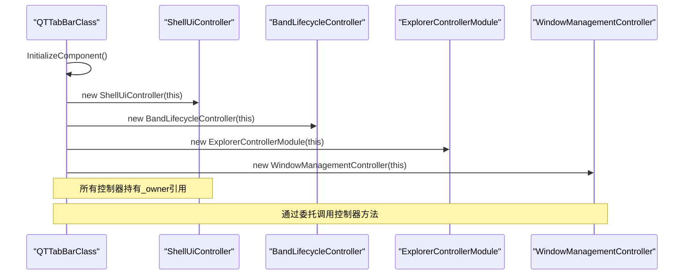

**图表来源**
- [QTTabBarClass.cs:777-792](file://QTTabBar/QTTabBarClass.cs#L777-L792)

### 控制器通信模式
控制器之间通过_owner引用进行通信，保持了松耦合的设计：
- 控制器可以访问QTTabBarClass的所有成员
- 避免控制器之间的直接依赖
- 便于单元测试和模拟测试

**章节来源**
- [QTTabBarClass.cs:777-792](file://QTTabBar/QTTabBarClass.cs#L777-L792)
- [QTTabBarClass.ShellUiController.cs:9-14](file://QTTabBar/QTTabBarClass.ShellUiController.cs#L9-L14)
- [QTTabBarClass.BandLifecycleController.cs:11-16](file://QTTabBar/QTTabBarClass.BandLifecycleController.cs#L11-L16)

## 架构总览
整体采用 WinForms 作为宿主与主交互面，WPF 用于 Fluent 主题与高级外观设置；通过主题管理器将系统主题映射到 WPF 资源字典，并在运行时替换；控制器架构模式实现了职责分离，将复杂的UI逻辑从主类中解耦到专用控制器；WinForms 控件通过配置与系统色常量进行外观适配；DPI 感知贯穿控件生命周期，确保在不同缩放比例下正确布局与绘制。

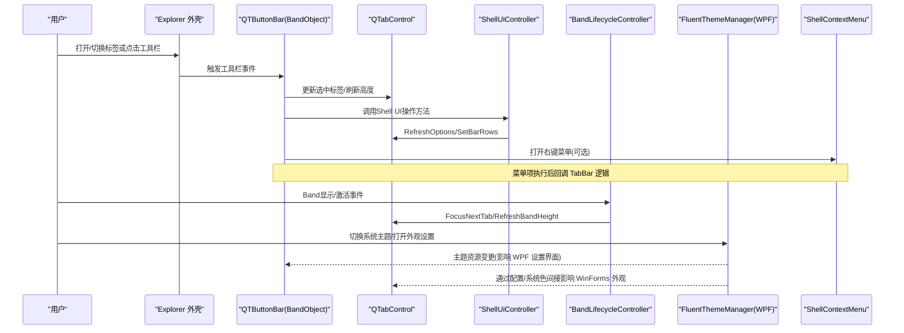

**图表来源**
- [QTTabBarClass.ShellUiController.cs:16-54](file://QTTabBar/QTTabBarClass.ShellUiController.cs#L16-L54)
- [QTTabBarClass.BandLifecycleController.cs:18-46](file://QTTabBar/QTTabBarClass.BandLifecycleController.cs#L18-L46)
- [QTButtonBar.cs:351-539](file://QTTabBar/QTButtonBar.cs#L351-L539)
- [QTabControl.cs:469-504](file://QTTabBar/QTabControl.cs#L469-L504)

## 详细组件分析

### ShellUiController 分析
- Windows Shell UI交互的核心控制器，封装了所有与Shell相关的UI操作
- RefreshOptions 方法处理选项刷新，包括导航按钮、标签行类型、背景刷新等
- ShowFolderTree/ShowSearchBar 方法控制Explorer的文件夹树和搜索栏显示
- ToggleTopMost 方法实现窗口置顶/取消置顶功能
- 支持多种视图模式和配置选项的动态调整

**关键流程**
- 初始化时检查导航按钮配置，动态创建或隐藏工具条
- 根据多行标签配置计算合适的行类型
- 刷新每个标签的矩形区域和视图水印
- 协调Rebar控制器进行背景刷新

**复杂度**
- 方法调用链较长，涉及多个子系统协调
- 需要处理不同Windows版本的兼容性差异

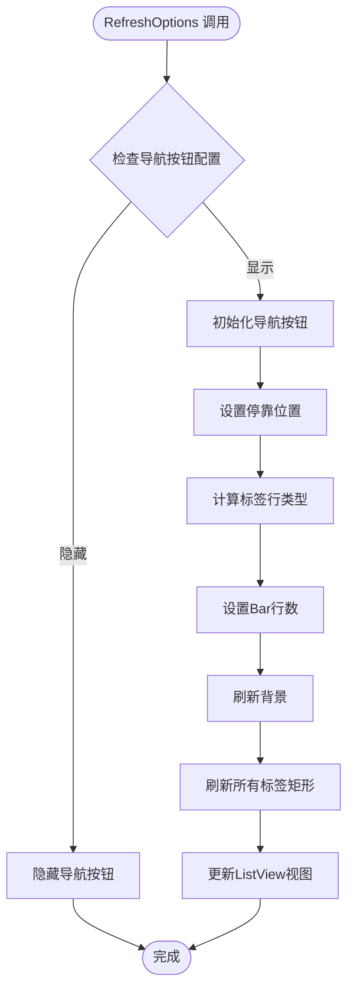

**图表来源**
- [QTTabBarClass.ShellUiController.cs:16-54](file://QTTabBar/QTTabBarClass.ShellUiController.cs#L16-L54)

**章节来源**
- [QTTabBarClass.ShellUiController.cs:9-96](file://QTTabBar/QTTabBarClass.ShellUiController.cs#L9-L96)

### BandLifecycleController 分析
- 专门处理Band对象的生命周期管理
- ShowDW 方法控制Band的显示/隐藏，包含首次导航完成检查和配置持久化
- UIActivateIO 方法处理UI激活状态，自动聚焦到标签控件
- RefreshBandHeightForCurrentDpi 方法处理DPI变化时的高度重新计算

**关键流程**
- 显示时检查Explorer就绪状态，延迟初始化直到首次导航完成
- 隐藏时持久化BreakTabBar配置
- 激活时自动设置焦点到下一个标签
- DPI变化时重新计算标签行数和高度

**线程安全**
- 正确处理跨线程的UI操作
- 安全的状态检查和属性访问

**章节来源**
- [QTTabBarClass.BandLifecycleController.cs:11-47](file://QTTabBar/QTTabBarClass.BandLifecycleController.cs#L11-L47)

### ExplorerControllerModule 分析
- 处理与Explorer外壳的所有交互逻辑
- BeforeNavigate 方法拦截导航请求，处理特殊文件夹和锁定标签
- Explorer_NavigateComplete2 方法处理导航完成事件，更新标签状态和历史记录
- explorerController_MessageCaptured 方法捕获各种Windows消息，处理浏览器命令

**关键流程**
- 导航前保存当前选中项，处理旅行日志
- 导航完成后更新标签文本、路径、工具提示
- 处理特殊文件夹的URL编码和哈希缓存
- 捕获WM_BROWSEOBJECT消息处理前进后退命令

**错误处理**
- 完善的异常捕获和日志记录
- 失败导航的回滚机制

**章节来源**
- [QTTabBarClass.ExplorerController.cs:58-800](file://QTTabBar/QTTabBarClass.ExplorerController.cs#L58-L800)

### WindowManagementController 分析
- 窗口管理的专用控制器
- MergeAllWindows 方法实现多窗口标签合并到主窗口
- MinimizeToTray 方法将窗口最小化到系统托盘
- RestoreWindow 方法从托盘恢复窗口显示

**关键流程**
- 合并窗口时克隆所有标签，重置所有者，刷新按钮
- 最小化时收集当前地址和标签信息保存到托盘
- 恢复时检查窗口状态，刷新标签矩形

**并发安全**
- 使用InstanceManager进行跨进程通信
- 安全的集合操作和资源清理

**章节来源**
- [QTTabBarClass.WindowManagementController.cs:8-57](file://QTTabBar/QTTabBarClass.WindowManagementController.cs#L8-L57)

### MenuController 分析
- 右键菜单的分发控制器
- contextMenuSys_ItemClicked 处理方法级菜单项点击
- contextMenuSys_Opening 方法动态生成菜单内容
- contextMenuTab_ItemClicked 方法处理标签级菜单项

**关键流程**
- 延迟加载菜单内容，提高性能
- 动态添加插件菜单项和执行历史
- 处理组管理、撤销关闭、锁工具栏等功能

**性能优化**
- 使用SuspendLayout/ResumeLayout减少重绘
- 按需创建和销毁菜单项

**章节来源**
- [QTTabBarClass.MenuController.cs:58-200](file://QTTabBar/QTTabBarClass.MenuController.cs#L58-200)

### TabManager 分析
- 标签管理的核心控制器
- AddStartUpTabs 方法处理启动标签的加载
- OpenNewTabOrWindow 方法根据修饰键决定新建标签还是新窗口
- CloneTabButton 方法实现标签克隆功能

**关键流程**
- 启动时根据配置加载预设组和会话标签
- 智能判断是否应该在新窗口中打开
- 处理标签锁定和重复打开的检测

**配置集成**
- 支持NeverOpenSame、RestoreOnlyLocked等配置选项
- 与GroupsManager和StaticReg集成

**章节来源**
- [QTTabBarClass.TabManager.cs:58-200](file://QTTabBar/QTTabBarClass.TabManager.cs#L58-L200)

### DesktopTooltipController 分析
- 独立的工具提示控制器类，封装了子目录提示的所有逻辑
- ShowSubDirTip 方法处理提示显示，包括路径解析、位置计算和表单创建
- HideSubDirTip 方法处理提示隐藏和状态清理
- GetLVITEMRECT 静态方法提供 ListView 项矩形计算的复杂算法
- 支持多种视图模式（图标、列表、详细信息、平铺）的矩形计算
- 错误处理和日志记录机制

**关键流程**
- 初始化时检查焦点状态和配置选项
- 根据视图模式动态调整矩形计算逻辑
- 处理 Vista 特定版本的兼容性差异
- 管理 SubDirTipForm 实例的生命周期

**复杂度**
- 矩形计算算法 O(1)，但涉及多个 Windows API 调用
- 视图模式判断分支逻辑，时间复杂度 O(1)

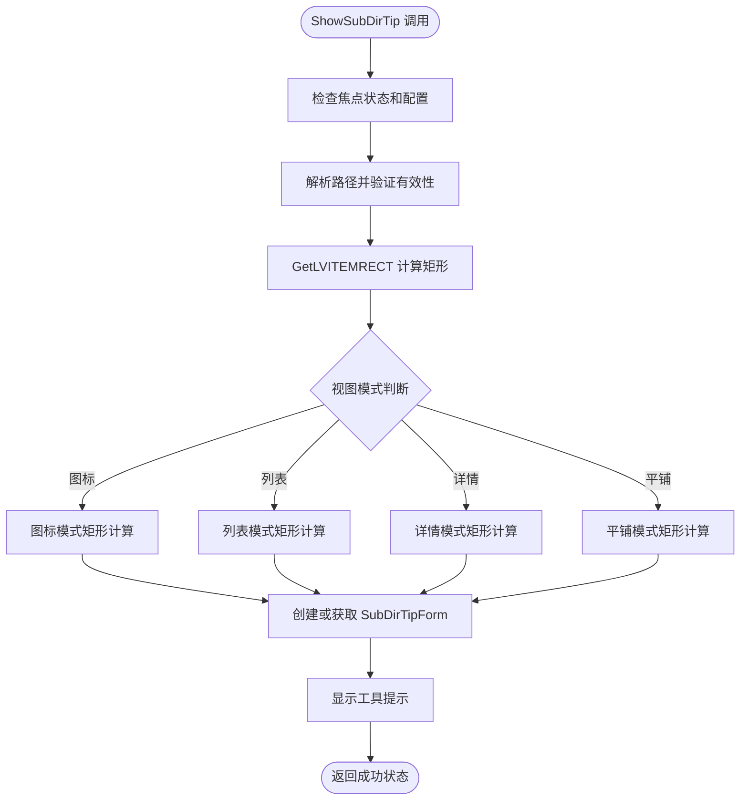

**图表来源**
- [QTDesktopTool.TooltipController.cs:19-49](file://QTTabBar/QTDesktopTool.TooltipController.cs#L19-L49)
- [QTDesktopTool.TooltipController.cs:59-151](file://QTTabBar/QTDesktopTool.TooltipController.cs#L59-L151)

**章节来源**
- [QTDesktopTool.TooltipController.cs:12-152](file://QTTabBar/QTDesktopTool.TooltipController.cs#L12-L152)

### TabTooltipController 分析
- 专门处理标签相关的工具提示交互逻辑
- 支持多种键盘修饰键组合（Ctrl、Shift）的不同行为
- 处理锁定标签的特殊克隆逻辑
- 集成 ShellBrowser 导航和进程启动功能
- 支持多选操作的批量处理

**关键流程**
- 根据点击类型（单个或多个）分发不同的处理逻辑
- 处理链接目标解析和死链接检测
- 管理工作目录和最近文件记录

**线程安全**
- 正确处理跨线程的 UI 操作
- 安全的 COM 对象释放

**章节来源**
- [QTTabBarClass.TabTooltipController.cs:13-128](file://QTTabBar/QTTabBarClass.TabTooltipController.cs#L13-L128)

### QTabControl 分析
- 自绘背景与边框，支持九宫格拉伸贴图与 VisualStyleRenderer 回退
- 多行布局算法，支持固定宽度与自适应宽度，限制最大/最小宽度
- 关闭按钮、锁定图标、驱动器字母阴影绘制、子文本与超链接样式
- 选择变更事件链：Deselecting -> Selecting -> SelectedIndexChanged
- 夜间模式配色与透明背景，支持 RTL 文本方向

**关键流程**
- 初始化时启用双缓冲与透明背景，加载视觉样式渲染器
- 计算每个标签矩形与行号，必要时触发 RowCountChanged
- 选择变更时根据可见区域调整滚动偏移

**复杂度**
- 单行布局 O(n)，多行布局 O(n)
- 绘制复杂度与标签数量、是否启用贴图/阴影相关

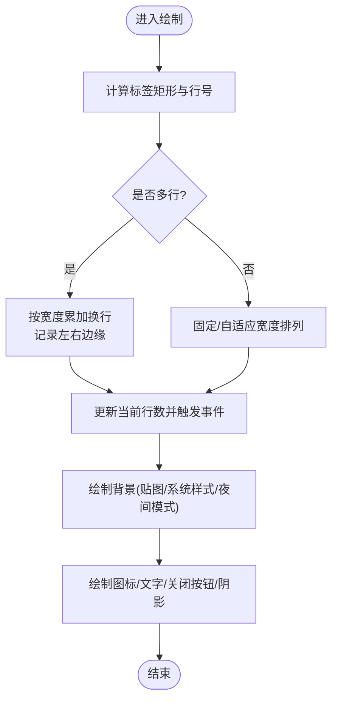

**图表来源**
- [QTabControl.cs:290-464](file://QTTabBar/QTabControl.cs#L290-L464)
- [QTabControl.cs:573-750](file://QTTabBar/QTabControl.cs#L573-L750)

**章节来源**
- [QTabControl.cs:124-224](file://QTTabBar/QTabControl.cs#L124-L224)
- [QTabControl.cs:290-464](file://QTTabBar/QTabControl.cs#L290-L464)
- [QTabControl.cs:469-504](file://QTTabBar/QTabControl.cs#L469-L504)
- [QTabControl.cs:573-750](file://QTTabBar/QTabControl.cs#L573-L750)

### 按钮栏组件（QTButtonBar）分析
- 基于 BandObject 嵌入 Explorer 顶部，提供导航、分组、最近关闭、应用启动器、置顶、透明度滑块、搜索框等
- 支持插件扩展：IBarButton、IBarDropButton、IBarCustomItem、IBarMultipleCustomItems
- 下拉菜单支持拖拽排序与右键菜单，结合 ShellContextMenu 打开系统菜单
- 图片资源线程安全克隆，避免跨线程使用异常

**关键流程**
- CreateItems 遍历配置生成 ToolStripItem，按需创建下拉菜单与搜索框
- DropDownOpening 动态填充历史/分组/应用列表
- ClickItem 程序化触发按钮或下拉

**性能考虑**
- 批量添加前 SuspendLayout/ResumeLayout
- 图像克隆加锁，避免并发访问 ImageStrip
- 延迟搜索与重新排列定时器，减少频繁刷新

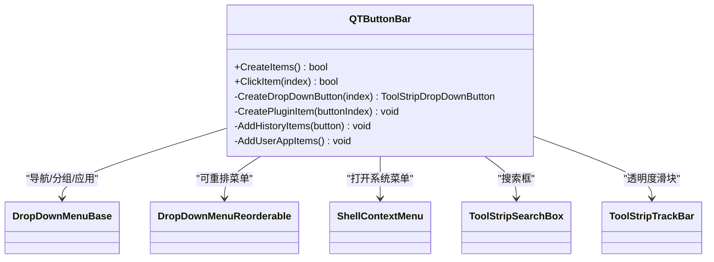

**图表来源**
- [QTButtonBar.cs:351-539](file://QTTabBar/QTButtonBar.cs#L351-L539)
- [QTButtonBar.cs:268-346](file://QTTabBar/QTButtonBar.cs#L268-346)
- [QTButtonBar.cs:541-656](file://QTTabBar/QTButtonBar.cs#L541-L656)
- [ShellContextMenu.cs:45-176](file://QTTabBar/ShellContextMenu.cs#L45-L176)

**章节来源**
- [QTButtonBar.cs:106-120](file://QTTabBar/QTButtonBar.cs#L106-L120)
- [QTButtonBar.cs:351-539](file://QTTabBar/QTButtonBar.cs#L351-L539)
- [QTButtonBar.cs:541-656](file://QTTabBar/QTButtonBar.cs#L541-L656)

### 上下文菜单系统（ShellContextMenu）分析
- 基于 IContextMenu2.QueryContextMenu/InvokeCommand 显示系统右键菜单
- 支持 Shift 扩展动词、追加"打开父文件夹"、"从菜单移除"等自定义项
- 返回特殊命令码以区分用户取消、打开父文件夹、移除菜单项

**调用序列**

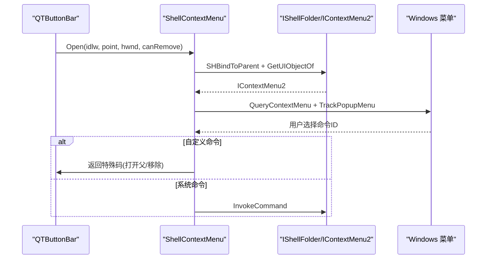

**图表来源**
- [ShellContextMenu.cs:45-176](file://QTTabBar/ShellContextMenu.cs#L45-L176)

**章节来源**
- [ShellContextMenu.cs:45-176](file://QTTabBar/ShellContextMenu.cs#L45-L176)

### Fluent 主题集成与外观设置
- 主题切换机制
  - FluentThemeManager 读取 FluentThemeTokens 的系统深浅色状态，调用 ApplicationThemeManager.Apply 应用 Mica 背景与强调色，并将对应 FluentTheme.Dark/Light.xaml 插入资源字典
  - SyncPageTheme 清理旧主题字典，定位 FluentControls.xaml 位置后插入新主题
- 外观设置页
  - Options06_Appearance 提供颜色选择、Rebar 背景色选择、导入/导出皮肤注册表
  - 重置配置时强制关闭自动颜色切换以避免暗黑模式混乱
- 主设置对话框
  - OptionsDialog 采用 FluentWindow 框架，提供统一的设置界面管理
  - 支持多标签页组织和主题同步应用

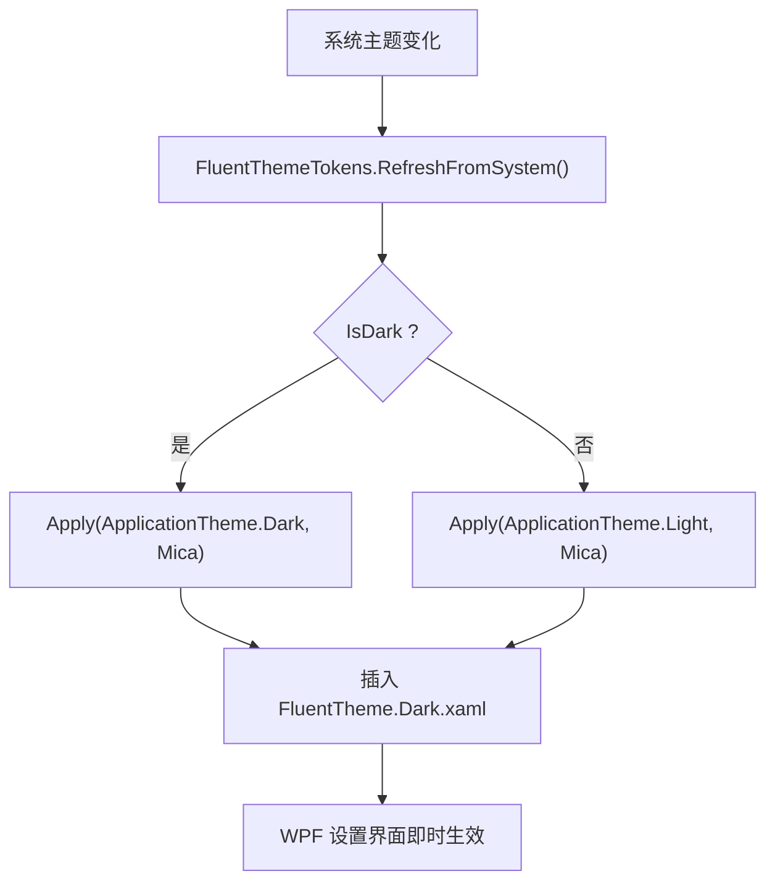

**图表来源**
- [FluentThemeManager.cs:10-46](file://QTTabBar/FluentThemeManager.cs#L10-L46)
- [Options06_Appearance.xaml.cs:45-53](file://QTTabBar/OptionsDialog/Options06_Appearance.xaml.cs#L45-L53)

**章节来源**
- [FluentThemeManager.cs:10-46](file://QTTabBar/FluentThemeManager.cs#L10-L46)
- [Options06_Appearance.xaml.cs:30-151](file://QTTabBar/OptionsDialog/Options06_Appearance.xaml.cs#L30-L151)
- [OptionsDialog.xaml.cs:60-240](file://QTTabBar/OptionsDialog/OptionsDialog.xaml.cs#L60-L240)

### 高 DPI 适配与多显示器支持
- DpiAwareControl 暴露 Dpi 与 Scaling 属性，在控件首次可见时查询当前窗口的 DPI，若发生变化则触发 OnDpiChanged 供派生类重算布局
- DpiManager 提供底层 DPI 获取能力，配合控件生命周期完成多显示器切换时的自适应
- BandLifecycleController 中的 RefreshBandHeightForCurrentDpi 方法专门处理DPI变化时的高度重新计算

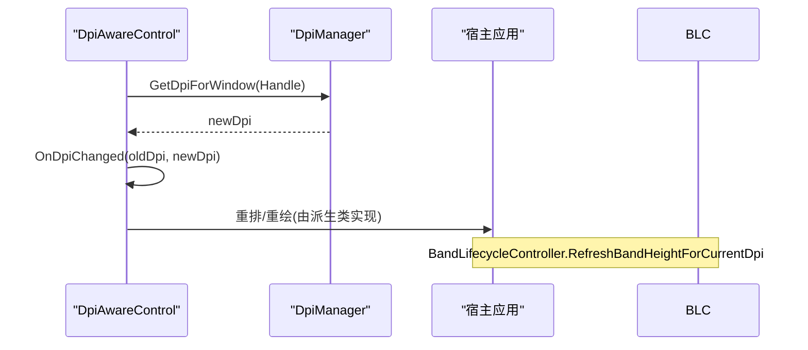

**图表来源**
- [DpiAwareControl.cs:23-62](file://BandObjectLib/Dpi/DpiAwareControl.cs#L23-L62)
- [QTTabBarClass.BandLifecycleController.cs:35-46](file://QTTabBar/QTTabBarClass.BandLifecycleController.cs#L35-L46)

**章节来源**
- [DpiAwareControl.cs:23-62](file://BandObjectLib/Dpi/DpiAwareControl.cs#L23-L62)
- [QTTabBarClass.BandLifecycleController.cs:35-46](file://QTTabBar/QTTabBarClass.BandLifecycleController.cs#L35-L46)

### WPF 与 WinForms 混合编程要点
- 主题与外观：WPF 侧通过 FluentThemeManager 应用主题，WinForms 侧通过配置与系统色常量（如 ShellColors）保持外观一致
- 资源与数据：外观设置页使用 WPF 绑定与对话框，修改后的配置被 WinForms 控件消费
- 消息与交互：WinForms 工具栏与标签控件通过 InstanceManager 与 QTTabBarClass 协调，WPF 仅负责设置界面与主题资源
- 控制器分离：通过专用控制器类解耦复杂逻辑，提高代码可维护性和测试性

**章节来源**
- [FluentThemeManager.cs:10-46](file://QTTabBar/FluentThemeManager.cs#L10-L46)
- [Options06_Appearance.xaml.cs:103-131](file://QTTabBar/OptionsDialog/Options06_Appearance.xaml.cs#L103-L131)
- [ShellColors.cs](file://QTTabBar/ShellColors.cs)
- [QTDesktopTool.TooltipController.cs:12-152](file://QTTabBar/QTDesktopTool.TooltipController.cs#L12-L152)

## 依赖关系分析
- 组件耦合
  - QTButtonBar 依赖 ShellContextMenu 与各类下拉菜单，同时与 QTTabBarClass 协作完成导航与分组操作
  - QTabControl 依赖配置与系统色常量，受主题与夜间模式影响
  - DesktopTooltipController 依赖 QTDesktopTool 和 SubDirTipForm，封装复杂的工具提示逻辑
  - TabTooltipController 依赖 QTTabBarClass，处理标签特定的工具提示交互
  - 各控制器都依赖QTTabBarClass的_owner引用，形成松耦合的控制器架构
  - FluentThemeManager 依赖 FluentThemeTokens 与 WPF 主题管理器
- 外部依赖
  - COM 接口：IShellFolder、IContextMenu2、SHBindToParent 等
  - Windows API：TrackPopupMenu、AppendMenu、GetLayeredWindowAttributes 等
  - WPF 主题库：ApplicationThemeManager、Mica 背景

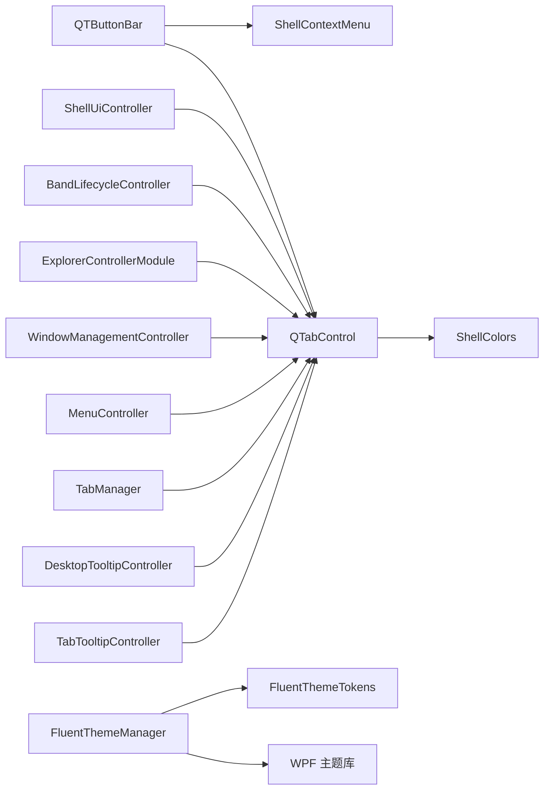

**图表来源**
- [QTTabBarClass.ShellUiController.cs:9-96](file://QTTabBar/QTTabBarClass.ShellUiController.cs#L9-L96)
- [QTTabBarClass.BandLifecycleController.cs:11-47](file://QTTabBar/QTTabBarClass.BandLifecycleController.cs#L11-L47)
- [QTTabBarClass.ExplorerController.cs:58-800](file://QTTabBar/QTTabBarClass.ExplorerController.cs#L58-L800)
- [QTTabBarClass.WindowManagementController.cs:8-57](file://QTTabBar/QTTabBarClass.WindowManagementController.cs#L8-L57)
- [QTTabBarClass.MenuController.cs:58-200](file://QTTabBar/QTTabBarClass.MenuController.cs#L58-L200)
- [QTTabBarClass.TabManager.cs:58-200](file://QTTabBar/QTTabBarClass.TabManager.cs#L58-L200)
- [QTDesktopTool.TooltipController.cs:12-152](file://QTTabBar/QTDesktopTool.TooltipController.cs#L12-L152)
- [QTTabBarClass.TabTooltipController.cs:13-128](file://QTTabBar/QTTabBarClass.TabTooltipController.cs#L13-L128)

**章节来源**
- [QTTabBarClass.ShellUiController.cs:9-96](file://QTTabBar/QTTabBarClass.ShellUiController.cs#L9-L96)
- [QTTabBarClass.BandLifecycleController.cs:11-47](file://QTTabBar/QTTabBarClass.BandLifecycleController.cs#L11-L47)
- [QTTabBarClass.ExplorerController.cs:58-800](file://QTTabBar/QTTabBarClass.ExplorerController.cs#L58-L800)
- [QTTabBarClass.WindowManagementController.cs:8-57](file://QTTabBar/QTTabBarClass.WindowManagementController.cs#L8-L57)
- [QTTabBarClass.MenuController.cs:58-200](file://QTTabBar/QTTabBarClass.MenuController.cs#L58-L200)
- [QTTabBarClass.TabManager.cs:58-200](file://QTTabBar/QTTabBarClass.TabManager.cs#L58-L200)
- [QTDesktopTool.TooltipController.cs:12-152](file://QTTabBar/QTDesktopTool.TooltipController.cs#L12-L152)
- [QTTabBarClass.TabTooltipController.cs:13-128](file://QTTabBar/QTTabBarClass.TabTooltipController.cs#L13-L128)

## 性能与内存管理
- 绘制优化
  - QTabControl 启用双缓冲与透明背景，减少闪烁与重绘开销
  - 九宫格贴图仅在需要时绘制，避免全图重复绘制
- 对象生命周期
  - Dispose 中释放画笔、位图、字体等资源
  - ShellContextMenu 在 finally 块释放 COM 对象，防止泄漏
  - DesktopTooltipController 中的 SubDirTipForm 实例管理，确保正确的创建和销毁
  - 控制器模式提高了对象管理的清晰度，便于资源清理
- 并发与线程安全
  - 图像克隆加锁，避免跨线程访问 ImageStrip 导致异常
  - TabTooltipController 中的跨线程 UI 操作处理
  - 控制器间的通信通过_owner引用，避免了直接的线程竞争
- 延迟与节流
  - 搜索框输入与重新排列使用定时器节流，降低频繁刷新带来的性能损耗
  - MenuController 使用SuspendLayout/ResumeLayout优化菜单构建性能
- 控制器分离优势
  - 各控制器职责单一，便于单元测试和性能监控
  - 减少了主类的复杂性，提高代码可读性和可维护性
  - 控制器可以独立优化和替换，不影响其他组件

**章节来源**
- [QTabControl.cs:506-571](file://QTTabBar/QTabControl.cs#L506-L571)
- [ShellContextMenu.cs:160-176](file://QTTabBar/ShellContextMenu.cs#L160-L176)
- [QTButtonBar.cs:506-513](file://QTTabBar/QTButtonBar.cs#L506-L513)
- [QTDesktopTool.TooltipController.cs:33-46](file://QTTabBar/QTDesktopTool.TooltipController.cs#L33-L46)
- [QTTabBarClass.TabTooltipController.cs:76-90](file://QTTabBar/QTTabBarClass.TabTooltipController.cs#L76-L90)
- [QTTabBarClass.MenuController.cs:110-163](file://QTTabBar/QTTabBarClass.MenuController.cs#L110-L163)

## 故障排查指南
- 右键菜单不显示或命令无效
  - 检查 IContextMenu2 是否正确获取与释放
  - 确认 TrackPopupMenu 返回值与命令映射
- 工具栏按钮图像异常或崩溃
  - 确认图像克隆是否在锁内执行
  - 检查 ImageStrip 尺寸与像素格式
- 主题切换后外观不一致
  - 确认 FluentThemeManager 已插入正确的主题字典
  - 检查 WinForms 控件是否读取最新配置与系统色
- DPI 切换后布局错乱
  - 验证 OnDpiChanged 是否被触发并重算布局
  - 检查 Scaling 因子是否应用到字体与间距
  - 检查 BandLifecycleController.RefreshBandHeightForCurrentDpi 是否正确调用
- 控制器相关问题
  - 检查各控制器的初始化顺序和_owner引用是否正确
  - 验证控制器方法的委托调用是否正常
  - 确认控制器间的通信没有循环依赖
- 工具提示相关问题
  - 检查 DesktopTooltipController 的 ShowSubDirTip 方法是否正确调用
  - 验证 GetLVITEMRECT 方法的矩形计算逻辑
  - 确认 SubDirTipForm 实例的生命周期管理
  - 检查 TabTooltipController 的键盘修饰键处理逻辑

**章节来源**
- [ShellContextMenu.cs:45-176](file://QTTabBar/ShellContextMenu.cs#L45-L176)
- [QTButtonBar.cs:506-513](file://QTTabBar/QTButtonBar.cs#L506-L513)
- [FluentThemeManager.cs:20-41](file://QTTabBar/FluentThemeManager.cs#L20-L41)
- [DpiAwareControl.cs:46-62](file://BandObjectLib/Dpi/DpiAwareControl.cs#L46-L62)
- [QTTabBarClass.BandLifecycleController.cs:35-46](file://QTTabBar/QTTabBarClass.BandLifecycleController.cs#L35-L46)
- [QTTabBarClass.cs:777-792](file://QTTabBar/QTTabBarClass.cs#L777-L792)
- [QTDesktopTool.TooltipController.cs:19-49](file://QTTabBar/QTDesktopTool.TooltipController.cs#L19-L49)
- [QTTabBarClass.TabTooltipController.cs:20-91](file://QTTabBar/QTTabBarClass.TabTooltipController.cs#L20-L91)

## 结论
QTTabBar-Next 的 UI 体系以 WinForms 为核心，结合 WPF 的 Fluent 主题与外观设置，实现了高度可定制的标签与工具栏体验。通过控制器架构模式实现了职责分离，显著提高了代码的可维护性和可扩展性。通过完善的 DPI 感知、上下文菜单集成与性能优化策略，系统在复杂环境下仍能提供稳定流畅的交互。移除了实验性的Fluent UI预览功能后，架构更加简洁稳定，建议后续继续完善可访问性与响应式布局，进一步提升用户体验。

## 附录：使用示例与自定义指南
- 使用 QTabControl
  - 设置 SizeMode 与 Min/Max 标签宽度，启用多行布局
  - 订阅 Selecting/Deselecting/SelectedIndexChanged 事件处理选择变更
  - 在夜间模式下通过配置调整文本与阴影颜色
- 自定义按钮栏
  - 通过配置 ButtonIndexes 决定显示哪些内置按钮
  - 实现 IBarButton/IBarDropButton/IBarCustomItem/IBarMultipleCustomItems 扩展插件按钮
  - 使用 DropDownMenuReorderable 实现可拖拽排序的下拉菜单
- 控制器自定义
  - 继承现有控制器类并重写特定方法实现自定义逻辑
  - 创建新的专用控制器处理特定业务逻辑
  - 通过委托模式与QTTabBarClass进行通信
- 工具提示控制器自定义
  - 继承 DesktopTooltipController 并重写 ShowSubDirTip 方法实现自定义提示逻辑
  - 扩展 TabTooltipController 添加新的键盘快捷键处理
  - 使用 GetLVITEMRECT 方法实现自定义的矩形计算逻辑
- 主题与外观
  - 在 WPF 设置页中调整颜色与 Rebar 背景色，并通过导出/导入注册表分享皮肤
  - 利用 FluentThemeManager 在运行时切换主题资源字典
- 高 DPI 与多显示器
  - 继承 DpiAwareControl 并重写 OnDpiChanged 以响应 DPI 变化
  - 使用 Scaling 因子调整字体大小与边距
  - 在Band生命周期控制器中处理DPI变化时的高度重新计算
- 可访问性与响应式设计
  - 为关键控件提供 ToolTip 与快捷键提示
  - 在布局计算中考虑不同 DPI 下的文本测量与截断策略

**章节来源**
- [QTabControl.cs:290-464](file://QTTabBar/QTabControl.cs#L290-L464)
- [QTButtonBar.cs:541-656](file://QTTabBar/QTButtonBar.cs#L541-L656)
- [QTTabBarClass.ShellUiController.cs:16-54](file://QTTabBar/QTTabBarClass.ShellUiController.cs#L16-L54)
- [QTTabBarClass.BandLifecycleController.cs:35-46](file://QTTabBar/QTTabBarClass.BandLifecycleController.cs#L35-L46)
- [QTDesktopTool.TooltipController.cs:19-49](file://QTTabBar/QTDesktopTool.TooltipController.cs#L19-L49)
- [QTTabBarClass.TabTooltipController.cs:20-91](file://QTTabBar/QTTabBarClass.TabTooltipController.cs#L20-L91)
- [Options06_Appearance.xaml.cs:103-131](file://QTTabBar/OptionsDialog/Options06_Appearance.xaml.cs#L103-L131)
- [DpiAwareControl.cs:23-62](file://BandObjectLib/Dpi/DpiAwareControl.cs#L23-L62)