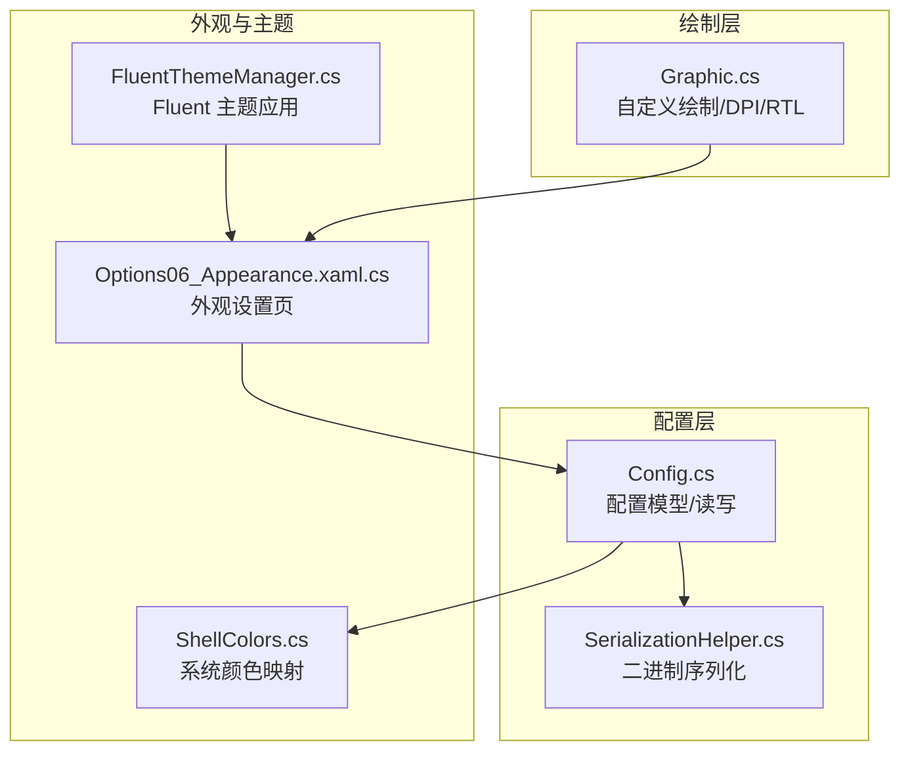
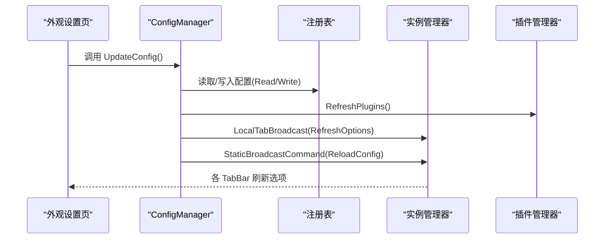
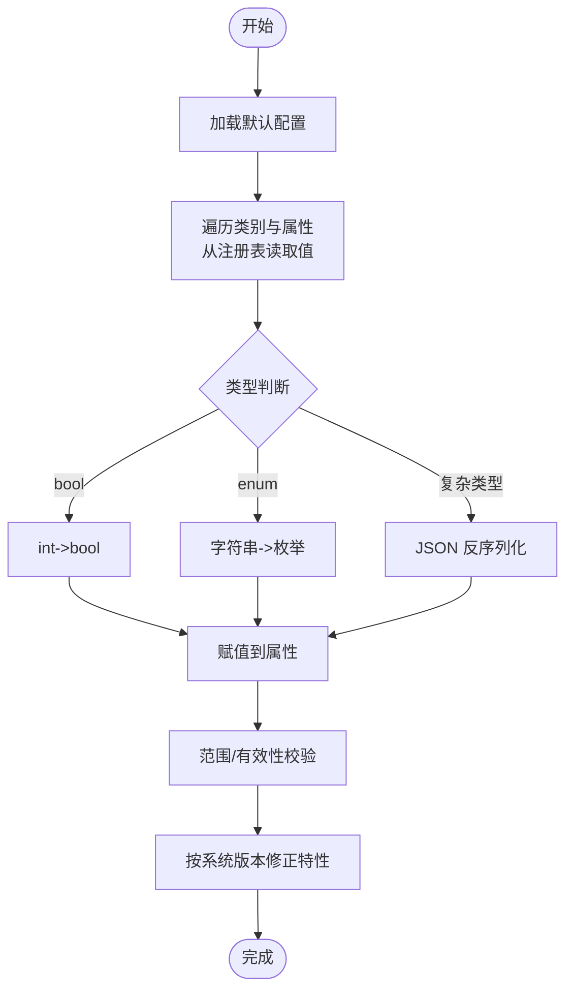
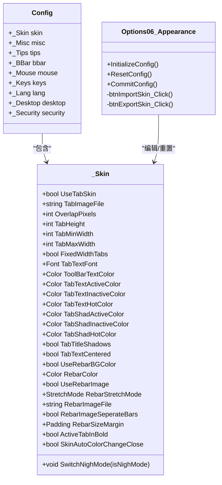
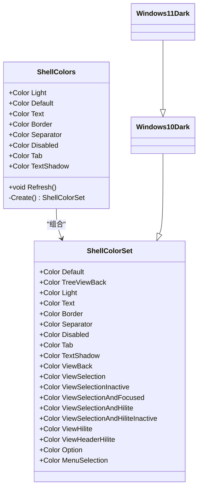
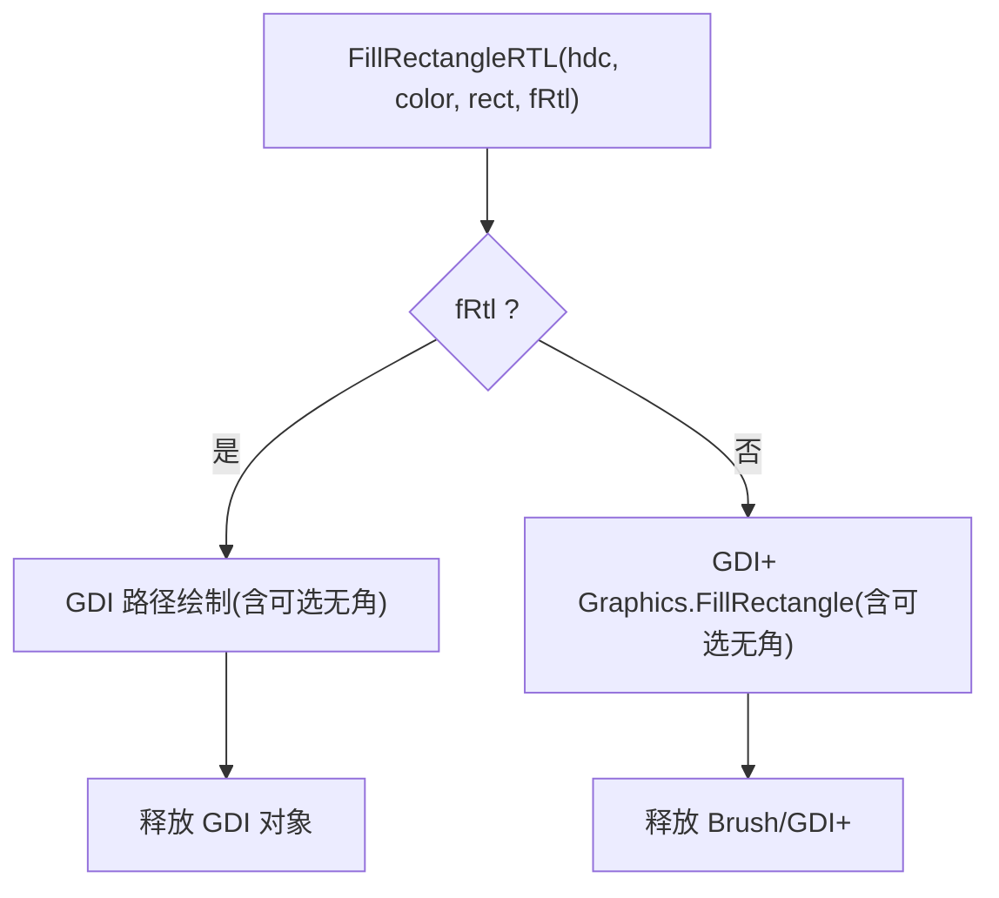
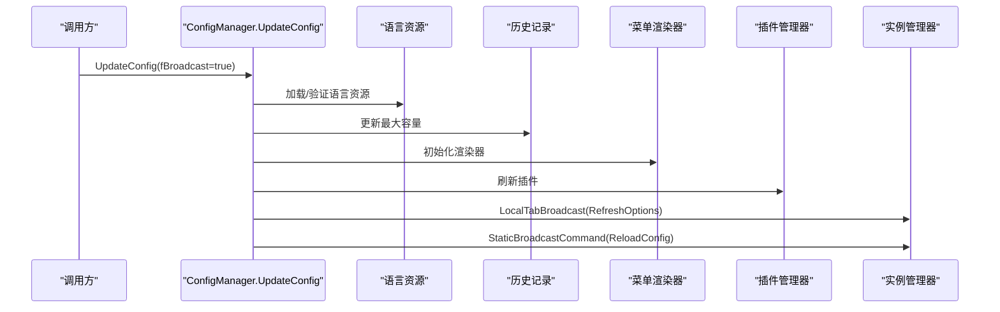
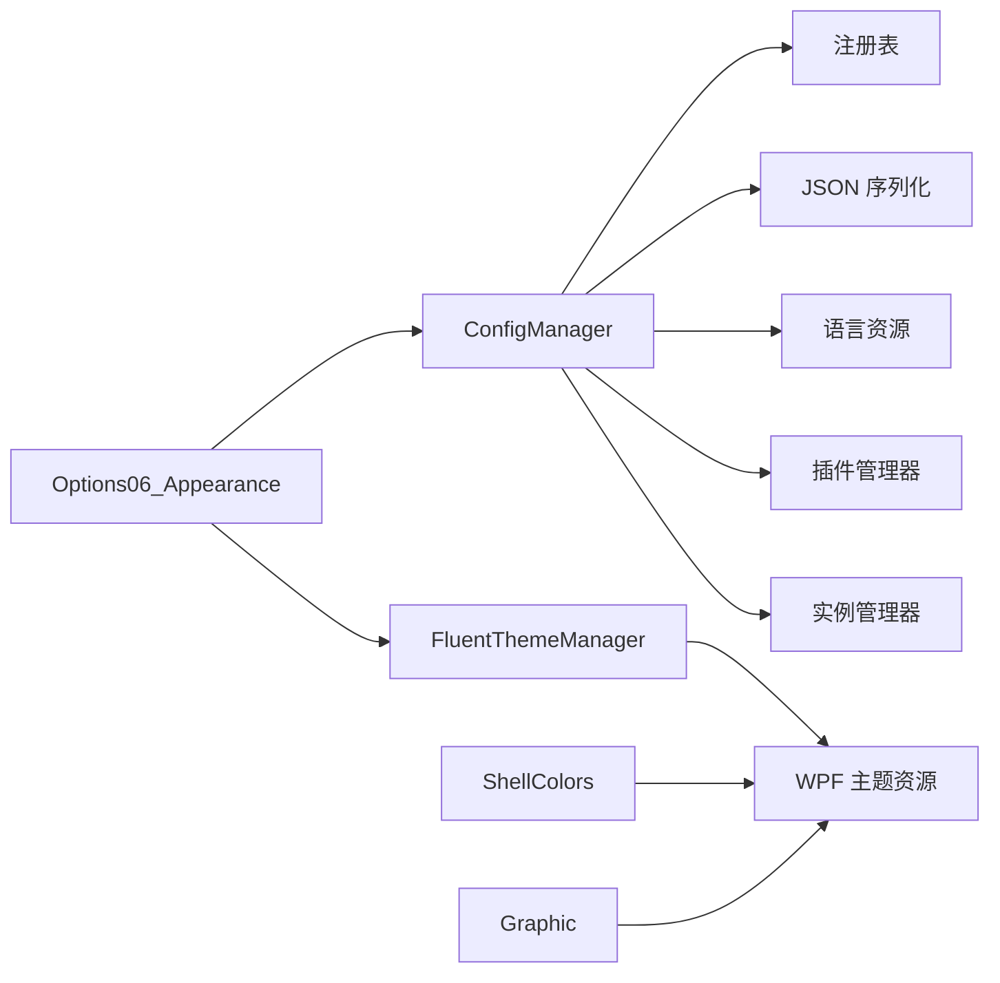

# 个性化设置

<cite>
**本文引用的文件**   
- [Config.cs](file://QTTabBar/Config.cs)
- [ShellColors.cs](file://QTTabBar/ShellColors.cs)
- [Graphic.cs](file://QTTabBar/Graphic.cs)
- [SerializationHelper.cs](file://QTTabBar/SerializationHelper.cs)
- [Options06_Appearance.xaml.cs](file://QTTabBar/OptionsDialog/Options06_Appearance.xaml.cs)
- [FluentThemeManager.cs](file://QTTabBar/FluentThemeManager.cs)
</cite>

## 目录
1. [简介](#简介)
2. [项目结构](#项目结构)
3. [核心组件](#核心组件)
4. [架构总览](#架构总览)
5. [详细组件分析](#详细组件分析)
6. [依赖关系分析](#依赖关系分析)
7. [性能考量](#性能考量)
8. [故障排查指南](#故障排查指南)
9. [结论](#结论)
10. [附录](#附录)

## 简介
本文件面向 QTTabBar-Next 的“个性化设置”子系统，围绕配置管理、外观主题与绘图工具展开，重点说明：
- 配置模型与持久化机制（注册表存储、JSON 序列化、二进制序列化）
- 热重载流程（更新后刷新 UI、插件、菜单渲染器）
- 外观选项（颜色、字体、布局、皮肤图片等）
- ShellColors 系统颜色映射与管理（亮/暗模式、Win10/Win11 差异）
- Graphic 自定义绘制能力（RTL 填充、无角矩形、DPI 缩放、默认字体）
- 用户界面定制的配置方法与 API 使用示例
- 配置验证、默认值管理与迁移策略

## 项目结构
与个性化设置相关的核心代码位于以下位置：
- 配置模型与读写：QTTabBar/Config.cs
- 系统颜色映射：QTTabBar/ShellColors.cs
- 自定义绘制工具：QTTabBar/Graphic.cs
- 二进制序列化辅助：QTTabBar/SerializationHelper.cs
- 外观设置页（WPF）：QTTabBar/OptionsDialog/Options06_Appearance.xaml.cs
- Fluent 主题应用：QTTabBar/FluentThemeManager.cs

图示来源
- [Config.cs:1129-1330](file://QTTabBar/Config.cs#L1129-L1330)
- [SerializationHelper.cs:29-61](file://QTTabBar/SerializationHelper.cs#L29-L61)
- [Options06_Appearance.xaml.cs:41-79](file://QTTabBar/OptionsDialog/Options06_Appearance.xaml.cs#L41-L79)
- [FluentThemeManager.cs:10-46](file://QTTabBar/FluentThemeManager.cs#L10-L46)
- [ShellColors.cs:133-145](file://QTTabBar/ShellColors.cs#L133-L145)
- [Graphic.cs:118-133](file://QTTabBar/Graphic.cs#L118-L133)

章节来源
- [Config.cs:1129-1330](file://QTTabBar/Config.cs#L1129-L1330)
- [SerializationHelper.cs:29-61](file://QTTabBar/SerializationHelper.cs#L29-L61)
- [Options06_Appearance.xaml.cs:41-79](file://QTTabBar/OptionsDialog/Options06_Appearance.xaml.cs#L41-L79)
- [FluentThemeManager.cs:10-46](file://QTTabBar/FluentThemeManager.cs#L10-L46)
- [ShellColors.cs:133-145](file://QTTabBar/ShellColors.cs#L133-L145)
- [Graphic.cs:118-133](file://QTTabBar/Graphic.cs#L118-L133)

## 核心组件
- Config 与子类别
  - 顶层 Config 聚合多个配置段：窗口、标签、调整、提示、常规、外观(_Skin)、按钮栏(_BBar)、鼠标、键盘、插件、语言、桌面、安全。
  - 每个子类别提供默认值构造逻辑，并在读取后进行校验与修正。
- ConfigManager
  - Initialize：创建默认配置并读取注册表。
  - ReadConfig：反射遍历属性，按类型反序列化（bool/int/string/enum/复杂对象），并对路径、尺寸、Padding 等进行范围校验。
  - WriteConfig：将当前内存配置写回注册表；复杂对象通过 JSON 序列化（Font 使用专用可序列化包装）。
  - UpdateConfig：热重载入口，刷新语言资源、历史容量、菜单渲染器、插件列表，并向所有实例广播 ReloadConfig。
- SerializationHelper
  - 提供二进制序列化工具，用于某些历史数据或内部结构的字节数组转换，包含反序列化白名单绑定器以增强安全性。

章节来源
- [Config.cs:224-331](file://QTTabBar/Config.cs#L224-L331)
- [Config.cs:1129-1330](file://QTTabBar/Config.cs#L1129-L1330)
- [SerializationHelper.cs:29-61](file://QTTabBar/SerializationHelper.cs#L29-L61)

## 架构总览
配置系统采用“模型 + 反射读写 + 分类校验 + 热重载”的架构：
- 模型：Config 及其子类定义全部可配置项。
- 持久化：注册表为主存储；复杂类型使用 JSON 字符串存储；部分历史数据使用二进制序列化。
- 热重载：UpdateConfig 集中刷新运行时状态，并通过 IPC 广播通知其他实例。

图示来源
- [Config.cs:1139-1153](file://QTTabBar/Config.cs#L1139-L1153)
- [Config.cs:1155-1277](file://QTTabBar/Config.cs#L1155-L1277)
- [Config.cs:1279-1330](file://QTTabBar/Config.cs#L1279-L1330)

## 详细组件分析

### 配置模型与持久化（Config.cs）
- 配置类别与默认值
  - _Window/_Tabs/_Tweaks/_Tips/_Misc/_Skin/_BBar/_Mouse/_Keys/_Plugin/_Lang/_Desktop/_Security 均提供构造函数初始化默认值。
  - 例如 _Skin 控制标签背景、文本颜色、阴影、Rebar 背景色/图片、拉伸模式、边距、固定宽度等。
- 序列化与反序列化
  - bool/int/string/enum 直接读写。
  - 复杂类型（如 Font、Color、Padding、List<string> 等）使用 DataContractJsonSerializer 进行 JSON 序列化/反序列化。
  - Font 使用 XmlSerializableFont 作为中间表示，避免原生 Font 序列化问题。
- 注册表路径
  - 统一前缀 RegConst.Root + RegConst.Config，并按类别名追加子键。
- 校验与修正
  - 对预览宽高、历史记录数量、网络超时、标签高度/宽度、重叠像素、Padding 四向边距等进行范围校验。
  - 对图片路径有效性进行 IDLWrapper 检查，无效则清空。
  - 对快捷键数组长度进行扩容补齐，清理空值字典项。
  - 根据操作系统版本（XP/Win7/Win11）进行特性开关修正。
- 热重载
  - UpdateConfig 会刷新语言资源、历史容量、菜单渲染器、插件列表，并广播 ReloadConfig 命令。

图示来源
- [Config.cs:1155-1277](file://QTTabBar/Config.cs#L1155-L1277)

章节来源
- [Config.cs:333-1127](file://QTTabBar/Config.cs#L333-L1127)
- [Config.cs:1155-1277](file://QTTabBar/Config.cs#L1155-L1277)
- [Config.cs:1279-1330](file://QTTabBar/Config.cs#L1279-L1330)

### 外观设置选项（_Skin 与 Options06_Appearance）
- 关键外观字段（节选）
  - UseTabSkin / TabImageFile / OverlapPixels / HitTestTransparent
  - TabHeight / TabMinWidth / TabMaxWidth / FixedWidthTabs
  - TabTextFont / ToolBarTextColor / TabTextActiveColor / TabTextInactiveColor / TabTextHotColor
  - TabShadActiveColor / TabShadInactiveColor / TabShadHotColor / TabTitleShadows / TabTextCentered
  - UseRebarBGColor / RebarColor / UseRebarImage / RebarStretchMode / RebarImageFile / RebarSizeMargin
  - ActiveTabInBold / SkinAutoColorChangeClose / DrawHorizontalExplorerBarBgColor / DrawVerticalExplorerBarBgColor
- 夜间模式切换
  - SwitchNighMode 在关闭自动变色时跳过；否则根据明/暗模式批量切换文本、阴影、背景等颜色。
- 外观设置页交互
  - ResetConfig 重置为默认 _Skin，并触发夜间模式同步。
  - CommitConfig 中保留手动修改后的自动变色标记位。
  - 支持导出皮肤为 .reg 文件（仅导出皮肤相关注册表项）。

图示来源
- [Config.cs:622-805](file://QTTabBar/Config.cs#L622-L805)
- [Options06_Appearance.xaml.cs:41-79](file://QTTabBar/OptionsDialog/Options06_Appearance.xaml.cs#L41-L79)

章节来源
- [Config.cs:622-805](file://QTTabBar/Config.cs#L622-L805)
- [Options06_Appearance.xaml.cs:41-79](file://QTTabBar/OptionsDialog/Options06_Appearance.xaml.cs#L41-L79)

### ShellColors 系统颜色映射与管理
- 设计要点
  - 基于当前是否处于夜间模式选择基础配色集。
  - Win11 与 Win10 的暗色主题存在差异化覆盖。
  - 提供 Light/Default/Text/Border/Separator/Disabled/Tab/TextShadow 等便捷访问器。
  - Refresh 方法可在主题变化时重建颜色集合。
- 典型用途
  - 为标签、视图、边框、分隔线、禁用态等提供一致的系统级色彩语义。

图示来源
- [ShellColors.cs:133-145](file://QTTabBar/ShellColors.cs#L133-L145)
- [ShellColors.cs:147-243](file://QTTabBar/ShellColors.cs#L147-L243)

章节来源
- [ShellColors.cs:1-249](file://QTTabBar/ShellColors.cs#L1-L249)

### Graphic 绘图工具类
- RTL 填充
  - FillRectangleRTL：根据 RTL 标志选择 GDI+ 或 GDI 路径绘制，支持无角矩形变体。
- 无角矩形
  - FillRectangleWithoutCorners：通过三个重叠矩形拼出圆角效果。
- 线条绘制
  - DrawLineRTL：使用 GDI 画线。
- DPI 与布局适配
  - ScaleBy：按窗口缩放比例计算目标尺寸。
  - SelectValueByScaling：按 96/120/144 DPI 档位选择不同数值。
  - Translate：根据 RTL 翻转 Padding 左右边距。
- 默认字体
  - CreateDefaultFont：封装默认字体创建，异常时返回 null。

图示来源
- [Graphic.cs:15-67](file://QTTabBar/Graphic.cs#L15-L67)
- [Graphic.cs:95-116](file://QTTabBar/Graphic.cs#L95-L116)
- [Graphic.cs:118-133](file://QTTabBar/Graphic.cs#L118-L133)

章节来源
- [Graphic.cs:1-163](file://QTTabBar/Graphic.cs#L1-L163)

### 热重载机制（UpdateConfig）
- 刷新语言资源：根据 Lang.UseLangFile 和 Lang.LangFile 动态加载语言包。
- 刷新历史容量：ClosedTabHistoryList 与 ExecutedPathsList 的 MaxCapacity。
- 刷新菜单渲染器：DropDownMenuBase 与 ContextMenuStripEx。
- 刷新插件：PluginManager.RefreshPlugins。
- 刷新本地实例：InstanceManager.LocalTabBroadcast(tabbar => tabbar.RefreshOptions)。
- 广播全局命令：InstanceManager.StaticBroadcastCommand(IpcCommand.ReloadConfig)。

图示来源
- [Config.cs:1139-1153](file://QTTabBar/Config.cs#L1139-L1153)

章节来源
- [Config.cs:1139-1153](file://QTTabBar/Config.cs#L1139-L1153)

### 用户界面定制的配置方法与 API 使用示例
- 通过外观设置页
  - 打开外观页面后，可直接绑定到 WorkingConfig.skin 的属性，修改后立即生效（由 UpdateConfig 驱动刷新）。
  - 支持导出皮肤为 .reg 文件，便于分享与部署。
- 编程式修改
  - 修改 Config.Skin.* 属性后，调用 ConfigManager.UpdateConfig(true) 触发热重载。
  - 若需仅保存不立即刷新，可调用 ConfigManager.WriteConfig(false)。
- 示例步骤（文字描述）
  - 在设置对话框中更改颜色/字体/边距等。
  - 点击“确定/应用”，底层调用 UpdateConfig 刷新 UI 与插件。
  - 如需持久化，确保 WriteConfig 被调用（通常在确认保存时）。

章节来源
- [Options06_Appearance.xaml.cs:41-79](file://QTTabBar/OptionsDialog/Options06_Appearance.xaml.cs#L41-L79)
- [Config.cs:1139-1153](file://QTTabBar/Config.cs#L1139-L1153)
- [Config.cs:1279-1330](file://QTTabBar/Config.cs#L1279-L1330)

### 配置验证、默认值管理与迁移策略
- 默认值管理
  - 每个配置段在构造函数中提供合理的默认值，保证首次运行可用。
- 配置验证
  - 数值范围：PreviewMaxWidth/Height、TabHeight/MinWidth/MaxWidth、OverlapPixels、Padding 四向边距等。
  - 路径有效性：TabImageFile、RebarImageFile、ImageStripPath 使用 IDLWrapper 校验，无效则清空。
  - 数据结构完整性：Shortcuts 数组扩容补齐，PluginShortcuts 移除空值项。
- 迁移策略
  - 按系统版本（XP/Win7/Win11）进行特性开关修正，确保兼容性。
  - 对历史遗留的布尔/枚举/复杂类型进行兼容解析。
  - 二进制序列化使用白名单绑定器，防止恶意或非预期类型反序列化。

章节来源
- [Config.cs:1222-1277](file://QTTabBar/Config.cs#L1222-L1277)
- [SerializationHelper.cs:29-61](file://QTTabBar/SerializationHelper.cs#L29-L61)

## 依赖关系分析
- ConfigManager 依赖
  - 注册表读写（通过 Microsoft.Win32.RegistryKey）
  - JSON 序列化（DataContractJsonSerializer）
  - 语言资源与日志（QTUtility/QTSUtility2）
  - 插件与实例管理（PluginManager/InstanceManager）
- 外观与主题
  - Options06_Appearance 绑定到 Config._Skin，并通过 FluentThemeManager 应用 WPF 主题。
  - ShellColors 提供系统级颜色语义，供 UI 与绘制层消费。
- 绘制层
  - Graphic 提供跨 RTL/DPI 的绘制能力，供 UI 渲染使用。

图示来源
- [Config.cs:1139-1153](file://QTTabBar/Config.cs#L1139-L1153)
- [Options06_Appearance.xaml.cs:41-79](file://QTTabBar/OptionsDialog/Options06_Appearance.xaml.cs#L41-L79)
- [FluentThemeManager.cs:10-46](file://QTTabBar/FluentThemeManager.cs#L10-L46)
- [ShellColors.cs:133-145](file://QTTabBar/ShellColors.cs#L133-L145)
- [Graphic.cs:118-133](file://QTTabBar/Graphic.cs#L118-L133)

章节来源
- [Config.cs:1139-1153](file://QTTabBar/Config.cs#L1139-L1153)
- [Options06_Appearance.xaml.cs:41-79](file://QTTabBar/OptionsDialog/Options06_Appearance.xaml.cs#L41-L79)
- [FluentThemeManager.cs:10-46](file://QTTabBar/FluentThemeManager.cs#L10-L46)
- [ShellColors.cs:133-145](file://QTTabBar/ShellColors.cs#L133-L145)
- [Graphic.cs:118-133](file://QTTabBar/Graphic.cs#L118-L133)

## 性能考量
- 反射遍历属性进行读写：在启动阶段执行，影响可控；建议仅在必要时触发。
- JSON 序列化复杂对象：注意对象大小与嵌套层级，避免过大导致 I/O 延迟。
- 热重载广播：UpdateConfig 会刷新多项子系统，建议在用户明确保存时调用，避免频繁触发。
- 绘制优化：Graphic 在 RTL 场景下使用 GDI 路径减少额外开销；DPI 选择策略避免不必要的重绘。

[本节为通用指导，无需具体文件引用]

## 故障排查指南
- 配置无法加载或崩溃
  - 检查 ReadConfig 中的异常日志输出，定位具体类别与属性。
  - 确认注册表权限与路径是否存在。
- 颜色/主题异常
  - 确认 NightMode 切换逻辑与 SkinAutoColorChangeClose 标记位。
  - 调用 ShellColors.Refresh 以重新计算颜色集合。
- 图片路径无效
  - 检查 TabImageFile/RebarImageFile/ImageStripPath 是否为有效 IDL 路径。
- 快捷键冲突或缺失
  - 查看 Shortcuts 数组长度与索引边界，确保新增动作不会越界。
- 二进制序列化失败
  - 检查白名单绑定器配置与数据类型变更导致的反序列化异常。

章节来源
- [Config.cs:1273-1277](file://QTTabBar/Config.cs#L1273-L1277)
- [SerializationHelper.cs:42-49](file://QTTabBar/SerializationHelper.cs#L42-L49)
- [ShellColors.cs:133-145](file://QTTabBar/ShellColors.cs#L133-L145)

## 结论
QTTabBar-Next 的个性化设置系统以 Config 为核心，结合注册表持久化、JSON 序列化与热重载机制，提供了灵活且健壮的外观与行为定制能力。ShellColors 与 Graphic 进一步增强了主题与绘制的灵活性，配合 WPF 外观设置页与 Fluent 主题管理，形成完整的个性化生态。通过完善的默认值、校验与迁移策略，系统在多系统版本与用户习惯下保持稳定与易用。

[本节为总结性内容，无需具体文件引用]

## 附录
- 常用配置项速览（节选）
  - 外观：UseTabSkin、TabImageFile、TabHeight、TabMinWidth、TabMaxWidth、TabTextFont、ToolBarTextColor、TabTextActiveColor、TabTextInactiveColor、TabTextHotColor、TabShadActiveColor、TabShadInactiveColor、TabShadHotColor、TabTitleShadows、TabTextCentered、UseRebarBGColor、RebarColor、UseRebarImage、RebarStretchMode、RebarImageFile、RebarSizeMargin、ActiveTabInBold、SkinAutoColorChangeClose
  - 提示：PreviewMaxWidth、PreviewMaxHeight、PreviewFont、TextExt、ImageExt
  - 常规：TabHistoryCount、FileHistoryCount、NetworkTimeout、SoundBox、EnableLog
  - 按钮栏：ButtonIndexes、LargeButtons、ShowButtonLabels、ImageStripPath
  - 鼠标：GlobalMouseActions、TabActions、BarActions、LinkActions、ItemActions、MarginActions
  - 键盘：Shortcuts、PluginShortcuts、UseTabSwitcher
  - 语言：UseLangFile、LangFile、BuiltInLang、BuiltInLangSelectedIndex
  - 桌面：TaskBarDblClickEnabled、DesktopDblClickEnabled、OneClickMenu、EnableAppShortcuts、Width
  - 安全：BlockUntrustedPlugins、BlockLegacyHookDllPath

章节来源
- [Config.cs:333-1127](file://QTTabBar/Config.cs#L333-L1127)