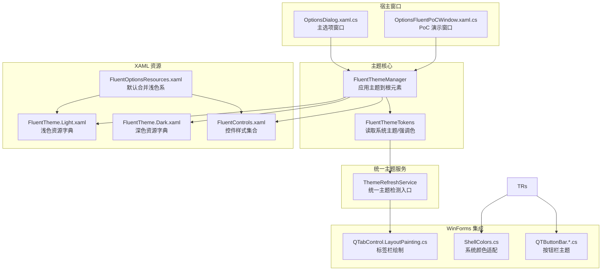
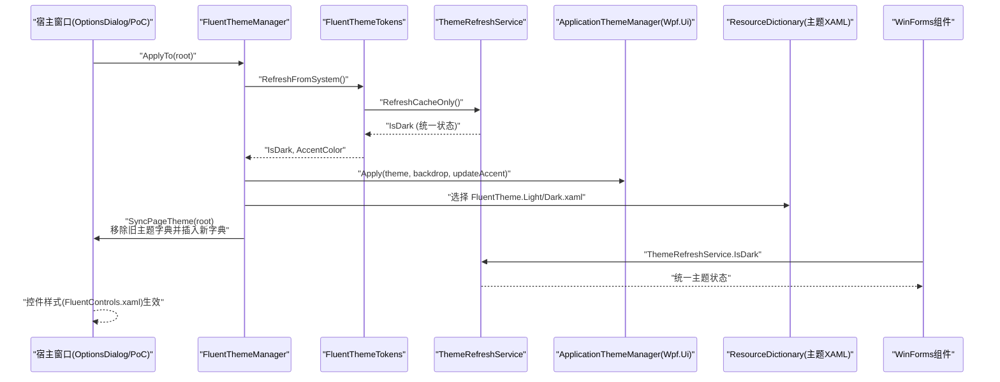
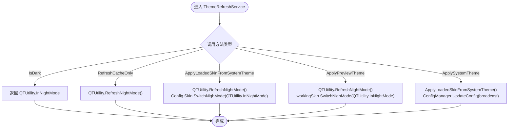
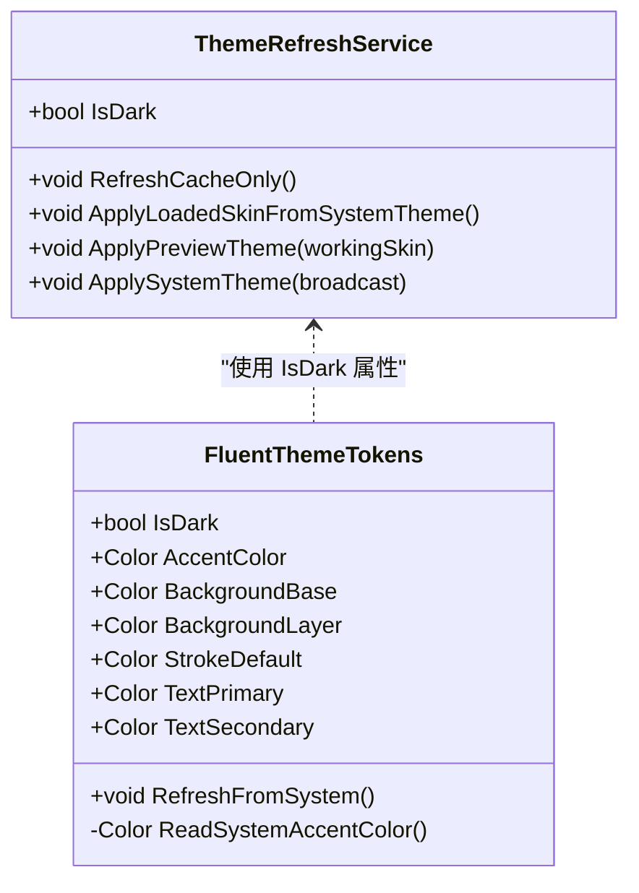
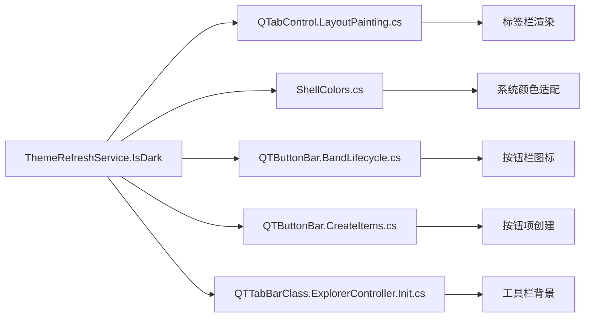
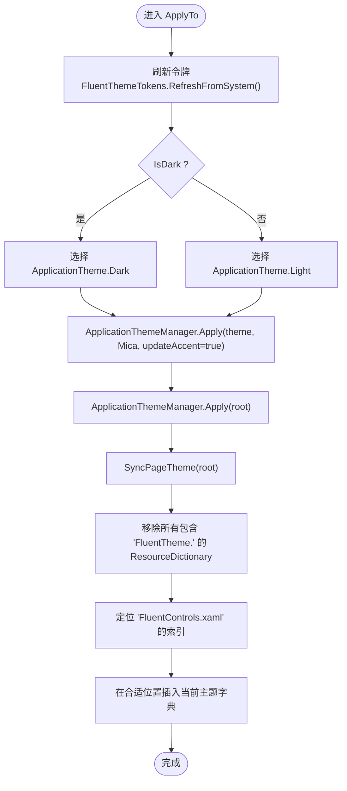
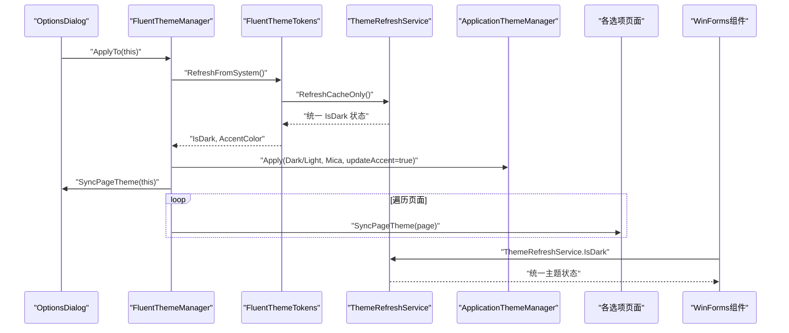
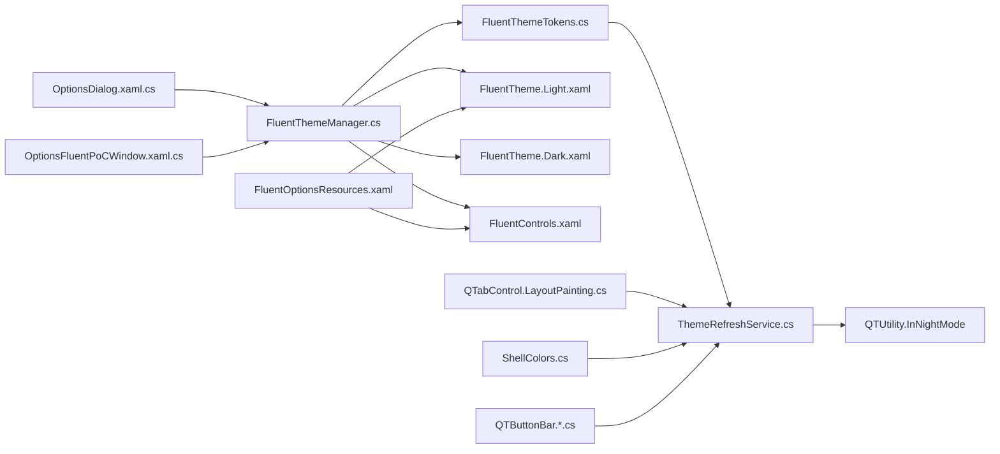

# 主题系统

<cite>
**本文引用的文件**   
- [ThemeRefreshService.cs](file://QTTabBar/ThemeRefreshService.cs)
- [FluentThemeManager.cs](file://QTTabBar/FluentThemeManager.cs)
- [FluentThemeTokens.cs](file://QTTabBar/FluentThemeTokens.cs)
- [OptionsDialog.xaml.cs](file://QTTabBar/OptionsDialog/OptionsDialog.xaml.cs)
- [OptionsFluentPoCWindow.xaml.cs](file://QTTabBar/OptionsDialog/OptionsFluentPoCWindow.xaml.cs)
- [FluentTheme.Dark.xaml](file://QTTabBar/OptionsDialog/Themes/FluentTheme.Dark.xaml)
- [FluentTheme.Light.xaml](file://QTTabBar/OptionsDialog/Themes/FluentTheme.Light.xaml)
- [FluentControls.xaml](file://QTTabBar/OptionsDialog/Themes/FluentControls.xaml)
- [FluentOptionsResources.xaml](file://QTTabBar/OptionsDialog/Themes/FluentOptionsResources.xaml)
- [QTabControl.LayoutPainting.cs](file://QTTabBar/QTabControl.LayoutPainting.cs)
- [ShellColors.cs](file://QTTabBar/ShellColors.cs)
- [QTButtonBar.BandLifecycle.cs](file://QTTabBar/QTButtonBar.BandLifecycle.cs)
- [QTButtonBar.CreateItems.cs](file://QTTabBar/QTButtonBar.CreateItems.cs)
- [QTTabBarClass.ExplorerController.Init.cs](file://QTTabBar/QTTabBarClass.ExplorerController.Init.cs)
</cite>

## 更新摘要
**变更内容**   
- 新增 ThemeRefreshService 统一主题检测服务，替代直接读取 QTUtility.InNightMode
- 更新 FluentThemeTokens 使用 ThemeRefreshService.IsDark 获取主题状态
- 统一标签栏和按钮栏的主题检测源，消除浅色/深色模式切换时的视觉不一致问题
- 增强主题刷新机制，确保所有 UI 组件使用单一主题状态源

## 目录
1. [简介](#简介)
2. [项目结构](#项目结构)
3. [核心组件](#核心组件)
4. [架构总览](#架构总览)
5. [详细组件分析](#详细组件分析)
6. [依赖关系分析](#依赖关系分析)
7. [性能与兼容性](#性能与兼容性)
8. [故障排查指南](#故障排查指南)
9. [结论](#结论)
10. [附录：主题开发与自定义步骤](#附录主题开发与自定义步骤)

## 简介
本文件面向 QTTabBar-Next 的主题系统，重点阐述 Fluent Design 的集成实现、深色/浅色模式切换逻辑、主题资源动态加载机制，以及颜色、字体、边框等视觉属性的主题化方式。文档同时提供主题开发指南与自定义主题创建步骤，并说明兼容性与回退策略。

**最新更新** 引入了 ThemeRefreshService 统一主题检测服务，解决了之前直接读取 QTUtility.InNightMode 导致的主题状态不一致问题。

## 项目结构
主题相关代码主要分布在以下位置：
- 统一主题服务：QTTabBar/ThemeRefreshService.cs（新增）
- 主题管理器与令牌：QTTabBar/FluentThemeManager.cs、QTTabBar/FluentThemeTokens.cs
- 选项对话框（WPF）：QTTabBar/OptionsDialog/OptionsDialog.xaml.cs、QTTabBar/OptionsDialog/OptionsFluentPoCWindow.xaml.cs
- XAML 主题资源：QTTabBar/OptionsDialog/Themes/FluentTheme.*.xaml、FluentControls.xaml、FluentOptionsResources.xaml
- WinForms 主题集成：QTTabBar/QTabControl.LayoutPainting.cs、QTTabBar/ShellColors.cs、QTTabBar/QTButtonBar.*.cs

**图表来源**
- [ThemeRefreshService.cs:1-30](file://QTTabBar/ThemeRefreshService.cs#L1-L30)
- [FluentThemeManager.cs:10-46](file://QTTabBar/FluentThemeManager.cs#L10-L46)
- [FluentThemeTokens.cs:40-62](file://QTTabBar/FluentThemeTokens.cs#L40-L62)
- [QTabControl.LayoutPainting.cs:98-120](file://QTTabBar/QTabControl.LayoutPainting.cs#L98-L120)
- [ShellColors.cs:46-145](file://QTTabBar/ShellColors.cs#L46-L145)
- [QTButtonBar.BandLifecycle.cs:112-122](file://QTTabBar/QTButtonBar.BandLifecycle.cs#L112-L122)

## 核心组件
- **ThemeRefreshService（新增）**：统一的主题检测服务，提供 IsDark 属性替代直接读取 QTUtility.InNightMode，确保所有 UI 组件使用单一主题状态源。
- FluentThemeManager：负责将 Fluent 主题应用到 WPF 根元素，动态选择并插入对应主题资源字典，确保与控件样式正确叠加。
- FluentThemeTokens：集中定义 Fluent 设计令牌（背景、文本、描边、圆角、强调色），并通过 ThemeRefreshService 获取当前模式与强调色。
- XAML 主题资源：
  - FluentTheme.Light.xaml / FluentTheme.Dark.xaml：定义颜色、厚度、圆角、字号等基础资源键。
  - FluentControls.xaml：为常用控件提供 Fluent 风格样式（标题、描述、导航项、按钮等）。
  - FluentOptionsResources.xaml：默认合并浅色主题与控件样式，作为初始资源入口。
- WinForms 主题集成：QTabControl、ShellColors、QTButtonBar 等组件通过 ThemeRefreshService.IsDark 获取统一的主题状态。

**章节来源**
- [ThemeRefreshService.cs:1-30](file://QTTabBar/ThemeRefreshService.cs#L1-L30)
- [FluentThemeManager.cs:10-46](file://QTTabBar/FluentThemeManager.cs#L10-L46)
- [FluentThemeTokens.cs:10-62](file://QTTabBar/FluentThemeTokens.cs#L10-L62)
- [QTabControl.LayoutPainting.cs:98-120](file://QTTabBar/QTabControl.LayoutPainting.cs#L98-L120)
- [ShellColors.cs:46-145](file://QTTabBar/ShellColors.cs#L46-L145)
- [QTButtonBar.BandLifecycle.cs:112-122](file://QTTabBar/QTButtonBar.BandLifecycle.cs#L112-L122)

## 架构总览
主题系统的运行流程如下：
- 窗口初始化时调用主题管理器 ApplyTo，通过 ThemeRefreshService 刷新令牌并应用全局主题。
- 管理器根据 ThemeRefreshService.IsDark 决定使用深色或浅色主题资源字典，并将其插入到根元素的 MergedDictionaries 中。
- 通过 FluentControls.xaml 提供的样式，页面中的 TextBlock、ListBox、Button 等控件自动获得 Fluent 外观。
- WinForms 组件（标签栏、按钮栏）也通过 ThemeRefreshService.IsDark 获取统一的主题状态，消除视觉不一致问题。
- 强调色从系统注册表读取，若失败则回退到内置强调色。

**图表来源**
- [OptionsDialog.xaml.cs:196-247](file://QTTabBar/OptionsDialog/OptionsDialog.xaml.cs#L196-L247)
- [OptionsFluentPoCWindow.xaml.cs:10-16](file://QTTabBar/OptionsDialog/OptionsFluentPoCWindow.xaml.cs#L10-L16)
- [FluentThemeManager.cs:10-46](file://QTTabBar/FluentThemeManager.cs#L10-L46)
- [FluentThemeTokens.cs:40-62](file://QTTabBar/FluentThemeTokens.cs#L40-L62)
- [ThemeRefreshService.cs:1-30](file://QTTabBar/ThemeRefreshService.cs#L1-L30)
- [QTabControl.LayoutPainting.cs:98-120](file://QTTabBar/QTabControl.LayoutPainting.cs#L98-L120)

## 详细组件分析

### ThemeRefreshService：统一主题检测服务（新增）
职责
- 提供统一的 IsDark 属性，替代直接读取 QTUtility.InNightMode
- 封装主题刷新逻辑，包括系统主题检测和皮肤应用
- 协调 WPF 和 WinForms 组件的主题状态同步

关键方法
- IsDark 属性：返回 QTUtility.InNightMode 的值，作为统一的主题检测入口
- RefreshCacheOnly()：仅刷新夜间模式缓存，不调用皮肤切换
- ApplyLoadedSkinFromSystemTheme()：应用系统主题到已加载的配置
- ApplyPreviewTheme(Config._Skin workingSkin)：应用预览主题到工作配置
- ApplySystemTheme(bool broadcast = true)：应用系统主题并广播配置更新

**更新** 此服务解决了之前各组件直接读取 QTUtility.InNightMode 导致的状态不一致问题。

**图表来源**
- [ThemeRefreshService.cs:1-30](file://QTTabBar/ThemeRefreshService.cs#L1-L30)

**章节来源**
- [ThemeRefreshService.cs:1-30](file://QTTabBar/ThemeRefreshService.cs#L1-L30)

### FluentThemeTokens：颜色令牌与系统集成
职责
- 定义浅色/深色两套基础颜色令牌（背景基色、背景层、描边、主次文本）。
- 定义圆角常量（小、中、标签页）。
- 提供 IsDark 与 AccentColor 属性，通过 ThemeRefreshService 封装从系统读取逻辑。
- 读取系统强调色：从注册表 DWM 的 ColorizationColor 解析 ARGB；异常时记录错误日志并回退到内置强调色。

数据流
- RefreshFromSystem()：调用 ThemeRefreshService.RefreshCacheOnly() 获取统一主题状态；调用 ReadSystemAccentColor() 更新 AccentColor。
- 只读访问器 BackgroundBase/BackgroundLayer/StrokeDefault/TextPrimary/TextSecondary 根据 IsDark 返回对应颜色。

**更新** 现在通过 ThemeRefreshService 获取 IsDark 值，确保与 WinForms 组件使用同一主题状态源。

**图表来源**
- [ThemeRefreshService.cs:1-30](file://QTTabBar/ThemeRefreshService.cs#L1-L30)
- [FluentThemeTokens.cs:10-62](file://QTTabBar/FluentThemeTokens.cs#L10-L62)

**章节来源**
- [FluentThemeTokens.cs:10-62](file://QTTabBar/FluentThemeTokens.cs#L10-L62)
- [ThemeRefreshService.cs:1-30](file://QTTabBar/ThemeRefreshService.cs#L1-L30)

### WinForms 主题集成
**更新** 所有 WinForms 组件现在通过 ThemeRefreshService.IsDark 获取统一的主题状态，消除了之前的视觉不一致问题。

关键集成点
- QTabControl.LayoutPainting.cs：标签栏绘制时使用 ThemeRefreshService.IsDark 判断主题模式
- ShellColors.cs：系统颜色适配基于 ThemeRefreshService.IsDark 动态选择颜色方案
- QTButtonBar.BandLifecycle.cs：按钮栏图片加载根据主题模式选择不同资源
- QTButtonBar.CreateItems.cs：按钮项创建时应用主题相关的颜色和样式
- QTTabBarClass.ExplorerController.Init.cs：工具栏背景色设置使用统一主题检测

**图表来源**
- [QTabControl.LayoutPainting.cs:98-120](file://QTTabBar/QTabControl.LayoutPainting.cs#L98-L120)
- [ShellColors.cs:46-145](file://QTTabBar/ShellColors.cs#L46-L145)
- [QTButtonBar.BandLifecycle.cs:112-122](file://QTTabBar/QTButtonBar.BandLifecycle.cs#L112-L122)
- [QTButtonBar.CreateItems.cs:256-268](file://QTTabBar/QTButtonBar.CreateItems.cs#L256-L268)
- [QTTabBarClass.ExplorerController.Init.cs:130](file://QTTabBar/QTTabBarClass.ExplorerController.Init.cs#L130)

**章节来源**
- [QTabControl.LayoutPainting.cs:98-120](file://QTTabBar/QTabControl.LayoutPainting.cs#L98-L120)
- [ShellColors.cs:46-145](file://QTTabBar/ShellColors.cs#L46-L145)
- [QTButtonBar.BandLifecycle.cs:112-122](file://QTTabBar/QTButtonBar.BandLifecycle.cs#L112-L122)
- [QTButtonBar.CreateItems.cs:256-268](file://QTTabBar/QTButtonBar.CreateItems.cs#L256-L268)
- [QTTabBarClass.ExplorerController.Init.cs:130](file://QTTabBar/QTTabBarClass.ExplorerController.Init.cs#L130)

### FluentThemeManager：主题管理机制
职责
- 刷新令牌：调用 FluentThemeTokens.RefreshFromSystem() 获取当前系统主题与强调色。
- 应用全局主题：基于 IsDark 选择 ApplicationTheme.Light/Dark，并通过 Wpf.Ui 的 ApplicationThemeManager 应用主题与背景效果。
- 同步页面主题：清理已存在的"FluentTheme."主题字典，按优先级插入新的主题字典，确保在 FluentControls.xaml 之前加载，以便样式覆盖顺序正确。

关键行为
- ApplyTo(FrameworkElement root)：入口方法，完成令牌刷新、全局主题应用与页面主题同步。
- SyncPageTheme(FrameworkElement root)：遍历根资源的 MergedDictionaries，移除包含"FluentTheme."的资源，再插入当前主题字典；查找"FluentControls.xaml"的位置以控制插入索引。
- ThemeUri(bool isDark)：构造相对 URI，指向 FluentTheme.Light.xaml 或 FluentTheme.Dark.xaml。

**图表来源**
- [FluentThemeManager.cs:10-46](file://QTTabBar/FluentThemeManager.cs#L10-L46)

**章节来源**
- [FluentThemeManager.cs:10-46](file://QTTabBar/FluentThemeManager.cs#L10-L46)

### XAML 主题文件结构与自定义方法
- FluentTheme.Light.xaml / FluentTheme.Dark.xaml
  - 定义颜色键（如 Fluent.BackgroundBase.Color、Fluent.TextPrimary.Color 等）。
  - 定义 SolidColorBrush 键（如 Fluent.BackgroundBase、Fluent.TextPrimary 等）。
  - 定义 Thickness、CornerRadius、Double 等布局与排版资源键。
- FluentControls.xaml
  - 为 TextBlock、CheckBox、Button、ListBox、ListBoxItem 等提供 Fluent 风格样式。
  - 使用 DynamicResource 引用主题资源键，使样式随主题切换而更新。
- FluentOptionsResources.xaml
  - 默认合并浅色主题与控件样式，作为应用的初始资源入口。

自定义方法
- 新增主题：复制现有 Light/Dark 主题文件，修改颜色与尺寸资源键值；保持键名一致以确保样式引用有效。
- 替换默认主题：修改 FluentOptionsResources.xaml 的合并源，指向新的主题文件。
- 扩展控件样式：在 FluentControls.xaml 中添加或覆盖样式，使用 DynamicResource 绑定主题资源键。

**章节来源**
- [FluentTheme.Light.xaml:1-30](file://QTTabBar/OptionsDialog/Themes/FluentTheme.Light.xaml#L1-L30)
- [FluentTheme.Dark.xaml:1-30](file://QTTabBar/OptionsDialog/Themes/FluentTheme.Dark.xaml#L1-L30)
- [FluentControls.xaml:1-86](file://QTTabBar/OptionsDialog/Themes/FluentControls.xaml#L1-L86)
- [FluentOptionsResources.xaml:1-10](file://QTTabBar/OptionsDialog/Themes/FluentOptionsResources.xaml#L1-L10)

### 深色/浅色模式切换逻辑
- 切换触发点：窗口初始化时调用 FluentThemeManager.ApplyTo(this)，内部先通过 ThemeRefreshService 刷新令牌，再根据 IsDark 选择主题。
- 页面级同步：对每个 Options 页面调用 FluentThemeManager.SyncPageTheme(tab)，确保页面资源字典按规则插入。
- WinForms 组件同步：所有 WinForms 组件通过 ThemeRefreshService.IsDark 获取统一主题状态，确保标签栏和按钮栏视觉一致性。
- 强调色更新：ApplicationThemeManager.Apply 时传入 updateAccent=true，结合系统强调色进行应用。

**图表来源**
- [OptionsDialog.xaml.cs:196-247](file://QTTabBar/OptionsDialog/OptionsDialog.xaml.cs#L196-L247)
- [FluentThemeManager.cs:10-46](file://QTTabBar/FluentThemeManager.cs#L10-L46)
- [FluentThemeTokens.cs:40-62](file://QTTabBar/FluentThemeTokens.cs#L40-L62)
- [ThemeRefreshService.cs:1-30](file://QTTabBar/ThemeRefreshService.cs#L1-L30)

**章节来源**
- [OptionsDialog.xaml.cs:196-247](file://QTTabBar/OptionsDialog/OptionsDialog.xaml.cs#L196-L247)
- [FluentThemeManager.cs:10-46](file://QTTabBar/FluentThemeManager.cs#L10-L46)
- [FluentThemeTokens.cs:40-62](file://QTTabBar/FluentThemeTokens.cs#L40-L62)
- [ThemeRefreshService.cs:1-30](file://QTTabBar/ThemeRefreshService.cs#L1-L30)

### 视觉属性主题化实现
- 颜色：通过 FluentTheme.*.xaml 中的 Color 与 SolidColorBrush 键暴露给样式；控件样式使用 DynamicResource 引用，支持运行时切换。
- 字体：页面标题、描述、分区标题的字号由主题资源键 Fluent.PageTitleFontSize、Fluent.PageDescriptionFontSize、Fluent.SectionHeaderFontSize 控制。
- 边框与间距：Thickness 与 CornerRadius 资源键统一控制页面边距、卡片内边距、分区间距与圆角。
- 强调色：Accent 资源键用于选中态、高亮等场景，强调色来自系统注册表，失败时回退到内置强调色。
- **统一主题状态**：所有组件现在通过 ThemeRefreshService.IsDark 获取主题状态，确保标签栏、按钮栏和选项界面的一致性。

**章节来源**
- [FluentTheme.Light.xaml:1-30](file://QTTabBar/OptionsDialog/Themes/FluentTheme.Light.xaml#L1-L30)
- [FluentTheme.Dark.xaml:1-30](file://QTTabBar/OptionsDialog/Themes/FluentTheme.Dark.xaml#L1-L30)
- [FluentControls.xaml:1-86](file://QTTabBar/OptionsDialog/Themes/FluentControls.xaml#L1-L86)
- [FluentThemeTokens.cs:10-62](file://QTTabBar/FluentThemeTokens.cs#L10-L62)
- [ThemeRefreshService.cs:1-30](file://QTTabBar/ThemeRefreshService.cs#L1-L30)

## 依赖关系分析
- 统一主题服务依赖：
  - ThemeRefreshService 依赖 QTUtility.InNightMode 作为底层主题状态源
  - 所有其他组件依赖 ThemeRefreshService.IsDark 而非直接访问 QTUtility.InNightMode
- 主题管理器依赖：
  - Wpf.Ui.Appearance.ApplicationThemeManager：应用全局主题与背景效果。
  - FluentThemeTokens：提供 IsDark 与 AccentColor。
- 资源依赖：
  - FluentOptionsResources.xaml 默认合并浅色主题与控件样式。
  - FluentControls.xaml 使用 DynamicResource 引用主题资源键。
- 宿主窗口依赖：
  - OptionsDialog 与 PoC 窗口在构造函数中调用 FluentThemeManager.ApplyTo(this)。
- WinForms 组件依赖：
  - QTabControl、ShellColors、QTButtonBar 等组件通过 ThemeRefreshService.IsDark 获取统一主题状态。

**图表来源**
- [OptionsDialog.xaml.cs:196-247](file://QTTabBar/OptionsDialog/OptionsDialog.xaml.cs#L196-L247)
- [OptionsFluentPoCWindow.xaml.cs:10-16](file://QTTabBar/OptionsDialog/OptionsFluentPoCWindow.xaml.cs#L10-L16)
- [FluentThemeManager.cs:10-46](file://QTTabBar/FluentThemeManager.cs#L10-L46)
- [FluentThemeTokens.cs:40-62](file://QTTabBar/FluentThemeTokens.cs#L40-L62)
- [ThemeRefreshService.cs:1-30](file://QTTabBar/ThemeRefreshService.cs#L1-L30)
- [QTabControl.LayoutPainting.cs:98-120](file://QTTabBar/QTabControl.LayoutPainting.cs#L98-L120)
- [ShellColors.cs:46-145](file://QTTabBar/ShellColors.cs#L46-L145)
- [QTButtonBar.BandLifecycle.cs:112-122](file://QTTabBar/QTButtonBar.BandLifecycle.cs#L112-L122)

**章节来源**
- [OptionsDialog.xaml.cs:196-247](file://QTTabBar/OptionsDialog/OptionsDialog.xaml.cs#L196-L247)
- [OptionsFluentPoCWindow.xaml.cs:10-16](file://QTTabBar/OptionsDialog/OptionsFluentPoCWindow.xaml.cs#L10-L16)
- [FluentThemeManager.cs:10-46](file://QTTabBar/FluentThemeManager.cs#L10-L46)
- [FluentThemeTokens.cs:40-62](file://QTTabBar/FluentThemeTokens.cs#L40-L62)
- [ThemeRefreshService.cs:1-30](file://QTTabBar/ThemeRefreshService.cs#L1-L30)
- [QTabControl.LayoutPainting.cs:98-120](file://QTTabBar/QTabControl.LayoutPainting.cs#L98-L120)
- [ShellColors.cs:46-145](file://QTTabBar/ShellColors.cs#L46-L145)
- [QTButtonBar.BandLifecycle.cs:112-122](file://QTTabBar/QTButtonBar.BandLifecycle.cs#L112-L122)

## 性能与兼容性
- 性能
  - 主题切换仅在窗口初始化与页面同步时执行，避免频繁重建资源字典。
  - 使用 DynamicResource 减少运行时重绘开销，样式变更通过资源键更新。
  - ThemeRefreshService 提供缓存机制，避免重复读取系统主题状态。
- 兼容性
  - 强调色读取失败时回退到内置强调色，保证界面可用性。
  - 主题资源键命名规范，便于在不同主题间保持一致性。
  - 通过 ApplicationThemeManager 的 updateAccent 参数确保强调色及时生效。
  - **统一主题检测**：所有组件使用 ThemeRefreshService.IsDark，消除了浅色/深色模式切换时的视觉不一致问题。

## 故障排查指南
常见问题与处理建议
- 主题未生效
  - 检查是否在窗口初始化阶段调用了 FluentThemeManager.ApplyTo(this)。
  - 确认 FluentOptionsResources.xaml 是否正确合并了主题与控件样式。
  - 验证 ThemeRefreshService.IsDark 是否返回正确的主题状态。
- 强调色不正确
  - 查看系统注册表 DWM 的 ColorizationColor 是否可读；若不可读，系统将回退到内置强调色。
  - 关注错误日志输出路径（ReadSystemAccentColor 的错误记录）。
- 样式覆盖顺序异常
  - 确认主题字典插入位置在 FluentControls.xaml 之前，以保证样式覆盖顺序正确。
- **主题状态不一致**
  - 检查所有组件是否使用 ThemeRefreshService.IsDark 而非直接读取 QTUtility.InNightMode。
  - 验证 ThemeRefreshService.ApplySystemTheme(true) 是否正确广播配置更新。
  - 确认 WinForms 组件（标签栏、按钮栏）与 WPF 组件使用相同的主题状态源。

**章节来源**
- [FluentThemeManager.cs:20-41](file://QTTabBar/FluentThemeManager.cs#L20-L41)
- [FluentThemeTokens.cs:45-62](file://QTTabBar/FluentThemeTokens.cs#L45-L62)
- [FluentOptionsResources.xaml:1-10](file://QTTabBar/OptionsDialog/Themes/FluentOptionsResources.xaml#L1-L10)
- [ThemeRefreshService.cs:1-30](file://QTTabBar/ThemeRefreshService.cs#L1-L30)

## 结论
QTTabBar-Next 的主题系统通过新增的 ThemeRefreshService 统一主题检测服务，实现了跨 WPF 和 WinForms 组件的统一主题状态管理。FluentThemeManager 与 FluentThemeTokens 协同工作，配合 ThemeRefreshService 确保了深色/浅色模式的无缝切换与强调色动态应用。XAML 主题资源采用统一的键命名与 DynamicResource 引用，使得样式可维护且易于扩展。整体架构清晰、可扩展性强，并为后续主题定制提供了良好基础。

**最新更新** 引入的 ThemeRefreshService 彻底解决了标签栏和按钮栏在浅色/深色模式切换时的视觉不一致问题，确保了整个界面的主题一致性。

## 附录：主题开发与自定义步骤
- 新建主题
  - 复制 FluentTheme.Light.xaml 或 FluentTheme.Dark.xaml，修改颜色、厚度、圆角、字号等资源键值。
  - 保持键名不变，确保控件样式能正确引用。
- 替换默认主题
  - 修改 FluentOptionsResources.xaml 的合并源，指向新主题文件。
- 扩展控件样式
  - 在 FluentControls.xaml 中添加或覆盖样式，使用 DynamicResource 引用主题资源键。
- 验证与测试
  - 在 OptionsDialog 或 PoC 窗口中调用 FluentThemeManager.ApplyTo(this) 进行预览。
  - 检查强调色读取与回退逻辑是否正常。
  - **验证统一主题状态**：确认标签栏、按钮栏和选项界面在主题切换时保持一致的外观。
  - **测试 ThemeRefreshService**：验证 ThemeRefreshService.IsDark 在所有组件中返回相同值。

**章节来源**
- [FluentTheme.Light.xaml:1-30](file://QTTabBar/OptionsDialog/Themes/FluentTheme.Light.xaml#L1-L30)
- [FluentTheme.Dark.xaml:1-30](file://QTTabBar/OptionsDialog/Themes/FluentTheme.Dark.xaml#L1-L30)
- [FluentControls.xaml:1-86](file://QTTabBar/OptionsDialog/Themes/FluentControls.xaml#L1-L86)
- [FluentOptionsResources.xaml:1-10](file://QTTabBar/OptionsDialog/Themes/FluentOptionsResources.xaml#L1-L10)
- [OptionsDialog.xaml.cs:196-247](file://QTTabBar/OptionsDialog/OptionsDialog.xaml.cs#L196-L247)
- [OptionsFluentPoCWindow.xaml.cs:10-16](file://QTTabBar/OptionsDialog/OptionsFluentPoCWindow.xaml.cs#L10-L16)
- [ThemeRefreshService.cs:1-30](file://QTTabBar/ThemeRefreshService.cs#L1-L30)