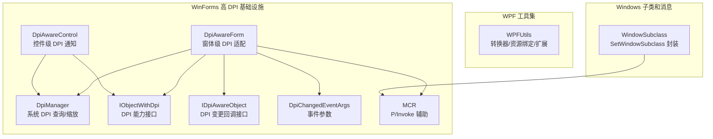
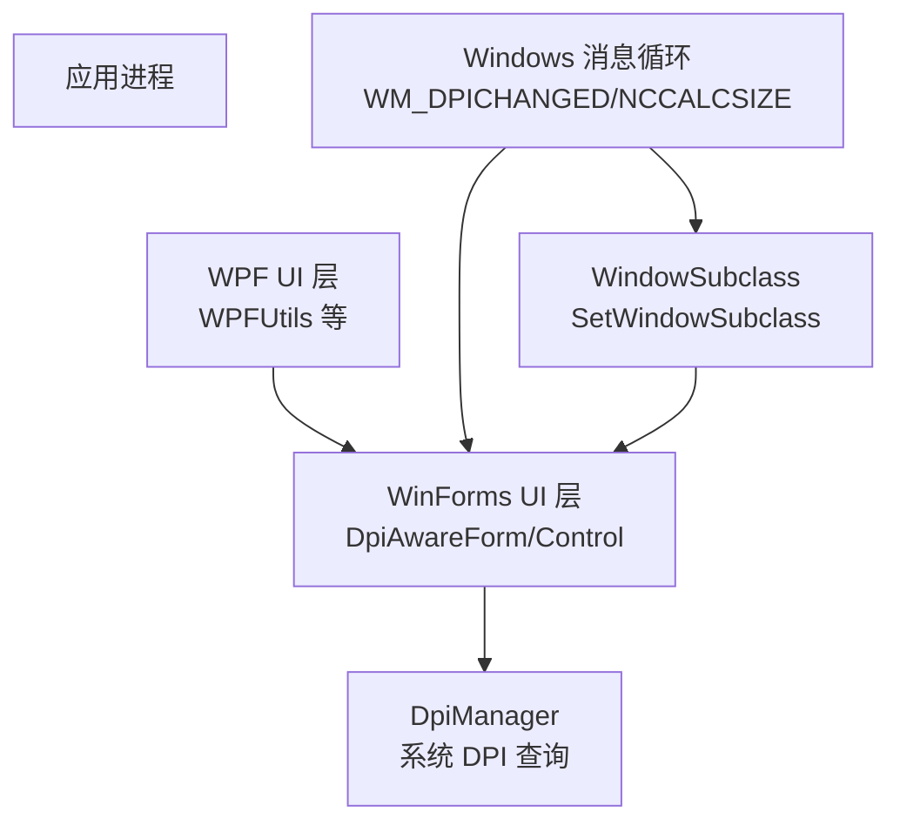
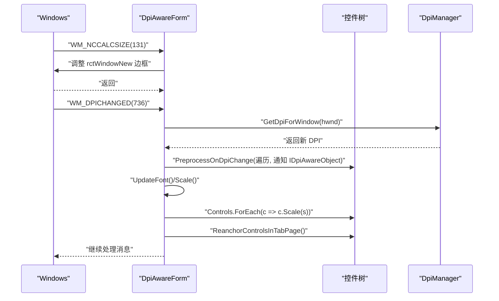
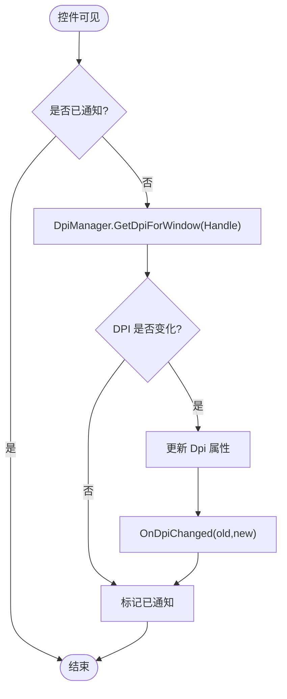
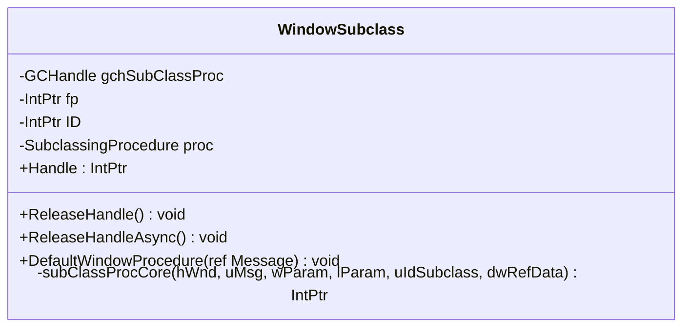
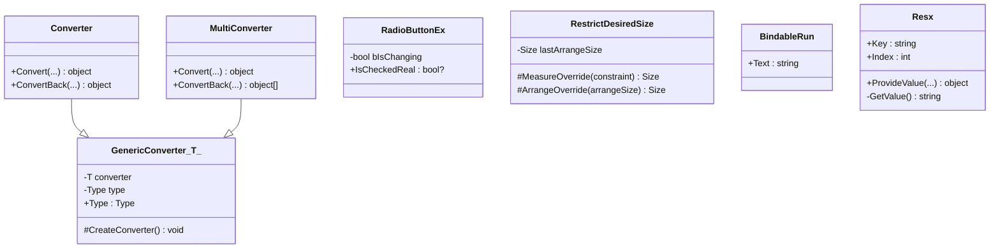
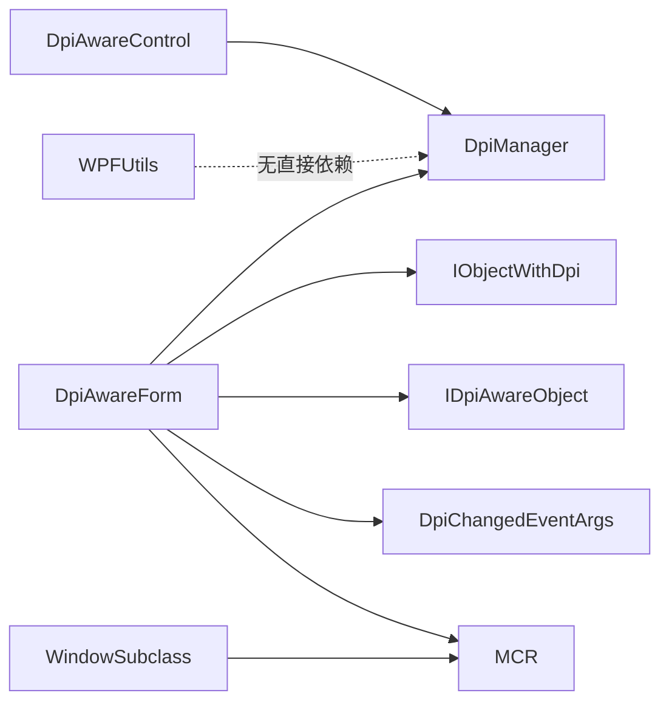

# 混合编程

<cite>
**本文引用的文件**   
- [WPFUtils.cs](file://QTTabBar/WPFUtils.cs)
- [DpiAwareControl.cs](file://BandObjectLib/Dpi/DpiAwareControl.cs)
- [DpiAwareForm.cs](file://BandObjectLib/Dpi/DpiAwareForm.cs)
- [DpiManager.cs](file://BandObjectLib/Dpi/DpiManager.cs)
- [IDpiAwareObject.cs](file://BandObjectLib/Dpi/IDpiAwareObject.cs)
- [IObjectWithDpi.cs](file://BandObjectLib/Dpi/IObjectWithDpi.cs)
- [DpiChangedEventArgs.cs](file://BandObjectLib/Dpi/DpiChangedEventArgs.cs)
- [MCR.cs](file://BandObjectLib/Dpi/MCR.cs)
- [WindowSubclass.cs](file://QTTabBar/QTTabBar/WindowSubclass.cs)
</cite>

## 目录
1. [简介](#简介)
2. [项目结构](#项目结构)
3. [核心组件](#核心组件)
4. [架构总览](#架构总览)
5. [详细组件分析](#详细组件分析)
6. [依赖关系分析](#依赖关系分析)
7. [性能考虑](#性能考虑)
8. [故障排查指南](#故障排查指南)
9. [结论](#结论)
10. [附录](#附录)

## 简介
本文件面向 QTTabBar-Next 的 WPF 与 WinForms 混合编程场景，聚焦以下主题：
- WPF 与 WinForms 控件互操作机制（含 ElementHost 使用思路、消息传递）
- DpiAwareControl 与 DpiAwareForm 的高 DPI 适配实现
- WPFUtils 工具类提供的混合编程辅助方法
- 窗口句柄转换、事件桥接与资源共享的技术方案
- 最佳实践与常见问题解决方案
- 性能考量与内存泄漏防护

说明：本文档以仓库中实际存在的代码为依据进行解读。对于未在仓库中直接出现的 API（如 ElementHost），将以概念性图示和通用做法说明，并明确标注为“概念性内容”。

## 项目结构
围绕混合编程与高 DPI 适配的关键代码主要分布在两个位置：
- BandObjectLib/Dpi：WinForms 侧的高 DPI 基础设施（DpiManager、DpiAwareForm、DpiAwareControl、接口与事件参数等）
- QTTabBar/WPFUtils.cs：WPF 侧的工具类与扩展（资源绑定、数据绑定修复、MarkupExtension 等）

图表来源
- [DpiManager.cs:25-157](file://BandObjectLib/Dpi/DpiManager.cs#L25-L157)
- [DpiAwareForm.cs:16-178](file://BandObjectLib/Dpi/DpiAwareForm.cs#L16-L178)
- [DpiAwareControl.cs:23-62](file://BandObjectLib/Dpi/DpiAwareControl.cs#L23-L62)
- [IObjectWithDpi.cs:9-15](file://BandObjectLib/Dpi/IObjectWithDpi.cs#L9-L15)
- [IDpiAwareObject.cs:9-12](file://BandObjectLib/Dpi/IDpiAwareObject.cs#L9-L12)
- [DpiChangedEventArgs.cs:12-19](file://BandObjectLib/Dpi/DpiChangedEventArgs.cs#L12-L19)
- [MCR.cs:7-72](file://BandObjectLib/Dpi/MCR.cs#L7-L72)
- [WindowSubclass.cs:8-128](file://QTTabBar/QTTabBar/WindowSubclass.cs#L8-L128)

章节来源
- [DpiManager.cs:25-157](file://BandObjectLib/Dpi/DpiManager.cs#L25-L157)
- [DpiAwareForm.cs:16-178](file://BandObjectLib/Dpi/DpiAwareForm.cs#L16-L178)
- [DpiAwareControl.cs:23-62](file://BandObjectLib/Dpi/DpiAwareControl.cs#L23-L62)
- [WPFUtils.cs:27-286](file://QTTabBar/WPFUtils.cs#L27-L286)
- [WindowSubclass.cs:8-128](file://QTTabBar/QTTabBar/WindowSubclass.cs#L8-L128)

## 核心组件
- DpiManager：提供跨显示器 DPI 检测、默认 DPI、最大 DPI、按窗口/点获取 DPI 与缩放比等能力，封装了 GetDpiForMonitor/GetDpiForWindow 等 P/Invoke。
- IObjectWithDpi / IDpiAwareObject：定义 DPI 能力与 DPI 变更回调的统一契约，便于在控件树中向上查找具备 DPI 能力的父容器。
- DpiAwareForm：窗体级 DPI 适配，处理 WM_DPICHANGED 与 NCCALCSIZE 等消息，支持字体缩放与尺寸缩放两种模式，并在 DPI 变化时重算布局。
- DpiAwareControl：控件级 DPI 感知基类，首次可见时自动探测 DPI，并提供 OnDpiChanged 虚方法供派生类重写。
- WindowSubclass：基于 SetWindowSubclass 的窗口子类化封装，用于拦截/转发 Windows 消息，避免直接覆盖 WndProc 带来的副作用。
- WPFUtils：提供 WPF 侧的通用转换器、资源弱引用绑定（Resx）、以及针对 RadioButton 数据绑定的修复类等实用工具。

章节来源
- [DpiManager.cs:25-157](file://BandObjectLib/Dpi/DpiManager.cs#L25-L157)
- [IObjectWithDpi.cs:9-15](file://BandObjectLib/Dpi/IObjectWithDpi.cs#L9-L15)
- [IDpiAwareObject.cs:9-12](file://BandObjectLib/Dpi/IDpiAwareObject.cs#L9-L12)
- [DpiAwareForm.cs:16-178](file://BandObjectLib/Dpi/DpiAwareForm.cs#L16-L178)
- [DpiAwareControl.cs:23-62](file://BandObjectLib/Dpi/DpiAwareControl.cs#L23-L62)
- [WindowSubclass.cs:8-128](file://QTTabBar/QTTabBar/WindowSubclass.cs#L8-L128)
- [WPFUtils.cs:27-286](file://QTTabBar/WPFUtils.cs#L27-L286)

## 架构总览
下图展示了 WinForms 高 DPI 体系与 WPF 工具集的协作关系，以及与 Windows 子系统（DPI API、消息循环）的交互。

图表来源
- [DpiManager.cs:25-157](file://BandObjectLib/Dpi/DpiManager.cs#L25-L157)
- [DpiAwareForm.cs:16-178](file://BandObjectLib/Dpi/DpiAwareForm.cs#L16-L178)
- [WindowSubclass.cs:8-128](file://QTTabBar/QTTabBar/WindowSubclass.cs#L8-L128)
- [WPFUtils.cs:27-286](file://QTTabBar/WPFUtils.cs#L27-L286)

## 详细组件分析

### DpiAwareForm 高 DPI 适配流程
- 启动阶段：若未启用字体缩放且非每显示器 DPI 支持环境，则在创建句柄前预缩放（ScaleBeforeHandleIsCreatedCore）。
- 句柄创建后：根据当前窗口所在显示器的 DPI 计算 Scaling，必要时更新字体或整体缩放。
- DPI 变化：拦截 WM_DPICHANGED（消息号 736），保存旧 DPI，计算新 DPI 与边界矩形，触发 OnDpiChanged；同时处理 NCCALCSIZE（消息号 131）在非每显示器模式下修正边框计算。
- 控件树预处理：遍历控件树，对实现了 IDpiAwareObject 的控件调用 NotifyDpiChanged；临时解除 TabPage 中右下角锚定控件的 Anchor，完成缩放后再恢复。

图表来源
- [DpiAwareForm.cs:37-143](file://BandObjectLib/Dpi/DpiAwareForm.cs#L37-L143)
- [DpiManager.cs:50-80](file://BandObjectLib/Dpi/DpiManager.cs#L50-L80)
- [IDpiAwareObject.cs:9-12](file://BandObjectLib/Dpi/IDpiAwareObject.cs#L9-L12)

章节来源
- [DpiAwareForm.cs:16-178](file://BandObjectLib/Dpi/DpiAwareForm.cs#L16-L178)
- [DpiManager.cs:50-80](file://BandObjectLib/Dpi/DpiManager.cs#L50-L80)

### DpiAwareControl 控件级 DPI 感知
- 首次可见时：若尚未收到 DPI 通知，则通过 DpiManager.GetDpiForWindow 获取当前 DPI，若发生变化则触发 OnDpiChanged。
- 外部通知：当父容器（如 DpiAwareForm）调用 NotifyDpiChanged 时，更新内部 Dpi 并派发 OnDpiChanged。

图表来源
- [DpiAwareControl.cs:50-61](file://BandObjectLib/Dpi/DpiAwareControl.cs#L50-L61)
- [DpiManager.cs:50-80](file://BandObjectLib/Dpi/DpiManager.cs#L50-L80)

章节来源
- [DpiAwareControl.cs:23-62](file://BandObjectLib/Dpi/DpiAwareControl.cs#L23-L62)

### WindowSubclass 窗口子类化与消息桥接
- 作用：通过 SetWindowSubclass 将自定义过程挂入目标窗口消息链，统一捕获/转发消息，避免直接覆写 WndProc 的风险。
- 生命周期：构造时分配委托与函数指针并注册子类；ReleaseHandle/ReleaseHandleAsync 负责移除子类与释放资源。
- 消息处理：对特定消息（如销毁消息）做特殊处理；异常路径记录日志并回退到默认过程。

图表来源
- [WindowSubclass.cs:8-128](file://QTTabBar/QTTabBar/WindowSubclass.cs#L8-L128)

章节来源
- [WindowSubclass.cs:8-128](file://QTTabBar/QTTabBar/WindowSubclass.cs#L8-L128)

### WPFUtils 工具集与混合编程辅助
- 通用转换器包装：GenericConverter<T> 配合 Converter/MultiConverter 延迟实例化具体转换器，减少 XAML 中的样板代码。
- RadioButtonEx：修复 .NET 3.5 下 IsChecked 双向绑定的已知问题，通过附加依赖属性与标志位避免递归更新。
- RestrictDesiredSize：解决 ListView 在 ScrollViewer 内的最小高度测量问题。
- BindableRun：为 Run 提供可绑定的 Text 依赖属性，便于富文本动态更新。
- Resx MarkupExtension：通过弱事件监听资源更新，避免强引用导致的内存泄漏；支持索引与参数占位符，便于国际化字符串的动态刷新。

图表来源
- [WPFUtils.cs:29-75](file://QTTabBar/WPFUtils.cs#L29-L75)
- [WPFUtils.cs:77-115](file://QTTabBar/WPFUtils.cs#L77-L115)
- [WPFUtils.cs:117-133](file://QTTabBar/WPFUtils.cs#L117-L133)
- [WPFUtils.cs:135-154](file://QTTabBar/WPFUtils.cs#L135-L154)
- [WPFUtils.cs:156-285](file://QTTabBar/WPFUtils.cs#L156-L285)

章节来源
- [WPFUtils.cs:27-286](file://QTTabBar/WPFUtils.cs#L27-L286)

### 概念性概览：WPF 与 WinForms 互操作要点
- ElementHost 使用思路：在 WPF 中承载 WinForms 控件（如 DpiAwareForm 或其子控件）时，建议将 DPI 感知逻辑集中在 WinForms 侧（DpiAwareForm/Control），由 WPF 侧仅负责宿主生命周期管理。
- 消息传递：跨框架的消息可通过 Windows 消息机制（如 RegisterWindowMessage）结合 WindowSubclass 进行桥接；也可通过 IPC 或共享状态对象（线程安全前提下）进行通信。
- 句柄转换：从 WPF 获取底层 HWND 后，再交由 WinForms 侧进行 DPI 查询与布局调整；反之亦然。
- 资源共享：图片、字体等资源建议在共享层加载一次，通过只读引用在两侧复用，避免重复分配。

[本节为概念性说明，不直接分析具体文件]

## 依赖关系分析
- DpiAwareForm 依赖 DpiManager 获取 DPI 信息，并通过 MCR 解析消息参数；同时依赖 IObjectWithDpi/IDpiAwareObject 在控件树上分发 DPI 变更。
- DpiAwareControl 依赖 DpiManager 获取自身 DPI，并在可见性变化时触发 OnDpiChanged。
- WindowSubclass 依赖 MCR 与 P/Invoke 常量，封装 SetWindowSubclass/RemoveWindowSubclass 的生命周期。
- WPFUtils 独立于 WinForms DPI 体系，专注于 WPF 侧的数据绑定与资源访问增强。

图表来源
- [DpiAwareForm.cs:16-178](file://BandObjectLib/Dpi/DpiAwareForm.cs#L16-L178)
- [DpiAwareControl.cs:23-62](file://BandObjectLib/Dpi/DpiAwareControl.cs#L23-L62)
- [DpiManager.cs:25-157](file://BandObjectLib/Dpi/DpiManager.cs#L25-L157)
- [MCR.cs:7-72](file://BandObjectLib/Dpi/MCR.cs#L7-L72)
- [WindowSubclass.cs:8-128](file://QTTabBar/QTTabBar/WindowSubclass.cs#L8-L128)
- [WPFUtils.cs:27-286](file://QTTabBar/WPFUtils.cs#L27-L286)

章节来源
- [DpiAwareForm.cs:16-178](file://BandObjectLib/Dpi/DpiAwareForm.cs#L16-L178)
- [DpiAwareControl.cs:23-62](file://BandObjectLib/Dpi/DpiAwareControl.cs#L23-L62)
- [DpiManager.cs:25-157](file://BandObjectLib/Dpi/DpiManager.cs#L25-L157)
- [MCR.cs:7-72](file://BandObjectLib/Dpi/MCR.cs#L7-L72)
- [WindowSubclass.cs:8-128](file://QTTabBar/QTTabBar/WindowSubclass.cs#L8-L128)
- [WPFUtils.cs:27-286](file://QTTabBar/WPFUtils.cs#L27-L286)

## 性能考虑
- DPI 查询缓存：DpiManager 在每显示器环境下优先调用 GetDpiForWindow/GetDpiForMonitor，应避免频繁重复调用；可在控件级别缓存最近一次 DPI 结果，仅在可见性或 DPI 变化时更新。
- 批量缩放：DpiAwareForm 在 DPI 变化时对控件树进行 Scale 操作，建议尽量减少不必要的 Measure/Arrange，必要时使用 SuspendLayout/ResumeLayout 包裹批量修改。
- 子类化开销：WindowSubclass 每次消息都会进入托管回调，应确保回调逻辑轻量，避免阻塞消息队列；必要时使用 ReleaseHandleAsync 异步卸载。
- 资源绑定：WPFUtils.Resx 采用弱事件避免内存泄漏，但需关注全局静态事件 OnUpdate 的触发频率，避免高频刷新导致 UI 抖动。

[本节提供一般性指导，无需特定文件来源]

## 故障排查指南
- DPI 变更后布局错乱
  - 检查是否在 OnDpiChanged 中正确更新了字体与控件尺寸，并确保 TabPage 内右下角锚定控件的 Anchor 被正确恢复。
  - 参考：DpiAwareForm.OnDpiChanged 与 ReanchorControlsInTabPage 的实现。
- 控件不可见或未响应 DPI 变化
  - 确认控件是否继承自 DpiAwareControl 或处于 DpiAwareForm 的子树中；首次可见时才会自动探测 DPI。
  - 参考：DpiAwareControl.OnVisibleChanged 与 DpiManager.GetDpiForWindow。
- 消息处理崩溃或异常
  - 检查 WindowSubclass 的异常路径是否正确回退到 DefSubclassProc，并查看错误日志输出。
  - 参考：WindowSubclass.subClassProcCore 的 try/catch 分支。
- 资源更新不及时或内存泄漏
  - 确认 Resx 的弱事件订阅是否正确建立与释放；调试模式下可使用 DebugMode 快速定位键值映射。
  - 参考：WPFUtils.Resx 的弱事件管理与 ProvideValue 流程。

章节来源
- [DpiAwareForm.cs:58-86](file://BandObjectLib/Dpi/DpiAwareForm.cs#L58-L86)
- [DpiAwareControl.cs:50-61](file://BandObjectLib/Dpi/DpiAwareControl.cs#L50-L61)
- [WindowSubclass.cs:72-125](file://QTTabBar/QTTabBar/WindowSubclass.cs#L72-L125)
- [WPFUtils.cs:156-285](file://QTTabBar/WPFUtils.cs#L156-L285)

## 结论
本项目在 WinForms 侧构建了完善的高 DPI 基础设施（DpiManager、DpiAwareForm、DpiAwareControl），并通过统一的接口（IObjectWithDpi、IDpiAwareObject）在控件树中传播 DPI 变更；在 WPF 侧提供了实用的工具集（WPFUtils）以提升数据绑定与资源访问体验。结合 WindowSubclass 的窗口子类化能力，可实现稳定的消息桥接与跨框架互操作。遵循本文的最佳实践与注意事项，可在多显示器、不同 DPI 环境下获得一致的用户体验，并有效规避性能与内存问题。

[本节为总结性内容，无需特定文件来源]

## 附录
- 术语
  - DPI：每英寸点数，决定界面元素缩放比例
  - 每显示器 DPI：不同显示器可具有不同的 DPI 设置
  - 窗口子类化：通过 SetWindowSubclass 替换/扩展窗口消息处理
- 相关接口与方法速查
  - DpiManager.GetDpiForWindow / GetDpiFromPoint / DefaultDpi
  - DpiAwareForm.OnDpiChanged / ScaleBeforeHandleIsCreatedCore
  - DpiAwareControl.NotifyDpiChanged / OnDpiChanged
  - WindowSubclass.ReleaseHandle / ReleaseHandleAsync
  - WPFUtils.Resx.MarkupExtension 与弱事件

[本节为补充说明，无需特定文件来源]