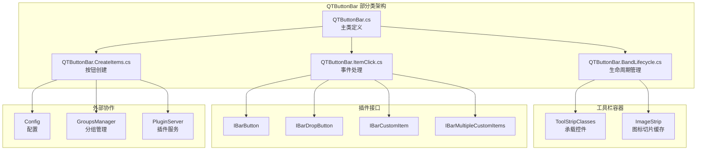
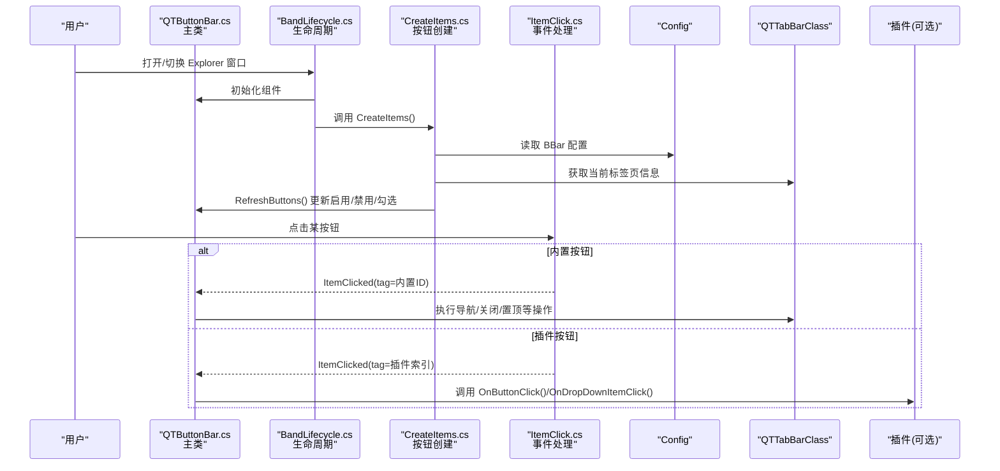
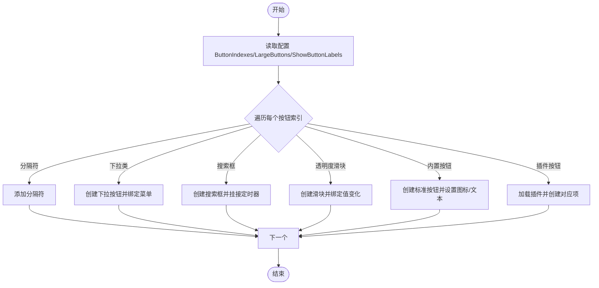
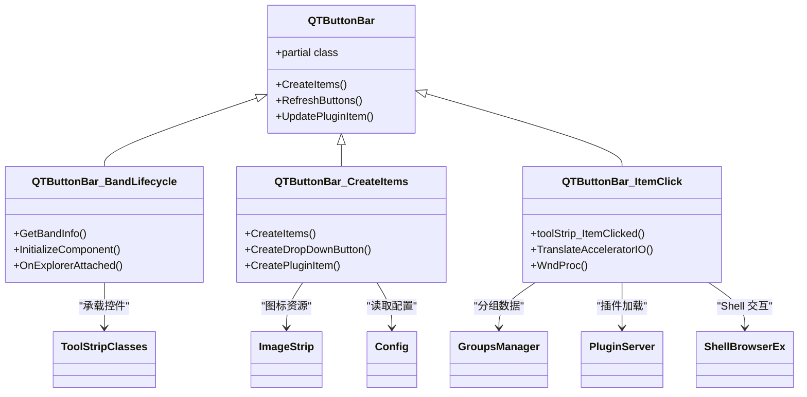

# QTButtonBar 按钮栏

<cite>
**本文引用的文件**   
- [QTButtonBar.cs](file://QTTabBar/QTButtonBar.cs)
- [QTButtonBar.BandLifecycle.cs](file://QTTabBar/QTButtonBar.BandLifecycle.cs)
- [QTButtonBar.CreateItems.cs](file://QTTabBar/QTButtonBar.CreateItems.cs)
- [QTButtonBar.ItemClick.cs](file://QTTabBar/QTButtonBar.ItemClick.cs)
- [IBarButton.cs](file://QTPluginLib/IBarButton.cs)
- [IBarDropButton.cs](file://QTPluginLib/IBarDropButton.cs)
- [IBarCustomItem.cs](file://QTPluginLib/IBarCustomItem.cs)
- [IBarMultipleCustomItems.cs](file://QTPluginLib/IBarMultipleCustomItems.cs)
- [Config.cs](file://QTTabBar/Config.cs)
- [GroupsManager.cs](file://QTTabBar/GroupsManager.cs)
- [PluginServer.cs](file://QTTabBar/PluginServer.cs)
</cite>

## 更新摘要
**所做更改**   
- 更新了代码组织结构说明，反映 QTButtonBar 重构为部分类架构
- 增强了组件架构分析，突出新的四个部分类的职责分离
- 更新了详细组件分析章节，包含新的部分类结构信息
- 完善了事件处理机制的说明，反映重构后的逻辑分布

## 目录
1. [简介](#简介)
2. [项目结构](#项目结构)
3. [核心组件](#核心组件)
4. [架构总览](#架构总览)
5. [详细组件分析](#详细组件分析)
6. [依赖关系分析](#依赖关系分析)
7. [性能考虑](#性能考虑)
8. [故障排查指南](#故障排查指南)
9. [结论](#结论)
10. [附录](#附录)

## 简介
本文件面向开发者与高级用户，系统性阐述 QTButtonBar 按钮栏组件的技术实现与使用方式。内容覆盖：
- 动态管理机制：按钮的添加、删除、重排序与样式定制
- 按钮类型系统：标准按钮、下拉按钮、分隔符、搜索框、滑块等
- 绘制引擎：图标渲染、文本显示、状态反馈（悬停、按下、禁用）
- 布局算法：水平排列、自动换行与溢出处理
- 命令系统：命令绑定、参数传递与执行上下文管理
- 配置选项：按钮间距、图标大小、文本对齐、背景色等
- 扩展点：自定义按钮类型与行为
- 实际使用示例与性能优化建议

**更新** QTButtonBar 已完成重大重构，采用部分类架构将复杂功能模块划分为四个清晰的部分类文件，显著提升了代码的可维护性和可读性，同时保持了完整的双窗格功能支持。

## 项目结构
QTButtonBar 作为 Windows Explorer 的工具栏带对象（BandObject），内部基于 ToolStrip 承载各类按钮项，并通过插件接口体系支持第三方扩展。关键文件职责如下：
- **QTButtonBar.cs**：主类定义和常量，负责生命周期、创建/刷新按钮、事件分发、搜索框、透明度滑块、菜单联动等
- **QTButtonBar.BandLifecycle.cs**：Band 对象生命周期管理，包括初始化、主题应用、资源加载等
- **QTButtonBar.CreateItems.cs**：按钮创建和布局逻辑，包含所有按钮类型的构建方法
- **QTButtonBar.ItemClick.cs**：事件处理和用户交互逻辑，包含点击、键盘导航等
- IBarButton / IBarDropButton / IBarCustomItem / IBarMultipleCustomItems：插件扩展接口定义
- Config.cs：按钮栏相关配置（如按钮顺序、是否大图标、图片条路径等）
- GroupsManager.cs / PluginServer.cs：与分组管理器、插件服务器交互，触发按钮栏刷新

**图表来源**
- [QTButtonBar.cs:37-38](file://QTTabBar/QTButtonBar.cs#L37-L38)
- [QTButtonBar.BandLifecycle.cs:37](file://QTTabBar/QTButtonBar.BandLifecycle.cs#L37)
- [QTButtonBar.CreateItems.cs:37](file://QTTabBar/QTButtonBar.CreateItems.cs#L37)
- [QTButtonBar.ItemClick.cs:37](file://QTTabBar/QTButtonBar.ItemClick.cs#L37)

**章节来源**
- [QTButtonBar.cs:37-38](file://QTTabBar/QTButtonBar.cs#L37-L38)
- [QTButtonBar.BandLifecycle.cs:37](file://QTTabBar/QTButtonBar.BandLifecycle.cs#L37)
- [QTButtonBar.CreateItems.cs:37](file://QTTabBar/QTButtonBar.CreateItems.cs#L37)
- [QTButtonBar.ItemClick.cs:37](file://QTTabBar/QTButtonBar.ItemClick.cs#L37)

## 核心组件
- **QTButtonBar 主类**
  - 继承自 BandObject，嵌入到 Explorer 工具栏区域
  - 使用 partial class 关键字将功能分散到多个文件中
  - 维护内置按钮常量（如导航、关闭、置顶、窗口透明度、搜索框等）
  - 提供 CreateItems() 根据配置生成按钮项，RefreshButtons() 更新可用性与选中态
- **图像资源 ImageStrip**
  - 将整图切分为固定尺寸的位图序列，供不同尺寸按钮复用
  - 支持透明色设置与线程安全访问
- **插件扩展接口**
  - IBarButton：基础按钮（文本、图标、点击回调）
  - IBarDropButton：带下拉菜单的按钮（可区分拆分按钮）
  - IBarCustomItem / IBarMultipleCustomItems：完全自定义 ToolStripItem 或批量自定义项

**更新** 代码结构现已采用部分类架构，将复杂的单文件拆分为四个职责明确的部分类文件，每个文件专注于特定功能领域。

**章节来源**
- [QTButtonBar.cs:37-38](file://QTTabBar/QTButtonBar.cs#L37-L38)
- [QTButtonBar.cs:39-69](file://QTTabBar/QTButtonBar.cs#L39-L69)
- [QTButtonBar.cs:294-369](file://QTTabBar/QTButtonBar.cs#L294-L369)
- [IBarButton.cs:21-29](file://QTPluginLib/IBarButton.cs#L21-L29)
- [IBarDropButton.cs:21-26](file://QTPluginLib/IBarDropButton.cs#L21-L26)
- [IBarCustomItem.cs:21-23](file://QTPluginLib/IBarCustomItem.cs#L21-L23)
- [IBarMultipleCustomItems.cs:22-28](file://QTPluginLib/IBarMultipleCustomItems.cs#L22-L28)

## 架构总览
按钮栏采用"配置驱动 + 插件扩展 + 部分类架构"的新架构：
- **部分类组织**：通过四个部分类文件实现职责分离，提高代码可维护性
- **配置层**：通过 Config.BBar 控制按钮顺序、图标尺寸、标签显示、锁定下拉按钮等
- **构建层**：CreateItems() 遍历配置，按类型创建 ToolStripItem 并挂载事件
- **运行层**：RefreshButtons() 同步各按钮可用性；事件回调统一转发至 TabBar 或插件
- **渲染层**：自定义 ToolbarRenderer 与 ImageStrip 协同完成图标与文本绘制

**更新** 重构后的架构采用明确的部分类划分，每个部分类都有清晰的职责边界和功能范围。

**图表来源**
- [QTButtonBar.BandLifecycle.cs:271-296](file://QTTabBar/QTButtonBar.BandLifecycle.cs#L271-L296)
- [QTButtonBar.CreateItems.cs:123-311](file://QTTabBar/QTButtonBar.CreateItems.cs#L123-L311)
- [QTButtonBar.ItemClick.cs:47-50](file://QTTabBar/QTButtonBar.ItemClick.cs#L47-L50)

## 详细组件分析

### 部分类架构重构
**新增** QTButtonBar 现已采用部分类架构，将复杂的代码逻辑划分为四个清晰的部分类文件：

1. **QTButtonBar.cs - 主类定义**
   - 类声明和命名空间定义
   - 内置按钮常量定义（BII_* 系列常量）
   - 静态资源管理（ImageStrip 实例）
   - 核心字段和方法声明

2. **QTButtonBar.BandLifecycle.cs - 生命周期管理**
   - GetBandInfo() 方法：Band 对象尺寸和模式设置
   - InitializeComponent() 方法：UI 组件初始化和事件绑定
   - LoadDefaultImages() / LoadExternalImage()：图像资源加载
   - OnExplorerAttached()：Explorer 窗口附加处理
   - OnPaintBackground()：背景绘制处理
   - Search Box 相关方法和定时器处理

3. **QTButtonBar.CreateItems.cs - 按钮创建与布局**
   - CreateItems() 主方法：按钮动态创建流程
   - CreateDropDownButton()：下拉按钮创建
   - CreatePluginItem()：插件按钮创建
   - 各种按钮类型的具体创建逻辑
   - 菜单项重排序处理

4. **QTButtonBar.ItemClick.cs - 事件处理与用户交互**
   - toolStrip_ItemClicked：按钮点击事件处理
   - toolStrip_MouseActivated：鼠标激活处理
   - TranslateAcceleratorIO：键盘快捷键处理
   - RefreshButtons()：按钮状态刷新
   - WndProc：窗口消息处理

**章节来源**
- [QTButtonBar.cs:37-38](file://QTTabBar/QTButtonBar.cs#L37-L38)
- [QTButtonBar.BandLifecycle.cs:39-317](file://QTTabBar/QTButtonBar.BandLifecycle.cs#L39-L317)
- [QTButtonBar.CreateItems.cs:38-560](file://QTTabBar/QTButtonBar.CreateItems.cs#L38-L560)
- [QTButtonBar.ItemClick.cs:39-519](file://QTTabBar/QTButtonBar.ItemClick.cs#L39-L519)

### 动态管理机制（添加、删除、重排序、样式定制）
- **添加与重建**
  - CreateItems() 依据 Config.BBar.ButtonIndexes 逐项创建按钮，支持分隔符、标准按钮、下拉按钮、搜索框、透明度滑块等
  - 对导航按钮，若未显式包含前进按钮，则自动追加导航下拉列表
- **删除与清理**
  - ClearToolStripItems() 仅释放非插件自定义项，保留 lstPluginCustomItem 以便后续重建时复用
- **重排序**
  - 分组、最近关闭、用户应用三类下拉菜单支持拖拽重排，完成后持久化到对应管理器
- **样式定制**
  - 支持大/小图标模式、显示/隐藏文本标签、背景填充色、前景文本色
  - 插件可通过接口返回自定义图标与文本

**图表来源**
- [QTButtonBar.CreateItems.cs:150-297](file://QTTabBar/QTButtonBar.CreateItems.cs#L150-L297)

**章节来源**
- [QTButtonBar.CreateItems.cs:123-311](file://QTTabBar/QTButtonBar.CreateItems.cs#L123-L311)
- [QTButtonBar.cs:214-222](file://QTTabBar/QTButtonBar.cs#L214-L222)

### 按钮类型系统
- **内置类型**
  - 分隔符：视觉分割
  - 标准按钮：后退、前进、关闭窗口、置顶、刷新等
  - 下拉按钮：历史导航、分组、最近关闭、应用程序启动器
  - 搜索框：过滤当前文件夹视图
  - 透明度滑块：调整 Explorer 窗口透明度
- **插件类型**
  - IBarButton：普通按钮
  - IBarDropButton：下拉/拆分按钮
  - IBarCustomItem / IBarMultipleCustomItems：完全自定义项

**章节来源**
- [QTButtonBar.cs:39-69](file://QTTabBar/QTButtonBar.cs#L39-L69)
- [QTButtonBar.CreateItems.cs:150-297](file://QTTabBar/QTButtonBar.CreateItems.cs#L150-L297)
- [IBarButton.cs:21-29](file://QTPluginLib/IBarButton.cs#L21-L29)
- [IBarDropButton.cs:21-26](file://QTPluginLib/IBarDropButton.cs#L21-L26)
- [IBarCustomItem.cs:21-23](file://QTPluginLib/IBarCustomItem.cs#L21-L23)
- [IBarMultipleCustomItems.cs:22-28](file://QTPluginLib/IBarMultipleCustomItems.cs#L22-L28)

### 绘制引擎（图标渲染、文本显示、状态反馈）
- **图标渲染**
  - ImageStrip 将大图切分为固定尺寸位图，避免重复解码与内存抖动
  - 支持暗色主题下白色图标集与透明色处理
- **文本显示**
  - 根据 ShowButtonLabels 决定显示纯图标或图文组合
  - 文本颜色与背景填充受皮肤配置影响
- **状态反馈**
  - 通过 ToolStrip 原生机制呈现悬停、按下、禁用等状态
  - 置顶按钮通过查询窗口样式位进行勾选态同步

**章节来源**
- [QTButtonBar.cs:294-369](file://QTTabBar/QTButtonBar.cs#L294-L369)
- [QTButtonBar.BandLifecycle.cs:108-132](file://QTTabBar/QTButtonBar.BandLifecycle.cs#L108-L132)
- [QTButtonBar.CreateItems.cs:246-284](file://QTTabBar/QTButtonBar.CreateItems.cs#L246-L284)

### 布局算法（水平排列、自动换行与滚动导航）
- **布局策略**
  - 基于 ToolStrip 的水平流式布局，超出可视区域时自动溢出为"更多"菜单
  - 高度由 BarHeight 计算，随 LargeButtons 配置变化
- **滚动导航**
  - 通过 Overflow 按钮访问隐藏项；搜索框与滑块等控件参与布局但不占用额外行高
- **自适应**
  - DPI 变化时刷新高度，确保在不同缩放比例下显示正常

**章节来源**
- [QTButtonBar.BandLifecycle.cs:41-67](file://QTTabBar/QTButtonBar.BandLifecycle.cs#L41-L67)
- [QTButtonBar.ItemClick.cs:470-516](file://QTTabBar/QTButtonBar.ItemClick.cs#L470-L516)

### 命令系统（命令绑定、参数传递、执行上下文）
- **命令绑定**
  - 内置按钮通过 Tag 标识类型，在 ItemClicked 中分派到具体逻辑
  - 插件按钮通过 ActivePluginIDs 映射到插件实例，再调用其回调方法
- **参数传递**
  - 下拉菜单项携带 QMenuItemArguments（路径、索引、开关标志等）
  - 右键/中键/修饰键组合用于差异化行为（如 Ctrl 在新窗口打开）
- **执行上下文**
  - 通过 InstanceManager.GetThreadTabBar() 获取当前标签页上下文
  - 分组、应用、历史等数据源来自相应管理器

**章节来源**
- [QTButtonBar.ItemClick.cs:47-50](file://QTTabBar/QTButtonBar.ItemClick.cs#L47-L50)
- [QTButtonBar.CreateItems.cs:474-519](file://QTTabBar/QTButtonBar.CreateItems.cs#L474-L519)

### 配置选项（按钮间距、图标大小、文本对齐等）
- **常用配置**
  - LargeButtons：控制图标尺寸与栏高
  - ShowButtonLabels：是否显示按钮文本
  - LockDropDownButtons：是否锁定下拉按钮重排序
  - ImageStripPath：自定义图标条路径
  - ButtonIndexes：按钮顺序与类型
- **生效时机**
  - 配置变更会触发 CreateItems()/RefreshButtons() 重建与刷新

**章节来源**
- [Config.cs:812-848](file://QTTabBar/Config.cs#L812-L848)
- [QTButtonBar.CreateItems.cs:123-311](file://QTTabBar/QTButtonBar.CreateItems.cs#L123-L311)

### 扩展点（自定义按钮类型与行为）
- **扩展入口**
  - 实现 IBarButton/IBarDropButton/IBarCustomItem/IBarMultipleCustomItems
  - 通过插件服务器加载并在按钮栏中创建对应 ToolStripItem
- **生命周期**
  - InitializeItem() 初始化
  - OnButtonClick()/OnDropDownOpening()/OnDropDownItemClick() 响应交互
  - UpdatePluginItem() 允许运行时更新图标/文本/启用状态

**章节来源**
- [QTButtonBar.CreateItems.cs:313-428](file://QTTabBar/QTButtonBar.CreateItems.cs#L313-L428)
- [QTButtonBar.BandLifecycle.cs:321-382](file://QTTabBar/QTButtonBar.BandLifecycle.cs#L321-L382)
- [IBarButton.cs:21-29](file://QTPluginLib/IBarButton.cs#L21-L29)
- [IBarDropButton.cs:21-26](file://QTPluginLib/IBarDropButton.cs#L21-L26)
- [IBarCustomItem.cs:21-23](file://QTPluginLib/IBarCustomItem.cs#L21-L23)
- [IBarMultipleCustomItems.cs:22-28](file://QTPluginLib/IBarMultipleCustomItems.cs#L22-L28)

### 使用示例（步骤说明）
- **添加一个自定义按钮**
  - 实现 IBarButton，提供 GetImage()、Text、InitializeItem()、OnButtonClick()
  - 在插件配置中注册该按钮，并将对应索引加入 Config.BBar.ButtonIndexes
  - 重启或刷新按钮栏后，新按钮出现在工具栏
- **添加一个下拉按钮**
  - 实现 IBarDropButton，设置 IsSplitButton 以选择拆分按钮
  - 在 OnDropDownOpening() 中动态填充菜单项
  - 在 OnDropDownItemClick() 中处理菜单点击
- **添加一组自定义项**
  - 实现 IBarMultipleCustomItems，提供 Count、GetImage()、GetName()、Initialize()、CreateItem()
  - 在按钮栏中按索引创建多个项，支持独立重排序

[本节为概念性说明，不直接分析具体代码文件]

## 依赖关系分析
- **内部依赖**
  - ToolStripClasses：承载所有按钮项，提供布局与事件分发
  - ImageStrip：集中管理图标资源，降低内存与绘制开销
- **外部依赖**
  - Config：读取/写入按钮栏配置
  - GroupsManager/AppsManager/StaticReg：提供分组、应用、历史等数据源
  - PluginServer：加载与管理插件，桥接按钮栏与插件实例
  - ShellBrowserEx：与 Explorer 视图交互（搜索、统计等）

**图表来源**
- [QTButtonBar.cs:37-38](file://QTTabBar/QTButtonBar.cs#L37-L38)
- [QTButtonBar.BandLifecycle.cs:37](file://QTTabBar/QTButtonBar.BandLifecycle.cs#L37)
- [QTButtonBar.CreateItems.cs:37](file://QTTabBar/QTButtonBar.CreateItems.cs#L37)
- [QTButtonBar.ItemClick.cs:37](file://QTTabBar/QTButtonBar.ItemClick.cs#L37)

**章节来源**
- [QTButtonBar.BandLifecycle.cs:69-105](file://QTTabBar/QTButtonBar.BandLifecycle.cs#L69-L105)
- [QTButtonBar.CreateItems.cs:123-311](file://QTTabBar/QTButtonBar.CreateItems.cs#L123-L311)
- [QTButtonBar.ItemClick.cs:47-50](file://QTTabBar/QTButtonBar.ItemClick.cs#L47-L50)

## 性能考虑
- **图标资源**
  - 使用 ImageStrip 预切图与缓存，避免频繁解码与复制
  - 暗色主题下切换白色图标集，减少运行时着色成本
- **线程安全**
  - 对共享图像克隆与绘制加锁，防止跨线程异常
- **延迟与节流**
  - 搜索框输入使用定时器节流，避免频繁刷新
  - 下拉菜单仅在打开时动态填充，减少初始构建开销
- **布局刷新**
  - 使用 SuspendLayout/ResumeLayout 批量更新，减少重绘次数
- **建议**
  - 合理控制按钮数量与复杂度，优先使用轻量级 ToolStripItem
  - 插件应避免在 UI 线程执行耗时操作，必要时异步回调

**章节来源**
- [QTButtonBar.cs:327-339](file://QTTabBar/QTButtonBar.cs#L327-L339)
- [QTButtonBar.BandLifecycle.cs:494-505](file://QTTabBar/QTButtonBar.BandLifecycle.cs#L494-L505)
- [QTButtonBar.CreateItems.cs:278-284](file://QTTabBar/QTButtonBar.CreateItems.cs#L278-L284)

## 故障排查指南
- **常见问题**
  - 按钮不可用：检查 RefreshButtons() 中的启用条件与当前标签页状态
  - 插件按钮无响应：确认插件已加载且 ActivePluginIDs 映射正确
  - 图标显示异常：核对 ImageStrip 尺寸与透明色设置
  - 搜索框无效：检查定时器是否被停止、ShellBrowser 是否可用
- **定位方法**
  - 查看 CloseDW/Dispose 是否正确释放资源
  - 关注 WndProc 中对菜单消息的处理分支
  - 利用 MakeErrorLog 输出异常堆栈

**章节来源**
- [QTButtonBar.BandLifecycle.cs:228-252](file://QTTabBar/QTButtonBar.BandLifecycle.cs#L228-L252)
- [QTButtonBar.ItemClick.cs:418-445](file://QTTabBar/QTButtonBar.ItemClick.cs#L418-L445)
- [QTButtonBar.BandLifecycle.cs:415-446](file://QTTabBar/QTButtonBar.BandLifecycle.cs#L415-L446)

## 结论
QTButtonBar 通过部分类架构重构，实现了更好的代码组织和可维护性。新的四部分类设计将复杂的功能模块清晰分离：主类定义、生命周期管理、按钮创建和用户交互处理。这种架构不仅保持了原有的完整功能，还显著提升了代码的可读性和可扩展性。开发者可以更容易地理解和修改特定功能模块，同时借助现有的插件扩展机制快速集成自定义功能。

## 附录
- **术语**
  - 下拉按钮：带有展开菜单的标准按钮
  - 拆分按钮：主体按钮与下拉箭头分离的下拉按钮
  - 自定义项：完全由插件创建的 ToolStripItem
  - 部分类：C# 中将类定义分散到多个文件中的特性
- **参考路径**
  - 按钮常量定义：[QTButtonBar.cs:39-69](file://QTTabBar/QTButtonBar.cs#L39-L69)
  - 部分类文件：[QTButtonBar.BandLifecycle.cs](file://QTTabBar/QTButtonBar.BandLifecycle.cs)、[QTButtonBar.CreateItems.cs](file://QTTabBar/QTButtonBar.CreateItems.cs)、[QTButtonBar.ItemClick.cs](file://QTTabBar/QTButtonBar.ItemClick.cs)
  - 插件接口：[IBarButton.cs:21-29](file://QTPluginLib/IBarButton.cs#L21-L29)、[IBarDropButton.cs:21-26](file://QTPluginLib/IBarDropButton.cs#L21-L26)、[IBarCustomItem.cs:21-23](file://QTPluginLib/IBarCustomItem.cs#L21-L23)、[IBarMultipleCustomItems.cs:22-28](file://QTPluginLib/IBarMultipleCustomItems.cs#L22-L28)
  - 配置项：[Config.cs:812-848](file://QTTabBar/Config.cs#L812-L848)