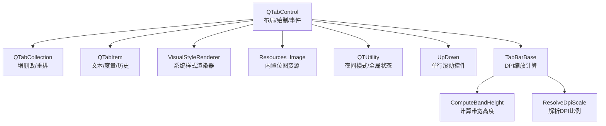
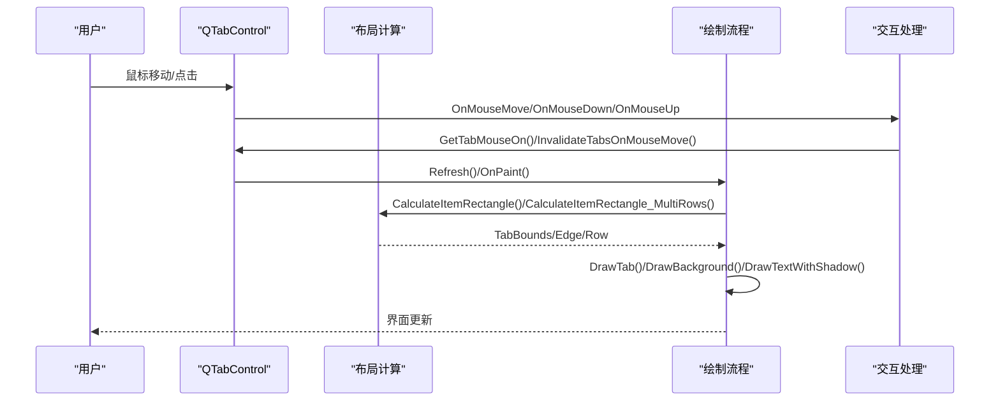
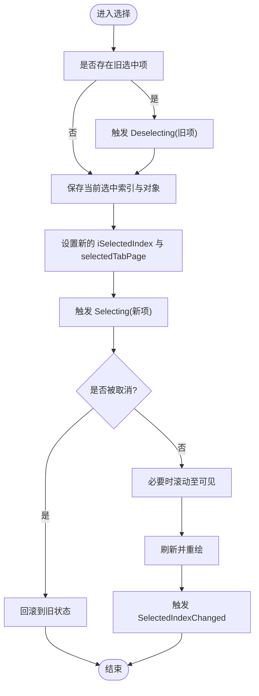
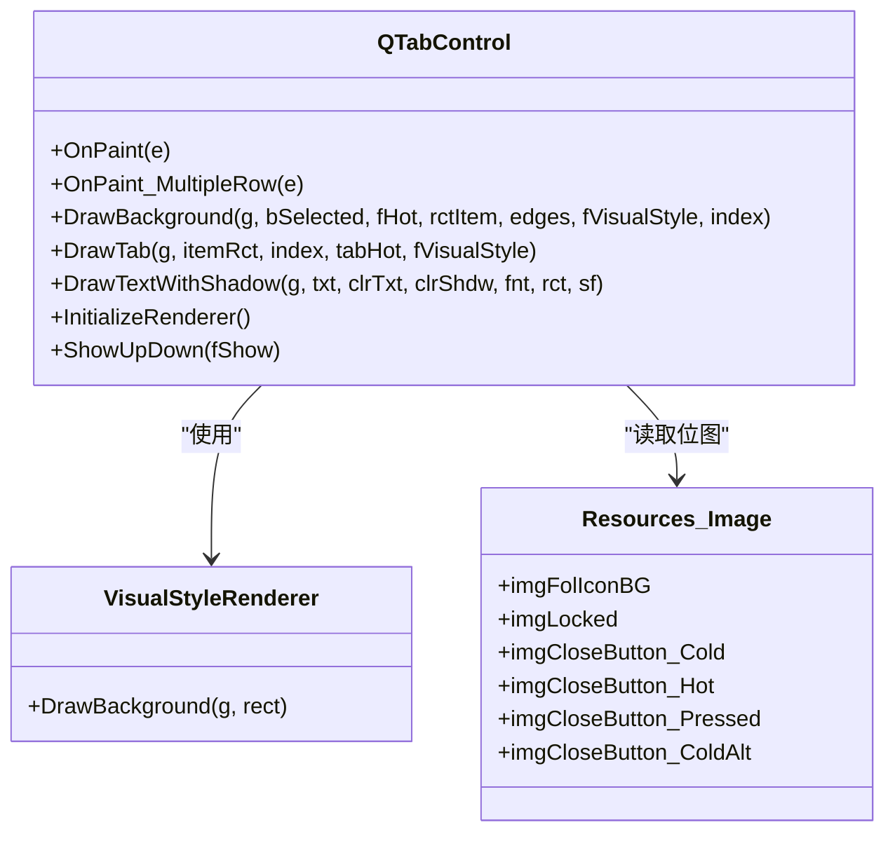
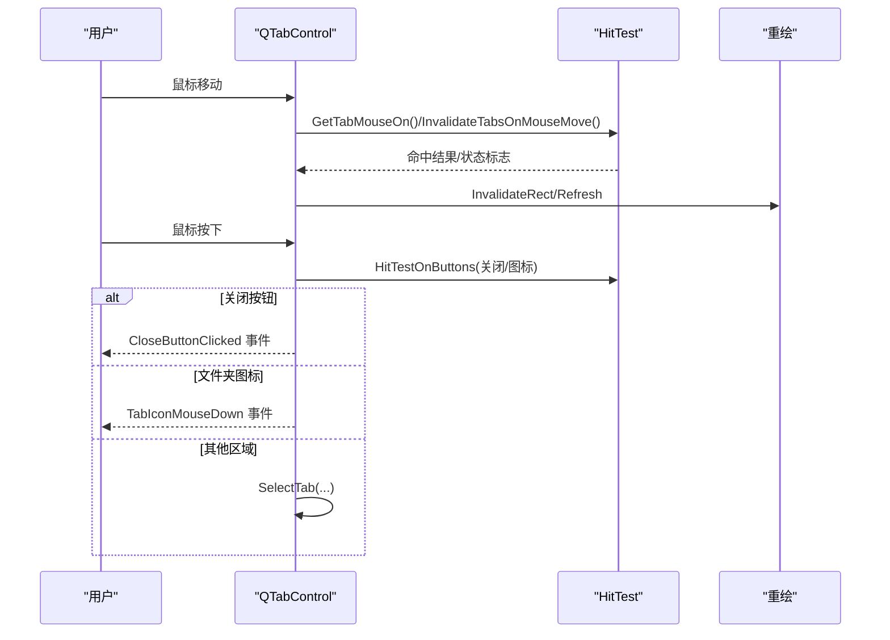
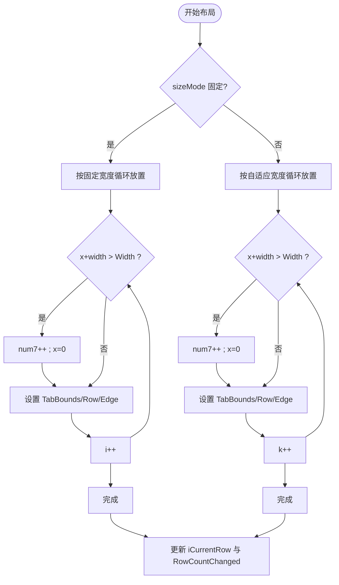
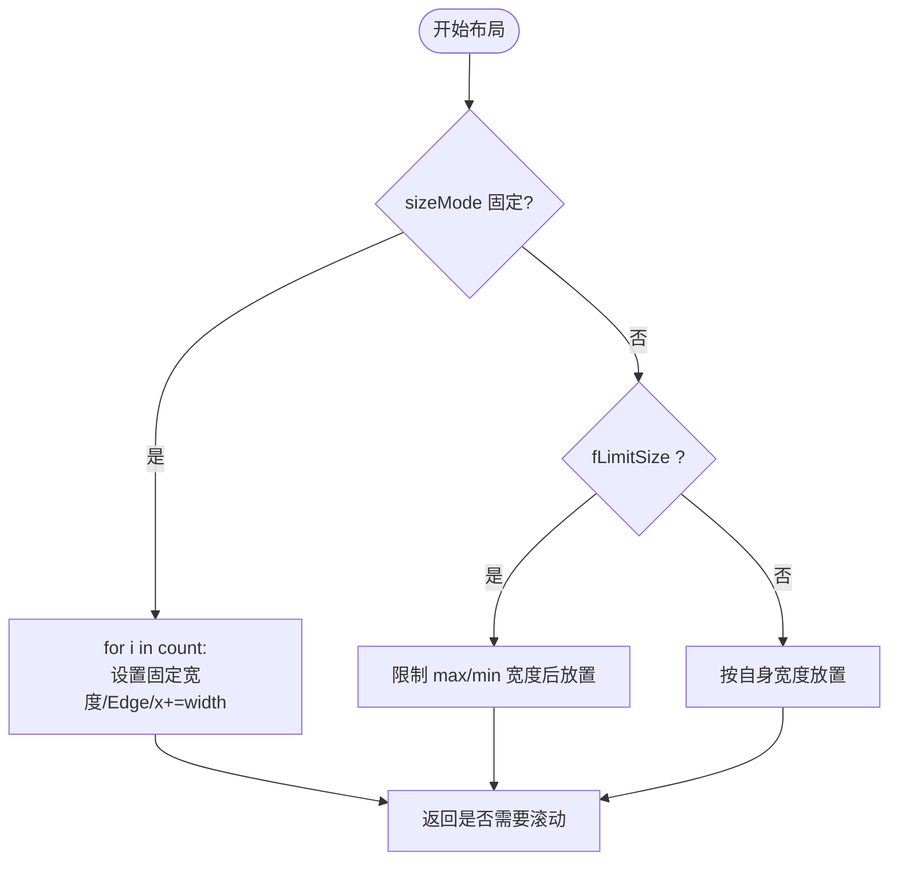
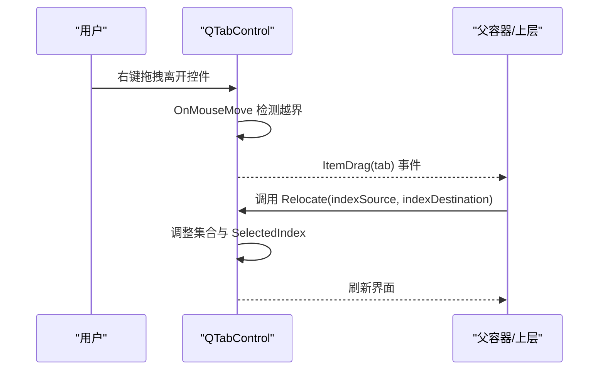
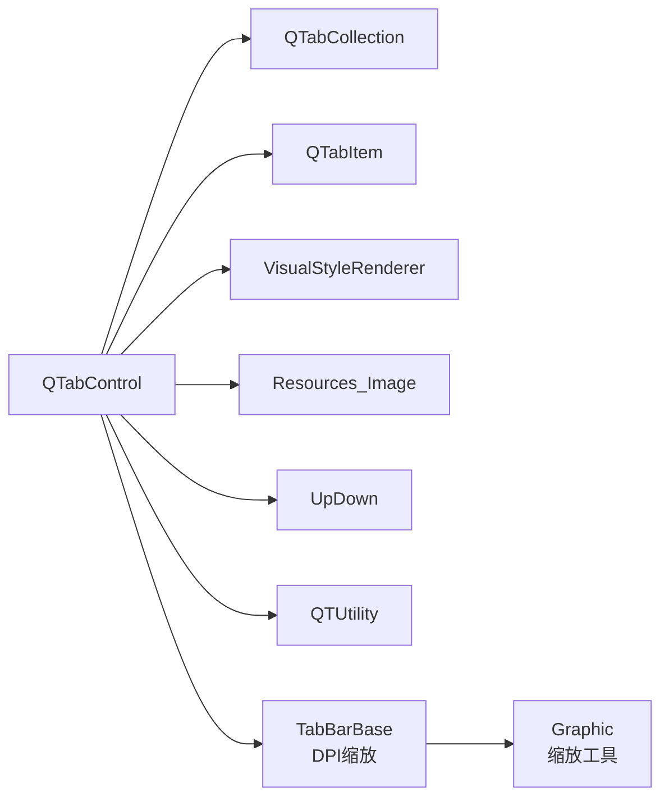

# QTabControl 标签控件

<cite>
**本文引用的文件**   
- [QTabControl.cs](file://QTTabBar/QTabControl.cs)
- [QTabItem.cs](file://QTTabBar/QTabItem.cs)
- [TabBarBase.cs](file://QTTabBar/TabBarBase.cs)
- [QTUtility.cs](file://QTTabBar/QTUtility.cs)
- [Resources_Image.cs](file://QTTabBar/Resources_Image.cs)
- [BandHeightDpiTests.cs](file://Tests/QTTtabBarTests/BandHeightDpiTests.cs)
- [TabTextLayoutTests.cs](file://Tests/QTTtabBarTests/TabTextLayoutTests.cs)
</cite>

## 更新摘要
**所做更改**   
- 新增 DPI 缩放改进章节，详细说明 ComputeBandHeight 和 ResolveDpiScale 方法
- 更新文本渲染部分，说明垂直居中对齐和标题定位改进
- 添加新的测试用例引用，验证 DPI 缩放和文本布局的正确性
- 更新性能考量部分，包含 DPI 感知优化

## 目录
1. [简介](#简介)
2. [项目结构](#项目结构)
3. [核心组件](#核心组件)
4. [架构总览](#架构总览)
5. [详细组件分析](#详细组件分析)
6. [DPI 缩放与高清晰度支持](#dpi-缩放与高清晰度支持)
7. [依赖关系分析](#依赖关系分析)
8. [性能考量](#性能考量)
9. [故障排查指南](#故障排查指南)
10. [结论](#结论)
11. [附录：使用示例与事件处理](#附录使用示例与事件处理)

## 简介
QTabControl 是 QTTabBar 中用于在 Windows 资源管理器工具栏区域显示多标签页的自定义控件。它实现了完整的标签生命周期管理、绘制机制、鼠标交互、滚动导航、多行布局算法、关闭按钮与文件夹图标交互、以及拖拽重排序等能力，并支持深色模式与主题切换。**最新更新包括显著的 DPI 缩放改进，确保在高清晰度显示器上正确显示标签高度和文本内容。**

## 项目结构
本控件位于主工程 QTTabBar 下，核心实现集中在两个文件中：
- QTabControl：控件主体，负责布局计算、绘制、事件处理、滚动条、样式渲染器初始化、颜色管理等。
- QTabItem：单个标签项的数据与度量信息，包含文本大小测量、历史栈、路径与 IDL 等。
- TabBarBase：提供 DPI 缩放计算的静态方法，包括 ComputeBandHeight 和 ResolveDpiScale。



**图表来源**
- [QTabControl.cs:124-224](file://QTTabBar/QTabControl.cs#L124-L224)
- [TabBarBase.cs:290-390](file://QTTabBar/TabBarBase.cs#L290-L390)

**章节来源**
- [QTabControl.cs:124-224](file://QTTabBar/QTabControl.cs#L124-L224)
- [TabBarBase.cs:290-390](file://QTTabBar/TabBarBase.cs#L290-L390)
- [QTabItem.cs:31-84](file://QTTabBar/QTabItem.cs#L31-L84)

## 核心组件
- QTabControl：继承自 Control，启用用户自定义绘制与双缓冲，维护标签集合、选中态、热区、滚动偏移、多行布局行号、视觉样式渲染器缓存、字体与画刷等资源。
- QTabItem：保存每个标签的标题、副标题（注释）、当前路径、图像键、锁定状态、度量尺寸、所在行号与边缘标记等。
- QTabCollection：对 List<QTabItem> 的封装，提供 Add/Insert/Remove/Relocate 等操作，并在变更时触发计数变化事件与刷新。
- TabBarBase：提供静态 DPI 缩放计算方法，解决高清晰度显示器上的显示问题。

**章节来源**
- [QTabControl.cs:27-92](file://QTTabBar/QTabControl.cs#L27-L92)
- [QTabControl.cs:2088-2150](file://QTTabBar/QTabControl.cs#L2088-L2150)
- [QTabItem.cs:31-84](file://QTTabBar/QTabItem.cs#L31-L84)
- [TabBarBase.cs:290-390](file://QTTabBar/TabBarBase.cs#L290-L390)

## 架构总览
QTabControl 采用"数据-布局-绘制-交互"的分层设计：
- 数据层：QTabItem 持有标签元数据与度量；QTabCollection 管理集合。
- 布局层：单行模式下通过 CalculateItemRectangle 计算 TabBounds 与 Edge；多行模式通过 CalculateItemRectangle_MultiRows 进行换行与行号分配。
- 绘制层：OnPaint/OnPaint_MultipleRow 驱动 DrawTab，DrawBackground 负责背景（系统样式或九宫格图片），DrawTextWithShadow 负责阴影文字。
- 交互层：鼠标消息分发到 GetTabMouseOn/InvalidateTabsOnMouseMove，处理关闭按钮、文件夹图标、双击、右键拖拽等；WndProc 拦截 SETCURSOR/MOUSEACTIVATE/ERASEBKGND/CONTEXTMENU 等消息。



**图表来源**
- [QTabControl.cs:1456-1492](file://QTTabBar/QTabControl.cs#L1456-L1492)
- [QTabControl.cs:1530-1570](file://QTTabBar/QTabControl.cs#L1530-L1570)
- [QTabControl.cs:290-330](file://QTTabBar/QTabControl.cs#L290-L330)
- [QTabControl.cs:332-464](file://QTTabBar/QTabControl.cs#L332-L464)
- [QTabControl.cs:817-1045](file://QTTabBar/QTabControl.cs#L817-L1045)
- [QTabControl.cs:1376-1418](file://QTTabBar/QTabControl.cs#L1376-L1418)

## 详细组件分析

### 标签页生命周期管理
- 添加：QTabCollection.Add 将 QTabItem 加入列表，调用 Owner.OnTabPageAdded，随后触发 TabCountChanged 事件并刷新。
- 插入：QTabCollection.Insert 调整选中索引（若插入位置小于等于当前选中），触发 TabCountChanged 并刷新。
- 删除：QTabCollection.Remove 根据索引调整选中索引，触发 TabCountChanged 并刷新。
- 销毁：Dispose 释放画笔、字体、位图等资源，并遍历所有标签调用 OnClose 以清理外部订阅。

**章节来源**
- [QTabControl.cs:2088-2150](file://QTTabBar/QTabControl.cs#L2088-L2150)
- [QTabControl.cs:1572-1602](file://QTTabBar/QTabControl.cs#L1572-L1602)
- [QTabControl.cs:506-571](file://QTTabBar/QTabControl.cs#L506-L571)

### 选择切换逻辑
- SelectTab(QTabItem)/SelectTab(int)/SelectedIndex 设置选中项，内部统一走 ChangeSelection。
- ChangeSelection 先触发 Deselecting（旧项），再触发 Selecting（新项），若取消则回滚；必要时自动滚动使选中项可见；最后触发 SelectedIndexChanged。



**图表来源**
- [QTabControl.cs:469-504](file://QTTabBar/QTabControl.cs#L469-504)

**章节来源**
- [QTabControl.cs:1732-1757](file://QTTabBar/QTabControl.cs#L1732-L1757)
- [QTabControl.cs:469-504](file://QTTabBar/QTabControl.cs#L469-L504)

### 绘制机制
- 单行绘制：OnPaint 调用 CalculateItemRectangle 计算布局，按顺序绘制非选中项，再绘制选中项；必要时绘制左侧遮罩与右侧 UpDown 滚动控件。
- 多行绘制：OnPaint_MultipleRow 调用 CalculateItemRectangle_MultiRows 计算每行布局，逐行绘制，确保选中项在其行内最后绘制以覆盖边框。
- 背景绘制：DrawBackground 支持两种模式：
  - 视觉样式渲染器：根据选中/热/普通与左右边缘选择不同 VisualStyleRenderer 实例绘制。
  - 自定义绘制：当未启用系统样式时，支持纯色填充或九宫格拉伸绘制（tabImages[0] 选中、[1] 普通、[2] 热）。
- 文本绘制：DrawTab 计算文本矩形，支持阴影绘制 DrawTextWithShadow，并根据配置决定是否加粗、下划线、居中/左对齐。
- 图标与关闭按钮：根据配置绘制文件夹图标、驱动器字母、锁定图标、关闭按钮，并区分悬停/按下状态。



**图表来源**
- [QTabControl.cs:1456-1492](file://QTTabBar/QTabControl.cs#L1456-L1492)
- [QTabControl.cs:1530-1570](file://QTTabBar/QTabControl.cs#L1530-L1570)
- [QTabControl.cs:573-750](file://QTTabBar/QTabControl.cs#L573-L750)
- [QTabControl.cs:817-1045](file://QTTabBar/QTabControl.cs#L817-L1045)
- [QTabControl.cs:1255-1265](file://QTTabBar/QTabControl.cs#L1255-L1265)
- [QTabControl.cs:1905-1920](file://QTTabBar/QTabControl.cs#L1905-L1920)
- [Resources_Image.cs](file://QTTabBar/Resources_Image.cs)

**章节来源**
- [QTabControl.cs:1456-1492](file://QTTabBar/QTabControl.cs#L1456-L1492)
- [QTabControl.cs:1530-1570](file://QTTabBar/QTabControl.cs#L1530-L1570)
- [QTabControl.cs:573-750](file://QTTabBar/QTabControl.cs#L573-L750)
- [QTabControl.cs:817-1045](file://QTTabBar/QTabControl.cs#L817-L1045)
- [QTabControl.cs:1255-1265](file://QTTabBar/QTabControl.cs#L1255-L1265)
- [QTabControl.cs:1905-1920](file://QTTabBar/QTabControl.cs#L1905-L1920)

### 事件处理
- 鼠标移动：GetTabMouseOn 返回命中标签；InvalidateTabsOnMouseMove 更新热区与关闭按钮/图标悬停状态，局部失效重绘。
- 鼠标按下/抬起：处理关闭按钮点击、文件夹图标点击、双击抑制、右键拖拽触发 ItemDrag。
- 键盘焦点：FocusNextTab 管理伪热项；失去焦点时清除伪热与焦点项。
- 窗口消息：WndProc 拦截 SETCURSOR（子目录提示期间）、MOUSEACTIVATE（点击图标区域）、ERASEBKGND（抑制背景擦除）、CONTEXTMENU（转发父级菜单）等。



**图表来源**
- [QTabControl.cs:1376-1418](file://QTTabBar/QTabControl.cs#L1376-L1418)
- [QTabControl.cs:1328-1359](file://QTTabBar/QTabControl.cs#L1328-L1359)
- [QTabControl.cs:1420-1445](file://QTTabBar/QTabControl.cs#L1420-L1445)
- [QTabControl.cs:1142-1228](file://QTTabBar/QTabControl.cs#L1142-L1228)
- [QTabControl.cs:1248-1253](file://QTTabBar/QTabControl.cs#L1248-L1253)
- [QTabControl.cs:1931-2005](file://QTTabBar/QTabControl.cs#L1931-L2005)

**章节来源**
- [QTabControl.cs:1376-1418](file://QTTabBar/QTabControl.cs#L1376-L1418)
- [QTabControl.cs:1328-1359](file://QTTabBar/QTabControl.cs#L1328-L1359)
- [QTabControl.cs:1420-1445](file://QTTabBar/QTabControl.cs#L1420-L1445)
- [QTabControl.cs:1142-1228](file://QTTabBar/QTabControl.cs#L1142-L1228)
- [QTabControl.cs:1248-1253](file://QTTabBar/QTabControl.cs#L1248-L1253)
- [QTabControl.cs:1931-2005](file://QTTabBar/QTabControl.cs#L1931-L2005)

### 多行布局算法
- 固定宽度模式：按固定宽度 itemSize.Width 从左到右放置，超出容器宽度则换行；首尾标签设置 Left/Right 边缘。
- 自适应宽度模式：按各标签自身宽度放置，可限制最大/最小宽度；同样在超宽时换行，并为每行首尾设置边缘。
- 行号与选中行定位：记录 iCurrentRow 与 iMultipleType，支持选中项所在行的偏移修正；当行数变化时触发 RowCountChanged。



**图表来源**
- [QTabControl.cs:332-464](file://QTTabBar/QTabControl.cs#L332-L464)

**章节来源**
- [QTabControl.cs:332-464](file://QTTabBar/QTabControl.cs#L332-L464)

### 单行布局算法（固定与自适应）
- 固定宽度：为每个标签设置相同宽度，累加 x 坐标，首尾设置 Edge。
- 自适应宽度：按标签自身宽度放置，可选择限制最大/最小宽度；首尾设置 Edge。
- 返回值指示是否需要显示 UpDown 滚动控件（当内容超出可视宽度）。



**图表来源**
- [QTabControl.cs:290-330](file://QTTabBar/QTabControl.cs#L290-L330)

**章节来源**
- [QTabControl.cs:290-330](file://QTTabBar/QTabControl.cs#L290-L330)

### 拖拽重排序功能
- 拖拽触发：当鼠标右键移出控件边界且存在 draggingTab 时，触发 ItemDrag 事件，由上层处理实际拖放与重排。
- 重排接口：QTabCollection.Relocate 提供交换位置的原子操作，并智能调整 SelectedIndex，避免选中项错位。



**图表来源**
- [QTabControl.cs:1376-1380](file://QTTabBar/QTabControl.cs#L1376-L1380)
- [QTabControl.cs:2115-2149](file://QTTabBar/QTabControl.cs#L2115-L2149)

**章节来源**
- [QTabControl.cs:1376-1380](file://QTTabBar/QTabControl.cs#L1376-L1380)
- [QTabControl.cs:2115-2149](file://QTTabBar/QTabControl.cs#L2115-L2149)

### 颜色管理与深色模式
- 夜间模式检测：构造时读取 QTUtility.InNightMode，并在 InitializeColors/selectedColor 中根据该标志选择不同调色板。
- 主题切换：RefreshOptions 在非初始化阶段会重新加载皮肤颜色与字体、边距、是否使用系统样式等；同时支持动态切换文件夹图标显示、副标题自动命名等。
- 绘制分支：DrawBackground 在夜间模式下使用深色背景与高亮前景色；非夜间模式使用系统画刷或自定义样式。

**章节来源**
- [QTabControl.cs:138-147](file://QTTabBar/QTabControl.cs#L138-L147)
- [QTabControl.cs:227-257](file://QTTabBar/QTabControl.cs#L227-L257)
- [QTabControl.cs:259-288](file://QTTabBar/QTabControl.cs#L259-L288)
- [QTabControl.cs:573-750](file://QTTabBar/QTabControl.cs#L573-L750)
- [QTabControl.cs:1650-1722](file://QTTabBar/QTabControl.cs#L1650-L1722)
- [QTUtility.cs:117-162](file://QTTabBar/QTUtility.cs#L117-L162)

## DPI 缩放与高清晰度支持

**新增** 本节详细介绍 QTabControl 的 DPI 缩放改进，确保在高清晰度显示器上正确显示标签高度和文本内容。

### DPI 缩放计算核心方法

#### ComputeBandHeight 方法
该方法计算标签栏的实际物理像素高度，考虑 DPI 缩放因子：

```csharp
public static int ComputeBandHeight(int rowCount, int tabHeight, float dpiScale)
{
    int rows = rowCount < 1 ? 1 : rowCount;
    float scale = dpiScale <= 0f ? 1f : dpiScale;
    return Graphic.ScaleBy(scale, rows * tabHeight + BandHeightSpace);
}
```

**关键特性：**
- 至少保证一行的高度，即使 rowCount 为 0
- 使用 Graphic.ScaleBy 方法进行精确的物理像素缩放
- 考虑 BandHeightSpace 常量作为额外间距

#### ResolveDpiScale 方法
该方法智能解析最佳 DPI 缩放比例，处理各种 DPI 不兼容场景：

```csharp
public static float ResolveDpiScale(int windowDpi, int processDpi, int deviceCapsDpi, int appliedDpi)
{
    // 优先使用真实的每监视器感知 DPI
    if(windowDpi > 96) {
        return windowDpi / 96f;
    }
    if(processDpi > 96) {
        return processDpi / 96f;
    }
    // 否则取最大值以确保文本不被裁剪
    int dpi = Math.Max(Math.Max(Math.Max(windowDpi, processDpi), deviceCapsDpi), appliedDpi);
    return dpi > 0 ? dpi / 96f : 1f;
}
```

**处理策略：**
- 优先使用真实的每监视器 DPI（>96）
- 回退到进程 DPI
- 最终使用设备 DPI 和应用 DPI 的最大值
- 防止在 DPI 不兼容环境下文本被裁剪

### 文本渲染与垂直定位改进

#### 垂直居中对齐
QTabControl 现在使用真正的垂直居中对齐，而非之前的底部对齐：

```csharp
sfTypoGraphic.LineAlignment = StringAlignment.Center;
```

#### 标题垂直定位计算
新增 ComputeTabTitleTopOffset 方法确保标题与图标垂直对齐：

```csharp
internal static float ComputeTabTitleTopOffset(int tabHeight, float titleHeight)
{
    float offset = Math.Max((tabHeight - titleHeight) / 2f, 0f);
    return offset;
}
```

#### 副标题定位优化
ComputeTabCommentTop 方法确保副标题在主标题区域内垂直居中：

```csharp
internal static float ComputeTabCommentTop(int textRectY, int textRectHeight, float subTitleTextHeight)
{
    float offset = Math.Max((textRectHeight - subTitleTextHeight) / 2f, 0f);
    return textRectY + offset;
}
```

### DPI 缩放测试验证

**章节来源**
- [TabBarBase.cs:290-390](file://QTTabBar/TabBarBase.cs#L290-L390)
- [QTabControl.cs:2165-2178](file://QTTabBar/QTabControl.cs#L2165-L2178)
- [QTabControl.cs:160-163](file://QTTabBar/QTabControl.cs#L160-L163)
- [QTabControl.cs:2153-2157](file://QTTabBar/QTabControl.cs#L2153-L2157)
- [BandHeightDpiTests.cs:7-79](file://Tests/QTTtabBarTests/BandHeightDpiTests.cs#L7-L79)
- [TabTextLayoutTests.cs:13-46](file://Tests/QTTtabBarTests/TabTextLayoutTests.cs#L13-L46)

## 依赖关系分析
- 内部依赖：
  - QTabControl 依赖 QTabCollection 管理标签集合，依赖 QTabItem 存储标签数据。
  - 绘制依赖 VisualStyleRenderer 与 Resources_Image 提供的位图。
  - 布局与滚动依赖 UpDown 控件。
  - **新增** DPI 缩放依赖 TabBarBase 提供的静态计算方法。
- 外部依赖：
  - QTUtility 提供夜间模式与通用工具方法。
  - Shell 相关 API 通过 Interop 层访问（如获取图标、ShellTip 等）。



**图表来源**
- [QTabControl.cs:2088-2150](file://QTTabBar/QTabControl.cs#L2088-L2150)
- [TabBarBase.cs:290-390](file://QTTabBar/TabBarBase.cs#L290-L390)
- [QTabControl.cs:1255-1265](file://QTTabBar/QTabControl.cs#L1255-L1265)
- [QTabControl.cs:1905-1920](file://QTTabBar/QTabControl.cs#L1905-L1920)
- [QTUtility.cs:117-162](file://QTTabBar/QTUtility.cs#L117-L162)

**章节来源**
- [QTabControl.cs:2088-2150](file://QTTabBar/QTabControl.cs#L2088-L2150)
- [TabBarBase.cs:290-390](file://QTTabBar/TabBarBase.cs#L290-L390)
- [QTabControl.cs:1255-1265](file://QTTabBar/QTabControl.cs#L1255-L1265)
- [QTabControl.cs:1905-1920](file://QTTabBar/QTabControl.cs#L1905-L1920)
- [QTUtility.cs:117-162](file://QTTabBar/QTUtility.cs#L117-L162)

## 性能考量
- 双缓冲绘制：构造函数启用 OptimizedDoubleBuffer 与 AllPaintingInWmPaint，减少闪烁与重绘开销。
- 局部失效：InvalidateTabsOnMouseMove 仅对受影响的标签区域失效，避免整屏重绘。
- 渲染器缓存：静态线程本地变量缓存 VisualStyleRenderer 实例，避免重复创建。
- 资源管理：Dispose 中释放 SolidBrush、Font、Bitmap 等 GDI 资源；SetTabImages 在替换时释放旧位图。
- 文本度量优化：QTabItem 使用 MeasureCharacterRanges 精确测量文本尺寸，避免多次无效测量。
- **新增** DPI 感知优化：使用静态方法避免重复计算 DPI 缩放比例，提高高清晰度显示器下的性能。

**章节来源**
- [QTabControl.cs:141-147](file://QTTabBar/QTabControl.cs#L141-L147)
- [QTabControl.cs:1267-1307](file://QTTabBar/QTabControl.cs#L1267-L1307)
- [QTabControl.cs:94-110](file://QTTabBar/QTabControl.cs#L94-L110)
- [QTabControl.cs:506-571](file://QTTabBar/QTabControl.cs#L506-L571)
- [QTabControl.cs:1860-1889](file://QTTabBar/QTabControl.cs#L1860-L1889)
- [QTabItem.cs:334-349](file://QTTabBar/QTabItem.cs#L334-L349)
- [TabBarBase.cs:290-390](file://QTTabBar/TabBarBase.cs#L290-L390)

## 故障排查指南
- 异常捕获：DrawTab 与 OnPaint 系列方法均包裹 try/catch 并通过 QTUtility2.MakeErrorLog 记录错误日志，便于定位崩溃点。
- 常见错误场景：
  - 图像键不存在：DrawTab 中访问 ImageList 前需确保键存在，否则抛出异常。
  - 索引越界：GetTabRect 等方法对 index 范围进行检查，避免越界访问。
  - 夜间模式切换：Ensure InitializeColors 与 RefreshOptions 正确执行，避免颜色不一致。
  - **新增** DPI 缩放问题：检查 ResolveDpiScale 是否正确获取应用 DPI，特别是在 DPI 不兼容环境中。

**章节来源**
- [QTabControl.cs:1041-1045](file://QTTabBar/QTabControl.cs#L1041-L1045)
- [QTabControl.cs:1488-1491](file://QTTabBar/QTabControl.cs#L1488-L1491)
- [QTabControl.cs:1567-1569](file://QTTabBar/QTabControl.cs#L1567-L1569)
- [QTabControl.cs:1238-1246](file://QTTabBar/QTabControl.cs#L1238-L1246)
- [TabBarBase.cs:335-356](file://QTTabBar/TabBarBase.cs#L335-L356)

## 结论
QTabControl 是一个功能完备、高度可定制的标签控件，具备完善的布局算法、绘制机制与交互模型，支持深色模式与主题切换，并提供拖拽重排序与丰富的可视化选项。**最新的 DPI 缩放改进确保了在高清晰度显示器上的正确显示，解决了标签高度不足和文本裁剪的问题。**其代码组织清晰，性能优化到位，适合在资源管理器工具栏等复杂 UI 场景中复用。

## 附录：使用示例与事件处理
以下为典型用法与事件处理的说明性示例（不直接展示源码，仅提供路径参考）：

- 基本使用
  - 创建控件并设置属性：参考 [QTabControl.cs:1650-1722](file://QTTabBar/QTabControl.cs#L1650-L1722)
  - 添加标签：参考 [QTabControl.cs:2088-2150](file://QTTabBar/QTabControl.cs#L2088-L2150)
  - 选择标签：参考 [QTabControl.cs:1732-1757](file://QTTabBar/QTabControl.cs#L1732-L1757)

- 事件处理
  - 关闭按钮点击：参考 [QTabControl.cs:1420-1445](file://QTTabBar/QTabControl.cs#L1420-L1445)
  - 文件夹图标点击（子目录提示）：参考 [QTabControl.cs:1328-1359](file://QTTabBar/QTabControl.cs#L1328-L1359)
  - 拖拽重排序：参考 [QTabControl.cs:1376-1380](file://QTTabBar/QTabControl.cs#L1376-L1380)、[QTabControl.cs:2115-2149](file://QTTabBar/QTabControl.cs#L2115-L2149)
  - 标签计数变化：参考 [QTabControl.cs:1572-1602](file://QTTabBar/QTabControl.cs#L1572-L1602)

- 主题与颜色
  - 初始化颜色与夜间模式：参考 [QTabControl.cs:227-257](file://QTTabBar/QTabControl.cs#L227-L257)、[QTabControl.cs:259-288](file://QTTabBar/QTabControl.cs#L259-L288)
  - 刷新选项与皮肤：参考 [QTabControl.cs:1650-1722](file://QTTabBar/QTabControl.cs#L1650-L1722)

- **新增** DPI 缩放配置
  - 计算带宽高度：参考 [TabBarBase.cs:290-298](file://QTTabBar/TabBarBase.cs#L290-L298)
  - 解析 DPI 比例：参考 [TabBarBase.cs:306-333](file://QTTabBar/TabBarBase.cs#L306-L333)
  - 文本垂直定位：参考 [QTabControl.cs:2153-2157](file://QTTabBar/QTabControl.cs#L2153-L2157)