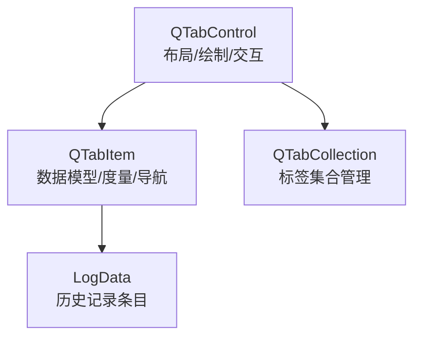
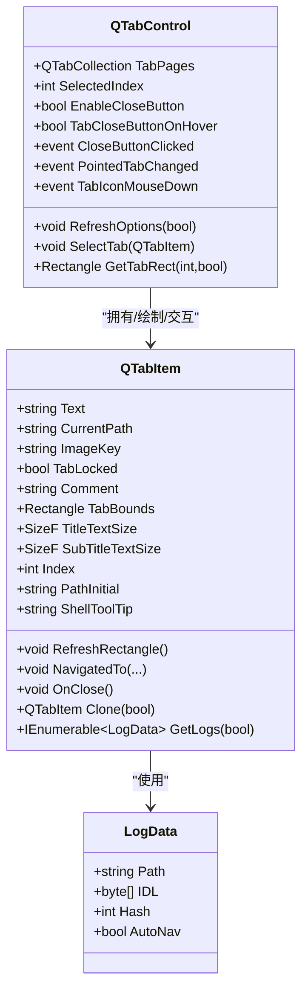
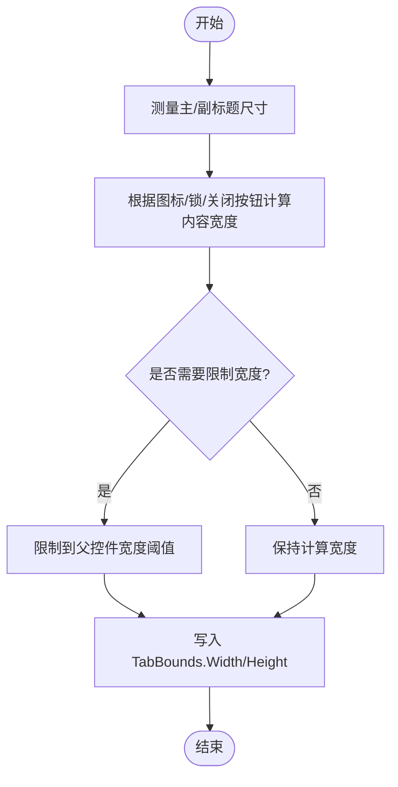
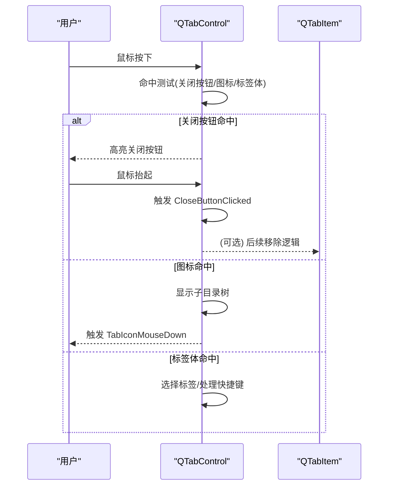
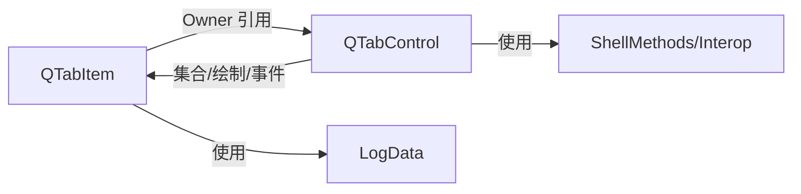

# QTabItem 标签项

<cite>
**本文引用的文件**   
- [QTabItem.cs](file://QTTabBar/QTabItem.cs)
- [QTabControl.cs](file://QTTabBar/QTabControl.cs)
</cite>

## 目录
1. [简介](#简介)
2. [项目结构](#项目结构)
3. [核心组件](#核心组件)
4. [架构总览](#架构总览)
5. [详细组件分析](#详细组件分析)
6. [依赖关系分析](#依赖关系分析)
7. [性能考量](#性能考量)
8. [故障排查指南](#故障排查指南)
9. [结论](#结论)
10. [附录](#附录)

## 简介
本文件围绕 QTabItem 标签项数据模型进行系统化文档化，重点覆盖：
- 数据结构与属性：标题、图标、路径、锁定状态、注释（副标题）、历史栈等
- 状态管理：选中、锁定、热键提示、Shell 工具提示
- TabBounds 矩形计算与更新机制，以及与父控件 QTabControl 的坐标系统关系
- 生命周期方法：OnClose 清理逻辑与资源释放
- 事件系统：关闭按钮点击、鼠标悬停、图标点击等交互事件的触发机制
- 序列化支持：用于配置持久化的可序列化标记与字段
- 创建、配置与管理示例路径
- 自定义外观的实现指南

## 项目结构
QTabItem 与 QTabControl 位于同一命名空间下，前者为数据模型与轻量视图辅助，后者负责布局、绘制与交互。二者通过 Owner 引用建立父子关系，并通过集合 QTabCollection 统一管理。

图表来源
- [QTabControl.cs:27-120](file://QTTabBar/QTabControl.cs#L27-L120)
- [QTabItem.cs:31-84](file://QTTabBar/QTabItem.cs#L31-L84)
- [QTabControl.cs:2088-2150](file://QTTabBar/QTabControl.cs#L2088-L2150)

章节来源
- [QTabControl.cs:27-120](file://QTTabBar/QTabControl.cs#L27-L120)
- [QTabItem.cs:31-84](file://QTTabBar/QTabItem.cs#L31-L84)

## 核心组件
- QTabItem：标签项数据模型，封装标题、路径、图标键、锁定状态、注释、历史栈、选择状态、度量结果（TitleTextSize/SubTitleTextSize）以及可视边界（TabBounds）。提供导航、克隆、文本度量、刷新矩形等方法。
- LogData：不可变的历史记录值类型，包含路径、IDL、哈希和自动导航标志，用于前后向历史栈与分支列表维护。
- QTabControl：标签容器控件，负责标签页布局（单行/多行）、绘制、滚动条、关闭按钮、图标区域、鼠标交互、事件分发与选项刷新。

章节来源
- [QTabItem.cs:31-84](file://QTTabBar/QTabItem.cs#L31-L84)
- [QTabItem.cs:445-463](file://QTTabBar/QTabItem.cs#L445-L463)
- [QTabControl.cs:27-120](file://QTTabBar/QTabControl.cs#L27-L120)

## 架构总览
QTabItem 作为“轻模型”，不直接持有 UI 句柄，仅保存绘制所需度量与边界；QTabControl 承担所有绘制与交互。两者通过 Owner 引用协作，形成“模型-宿主”关系。

图表来源
- [QTabItem.cs:31-84](file://QTTabBar/QTabItem.cs#L31-L84)
- [QTabControl.cs:27-120](file://QTTabBar/QTabControl.cs#L27-L120)
- [QTabItem.cs:445-463](file://QTTabBar/QTabItem.cs#L445-L463)

## 详细组件分析

### QTabItem 数据结构与属性
- 基本属性
  - Text：标签标题，变更时触发度量与重绘
  - CurrentPath：当前路径，设置时同步 ImageKey
  - ImageKey：图标键，若启用文件夹图标绘制则转换为全局键
  - TabLocked：锁定状态，影响是否显示锁图标与关闭按钮可用性
  - Comment：注释（副标题），配合自动区分同名标签
  - ToolTipText：用户自定义提示文本
  - Underline：是否下划线
  - Edge：左右边缘标记（由父控件计算）
  - Row：在多行模式下的行号
  - TabBounds：标签项在父控件客户区中的矩形
  - TitleTextSize/SubTitleTextSize：主/副标题文本度量结果
- 派生属性
  - Index：在父控件 TabPages 中的索引
  - PathInitial：首字母（便于驱动器盘符展示）
  - ShellToolTip：延迟计算的 Shell 信息提示（支持 Shift 慢速模式）
- 内部状态
  - stckHistoryBackward/stckHistoryForward：前后向历史栈
  - Branches：分支列表（合并 forward 与 backward 差异）
  - dicSelectedItems/dicFocusedItemName：按路径缓存的选择项与焦点项名称
  - shellToolTip/fNowSlowTip：提示缓存与慢速标志

章节来源
- [QTabItem.cs:59-84](file://QTTabBar/QTabItem.cs#L59-L84)
- [QTabItem.cs:86-193](file://QTTabBar/QTabItem.cs#L86-L193)
- [QTabItem.cs:195-223](file://QTTabBar/QTabItem.cs#L195-L223)

### TabBounds 的计算与更新机制
- 文本度量
  - 使用静态 StringFormat 与字体测量主/副标题尺寸，并考虑图标、锁、关闭按钮等占位宽度
  - 当父控件已绘制过一次且宽度超过控件宽度时，限制最大宽度以支持省略显示
- 更新时机
  - 构造后、Text 或 TabLocked 变化、Comment 变化、父控件字体变化时调用 RefreshRectangle
  - 父控件在布局阶段（单行/多行）会遍历 TabPages 设置 TabBounds 的 X/Y/Width/Height 与 Edge/Row
- 与父控件坐标系统关系
  - TabBounds 是相对于 QTabControl 的客户区坐标
  - 父控件在获取实际绘制矩形时，会根据滚动偏移 iScrollWidth 调整 X 坐标（GetItemRectangle/GetTabRect）

图表来源
- [QTabItem.cs:400-432](file://QTTabBar/QTabItem.cs#L400-L432)
- [QTabControl.cs:290-330](file://QTTabBar/QTabControl.cs#L290-L330)
- [QTabControl.cs:332-464](file://QTTabBar/QTabControl.cs#L332-L464)
- [QTabControl.cs:1119-1136](file://QTTabBar/QTabControl.cs#L1119-L1136)
- [QTabControl.cs:1230-1246](file://QTTabBar/QTabControl.cs#L1230-L1246)

章节来源
- [QTabItem.cs:400-432](file://QTTabBar/QTabItem.cs#L400-L432)
- [QTabControl.cs:290-330](file://QTTabBar/QTabControl.cs#L290-L330)
- [QTabControl.cs:332-464](file://QTTabBar/QTabControl.cs#L332-L464)
- [QTabControl.cs:1119-1136](file://QTTabBar/QTabControl.cs#L1119-L1136)
- [QTabControl.cs:1230-1246](file://QTTabBar/QTabControl.cs#L1230-L1246)

### 生命周期方法与资源清理
- 构造器
  - 初始化历史栈、选择项字典、分支列表、字体与度量格式
  - 设置初始路径与标题，必要时立即计算矩形
- OnClose
  - 触发 Closed 事件并清空引用，断开与父控件的关联，避免悬挂引用
- Dispose（父控件侧）
  - 释放画笔、字体、位图等资源
  - 遍历所有子项调用 OnClose，确保事件订阅被解除

章节来源
- [QTabItem.cs:195-223](file://QTTabBar/QTabItem.cs#L195-L223)
- [QTabItem.cs:392-398](file://QTTabBar/QTabItem.cs#L392-L398)
- [QTabControl.cs:506-571](file://QTTabBar/QTabControl.cs#L506-L571)

### 导航与历史记录
- NavigatedTo
  - 将新位置推入向后历史栈，清理向前历史，维护分支列表
  - 自动导航场景下会弹出重复的自动导航条目
- GoBackward/GoForward
  - 在历史栈间移动，更新 CurrentPath 与 IDL
- GetLogs/GetHistoryBack/GetHistoryForward
  - 暴露历史路径数组与枚举，供外部使用

章节来源
- [QTabItem.cs:371-390](file://QTTabBar/QTabItem.cs#L371-L390)
- [QTabItem.cs:351-369](file://QTTabBar/QTabItem.cs#L351-L369)
- [QTabItem.cs:295-323](file://QTTabBar/QTabItem.cs#L295-L323)

### 事件系统与交互流程
- 关闭按钮点击
  - 父控件在鼠标抬起时检测关闭按钮命中，触发 CloseButtonClicked 事件
  - 若未取消，上层逻辑通常移除标签项并触发集合移除回调
- 鼠标悬停与热态
  - 鼠标进入/离开/移动时更新 hotTab 与按钮命中状态，触发 PointedTabChanged
  - 关闭按钮与图标区域在不同状态下绘制不同位图
- 图标点击
  - 支持在图标区域显示子目录树，触发 TabIconMouseDown 事件
- 双击与拖拽
  - 双击默认行为可通过抑制开关控制；拖拽通过 ItemDrag 事件上报

图表来源
- [QTabControl.cs:1328-1359](file://QTTabBar/QTabControl.cs#L1328-L1359)
- [QTabControl.cs:1420-1445](file://QTTabBar/QTabControl.cs#L1420-L1445)
- [QTabControl.cs:1376-1418](file://QTTabBar/QTabControl.cs#L1376-L1418)
- [QTabControl.cs:1267-1307](file://QTTabBar/QTabControl.cs#L1267-L1307)

章节来源
- [QTabControl.cs:1328-1359](file://QTTabBar/QTabControl.cs#L1328-L1359)
- [QTabControl.cs:1420-1445](file://QTTabBar/QTabControl.cs#L1420-L1445)
- [QTabControl.cs:1376-1418](file://QTTabBar/QTabControl.cs#L1376-L1418)
- [QTabControl.cs:1267-1307](file://QTTabBar/QTabControl.cs#L1267-L1307)

### 序列化与持久化
- 类级别标记
  - QTabItem 标注为可序列化，适合随配置对象整体持久化
- 非序列化字段
  - 事件委托与 Owner 引用标记为非序列化，避免序列化 UI 相关状态
- 可序列化字段
  - 标题、路径、注释、工具提示、锁定状态、历史栈、分支列表、选择项映射等

章节来源
- [QTabItem.cs:30-31](file://QTTabBar/QTabItem.cs#L30-L31)
- [QTabItem.cs:56-71](file://QTTabBar/QTabItem.cs#L56-L71)
- [QTabItem.cs:74-84](file://QTTabBar/QTabItem.cs#L74-L84)

### 创建、配置与管理示例路径
- 创建标签项
  - 参考构造器参数：标题、路径、父控件引用
  - 参考 ResetOwner：将自身加入父控件集合
- 配置属性
  - 设置 Text、CurrentPath、ImageKey、TabLocked、Comment、Underline、ToolTipText
  - 通过父控件属性控制显示：EnableCloseButton、TabCloseButtonOnHover、DrawFolderImage
- 管理与操作
  - 父控件集合 Add/Insert/Remove/Relocate
  - 选择与切换：SelectTab/SelectedIndex
  - 刷新选项：RefreshOptions(true/false)

章节来源
- [QTabItem.cs:195-223](file://QTTabBar/QTabItem.cs#L195-L223)
- [QTabItem.cs:434-437](file://QTTabBar/QTabItem.cs#L434-L437)
- [QTabControl.cs:2088-2150](file://QTTabBar/QTabControl.cs#L2088-L2150)
- [QTabControl.cs:1732-1757](file://QTTabBar/QTabControl.cs#L1732-L1757)
- [QTabControl.cs:1650-1722](file://QTTabBar/QTabControl.cs#L1650-L1722)

### 自定义标签项外观实现指南
- 背景绘制
  - 父控件支持两种模式：系统视觉样式渲染器或自定义九宫格贴图（SetTabImages）
  - 深色模式与阴影绘制均有分支逻辑
- 文本绘制
  - 支持加粗、下划线、阴影、居中对齐、截断策略
- 图标与锁
  - 文件夹图标区域与锁图标区域命中测试独立，支持悬停高亮
- 关闭按钮
  - 支持常驻、悬停显示、Alt 显示三种策略，不同状态对应不同位图
- 多行布局
  - 支持固定宽度与自适应宽度，自动换行与行计数变化事件

章节来源
- [QTabControl.cs:573-750](file://QTTabBar/QTabControl.cs#L573-L750)
- [QTabControl.cs:817-1045](file://QTTabBar/QTabControl.cs#L817-L1045)
- [QTabControl.cs:1860-1889](file://QTTabBar/QTabControl.cs#L1860-L1889)
- [QTabControl.cs:1530-1570](file://QTTabBar/QTabControl.cs#L1530-L1570)

## 依赖关系分析
- 组件耦合
  - QTabItem 对 QTabControl 存在单向依赖（Owner），用于刷新与度量
  - QTabControl 对 QTabItem 有强依赖（集合、绘制、交互）
- 外部依赖
  - Windows Forms 绘图与消息循环
  - Shell 扩展接口（IDL、ShellMethods）用于工具提示与路径解析
- 潜在循环依赖
  - 通过 NonSerialized 与弱引用语义避免序列化时的循环引用问题

图表来源
- [QTabItem.cs:70-71](file://QTTabBar/QTabItem.cs#L70-L71)
- [QTabControl.cs:27-120](file://QTTabBar/QTabControl.cs#L27-L120)
- [QTabItem.cs:445-463](file://QTTabBar/QTabItem.cs#L445-L463)

章节来源
- [QTabItem.cs:70-71](file://QTTabBar/QTabItem.cs#L70-L71)
- [QTabControl.cs:27-120](file://QTTabBar/QTabControl.cs#L27-L120)
- [QTabItem.cs:445-463](file://QTTabBar/QTabItem.cs#L445-L463)

## 性能考量
- 文本度量
  - 使用静态 StringFormat 与字符范围测量，减少重复分配
  - 仅在必要时刷新矩形，避免频繁重绘
- 绘制优化
  - 双缓冲与透明背景样式，减少闪烁
  - 视觉样式渲染器复用，避免重复创建
- 历史与缓存
  - 历史栈与选择项映射按需更新，避免全量重建
- 建议
  - 批量修改属性时使用父控件的 SetRedraw(false)/true 包裹以减少重绘
  - 合理设置最小/最大标签宽度，避免极端宽度导致的布局抖动

[本节为通用指导，无需具体文件来源]

## 故障排查指南
- 绘制异常
  - 检查视觉样式渲染器初始化是否成功
  - 确认图像键是否存在于全局图像集
- 关闭按钮无响应
  - 确认 TabLocked 是否为 true
  - 检查 CloseButtonClicked 事件是否被取消
- 提示文本为空
  - 确认 ToolTipText 与 ShellToolTip 的设置与缓存逻辑
- 历史导航异常
  - 检查 NavigatedTo 的自动导航分支逻辑与历史栈一致性

章节来源
- [QTabControl.cs:1255-1265](file://QTTabBar/QTabControl.cs#L1255-L1265)
- [QTabControl.cs:1420-1445](file://QTTabBar/QTabControl.cs#L1420-L1445)
- [QTabControl.cs:1376-1418](file://QTTabBar/QTabControl.cs#L1376-L1418)
- [QTabItem.cs:371-390](file://QTTabBar/QTabItem.cs#L371-L390)

## 结论
QTabItem 作为轻量数据模型，聚焦于标签项的状态与度量；QTabControl 承担复杂布局与交互职责。二者通过 Owner 与集合紧密协作，实现了可扩展、可序列化的标签体系。通过合理的属性配置与事件处理，可实现丰富的标签外观与交互体验。

[本节为总结性内容，无需具体文件来源]

## 附录
- 关键方法路径参考
  - 刷新矩形：[QTabItem.cs:400-432](file://QTTabBar/QTabItem.cs#L400-L432)
  - 导航更新：[QTabItem.cs:371-390](file://QTTabBar/QTabItem.cs#L371-L390)
  - 关闭事件：[QTabControl.cs:1420-1445](file://QTTabBar/QTabControl.cs#L1420-L1445)
  - 布局计算（单行）：[QTabControl.cs:290-330](file://QTTabBar/QTabControl.cs#L290-L330)
  - 布局计算（多行）：[QTabControl.cs:332-464](file://QTTabBar/QTabControl.cs#L332-L464)
  - 选项刷新：[QTabControl.cs:1650-1722](file://QTTabBar/QTabControl.cs#L1650-L1722)
  - 集合管理：[QTabControl.cs:2088-2150](file://QTTabBar/QTabControl.cs#L2088-L2150)