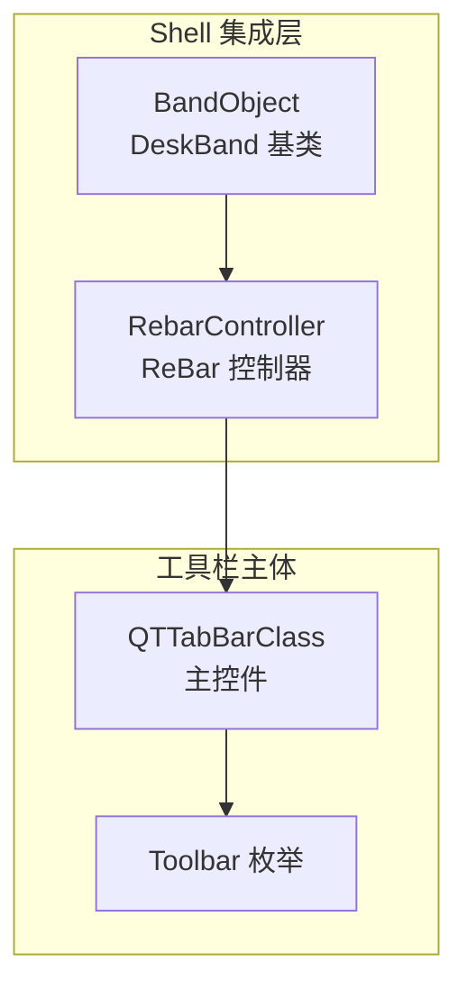
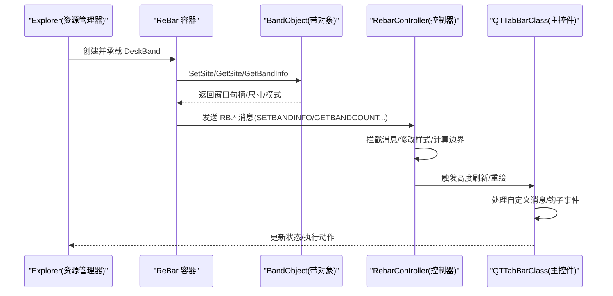
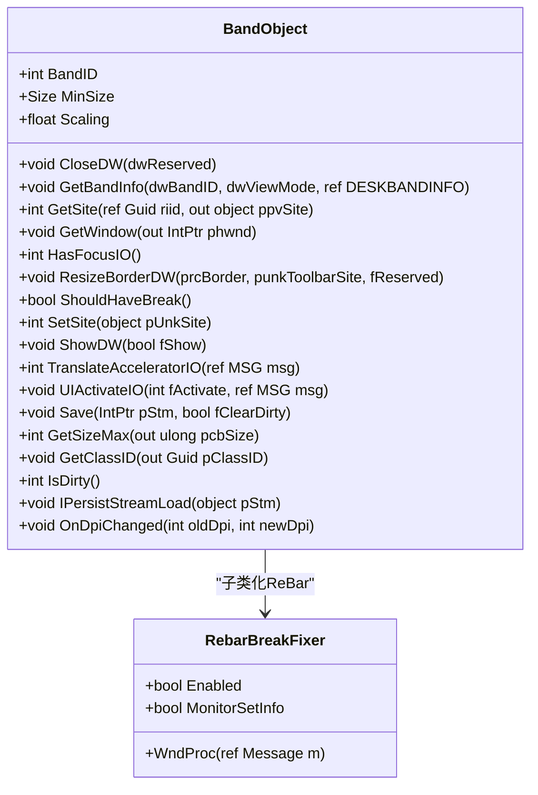
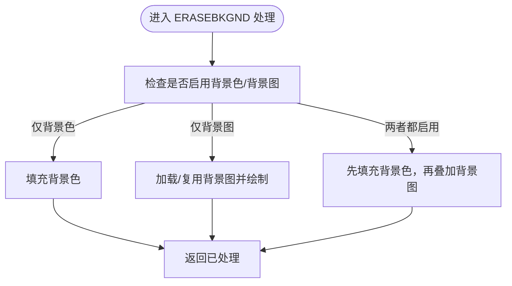
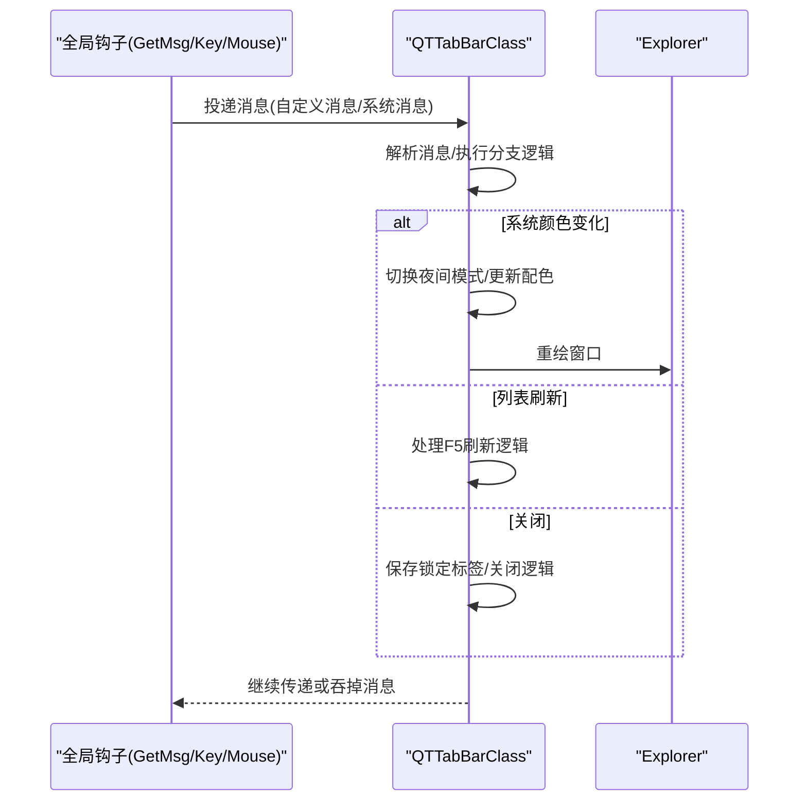
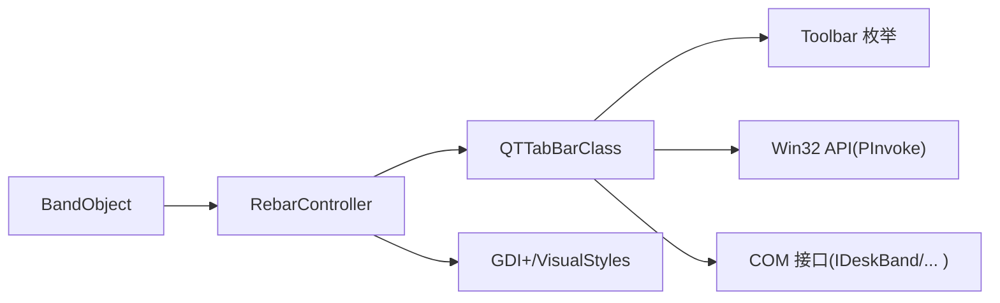

# Toolbar 工具栏

<cite>
**本文引用的文件**   
- [QTTabBarClass.cs](file://QTTabBar\QTTabBarClass.cs)
- [RebarController.cs](file://QTTabBar\RebarController.cs)
- [BandObject.cs](file://BandObjectLib\BandObject.cs)
- [Toolbar.cs](file://QTTabBar\Toolbar.cs)
- [README.md](file://README.md)
</cite>

## 目录
1. [简介](#简介)
2. [项目结构](#项目结构)
3. [核心组件](#核心组件)
4. [架构总览](#架构总览)
5. [详细组件分析](#详细组件分析)
6. [依赖关系分析](#依赖关系分析)
7. [性能考量](#性能考量)
8. [故障排除指南](#故障排除指南)
9. [结论](#结论)
10. [附录](#附录)

## 简介
本技术文档聚焦于 QTTabBar 的“工具栏”能力，围绕其在 Windows Shell（资源管理器）中的集成方式、消息处理机制、布局与尺寸管理、样式系统（主题/颜色/背景图）、扩展机制（自定义项与菜单）、性能优化策略以及集成示例与排障要点进行系统化说明。该实现基于 BandObject 模型嵌入 Explorer 的 ReBar 容器，并通过窗口子类化与全局钩子完成消息拦截与交互。

## 项目结构
从代码组织看，工具栏相关的关键位置如下：
- 工具栏类型枚举：用于标识不同工具栏区域（如标签栏、命令栏等）。
- 带对象基类：提供与 Shell 集成的最小实现（IDeskBand/IDockingWindow/IInputObject 等），负责与 ReBar 通信、焦点与输入传递。
- ReBar 控制器：对 ReBar 容器进行消息拦截、背景绘制、菜单条显示控制、高度刷新等。
- 主控件：承载标签页、导航、插件体系与大量用户交互逻辑，同时通过全局钩子与窗口消息处理与 Explorer 深度协作。

图示来源
- [BandObject.cs](file://BandObjectLib\BandObject.cs)
- [RebarController.cs](file://QTTabBar\RebarController.cs)
- [QTTabBarClass.cs](file://QTTabBar\QTTabBarClass.cs)
- [Toolbar.cs](file://QTTabBar\Toolbar.cs)

章节来源
- [README.md:1-60](file://README.md#L1-L60)

## 核心组件
- 工具栏类型枚举（Toolbar）
  - 定义多种工具栏槽位（如 TabBar、CommandBar1/2、BottomTabBar、ManagementBar 等），用于区分不同区域的实例与行为。
- 带对象基类（BandObject）
  - 实现 IDeskBand、IDockingWindow、IInputObject、IOleWindow、IPersistStream 等接口，作为所有可停靠 UI 的基础。
  - 负责 SetSite/GetSite、ShowDW、CloseDW、GetBandInfo、TranslateAcceleratorIO、UIActivateIO 等生命周期与输入转发。
  - 内置 RebarBreakFixer 子类化 ReBar，修复某些系统版本下 BREAK 样式异常问题。
- ReBar 控制器（RebarController）
  - 持有 ReBar 句柄，捕获 RB.SETBANDINFO、WM.ERASEBKGND 等消息，控制菜单条显隐、背景色/背景图绘制、高度变更通知。
  - 支持拉伸模式（Real/Tile/Full九宫格）与按 Band 分别绘制。
- 主控件（QTTabBarClass）
  - 注册并处理多个自定义窗口消息（如新树视图、浏览对象、列表刷新、显示/隐藏工具栏、选择文件等）。
  - 安装全局 GetMsg/键盘/鼠标钩子，响应系统事件（如系统颜色变化、关闭、命令等）。
  - 维护标签页、导航、拖放、上下文菜单、插件调用等复杂业务逻辑。

章节来源
- [Toolbar.cs:8-30](file://QTTabBar\Toolbar.cs#L8-L30)
- [BandObject.cs:35-44](file://BandObjectLib\BandObject.cs#L35-L44)
- [BandObject.cs:317-345](file://BandObjectLib\BandObject.cs#L317-L345)
- [BandObject.cs:429-484](file://BandObjectLib\BandObject.cs#L429-L484)
- [RebarController.cs:74-104](file://QTTabBar\RebarController.cs#L74-L104)
- [RebarController.cs:296-327](file://QTTabBar\RebarController.cs#L296-L327)
- [RebarController.cs:313-427](file://QTTabBar\RebarController.cs#L313-L427)
- [QTTabBarClass.cs:159-166](file://QTTabBar\QTTabBarClass.cs#L159-L166)
- [QTTabBarClass.cs:470-682](file://QTTabBar\QTTabBarClass.cs#L470-L682)

## 架构总览
下图展示了工具栏在 Explorer 中的整体集成路径：BandObject 作为 DeskBand 被 ReBar 承载；RebarController 对 ReBar 进行消息拦截与绘制定制；QTTabBarClass 作为具体工具栏内容承载者，通过全局钩子与窗口消息与 Explorer 交互。

图示来源
- [BandObject.cs:429-484](file://BandObjectLib\BandObject.cs#L429-L484)
- [RebarController.cs:74-104](file://QTTabBar\RebarController.cs#L74-L104)
- [RebarController.cs:169-256](file://QTTabBar\RebarController.cs#L169-L256)
- [QTTabBarClass.cs:470-682](file://QTTabBar\QTTabBarClass.cs#L470-L682)

## 详细组件分析

### 组件一：BandObject（Shell 集成基类）
- 职责
  - 实现 DeskBand/DockingWindow/InputObject/OleWindow/PersistStream 等接口，完成与 Explorer 的生命周期绑定。
  - 通过 IObjectWithSite 获取 ReBar 句柄，并在 ShowDW/CloseDW 中管理可见性与资源释放。
  - 提供 TranslateAcceleratorIO/UIActivateIO 以将焦点与快捷键传递给内部控件。
  - 使用 RebarBreakFixer 子类化 ReBar，修正特定系统版本下的 BREAK 样式问题。
- 关键流程
  - SetSite：解析站点对象，查询 WebBrowser 服务，保存 ReBar 句柄，回调 OnExplorerAttached。
  - GetBandInfo：向容器报告实际大小、步长、最大/最小尺寸、模式标志等。
  - ShowDW：启用 RebarBreakFixer 监控 SETBANDINFO，异步取消监控。
  - CloseDW：释放 COM 引用、禁用子类化、清理资源。

图示来源
- [BandObject.cs:35-44](file://BandObjectLib\BandObject.cs#L35-L44)
- [BandObject.cs:82-160](file://BandObjectLib\BandObject.cs#L82-L160)
- [BandObject.cs:317-345](file://BandObjectLib\BandObject.cs#L317-L345)
- [BandObject.cs:429-484](file://BandObjectLib\BandObject.cs#L429-L484)
- [BandObject.cs:486-523](file://BandObjectLib\BandObject.cs#L486-L523)

章节来源
- [BandObject.cs:317-345](file://BandObjectLib\BandObject.cs#L317-L345)
- [BandObject.cs:429-484](file://BandObjectLib\BandObject.cs#L429-L484)
- [BandObject.cs:486-523](file://BandObjectLib\BandObject.cs#L486-L523)

### 组件二：RebarController（ReBar 控制器）
- 职责
  - 捕获 ReBar 消息（RB.SETBANDINFO、WM.ERASEBKGND 等），控制菜单条显隐、背景色/背景图绘制、高度变更通知。
  - 根据配置决定是否使用背景色或背景图，支持三种拉伸模式（真实像素、平铺、九宫格）。
  - 遍历各 Band 的矩形与边框，计算目标绘制区域，确保在不同 DPI/缩放下正确渲染。
- 关键流程
  - 构造：记录 Explorer 父窗口句柄、为 ReBar 与菜单条建立消息捕获。
  - EnsureMenuBarIsCorrect：依据 AlwaysShowMenus 与当前菜单焦点决定菜单条是否隐藏。
  - RefreshHeight：通知 DeskBand 信息变更，非 XP 下发送 RBN_HEIGHTCHANGE 给父窗口并重绘。
  - RefreshBG：切换背景色/图片，必要时重建纹理画刷。
  - RebarMessageCaptured：拦截 ERASEBKGND，先填充背景色（可选），再绘制背景图（可选），返回已处理标记。

图示来源
- [RebarController.cs:74-104](file://QTTabBar\RebarController.cs#L74-L104)
- [RebarController.cs:143-155](file://QTTabBar\RebarController.cs#L143-L155)
- [RebarController.cs:169-256](file://QTTabBar\RebarController.cs#L169-L256)
- [RebarController.cs:261-285](file://QTTabBar\RebarController.cs#L261-L285)
- [RebarController.cs:296-327](file://QTTabBar\RebarController.cs#L296-L327)
- [RebarController.cs:313-427](file://QTTabBar\RebarController.cs#L313-L427)

章节来源
- [RebarController.cs:143-155](file://QTTabBar\RebarController.cs#L143-L155)
- [RebarController.cs:169-256](file://QTTabBar\RebarController.cs#L169-L256)
- [RebarController.cs:261-285](file://QTTabBar\RebarController.cs#L261-L285)
- [RebarController.cs:296-327](file://QTTabBar\RebarController.cs#L296-L327)
- [RebarController.cs:313-427](file://QTTabBar\RebarController.cs#L313-L427)

### 组件三：QTTabBarClass（主控件与消息中枢）
- 职责
  - 注册并处理多个自定义窗口消息（如新树视图、浏览对象、列表刷新、显示/隐藏工具栏、选择文件等）。
  - 安装全局 GetMsg/键盘/鼠标钩子，响应系统级事件（系统颜色变化、关闭、命令、滚轮、侧键等）。
  - 维护标签页、导航、拖放、上下文菜单、插件调用、搜索框等复杂功能。
- 关键流程
  - CallbackGetMsgProc：处理 WM_NEWTREECONTROL、WM_LISTREFRESHED、WM_SELECTFILE、WM.SYSCOLORCHANGE、WM.CLOSE、WM.COMMAND 等。
  - CallbackKeyboardProc：处理 Shift、Ctrl+Tab、Alt 等组合键，联动标签切换器与关闭按钮显示。
  - CallbackMouseProc：处理滚轮、XButton1/XButton2 等全局鼠标动作。

图示来源
- [QTTabBarClass.cs:159-166](file://QTTabBar\QTTabBarClass.cs#L159-L166)
- [QTTabBarClass.cs:470-682](file://QTTabBar\QTTabBarClass.cs#L470-L682)
- [QTTabBarClass.cs:690-746](file://QTTabBar\QTTabBarClass.cs#L690-L746)
- [QTTabBarClass.cs:748-793](file://QTTabBar\QTTabBarClass.cs#L748-L793)

章节来源
- [QTTabBarClass.cs:159-166](file://QTTabBar\QTTabBarClass.cs#L159-L166)
- [QTTabBarClass.cs:470-682](file://QTTabBar\QTTabBarClass.cs#L470-L682)
- [QTTabBarClass.cs:690-746](file://QTTabBar\QTTabBarClass.cs#L690-L746)
- [QTTabBarClass.cs:748-793](file://QTTabBar\QTTabBarClass.cs#L748-L793)

### 组件四：Toolbar 枚举（工具栏类型）
- 作用
  - 定义工具栏槽位标识（如 TabBar、CommandBar1/2、BottomTabBar、ManagementBar、ExtraViewLeft/Bottom 等），便于多区域工具栏的统一管理与差异化行为。
- 备注
  - 部分值标注为废弃，保留用于兼容历史配置。

章节来源
- [Toolbar.cs:8-30](file://QTTabBar\Toolbar.cs#L8-L30)

## 依赖关系分析
- 组件耦合
  - BandObject 是基础，提供与 ReBar 的通信能力；RebarController 在其之上增强 ReBar 的消息与绘制；QTTabBarClass 作为具体实现，承载业务逻辑并与 Explorer 深度交互。
- 外部依赖
  - 通过 PInvoke 调用 Win32 API（如 SendMessage、RedrawWindow、GetWindowLongPtr 等）。
  - 使用 VisualStyles 与 GDI+ 进行背景绘制。
  - 使用 COM 接口（IDeskBand、IDockingWindow、IInputObject、IOleWindow、IPersistStream 等）。
- 潜在循环依赖
  - 当前结构清晰分层，未见直接循环引用；但需注意在消息处理中避免递归重入（例如在 ERASEBKGND 中不要再次触发重绘导致死循环）。

图示来源
- [BandObject.cs:35-44](file://BandObjectLib\BandObject.cs#L35-L44)
- [RebarController.cs:74-104](file://QTTabBar\RebarController.cs#L74-L104)
- [QTTabBarClass.cs:159-166](file://QTTabBar\QTTabBarClass.cs#L159-L166)
- [Toolbar.cs:8-30](file://QTTabBar\Toolbar.cs#L8-L30)

章节来源
- [BandObject.cs:35-44](file://BandObjectLib\BandObject.cs#L35-L44)
- [RebarController.cs:74-104](file://QTTabBar\RebarController.cs#L74-L104)
- [QTTabBarClass.cs:159-166](file://QTTabBar\QTTabBarClass.cs#L159-L166)
- [Toolbar.cs:8-30](file://QTTabBar\Toolbar.cs#L8-L30)

## 性能考量
- 延迟加载与按需绘制
  - 背景图仅在需要时加载与缓存，避免启动开销；纹理画刷复用减少内存分配。
- 虚拟化和增量更新
  - 通过只重绘受影响区域（如每个 Band 的矩形）降低重绘成本；在高度变化时仅通知必要消息。
- 资源管理
  - 在 Dispose/CloseDW 中释放位图与画刷，防止泄漏；在错误路径中记录日志以便定位问题。
- 建议
  - 对于大尺寸背景图，优先使用 Tile 模式以减少拉伸计算；九宫格模式适合高分辨率与高 DPI 场景。
  - 避免在高频消息（如 ERASEBKGND）中进行耗时操作，必要时异步化或节流。

[本节为通用指导，不直接分析具体文件]

## 故障排除指南
- 常见问题
  - 工具栏不显示或显示异常：检查 Explorer 设置与菜单条显隐逻辑；确认 RebarController 是否正确拦截 SETBANDINFO。
  - 背景色/背景图不生效：确认配置开关与图片路径有效性；检查 CreateRebarImage 异常日志。
  - 高度不正确或重叠：检查 RefreshHeight 流程与 RBN_HEIGHTCHANGE 通知；确认各 Band 的矩形与边框计算。
  - 系统颜色变化后未刷新：确认 SYSCOLORCHANGE 处理分支是否触发重绘与配色更新。
- 诊断方法
  - 查看异常日志路径：%AppData%\QTTabBar\QTTabBarException.log（参考 README）。
  - 启用调试日志（若开启）：关注 bandLog 输出，定位消息流与异常堆栈。
- 解决步骤
  - 重置 ReBar 背景色/图片配置，重启 Explorer 验证。
  - 调整拉伸模式与边距参数，观察绘制效果。
  - 针对特定系统版本（如 Win11）使用诊断脚本辅助排查。

章节来源
- [README.md:23-24](file://README.md#L23-L24)
- [RebarController.cs:115-137](file://QTTabBar\RebarController.cs#L115-L137)
- [RebarController.cs:261-285](file://QTTabBar\RebarController.cs#L261-L285)
- [RebarController.cs:169-256](file://QTTabBar\RebarController.cs#L169-L256)
- [QTTabBarClass.cs:613-621](file://QTTabBar\QTTabBarClass.cs#L613-L621)

## 结论
QTTabBar 的工具栏通过标准的 DeskBand 模型与 ReBar 容器集成，借助 RebarController 对 ReBar 的消息与绘制进行精细化控制，并由 QTTabBarClass 承担主要业务逻辑与系统事件响应。其架构层次清晰、扩展点明确，支持丰富的样式与交互能力。结合合理的性能优化与完善的排障手段，可在多版本 Windows 环境下稳定运行并提供良好的用户体验。

[本节为总结性内容，不直接分析具体文件]

## 附录
- 集成示例（概念性步骤）
  - 继承 BandObject 实现自定义工具栏控件。
  - 在 SetSite 中获取 ReBar 句柄，初始化 RebarController 并订阅消息。
  - 在 GetBandInfo 中声明尺寸与模式，确保与宿主协调。
  - 在 ShowDW/CloseDW 中管理可见性与资源释放。
  - 根据需要处理自定义消息与全局钩子事件，实现高级交互。
- 最佳实践
  - 谨慎处理高频消息，避免阻塞 UI 线程。
  - 合理选择背景绘制模式，兼顾清晰度与性能。
  - 做好异常捕获与日志记录，便于问题定位。
  - 针对不同 DPI/缩放进行适配测试。

[本节为概念性内容，不直接分析具体文件]