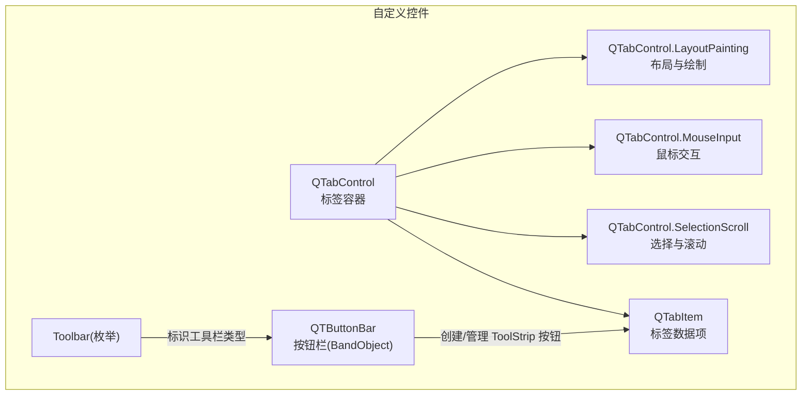
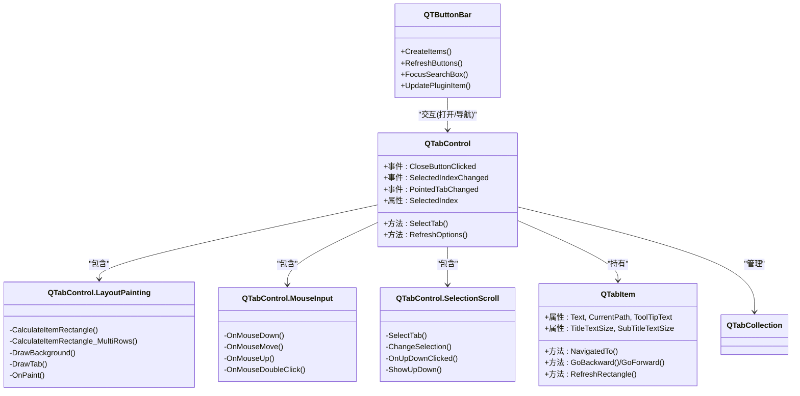
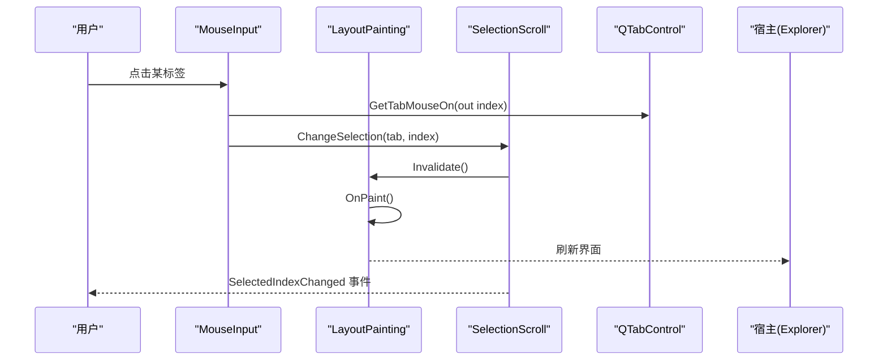
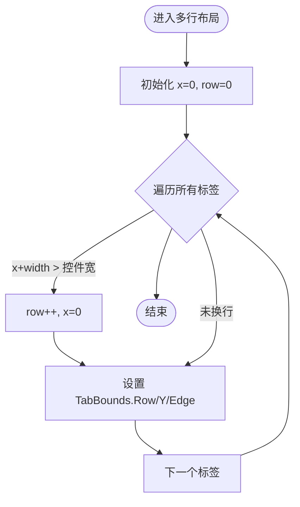
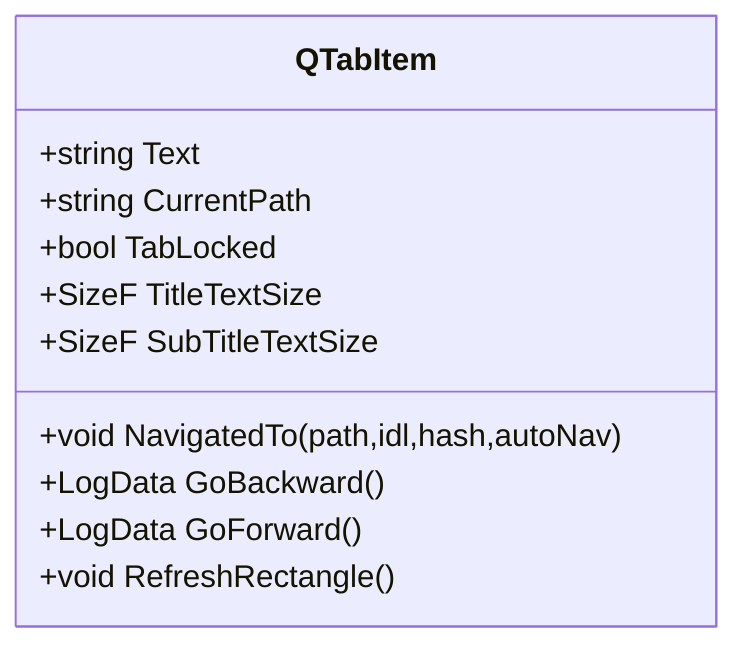
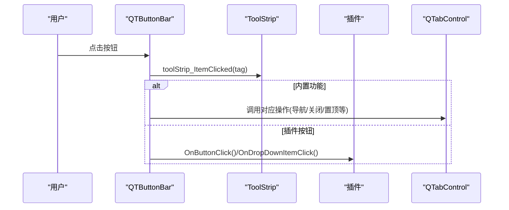
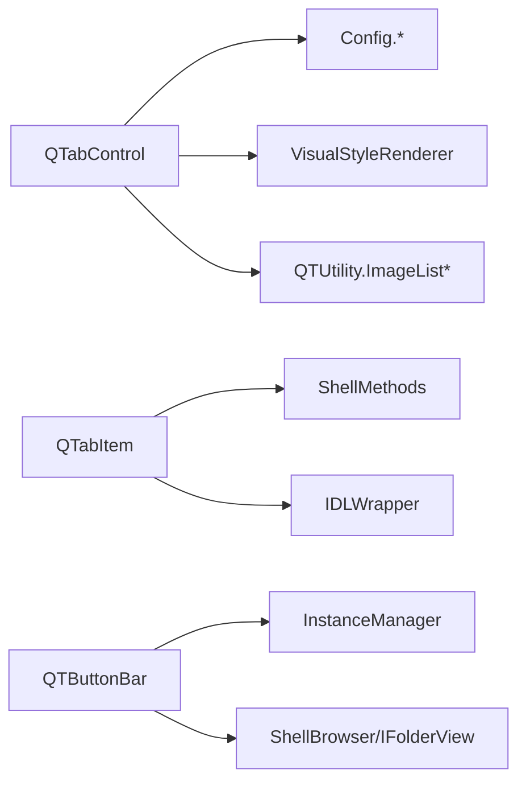

# 自定义控件

<cite>
**本文引用的文件**   
- [QTabControl.cs](file://QTTabBar/QTabControl.cs)
- [QTabControl.LayoutPainting.cs](file://QTTabBar/QTabControl.LayoutPainting.cs)
- [QTabControl.MouseInput.cs](file://QTTabBar/QTabControl.MouseInput.cs)
- [QTabControl.SelectionScroll.cs](file://QTTabBar/QTabControl.SelectionScroll.cs)
- [QTabItem.cs](file://QTTabBar/QTabItem.cs)
- [QTButtonBar.cs](file://QTTabBar/QTButtonBar.cs)
- [Toolbar.cs](file://QTTabBar/Toolbar.cs)
</cite>

## 更新摘要
**变更内容**   
- QTabControl 已进行大规模重构，拆分为多个部分类文件：LayoutPainting.cs（布局与绘制）、MouseInput.cs（鼠标交互）、SelectionScroll.cs（选择与滚动）
- QTDesktopTool 从 2574 行减少到 397 行，通过新的部分类处理特定关注点
- 改进了代码组织结构和可维护性

## 目录
1. [简介](#简介)
2. [项目结构](#项目结构)
3. [核心组件](#核心组件)
4. [架构总览](#架构总览)
5. [详细组件分析](#详细组件分析)
6. [依赖关系分析](#依赖关系分析)
7. [性能与内存管理](#性能与内存管理)
8. [故障排查指南](#故障排查指南)
9. [结论](#结论)
10. [附录：使用与扩展指南](#附录使用与扩展指南)

## 简介
本文件面向 QTTabBar-Next 的自定义控件，聚焦以下目标：
- 深入解析 QTabControl（标签控件）的实现：标签页生命周期、绘制机制、事件处理与多行布局算法。
- 详细说明 QTabItem 的数据模型与状态管理。
- 阐述 QTButtonBar 按钮栏组件：按钮的动态添加、删除、重排序与样式定制。
- 解释 Toolbar 工具栏枚举的作用与扩展点。
- 提供自定义控件的使用示例与继承指南。
- 给出性能优化策略与内存管理最佳实践。

## 项目结构
与自定义控件直接相关的核心文件位于 QTTabBar 目录下：
- QTabControl.cs：标签控件主体，负责基础属性和事件定义
- QTabControl.LayoutPainting.cs：布局计算和绘制逻辑
- QTabControl.MouseInput.cs：鼠标交互处理
- QTabControl.SelectionScroll.cs：选择管理和滚动控制
- QTabItem.cs：标签数据项，封装文本、路径、历史、选中状态等
- QTButtonBar.cs：按钮栏 BandObject，承载 ToolStrip 并集成搜索框、分组、应用启动器等
- Toolbar.cs：工具栏类型枚举，用于标识不同工具栏位置或用途

**图表来源**
- [QTabControl.cs:1-200](file://QTTabBar/QTabControl.cs#L1-L200)
- [QTabControl.LayoutPainting.cs:1-825](file://QTTabBar/QTabControl.LayoutPainting.cs#L1-L825)
- [QTabControl.MouseInput.cs:1-293](file://QTTabBar/QTabControl.MouseInput.cs#L1-L293)
- [QTabControl.SelectionScroll.cs:1-641](file://QTTabBar/QTabControl.SelectionScroll.cs#L1-L641)
- [QTabItem.cs:1-465](file://QTTabBar/QTabItem.cs#L1-L465)
- [QTButtonBar.cs:1-1985](file://QTTabBar/QTButtonBar.cs#L1-L1985)
- [Toolbar.cs:1-32](file://QTTabBar/Toolbar.cs#L1-L32)

## 核心组件
- QTabControl：自绘标签容器，支持单行/多行布局、关闭按钮、文件夹图标、阴影、主题色、滚动条、双击抑制、焦点导航、Plus 按钮等
- QTabControl.LayoutPainting：负责布局计算和绘制逻辑，包括背景绘制、标签绘制、文本阴影效果等
- QTabControl.MouseInput：处理鼠标交互事件，包括点击、悬停、拖拽、双击等
- QTabControl.SelectionScroll：管理标签选择和滚动功能，包括选择变更、滚动控制、键盘导航等
- QTabItem：标签数据载体，维护标题、副标题、当前路径、Shell 提示、锁定状态、历史记录、分支列表、选择状态等
- QTButtonBar：基于 ToolStrip 的按钮栏，内置导航、分组、最近关闭、应用启动器、置顶、透明度滑块、搜索框等功能，支持插件扩展
- Toolbar：工具栏类型枚举，用于区分 TabBar、CommandBar、BottomTabBar 等

**章节来源**
- [QTabControl.cs:1-200](file://QTTabBar/QTabControl.cs#L1-L200)
- [QTabControl.LayoutPainting.cs:1-825](file://QTTabBar/QTabControl.LayoutPainting.cs#L1-L825)
- [QTabControl.MouseInput.cs:1-293](file://QTTabBar/QTabControl.MouseInput.cs#L1-L293)
- [QTabControl.SelectionScroll.cs:1-641](file://QTTabBar/QTabControl.SelectionScroll.cs#L1-L641)
- [QTabItem.cs:1-465](file://QTTabBar/QTabItem.cs#L1-L465)
- [QTButtonBar.cs:1-1985](file://QTTabBar/QTButtonBar.cs#L1-L1985)
- [Toolbar.cs:1-32](file://QTTabBar/Toolbar.cs#L1-L32)

## 架构总览
QTabControl 作为 UI 核心，通过 QTabCollection 管理 QTabItem 集合；QTButtonBar 通过 ToolStrip 承载各类按钮并与 QTabControl 协作（如打开新标签、导航）。重构后的架构将复杂功能分离到专门的部分类中，提高了代码的可维护性和可读性。

**图表来源**
- [QTabControl.cs:1-200](file://QTTabBar/QTabControl.cs#L1-L200)
- [QTabControl.LayoutPainting.cs:1-825](file://QTTabBar/QTabControl.LayoutPainting.cs#L1-L825)
- [QTabControl.MouseInput.cs:1-293](file://QTTabBar/QTabControl.MouseInput.cs#L1-L293)
- [QTabControl.SelectionScroll.cs:1-641](file://QTTabBar/QTabControl.SelectionScroll.cs#L1-L641)
- [QTabItem.cs:1-465](file://QTTabBar/QTabItem.cs#L1-L465)
- [QTButtonBar.cs:1-1985](file://QTTabBar/QTButtonBar.cs#L1-L1985)

## 详细组件分析

### QTabControl 标签控件（重构后）

#### 生命周期管理
- 构造时初始化颜色、字体、StringFormat、夜间模式标志、定时器与 VisualStyleRenderer
- Dispose 中释放画笔、位图、字体等资源，并通知每个 QTabItem 执行 OnClose

#### 布局与多行算法（LayoutPainting.cs）
- CalculateItemRectangle：单行布局，计算每个标签矩形与 Edge（左/右/中），返回是否需要显示上下滚动
- CalculateItemRectangle_MultiRows：多行布局，按宽度限制与固定尺寸进行换行，设置 Row 与 Edge，并在行数变化时触发 RowCountChanged

#### 绘制机制（LayoutPainting.cs）
- OnPaint：根据是否多行走不同绘制路径；先绘制非选中项，再绘制选中项；必要时绘制 Plus 按钮与 UpDown 控件
- DrawBackground：支持系统视觉样式或自定义九宫格贴图；夜间模式下背景与边框颜色调整
- DrawTab：绘制图标、锁定标记、主标题与副标题（自动/手动）、关闭按钮、焦点框、阴影文字等

#### 鼠标交互处理（MouseInput.cs）
- MouseDown/MouseMove/MouseUp/DoubleClick/Leave 等事件处理
- 支持关闭按钮命中测试、图标子目录提示、拖拽 ItemDrag、伪热点高亮
- 智能双击抑制机制，防止误操作

#### 选择与滚动管理（SelectionScroll.cs）
- 标签选择变更处理，包括索引更新和事件触发
- 滚动控制逻辑，支持 UpDown 控件和键盘导航
- 焦点管理，支持 Tab 键切换和方向键导航

**图表来源**
- [QTabControl.MouseInput.cs:48-79](file://QTTabBar/QTabControl.MouseInput.cs#L48-L79)
- [QTabControl.SelectionScroll.cs:190-209](file://QTTabBar/QTabControl.SelectionScroll.cs#L190-L209)
- [QTabControl.LayoutPainting.cs:176-212](file://QTTabBar/QTabControl.LayoutPainting.cs#L176-L212)

**图表来源**
- [QTabControl.LayoutPainting.cs:332-464](file://QTTabBar/QTabControl.LayoutPainting.cs#L332-L464)

**章节来源**
- [QTabControl.cs:1-200](file://QTTabBar/QTabControl.cs#L1-L200)
- [QTabControl.LayoutPainting.cs:1-825](file://QTTabBar/QTabControl.LayoutPainting.cs#L1-L825)
- [QTabControl.MouseInput.cs:1-293](file://QTTabBar/QTabControl.MouseInput.cs#L1-L293)
- [QTabControl.SelectionScroll.cs:1-641](file://QTTabBar/QTabControl.SelectionScroll.cs#L1-L641)

### QTabItem 数据模型与状态
- 数据字段
  - 标题/副标题、当前路径、图像键、锁定状态、Shell 提示、历史栈（前进/后退）、分支列表、选中项缓存等
- 关键属性
  - Text、CurrentPath、ImageKey、TabLocked、ToolTipText、TitleTextSize/SubTitleTextSize、TabBounds、Row/Edge 等
- 行为
  - NavigatedTo：记录历史、维护分支、清空前向历史
  - GoBackward/GoForward：在历史栈间移动并更新 CurrentPath
  - RefreshRectangle：根据父控件配置与内容重新计算尺寸
  - CheckSubTexts：当启用"自动为同名标签生成副标题"时，批量计算差异路径作为副标题

**图表来源**
- [QTabItem.cs:1-465](file://QTTabBar/QTabItem.cs#L1-L465)

**章节来源**
- [QTabItem.cs:1-465](file://QTTabBar/QTabItem.cs#L1-L465)

### QTButtonBar 按钮栏组件
- 组成与初始化
  - 内部托管 ToolStripClasses，设置 Renderer、透明背景、高度、最小尺寸等
  - 加载默认或外部图片资源（大/小两套 ImageStrip），支持深色模式替换
- 动态按钮管理
  - CreateItems：根据配置 ButtonIndexes 顺序创建分隔符、下拉按钮、普通按钮、搜索框、透明度滑块等；支持插件按钮（IBarButton/IBarDropButton/IBarCustomItem/IBarMultipleCustomItems）
  - RefreshButtons：根据当前标签状态更新导航、关闭、分组、应用启动器、置顶等按钮可用性与勾选状态
  - UnloadPluginsOnCreation：在重建时卸载不活跃插件实例，避免内存泄漏
- 搜索框与增量筛选
  - 输入防抖计时器触发 ShellViewIncrementalSearch，支持正则/通配符/FilterCore 插件过滤，隐藏/恢复匹配项，状态栏显示计数
- 键盘与焦点
  - TranslateAcceleratorIO/UIActivateIO：实现左右/上下/Tab/F6 等导航，溢出菜单展开，控件宿主焦点转移
- 样式定制
  - 支持 Rebar 背景色、工具栏文本色、按钮大小、是否显示标签文本、插件自定义项等

**图表来源**
- [QTButtonBar.cs:1449-1452](file://QTTabBar/QTButtonBar.cs#L1449-L1452)
- [QTButtonBar.cs:1065-1126](file://QTTabBar/QTButtonBar.cs#L1065-L1126)
- [QTButtonBar.cs:1702-1766](file://QTTabBar/QTButtonBar.cs#L1702-L1766)

**章节来源**
- [QTButtonBar.cs:1-1985](file://QTTabBar/QTButtonBar.cs#L1-L1985)

### Toolbar 工具栏枚举
- 作用：定义不同工具栏类型（如 TabBar、CommandBar、BottomTabBar 等），便于宿主识别与定位
- 扩展点：新增工具栏类型只需在枚举中添加成员，并在宿主侧注册相应区域

**章节来源**
- [Toolbar.cs:1-32](file://QTTabBar/Toolbar.cs#L1-L32)

## 依赖关系分析
- QTabControl 依赖：
  - 配置（Config.Skin/Tabs）、全局图像列表（QTUtility.ImageGlobalContainsKey）、系统视觉样式（VisualStyleRenderer）、本地化与日志（QTUtility2）
  - 内部 UpDown 控件用于单行滚动
- QTabItem 依赖：
  - ShellMethods 获取 IDL 与 Shell 提示文本；IDLWrapper 包装 PIDL
- QTButtonBar 依赖：
  - InstanceManager 获取线程级 QTTabBarClass；ShellBrowser/IFolderView/IShellFolderView 进行视图操作；Com 对象释放与错误日志

**图表来源**
- [QTabControl.cs:1-200](file://QTTabBar/QTabControl.cs#L1-L200)
- [QTabItem.cs:1-465](file://QTTabBar/QTabItem.cs#L1-L465)
- [QTButtonBar.cs:1-1985](file://QTTabBar/QTButtonBar.cs#L1-L1985)

**章节来源**
- [QTabControl.cs:1-200](file://QTTabBar/QTabControl.cs#L1-L200)
- [QTabItem.cs:1-465](file://QTTabBar/QTabItem.cs#L1-L465)
- [QTButtonBar.cs:1-1985](file://QTTabBar/QTButtonBar.cs#L1-L1985)

## 性能与内存管理
- 绘制优化
  - 双缓冲与全重绘：QTabControl 启用 OptimizedDoubleBuffer、AllPaintingInWmPaint、UserPaint，减少闪烁
  - 局部失效：InvalidateTabsOnMouseMove、SetPseudoHotIndex 仅对受影响区域重绘
  - 视觉样式渲染器复用：静态 vsr_* 对象避免重复创建
- 资源管理
  - Dispose 中释放 SolidBrush、Bitmap、Font、StringFormat 等 GDI 对象
  - ImageStrip 拆分大图并显式 Dispose；按钮图像 Clone 后及时释放
  - COM 对象释放：ShellBrowser/IShellFolderView/IPersistFolder2 等在 finally 块中释放
- 布局与测量
  - 文本测量使用 MeasureCharacterRanges 精确计算宽高，避免多余重排
  - 多行布局一次计算 Row/Edge，减少多次布局开销
- 建议
  - 大量标签场景下优先使用固定宽度或限制最大宽度，降低布局复杂度
  - 关闭不必要的阴影与文件夹图标以提升绘制性能
  - 谨慎使用外部大图资源，确保尺寸符合 ImageStrip 要求

**章节来源**
- [QTabControl.cs:124-147](file://QTTabBar/QTabControl.cs#L124-L147)
- [QTabControl.LayoutPainting.cs:96-273](file://QTTabBar/QTabControl.LayoutPainting.cs#L96-L273)
- [QTabControl.LayoutPainting.cs:1255-1265](file://QTTabBar/QTabControl.LayoutPainting.cs#L1255-L1265)
- [QTabControl.LayoutPainting.cs:1860-1889](file://QTTabBar/QTabControl.LayoutPainting.cs#L1860-L1889)
- [QTButtonBar.cs:1909-1983](file://QTTabBar/QTButtonBar.cs#L1909-L1983)
- [QTButtonBar.cs:1263-1405](file://QTTabBar/QTButtonBar.cs#L1263-L1405)

## 故障排查指南
- 常见异常与定位
  - 绘制异常：DrawTab 捕获异常并记录日志，检查 ImageList 键是否存在、文本为空、尺寸越界等
  - 多线程图像访问：ImageStrip.AddStrip 与按钮图像 Clone 处加锁，避免"对象正在其他地方使用"
  - 搜索框清理：RefreshSearchBox 中释放 CoTaskMem 指针，防止内存泄漏
- 快速自检清单
  - 确认 Config.Skin 与 Config.Tabs 配置项有效且非空引用
  - 检查 QTabItem.Text/CurrentPath 是否为空或非法路径
  - 验证外部图片路径与尺寸是否符合 ImageStrip 约束
  - 观察状态栏搜索结果计数是否与预期一致

**章节来源**
- [QTabControl.LayoutPainting.cs:340-560](file://QTTabBar/QTabControl.LayoutPainting.cs#L340-L560)
- [QTButtonBar.cs:1155-1186](file://QTTabBar/QTButtonBar.cs#L1155-L1186)
- [QTButtonBar.cs:1922-1961](file://QTTabBar/QTButtonBar.cs#L1922-L1961)

## 结论
QTabControl 经过重构后提供了高性能、可定制的标签容器，具备完善的布局、绘制与事件处理能力；通过部分类分离，代码结构更加清晰，易于维护和扩展。QTabItem 作为轻量数据模型，支撑丰富的标签状态与历史；QTButtonBar 将常用操作与插件能力整合到统一的工具栏界面，并通过搜索框与过滤器提升效率。遵循本文的性能与内存管理建议，可在复杂场景下保持流畅体验。

## 附录：使用与扩展指南
- 使用示例
  - 创建标签：new QTabItem(title, path, parent)，添加到 QTabControl.TabPages
  - 选择标签：QTabControl.SelectTab(index/tab)
  - 监听事件：订阅 SelectedIndexChanged、CloseButtonClicked、PointedTabChanged 等
- 继承与扩展
  - 自定义绘制：重写 QTabControl.OnPaint 或使用 SetTabImages 提供九宫格皮肤
  - 自定义按钮：实现 IBarButton/IBarDropButton/IBarCustomItem/IBarMultipleCustomItems，通过 QTButtonBar.CreateItems 加载
  - 工具栏扩展：在 Toolbar 枚举新增类型，并在宿主侧注册对应区域
- 最佳实践
  - 合理设置 TabMaxWidth/TabMinWidth 与 FixedWidthTabs，平衡可读性与空间利用
  - 在大批量标签场景禁用阴影与文件夹图标，提高绘制性能
  - 使用 RefreshOptions(false) 动态切换主题与外观，避免频繁重建控件

**章节来源**
- [QTabControl.SelectionScroll.cs:190-209](file://QTTabBar/QTabControl.SelectionScroll.cs#L190-L209)
- [QTButtonBar.cs:541-656](file://QTTabBar/QTButtonBar.cs#L541-L656)
- [Toolbar.cs:1-32](file://QTTabBar/Toolbar.cs#L1-L32)