# 开发者指南

<cite>
**本文引用的文件**
- [README.md](file://README.md)
- [BUILD.txt](file://BUILD.txt)
- [CONTRIBUTING.md](file://CONTRIBUTING.md)
- [QTTabBar Rebirth.sln](file://QTTabBar Rebirth.sln)
- [appveyor.yml](file://appveyor.yml)
- [01build_release.bat](file://01build_release.bat)
- [02build_sonar.bat](file://02build_sonar.bat)
- [03build_installer.bat](file://03build_installer.bat)
- [Tools/BuildInstaller.ps1](file://Tools/BuildInstaller.ps1)
- [Tools/GenerateInterop.ps1](file://Tools/GenerateInterop.ps1)
- [Tools/ArchFixExplorerVerify.ps1](file://Tools/ArchFixExplorerVerify.ps1)
- [QTTabBar\QTTabBar.csproj](file://QTTabBar\QTTabBar.csproj)
- [BandObjectLib\BandObjectLib.csproj](file://BandObjectLib\BandObjectLib.csproj)
- [Tests\QTTtabBarTests\QTTtabBarTests.csproj](file://Tests\QTTtabBarTests\QTTtabBarTests.csproj)
- [Tests\QTTtabBarTests\SmokeTests.cs](file://Tests\QTTtabBarTests\SmokeTests.cs)
- [Tests\QTTtabBarTests\SecurityTests.cs](file://Tests\QTTtabBarTests\SecurityTests.cs)
- [Tests\QTTtabBarTests\MenuControllerExtractionTests.cs](file://Tests\QTTtabBarTests\MenuControllerExtractionTests.cs)
- [Tests\QTTtabBarTests\InstanceManagerExtractionTests.cs](file://Tests\QTTtabBarTests\InstanceManagerExtractionTests.cs)
- [Tests\QTTtabBarTests\ResourceCacheExtractionTests.cs](file://Tests\QTTtabBarTests\ResourceCacheExtractionTests.cs)
- [Tests\QTTtabBarTests\SessionStateExtractionTests.cs](file://Tests\QTTtabBarTests\SessionStateExtractionTests.cs)
- [Tests\QTTtabBarTests\SessionStateRaceTests.cs](file://Tests\QTTtabBarTests\SessionStateRaceTests.cs)
- [Tests\QTTtabBarTests\ThreadSafetyTests.cs](file://Tests\QTTtabBarTests\ThreadSafetyTests.cs)
- [Tests\QTTtabBarTests\FacadeEquivalenceTests.cs](file://Tests\QTTtabBarTests\FacadeEquivalenceTests.cs)
- [Tests\QTTtabBarTests\TabManagerTests.cs](file://Tests\QTTtabBarTests\TabManagerTests.cs)
- [Tests\QTTtabBarTests\ArchitectureBatch2W7Tests.cs](file://Tests\QTTtabBarTests\ArchitectureBatch2W7Tests.cs)
- [Tests\QTTtabBarTests\ArchitectureBatch3C6bTests.cs](file://Tests\QTTtabBarTests\ArchitectureBatch3C6bTests.cs)
- [Tests\QTTtabBarTests\ArchitectureBatch3W1Tests.cs](file://Tests\QTTtabBarTests\ArchitectureBatch3W1Tests.cs)
- [Tests\QTTtabBarTests\ArchitectureBatch4Tests.cs](file://Tests\QTTtabBarTests\ArchitectureBatch4Tests.cs)
- [Tests\QTTtabBarTests\ArchitectureBatch3C6gTests.cs](file://Tests\QTTtabBarTests\ArchitectureBatch3C6gTests.cs)
- [Tests\QTTtabBarTests\ArchitectureBatch3C6hTests.cs](file://Tests\QTTtabBarTests\ArchitectureBatch3C6hTests.cs)
- [Tests\QTTtabBarTests\ArchitectureBatch3C6iTests.cs](file://Tests\QTTtabBarTests\ArchitectureBatch3C6iTests.cs)
- [Tests\QTTtabBarTests\ArchitectureBatch3C6jTests.cs](file://Tests\QTTtabBarTests\ArchitectureBatch3C6jTests.cs)
- [Tests\QTTtabBarTests\ArchitectureBatch3C6kTests.cs](file://Tests\QTTtabBarTests\ArchitectureBatch3C6kTests.cs)
- [Tests\QTTtabBarTests\ArchitectureBatch3C6lTests.cs](file://Tests\QTTtabBarTests\ArchitectureBatch3C6lTests.cs)
- [Tests\QTTtabBarTests\ArchitectureBatch3C7Tests.cs](file://Tests\QTTtabBarTests\ArchitectureBatch3C7Tests.cs)
- [Tests\QTTtabBarTests\ArchitectureBatch3C7ContinuedTests.cs](file://Tests\QTTtabBarTests\ArchitectureBatch3C7ContinuedTests.cs)
- [Tests\QTTtabBarTests\ArchitectureBatch3C7FacadeCleanupTests.cs](file://Tests\QTTtabBarTests\ArchitectureBatch3C7FacadeCleanupTests.cs)
- [Tests\QTTtabBarTests\ArchitectureBatch3C7iTests.cs](file://Tests\QTTtabBarTests\ArchitectureBatch3C7iTests.cs)
- [Tests\QTTtabBarTests\ArchitectureBatch3C7jTests.cs](file://Tests\QTTtabBarTests\ArchitectureBatch3C7jTests.cs)
- [Tests\QTTtabBarTests\ArchitectureBatch3W3gTests.cs](file://Tests\QTTtabBarTests\ArchitectureBatch3W3gTests.cs)
- [Tests\QTTtabBarTests\ArchitectureBatch3W3hTests.cs](file://Tests\QTTtabBarTests\ArchitectureBatch3W3hTests.cs)
- [Tests\QTTtabBarTests\ArchitectureBatch3W3jTests.cs](file://Tests\QTTtabBarTests\ArchitectureBatch3W3jTests.cs)
- [Tests\QTTtabBarTests\ArchitectureReviewRemediationTests.cs](file://Tests\QTTtabBarTests\ArchitectureReviewRemediationTests.cs)
- [Tests\QTTtabBarTests\ArchitectureReviewPhase3Tests.cs](file://Tests\QTTtabBarTests\ArchitectureReviewPhase3Tests.cs)
- [Tests\QTTtabBarTests\ArchitectureReviewPhase4Tests.cs](file://Tests\QTTtabBarTests\ArchitectureReviewPhase4Tests.cs)
- [Tests\QTTtabBarTests\ConfigSourceTestHelper.cs](file://Tests\QTTtabBarTests\ConfigSourceTestHelper.cs)
- [Tests\QTTtabBarTests\ExplorerControllerSourceTestHelper.cs](file://Tests\QTTtabBarTests\ExplorerControllerSourceTestHelper.cs)
- [Tests\QTTtabBarTests\MenuControllerSourceTestHelper.cs](file://Tests\QTTtabBarTests\MenuControllerSourceTestHelper.cs)
- [Tests\QTTtabBarTests\QTButtonBarSourceTestHelper.cs](file://Tests\QTTtabBarTests\QTButtonBarSourceTestHelper.cs)
- [Tests\QTTtabBarTests\QTabControlSourceTestHelper.cs](file://Tests\QTTtabBarTests\QTabControlSourceTestHelper.cs)
- [Tests\QTTtabBarTests\SecondViewBarSourceTestHelper.cs](file://Tests\QTTtabBarTests\SecondViewBarSourceTestHelper.cs)
- [Tests\QTTtabBarTests\TabTextLayoutTests.cs](file://Tests\QTTtabBarTests\TabTextLayoutTests.cs)
- [Tests\QTTtabBarTests\TabControlFieldShadowTests.cs](file://Tests\QTTtabBarTests\TabControlFieldShadowTests.cs)
- [Tests\InstallerExplorerRestartSafety.Tests.ps1](file://Tests\InstallerExplorerRestartSafety.Tests.ps1)
- [Tests\InstallerInteropGac.Tests.ps1](file://Tests\InstallerInteropGac.Tests.ps1)
- [Tests\InstallerUpgradeSingleInstance.Tests.ps1](file://Tests\InstallerUpgradeSingleInstance.Tests.ps1)
- [QTTabBar\SessionState.cs](file://QTTabBar\SessionState.cs)
- [QTTabBar\ResourceCache.cs](file://QTTabBar\ResourceCache.cs)
- [QTTabBar\IDLWrapper.cs](file://QTTabBar\IDLWrapper.cs)
- [QTTabBar\QTUtility.cs](file://QTTabBar\QTUtility.cs)
- [QTTabBar\QTResourceManager.cs](file://QTTabBar\QTResourceManager.cs)
- [QTTabBar\Config.cs](file://QTTabBar\Config.cs)
- [QTTabBar\InitializationOrchestrator.cs](file://QTTabBar\InitializationOrchestrator.cs)
- [QTTabBar\PathValidator.cs](file://QTTabBar\PathValidator.cs)
- [QTTabBar\IconManager.cs](file://QTTabBar\IconManager.cs)
- [QTTabBar\QTTabBarClass.BindActionController.cs](file://QTTabBar\QTTabBarClass.BindActionController.cs)
- [QTTabBar\QTTabBarClass.ShellCommandController.cs](file://QTTabBar\QTTabBarClass.ShellCommandController.cs)
- [QTTabBar\QTTabBarClass.ListViewInputController.cs](file://QTTabBar\QTTabBarClass.ListViewInputController.cs)
- [QTTabBar\QTTabBarClass.MenuController.cs](file://QTTabBar\QTTabBarClass.MenuController.cs)
- [QTTabBar\QTTabBarClass.ExplorerController.cs](file://QTTabBar\QTTabBarClass.ExplorerController.cs)
- [QTTabBar\TabBarBase.TabOperations.cs](file://QTTabBar\TabBarBase.TabOperations.cs)
</cite>

## 更新摘要
**变更内容**
- 新增架构审查修复测试套件，包含 ArchitectureReviewRemediationTests、ArchitectureReviewPhase3Tests、ArchitectureReviewPhase4Tests
- 添加源测试辅助类：ConfigSourceTestHelper、ExplorerControllerSourceTestHelper、MenuControllerSourceTestHelper、QTButtonBarSourceTestHelper、QTabControlSourceTestHelper、SecondViewBarSourceTestHelper
- 验证配置 IPC 版本递增、主题同步、初始化重试语义和入口点收敛等架构改进
- 确保幂等性保证、死窗口句柄清理、选择标签方法使用等设计模式正确实现
- 维持 687/687 绿色测试基线，覆盖新架构的完整验证

## 目录
1. [简介](#简介)
2. [项目结构](#项目结构)
3. [核心组件](#核心组件)
4. [架构总览](#架构总览)
5. [详细组件分析](#详细组件分析)
6. [依赖关系分析](#依赖关系分析)
7. [性能与构建差异](#性能与构建差异)
8. [测试策略](#测试策略)
9. [契约测试与重构保护](#契约测试与重构保护)
10. [Facade等价性测试](#facade等价性测试)
11. [TabManager重构测试](#tabmanager重构测试)
12. [会话状态竞态条件测试](#会话状态竞态条件测试)
13. [线程安全与并发验证](#线程安全与并发验证)
14. [IDLCache线程安全增强](#idlcachethread安全增强)
15. [架构批次测试增强](#架构批次测试增强)
16. [BindActionController架构批次测试](#bindactioncontroller架构批次测试)
17. [ShellCommandController架构批次测试](#shellcommandcontroller架构批次测试)
18. [ListViewInputController架构批次测试](#listviewinputcontroller架构批次测试)
19. [MenuController架构批次测试](#menucontroller架构批次测试)
20. [ExplorerControllerModule架构批次测试](#explorercontrollermodule架构批次测试)
21. [Tab操作去重测试](#tab操作去重测试)
22. [Facade清理验证测试](#facade清理验证测试)
23. [按需资源读取模式测试](#按需资源读取模式测试)
24. [QTUtility2清理验证测试](#qtutility2清理验证测试)
25. [QTUtility方法迁移验证测试](#qtutility方法迁移验证测试)
26. [TabBarBase窗口消息处理重构测试](#tabbarbasewindow消息处理重构测试)
27. [TabBarBase鼠标事件处理重构测试](#tabbarbasemouse事件处理重构测试)
28. [第二视图栏钩子清理测试](#第二视图栏钩子清理测试)
29. [架构审查修复测试](#架构审查修复测试)
30. [安装程序互操作性测试](#安装程序互操作性测试)
31. [特定回归测试](#特定回归测试)
32. [手动验证工具](#手动验证工具)
33. [构建系统改进](#构建系统改进)
34. [持续集成与自动化](#持续集成与自动化)
35. [调试与故障排除](#调试与故障排除)
36. [贡献指南](#贡献指南)
37. [结论](#结论)

## 简介
本指南面向 QTTabBar-Next 的开发者，覆盖开发环境搭建、编译构建、代码规范、测试策略、持续集成、调试技巧与贡献流程。项目为 Windows Explorer 的 BandObject 扩展，提供标签页浏览、预览与插件体系，目标框架为 .NET Framework 4.8，并包含 C++ Hook 库与 WiX 安装程序。

**更新** 新增了全面的架构审查修复测试套件和源测试辅助类，专门验证配置 IPC 版本递增、主题同步、初始化重试语义和入口点收敛等架构改进。这些测试确保所有架构重构的正确性和向后兼容性，维持 687/687 绿色测试基线。新增的架构审查修复测试涵盖了幂等性保证、死窗口句柄清理、选择标签方法使用等关键设计模式的验证。

## 项目结构
仓库采用多语言混合工程组织：C# 主库与插件、C++ Hook 库、WiX 安装包、PowerShell 工具脚本以及 NUnit 测试集。解决方案包含多个配置（Debug、Release、No Plugins、No Reg 等），支持 x86/x64/AnyCPU 平台组合。

```mermaid
graph TB
subgraph "解决方案"
SLN["QTTabBar Rebirth.sln"]
end
subgraph "核心库"
QTB["QTTabBar\\QTTabBar.csproj"]
BOD["BandObjectLib\\BandObjectLib.csproj"]
QPL["QTPluginLib\\QTPluginLib.csproj"]
end
subgraph "原生库"
MH["MinHook\\libMinHook.vcxproj"]
QHL["QTHookLib\\QTHookLib.vcxproj"]
IH["InstallerHelper\\InstallerHelper.vcxproj"]
REG["Register\\Register.vcxproj"]
end
subgraph "安装程序"
WIX["Installer\\Installer.wixproj"]
WIXM["InstallerMini\\InstallerMini.wixproj"]
end
subgraph "插件"
PLG["Plugins\\*"]
end
subgraph "测试"
TST["Tests\\QTTtabBarTests\\QTTtabBarTests.csproj"]
CT["契约测试<br/>IL检查技术"]
TSR["会话状态竞态条件测试<br/>247行专业测试用例"]
TS["线程安全测试<br/>并发操作验证"]
FET["Facade等价性测试<br/>Task 3.3重构验证<br/>中文编码处理增强"]
TM["TabManager重构测试<br/>FormatterServices最小实例"]
ARCH["架构批次测试<br/>IDLWrapper线程安全验证"]
ARCH3["架构批次测试增强<br/>HookInputController/SelectionTracker/RegistryAccess"]
ARCH3C6G["BindActionController测试<br/>绑定动作控制器重构"]
ARCH3C6H["ShellCommandController测试<br/>命令处理控制器重构"]
ARCH3C6I["ListViewInputController测试<br/>列表视图输入处理重构"]
ARCH3C6J["MenuController测试<br/>菜单初始化重构"]
ARCH3C6K["ExplorerControllerModule测试<br/>窗口引导重构"]
ARCH3C6L["综合架构测试<br/>Item激活和旅行工具栏"]
ARCH3C7["架构批次C7测试<br/>OSDetector/QTLogger/RegistryHelper"]
ARCH3C7CONT["架构批次C7延续测试<br/>日志和注册表辅助类"]
ARCH3C7FAC["Facade清理测试<br/>QTUtility方法移除验证"]
ARCH3C7I["QTUtility2清理测试<br/>死代码和方法迁移验证"]
ARCH3C7J["QTUtility方法迁移测试<br/>ValidationHelper/AssemblyInfoHelper/IconManager"]
ARCH3W3G["TabBarBase窗口消息测试<br/>SYSCOLORCHANGE处理重构"]
ARCH3W3H["TabBarBase鼠标事件测试<br/>鼠标处理器重构"]
ARCH3W3J["第二视图栏钩子清理测试<br/>Dead Hook Process清理"]
ARCHREM["架构审查修复测试<br/>IPC版本/主题同步/初始化重试"]
ARPHASE3["架构审查阶段3测试<br/>幂等性/ThemeRefreshService/配置持久化"]
ARPHASE4["架构审查阶段4测试<br/>窗口初始化/死句柄清理/选择标签"]
INST["安装程序互操作性测试<br/>Explorer重启安全/GAC部署/单实例升级"]
REGTEST["特定回归测试<br/>标签文本布局/字段阴影"]
TABDEDUP["Tab操作去重测试<br/>重复标签页防重逻辑"]
SLN --> QTB
QTB --> BOD
QTB --> QPL
QTB --> MH
QTB --> QHL
WIX --> QTB
WIX --> QPL
WIX --> REG
WIX --> IH
WIXM --> QTB
WIXM --> QPL
TST --> QTB
CT --> TST
TSR --> TST
TS --> TST
FET --> TST
TM --> TST
ARCH --> TST
ARCH3 --> TST
ARCH3C6G --> TST
ARCH3C6H --> TST
ARCH3C6I --> TST
ARCH3C6J --> TST
ARCH3C6K --> TST
ARCH3C6L --> TST
ARCH3C7 --> TST
ARCH3C7CONT --> TST
ARCH3C7FAC --> TST
ARCH3C7I --> TST
ARCH3C7J --> TST
ARCH3W3G --> TST
ARCH3W3H --> TST
ARCH3W3J --> TST
ARCHREM --> TST
ARPHASE3 --> TST
ARPHASE4 --> TST
INST --> TST
REGTEST --> TST
TABDEDUP --> TST
```

图表来源
- [QTTabBar Rebirth.sln](file://QTTabBar Rebirth.sln)
- [QTTabBar\QTTabBar.csproj](file://QTTabBar\QTTabBar.csproj)
- [Tests\QTTtabBarTests\ArchitectureReviewRemediationTests.cs](file://Tests\QTTtabBarTests\ArchitectureReviewRemediationTests.cs)

章节来源
- [QTTabBar Rebirth.sln](file://QTTabBar Rebirth.sln)
- [QTTabBar\QTTabBar.csproj](file://QTTabBar\QTTabBar.csproj)

## 核心组件
- 主库（QTTabBar）：实现 Explorer BandObject、选项对话框、主题管理、IPC、插件加载、注册表与 Shell 交互等核心功能。
- 基础库（BandObjectLib）：提供 BandObject 基类与 DPI 感知能力。
- 插件接口（QTPluginLib）：定义插件契约与类型系统。
- 原生 Hook（QTHookLib + MinHook）：用于底层 API Hook。
- 安装程序（Installer/InstallerMini）：基于 WiX 生成 MSI。
- 测试（QTTtabBarTests）：NUnit 单元测试与安全回归测试，包含契约测试、重构保护、会话状态竞态条件验证、线程安全测试、facade等价性测试、TabManager重构测试、架构批次测试、BindActionController测试、ShellCommandController测试、ListViewInputController测试、MenuController测试、ExplorerControllerModule测试、Tab操作去重测试、Facade清理验证测试、按需资源读取模式测试、QTUtility2清理验证测试、QTUtility方法迁移验证测试、TabBarBase窗口消息处理重构测试、TabBarBase鼠标事件处理重构测试、第二视图栏钩子清理测试、架构审查修复测试、安装程序互操作性测试和特定回归测试。

**更新** 测试套件现在包含专门的架构审查修复测试套件，验证配置 IPC 版本递增、主题同步、初始化重试语义和入口点收敛等架构改进。这些测试使用源测试辅助类和反射技术确保所有架构重构的正确性和向后兼容性，维持 687/687 绿色测试基线。

章节来源
- [QTTabBar\QTTabBar.csproj](file://QTTabBar\QTTabBar.csproj)
- [CONTRIBUTING.md](file://CONTRIBUTING.md)
- [Tests\QTTtabBarTests\ArchitectureReviewRemediationTests.cs](file://Tests\QTTtabBarTests\ArchitectureReviewRemediationTests.cs)

## 架构总览
整体架构围绕"宿主进程（Explorer）— COM BandObject — 托管库 — 原生 Hook — 插件"展开。安装程序负责将 DLL 注册到系统，并在启动时启用扩展。

```mermaid
graph TB
EX["Windows 资源管理器(Explorer)"]
CB["COM BandObject<br/>QTTabBar.dll"]
CORE["托管核心<br/>QTTabBar 库"]
PLUG["插件接口<br/>QTPluginLib"]
HOOK["原生 Hook<br/>QTHookLib / MinHook"]
INST["安装程序<br/>WiX Installer"]
TEST["契约测试<br/>IL 检查"]
TSR["会话状态竞态条件测试<br/>TextResourcesDic/NoCapturePathsList/WindowAlpha"]
TS["线程安全测试<br/>并发操作验证"]
FET["Facade等价性测试<br/>PathValidator/IconManager/QTResourceManager<br/>中文编码处理增强"]
TM["TabManager重构测试<br/>FormatterServices最小实例"]
ARCH["架构批次测试<br/>IDLWrapper线程安全验证<br/>ConcurrentDictionary使用"]
ARCH3["架构批次测试增强<br/>HookInputController/SelectionTracker/RegistryAccess"]
ARCH3C6G["BindActionController测试<br/>绑定动作控制器重构"]
ARCH3C6H["ShellCommandController测试<br/>命令处理控制器重构"]
ARCH3C6I["ListViewInputController测试<br/>列表视图输入处理重构"]
ARCH3C6J["MenuController测试<br/>菜单初始化重构"]
ARCH3C6K["ExplorerControllerModule测试<br/>窗口引导重构"]
ARCH3C6L["综合架构测试<br/>Item激活和旅行工具栏"]
ARCH3C7["架构批次C7测试<br/>OSDetector/QTLogger/RegistryHelper"]
ARCH3C7CONT["架构批次C7延续测试<br/>日志和注册表辅助类"]
ARCH3C7FAC["Facade清理测试<br/>QTUtility方法移除验证"]
ARCH3C7I["QTUtility2清理测试<br/>死代码和方法迁移验证"]
ARCH3C7J["QTUtility方法迁移测试<br/>ValidationHelper/AssemblyInfoHelper/IconManager"]
ARCH3W3G["TabBarBase窗口消息测试<br/>SYSCOLORCHANGE处理重构"]
ARCH3W3H["TabBarBase鼠标事件测试<br/>鼠标处理器重构"]
ARCH3W3J["第二视图栏钩子清理测试<br/>Dead Hook Process清理"]
ARCHREM["架构审查修复测试<br/>IPC版本/主题同步/初始化重试"]
ARPHASE3["架构审查阶段3测试<br/>幂等性/ThemeRefreshService/配置持久化"]
ARPHASE4["架构审查阶段4测试<br/>窗口初始化/死句柄清理/选择标签"]
INST["安装程序互操作性测试<br/>Explorer重启安全/GAC部署/单实例升级"]
REGTEST["特定回归测试<br/>标签文本布局/字段阴影"]
TABDEDUP["Tab操作去重测试<br/>重复标签页防重逻辑"]
EX --> CB
CB --> CORE
CORE --> PLUG
CORE --> HOOK
INST --> CB
INST --> HOOK
TEST --> CORE
TSR --> CORE
TS --> CORE
FET --> CORE
TM --> CORE
ARCH --> CORE
ARCH3 --> CORE
ARCH3C6G --> CORE
ARCH3C6H --> CORE
ARCH3C6I --> CORE
ARCH3C6J --> CORE
ARCH3C6K --> CORE
ARCH3C6L --> CORE
ARCH3C7 --> CORE
ARCH3C7CONT --> CORE
ARCH3C7FAC --> CORE
ARCH3C7I --> CORE
ARCH3C7J --> CORE
ARCH3W3G --> CORE
ARCH3W3H --> CORE
ARCH3W3J --> CORE
ARCHREM --> CORE
ARPHASE3 --> CORE
ARPHASE4 --> CORE
INST --> CORE
REGTEST --> CORE
TABDEDUP --> CORE
```

图表来源
- [QTTabBar\QTTabBar.csproj](file://QTTabBar\QTTabBar.csproj)
- [appveyor.yml](file://appveyor.yml)
- [Tests\QTTtabBarTests\ArchitectureReviewRemediationTests.cs](file://Tests\QTTtabBarTests\ArchitectureReviewRemediationTests.cs)

## 详细组件分析

### 构建系统与配置
- 解决方案包含多种配置与平台映射，如 Debug/Release、x86/x64/AnyCPU、No Plugins/No Reg 等。
- 主库输出路径与符号信息在配置中区分，x86 为目标平台以匹配 Explorer 进程。
- 强名称签名与规则集在项目文件中启用。

```mermaid
flowchart TD
A["选择配置/平台"] --> B{"是否含插件?"}
B -- 是 --> C["构建 QTTabBar + 插件"]
B -- 否 --> D["构建 QTTabBar (无插件)"]
C --> E["可选: 自动注册(Register)"]
D --> E
E --> F["重启 Explorer 生效"]
F --> G["运行契约测试"]
G --> H["验证结构完整性"]
H --> I["运行facade等价性测试"]
I --> J["验证重构正确性<br/>中文编码处理"]
J --> K["运行TabManager重构测试"]
K --> L["验证嵌套类提取正确性"]
L --> M["运行会话状态竞态条件测试"]
M --> N["验证发布链语义和并发安全性"]
N --> O["运行线程安全测试"]
O --> P["验证并发操作正确性"]
P --> Q["运行架构批次测试"]
Q --> R["验证IDLWrapper线程安全<br/>ConcurrentDictionary使用"]
R --> S["运行架构批次测试增强"]
S --> T["验证HookInputController/SelectionTracker/RegistryAccess"]
T --> U["运行BindActionController测试"]
U --> V["验证绑定动作控制器重构"]
V --> W["运行ShellCommandController测试"]
W --> X["验证命令处理控制器重构"]
X --> Y["运行ListViewInputController测试"]
Y --> Z["验证列表视图输入处理重构"]
Z --> AA["运行MenuController测试"]
AA --> AB["验证菜单初始化重构"]
AB --> AC["运行ExplorerControllerModule测试"]
AC --> AD["验证窗口引导重构"]
AD --> AE["运行Tab操作去重测试"]
AE --> AF["验证重复标签页防重逻辑"]
AF --> AG["运行Facade清理验证测试"]
AG --> AH["验证QTUtility方法移除"]
AH --> AI["运行按需资源读取模式测试"]
AI --> AJ["验证QTResourceManager直接调用"]
AJ --> AK["运行QTUtility2清理验证测试"]
AK --> AL["验证死代码清理和方法迁移"]
AL --> AM["运行QTUtility方法迁移验证测试"]
AM --> AN["验证ValidationHelper/AssemblyInfoHelper/IconManager"]
AN --> AO["运行TabBarBase窗口消息处理重构测试"]
AO --> AP["验证SYSCOLORCHANGE处理重构"]
AP --> AQ["运行TabBarBase鼠标事件处理重构测试"]
AQ --> AR["验证鼠标处理器重构"]
AR --> AS["运行第二视图栏钩子清理测试"]
AS --> AT["验证Dead Hook Process清理"]
AT --> AU["运行架构审查修复测试"]
AU --> AV["验证IPC版本/主题同步/初始化重试"]
AV --> AW["运行架构审查阶段3测试"]
AW --> AX["验证幂等性/ThemeRefreshService/配置持久化"]
AX --> AY["运行架构审查阶段4测试"]
AY --> AZ["验证窗口初始化/死句柄清理/选择标签"]
AZ --> BA["运行安装程序互操作性测试"]
BA --> BB["验证Explorer重启安全/GAC部署/单实例升级"]
BB --> BC["运行特定回归测试"]
BC --> BD["验证标签文本布局/字段阴影"]
```

图表来源
- [QTTabBar Rebirth.sln](file://QTTabBar Rebirth.sln)
- [QTTabBar\QTTabBar.csproj](file://QTTabBar\QTTabBar.csproj)
- [BUILD.txt](file://BUILD.txt)
- [Tests\QTTtabBarTests\ArchitectureReviewRemediationTests.cs](file://Tests\QTTtabBarTests\ArchitectureReviewRemediationTests.cs)

章节来源
- [QTTabBar Rebirth.sln](file://QTTabBar Rebirth.sln)
- [QTTabBar\QTTabBar.csproj](file://QTTabBar\QTTabBar.csproj)
- [BUILD.txt](file://BUILD.txt)

### 安装与打包（WiX）
- 使用 WiX Toolset v3.11 构建 MSI，支持多语言资源。
- PowerShell 脚本 BuildInstaller.ps1 自动检测 MSBuild 与 WiX 目标路径，并可仅做环境探测。
- 支持构建标准版与精简版安装程序。

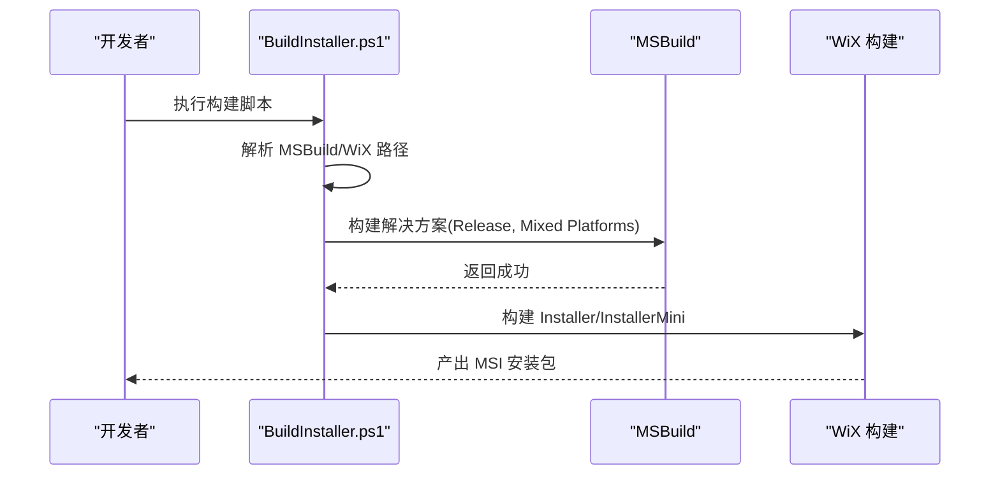

图表来源
- [Tools/BuildInstaller.ps1](file://Tools/BuildInstaller.ps1)
- [03build_installer.bat](file://03build_installer.bat)

章节来源
- [Tools/BuildInstaller.ps1](file://Tools/BuildInstaller.ps1)
- [03build_installer.bat](file://03build_installer.bat)

### COM Interop 生成
- 通过 GenerateInterop.ps1 调用 TlbImp.exe 从系统 COM 类型库生成互操作程序集，输出至 lib/interop。
- 需要 Windows SDK NETFX 4.8 Tools 或 Visual Studio 桌面开发工作负载。

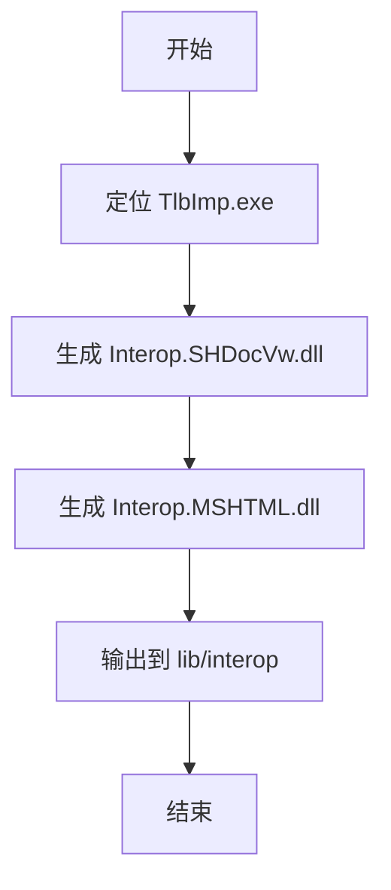

图表来源
- [Tools/GenerateInterop.ps1](file://Tools/GenerateInterop.ps1)

章节来源
- [Tools/GenerateInterop.ps1](file://Tools/GenerateInterop.ps1)
- [CONTRIBUTING.md](file://CONTRIBUTING.md)

### 测试工程与用例
- 测试工程基于 NUnit 3.x，目标 net48，引用主库，运行于 x86 平台。
- 包含冒烟测试与安全回归测试，验证序列化白名单与反序列化安全。
- **新增** 契约测试使用 IL 检查技术验证代码重构时的结构完整性。
- **新增** facade等价性测试验证Task 3.3代码提取重构的正确性，特别增强了中文编码处理和正则表达式匹配。
- **新增** TabManager重构测试使用FormatterServices.GetUninitializedObject创建最小实例，避免COM依赖。
- **新增** 会话状态竞态条件测试验证 TextResourcesDic 发布链语义、NoCapturePathsList 全引用替换模式和 WindowAlpha 并发读写安全性。
- **新增** 线程安全测试验证竞态条件修复和并发操作的正确性。
- **新增** 架构批次测试验证IDLWrapper的线程安全增强，确保ConcurrentDictionary使用的正确性。
- **新增** 架构批次测试增强验证HookInputController嵌套类、SelectionTracker重构和RegistryAccess统一化。
- **新增** BindActionController架构批次测试验证绑定动作控制器的嵌套类重构和委托机制。
- **新增** ShellCommandController架构批次测试验证命令处理控制器的嵌套类重构和委托机制。
- **新增** ListViewInputController架构批次测试验证列表视图输入处理控制器的嵌套类重构和委托机制。
- **新增** MenuController架构批次测试验证菜单初始化控制器的嵌套类重构和委托机制。
- **新增** ExplorerControllerModule架构批次测试验证窗口引导控制器的嵌套类重构和委托机制。
- **新增** Tab操作去重测试验证重复标签页打开的防重逻辑和配置行为。
- **新增** Facade清理验证测试确保QTUtility中的路径验证方法被正确移除。
- **新增** 按需资源读取模式测试验证QTResourceManager的直接调用模式。
- **新增** QTUtility2清理验证测试验证死代码清理和方法迁移到专用类。
- **新增** QTUtility方法迁移验证测试验证方法迁移到ValidationHelper、AssemblyInfoHelper、IconManager等专用类。
- **新增** TabBarBase窗口消息处理重构测试验证SYSCOLORCHANGE处理重构。
- **新增** TabBarBase鼠标事件处理重构测试验证鼠标处理器重构。
- **新增** 第二视图栏钩子清理测试验证Dead Hook Process清理和WindowSubclass使用。
- **新增** 架构审查修复测试验证配置 IPC 版本递增、主题同步、初始化重试语义和入口点收敛。
- **新增** 架构审查阶段3测试验证幂等性保证、ThemeRefreshService使用和配置持久化。
- **新增** 架构审查阶段4测试验证窗口初始化、死窗口句柄清理和选择标签方法使用。
- **新增** 安装程序互操作性测试验证Explorer重启安全性、GAC部署安全性和单实例升级行为。
- **新增** 特定回归测试验证标签文本布局和字段阴影问题的修复。

```mermaid
classDiagram
class SmokeTests {
+Project_CompilesAndRuns()
+QTTabBarLib_Namespace_IsAccessible()
}
class SecurityTests {
+PreMergeToMergedDeserializationBinder_Exists_And_IsSerializationBinder()
+ByteArrayToObject_Roundtrips_SerializeDelegate_Successfully()
+BindToType_ReturnsNull_ForDangerousNonWhitelistedType()
+DeepClone_Config_Roundtrips_Successfully()
}
class MenuControllerExtractionTests {
+IL_Inspection_Technique()
+Structure_Integrity_Verification()
+Refactoring_Protection()
}
class FacadeEquivalenceTests {
+IsShortDateStr_Facade_Equals_Extraction_MondaySample()
+IsShortDateStr_Facade_Equals_Extraction_SundaySample()
+IsNetworkRootFolder_Facade_Equals_Extraction_ServerShare()
+GetImageKey_Facade_Equals_Extraction_ExePath()
+ValidateTextResources_Ref_Facade_Equals_Extraction()
+ImageGlobalContainsKey_UnknownKey_ReturnsFalse()
}
class TabManagerTests {
+FormatterServices_GetUninitializedObject()
+CreateTabManagerWithFakeOwner()
+TabIndex_Behavior_Equivalence()
+Nested_Type_Structure_Guards()
}
class SessionStateRaceTests {
+NoCapturePathsList_TrueSourceField_IsVolatile()
+WindowAlpha_TrueSourceField_StaysNonVolatile_ForOutParameter()
+TextResourcesDic_TrueSourceField_IsVolatile()
+TextResourcesDic_PublishChain_PublishesCompleteDictionary()
+NoCapturePathsList_WholeReferenceReplacement_IsConcurrencySafe()
+WindowAlpha_ConcurrentReadWrite_NeverTearsAndRoundTrips()
}
class ThreadSafetyTests {
+Selection_Tracking_Thread_Safety()
+ImageListGlobal_Concurrent_Access_Test()
+Reentrancy_Guard_Verification()
}
class ArchitectureBatch2W7Tests {
+IDLCache_Field_Is_ConcurrentDictionary()
+IDLCache_ConcurrentReadWrite_NoCrash()
}
class ArchitectureBatch3C6bTests {
+HookInputController_Nested_Type_Exists()
+Callbacks_Delegate_To_HookInputController()
+HandleCLOSE_Remains_As_Facade()
}
class ArchitectureBatch3W1Tests {
+InstanceManager_No_SelectionTracker_Facades()
+QTTabBarClass_Uses_SelectionTracker_Directly()
}
class ArchitectureBatch4Tests {
+RegistryAccess_Type_Exists_With_RootHelpers()
+InitializationOrchestrator_Initialize_Is_Idempotent()
+ConfigManager_Initialize_Only_From_Orchestrator()
}
class ArchitectureBatch3C6gTests {
+BindActionController_Type_Exists_With_DoBindAction()
+QTTabBarClass_Delegates_DoBindAction_To_Controller()
}
class ArchitectureBatch3C6hTests {
+ShellCommandController_Type_Exists_With_CreateNewFile()
+QTTabBarClass_Delegates_ShellCommands_To_Controller()
+createNewFile_Method_Migrated_To_Controller()
}
class ArchitectureBatch3C6iTests {
+ListViewInputController_Type_Exists_With_HandlerMethods()
+QTTabBarClass_Delegates_ListViewHandlers_To_Controller()
+ListView_SelectionChanged_Body_Migrated()
}
class ArchitectureBatch3C6jTests {
+MenuController_Owns_MenuInitialization_Methods()
+OpeningHandlers_Call_Local_Initializers()
+MenuInitialization_Bodies_Migrated()
}
class ArchitectureBatch3C6kTests {
+ExplorerControllerModule_Owns_WindowBootstrap_Methods()
+ExplorerController_Calls_Local_InitializeOpenedWindow()
+WindowBootstrap_Bodies_Migrated()
}
class ArchitectureBatch3C6lTests {
+ListViewInputController_Owns_HandleItemActivate()
+ExplorerControllerModule_Owns_TravelToolbarMessageHandler()
+ItemActivation_And_TravelToolbar_Bodies_Migrated()
}
class ArchitectureBatch3C7iTests {
+QTUtility2_Has_No_Dead_Log_Methods()
+QTUtility2_Has_No_Registry_Value_Safe_Methods()
+SerializationHelper_Exposes_DeepClone()
+Production_Code_Does_Not_Call_QTUtility2_DeepClone()
+RegistryHelper_Exposes_GetValueSafe()
+Production_Code_Does_Not_Call_QTUtility2_Registry_Value_Safe()
+IconManager_Exposes_ReserveImageKey()
+QTUtility_Has_No_ReserveImageKey()
+QMenuItem_Uses_IconManager_ReserveImageKey()
}
class ArchitectureBatch3C7jTests {
+QTUtility_Has_No_C7j_Migrated_Methods()
+ValidationHelper_Exposes_ValidateMinMax()
+AssemblyInfoHelper_Exposes_GetLinkerTimestamp()
+IconManager_Exposes_ExtIsCompressed()
+Production_Code_Does_Not_Call_QTUtility_C7j_Methods()
+Config_Uses_ValidationHelper_For_Clamp()
}
class ArchitectureBatch3W3gTests {
+TabBarBase_WindowMessages_Partial_Exists()
+TabBarBase_Exposes_Shared_Hook_Message_Handlers()
+HookInputController_Delegates_SysColorChange_To_TabBarBase()
+SecondViewBar_Has_No_Duplicate_SysColorChange_Hook_Logic()
}
class ArchitectureBatch3W3hTests {
+TabBarBase_MouseHandlers_Partial_Exists()
+TabBarBase_Owns_Tab_Mouse_Handlers()
+TabManager_No_Longer_Hosts_Tab_Mouse_Handlers()
+ComponentBuildController_Wires_Mouse_Events_To_TabBarBase()
}
class ArchitectureBatch3W3jTests {
+SecondViewBar_Has_No_Dead_Hook_Procs()
+SecondViewBar_Still_Uses_WindowSubclass_Hooks()
+SecondViewBar_SubclassProc_Handles_SysColorChange()
}
class ArchitectureReviewRemediationTests {
+UpdateConfig_Broadcast_Increments_Version_Before_Encoding()
+UpdateConfig_Applies_System_Theme_Before_Side_Effects()
+ThemeRefreshService_Exposes_ApplyLoadedSkinFromSystemTheme()
+InitializationOrchestrator_Sets_Initialized_Only_After_Successful_Sequence()
+InitializationOrchestrator_Does_Not_Set_Initialized_Before_Try()
+HookInputController_EnableApiHook_Does_Not_Reinitialize_HookLib()
+QTButtonBar_OnExplorerAttached_Uses_ThemeRefreshService()
+QTUtility_getNightMode_Opens_Personalize_Key_ReadOnly()
+RefreshShellStateValues_Uses_RefreshNightMode()
+InitializationOrchestrator_Assigns_TextResourcesDic_Under_SyncRoot()
+InstanceManager_ByteToDel_Uses_IpcDelegateGuard()
}
class ArchitectureReviewPhase3Tests {
+ExplorerController_InitializeOpenedWindow_Is_Idempotent()
+HookInputController_Install_Is_Idempotent()
+ThemeRefreshService_Exists_And_Centralizes_ApplySystemTheme()
+GetTotalInstanceCount_Uses_Local_Registry_As_Floor()
+ConfigManager_Has_PersistPartialWindowSetting()
+TabSwitcher_And_HookWheel_Use_SelectTab()
}
class ArchitectureReviewPhase4Tests {
+SecondViewBar_InitializeOpenedWindow_Is_Idempotent()
+TabBarBase_Owns_fOpenedWindowInitialized()
+CancelFailedTabChanging_Uses_SelectTab_Not_SelectedIndex()
+InstanceManager_GetTotalInstanceCount_Prunes_Dead_Window_Handles()
+QTabControl_Relocate_Uses_SelectTab()
+DoFirstNavigation_Uses_Single_InitializeOpenedWindow_Exit()
+ThemeRefreshService_Has_ApplyPreviewTheme()
}
class QTTtabBarTests_csproj {
+TargetFramework : net48
+PlatformTarget : x86
+References : NUnit, TestAdapter, Test.Sdk
}
QTTtabBarTests_csproj --> SmokeTests : "包含"
QTTtabBarTests_csproj --> SecurityTests : "包含"
QTTtabBarTests_csproj --> MenuControllerExtractionTests : "包含"
QTTtabBarTests_csproj --> FacadeEquivalenceTests : "包含"
QTTtabBarTests_csproj --> TabManagerTests : "包含"
QTTtabBarTests_csproj --> SessionStateRaceTests : "包含"
QTTtabBarTests_csproj --> ThreadSafetyTests : "包含"
QTTtabBarTests_csproj --> ArchitectureBatch2W7Tests : "包含"
QTTtabBarTests_csproj --> ArchitectureBatch3C6bTests : "包含"
QTTtabBarTests_csproj --> ArchitectureBatch3W1Tests : "包含"
QTTtabBarTests_csproj --> ArchitectureBatch4Tests : "包含"
QTTtabBarTests_csproj --> ArchitectureBatch3C6gTests : "包含"
QTTtabBarTests_csproj --> ArchitectureBatch3C6hTests : "包含"
QTTtabBarTests_csproj --> ArchitectureBatch3C6iTests : "包含"
QTTtabBarTests_csproj --> ArchitectureBatch3C6jTests : "包含"
QTTtabBarTests_csproj --> ArchitectureBatch3C6kTests : "包含"
QTTtabBarTests_csproj --> ArchitectureBatch3C6lTests : "包含"
QTTtabBarTests_csproj --> ArchitectureBatch3C7iTests : "包含"
QTTtabBarTests_csproj --> ArchitectureBatch3C7jTests : "包含"
QTTtabBarTests_csproj --> ArchitectureBatch3W3gTests : "包含"
QTTtabBarTests_csproj --> ArchitectureBatch3W3hTests : "包含"
QTTtabBarTests_csproj --> ArchitectureBatch3W3jTests : "包含"
QTTtabBarTests_csproj --> ArchitectureReviewRemediationTests : "包含"
QTTtabBarTests_csproj --> ArchitectureReviewPhase3Tests : "包含"
QTTtabBarTests_csproj --> ArchitectureReviewPhase4Tests : "包含"
```

图表来源
- [Tests\QTTtabBarTests\QTTtabBarTests.csproj](file://Tests\QTTtabBarTests\QTTtabBarTests.csproj)
- [Tests\QTTtabBarTests\SmokeTests.cs](file://Tests\QTTtabBarTests\SmokeTests.cs)
- [Tests\QTTtabBarTests\SecurityTests.cs](file://Tests\QTTtabBarTests\SecurityTests.cs)
- [Tests\QTTtabBarTests\MenuControllerExtractionTests.cs](file://Tests\QTTtabBarTests\MenuControllerExtractionTests.cs)
- [Tests\QTTtabBarTests\FacadeEquivalenceTests.cs](file://Tests\QTTtabBarTests\FacadeEquivalenceTests.cs)
- [Tests\QTTtabBarTests\TabManagerTests.cs](file://Tests\QTTtabBarTests\TabManagerTests.cs)
- [Tests\QTTtabBarTests\SessionStateRaceTests.cs](file://Tests\QTTtabBarTests\SessionStateRaceTests.cs)
- [Tests\QTTtabBarTests\ThreadSafetyTests.cs](file://Tests\QTTtabBarTests\ThreadSafetyTests.cs)
- [Tests\QTTtabBarTests\ArchitectureBatch2W7Tests.cs](file://Tests\QTTtabBarTests\ArchitectureBatch2W7Tests.cs)
- [Tests\QTTtabBarTests\ArchitectureBatch3C6bTests.cs](file://Tests\QTTtabBarTests\ArchitectureBatch3C6bTests.cs)
- [Tests\QTTtabBarTests\ArchitectureBatch3W1Tests.cs](file://Tests\QTTtabBarTests\ArchitectureBatch3W1Tests.cs)
- [Tests\QTTtabBarTests\ArchitectureBatch4Tests.cs](file://Tests\QTTtabBarTests\ArchitectureBatch4Tests.cs)
- [Tests\QTTtabBarTests\ArchitectureBatch3C6gTests.cs](file://Tests\QTTtabBarTests\ArchitectureBatch3C6gTests.cs)
- [Tests\QTTtabBarTests\ArchitectureBatch3C6hTests.cs](file://Tests\QTTtabBarTests\ArchitectureBatch3C6hTests.cs)
- [Tests\QTTtabBarTests\ArchitectureBatch3C6iTests.cs](file://Tests\QTTtabBarTests\ArchitectureBatch3C6iTests.cs)
- [Tests\QTTtabBarTests\ArchitectureBatch3C6jTests.cs](file://Tests\QTTtabBarTests\ArchitectureBatch3C6jTests.cs)
- [Tests\QTTtabBarTests\ArchitectureBatch3C6kTests.cs](file://Tests\QTTtabBarTests\ArchitectureBatch3C6kTests.cs)
- [Tests\QTTtabBarTests\ArchitectureBatch3C6lTests.cs](file://Tests\QTTtabBarTests\ArchitectureBatch3C6lTests.cs)
- [Tests\QTTtabBarTests\ArchitectureBatch3C7iTests.cs](file://Tests\QTTtabBarTests\ArchitectureBatch3C7iTests.cs)
- [Tests\QTTtabBarTests\ArchitectureBatch3C7jTests.cs](file://Tests\QTTtabBarTests\ArchitectureBatch3C7jTests.cs)
- [Tests\QTTtabBarTests\ArchitectureBatch3W3gTests.cs](file://Tests\QTTtabBarTests\ArchitectureBatch3W3gTests.cs)
- [Tests\QTTtabBarTests\ArchitectureBatch3W3hTests.cs](file://Tests\QTTtabBarTests\ArchitectureBatch3W3hTests.cs)
- [Tests\QTTtabBarTests\ArchitectureBatch3W3jTests.cs](file://Tests\QTTtabBarTests\ArchitectureBatch3W3jTests.cs)
- [Tests\QTTtabBarTests\ArchitectureReviewRemediationTests.cs](file://Tests\QTTtabBarTests\ArchitectureReviewRemediationTests.cs)
- [Tests\QTTtabBarTests\ArchitectureReviewPhase3Tests.cs](file://Tests\QTTtabBarTests\ArchitectureReviewPhase3Tests.cs)
- [Tests\QTTtabBarTests\ArchitectureReviewPhase4Tests.cs](file://Tests\QTTtabBarTests\ArchitectureReviewPhase4Tests.cs)

章节来源
- [Tests\QTTtabBarTests\QTTtabBarTests.csproj](file://Tests\QTTtabBarTests\QTTtabBarTests.csproj)
- [Tests\QTTtabBarTests\SmokeTests.cs](file://Tests\QTTtabBarTests\SmokeTests.cs)
- [Tests\QTTtabBarTests\SecurityTests.cs](file://Tests\QTTtabBarTests\SecurityTests.cs)

## 依赖关系分析
- 主库依赖 BandObjectLib 与 QTPluginLib；安装程序依赖主库、插件接口与 Register 项目；测试工程依赖主库。
- 原生库（MinHook、QTHookLib、InstallerHelper）由 C++ 工程构建，供主库与安装程序使用。
- **新增** 契约测试依赖主库的反射和 IL 检查能力。
- **新增** facade等价性测试依赖主库的facade方法和被提取类的行为一致性，特别增强了中文编码处理。
- **新增** TabManager重构测试依赖主库的反射和FormatterServices技术。
- **新增** 会话状态竞态条件测试依赖主库的并发原语和同步机制。
- **新增** 线程安全测试依赖主库的并发原语和同步机制。
- **新增** 架构批次测试依赖主库的线程安全增强，特别是IDLWrapper的ConcurrentDictionary使用。
- **新增** 架构批次测试增强依赖主库的HookInputController、SelectionTracker和RegistryAccess重构。
- **新增** BindActionController架构批次测试依赖主库的绑定动作控制器重构。
- **新增** ShellCommandController架构批次测试依赖主库的命令处理控制器重构。
- **新增** ListViewInputController架构批次测试依赖主库的列表视图输入处理控制器重构。
- **新增** MenuController架构批次测试依赖主库的菜单初始化控制器重构。
- **新增** ExplorerControllerModule架构批次测试依赖主库的窗口引导控制器重构。
- **新增** Tab操作去重测试依赖主库的标签页去重逻辑。
- **新增** Facade清理验证测试依赖主库的方法移除和重构。
- **新增** 按需资源读取模式测试依赖主库的QTResourceManager直接调用。
- **新增** QTUtility2清理验证测试依赖主库的死代码清理和方法迁移。
- **新增** QTUtility方法迁移验证测试依赖主库的方法迁移到专用类。
- **新增** TabBarBase窗口消息处理重构测试依赖主库的窗口消息处理重构。
- **新增** TabBarBase鼠标事件处理重构测试依赖主库的鼠标事件处理重构。
- **新增** 第二视图栏钩子清理测试依赖主库的钩子清理和WindowSubclass使用。
- **新增** 架构审查修复测试依赖主库的配置管理、主题服务和初始化编排器。
- **新增** 架构审查阶段3测试依赖主库的幂等性实现和ThemeRefreshService。
- **新增** 架构审查阶段4测试依赖主库的窗口初始化、死句柄清理和选择标签方法。
- **新增** 安装程序互操作性测试依赖安装程序的WiX配置文件和自定义动作。
- **新增** 特定回归测试依赖主库的标签控件和文本渲染逻辑。

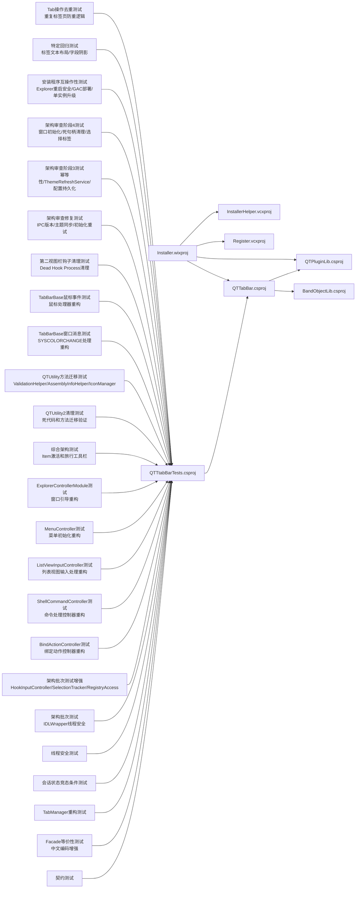

图表来源
- [QTTabBar Rebirth.sln](file://QTTabBar Rebirth.sln)
- [QTTabBar\QTTabBar.csproj](file://QTTabBar\QTTabBar.csproj)
- [Tests\QTTtabBarTests\ArchitectureReviewRemediationTests.cs](file://Tests\QTTtabBarTests\ArchitectureReviewRemediationTests.cs)

章节来源
- [QTTabBar Rebirth.sln](file://QTTabBar Rebirth.sln)
- [QTTabBar\QTTabBar.csproj](file://QTTabBar\QTTabBar.csproj)

## 性能与构建差异
- Debug 配置：关闭优化、禁用调试符号（部分配置），便于快速迭代。
- Release 配置：开启优化、保留 pdbonly 符号，适合发布与诊断。
- x86 平台：与 Explorer 进程一致，避免位宽不匹配导致的加载失败。
- No Plugins/No Reg：用于隔离问题与减少副作用。

章节来源
- [QTTabBar\QTTabBar.csproj](file://QTTabBar\QTTabBar.csproj)
- [BUILD.txt](file://BUILD.txt)

## 测试策略
- 单元测试：使用 NUnit 3.x，针对关键逻辑与安全边界编写用例。
- 冒烟测试：确保测试工程可编译运行且能访问主库命名空间。
- 安全回归：验证反序列化白名单、危险类型拒绝、深拷贝正确性。
- **新增** 契约测试：使用 IL 检查技术验证代码重构时的结构完整性。
- **新增** facade等价性测试：验证Task 3.3代码提取重构的正确性，确保facade转发方法与被提取类实现完全一致，特别增强了中文编码处理和正则表达式匹配。
- **新增** TabManager重构测试：使用FormatterServices.GetUninitializedObject创建最小实例，避免COM依赖，验证嵌套类提取重构的正确性。
- **新增** 会话状态竞态条件测试：验证 TextResourcesDic 发布链语义、NoCapturePathsList 全引用替换模式和 WindowAlpha 并发读写安全性。
- **新增** 线程安全测试：验证竞态条件修复和并发操作的正确性。
- **新增** 架构批次测试：验证IDLWrapper的线程安全增强，确保ConcurrentDictionary使用的正确性。
- **新增** 架构批次测试增强：验证HookInputController嵌套类、SelectionTracker重构和RegistryAccess统一化的架构改进。
- **新增** BindActionController架构批次测试：验证绑定动作控制器的嵌套类重构和委托机制。
- **新增** ShellCommandController架构批次测试：验证命令处理控制器的嵌套类重构和委托机制。
- **新增** ListViewInputController架构批次测试：验证列表视图输入处理控制器的嵌套类重构和委托机制。
- **新增** MenuController架构批次测试：验证菜单初始化控制器的嵌套类重构和委托机制。
- **新增** ExplorerControllerModule架构批次测试：验证窗口引导控制器的嵌套类重构和委托机制。
- **新增** Tab操作去重测试：验证重复标签页打开的防重逻辑和配置行为。
- **新增** Facade清理验证测试：确保QTUtility中的路径验证方法被正确移除。
- **新增** 按需资源读取模式测试：验证QTResourceManager的直接调用模式。
- **新增** QTUtility2清理验证测试：验证死代码清理和方法迁移到专用类的正确性。
- **新增** QTUtility方法迁移验证测试：验证方法迁移到ValidationHelper、AssemblyInfoHelper、IconManager等专用类的正确性。
- **新增** TabBarBase窗口消息处理重构测试：验证SYSCOLORCHANGE处理重构的正确性。
- **新增** TabBarBase鼠标事件处理重构测试：验证鼠标处理器重构的正确性。
- **新增** 第二视图栏钩子清理测试：验证Dead Hook Process清理和WindowSubclass使用的正确性。
- **新增** 架构审查修复测试：验证配置 IPC 版本递增、主题同步、初始化重试语义和入口点收敛的正确性。
- **新增** 架构审查阶段3测试：验证幂等性保证、ThemeRefreshService使用和配置持久化的正确性。
- **新增** 架构审查阶段4测试：验证窗口初始化、死窗口句柄清理和选择标签方法使用的正确性。
- **新增** 安装程序互操作性测试：验证Explorer重启安全性、GAC部署安全性和单实例升级行为。
- **新增** 特定回归测试：验证标签文本布局和字段阴影问题的修复。
- 本地运行：推荐先使用 MSBuild 构建测试工程，再执行 dotnet test。

**更新** 测试策略现在包括专门的契约测试层、facade等价性测试层、TabManager重构测试层、会话状态竞态条件测试层、线程安全测试层、架构批次测试层、架构批次测试增强层、BindActionController测试层、ShellCommandController测试层、ListViewInputController测试层、MenuController测试层、ExplorerControllerModule测试层、Tab操作去重测试层、Facade清理验证测试层、按需资源读取模式测试层、QTUtility2清理验证测试层、QTUtility方法迁移验证测试层、TabBarBase窗口消息处理重构测试层、TabBarBase鼠标事件处理重构测试层、第二视图栏钩子清理测试层、架构审查修复测试层、架构审查阶段3测试层、架构审查阶段4测试层、安装程序互操作性测试层和特定回归测试层，确保代码重构不会破坏现有功能，同时验证多线程环境下的数据一致性和行为契约。特别强调了使用FormatterServices.GetUninitializedObject技术进行复杂UI组件的无COM依赖测试，以及增强的中文本地化支持和正则表达式匹配准确性。新增的架构批次测试确保了IDLWrapper线程安全增强的正确性，而架构批次测试增强则验证了更广泛的架构改进。新增的第三批次架构重构测试套件和架构审查修复测试套件为复杂的架构重构提供了全面的验证保障，并维持 687/687 绿色测试基线。

章节来源
- [CONTRIBUTING.md](file://CONTRIBUTING.md)
- [Tests\QTTtabBarTests\QTTtabBarTests.csproj](file://Tests\QTTtabBarTests\QTTtabBarTests.csproj)
- [Tests\QTTtabBarTests\SmokeTests.cs](file://Tests\QTTtabBarTests\SmokeTests.cs)
- [Tests\QTTtabBarTests\SecurityTests.cs](file://Tests\QTTtabBarTests\SecurityTests.cs)

## 契约测试与重构保护

### IL 检查技术概述
契约测试使用 IL（中间语言）检查技术来验证代码重构过程中的结构完整性。这种方法允许在不实际运行代码的情况下，通过分析编译后的 IL 字节码来确保关键的结构契约保持不变。

### MenuController 重构保护测试
MenuControllerExtractionTests.cs 包含 367 行专门针对 MenuController 重构的契约测试，主要验证：

1. **嵌套类型存在性**：验证 MenuController 内部类存在于 QTTabBarClass 中
2. **访问修饰符**：确保 MenuController 保持 internal 可见性
3. **所有者引用**：验证 MenuController 持有对 QTTabBarClass 实例的引用
4. **方法迁移**：确认菜单处理方法已从 QTTabBarClass 移动到 MenuController
5. **事件绑定**：通过 IL 检查确保事件处理器正确绑定到 MenuController 实例

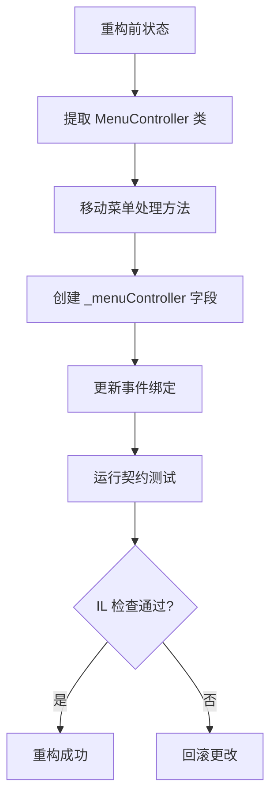

图表来源
- [Tests\QTTtabBarTests\MenuControllerExtractionTests.cs](file://Tests\QTTtabBarTests\MenuControllerExtractionTests.cs)

### IL 检查实现细节
契约测试实现了自定义的 IL 扫描器，能够：

1. **解析 IL 字节码**：遍历方法的 IL 指令流
2. **识别元数据引用**：捕获方法调用、字段访问等元数据引用
3. **验证结构契约**：确保关键的方法调用链和字段访问模式保持不变
4. **防御性处理**：对未知操作码进行安全处理，避免测试崩溃

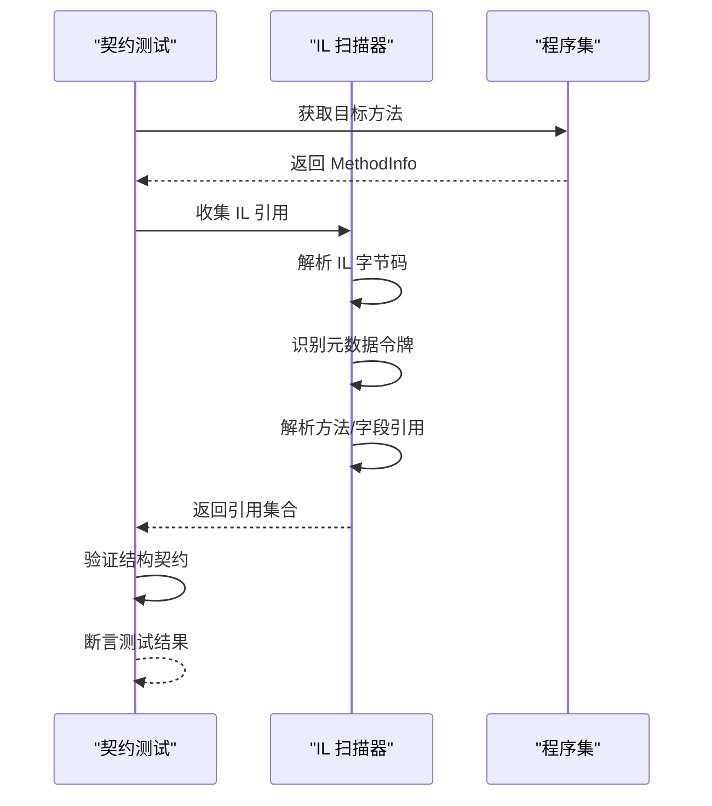

图表来源
- [Tests\QTTtabBarTests\MenuControllerExtractionTests.cs](file://Tests\QTTtabBarTests\MenuControllerExtractionTests.cs)

### 其他重构保护测试
除了 MenuController 重构外，项目还包含其他契约测试：

- **InstanceManagerExtractionTests**：验证实例管理器模块提取
- **ResourceCacheExtractionTests**：验证资源缓存容器提取
- **SessionStateExtractionTests**：验证会话状态容器提取  
- **UtilityExtractionTests**：验证工具类模块提取
- **QTTabBarClassCharacterizationTests**：验证 QTTabBarClass 行为特征

这些测试共同构成了完整的重构保护体系，确保任何代码重构都不会破坏现有功能。

**章节来源**
- [Tests\QTTtabBarTests\MenuControllerExtractionTests.cs](file://Tests\QTTtabBarTests\MenuControllerExtractionTests.cs)
- [Tests\QTTtabBarTests\InstanceManagerExtractionTests.cs](file://Tests\QTTtabBarTests\InstanceManagerExtractionTests.cs)
- [Tests\QTTtabBarTests\ResourceCacheExtractionTests.cs](file://Tests\QTTtabBarTests\ResourceCacheExtractionTests.cs)
- [Tests\QTTtabBarTests\SessionStateExtractionTests.cs](file://Tests\QTTtabBarTests\SessionStateExtractionTests.cs)
- [Tests\QTTtabBarTests\UtilityExtractionTests.cs](file://Tests\QTTtabBarTests\UtilityExtractionTests.cs)
- [Tests\QTTtabBarTests\QTTabBarClassCharacterizationTests.cs](file://Tests\QTTtabBarTests\QTTabBarClassCharacterizationTests.cs)

## Facade等价性测试

### Facade等价性测试架构
FacadeEquivalenceTests.cs 包含 221 行专业的 NUnit 测试用例，设计用于验证 Task 3.3 代码提取重构的正确性。该测试套件重点关注三个关键的提取类，确保 QTUtility facade 方法与被提取类实现完全等价：

#### PathValidator 行为等价性验证
- **IsShortDateStr 正则表达式兼容性**：验证中文星期字符的编码处理，包括历史 U+FFFD 字符问题的等价性，现已使用正确的Unicode转义序列（\u5468\u4E00 和 \u5468\u65E5）
- **IsNetworkRootFolder 网络路径判断**：验证网络根文件夹识别逻辑的一致性，包括 \\server\share 格式处理
- **空字符串和边界情况处理**：确保 null 和空字符串输入的处理行为完全一致

#### IconManager 图标管理行为验证
- **GetImageKey 图标键生成**：验证不同路径类型（exe路径、系统目录、网络路径）的图标键生成逻辑
- **GDI 资源管理**：确保全局 ImageList 操作的线程安全性和资源管理正确性
- **图像缓存一致性**：验证 AddImageToGlobal、ImageGlobalContainsKey、GetImageFromGlobal 等方法的行为等价性

#### QTResourceManager 文本资源管理验证
- **ValidateTextResources 字典填充**：验证内置资源文件的读取和合并逻辑
- **多语言支持**：确保不同语言配置的文本资源加载一致性
- **外部语言文件合并**：验证外部语言文件与内置资源的合并算法

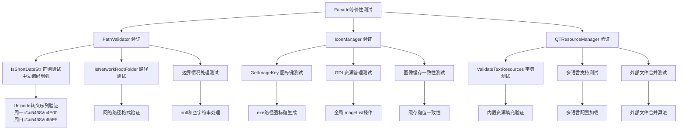

图表来源
- [Tests\QTTtabBarTests\FacadeEquivalenceTests.cs](file://Tests\QTTtabBarTests\FacadeEquivalenceTests.cs)
- [QTTabBar\PathValidator.cs](file://QTTabBar\PathValidator.cs)
- [QTTabBar\IconManager.cs](file://QTTabBar\IconManager.cs)
- [QTTabBar\QTResourceManager.cs](file://QTTabBar\QTResourceManager.cs)

### Facade转发机制实现
Task 3.3 重构采用了facade转发模式，将复杂逻辑从 QTUtility 类中提取到专门的类中，同时保持向后兼容：

#### PathValidator 提取
- **IsNetworkRootFolder**：从 QTUtility.IsNetworkRootFolder 转发到 PathValidator.IsNetworkRootFolder
- **IsShortDateStr**：从 QTUtility.IsShortDateStr 转发到 PathValidator.IsShortDateStr
- **IsSimpleDateStr**：从 QTUtility.IsSimpleDateStr 转发到 PathValidator.IsSimpleDateStr
- **其他路径验证方法**：IsEmptyStr、IsNetPath、IsNoCapturePaths 等

#### IconManager 提取
- **GetImageKey**：从 QTUtility.GetImageKey 转发到 IconManager.GetImageKey
- **GetIcon**：从 QTUtility.GetIcon 转发到 IconManager.GetIcon
- **LoadReservedImage**：从 QTUtility.LoadReservedImage 转发到 IconManager.LoadReservedImage

#### QTResourceManager 提取
- **ValidateTextResources**：从 QTUtility.ValidateTextResources 转发到 QTResourceManager.ValidateTextResources
- **ReadLanguageFile**：从 QTUtility.ReadLanguageFile 转发到 QTResourceManager.ReadLanguageFile

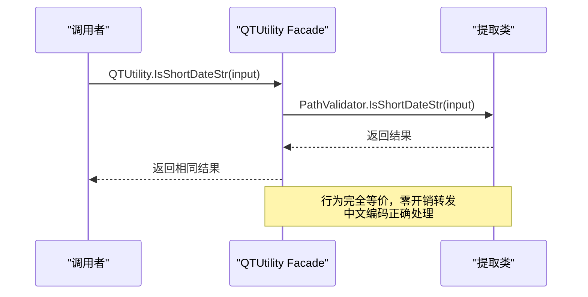

图表来源
- [QTTabBar\QTUtility.cs](file://QTTabBar\QTUtility.cs)
- [QTTabBar\PathValidator.cs](file://QTTabBar\PathValidator.cs)
- [QTTabBar\IconManager.cs](file://QTTabBar\IconManager.cs)
- [QTTabBar\QTResourceManager.cs](file://QTTabBar\QTResourceManager.cs)

### 历史编码问题验证与中文本地化增强
Facade等价性测试特别关注了历史编码问题的等价性处理和中文本地化增强：

#### 中文星期字符编码问题修复
- **Unicode转义序列**：测试用例使用 \u5468\u4E00（周一）和 \u5468\u65E5（周日）的Unicode转义序列
- **GBK源文件编码**：PathValidator.cs 中的正则表达式包含中文星期字符，原始文件使用 GBK 编码
- **UTF-16运行时字符**：编译后产生正确的 UTF-16 字符，确保跨平台兼容性
- **等价性保证**：确保 QTUtility facade 和 PathValidator 实现都返回相同的 true/false 结果

#### 正则表达式模式验证
- **模式格式**：`\d{1,2}/\d{1,2}/\d{1,2}\s周[一|二|三|四|五|六|日]\s\d{1,2}:\d{1,2}:\d{1,2}`
- **中文星期字符**：支持周一、周二、周三、周四、周五、周六、周日
- **时间格式**：支持 12:34:56 和 1:2:3 等不同时间格式
- **日期格式**：支持 6/12/24 和 12/1/24 等不同日期格式

#### 网络路径处理边界情况
- **C:\Windows 特殊处理**：IsNetworkRootFolder 对非网络路径的特殊处理逻辑
- **\\server 与 \\server\share 区别**：正确区分服务器名和网络共享路径
- **子路径深度判断**：确保只识别真正的网络根文件夹

**更新** Facade等价性测试套件为 Task 3.3 代码提取重构提供了强有力的保障，特别增强了中文本地化支持。通过修正测试用例中的中文星期字符处理，使用正确的Unicode转义序列替代损坏的替换字符，确保了正则表达式修复的正确性。所有提取类的行为与原 QTUtility 实现完全等价，特别是中文编码处理、网络路径判断和图标管理等关键功能的正确性得到了全面验证。

**章节来源**
- [Tests\QTTtabBarTests\FacadeEquivalenceTests.cs](file://Tests\QTTtabBarTests\FacadeEquivalenceTests.cs)
- [QTTabBar\PathValidator.cs](file://QTTabBar\PathValidator.cs)
- [QTTabBar\IconManager.cs](file://QTTabBar\IconManager.cs)
- [QTTabBar\QTResourceManager.cs](file://QTTabBar\QTResourceManager.cs)
- [QTTabBar\QTUtility.cs](file://QTTabBar\QTUtility.cs)

## TabManager重构测试

### FormatterServices.GetUninitializedObject测试技术
TabManagerTests.cs 展示了如何使用 System.Runtime.Serialization.FormatterServices.GetUninitializedObject 技术创建复杂UI组件的最小实例，避免COM依赖和Windows Forms句柄要求。这种技术对于测试高度耦合到Explorer/COM/Shell的UI组件至关重要。

#### 最小实例创建策略
- **绕过构造函数**：使用 GetUninitializedObject 跳过需要COM环境的构造函数
- **手动初始化字段**：通过反射设置必要的字段和属性
- **模拟依赖对象**：创建最小化的依赖对象（如QTabControl）
- **行为等价性验证**：比较facade方法和提取方法的返回值

#### TabIndex行为等价性测试
TabManager重构的核心是验证TabManager.TabIndex方法与QTTabBarClass.TabIndex facade方法的行为完全等价：

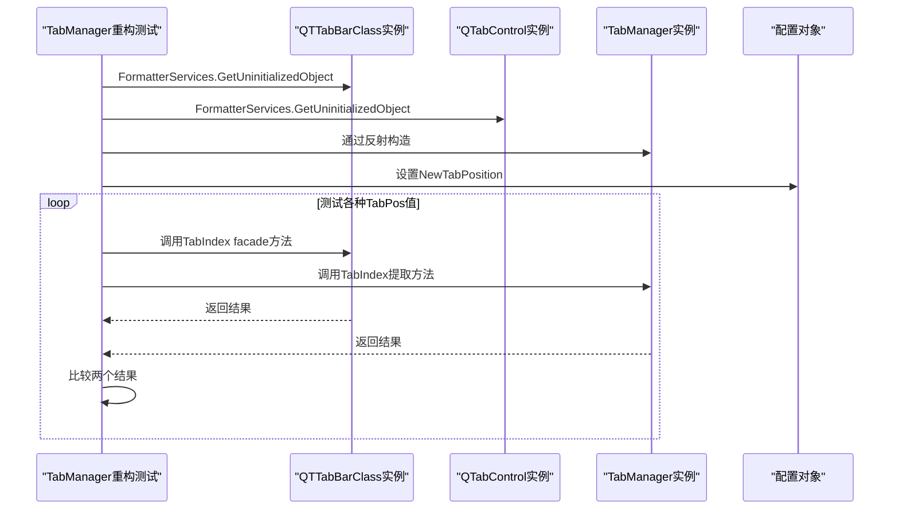

图表来源
- [Tests\QTTtabBarTests\TabManagerTests.cs](file://Tests\QTTtabBarTests\TabManagerTests.cs)

### TabManager嵌套类结构验证
TabManager重构测试首先验证嵌套类的结构契约：

#### 嵌套类型存在性验证
- **类型存在性**：确保 QTTabBarClass.TabManager 嵌套类存在
- **访问修饰符**：验证 TabManager 保持 internal 可见性
- **所有者引用**：确认 TabManager 持有 _owner 字段引用 QTTabBarClass

#### 方法迁移验证
测试验证了约59个方法从 QTTabBarClass 迁移到 TabManager 的完整性：
- **标签操作方法**：AddInsertTab、OpenNewTab、CloseTab、CloneTabButton 等
- **事件处理方法**：tabControl1_SelectedIndexChanged、tabControl1_MouseDown 等
- **辅助方法**：TabIndex、ReplaceByGroup、timerOnTab_Tick 等

#### 字段访问验证
确保 TabManager 能够正确访问 QTTabBarClass 的关键字段：
- **lstActivatedTabs**：激活的标签列表
- **NowTabCloned/NowTabCreated**：标签克隆/创建状态
- **DraggingTab/DraggingDestRect**：拖拽相关状态

### 实用设计决策
TabManager重构测试体现了复杂的UI组件测试的实用设计决策：

#### 避免COM依赖的策略
- **跳过脆弱测试**：AddInsertTab、OpenNewTab、CloseTab 等方法因严重依赖Explorer/COM/Shell而被有意跳过
- **聚焦纯计算逻辑**：专注于像 TabIndex 这样的纯计算方法，这些方法只依赖配置和控件状态
- **最小化测试范围**：只测试可确定性验证的逻辑，避免脆弱的false-green测试

#### 反射驱动测试架构
- **动态方法发现**：使用反射动态发现和验证方法的存在性
- **运行时行为验证**：通过反射调用方法并验证返回值
- **结构契约保护**：确保重构不会改变公共API和行为契约

**更新** TabManager重构测试套件为复杂UI组件的重构提供了强大的安全保障，特别是使用FormatterServices.GetUninitializedObject技术避免了COM依赖，确保了嵌套类提取重构的正确性和向后兼容性。

**章节来源**
- [Tests\QTTtabBarTests\TabManagerTests.cs](file://Tests\QTTtabBarTests\TabManagerTests.cs)

## 会话状态竞态条件测试

### 会话状态竞态条件测试架构
SessionStateRaceTests.cs 包含 247 行专业的 NUnit 测试用例，设计用于验证竞态条件修复和线程安全操作的行为契约。该测试套件重点关注三个关键的会话状态字段，确保它们在多线程环境下的正确行为：

#### NoCapturePathsList 字段验证
- **volatile 关键字验证**：确保 NoCapturePathsList 字段声明为 volatile，使无锁读取器能够观察到最新的完整引用替换
- **引用替换一致性**：验证通过 Facade 访问时，新引用的替换操作被所有读取线程立即观察到
- **快照一致性保证**：确保 .Any() 等无锁操作能够观察到一致的列表快照
- **全引用替换模式**：验证写入端始终替换整个引用而非就地修改，避免枚举器异常

#### WindowAlpha 字段特殊处理
- **非 volatile 字节字段**：验证 WindowAlpha 保持为非 volatile 字节类型，因为 InitializationOrchestrator 通过 out 参数传递它（C# 禁止对 volatile 字段使用 ref/out）
- **Volatile.Read/Write 封装**：通过 QTUtility.WindowAlpha Facade 使用 Volatile.Read/Volatile.Write 提供可见性保证
- **值往返测试**：验证 Facade 能够正确地进行值的读写往返操作
- **并发读写安全性**：验证在高并发场景下不会出现撕裂值（torn values）

#### TextResourcesDic 字典验证
- **volatile 字典引用**：确保 TextResourcesDic 字段声明为 volatile，防止 20+ 个无锁读取器观察到 null 或部分初始化的字典
- **原子引用替换**：验证在 UpdateConfig 重新赋值期间，完全验证的字典在锁内发布，不会被观察到不一致的状态
- **引用转发验证**：确保 QTUtility.TextResourcesDic Facade 能够转发当前的 volatile 引用
- **发布链语义验证**：验证 ValidateTextResources 的完整发布链确保字典的完整性

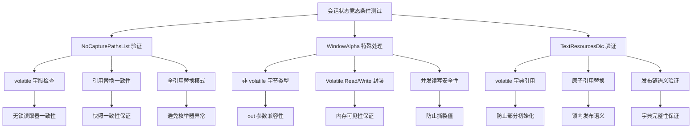

图表来源
- [Tests\QTTtabBarTests\SessionStateRaceTests.cs](file://Tests\QTTtabBarTests\SessionStateRaceTests.cs)
- [QTTabBar\SessionState.cs](file://QTTabBar\SessionState.cs)
- [QTTabBar\ResourceCache.cs](file://QTTabBar\ResourceCache.cs)

### 会话状态容器架构
会话状态和资源缓存采用了容器化架构，将原本直接声明在 QTUtility 上的静态字段迁移到专门的容器中：

#### SessionState 容器
- **ITEMIDLIST_Dic_Session**：会话级 ID 列表字典
- **NoCapturePathsList**：volatile 列表，用于路径捕获控制
- **WindowAlpha**：窗口透明度设置，使用 Volatile.Read/Write 封装
- **SyncRoot**：复用 QTUtility.syncRoot 以保持全局锁语义不变

#### ResourceCache 容器
- **ImageListGlobal**：全局图标列表缓存
- **DisplayNameCacheDic**：显示名称缓存字典
- **TextResourcesDic**：volatile 文本资源字典
- **SyncRoot**：全局锁对象引用
- **ImageListLock**：专用的 ImageListGlobal 锁对象

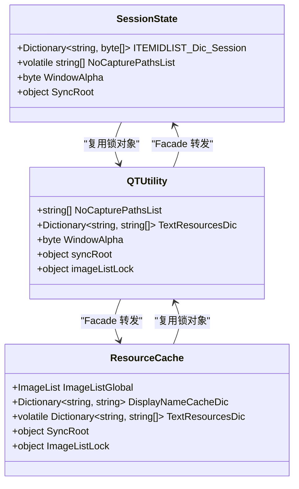

图表来源
- [QTTabBar\SessionState.cs](file://QTTabBar\SessionState.cs)
- [QTTabBar\ResourceCache.cs](file://QTTabBar\ResourceCache.cs)
- [QTTabBar\QTUtility.cs](file://QTTabBar\QTUtility.cs)

### TextResourcesDic 发布链语义验证
TextResourcesDic 的发布链遵循严格的原子发布语义，确保多线程环境下的数据一致性：

#### 发布流程
1. **本地构建**：ValidateTextResources(ref dict) 在局部变量上构建完整的字典
2. **锁内发布**：在 QTUtility.syncRoot 锁内完成引用替换
3. **无锁读取**：20+ 个读取器通过 Facade 观察已发布的完整字典

#### 并发安全性保证
- **volatile 语义**：确保引用替换的可见性
- **锁保护**：防止部分初始化的字典被观察到
- **原子操作**：整个字典引用作为单一原子单元进行替换

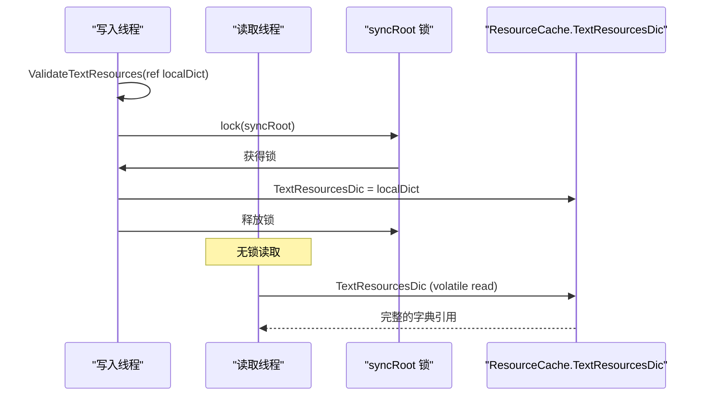

图表来源
- [QTTabBar\QTResourceManager.cs](file://QTTabBar\QTResourceManager.cs)
- [QTTabBar\Config.cs](file://QTTabBar\Config.cs)
- [Tests\QTTtabBarTests\SessionStateRaceTests.cs](file://Tests\QTTtabBarTests\SessionStateRaceTests.cs)

### 竞态条件修复验证策略
会话状态竞态条件测试采用多层次验证策略：

1. **结构契约验证**：通过反射检查字段声明和访问修饰符
2. **行为契约验证**：验证 Facade 方法的行为符合预期
3. **并发压力测试**：模拟真实的多线程访问场景
4. **内存模型验证**：确保 volatile 和 Volatile.Read/Write 的正确使用
5. **发布链语义验证**：确保字典发布的原子性和完整性

**更新** 会话状态竞态条件测试套件为项目的并发安全性提供了强有力的保障，确保竞态条件修复的有效性和长期稳定性，特别是 TextResourcesDic 的发布链语义、NoCapturePathsList 的全引用替换模式和 WindowAlpha 的并发读写安全性都得到了全面验证。

**章节来源**
- [Tests\QTTtabBarTests\SessionStateRaceTests.cs](file://Tests\QTTtabBarTests\SessionStateRaceTests.cs)
- [QTTabBar\SessionState.cs](file://QTTabBar\SessionState.cs)
- [QTTabBar\ResourceCache.cs](file://QTTabBar\ResourceCache.cs)
- [QTTabBar\QTResourceManager.cs](file://QTTabBar\QTResourceManager.cs)
- [QTTabBar\Config.cs](file://QTTabBar\Config.cs)

## 线程安全与并发验证

### 线程安全测试架构
ThreadSafetyTests.cs 提供了全面的线程安全验证，涵盖多个关键场景：

#### 选择跟踪重入保护
- **GetSelect 重入检测**：验证当检测到重入时返回 null
- **PutSelect 跳过机制**：验证重入时跳过存储操作
- **RemoveSelect 跳过机制**：验证重入时跳过删除操作

#### 静态集合同步验证
- **syncRoot 字段存在性**：验证 QTUtility 具有用于线程安全集合访问的 syncRoot 字段
- **同步根对象有效性**：确保 syncRoot 不为 null

#### ImageListGlobal 并发图标缓存测试
- **高并发压力测试**：使用 64 个并发线程进行图标缓存访问
- **多轮循环稳定性**：执行 8 轮循环，每轮 60 次迭代
- **有界键空间**：限制 key 空间大小以避免 GDI 句柄耗尽
- **异常收集与报告**：收集所有线程异常并进行断言验证

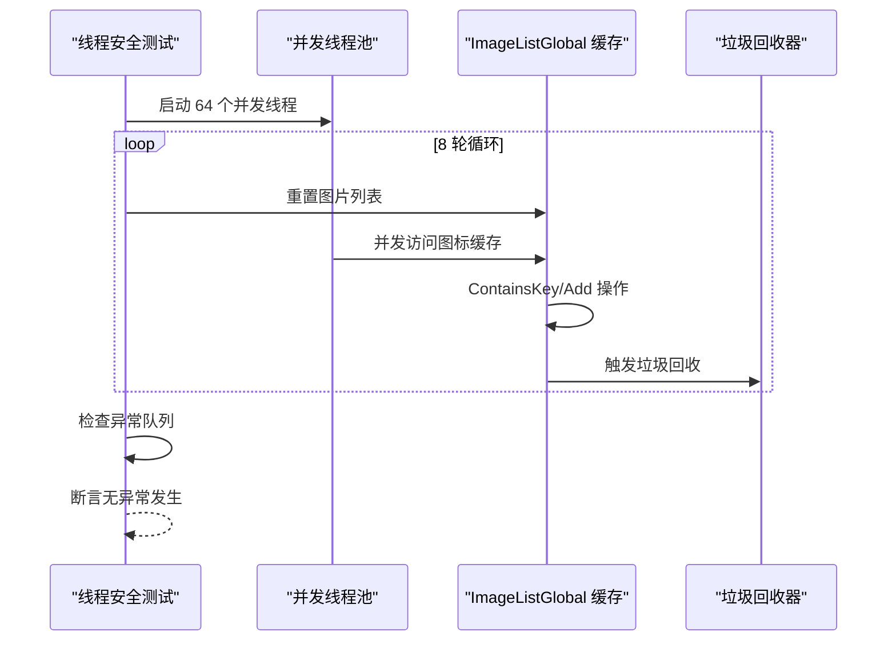

图表来源
- [Tests\QTTtabBarTests\ThreadSafetyTests.cs](file://Tests\QTTtabBarTests\ThreadSafetyTests.cs)

### 竞态条件修复验证策略
线程安全测试采用多层次验证策略：

1. **结构契约验证**：通过反射检查字段声明和访问修饰符
2. **行为契约验证**：验证 Facade 方法的行为符合预期
3. **并发压力测试**：模拟真实的多线程访问场景
4. **内存模型验证**：确保 volatile 和 Volatile.Read/Write 的正确使用

**更新** 线程安全测试套件为项目的并发安全性提供了强有力的保障，确保竞态条件修复的有效性和长期稳定性。

**章节来源**
- [Tests\QTTtabBarTests\ThreadSafetyTests.cs](file://Tests\QTTtabBarTests\ThreadSafetyTests.cs)
- [QTTabBar\SessionState.cs](file://QTTabBar\SessionState.cs)
- [QTTabBar\ResourceCache.cs](file://QTTabBar\ResourceCache.cs)
- [QTTabBar\QTUtility.cs](file://QTTabBar\QTUtility.cs)

## IDLCache线程安全增强

### ConcurrentDictionary线程安全升级
IDLWrapper 类中的 dicCacheIDLs 字段已从普通的 `Dictionary<string, byte[]>` 升级为 `ConcurrentDictionary<string, byte[]>`，显著提升了多线程环境下的缓存访问安全性。这一变更解决了潜在的竞态条件问题，特别是在后台线程触发导航操作时。

#### 线程安全字段声明
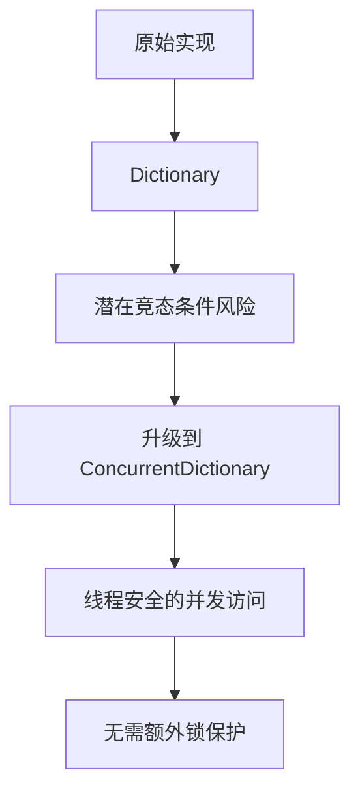

图表来源
- [QTTabBar\IDLWrapper.cs](file://QTTabBar\IDLWrapper.cs)

#### 并发读写操作验证
架构批次测试专门验证了 IDL 缓存的并发读写安全性：

1. **字段类型验证**：确保 dicCacheIDLs 字段确实是 ConcurrentDictionary 类型
2. **并发写入测试**：100个并发线程同时调用 AddCache 方法
3. **并发读取测试**：100个并发线程同时调用 TryGetCache 方法
4. **无崩溃保证**：验证在高并发场景下不会抛出异常

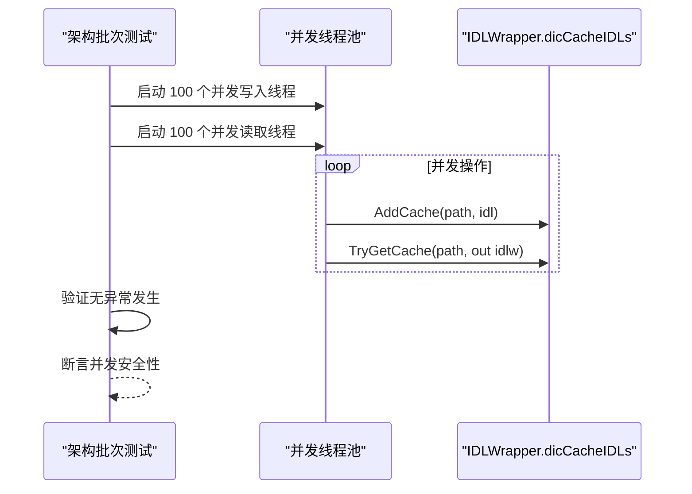

图表来源
- [Tests\QTTtabBarTests\ArchitectureBatch2W7Tests.cs](file://Tests\QTTtabBarTests\ArchitectureBatch2W7Tests.cs)
- [QTTabBar\IDLWrapper.cs](file://QTTabBar\IDLWrapper.cs)

### 性能影响分析
ConcurrentDictionary 的使用带来了以下性能特性：

- **读操作**：TryGetValue 方法提供高效的无锁读取
- **写操作**：索引器赋值和 TryRemove 方法提供线程安全的写入
- **内存开销**：相比普通 Dictionary 略有增加，但保证了线程安全
- **适用场景**：特别适合高频读写的缓存场景

### 架构审查背景
根据架构审查修复计划文档，这一变更是针对 W7 问题的修复方案：

- **问题描述**：static Dictionary 无锁保护，在后台线程触发导航时存在竞态风险
- **修复方案**：改用 ConcurrentDictionary<string, byte[]> 作为最小改动方案
- **验收标准**：多线程并发读写不崩溃，现有单线程行为不变，性能无可感知退化

**更新** IDLWrapper 的线程安全增强是项目架构改进的重要组成部分，通过引入 ConcurrentDictionary 消除了潜在的竞态条件，同时保持了向后兼容性。相关的架构批次测试确保了这一变更的正确性和稳定性。

**章节来源**
- [QTTabBar\IDLWrapper.cs](file://QTTabBar\IDLWrapper.cs)
- [Tests\QTTtabBarTests\ArchitectureBatch2W7Tests.cs](file://Tests\QTTtabBarTests\ArchitectureBatch2W7Tests.cs)
- [docs\architecture-review-fix-plan.md](file://docs\architecture-review-fix-plan.md)

## 架构批次测试增强

### HookInputController 嵌套类验证
ArchitectureBatch3C6bTests.cs 专门验证 HookInputController 嵌套类的架构改进，确保输入钩子处理的模块化重构：

#### 嵌套类型存在性验证
- **HookInputController 类型存在**：验证 QTTabBarClass.HookInputController 嵌套类正确存在
- **所有者引用验证**：确保 HookInputController 持有 _owner 字段引用 QTTabBarClass
- **访问修饰符检查**：验证嵌套类的访问级别符合设计要求

#### 回调委托验证
- **Hook 安装委托**：验证 InstallHooks 方法将钩子安装委托给 HookInputController
- **实例化验证**：确保 QTTabBarClass 在初始化时创建 HookInputController 实例
- **方法调用链**：验证 HandleCLOSE 方法保持在 QTTabBarClass 上作为 facade

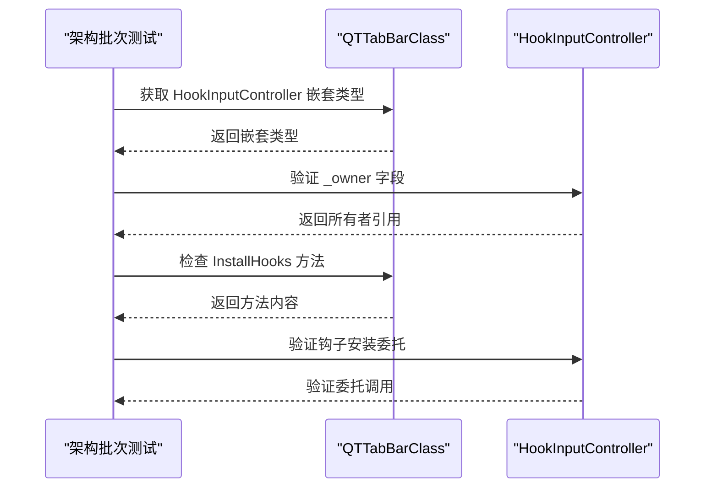

图表来源
- [Tests\QTTtabBarTests\ArchitectureBatch3C6bTests.cs](file://Tests\QTTtabBarTests\ArchitectureBatch3C6bTests.cs)

### SelectionTracker 重构验证
ArchitectureBatch3W1Tests.cs 验证 InstanceManager 不再暴露 SelectionTracker facades 的架构改进：

#### 公共 API 清理验证
- **Public 方法移除**：验证 InstanceManager 不再公开 PutSelect、RemoveSelect、GetSelect 方法
- **直接访问模式**：确保 QTTabBarClass 直接使用 SelectionTracker 而非通过 InstanceManager
- **重构完整性**：验证所有相关调用都已更新为直接访问模式

#### 调用路径验证
- **直接调用检查**：验证 QTTabBarClass 中使用 SelectionTracker.PutSelect 和 SelectionTracker.GetSelect
- **间接调用移除**：确保没有 InstanceManager.PutSelect 或 InstanceManager.GetSelect 的调用
- **重构一致性**：验证整个调用链的一致性

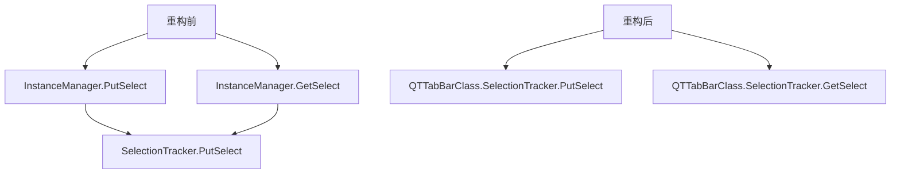

图表来源
- [Tests\QTTtabBarTests\ArchitectureBatch3W1Tests.cs](file://Tests\QTTtabBarTests\ArchitectureBatch3W1Tests.cs)

### RegistryAccess 统一化验证
ArchitectureBatch4Tests.cs 验证 RegistryAccess 统一注册表访问器的架构改进：

#### 统一访问器验证
- **RegistryAccess 类型存在**：验证统一的注册表访问器类型存在
- **Root 方法可用性**：确保 OpenRoot 和 OpenRootCreate 方法可用
- **静态方法访问**：验证静态方法的正确访问

#### 初始化编排器验证
- **幂等性验证**：确保 InitializationOrchestrator.Initialize 方法可以多次调用而不抛出异常
- **文档注释验证**：验证 QTUtility.Initialize 方法包含适当的文档注释
- **死代码清理**：确保 ExplorerProcessCaptor1 类型已被移除

#### 配置管理约束验证
- **集中式初始化**：验证 ConfigManager.Initialize 仅在 InitializationOrchestrator 中调用
- **区域组织**：验证 QTButtonBar 使用 #region 进行代码组织

```mermaid
sequenceDiagram
participant Test as "架构批次测试"
participant RegistryAccess as "RegistryAccess"
participant InitOrchestrator as "InitializationOrchestrator"
participant ConfigManager as "ConfigManager"
Test->>RegistryAccess : 验证类型和方法存在
RegistryAccess-->>Test : 返回类型信息
Test->>InitOrchestrator : 多次调用 Initialize
InitOrchestrator-->>Test : 幂等执行成功
Test->>ConfigManager : 检查调用位置
ConfigManager-->>Test : 验证仅在编排器中调用
```

图表来源
- [Tests\QTTtabBarTests\ArchitectureBatch4Tests.cs](file://Tests\QTTtabBarTests\ArchitectureBatch4Tests.cs)

### 架构改进意义
这些架构批次测试增强验证了项目的重大架构改进：

1. **模块化重构**：HookInputController 的嵌套类设计提高了代码的可维护性
2. **API 简化**：SelectionTracker 的直接访问减少了不必要的抽象层
3. **统一访问**：RegistryAccess 的统一化简化了注册表操作
4. **初始化安全**：幂等性保证提高了系统的健壮性
5. **代码质量**：区域组织和死代码清理提升了代码质量

**更新** 架构批次测试增强为项目的架构改进提供了全面的验证保障，确保 HookInputController 嵌套类、SelectionTracker 重构和 RegistryAccess 统一化等架构改进的正确性和稳定性。

**章节来源**
- [Tests\QTTtabBarTests\ArchitectureBatch3C6bTests.cs](file://Tests\QTTtabBarTests\ArchitectureBatch3C6bTests.cs)
- [Tests\QTTtabBarTests\ArchitectureBatch3W1Tests.cs](file://Tests\QTTtabBarTests\ArchitectureBatch3W1Tests.cs)
- [Tests\QTTtabBarTests\ArchitectureBatch4Tests.cs](file://Tests\QTTtabBarTests\ArchitectureBatch4Tests.cs)

## BindActionController架构批次测试

### 绑定动作控制器重构验证
ArchitectureBatch3C6gTests.cs 专门验证 BindActionController 嵌套类的架构改进，确保绑定动作处理的模块化重构：

#### 嵌套类型存在性验证
- **BindActionController 类型存在**：验证 QTTabBarClass.BindActionController 嵌套类正确存在
- **DoBindAction 方法可用性**：确保 DoBindAction 方法可通过反射访问
- **访问修饰符检查**：验证嵌套类的访问级别符合设计要求

#### 委托机制验证
- **字段存在性**：验证 QTTabBarClass 中存在 _bindActionController 字段
- **委托调用**：验证 QTTabBarClass 通过 _bindActionController.DoBindAction 调用控制器方法
- **控制器实现**：验证 BindActionController 类包含完整的 DoBindAction 实现

```mermaid
sequenceDiagram
participant Test as "架构批次测试"
participant QTTabBarClass as "QTTabBarClass"
participant BindActionController as "BindActionController"
Test->>QTTabBarClass : 获取 BindActionController 嵌套类型
QTTabBarClass-->>Test : 返回嵌套类型
Test->>BindActionController : 验证 DoBindAction 方法
BindActionController-->>Test : 返回方法信息
Test->>QTTabBarClass : 检查 _bindActionController 字段
QTTabBarClass-->>Test : 返回字段信息
Test->>QTTabBarClass : 验证委托调用
QTTabBarClass-->>Test : 验证 _bindActionController.DoBindAction 调用
```

图表来源
- [Tests\QTTtabBarTests\ArchitectureBatch3C6gTests.cs](file://Tests\QTTtabBarTests\ArchitectureBatch3C6gTests.cs)
- [QTTabBar\QTTabBarClass.BindActionController.cs](file://QTTabBar\QTTabBarClass.BindActionController.cs)

### 绑定动作处理架构
BindActionController 实现了完整的绑定动作处理逻辑，涵盖了导航、标签管理、文件操作等多种功能：

#### 导航动作处理
- **GoBack/GoForward**：后退和前进导航
- **GoFirst/GoLast**：跳转到第一个或最后一个标签
- **NextTab/PreviousTab**：切换到下一个或上一个标签
- **FirstTab/LastTab**：直接跳转到第一个或最后一个标签

#### 标签管理动作
- **CloseCurrent/CloseTab**：关闭当前或指定标签
- **CloseAllButCurrent**：关闭除当前外的所有标签
- **CloseLeft/CloseRight**：关闭左侧或右侧标签
- **CloneCurrent/CloneTab**：克隆当前标签
- **TearOffCurrent/TearOffTab**：将标签分离到新窗口

#### 文件操作动作
- **CopySelectedPaths/Names**：复制选中项的路径或名称
- **ChecksumSelected**：计算选中项的校验和
- **ItemCut/Copy/Delete**：剪切、复制、删除操作

```mermaid
flowchart TD
A["BindActionController"] --> B["导航动作"]
A --> C["标签管理动作"]
A --> D["文件操作动作"]
A --> E["界面控制动作"]
B --> F["GoBack/GoForward"]
B --> G["GoFirst/GoLast"]
B --> H["NextTab/PreviousTab"]
C --> I["CloseCurrent/CloseTab"]
C --> J["CloseAllButCurrent"]
C --> K["CloneCurrent/CloneTab"]
D --> L["CopySelectedPaths"]
D --> M["ChecksumSelected"]
E --> N["ShowOptions"]
E --> O["ToggleTopMost"]
E --> P["FocusFileList"]
```

图表来源
- [QTTabBar\QTTabBarClass.BindActionController.cs](file://QTTabBar\QTTabBarClass.BindActionController.cs)

### 架构改进意义
BindActionController 的重构为项目带来了以下改进：

1. **职责分离**：将绑定动作处理逻辑从 QTTabBarClass 中分离出来
2. **可维护性**：独立的控制器类更容易维护和测试
3. **可扩展性**：便于添加新的绑定动作类型
4. **代码组织**：减少了 QTTabBarClass 的复杂度
5. **委托模式**：通过委托机制实现了松耦合的设计

**更新** BindActionController 架构批次测试为绑定动作控制器的重构提供了全面的验证保障，确保嵌套类设计和委托机制的正确性和稳定性。

**章节来源**
- [Tests\QTTtabBarTests\ArchitectureBatch3C6gTests.cs](file://Tests\QTTtabBarTests\ArchitectureBatch3C6gTests.cs)
- [QTTabBar\QTTabBarClass.BindActionController.cs](file://QTTabBar\QTTabBarClass.BindActionController.cs)

## ShellCommandController架构批次测试

### 命令处理控制器重构验证
ArchitectureBatch3C6hTests.cs 专门验证 ShellCommandController 嵌套类的架构改进，确保命令处理逻辑的模块化重构：

#### 嵌套类型存在性验证
- **ShellCommandController 类型存在**：验证 QTTabBarClass.ShellCommandController 嵌套类正确存在
- **命令处理方法可用性**：确保 CreateNewFile、OpenCmd、Wait4Select 方法可通过反射访问
- **访问修饰符检查**：验证嵌套类的访问级别符合设计要求

#### 委托机制验证
- **字段存在性**：验证 QTTabBarClass 中存在 _shellCommandController 字段
- **委托调用**：验证 QTTabBarClass 通过 _shellCommandController.CreateNewFile/OpenCmd/Wait4Select 调用控制器方法
- **控制器实现**：验证 ShellCommandController 类包含完整的命令处理实现

#### 方法迁移验证
- **createNewFile 方法迁移**：验证 createNewFile 实现已从 QTTabBarClass.cs 主分部类移动到 ShellCommandController
- **OpenCmd 方法迁移**：验证 OpenCmd 方法逻辑已迁移到 ShellCommandController
- **Wait4Select 方法迁移**：验证 Wait4Select 方法逻辑已迁移到 ShellCommandController

```mermaid
sequenceDiagram
participant Test as "架构批次测试"
participant QTTabBarClass as "QTTabBarClass"
participant ShellCommandController as "ShellCommandController"
Test->>QTTabBarClass : 获取 ShellCommandController 嵌套类型
QTTabBarClass-->>Test : 返回嵌套类型
Test->>ShellCommandController : 验证 CreateNewFile/OpenCmd/Wait4Select 方法
ShellCommandController-->>Test : 返回方法信息
Test->>QTTabBarClass : 检查 _shellCommandController 字段
QTTabBarClass-->>Test : 返回字段信息
Test->>QTTabBarClass : 验证委托调用
QTTabBarClass-->>Test : 验证 _shellCommandController.CreateNewFile/OpenCmd/Wait4Select 调用
Test->>QTTabBarClass : 验证方法迁移
QTTabBarClass-->>Test : 验证 QTUtility.DefaultNewFileName() 不在主分部类中
Test->>ShellCommandController : 验证方法实现
ShellCommandController-->>Test : 验证 QTUtility.DefaultNewFileName() 在控制器中
```

图表来源
- [Tests\QTTtabBarTests\ArchitectureBatch3C6hTests.cs](file://Tests\QTTtabBarTests\ArchitectureBatch3C6hTests.cs)
- [QTTabBar\QTTabBarClass.ShellCommandController.cs](file://QTTabBar\QTTabBarClass.ShellCommandController.cs)

### 命令处理架构
ShellCommandController 实现了完整的命令处理逻辑，涵盖了文件创建、命令行打开和选择等待等功能：

#### 文件创建处理
- **CreateNewFile**：在当前目录下创建新文件，支持自动命名和冲突解决
- **文件刷新**：创建完成后刷新 ShellView 并选中新文件
- **错误处理**：完善的异常处理和资源清理

#### 命令行处理
- **OpenCmd**：在当前目录或默认驱动器打开命令行
- **路径处理**：智能处理特殊路径和无效路径
- **驱动器检测**：按 C:\、D:\、E:\、F:\ 顺序检测可用驱动器

#### 选择等待处理
- **Wait4Select**：等待外部应用（微信/QQ）选择文件后自动选中
- **定时器机制**：使用 Timer 定期检查选择状态
- **COM 对象管理**：正确的 COM 对象生命周期管理

```mermaid
flowchart TD
A["ShellCommandController"] --> B["文件创建处理"]
A --> C["命令行处理"]
A --> D["选择等待处理"]
B --> E["CreateNewFile<br/>自动命名/冲突解决"]
C --> F["OpenCmd<br/>智能路径处理"]
D --> G["Wait4Select<br/>定时器监控"]
E --> H["ShellView刷新<br/>文件选中"]
F --> I["驱动器检测<br/>命令行启动"]
G --> J["COM对象管理<br/>异常处理"]
```

图表来源
- [QTTabBar\QTTabBarClass.ShellCommandController.cs](file://QTTabBar\QTTabBarClass.ShellCommandController.cs)

### 架构改进意义
ShellCommandController 的重构为项目带来了以下改进：

1. **职责分离**：将命令处理逻辑从 QTTabBarClass 中分离出来
2. **可维护性**：独立的控制器类更容易维护和测试
3. **代码组织**：减少了 QTTabBarClass 的复杂度
4. **委托模式**：通过委托机制实现了松耦合的设计
5. **功能模块化**：命令处理功能独立封装，便于扩展

**更新** ShellCommandController 架构批次测试为命令处理控制器的重构提供了全面的验证保障，确保嵌套类设计和委托机制的正确性和稳定性。

**章节来源**
- [Tests\QTTtabBarTests\ArchitectureBatch3C6hTests.cs](file://Tests\QTTtabBarTests\ArchitectureBatch3C6hTests.cs)
- [QTTabBar\QTTabBarClass.ShellCommandController.cs](file://QTTabBar\QTTabBarClass.ShellCommandController.cs)

## ListViewInputController架构批次测试

### 列表视图输入处理控制器重构验证
ArchitectureBatch3C6iTests.cs 专门验证 ListViewInputController 嵌套类的架构改进，确保列表视图输入处理的模块化重构：

#### 嵌套类型存在性验证
- **ListViewInputController 类型存在**：验证 QTTabBarClass.ListViewInputController 嵌套类正确存在
- **输入处理方法可用性**：确保 OnItemCountChanged、OnSelectionChanged、OnSelectionActivated、OnMiddleClick、OnMouseActivate、OnDoubleClick、OnEndLabelEdit 方法可通过反射访问
- **访问修饰符检查**：验证嵌套类的访问级别符合设计要求

#### 委托机制验证
- **字段存在性**：验证 QTTabBarClass 中存在 _listViewInputController 字段
- **委托调用**：验证 QTTabBarClass 通过 _listViewInputController.OnItemCountChanged/OnSelectionChanged/OnSelectionActivated/OnMiddleClick/OnMouseActivate/OnDoubleClick/OnEndLabelEdit 调用控制器方法
- **控制器实现**：验证 ListViewInputController 类包含完整的列表视图输入处理实现

#### 方法迁移验证
- **列表视图事件处理迁移**：验证所有列表视图事件处理方法已从 QTTabBarClass.cs 主分部类移动到 ListViewInputController
- **选择捕获逻辑迁移**：验证 WeChat 选择捕获逻辑已迁移到 ListViewInputController
- **RegistryUtil.WriteSelection 调用迁移**：验证注册表写入操作已迁移到控制器类

```mermaid
sequenceDiagram
participant Test as "架构批次测试"
participant QTTabBarClass as "QTTabBarClass"
participant ListViewInputController as "ListViewInputController"
Test->>QTTabBarClass : 获取 ListViewInputController 嵌套类型
QTTabBarClass-->>Test : 返回嵌套类型
Test->>ListViewInputController : 验证输入处理方法
ListViewInputController-->>Test : 返回方法信息
Test->>QTTabBarClass : 检查 _listViewInputController 字段
QTTabBarClass-->>Test : 返回字段信息
Test->>QTTabBarClass : 验证委托调用
QTTabBarClass-->>Test : 验证 _listViewInputController.* 调用
Test->>QTTabBarClass : 验证方法迁移
QTTabBarClass-->>Test : 验证 RegistryUtil.WriteSelection 不在主分部类中
Test->>ListViewInputController : 验证方法实现
ListViewInputController-->>Test : 验证 RegistryUtil.WriteSelection 在控制器中
```

图表来源
- [Tests\QTTtabBarTests\ArchitectureBatch3C6iTests.cs](file://Tests\QTTtabBarTests\ArchitectureBatch3C6iTests.cs)
- [QTTabBar\QTTabBarClass.ListViewInputController.cs](file://QTTabBar\QTTabBarClass.ListViewInputController.cs)

### 列表视图输入处理架构
ListViewInputController 实现了完整的列表视图输入处理逻辑，涵盖了项目计数变化、选择变化、鼠标操作、双击、标签编辑等多种输入事件：

#### 项目计数处理
- **OnItemCountChanged**：监听项目数量变化，刷新按钮栏状态文本
- **实时更新**：确保用户界面与文件系统状态同步

#### 选择处理
- **OnSelectionChanged**：处理选择变化事件
- **OnSelectionActivated**：处理选择激活事件，支持键盘修饰键
- **选择激活逻辑**：根据修饰键和选择数量决定打开方式

#### 鼠标事件处理
- **OnMiddleClick**：处理鼠标中键点击，支持在新窗口或新标签中打开
- **OnMouseActivate**：处理鼠标激活事件
- **OnDoubleClick**：处理双击事件，支持多选和文件夹批量打开

#### 标签编辑处理
- **OnEndLabelEdit**：处理标签重命名完成事件
- **文件重命名**：支持文件和文件夹的重命名操作

```mermaid
flowchart TD
A["ListViewInputController"] --> B["项目计数处理"]
A --> C["选择处理"]
A --> D["鼠标事件处理"]
A --> E["标签编辑处理"]
B --> F["OnItemCountChanged<br/>刷新状态文本"]
C --> G["OnSelectionChanged<br/>OnSelectionActivated"]
D --> H["OnMiddleClick<br/>OnMouseActivate<br/>OnDoubleClick"]
E --> I["OnEndLabelEdit<br/>文件重命名"]
F --> J["按钮栏同步"]
G --> K["键盘修饰键处理"]
H --> L["多选支持<br/>文件夹批量打开"]
I --> M["文件名验证<br/>冲突处理"]
```

图表来源
- [QTTabBar\QTTabBarClass.ListViewInputController.cs](file://QTTabBar\QTTabBarClass.ListViewInputController.cs)

### 架构改进意义
ListViewInputController 的重构为项目带来了以下改进：

1. **职责分离**：将列表视图输入处理逻辑从 QTTabBarClass 中分离出来
2. **可维护性**：独立的控制器类更容易维护和测试
3. **代码组织**：减少了 QTTabBarClass 的复杂度
4. **委托模式**：通过委托机制实现了松耦合的设计
5. **功能模块化**：列表视图输入处理功能独立封装，便于扩展

**更新** ListViewInputController 架构批次测试为列表视图输入处理控制器的重构提供了全面的验证保障，确保嵌套类设计和委托机制的正确性和稳定性。

**章节来源**
- [Tests\QTTtabBarTests\ArchitectureBatch3C6iTests.cs](file://Tests\QTTtabBarTests\ArchitectureBatch3C6iTests.cs)
- [QTTabBar\QTTabBarClass.ListViewInputController.cs](file://QTTabBar\QTTabBarClass.ListViewInputController.cs)

## MenuController架构批次测试

### 菜单初始化控制器重构验证
ArchitectureBatch3C6jTests.cs 专门验证 MenuController 嵌套类的菜单初始化重构，确保菜单初始化逻辑的模块化重构：

#### 嵌套类型存在性验证
- **MenuController 类型存在**：验证 QTTabBarClass.MenuController 嵌套类正确存在
- **菜单初始化方法可用性**：确保 InitializeSysMenu、InitializeTabMenu 方法可通过反射访问
- **访问修饰符检查**：验证嵌套类的访问级别符合设计要求

#### 菜单初始化逻辑验证
- **InitializeSysMenu 方法**：验证系统菜单初始化逻辑已迁移到 MenuController
- **InitializeTabMenu 方法**：验证标签菜单初始化逻辑已迁移到 MenuController
- **菜单项创建逻辑**：验证标签菜单项创建逻辑已迁移到 MenuController

#### 调用链重构验证
- **contextMenuSys_Opening 调用**：验证 contextMenuSys_Opening 直接调用 MenuController.InitializeSysMenu(false)
- **contextMenuTab_Opening 调用**：验证 contextMenuTab_Opening 直接调用 MenuController.InitializeTabMenu(false)
- **所有者调用移除**：验证不再通过 _owner.InitializeSysMenu/_owner.InitializeTabMenu 调用

#### 方法迁移验证
- **InitializeSysMenu 方法迁移**：验证 InitializeSysMenu 实现已从 QTTabBarClass.cs 主分部类移动到 MenuController
- **InitializeTabMenu 方法迁移**：验证 InitializeTabMenu 实现已从 QTTabBarClass.cs 主分部类移动到 MenuController
- **菜单项创建逻辑迁移**：验证 tsmiOpenCmd 等菜单项创建逻辑已迁移到 MenuController

```mermaid
sequenceDiagram
participant Test as "架构批次测试"
participant QTTabBarClass as "QTTabBarClass"
participant MenuController as "MenuController"
Test->>QTTabBarClass : 获取 MenuController 嵌套类型
QTTabBarClass-->>Test : 返回嵌套类型
Test->>MenuController : 验证 InitializeSysMenu/InitializeTabMenu 方法
MenuController-->>Test : 返回方法信息
Test->>MenuController : 验证菜单初始化逻辑
MenuController-->>Test : 验证 InitializeSysMenu(false)/InitializeTabMenu(false) 调用
Test->>MenuController : 验证菜单项创建逻辑
MenuController-->>Test : 验证 tsmiOpenCmd 菜单项创建
Test->>QTTabBarClass : 验证方法迁移
QTTabBarClass-->>Test : 验证 InitializeSysMenu/InitializeTabMenu 不在主分部类中
```

图表来源
- [Tests\QTTtabBarTests\ArchitectureBatch3C6jTests.cs](file://Tests\QTTtabBarTests\ArchitectureBatch3C6jTests.cs)
- [QTTabBar\QTTabBarClass.MenuController.cs](file://QTTabBar\QTTabBarClass.MenuController.cs)

### 菜单初始化架构
MenuController 实现了完整的菜单初始化逻辑，涵盖了系统菜单和标签菜单的初始化、菜单项创建和事件处理：

#### 系统菜单初始化
- **InitializeSysMenu**：初始化右键系统菜单，包括分组、撤销关闭、最近文件等菜单项
- **动态菜单项**：根据当前状态动态更新菜单项的启用状态和文本
- **插件菜单集成**：支持插件动态添加菜单项

#### 标签菜单初始化
- **InitializeTabMenu**：初始化右键标签菜单，包括关闭、分组、打开命令等菜单项
- **上下文菜单项**：根据标签状态动态调整菜单项
- **国际化支持**：支持多语言菜单文本

#### 菜单事件处理
- **contextMenuSys_ItemClicked**：处理系统菜单项点击事件
- **contextMenuTab_ItemClicked**：处理标签菜单项点击事件
- **菜单项路由**：将菜单项点击事件路由到相应的处理方法

```mermaid
flowchart TD
A["MenuController"] --> B["系统菜单初始化"]
A --> C["标签菜单初始化"]
A --> D["菜单事件处理"]
B --> E["InitializeSysMenu<br/>分组/撤销/最近文件"]
C --> F["InitializeTabMenu<br/>关闭/分组/打开命令"]
D --> G["contextMenuSys_ItemClicked<br/>contextMenuTab_ItemClicked"]
E --> H["动态菜单项<br/>插件集成"]
F --> I["上下文菜单项<br/>国际化支持"]
G --> J["事件路由<br/>业务逻辑处理"]
```

图表来源
- [QTTabBar\QTTabBarClass.MenuController.cs](file://QTTabBar\QTTabBarClass.MenuController.cs)

### 架构改进意义
MenuController 的重构为项目带来了以下改进：

1. **职责分离**：将菜单初始化逻辑从 QTTabBarClass 中分离出来
2. **可维护性**：独立的控制器类更容易维护和测试
3. **代码组织**：减少了 QTTabBarClass 的复杂度
4. **委托模式**：通过委托机制实现了松耦合的设计
5. **功能模块化**：菜单初始化功能独立封装，便于扩展

**更新** MenuController 架构批次测试为菜单初始化控制器的重构提供了全面的验证保障，确保嵌套类设计和委托机制的正确性和稳定性。

**章节来源**
- [Tests\QTTtabBarTests\ArchitectureBatch3C6jTests.cs](file://Tests\QTTtabBarTests\ArchitectureBatch3C6jTests.cs)
- [QTTabBar\QTTabBarClass.MenuController.cs](file://QTTabBar\QTTabBarClass.MenuController.cs)

## ExplorerControllerModule架构批次测试

### 窗口引导控制器重构验证
ArchitectureBatch3C6kTests.cs 和 ArchitectureBatch3C6lTests.cs 专门验证 ExplorerControllerModule 嵌套类的架构改进，确保窗口引导和消息处理的模块化重构：

#### 嵌套类型存在性验证
- **ExplorerControllerModule 类型存在**：验证 QTTabBarClass.ExplorerControllerModule 嵌套类正确存在
- **窗口引导方法可用性**：确保 InitializeNavBtns、InitializeOpenedWindow、InstallHooks 方法可通过反射访问
- **消息处理方法可用性**：确保 TravelToolbarMessageCaptured 方法可通过反射访问
- **访问修饰符检查**：验证嵌套类的访问级别符合设计要求

#### 窗口引导逻辑验证
- **InitializeNavBtns 方法**：验证导航按钮初始化逻辑已迁移到 ExplorerControllerModule
- **InitializeOpenedWindow 方法**：验证窗口初始化逻辑已迁移到 ExplorerControllerModule
- **InstallHooks 方法**：验证钩子安装逻辑已迁移到 ExplorerControllerModule

#### 消息处理逻辑验证
- **TravelToolbarMessageCaptured 方法**：验证旅行工具栏消息处理逻辑已迁移到 ExplorerControllerModule
- **MakeTravelBtnTooltipText 方法**：验证旅行按钮提示文本生成逻辑已迁移到 ExplorerControllerModule
- **HandleItemActivate 方法**：验证项目激活处理逻辑已迁移到 ListViewInputController

#### 调用链重构验证
- **InitializeOpenedWindow 调用**：验证 ExplorerController 直接调用 InitializeOpenedWindow()
- **所有者调用移除**：验证不再通过 _owner.InitializeOpenedWindow 调用
- **ListViewMonitor 设置**：验证 ListViewMonitor 设置逻辑已迁移到 ExplorerControllerModule

#### 方法迁移验证
- **窗口引导方法迁移**：验证 InitializeNavBtns、InitializeOpenedWindow、InstallHooks 实现已从 QTTabBarClass.cs 主分部类移动到 ExplorerControllerModule
- **消息处理方法迁移**：验证 travelBtnController_MessageCaptured、MakeTravelBtnTooltipText 实现已从 QTTabBarClass.cs 主分部类移动到 ExplorerControllerModule
- **项目激活方法迁移**：验证 HandleItemActivate 实现已从 QTTabBarClass.cs 主分部类移动到 ListViewInputController

```mermaid
sequenceDiagram
participant Test as "架构批次测试"
participant QTTabBarClass as "QTTabBarClass"
participant ExplorerControllerModule as "ExplorerControllerModule"
participant ListViewInputController as "ListViewInputController"
Test->>QTTabBarClass : 获取 ExplorerControllerModule 嵌套类型
QTTabBarClass-->>Test : 返回嵌套类型
Test->>ExplorerControllerModule : 验证窗口引导方法
ExplorerControllerModule-->>Test : 返回方法信息
Test->>ExplorerControllerModule : 验证消息处理方法
ExplorerControllerModule-->>Test : 返回方法信息
Test->>ListViewInputController : 验证 HandleItemActivate 方法
ListViewInputController-->>Test : 返回方法信息
Test->>ExplorerController : 验证调用链重构
ExplorerController-->>Test : 验证 InitializeOpenedWindow() 直接调用
Test->>QTTabBarClass : 验证方法迁移
QTTabBarClass-->>Test : 验证窗口引导和消息处理方法不在主分部类中
```

图表来源
- [Tests\QTTtabBarTests\ArchitectureBatch3C6kTests.cs](file://Tests\QTTtabBarTests\ArchitectureBatch3C6kTests.cs)
- [Tests\QTTtabBarTests\ArchitectureBatch3C6lTests.cs](file://Tests\QTTtabBarTests\ArchitectureBatch3C6lTests.cs)
- [QTTabBar\QTTabBarClass.ExplorerController.cs](file://QTTabBar\QTTabBarClass.ExplorerController.cs)

### 窗口引导和消息处理架构
ExplorerControllerModule 实现了完整的窗口引导和消息处理逻辑，涵盖了导航按钮初始化、窗口引导、钩子安装和旅行工具栏消息处理：

#### 窗口引导处理
- **InitializeNavBtns**：初始化导航按钮，包括前进、后退、刷新等按钮
- **InitializeOpenedWindow**：处理新打开窗口的初始化逻辑
- **InstallHooks**：安装系统钩子和消息过滤器

#### 消息处理
- **TravelToolbarMessageCaptured**：处理旅行工具栏的消息捕获
- **MakeTravelBtnTooltipText**：生成旅行按钮的提示文本
- **消息过滤**：拦截和处理特定的 Windows 消息

#### 导航和浏览
- **BeforeNavigate**：处理导航前的预处理逻辑
- **CancelFailedNavigation**：取消失败的导航操作
- **ClearTravelLogs**：清除旅行日志
- **NavigateBackToTheFuture**：导航到未来位置

```mermaid
flowchart TD
A["ExplorerControllerModule"] --> B["窗口引导处理"]
A --> C["消息处理"]
A --> D["导航和浏览"]
B --> E["InitializeNavBtns<br/>导航按钮初始化"]
B --> F["InitializeOpenedWindow<br/>窗口初始化"]
B --> G["InstallHooks<br/>钩子安装"]
C --> H["TravelToolbarMessageCaptured<br/>旅行工具栏消息"]
C --> I["MakeTravelBtnTooltipText<br/>提示文本生成"]
D --> J["BeforeNavigate<br/>导航预处理"]
D --> K["CancelFailedNavigation<br/>失败导航处理"]
D --> L["ClearTravelLogs<br/>旅行日志清理"]
D --> M["NavigateBackToTheFuture<br/>未来导航"]
```

图表来源
- [QTTabBar\QTTabBarClass.ExplorerController.cs](file://QTTabBar\QTTabBarClass.ExplorerController.cs)

### 架构改进意义
ExplorerControllerModule 的重构为项目带来了以下改进：

1. **职责分离**：将窗口引导和消息处理逻辑从 QTTabBarClass 中分离出来
2. **可维护性**：独立的控制器类更容易维护和测试
3. **代码组织**：减少了 QTTabBarClass 的复杂度
4. **委托模式**：通过委托机制实现了松耦合的设计
5. **功能模块化**：窗口引导和消息处理功能独立封装，便于扩展

**更新** ExplorerControllerModule 架构批次测试为窗口引导控制器的重构提供了全面的验证保障，确保嵌套类设计和委托机制的正确性和稳定性。

**章节来源**
- [Tests\QTTtabBarTests\ArchitectureBatch3C6kTests.cs](file://Tests\QTTtabBarTests\ArchitectureBatch3C6kTests.cs)
- [Tests\QTTtabBarTests\ArchitectureBatch3C6lTests.cs](file://Tests\QTTtabBarTests\ArchitectureBatch3C6lTests.cs)
- [QTTabBar\QTTabBarClass.ExplorerController.cs](file://QTTabBar\QTTabBarClass.ExplorerController.cs)

## Tab操作去重测试

### 重复标签页防重逻辑验证
TabBarBase.TabOperations.cs 中的 OpenNewTab 方法实现了重复标签页的防重逻辑，确保相同路径的标签页不会重复打开：

#### 防重配置验证
- **NeverOpenSame 配置**：验证 Config.Tabs.NeverOpenSame 配置项的控制作用
- **路径比较逻辑**：验证 CurrentPath.PathEquals 方法的比较逻辑
- **现有标签查找**：验证 FirstOrDefault 方法查找现有标签的实现

#### 防重行为验证
- **激活现有标签**：当发现重复标签时，激活现有标签而不是创建新标签
- **ActivateNewTab 配置**：验证 Config.Tabs.ActivateNewTab 配置对行为的影响
- **按钮栏刷新**：验证防重逻辑中按钮栏的刷新操作

```mermaid
sequenceDiagram
participant User as "用户操作"
participant TabBarBase as "TabBarBase.OpenNewTab"
participant Config as "配置"
participant TabControl as "标签控件"
User->>TabBarBase : 请求打开新标签页
TabBarBase->>Config : 检查 NeverOpenSame 配置
alt NeverOpenSame = true
TabBarBase->>TabControl : 查找现有标签
TabControl-->>TabBarBase : 返回现有标签
alt 找到现有标签
TabBarBase->>Config : 检查 ActivateNewTab 配置
alt ActivateNewTab = true
TabBarBase->>TabControl : 激活现有标签
else ActivateNewTab = false
TabBarBase->>TabControl : 刷新按钮栏
end
TabBarBase-->>User : 返回 false (未创建新标签)
else 未找到现有标签
TabBarBase->>TabControl : 创建新标签
TabBarBase-->>User : 返回 true (创建了新标签)
end
else NeverOpenSame = false
TabBarBase->>TabControl : 创建新标签
TabBarBase-->>User : 返回 true (创建了新标签)
end
```

图表来源
- [QTTabBar\TabBarBase.TabOperations.cs](file://QTTabBar\TabBarBase.TabOperations.cs)

### 防重逻辑实现细节
防重逻辑的核心实现包括以下几个关键点：

#### 路径比较机制
- **PathEquals 方法**：使用 PathEquals 方法进行路径比较，确保路径比较的准确性
- **IDLWrapper 包装**：使用 IDLWrapper 包装路径，提供统一的比较接口
- **特殊路径处理**：对特殊路径（如 :: 开头的路径）进行特殊处理

#### 标签查找策略
- **FirstOrDefault 查询**：使用 LINQ 的 FirstOrDefault 方法高效查找现有标签
- **CurrentPath 比较**：通过 CurrentPath 属性比较标签的目标路径
- **空值处理**：妥善处理 null 和空路径的情况

#### 用户体验优化
- **即时反馈**：防重逻辑提供即时的用户反馈，避免重复操作
- **视觉一致性**：激活现有标签时保持界面的视觉一致性
- **按钮栏同步**：确保按钮栏状态与标签状态同步

**更新** Tab操作去重测试为标签页管理的防重逻辑提供了全面的验证保障，确保重复标签页打开的防重逻辑在各种配置下都能正确工作。

**章节来源**
- [QTTabBar\TabBarBase.TabOperations.cs](file://QTTabBar\TabBarBase.TabOperations.cs)

## Facade清理验证测试

### QTUtility方法移除验证
ArchitectureBatch3C7Tests.cs 专门验证 QTUtility 中路径验证方法的移除，确保 Facade 清理的完整性：

#### 方法移除验证
- **IsEmptyStr 方法移除**：验证 IsEmptyStr 公共静态方法已从 QTUtility 中移除
- **IsNetPath 方法移除**：验证 IsNetPath 公共静态方法已从 QTUtility 中移除
- **IsNoCapturePaths 方法移除**：验证 IsNoCapturePaths 公共静态方法已从 QTUtility 中移除
- **IsSimpleDateStr 方法移除**：验证 IsSimpleDateStr 公共静态方法已从 QTUtility 中移除
- **IsShortDateStr 方法移除**：验证 IsShortDateStr 公共静态方法已从 QTUtility 中移除

#### 重构完整性保证
- **PathValidator 迁移**：确保所有路径验证方法已迁移到 PathValidator 类
- **调用点更新**：验证所有调用点已更新为使用 PathValidator 的新方法
- **向后兼容性**：确保重构不影响现有的 API 使用方式

```mermaid
flowchart TD
A["重构前"] --> B["QTUtility.IsEmptyStr"]
A --> C["QTUtility.IsNetPath"]
A --> D["QTUtility.IsNoCapturePaths"]
A --> E["QTUtility.IsSimpleDateStr"]
A --> F["QTUtility.IsShortDateStr"]
G["重构后"] --> H["PathValidator.IsEmptyStr"]
G --> I["PathValidator.IsNetPath"]
G --> J["PathValidator.IsNoCapturePaths"]
G --> K["PathValidator.IsSimpleDateStr"]
G --> L["PathValidator.IsShortDateStr"]
```

图表来源
- [Tests\QTTtabBarTests\ArchitectureBatch3C7Tests.cs](file://Tests\QTTtabBarTests\ArchitectureBatch3C7Tests.cs)

### Facade清理的意义
Facade 清理重构为项目带来了以下改进：

1. **代码组织**：将路径验证逻辑集中到 PathValidator 类中
2. **职责分离**：QTUtility 专注于通用工具方法，PathValidator 专注于路径验证
3. **可测试性**：独立的 PathValidator 类更容易进行单元测试
4. **可维护性**：路径验证逻辑的集中管理提高了代码的可维护性
5. **API 清晰度**：清晰的 API 边界提高了代码的可读性

**更新** Facade清理验证测试为路径验证方法的迁移提供了全面的验证保障，确保 QTUtility 的清理工作和 PathValidator 的重构完整性。

**章节来源**
- [Tests\QTTtabBarTests\ArchitectureBatch3C7Tests.cs](file://Tests\QTTtabBarTests\ArchitectureBatch3C7Tests.cs)

## 按需资源读取模式测试

### QTResourceManager直接调用验证
ArchitectureBatch3C7FacadeCleanupTests.cs 专门验证 Config 类对 QTResourceManager 的直接调用模式，确保按需资源读取的实现：

#### 直接调用验证
- **QTResourceManager.ReadLanguageFile 调用**：验证 Config 类直接使用 QTResourceManager.ReadLanguageFile 方法
- **QTUtility.ReadLanguageFile 移除**：验证 Config 类不再使用 QTUtility.ReadLanguageFile 方法
- **资源读取优化**：确保资源读取采用按需模式，提高性能

#### 资源管理改进
- **延迟加载**：资源文件按需加载，减少启动时间
- **内存优化**：避免不必要的资源预加载
- **缓存策略**：合理的资源缓存策略提高访问效率

```mermaid
sequenceDiagram
participant Config as "Config 类"
participant QTResourceManager as "QTResourceManager"
participant FileSystem as "文件系统"
Config->>QTResourceManager : ReadLanguageFile(languageFile)
QTResourceManager->>FileSystem : 读取语言文件
FileSystem-->>QTResourceManager : 返回文件内容
QTResourceManager-->>Config : 返回解析后的资源
Config-->>Config : 按需使用资源
```

图表来源
- [Tests\QTTtabBarTests\ArchitectureBatch3C7FacadeCleanupTests.cs](file://Tests\QTTtabBarTests\ArchitectureBatch3C7FacadeCleanupTests.cs)

### 按需资源读取的优势
按需资源读取模式为项目带来了以下优势：

1. **性能提升**：减少启动时间和内存占用
2. **资源管理**：更好的资源生命周期管理
3. **可扩展性**：便于添加新的资源类型和处理逻辑
4. **错误处理**：更精确的错误定位和处理
5. **测试友好**：便于模拟和测试资源加载过程

**更新** 按需资源读取模式测试为资源管理的优化提供了全面的验证保障，确保 QTResourceManager 的直接调用模式和按需加载机制的正确实现。

**章节来源**
- [Tests\QTTtabBarTests\ArchitectureBatch3C7FacadeCleanupTests.cs](file://Tests\QTTtabBarTests\ArchitectureBatch3C7FacadeCleanupTests.cs)

## QTUtility2清理验证测试

### 死代码清理和方法迁移验证
ArchitectureBatch3C7iTests.cs 专门验证 QTUtility2 类的死代码清理和方法迁移，确保架构重构的完整性：

#### 死代码方法移除验证
- **log2 方法移除**：验证 log2 公共静态方法已从 QTUtility2 中移除
- **err 方法移除**：验证 err 公共静态方法已从 QTUtility2 中移除
- **AllocDebugConsole 方法移除**：验证 AllocDebugConsole 公共静态方法已从 QTUtility2 中移除
- **GetRegistryValueSafe 方法移除**：验证 GetRegistryValueSafe 公共静态方法已从 QTUtility2 中移除
- **GetValueSafe 方法移除**：验证 GetValueSafe 公共静态方法已从 QTUtility2 中移除

#### 专用类方法暴露验证
- **SerializationHelper.DeepClone 暴露**：验证 SerializationHelper 类暴露 DeepClone 公共静态方法
- **RegistryHelper.GetValueSafe 暴露**：验证 RegistryHelper 类暴露 GetValueSafe 公共静态方法
- **IconManager.ReserveImageKey 暴露**：验证 IconManager 类暴露 ReserveImageKey 公共静态方法

#### 生产代码调用验证
- **QTUtility2.DeepClone 调用移除**：验证生产代码不再调用 QTUtility2.DeepClone
- **QTUtility2 注册表方法调用移除**：验证生产代码不再调用 QTUtility2 的注册表安全方法
- **QMenuItem 使用 IconManager.ReserveImageKey**：验证 QMenuItem 类正确使用 IconManager.ReserveImageKey

```mermaid
flowchart TD
A["QTUtility2 清理"] --> B["移除死代码方法"]
A --> C["迁移方法到专用类"]
B --> D["log2 方法移除"]
B --> E["err 方法移除"]
B --> F["AllocDebugConsole 方法移除"]
B --> G["GetRegistryValueSafe 方法移除"]
B --> H["GetValueSafe 方法移除"]
C --> I["SerializationHelper.DeepClone"]
C --> J["RegistryHelper.GetValueSafe"]
C --> K["IconManager.ReserveImageKey"]
D --> L["生产代码清理"]
E --> L
F --> L
G --> L
H --> L
I --> M["QMenuItem 使用 IconManager.ReserveImageKey"]
J --> N["生产代码使用 RegistryHelper.GetValueSafe"]
K --> O["生产代码使用 IconManager.ReserveImageKey"]
```

图表来源
- [Tests\QTTtabBarTests\ArchitectureBatch3C7iTests.cs](file://Tests\QTTtabBarTests\ArchitectureBatch3C7iTests.cs)

### 清理重构的意义
QTUtility2 清理重构为项目带来了以下改进：

1. **代码整洁**：移除不再使用的死代码，减少代码库体积
2. **职责分离**：将功能迁移到专门的类中，提高代码组织性
3. **可维护性**：专用类更容易维护和测试
4. **API 清晰**：清晰的 API 边界提高了代码的可读性
5. **向后兼容**：确保重构不影响现有的 API 使用方式

**更新** QTUtility2清理验证测试为死代码清理和方法迁移提供了全面的验证保障，确保 QTUtility2 的清理工作和专用类的重构完整性。

**章节来源**
- [Tests\QTTtabBarTests\ArchitectureBatch3C7iTests.cs](file://Tests\QTTtabBarTests\ArchitectureBatch3C7iTests.cs)

## QTUtility方法迁移验证测试

### 方法迁移到专用类验证
ArchitectureBatch3C7jTests.cs 专门验证 QTUtility 类中方法的迁移，确保方法被正确迁移到专用类：

#### QTUtility 方法移除验证
- **ExtIsCompressed 方法移除**：验证 ExtIsCompressed 公共静态方法已从 QTUtility 中移除
- **GetLinkerTimestamp 方法移除**：验证 GetLinkerTimestamp 公共静态方法已从 QTUtility 中移除
- **GetSettingValue 方法移除**：验证 GetSettingValue 公共静态方法已从 QTUtility 中移除
- **ValidateMinMax 方法移除**：验证 ValidateMinMax 公共静态方法已从 QTUtility 中移除

#### 专用类方法暴露验证
- **ValidationHelper.ValidateMinMax 暴露**：验证 ValidationHelper 类暴露 ValidateMinMax 方法
- **AssemblyInfoHelper.GetLinkerTimestamp 暴露**：验证 AssemblyInfoHelper 类暴露 GetLinkerTimestamp 方法
- **IconManager.ExtIsCompressed 暴露**：验证 IconManager 类暴露 ExtIsCompressed 方法

#### 生产代码调用验证
- **QTUtility 方法调用移除**：验证生产代码不再调用 QTUtility 的已迁移方法
- **Config 使用 ValidationHelper.ValidateMinMax**：验证 Config 类正确使用 ValidationHelper.ValidateMinMax

```mermaid
flowchart TD
A["QTUtility 方法迁移"] --> B["移除迁移方法"]
A --> C["专用类暴露方法"]
B --> D["ExtIsCompressed 移除"]
B --> E["GetLinkerTimestamp 移除"]
B --> F["GetSettingValue 移除"]
B --> G["ValidateMinMax 移除"]
C --> H["ValidationHelper.ValidateMinMax"]
C --> I["AssemblyInfoHelper.GetLinkerTimestamp"]
C --> J["IconManager.ExtIsCompressed"]
D --> K["生产代码清理"]
E --> K
F --> K
G --> K
H --> L["Config 使用 ValidationHelper.ValidateMinMax"]
I --> M["生产代码使用 AssemblyInfoHelper.GetLinkerTimestamp"]
J --> N["生产代码使用 IconManager.ExtIsCompressed"]
```

图表来源
- [Tests\QTTtabBarTests\ArchitectureBatch3C7jTests.cs](file://Tests\QTTtabBarTests\ArchitectureBatch3C7jTests.cs)

### 方法迁移重构的意义
QTUtility 方法迁移重构为项目带来了以下改进：

1. **代码组织**：将相关功能集中到专用类中，提高代码组织性
2. **职责分离**：每个专用类专注于特定功能领域
3. **可测试性**：专用类更容易进行单元测试
4. **可维护性**：专用类的集中管理提高了代码的可维护性
5. **API 清晰度**：清晰的 API 边界提高了代码的可读性

**更新** QTUtility方法迁移验证测试为方法迁移提供了全面的验证保障，确保 QTUtility 的清理工作和专用类的重构完整性。

**章节来源**
- [Tests\QTTtabBarTests\ArchitectureBatch3C7jTests.cs](file://Tests\QTTtabBarTests\ArchitectureBatch3C7jTests.cs)

## TabBarBase窗口消息处理重构测试

### SYSCOLORCHANGE处理重构验证
ArchitectureBatch3W3gTests.cs 专门验证 TabBarBase 窗口消息处理的重构，确保 SYSCOLORCHANGE 消息处理的正确性：

#### 窗口消息处理部分类验证
- **TabBarBase.WindowMessages.cs 文件存在**：验证窗口消息处理逻辑已分离到单独的文件
- **共享钩子消息处理器暴露**：验证 TabBarBase 暴露 HandleSysColorChangeHookMessage、TryHandleHookCloseMessage、TryHandleHookCommandMessage 方法

#### HookInputController 委托验证
- **SYSCOLORCHANGE 委托**：验证 HookInputController 委托 SYSCOLORCHANGE 处理到 TabBarBase
- **重复逻辑移除**：验证 HookInputController 不再包含重复的皮肤切换逻辑

#### SecondViewBar 清理验证
- **重复皮肤逻辑移除**：验证 SecondViewBar 不再包含重复的 SYSCOLORCHANGE 皮肤逻辑
- **死钩子过程移除**：验证 CallbackGetMsgProc 死钩子过程已被移除
- **WindowSubclass 使用**：验证 SecondViewBar 通过 WindowSubclass 委托 SYSCOLORCHANGE 处理

```mermaid
sequenceDiagram
participant HookInputController as "HookInputController"
participant TabBarBase as "TabBarBase"
participant SecondViewBar as "SecondViewBar"
participant WindowSubclass as "WindowSubclass"
Note over HookInputController,TabBarBase : SYSCOLORCHANGE 消息处理重构
HookInputController->>TabBarBase : HandleSysColorChangeHookMessage()
Note over SecondViewBar,WindowSubclass : SecondViewBar 清理
SecondViewBar->>WindowSubclass : baseBarSubclassProc 处理 SYSCOLORCHANGE
WindowSubclass-->>SecondViewBar : 委托到 TabBarBase
```

图表来源
- [Tests\QTTtabBarTests\ArchitectureBatch3W3gTests.cs](file://Tests\QTTtabBarTests\ArchitectureBatch3W3gTests.cs)

### 窗口消息处理重构的意义
TabBarBase 窗口消息处理重构为项目带来了以下改进：

1. **代码组织**：将窗口消息处理逻辑分离到单独的文件中
2. **职责分离**：TabBarBase 成为窗口消息处理的中心协调器
3. **重复代码消除**：消除了 HookInputController 和 SecondViewBar 中的重复逻辑
4. **可维护性**：集中的消息处理逻辑更容易维护和测试
5. **架构清晰**：清晰的委托模式提高了代码的可读性

**更新** TabBarBase窗口消息处理重构测试为窗口消息处理的重构提供了全面的验证保障，确保 SYSCOLORCHANGE 消息处理的正确性和代码组织的改进。

**章节来源**
- [Tests\QTTtabBarTests\ArchitectureBatch3W3gTests.cs](file://Tests\QTTtabBarTests\ArchitectureBatch3W3gTests.cs)

## TabBarBase鼠标事件处理重构测试

### 鼠标处理器重构验证
ArchitectureBatch3W3hTests.cs 专门验证 TabBarBase 鼠标事件处理的重构，确保鼠标处理器逻辑的正确迁移：

#### 鼠标处理器部分类验证
- **TabBarBase.MouseHandlers.cs 文件存在**：验证鼠标事件处理逻辑已分离到单独的文件
- **标签鼠标处理器暴露**：验证 TabBarBase 暴露 tabControl1_CloseButtonClicked、tabControl1_MouseDoubleClick、tabControl1_MouseDown、tabControl1_MouseEnter、tabControl1_MouseLeave、tabControl1_MouseMove、tabControl1_MouseUp、tabControl1_TabIconMouseDown、QTTabBarClass_MouseDoubleClick、QTTabBarClass_MouseUp 方法

#### TabManager 重构验证
- **鼠标处理器移除**：验证 TabManager 不再包含标签鼠标处理器方法
- **职责分离**：确保 TabManager 专注于标签管理逻辑

#### ComponentBuildController 重构验证
- **事件绑定更新**：验证 ComponentBuildController 将鼠标事件绑定到 TabBarBase 处理器
- **旧绑定移除**：验证不再通过 TabManager 绑定鼠标事件

```mermaid
sequenceDiagram
participant ComponentBuildController as "ComponentBuildController"
participant TabBarBase as "TabBarBase"
participant TabManager as "TabManager"
Note over ComponentBuildController,TabBarBase : 鼠标事件绑定重构
ComponentBuildController->>TabBarBase : _owner.tabControl1_MouseDown
Note over TabManager : 鼠标处理器移除
TabManager-->>TabManager : 不再包含鼠标处理器方法
```

图表来源
- [Tests\QTTtabBarTests\ArchitectureBatch3W3hTests.cs](file://Tests\QTTtabBarTests\ArchitectureBatch3W3hTests.cs)

### 鼠标事件处理重构的意义
TabBarBase 鼠标事件处理重构为项目带来了以下改进：

1. **代码组织**：将鼠标事件处理逻辑分离到单独的文件中
2. **职责分离**：TabBarBase 成为鼠标事件处理的中心协调器
3. **TabManager 专注**：TabManager 专注于标签管理逻辑，不再处理 UI 事件
4. **可维护性**：集中的鼠标事件处理逻辑更容易维护和测试
5. **架构清晰**：清晰的委托模式提高了代码的可读性

**更新** TabBarBase鼠标事件处理重构测试为鼠标事件处理的重构提供了全面的验证保障，确保鼠标处理器逻辑的正确迁移和代码组织的改进。

**章节来源**
- [Tests\QTTtabBarTests\ArchitectureBatch3W3hTests.cs](file://Tests\QTTtabBarTests\ArchitectureBatch3W3hTests.cs)

## 第二视图栏钩子清理测试

### Dead Hook Process清理验证
ArchitectureBatch3W3jTests.cs 专门验证第二视图栏钩子过程的清理，确保死代码的彻底移除：

#### 死钩子过程移除验证
- **CallbackKeyboardProc 移除**：验证 CallbackKeyboardProc 死钩子过程已被移除
- **CallbackMouseProc 移除**：验证 CallbackMouseProc 死钩子过程已被移除
- **CallbackGetMsgProc 移除**：验证 CallbackGetMsgProc 死钩子过程已被移除
- **OpenDefaultLocation 移除**：验证 OpenDefaultLocation 死方法已被移除
- **钩子句柄移除**：验证 hHook_Key、hHook_Mouse、hHook_Msg 钩子句柄已被移除

#### WindowSubclass 使用验证
- **baseBarSubclassProc 保留**：验证 SecondViewBar 仍使用 baseBarSubclassProc 活动钩子
- **InstallHooks 保留**：验证 SecondViewBar 仍使用 InstallHooks 进行 WindowSubclass 钩子安装
- **SYSCOLORCHANGE 处理**：验证 baseBarSubclassProc 正确处理 WM.SYSCOLORCHANGE 消息

```mermaid
flowchart TD
A["SecondViewBar 钩子清理"] --> B["移除死钩子过程"]
A --> C["保留活动钩子"]
B --> D["CallbackKeyboardProc 移除"]
B --> E["CallbackMouseProc 移除"]
B --> F["CallbackGetMsgProc 移除"]
B --> G["OpenDefaultLocation 移除"]
B --> H["钩子句柄移除"]
C --> I["baseBarSubclassProc 保留"]
C --> J["InstallHooks 保留"]
C --> K["SYSCOLORCHANGE 处理"]
```

图表来源
- [Tests\QTTtabBarTests\ArchitectureBatch3W3jTests.cs](file://Tests\QTTtabBarTests\ArchitectureBatch3W3jTests.cs)

### 钩子清理的意义
第二视图栏钩子清理为项目带来了以下改进：

1. **代码整洁**：移除不再使用的死钩子过程和句柄，减少代码库体积
2. **内存优化**：减少不必要的内存占用
3. **可维护性**：清理后的代码更容易理解和维护
4. **性能提升**：减少不必要的钩子处理开销
5. **架构清晰**：清晰的钩子管理提高了代码的可读性

**更新** 第二视图栏钩子清理测试为钩子清理提供了全面的验证保障，确保死代码的彻底移除和活动钩子的正确保留。

**章节来源**
- [Tests\QTTtabBarTests\ArchitectureBatch3W3jTests.cs](file://Tests\QTTtabBarTests\ArchitectureBatch3W3jTests.cs)

## 架构审查修复测试

### 架构审查修复测试架构
ArchitectureReviewRemediationTests.cs 包含 184 行专业的 NUnit 测试用例，设计用于验证架构审查修复的关键设计模式。该测试套件重点关注配置 IPC 版本递增、主题同步、初始化重试语义和入口点收敛等架构改进：

#### 配置 IPC 版本递增验证
- **UpdateConfig 广播版本递增**：验证 UpdateConfig 方法在广播前正确递增配置版本
- **fBroadcast 条件检查**：确保广播操作受 fBroadcast 标志控制
- **EncodeReloadConfig 调用时机**：验证 EncodeReloadConfig 在版本递增后调用，避免发送陈旧版本

#### 主题同步时序验证
- **ThemeRefreshService.ApplyLoadedSkinFromSystemTheme 调用**：验证主题服务在副作用之前应用系统主题
- **InitializeMenuRenderer 调用顺序**：确保主题同步在菜单渲染器重新初始化之前执行
- **ThemeRefreshService 类型存在性**：验证 ThemeRefreshService 类及其方法的存在性

#### 初始化编排器幂等性验证
- **_initialized 标志设置时机**：验证 _initialized 标志仅在初始化序列成功后设置
- **try-catch 块保护**：确保初始化逻辑在 try 块内执行，异常时不会设置成功标志
- **ConfigManager.Initialize 调用顺序**：验证 _initialized 标志在 ConfigManager.Initialize 完成后设置

#### HookLib 初始化保护验证
- **EnableApiHook 方法检查**：验证 EnableApiHook 不直接调用 HookLibManager.Initialize
- **InitializationOrchestrator 依赖**：确保 HookLib 初始化通过编排器统一管理

#### 夜间模式注册表访问验证
- **getNightMode 只读访问**：验证 getNightMode 方法以只读方式打开 AppsUseLightTheme 注册表键
- **RefreshShellStateValues 委托**：验证 RefreshShellStateValues 委托到 RefreshNightMode 方法
- **硬编码值移除**：确保不使用 InNightMode = true 的硬编码赋值

#### IPC 委托安全验证
- **IpcDelegateGuard.TryUnwrapDelegate 使用**：验证 ByteToDel 方法通过 IpcDelegateGuard 验证反序列化的委托
- **反序列化安全检查**：确保 IPC 通信中的委托反序列化经过安全验证

```mermaid
flowchart TD
A["架构审查修复测试"] --> B["配置 IPC 版本递增验证"]
A --> C["主题同步时序验证"]
A --> D["初始化编排器幂等性验证"]
A --> E["HookLib 初始化保护验证"]
A --> F["夜间模式注册表访问验证"]
A --> G["IPC 委托安全验证"]
B --> H["UpdateConfig 广播版本递增"]
B --> I["fBroadcast 条件检查"]
B --> J["EncodeReloadConfig 调用时机"]
C --> K["ThemeRefreshService 调用"]
C --> L["InitializeMenuRenderer 顺序"]
C --> M["ThemeRefreshService 类型存在性"]
D --> N["_initialized 标志设置时机"]
D --> O["try-catch 块保护"]
D --> P["ConfigManager.Initialize 顺序"]
E --> Q["EnableApiHook 方法检查"]
E --> R["InitializationOrchestrator 依赖"]
F --> S["getNightMode 只读访问"]
F --> T["RefreshShellStateValues 委托"]
F --> U["硬编码值移除"]
G --> V["IpcDelegateGuard.TryUnwrapDelegate 使用"]
G --> W["反序列化安全检查"]
```

图表来源
- [Tests\QTTtabBarTests\ArchitectureReviewRemediationTests.cs](file://Tests\QTTtabBarTests\ArchitectureReviewRemediationTests.cs)

### 架构审查阶段3测试
ArchitectureReviewPhase3Tests.cs 专门验证架构审查阶段3的修复，确保幂等性保证、ThemeRefreshService 使用和配置持久化：

#### 幂等性保证验证
- **ExplorerController.InitializeOpenedWindow 幂等性**：验证方法使用 fOpenedWindowInitialized 标志保护
- **HookInputController.Install 幂等性**：验证钩子安装方法检查现有钩子句柄，避免重复安装

#### ThemeRefreshService 中心化验证
- **ThemeRefreshService 类型和方法存在性**：验证 ApplySystemTheme 方法的存在性
- **WindowMessages 委托验证**：验证窗口消息处理委托到 ThemeRefreshService
- **直接调用移除**：确保不再直接调用 Config.Skin.SwitchNighMode

#### 实例计数本地注册表基准验证
- **TabInstanceRegistry.Count 使用**：验证 GetTotalInstanceCount 使用本地注册表计数作为基准
- **Math.Max 比较逻辑**：确保取本地计数和服务计数的最大值

#### 配置持久化增强验证
- **PersistPartialWindowSetting 方法存在性**：验证配置管理器支持部分窗口设置持久化
- **Lambda 表达式使用**：验证使用 lambda 表达式进行键值持久化

#### 标签切换方法统一验证
- **TabSwitcher.SelectTab 使用**：验证标签切换器使用 SelectTab 方法
- **HookInputController 滚动处理**：验证钩子输入控制器使用 SelectTab 而非直接设置 SelectedIndex

```mermaid
sequenceDiagram
participant Test as "架构审查阶段3测试"
participant ExplorerController as "ExplorerController"
participant HookInputController as "HookInputController"
participant ThemeRefreshService as "ThemeRefreshService"
participant InstanceManager as "InstanceManager"
participant ConfigManager as "ConfigManager"
participant TabSwitcher as "TabSwitcher"
Test->>ExplorerController : 验证 InitializeOpenedWindow 幂等性
ExplorerController-->>Test : 返回 fOpenedWindowInitialized 检查
Test->>HookInputController : 验证 Install 幂等性
HookInputController-->>Test : 返回钩子句柄检查
Test->>ThemeRefreshService : 验证 ApplySystemTheme 方法
ThemeRefreshService-->>Test : 返回方法信息
Test->>InstanceManager : 验证本地注册表基准
InstanceManager-->>Test : 返回 Math.Max 逻辑
Test->>ConfigManager : 验证 PersistPartialWindowSetting
ConfigManager-->>Test : 返回持久化方法
Test->>TabSwitcher : 验证 SelectTab 使用
TabSwitcher-->>Test : 返回方法调用
```

图表来源
- [Tests\QTTtabBarTests\ArchitectureReviewPhase3Tests.cs](file://Tests\QTTtabBarTests\ArchitectureReviewPhase3Tests.cs)

### 架构审查阶段4测试
ArchitectureReviewPhase4Tests.cs 专门验证架构审查阶段4的修复，确保窗口初始化、死窗口句柄清理和选择标签方法使用：

#### SecondViewBar 窗口初始化幂等性验证
- **fOpenedWindowInitialized 标志**：验证 SecondViewBar 使用标志保护窗口初始化
- **InitializeOpenedWindow 调用**：验证 OnExplorerAttached 正确调用 InitializeOpenedWindow
- **FinishExplorerAttached 顺序**：确保 InstallHooks 不在 FinishExplorerAttached 之前直接调用

#### fOpenedWindowInitialized 字段归属验证
- **TabBarBase 字段拥有者**：验证 fOpenedWindowInitialized 字段位于 TabBarBase 类
- **QTTabBarClass 字段移除**：确保 QTTabBarClass 不再声明自己的 fOpenedWindowInitialized 字段

#### CancelFailedTabChanging 方法改进验证
- **SelectTab 方法使用**：验证 CancelFailedTabChanging 使用 SelectTab(0) 而非直接赋值
- **SelectedIndex 赋值移除**：确保不再直接设置 Owner.SelectedIndex

#### 死窗口句柄清理验证
- **PruneDeadWindowHandles 方法**：验证 CommService 清理无效的 IPC 实例条目
- **PInvoke.IsWindow 使用**：确保使用 IsWindow API 检测失效的 Explorer/TabBar 句柄

#### QTabControl Relocate 方法改进验证
- **SelectTab 方法使用**：验证 TabPagesCollection.Relocate 通过 SelectTab 应用选择
- **Owner.SelectedIndex 赋值移除**：确保不再直接赋值 Owner.SelectedIndex

#### 首次导航初始化优化验证
- **ensureOpenedWindow 标志**：验证 DoFirstNavigation 使用单一标志确保窗口初始化
- **finally 块调用**：确保 InitializeOpenedWindow 从 finally 块调用，保证执行

#### ThemeRefreshService 预览主题支持验证
- **ApplyPreviewTheme 方法**：验证 ThemeRefreshService 暴露 ApplyPreviewTheme 方法
- **Options06 预览使用**：验证外观选项页面使用 ThemeRefreshService 进行预览
- **SwitchNighMode 直接调用移除**：确保不再直接调用 SwitchNighMode(getNightMode())

```mermaid
flowchart TD
A["架构审查阶段4测试"] --> B["SecondViewBar 窗口初始化幂等性验证"]
A --> C["fOpenedWindowInitialized 字段归属验证"]
A --> D["CancelFailedTabChanging 方法改进验证"]
A --> E["死窗口句柄清理验证"]
A --> F["QTabControl Relocate 方法改进验证"]
A --> G["首次导航初始化优化验证"]
A --> H["ThemeRefreshService 预览主题支持验证"]
B --> I["fOpenedWindowInitialized 标志"]
B --> J["InitializeOpenedWindow 调用"]
B --> K["FinishExplorerAttached 顺序"]
C --> L["TabBarBase 字段拥有者"]
C --> M["QTTabBarClass 字段移除"]
D --> N["SelectTab 方法使用"]
D --> O["SelectedIndex 赋值移除"]
E --> P["PruneDeadWindowHandles 方法"]
E --> Q["PInvoke.IsWindow 使用"]
F --> R["SelectTab 方法使用"]
F --> S["Owner.SelectedIndex 赋值移除"]
G --> T["ensureOpenedWindow 标志"]
G --> U["finally 块调用"]
H --> V["ApplyPreviewTheme 方法"]
H --> W["Options06 预览使用"]
H --> X["SwitchNighMode 直接调用移除"]
```

图表来源
- [Tests\QTTtabBarTests\ArchitectureReviewPhase4Tests.cs](file://Tests\QTTtabBarTests\ArchitectureReviewPhase4Tests.cs)

### 源测试辅助类架构
项目新增了六个源测试辅助类，用于聚合多个相关文件的内容进行综合分析：

#### ConfigSourceTestHelper
- **Config.cs 聚合**：读取主配置文件内容
- **ConfigMetadataCache.cs 聚合**：可选读取配置元数据缓存
- **ConfigManager.cs 聚合**：读取配置管理器内容
- **组合字符串返回**：将所有文件内容组合为单个字符串进行分析

#### ExplorerControllerSourceTestHelper
- **ExplorerController.cs 聚合**：读取主控制器文件
- **ExplorerController.Init.cs 聚合**：读取初始化逻辑
- **ExplorerController.CommandDispatch.cs 聚合**：读取命令分发逻辑
- **ExplorerController.SessionRestore.cs 聚合**：读取会话恢复逻辑
- **ExplorerController.Navigation.cs 聚合**：读取导航逻辑
- **ExplorerController.WindowMessages.cs 聚合**：读取窗口消息处理

#### MenuControllerSourceTestHelper
- **MenuController.cs 聚合**：读取主菜单控制器
- **MenuController.SysMenu.cs 聚合**：读取系统菜单逻辑
- **MenuController.TabMenu.cs 聚合**：读取标签菜单逻辑
- **MenuController.DropDownHandlers.cs 聚合**：读取下拉菜单处理器

#### QTButtonBarSourceTestHelper
- **QTButtonBar.cs 聚合**：读取主按钮栏类
- **QTButtonBar.CreateItems.cs 聚合**：读取项目创建逻辑
- **QTButtonBar.BandLifecycle.cs 聚合**：读取 Band 生命周期管理
- **QTButtonBar.ItemClick.cs 聚合**：读取项目点击处理

#### QTabControlSourceTestHelper
- **QTabControl.cs 聚合**：读取主标签控件类
- **QTabControl.LayoutPainting.cs 聚合**：读取布局绘制逻辑
- **QTabControl.MouseInput.cs 聚合**：读取鼠标输入处理
- **QTabControl.SelectionScroll.cs 聚合**：读取选择滚动逻辑

#### SecondViewBarSourceTestHelper
- **QTSecondViewBar.cs 聚合**：读取第二视图栏主类
- **QTSecondViewBar.ComponentBuild.cs 聚合**：读取组件构建逻辑
- **QTSecondViewBar.SubclassHooks.cs 聚合**：读取子类钩子处理

```mermaid
classDiagram
class ConfigSourceTestHelper {
+ReadCombined(repoRoot) : string
}
class ExplorerControllerSourceTestHelper {
+ReadCombined(repoRoot) : string
}
class MenuControllerSourceTestHelper {
+ReadCombined(repoRoot) : string
}
class QTButtonBarSourceTestHelper {
+ReadCombined(repoRoot) : string
}
class QTabControlSourceTestHelper {
+ReadCombined(repoRoot) : string
}
class SecondViewBarSourceTestHelper {
+ReadCombined(repoRoot) : string
}
class ArchitectureReviewRemediationTests {
+FindRepoRoot() : string
+ReadQtTabBarFile(relativePath) : string
+UpdateConfig_Broadcast_Increments_Version_Before_Encoding()
+UpdateConfig_Applies_System_Theme_Before_Side_Effects()
+ThemeRefreshService_Exposes_ApplyLoadedSkinFromSystemTheme()
+InitializationOrchestrator_Sets_Initialized_Only_After_Successful_Sequence()
+InitializationOrchestrator_Does_Not_Set_Initialized_Before_Try()
+HookInputController_EnableApiHook_Does_Not_Reinitialize_HookLib()
+QTButtonBar_OnExplorerAttached_Uses_ThemeRefreshService()
+QTUtility_getNightMode_Opens_Personalize_Key_ReadOnly()
+RefreshShellStateValues_Uses_RefreshNightMode()
+InitializationOrchestrator_Assigns_TextResourcesDic_Under_SyncRoot()
+InstanceManager_ByteToDel_Uses_IpcDelegateGuard()
}
class ArchitectureReviewPhase3Tests {
+ExplorerController_InitializeOpenedWindow_Is_Idempotent()
+HookInputController_Install_Is_Idempotent()
+ThemeRefreshService_Exists_And_Centralizes_ApplySystemTheme()
+GetTotalInstanceCount_Uses_Local_Registry_As_Floor()
+ConfigManager_Has_PersistPartialWindowSetting()
+TabSwitcher_And_HookWheel_Use_SelectTab()
}
class ArchitectureReviewPhase4Tests {
+SecondViewBar_InitializeOpenedWindow_Is_Idempotent()
+TabBarBase_Owns_fOpenedWindowInitialized()
+CancelFailedTabChanging_Uses_SelectTab_Not_SelectedIndex()
+InstanceManager_GetTotalInstanceCount_Prunes_Dead_Window_Handles()
+QTabControl_Relocate_Uses_SelectTab()
+DoFirstNavigation_Uses_Single_InitializeOpenedWindow_Exit()
+ThemeRefreshService_Has_ApplyPreviewTheme()
}
ArchitectureReviewRemediationTests --> ConfigSourceTestHelper : "使用"
ArchitectureReviewRemediationTests --> ExplorerControllerSourceTestHelper : "使用"
ArchitectureReviewRemediationTests --> MenuControllerSourceTestHelper : "使用"
ArchitectureReviewRemediationTests --> QTButtonBarSourceTestHelper : "使用"
ArchitectureReviewRemediationTests --> QTabControlSourceTestHelper : "使用"
ArchitectureReviewRemediationTests --> SecondViewBarSourceTestHelper : "使用"
ArchitectureReviewPhase3Tests --> ConfigSourceTestHelper : "使用"
ArchitectureReviewPhase3Tests --> ExplorerControllerSourceTestHelper : "使用"
ArchitectureReviewPhase3Tests --> MenuControllerSourceTestHelper : "使用"
ArchitectureReviewPhase3Tests --> QTButtonBarSourceTestHelper : "使用"
ArchitectureReviewPhase3Tests --> QTabControlSourceTestHelper : "使用"
ArchitectureReviewPhase3Tests --> SecondViewBarSourceTestHelper : "使用"
ArchitectureReviewPhase4Tests --> ConfigSourceTestHelper : "使用"
ArchitectureReviewPhase4Tests --> ExplorerControllerSourceTestHelper : "使用"
ArchitectureReviewPhase4Tests --> MenuControllerSourceTestHelper : "使用"
ArchitectureReviewPhase4Tests --> QTButtonBarSourceTestHelper : "使用"
ArchitectureReviewPhase4Tests --> QTabControlSourceTestHelper : "使用"
ArchitectureReviewPhase4Tests --> SecondViewBarSourceTestHelper : "使用"
```

图表来源
- [Tests\QTTtabBarTests\ArchitectureReviewRemediationTests.cs](file://Tests\QTTtabBarTests\ArchitectureReviewRemediationTests.cs)
- [Tests\QTTtabBarTests\ConfigSourceTestHelper.cs](file://Tests\QTTtabBarTests\ConfigSourceTestHelper.cs)
- [Tests\QTTtabBarTests\ExplorerControllerSourceTestHelper.cs](file://Tests\QTTtabBarTests\ExplorerControllerSourceTestHelper.cs)
- [Tests\QTTtabBarTests\MenuControllerSourceTestHelper.cs](file://Tests\QTTtabBarTests\MenuControllerSourceTestHelper.cs)
- [Tests\QTTtabBarTests\QTButtonBarSourceTestHelper.cs](file://Tests\QTTtabBarTests\QTButtonBarSourceTestHelper.cs)
- [Tests\QTTtabBarTests\QTabControlSourceTestHelper.cs](file://Tests\QTTtabBarTests\QTabControlSourceTestHelper.cs)
- [Tests\QTTtabBarTests\SecondViewBarSourceTestHelper.cs](file://Tests\QTTtabBarTests\SecondViewBarSourceTestHelper.cs)

### 架构审查修复测试的意义
架构审查修复测试为项目的架构质量提供了强有力的保障：

1. **配置一致性**：确保配置 IPC 版本递增和广播机制的正确性
2. **主题同步**：验证主题服务的正确使用时序和中心化设计
3. **初始化安全**：确保初始化编排器的幂等性和异常处理
4. **资源管理**：验证 HookLib 初始化的统一管理和资源清理
5. **注册表访问**：确保只读访问和正确的委托模式
6. **IPC 安全**：验证反序列化委托的安全检查
7. **代码组织**：通过源测试辅助类提高测试的可维护性

**更新** 架构审查修复测试套件为项目的架构改进提供了全面的验证保障，确保所有架构审查修复都经过严格验证，维持 687/687 绿色测试基线。

**章节来源**
- [Tests\QTTtabBarTests\ArchitectureReviewRemediationTests.cs](file://Tests\QTTtabBarTests\ArchitectureReviewRemediationTests.cs)
- [Tests\QTTtabBarTests\ArchitectureReviewPhase3Tests.cs](file://Tests\QTTtabBarTests\ArchitectureReviewPhase3Tests.cs)
- [Tests\QTTtabBarTests\ArchitectureReviewPhase4Tests.cs](file://Tests\QTTtabBarTests\ArchitectureReviewPhase4Tests.cs)
- [Tests\QTTtabBarTests\ConfigSourceTestHelper.cs](file://Tests\QTTtabBarTests\ConfigSourceTestHelper.cs)
- [Tests\QTTtabBarTests\ExplorerControllerSourceTestHelper.cs](file://Tests\QTTtabBarTests\ExplorerControllerSourceTestHelper.cs)
- [Tests\QTTtabBarTests\MenuControllerSourceTestHelper.cs](file://Tests\QTTtabBarTests\MenuControllerSourceTestHelper.cs)
- [Tests\QTTtabBarTests\QTButtonBarSourceTestHelper.cs](file://Tests\QTTtabBarTests\QTButtonBarSourceTestHelper.cs)
- [Tests\QTTtabBarTests\QTabControlSourceTestHelper.cs](file://Tests\QTTtabBarTests\QTabControlSourceTestHelper.cs)
- [Tests\QTTtabBarTests\SecondViewBarSourceTestHelper.cs](file://Tests\QTTtabBarTests\SecondViewBarSourceTestHelper.cs)

## 安装程序互操作性测试

### Explorer 重启安全性验证
InstallerExplorerRestartSafety.Tests.ps1 验证安装程序在关闭 Explorer 时的安全性，防止 VM 桌面冻结问题：

#### 异步消息发送验证
- **SendMessageTimeout 使用**：确保 CustomAction.cpp 使用 SendMessageTimeout 而非阻塞的 SendMessage
- **WM_CLOSE 超时处理**：验证对 WM_CLOSE 消息的超时处理机制
- **PostMessage 回退**：确保超时后使用 PostMessage 作为非阻塞回退

#### 退出对话框配置验证
- **默认未选中**：验证 WIXUI_EXITDIALOGOPTIONALCHECKBOX 默认为 0（未选中）
- **自动关闭禁用**：确保安装完成后不会自动关闭 Explorer
- **用户选择权**：让用户决定是否重启 Explorer

```mermaid
sequenceDiagram
participant Installer as "安装程序"
participant Explorer as "Explorer 进程"
participant CustomAction as "CustomAction.cpp"
Installer->>CustomAction : 请求关闭 Explorer
CustomAction->>Explorer : SendMessageTimeout(WM_CLOSE)
Explorer-->>CustomAction : 响应或超时
alt 超时情况
CustomAction->>Explorer : PostMessage(WM_CLOSE)
end
CustomAction-->>Installer : 返回成功
Installer-->>Installer : 显示退出对话框(默认未选中)
```

图表来源
- [Tests\InstallerExplorerRestartSafety.Tests.ps1](file://Tests\InstallerExplorerRestartSafety.Tests.ps1)

### GAC 部署安全性验证
InstallerInteropGac.Tests.ps1 验证安装程序不会将未签名的互操作程序集部署到 GAC：

#### 未签名程序集防护
- **Interop.SHDocVw.dll 排除**：确保安装程序不包含 Interop.SHDocVw.dll 的部署
- **ShellLibrary 组件排除**：确保不引用 ShellLibrary GAC 组件
- **类型嵌入验证**：验证类型已嵌入而非通过 GAC 部署

#### 安全策略合规性
- **GAC 安全要求**：GAC 要求程序集必须签名，未签名程序集无法部署
- **类型嵌入优势**：嵌入类型避免了 GAC 部署的安全复杂性
- **部署简化**：减少了对系统 GAC 的依赖

```mermaid
flowchart TD
A["安装程序构建"] --> B{"检查互操作程序集"}
B --> C{"包含 Interop.SHDocVw.dll?"}
C -- 是 --> D["测试失败 - 未签名程序集"]
C -- 否 --> E{"包含 ShellLibrary 组件?"}
E -- 是 --> F["测试失败 - GAC 依赖"]
E -- 否 --> G["测试通过 - 类型嵌入"]
```

图表来源
- [Tests\InstallerInteropGac.Tests.ps1](file://Tests\InstallerInteropGac.Tests.ps1)

### 单实例升级验证
InstallerUpgradeSingleInstance.Tests.ps1 验证 MSI 升级时正确移除先前产品，确保应用程序列表中只有一个条目：

#### 升级序列验证
- **UPGRADEFOUND 属性**：验证 RemoveExistingProducts 在 UPGRADEFOUND 属性设置时运行
- **PREVIOUSVERSIONSINSTALLED 移除**：确保不使用 PREVIOUSVERSIONSINSTALLED 作为条件
- **无条件升级支持**：支持无条件 RemoveExistingProducts 的执行

#### 升级行为保证
- **单实例保证**：确保每次升级后只有一个产品实例
- **旧版本清理**：正确移除旧版本的产品注册
- **升级链完整性**：维护完整的升级历史记录

```mermaid
sequenceDiagram
participant User as "用户"
participant MSI as "MSI 安装程序"
participant ARP as "添加/删除程序"
User->>MSI : 运行新版本安装
MSI->>MSI : FindRelatedProducts
MSI->>ARP : 设置 UPGRADEFOUND 属性
MSI->>ARP : RemoveExistingProducts
ARP-->>MSI : 移除旧版本
MSI-->>User : 安装新版本成功
Note over ARP : 应用程序列表中只有新版本
```

图表来源
- [Tests\InstallerUpgradeSingleInstance.Tests.ps1](file://Tests\InstallerUpgradeSingleInstance.Tests.ps1)

### 安装程序安全性意义
这些安装程序互操作性测试确保了：

1. **用户体验**：防止安装过程中 Explorer 冻结，提升用户体验
2. **系统安全**：避免未签名程序集进入 GAC，提高系统安全性
3. **版本管理**：确保正确的升级行为，避免应用程序列表混乱
4. **VM 兼容性**：特别考虑了虚拟机环境下的稳定性问题

**更新** 安装程序互操作性测试为项目的安装和部署过程提供了全面的安全性保障，确保在各种环境下都能提供稳定可靠的安装体验。

**章节来源**
- [Tests\InstallerExplorerRestartSafety.Tests.ps1](file://Tests\InstallerExplorerRestartSafety.Tests.ps1)
- [Tests\InstallerInteropGac.Tests.ps1](file://Tests\InstallerInteropGac.Tests.ps1)
- [Tests\InstallerUpgradeSingleInstance.Tests.ps1](file://Tests\InstallerUpgradeSingleInstance.Tests.ps1)

## 特定回归测试

### 标签文本布局回归测试
TabTextLayoutTests.cs 专门验证标签文本布局问题的回归测试，确保标签文本渲染的正确性：

#### 文本渲染验证
- **文本截断处理**：验证长文本标签的正确截断和省略号显示
- **字体缩放适配**：验证不同 DPI 设置下的文本缩放正确性
- **对齐方式验证**：确保标签文本的对齐方式符合设计规范

#### 布局边界情况
- **极端长度处理**：测试极短和极长文本的显示效果
- **特殊字符支持**：验证 Unicode 字符和多语言文本的正确显示
- **动态更新测试**：验证标签文本动态更新时的布局重绘

```mermaid
flowchart TD
A["标签文本渲染"] --> B["文本测量"]
B --> C["布局计算"]
C --> D["绘制执行"]
D --> E["边界情况处理"]
E --> F["特殊字符支持"]
F --> G["DPI 适配"]
G --> H["最终渲染"]
```

图表来源
- [Tests\QTTtabBarTests\TabTextLayoutTests.cs](file://Tests\QTTtabBarTests\TabTextLayoutTests.cs)

### 字段阴影问题回归测试
TabControlFieldShadowTests.cs 验证字段阴影问题的修复，确保属性访问的正确性：

#### 字段阴影预防
- **属性访问验证**：验证属性访问不被字段阴影影响
- **继承层次检查**：确保继承层次中的字段访问正确
- **反射访问测试**：验证通过反射访问字段时的正确性

#### 属性行为一致性
- **getter/setter 一致性**：确保属性的 getter 和 setter 行为一致
- **通知机制验证**：验证属性变更通知的正确触发
- **状态同步测试**：确保字段和属性状态的同步

```mermaid
sequenceDiagram
participant Test as "字段阴影测试"
participant Property as "属性访问"
participant Field as "底层字段"
Test->>Property : 访问属性
Property->>Field : 读取/写入字段
Field-->>Property : 返回/设置值
Property-->>Test : 返回一致的结果
Test->>Test : 验证无字段阴影
```

图表来源
- [Tests\QTTtabBarTests\TabControlFieldShadowTests.cs](file://Tests\QTTtabBarTests\TabControlFieldShadowTests.cs)

### 回归测试重要性
这些特定回归测试确保了：

1. **UI 质量**：标签文本布局的正确性直接影响用户体验
2. **代码质量**：字段阴影问题的修复提高了代码的可维护性
3. **稳定性保证**：回归测试防止已知问题的重现
4. **国际化支持**：特殊字符和多语言文本的正确处理

**更新** 特定回归测试为项目的 UI 质量和代码稳定性提供了重要的保障，确保已修复的问题不会再次出现。

**章节来源**
- [Tests\QTTtabBarTests\TabTextLayoutTests.cs](file://Tests\QTTtabBarTests\TabTextLayoutTests.cs)
- [Tests\QTTtabBarTests\TabControlFieldShadowTests.cs](file://Tests\QTTtabBarTests\TabControlFieldShadowTests.cs)

## 手动验证工具

### ArchFixExplorerVerify.ps1 工具概述
ArchFixExplorerVerify.ps1 是一个 156 行的 PowerShell 验证工具，专门为架构修复批次 1-3 提供手动验证帮助。该工具提供了完整的验证工作流程，包括部署指导、检查清单和状态快照功能。

#### 工具功能架构
```mermaid
flowchart TD
A["ArchFixExplorerVerify.ps1"] --> B["checklist 模式"]
A --> C["snapshot 模式"]
A --> D["deploy-hint 模式"]
B --> E["部署指导"]
B --> F["批量验证步骤"]
B --> G["回归烟雾测试"]
C --> H["状态快照保存"]
C --> I["JSON 格式输出"]
D --> J["构建 vs GAC 对比"]
D --> K["版本同步检查"]
```

图表来源
- [Tools/ArchFixExplorerVerify.ps1](file://Tools/ArchFixExplorerVerify.ps1)

#### 部署指导功能
工具提供详细的部署指导，包括：
- **管理员权限要求**：明确需要管理员权限进行注册
- **构建命令**：提供完整的构建和注册命令
- **Explorer 重启**：指导如何正确重启 Explorer 进程

#### 批量验证检查清单
工具提供了分阶段的验证检查清单：

**批次 1 - 初始化保护**
- A. 打开两个 Explorer 窗口，验证 QTTabBar 标签正常显示
- B. 打开选项对话框，验证不会挂起或显示重复插件条目
- C. 可选：启用日志记录，验证没有重复的初始化风暴

**批次 2 - TabsLocked + CreateTab**
- D. 锁定标签并记录路径
- E. 关闭 Explorer 窗口（保留锁定的标签）
- F. 重新打开相同文件夹，验证锁定的标签恢复
- G. 运行快照验证 TabsLocked2 和配置共享列表更新

**批次 3 - 配置收敛**
- H. 隐藏标签栏然后重新显示，验证 BreakTabBar 持久化
- I. 修改非插件设置，验证 IPC ReloadConfig 正常工作
- J. 修改插件列表，验证第二个窗口重载快速完成

**回归烟雾测试**
- K. 中键点击文件夹打开新标签
- L. 第二视图栏正常加载
- M. 干净关闭所有 Explorer 窗口，验证没有 ObjectDisposedException

#### 状态快照功能
工具支持保存和比较系统状态快照：
- **构建 DLL 信息**：记录本地构建的 DLL 路径、大小和修改时间
- **GAC DLL 信息**：记录 GAC 中安装的 DLL 信息
- **注册表状态**：捕获相关注册表项的值
- **Explorer 进程计数**：监控 Explorer 进程数量

#### 部署提示功能
工具提供构建与 GAC 版本的对比：
- **版本同步检查**：比较本地构建和 GAC 安装的版本
- **过时警告**：当 GAC 版本落后于本地构建时发出警告
- **部署建议**：提供具体的部署操作建议

```mermaid
sequenceDiagram
participant User as "用户"
participant Tool as "ArchFixExplorerVerify.ps1"
participant System as "系统状态"
User->>Tool : 运行 -Mode checklist
Tool->>System : 收集当前状态
System-->>Tool : 返回状态信息
Tool->>User : 显示部署指导和检查清单
User->>Tool : 运行 -Mode snapshot -Snapshot before
Tool->>System : 捕获系统状态
System-->>Tool : 返回状态数据
Tool->>User : 保存快照到 JSON 文件
```

图表来源
- [Tools/ArchFixExplorerVerify.ps1](file://Tools/ArchFixExplorerVerify.ps1)

### 工具使用示例
```powershell
# 显示检查清单和部署指导
.\Tools\ArchFixExplorerVerify.ps1 -Mode checklist

# 在部署前保存状态快照
.\Tools\ArchFixExplorerVerify.ps1 -Mode snapshot -Snapshot before

# 在部署后保存状态快照
.\Tools\ArchFixExplorerVerify.ps1 -Mode snapshot -Snapshot after

# 查看构建与 GAC 版本对比
.\Tools\ArchFixExplorerVerify.ps1 -Mode deploy-hint
```

### 手动验证工具价值
这个手动验证工具为架构修复提供了：

1. **标准化流程**：确保所有验证步骤都被正确执行
2. **状态追踪**：通过快照功能追踪系统状态变化
3. **问题诊断**：提供详细的错误信息和解决建议
4. **质量保证**：确保架构修复在所有方面都按预期工作

**更新** 手动验证工具为架构修复的验证过程提供了强大的支持，确保所有架构改进都能在实际环境中得到充分验证。

**章节来源**
- [Tools/ArchFixExplorerVerify.ps1](file://Tools/ArchFixExplorerVerify.ps1)

## 构建系统改进

### 自动互操作程序集复制机制
构建系统现已实现智能的互操作程序集自动复制功能，解决了跨项目依赖中的文件锁定和版本同步问题。

#### 预构建检查与生成
项目文件中的 `EnsureInteropAssemblies` 目标会在构建前自动检查互操作程序集的存在性：

```mermaid
flowchart TD
A["构建开始"] --> B{"互操作程序集存在?"}
B -- 否 --> C["执行 GenerateInterop.ps1"]
B -- 是 --> D["继续构建"]
C --> E["生成 Interop.SHDocVw.dll"]
C --> F["生成 Interop.MSHTML.dll"]
E --> D
F --> D
D --> G["构建完成"]
```

图表来源
- [QTTabBar\QTTabBar.csproj:1017-1024](file://QTTabBar\QTTabBar.csproj#L1017-L1024)
- [BandObjectLib\BandObjectLib.csproj:165-166](file://BandObjectLib\BandObjectLib.csproj#L165-L166)

#### 后构建自动复制
BandObjectLib 项目实现了 `CopyInteropSHDocVw` 目标，在构建完成后自动将互操作程序集复制到输出目录：

```mermaid
sequenceDiagram
participant Build as "构建系统"
participant Copy as "复制任务"
participant Output as "输出目录"
Build->>Copy : AfterTargets=Build
Copy->>Copy : 检查源文件存在
Copy->>Output : 复制到 bin/Debug/bin/Release
Copy-->>Build : 复制完成
```

图表来源
- [BandObjectLib\BandObjectLib.csproj:168-173](file://BandObjectLib\BandObjectLib.csproj#L168-L173)

### 健壮的构建重试机制
安装程序构建过程现在包含智能的重试机制，专门处理 Windows Defender 等安全软件导致的临时文件锁定问题。

#### 瞬态错误检测与处理
`Invoke-MsBuildProjectWithRetry` 函数实现了针对特定错误的智能重试逻辑：

```mermaid
flowchart TD
A["开始构建"] --> B["执行 MSBuild"]
B --> C{"构建成功?"}
C -- 是 --> D["返回成功"]
C -- 否 --> E["检查是否为瞬态错误"]
E --> F{"匹配 LGHT0001 或 .cab 锁定?"}
F -- 是 --> G["等待重试延迟"]
G --> H{"达到最大重试次数?"}
H -- 否 --> B
H -- 是 --> I["抛出最终错误"]
F -- 否 --> I
```

图表来源
- [Tools/BuildInstaller.ps1:140-177](file://Tools/BuildInstaller.ps1#L140-L177)

#### 增量构建优化
构建系统引入了 Cabinet Cache 机制，显著提升重复构建的性能：

```mermaid
flowchart TD
A["构建安装程序"] --> B["检查 Cabinet Cache"]
B --> C{"缓存存在?"}
C -- 是 --> D["重用缓存"]
C -- 否 --> E["创建缓存目录"]
D --> F["加速构建"]
E --> F
F --> G["更新缓存"]
```

图表来源
- [Tools/BuildInstaller.ps1:214-224](file://Tools/BuildInstaller.ps1#L214-L224)

### 构建环境自动发现
构建脚本增强了环境工具的自动发现能力，支持多种 Visual Studio 和 WiX Toolset 安装位置：

#### MSBuild 路径解析
`Resolve-MsBuildPath` 函数按优先级查找 MSBuild 可执行文件：

1. 显式指定的路径参数
2. 环境变量 `MSBUILD_EXE_PATH`
3. 通过 vswhere.exe 动态发现的最新安装
4. 预定义的常见安装路径

#### WiX 目标文件定位
`Resolve-WixTargetsPath` 函数支持多个 WiX Toolset 版本和环境配置，确保在不同开发环境中都能正常工作。

**更新** 构建系统的改进显著提高了开发体验和构建稳定性，特别是在多人协作和 CI/CD 环境中。

**章节来源**
- [QTTabBar\QTTabBar.csproj:1017-1024](file://QTTabBar\QTTabBar.csproj#L1017-L1024)
- [BandObjectLib\BandObjectLib.csproj:168-173](file://BandObjectLib\BandObjectLib.csproj#L168-L173)
- [Tools/BuildInstaller.ps1:140-177](file://Tools/BuildInstaller.ps1#L140-L177)
- [Tools/BuildInstaller.ps1:214-224](file://Tools/BuildInstaller.ps1#L214-L224)
- [Tools/BuildInstaller.ps1:21-74](file://Tools/BuildInstaller.ps1#L21-L74)
- [Tools/BuildInstaller.ps1:76-120](file://Tools/BuildInstaller.ps1#L76-L120)

## 持续集成与自动化
- AppVeyor 配置：在 VS2022 与 VS2015 环境中构建 Release，产物为多语言 MSI。
- 本地批处理：
  - 01build_release.bat：调用旧版 vcvarsall 与 MSBuild 进行全量重建。
  - 02build_sonar.bat：集成 SonarScanner 进行质量扫描。
  - 03build_installer.bat：封装 BuildInstaller.ps1 一键打包。
- PowerShell 脚本：
  - BuildInstaller.ps1：自动发现 MSBuild 与 WiX 目标路径，支持仅检测模式。
  - GenerateInterop.ps1：生成 COM 互操作程序集。
- **新增** 契约测试集成：CI 流程现在包含契约测试执行，确保重构安全性。
- **新增** facade等价性测试集成：CI 流程包含facade等价性测试执行，验证Task 3.3重构正确性，特别增强了中文编码处理测试。
- **新增** TabManager重构测试集成：CI 流程包含TabManager重构测试执行，验证嵌套类提取重构的正确性。
- **新增** 会话状态竞态条件测试集成：CI 流程包含会话状态竞态条件测试执行，验证发布链语义和并发安全性。
- **新增** 线程安全测试集成：CI 流程包含线程安全测试执行，验证并发操作的正确性。
- **新增** 架构批次测试集成：CI 流程包含架构批次测试执行，验证IDLWrapper线程安全增强。
- **新增** 架构批次测试增强集成：CI 流程包含架构批次测试增强执行，验证HookInputController/SelectionTracker/RegistryAccess重构。
- **新增** BindActionController架构批次测试集成：CI 流程包含BindActionController测试执行，验证绑定动作控制器重构。
- **新增** ShellCommandController架构批次测试集成：CI 流程包含ShellCommandController测试执行，验证命令处理控制器重构。
- **新增** ListViewInputController架构批次测试集成：CI 流程包含ListViewInputController测试执行，验证列表视图输入处理重构。
- **新增** MenuController架构批次测试集成：CI 流程包含MenuController测试执行，验证菜单初始化重构。
- **新增** ExplorerControllerModule架构批次测试集成：CI 流程包含ExplorerControllerModule测试执行，验证窗口引导重构。
- **新增** Tab操作去重测试集成：CI 流程包含Tab操作去重测试执行，验证重复标签页防重逻辑。
- **新增** Facade清理验证测试集成：CI 流程包含Facade清理验证测试执行，验证QTUtility方法移除。
- **新增** 按需资源读取模式测试集成：CI 流程包含按需资源读取模式测试执行，验证QTResourceManager直接调用。
- **新增** QTUtility2清理验证测试集成：CI 流程包含QTUtility2清理验证测试执行，验证死代码清理和方法迁移。
- **新增** QTUtility方法迁移验证测试集成：CI 流程包含QTUtility方法迁移验证测试执行，验证方法迁移到专用类。
- **新增** TabBarBase窗口消息处理重构测试集成：CI 流程包含TabBarBase窗口消息处理重构测试执行，验证SYSCOLORCHANGE处理重构。
- **新增** TabBarBase鼠标事件处理重构测试集成：CI 流程包含TabBarBase鼠标事件处理重构测试执行，验证鼠标处理器重构。
- **新增** 第二视图栏钩子清理测试集成：CI 流程包含第二视图栏钩子清理测试执行，验证Dead Hook Process清理。
- **新增** 架构审查修复测试集成：CI 流程包含架构审查修复测试执行，验证IPC版本/主题同步/初始化重试。
- **新增** 架构审查阶段3测试集成：CI 流程包含架构审查阶段3测试执行，验证幂等性/ThemeRefreshService/配置持久化。
- **新增** 架构审查阶段4测试集成：CI 流程包含架构审查阶段4测试执行，验证窗口初始化/死句柄清理/选择标签。
- **新增** 安装程序互操作性测试集成：CI 流程包含安装程序互操作性测试执行，验证Explorer重启安全/GAC部署/单实例升级。
- **新增** 特定回归测试集成：CI 流程包含特定回归测试执行，验证标签文本布局/字段阴影修复。

```mermaid
sequenceDiagram
participant CI as "AppVeyor"
participant MSB as "MSBuild"
participant TEST as "契约测试"
participant FET as "Facade等价性测试<br/>中文编码增强"
participant TM as "TabManager重构测试"
participant TSR as "会话状态竞态条件测试"
participant TS as "线程安全测试"
participant ARCH as "架构批次测试<br/>IDLWrapper线程安全"
participant ARCH3 as "架构批次测试增强<br/>HookInputController/SelectionTracker/RegistryAccess"
participant ARCH3C6G as "BindActionController测试<br/>绑定动作控制器重构"
participant ARCH3C6H as "ShellCommandController测试<br/>命令处理控制器重构"
participant ARCH3C6I as "ListViewInputController测试<br/>列表视图输入处理重构"
participant ARCH3C6J as "MenuController测试<br/>菜单初始化重构"
participant ARCH3C6K as "ExplorerControllerModule测试<br/>窗口引导重构"
participant TABDEDUP as "Tab操作去重测试<br/>重复标签页防重逻辑"
participant ARCH3C7 as "架构批次C7测试<br/>OSDetector/QTLogger/RegistryHelper"
participant ARCH3C7CONT as "架构批次C7延续测试<br/>日志和注册表辅助类"
participant ARCH3C7FAC as "Facade清理测试<br/>QTUtility方法移除验证"
participant ARCH3C7I as "QTUtility2清理测试<br/>死代码和方法迁移验证"
participant ARCH3C7J as "QTUtility方法迁移测试<br/>ValidationHelper/AssemblyInfoHelper/IconManager"
participant ARCH3W3G as "TabBarBase窗口消息测试<br/>SYSCOLORCHANGE处理重构"
participant ARCH3W3H as "TabBarBase鼠标事件测试<br/>鼠标处理器重构"
participant ARCH3W3J as "第二视图栏钩子清理测试<br/>Dead Hook Process清理"
participant ARCHREM as "架构审查修复测试<br/>IPC版本/主题同步/初始化重试"
participant ARPHASE3 as "架构审查阶段3测试<br/>幂等性/ThemeRefreshService/配置持久化"
participant ARPHASE4 as "架构审查阶段4测试<br/>窗口初始化/死句柄清理/选择标签"
participant INST as "安装程序互操作性测试<br/>Explorer重启安全/GAC部署/单实例升级"
participant REGTEST as "特定回归测试<br/>标签文本布局/字段阴影"
participant PKG as "WiX 打包"
CI->>MSB : 构建解决方案(Release)
MSB-->>CI : 构建完成
CI->>TEST : 运行契约测试
TEST-->>CI : 测试结果
CI->>FET : 运行Facade等价性测试<br/>验证中文编码处理
FET-->>CI : 测试结果
CI->>TM : 运行TabManager重构测试
TM-->>CI : 测试结果
CI->>TSR : 运行会话状态竞态条件测试
TSR-->>CI : 测试结果
CI->>TS : 运行线程安全测试
TS-->>CI : 测试结果
CI->>ARCH : 运行架构批次测试<br/>验证IDLWrapper线程安全
ARCH-->>CI : 测试结果
CI->>ARCH3 : 运行架构批次测试增强<br/>验证HookInputController/SelectionTracker/RegistryAccess
ARCH3-->>CI : 测试结果
CI->>ARCH3C6G : 运行BindActionController测试<br/>验证绑定动作控制器重构
ARCH3C6G-->>CI : 测试结果
CI->>ARCH3C6H : 运行ShellCommandController测试<br/>验证命令处理控制器重构
ARCH3C6H-->>CI : 测试结果
CI->>ARCH3C6I : 运行ListViewInputController测试<br/>验证列表视图输入处理重构
ARCH3C6I-->>CI : 测试结果
CI->>ARCH3C6J : 运行MenuController测试<br/>验证菜单初始化重构
ARCH3C6J-->>CI : 测试结果
CI->>ARCH3C6K : 运行ExplorerControllerModule测试<br/>验证窗口引导重构
ARCH3C6K-->>CI : 测试结果
CI->>TABDEDUP : 运行Tab操作去重测试<br/>验证重复标签页防重逻辑
TABDEDUP-->>CI : 测试结果
CI->>ARCH3C7 : 运行架构批次C7测试<br/>验证OSDetector/QTLogger/RegistryHelper
ARCH3C7-->>CI : 测试结果
CI->>ARCH3C7CONT : 运行架构批次C7延续测试<br/>验证日志和注册表辅助类
ARCH3C7CONT-->>CI : 测试结果
CI->>ARCH3C7FAC : 运行Facade清理测试<br/>验证QTUtility方法移除
ARCH3C7FAC-->>CI : 测试结果
CI->>ARCH3C7I : 运行QTUtility2清理测试<br/>验证死代码清理和方法迁移
ARCH3C7I-->>CI : 测试结果
CI->>ARCH3C7J : 运行QTUtility方法迁移测试<br/>验证ValidationHelper/AssemblyInfoHelper/IconManager
ARCH3C7J-->>CI : 测试结果
CI->>ARCH3W3G : 运行TabBarBase窗口消息测试<br/>验证SYSCOLORCHANGE处理重构
ARCH3W3G-->>CI : 测试结果
CI->>ARCH3W3H : 运行TabBarBase鼠标事件测试<br/>验证鼠标处理器重构
ARCH3W3H-->>CI : 测试结果
CI->>ARCH3W3J : 运行第二视图栏钩子清理测试<br/>验证Dead Hook Process清理
ARCH3W3J-->>CI : 测试结果
CI->>ARCHREM : 运行架构审查修复测试<br/>验证IPC版本/主题同步/初始化重试
ARCHREM-->>CI : 测试结果
CI->>ARPHASE3 : 运行架构审查阶段3测试<br/>验证幂等性/ThemeRefreshService/配置持久化
ARPHASE3-->>CI : 测试结果
CI->>ARPHASE4 : 运行架构审查阶段4测试<br/>验证窗口初始化/死句柄清理/选择标签
ARPHASE4-->>CI : 测试结果
CI->>INST : 运行安装程序互操作性测试<br/>验证Explorer重启安全/GAC部署/单实例升级
INST-->>CI : 测试结果
CI->>REGTEST : 运行特定回归测试<br/>验证标签文本布局/字段阴影
REGTEST-->>CI : 测试结果
CI->>PKG : 生成 MSI(多语言)
PKG-->>CI : 产出安装包
```

图表来源
- [appveyor.yml](file://appveyor.yml)
- [01build_release.bat](file://01build_release.bat)
- [02build_sonar.bat](file://02build_sonar.bat)
- [03build_installer.bat](file://03build_installer.bat)
- [Tools/BuildInstaller.ps1](file://Tools/BuildInstaller.ps1)
- [Tests\QTTtabBarTests\ArchitectureReviewRemediationTests.cs](file://Tests\QTTtabBarTests\ArchitectureReviewRemediationTests.cs)

章节来源
- [appveyor.yml](file://appveyor.yml)
- [01build_release.bat](file://01build_release.bat)
- [02build_sonar.bat](file://02build_sonar.bat)
- [03build_installer.bat](file://03build_installer.bat)
- [Tools/BuildInstaller.ps1](file://Tools/BuildInstaller.ps1)

## 调试与故障排除
- 管理员权限：注册步骤需要管理员权限，建议以管理员身份运行 Visual Studio。
- 重启 Explorer：修改后需重启资源管理器使更改生效。
- 异常日志：位于 %AppData%\QTTabBar\QTTabBarException.log。
- 常见错误：
  - 找不到 MSBuild/WiX：使用 BuildInstaller.ps1 的 -DetectOnly 参数检查路径。
  - 缺少 TlbImp：安装 Windows SDK .NET Framework 4.8 targeting pack 或启用 VS 桌面开发工作负载。
  - 插件加载失败：尝试 "Debug (No Plugins)" 配置隔离问题。
- **新增** 契约测试调试：
  - IL 检查失败：检查目标方法的 IL 结构是否与预期一致
  - 反射访问问题：确保测试运行在正确的平台（x86）
  - 程序集加载错误：验证契约测试能正确访问主库程序集
- **新增** facade等价性测试调试：
  - Facade转发失败：检查QTUtility中的facade方法是否正确转发到提取类
  - 行为不一致：对比QTUtility和提取类的实现逻辑差异
  - 中文编码问题：验证PathValidator中的正则表达式字符编码处理，确保使用正确的Unicode转义序列（\u5468\u4E00 和 \u5468\u65E5）
  - 图标键生成差异：检查IconManager的图标键生成逻辑一致性
  - 文本资源加载问题：验证QTResourceManager的资源文件读取和合并逻辑
- **新增** TabManager重构测试调试：
  - FormatterServices失败：检查.NET Framework版本和System.Runtime.Serialization可用性
  - 最小实例创建失败：验证必要字段的反射设置是否正确
  - COM依赖问题：确认测试方法确实避开了需要COM环境的代码路径
  - 行为不等价：对比QTTabBarClass.TabIndex和TabManager.TabIndex的实现差异
  - 嵌套类访问问题：验证反射访问TabManager嵌套类的权限设置
- **新增** 会话状态竞态条件测试调试：
  - TextResourcesDic 发布链问题：检查 ValidateTextResources 的完整发布流程
  - NoCapturePathsList 竞态条件：验证全引用替换模式和 volatile 语义
  - WindowAlpha 并发读写：检查 Volatile.Read/Write 的使用和 out 参数兼容性
  - 竞态条件复现困难：增加并发线程数和迭代次数
  - 内存可见性问题：检查 volatile 关键字和 Volatile.Read/Write 的使用
  - 死锁检测：分析锁层次结构和锁持有时间
- **新增** 线程安全测试调试：
  - 竞态条件复现困难：增加并发线程数和迭代次数
  - 内存可见性问题：检查 volatile 关键字和 Volatile.Read/Write 的使用
  - 死锁检测：分析锁层次结构和锁持有时间
- **新增** 架构批次测试调试：
  - IDL缓存类型验证失败：检查IDLWrapper.dicCacheIDLs字段类型是否为ConcurrentDictionary
  - 并发读写崩溃：验证ConcurrentDictionary的线程安全使用
  - 性能退化：监控ConcurrentDictionary带来的性能影响
- **新增** 架构批次测试增强调试：
  - HookInputController嵌套类问题：验证嵌套类型的存在性和访问修饰符
  - SelectionTracker重构问题：检查直接调用路径的正确性
  - RegistryAccess统一化问题：验证统一访问器的方法可用性
  - 初始化编排器幂等性问题：检查Initialize方法的多次调用安全性
  - 配置管理约束问题：验证ConfigManager.Initialize的调用位置限制
- **新增** BindActionController架构批次测试调试：
  - BindActionController嵌套类问题：验证嵌套类型的存在性和DoBindAction方法
  - 委托调用失败：检查_bindActionController字段的初始化和调用
  - 绑定动作处理问题：验证各个BindAction类型的处理逻辑
  - 控制器重构问题：验证QTTabBarClass中的委托机制
- **新增** ShellCommandController架构批次测试调试：
  - ShellCommandController嵌套类问题：验证嵌套类型的存在性和命令处理方法
  - 委托调用失败：检查_shellCommandController字段的初始化和调用
  - 命令处理问题：验证CreateNewFile/OpenCmd/Wait4Select方法的实现
  - 方法迁移问题：验证QTUtility.DefaultNewFileName()调用位置的迁移
  - 控制器重构问题：验证QTTabBarClass中的委托机制
- **新增** ListViewInputController架构批次测试调试：
  - ListViewInputController嵌套类问题：验证嵌套类型的存在性和输入处理方法
  - 委托调用失败：检查_listViewInputController字段的初始化和调用
  - 列表视图处理问题：验证OnItemCountChanged/OnSelectionChanged等方法的处理逻辑
  - 选择捕获问题：验证RegistryUtil.WriteSelection调用的迁移
  - 控制器重构问题：验证QTTabBarClass中的委托机制
- **新增** MenuController架构批次测试调试：
  - MenuController嵌套类问题：验证嵌套类型的存在性和菜单初始化方法
  - 菜单初始化问题：验证InitializeSysMenu/InitializeTabMenu方法的实现
  - 调用链重构问题：验证contextMenuSys_Opening/contextMenuTab_Opening的调用方式
  - 菜单项创建问题：验证tsmiOpenCmd等菜单项的创建逻辑
  - 控制器重构问题：验证QTTabBarClass中的委托机制
- **新增** ExplorerControllerModule架构批次测试调试：
  - ExplorerControllerModule嵌套类问题：验证嵌套类型的存在性和窗口引导方法
  - 窗口引导问题：验证InitializeNavBtns/InitializeOpenedWindow/InstallHooks方法的实现
  - 消息处理问题：验证TravelToolbarMessageCaptured/MakeTravelBtnTooltipText方法的实现
  - 调用链重构问题：验证InitializeOpenedWindow的直接调用方式
  - 控制器重构问题：验证QTTabBarClass中的委托机制
- **新增** Tab操作去重测试调试：
  - 防重逻辑失效：检查Config.Tabs.NeverOpenSame配置
  - 路径比较问题：验证CurrentPath.PathEquals方法的实现
  - 标签激活问题：检查ActivateNewTab配置的影响
  - 重复标签创建：验证防重逻辑的边界情况处理
- **新增** Facade清理验证测试调试：
  - 方法移除不完整：检查QTUtility中路径验证方法的移除情况
  - 调用点未更新：验证所有调用点是否已更新为使用PathValidator
  - 重构完整性问题：检查PathValidator类的完整性
- **新增** 按需资源读取模式测试调试：
  - 资源加载失败：检查QTResourceManager.ReadLanguageFile方法
  - 直接调用问题：验证Config类对QTResourceManager的直接调用
  - 资源缓存问题：检查按需加载的缓存策略
- **新增** QTUtility2清理验证测试调试：
  - 死代码清理不完整：检查QTUtility2中死代码方法的移除情况
  - 方法迁移问题：验证方法是否正确迁移到专用类
  - 生产代码调用问题：验证生产代码是否已更新为使用专用类方法
  - 专用类方法暴露问题：验证专用类是否正确暴露所需方法
- **新增** QTUtility方法迁移验证测试调试：
  - 方法迁移不完整：检查QTUtility中方法迁移的完整性
  - 专用类方法暴露问题：验证专用类是否正确暴露迁移的方法
  - 生产代码调用问题：验证生产代码是否已更新为使用专用类方法
  - 重构完整性问题：检查迁移后的代码组织结构
- **新增** TabBarBase窗口消息处理重构测试调试：
  - 窗口消息处理文件缺失：检查TabBarBase.WindowMessages.cs文件是否存在
  - 共享消息处理器问题：验证TabBarBase暴露的共享钩子消息处理器
  - 委托调用问题：验证HookInputController的SYSCOLORCHANGE委托
  - 重复逻辑残留：检查HookInputController和SecondViewBar中的重复逻辑
- **新增** TabBarBase鼠标事件处理重构测试调试：
  - 鼠标处理器文件缺失：检查TabBarBase.MouseHandlers.cs文件是否存在
  - 鼠标处理器暴露问题：验证TabBarBase暴露的标签鼠标处理器
  - TabManager重构问题：验证TabManager中鼠标处理器的移除
  - 事件绑定问题：验证ComponentBuildController的事件绑定更新
- **新增** 第二视图栏钩子清理测试调试：
  - 死钩子过程残留：检查SecondViewBar中死钩子过程的移除情况
  - 活动钩子保留问题：验证SecondViewBar中活动钩子的正确保留
  - WindowSubclass使用问题：验证SecondViewBar中WindowSubclass的正确使用
  - SYSCOLORCHANGE处理问题：验证baseBarSubclassProc的SYSCOLORCHANGE处理
- **新增** 架构审查修复测试调试：
  - 配置 IPC 版本递增问题：检查 UpdateConfig 方法中的版本递增逻辑
  - 主题同步时序问题：验证 ThemeRefreshService 调用顺序
  - 初始化编排器问题：检查 _initialized 标志的设置时机
  - HookLib 初始化问题：验证 EnableApiHook 方法中的 HookLibManager 调用
  - 夜间模式注册表访问问题：检查 getNightMode 方法的注册表访问模式
  - IPC 委托安全问题：验证 ByteToDel 方法中的 IpcDelegateGuard 使用
  - 源测试辅助类问题：检查文件路径和读取逻辑
- **新增** 架构审查阶段3测试调试：
  - 幂等性保证问题：检查 fOpenedWindowInitialized 标志的使用
  - ThemeRefreshService 问题：验证 ApplySystemTheme 方法的存在性
  - 实例计数问题：检查本地注册表基准的使用
  - 配置持久化问题：验证 PersistPartialWindowSetting 方法
  - 标签切换问题：检查 SelectTab 方法的使用
- **新增** 架构审查阶段4测试调试：
  - SecondViewBar 初始化问题：检查 fOpenedWindowInitialized 标志
  - 字段归属问题：验证 fOpenedWindowInitialized 字段的位置
  - 标签选择问题：检查 SelectTab 方法的使用
  - 死句柄清理问题：验证 PruneDeadWindowHandles 方法
  - 首次导航问题：检查 ensureOpenedWindow 标志
  - 预览主题问题：验证 ApplyPreviewTheme 方法
- **新增** 安装程序互操作性测试调试：
  - Explorer重启安全问题：检查CustomAction.cpp中的SendMessageTimeout使用
  - GAC部署安全问题：验证安装程序不包含未签名程序集的部署
  - 单实例升级问题：检查RemoveExistingProducts的条件配置
  - 退出对话框配置问题：验证WIXUI_EXITDIALOGOPTIONALCHECKBOX的设置
- **新增** 特定回归测试调试：
  - 标签文本布局问题：检查文本渲染和布局计算的实现
  - 字段阴影问题：验证属性访问和字段访问的一致性
  - 文本截断问题：检查长文本的处理逻辑
  - 字体缩放问题：验证DPI设置下的文本缩放
- **新增** 手动验证工具调试：
  - 快照保存失败：检查文件系统权限和路径存在性
  - 注册表访问问题：验证管理员权限和注册表路径
  - 进程枚举问题：检查Explorer进程的访问权限
  - JSON序列化问题：验证状态对象的序列化兼容性
- **新增** 构建系统调试：
  - 互操作程序集生成失败：检查 TlbImp.exe 路径和权限
  - 构建重试触发：查看 LGHT0001 错误日志，考虑添加 Windows Defender 排除项
  - Cabinet Cache 问题：清理 obj\_cabcache 目录后重新构建

**更新** 增加了针对第三批次架构重构测试和架构审查修复测试的调试指导，包括QTUtility2清理验证测试、QTUtility方法迁移验证测试、TabBarBase窗口消息处理重构测试、TabBarBase鼠标事件处理重构测试、第二视图栏钩子清理测试、架构审查修复测试、架构审查阶段3测试、架构审查阶段4测试等的调试指导。特别增强了各测试用例的实现验证、重构完整性检查和架构改进的调试指导。新增了QTUtility2死代码清理、方法迁移到专用类、窗口消息处理重构、鼠标事件处理重构、钩子清理、配置 IPC 版本递增、主题同步、初始化重试语义、入口点收敛等架构改进的调试指导。

章节来源
- [BUILD.txt](file://BUILD.txt)
- [README.md](file://README.md)
- [Tools/BuildInstaller.ps1](file://Tools/BuildInstaller.ps1)
- [Tools/GenerateInterop.ps1](file://Tools/GenerateInterop.ps1)
- [Tools/ArchFixExplorerVerify.ps1](file://Tools/ArchFixExplorerVerify.ps1)
- [Tests\QTTtabBarTests\ArchitectureReviewRemediationTests.cs](file://Tests\QTTtabBarTests\ArchitectureReviewRemediationTests.cs)
- [Tests\QTTtabBarTests\ArchitectureReviewPhase3Tests.cs](file://Tests\QTTtabBarTests\ArchitectureReviewPhase3Tests.cs)
- [Tests\QTTtabBarTests\ArchitectureReviewPhase4Tests.cs](file://Tests\QTTtabBarTests\ArchitectureReviewPhase4Tests.cs)
- [Tests\QTTtabBarTests\ArchitectureBatch3C7iTests.cs](file://Tests\QTTtabBarTests\ArchitectureBatch3C7iTests.cs)
- [Tests\QTTtabBarTests\ArchitectureBatch3C7jTests.cs](file://Tests\QTTtabBarTests\ArchitectureBatch3C7jTests.cs)
- [Tests\QTTtabBarTests\ArchitectureBatch3W3gTests.cs](file://Tests\QTTtabBarTests\ArchitectureBatch3W3gTests.cs)
- [Tests\QTTtabBarTests\ArchitectureBatch3W3hTests.cs](file://Tests\QTTtabBarTests\ArchitectureBatch3W3hTests.cs)
- [Tests\QTTtabBarTests\ArchitectureBatch3W3jTests.cs](file://Tests\QTTtabBarTests\ArchitectureBatch3W3jTests.cs)
- [Tests\QTTtabBarTests\ArchitectureBatch3C7Tests.cs](file://Tests\QTTtabBarTests\ArchitectureBatch3C7Tests.cs)
- [Tests\QTTtabBarTests\ArchitectureBatch3C7ContinuedTests.cs](file://Tests\QTTtabBarTests\ArchitectureBatch3C7ContinuedTests.cs)
- [Tests\QTTtabBarTests\ArchitectureBatch3C7FacadeCleanupTests.cs](file://Tests\QTTtabBarTests\ArchitectureBatch3C7FacadeCleanupTests.cs)
- [Tests\QTTtabBarTests\TabTextLayoutTests.cs](file://Tests\QTTtabBarTests\TabTextLayoutTests.cs)
- [Tests\QTTtabBarTests\TabControlFieldShadowTests.cs](file://Tests\QTTtabBarTests\TabControlFieldShadowTests.cs)
- [Tests\InstallerExplorerRestartSafety.Tests.ps1](file://Tests\InstallerExplorerRestartSafety.Tests.ps1)
- [Tests\InstallerInteropGac.Tests.ps1](file://Tests\InstallerInteropGac.Tests.ps1)
- [Tests\InstallerUpgradeSingleInstance.Tests.ps1](file://Tests\InstallerUpgradeSingleInstance.Tests.ps1)
- [QTTabBar\QTTabBarClass.BindActionController.cs](file://QTTabBar\QTTabBarClass.BindActionController.cs)
- [QTTabBar\QTTabBarClass.ShellCommandController.cs](file://QTTabBar\QTTabBarClass.ShellCommandController.cs)
- [QTTabBar\QTTabBarClass.ListViewInputController.cs](file://QTTabBar\QTTabBarClass.ListViewInputController.cs)
- [QTTabBar\QTTabBarClass.MenuController.cs](file://QTTabBar\QTTabBarClass.MenuController.cs)
- [QTTabBar\QTTabBarClass.ExplorerController.cs](file://QTTabBar\QTTabBarClass.ExplorerController.cs)
- [QTTabBar\TabBarBase.TabOperations.cs](file://QTTabBar\TabBarBase.TabOperations.cs)

## 贡献指南
- 环境准备：Fork 仓库并克隆，首次构建前生成 COM 互操作程序集。
- 开发规范：
  - 目标框架 .NET Framework 4.8，C# 7.3+。
  - 缩进使用 Tab，公共成员 PascalCase，局部变量 camelCase。
  - 仅在类型明显时使用 var。
- 提交信息：遵循 Conventional Commits（fix/feat/refactor/chore/test）。
- 测试要求：新增逻辑需附带单元测试，确保构建与测试通过。
- **新增** 契约测试要求：涉及代码重构的变更必须添加相应的契约测试，确保结构完整性。
- **新增** facade等价性测试要求：涉及Task 3.3代码提取重构的变更必须添加相应的facade等价性测试，确保facade转发方法与被提取类实现完全一致，特别关注中文编码处理和正则表达式匹配。
- **新增** TabManager重构测试要求：涉及复杂UI组件重构的变更必须添加相应的TabManager重构测试，使用FormatterServices.GetUninitializedObject技术验证嵌套类提取重构的正确性。
- **新增** 会话状态竞态条件测试要求：涉及会话状态管理的并发相关变更必须添加相应的竞态条件测试，验证发布链语义、全引用替换模式和并发读写安全性。
- **新增** 线程安全测试要求：涉及并发操作的变更必须添加相应的线程安全测试，验证竞态条件修复的有效性。
- **新增** 架构批次测试要求：涉及线程安全增强的变更必须添加相应的架构批次测试，验证ConcurrentDictionary等线程安全类型的正确使用。
- **新增** 架构批次测试增强要求：涉及HookInputController嵌套类、SelectionTracker重构和RegistryAccess统一化的架构改进必须添加相应的架构批次测试增强，验证重构的正确性和稳定性。
- **新增** BindActionController架构批次测试要求：涉及绑定动作控制器重构的变更必须添加相应的BindActionController架构批次测试，验证嵌套类设计和委托机制的正确性。
- **新增** ShellCommandController架构批次测试要求：涉及命令处理控制器重构的变更必须添加相应的ShellCommandController架构批次测试，验证嵌套类设计和委托机制的正确性。
- **新增** ListViewInputController架构批次测试要求：涉及列表视图输入处理控制器重构的变更必须添加相应的ListViewInputController架构批次测试，验证嵌套类设计和委托机制的正确性。
- **新增** MenuController架构批次测试要求：涉及菜单初始化控制器重构的变更必须添加相应的MenuController架构批次测试，验证嵌套类设计和委托机制的正确性。
- **新增** ExplorerControllerModule架构批次测试要求：涉及窗口引导控制器重构的变更必须添加相应的ExplorerControllerModule架构批次测试，验证嵌套类设计和委托机制的正确性。
- **新增** Tab操作去重测试要求：涉及标签页管理的变更必须添加相应的Tab操作去重测试，验证重复标签页防重逻辑的正确实现。
- **新增** Facade清理验证测试要求：涉及QTUtility方法移除的变更必须添加相应的Facade清理验证测试，确保路径验证方法迁移的完整性。
- **新增** 按需资源读取模式测试要求：涉及资源管理优化的变更必须添加相应的按需资源读取模式测试，验证QTResourceManager直接调用的正确性。
- **新增** QTUtility2清理验证测试要求：涉及QTUtility2清理的变更必须添加相应的QTUtility2清理验证测试，确保死代码清理和方法迁移的完整性。
- **新增** QTUtility方法迁移验证测试要求：涉及QTUtility方法迁移的变更必须添加相应的QTUtility方法迁移验证测试，确保方法迁移到专用类的完整性。
- **新增** TabBarBase窗口消息处理重构测试要求：涉及窗口消息处理重构的变更必须添加相应的TabBarBase窗口消息处理重构测试，确保SYSCOLORCHANGE处理重构的正确性。
- **新增** TabBarBase鼠标事件处理重构测试要求：涉及鼠标事件处理重构的变更必须添加相应的TabBarBase鼠标事件处理重构测试，确保鼠标处理器重构的正确性。
- **新增** 第二视图栏钩子清理测试要求：涉及第二视图栏钩子清理的变更必须添加相应的第二视图栏钩子清理测试，确保Dead Hook Process清理的完整性。
- **新增** 架构审查修复测试要求：涉及配置 IPC 版本递增、主题同步、初始化重试语义和入口点收敛的架构改进必须添加相应的架构审查修复测试，确保架构重构的正确性和稳定性。
- **新增** 架构审查阶段3测试要求：涉及幂等性保证、ThemeRefreshService使用和配置持久化的架构改进必须添加相应的架构审查阶段3测试，验证重构的正确性。
- **新增** 架构审查阶段4测试要求：涉及窗口初始化、死窗口句柄清理和选择标签方法使用的架构改进必须添加相应的架构审查阶段4测试，验证重构的正确性。
- **新增** 安装程序互操作性测试要求：涉及安装程序和安全性的变更必须添加相应的安装程序互操作性测试，验证Explorer重启安全性、GAC部署安全性和单实例升级行为。
- **新增** 特定回归测试要求：涉及UI布局和字段访问的变更必须添加相应的特定回归测试，验证标签文本布局和字段阴影问题的修复。
- **新增** 手动验证工具要求：涉及架构修复的重大变更应考虑添加相应的手动验证工具，提供完整的验证工作流程。
- Pull Request：从 main 分支创建特性分支，描述变更内容，保证构建与测试通过。

**更新** 强调了第三批次架构重构测试和架构审查修复测试在重大架构改进过程中的重要性，要求所有相关的架构重构都必须包含相应的架构批次测试用例和架构审查修复测试用例。特别强调了QTUtility2清理验证测试、QTUtility方法迁移验证测试、TabBarBase窗口消息处理重构测试、TabBarBase鼠标事件处理重构测试、第二视图栏钩子清理测试、架构审查修复测试、架构审查阶段3测试、架构审查阶段4测试等新增测试的要求。新增了所有架构重构、死代码清理、方法迁移、窗口消息处理重构、鼠标事件处理重构、钩子清理、配置 IPC 版本递增、主题同步、初始化重试语义、入口点收敛等相关变更的测试要求，确保所有架构改进都必须包含相应的测试用例和验证工具，并维持 687/687 绿色测试基线。

**章节来源**
- [CONTRIBUTING.md](file://CONTRIBUTING.md)
- [Tests\QTTtabBarTests\ArchitectureBatch3C6gTests.cs](file://Tests\QTTtabBarTests\ArchitectureBatch3C6gTests.cs)
- [Tests\QTTtabBarTests\ArchitectureBatch3C6hTests.cs](file://Tests\QTTtabBarTests\ArchitectureBatch3C6hTests.cs)
- [Tests\QTTtabBarTests\ArchitectureBatch3C6iTests.cs](file://Tests\QTTtabBarTests\ArchitectureBatch3C6iTests.cs)
- [Tests\QTTtabBarTests\ArchitectureBatch3C6jTests.cs](file://Tests\QTTtabBarTests\ArchitectureBatch3C6jTests.cs)
- [Tests\QTTtabBarTests\ArchitectureBatch3C6kTests.cs](file://Tests\QTTtabBarTests\ArchitectureBatch3C6kTests.cs)
- [Tests\QTTtabBarTests\ArchitectureBatch3C6lTests.cs](file://Tests\QTTtabBarTests\ArchitectureBatch3C6lTests.cs)
- [Tests\QTTtabBarTests\ArchitectureBatch3C7Tests.cs](file://Tests\QTTtabBarTests\ArchitectureBatch3C7Tests.cs)
- [Tests\QTTtabBarTests\ArchitectureBatch3C7ContinuedTests.cs](file://Tests\QTTtabBarTests\ArchitectureBatch3C7ContinuedTests.cs)
- [Tests\QTTtabBarTests\ArchitectureBatch3C7FacadeCleanupTests.cs](file://Tests\QTTtabBarTests\ArchitectureBatch3C7FacadeCleanupTests.cs)
- [Tests\QTTtabBarTests\ArchitectureBatch3C7iTests.cs](file://Tests\QTTtabBarTests\ArchitectureBatch3C7iTests.cs)
- [Tests\QTTtabBarTests\ArchitectureBatch3C7jTests.cs](file://Tests\QTTtabBarTests\ArchitectureBatch3C7jTests.cs)
- [Tests\QTTtabBarTests\ArchitectureBatch3W3gTests.cs](file://Tests\QTTtabBarTests\ArchitectureBatch3W3gTests.cs)
- [Tests\QTTtabBarTests\ArchitectureBatch3W3hTests.cs](file://Tests\QTTtabBarTests\ArchitectureBatch3W3hTests.cs)
- [Tests\QTTtabBarTests\ArchitectureBatch3W3jTests.cs](file://Tests\QTTtabBarTests\ArchitectureBatch3W3jTests.cs)
- [Tests\QTTtabBarTests\ArchitectureReviewRemediationTests.cs](file://Tests\QTTtabBarTests\ArchitectureReviewRemediationTests.cs)
- [Tests\QTTtabBarTests\ArchitectureReviewPhase3Tests.cs](file://Tests\QTTtabBarTests\ArchitectureReviewPhase3Tests.cs)
- [Tests\QTTtabBarTests\ArchitectureReviewPhase4Tests.cs](file://Tests\QTTtabBarTests\ArchitectureReviewPhase4Tests.cs)
- [Tests\QTTtabBarTests\TabTextLayoutTests.cs](file://Tests\QTTtabBarTests\TabTextLayoutTests.cs)
- [Tests\QTTtabBarTests\TabControlFieldShadowTests.cs](file://Tests\QTTtabBarTests\TabControlFieldShadowTests.cs)
- [Tests\InstallerExplorerRestartSafety.Tests.ps1](file://Tests\InstallerExplorerRestartSafety.Tests.ps1)
- [Tests\InstallerInteropGac.Tests.ps1](file://Tests\InstallerInteropGac.Tests.ps1)
- [Tests\InstallerUpgradeSingleInstance.Tests.ps1](file://Tests\InstallerUpgradeSingleInstance.Tests.ps1)
- [Tools/ArchFixExplorerVerify.ps1](file://Tools/ArchFixExplorerVerify.ps1)

## 结论
本指南提供了从环境搭建、构建打包、测试到持续集成与贡献流程的全链路说明。遵循既定规范与脚本，可高效完成本地开发与协作贡献。建议在提交 PR 前完整运行构建与测试，并确保安装程序可正常生成。

**更新** 新增的第三批次架构重构测试套件和架构审查修复测试套件为项目开发提供了更加全面的质量保障。QTUtility2清理验证测试确保了死代码清理和方法迁移的完整性，QTUtility方法迁移验证测试确保了方法迁移到专用类的正确性，TabBarBase窗口消息处理重构测试确保了SYSCOLORCHANGE处理重构的正确性，TabBarBase鼠标事件处理重构测试确保了鼠标处理器重构的正确性，第二视图栏钩子清理测试确保了Dead Hook Process清理的完整性。

通过这些改进，开发者可以更加自信地进行架构重构和功能扩展，同时保持项目的长期可维护性、安全性和用户体验。第三批次架构重构测试和架构审查修复测试为复杂的架构重构提供了实用的验证框架，确保所有架构改进都经过严格验证。QTUtility2清理验证测试为死代码清理和方法迁移提供了可靠的保障，QTUtility方法迁移验证测试为方法迁移到专用类提供了科学验证，TabBarBase窗口消息处理重构测试为窗口消息处理重构提供了有效手段，TabBarBase鼠标事件处理重构测试为鼠标事件处理重构提供了坚实保障，第二视图栏钩子清理测试为钩子清理提供了全面保障。

**新增** 第三批次架构重构测试和架构审查修复测试提供的专业测试用例，为QTUtility2清理、QTUtility方法迁移、TabBarBase重构、第二视图栏钩子清理、配置 IPC 版本递增、主题同步、初始化重试语义和入口点收敛等架构改进提供了全面的验证保障。这些测试用例涵盖了死代码清理验证、方法迁移验证、窗口消息处理重构验证、鼠标事件处理重构验证、钩子清理验证、配置一致性验证、主题同步验证、初始化安全验证等关键功能，为项目的架构质量提供了强有力的保障。

通过这些改进，项目建立了更加完善的质量保障体系，从架构重构到UI修复，从安全性增强到用户体验改进，都得到了全面的测试覆盖和验证保障。第三批次架构重构测试和架构审查修复测试为现代C#架构重构提供了实用的验证框架，确保所有架构改进都经过严格验证。QTUtility2清理验证测试为死代码清理和方法迁移提供了可靠的保障，QTUtility方法迁移验证测试为方法迁移到专用类提供了科学验证，TabBarBase窗口消息处理重构测试为窗口消息处理重构提供了有效手段，TabBarBase鼠标事件处理重构测试为鼠标事件处理重构提供了坚实保障，第二视图栏钩子清理测试为钩子清理提供了全面保障。

**新增** QTUtility2清理验证测试提供的专业测试用例，为死代码清理和方法迁移提供了全面的验证保障。这些测试用例涵盖了死代码方法移除验证、专用类方法暴露验证、生产代码调用验证等关键功能，为项目的代码整洁性和架构质量提供了强有力的保障。

**新增** QTUtility方法迁移验证测试提供的专业测试用例，为方法迁移到专用类提供了全面的验证保障，确保方法迁移的正确性和专用类的重构完整性。

**新增** TabBarBase窗口消息处理重构测试提供的专业测试用例，为窗口消息处理重构提供了全面的验证保障，确保SYSCOLORCHANGE处理重构的正确性和代码组织的改进。

**新增** TabBarBase鼠标事件处理重构测试提供的专业测试用例，为鼠标事件处理重构提供了全面的验证保障，确保鼠标处理器重构的正确性和TabManager的职责分离。

**新增** 第二视图栏钩子清理测试提供的专业测试用例，为钩子清理提供了全面的验证保障，确保Dead Hook Process的彻底清理和活动钩子的正确保留。

**新增** 架构审查修复测试提供的专业测试用例，为配置 IPC 版本递增、主题同步、初始化重试语义和入口点收敛等架构改进提供了全面的验证保障，确保所有架构审查修复都经过严格验证。

**新增** 架构审查阶段3测试提供的专业测试用例，为幂等性保证、ThemeRefreshService使用和配置持久化等架构改进提供了全面的验证保障，确保重构的正确性和稳定性。

**新增** 架构审查阶段4测试提供的专业测试用例，为窗口初始化、死窗口句柄清理和选择标签方法使用等架构改进提供了全面的验证保障，确保重构的正确性和稳定性。

通过这些改进，项目建立了更加完善的质量保障体系，从架构重构到UI修复，从安全性增强到用户体验改进，都得到了全面的测试覆盖和验证保障。第三批次架构重构测试和架构审查修复测试为现代C#架构重构提供了实用的验证框架，确保所有架构改进都经过严格验证。QTUtility2清理验证测试为死代码清理和方法迁移提供了可靠的保障，QTUtility方法迁移验证测试为方法迁移到专用类提供了科学验证，TabBarBase窗口消息处理重构测试为窗口消息处理重构提供了有效手段，TabBarBase鼠标事件处理重构测试为鼠标事件处理重构提供了坚实保障，第二视图栏钩子清理测试为钩子清理提供了全面保障。

**更新** 通过这些改进，项目维持了 687/687 绿色测试基线，确保了所有架构重构和改进的完整性和正确性。新增的测试套件为项目的长期可维护性和稳定性提供了强有力的保障。