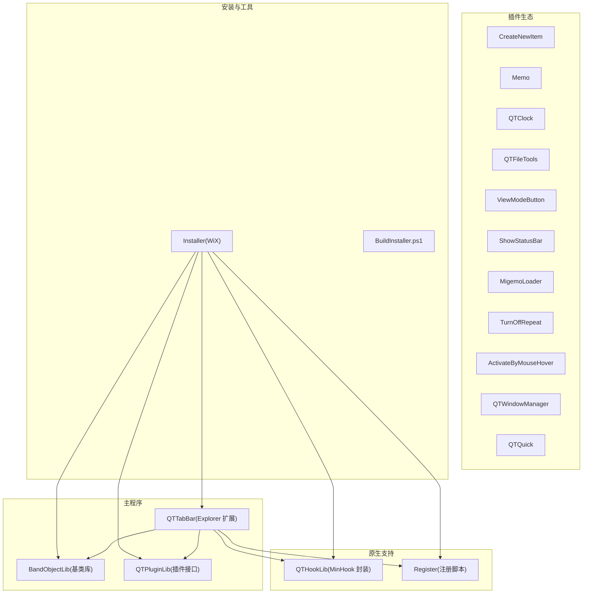
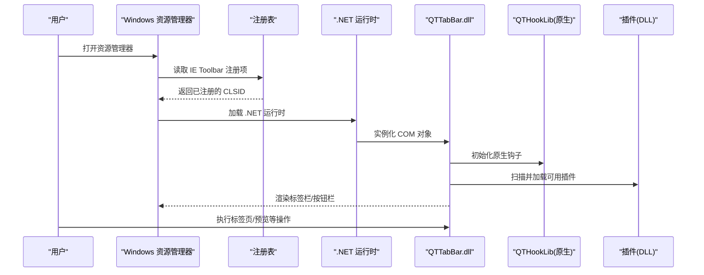
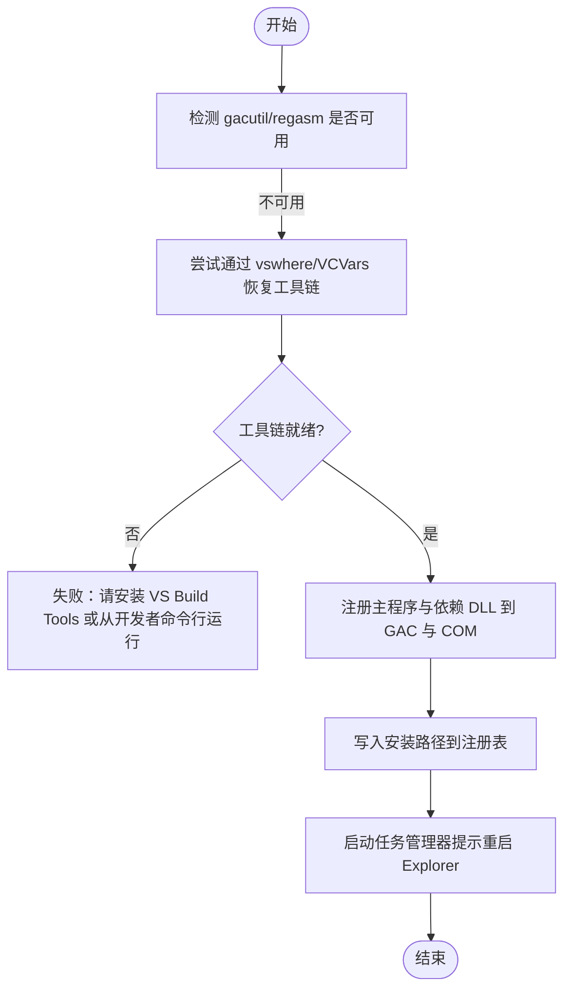
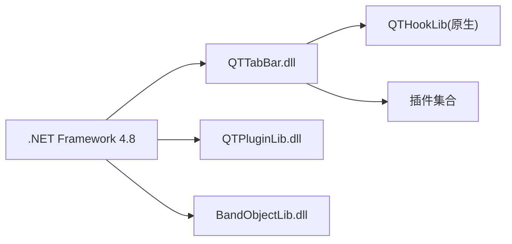

# 快速开始

<cite>
**本文引用的文件**   
- [README_zh.md](file://README_zh.md)
- [BUILD.txt](file://BUILD.txt)
- [CONTRIBUTING.md](file://CONTRIBUTING.md)
- [QTTabBar Rebirth.sln](file://QTTabBar Rebirth.sln)
- [Register\Register.bat](file://Register/Register.bat)
- [Installer\Installer.wxs](file://Installer/Installer.wxs)
</cite>

## 目录
1. [简介](#简介)
2. [项目结构](#项目结构)
3. [核心组件](#核心组件)
4. [架构总览](#架构总览)
5. [详细组件分析](#详细组件分析)
6. [依赖关系分析](#依赖关系分析)
7. [性能与兼容性注意事项](#性能与兼容性注意事项)
8. [故障排除指南](#故障排除指南)
9. [结论](#结论)
10. [附录](#附录)

## 简介
本指南面向首次使用 QTTabBar-Next 的用户，帮助你在 Windows 资源管理器中启用多标签浏览、文件夹预览等能力。内容涵盖：
- 环境准备（.NET Framework 4.8）
- 安装包下载与安装
- 在不同 Windows 版本中启用扩展的方法
- 基本配置与常用操作示例
- 常见问题排查
- 开发环境搭建与调试入门

## 项目结构
仓库采用模块化组织方式，核心库、插件、原生钩子、安装程序与测试分离，便于独立构建与扩展。

图表来源
- [QTTabBar Rebirth.sln:1-68](file://QTTabBar Rebirth.sln#L1-L68)
- [CONTRIBUTING.md:64-74](file://CONTRIBUTING.md#L64-L74)

章节来源
- [CONTRIBUTING.md:64-74](file://CONTRIBUTING.md#L64-L74)

## 核心组件
- 主扩展：以 COM BandObject 形式注入 Explorer，提供标签栏与按钮栏。
- 插件接口：统一插件契约，便于扩展功能。
- 原生钩子：基于 MinHook 的 C++ 库，用于系统级交互。
- 安装器：WiX 打包并写入注册表项，完成注册。
- 注册脚本：自动定位 gacutil/regasm，将 DLL 注册到系统。

章节来源
- [CONTRIBUTING.md:64-74](file://CONTRIBUTING.md#L64-L74)
- [Register/Register.bat:1-50](file://Register/Register.bat#L1-L50)
- [Installer/Installer.wxs:170-200](file://Installer/Installer.wxs#L170-L200)

## 架构总览
下图展示了用户从“安装”到“在资源管理器中使用”的关键路径，以及各组件的职责边界。

图表来源
- [Installer/Installer.wxs:170-200](file://Installer/Installer.wxs#L170-L200)
- [Register/Register.bat:22-49](file://Register/Register.bat#L22-L49)

## 详细组件分析

### 安装与环境准备
- 前置条件
  - 操作系统：Windows 7/8/10/11
  - 运行库：.NET Framework 4.8
  - 可选：WiX Toolset v3.11（仅构建安装包时需要）
- 获取安装包
  - 从发布页面下载最新安装包（参考 README 中的上游链接说明）。
- 安装步骤
  - 双击安装包，按向导完成安装。
  - 安装完成后，根据系统版本启用扩展（见下节）。

章节来源
- [README_zh.md:17-24](file://README_zh.md#L17-L24)
- [README_zh.md:26-32](file://README_zh.md#L26-L32)

### 在不同 Windows 版本中启用扩展
- Windows 10/11
  - 打开资源管理器 → “查看” → “选项” → 勾选 “QTTabBar & Buttons”。
- Windows 7 及更早
  - “组织” → “布局” → “菜单栏”，然后右键菜单栏右侧空白处 → 勾选 “QTTabBar” 等工具栏 → 按 Alt+M → 重启 Explorer 或重启计算机。

章节来源
- [README_zh.md:17-24](file://README_zh.md#L17-L24)

### 基本配置与常用操作
- 打开设置
  - 在资源管理器中通过菜单进入“选项”，可调整窗口、标签、外观、鼠标、快捷键、分组、应用、按钮栏、插件、语言等。
- 常用操作
  - 打开文件夹：在地址栏输入路径或拖拽文件夹至标签栏。
  - 新建标签页：点击标签栏上的“新建”按钮或使用快捷键。
  - 切换标签页：点击标签或使用快捷键导航。
  - 关闭标签页：点击标签上的关闭按钮或使用快捷键。
  - 预览：在列表视图中选中文件/文件夹，可在预览窗格查看内容。

章节来源
- [QTTabBar\OptionsDialog\Options01_Window.xaml.cs:18-36](file://QTTabBar\OptionsDialog\Options01_Window.xaml.cs#L18-L36)

### 开发环境搭建与调试
- 开发工具
  - Visual Studio 2019 或更高版本（或 JetBrains Rider）
  - .NET Framework 4.8 Developer Pack
  - WiX Toolset v3.11（仅构建安装包时需要）
- 生成 COM 互操作程序集（首次或干净检出后）
  - 运行 Tools/GenerateInterop.ps1（需要 Windows SDK 的 TlbImp.exe 或 VS 桌面工作负载）。
- 编译与输出
  - 打开解决方案 QTTabBar Rebirth.sln，选择 Debug|x86 构建，输出位于 bin\Debug\。
- 运行测试
  - dotnet test
- 注册与生效
  - 构建成功后会自动尝试注册；若未成功，请以管理员身份运行 Register/Register.bat。
  - 注册完成后重启 Explorer 使更改生效。
- 构建安装包（可选）
  - 使用 Tools/BuildInstaller.ps1 构建安装包。

章节来源
- [README_zh.md:26-47](file://README_zh.md#L26-L47)
- [CONTRIBUTING.md:14-21](file://CONTRIBUTING.md#L14-L21)
- [BUILD.txt:1-16](file://BUILD.txt#L1-L16)
- [Register/Register.bat:1-50](file://Register/Register.bat#L1-L50)
- [QTTabBar Rebirth.sln:69-138](file://QTTabBar Rebirth.sln#L69-L138)

### 注册流程与权限要求
- 注册脚本职责
  - 自动检测 gacutil/regasm 路径，必要时通过 vswhere 或旧版 VS 环境变量恢复工具链。
  - 将主程序与相关 DLL 加入 GAC 并注册 COM。
  - 写入安装路径到注册表，随后启动任务管理器以便用户重启 Explorer。
- 权限要求
  - 注册需管理员权限；建议以管理员身份运行 Visual Studio 或直接以管理员运行注册脚本。

图表来源
- [Register/Register.bat:52-165](file://Register/Register.bat#L52-L165)

章节来源
- [Register/Register.bat:52-165](file://Register/Register.bat#L52-L165)
- [BUILD.txt:10-13](file://BUILD.txt#L10-L13)

### 安装器与注册表项
- 安装器负责将核心 DLL、插件与原生库复制到目标目录，并在注册表中写入 IE Toolbar 条目，使资源管理器能够发现并加载扩展。
- 关键注册位置包括 Internet Explorer Toolbar 下的多个 CLSID 值。

章节来源
- [Installer/Installer.wxs:170-200](file://Installer/Installer.wxs#L170-L200)

## 依赖关系分析
- 运行时依赖
  - .NET Framework 4.8（所有 C# 项目均指向该框架）。
- 构建依赖
  - Visual Studio 2019+ 或 Rider
  - WiX Toolset v3.11（构建安装包）
  - Windows SDK（C++ Hook 与互操作生成）
- 组件耦合
  - 主程序依赖 BandObjectLib 与 QTPluginLib；原生层由 QTHookLib 提供；插件通过统一接口接入。

图表来源
- [CONTRIBUTING.md:26-27](file://CONTRIBUTING.md#L26-L27)
- [CONTRIBUTING.md:64-74](file://CONTRIBUTING.md#L64-L74)

章节来源
- [CONTRIBUTING.md:26-27](file://CONTRIBUTING.md#L26-L27)
- [CONTRIBUTING.md:64-74](file://CONTRIBUTING.md#L64-L74)

## 性能与兼容性注意事项
- 仅 x86 模式运行
  - 资源管理器通常为 32 位进程，因此建议使用 Debug|x86 进行开发与调试，避免 32/64 位混合加载问题。
- 插件数量与复杂度
  - 过多或重型插件可能影响启动与响应速度，可按需启用。
- 原生钩子
  - 原生层用于系统级交互，确保使用官方构建产物，避免兼容性问题。

[本节为通用指导，不直接分析具体文件]

## 故障排除指南
- 扩展未显示
  - 确认已在对应系统中启用扩展（参见“在不同 Windows 版本中启用扩展”）。
  - 检查注册表是否包含 IE Toolbar 的 CLSID 项。
  - 重启 Explorer 或重启计算机。
- 权限问题
  - 注册过程需要管理员权限；请以管理员身份运行注册脚本或 Visual Studio。
- 异常日志
  - 查看 %AppData%\QTTabBar\QTTabBarException.log 获取错误信息。
- 无法找到 gacutil/regasm
  - 安装 Visual Studio Build Tools（含 C++ 工具），或在开发者命令提示符下运行注册脚本。

章节来源
- [README_zh.md:17-24](file://README_zh.md#L17-L24)
- [BUILD.txt:10-13](file://BUILD.txt#L10-L13)
- [Register/Register.bat:161-165](file://Register/Register.bat#L161-L165)

## 结论
按照本指南完成环境准备、安装与启用后，即可在资源管理器中获得稳定的多标签体验。如需二次开发或贡献代码，请参考“开发环境搭建与调试”部分，并确保遵循项目的构建与测试流程。

[本节为总结性内容，不直接分析具体文件]

## 附录
- 上游与文档
  - 中文 README：README_zh.md
  - 英文 README：README.md
  - 贡献指南：CONTRIBUTING.md
  - 构建说明：BUILD.txt
- 诊断工具（Windows 11）
  - 使用 Tools/Win11ProbeSession.ps1 进行诊断（详见 README_zh.md 的 Win11 诊断小节）。

章节来源
- [README_zh.md:49-55](file://README_zh.md#L49-L55)