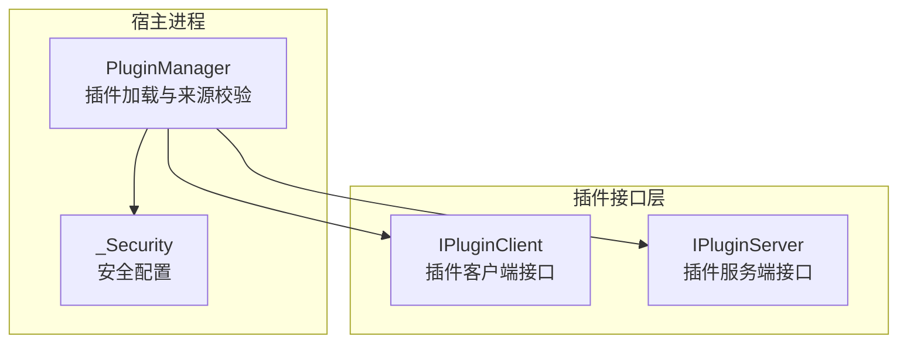
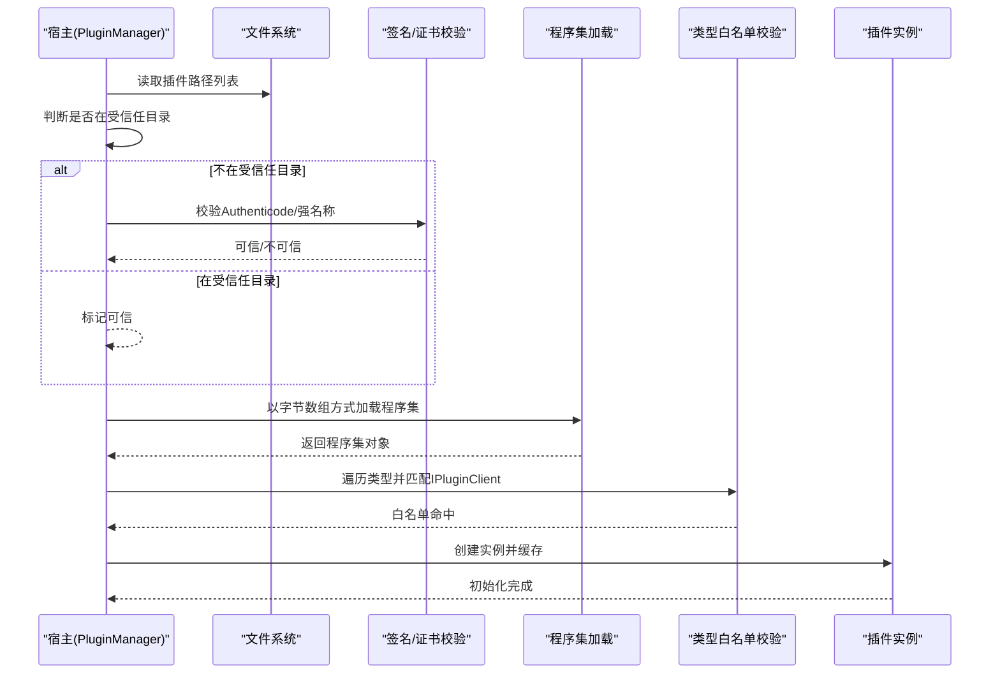
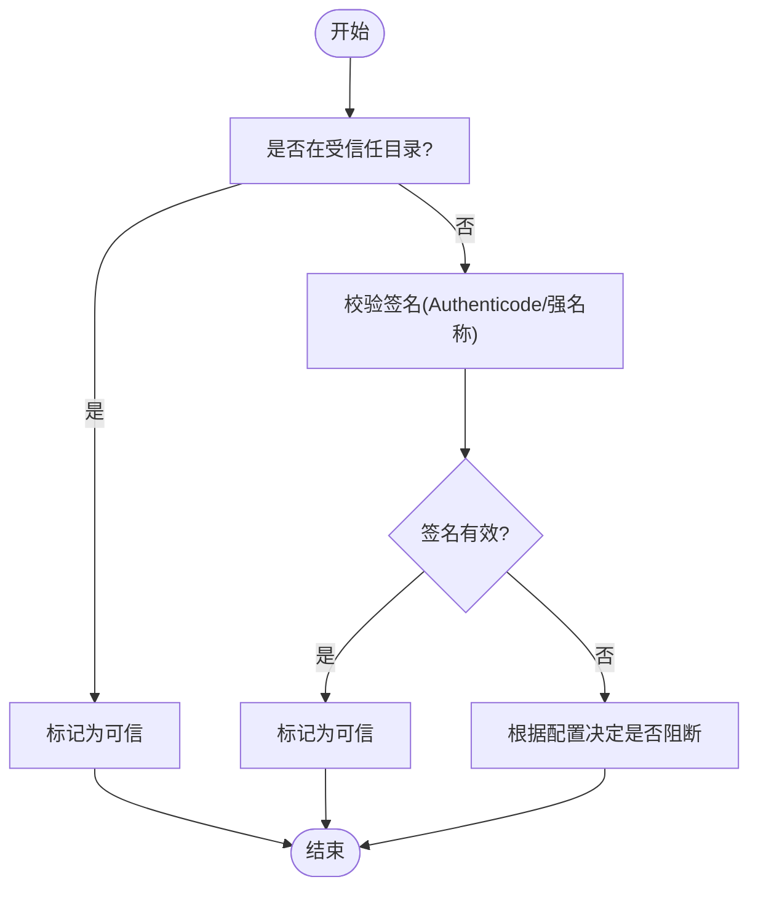
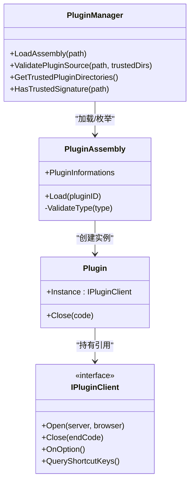
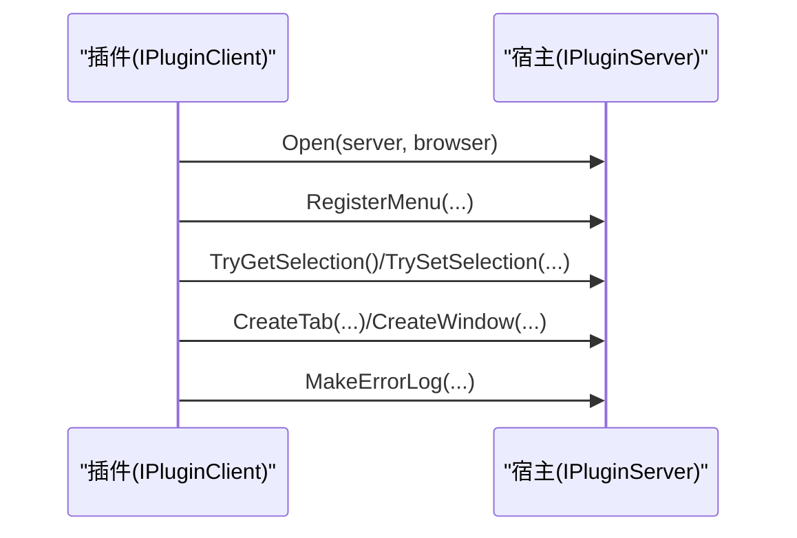
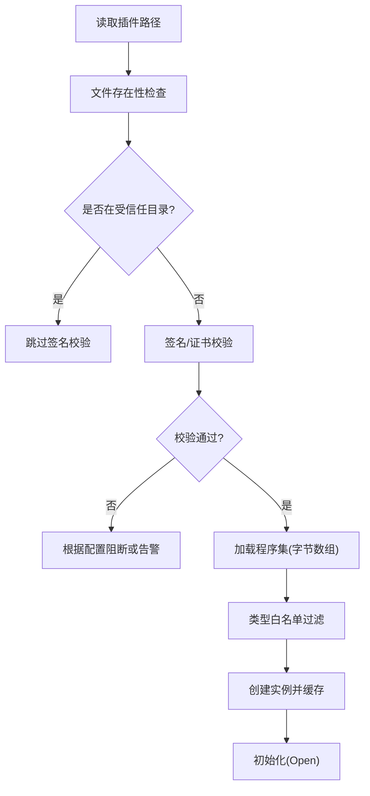
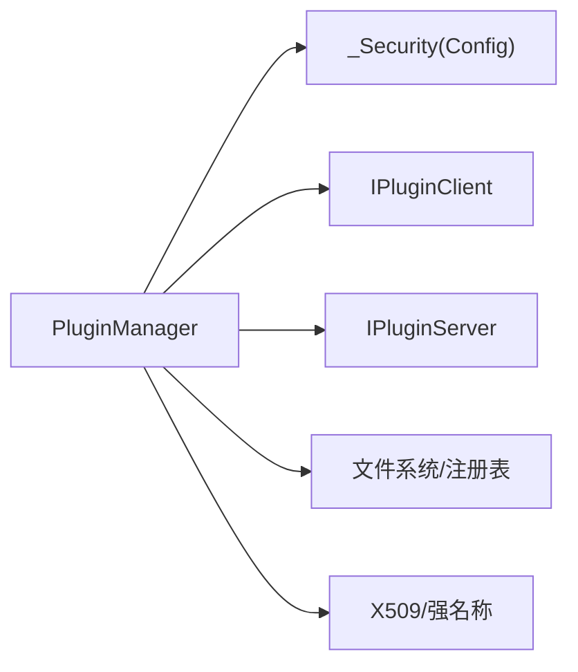

# 插件安全机制

<cite>
**本文引用的文件**   
- [PluginManager.cs](file://QTTabBar/PluginManager.cs)
- [IPluginServer.cs](file://QTPluginLib/IPluginServer.cs)
- [IPluginClient.cs](file://QTPluginLib/IPluginClient.cs)
- [Config.cs](file://QTTabBar/Config.cs)
</cite>

## 目录
1. [简介](#简介)
2. [项目结构](#项目结构)
3. [核心组件](#核心组件)
4. [架构总览](#架构总览)
5. [详细组件分析](#详细组件分析)
6. [依赖关系分析](#依赖关系分析)
7. [性能与安全特性](#性能与安全特性)
8. [故障排查指南](#故障排查指南)
9. [结论](#结论)
10. [附录：配置与最佳实践](#附录配置与最佳实践)

## 简介
本文件面向 QTTabBar-Next 的插件安全机制，聚焦以下目标：
- 解释插件沙箱隔离机制的实现原理与安全边界（当前实现为进程内加载，无独立进程沙箱）。
- 阐述插件权限控制系统：文件访问、网络访问与系统资源调用控制现状与建议。
- 说明插件签名验证机制：数字证书验证与完整性检查流程。
- 梳理插件加载过程中的安全检查点：路径验证、类型白名单与内存保护策略。
- 提供安全配置选项与最佳实践建议。
- 给出安全漏洞防护策略与应急响应措施。

## 项目结构
与插件安全直接相关的代码主要分布在以下位置：
- 插件管理与来源校验：QTTabBar/PluginManager.cs
- 插件对外接口定义：QTPluginLib/IPluginServer.cs、QTPluginLib/IPluginClient.cs
- 安全相关配置项：QTTabBar/Config.cs

图表来源
- [PluginManager.cs:124-143](file://QTTabBar/PluginManager.cs#L124-L143)
- [IPluginClient.cs:21-31](file://QTPluginLib/IPluginClient.cs#L21-L31)
- [IPluginServer.cs:24-76](file://QTPluginLib/IPluginServer.cs#L24-L76)
- [Config.cs:504-514](file://QTTabBar/Config.cs#L504-L514)

章节来源
- [PluginManager.cs:124-143](file://QTTabBar/PluginManager.cs#L124-L143)
- [IPluginClient.cs:21-31](file://QTPluginLib/IPluginClient.cs#L21-L31)
- [IPluginServer.cs:24-76](file://QTPluginLib/IPluginServer.cs#L24-L76)
- [Config.cs:504-514](file://QTTabBar/Config.cs#L504-L514)

## 核心组件
- 插件管理器（PluginManager）
  - 负责读取插件清单、执行来源与签名校验、实例化并缓存插件对象、管理静态插件生命周期。
  - 关键能力：
    - 受信任目录判定：仅将主程序集所在目录视为受信任插件目录。
    - 签名校验：优先 Authenticode 证书链校验（离线吊销），其次强名称公钥令牌比对。
    - 保守策略：默认未通过校验仍继续加载；可通过配置阻断。
- 插件接口
  - IPluginClient：插件侧需实现的入口与回调接口，限定可暴露给宿主的方法集合。
  - IPluginServer：宿主提供给插件调用的服务接口，集中了 UI、标签、菜单、选择等能力。
- 安全配置（_Security）
  - BlockUntrustedPlugins：是否阻断不受信任或未签名的插件。
  - BlockLegacyHookDllPath：是否阻止从用户可写旧路径加载 Hook DLL（与插件加载无关，但影响整体安全性）。

章节来源
- [PluginManager.cs:154-209](file://QTTabBar/PluginManager.cs#L154-L209)
- [PluginManager.cs:215-293](file://QTTabBar/PluginManager.cs#L215-L293)
- [PluginManager.cs:299-328](file://QTTabBar/PluginManager.cs#L299-L328)
- [IPluginClient.cs:21-31](file://QTPluginLib/IPluginClient.cs#L21-L31)
- [IPluginServer.cs:24-76](file://QTPluginLib/IPluginServer.cs#L24-L76)
- [Config.cs:504-514](file://QTTabBar/Config.cs#L504-L514)

## 架构总览
当前插件采用“进程内加载”模式，插件程序集在宿主进程中运行，共享同一进程地址空间。安全边界由“来源与签名校验 + 类型白名单 + 最小接口暴露”构成，而非进程级沙箱。

图表来源
- [PluginManager.cs:124-143](file://QTTabBar/PluginManager.cs#L124-L143)
- [PluginManager.cs:154-209](file://QTTabBar/PluginManager.cs#L154-L209)
- [PluginManager.cs:215-293](file://QTTabBar/PluginManager.cs#L215-L293)
- [PluginManager.cs:299-328](file://QTTabBar/PluginManager.cs#L299-L328)
- [PluginManager.cs:591-639](file://QTTabBar/PluginManager.cs#L591-L639)
- [PluginManager.cs:735-737](file://QTTabBar/PluginManager.cs#L735-L737)

## 详细组件分析

### 插件来源与签名校验
- 受信任目录
  - 仅将主程序集所在目录视为受信任目录，避免从用户可写目录自动信任。
- 签名校验
  - Authenticode：使用 X509Certificate2 与 X509Chain 进行证书链构建与校验，吊销模式设为离线，且要求与主程序集相同发布者指纹。
  - 强名称：比较插件与主程序集的 PublicKeyToken，确保同发布者。
- 保守策略
  - 默认未通过校验仍继续加载；当配置开启阻断时，拒绝加载。

图表来源
- [PluginManager.cs:154-209](file://QTTabBar/PluginManager.cs#L154-L209)
- [PluginManager.cs:215-293](file://QTTabBar/PluginManager.cs#L215-L293)
- [PluginManager.cs:299-328](file://QTTabBar/PluginManager.cs#L299-L328)
- [Config.cs:504-514](file://QTTabBar/Config.cs#L504-L514)

章节来源
- [PluginManager.cs:154-209](file://QTTabBar/PluginManager.cs#L154-L209)
- [PluginManager.cs:215-293](file://QTTabBar/PluginManager.cs#L215-L293)
- [PluginManager.cs:299-328](file://QTTabBar/PluginManager.cs#L299-L328)
- [Config.cs:504-514](file://QTTabBar/Config.cs#L504-L514)

### 类型白名单与实例化
- 类型白名单
  - 仅接受公开非抽象类且实现 IPluginClient 的类型。
- 实例化与缓存
  - 通过反射按类型全名创建实例，封装为 Plugin 对象并缓存，便于后续生命周期管理。
- 图像资源提取
  - 尝试从程序集资源中获取图标，失败不影响加载。

图表来源
- [PluginManager.cs:575-750](file://QTTabBar/PluginManager.cs#L575-L750)
- [PluginManager.cs:735-737](file://QTTabBar/PluginManager.cs#L735-L737)
- [IPluginClient.cs:21-31](file://QTPluginLib/IPluginClient.cs#L21-L31)

章节来源
- [PluginManager.cs:575-750](file://QTTabBar/PluginManager.cs#L575-L750)
- [PluginManager.cs:735-737](file://QTTabBar/PluginManager.cs#L735-L737)
- [IPluginClient.cs:21-31](file://QTPluginLib/IPluginClient.cs#L21-L31)

### 插件与服务端交互边界
- 插件通过 IPluginServer 与宿主交互，宿主提供有限 API（如创建标签、获取选择、注册菜单、错误日志等）。
- 该接口限定了插件可访问的能力范围，形成“最小权限”边界。

图表来源
- [IPluginClient.cs:21-31](file://QTPluginLib/IPluginClient.cs#L21-L31)
- [IPluginServer.cs:24-76](file://QTPluginLib/IPluginServer.cs#L24-L76)

章节来源
- [IPluginClient.cs:21-31](file://QTPluginLib/IPluginClient.cs#L21-L31)
- [IPluginServer.cs:24-76](file://QTPluginLib/IPluginServer.cs#L24-L76)

### 加载流程中的安全检查点
- 路径验证
  - 仅允许来自注册表记录的插件路径，并在加载前检查文件存在性。
  - 受信任目录严格限定为主程序集目录。
- 签名与完整性
  - Authenticode 证书链校验（离线吊销）+ 同发布者指纹比对。
  - 强名称公钥令牌比对作为备选方案。
- 类型白名单
  - 仅加载实现 IPluginClient 的公开非抽象类。
- 内存保护
  - 当前未启用 AppDomain 隔离或沙箱策略，插件与宿主共享进程空间。
  - 异常捕获与错误日志记录用于降低崩溃面。

图表来源
- [PluginManager.cs:124-143](file://QTTabBar/PluginManager.cs#L124-L143)
- [PluginManager.cs:154-209](file://QTTabBar/PluginManager.cs#L154-L209)
- [PluginManager.cs:215-293](file://QTTabBar/PluginManager.cs#L215-L293)
- [PluginManager.cs:299-328](file://QTTabBar/PluginManager.cs#L299-L328)
- [PluginManager.cs:591-639](file://QTTabBar/PluginManager.cs#L591-L639)
- [PluginManager.cs:735-737](file://QTTabBar/PluginManager.cs#L735-L737)

章节来源
- [PluginManager.cs:124-143](file://QTTabBar/PluginManager.cs#L124-L143)
- [PluginManager.cs:154-209](file://QTTabBar/PluginManager.cs#L154-L209)
- [PluginManager.cs:215-293](file://QTTabBar/PluginManager.cs#L215-L293)
- [PluginManager.cs:299-328](file://QTTabBar/PluginManager.cs#L299-L328)
- [PluginManager.cs:591-639](file://QTTabBar/PluginManager.cs#L591-L639)
- [PluginManager.cs:735-737](file://QTTabBar/PluginManager.cs#L735-L737)

## 依赖关系分析
- 组件耦合
  - PluginManager 依赖 Config._Security 控制行为，依赖 IPluginClient 约束插件类型，依赖 IPluginServer 提供宿主能力。
- 外部依赖
  - 使用 .NET 标准库进行文件、反射、X509 证书与链校验。
- 潜在风险
  - 进程内加载导致插件可访问宿主内存与全局状态；若未启用阻断策略，恶意插件可利用宿主暴露的 IPluginServer 方法扩大影响面。

图表来源
- [PluginManager.cs:124-143](file://QTTabBar/PluginManager.cs#L124-L143)
- [Config.cs:504-514](file://QTTabBar/Config.cs#L504-L514)
- [IPluginClient.cs:21-31](file://QTPluginLib/IPluginClient.cs#L21-L31)
- [IPluginServer.cs:24-76](file://QTPluginLib/IPluginServer.cs#L24-L76)

章节来源
- [PluginManager.cs:124-143](file://QTTabBar/PluginManager.cs#L124-L143)
- [Config.cs:504-514](file://QTTabBar/Config.cs#L504-L514)
- [IPluginClient.cs:21-31](file://QTPluginLib/IPluginClient.cs#L21-L31)
- [IPluginServer.cs:24-76](file://QTPluginLib/IPluginServer.cs#L24-L76)

## 性能与安全特性
- 性能
  - 插件以字节数组方式加载，减少磁盘二次映射开销；实例缓存避免重复创建。
- 安全
  - 来源与签名双重校验；类型白名单限制可加载类型；保守策略默认放行但支持阻断。
  - 未实现进程级沙箱或权限细粒度控制，属于“应用层最小权限”模型。

[本节为通用讨论，不直接分析具体文件]

## 故障排查指南
- 常见问题
  - 插件未被加载：检查是否位于受信任目录或具备有效签名；确认未开启“阻断不受信任插件”。
  - 加载后崩溃：查看插件异常处理与错误日志输出；确认插件实现了 IPluginClient 且类型公开非抽象。
  - 功能受限：确认插件仅通过 IPluginServer 提供的 API 操作，避免越权调用。
- 定位手段
  - 启用日志输出，关注插件加载与校验阶段的错误信息。
  - 核对注册表中插件路径与文件一致性。

章节来源
- [PluginManager.cs:45-51](file://QTTabBar/PluginManager.cs#L45-L51)
- [PluginManager.cs:299-328](file://QTTabBar/PluginManager.cs#L299-L328)
- [PluginManager.cs:591-639](file://QTTabBar/PluginManager.cs#L591-L639)

## 结论
- 当前安全模型基于“来源与签名校验 + 类型白名单 + 最小接口暴露”，适用于受控环境下的扩展生态。
- 由于采用进程内加载，缺乏进程级沙箱与细粒度权限控制，建议在高风险环境中启用“阻断不受信任插件”，并严格管控插件分发渠道。
- 未来可考虑引入更严格的隔离机制（如独立进程/沙箱）、更强的权限网关与运行时监控。

[本节为总结性内容，不直接分析具体文件]

## 附录：配置与最佳实践

- 安全配置项
  - BlockUntrustedPlugins：建议在生产环境启用，阻断未签名或不在受信任目录的插件。
  - BlockLegacyHookDllPath：建议启用，防止从用户可写旧路径加载 Hook DLL。
- 最佳实践
  - 插件分发：仅从受信任目录部署，并使用与主程序集相同发布者的 Authenticode 签名或强名称。
  - 接口最小化：插件仅通过 IPluginServer 暴露的 API 进行操作，避免直接依赖宿主内部实现。
  - 输入校验：对插件传入参数进行严格校验，防范注入与越界访问。
  - 异常隔离：插件内部应捕获并上报异常，避免影响宿主稳定性。
  - 更新与撤销：建立插件版本与签名白名单管理机制，及时撤销被篡改或泄露的签名。
- 应急响应
  - 发现可疑插件：立即禁用并移除对应路径，启用阻断策略，审计受影响会话。
  - 日志取证：收集加载与校验阶段日志，回溯插件来源与变更时间线。
  - 修复与加固：升级主程序签名与校验逻辑，收紧受信任目录策略，必要时引入运行时监控。

章节来源
- [Config.cs:504-514](file://QTTabBar/Config.cs#L504-L514)
- [PluginManager.cs:299-328](file://QTTabBar/PluginManager.cs#L299-L328)