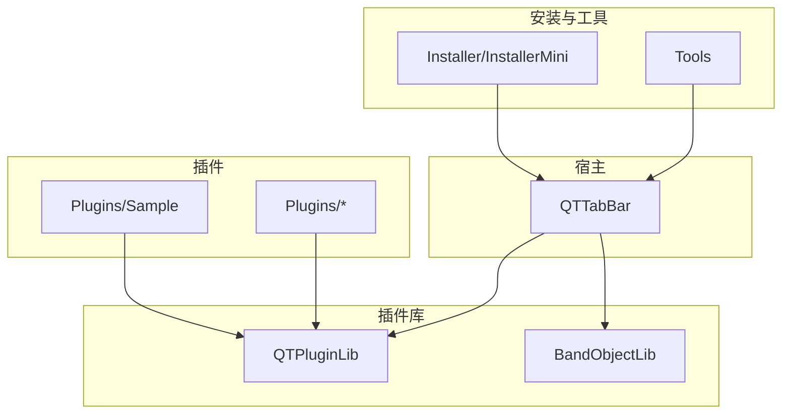
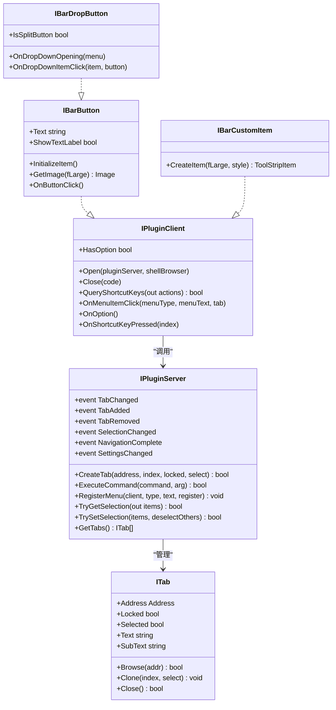
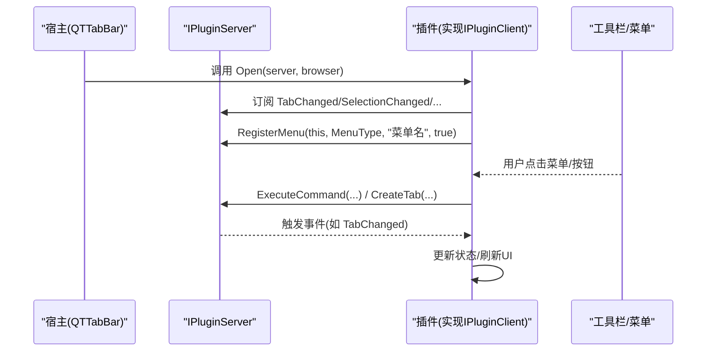
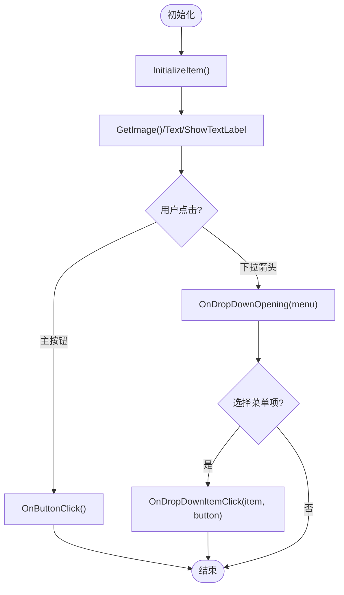
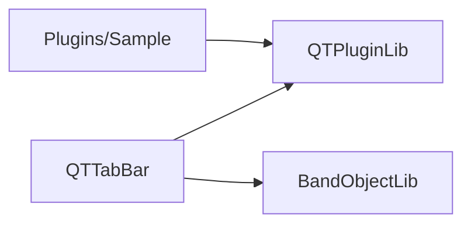

# 插件开发指南

<cite>
**本文引用的文件**   
- [README_zh.md](file://README_zh.md)
- [PluginAttribute.cs](file://QTPluginLib/PluginAttribute.cs)
- [PluginType.cs](file://QTPluginLib/PluginType.cs)
- [IPluginServer.cs](file://QTPluginLib/IPluginServer.cs)
- [IBarButton.cs](file://QTPluginLib/IBarButton.cs)
- [IBarCustomItem.cs](file://QTPluginLib/IBarCustomItem.cs)
- [IBarDropButton.cs](file://QTPluginLib/IBarDropButton.cs)
- [ITab.cs](file://QTPluginLib/ITab.cs)
- [PluginEventArgs.cs](file://QTPluginLib/PluginEventArgs.cs)
- [PluginEventHandler.cs](file://QTPluginLib/PluginEventHandler.cs)
- [SamplePlugin.csproj](file://Plugins/Sample/SamplePlugin.csproj)
- [SamplePlugin.cs](file://Plugins/Sample/SamplePlugin.cs)
</cite>

## 目录
1. [简介](#简介)
2. [项目结构](#项目结构)
3. [核心组件](#核心组件)
4. [架构总览](#架构总览)
5. [详细组件分析](#详细组件分析)
6. [依赖关系分析](#依赖关系分析)
7. [性能考虑](#性能考虑)
8. [故障排查指南](#故障排查指南)
9. [结论](#结论)
10. [附录](#附录)

## 简介
本指南面向 QTTabBar-Next 的插件开发者，提供从环境搭建、项目模板与依赖配置，到事件系统使用、多种插件类型实现示例（按钮、菜单项、工具窗口）、调试技巧、常见问题与优化建议，以及打包签名发布的完整流程说明。读者无需深入底层 COM 细节即可快速上手并构建高质量插件。

## 项目结构
仓库采用分层组织：
- 宿主与核心库
  - QTTabBar：宿主应用与 Shell 集成
  - QTPluginLib：插件接口与公共类型定义
  - BandObjectLib：Band 对象封装（用于 Explorer 工具栏承载）
- 示例与内置插件
  - Plugins/Sample：最小可运行插件示例
  - 其他 Plugins/*：更多功能参考实现
- 安装器与工具
  - Installer / InstallerMini：安装包工程
  - Tools：构建与诊断脚本

图表来源
- [README_zh.md:26-47](file://README_zh.md#L26-L47)
- [SamplePlugin.csproj:68-72](file://Plugins/Sample/SamplePlugin.csproj#L68-L72)

章节来源
- [README_zh.md:26-47](file://README_zh.md#L26-L47)

## 核心组件
- 插件元数据与生命周期
  - PluginAttribute：声明插件名称、作者、版本、描述及类型
  - PluginType：区分 Interactive/Background/BackgroundMultiple/Static
- 插件与宿主通信
  - IPluginClient：插件基础能力（Open/Close/选项/快捷键等）
  - IPluginServer：宿主提供的服务（事件、命令、标签页、选择集、注册菜单等）
- UI 控件扩展点
  - IBarButton：标准按钮
  - IBarDropButton：带下拉/拆分按钮
  - IBarCustomItem：自定义 ToolStripItem
- 标签页模型
  - ITab：浏览、历史、克隆、锁定、文本等

章节来源
- [PluginAttribute.cs:22-63](file://QTPluginLib/PluginAttribute.cs#L22-L63)
- [PluginType.cs:19-24](file://QTPluginLib/PluginType.cs#L19-L24)
- [IPluginServer.cs:24-76](file://QTPluginLib/IPluginServer.cs#L24-L76)
- [IBarButton.cs:21-29](file://QTPluginLib/IBarButton.cs#L21-L29)
- [IBarDropButton.cs:21-26](file://QTPluginLib/IBarDropButton.cs#L21-L26)
- [IBarCustomItem.cs:21-23](file://QTPluginLib/IBarCustomItem.cs#L21-L23)
- [ITab.cs:19-39](file://QTPluginLib/ITab.cs#L19-L39)

## 架构总览
插件通过实现 QTPluginLib 中的接口暴露给宿主；宿主在加载后调用 Open，注入 IPluginServer，插件据此订阅事件、注册菜单、创建标签页或执行命令。UI 类通过 IBarButton/IBarDropButton/IBarCustomItem 接入工具栏。

图表来源
- [IPluginClient.cs:24-76](file://QTPluginLib/IPluginServer.cs#L24-L76)
- [IBarButton.cs:21-29](file://QTPluginLib/IBarButton.cs#L21-L29)
- [IBarDropButton.cs:21-26](file://QTPluginLib/IBarDropButton.cs#L21-L26)
- [IBarCustomItem.cs:21-23](file://QTPluginLib/IBarCustomItem.cs#L21-L23)
- [ITab.cs:19-39](file://QTPluginLib/ITab.cs#L19-L39)

## 详细组件分析

### 开发环境与项目模板
- 前置条件
  - Visual Studio 2019 或更高版本（或 JetBrains Rider）
  - .NET Framework 4.8 Developer Pack
  - WiX Toolset v3.11（仅构建安装包时需要）
- 解决方案与目标平台
  - 打开 QTTabBar Rebirth.sln，以 Debug|x86 构建
  - 插件项目需引用 QTPluginLib，并输出为 Class Library
- 示例项目参考
  - 插件项目模板与依赖可见 Plugins/Sample/SamplePlugin.csproj
  - 目标框架为 v4.8，引用 System.Windows.Forms 与 QTPluginLib

章节来源
- [README_zh.md:26-47](file://README_zh.md#L26-L47)
- [SamplePlugin.csproj:18-19](file://Plugins/Sample/SamplePlugin.csproj#L18-L19)
- [SamplePlugin.csproj:68-72](file://Plugins/Sample/SamplePlugin.csproj#L68-L72)

### 插件类型与元数据
- 使用 [Plugin] 特性声明插件信息
  - Author/Name/Version/Description 用于“选项 -> 插件”页面展示
  - PluginType 决定生命周期与 UI 行为
- 类型说明
  - Interactive：需要 UI 项，仅在启用时实例化
  - Background：即使未启用也实例化，适合后台任务
  - BackgroundMultiple：多实例后台
  - Static：静态型（无交互）

章节来源
- [PluginAttribute.cs:22-63](file://QTPluginLib/PluginAttribute.cs#L22-L63)
- [PluginType.cs:19-24](file://QTPluginLib/PluginType.cs#L19-L24)

### 事件系统：订阅、触发与处理
- 事件源
  - IPluginServer 提供大量事件：TabChanged/TabAdded/TabRemoved/SelectionChanged/NavigationComplete/SettingsChanged 等
- 事件参数
  - PluginEventArgs 携带 Index/Address/WindowAction 等上下文
- 典型用法
  - 在 Open 中订阅事件，在 Close 中由宿主自动解绑
  - 根据事件更新 UI 或执行逻辑

图表来源
- [IPluginServer.cs:24-76](file://QTPluginLib/IPluginServer.cs#L24-L76)
- [PluginEventArgs.cs:21-52](file://QTPluginLib/PluginEventArgs.cs#L21-L52)
- [SamplePlugin.cs:64-81](file://Plugins/Sample/SamplePlugin.cs#L64-L81)

章节来源
- [IPluginServer.cs:24-76](file://QTPluginLib/IPluginServer.cs#L24-L76)
- [PluginEventArgs.cs:21-52](file://QTPluginLib/PluginEventArgs.cs#L21-L52)
- [SamplePlugin.cs:64-81](file://Plugins/Sample/SamplePlugin.cs#L64-L81)

### 按钮插件（IBarButton/IBarDropButton）
- 基本步骤
  - 实现 IBarButton 或 IBarDropButton
  - 提供图标、文本、点击行为
  - 可选：实现 IsSplitButton 与下拉菜单
- 关键方法
  - InitializeItem/GetImage/OnButtonClick/Text/ShowTextLabel
  - OnDropDownOpening/OnDropDownItemClick（下拉）
- 示例参考
  - 参见 Plugins/Sample/SamplePlugin.cs 中的 SampleSplitButton

图表来源
- [IBarButton.cs:21-29](file://QTPluginLib/IBarButton.cs#L21-L29)
- [IBarDropButton.cs:21-26](file://QTPluginLib/IBarDropButton.cs#L21-L26)
- [SamplePlugin.cs:158-255](file://Plugins/Sample/SamplePlugin.cs#L158-L255)

章节来源
- [IBarButton.cs:21-29](file://QTPluginLib/IBarButton.cs#L21-L29)
- [IBarDropButton.cs:21-26](file://QTPluginLib/IBarDropButton.cs#L21-L26)
- [SamplePlugin.cs:158-255](file://Plugins/Sample/SamplePlugin.cs#L158-L255)

### 菜单项插件（注册到宿主菜单）
- 注册方式
  - 通过 IPluginServer.RegisterMenu 将插件菜单项注册到“标签页/工具栏”菜单
- 响应点击
  - 实现 IPluginClient.OnMenuItemClick，依据 menuType/menuText 分支处理
- 示例参考
  - 参见 SamplePlugin.cs 中注册与处理逻辑

章节来源
- [IPluginServer.cs:58](file://QTPluginLib/IPluginServer.cs#L58-L58)
- [SamplePlugin.cs:79-81](file://Plugins/Sample/SamplePlugin.cs#L79-L81)
- [SamplePlugin.cs:105-125](file://Plugins/Sample/SamplePlugin.cs#L105-L125)

### 工具窗口插件（自定义界面）
- 两种路径
  - 使用 IBarCustomItem.CreateItem 返回自定义 ToolStripItem，承载 WPF/WinForms 控件
  - 通过 IPluginServer.ExecuteCommand 或 CreateWindow 打开独立窗口（遵循宿主命令约定）
- 注意事项
  - 注意 DPI 感知与线程亲和性（UI 操作应在 UI 线程）
  - 资源释放需在 Close 中完成（非 Hidden 场景）

章节来源
- [IBarCustomItem.cs:21-23](file://QTPluginLib/IBarCustomItem.cs#L21-L23)
- [IPluginServer.cs:51](file://QTPluginLib/IPluginServer.cs#L51-L51)
- [SamplePlugin.cs:83-90](file://Plugins/Sample/SamplePlugin.cs#L83-L90)

### 标签页与选择集操作
- 获取/设置选择
  - TryGetSelection/TrySetSelection
- 标签页管理
  - GetTabs/CreateTab/SelectedTab
- 常用属性
  - ITab.Address/Locked/Selected/Text/SubText

章节来源
- [IPluginServer.cs:55-56](file://QTPluginLib/IPluginServer.cs#L55-L56)
- [IPluginServer.cs:49-50](file://QTPluginLib/IPluginServer.cs#L49-L50)
- [ITab.cs:28-38](file://QTPluginLib/ITab.cs#L28-L38)
- [SamplePlugin.cs:173-186](file://Plugins/Sample/SamplePlugin.cs#L173-L186)

## 依赖关系分析
- 插件对 QTPluginLib 的强依赖
  - 所有插件均引用 QTPluginLib 以获得接口与类型
- 宿主对 BandObjectLib 的依赖
  - 用于承载工具栏 Band 对象
- 示例项目依赖图

图表来源
- [SamplePlugin.csproj:68-72](file://Plugins/Sample/SamplePlugin.csproj#L68-L72)

章节来源
- [SamplePlugin.csproj:68-72](file://Plugins/Sample/SamplePlugin.csproj#L68-L72)

## 性能考虑
- 避免在事件回调中进行耗时操作，必要时异步并在 UI 线程更新
- 批量操作选择集时尽量合并 TrySetSelection 调用
- 图片资源缓存，减少重复加载
- 谨慎频繁访问 COM 对象，复用 ITab/IAddress 等引用
- 合理设置 ShowTextLabel 与图像尺寸，降低绘制开销

[本节为通用指导，不直接分析具体文件]

## 故障排查指南
- 常见错误
  - 插件未显示：检查 [Plugin] 特性与 PluginType 是否匹配实现接口
  - 菜单不出现：确认 RegisterMenu 的 menuType 与文本一致
  - 事件未触发：确保在 Open 中正确订阅，且未在 Close 中提前释放资源
- 日志位置
  - 异常日志：%AppData%\QTTabBar\QTTabBarException.log
- 调试建议
  - 以 Debug|x86 构建，附加到 explorer.exe 进行断点调试
  - 使用 MakeErrorLog 记录异常堆栈

章节来源
- [README_zh.md:23](file://README_zh.md#L23-L23)
- [IPluginServer.cs:65](file://QTPluginLib/IPluginServer.cs#L65-L65)

## 结论
通过 QTPluginLib 提供的统一接口与事件体系，开发者可以高效构建按钮、菜单与自定义窗体等插件。遵循生命周期与线程模型，结合示例工程与本文指引，可快速完成从原型到发布的全流程。

[本节为总结，不直接分析具体文件]

## 附录

### 从零开始：创建一个简单插件的步骤
- 新建 C# 类库项目，目标框架设为 .NET Framework 4.8
- 引用 QTPluginLib 项目
- 实现一个类，继承 IBarButton 或 IBarDropButton
- 使用 [Plugin] 特性标注插件元数据与类型
- 在 Open 中订阅 IPluginServer 事件并注册菜单
- 在 OnButtonClick/OnDropDownItemClick 中实现业务逻辑
- 构建并复制到插件目录，重启 Explorer 验证

章节来源
- [SamplePlugin.csproj:18-19](file://Plugins/Sample/SamplePlugin.csproj#L18-L19)
- [SamplePlugin.csproj:68-72](file://Plugins/Sample/SamplePlugin.csproj#L68-L72)
- [PluginAttribute.cs:22-63](file://QTPluginLib/PluginAttribute.cs#L22-L63)
- [SamplePlugin.cs:64-81](file://Plugins/Sample/SamplePlugin.cs#L64-L81)

### 插件打包、签名与发布
- 打包
  - 使用 WiX 工程生成安装包（可选）
  - 或使用 PowerShell 脚本构建安装包
- 签名
  - 对最终 DLL 进行数字签名，提升可信度
- 发布
  - 将插件 DLL 放入宿主识别的插件目录
  - 在“选项 -> 插件”中启用对应插件
  - 重启 Explorer 生效

章节来源
- [README_zh.md:42-47](file://README_zh.md#L42-L47)