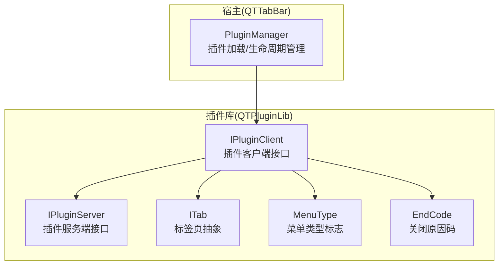
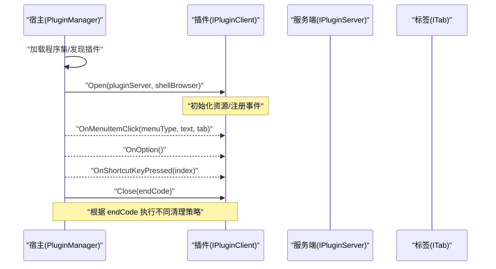
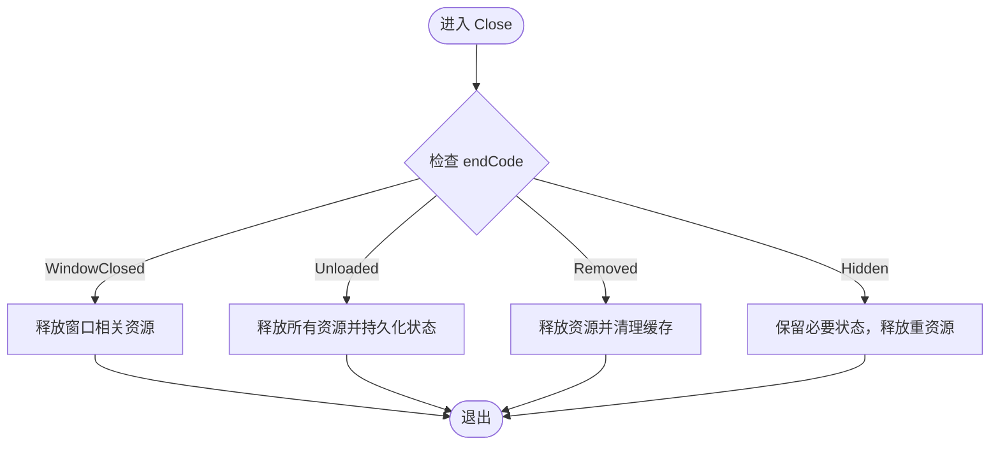
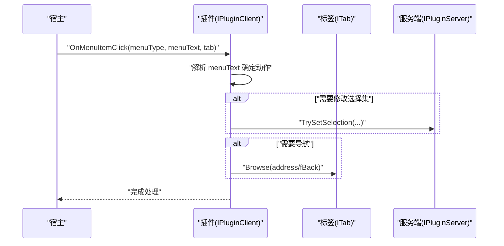
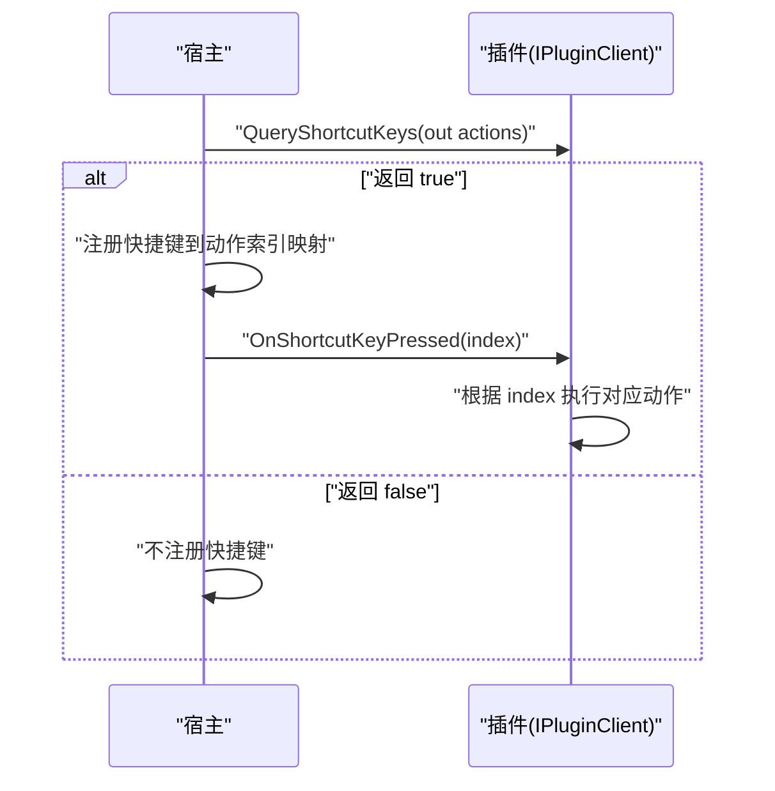
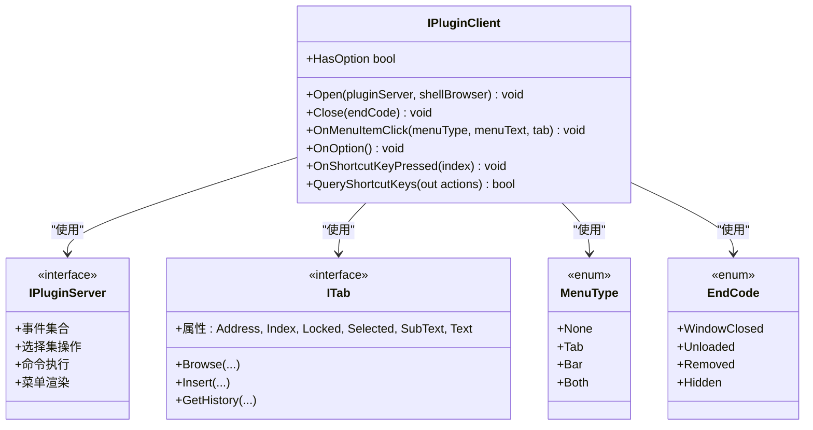

# IPluginClient 接口

<cite>
**本文引用的文件**
- [IPluginClient.cs](file://QTPluginLib/IPluginClient.cs)
- [IPluginServer.cs](file://QTPluginLib/IPluginServer.cs)
- [ITab.cs](file://QTPluginLib/ITab.cs)
- [MenuType.cs](file://QTPluginLib/MenuType.cs)
- [EndCode.cs](file://QTPluginLib/EndCode.cs)
- [PluginManager.cs](file://QTTabBar/PluginManager.cs)
</cite>

## 目录
1. [简介](#简介)
2. [项目结构](#项目结构)
3. [核心组件](#核心组件)
4. [架构总览](#架构总览)
5. [详细组件分析](#详细组件分析)
6. [依赖关系分析](#依赖关系分析)
7. [性能考虑](#性能考虑)
8. [故障排查指南](#故障排查指南)
9. [结论](#结论)
10. [附录](#附录)

## 简介
本文件为 QTTabBar 插件体系中的 IPluginClient 接口提供权威 API 文档。IPluginClient 是宿主（QTTabBar）与插件之间的契约，用于在插件生命周期内传递事件、配置入口、快捷键注册以及资源释放等能力。本文面向插件开发者，系统阐述各方法与属性的语义、参数约定、返回值含义、异常处理建议与最佳实践，并给出与宿主交互的时序图与流程图，帮助读者快速构建健壮、可维护的插件。

## 项目结构
IPluginClient 位于插件库 QTPluginLib 中，作为插件实现必须遵循的接口；与之配套的 IPluginServer、ITab、MenuType、EndCode 等类型共同构成插件运行时模型。宿主侧通过 PluginManager 加载、初始化、回调和卸载插件实例。

图表来源
- [IPluginClient.cs:21-30](file://QTPluginLib/IPluginClient.cs#L21-L30)
- [IPluginServer.cs:24-76](file://QTPluginLib/IPluginServer.cs#L24-L76)
- [ITab.cs:19-39](file://QTPluginLib/ITab.cs#L19-L39)
- [MenuType.cs:21-27](file://QTPluginLib/MenuType.cs#L21-L27)
- [EndCode.cs:19-24](file://QTPluginLib/EndCode.cs#L19-L24)
- [PluginManager.cs:484-537](file://QTTabBar/PluginManager.cs#L484-L537)

章节来源
- [IPluginClient.cs:21-30](file://QTPluginLib/IPluginClient.cs#L21-L30)
- [IPluginServer.cs:24-76](file://QTPluginLib/IPluginServer.cs#L24-L76)
- [ITab.cs:19-39](file://QTPluginLib/ITab.cs#L19-L39)
- [MenuType.cs:21-27](file://QTPluginLib/MenuType.cs#L21-L27)
- [EndCode.cs:19-24](file://QTPluginLib/EndCode.cs#L19-L24)
- [PluginManager.cs:484-537](file://QTTabBar/PluginManager.cs#L484-L537)

## 核心组件
本节聚焦 IPluginClient 接口的成员，逐一说明其职责、参数、返回值、异常与使用要点。

- Close(EndCode endCode)
  - 作用：通知插件即将被销毁或从宿主移除，供插件执行清理逻辑（释放非托管资源、取消订阅、保存状态等）。
  - 参数：endCode 表示关闭原因，包括窗口关闭、卸载、移除、隐藏等场景。
  - 返回值：无。
  - 异常处理：插件内部应捕获异常并记录日志，避免影响宿主稳定性。
  - 调用时机：由宿主在卸载/移除/隐藏时调用。
  - 参考路径：[Close 定义](file://QTPluginLib/IPluginClient.cs#L22)、[EndCode 定义:19-24](file://QTPluginLib/EndCode.cs#L19-L24)、[宿主调用示例:496-507](file://QTTabBar/PluginManager.cs#L496-L507)。

- OnMenuItemClick(MenuType menuType, string menuText, ITab tab)
  - 作用：响应插件注册的菜单项点击事件。
  - 参数：
    - menuType：菜单来源类型（如标签栏、工具栏、两者），由 MenuType 标志位描述。
    - menuText：被点击菜单项的文本标识。
    - tab：当前上下文标签页对象，可用于导航、选择等操作。
  - 返回值：无。
  - 异常处理：对 UI 操作进行线程安全保护，必要时切换到 UI 线程执行。
  - 参考路径：[方法定义](file://QTPluginLib/IPluginClient.cs#L23)、[ITab 接口:19-39](file://QTPluginLib/ITab.cs#L19-L39)、[MenuType 枚举:21-27](file://QTPluginLib/MenuType.cs#L21-L27)。

- OnOption()
  - 作用：打开插件的配置界面或选项对话框。
  - 参数：无。
  - 返回值：无。
  - 异常处理：确保 UI 显示在主线程，避免跨线程访问控件。
  - 参考路径：[方法定义](file://QTPluginLib/IPluginClient.cs#L24)。

- OnShortcutKeyPressed(int index)
  - 作用：响应快捷键触发，index 对应 QueryShortcutKeys 返回的动作索引。
  - 参数：index 为动作索引。
  - 返回值：无。
  - 异常处理：避免阻塞主线程，耗时任务异步执行。
  - 参考路径：[方法定义](file://QTPluginLib/IPluginClient.cs#L25)。

- Open(IPluginServer pluginServer, IShellBrowser shellBrowser)
  - 作用：插件初始化入口，宿主注入服务端与浏览器接口，供插件获取宿主能力与 Shell 上下文。
  - 参数：
    - pluginServer：插件服务端接口，提供事件、命令、选择集、菜单渲染等能力。
    - shellBrowser：Shell 浏览器接口，用于与 Explorer 视图交互。
  - 返回值：无。
  - 异常处理：初始化阶段应尽可能轻量，失败需记录错误并优雅降级。
  - 参考路径：[方法定义](file://QTPluginLib/IPluginClient.cs#L26)、[IPluginServer 接口:24-76](file://QTPluginLib/IPluginServer.cs#L24-L76)。

- QueryShortcutKeys(out string[] actions)
  - 作用：向宿主声明插件支持的快捷键动作列表，actions 为动作名称数组。
  - 参数：out actions 输出动作名数组。
  - 返回值：bool，true 表示支持快捷键，false 表示不支持。
  - 异常处理：返回空数组时应视为不支持。
  - 参考路径：[方法定义](file://QTPluginLib/IPluginClient.cs#L27)。

- HasOption
  - 作用：指示插件是否提供配置选项。宿主据此决定是否显示“选项”入口。
  - 类型：bool 只读属性。
  - 参考路径：[属性定义](file://QTPluginLib/IPluginClient.cs#L29)。

章节来源
- [IPluginClient.cs:21-30](file://QTPluginLib/IPluginClient.cs#L21-L30)
- [IPluginServer.cs:24-76](file://QTPluginLib/IPluginServer.cs#L24-L76)
- [ITab.cs:19-39](file://QTPluginLib/ITab.cs#L19-L39)
- [MenuType.cs:21-27](file://QTPluginLib/MenuType.cs#L21-L27)
- [EndCode.cs:19-24](file://QTPluginLib/EndCode.cs#L19-L24)

## 架构总览
下图展示插件生命周期关键流程：加载、初始化、事件回调、关闭与卸载。

图表来源
- [PluginManager.cs:484-537](file://QTTabBar/PluginManager.cs#L484-L537)
- [IPluginClient.cs:21-30](file://QTPluginLib/IPluginClient.cs#L21-L30)
- [IPluginServer.cs:24-76](file://QTPluginLib/IPluginServer.cs#L24-L76)
- [ITab.cs:19-39](file://QTPluginLib/ITab.cs#L19-L39)

## 详细组件分析

### 生命周期与结束码处理机制（Close）
- 结束码语义
  - WindowClosed：Explorer 窗口关闭。
  - Unloaded：插件被卸载。
  - Removed：插件被移除（例如刷新后不再启用）。
  - Hidden：插件被隐藏（仅不可见，可能保留实例）。
- 处理建议
  - 统一在 Close 中释放非托管资源、取消事件订阅、保存用户设置。
  - 针对 Hidden 与 Removed/Unloaded 的差异：Hidden 可保留缓存，Removed/Unloaded 应彻底释放。
- 宿主调用位置
  - 静态插件卸载与刷新时调用 Close(EndCode.Removed)。
  - 程序集卸载时广播 UnloadPluginInstance(pid, EndCode.Removed)。

图表来源
- [EndCode.cs:19-24](file://QTPluginLib/EndCode.cs#L19-L24)
- [PluginManager.cs:496-507](file://QTTabBar/PluginManager.cs#L496-L507)
- [PluginManager.cs:442-456](file://QTTabBar/PluginManager.cs#L442-L456)
- [PluginManager.cs:407-422](file://QTTabBar/PluginManager.cs#L407-L422)

章节来源
- [EndCode.cs:19-24](file://QTPluginLib/EndCode.cs#L19-L24)
- [PluginManager.cs:496-507](file://QTTabBar/PluginManager.cs#L496-L507)
- [PluginManager.cs:442-456](file://QTTabBar/PluginManager.cs#L442-L456)
- [PluginManager.cs:407-422](file://QTTabBar/PluginManager.cs#L407-L422)

### 菜单项点击事件处理（OnMenuItemClick）
- 参数说明
  - menuType：来自 MenuType 标志位，区分 Tab/Bar/Both。
  - menuText：菜单项文本，用于识别具体动作。
  - tab：当前上下文标签页，可进行浏览、克隆、历史等操作。
- 典型用法
  - 根据 menuText 分支执行不同功能。
  - 使用 tab.Browse 或 tab.Insert 进行页面跳转。
  - 通过 IPluginServer 更新选中项或执行命令。

图表来源
- [IPluginClient.cs:23](file://QTPluginLib/IPluginClient.cs#L23)
- [ITab.cs:19-39](file://QTPluginLib/ITab.cs#L19-L39)
- [IPluginServer.cs:62-63](file://QTPluginLib/IPluginServer.cs#L62-L63)
- [MenuType.cs:21-27](file://QTPluginLib/MenuType.cs#L21-L27)

章节来源
- [IPluginClient.cs:23](file://QTPluginLib/IPluginClient.cs#L23)
- [ITab.cs:19-39](file://QTPluginLib/ITab.cs#L19-L39)
- [IPluginServer.cs:62-63](file://QTPluginLib/IPluginServer.cs#L62-L63)
- [MenuType.cs:21-27](file://QTPluginLib/MenuType.cs#L21-L27)

### 配置选项入口（OnOption 与 HasOption）
- HasOption
  - 宿主依据该属性决定是否显示“选项”按钮。
- OnOption
  - 插件在此处弹出配置界面或打开外部设置工具。
- 最佳实践
  - 若插件无需配置，HasOption 返回 false，避免无效入口。
  - 配置界面应在 UI 线程创建，避免跨线程访问。

章节来源
- [IPluginClient.cs:24](file://QTPluginLib/IPluginClient.cs#L24)
- [IPluginClient.cs:29](file://QTPluginLib/IPluginClient.cs#L29)

### 快捷键处理（QueryShortcutKeys 与 OnShortcutKeyPressed）
- QueryShortcutKeys
  - 返回动作名数组，宿主据此注册快捷键映射。
- OnShortcutKeyPressed
  - 宿主将已绑定的快捷键事件转发给插件，index 对应动作索引。
- 注意事项
  - 避免在回调中执行长时间阻塞操作。
  - 如需 UI 交互，请切换到 UI 线程。

图表来源
- [IPluginClient.cs:25](file://QTPluginLib/IPluginClient.cs#L25)
- [IPluginClient.cs:27](file://QTPluginLib/IPluginClient.cs#L27)

章节来源
- [IPluginClient.cs:25](file://QTPluginLib/IPluginClient.cs#L25)
- [IPluginClient.cs:27](file://QTPluginLib/IPluginClient.cs#L27)

### 初始化（Open）
- 职责
  - 接收 IPluginServer 与 IShellBrowser，建立与宿主的通信通道。
  - 可选：注册事件监听（如 SelectionChanged、NavigationComplete）。
- 建议
  - 初始化尽量轻量，避免阻塞。
  - 捕获异常并记录，防止影响宿主启动。

章节来源
- [IPluginClient.cs:26](file://QTPluginLib/IPluginClient.cs#L26)
- [IPluginServer.cs:24-76](file://QTPluginLib/IPluginServer.cs#L24-L76)

## 依赖关系分析
- IPluginClient 依赖
  - IPluginServer：用于事件订阅、命令执行、选择集操作、菜单渲染等。
  - ITab：用于标签页导航、插入、历史等。
  - MenuType：用于区分菜单来源。
  - EndCode：用于关闭原因判断。
- 宿主集成点
  - PluginManager 负责加载、初始化、回调与卸载，并在异常时进行统一处理。

图表来源
- [IPluginClient.cs:21-30](file://QTPluginLib/IPluginClient.cs#L21-L30)
- [IPluginServer.cs:24-76](file://QTPluginLib/IPluginServer.cs#L24-L76)
- [ITab.cs:19-39](file://QTPluginLib/ITab.cs#L19-L39)
- [MenuType.cs:21-27](file://QTPluginLib/MenuType.cs#L21-L27)
- [EndCode.cs:19-24](file://QTPluginLib/EndCode.cs#L19-L24)

章节来源
- [IPluginClient.cs:21-30](file://QTPluginLib/IPluginClient.cs#L21-L30)
- [IPluginServer.cs:24-76](file://QTPluginLib/IPluginServer.cs#L24-L76)
- [ITab.cs:19-39](file://QTPluginLib/ITab.cs#L19-L39)
- [MenuType.cs:21-27](file://QTPluginLib/MenuType.cs#L21-L27)
- [EndCode.cs:19-24](file://QTPluginLib/EndCode.cs#L19-L24)

## 性能考虑
- 初始化优化：Open 中只做必要初始化，延迟加载重型资源。
- 事件处理：OnMenuItemClick 与 OnShortcutKeyPressed 中避免长耗时操作，必要时异步执行。
- 资源释放：Close 中及时释放非托管资源与事件订阅，减少内存泄漏风险。
- UI 线程：任何 UI 操作必须在 UI 线程执行，避免跨线程异常。

## 故障排查指南
- 常见异常来源
  - 插件内部未捕获异常导致宿主报错。
  - 跨线程访问 UI 控件。
  - 在 Close 中遗漏资源释放导致内存泄漏。
- 定位与修复
  - 查看宿主异常处理与日志输出，确认异常堆栈与插件 ID。
  - 在 Open/Close 中添加 try/catch 与日志记录。
  - 使用 IPluginServer.MakeErrorLog 记录错误信息以便诊断。

章节来源
- [PluginManager.cs:45-51](file://QTTabBar/PluginManager.cs#L45-L51)
- [PluginManager.cs:496-507](file://QTTabBar/PluginManager.cs#L496-L507)
- [IPluginServer.cs:65](file://QTPluginLib/IPluginServer.cs#L65)

## 结论
IPluginClient 是 QTTabBar 插件生态的核心契约。通过规范化的生命周期管理与事件回调，插件可以安全地与宿主协作，提供丰富的扩展能力。遵循本文的最佳实践，可有效提升插件的稳定性与可维护性。

## 附录
- 术语
  - 插件客户端：实现 IPluginClient 的类。
  - 插件服务端：宿主提供的 IPluginServer，用于宿主能力暴露。
  - 标签页：ITab 抽象，代表一个 Explorer 标签。
- 参考路径
  - [IPluginClient 接口定义:21-30](file://QTPluginLib/IPluginClient.cs#L21-L30)
  - [IPluginServer 接口定义:24-76](file://QTPluginLib/IPluginServer.cs#L24-L76)
  - [ITab 接口定义:19-39](file://QTPluginLib/ITab.cs#L19-L39)
  - [MenuType 枚举定义:21-27](file://QTPluginLib/MenuType.cs#L21-L27)
  - [EndCode 枚举定义:19-24](file://QTPluginLib/EndCode.cs#L19-L24)
  - [PluginManager 生命周期调用:484-537](file://QTTabBar/PluginManager.cs#L484-L537)