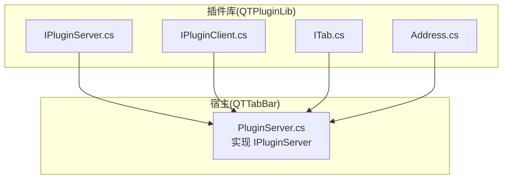
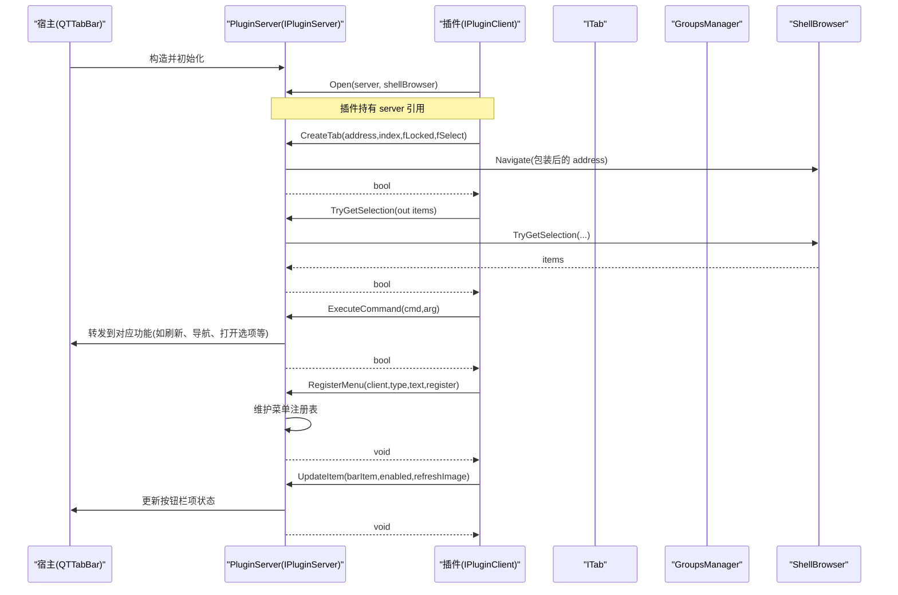
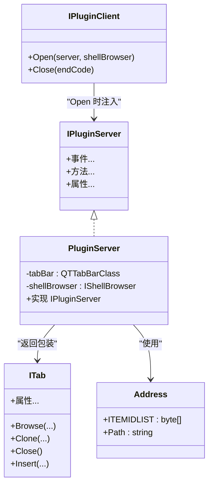

# IPluginServer 接口

<cite>
**本文引用的文件**   
- [IPluginServer.cs](file://QTPluginLib/IPluginServer.cs)
- [PluginServer.cs](file://QTTabBar/PluginServer.cs)
- [IPluginClient.cs](file://QTPluginLib/IPluginClient.cs)
- [ITab.cs](file://QTPluginLib/ITab.cs)
- [Address.cs](file://QTPluginLib/Address.cs)
</cite>

## 目录
1. [简介](#简介)
2. [项目结构](#项目结构)
3. [核心组件](#核心组件)
4. [架构总览](#架构总览)
5. [详细组件分析](#详细组件分析)
6. [依赖关系分析](#依赖关系分析)
7. [性能与线程安全](#性能与线程安全)
8. [故障排查指南](#故障排查指南)
9. [结论](#结论)
10. [附录：API 参考](#附录api-参考)

## 简介
本文件为 QTTabBar 插件体系中的 IPluginServer 接口的权威 API 文档。该接口是宿主（QTTabBar）向插件暴露的核心服务门面，涵盖标签页管理、选择集操作、菜单渲染器访问、分组与应用程序注册、命令执行、本地化字符串获取、错误日志记录等能力。本文面向插件开发者，提供方法语义、参数约定、返回值说明、错误处理策略、实现示例路径以及性能与线程安全建议。

## 项目结构
IPluginServer 定义于插件库工程，具体实现位于宿主工程中；同时涉及 IPluginClient、ITab、Address 等相关类型，共同构成插件与宿主交互的契约层。

图表来源
- [IPluginServer.cs:24-76](file://QTPluginLib/IPluginServer.cs#L24-L76)
- [PluginServer.cs:32-710](file://QTTabBar/PluginServer.cs#L32-L710)
- [IPluginClient.cs:21-30](file://QTPluginLib/IPluginClient.cs#L21-L30)
- [ITab.cs:19-39](file://QTPluginLib/ITab.cs#L19-L39)
- [Address.cs:25-38](file://QTPluginLib/Address.cs#L25-L38)

章节来源
- [IPluginServer.cs:24-76](file://QTPluginLib/IPluginServer.cs#L24-L76)
- [PluginServer.cs:32-710](file://QTTabBar/PluginServer.cs#L32-L710)
- [IPluginClient.cs:21-30](file://QTPluginLib/IPluginClient.cs#L21-L30)
- [ITab.cs:19-39](file://QTPluginLib/ITab.cs#L19-L39)
- [Address.cs:25-38](file://QTPluginLib/Address.cs#L25-L38)

## 核心组件
- IPluginServer：插件服务器接口，定义事件与方法集合，用于控制标签页、选择集、菜单、分组、命令、本地化、错误日志等。
- PluginServer：IPluginServer 的具体实现，封装对 QTTabBarClass 的调用，协调 ShellBrowser、GroupsManager、UI 控件等子系统。
- IPluginClient：插件侧入口，Open 时接收 IPluginServer 实例，用于回调与资源释放。
- ITab：标签页抽象，支持浏览、克隆、关闭、插入、历史/分支查询等。
- Address：地址结构体，包含 IDL 与路径，用于跨进程/跨上下文传递文件系统或命名空间对象引用。

章节来源
- [IPluginServer.cs:24-76](file://QTPluginLib/IPluginServer.cs#L24-L76)
- [PluginServer.cs:32-710](file://QTTabBar/PluginServer.cs#L32-L710)
- [IPluginClient.cs:21-30](file://QTPluginLib/IPluginClient.cs#L21-L30)
- [ITab.cs:19-39](file://QTPluginLib/ITab.cs#L19-L39)
- [Address.cs:25-38](file://QTPluginLib/Address.cs#L25-L38)

## 架构总览
下图展示插件通过 IPluginClient.Open 获得 IPluginServer，并基于其提供的能力进行交互的总体流程。

图表来源
- [PluginServer.cs:56-69](file://QTTabBar/PluginServer.cs#L56-L69)
- [PluginServer.cs:100-125](file://QTTabBar/PluginServer.cs#L100-L125)
- [PluginServer.cs:605-612](file://QTTabBar/PluginServer.cs#L605-L612)
- [PluginServer.cs:152-295](file://QTTabBar/PluginServer.cs#L152-L295)
- [PluginServer.cs:482-502](file://QTTabBar/PluginServer.cs#L482-L502)
- [PluginServer.cs:614-623](file://QTTabBar/PluginServer.cs#L614-L623)

## 详细组件分析

### 事件模型
- ExplorerStateChanged：Explorer 窗口状态变化。
- MenuRendererChanged：菜单渲染器变更。
- MouseEnter/MouseLeave：鼠标进入/离开。
- NavigationComplete：导航完成。
- PointedTabChanged：悬停标签切换。
- SelectionChanged：选择集变化。
- SettingsChanged：设置变更。
- TabAdded/TabChanged/TabRemoved：标签生命周期。

这些事件由 PluginServer 在相应时机触发，插件可订阅以响应 UI 状态变化。

章节来源
- [IPluginServer.cs:25-45](file://QTPluginLib/IPluginServer.cs#L25-L45)
- [PluginServer.cs:44-54](file://QTTabBar/PluginServer.cs#L44-L54)
- [PluginServer.cs:373-438](file://QTTabBar/PluginServer.cs#L373-L438)

### 标签页管理
- CreateTab(Address, int, bool, bool)：创建新标签页，支持指定索引、锁定与选中行为。
- GetTabs()：获取所有标签页的 ITab 数组。
- HitTest(Point)：根据坐标命中测试返回 ITab。
- SelectedTab：获取/设置当前选中标签。

注意：CreateTab 内部会对 Address 进行 IDL 包装与校验，确保有效后再创建 QTabItem 并插入到标签容器。

章节来源
- [IPluginServer.cs:49-56](file://QTPluginLib/IPluginServer.cs#L49-L56)
- [PluginServer.cs:100-125](file://QTTabBar/PluginServer.cs#L100-L125)
- [PluginServer.cs:310-318](file://QTTabBar/PluginServer.cs#L310-L318)
- [PluginServer.cs:685-695](file://QTTabBar/PluginServer.cs#L685-L695)

### 选择集操作
- TryGetSelection(out Address[])：尝试获取当前选择集。
- TrySetSelection(Address[], bool)：设置选择集，可选择是否取消其他选择。

底层委托给 ShellBrowser 的实现，返回布尔值表示成功与否。

章节来源
- [IPluginServer.cs:62-63](file://QTPluginLib/IPluginServer.cs#L62-L63)
- [PluginServer.cs:605-612](file://QTTabBar/PluginServer.cs#L605-L612)

### 菜单与渲染器
- GetMenuRenderer()：获取当前 ToolStripRenderer，用于自定义菜单外观。
- RegisterMenu(IPluginClient, MenuType, string, bool)：按插件客户端与菜单类型注册/注销菜单项文本。

章节来源
- [IPluginServer.cs:54-58](file://QTPluginLib/IPluginServer.cs#L54-L58)
- [PluginServer.cs:306-308](file://QTTabBar/PluginServer.cs#L306-L308)
- [PluginServer.cs:482-502](file://QTTabBar/PluginServer.cs#L482-L502)

### 分组与应用程序
- AddGroup(string, string[]) / RemoveGroup(string)：添加/删除分组。
- GetGroupPaths(string)：获取某分组的路径数组。
- Groups：枚举所有分组名称。
- AddApplication(string, ProcessStartInfo) / RemoveApplication(string) / GetApplications(string)：应用注册相关（当前实现未启用）。

章节来源
- [IPluginServer.cs:47-53](file://QTPluginLib/IPluginServer.cs#L47-L53)
- [PluginServer.cs:75-79](file://QTTabBar/PluginServer.cs#L75-L79)
- [PluginServer.cs:297-304](file://QTTabBar/PluginServer.cs#L297-L304)
- [PluginServer.cs:588-590](file://QTTabBar/PluginServer.cs#L588-L590)
- [PluginServer.cs:667-671](file://QTTabBar/PluginServer.cs#L667-L671)
- [PluginServer.cs:71-73](file://QTTabBar/PluginServer.cs#L71-L73)
- [PluginServer.cs:504-506](file://QTTabBar/PluginServer.cs#L504-L506)

### 命令执行
- ExecuteCommand(Commands, object)：统一命令入口，支持导航、刷新、关闭标签、排序、显示属性、打开选项对话框等。

章节来源
- [IPluginServer.cs:51](file://QTPluginLib/IPluginServer.cs#L51)
- [PluginServer.cs:152-295](file://QTTabBar/PluginServer.cs#L152-L295)

### 本地化字符串
- TryGetLocalizedStrings(IPluginClient, int, out string[])：根据插件类型全名与请求数量，返回本地化字符串数组。

章节来源
- [IPluginServer.cs:61](file://QTPluginLib/IPluginServer.cs#L61)
- [PluginServer.cs:592-599](file://QTTabBar/PluginServer.cs#L592-L599)

### 错误日志
- MakeErrorLog(Exception, string?)：将异常写入错误日志，可选附加信息。

章节来源
- [IPluginServer.cs:65](file://QTPluginLib/IPluginServer.cs#L65)
- [PluginServer.cs:446-449](file://QTTabBar/PluginServer.cs#L446-L449)

### 窗口句柄与配置
- ExplorerHandle / Handle：分别返回 Explorer 主窗口句柄与当前标签条窗口句柄。
- TabBarOption：读写标签栏选项（通过宿主工具类读取/设置）。

章节来源
- [IPluginServer.cs:67-75](file://QTPluginLib/IPluginServer.cs#L67-L75)
- [PluginServer.cs:657-677](file://QTTabBar/PluginServer.cs#L657-L677)
- [PluginServer.cs:703-710](file://QTTabBar/PluginServer.cs#L703-L710)

### 按钮栏项更新
- UpdateItem(IBarButton, bool, bool)：更新按钮栏中某个插件项的可用性与图像刷新。

章节来源
- [IPluginServer.cs:64](file://QTPluginLib/IPluginServer.cs#L64)
- [PluginServer.cs:614-623](file://QTTabBar/PluginServer.cs#L614-L623)

### 窗口与组操作
- CreateWindow(Address)：在新窗口中打开指定地址。
- OpenGroup(string[])：打开一组分组对应的标签。

章节来源
- [IPluginServer.cs:50-57](file://QTPluginLib/IPluginServer.cs#L50-L57)
- [PluginServer.cs:127-135](file://QTTabBar/PluginServer.cs#L127-L135)
- [PluginServer.cs:440-444](file://QTTabBar/PluginServer.cs#L440-L444)

### ITab 能力概览
- Browse(Address)/Browse(bool)：导航前进/后退。
- Clone(int,bool)/Close()/Insert(int)：复制、关闭、移动标签。
- GetHistory(bool)/GetBraches()：获取历史与分支。
- Text/SubText/Locked/Selected/Index/Address：标签元数据与状态。

章节来源
- [ITab.cs:19-39](file://QTPluginLib/ITab.cs#L19-L39)
- [PluginServer.cs:712-800](file://QTTabBar/PluginServer.cs#L712-L800)

### Address 结构
- 包含 ITEMIDLIST 与 Path，支持从 IntPtr 或字符串构造，便于在不同上下文中传递目标位置。

章节来源
- [Address.cs:25-38](file://QTPluginLib/Address.cs#L25-L38)

## 依赖关系分析
- IPluginServer 被 PluginServer 实现，并通过 QTTabBarClass 访问 ShellBrowser、标签控件、按钮栏等。
- IPluginClient 在 Open 时接收 IPluginServer 与 IShellBrowser，作为插件侧入口。
- ITab 由 PluginServer.TabWrapper 实现，封装对 QTabItem 的操作。
- Address 作为轻量数据结构，贯穿选择集、导航、历史记录等场景。

图表来源
- [IPluginServer.cs:24-76](file://QTPluginLib/IPluginServer.cs#L24-L76)
- [PluginServer.cs:32-710](file://QTTabBar/PluginServer.cs#L32-L710)
- [IPluginClient.cs:21-30](file://QTPluginLib/IPluginClient.cs#L21-L30)
- [ITab.cs:19-39](file://QTPluginLib/ITab.cs#L19-L39)
- [Address.cs:25-38](file://QTPluginLib/Address.cs#L25-L38)

章节来源
- [IPluginServer.cs:24-76](file://QTPluginLib/IPluginServer.cs#L24-L76)
- [PluginServer.cs:32-710](file://QTTabBar/PluginServer.cs#L32-L710)
- [IPluginClient.cs:21-30](file://QTPluginLib/IPluginClient.cs#L21-L30)
- [ITab.cs:19-39](file://QTPluginLib/ITab.cs#L19-L39)
- [Address.cs:25-38](file://QTPluginLib/Address.cs#L25-L38)

## 性能与线程安全
- 批量操作优先：尽量合并多次选择集更新，减少 UI 重绘次数。
- 避免阻塞 UI 线程：耗时任务（如大量文件遍历、计算哈希）应异步执行，完成后通过 Invoke 回到 UI 线程更新界面。
- 事件订阅清理：在插件卸载或窗口关闭时及时移除事件订阅，防止内存泄漏。
- 句柄有效性检查：访问 Handle/ExplorerHandle 前确认宿主窗口已创建，避免空指针。
- 选择集与导航：TryGetSelection/TrySetSelection 与 CreateTab/Browse 均可能受 Explorer 状态影响，需检查返回值并在失败时降级处理。
- 本地化字符串：TryGetLocalizedStrings 要求 count 与实际数组长度一致，否则返回 false，插件应做好容错。

[本节为通用指导，不直接分析具体文件]

## 故障排查指南
- 常见错误定位：使用 MakeErrorLog 记录异常与可选上下文信息，便于问题复现与根因分析。
- 事件未触发：检查是否正确订阅事件，以及在插件卸载时是否清理事件。
- 选择集为空：确认当前视图存在且可获取选择集；必要时先导航到有效路径再操作。
- 菜单未显示：确认 RegisterMenu 的 menuType 与 menuText 正确，且在插件生命周期内保持注册。
- 按钮项未更新：UpdateItem 需要有效的 barItem 标识，确保插件项已被按钮栏识别。

章节来源
- [PluginServer.cs:446-449](file://QTTabBar/PluginServer.cs#L446-L449)
- [PluginServer.cs:482-502](file://QTTabBar/PluginServer.cs#L482-L502)
- [PluginServer.cs:614-623](file://QTTabBar/PluginServer.cs#L614-L623)

## 结论
IPluginServer 为插件提供了与 QTTabBar 宿主交互的统一通道，覆盖标签页、选择集、菜单、分组、命令、本地化与错误日志等关键能力。插件开发者应遵循参数与返回值约定，妥善处理错误与线程边界，以获得稳定高效的体验。

[本节为总结性内容，不直接分析具体文件]

## 附录：API 参考

### 方法与属性速览
- 事件
  - ExplorerStateChanged、MenuRendererChanged、MouseEnter、MouseLeave、NavigationComplete、PointedTabChanged、SelectionChanged、SettingsChanged、TabAdded、TabChanged、TabRemoved
- 方法
  - AddApplication(name, startInfo) → bool
  - AddGroup(groupName, paths) → bool
  - CreateTab(address, index, fLocked, fSelect) → bool
  - CreateWindow(address) → bool
  - ExecuteCommand(command, arg) → bool
  - GetApplications(name) → ProcessStartInfo[]
  - GetGroupPaths(groupName) → string[]
  - GetMenuRenderer() → ToolStripRenderer
  - GetTabs() → ITab[]
  - HitTest(pnt) → ITab
  - OpenGroup(groupNames) → void
  - RegisterMenu(pluginClient, menuType, menuText, fRegister) → void
  - RemoveApplication(name) → bool
  - RemoveGroup(groupName) → bool
  - TryGetLocalizedStrings(pluginClient, count, out arrStrings) → bool
  - TryGetSelection(out selectedItems) → bool
  - TrySetSelection(itemsToSelect, fDeselectOthers) → bool
  - UpdateItem(barItem, fEnabled, fRefreshImage) → void
  - MakeErrorLog(ex, optional) → void
- 属性
  - ExplorerHandle : IntPtr
  - Groups : string[]
  - Handle : IntPtr
  - SelectedTab : ITab
  - TabBarOption : TabBarOption

章节来源
- [IPluginServer.cs:24-76](file://QTPluginLib/IPluginServer.cs#L24-L76)
- [PluginServer.cs:71-79](file://QTTabBar/PluginServer.cs#L71-L79)
- [PluginServer.cs:100-135](file://QTTabBar/PluginServer.cs#L100-L135)
- [PluginServer.cs:152-295](file://QTTabBar/PluginServer.cs#L152-L295)
- [PluginServer.cs:297-308](file://QTTabBar/PluginServer.cs#L297-L308)
- [PluginServer.cs:310-318](file://QTTabBar/PluginServer.cs#L310-L318)
- [PluginServer.cs:440-449](file://QTTabBar/PluginServer.cs#L440-L449)
- [PluginServer.cs:482-506](file://QTTabBar/PluginServer.cs#L482-L506)
- [PluginServer.cs:588-612](file://QTTabBar/PluginServer.cs#L588-L612)
- [PluginServer.cs:614-623](file://QTTabBar/PluginServer.cs#L614-L623)
- [PluginServer.cs:657-710](file://QTTabBar/PluginServer.cs#L657-L710)

### 典型用法示例（路径指引）
- 创建标签页并导航
  - 参考路径：[PluginServer.cs:100-125](file://QTTabBar/PluginServer.cs#L100-L125)
- 获取与设置选择集
  - 参考路径：[PluginServer.cs:605-612](file://QTTabBar/PluginServer.cs#L605-L612)
- 执行内置命令（如刷新、打开属性）
  - 参考路径：[PluginServer.cs:152-295](file://QTTabBar/PluginServer.cs#L152-L295)
- 注册菜单项
  - 参考路径：[PluginServer.cs:482-502](file://QTTabBar/PluginServer.cs#L482-L502)
- 更新按钮栏项状态
  - 参考路径：[PluginServer.cs:614-623](file://QTTabBar/PluginServer.cs#L614-L623)
- 记录错误日志
  - 参考路径：[PluginServer.cs:446-449](file://QTTabBar/PluginServer.cs#L446-L449)

[本节为示例路径指引，不包含代码片段]