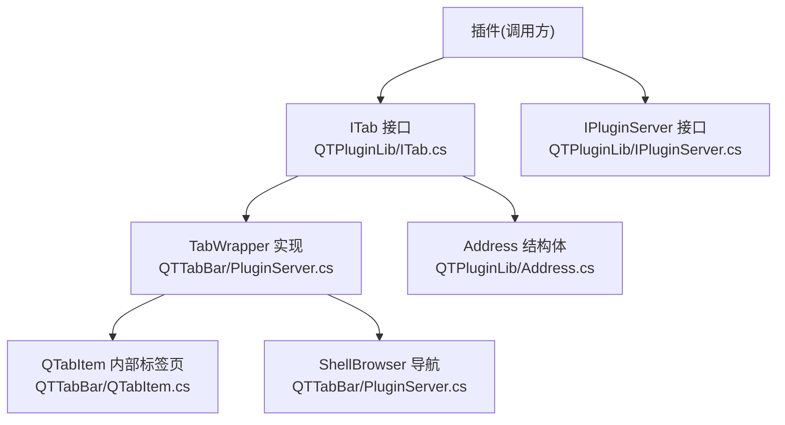
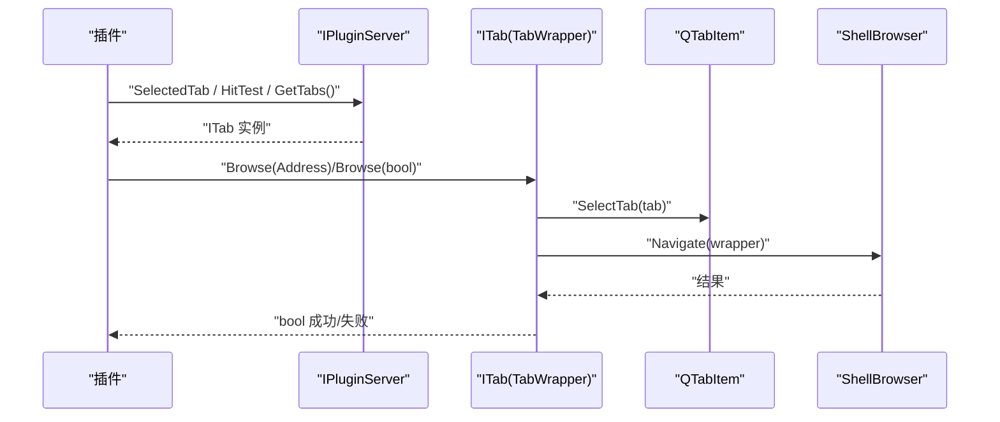
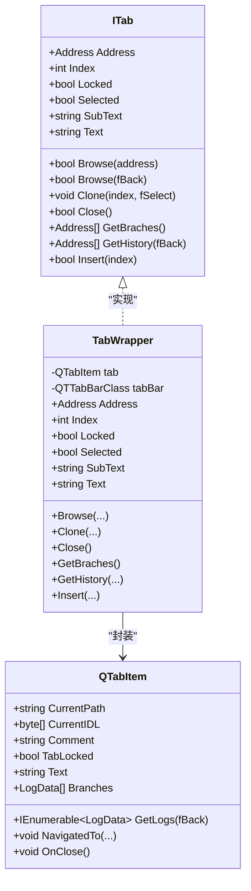
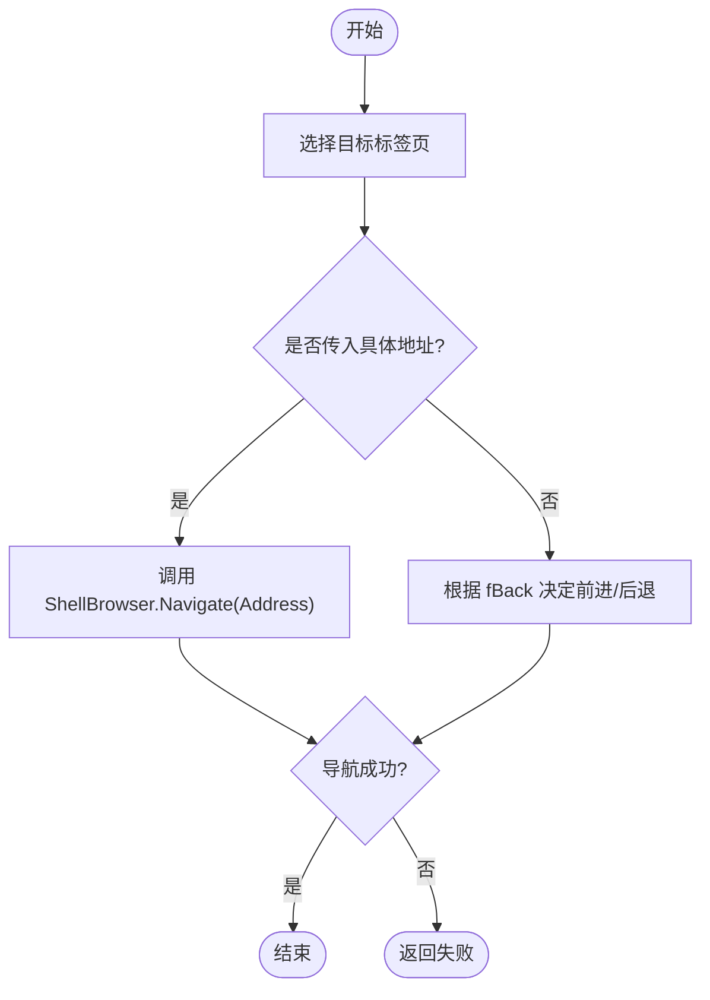
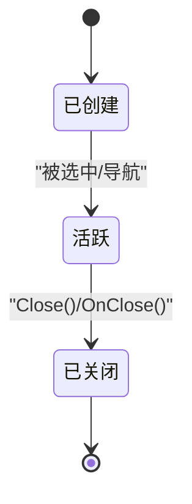
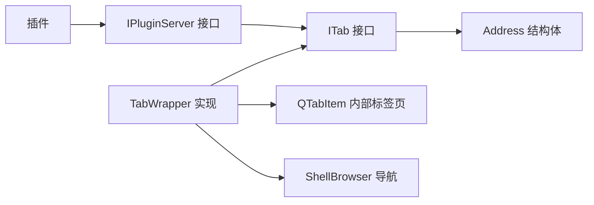

# ITab 接口

<cite>
**本文引用的文件**   
- [ITab.cs](file://QTPluginLib/ITab.cs)
- [Address.cs](file://QTPluginLib/Address.cs)
- [PluginServer.cs](file://QTTabBar/PluginServer.cs)
- [QTabItem.cs](file://QTTabBar/QTabItem.cs)
- [IPluginServer.cs](file://QTPluginLib/IPluginServer.cs)
- [TurnOffRepeat.cs](file://Plugins/TurnOffRepeat/TurnOffRepeat.cs)
</cite>

## 目录
1. [简介](#简介)
2. [项目结构](#项目结构)
3. [核心组件](#核心组件)
4. [架构总览](#架构总览)
5. [详细组件分析](#详细组件分析)
6. [依赖关系分析](#依赖关系分析)
7. [性能与内存管理](#性能与内存管理)
8. [故障排查指南](#故障排查指南)
9. [结论](#结论)
10. [附录：API 参考与示例](#附录api-参考与示例)

## 简介
本文件为 ITab 接口的权威 API 文档，面向插件开发者与二次集成者。内容覆盖标签页对象模型的所有属性与方法、生命周期管理、与 Shell 浏览器的集成方式、数据绑定机制、事件处理、常见操作示例以及状态同步、内存管理与性能优化最佳实践。

## 项目结构
围绕 ITab 的核心代码分布在以下位置：
- 接口定义：QTPluginLib/ITab.cs
- 地址数据结构：QTPluginLib/Address.cs
- 对外暴露的包装实现（供插件使用）：QTTabBar/PluginServer.cs 中的 TabWrapper
- 内部标签页实体：QTTabBar/QTabItem.cs
- 插件服务器对外能力（含 SelectedTab、HitTest 等）：QTPluginLib/IPluginServer.cs
- 插件侧使用示例：Plugins/TurnOffRepeat/TurnOffRepeat.cs

图表来源
- [ITab.cs:19-39](file://QTPluginLib/ITab.cs#L19-L39)
- [PluginServer.cs:712-874](file://QTTabBar/PluginServer.cs#L712-L874)
- [QTabItem.cs:30-443](file://QTTabBar/QTabItem.cs#L30-L443)
- [Address.cs:23-39](file://QTPluginLib/Address.cs#L23-L39)
- [IPluginServer.cs:56-73](file://QTPluginLib/IPluginServer.cs#L56-L73)

章节来源
- [ITab.cs:19-39](file://QTPluginLib/ITab.cs#L19-L39)
- [PluginServer.cs:712-874](file://QTTabBar/PluginServer.cs#L712-L874)
- [QTabItem.cs:30-443](file://QTTabBar/QTabItem.cs#L30-L443)
- [Address.cs:23-39](file://QTPluginLib/Address.cs#L23-L39)
- [IPluginServer.cs:56-73](file://QTPluginLib/IPluginServer.cs#L56-L73)

## 核心组件
- ITab 接口：提供对单个标签页的访问与操作能力，包括导航、克隆、关闭、插入、历史与分支读取，以及标识、标题、副标题、选中与锁定等属性。
- Address 结构体：表示一个可导航的地址，包含 ITEMIDLIST 与 Path 两种形式，用于跨进程/插件边界传递。
- TabWrapper：将内部 QTabItem 封装为 ITab 暴露给插件，负责与 Shell 浏览器交互、选择标签、更新 UI 等。
- QTabItem：内部标签页实体，维护当前路径、历史栈、分支、文本、锁定状态、子文本等。

章节来源
- [ITab.cs:19-39](file://QTPluginLib/ITab.cs#L19-L39)
- [Address.cs:23-39](file://QTPluginLib/Address.cs#L23-L39)
- [PluginServer.cs:712-874](file://QTTabBar/PluginServer.cs#L712-L874)
- [QTabItem.cs:30-443](file://QTTabBar/QTabItem.cs#L30-L443)

## 架构总览
ITab 作为插件与宿主之间的契约，通过 TabWrapper 桥接到内部 QTabItem 与 Shell 浏览器。插件通过 IPluginServer 获取 ITab 实例并执行操作；TabWrapper 在需要时选择目标标签页、调用 ShellBrowser 进行导航或刷新界面。

图表来源
- [IPluginServer.cs:56-73](file://QTPluginLib/IPluginServer.cs#L56-L73)
- [PluginServer.cs:685-695](file://QTTabBar/PluginServer.cs#L685-L695)
- [PluginServer.cs:315-318](file://QTTabBar/PluginServer.cs#L315-L318)
- [PluginServer.cs:722-738](file://QTTabBar/PluginServer.cs#L722-L738)

## 详细组件分析

### ITab 接口成员详解
- 导航与历史
  - Browse(Address address)：导航到指定地址。返回布尔值表示是否成功。
  - Browse(bool fBack)：在当前标签页的历史中后退或前进（由参数控制方向）。返回布尔值表示是否成功。
  - GetHistory(bool fBack)：获取历史列表（按方向），返回 Address[]。
  - GetBraches()：获取分支列表（非当前主链的路径集合），返回 Address[]。
- 标签页管理
  - Clone(int index, bool fSelect)：克隆当前标签页到指定索引，可选择是否选中。
  - Insert(int index)：将当前标签页移动到指定索引位置。
  - Close()：关闭当前标签页（至少保留一个标签页）。
- 标识与显示
  - Address：只读属性，返回当前标签页的地址（可能从路径反解析出 IDL）。
  - Index：只读属性，返回当前标签页在容器中的索引。
  - Text：设置/获取标签页标题。
  - SubText：设置/获取标签页副标题（注释/子文本）。
- 状态
  - Locked：设置/获取标签页是否锁定（锁定后通常不可关闭或移动）。
  - Selected：设置/获取标签页是否被选中。

章节来源
- [ITab.cs:19-39](file://QTPluginLib/ITab.cs#L19-L39)
- [PluginServer.cs:722-874](file://QTTabBar/PluginServer.cs#L722-L874)

### Address 结构体
- 字段
  - ITEMIDLIST：字节数组形式的 PIDL，指向 Shell 命名空间项。
  - Path：字符串路径。
- 构造器
  - 支持从 IntPtr(pidl)、Path 或两者组合创建。
- 用途
  - 在插件与宿主之间传递地址信息，兼容 Shell 与文件系统路径。

章节来源
- [Address.cs:23-39](file://QTPluginLib/Address.cs#L23-L39)

### TabWrapper 实现要点
- 导航
  - 先选择目标标签页，再调用 ShellBrowser.Navigate 完成导航。
- 历史与分支
  - 基于 QTabItem 的内部历史栈与分支集合，转换为 Address[] 返回。
- 插入与重排
  - 通过 TabControl 的页面集合进行重定位。
- 关闭
  - 确保至少保留一个标签页，再调用关闭逻辑。
- 属性映射
  - Address：若仅有 Path，尝试从路径生成 IDL 或从缓存获取。
  - Index：查询所在容器中的索引。
  - Locked/Selected/Text/SubText：映射到 QTabItem 对应属性，必要时触发刷新。

图表来源
- [ITab.cs:19-39](file://QTPluginLib/ITab.cs#L19-L39)
- [PluginServer.cs:712-874](file://QTTabBar/PluginServer.cs#L712-L874)
- [QTabItem.cs:30-443](file://QTTabBar/QTabItem.cs#L30-L443)

章节来源
- [PluginServer.cs:712-874](file://QTTabBar/PluginServer.cs#L712-L874)
- [QTabItem.cs:30-443](file://QTTabBar/QTabItem.cs#L30-L443)

### 与 Shell 浏览器的集成
- 导航入口：TabWrapper.Browse(Address) 通过 ShellBrowser.Navigate 驱动 Explorer 视图更新。
- 历史与分支：QTabItem.NavigatedTo 维护历史栈与分支集合，供 GetHistory/GetBraches 使用。
- 选中与切换：通过 TabControl.SelectTab 切换活动标签页，保证后续导航作用于正确上下文。

图表来源
- [PluginServer.cs:722-738](file://QTTabBar/PluginServer.cs#L722-L738)
- [QTabItem.cs:371-390](file://QTTabBar/QTabItem.cs#L371-L390)

章节来源
- [PluginServer.cs:722-738](file://QTTabBar/PluginServer.cs#L722-L738)
- [QTabItem.cs:371-390](file://QTTabBar/QTabItem.cs#L371-L390)

### 数据绑定与显示
- 标题与副标题
  - Text/SubText 直接映射到 QTabItem.Text/Comment，并在变更后触发界面刷新。
- 锁定状态
  - Locked 映射到 QTabItem.TabLocked，影响绘制与交互行为。
- 选中状态
  - Selected 设置为 true 时，会主动选择该标签页。

章节来源
- [PluginServer.cs:819-873](file://QTTabBar/PluginServer.cs#L819-L873)
- [QTabItem.cs:104-128](file://QTTabBar/QTabItem.cs#L104-L128)

### 事件与生命周期
- 关闭事件
  - QTabItem.OnClose 触发 Closed 事件，TabWrapper 订阅并在关闭后释放引用，避免悬挂指针。
- 生命周期阶段
  - 创建：通过宿主创建 QTabItem 并封装为 ITab。
  - 活跃：用户交互与导航期间保持有效。
  - 关闭：触发事件并清理资源。

图表来源
- [PluginServer.cs:778-782](file://QTTabBar/PluginServer.cs#L778-L782)
- [QTabItem.cs:392-398](file://QTTabBar/QTabItem.cs#L392-L398)

章节来源
- [PluginServer.cs:778-782](file://QTTabBar/PluginServer.cs#L778-L782)
- [QTabItem.cs:392-398](file://QTTabBar/QTabItem.cs#L392-L398)

## 依赖关系分析
- ITab 仅依赖 Address 作为数据载体，不直接耦合 Shell 细节。
- TabWrapper 同时依赖 QTabItem 与 ShellBrowser，承担适配职责。
- 插件通过 IPluginServer 间接访问 ITab，降低耦合度。

图表来源
- [ITab.cs:19-39](file://QTPluginLib/ITab.cs#L19-L39)
- [Address.cs:23-39](file://QTPluginLib/Address.cs#L23-L39)
- [PluginServer.cs:712-874](file://QTTabBar/PluginServer.cs#L712-L874)
- [IPluginServer.cs:56-73](file://QTPluginLib/IPluginServer.cs#L56-L73)

章节来源
- [ITab.cs:19-39](file://QTPluginLib/ITab.cs#L19-L39)
- [PluginServer.cs:712-874](file://QTTabBar/PluginServer.cs#L712-L874)
- [IPluginServer.cs:56-73](file://QTPluginLib/IPluginServer.cs#L56-L73)

## 性能与内存管理
- 导航与刷新
  - 频繁设置 Text/SubText/Locked 会触发界面刷新，建议批量修改后再统一刷新。
- 地址解析
  - Address 属性可能在无 IDL 时尝试从路径生成或缓存查找，应避免在热路径中反复调用。
- 历史与分支
  - GetHistory/GetBraches 返回新数组，注意在大列表场景下减少重复调用。
- 关闭与释放
  - TabWrapper 在标签页关闭后清空引用，防止悬挂引用导致内存泄漏。

[本节为通用指导，无需源码引用]

## 故障排查指南
- 导航失败
  - 检查传入的 Address 是否有效（Path 是否为空、PIDL 是否正确）。
  - 确认目标标签页存在且未被销毁。
- 关闭异常
  - 确保标签页数量大于 1，否则 Close 可能返回失败。
- 状态不同步
  - 设置 Selected 后需等待 UI 线程完成选择；必要时延迟再次操作。
- 历史/分支为空
  - 确认标签页已完成过导航，历史栈才会填充。

章节来源
- [PluginServer.cs:746-776](file://QTTabBar/PluginServer.cs#L746-L776)
- [PluginServer.cs:784-807](file://QTTabBar/PluginServer.cs#L784-L807)

## 结论
ITab 提供了稳定、简洁的标签页操作契约，结合 Address 的数据承载与 TabWrapper 的适配实现，使插件能够以低耦合的方式与宿主及 Shell 浏览器协作。遵循本文的最佳实践，可在保证功能完整性的同时提升性能与稳定性。

[本节为总结性内容，无需源码引用]

## 附录：API 参考与示例

### API 速查表
- 导航
  - Browse(Address): 跳转到指定地址
  - Browse(bool): 历史前进/后退
- 管理
  - Clone(int, bool): 克隆到新位置并可选中
  - Insert(int): 移动到指定索引
  - Close(): 关闭当前标签页
- 数据
  - Address: 当前地址（只读）
  - Index: 当前索引（只读）
  - Text/SubText: 标题/副标题
  - Locked/Selected: 锁定/选中状态
- 历史与分支
  - GetHistory(bool): 历史列表
  - GetBraches(): 分支列表

章节来源
- [ITab.cs:19-39](file://QTPluginLib/ITab.cs#L19-L39)

### 常见操作示例（步骤说明）
- 创建新标签页
  - 通过宿主提供的工厂或命令创建 QTabItem，并由宿主封装为 ITab 返回。
  - 初始化 Text、SubText、Locked 等属性。
  - 调用 Browse(Address) 导航到初始路径。
- 切换标签页
  - 获取目标 ITab 实例，设置 Selected = true。
- 关闭标签页
  - 调用 Close()，并确保仍有其他标签页存在。
- 排序与去重（参考插件示例）
  - 遍历所有 ITab，比较 Address.Path 去重，必要时调用 Close()。
  - 根据 Text 排序，调用 Insert(idx) 调整顺序。

章节来源
- [TurnOffRepeat.cs:88-117](file://Plugins/TurnOffRepeat/TurnOffRepeat.cs#L88-L117)
- [TurnOffRepeat.cs:210-259](file://Plugins/TurnOffRepeat/TurnOffRepeat.cs#L210-L259)