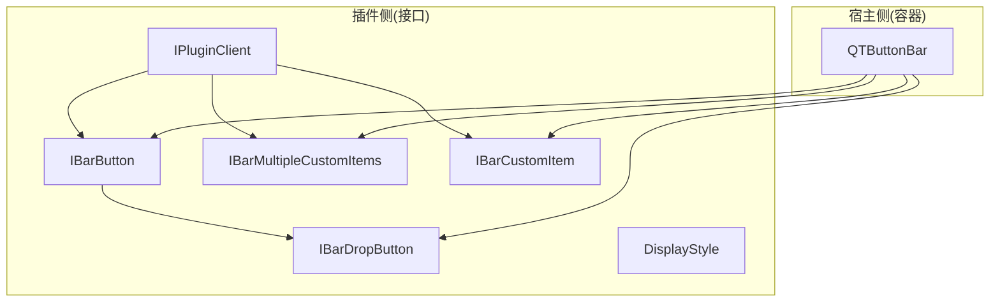
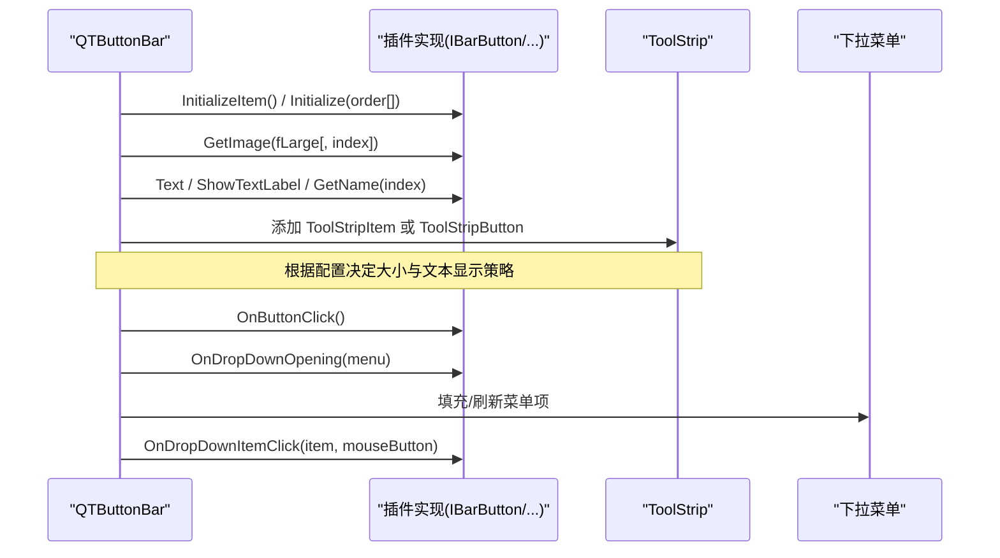
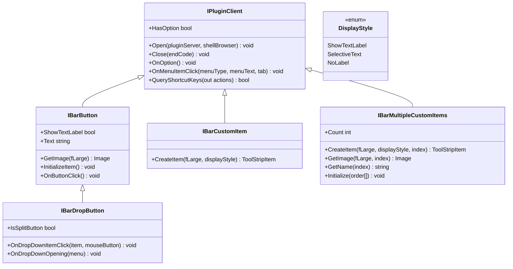
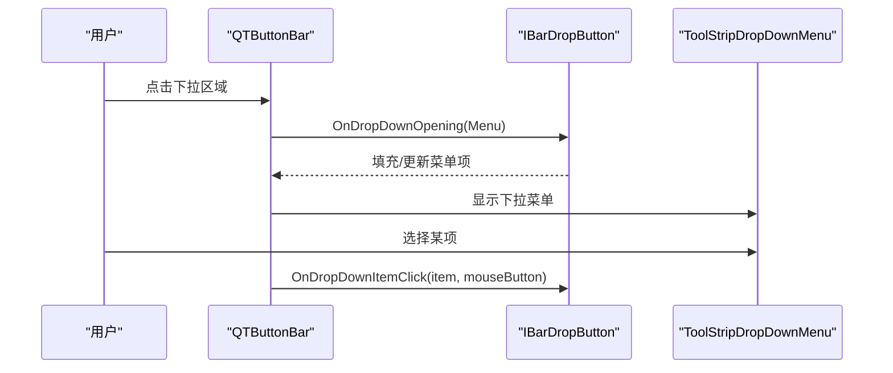
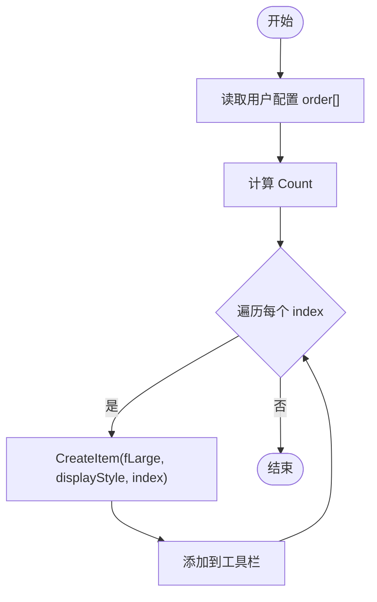
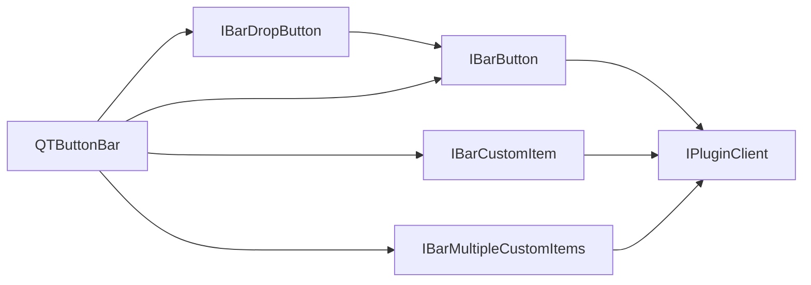

# UI 组件接口

<cite>
**本文引用的文件**   
- [IBarButton.cs](file://QTPluginLib/IBarButton.cs)
- [IBarCustomItem.cs](file://QTPluginLib/IBarCustomItem.cs)
- [IBarDropButton.cs](file://QTPluginLib/IBarDropButton.cs)
- [IBarMultipleCustomItems.cs](file://QTPluginLib/IBarMultipleCustomItems.cs)
- [IPluginClient.cs](file://QTPluginLib/IPluginClient.cs)
- [DisplayStyle.cs](file://QTPluginLib/DisplayStyle.cs)
- [QTButtonBar.cs](file://QTTabBar/QTButtonBar.cs)
</cite>

## 目录
1. [简介](#简介)
2. [项目结构](#项目结构)
3. [核心组件](#核心组件)
4. [架构总览](#架构总览)
5. [详细组件分析](#详细组件分析)
6. [依赖关系分析](#依赖关系分析)
7. [性能与资源管理](#性能与资源管理)
8. [跨平台与兼容性](#跨平台与兼容性)
9. [使用示例与最佳实践](#使用示例与最佳实践)
10. [故障排查](#故障排查)
11. [结论](#结论)

## 简介
本文件面向插件开发者，系统化梳理按钮栏相关 UI 组件接口的设计与用法，覆盖基础按钮、自定义控件、下拉按钮以及多项目集合等场景。文档重点说明：
- 图标设置、文本显示、事件处理、样式定制
- 静态按钮、动态生成按钮、带子菜单的按钮等典型场景
- 性能优化、资源管理与跨平台兼容性建议

## 项目结构
与按钮栏接口相关的代码主要分布在两个位置：
- 接口定义位于 QTPluginLib 命名空间下，供插件实现
- 宿主容器在 QTTabBar 中提供运行时承载与渲染（ToolStrip 体系）

图表来源
- [IBarButton.cs:21-29](file://QTPluginLib/IBarButton.cs#L21-L29)
- [IBarDropButton.cs:21-26](file://QTPluginLib/IBarDropButton.cs#L21-L26)
- [IBarCustomItem.cs:21-23](file://QTPluginLib/IBarCustomItem.cs#L21-L23)
- [IBarMultipleCustomItems.cs:22-29](file://QTPluginLib/IBarMultipleCustomItems.cs#L22-L29)
- [IPluginClient.cs:21-30](file://QTPluginLib/IPluginClient.cs#L21-L30)
- [DisplayStyle.cs:19-23](file://QTPluginLib/DisplayStyle.cs#L19-L23)
- [QTButtonBar.cs:351-400](file://QTTabBar/QTButtonBar.cs#L351-L400)

章节来源
- [IBarButton.cs:21-29](file://QTPluginLib/IBarButton.cs#L21-L29)
- [IBarDropButton.cs:21-26](file://QTPluginLib/IBarDropButton.cs#L21-L26)
- [IBarCustomItem.cs:21-23](file://QTPluginLib/IBarCustomItem.cs#L21-L23)
- [IBarMultipleCustomItems.cs:22-29](file://QTPluginLib/IBarMultipleCustomItems.cs#L22-L29)
- [IPluginClient.cs:21-30](file://QTPluginLib/IPluginClient.cs#L21-L30)
- [DisplayStyle.cs:19-23](file://QTPluginLib/DisplayStyle.cs#L19-L23)
- [QTButtonBar.cs:351-400](file://QTTabBar/QTButtonBar.cs#L351-L400)

## 核心组件
本节对四类核心接口进行逐一说明，并给出关键方法与属性的职责概述。

- IBarButton（基础按钮）
  - 作用：定义一个可出现在按钮栏中的标准按钮
  - 关键成员
    - GetImage(fLarge): 返回按钮图标（大/小尺寸）
    - InitializeItem(): 初始化按钮状态或缓存数据
    - OnButtonClick(): 响应点击事件
    - ShowTextLabel: 是否显示文本标签
    - Text: 按钮文本
  - 继承自 IPluginClient，具备插件生命周期与快捷键能力

- IBarDropButton（下拉按钮）
  - 作用：在 IBarButton 基础上扩展为下拉/拆分按钮
  - 关键成员
    - OnDropDownItemClick(item, mouseButton): 下拉项点击回调
    - OnDropDownOpening(menu): 下拉菜单即将打开时的钩子，用于填充/刷新菜单
    - IsSplitButton: 是否为拆分按钮（主按钮+下拉箭头）

- IBarCustomItem（自定义控件）
  - 作用：允许以任意 ToolStripItem 形式嵌入按钮栏
  - 关键成员
    - CreateItem(fLarge, displayStyle): 创建具体 ToolStripItem 实例

- IBarMultipleCustomItems（多项目集合）
  - 作用：一次性提供多个按钮/项目，支持排序与批量初始化
  - 关键成员
    - CreateItem(fLarge, displayStyle, index): 按索引创建项目
    - GetImage(fLarge, index): 按索引获取图标
    - GetName(index): 按索引获取名称
    - Initialize(order[]): 接收用户配置的顺序数组
    - Count: 项目总数

- IPluginClient（插件基座）
  - 作用：所有按钮/自定义项目的统一入口，提供与宿主通信的能力
  - 关键成员
    - Open(pluginServer, shellBrowser): 注入宿主服务
    - Close(endCode): 释放资源
    - OnOption()/OnMenuItemClick()/QueryShortcutKeys() 等

- DisplayStyle（显示风格）
  - 枚举值：ShowTextLabel、SelectiveText、NoLabel
  - 用于控制文本显示策略，配合 IBarCustomItem.CreateItem 使用

章节来源
- [IBarButton.cs:21-29](file://QTPluginLib/IBarButton.cs#L21-L29)
- [IBarDropButton.cs:21-26](file://QTPluginLib/IBarDropButton.cs#L21-L26)
- [IBarCustomItem.cs:21-23](file://QTPluginLib/IBarCustomItem.cs#L21-L23)
- [IBarMultipleCustomItems.cs:22-29](file://QTPluginLib/IBarMultipleCustomItems.cs#L22-L29)
- [IPluginClient.cs:21-30](file://QTPluginLib/IPluginClient.cs#L21-L30)
- [DisplayStyle.cs:19-23](file://QTPluginLib/DisplayStyle.cs#L19-L23)

## 架构总览
下图展示宿主如何消费这些接口，将插件提供的按钮/自定义控件渲染到工具栏中。

图表来源
- [QTButtonBar.cs:351-400](file://QTTabBar/QTButtonBar.cs#L351-L400)
- [IBarButton.cs:21-29](file://QTPluginLib/IBarButton.cs#L21-L29)
- [IBarDropButton.cs:21-26](file://QTPluginLib/IBarDropButton.cs#L21-L26)
- [IBarMultipleCustomItems.cs:22-29](file://QTPluginLib/IBarMultipleCustomItems.cs#L22-L29)

## 详细组件分析

### 类与接口关系图

图表来源
- [IPluginClient.cs:21-30](file://QTPluginLib/IPluginClient.cs#L21-L30)
- [IBarButton.cs:21-29](file://QTPluginLib/IBarButton.cs#L21-L29)
- [IBarDropButton.cs:21-26](file://QTPluginLib/IBarDropButton.cs#L21-L26)
- [IBarCustomItem.cs:21-23](file://QTPluginLib/IBarCustomItem.cs#L21-L23)
- [IBarMultipleCustomItems.cs:22-29](file://QTPluginLib/IBarMultipleCustomItems.cs#L22-L29)
- [DisplayStyle.cs:19-23](file://QTPluginLib/DisplayStyle.cs#L19-L23)

### 下拉按钮交互时序

图表来源
- [IBarDropButton.cs:21-26](file://QTPluginLib/IBarDropButton.cs#L21-L26)
- [QTButtonBar.cs:351-400](file://QTTabBar/QTButtonBar.cs#L351-L400)

### 多项目初始化流程

图表来源
- [IBarMultipleCustomItems.cs:22-29](file://QTPluginLib/IBarMultipleCustomItems.cs#L22-L29)
- [QTButtonBar.cs:351-400](file://QTTabBar/QTButtonBar.cs#L351-L400)

## 依赖关系分析
- 耦合性
  - 宿主 QTButtonBar 通过接口解耦插件实现，仅依赖抽象契约
  - IBarDropButton 依赖 IBarButton，形成清晰的层次
- 外部依赖
  - System.Drawing.Image、System.Windows.Forms.ToolStripItem 等
  - 宿主内部使用 ToolStrip 系列控件承载 UI
- 可能的循环依赖
  - 当前接口层无循环引用；注意避免在插件中反向强引用宿主具体类型

图表来源
- [IBarButton.cs:21-29](file://QTPluginLib/IBarButton.cs#L21-L29)
- [IBarDropButton.cs:21-26](file://QTPluginLib/IBarDropButton.cs#L21-L26)
- [IBarCustomItem.cs:21-23](file://QTPluginLib/IBarCustomItem.cs#L21-L23)
- [IBarMultipleCustomItems.cs:22-29](file://QTPluginLib/IBarMultipleCustomItems.cs#L22-L29)
- [IPluginClient.cs:21-30](file://QTPluginLib/IPluginClient.cs#L21-L30)
- [QTButtonBar.cs:351-400](file://QTTabBar/QTButtonBar.cs#L351-L400)

## 性能与资源管理
- 图像资源
  - 优先复用 Image 对象，避免频繁创建/销毁
  - 为大/小按钮分别缓存图像，减少重复绘制
- 列表与菜单
  - 下拉菜单按需填充，避免在构造时构建大量节点
  - 使用延迟加载与虚拟化思路，仅在可见范围内创建控件
- 线程与 UI
  - 所有 UI 操作应在 UI 线程执行，避免跨线程访问
- 内存与句柄
  - 及时 Dispose ToolStripItem、Image、菜单项等资源
  - 关闭时清理 COM 指针与非托管资源

章节来源
- [QTButtonBar.cs:200-234](file://QTTabBar/QTButtonBar.cs#L200-L234)

## 跨平台与兼容性
- 运行环境
  - 基于 Windows Forms 与 System.Drawing，目标为 Windows 桌面环境
- DPI 与缩放
  - 宿主已区分大/小按钮尺寸，插件应同时提供两套图标
- 主题与样式
  - 遵循系统视觉样式，避免硬编码颜色；必要时参考宿主配色策略

[本节为通用指导，不直接分析具体文件]

## 使用示例与最佳实践
以下为常见场景的实现要点与步骤指引（不包含具体代码内容，请结合接口定义自行实现）：

- 静态按钮（IBarButton）
  - 实现 InitializeItem 完成一次性的状态/缓存初始化
  - 在 GetImage 中返回对应尺寸的图标
  - 在 OnButtonClick 中执行业务逻辑
  - 合理设置 Text 与 ShowTextLabel

- 动态生成按钮（IBarMultipleCustomItems）
  - 在 Initialize(order[]) 中记录用户排序
  - 在 Count 中返回实际数量
  - 在 CreateItem/GetImage/GetName 中按 index 返回对应元素
  - 在宿主刷新时尽量复用已有实例，避免重复创建

- 带子菜单的按钮（IBarDropButton）
  - 在 OnDropDownOpening 中动态填充菜单项
  - 在 OnDropDownItemClick 中处理不同菜单项的点击行为
  - 若需要拆分按钮效果，设置 IsSplitButton 为 true

- 自定义控件（IBarCustomItem）
  - 在 CreateItem 中返回合适的 ToolStripItem 派生类型
  - 根据 displayStyle 调整文本显示策略
  - 在控件内部处理自身的事件与样式

- 与宿主通信（IPluginClient）
  - 在 Open 中保存宿主服务引用
  - 在 Close 中释放资源
  - 使用 QueryShortcutKeys 注册快捷键，提升可用性

章节来源
- [IBarButton.cs:21-29](file://QTPluginLib/IBarButton.cs#L21-L29)
- [IBarDropButton.cs:21-26](file://QTPluginLib/IBarDropButton.cs#L21-L26)
- [IBarCustomItem.cs:21-23](file://QTPluginLib/IBarCustomItem.cs#L21-L23)
- [IBarMultipleCustomItems.cs:22-29](file://QTPluginLib/IBarMultipleCustomItems.cs#L22-L29)
- [IPluginClient.cs:21-30](file://QTPluginLib/IPluginClient.cs#L21-L30)
- [DisplayStyle.cs:19-23](file://QTPluginLib/DisplayStyle.cs#L19-L23)

## 故障排查
- 常见问题
  - 图标未显示：检查 GetImage 返回值是否为空；确认大/小尺寸均提供
  - 文本不显示：核对 ShowTextLabel 与宿主显示策略是否一致
  - 下拉菜单为空：确认 OnDropDownOpening 是否正确填充菜单项
  - 点击无效：确保 OnButtonClick/OnDropDownItemClick 被正确调用
- 调试建议
  - 在 InitializeItem/Initialize 中输出日志，验证生命周期
  - 在 Close 中确认资源释放路径
  - 关注宿主在关闭时的异常日志

章节来源
- [QTButtonBar.cs:212-234](file://QTTabBar/QTButtonBar.cs#L212-L234)

## 结论
通过统一的接口契约，QTTabBar 将按钮栏的渲染与业务逻辑解耦。插件只需实现相应接口即可灵活扩展按钮栏功能。遵循本文的性能与资源管理建议，可获得更稳定、高效的体验。