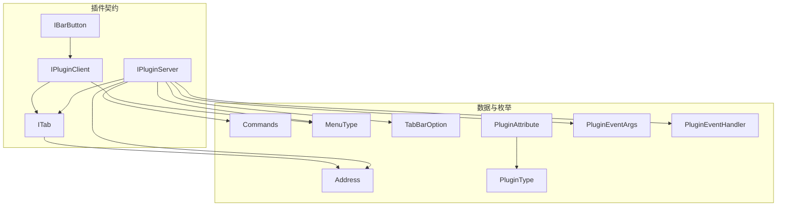
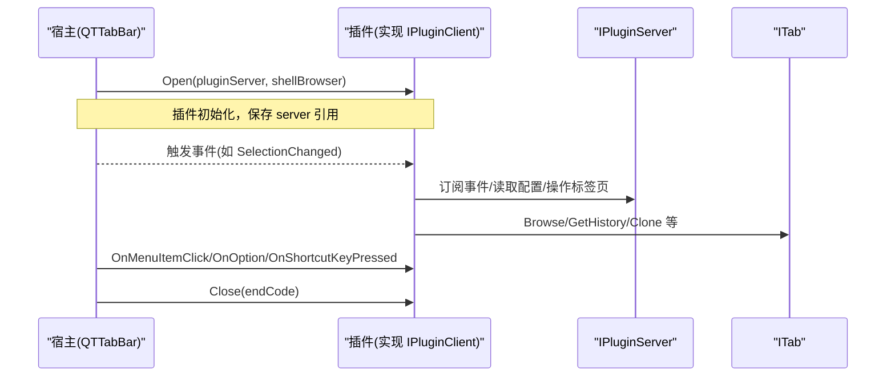
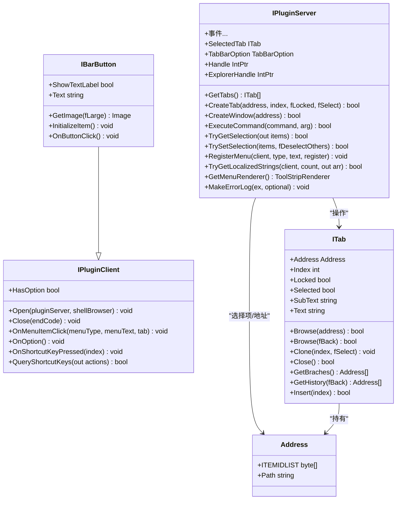

# 插件接口规范

<cite>
**本文引用的文件**   
- [IPluginClient.cs](file://QTPluginLib/IPluginClient.cs)
- [IPluginServer.cs](file://QTPluginLib/IPluginServer.cs)
- [ITab.cs](file://QTPluginLib/ITab.cs)
- [IBarButton.cs](file://QTPluginLib/IBarButton.cs)
- [Address.cs](file://QTPluginLib/Address.cs)
- [Commands.cs](file://QTPluginLib/Commands.cs)
- [MenuType.cs](file://QTPluginLib/MenuType.cs)
- [TabBarOption.cs](file://QTPluginLib/TabBarOption.cs)
- [PluginAttribute.cs](file://QTPluginLib/PluginAttribute.cs)
- [PluginType.cs](file://QTPluginLib/PluginType.cs)
- [PluginEventArgs.cs](file://QTPluginLib/PluginEventArgs.cs)
- [PluginEventHandler.cs](file://QTPluginLib/PluginEventHandler.cs)
</cite>

## 目录
1. [简介](#简介)
2. [项目结构](#项目结构)
3. [核心组件](#核心组件)
4. [架构总览](#架构总览)
5. [详细组件分析](#详细组件分析)
6. [依赖关系分析](#依赖关系分析)
7. [性能考虑](#性能考虑)
8. [故障排查指南](#故障排查指南)
9. [结论](#结论)
10. [附录](#附录)

## 简介
本文件为 QTTabBar-Next 的插件接口规范文档，面向希望开发扩展功能的开发者。文档围绕以下核心接口展开：
- IPluginClient：插件生命周期与回调入口（Open、Close、OnMenuItemClick、OnOption、QueryShortcutKeys 等）
- IPluginServer：宿主提供的服务总线（事件、UI交互、配置管理、标签页操作、选择项操作、菜单注册等）
- ITab：标签页对象模型（导航、历史、克隆、锁定、文本等）
- IBarButton：工具栏按钮 UI 组件（继承自 IPluginClient，提供图像、文本、点击处理等）

同时涵盖相关类型定义（Address、Commands、MenuType、TabBarOption、PluginAttribute、PluginType、PluginEventArgs、PluginEventHandler），并提供实现示例路径、错误处理最佳实践与性能优化建议。

## 项目结构
本规范涉及的代码位于 QTPluginLib 工程下，主要包含插件契约与基础类型定义。下图展示了与插件接口相关的核心文件及其关系。

图表来源
- [IPluginClient.cs:21-30](file://QTPluginLib/IPluginClient.cs#L21-L30)
- [IPluginServer.cs:24-76](file://QTPluginLib/IPluginServer.cs#L24-L76)
- [ITab.cs:19-39](file://QTPluginLib/ITab.cs#L19-L39)
- [IBarButton.cs:21-29](file://QTPluginLib/IBarButton.cs#L21-L29)
- [Address.cs:25-39](file://QTPluginLib/Address.cs#L25-L39)
- [Commands.cs:19-48](file://QTPluginLib/Commands.cs#L19-L48)
- [MenuType.cs:22-27](file://QTPluginLib/MenuType.cs#L22-L27)
- [TabBarOption.cs:22-112](file://QTPluginLib/TabBarOption.cs#L22-L112)
- [PluginAttribute.cs:22-63](file://QTPluginLib/PluginAttribute.cs#L22-L63)
- [PluginType.cs:19-24](file://QTPluginLib/PluginType.cs#L19-L24)
- [PluginEventArgs.cs:21-52](file://QTPluginLib/PluginEventArgs.cs#L21-L52)
- [PluginEventHandler.cs:19-20](file://QTPluginLib/PluginEventHandler.cs#L19-L20)

章节来源
- [IPluginClient.cs:21-30](file://QTPluginLib/IPluginClient.cs#L21-L30)
- [IPluginServer.cs:24-76](file://QTPluginLib/IPluginServer.cs#L24-L76)
- [ITab.cs:19-39](file://QTPluginLib/ITab.cs#L19-L39)
- [IBarButton.cs:21-29](file://QTPluginLib/IBarButton.cs#L21-L29)
- [Address.cs:25-39](file://QTPluginLib/Address.cs#L25-L39)
- [Commands.cs:19-48](file://QTPluginLib/Commands.cs#L19-L48)
- [MenuType.cs:22-27](file://QTPluginLib/MenuType.cs#L22-L27)
- [TabBarOption.cs:22-112](file://QTPluginLib/TabBarOption.cs#L22-L112)
- [PluginAttribute.cs:22-63](file://QTPluginLib/PluginAttribute.cs#L22-L63)
- [PluginType.cs:19-24](file://QTPluginLib/PluginType.cs#L19-L24)
- [PluginEventArgs.cs:21-52](file://QTPluginLib/PluginEventArgs.cs#L21-L52)
- [PluginEventHandler.cs:19-20](file://QTPluginLib/PluginEventHandler.cs#L19-L20)

## 核心组件
本节概述各接口的职责与关键成员，便于快速定位能力边界。

- IPluginClient（插件客户端）
  - 生命周期：Open、Close
  - 用户交互：OnMenuItemClick、OnOption、OnShortcutKeyPressed
  - 快捷键声明：QueryShortcutKeys
  - 选项支持：HasOption

- IPluginServer（插件服务端）
  - 事件总线：ExplorerStateChanged、NavigationComplete、SelectionChanged、SettingsChanged、TabAdded/Changed/Removed、PointedTabChanged、MouseEnter/Leave、MenuRendererChanged
  - 标签页控制：GetTabs、SelectedTab、CreateTab、HitTest
  - 窗口与命令：CreateWindow、ExecuteCommand
  - 应用与分组：AddApplication/RemoveApplication/GetApplications、AddGroup/RemoveGroup/GetGroupPaths/OpenGroup、Groups
  - 选择项操作：TryGetSelection/TrySetSelection
  - 菜单与本地化：RegisterMenu、TryGetLocalizedStrings、GetMenuRenderer
  - 配置读写：TabBarOption
  - 日志：MakeErrorLog
  - 句柄：Handle、ExplorerHandle

- ITab（标签页）
  - 导航：Browse(Address)、Browse(bool fBack)
  - 历史：GetHistory(bool fBack)、GetBraches()
  - 生命周期：Clone(int index, bool fSelect)、Insert(int index)、Close()
  - 属性：Address、Index、Locked、Selected、Text、SubText

- IBarButton（工具栏按钮）
  - 继承 IPluginClient
  - UI：GetImage(bool fLarge)、InitializeItem()、OnButtonClick()
  - 显示：ShowTextLabel、Text

章节来源
- [IPluginClient.cs:21-30](file://QTPluginLib/IPluginClient.cs#L21-L30)
- [IPluginServer.cs:24-76](file://QTPluginLib/IPluginServer.cs#L24-L76)
- [ITab.cs:19-39](file://QTPluginLib/ITab.cs#L19-L39)
- [IBarButton.cs:21-29](file://QTPluginLib/IBarButton.cs#L21-L29)

## 架构总览
下图展示插件与宿主之间的交互关系：插件通过 IPluginClient 暴露自身，由宿主在合适时机调用；插件通过 IPluginServer 访问宿主能力（事件、UI、配置、标签页等）。

图表来源
- [IPluginClient.cs:21-30](file://QTPluginLib/IPluginClient.cs#L21-L30)
- [IPluginServer.cs:24-76](file://QTPluginLib/IPluginServer.cs#L24-L76)
- [ITab.cs:19-39](file://QTPluginLib/ITab.cs#L19-L39)

## 详细组件分析

### IPluginClient 接口详解
- Open(IPluginServer pluginServer, IShellBrowser shellBrowser)
  - 作用：插件初始化入口，宿主注入服务端与 Shell 浏览器上下文。
  - 参数说明：pluginServer 用于访问宿主能力；shellBrowser 用于与 Explorer 视图交互。
  - 返回值：无。
  - 使用要点：在此阶段完成事件订阅、缓存必要引用、加载资源。避免阻塞主线程。
  - 参考路径：[IPluginClient.cs:26](file://QTPluginLib/IPluginClient.cs#L26)

- Close(EndCode endCode)
  - 作用：插件释放资源。
  - 参数说明：endCode 表示关闭原因或状态。
  - 返回值：无。
  - 使用要点：取消事件订阅、释放非托管资源、清理定时器。
  - 参考路径：[IPluginClient.cs:22](file://QTPluginLib/IPluginClient.cs#L22)

- OnMenuItemClick(MenuType menuType, string menuText, ITab tab)
  - 作用：响应菜单项点击。
  - 参数说明：menuType 指示菜单位置（标签/工具栏/两者）；menuText 为被点击菜单文本；tab 为当前关联标签页。
  - 返回值：无。
  - 使用要点：根据 menuText 分发业务逻辑，必要时通过 IPluginServer 更新 UI 或执行命令。
  - 参考路径：[IPluginClient.cs:23](file://QTPluginLib/IPluginClient.cs#L23)

- OnOption()
  - 作用：打开插件选项对话框。
  - 参数说明：无。
  - 返回值：无。
  - 使用要点：仅在 HasOption 为 true 时可用。
  - 参考路径：[IPluginClient.cs:24](file://QTPluginLib/IPluginClient.cs#L24)

- OnShortcutKeyPressed(int index)
  - 作用：响应快捷键触发。
  - 参数说明：index 为注册的快捷键索引。
  - 返回值：无。
  - 使用要点：结合 QueryShortcutKeys 返回的动作列表进行映射。
  - 参考路径：[IPluginClient.cs:25](file://QTPluginLib/IPluginClient.cs#L25)

- QueryShortcutKeys(out string[] actions)
  - 作用：声明支持的快捷键动作名称。
  - 参数说明：actions 输出动作字符串数组。
  - 返回值：true 表示支持快捷键。
  - 使用要点：确保 actions 长度与 OnShortcutKeyPressed 中 index 一一对应。
  - 参考路径：[IPluginClient.cs:27](file://QTPluginLib/IPluginClient.cs#L27)

- HasOption
  - 作用：是否提供选项界面。
  - 类型：bool 只读属性。
  - 参考路径：[IPluginClient.cs:29](file://QTPluginLib/IPluginClient.cs#L29)

章节来源
- [IPluginClient.cs:21-30](file://QTPluginLib/IPluginClient.cs#L21-L30)

### IPluginServer 接口详解
- 事件
  - ExplorerStateChanged、NavigationComplete、SelectionChanged、SettingsChanged、TabAdded、TabChanged、TabRemoved、PointedTabChanged、MouseEnter、MouseLeave、MenuRendererChanged
  - 用途：监听宿主状态变化，驱动插件行为更新。
  - 委托类型：PluginEventHandler（携带 PluginEventArgs，含 Index、Address、WindowAction）
  - 参考路径：[IPluginServer.cs:25-45](file://QTPluginLib/IPluginServer.cs#L25-L45)、[PluginEventHandler.cs:19-20](file://QTPluginLib/PluginEventHandler.cs#L19-L20)、[PluginEventArgs.cs:21-52](file://QTPluginLib/PluginEventArgs.cs#L21-L52)

- 标签页与窗口
  - GetTabs、SelectedTab、CreateTab、HitTest、CreateWindow
  - 用途：枚举/切换/创建标签页，按坐标命中测试，创建新窗口。
  - 参考路径：[IPluginServer.cs:49-56](file://QTPluginLib/IPluginServer.cs#L49-L56)

- 选择项操作
  - TryGetSelection、TrySetSelection
  - 用途：获取/设置当前选中项（Address[]），支持是否反选其他项。
  - 参考路径：[IPluginServer.cs:62-63](file://QTPluginLib/IPluginServer.cs#L62-L63)

- 命令执行
  - ExecuteCommand(Commands command, object arg)
  - 用途：执行内置命令（前进/后退/刷新/关闭标签/排序/显示属性等）。
  - 参考路径：[IPluginServer.cs:51](file://QTPluginLib/IPluginServer.cs#L51)、[Commands.cs:19-48](file://QTPluginLib/Commands.cs#L19-L48)

- 应用与分组
  - AddApplication/RemoveApplication/GetApplications、AddGroup/RemoveGroup/GetGroupPaths/OpenGroup、Groups
  - 用途：管理快捷应用与文件夹分组，批量打开分组。
  - 参考路径：[IPluginServer.cs:47-57](file://QTPluginLib/IPluginServer.cs#L47-L57)

- 菜单与本地化
  - RegisterMenu、TryGetLocalizedStrings、GetMenuRenderer
  - 用途：注册插件菜单项、获取本地化字符串、获取 ToolStrip 渲染器以统一样式。
  - 参考路径：[IPluginServer.cs:54-61](file://QTPluginLib/IPluginServer.cs#L54-L61)

- 配置管理
  - TabBarOption
  - 用途：读写标签栏选项（布尔、颜色、整数、字符串、杂项）。
  - 参考路径：[IPluginServer.cs:75](file://QTPluginLib/IPluginServer.cs#L75)、[TabBarOption.cs:22-112](file://QTPluginLib/TabBarOption.cs#L22-L112)

- 日志
  - MakeErrorLog(Exception ex, string optional = null)
  - 用途：记录异常到宿主日志系统。
  - 参考路径：[IPluginServer.cs:65](file://QTPluginLib/IPluginServer.cs#L65)

- 句柄
  - Handle、ExplorerHandle
  - 用途：获取宿主窗口与 Explorer 窗口句柄，用于原生交互。
  - 参考路径：[IPluginServer.cs:67-71](file://QTPluginLib/IPluginServer.cs#L67-L71)

章节来源
- [IPluginServer.cs:24-76](file://QTPluginLib/IPluginServer.cs#L24-L76)
- [PluginEventHandler.cs:19-20](file://QTPluginLib/PluginEventHandler.cs#L19-L20)
- [PluginEventArgs.cs:21-52](file://QTPluginLib/PluginEventArgs.cs#L21-L52)
- [Commands.cs:19-48](file://QTPluginLib/Commands.cs#L19-L48)
- [TabBarOption.cs:22-112](file://QTPluginLib/TabBarOption.cs#L22-L112)

### ITab 接口详解
- 导航与历史
  - Browse(Address address)、Browse(bool fBack)
  - GetHistory(bool fBack)、GetBraches()
  - 用途：跳转到指定地址、前进/后退、获取历史与分支。
  - 参考路径：[ITab.cs:20-25](file://QTPluginLib/ITab.cs#L20-L25)

- 生命周期
  - Clone(int index, bool fSelect)、Insert(int index)、Close()
  - 用途：复制标签、插入新标签、关闭当前标签。
  - 参考路径：[ITab.cs:22-26](file://QTPluginLib/ITab.cs#L22-L26)

- 属性
  - Address、Index、Locked、Selected、Text、SubText
  - 用途：标识与显示信息、选中态与锁定态控制。
  - 参考路径：[ITab.cs:28-38](file://QTPluginLib/ITab.cs#L28-L38)

章节来源
- [ITab.cs:19-39](file://QTPluginLib/ITab.cs#L19-L39)

### IBarButton 接口详解
- 继承 IPluginClient，扩展 UI 能力
- GetImage(bool fLarge)：返回按钮图标（大/小尺寸）
- InitializeItem()：初始化按钮项（文本、图标、启用状态等）
- OnButtonClick()：按钮点击处理
- ShowTextLabel、Text：控制文本显示与内容
- 参考路径：[IBarButton.cs:21-29](file://QTPluginLib/IBarButton.cs#L21-L29)

章节来源
- [IBarButton.cs:21-29](file://QTPluginLib/IBarButton.cs#L21-L29)

### 相关类型与枚举
- Address：封装 PIDL 与路径，用于跨进程/跨会话的地址传递。
  - 参考路径：[Address.cs:25-39](file://QTPluginLib/Address.cs#L25-L39)
- Commands：内置命令集合（导航、标签管理、显示控制、MD5、属性等）。
  - 参考路径：[Commands.cs:19-48](file://QTPluginLib/Commands.cs#L19-L48)
- MenuType：菜单类型标志（标签/工具栏/两者）。
  - 参考路径：[MenuType.cs:22-27](file://QTPluginLib/MenuType.cs#L22-L27)
- TabBarOption：配置读写包装，支持多类型值存取。
  - 参考路径：[TabBarOption.cs:22-112](file://QTPluginLib/TabBarOption.cs#L22-L112)
- PluginAttribute/PluginType：插件元数据与类型（交互式、后台、后台多实例、静态）。
  - 参考路径：[PluginAttribute.cs:22-63](file://QTPluginLib/PluginAttribute.cs#L22-L63)、[PluginType.cs:19-24](file://QTPluginLib/PluginType.cs#L19-L24)
- PluginEventArgs/PluginEventHandler：事件参数与委托。
  - 参考路径：[PluginEventArgs.cs:21-52](file://QTPluginLib/PluginEventArgs.cs#L21-L52)、[PluginEventHandler.cs:19-20](file://QTPluginLib/PluginEventHandler.cs#L19-L20)

章节来源
- [Address.cs:25-39](file://QTPluginLib/Address.cs#L25-L39)
- [Commands.cs:19-48](file://QTPluginLib/Commands.cs#L19-L48)
- [MenuType.cs:22-27](file://QTPluginLib/MenuType.cs#L22-L27)
- [TabBarOption.cs:22-112](file://QTPluginLib/TabBarOption.cs#L22-L112)
- [PluginAttribute.cs:22-63](file://QTPluginLib/PluginAttribute.cs#L22-L63)
- [PluginType.cs:19-24](file://QTPluginLib/PluginType.cs#L19-L24)
- [PluginEventArgs.cs:21-52](file://QTPluginLib/PluginEventArgs.cs#L21-L52)
- [PluginEventHandler.cs:19-20](file://QTPluginLib/PluginEventHandler.cs#L19-L20)

## 依赖关系分析
- IBarButton 继承 IPluginClient，复用生命周期与回调机制。
- IPluginServer 聚合多个子系统能力（事件、标签页、选择项、命令、配置、菜单、本地化）。
- ITab 与 Address 紧密耦合，作为导航与历史的数据载体。
- 事件体系通过 PluginEventHandler 与 PluginEventArgs 解耦发布-订阅。

图表来源
- [IPluginClient.cs:21-30](file://QTPluginLib/IPluginClient.cs#L21-L30)
- [IBarButton.cs:21-29](file://QTPluginLib/IBarButton.cs#L21-L29)
- [IPluginServer.cs:24-76](file://QTPluginLib/IPluginServer.cs#L24-L76)
- [ITab.cs:19-39](file://QTPluginLib/ITab.cs#L19-L39)
- [Address.cs:25-39](file://QTPluginLib/Address.cs#L25-L39)

章节来源
- [IPluginClient.cs:21-30](file://QTPluginLib/IPluginClient.cs#L21-L30)
- [IBarButton.cs:21-29](file://QTPluginLib/IBarButton.cs#L21-L29)
- [IPluginServer.cs:24-76](file://QTPluginLib/IPluginServer.cs#L24-L76)
- [ITab.cs:19-39](file://QTPluginLib/ITab.cs#L19-L39)
- [Address.cs:25-39](file://QTPluginLib/Address.cs#L25-L39)

## 性能考虑
- 事件处理轻量化：在事件回调中仅做必要计算，耗时任务异步执行，避免阻塞 UI 线程。
- 批量操作：优先使用批量 API（如 TrySetSelection 一次设置多项），减少往返调用。
- 资源管理：在 Close 中及时释放图像、字体、定时器与非托管资源，防止内存泄漏。
- 菜单渲染：复用 GetMenuRenderer 以保持一致性并降低自定义绘制开销。
- 本地化字符串：使用 TryGetLocalizedStrings 一次性获取，避免多次查找。
- 配置读写：集中写入 TabBarOption，减少频繁序列化/反序列化。

## 故障排查指南
- 常见错误
  - 未正确订阅/取消订阅事件导致重复处理或内存泄漏。
  - 在 UI 线程外修改 UI 元素导致异常。
  - 对空引用（如 SelectedTab、Address）未判空导致崩溃。
  - 快捷键索引越界（QueryShortcutKeys 返回数量与 OnShortcutKeyPressed 索引不一致）。
- 诊断建议
  - 使用 MakeErrorLog 记录异常堆栈与可选上下文。
  - 通过 SettingsChanged 与 SelectionChanged 验证宿主状态是否与预期一致。
  - 使用 HitTest 与 GetTabs 校验标签页命中与枚举结果。
  - 使用 Groups 与 GetGroupPaths 验证分组数据完整性。

章节来源
- [IPluginServer.cs:65](file://QTPluginLib/IPluginServer.cs#L65)
- [IPluginServer.cs:25-45](file://QTPluginLib/IPluginServer.cs#L25-L45)
- [IPluginServer.cs:55-56](file://QTPluginLib/IPluginServer.cs#L55-L56)
- [IPluginServer.cs:69](file://QTPluginLib/IPluginServer.cs#L69)

## 结论
本规范明确了 QTTabBar-Next 插件的核心接口与数据模型，覆盖生命周期、事件、UI、配置、标签页与选择项操作等关键能力。遵循本文档的实践建议，可实现稳定、可维护且高性能的插件扩展。

## 附录

### 实现示例路径（不含具体代码）
- 基本插件实现（IPluginClient）
  - 参考路径：[IPluginClient.cs:21-30](file://QTPluginLib/IPluginClient.cs#L21-L30)
- 工具栏按钮插件（IBarButton）
  - 参考路径：[IBarButton.cs:21-29](file://QTPluginLib/IBarButton.cs#L21-L29)
- 事件订阅与处理
  - 参考路径：[IPluginServer.cs:25-45](file://QTPluginLib/IPluginServer.cs#L25-L45)、[PluginEventHandler.cs:19-20](file://QTPluginLib/PluginEventHandler.cs#L19-L20)、[PluginEventArgs.cs:21-52](file://QTPluginLib/PluginEventArgs.cs#L21-L52)
- 标签页导航与历史
  - 参考路径：[ITab.cs:20-25](file://QTPluginLib/ITab.cs#L20-L25)
- 选择项操作
  - 参考路径：[IPluginServer.cs:62-63](file://QTPluginLib/IPluginServer.cs#L62-L63)
- 命令执行
  - 参考路径：[IPluginServer.cs:51](file://QTPluginLib/IPluginServer.cs#L51)、[Commands.cs:19-48](file://QTPluginLib/Commands.cs#L19-L48)
- 菜单注册与本地化
  - 参考路径：[IPluginServer.cs:54-61](file://QTPluginLib/IPluginServer.cs#L54-L61)
- 配置读写
  - 参考路径：[IPluginServer.cs:75](file://QTPluginLib/IPluginServer.cs#L75)、[TabBarOption.cs:22-112](file://QTPluginLib/TabBarOption.cs#L22-L112)
- 插件元数据
  - 参考路径：[PluginAttribute.cs:22-63](file://QTPluginLib/PluginAttribute.cs#L22-L63)、[PluginType.cs:19-24](file://QTPluginLib/PluginType.cs#L19-L24)