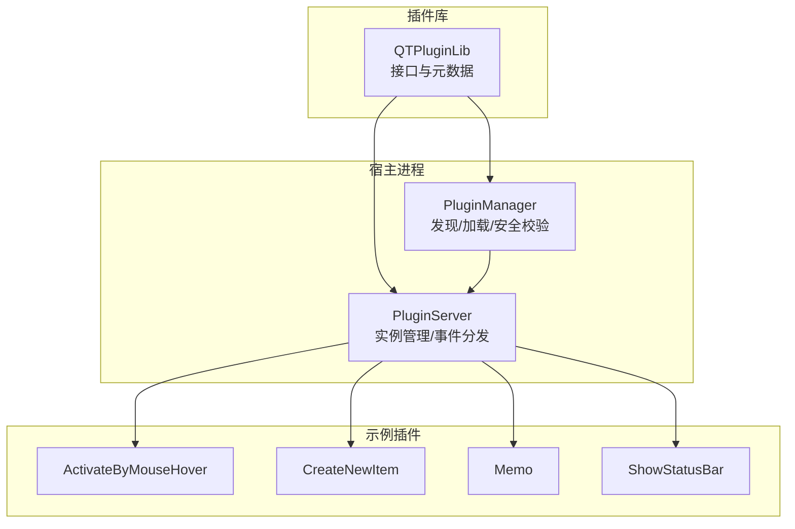
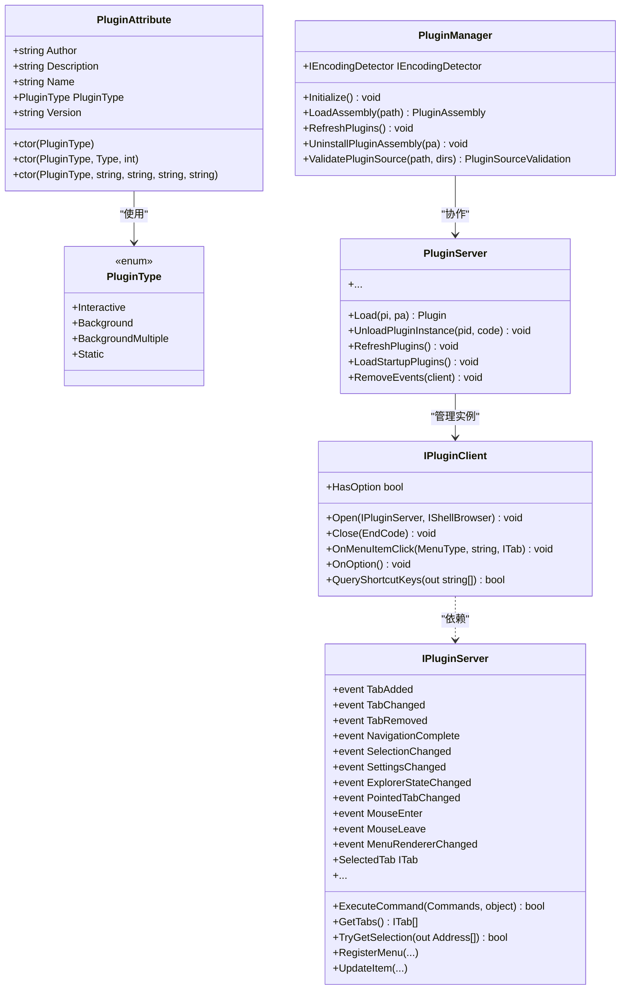
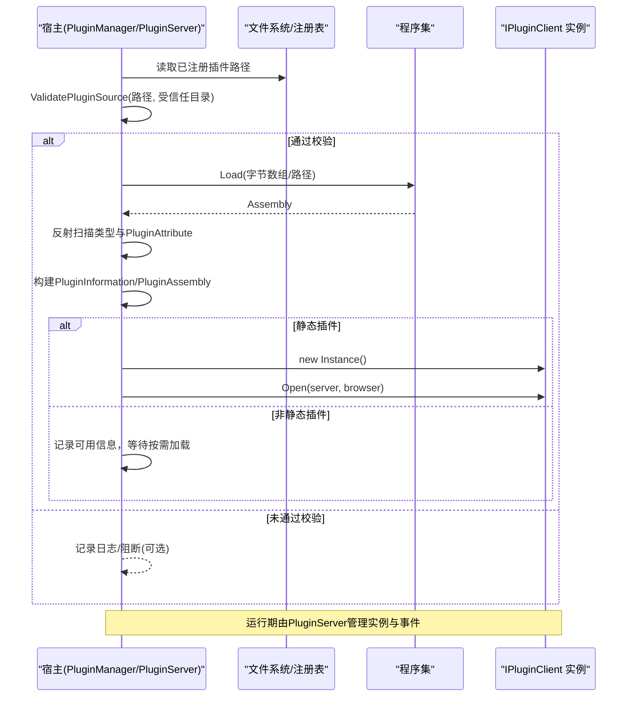
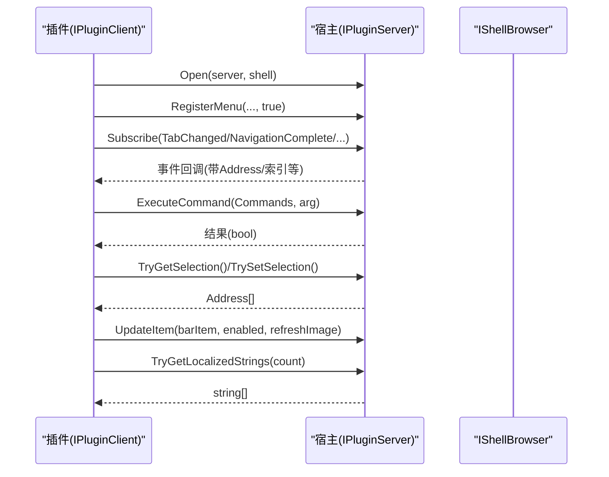
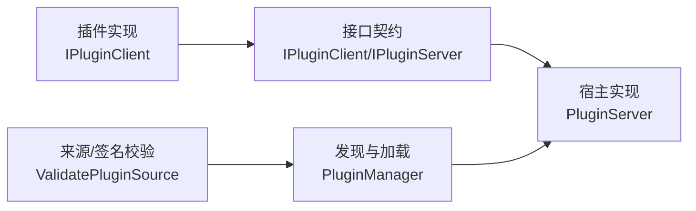

# 插件架构设计

<cite>
**本文引用的文件列表**
- [PluginType.cs](file://QTPluginLib/PluginType.cs)
- [PluginAttribute.cs](file://QTPluginLib/PluginAttribute.cs)
- [IPluginClient.cs](file://QTPluginLib/IPluginClient.cs)
- [IPluginServer.cs](file://QTPluginLib/IPluginServer.cs)
- [PluginManager.cs](file://QTTabBar/PluginManager.cs)
- [PluginServer.cs](file://QTTabBar/PluginServer.cs)
- [ActivateByMouseHover.cs](file://Plugins/ActivateByMouseHover/ActivateByMouseHover.cs)
- [CreateNewItem.cs](file://Plugins/CreateNewItem/CreateNewItem.cs)
- [Memo.cs](file://Plugins/Memo/Memo.cs)
- [ShowStatusBar.cs](file://Plugins/ShowStatusBar/ShowStatusBar.cs)
</cite>

## 目录
1. [简介](#简介)
2. [项目结构](#项目结构)
3. [核心组件](#核心组件)
4. [架构总览](#架构总览)
5. [详细组件分析](#详细组件分析)
6. [依赖关系分析](#依赖关系分析)
7. [性能与稳定性考虑](#性能与稳定性考虑)
8. [故障排查指南](#故障排查指南)
9. [结论](#结论)

## 简介
本文件面向 QTTabBar-Next 的插件系统，系统性阐述插件类型分类、元数据机制、生命周期管理、宿主与插件通信模型以及关键实现要点。目标是帮助开发者理解并扩展该插件体系，同时为使用者提供清晰的集成与排障指引。

## 项目结构
围绕插件系统的关键代码分布在以下位置：
- 插件接口与元数据定义：QTPluginLib
- 插件发现、加载与安全校验：QTTabBar/PluginManager
- 插件运行时管理与事件分发：QTTabBar/PluginServer
- 示例插件：Plugins 目录下的若干 IPluginClient 实现

图表来源
- [PluginType.cs:18-26](file://QTPluginLib/PluginType.cs#L18-L26)
- [PluginAttribute.cs:20-65](file://QTPluginLib/PluginAttribute.cs#L20-L65)
- [IPluginClient.cs:20-32](file://QTPluginLib/IPluginClient.cs#L20-L32)
- [IPluginServer.cs:23-78](file://QTPluginLib/IPluginServer.cs#L23-L78)
- [PluginManager.cs:30-772](file://QTTabBar/PluginManager.cs#L30-L772)
- [PluginServer.cs:28-893](file://QTTabBar/PluginServer.cs#L28-L893)

章节来源
- [PluginType.cs:18-26](file://QTPluginLib/PluginType.cs#L18-L26)
- [PluginAttribute.cs:20-65](file://QTPluginLib/PluginAttribute.cs#L20-L65)
- [IPluginClient.cs:20-32](file://QTPluginLib/IPluginClient.cs#L20-L32)
- [IPluginServer.cs:23-78](file://QTPluginLib/IPluginServer.cs#L23-L78)
- [PluginManager.cs:30-772](file://QTTabBar/PluginManager.cs#L30-L772)
- [PluginServer.cs:28-893](file://QTTabBar/PluginServer.cs#L28-L893)

## 核心组件
- 插件类型与元数据
  - PluginType：定义插件运行模式（交互式、后台、多后台、静态）。
  - PluginAttribute：用于在类上声明插件信息（名称、作者、版本、描述、类型），支持通过本地化提供者填充。
- 插件契约
  - IPluginClient：插件必须实现的接口，包含 Open/Close、菜单、快捷键、选项等回调。
  - IPluginServer：宿主暴露给插件的服务接口，提供标签页、选择项、命令执行、事件订阅等能力。
- 宿主侧管理器
  - PluginManager：负责插件程序集发现、加载、启用状态管理、静态插件实例缓存、卸载与刷新。
  - PluginServer：维护当前窗口上下文中的插件实例集合，负责启动时加载、事件转发、菜单注册、过滤引擎绑定等。

章节来源
- [PluginType.cs:18-26](file://QTPluginLib/PluginType.cs#L18-L26)
- [PluginAttribute.cs:20-65](file://QTPluginLib/PluginAttribute.cs#L20-L65)
- [IPluginClient.cs:20-32](file://QTPluginLib/IPluginClient.cs#L20-L32)
- [IPluginServer.cs:23-78](file://QTPluginLib/IPluginServer.cs#L23-L78)
- [PluginManager.cs:30-772](file://QTTabBar/PluginManager.cs#L30-L772)
- [PluginServer.cs:28-893](file://QTTabBar/PluginServer.cs#L28-L893)

## 架构总览
插件系统采用“接口契约 + 反射发现 + 受信任加载”的设计：
- 插件以 .NET 程序集形式存在，类需实现 IPluginClient 并用 PluginAttribute 标注。
- 宿主通过 PluginManager 扫描已注册的程序集路径，读取元数据，进行来源与签名校验后加载。
- 根据 PluginType 决定加载策略：
  - Interactive：按需创建实例，通常由用户界面触发。
  - Background：启动时加载，可能参与过滤或全局逻辑。
  - BackgroundMultiple：允许同一类型多个实例并存。
  - Static：单例常驻，宿主在初始化阶段直接调用 Open 并持有引用。
- 插件通过 IPluginServer 访问宿主功能，并通过事件订阅宿主状态变化。

图表来源
- [PluginType.cs:18-26](file://QTPluginLib/PluginType.cs#L18-L26)
- [PluginAttribute.cs:20-65](file://QTPluginLib/PluginAttribute.cs#L20-L65)
- [IPluginClient.cs:20-32](file://QTPluginLib/IPluginClient.cs#L20-L32)
- [IPluginServer.cs:23-78](file://QTPluginLib/IPluginServer.cs#L23-L78)
- [PluginManager.cs:30-772](file://QTTabBar/PluginManager.cs#L30-L772)
- [PluginServer.cs:28-893](file://QTTabBar/PluginServer.cs#L28-L893)

## 详细组件分析

### 插件类型与适用场景
- 交互式（Interactive）
  - 典型用途：需要用户交互的 UI 或工具，如备忘录、对话框等。
  - 行为特征：按需创建实例，通常在用户操作时激活。
  - 参考实现：[Memo.cs:26-180](file://Plugins/Memo/Memo.cs#L26-L180)
- 后台（Background）
  - 典型用途：全局监听、过滤、增强功能，如显示状态栏、鼠标悬浮激活等。
  - 行为特征：启动时加载，可参与过滤链或全局事件处理。
  - 参考实现：[ShowStatusBar.cs:24-93](file://Plugins/ShowStatusBar/ShowStatusBar.cs#L24-L93)、[ActivateByMouseHover.cs:27-180](file://Plugins/ActivateByMouseHover/ActivateByMouseHover.cs#L27-L180)
- 多后台（BackgroundMultiple）
  - 典型用途：允许同一类型多个实例并行运行，适用于可扩展的后台服务。
  - 行为特征：按 ID 区分实例，宿主在刷新时确保存在。
  - 宿主处理：见 [PluginServer.RefreshPlugins:451-480](file://QTTabBar/PluginServer.cs#L451-L480)
- 静态（Static）
  - 典型用途：宿主在初始化阶段即创建的常驻实例，例如编码检测器。
  - 行为特征：宿主在加载程序集后直接构造并调用 Open，保持全局引用。
  - 宿主处理：见 [PluginManager.LoadStaticInstance:330-349](file://QTTabBar/PluginManager.cs#L330-L349)

章节来源
- [PluginType.cs:18-26](file://QTPluginLib/PluginType.cs#L18-L26)
- [Memo.cs:26-180](file://Plugins/Memo/Memo.cs#L26-L180)
- [ShowStatusBar.cs:24-93](file://Plugins/ShowStatusBar/ShowStatusBar.cs#L24-L93)
- [ActivateByMouseHover.cs:27-180](file://Plugins/ActivateByMouseHover/ActivateByMouseHover.cs#L27-L180)
- [PluginServer.cs:451-480](file://QTTabBar/PluginServer.cs#L451-L480)
- [PluginManager.cs:330-349](file://QTTabBar/PluginManager.cs#L330-L349)

### 元数据属性 PluginAttribute 的作用机制
- 作用目标：仅可用于类（AttributeTargets.Class）。
- 字段说明：Author、Description、Name、Version、PluginType。
- 构造函数重载：
  - 仅指定类型；
  - 指定类型与本地化提供者类型及键值，自动从 LocalizedStringProvider 派生类中获取名称、作者、描述；
  - 直接传入字符串参数。
- 本地化提供者：若提供类型为 LocalizedStringProvider 子类，则通过 Activator 实例化并设置 Key，从而动态填充元数据。

章节来源
- [PluginAttribute.cs:20-65](file://QTPluginLib/PluginAttribute.cs#L20-L65)

### 插件生命周期管理
整体流程包括：发现、加载、初始化、运行、刷新、卸载。

图表来源
- [PluginManager.cs:124-143](file://QTTabBar/PluginManager.cs#L124-L143)
- [PluginManager.cs:299-328](file://QTTabBar/PluginManager.cs#L299-L328)
- [PluginManager.cs:330-349](file://QTTabBar/PluginManager.cs#L330-L349)
- [PluginServer.cs:333-349](file://QTTabBar/PluginServer.cs#L333-L349)

#### 关键流程细节
- 发现与注册
  - 插件路径来源于注册表键值，宿主在初始化时读取并去重校验。
  - 默认会尝试写入一组内置插件路径到注册表（若文件存在）。
- 加载与校验
  - 先进行来源与签名校验（受信任目录或可信发布者签名/强名称），失败时可根据配置阻断或告警继续。
  - 反射枚举类型，筛选实现 IPluginClient 且带有 PluginAttribute 的类，生成 PluginInformation。
- 初始化
  - 静态插件：宿主直接构造并调用 Open，随后将其作为编码检测器等全局能力注入。
  - 非静态插件：在首次使用时由 PluginServer.Load 构造并 Open。
- 运行与刷新
  - 宿主通过 PluginServer 管理实例字典，支持刷新、卸载、事件移除等操作。
  - 背景插件在刷新时重新挂载过滤引擎（IFilter/IFilterCore）。
- 卸载
  - 从实例字典移除、解除事件订阅、调用 Close，必要时调用程序集级 Uninstall 静态方法。

章节来源
- [PluginManager.cs:351-364](file://QTTabBar/PluginManager.cs#L351-L364)
- [PluginManager.cs:67-122](file://QTTabBar/PluginManager.cs#L67-L122)
- [PluginManager.cs:124-143](file://QTTabBar/PluginManager.cs#L124-L143)
- [PluginManager.cs:299-328](file://QTTabBar/PluginManager.cs#L299-L328)
- [PluginManager.cs:330-349](file://QTTabBar/PluginManager.cs#L330-L349)
- [PluginServer.cs:333-349](file://QTTabBar/PluginServer.cs#L333-L349)
- [PluginServer.cs:451-480](file://QTTabBar/PluginServer.cs#L451-L480)
- [PluginServer.cs:647-655](file://QTTabBar/PluginServer.cs#L647-L655)

### 插件与宿主的通信机制与数据交换
- 通信入口
  - 插件通过 Open 接收 IPluginServer 与 IShellBrowser 引用，用于后续交互。
- 事件驱动
  - 插件订阅 IPluginServer 的事件（如 TabAdded/TabChanged/NavigationComplete/SelectionChanged 等）响应宿主状态变化。
- 命令与查询
  - 插件通过 ExecuteCommand 发起导航、关闭标签、刷新浏览器、打开选项等命令。
  - 通过 GetTabs、SelectedTab、TryGetSelection/TrySetSelection 读写标签页与选择项。
- 菜单与按钮
  - RegisterMenu 将插件菜单注册到系统或标签页菜单。
  - UpdateItem 更新自定义按钮的状态与图像。
- 国际化
  - TryGetLocalizedStrings 允许插件向宿主提供本地化字符串数组，宿主按插件类型全名匹配返回。

图表来源
- [IPluginClient.cs:20-32](file://QTPluginLib/IPluginClient.cs#L20-L32)
- [IPluginServer.cs:23-78](file://QTPluginLib/IPluginServer.cs#L23-L78)
- [PluginServer.cs:333-349](file://QTTabBar/PluginServer.cs#L333-L349)
- [PluginServer.cs:482-502](file://QTTabBar/PluginServer.cs#L482-L502)
- [PluginServer.cs:592-599](file://QTTabBar/PluginServer.cs#L592-L599)
- [PluginServer.cs:614-623](file://QTTabBar/PluginServer.cs#L614-L623)

章节来源
- [IPluginClient.cs:20-32](file://QTPluginLib/IPluginClient.cs#L20-L32)
- [IPluginServer.cs:23-78](file://QTPluginLib/IPluginServer.cs#L23-L78)
- [PluginServer.cs:333-349](file://QTTabBar/PluginServer.cs#L333-L349)
- [PluginServer.cs:482-502](file://QTTabBar/PluginServer.cs#L482-L502)
- [PluginServer.cs:592-599](file://QTTabBar/PluginServer.cs#L592-L599)
- [PluginServer.cs:614-623](file://QTTabBar/PluginServer.cs#L614-L623)

### 示例插件解析
- 交互式插件：文件夹备忘录
  - 使用 PluginType.Interactive，注册标签页菜单，订阅导航完成与资源管理器状态变化，展示/隐藏表单。
  - 参考：[Memo.cs:26-180](file://Plugins/Memo/Memo.cs#L26-L180)
- 后台插件：显示状态栏
  - 使用 PluginType.Background，通过 Windows 消息控制状态栏显隐。
  - 参考：[ShowStatusBar.cs:24-93](file://Plugins/ShowStatusBar/ShowStatusBar.cs#L24-L93)
- 后台插件：鼠标悬浮激活标签
  - 使用 PluginType.Background，订阅 PointedTabChanged，定时器延时切换选中标签。
  - 参考：[ActivateByMouseHover.cs:27-180](file://Plugins/ActivateByMouseHover/ActivateByMouseHover.cs#L27-L180)
- 后台插件：创建新项目
  - 使用 PluginType.Background，通过快捷键创建文件或文件夹并进入重命名状态。
  - 参考：[CreateNewItem.cs:26-141](file://Plugins/CreateNewItem/CreateNewItem.cs#L26-L141)

章节来源
- [Memo.cs:26-180](file://Plugins/Memo/Memo.cs#L26-L180)
- [ShowStatusBar.cs:24-93](file://Plugins/ShowStatusBar/ShowStatusBar.cs#L24-L93)
- [ActivateByMouseHover.cs:27-180](file://Plugins/ActivateByMouseHover/ActivateByMouseHover.cs#L27-L180)
- [CreateNewItem.cs:26-141](file://Plugins/CreateNewItem/CreateNewItem.cs#L26-L141)

## 依赖关系分析
- 低耦合高内聚
  - 插件仅依赖 IPluginClient/IPluginServer 接口，不感知宿主内部实现。
  - 宿主通过反射与元数据发现插件，避免硬编码依赖。
- 安全边界
  - 插件加载前进行来源与签名校验，默认保守策略（可配置阻断不受信任插件）。
  - 受信任目录限定为主程序集所在目录，降低任意路径加载风险。
- 事件与实例隔离
  - 每个插件实例独立，宿主在卸载时主动移除事件订阅，防止内存泄漏。
  - 静态插件与后台插件分别管理，避免相互干扰。

图表来源
- [PluginManager.cs:299-328](file://QTTabBar/PluginManager.cs#L299-L328)
- [PluginServer.cs:333-349](file://QTTabBar/PluginServer.cs#L333-L349)
- [IPluginClient.cs:20-32](file://QTPluginLib/IPluginClient.cs#L20-L32)
- [IPluginServer.cs:23-78](file://QTPluginLib/IPluginServer.cs#L23-L78)

章节来源
- [PluginManager.cs:299-328](file://QTTabBar/PluginManager.cs#L299-L328)
- [PluginServer.cs:333-349](file://QTTabBar/PluginServer.cs#L333-L349)
- [IPluginClient.cs:20-32](file://QTPluginLib/IPluginClient.cs#L20-L32)
- [IPluginServer.cs:23-78](file://QTPluginLib/IPluginServer.cs#L23-L78)

## 性能与稳定性考虑
- 反射开销
  - 程序集扫描与类型验证发生在加载阶段，建议仅在初始化或刷新时执行，避免频繁反射。
- 资源释放
  - 插件应在 Close 中释放计时器、句柄等资源；宿主在卸载时统一调用 Close。
- 异常隔离
  - 宿主对插件异常进行捕获与日志记录，避免影响主进程稳定性。
- 安全策略
  - 默认保守策略下，不受信任插件仍可加载但记录告警；可通过配置阻断。
- 事件订阅
  - 插件应仅在需要时订阅事件，并在卸载时取消订阅，减少不必要的回调开销。

[本节为通用指导，无需特定文件引用]

## 故障排查指南
- 插件未生效
  - 检查注册表中是否包含插件路径，确认文件存在且未被禁用。
  - 查看来源/签名校验日志，确认是否被阻断。
- 插件崩溃导致宿主异常
  - 宿主已捕获插件异常并记录日志，请检查错误日志定位具体插件与方法。
- 菜单未出现
  - 确认插件是否正确调用 RegisterMenu，且菜单文本与类型匹配。
- 事件无响应
  - 确认插件是否在 Open 中订阅了相应事件，并在卸载时移除订阅。
- 静态插件未初始化
  - 检查是否为 PluginType.Static，确认宿主在 Initialize 阶段调用了 Open。

章节来源
- [PluginManager.cs:45-51](file://QTTabBar/PluginManager.cs#L45-L51)
- [PluginManager.cs:299-328](file://QTTabBar/PluginManager.cs#L299-L328)
- [PluginServer.cs:647-655](file://QTTabBar/PluginServer.cs#L647-L655)
- [PluginServer.cs:482-502](file://QTTabBar/PluginServer.cs#L482-L502)

## 结论
QTTabBar-Next 的插件系统以清晰的接口契约与元数据驱动为核心，结合严格的来源与签名校验，实现了安全、可扩展的插件生态。通过区分交互式、后台、多后台与静态四类插件，宿主能够灵活适配不同场景的需求。开发者只需遵循 IPluginClient 约定并使用 PluginAttribute 标注，即可快速集成并扩展功能。