# 插件系统

<cite>
**本文引用的文件**   
- [README.md](file://README.md)
- [IPluginClient.cs](file://QTPluginLib/IPluginClient.cs)
- [IPluginServer.cs](file://QTPluginLib/IPluginServer.cs)
- [PluginType.cs](file://QTPluginLib/PluginType.cs)
- [PluginAttribute.cs](file://QTPluginLib/PluginAttribute.cs)
- [PluginEventArgs.cs](file://QTPluginLib/PluginEventArgs.cs)
- [PluginEventHandler.cs](file://QTPluginLib/PluginEventHandler.cs)
- [PluginManager.cs](file://QTTabBar/PluginManager.cs)
- [PluginServer.cs](file://QTTabBar/PluginServer.cs)
- [InitializationOrchestrator.cs](file://QTTabBar/InitializationOrchestrator.cs)
- [ArchitectureBatch1Tests.cs](file://Tests/QTTtabBarTests/ArchitectureBatch1Tests.cs)
- [ArchitectureBatch3Tests.cs](file://Tests/QTTtabBarTests/ArchitectureBatch3Tests.cs)
</cite>

## 更新摘要
**所做更改**   
- 新增插件系统性能优化章节，详细说明程序集路径缓存、幂等初始化守卫和智能重载检测机制
- 更新架构总览图，增加性能优化组件
- 完善详细组件分析，补充缓存管理和时间戳比较逻辑
- 增强故障排查指南，包含性能相关问题的诊断方法

## 目录
1. [简介](#简介)
2. [项目结构](#项目结构)
3. [核心组件](#核心组件)
4. [架构总览](#架构总览)
5. [详细组件分析](#详细组件分析)
6. [性能优化机制](#性能优化机制)
7. [依赖关系分析](#依赖关系分析)
8. [性能考虑](#性能考虑)
9. [故障排查指南](#故障排查指南)
10. [结论](#结论)
11. [附录：插件开发指南与最佳实践](#附录插件开发指南与最佳实践)

## 简介
本文件面向 QTTabBar-Next 的插件系统，系统性阐述其架构设计、接口契约、生命周期管理、安全机制、事件与通信模型，以及配置、版本兼容与更新策略。文档同时提供面向开发者的实操指引，包括模板建议、调试技巧与发布流程，帮助快速构建稳定可靠的交互式、后台与静态插件。

**最新更新** 本次更新重点介绍了插件系统的性能优化机制，包括程序集路径缓存（30秒TTL）、幂等初始化守卫、智能插件重载检测和缓存失效机制，显著减少了注册表访问开销并提升了系统响应速度。

## 项目结构
插件系统由"宿主（QTTabBar）"和"插件库（QTPluginLib）"两部分组成：
- 插件库定义插件对外暴露的接口、类型与事件数据，供插件实现与宿主交互。
- 宿主负责插件发现、加载、初始化、运行期管理与卸载，并提供运行时服务。

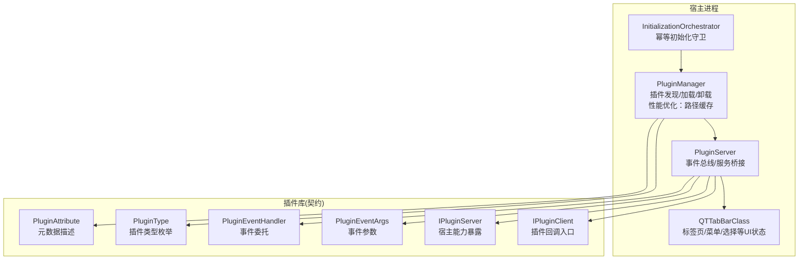

图表来源
- [PluginManager.cs:31-122](file://QTTabBar/PluginManager.cs#L31-L122)
- [PluginServer.cs:32-69](file://QTTabBar/PluginServer.cs#L32-L69)
- [InitializationOrchestrator.cs:36-70](file://QTTabBar/InitializationOrchestrator.cs#L36-L70)
- [IPluginClient.cs:21-30](file://QTPluginLib/IPluginClient.cs#L21-L30)
- [IPluginServer.cs:24-76](file://QTPluginLib/IPluginServer.cs#L24-L76)
- [PluginType.cs:19-24](file://QTPluginLib/PluginType.cs#L19-L24)
- [PluginAttribute.cs:22-62](file://QTPluginLib/PluginAttribute.cs#L22-L62)
- [PluginEventArgs.cs:21-52](file://QTPluginLib/PluginEventArgs.cs#L21-L52)
- [PluginEventHandler.cs:19-20](file://QTPluginLib/PluginEventHandler.cs#L19-20)

章节来源
- [README.md:1-60](file://README.md#L1-L60)

## 核心组件
- IPluginClient：插件侧回调入口，宿主在特定时机调用，如打开、关闭、菜单点击、快捷键触发、选项面板等。
- IPluginServer：宿主能力暴露给插件的接口，包含事件订阅、标签页操作、选择集控制、命令执行、菜单注册、本地化字符串获取等。
- PluginManager：插件程序集扫描、校验、加载、实例缓存、刷新与卸载；内置来源与签名校验策略；**新增性能优化：程序集路径缓存、智能重载检测**。
- PluginServer：插件实例生命周期管理、事件分发、与 UI/Shell 的桥接。
- InitializationOrchestrator：**新增幂等初始化守卫**，确保初始化逻辑只执行一次。
- 插件类型与元数据：通过 PluginType 与 PluginAttribute 声明插件类别与基本信息。
- 事件体系：基于 PluginEventHandler 与 PluginEventArgs 的事件模型。

章节来源
- [IPluginClient.cs:21-30](file://QTPluginLib/IPluginClient.cs#L21-L30)
- [IPluginServer.cs:24-76](file://QTPluginLib/IPluginServer.cs#L24-L76)
- [PluginManager.cs:31-122](file://QTTabBar/PluginManager.cs#L31-L122)
- [PluginServer.cs:32-69](file://QTTabBar/PluginServer.cs#L32-L69)
- [InitializationOrchestrator.cs:36-70](file://QTTabBar/InitializationOrchestrator.cs#L36-L70)
- [PluginType.cs:19-24](file://QTPluginLib/PluginType.cs#L19-L24)
- [PluginAttribute.cs:22-62](file://QTPluginLib/PluginAttribute.cs#L22-L62)
- [PluginEventArgs.cs:21-52](file://QTPluginLib/PluginEventArgs.cs#L21-L52)
- [PluginEventHandler.cs:19-20](file://QTPluginLib/PluginEventHandler.cs#L19-20)

## 架构总览
插件系统与宿主的交互遵循"双向接口 + 事件驱动"的模式，**新增性能优化层**以提升系统响应速度和减少资源消耗：
- 启动阶段：InitializationOrchestrator 通过幂等初始化守卫确保初始化只执行一次，PluginManager 读取注册表中的插件路径（使用30秒缓存），进行来源/签名校验，加载程序集并解析元数据，按需创建静态插件实例。
- 运行阶段：PluginServer 维护插件实例字典，向插件注入 IPluginServer 与 IShellBrowser，并通过事件通知插件宿主状态变化。
- 卸载阶段：按插件类型与启用状态，调用 Close 并清理资源。
- **智能重载**：通过比较磁盘文件时间戳与 LastLoadTime 属性，避免不必要的重新加载。

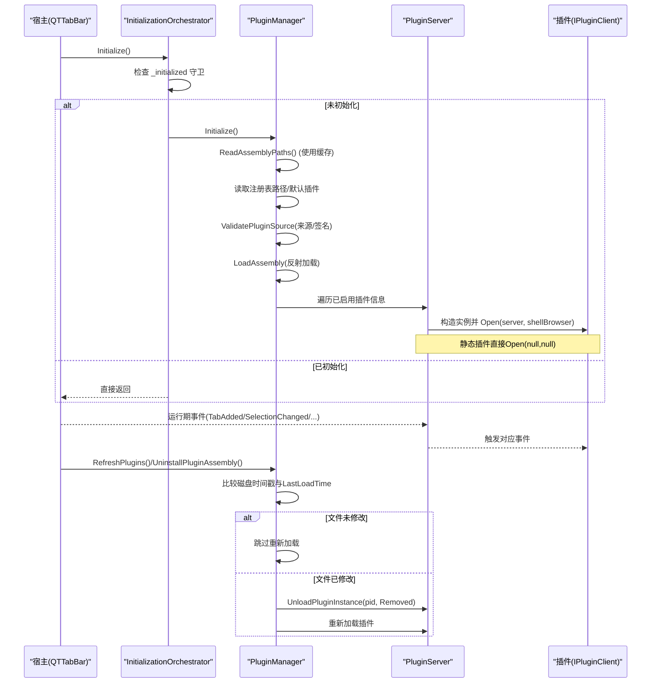

图表来源
- [InitializationOrchestrator.cs:40-70](file://QTTabBar/InitializationOrchestrator.cs#L40-L70)
- [PluginManager.cs:59-70](file://QTTabBar/PluginManager.cs#L59-L70)
- [PluginManager.cs:359-382](file://QTTabBar/PluginManager.cs#L359-L382)
- [PluginManager.cs:405-424](file://QTTabBar/PluginManager.cs#L405-L424)
- [PluginManager.cs:53-55](file://QTTabBar/PluginManager.cs#L53-L55)
- [PluginManager.cs:614-626](file://QTTabBar/PluginManager.cs#L614-L626)

## 详细组件分析

### 接口设计与职责边界
- IPluginClient（插件回调入口）
  - 关键方法：Open、Close、OnMenuItemClick、OnOption、OnShortcutKeyPressed、QueryShortcutKeys。
  - 属性：HasOption 表示是否提供选项面板。
  - 设计要点：所有宿主对插件的主动调用均通过此接口，避免插件直接耦合宿主内部类型。
- IPluginServer（宿主能力暴露）
  - 事件：ExplorerStateChanged、NavigationComplete、PointedTabChanged、SelectionChanged、SettingsChanged、TabAdded/Changed/Removed、MouseEnter/Leave、MenuRendererChanged。
  - 能力：创建标签/窗口、执行命令、获取/设置选择集、注册菜单项、获取本地化字符串、更新按钮状态、错误日志记录等。
  - 设计要点：将宿主 UI/Shell 能力抽象为稳定的 API，插件仅依赖该接口，降低耦合度。

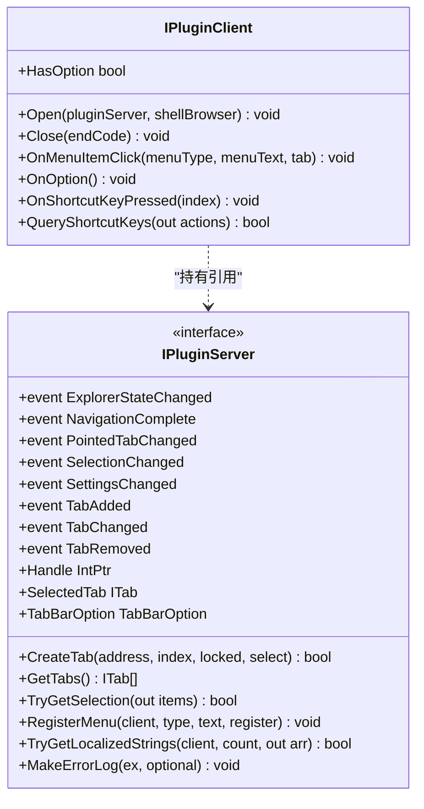

图表来源
- [IPluginClient.cs:21-30](file://QTPluginLib/IPluginClient.cs#L21-L30)
- [IPluginServer.cs:24-76](file://QTPluginLib/IPluginServer.cs#L24-L76)

章节来源
- [IPluginClient.cs:21-30](file://QTPluginLib/IPluginClient.cs#L21-L30)
- [IPluginServer.cs:24-76](file://QTPluginLib/IPluginServer.cs#L24-L76)

### 插件类型与生命周期
- 插件类型（PluginType）
  - Interactive：交互式插件，随标签页或用户操作激活。
  - Background：后台插件，常驻运行，可参与过滤等。
  - BackgroundMultiple：多实例后台插件。
  - Static：静态插件，应用启动时即创建并调用 Open。
- 生命周期
  - 加载：InitializationOrchestrator 通过幂等守卫确保只初始化一次，PluginManager 扫描注册表路径（使用缓存），校验来源/签名后加载程序集，解析 PluginAttribute 元数据。
  - 初始化：PluginServer.Load 创建实例并调用 Open(server, shellBrowser)。
  - 运行：通过事件总线与宿主交互。
  - 卸载：根据类型与状态调用 Close(code)，并从实例字典移除。

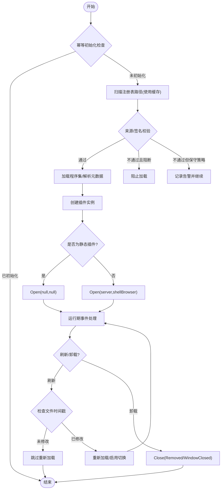

图表来源
- [InitializationOrchestrator.cs:40-70](file://QTTabBar/InitializationOrchestrator.cs#L40-L70)
- [PluginManager.cs:59-70](file://QTTabBar/PluginManager.cs#L59-L70)
- [PluginManager.cs:359-382](file://QTTabBar/PluginManager.cs#L359-L382)
- [PluginManager.cs:405-424](file://QTTabBar/PluginManager.cs#L405-L424)
- [PluginManager.cs:330-349](file://QTTabBar/PluginManager.cs#L330-L349)
- [PluginServer.cs:333-349](file://QTTabBar/PluginServer.cs#L333-L349)
- [PluginServer.cs:647-655](file://QTTabBar/PluginServer.cs#L647-L655)
- [PluginType.cs:19-24](file://QTPluginLib/PluginType.cs#L19-L24)

章节来源
- [PluginType.cs:19-24](file://QTPluginLib/PluginType.cs#L19-L24)
- [InitializationOrchestrator.cs:40-70](file://QTTabBar/InitializationOrchestrator.cs#L40-L70)
- [PluginManager.cs:330-349](file://QTTabBar/PluginManager.cs#L330-L349)
- [PluginServer.cs:333-349](file://QTTabBar/PluginServer.cs#L333-L349)

### 插件发现、加载与卸载机制
- 发现
  - 从注册表 HKCU\...\Plugins\Paths 读取 DLL 路径列表，**使用30秒缓存减少注册表访问**。
  - 支持初始化默认插件集合（ProgramData 下预设）。
- 加载
  - 使用反射加载程序集，解析 PluginAttribute 与类型，生成 PluginInformation。
  - 根据 Config.Plugin.Enabled 标记启用状态。
  - **记录 LastLoadTime 用于智能重载检测**。
- 卸载
  - 遍历程序集中所有插件 ID，广播卸载消息，关闭静态插件实例，清理字典与资源。

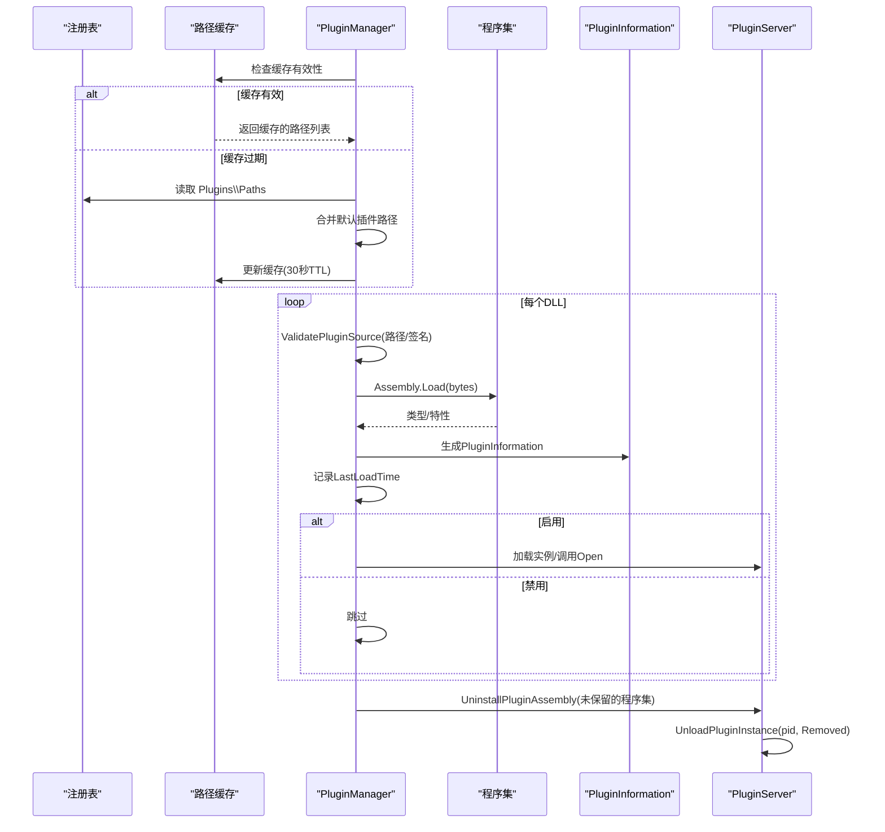

图表来源
- [PluginManager.cs:359-382](file://QTTabBar/PluginManager.cs#L359-L382)
- [PluginManager.cs:124-143](file://QTTabBar/PluginManager.cs#L124-L143)
- [PluginManager.cs:442-456](file://QTTabBar/PluginManager.cs#L442-L456)
- [PluginManager.cs:614-626](file://QTTabBar/PluginManager.cs#L614-L626)
- [PluginServer.cs:647-655](file://QTTabBar/PluginServer.cs#L647-L655)

章节来源
- [PluginManager.cs:359-382](file://QTTabBar/PluginManager.cs#L359-L382)
- [PluginManager.cs:124-143](file://QTTabBar/PluginManager.cs#L124-L143)
- [PluginManager.cs:442-456](file://QTTabBar/PluginManager.cs#L442-L456)

### 安全机制：来源校验与签名验证
- 受信任目录：默认仅主程序集所在目录视为受信任。
- 签名校验：优先 Authenticode 证书链校验（离线吊销），其次强名称（PublicKeyToken 与主程序一致）。
- 策略：默认保守（校验失败仍加载但记录日志），可通过配置 BlockUntrustedPlugins 开启阻断。

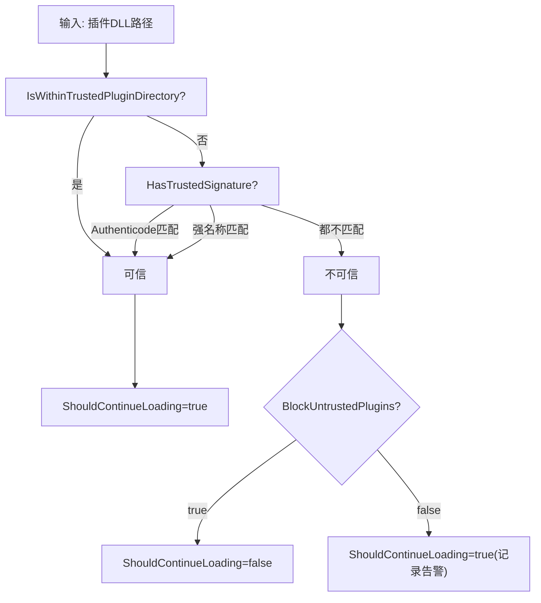

图表来源
- [PluginManager.cs:154-166](file://QTTabBar/PluginManager.cs#L154-L166)
- [PluginManager.cs:182-209](file://QTTabBar/PluginManager.cs#L182-L209)
- [PluginManager.cs:215-259](file://QTTabBar/PluginManager.cs#L215-L259)
- [PluginManager.cs:299-328](file://QTTabBar/PluginManager.cs#L299-L328)

章节来源
- [PluginManager.cs:154-166](file://QTTabBar/PluginManager.cs#L154-L166)
- [PluginManager.cs:182-209](file://QTTabBar/PluginManager.cs#L182-L209)
- [PluginManager.cs:215-259](file://QTTabBar/PluginManager.cs#L215-L259)
- [PluginManager.cs:299-328](file://QTTabBar/PluginManager.cs#L299-L328)

### 事件系统与通信机制
- 事件源：PluginServer 暴露丰富事件，覆盖导航、选择、设置、鼠标、菜单渲染等。
- 事件参数：PluginEventArgs 携带索引、地址或窗口动作。
- 通信模式：
  - 宿主 -> 插件：通过 IPluginClient 回调（菜单点击、快捷键、选项面板等）。
  - 插件 -> 宿主：通过 IPluginServer 提供的 API（创建标签、执行命令、注册菜单、获取/设置选择等）。
  - 异步通知：通过事件总线，插件订阅感兴趣的事件以响应宿主状态变化。

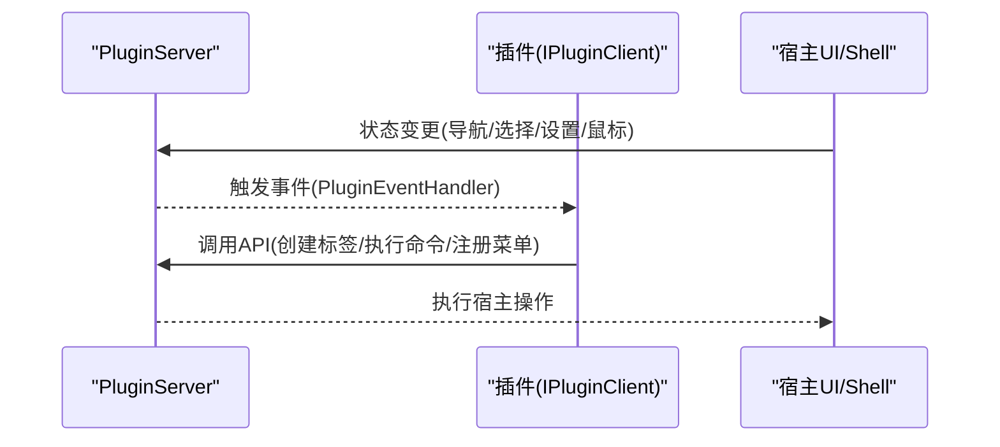

图表来源
- [PluginServer.cs:44-54](file://QTTabBar/PluginServer.cs#L44-L54)
- [PluginEventArgs.cs:21-52](file://QTPluginLib/PluginEventArgs.cs#L21-L52)
- [PluginEventHandler.cs:19-20](file://QTPluginLib/PluginEventHandler.cs#L19-20)
- [IPluginServer.cs:24-76](file://QTPluginLib/IPluginServer.cs#L24-L76)
- [IPluginClient.cs:21-30](file://QTPluginLib/IPluginClient.cs#L21-L30)

章节来源
- [PluginServer.cs:44-54](file://QTTabBar/PluginServer.cs#L44-L54)
- [PluginEventArgs.cs:21-52](file://QTPluginLib/PluginEventArgs.cs#L21-L52)
- [PluginEventHandler.cs:19-20](file://QTPluginLib/PluginEventHandler.cs#L19-20)
- [IPluginServer.cs:24-76](file://QTPluginLib/IPluginServer.cs#L24-L76)
- [IPluginClient.cs:21-30](file://QTPluginLib/IPluginClient.cs#L21-L30)

### 插件配置管理、版本兼容与更新
- 配置
  - 插件路径：注册表 HKCU\...\Plugins\Paths 存储，**使用30秒缓存减少访问频率**。
  - 启用状态：Config.Plugin.Enabled 控制。
  - 语言包：PluginServer 启动时加载插件语言文件，提供 TryGetLocalizedStrings。
- 版本兼容
  - 插件元数据包含 Version，用于显示与识别。
  - 宿主通过反射加载，若类型/特性缺失会记录错误日志。
- 更新
  - 支持 RefreshPlugins 动态刷新，自动卸载不再存在的程序集，重新加载启用的插件。
  - **智能重载检测**：通过比较磁盘文件时间戳与 LastLoadTime 属性，避免不必要的重新加载。

章节来源
- [PluginManager.cs:359-382](file://QTTabBar/PluginManager.cs#L359-L382)
- [PluginManager.cs:366-423](file://QTTabBar/PluginManager.cs#L366-L423)
- [PluginManager.cs:405-424](file://QTTabBar/PluginManager.cs#L405-L424)
- [PluginServer.cs:56-69](file://QTTabBar/PluginServer.cs#L56-L69)
- [PluginServer.cs:592-599](file://QTTabBar/PluginServer.cs#L592-L599)
- [PluginAttribute.cs:22-62](file://QTPluginLib/PluginAttribute.cs#L22-L62)

## 性能优化机制

### 程序集路径缓存机制
**新增** 为了减少频繁的注册表访问开销，PluginManager 实现了程序集路径缓存机制：

- **缓存字段**：`_cachedAssemblyPaths` 存储路径数组，`_assemblyPathsCacheExpiryUtc` 记录缓存过期时间
- **缓存策略**：30秒 TTL（Time To Live），超过有效期后自动失效
- **缓存失效**：当保存新的插件路径时，通过 `InvalidateAssemblyPathsCache()` 方法清空缓存
- **性能提升**：显著减少注册表访问频率，提升插件刷新响应速度

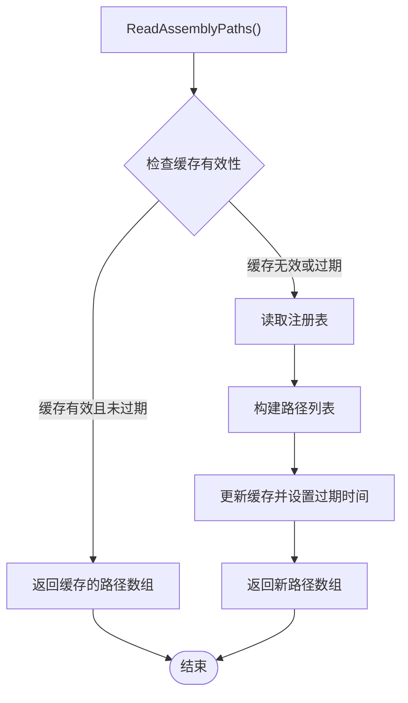

图表来源
- [PluginManager.cs:53-55](file://QTTabBar/PluginManager.cs#L53-L55)
- [PluginManager.cs:359-382](file://QTTabBar/PluginManager.cs#L359-L382)
- [PluginManager.cs:384-387](file://QTTabBar/PluginManager.cs#L384-L387)

章节来源
- [PluginManager.cs:53-55](file://QTTabBar/PluginManager.cs#L53-L55)
- [PluginManager.cs:359-382](file://QTTabBar/PluginManager.cs#L359-L382)
- [PluginManager.cs:384-387](file://QTTabBar/PluginManager.cs#L384-L387)

### 幂等初始化守卫
**新增** 多个关键组件实现了幂等初始化守卫，确保初始化逻辑只执行一次：

- **PluginManager.Initialize()**：使用 `_initialized` 字段防止重复初始化
- **InitializationOrchestrator.Initialize()**：双重检查锁定模式，确保线程安全的单次初始化
- **InstanceManager.Initialize()**：同样采用幂等守卫机制

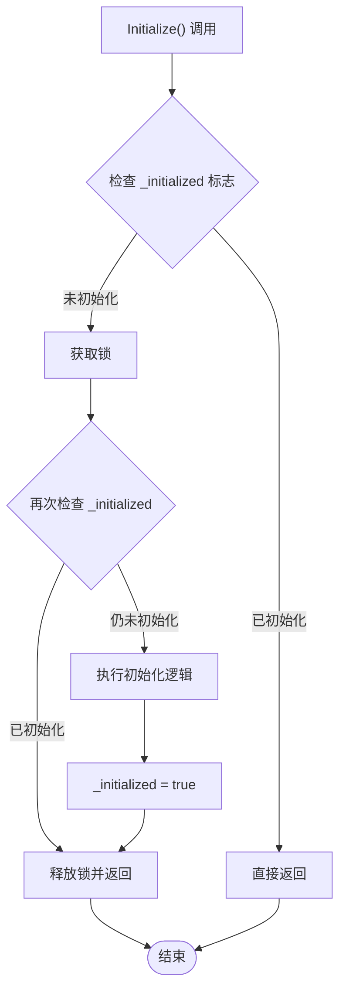

图表来源
- [PluginManager.cs:57-70](file://QTTabBar/PluginManager.cs#L57-L70)
- [InitializationOrchestrator.cs:36-70](file://QTTabBar/InitializationOrchestrator.cs#L36-L70)

章节来源
- [PluginManager.cs:57-70](file://QTTabBar/PluginManager.cs#L57-L70)
- [InitializationOrchestrator.cs:36-70](file://QTTabBar/InitializationOrchestrator.cs#L36-L70)

### 智能插件重载检测
**新增** 通过文件系统时间戳比较实现智能重载检测，避免不必要的插件重新加载：

- **LastLoadTime 属性**：PluginAssembly 类记录程序集的最后加载时间
- **时间戳比较**：在 RefreshPlugins() 中比较磁盘文件的最后写入时间与 LastLoadTime
- **优化策略**：如果时间戳相同，跳过重新加载，仅更新启用状态
- **性能优势**：大幅减少反射加载和类型扫描的开销

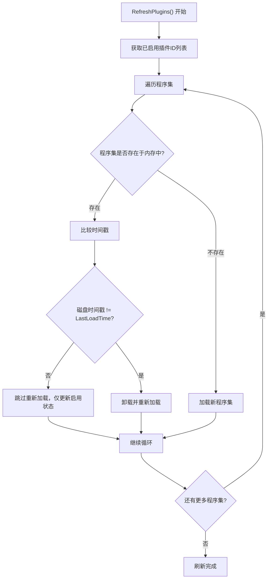

图表来源
- [PluginManager.cs:405-424](file://QTTabBar/PluginManager.cs#L405-L424)
- [PluginManager.cs:614-626](file://QTTabBar/PluginManager.cs#L614-L626)

章节来源
- [PluginManager.cs:405-424](file://QTTabBar/PluginManager.cs#L405-L424)
- [PluginManager.cs:614-626](file://QTTabBar/PluginManager.cs#L614-L626)

### 缓存失效机制
**新增** 完善的缓存失效机制确保数据一致性：

- **SavePluginAssemblyPaths()**：保存新路径后立即调用 `InvalidateAssemblyPathsCache()`
- **InvalidateAssemblyPathsCache()**：清空缓存数组并将过期时间重置为最小值
- **自动失效**：30秒 TTL 到期后自动失效，下次访问时重新从注册表读取

章节来源
- [PluginManager.cs:454-466](file://QTTabBar/PluginManager.cs#L454-L466)
- [PluginManager.cs:384-387](file://QTTabBar/PluginManager.cs#L384-L387)

## 依赖关系分析
- 松耦合：插件仅依赖 QTPluginLib 定义的接口与类型，不直接引用宿主内部实现。
- 高内聚：PluginManager 专注程序集与实例管理；PluginServer 专注事件与能力桥接。
- 外部依赖：Windows Shell COM 接口、注册表、文件系统、X509 证书链等。
- **新增依赖**：InitializationOrchestrator 协调各组件的初始化顺序。

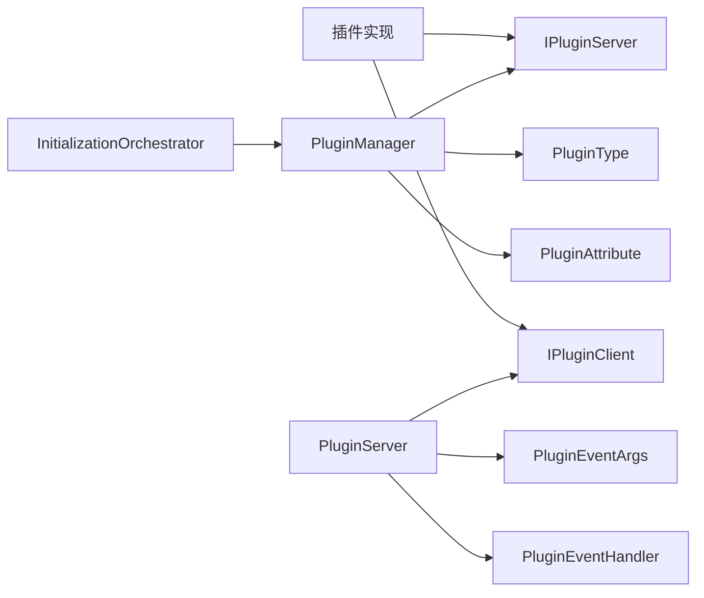

图表来源
- [IPluginClient.cs:21-30](file://QTPluginLib/IPluginClient.cs#L21-L30)
- [IPluginServer.cs:24-76](file://QTPluginLib/IPluginServer.cs#L24-L76)
- [PluginManager.cs:31-122](file://QTTabBar/PluginManager.cs#L31-L122)
- [PluginServer.cs:32-69](file://QTTabBar/PluginServer.cs#L32-L69)
- [InitializationOrchestrator.cs:36-70](file://QTTabBar/InitializationOrchestrator.cs#L36-L70)
- [PluginType.cs:19-24](file://QTPluginLib/PluginType.cs#L19-L24)
- [PluginAttribute.cs:22-62](file://QTPluginLib/PluginAttribute.cs#L22-L62)
- [PluginEventArgs.cs:21-52](file://QTPluginLib/PluginEventArgs.cs#L21-L52)
- [PluginEventHandler.cs:19-20](file://QTPluginLib/PluginEventHandler.cs#L19-20)

章节来源
- [PluginManager.cs:31-122](file://QTTabBar/PluginManager.cs#L31-L122)
- [PluginServer.cs:32-69](file://QTTabBar/PluginServer.cs#L32-L69)

## 性能考虑
- 反射开销：程序集加载与类型扫描发生在启动与刷新阶段，应避免频繁刷新。**新增智能重载检测可减少不必要的反射操作**。
- 图像资源：按钮图标可能通过反射访问资源，注意异常捕获与释放。
- 事件风暴：大量事件订阅需避免在高频事件中执行耗时逻辑，必要时节流或异步处理。
- 内存泄漏：确保在 Close 中释放非托管资源与事件解绑。
- **注册表访问**：**新增30秒缓存机制显著减少注册表访问频率**。
- **初始化性能**：**幂等初始化守卫避免重复初始化开销**。
- **文件监控**：**时间戳比较避免不必要的程序集重新加载**。

## 故障排查指南
- 常见错误
  - 插件程序集加载失败：检查反射加载异常与 LoaderExceptions。
  - 未找到插件特性：确认类上正确标注 PluginAttribute。
  - 签名校验失败：确认证书链有效或强名称与主程序一致。
  - 事件未触发：确认插件是否正确订阅事件并在合适时机解绑。
  - **性能问题**：检查缓存是否正常工作，确认时间戳比较逻辑是否正确。
- 定位手段
  - 查看错误日志输出位置（参考 README 中的异常日志路径）。
  - 使用 MakeErrorLog 记录上下文信息。
  - 通过 IsPluginInstantialized 与 TryGetPlugin 辅助诊断实例状态。
  - **性能诊断**：检查 `_cachedAssemblyPaths` 缓存状态和 `_assemblyPathsCacheExpiryUtc` 过期时间。
  - **初始化问题**：验证 `_initialized` 标志位状态，确认幂等守卫是否正常工作。

章节来源
- [PluginManager.cs:631-638](file://QTTabBar/PluginManager.cs#L631-L638)
- [PluginManager.cs:45-51](file://QTTabBar/PluginManager.cs#L45-L51)
- [PluginServer.cs:446-449](file://QTTabBar/PluginServer.cs#L446-L449)
- [PluginServer.cs:329-331](file://QTTabBar/PluginServer.cs#L329-L331)
- [README.md:23-24](file://README.md#L23-L24)
- [PluginManager.cs:53-55](file://QTTabBar/PluginManager.cs#L53-L55)
- [PluginManager.cs:57-70](file://QTTabBar/PluginManager.cs#L57-L70)

## 结论
QTTabBar-Next 的插件系统以清晰的接口契约与稳健的生命周期管理为核心，结合来源与签名校验的安全策略，提供了可扩展、可维护的扩展点。**最新的性能优化机制进一步提升了系统响应速度和资源利用效率**，包括程序集路径缓存、幂等初始化守卫和智能重载检测。通过事件驱动的通信模型，插件能够以低耦合方式深度集成到宿主功能中。遵循本文的开发指南与最佳实践，可显著提升插件质量与用户体验。

## 附录：插件开发指南与最佳实践

- 项目模板建议
  - 新建 .NET Framework 4.8 类库项目，引用 QTPluginLib。
  - 实现 IPluginClient 接口，并在类上标注 PluginAttribute，指定 PluginType、Name、Version、Author、Description。
  - 如需按钮图标，可在同命名空间下提供 Resource 类并按约定暴露 _large/_small 属性。
- 接口实现示例（路径指引）
  - 实现 IPluginClient.Open 以接收 IPluginServer 与 IShellBrowser 引用。
  - 在 OnMenuItemClick/OnOption/OnShortcutKeyPressed 中实现交互逻辑。
  - 使用 IPluginServer 提供的 API 完成标签页操作、选择集控制、菜单注册与本地化字符串获取。
- 调试技巧
  - 使用 MakeErrorLog 输出详细上下文。
  - 在 Open 中尽早注册事件，在 Close 中及时解绑与释放资源。
  - 利用 IsPluginInstantialized/TryGetPlugin 判断实例状态。
  - **性能调试**：检查缓存命中率和时间戳比较结果。
- 发布流程
  - 编译为 x86 程序集，放置于受信任目录或通过注册表添加路径。
  - 使用 Authenticode 签名或强名称，确保与主程序发布者一致。
  - 在宿主中启用插件（Config.Plugin.Enabled），必要时重启 Explorer。
- 最佳实践
  - 避免在事件处理中执行阻塞操作，必要时使用线程池或异步任务。
  - 谨慎访问 Shell COM 对象，遵循引用计数与线程亲和性要求。
  - 对可选功能进行健壮性检查，防止因宿主环境差异导致崩溃。
  - 保持向后兼容，仅在必要时引入破坏性变更，并通过版本号明确说明。
  - **性能优化**：理解并利用宿主提供的缓存机制，避免重复计算和I/O操作。

章节来源
- [PluginAttribute.cs:22-62](file://QTPluginLib/PluginAttribute.cs#L22-L62)
- [IPluginClient.cs:21-30](file://QTPluginLib/IPluginClient.cs#L21-L30)
- [IPluginServer.cs:24-76](file://QTPluginLib/IPluginServer.cs#L24-L76)
- [PluginManager.cs:124-143](file://QTTabBar/PluginManager.cs#L124-L143)
- [PluginManager.cs:299-328](file://QTTabBar/PluginManager.cs#L299-L328)
- [PluginServer.cs:333-349](file://QTTabBar/PluginServer.cs#L333-L349)
- [PluginServer.cs:592-599](file://QTTabBar/PluginServer.cs#L592-L599)
- [README.md:23-24](file://README.md#L23-L24)
- [PluginManager.cs:53-55](file://QTTabBar/PluginManager.cs#L53-L55)
- [PluginManager.cs:359-382](file://QTTabBar/PluginManager.cs#L359-L382)
- [PluginManager.cs:405-424](file://QTTabBar/PluginManager.cs#L405-L424)