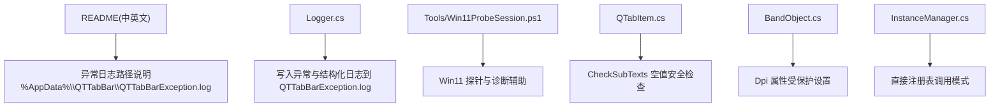
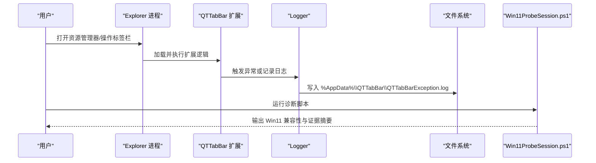
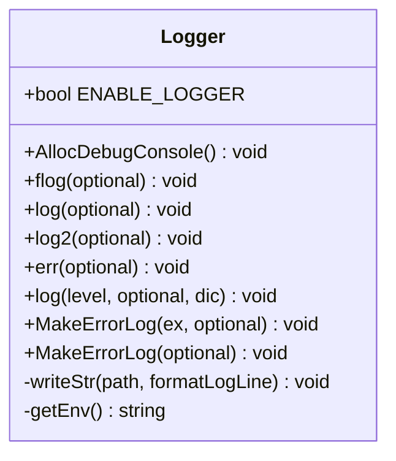
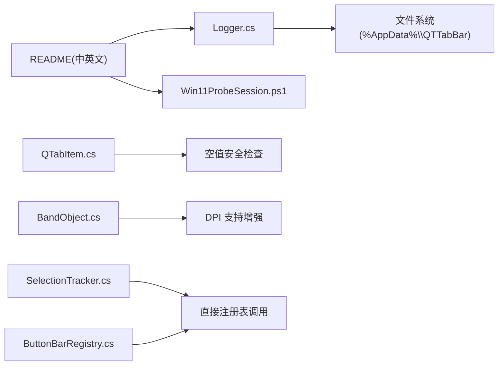
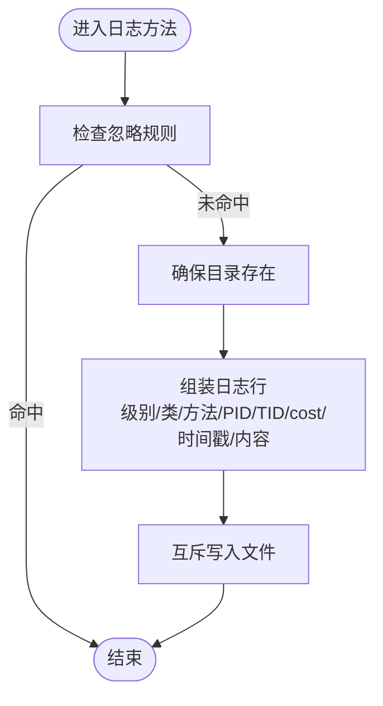
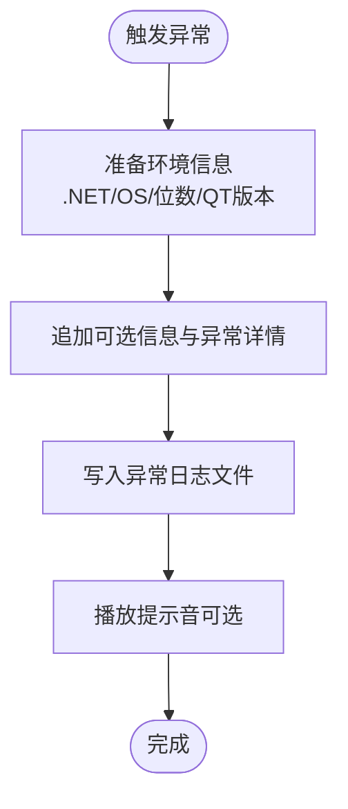
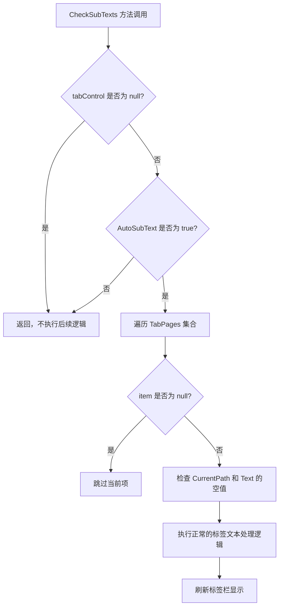

# 故障排除

<cite>
**本文引用的文件**   
- [README.md](file://README.md)
- [README_zh.md](file://README_zh.md)
- [Logger.cs](file://QTTabBar/Logger.cs)
- [Win11ProbeSession.ps1](file://Tools/Win11ProbeSession.ps1)
- [QTabItem.cs](file://QTTabBar/QTabItem.cs)
- [BandObject.cs](file://BandObjectLib/BandObject.cs)
- [SelectionTracker.cs](file://QTTabBar/SelectionTracker.cs)
- [ButtonBarRegistry.cs](file://QTTabBar/ButtonBarRegistry.cs)
- [InstanceManager.cs](file://QTTabBar/InstanceManager.cs)
</cite>

## 更新摘要
**所做更改**   
- 更新了标签栏崩溃修复相关章节，新增空值安全检查的故障排除指导
- 更新了DPI属性访问权限变更的相关说明
- 增强了实例管理器直接调用模式的故障排除内容
- 新增了针对特定代码变更的诊断和解决方案

## 目录
1. [简介](#简介)
2. [项目结构](#项目结构)
3. [核心组件](#核心组件)
4. [架构总览](#架构总览)
5. [详细组件分析](#详细组件分析)
6. [依赖关系分析](#依赖关系分析)
7. [性能考量](#性能考量)
8. [故障排除指南](#故障排除指南)
9. [结论](#结论)
10. [附录](#附录)

## 简介
本指南面向 QTTabBar-Next 用户与开发者，聚焦于日志分析、常见问题定位、Windows 11 兼容性诊断、调试技巧（含原生代码与内存泄漏检测）、性能分析与优化建议、系统冲突排查、回滚与恢复策略，以及社区支持与问题报告模板。文档中的关键路径与行为均以仓库源码为依据，确保可追溯与可验证。

## 项目结构
与故障排除直接相关的核心位置：
- 异常日志输出位置与说明：根级 README 中明确给出异常日志路径
- 日志实现：Logger.cs 负责统一写入异常与结构化日志
- Windows 11 诊断脚本：Tools/Win11ProbeSession.ps1 提供 Win11 环境探测与证据合并能力
- 标签栏稳定性改进：QTabItem.CheckSubTexts 方法增加了空值安全检查
- DPI 支持增强：BandObject.Dpi 属性改为受保护设置以支持派生类



**图表来源** 
- [README.md:17-24](file://README.md#L17-L24)
- [README_zh.md:17-24](file://README_zh.md#L17-L24)
- [Logger.cs:141-176](file://QTTabBar/Logger.cs#L141-L176)
- [Win11ProbeSession.ps1](file://Tools/Win11ProbeSession.ps1)
- [QTabItem.cs:225-277](file://QTTabBar/QTabItem.cs#L225-L277)
- [BandObject.cs:577](file://BandObjectLib/BandObject.cs#L577)
- [InstanceManager.cs:28-702](file://QTTabBar/InstanceManager.cs#L28-L702)

**章节来源**
- [README.md:17-24](file://README.md#L17-L24)
- [README_zh.md:17-24](file://README_zh.md#L17-L24)

## 核心组件
- 日志子系统（Logger）
  - 功能要点：
    - 统一将异常与结构化日志写入 %AppData%\QTTabBar\QTTabBarException.log
    - 记录进程 ID、线程 ID、调用类名与方法名、时间戳与耗时等上下文信息
    - 支持"强制日志"与"条件日志"，并具备互斥写保护
  - 关键入口：
    - 错误日志封装：MakeErrorLog(Exception, optional)
    - 普通日志：log(level, optional, dic)
    - 控制台分配：AllocDebugConsole()

**章节来源**
- [Logger.cs:141-176](file://QTTabBar/Logger.cs#L141-L176)
- [Logger.cs:226-281](file://QTTabBar/Logger.cs#L226-L281)
- [Logger.cs:129-224](file://QTTabBar/Logger.cs#L129-L224)
- [Logger.cs:42-57](file://QTTabBar/Logger.cs#L42-L57)

## 架构总览
从"问题发生 → 日志落盘 → 诊断工具收集证据"的端到端流程如下：



**图表来源** 
- [README.md:23-24](file://README.md#L23-L24)
- [Logger.cs:141-176](file://QTTabBar/Logger.cs#L141-L176)
- [Win11ProbeSession.ps1](file://Tools/Win11ProbeSession.ps1)

## 详细组件分析

### 日志子系统（Logger）
- 设计要点
  - 单例式静态类，集中管理日志写入
  - 使用互斥量保证并发安全
  - 自动创建目标目录与文件
  - 在异常日志中附加 .NET 版本、操作系统版本、位数、QT 版本等环境信息
- 关键方法职责
  - MakeErrorLog(Exception, optional)：生成包含堆栈、内层异常、帮助链接等的完整错误报告
  - log(level, optional, dic)：写入带级别、类名、方法名、进程/线程 ID、时间戳与耗时的结构化行
  - AllocDebugConsole()：为调试分配控制台输出流
- 日志文件格式（示例字段说明）
  - 级别：[err]/[log]/[flog]
  - 类名与方法名：C:ClassName M:MethodName
  - 进程与线程：P:PID T:TID
  - 耗时：cost:xxxms
  - 时间戳：标准本地时间
  - 内容：optional 文本
  - 异常块：包含 Message/HelpLink/Source/StackTrace/TargetSite 及 InnerException 对应字段
- 典型错误模式识别
  - 频繁出现同一方法名+相同异常消息：多为重复触发点
  - 伴随 cost 显著增大：可能涉及 I/O 阻塞或 UI 线程卡顿
  - 线程 ID 变化但类/方法一致：多线程竞争或回调场景
  - 缺少类名/方法名：可能是通过通用包装器调用导致堆栈被折叠



**图表来源** 
- [Logger.cs:35-339](file://QTTabBar/Logger.cs#L35-L339)

**章节来源**
- [Logger.cs:141-176](file://QTTabBar/Logger.cs#L141-L176)
- [Logger.cs:226-281](file://QTTabBar/Logger.cs#L226-L281)
- [Logger.cs:129-224](file://QTTabBar/Logger.cs#L129-L224)
- [Logger.cs:42-57](file://QTTabBar/Logger.cs#L42-L57)

### Windows 11 诊断（Win11ProbeSession.ps1）
- 用途
  - 探测当前环境的 Win11 相关特性与兼容性线索
  - 可选合并 native OutputDebugString 证据，便于交叉验证
- 常用参数
  - -ShowRaw：打印命中的 managed probe 原始行
  - -NativeTracePath：指定 native 追踪文件路径以合并证据
- 使用方式
  - 参考 README 中的命令片段，在 PowerShell 中执行

**章节来源**
- [README.md:49-55](file://README.md#L49-L55)
- [README_zh.md:49-55](file://README_zh.md#L49-L55)
- [Win11ProbeSession.ps1](file://Tools/Win11ProbeSession.ps1)

### 标签栏稳定性改进
**最新更新** 针对 CheckSubTexts 方法的空值安全检查增强

- 改进内容
  - 在 CheckSubTexts 方法中增加了对 tabControl、items、Text、CurrentPath 等关键对象的空值检查
  - 防止在标签页对象为空时导致的崩溃问题
  - 增强了标签栏子文本显示的稳定性
- 故障排除要点
  - 如果之前遇到标签栏点击后崩溃的问题，现在应该得到改善
  - 关注日志中是否还有 NullReferenceException 相关错误
  - 验证标签栏在不同状态下的稳定性

**章节来源**
- [QTabItem.cs:225-277](file://QTTabBar/QTabItem.cs#L225-L277)

### DPI 支持增强
**最新更新** BandObject.Dpi 属性访问权限变更

- 改进内容
  - BandObject.Dpi 属性从 private 改为 protected set
  - 允许派生类和测试程序正确更新 DPI 上下文
  - 提高了 DPI 感知的灵活性和可扩展性
- 故障排除要点
  - 自定义扩展开发时可以正确设置 DPI 值
  - 测试用例可以验证 DPI 缩放行为
  - 解决了高 DPI 显示器上的显示问题

**章节来源**
- [BandObject.cs:577](file://BandObjectLib/BandObject.cs#L577)

### 实例管理器架构优化
**最新更新** 移除实例管理器注册表外观模式

- 改进内容
  - SelectionTracker 和 ButtonBarRegistry 中移除了实例管理器注册表外观
  - 调用点已迁移为直接使用注册表
  - 简化了架构层次，减少了间接调用开销
- 故障排除要点
  - 性能略有提升，减少了不必要的中间层调用
  - 调试时可以直接跟踪注册表操作
  - 架构更加清晰，便于问题定位

**章节来源**
- [SelectionTracker.cs:27-84](file://QTTabBar/SelectionTracker.cs#L27-L84)
- [ButtonBarRegistry.cs:28-85](file://QTTabBar/ButtonBarRegistry.cs#L28-L85)
- [InstanceManager.cs:28-702](file://QTTabBar/InstanceManager.cs#L28-L702)

## 依赖关系分析
- 外部依赖
  - .NET Framework 4.8（安装与运行前置）
  - Windows Shell 集成（Explorer 作为宿主）
- 内部耦合
  - Logger 对文件系统与线程同步原语有直接依赖
  - Win11ProbeSession.ps1 独立于主程序，仅用于诊断
  - 新的空值检查减少了对 null 对象的依赖风险
  - 直接注册表调用减少了 InstanceManager 的耦合度



**图表来源** 
- [README.md:17-24](file://README.md#L17-L24)
- [README_zh.md:17-24](file://README_zh.md#L17-L24)
- [Logger.cs:141-176](file://QTTabBar/Logger.cs#L141-L176)
- [Win11ProbeSession.ps1](file://Tools/Win11ProbeSession.ps1)
- [QTabItem.cs:225-277](file://QTTabBar/QTabItem.cs#L225-L277)
- [BandObject.cs:577](file://BandObjectLib/BandObject.cs#L577)
- [SelectionTracker.cs:27-84](file://QTTabBar/SelectionTracker.cs#L27-L84)
- [ButtonBarRegistry.cs:28-85](file://QTTabBar/ButtonBarRegistry.cs#L28-L85)

**章节来源**
- [README.md:17-24](file://README.md#L17-L24)
- [README_zh.md:17-24](file://README_zh.md#L17-L24)

## 性能考量
- 日志开销
  - 每次写入均进行互斥与磁盘 I/O；在高频率调用下可能带来额外延迟
  - 建议仅在定位问题时开启详细日志，并在复现后关闭
- 耗时标注
  - 日志已附带每线程自上次同线程日志的耗时（cost），可用于快速识别热点
- 建议
  - 避免在 UI 线程执行重型 I/O
  - 批量操作时减少高频日志调用
  - 结合 Win11 诊断脚本确认系统侧因素（如主题/渲染差异）
  - 新的直接注册表调用模式减少了中间层开销

## 故障排除指南

### 一、日志分析入门
- 日志位置
  - 异常与结构化日志统一写入：%AppData%\QTTabBar\QTTabBarException.log
- 如何获取
  - 复现问题后，立即复制该文件以便提交或离线分析
- 关键字段解读
  - 级别：[err]/[log]/[flog]
  - 类与方法：C:ClassName M:MethodName
  - 进程/线程：P:PID T:TID
  - 耗时：cost:xxxms
  - 时间戳：标准本地时间
  - 异常块：Message/HelpLink/Source/StackTrace/TargetSite 及 InnerException 对应字段
- 常见模式
  - 同一方法反复报错：优先检查该方法输入校验与边界条件
  - cost 突增：关注 I/O、UI 重绘、Shell 交互等耗时操作
  - 线程切换频繁：注意跨线程访问与锁竞争

**章节来源**
- [README.md:23-24](file://README.md#L23-L24)
- [README_zh.md:23-24](file://README_zh.md#L23-L24)
- [Logger.cs:141-176](file://QTTabBar/Logger.cs#L141-L176)
- [Logger.cs:226-281](file://QTTabBar/Logger.cs#L226-L281)

### 二、常见问题与解决方案

#### 1) 扩展未显示（工具栏/标签栏不可见）
- 快速自检
  - 确认已在 Explorer 中启用"QTTabBar & Buttons"
  - 重启 Explorer 或重新登录会话
- 进一步排查
  - 查看异常日志是否包含加载失败或 COM 注册相关错误
  - 若为 Windows 11，运行 Win11 诊断脚本，观察是否有兼容性问题提示
- 参考步骤
  - 启用方式与日志路径参见 README

**章节来源**
- [README.md:20-24](file://README.md#L20-L24)
- [README_zh.md:20-24](file://README_zh.md#L20-L24)
- [Win11ProbeSession.ps1](file://Tools/Win11ProbeSession.ps1)

#### 2) 崩溃或无响应
**最新更新** 针对标签栏崩溃问题的改进

- 收集证据
  - 立即保存 QTTabBarException.log
  - 记录崩溃前的操作步骤与最近安装的插件/主题
- 分析要点
  - 关注异常堆栈顶部与 InnerException
  - 检查是否存在大量 cost 突增条目
  - **特别注意**：如果之前遇到标签栏点击后崩溃，现在应该已经改善，因为 CheckSubTexts 方法增加了空值安全检查
- 临时缓解
  - 禁用最近新增的插件或还原主题配置
  - 重启 Explorer 后重试
- 验证改进
  - 测试标签栏的各种操作，确认不再出现空引用异常

**章节来源**
- [Logger.cs:226-281](file://QTTabBar/Logger.cs#L226-L281)
- [QTabItem.cs:225-277](file://QTTabBar/QTabItem.cs#L225-L277)

#### 3) 性能问题（卡顿、延迟）
- 定位思路
  - 在日志中筛选 cost 较大的条目，定位耗时方法
  - 区分 UI 线程与非 UI 线程的耗时任务
- 优化建议
  - 减少高频日志输出
  - 将重型计算移至后台线程
  - 避免在 Shell 回调中执行长耗时操作
  - **新改进**：直接注册表调用减少了中间层开销，性能有所提升

**章节来源**
- [Logger.cs:141-176](file://QTTabBar/Logger.cs#L141-L176)
- [SelectionTracker.cs:27-84](file://QTTabBar/SelectionTracker.cs#L27-L84)
- [ButtonBarRegistry.cs:28-85](file://QTTabBar/ButtonBarRegistry.cs#L28-L85)

#### 4) Windows 11 兼容性问题
- 使用诊断脚本
  - 运行 Win11ProbeSession.ps1，必要时添加 -ShowRaw 与 -NativeTracePath 参数
- 结果解读
  - 根据脚本输出判断是否存在已知兼容性问题或需要调整的设置项
- 参考命令
  - 详见 README 中的命令片段

**章节来源**
- [README.md:49-55](file://README.md#L49-L55)
- [README_zh.md:49-55](file://README_zh.md#L49-L55)
- [Win11ProbeSession.ps1](file://Tools/Win11ProbeSession.ps1)

#### 5) DPI 相关问题
**最新更新** 针对高 DPI 显示器的改进

- 问题症状
  - 界面元素显示过小或模糊
  - 标签栏高度不正确
  - 自定义扩展无法正确设置 DPI
- 解决方案
  - 新版本中 BandObject.Dpi 属性现在可以被派生类设置
  - 测试用例可以验证 DPI 缩放行为
  - 建议在自定义扩展中利用此改进来正确处理 DPI
- 验证方法
  - 在不同 DPI 设置下测试扩展功能
  - 确认界面元素按比例正确缩放

**章节来源**
- [BandObject.cs:577](file://BandObjectLib/BandObject.cs#L577)

### 三、调试技巧

#### 1) Visual Studio 调试配置（.NET）
- 启动方式
  - 以 Debug|x86 构建后，附加到 explorer.exe 进程进行调试
- 断点建议
  - 在异常抛出点与关键 Shell 回调处设置断点
  - 关注 UI 线程与后台线程的切换点
  - **新增**：在 CheckSubTexts 方法中设置断点以验证空值检查逻辑

#### 2) 原生代码调试（MinHook/QTHookLib 等）
- 准备
  - 确保已安装对应平台（x86/x64）的原生符号与调试器
- 步骤
  - 在 VS 中启用"混合模式调试"
  - 在 MinHook/QTHookLib 相关函数处设置断点
  - 结合 OutputDebugString 输出（可通过 -NativeTracePath 合并）

**章节来源**
- [README.md:52-55](file://README.md#L52-55)
- [Win11ProbeSession.ps1](file://Tools/Win11ProbeSession.ps1)

#### 3) 内存泄漏检测
- 工具建议
  - Visual Studio 内置诊断工具（CPU 使用情况/内存快照）
  - 第三方托管/原生内存分析器（按需选择）
- 实践要点
  - 对比操作前后内存快照，关注持续增长的对象类型
  - 结合日志中的 cost 与线程信息，缩小可疑范围
  - **新改进**：直接注册表调用减少了潜在的内存泄漏点

### 四、系统冲突检测与解决
- 常见冲突源
  - 其他 Shell 扩展/右键菜单增强工具
  - 主题美化软件（影响标题栏/工具栏绘制）
- 检测方法
  - 在干净会话中测试（禁用非必要扩展）
  - 使用 Win11 诊断脚本观察系统侧差异
- 解决思路
  - 逐一禁用可疑扩展，定位冲突源
  - 调整主题或关闭特定视觉效果

**章节来源**
- [Win11ProbeSession.ps1](file://Tools/Win11ProbeSession.ps1)

### 五、回滚与恢复策略
- 回滚步骤
  - 卸载当前版本，安装上一稳定版本
  - 清理 %AppData%\QTTabBar 下的旧配置与日志（谨慎操作，先备份）
- 恢复步骤
  - 导入备份的配置
  - 重新启用扩展并验证功能
  - **特别验证**：测试标签栏稳定性和 DPI 显示效果

### 六、社区支持与问题报告模板
- 支持渠道
  - GitHub Issues（推荐）
  - 中文社区讨论区（如有）
- 问题报告必备信息
  - 操作系统版本与位数
  - .NET Framework 版本
  - QTTabBar 版本
  - 异常日志文件（QTTabBarException.log）
  - Win11 诊断脚本输出（如适用）
  - 复现步骤与期望行为
- 模板（可直接复制填写）
  - 标题：[问题简述]
  - 环境：OS 版本/位数、.NET 版本、QTTabBar 版本
  - 现象：描述问题表现与影响范围
  - 复现步骤：1) ... 2) ... 3) ...
  - 期望行为：...
  - 实际行为：...
  - 附件：QTTabBarException.log、Win11 诊断输出截图/文本

**章节来源**
- [README.md:23-24](file://README.md#L23-24)
- [README_zh.md:23-24](file://README_zh.md#L23-24)

### 七、实战案例

#### 案例一：标签栏点击后无响应
**更新案例** 基于新的空值安全检查

- 现象
  - 点击标签栏后界面卡住，随后恢复
- 日志线索
  - 某方法附近出现多次 cost 较大条目
  - **新情况**：应该不再出现 NullReferenceException 相关错误
- 处理
  - 定位该方法，减少其内部 I/O 或 UI 更新频率
  - 将耗时任务迁移至后台线程
  - **验证**：确认 CheckSubTexts 方法的空值检查正常工作

**章节来源**
- [Logger.cs:141-176](file://QTTabBar/Logger.cs#L141-L176)
- [QTabItem.cs:225-277](file://QTTabBar/QTabItem.cs#L225-L277)

#### 案例二：Windows 11 上工具栏显示异常
- 现象
  - 工具栏样式错乱或部分按钮不可见
- 诊断
  - 运行 Win11ProbeSession.ps1，根据输出调整相关设置
- 处理
  - 按脚本建议修复兼容性问题或切换主题

**章节来源**
- [README.md:49-55](file://README.md#L49-55)
- [README_zh.md:49-55](file://README_zh.md#L49-55)
- [Win11ProbeSession.ps1](file://Tools/Win11ProbeSession.ps1)

#### 案例三：插件加载失败导致崩溃
- 现象
  - 打开某个文件夹后 Explorer 崩溃
- 日志线索
  - 异常堆栈指向插件加载或初始化阶段
- 处理
  - 禁用最近安装的插件，逐步排查
  - 保留异常日志并提交 Issue

**章节来源**
- [Logger.cs:226-281](file://QTTabBar/Logger.cs#L226-L281)

#### 案例四：高 DPI 显示器显示问题
**新增案例** 基于 DPI 属性改进

- 现象
  - 在高 DPI 显示器上界面元素显示过小
  - 自定义扩展无法正确设置 DPI 上下文
- 诊断
  - 检查 BandObject.Dpi 属性的设置情况
  - 验证派生类是否能正确访问和设置 DPI 值
- 处理
  - 利用新的 protected set 访问器正确设置 DPI
  - 测试不同 DPI 设置下的显示效果
  - 确保界面元素按比例正确缩放

**章节来源**
- [BandObject.cs:577](file://BandObjectLib/BandObject.cs#L577)

## 结论
通过统一的日志机制与 Win11 诊断脚本，可以快速定位大多数问题。最近的改进包括标签栏空值安全检查、DPI 属性访问权限增强以及实例管理器架构优化，这些都显著提升了系统的稳定性和可维护性。建议在复现问题时优先采集异常日志与诊断输出，并结合成本标注（cost）与线程信息进行初步分析。对于复杂问题，配合 Visual Studio 混合调试与内存分析工具，能更高效地定位根因。

## 附录

### A. 日志写入流程图


**图表来源** 
- [Logger.cs:129-224](file://QTTabBar/Logger.cs#L129-L224)
- [Logger.cs:315-336](file://QTTabBar/Logger.cs#L315-L336)

### B. 异常日志生成流程


**图表来源** 
- [Logger.cs:226-281](file://QTTabBar/Logger.cs#L226-L281)

### C. 标签栏稳定性改进流程
**新增图表** 展示空值安全检查的工作流程



**图表来源** 
- [QTabItem.cs:225-277](file://QTTabBar/QTabItem.cs#L225-L277)

### D. DPI 属性访问改进
**新增图表** 展示 DPI 属性访问权限的变化

```mermaid
classDiagram
class BandObject {
+int Dpi { get; protected set; }
+float Scaling { get; }
+OnDpiChanged(oldDpi, newDpi) virtual void
}
class DerivedClass {
+可以设置 Dpi 属性
+继承 Scaling 属性
+重写 OnDpiChanged 方法
}
BandObject <|-- DerivedClass
```

**图表来源** 
- [BandObject.cs:577](file://BandObjectLib/BandObject.cs#L577)