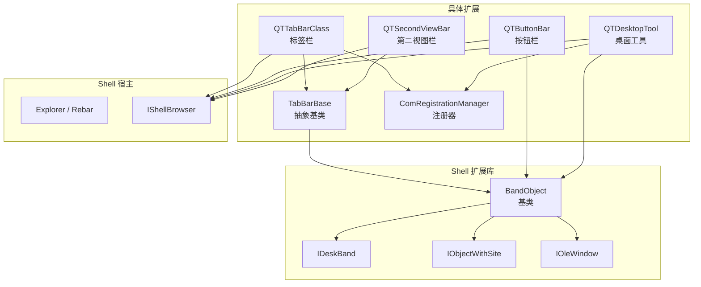
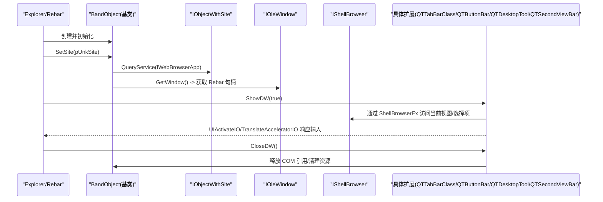
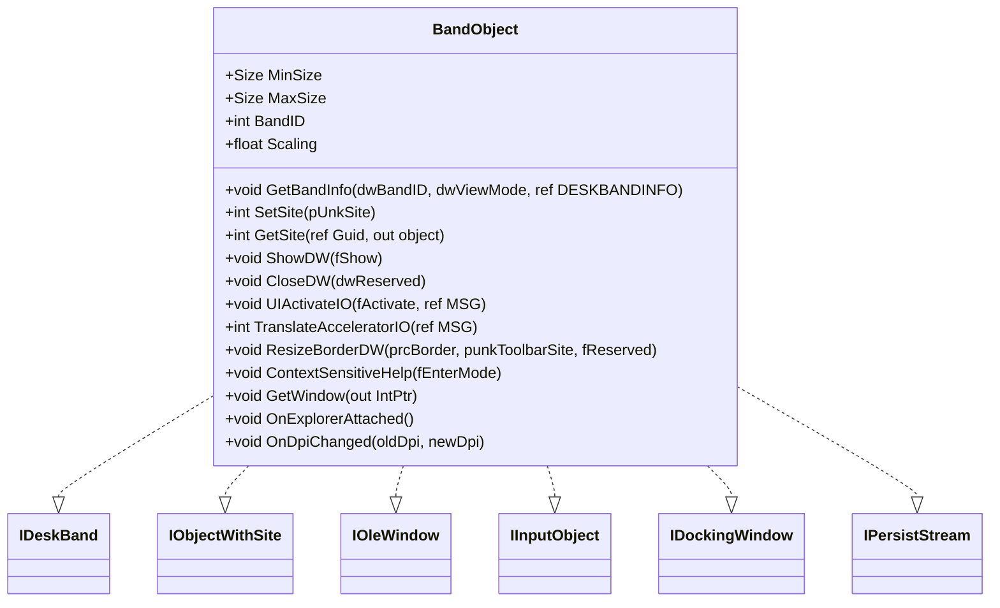
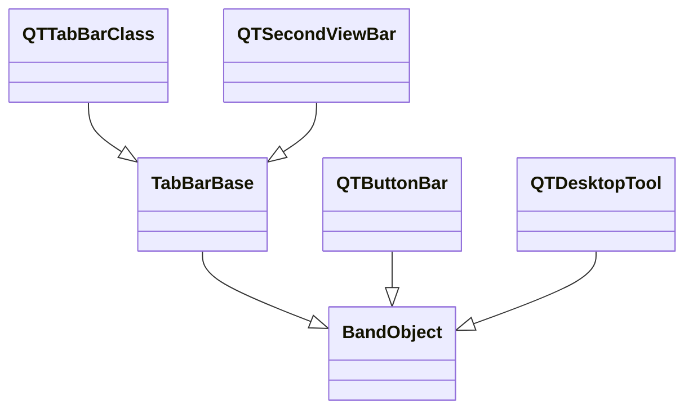
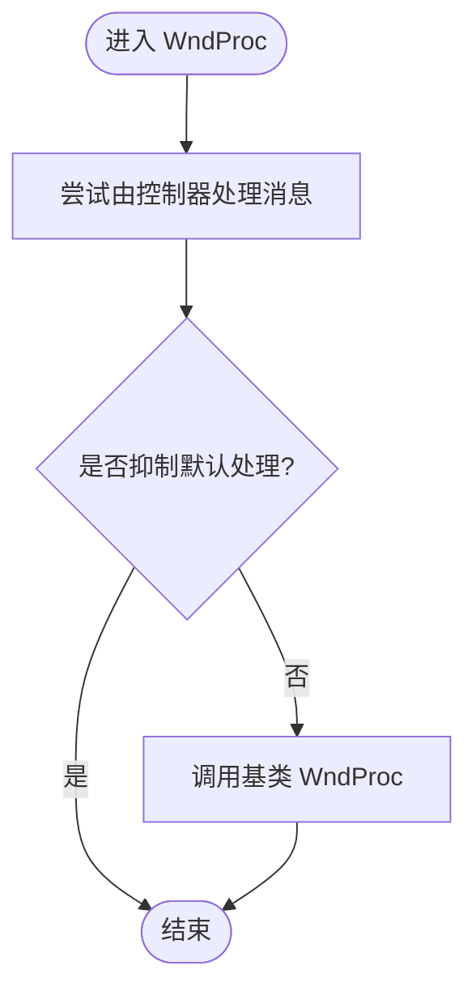
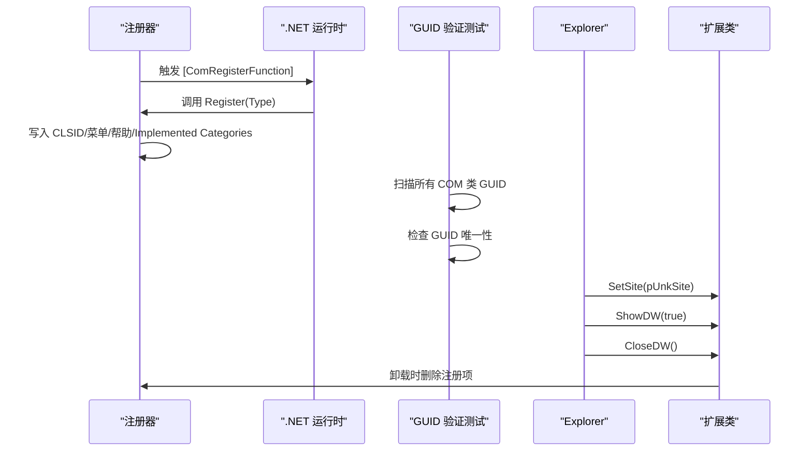
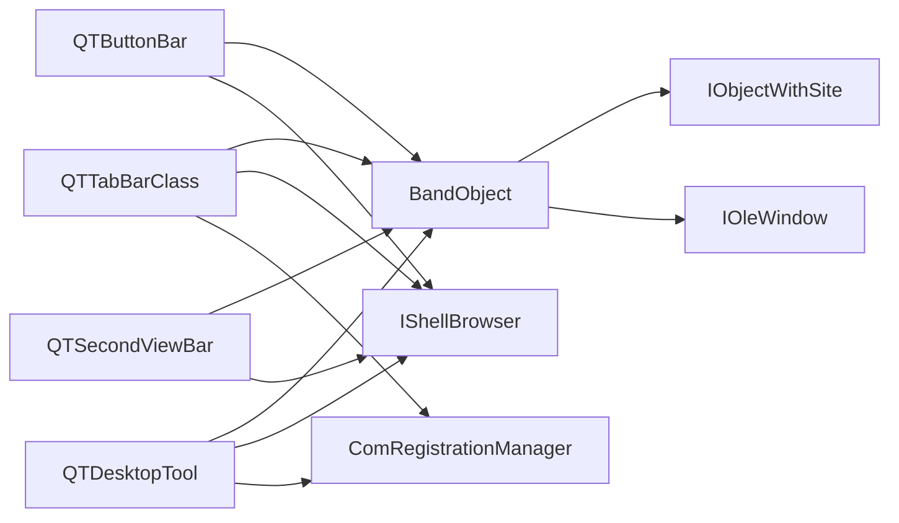

# Shell 扩展集成

<cite>
**本文引用的文件**   
- [BandObject.cs](file://BandObjectLib/BandObject.cs)
- [IDeskBand.cs](file://BandObjectLib/Interop/IDeskBand.cs)
- [IObjectWithSite.cs](file://BandObjectLib/Interop/IObjectWithSite.cs)
- [IOleWindow.cs](file://BandObjectLib/Interop/IOleWindow.cs)
- [IShellBrowser.cs](file://QTPluginLib/Interop/IShellBrowser.cs)
- [TabBarBase.cs](file://QTTabBar/TabBarBase.cs)
- [QTTabBarClass.cs](file://QTTabBar/QTTabBarClass.cs)
- [ComRegistrationManager.cs](file://QTTabBar/ComRegistrationManager.cs)
- [QTButtonBar.cs](file://QTTabBar/QTButtonBar.cs)
- [QTDesktopTool.cs](file://QTTabBar/QTDesktopTool.cs)
- [QTSecondViewBar.cs](file://QTTabBar/QTSecondViewBar.cs)
- [CanonicalEntryAndComIdentityTests.cs](file://Tests/QTTtabBarTests/CanonicalEntryAndComIdentityTests.cs)
</cite>

## 更新摘要
**所做更改**   
- 移除了对已删除的 QTCommandBar.cs 文件的引用
- 更新了 COM 组件 GUID 冲突检测机制说明
- 增强了注册机制章节，包含新的测试验证逻辑
- 更新了架构总览图以反映当前的组件结构
- 添加了关于遗留 COM 组件清理的最佳实践

## 目录
1. [简介](#简介)
2. [项目结构](#项目结构)
3. [核心组件](#核心组件)
4. [架构总览](#架构总览)
5. [详细组件分析](#详细组件分析)
6. [依赖关系分析](#依赖关系分析)
7. [性能与内存管理](#性能与内存管理)
8. [故障排查指南](#故障排查指南)
9. [结论](#结论)
10. [附录：自定义 Shell 扩展实现要点](#附录自定义-shell-扩展实现要点)

## 简介
本文件面向 QTTabBar-Next 的 Shell 扩展集成，系统性阐述 Windows Shell Band 对象的工作原理、COM 接口契约（IDeskBand、IObjectWithSite、IOleWindow、IShellBrowser）、BandObject 基类的设计模式与继承层次、注册机制与生命周期管理、资源管理器集成细节（窗口消息处理、事件监听、状态同步），并提供可操作的自定义扩展实现路径、性能优化策略与常见问题排障方法。

**更新** 本项目已完成遗留 COM 组件清理工作，移除了 QTCommandBar.cs 等废弃组件，消除了潜在的 GUID 冲突风险。

## 项目结构
本项目围绕"Shell 扩展库 + 具体扩展实现"组织：
- BandObjectLib：提供 Band 对象基类与关键 COM 接口定义，屏蔽底层 Rebar/Explorer 差异，统一生命周期与 DPI 适配。
- QTTabBar：具体扩展实现，包括标签栏、按钮栏、桌面工具等，均基于 BandObject 派生。
- ComRegistrationManager：集中封装 COM 注册/卸载逻辑，简化各扩展的注册流程。

**图表来源**
- [BandObject.cs:35-43](file://BandObjectLib/BandObject.cs#L35-L43)
- [IDeskBand.cs:23-31](file://BandObjectLib/Interop/IDeskBand.cs#L23-L31)
- [IObjectWithSite.cs:23-31](file://BandObjectLib/Interop/IObjectWithSite.cs#L23-L31)
- [IOleWindow.cs:23-27](file://BandObjectLib/Interop/IOleWindow.cs#L23-L27)
- [TabBarBase.cs:21](file://QTTabBar/TabBarBase.cs#L21)
- [QTTabBarClass.cs:57-58](file://QTTabBar/QTTabBarClass.cs#L57-L58)
- [QTButtonBar.cs:37-38](file://QTTabBar/QTButtonBar.cs#L37-L38)
- [QTDesktopTool.cs:38-40](file://QTTabBar/QTDesktopTool.cs#L38-L40)
- [QTSecondViewBar.cs:37-39](file://QTTabBar/QTSecondViewBar.cs#L37-39)
- [ComRegistrationManager.cs:10-21](file://QTTabBar/ComRegistrationManager.cs#L10-L21)
- [IShellBrowser.cs:22-54](file://QTPluginLib/Interop/IShellBrowser.cs#L22-L54)

**章节来源**
- [BandObject.cs:35-43](file://BandObjectLib/BandObject.cs#L35-L43)
- [TabBarBase.cs:21](file://QTTabBar/TabBarBase.cs#L21)
- [QTTabBarClass.cs:57-58](file://QTTabBar/QTTabBarClass.cs#L57-L58)
- [QTButtonBar.cs:37-38](file://QTTabBar/QTButtonBar.cs#L37-L38)
- [QTDesktopTool.cs:38-40](file://QTTabBar/QTDesktopTool.cs#L38-L40)
- [QTSecondViewBar.cs:37-39](file://QTTabBar/QTSecondViewBar.cs#L37-39)
- [ComRegistrationManager.cs:10-21](file://QTTabBar/ComRegistrationManager.cs#L10-L21)
- [IShellBrowser.cs:22-54](file://QTPluginLib/Interop/IShellBrowser.cs#L22-L54)

## 核心组件
- BandObject 基类
  - 实现 IDeskBand、IObjectWithSite、IOleWindow、IInputObject、IDockingWindow、IPersistStream 等接口，封装 Explorer Rebar 子类化、SetSite/GetSite、ShowDW/CloseDW、GetBandInfo、焦点传播、DPI 缩放等通用能力。
  - 通过 IObjectWithSite 获取宿主站点，并尝试查询 WebBrowser 以辅助定位宿主环境；通过 IOleWindow 获取 Rebar 句柄进行样式修复。
- TabBarBase 抽象基类
  - 在 BandObject 之上提供标签栏共享字段与方法（导航历史、列表视图、Rebar 高度控制、DPI 计算等）。
- 具体扩展
  - QTTabBarClass：标签栏主类，组合多个控制器模块，负责与 IShellBrowser 交互、消息分发、UI 更新。
  - QTButtonBar：按钮栏，提供常用操作入口，同样为 BandObject 派生。
  - QTDesktopTool：桌面工具，DeskBand 类型，支持桌面/任务栏场景。
  - QTSecondViewBar：第二视图栏，提供额外的浏览功能。
- 注册器
  - ComRegistrationManager：集中处理 CLSID、Implemented Categories、IE Toolbar、BHO 等注册项的增删。

**更新** 项目已移除 QTCommandBar.cs 遗留组件，消除了潜在的 GUID 冲突风险。

**章节来源**
- [BandObject.cs:35-43](file://BandObjectLib/BandObject.cs#L35-L43)
- [BandObject.cs:429-484](file://BandObjectLib/BandObject.cs#L429-L484)
- [BandObject.cs:317-345](file://BandObjectLib/BandObject.cs#L317-L345)
- [TabBarBase.cs:21](file://QTTabBar/TabBarBase.cs#L21)
- [TabBarBase.cs:303-343](file://QTTabBar/TabBarBase.cs#L303-L343)
- [QTTabBarClass.cs:57-58](file://QTTabBar/QTTabBarClass.cs#L57-L58)
- [QTButtonBar.cs:37-38](file://QTTabBar/QTButtonBar.cs#L37-L38)
- [QTDesktopTool.cs:38-40](file://QTTabBar/QTDesktopTool.cs#L38-L40)
- [QTSecondViewBar.cs:37-39](file://QTTabBar/QTSecondViewBar.cs#L37-39)
- [ComRegistrationManager.cs:10-21](file://QTTabBar/ComRegistrationManager.cs#L10-L21)

## 架构总览
下图展示从 Explorer 加载到扩展实例化的关键调用链，以及扩展与 Shell 宿主的交互点。

**图表来源**
- [BandObject.cs:429-484](file://BandObjectLib/BandObject.cs#L429-L484)
- [BandObject.cs:486-498](file://BandObjectLib/BandObject.cs#L486-L498)
- [BandObject.cs:507-515](file://BandObjectLib/BandObject.cs#L507-L515)
- [BandObject.cs:500-505](file://BandObjectLib/BandObject.cs#L500-L505)
- [IShellBrowser.cs:22-54](file://QTPluginLib/Interop/IShellBrowser.cs#L22-L54)
- [QTTabBarClass.cs:558-561](file://QTTabBar/QTTabBarClass.cs#L558-L561)

## 详细组件分析

### BandObject 基类设计
- 职责
  - 实现 Shell Band 的核心 COM 接口，统一窗口生命周期、尺寸/模式信息、焦点传播、加速键转发、持久化占位。
  - 对 Rebar 进行子类化，修复特定系统版本下的换行样式问题。
- 关键点
  - SetSite：保存站点引用，尝试查询 WebBrowser，获取 IOleWindow 以拿到 Rebar 句柄。
  - GetBandInfo：根据掩码返回实际大小、最小/最大尺寸、模式标志等。
  - ShowDW/CloseDW：显示/隐藏控件，并在关闭时释放 COM 引用与子窗口钩子。
  - UIActivateIO/TranslateAcceleratorIO：将输入焦点与键盘事件传递给内部控件树。
  - DPI：暴露 Dpi/Scaling，供派生类按 DPI 调整布局。

**图表来源**
- [BandObject.cs:35-43](file://BandObjectLib/BandObject.cs#L35-L43)
- [BandObject.cs:317-345](file://BandObjectLib/BandObject.cs#L317-L345)
- [BandObject.cs:429-484](file://BandObjectLib/BandObject.cs#L429-L484)
- [BandObject.cs:486-498](file://BandObjectLib/BandObject.cs#L486-L498)
- [BandObject.cs:507-515](file://BandObjectLib/BandObject.cs#L507-L515)
- [BandObject.cs:500-505](file://BandObjectLib/BandObject.cs#L500-L505)
- [BandObject.cs:577-585](file://BandObjectLib/BandObject.cs#L577-L585)
- [IDeskBand.cs:23-31](file://BandObjectLib/Interop/IDeskBand.cs#L23-L31)
- [IObjectWithSite.cs:23-31](file://BandObjectLib/Interop/IObjectWithSite.cs#L23-L31)
- [IOleWindow.cs:23-27](file://BandObjectLib/Interop/IOleWindow.cs#L23-L27)

**章节来源**
- [BandObject.cs:35-43](file://BandObjectLib/BandObject.cs#L35-L43)
- [BandObject.cs:317-345](file://BandObjectLib/BandObject.cs#L317-L345)
- [BandObject.cs:429-484](file://BandObjectLib/BandObject.cs#L429-L484)
- [BandObject.cs:486-498](file://BandObjectLib/BandObject.cs#L486-L498)
- [BandObject.cs:507-515](file://BandObjectLib/BandObject.cs#L507-L515)
- [BandObject.cs:500-505](file://BandObjectLib/BandObject.cs#L500-L505)
- [BandObject.cs:577-585](file://BandObjectLib/BandObject.cs#L577-L585)
- [IDeskBand.cs:23-31](file://BandObjectLib/Interop/IDeskBand.cs#L23-L31)
- [IObjectWithSite.cs:23-31](file://BandObjectLib/Interop/IObjectWithSite.cs#L23-L31)
- [IOleWindow.cs:23-27](file://BandObjectLib/Interop/IOleWindow.cs#L23-L27)

### 继承层次与派生类
- 继承关系
  - BandObject → TabBarBase → QTTabBarClass
  - BandObject → QTButtonBar
  - BandObject → QTDesktopTool
  - BandObject → TabBarBase → QTSecondViewBar
- 职责划分
  - TabBarBase：提取标签栏公共逻辑（导航、列表、Rebar 高度、DPI 计算）。
  - 具体扩展：各自业务逻辑与 UI 构建。

**图表来源**
- [TabBarBase.cs:21](file://QTTabBar/TabBarBase.cs#L21)
- [QTTabBarClass.cs:57-58](file://QTTabBar/QTTabBarClass.cs#L57-L58)
- [QTButtonBar.cs:37-38](file://QTTabBar/QTButtonBar.cs#L37-L38)
- [QTDesktopTool.cs:38-40](file://QTTabBar/QTDesktopTool.cs#L38-L40)
- [QTSecondViewBar.cs:37-39](file://QTTabBar/QTSecondViewBar.cs#L37-39)

**章节来源**
- [TabBarBase.cs:21](file://QTTabBar/TabBarBase.cs#L21)
- [QTTabBarClass.cs:57-58](file://QTTabBar/QTTabBarClass.cs#L57-L58)
- [QTButtonBar.cs:37-38](file://QTTabBar/QTButtonBar.cs#L37-L38)
- [QTDesktopTool.cs:38-40](file://QTTabBar/QTDesktopTool.cs#L38-L40)
- [QTSecondViewBar.cs:37-39](file://QTTabBar/QTSecondViewBar.cs#L37-39)

### Shell 宿主集成与消息流
- 窗口消息与输入
  - UIActivateIO：激活时将焦点移动到下一个可用控件。
  - TranslateAcceleratorIO：拦截 Tab/Shift+Tab 等快捷键，交由 WinForms 控件树处理。
  - WndProc：在 QTTabBarClass 中统一捕获消息，委托给控制器处理，异常记录日志。
- 与 IShellBrowser 的交互
  - 通过 ShellBrowserEx 访问当前视图、选择项、导航历史等，驱动标签页与按钮状态同步。

**图表来源**
- [QTTabBarClass.cs:729-739](file://QTTabBar/QTTabBarClass.cs#L729-L739)
- [BandObject.cs:507-515](file://BandObjectLib/BandObject.cs#L507-L515)
- [BandObject.cs:500-505](file://BandObjectLib/BandObject.cs#L500-L505)
- [IShellBrowser.cs:22-54](file://QTPluginLib/Interop/IShellBrowser.cs#L22-L54)

**章节来源**
- [QTTabBarClass.cs:729-739](file://QTTabBar/QTTabBarClass.cs#L729-L739)
- [BandObject.cs:507-515](file://BandObjectLib/BandObject.cs#L507-L515)
- [BandObject.cs:500-505](file://BandObjectLib/BandObject.cs#L500-L505)
- [IShellBrowser.cs:22-54](file://QTPluginLib/Interop/IShellBrowser.cs#L22-L54)

### 注册机制与生命周期
- 注册
  - 使用 [ComRegisterFunction] 标记静态方法，在 COM 注册时写入 CLSID、菜单文本、帮助文本与 Implemented Categories（DeskBand 类别）。
  - ComRegistrationManager 提供 RegisterBand/RegisterImplementedCategory 等便捷方法。
- 卸载
  - 使用 [ComUnregisterFunction] 删除 CLSID 树或 IE Toolbar/BHO 相关项。
- 生命周期
  - Explorer 调用 SetSite → GetWindow → ShowDW → 用户交互 → CloseDW。
  - 在 CloseDW 中释放 COM 引用、解除子窗口钩子、注销全局注册表项（如按钮栏）。
- **新增** GUID 唯一性验证
  - 通过 CanonicalEntryAndComIdentityTests 确保所有 COM 类的 GUID 唯一性，防止冲突。

**图表来源**
- [QTTabBarClass.cs:598-599](file://QTTabBar/QTTabBarClass.cs#L598-L599)
- [QTTabBarClass.cs:718-719](file://QTTabBar/QTTabBarClass.cs#L718-L719)
- [QTDesktopTool.cs:463-475](file://QTTabBar/QTDesktopTool.cs#L463-L475)
- [ComRegistrationManager.cs:10-21](file://QTTabBar/ComRegistrationManager.cs#L10-L21)
- [ComRegistrationManager.cs:86-97](file://QTTabBar/ComRegistrationManager.cs#L86-L97)
- [CanonicalEntryAndComIdentityTests.cs:71-74](file://Tests/QTTtabBarTests/CanonicalEntryAndComIdentityTests.cs#L71-L74)

**章节来源**
- [QTTabBarClass.cs:598-599](file://QTTabBar/QTTabBarClass.cs#L598-L599)
- [QTTabBarClass.cs:718-719](file://QTTabBar/QTTabBarClass.cs#L718-L719)
- [QTDesktopTool.cs:463-475](file://QTTabBar/QTDesktopTool.cs#L463-L475)
- [ComRegistrationManager.cs:10-21](file://QTTabBar/ComRegistrationManager.cs#L10-L21)
- [ComRegistrationManager.cs:86-97](file://QTTabBar/ComRegistrationManager.cs#L86-L97)
- [CanonicalEntryAndComIdentityTests.cs:71-74](file://Tests/QTTtabBarTests/CanonicalEntryAndComIdentityTests.cs#L71-L74)

## 依赖关系分析
- 直接依赖
  - 具体扩展依赖 BandObject 提供的 COM 基础能力。
  - 标签栏与按钮栏依赖 IShellBrowser 访问当前 Shell 视图与选择项。
  - 注册逻辑依赖 ComRegistrationManager 统一写注册表。
- 间接依赖
  - 通过 IObjectWithSite 查询宿主服务（如 WebBrowser）以增强兼容性。
  - 通过 IOleWindow 获取 Rebar 句柄进行样式修复。

**图表来源**
- [QTTabBarClass.cs:57-58](file://QTTabBar/QTTabBarClass.cs#L57-L58)
- [QTButtonBar.cs:37-38](file://QTTabBar/QTButtonBar.cs#L37-L38)
- [QTDesktopTool.cs:38-40](file://QTTabBar/QTDesktopTool.cs#L38-L40)
- [QTSecondViewBar.cs:37-39](file://QTTabBar/QTSecondViewBar.cs#L37-39)
- [IShellBrowser.cs:22-54](file://QTPluginLib/Interop/IShellBrowser.cs#L22-L54)
- [ComRegistrationManager.cs:10-21](file://QTTabBar/ComRegistrationManager.cs#L10-L21)
- [BandObject.cs:429-484](file://BandObjectLib/BandObject.cs#L429-L484)

**章节来源**
- [QTTabBarClass.cs:57-58](file://QTTabBar/QTTabBarClass.cs#L57-L58)
- [QTButtonBar.cs:37-38](file://QTTabBar/QTButtonBar.cs#L37-L38)
- [QTDesktopTool.cs:38-40](file://QTTabBar/QTDesktopTool.cs#L38-L40)
- [QTSecondViewBar.cs:37-39](file://QTTabBar/QTSecondViewBar.cs#L37-39)
- [IShellBrowser.cs:22-54](file://QTPluginLib/Interop/IShellBrowser.cs#L22-L54)
- [ComRegistrationManager.cs:10-21](file://QTTabBar/ComRegistrationManager.cs#L10-L21)
- [BandObject.cs:429-484](file://BandObjectLib/BandObject.cs#L429-L484)

## 性能与内存管理
- 避免频繁分配
  - 在 GetBandInfo 中仅填充必要的掩码字段，减少不必要的结构体拷贝。
  - 图片/图标等资源采用缓存与复用（例如按钮栏中的 ImageStrip）。
- 正确释放 COM 引用
  - 在 CloseDW/SetSite(null) 中显式释放 IObjectWithSite、WebBrowser 等 COM 对象，防止泄漏。
- 线程与 UI
  - 使用 BeginInvoke/Invoke 将耗时操作切换到 UI 线程，避免阻塞宿主消息泵。
- DPI 与重绘
  - 在 OnHandleCreated/OnDpiChanged 中刷新高度与布局，避免高 DPI 下标题裁剪或高度异常。
- 日志与诊断
  - 启用可选日志输出，记录关键生命周期与异常堆栈，便于定位问题。

**章节来源**
- [BandObject.cs:429-484](file://BandObjectLib/BandObject.cs#L429-L484)
- [BandObject.cs:486-498](file://BandObjectLib/BandObject.cs#L486-L498)
- [BandObject.cs:577-585](file://BandObjectLib/BandObject.cs#L577-L585)
- [QTTabBarClass.cs:746-768](file://QTTabBar/QTTabBarClass.cs#L746-L768)
- [QTButtonBar.cs:227-251](file://QTTabBar/QTButtonBar.cs#L227-L251)

## 故障排查指南
- 常见问题
  - 扩展未出现在 Explorer 中：检查 CLSID 与 Implemented Categories 是否正确注册。
  - 界面错位/高度异常：确认 DPI 计算与 SetBarRows/RefreshHeightForCurrentDpi 调用时机。
  - 崩溃/无响应：查看异常日志文件，关注 WndProc 抛出的异常与 COM 释放顺序。
  - **新增** GUID 冲突：使用 CanonicalEntryAndComIdentityTests 检测重复的 COM GUID。
- 调试技巧
  - 启用 BandObject 日志，观察 SetSite/ShowDW/CloseDW 调用链。
  - 在 WndProc 中打印消息编号与参数，定位消息处理分支。
  - 使用进程内断点与反汇编工具验证 COM 接口实现与返回值。
  - **新增** 运行 GUID 唯一性测试，确保没有重复的 COM 类标识符。

**更新** 项目已建立自动化测试来防止 GUID 冲突，建议在开发过程中定期运行 CanonicalEntryAndComIdentityTests。

**章节来源**
- [BandObject.cs:646-771](file://BandObjectLib/BandObject.cs#L646-L771)
- [QTTabBarClass.cs:729-739](file://QTTabBar/QTTabBarClass.cs#L729-L739)
- [QTButtonBar.cs:227-251](file://QTTabBar/QTButtonBar.cs#L227-L251)
- [CanonicalEntryAndComIdentityTests.cs:71-74](file://Tests/QTTtabBarTests/CanonicalEntryAndComIdentityTests.cs#L71-L74)

## 结论
QTTabBar-Next 的 Shell 扩展通过 BandObject 基类统一了 COM 契约与宿主交互细节，结合 TabBarBase 抽象出标签栏通用能力，并以模块化控制器组织复杂逻辑。注册器集中管理注册表项，确保安装/卸载一致性。项目已完成遗留 COM 组件清理工作，移除了 QTCommandBar.cs 等废弃组件，并通过自动化测试确保 GUID 唯一性。遵循本文的性能与内存管理建议，可有效提升稳定性与用户体验。

## 附录：自定义 Shell 扩展实现要点
- 步骤概览
  - 新建派生自 BandObject 的类，添加 ComVisible 与 Guid 属性。
  - 实现必要生命周期：SetSite/GetSite、ShowDW/CloseDW、GetBandInfo。
  - 如需与 Shell 交互，通过 ShellBrowserEx 访问 IShellBrowser。
  - 在 [ComRegisterFunction]/[ComUnregisterFunction] 中调用 ComRegistrationManager 完成注册/卸载。
  - **新增** 确保 GUID 唯一性，避免与其他 COM 组件冲突。
- 参考路径
  - 基类与接口：[BandObject.cs](file://BandObjectLib/BandObject.cs)、[IDeskBand.cs](file://BandObjectLib/Interop/IDeskBand.cs)、[IObjectWithSite.cs](file://BandObjectLib/Interop/IObjectWithSite.cs)、[IOleWindow.cs](file://BandObjectLib/Interop/IOleWindow.cs)
  - 注册示例：[QTDesktopTool.cs](file://QTTabBar/QTDesktopTool.cs)、[ComRegistrationManager.cs](file://QTTabBar/ComRegistrationManager.cs)
  - 与 Shell 交互：[IShellBrowser.cs](file://QTPluginLib/Interop/IShellBrowser.cs)
  - **新增** GUID 验证：[CanonicalEntryAndComIdentityTests.cs](file://Tests/QTTtabBarTests/CanonicalEntryAndComIdentityTests.cs)

**更新** 实现了完整的 COM 组件生命周期管理，包括自动化的 GUID 冲突检测和清理机制。

**章节来源**
- [BandObject.cs:35-43](file://BandObjectLib/BandObject.cs#L35-L43)
- [IDeskBand.cs:23-31](file://BandObjectLib/Interop/IDeskBand.cs#L23-L31)
- [IObjectWithSite.cs:23-31](file://BandObjectLib/Interop/IObjectWithSite.cs#L23-L31)
- [IOleWindow.cs:23-27](file://BandObjectLib/Interop/IOleWindow.cs#L23-L27)
- [QTDesktopTool.cs:463-475](file://QTTabBar/QTDesktopTool.cs#L463-L475)
- [ComRegistrationManager.cs:10-21](file://QTTabBar/ComRegistrationManager.cs#L10-L21)
- [IShellBrowser.cs:22-54](file://QTPluginLib/Interop/IShellBrowser.cs#L22-L54)
- [CanonicalEntryAndComIdentityTests.cs:71-74](file://Tests/QTTtabBarTests/CanonicalEntryAndComIdentityTests.cs#L71-L74)