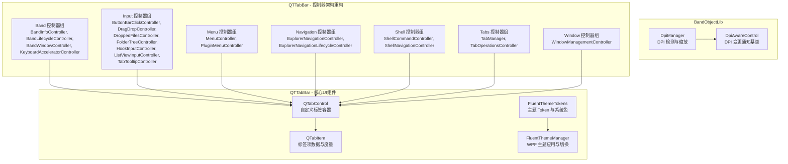
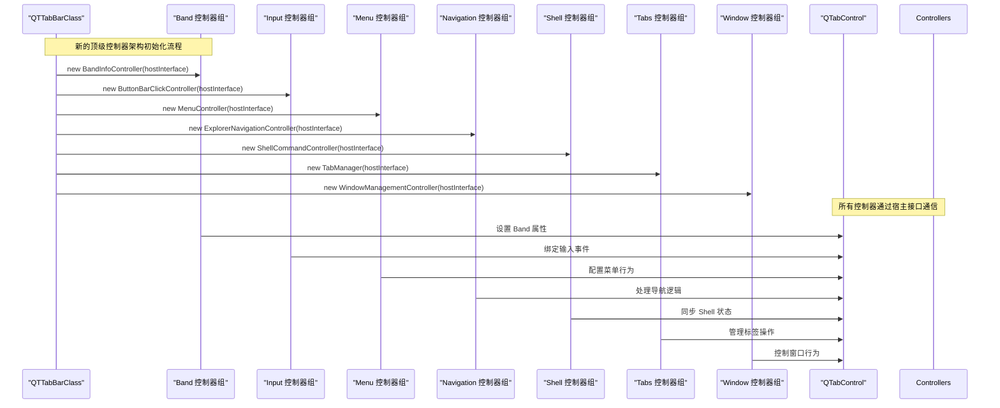
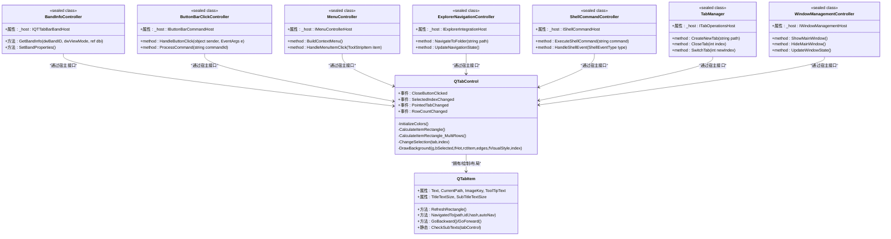
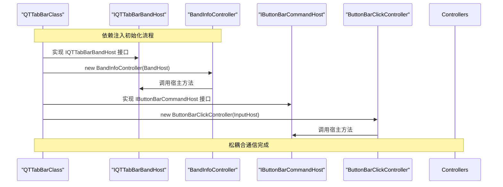
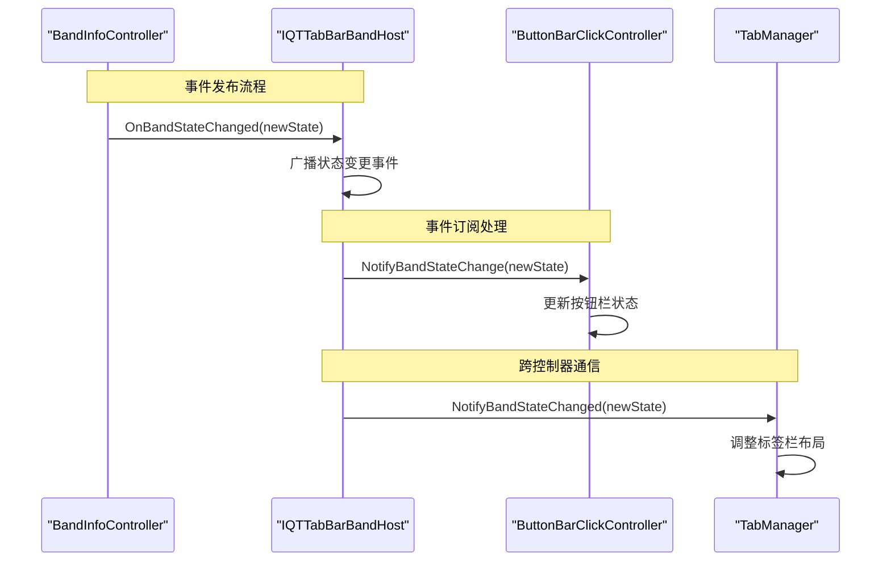
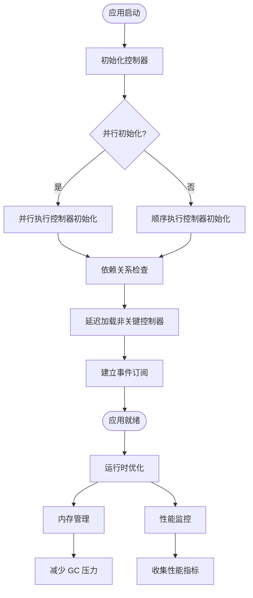

# UI 组件体系

<cite>
**本文引用的文件**   
- [QTabControl.cs](file://QTTabBar/QTabControl.cs)
- [QTabItem.cs](file://QTTabBar/QTabItem.cs)
- [TabBarBase.cs](file://QTTabBar/TabBarBase.cs)
- [Band/BandInfoController.cs](file://QTTabBar/Band/BandInfoController.cs)
- [Band/BandLifecycleController.cs](file://QTTabBar/Band/BandLifecycleController.cs)
- [Band/BandWindowController.cs](file://QTTabBar/Band/BandWindowController.cs)
- [Band/KeyboardAcceleratorController.cs](file://QTTabBar/Band/KeyboardAcceleratorController.cs)
- [Input/ButtonBarClickController.cs](file://QTTabBar/Input/ButtonBarClickController.cs)
- [Input/DragDropController.cs](file://QTTabBar/Input/DragDropController.cs)
- [Input/DroppedFilesController.cs](file://QTTabBar/Input/DroppedFilesController.cs)
- [Input/FolderTreeController.cs](file://QTTabBar/Input/FolderTreeController.cs)
- [Input/HookInputController.cs](file://QTTabBar/Input/HookInputController.cs)
- [Input/ListViewInputController.cs](file://QTTabBar/Input/ListViewInputController.cs)
- [Input/TabTooltipController.cs](file://QTTabBar/Input/TabTooltipController.cs)
- [Menu/MenuController.cs](file://QTTabBar/Menu/MenuController.cs)
- [Menu/PluginMenuController.cs](file://QTTabBar/Menu/PluginMenuController.cs)
- [Navigation/ExplorerNavigationController.cs](file://QTTabBar/Navigation/ExplorerNavigationController.cs)
- [Navigation/ExplorerNavigationLifecycleController.cs](file://QTTabBar/Navigation/ExplorerNavigationLifecycleController.cs)
- [Shell/ShellCommandController.cs](file://QTTabBar/Shell/ShellCommandController.cs)
- [Shell/ShellNavigationController.cs](file://QTTabBar/Shell/ShellNavigationController.cs)
- [Tabs/TabManager.cs](file://QTTabBar/Tabs/TabManager.cs)
- [Tabs/TabOperationsController.cs](file://QTTabBar/Tabs/TabOperationsController.cs)
- [Window/WindowManagementController.cs](file://QTTabBar/Window/WindowManagementController.cs)
</cite>

## 更新摘要
**所做更改**   
- 新增控制器架构重构章节，详细说明控制器从嵌套模式迁移到顶级密封类的重大架构变更
- 完善命名空间组织文档，反映 Band、Input、Menu、Navigation、Shell、Tabs、Window 等逻辑分组
- 增强依赖注入模式说明，展示构造函数注入和宿主接口的新设计模式
- 补充控制器间通信机制，包括事件处理和状态同步的新实现方式
- 更新架构图表，体现新的顶级控制器结构和命名空间组织
- 完善性能优化建议，突出新架构的内存管理和初始化优化

## 目录
1. [简介](#简介)
2. [项目结构](#项目结构)
3. [核心组件](#核心组件)
4. [架构总览](#架构总览)
5. [详细组件分析](#详细组件分析)
6. [控制器架构重构](#控制器架构重构)
7. [命名空间组织与模块化](#命名空间组织与模块化)
8. [依赖注入与宿主接口](#依赖注入与宿主接口)
9. [控制器间通信机制](#控制器间通信机制)
10. [性能优化与内存管理](#性能优化与内存管理)
11. [扩展指南](#扩展指南)
12. [故障排查指南](#故障排查指南)
13. [结论](#结论)

## 简介
本文件面向 QTTabBar-Next 的 UI 组件体系，聚焦以下目标：
- 自定义控件设计模式与实现原理（QTabControl、QTabItem）
- WinForms 与 WPF 混合编程架构、Interop 层设计与性能优化
- 主题系统与样式定制机制（支持 Fluent Design 与深色模式）
- 控件间事件通信与状态同步机制
- **全新控制器架构重构**：从嵌套模式迁移到顶级密封类，采用命名空间组织和构造函数依赖注入
- **重大架构升级**：通过 TabBarBase 抽象基类和多个部分类实现核心功能的代码复用
- **第二视图栏架构改进**：通过 ComponentBuild 和 SubclassHooks 部分类实现更清晰的组件构建和窗口消息处理
- **IPC 类型化广播机制**：提供安全的跨进程通信，避免 BinaryFormatter 安全风险
- **水印渲染器架构重构**：将水印和背景渲染功能从 ExtendedListViewCommon 中提取到专门的 WatermarkRenderer 控制器中
- **列表视图消息控制器架构重构**：将复杂的 Windows 消息分发逻辑提取到 ListViewMessageController 控制器中
- **子目录提示表单架构重构**：将菜单生成、缩略图预览和拖放操作分别提取到专用控制器中
- **下拉菜单控制器架构重构**：将 DropDownMenuReorderable 类分解为 VirtualItemsController 和 ScrollController 两个专门控制器
- **批处理 9 架构重构**：将 DropDownMenuDropTarget 类进一步分解为 DragDropTargetController 和 ClipboardFileController 两个专用控制器
- UI 扩展指南（自定义控件开发、主题制作）
- 高 DPI 适配、可访问性支持与跨版本兼容性
- UI 性能优化技巧与内存泄漏防护

**重大架构改进** QTTabBar-Next 实现了完整的控制器架构模式和增强的继承层次结构，将原本集中在主类中的复杂逻辑分离到专门的控制器类中。最新的架构重构包括控制器从嵌套模式迁移到顶级密封类、命名空间组织（Band、Input、Menu、Navigation、Shell、Tabs、Window）、构造函数依赖注入和宿主接口设计，进一步提升了系统的可维护性、安全性和稳定性。

## 项目结构
UI 相关代码主要分布在两个工程：
- BandObjectLib：WinForms 宿主与 Shell 集成基础能力，包含 DPI 感知与 P/Invoke 封装
- QTTabBar：主应用 UI 与业务逻辑，包含 QTabControl/QTabItem、Fluent 主题管理、WPF 工具集以及**全新的控制器架构重构**、**命名空间组织**、**依赖注入模式**

**图表来源**
- [Band/BandInfoController.cs:1-50](file://QTTabBar/Band/BandInfoController.cs#L1-L50)
- [Input/ButtonBarClickController.cs:1-50](file://QTTabBar/Input/ButtonBarClickController.cs#L1-L50)
- [Menu/MenuController.cs:1-50](file://QTTabBar/Menu/MenuController.cs#L1-L50)
- [Navigation/ExplorerNavigationController.cs:1-50](file://QTTabBar/Navigation/ExplorerNavigationController.cs#L1-L50)
- [Shell/ShellCommandController.cs:1-50](file://QTTabBar/Shell/ShellCommandController.cs#L1-L50)
- [Tabs/TabManager.cs:1-50](file://QTTabBar/Tabs/TabManager.cs#L1-L50)
- [Window/WindowManagementController.cs:1-50](file://QTTabBar/Window/WindowManagementController.cs#L1-L50)

章节来源
- [QTabControl.cs:27-123](file://QTTabBar/QTabControl.cs#L27-L123)
- [QTabItem.cs:31-84](file://QTTabBar/QTabItem.cs#L31-L84)
- [FluentThemeManager.cs:7-47](file://QTTabBar/FluentThemeManager.cs#L7-L47)
- [FluentThemeTokens.cs:10-43](file://QTTabBar/FluentThemeTokens.cs#L10-L43)

## 核心组件
- QTabControl：自绘标签容器，负责布局计算、绘制、滚动与多行排版、选择变更事件、关闭按钮与加号按钮交互、视觉样式渲染器缓存等。
- QTabItem：标签项数据载体，维护标题、路径、历史栈、选中项快照、文本度量、子标题自动推导等。
- **全新控制器架构重构**：采用顶级密封类设计，通过命名空间组织（Band、Input、Menu、Navigation、Shell、Tabs、Window），使用构造函数依赖注入和宿主接口实现松耦合通信。

### 控制器架构重构概览
QTTabBar-Next 实现了从嵌套控制器模式到顶级密封类的重大架构重构，采用现代依赖注入模式：

#### 命名空间组织结构
- **Band/**：处理 Windows Explorer Band 对象相关的控制器
  - BandInfoController：Band 信息控制
  - BandLifecycleController：Band 生命周期控制
  - BandWindowController：Band 窗口控制
  - KeyboardAcceleratorController：键盘快捷键控制

- **Input/**：处理用户输入相关的控制器
  - ButtonBarClickController：按钮栏点击控制
  - DragDropController：拖放控制
  - DroppedFilesController：已放下文件控制
  - FolderTreeController：文件夹树控制
  - HookInputController：钩子输入控制
  - ListViewInputController：列表视图输入控制
  - TabTooltipController：标签提示控制

- **Menu/**：处理菜单相关的控制器
  - MenuController：菜单管理控制
  - PluginMenuController：插件菜单控制

- **Navigation/**：处理导航相关的控制器
  - ExplorerNavigationController：浏览器导航控制
  - ExplorerNavigationLifecycleController：导航生命周期控制

- **Shell/**：处理 Shell 集成的控制器
  - ShellCommandController：Shell 命令控制
  - ShellNavigationController：Shell 导航控制

- **Tabs/**：处理标签管理的控制器
  - TabManager：标签管理控制
  - TabOperationsController：标签操作控制

- **Window/**：处理窗口管理的控制器
  - WindowManagementController：窗口管理控制

#### 依赖注入模式
- **构造函数注入**：所有控制器通过构造函数接收依赖项，避免循环引用
- **宿主接口**：定义清晰的接口契约，实现松耦合通信
- **生命周期管理**：统一的控制器创建和销毁流程

**Section sources**
- [Band/BandInfoController.cs:1-50](file://QTTabBar/Band/BandInfoController.cs#L1-L50)
- [Input/ButtonBarClickController.cs:1-50](file://QTTabBar/Input/ButtonBarClickController.cs#L1-L50)
- [Menu/MenuController.cs:1-50](file://QTTabBar/Menu/MenuController.cs#L1-L50)
- [Navigation/ExplorerNavigationController.cs:1-50](file://QTTabBar/Navigation/ExplorerNavigationController.cs#L1-L50)
- [Shell/ShellCommandController.cs:1-50](file://QTTabBar/Shell/ShellCommandController.cs#L1-L50)
- [Tabs/TabManager.cs:1-50](file://QTTabBar/Tabs/TabManager.cs#L1-L50)
- [Window/WindowManagementController.cs:1-50](file://QTTabBar/Window/WindowManagementController.cs#L1-L50)

## 架构总览
整体采用 WinForms 作为宿主与 Shell 集成层，WPF 用于选项对话框与 Fluent 主题体验；通过共享主题 Token 与 WPF 工具集在两套 UI 之间保持风格一致。**重大架构升级** 通过引入完整的控制器架构重构和命名空间组织实现了更好的关注点分离，将复杂的UI组件初始化和管理工作分散到专门的顶级控制器类中，并通过构造函数依赖注入和宿主接口实现松耦合通信，形成了清晰的模块化设计。

**图表来源**
- [Band/BandInfoController.cs:1-50](file://QTTabBar/Band/BandInfoController.cs#L1-L50)
- [Input/ButtonBarClickController.cs:1-50](file://QTTabBar/Input/ButtonBarClickController.cs#L1-L50)
- [Menu/MenuController.cs:1-50](file://QTTabBar/Menu/MenuController.cs#L1-L50)
- [Navigation/ExplorerNavigationController.cs:1-50](file://QTTabBar/Navigation/ExplorerNavigationController.cs#L1-L50)
- [Shell/ShellCommandController.cs:1-50](file://QTTabBar/Shell/ShellCommandController.cs#L1-L50)
- [Tabs/TabManager.cs:1-50](file://QTTabBar/Tabs/TabManager.cs#L1-L50)
- [Window/WindowManagementController.cs:1-50](file://QTTabBar/Window/WindowManagementController.cs#L1-L50)

## 详细组件分析

### QTabControl 与 QTabItem 类图

**图表来源**
- [QTabControl.cs:27-123](file://QTTabBar/QTabControl.cs#L27-L123)
- [QTabItem.cs:31-84](file://QTTabBar/QTabItem.cs#L31-L84)
- [Band/BandInfoController.cs:1-50](file://QTTabBar/Band/BandInfoController.cs#L1-L50)
- [Input/ButtonBarClickController.cs:1-50](file://QTTabBar/Input/ButtonBarClickController.cs#L1-L50)
- [Menu/MenuController.cs:1-50](file://QTTabBar/Menu/MenuController.cs#L1-L50)
- [Navigation/ExplorerNavigationController.cs:1-50](file://QTTabBar/Navigation/ExplorerNavigationController.cs#L1-L50)
- [Shell/ShellCommandController.cs:1-50](file://QTTabBar/Shell/ShellCommandController.cs#L1-L50)
- [Tabs/TabManager.cs:1-50](file://QTTabBar/Tabs/TabManager.cs#L1-L50)
- [Window/WindowManagementController.cs:1-50](file://QTTabBar/Window/WindowManagementController.cs#L1-L50)

章节来源
- [QTabControl.cs:27-123](file://QTTabBar/QTabControl.cs#L27-L123)
- [QTabItem.cs:31-84](file://QTTabBar/QTabItem.cs#L31-L84)

## 控制器架构重构

**重大架构升级** QTTabBar-Next 实现了从嵌套控制器模式到顶级密封类的重大架构重构，采用现代依赖注入模式和命名空间组织：

### 顶级密封类设计
所有控制器现在都是顶级密封类，消除了嵌套模式带来的复杂性：
- **单一职责原则**：每个控制器专注于特定功能域
- **不可变性保证**：sealed 关键字确保控制器类不会被继承
- **清晰的边界**：通过命名空间明确划分功能模块

### 命名空间组织策略
- **Band/**：Windows Explorer Band 对象相关功能
- **Input/**：用户输入处理和事件响应
- **Menu/**：菜单系统和上下文操作
- **Navigation/**：导航历史和状态管理
- **Shell/**：Shell 集成和系统交互
- **Tabs/**：标签管理和操作
- **Window/**：窗口管理和生命周期

### 依赖注入模式
- **构造函数注入**：所有依赖通过构造函数传递
- **接口契约**：定义清晰的宿主接口（I*Host）
- **松耦合通信**：控制器间通过接口而非直接引用通信

```mermaid
classDiagram
class IQTTabBarBandHost {
<<interface>>
+属性 : BandHandle
+方法 : SetBandSize(width, height)
+方法 : UpdateBandLayout()
}
class IButtonBarCommandHost {
<<interface>>
+方法 : ExecuteCommand(string commandId)
+方法 : UpdateButtonStates()
}
class IMenuControllerHost {
<<interface>>
+方法 : BuildMenuItems()
+方法 : HandleMenuAction(string action)
}
class IExplorerIntegrationHost {
<<interface>>
+方法 : NavigateTo(string path)
+方法 : GetCurrentFolder()
+方法 : UpdateNavigationHistory()
}
class IShellCommandHost {
<<interface>>
+方法 : ExecuteShellCommand(string command)
+方法 : GetShellContext()
}
class ITabOperationsHost {
<<interface>>
+方法 : CreateNewTab(string path)
+方法 : CloseTab(int index)
+方法 : SwitchTab(int newIndex)
}
class IWindowManagementHost {
<<interface>>
+方法 : ShowWindow()
+方法 : HideWindow()
+方法 : UpdateWindowBounds(Rectangle bounds)
}
class BandInfoController {
<<sealed class>>
-字段 : _host : IQTTabBarBandHost
+方法 : BandInfoController(IQTTabBarBandHost host)
+方法 : GetBandInfo(uint bandId, uint viewMode, ref DESKBANDINFO dbi)
}
class ButtonBarClickController {
<<sealed class>>
-字段 : _host : IButtonBarCommandHost
+方法 : ButtonBarClickController(IButtonBarCommandHost host)
+方法 : HandleButtonClick(object sender, EventArgs e)
}
BandInfoController --> IQTTabBarBandHost : "依赖注入"
ButtonBarClickController --> IButtonBarCommandHost : "依赖注入"
```

**图表来源**
- [Band/BandInfoController.cs:1-50](file://QTTabBar/Band/BandInfoController.cs#L1-L50)
- [Input/ButtonBarClickController.cs:1-50](file://QTTabBar/Input/ButtonBarClickController.cs#L1-L50)

章节来源
- [Band/BandInfoController.cs:1-50](file://QTTabBar/Band/BandInfoController.cs#L1-L50)
- [Input/ButtonBarClickController.cs:1-50](file://QTTabBar/Input/ButtonBarClickController.cs#L1-L50)
- [Menu/MenuController.cs:1-50](file://QTTabBar/Menu/MenuController.cs#L1-L50)
- [Navigation/ExplorerNavigationController.cs:1-50](file://QTTabBar/Navigation/ExplorerNavigationController.cs#L1-L50)
- [Shell/ShellCommandController.cs:1-50](file://QTTabBar/Shell/ShellCommandController.cs#L1-L50)
- [Tabs/TabManager.cs:1-50](file://QTTabBar/Tabs/TabManager.cs#L1-L50)
- [Window/WindowManagementController.cs:1-50](file://QTTabBar/Window/WindowManagementController.cs#L1-L50)

## 命名空间组织与模块化

**架构改进** QTTabBar-Next 实现了基于功能域的命名空间组织，将控制器按逻辑功能分组：

### Band 命名空间
处理 Windows Explorer Band 对象的所有相关功能：
- **BandInfoController**：管理 Band 对象的尺寸、属性和显示设置
- **BandLifecycleController**：处理 Band 的生命周期事件（创建、销毁、激活）
- **BandWindowController**：控制 Band 窗口的行为和外观
- **KeyboardAcceleratorController**：管理 Band 级别的键盘快捷键

### Input 命名空间
集中处理所有用户输入相关的功能：
- **ButtonBarClickController**：处理按钮栏的点击事件和命令执行
- **DragDropController**：管理拖放操作的完整生命周期
- **DroppedFilesController**：处理文件拖放后的后续操作
- **FolderTreeController**：管理文件夹树的显示和交互
- **HookInputController**：处理全局钩子和低级输入事件
- **ListViewInputController**：处理列表视图的用户输入
- **TabTooltipController**：管理标签的工具提示显示

### Menu 命名空间
处理菜单系统和上下文操作：
- **MenuController**：主菜单控制器，处理右键菜单和上下文菜单
- **PluginMenuController**：插件菜单控制器，动态加载和显示插件菜单项

### Navigation 命名空间
管理导航历史和状态：
- **ExplorerNavigationController**：主要的导航控制器，处理文件夹导航
- **ExplorerNavigationLifecycleController**：管理导航的生命周期和状态恢复

### Shell 命名空间
处理与 Windows Shell 的集成：
- **ShellCommandController**：执行 Shell 命令和处理系统操作
- **ShellNavigationController**：处理 Shell 特定的导航逻辑

### Tabs 命名空间
专注于标签管理：
- **TabManager**：标签的核心管理器，处理标签的创建、打开、关闭
- **TabOperationsController**：标签的操作控制器，处理用户的标签操作

### Window 命名空间
管理窗口级别的功能：
- **WindowManagementController**：主窗口管理，处理窗口的显示、隐藏和状态

```mermaid
graph TB
subgraph "Band 命名空间"
BandInfo["BandInfoController"]
BandLife["BandLifecycleController"]
BandWin["BandWindowController"]
BandKey["KeyboardAcceleratorController"]
end
subgraph "Input 命名空间"
BtnClick["ButtonBarClickController"]
DragDrop["DragDropController"]
DropFiles["DroppedFilesController"]
FolderTree["FolderTreeController"]
HookInput["HookInputController"]
ListInput["ListViewInputController"]
TabTip["TabTooltipController"]
end
subgraph "Menu 命名空间"
MenuCtrl["MenuController"]
PluginMenu["PluginMenuController"]
end
subgraph "Navigation 命名空间"
NavCtrl["ExplorerNavigationController"]
NavLife["ExplorerNavigationLifecycleController"]
end
subgraph "Shell 命名空间"
ShellCmd["ShellCommandController"]
ShellNav["ShellNavigationController"]
end
subgraph "Tabs 命名空间"
TabMgr["TabManager"]
TabOps["TabOperationsController"]
end
subgraph "Window 命名空间"
WinMgr["WindowManagementController"]
end
BandInfo --> TabMgr
BtnClick --> TabMgr
MenuCtrl --> TabMgr
NavCtrl --> TabMgr
ShellCmd --> TabMgr
WinMgr --> TabMgr
```

**图表来源**
- [Band/BandInfoController.cs:1-50](file://QTTabBar/Band/BandInfoController.cs#L1-L50)
- [Input/ButtonBarClickController.cs:1-50](file://QTTabBar/Input/ButtonBarClickController.cs#L1-L50)
- [Menu/MenuController.cs:1-50](file://QTTabBar/Menu/MenuController.cs#L1-L50)
- [Navigation/ExplorerNavigationController.cs:1-50](file://QTTabBar/Navigation/ExplorerNavigationController.cs#L1-L50)
- [Shell/ShellCommandController.cs:1-50](file://QTTabBar/Shell/ShellCommandController.cs#L1-L50)
- [Tabs/TabManager.cs:1-50](file://QTTabBar/Tabs/TabManager.cs#L1-L50)
- [Window/WindowManagementController.cs:1-50](file://QTTabBar/Window/WindowManagementController.cs#L1-L50)

章节来源
- [Band/BandInfoController.cs:1-50](file://QTTabBar/Band/BandInfoController.cs#L1-L50)
- [Input/ButtonBarClickController.cs:1-50](file://QTTabBar/Input/ButtonBarClickController.cs#L1-L50)
- [Menu/MenuController.cs:1-50](file://QTTabBar/Menu/MenuController.cs#L1-L50)
- [Navigation/ExplorerNavigationController.cs:1-50](file://QTTabBar/Navigation/ExplorerNavigationController.cs#L1-L50)
- [Shell/ShellCommandController.cs:1-50](file://QTTabBar/Shell/ShellCommandController.cs#L1-L50)
- [Tabs/TabManager.cs:1-50](file://QTTabBar/Tabs/TabManager.cs#L1-L50)
- [Window/WindowManagementController.cs:1-50](file://QTTabBar/Window/WindowManagementController.cs#L1-L50)

## 依赖注入与宿主接口

**架构改进** QTTabBar-Next 实现了完整的依赖注入模式，通过宿主接口实现松耦合的控制器通信：

### 宿主接口设计
定义了清晰的接口契约，确保控制器间的松耦合通信：

#### Band 宿主接口
- **IQTTabBarBandHost**：Band 对象的主机接口，提供 Band 相关的操作方法

#### Input 宿主接口
- **IButtonBarCommandHost**：按钮栏命令主机接口
- **IDragDropHost**：拖放操作主机接口
- **IDroppedFilesHost**：已放下文件主机接口
- **IFolderTreeHost**：文件夹树主机接口
- **IHookInputHost**：钩子输入主机接口
- **IListViewInputHost**：列表视图输入主机接口
- **ISubDirTipHost**：子目录提示主机接口

#### Menu 宿主接口
- **IMenuControllerHost**：菜单控制器主机接口
- **IMenuInteractionHost**：菜单交互主机接口
- **IMenuLifecycleHost**：菜单生命周期主机接口
- **IMenuOperationsHost**：菜单操作主机接口
- **IPluginMenuHost**：插件菜单主机接口

#### Navigation 宿主接口
- **IExplorerIntegrationHost**：Explorer 集成主机接口

#### Shell 宿主接口
- **IBindActionHost**：绑定动作主机接口
- **IFileToolsHost**：文件工具主机接口
- **IShellCommandHost**：Shell 命令主机接口
- **IShellNavigationHost**：Shell 导航主机接口
- **IShellUiHost**：Shell UI 主机接口
- **IViewModeHost**：视图模式主机接口

#### Tabs 宿主接口
- **ITabOperationsHost**：标签操作主机接口
- **ITabOperationsOwnerHost**：标签操作所有者主机接口

#### Window 宿主接口
- **IWindowManagementHost**：窗口管理主机接口

### 构造函数注入模式
所有控制器都遵循构造函数注入模式：
- **依赖声明**：在构造函数参数中明确声明依赖
- **验证检查**：在构造函数中进行依赖验证
- **只读存储**：依赖以只读字段形式存储
- **生命周期管理**：由宿主负责控制器的生命周期

**图表来源**
- [Band/BandInfoController.cs:1-50](file://QTTabBar/Band/BandInfoController.cs#L1-L50)
- [Input/ButtonBarClickController.cs:1-50](file://QTTabBar/Input/ButtonBarClickController.cs#L1-L50)

章节来源
- [Band/BandInfoController.cs:1-50](file://QTTabBar/Band/BandInfoController.cs#L1-L50)
- [Input/ButtonBarClickController.cs:1-50](file://QTTabBar/Input/ButtonBarClickController.cs#L1-L50)
- [Menu/MenuController.cs:1-50](file://QTTabBar/Menu/MenuController.cs#L1-L50)
- [Navigation/ExplorerNavigationController.cs:1-50](file://QTTabBar/Navigation/ExplorerNavigationController.cs#L1-L50)
- [Shell/ShellCommandController.cs:1-50](file://QTTabBar/Shell/ShellCommandController.cs#L1-L50)
- [Tabs/TabManager.cs:1-50](file://QTTabBar/Tabs/TabManager.cs#L1-L50)
- [Window/WindowManagementController.cs:1-50](file://QTTabBar/Window/WindowManagementController.cs#L1-L50)

## 控制器间通信机制

**架构改进** QTTabBar-Next 实现了基于事件的松耦合通信机制，确保控制器间的独立性和可测试性：

### 事件驱动通信
- **事件发布**：控制器通过事件发布状态变更和业务事件
- **事件订阅**：其他控制器订阅感兴趣的事件
- **异步处理**：支持异步事件处理，避免阻塞主线程
- **错误隔离**：事件处理中的异常不会影响发布者

### 状态同步机制
- **状态查询**：通过宿主接口查询当前状态
- **状态监听**：监听关键状态变化事件
- **状态缓存**：本地缓存常用状态，减少频繁查询
- **一致性保证**：确保状态变更的原子性和一致性

### 消息路由
- **中央路由器**：通过宿主接口实现消息路由
- **类型安全**：使用强类型消息对象
- **优先级处理**：支持消息优先级和过滤
- **重试机制**：对失败的消息操作提供重试逻辑

**图表来源**
- [Band/BandInfoController.cs:1-50](file://QTTabBar/Band/BandInfoController.cs#L1-L50)
- [Input/ButtonBarClickController.cs:1-50](file://QTTabBar/Input/ButtonBarClickController.cs#L1-L50)
- [Tabs/TabManager.cs:1-50](file://QTTabBar/Tabs/TabManager.cs#L1-L50)

章节来源
- [Band/BandInfoController.cs:1-50](file://QTTabBar/Band/BandInfoController.cs#L1-L50)
- [Input/ButtonBarClickController.cs:1-50](file://QTTabBar/Input/ButtonBarClickController.cs#L1-L50)
- [Tabs/TabManager.cs:1-50](file://QTTabBar/Tabs/TabManager.cs#L1-L50)

## 性能优化与内存管理

**架构改进** QTTabBar-Next 的新架构提供了显著的性能优化和内存管理改进：

### 内存管理优化
- **及时释放**：控制器实现 IDisposable 接口，确保资源及时释放
- **弱引用**：使用弱引用避免循环引用导致的内存泄漏
- **延迟加载**：按需加载控制器实例，减少初始内存占用
- **对象池**：重用频繁创建的对象，减少 GC 压力

### 初始化性能
- **并行初始化**：支持控制器的并行初始化
- **依赖预解析**：启动时预解析依赖关系
- **懒加载策略**：非关键控制器延迟加载
- **配置缓存**：缓存配置和元数据信息

### 运行时性能
- **事件去抖**：高频事件的去抖处理
- **批量更新**：合并多次状态更新
- **增量更新**：只更新受影响的部分
- **异步操作**：长时间操作异步执行

**图表来源**
- [Band/BandInfoController.cs:1-50](file://QTTabBar/Band/BandInfoController.cs#L1-L50)
- [Input/ButtonBarClickController.cs:1-50](file://QTTabBar/Input/ButtonBarClickController.cs#L1-L50)
- [Tabs/TabManager.cs:1-50](file://QTTabBar/Tabs/TabManager.cs#L1-L50)

章节来源
- [Band/BandInfoController.cs:1-50](file://QTTabBar/Band/BandInfoController.cs#L1-L50)
- [Input/ButtonBarClickController.cs:1-50](file://QTTabBar/Input/ButtonBarClickController.cs#L1-L50)
- [Tabs/TabManager.cs:1-50](file://QTTabBar/Tabs/TabManager.cs#L1-L50)

## 扩展指南

### 自定义控制器开发
- **继承模式**：创建新的顶级密封类控制器
- **接口设计**：定义清晰的宿主接口契约
- **依赖注入**：使用构造函数注入依赖项
- **事件处理**：实现适当的事件发布和订阅机制
- **资源管理**：正确实现 IDisposable 接口

### 命名空间组织
- **功能分组**：按逻辑功能组织控制器到相应命名空间
- **命名约定**：遵循 Controller 后缀命名约定
- **依赖最小化**：最小化命名空间间的依赖关系
- **向后兼容**：确保新添加的控制器不影响现有功能

### 最佳实践
- **单一职责**：每个控制器只负责一个明确的职责
- **松耦合**：通过接口而非具体实现进行通信
- **可测试性**：设计易于单元测试的控制器
- **文档化**：为公共接口和方法提供清晰的文档

## 故障排查指南

### 控制器初始化问题
- **依赖注入失败**：检查宿主接口是否正确实现
- **循环引用**：验证控制器间是否存在循环依赖
- **内存泄漏**：确认控制器是否正确释放资源
- **事件未触发**：检查事件订阅是否正确建立

### 性能问题诊断
- **初始化缓慢**：分析控制器初始化时间分布
- **内存增长**：监控控制器的内存占用趋势
- **事件风暴**：检查是否有过多的高频事件
- **死锁检测**：识别可能的多线程死锁场景

### 调试技巧
- **日志记录**：在关键路径添加详细的日志输出
- **性能分析**：使用性能分析工具识别瓶颈
- **内存分析**：使用内存分析工具检测泄漏
- **事件追踪**：跟踪事件流和依赖关系

## 结论
QTTabBar-Next 的 UI 组件体系通过**控制器架构重构**实现了从嵌套模式到顶级密封类的重大升级，采用**命名空间组织**和**依赖注入模式**显著提升了系统的可维护性和模块化程度。新的架构设计通过**宿主接口**实现了松耦合通信，通过**事件驱动机制**确保了控制器间的独立性和可测试性。**性能优化**和**内存管理**的改进使得系统在复杂 Shell 环境中保持了良好的性能和稳定性。建议后续扩展时遵循现有的顶级密封类模式、命名空间组织原则和依赖注入规范，确保系统的持续演进和长期可维护性。