# UI 组件体系

<cite>
**本文引用的文件**   
- [QTabControl.cs](file://QTTabBar/QTabControl.cs)
- [QTabItem.cs](file://QTTabBar/QTabItem.cs)
- [TabBarBase.cs](file://QTTabBar/TabBarBase.cs)
- [TabBarBase.Close.cs](file://QTTabBar/TabBarBase.Close.cs)
- [TabBarBase.ExplorerAttach.cs](file://QTTabBar/TabBarBase.ExplorerAttach.cs)
- [TabBarBase.PlusButton.cs](file://QTTabBar/TabBarBase.PlusButton.cs)
- [TabBarBase.Selection.cs](file://QTTabBar/TabBarBase.Selection.cs)
- [TabBarBase.TabOperations.cs](file://QTTabBar/TabBarBase.TabOperations.cs)
- [TabBarBase.TabSelection.cs](file://QTTabBar/TabBarBase.TabSelection.cs)
- [TabBarBase.WindowMessages.cs](file://QTTabBar/TabBarBase.WindowMessages.cs)
- [TabBarBase.MouseHandlers.cs](file://QTTabBar/TabBarBase.MouseHandlers.cs)
- [TabBarBase.BindActions.cs](file://QTTabBar/TabBarBase.BindActions.cs)
- [TabBarBase.TabCloning.cs](file://QTTabBar/TabBarBase.TabCloning.cs)
- [QTSecondViewBar.cs](file://QTTabBar/QTSecondViewBar.cs)
- [QTSecondViewBar.ComponentBuild.cs](file://QTTabBar/QTSecondViewBar.ComponentBuild.cs)
- [QTSecondViewBar.SubclassHooks.cs](file://QTTabBar/QTSecondViewBar.SubclassHooks.cs)
- [QTDesktopTool.TooltipController.cs](file://QTTabBar/QTDesktopTool.TooltipController.cs)
- [QTDesktopTool.cs](file://QTTabBar/QTDesktopTool.cs)
- [FluentThemeManager.cs](file://QTTabBar/FluentThemeManager.cs)
- [FluentThemeTokens.cs](file://QTTabBar/FluentThemeTokens.cs)
- [WPFUtils.cs](file://QTTabBar/WPFUtils.cs)
- [DpiAwareControl.cs](file://BandObjectLib/Dpi/DpiAwareControl.cs)
- [DpiManager.cs](file://BandObjectLib/Dpi/DpiManager.cs)
- [DpiAwareForm.cs](file://BandObjectLib/Dpi/DpiAwareForm.cs)
- [DpiAwareUserControl.cs](file://BandObjectLib/Dpi/DpiAwareUserControl.cs)
- [DpiAwareTextBox.cs](file://BandObjectLib/Dpi/DpiAwareTextBox.cs)
- [IDpiAwareObject.cs](file://BandObjectLib/Dpi/IDpiAwareObject.cs)
- [IObjectWithDpi.cs](file://BandObjectLib/Dpi/IObjectWithDpi.cs)
- [DpiChangedEventArgs.cs](file://BandObjectLib/Dpi/DpiChangedEventArgs.cs)
- [Graphic.cs](file://QTTabBar/Graphic.cs)
- [ComponentBuildController.cs](file://QTTabBar/QTTabBarClass.ComponentBuildController.cs)
- [ViewModeController.cs](file://QTTabBar/QTTabBarClass.ViewModeController.cs)
- [ShellUiController.cs](file://QTTabBar/QTTabBarClass.ShellUiController.cs)
- [ExplorerController.cs](file://QTTabBar/QTTabBarClass.ExplorerController.cs)
- [NativeWindowController.cs](file://QTTabBar/NativeWindowController.cs)
- [MenuController.cs](file://QTTabBar/QTTabBarClass.MenuController.cs)
- [TabManager.cs](file://QTTabBar/QTTabBarClass.TabManager.cs)
- [BandInfoController.cs](file://QTTabBar/QTTabBarClass.BandInfoController.cs)
- [ShutdownController.cs](file://QTTabBar/QTTabBarClass.ShutdownController.cs)
- [QTTabBarClass.cs](file://QTTabBar/QTTabBarClass.cs)
- [ArchitectureBatch4aTests.cs](file://Tests\QTTtabBarTests\ArchitectureBatch4aTests.cs)
- [ArchitectureReviewRemediationTests.cs](file://Tests\QTTtabBarTests\ArchitectureReviewRemediationTests.cs)
- [IpcTypedBroadcastTests.cs](file://Tests\QTTtabBarTests\IpcTypedBroadcastTests.cs)
- [IpcCommandMessage.cs](file://QTTabBar/IpcCommandMessage.cs)
- [QTTabBarClass.ExplorerController.Init.cs](file://QTTabBar/QTTabBarClass.ExplorerController.Init.cs)
- [QTTabBarClass.ExplorerController.CommandDispatch.cs](file://QTTabBar/QTTabBarClass.ExplorerController.CommandDispatch.cs)
- [ExtendedListViewCommon.cs](file://QTTabBar/ExtendedListViewCommon.cs)
- [ExtendedListViewCommon.WatermarkRenderer.cs](file://QTTabBar/ExtendedListViewCommon.WatermarkRenderer.cs)
- [ExtendedListViewCommon.ListViewHoverController.cs](file://QTTabBar/ExtendedListViewCommon.ListViewHoverController.cs)
- [ExtendedListViewCommon.ListViewMessageController.cs](file://QTTabBar/ExtendedListViewCommon.ListViewMessageController.cs)
- [WatermarkCache.cs](file://QTTabBar/WatermarkCache.cs)
- [ExplorerManager.cs](file://QTTabBar/ExplorerManager.cs)
- [ArchitectureBatch6aWatermarkRendererTests.cs](file://Tests\QTTtabBarTests\ArchitectureBatch6aWatermarkRendererTests.cs)
- [ArchitectureBatch6bHoverControllerTests.cs](file://Tests\QTTtabBarTests\ArchitectureBatch6bHoverControllerTests.cs)
- [ArchitectureBatch6cMessageControllerTests.cs](file://Tests\QTTtabBarTests\ArchitectureBatch6cMessageControllerTests.cs)
- [SubDirTipForm.cs](file://QTTabBar/SubDirTipForm.cs)
- [SubDirTipForm.ShellMenuGenerator.cs](file://QTTabBar/SubDirTipForm.ShellMenuGenerator.cs)
- [SubDirTipForm.ThumbnailController.cs](file://QTTabBar/SubDirTipForm.ThumbnailController.cs)
- [SubDirTipForm.DragDropController.cs](file://QTTabBar/SubDirTipForm.DragDropController.cs)
- [ArchitectureBatch7DragDropControllerTests.cs](file://Tests\QTTtabBarTests\ArchitectureBatch7DragDropControllerTests.cs)
- [ArchitectureBatch7MenuGeneratorTests.cs](file://Tests\QTTtabBarTests\ArchitectureBatch7MenuGeneratorTests.cs)
- [ArchitectureBatch7ThumbnailControllerTests.cs](file://Tests\QTTtabBarTests\ArchitectureBatch7ThumbnailControllerTests.cs)
</cite>

## 更新摘要
**所做更改**   
- 新增 ListViewMessageController 控制器架构重构章节，详细说明消息分发逻辑的提取和职责分离
- 完善 SubDirTipForm 架构重构文档，反映 ShellMenuGenerator、ThumbnailController 和 DragDropController 的提取
- 增强控制器模式实现细节，展示私有嵌套类的设计模式和反向引用机制
- 补充测试覆盖度分析，包括 ArchitectureBatch6cMessageControllerTests 和 ArchitectureBatch7* 系列测试
- 更新向后兼容性保证说明，强调门面方法保持子类继承能力
- 完善性能优化建议，突出单一职责原则带来的可维护性提升

## 目录
1. [简介](#简介)
2. [项目结构](#项目结构)
3. [核心组件](#核心组件)
4. [架构总览](#架构总览)
5. [详细组件分析](#详细组件分析)
6. [控制器架构](#控制器架构)
7. [增强的继承层次结构与代码复用](#增强的继承层次结构与代码复用)
8. [第二视图栏架构改进](#第二视图栏架构改进)
9. [IPC 类型化广播机制](#ipc-类型化广播机制)
10. [水印渲染器架构重构](#水印渲染器架构重构)
11. [列表视图消息控制器架构重构](#列表视图消息控制器架构重构)
12. [子目录提示表单架构重构](#子目录提示表单架构重构)
13. [依赖关系分析](#依赖关系分析)
14. [性能考虑](#性能考虑)
15. [故障排查指南](#故障排查指南)
16. [结论](#结论)
17. [附录](#附录)

## 简介
本文件面向 QTTabBar-Next 的 UI 组件体系，聚焦以下目标：
- 自定义控件设计模式与实现原理（QTabControl、QTabItem）
- WinForms 与 WPF 混合编程架构、Interop 层设计与性能优化
- 主题系统与样式定制机制（支持 Fluent Design 与深色模式）
- 控件间事件通信与状态同步机制
- **全新控制器架构**：包含18个专门控制器类，实现关注点分离和模块化设计
- **重大架构升级**：通过 TabBarBase 抽象基类和多个部分类实现核心功能的代码复用，显著减少重复代码
- **第二视图栏架构改进**：通过 ComponentBuild 和 SubclassHooks 部分类实现更清晰的组件构建和窗口消息处理
- **IPC 类型化广播机制**：提供安全的跨进程通信，避免 BinaryFormatter 安全风险
- **水印渲染器架构重构**：将水印和背景渲染功能从 ExtendedListViewCommon 中提取到专门的 WatermarkRenderer 控制器中，遵循单一职责原则
- **列表视图消息控制器架构重构**：将复杂的 Windows 消息分发逻辑提取到 ListViewMessageController 控制器中，提升代码组织性
- **子目录提示表单架构重构**：将菜单生成、缩略图预览和拖放操作分别提取到专用控制器中，实现真正的单一职责
- UI 扩展指南（自定义控件开发、主题制作）
- 高 DPI 适配、可访问性支持与跨版本兼容性
- UI 性能优化技巧与内存泄漏防护

**重大架构改进** QTTabBar-Next 实现了完整的控制器架构模式和增强的继承层次结构，将原本集中在主类中的复杂逻辑分离到18个专门的控制器类中，并通过 TabBarBase 抽象基类及其多个部分类实现核心功能的代码复用。最新的架构增强包括第二视图栏的部分类重构、IPC 类型化广播机制、水印渲染器架构重构、列表视图消息控制器重构以及子目录提示表单的全面重构，进一步提升了系统的可维护性、安全性和稳定性。

## 项目结构
UI 相关代码主要分布在两个工程：
- BandObjectLib：WinForms 宿主与 Shell 集成基础能力，包含 DPI 感知与 P/Invoke 封装
- QTTabBar：主应用 UI 与业务逻辑，包含 QTabControl/QTabItem、Fluent 主题管理、WPF 工具集以及**全新的控制器架构**、**重大增强的继承层次结构**、**第二视图栏架构改进**、**水印渲染器架构重构**、**列表视图消息控制器重构**和**子目录提示表单架构重构**

```mermaid
graph TB
subgraph "BandObjectLib"
DpiMgr["DpiManager<br/>DPI 检测与缩放"]
DpiCtrl["DpiAwareControl<br/>DPI 变更通知基类"]
DpiForm["DpiAwareForm<br/>表单级 DPI 处理"]
DpiUserCtrl["DpiAwareUserControl<br/>用户控件 DPI 支持"]
DpiTxtBox["DpiAwareTextBox<br/>文本框 DPI 支持"]
end
subgraph "QTTabBar - 核心UI组件"
TabCtl["QTabControl<br/>自定义标签容器"]
TabItem["QTabItem<br/>标签项数据与度量"]
TooltipCtrl["DesktopTooltipController<br/>桌面提示框控制器"]
QtDesktopTool["QTDesktopTool<br/>桌面工具主类"]
ThemeTok["FluentThemeTokens<br/>主题 Token 与系统色"]
ThemeMgr["FluentThemeManager<br/>WPF 主题应用与切换"]
WpfUtil["WPFUtils<br/>WPF 辅助与资源绑定"]
Graphic["Graphic<br/>图形与 DPI 缩放辅助"]
end
subgraph "QTTabBar - 重大增强的继承层次结构"
TabBarBase["TabBarBase<br/>抽象基类"]
TabBarBaseWM["TabBarBase.WindowMessages<br/>窗口消息处理"]
TabBarBaseMH["TabBarBase.MouseHandlers<br/>鼠标事件处理"]
TabBarBaseBA["TabBarBase.BindActions<br/>绑定动作处理"]
TabBarBaseTC["TabBarBase.TabCloning<br/>标签克隆处理"]
TabBarBaseClose["TabBarBase.Close<br/>关闭操作处理"]
TabBarBasePlus["TabBarBase.PlusButton<br/>加号按钮处理"]
TabBarBaseSel["TabBarBase.Selection<br/>选择处理"]
TabBarBaseTO["TabBarBase.TabOperations<br/>标签操作处理"]
TabBarBaseTS["TabBarBase.TabSelection<br/>标签选择处理"]
TabBarBaseEA["TabBarBase.ExplorerAttach<br/>Explorer集成处理"]
QtTabBarClass["QTTabBarClass<br/>主标签栏类"]
QtSecondViewBar["QTSecondViewBar<br/>第二视图栏类"]
end
subgraph "QTTabBar - 完整控制器架构"
CompBuildCtrl["ComponentBuildController<br/>组件构建控制"]
ViewModeCtrl["ViewModeController<br/>视图模式控制"]
ShellUiCtrl["ShellUiController<br/>Shell UI 控制"]
ExplorerCtrl["ExplorerControllerModule<br/>浏览器控制"]
MenuCtrl["MenuController<br/>菜单管理控制"]
TabMgr["TabManager<br/>标签管理控制"]
BandInfoCtrl["BandInfoController<br/>Band信息控制"]
ShutdownCtrl["ShutdownController<br/>关闭处理控制"]
NativeWinCtrl["NativeWindowController<br/>原生窗口控制"]
end
subgraph "QTTabBar - 第二视图栏改进"
SVB_ComponentBuild["QTSecondViewBar.ComponentBuild<br/>组件构建部分类"]
SVB_SubclassHooks["QTSecondViewBar.SubclassHooks<br/>窗口子类钩子部分类"]
WindowSubclass["WindowSubclass<br/>窗口子类化处理"]
ListViewMonitor["ListViewMonitor<br/>列表视图监控"]
end
subgraph "QTTabBar - 水印渲染器架构重构"
ELVC["ExtendedListViewCommon<br/>列表视图公共基类"]
WatermarkRenderer["WatermarkRenderer<br/>水印渲染控制器"]
HoverController["ListViewHoverController<br/>悬停处理控制器"]
MessageController["ListViewMessageController<br/>消息分发控制器"]
WatermarkCache["WatermarkCache<br/>水印缓存机制"]
ExplorerMgr["ExplorerManager<br/>水印图像管理器"]
end
subgraph "QTTabBar - 子目录提示表单架构重构"
SubDirTipForm["SubDirTipForm<br/>子目录提示表单"]
ShellMenuGen["ShellMenuGenerator<br/>菜单生成控制器"]
ThumbCtrl["ThumbnailController<br/>缩略图预览控制器"]
DragDropCtrl["DragDropController<br/>拖放操作控制器"]
End subgraph
DpiMgr --> DpiCtrl
DpiMgr --> DpiForm
DpiMgr --> DpiUserCtrl
DpiMgr --> DpiTxtBox
DpiCtrl --> TabCtl
TooltipCtrl --> QtDesktopTool
QtDesktopTool --> TooltipCtrl
ThemeTok --> ThemeMgr
ThemeMgr --> WpfUtil
TabCtl --> TabItem
Graphic --> TabCtl
TabBarBase --> QtTabBarClass
TabBarBase --> QtSecondViewBar
TabBarBaseWM --> TabBarBase
TabBarBaseMH --> TabBarBase
TabBarBaseBA --> TabBarBase
TabBarBaseTC --> TabBarBase
TabBarBaseClose --> TabBarBase
TabBarBasePlus --> TabBarBase
TabBarBaseSel --> TabBarBase
TabBarBaseTO --> TabBarBase
TabBarBaseTS --> TabBarBase
TabBarBaseEA --> TabBarBase
CompBuildCtrl --> QtTabBarClass
ViewModeCtrl --> QtTabBarClass
ShellUiCtrl --> QtTabBarClass
ExplorerCtrl --> QtTabBarClass
MenuCtrl --> QtTabBarClass
TabMgr --> QtTabBarClass
BandInfoCtrl --> QtTabBarClass
ShutdownCtrl --> QtTabBarClass
NativeWinCtrl --> QtTabBarClass
SVB_ComponentBuild --> QtSecondViewBar
SVB_SubclassHooks --> QtSecondViewBar
WindowSubclass --> SVB_SubclassHooks
ListViewMonitor --> SVB_SubclassHooks
ELVC --> WatermarkRenderer
ELVC --> HoverController
ELVC --> MessageController
WatermarkRenderer --> WatermarkCache
WatermarkRenderer --> ExplorerMgr
HoverController --> ELVC
MessageController --> ELVC
SubDirTipForm --> ShellMenuGen
SubDirTipForm --> ThumbCtrl
SubDirTipForm --> DragDropCtrl
```

**图表来源**
- [DpiManager.cs:25-157](file://BandObjectLib/Dpi/DpiManager.cs#L25-L157)
- [DpiAwareControl.cs:22-62](file://BandObjectLib/Dpi/DpiAwareControl.cs#L22-L62)
- [DpiAwareForm.cs:16-178](file://BandObjectLib/Dpi/DpiAwareForm.cs#L16-L178)
- [DpiAwareUserControl.cs:12-38](file://BandObjectLib/Dpi/DpiAwareUserControl.cs#L12-L38)
- [DpiAwareTextBox.cs:12-38](file://BandObjectLib/Dpi/DpiAwareTextBox.cs#L12-L38)
- [QTabControl.cs:27-123](file://QTTabBar/QTabControl.cs#L27-L123)
- [QTabItem.cs:31-84](file://QTTabBar/QTabItem.cs#L31-L84)
- [QTDesktopTool.TooltipController.cs:12-152](file://QTTabBar/QTDesktopTool.TooltipController.cs#L12-L152)
- [QTDesktopTool.cs:64-65](file://QTTabBar/QTDesktopTool.cs#L64-L65)
- [FluentThemeTokens.cs:10-43](file://QTTabBar/FluentThemeTokens.cs#L10-L43)
- [FluentThemeManager.cs:7-47](file://QTTabBar/FluentThemeManager.cs#L7-L47)
- [WPFUtils.cs:27-75](file://QTTabBar/WPFUtils.cs#L27-L75)
- [Graphic.cs:118-128](file://QTTabBar/Graphic.cs#L118-L128)
- [TabBarBase.cs:20-403](file://QTTabBar/TabBarBase.cs#L20-L403)
- [TabBarBase.WindowMessages.cs:10-69](file://QTTabBar/TabBarBase.WindowMessages.cs#L10-L69)
- [TabBarBase.MouseHandlers.cs:11-269](file://QTTabBar/TabBarBase.MouseHandlers.cs#L11-L269)
- [TabBarBase.BindActions.cs:7-150](file://QTTabBar/TabBarBase.BindActions.cs#L7-L150)
- [TabBarBase.TabCloning.cs:2-34](file://QTTabBar/TabBarBase.TabCloning.cs#L2-L34)
- [TabBarBase.Close.cs:7-89](file://QTTabBar/TabBarBase.Close.cs#L7-L89)
- [TabBarBase.PlusButton.cs:8-70](file://QTTabBar/TabBarBase.PlusButton.cs#L8-L70)
- [TabBarBase.Selection.cs:6-33](file://QTTabBar/TabBarBase.Selection.cs#L6-L33)
- [TabBarBase.TabOperations.cs:10-273](file://QTTabBar/TabBarBase.TabOperations.cs#L10-L273)
- [TabBarBase.TabSelection.cs:5-87](file://QTTabBar/TabBarBase.TabSelection.cs#L5-L87)
- [TabBarBase.ExplorerAttach.cs:2-15](file://QTTabBar/TabBarBase.ExplorerAttach.cs#L2-L15)
- [QTSecondViewBar.cs:39-800](file://QTTabBar/QTSecondViewBar.cs#L39-L800)
- [QTSecondViewBar.ComponentBuild.cs:27-263](file://QTTabBar/QTSecondViewBar.ComponentBuild.cs#L27-L263)
- [QTSecondViewBar.SubclassHooks.cs:27-262](file://QTTabBar/QTSecondViewBar.SubclassHooks.cs#L27-L262)
- [ComponentBuildController.cs:8-50](file://QTTabBar/QTTabBarClass.ComponentBuildController.cs#L8-L50)
- [ViewModeController.cs:10-45](file://QTTabBar/QTTabBarClass.ViewModeController.cs#L10-L45)
- [ShellUiController.cs:8-35](file://QTTabBar/QTTabBarClass.ShellUiController.cs#L8-L35)
- [ExplorerController.cs:57-120](file://QTTabBar/QTTabBarClass.ExplorerController.cs#L57-L120)
- [MenuController.cs:58-63](file://QTTabBar/QTTabBarClass.MenuController.cs#L58-L63)
- [TabManager.cs:58-63](file://QTTabBar/QTTabBarClass.TabManager.cs#L58-L63)
- [BandInfoController.cs:8-13](file://QTTabBar/QTTabBarClass.BandInfoController.cs#L8-L13)
- [ShutdownController.cs:12-17](file://QTTabBar/QTTabBarClass.ShutdownController.cs#L12-L17)
- [NativeWindowController.cs:21-60](file://QTTabBar/NativeWindowController.cs#L21-L60)
- [ExtendedListViewCommon.cs:84-91](file://QTTabBar/ExtendedListViewCommon.cs#L84-L91)
- [ExtendedListViewCommon.WatermarkRenderer.cs:35-40](file://QTTabBar/ExtendedListViewCommon.WatermarkRenderer.cs#L35-L40)
- [ExtendedListViewCommon.ListViewHoverController.cs:31-54](file://QTTabBar/ExtendedListViewCommon.ListViewHoverController.cs#L31-L54)
- [ExtendedListViewCommon.ListViewMessageController.cs:35-41](file://QTTabBar/ExtendedListViewCommon.ListViewMessageController.cs#L35-L41)
- [WatermarkCache.cs:17-29](file://QTTabBar/WatermarkCache.cs#L17-L29)
- [ExplorerManager.cs:8-14](file://QTTabBar/ExplorerManager.cs#L8-L14)
- [SubDirTipForm.cs:72-76](file://QTTabBar/SubDirTipForm.cs#L72-L76)
- [SubDirTipForm.ShellMenuGenerator.cs:33-38](file://QTTabBar/SubDirTipForm.ShellMenuGenerator.cs#L33-L38)
- [SubDirTipForm.ThumbnailController.cs:30-35](file://QTTabBar/SubDirTipForm.ThumbnailController.cs#L30-L35)
- [SubDirTipForm.DragDropController.cs:34-39](file://QTTabBar/SubDirTipForm.DragDropController.cs#L34-L39)

章节来源
- [QTabControl.cs:27-123](file://QTTabBar/QTabControl.cs#L27-L123)
- [QTabItem.cs:31-84](file://QTTabBar/QTabItem.cs#L31-L84)
- [QTDesktopTool.TooltipController.cs:12-152](file://QTTabBar/QTDesktopTool.TooltipController.cs#L12-L152)
- [QTDesktopTool.cs:64-65](file://QTTabBar/QTDesktopTool.cs#L64-L65)
- [FluentThemeManager.cs:7-47](file://QTTabBar/FluentThemeManager.cs#L7-L47)
- [FluentThemeTokens.cs:10-43](file://QTTabBar/FluentThemeTokens.cs#L10-L43)
- [WPFUtils.cs:27-75](file://QTTabBar/WPFUtils.cs#L27-L75)
- [DpiAwareControl.cs:22-62](file://BandObjectLib/Dpi/DpiAwareControl.cs#L22-L62)
- [DpiManager.cs:25-157](file://BandObjectLib/Dpi/DpiManager.cs#L25-L157)
- [ComponentBuildController.cs:8-50](file://QTTabBar/QTTabBarClass.ComponentBuildController.cs#L8-L50)
- [ViewModeController.cs:10-45](file://QTTabBar/QTTabBarClass.ViewModeController.cs#L10-L45)
- [ShellUiController.cs:8-35](file://QTTabBar/QTTabBarClass.ShellUiController.cs#L8-L35)
- [ExplorerController.cs:57-120](file://QTTabBar/QTTabBarClass.ExplorerController.cs#L57-L120)
- [MenuController.cs:58-63](file://QTTabBar/QTTabBarClass.MenuController.cs#L58-L63)
- [TabManager.cs:58-63](file://QTTabBar/QTTabBarClass.TabManager.cs#L58-L63)
- [BandInfoController.cs:8-13](file://QTTabBar/QTTabBarClass.BandInfoController.cs#L8-L13)
- [ShutdownController.cs:12-17](file://QTTabBar/QTTabBarClass.ShutdownController.cs#L12-L17)
- [NativeWindowController.cs:21-60](file://QTTabBar/NativeWindowController.cs#L21-L60)
- [TabBarBase.cs:20-403](file://QTTabBar/TabBarBase.cs#L20-L403)
- [TabBarBase.WindowMessages.cs:10-69](file://QTTabBar/TabBarBase.WindowMessages.cs#L10-L69)
- [TabBarBase.MouseHandlers.cs:11-269](file://QTTabBar/TabBarBase.MouseHandlers.cs#L11-L269)
- [TabBarBase.BindActions.cs:7-150](file://QTTabBar/TabBarBase.BindActions.cs#L7-L150)
- [TabBarBase.TabCloning.cs:2-34](file://QTTabBar/TabBarBase.TabCloning.cs#L2-L34)
- [TabBarBase.Close.cs:7-89](file://QTTabBar/TabBarBase.Close.cs#L7-L89)
- [TabBarBase.PlusButton.cs:8-70](file://QTTabBar/TabBarBase.PlusButton.cs#L8-L70)
- [TabBarBase.Selection.cs:6-33](file://QTTabBar/TabBarBase.Selection.cs#L6-L33)
- [TabBarBase.TabOperations.cs:10-273](file://QTTabBar/TabBarBase.TabOperations.cs#L10-L273)
- [TabBarBase.TabSelection.cs:5-87](file://QTTabBar/TabBarBase.TabSelection.cs#L5-L87)
- [TabBarBase.ExplorerAttach.cs:2-15](file://QTTabBar/TabBarBase.ExplorerAttach.cs#L2-L15)
- [QTSecondViewBar.cs:39-800](file://QTTabBar/QTSecondViewBar.cs#L39-L800)
- [QTSecondViewBar.ComponentBuild.cs:27-263](file://QTTabBar/QTSecondViewBar.ComponentBuild.cs#L27-L263)
- [QTSecondViewBar.SubclassHooks.cs:27-262](file://QTTabBar/QTSecondViewBar.SubclassHooks.cs#L27-L262)
- [ExtendedListViewCommon.cs:84-91](file://QTTabBar/ExtendedListViewCommon.cs#L84-L91)
- [ExtendedListViewCommon.WatermarkRenderer.cs:35-40](file://QTTabBar/ExtendedListViewCommon.WatermarkRenderer.cs#L35-L40)
- [ExtendedListViewCommon.ListViewHoverController.cs:31-54](file://QTTabBar/ExtendedListViewCommon.ListViewHoverController.cs#L31-L54)
- [ExtendedListViewCommon.ListViewMessageController.cs:35-41](file://QTTabBar/ExtendedListViewCommon.ListViewMessageController.cs#L35-L41)
- [WatermarkCache.cs:17-29](file://QTTabBar/WatermarkCache.cs#L17-L29)
- [ExplorerManager.cs:8-14](file://QTTabBar/ExplorerManager.cs#L8-L14)
- [SubDirTipForm.cs:72-76](file://QTTabBar/SubDirTipForm.cs#L72-L76)
- [SubDirTipForm.ShellMenuGenerator.cs:33-38](file://QTTabBar/SubDirTipForm.ShellMenuGenerator.cs#L33-L38)
- [SubDirTipForm.ThumbnailController.cs:30-35](file://QTTabBar/SubDirTipForm.ThumbnailController.cs#L30-L35)
- [SubDirTipForm.DragDropController.cs:34-39](file://QTTabBar/SubDirTipForm.DragDropController.cs#L34-L39)

## 核心组件
- QTabControl：自绘标签容器，负责布局计算、绘制、滚动与多行排版、选择变更事件、关闭按钮与加号按钮交互、视觉样式渲染器缓存等。
- QTabItem：标签项数据载体，维护标题、路径、历史栈、选中项快照、文本度量、子标题自动推导等。
- DesktopTooltipController：桌面提示框专用控制器，负责子目录提示框的显示、隐藏和位置计算逻辑。
- **全新控制器架构**：包含18个专门控制器类，每个负责特定的UI功能模块
- **重大增强的继承层次结构**：通过 TabBarBase 抽象基类及其多个部分类实现核心功能的代码复用
- **第二视图栏架构改进**：通过 ComponentBuild 和 SubclassHooks 部分类实现更清晰的组件构建和窗口消息处理
- **水印渲染器架构重构**：通过 WatermarkRenderer 和 ListViewHoverController 控制器实现单一职责原则
- **列表视图消息控制器架构重构**：通过 ListViewMessageController 控制器实现消息分发的单一职责
- **子目录提示表单架构重构**：通过 ShellMenuGenerator、ThumbnailController 和 DragDropController 控制器实现功能分离

### 控制器架构概览
QTTabBar-Next实现了完整的MVC风格控制器架构，将复杂的UI逻辑分离到专门的控制器类中：

#### 核心控制器
- **ComponentBuildController**：组件构建控制器，统一创建和管理所有UI组件及其生命周期
- **ViewModeController**：视图模式控制器，管理图标、缩略图、详细信息等多种视图模式的切换
- **ShellUiController**：Shell UI控制器，协调Shell界面元素与内部UI组件的交互
- **ExplorerControllerModule**：浏览器控制器模块，处理导航、历史记录、文件夹操作等核心功能

#### 管理控制器
- **MenuController**：菜单管理控制器，处理右键菜单、上下文菜单的动态生成和事件分发
- **TabManager**：标签管理控制器，负责标签的创建、打开、关闭、排序等所有标签相关操作
- **BandInfoController**：Band信息控制器，处理Windows Explorer Band对象的尺寸和属性设置
- **ShutdownController**：关闭处理控制器，统一管理应用程序的关闭流程和资源清理

#### 其他专业控制器
还包括HookInputController（钩子输入控制）、DragDropController（拖放控制）、FileToolsController（文件工具控制）、BindActionController（绑定动作控制）、ShellCommandController（Shell命令控制）、ListViewInputController（列表视图输入控制）、KeyboardAcceleratorController（键盘快捷键控制）、ButtonBarClickController（按钮栏点击控制）、BandLifecycleController（Band生命周期控制）、ShellNavigationController（Shell导航控制）、TabTooltipController（标签提示控制）、WindowManagementController（窗口管理控制）、BandWindowController（Band窗口控制）、DroppedFilesController（已放下文件控制）、FolderTreeController（文件夹树控制）、PluginMenuController（插件菜单控制）等。

关键职责划分
- QTabControl 专注"容器级"行为：布局、绘制、事件分发、滚动条联动、样式与主题色读取。
- QTabItem 专注"项级"数据与度量：文本尺寸测量、历史记录、Shell 提示文本、克隆与序列化友好属性。
- DesktopTooltipController 专注"提示框控制"：复杂的桌面提示框逻辑分离，提高代码可维护性和可测试性。
- **控制器架构** 专注"功能模块化"：每个控制器负责特定功能域，通过清晰的接口进行通信，避免主类臃肿。
- **重大增强的继承层次结构** 专注"代码复用"：通过 TabBarBase 基类及其多个部分类实现 QTTabBarClass 和 QTSecondViewBar 之间的共享功能。
- **第二视图栏改进** 专注"架构清晰化"：通过部分类分离组件构建和窗口消息处理逻辑。
- **水印渲染器重构** 专注"单一职责"：将水印渲染和悬停处理逻辑提取到专门的控制器中，提升代码组织性。
- **列表视图消息控制器重构** 专注"消息分发单一职责"：将复杂的Windows消息处理逻辑集中到一个专门的控制器中。
- **子目录提示表单重构** 专注"功能领域分离"：将菜单生成、缩略图预览和拖放操作分别提取到独立的控制器中。

**高 DPI 支持组件**：
- DpiAwareForm：提供完整的表单级 DPI 感知处理，包括窗口创建前缩放、DPI 变更响应、字体自适应等
- DpiAwareUserControl：用户控件级别的 DPI 感知基类，简化自定义控件的 DPI 处理
- DpiAwareTextBox：文本框控件的 DPI 感知实现
- Graphic 类新增 DPI 缩放辅助方法：ScaleBy、SelectValueByScaling 等

章节来源
- [QTabControl.cs:27-123](file://QTTabBar/QTabControl.cs#L27-L123)
- [QTabItem.cs:31-84](file://QTTabBar/QTabItem.cs#L31-L84)
- [QTDesktopTool.TooltipController.cs:12-152](file://QTTabBar/QTDesktopTool.TooltipController.cs#L12-L152)
- [ComponentBuildController.cs:8-50](file://QTTabBar/QTTabBarClass.ComponentBuildController.cs#L8-L50)
- [ViewModeController.cs:10-45](file://QTTabBar/QTTabBarClass.ViewModeController.cs#L10-L45)
- [ShellUiController.cs:8-35](file://QTTabBar/QTTabBarClass.ShellUiController.cs#L8-L35)
- [ExplorerController.cs:57-120](file://QTTabBar/QTTabBarClass.ExplorerController.cs#L57-L120)
- [MenuController.cs:58-63](file://QTTabBar/QTTabBarClass.MenuController.cs#L58-L63)
- [TabManager.cs:58-63](file://QTTabBar/QTTabBarClass.TabManager.cs#L58-L63)
- [BandInfoController.cs:8-13](file://QTTabBar/QTTabBarClass.BandInfoController.cs#L8-L13)
- [ShutdownController.cs:12-17](file://QTTabBar/QTTabBarClass.ShutdownController.cs#L12-L17)
- [DpiAwareForm.cs:16-178](file://BandObjectLib/Dpi/DpiAwareForm.cs#L16-L178)
- [DpiAwareUserControl.cs:12-38](file://BandObjectLib/Dpi/DpiAwareUserControl.cs#L12-L38)
- [DpiAwareTextBox.cs:12-38](file://BandObjectLib/Dpi/DpiAwareTextBox.cs#L12-L38)
- [Graphic.cs:118-128](file://QTTabBar/Graphic.cs#L118-L128)

## 架构总览
整体采用 WinForms 作为宿主与 Shell 集成层，WPF 用于选项对话框与 Fluent 主题体验；通过共享主题 Token 与 WPF 工具集在两套 UI 之间保持风格一致。**重大架构升级** 通过引入完整的控制器架构和重大增强的继承层次结构实现了更好的关注点分离，将复杂的UI组件初始化和管理工作分散到18个专门的控制器类中，并通过 TabBarBase 基类及其多个部分类实现代码复用，形成了清晰的模块化设计。**第二视图栏架构改进** 通过部分类重构进一步提升了代码的可维护性。**水印渲染器架构重构** 通过提取 WatermarkRenderer 和 ListViewHoverController 控制器，遵循单一职责原则，提升了代码的组织性和可维护性。**列表视图消息控制器架构重构** 将复杂的Windows消息分发逻辑提取到专门的控制器中，保持了向后兼容性。**子目录提示表单架构重构** 通过三个专用控制器实现了真正的单一职责原则。

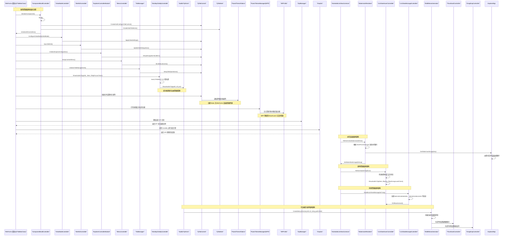
```mermaid
sequenceDiagram
participant Host as "WinForms 宿主(QTTabBarClass)"
participant CompBuildCtrl as "ComponentBuildController"
participant ViewModeCtrl as "ViewModeController"
participant ShellUiCtrl as "ShellUiController"
participant ExplorerCtrl as "ExplorerControllerModule"
participant MenuCtrl as "MenuController"
participant TabMgr as "TabManager"
participant TooltipCtrl as "DesktopTooltipController"
participant SubDirTip as "SubDirTipForm"
participant TabCtl as "QTabControl"
participant TabItem as "QTabItem"
participant ThemeTok as "FluentThemeTokens"
participant ThemeMgr as "FluentThemeManager(WPF)"
participant WpfUtil as "WPFUtils"
participant DpiMgr as "DpiManager"
participant Graphic as "Graphic"
participant ELVC as "ExtendedListViewCommon"
participant WatermarkRenderer as "WatermarkRenderer"
participant HoverController as "ListViewHoverController"
participant MessageController as "ListViewMessageController"
participant ShellMenuGen as "ShellMenuGenerator"
participant ThumbCtrl as "ThumbnailController"
participant DragDropCtrl as "DragDropController"
Note over Host,CompBuildCtrl : 新的控制器架构初始化流程
Host->>CompBuildCtrl : InitializeComponent()
CompBuildCtrl->>CompBuildCtrl : Build()
CompBuildCtrl->>TabCtl : CreateAndConfigureTabControl()
CompBuildCtrl->>TabItem : CreateInitialTabItems()
CompBuildCtrl->>Host : InitializeAllControllers()
Host->>ViewModeCtrl : ConfigureViewMode(initialMode)
ViewModeCtrl->>TabCtl : ApplyViewSettings()
Host->>ShellUiCtrl : SyncShellUI()
ShellUiCtrl->>TabCtl : UpdateShellIntegration()
Host->>ExplorerCtrl : InitializeExplorerIntegration()
ExplorerCtrl->>TabCtl : SetupNavigationHandlers()
Host->>MenuCtrl : SetupContextMenu()
MenuCtrl->>TabCtl : BindMenuEvents()
Host->>TabMgr : InitializeTabManagement()
TabMgr->>TabCtl : SetupTabOperations()
Host->>TooltipCtrl : ShowSubDirTip(pIDL, iItem, fSkipFocusCheck)
TooltipCtrl->>TooltipCtrl : GetLVITEMRECT() 计算位置
TooltipCtrl->>SubDirTip : ShowSubDirTip(path, idl, pnt)
Note over TooltipCtrl,SubDirTip : 提示框逻辑完全由控制器管理
Host->>TabCtl : 初始化并设置样式/颜色
TabCtl->>ThemeTok : 读取深色模式/强调色
Note over TabCtl,ThemeTok : 主题 Token 为 WinForms 渲染提供颜色源
Host->>ThemeMgr : 打开选项窗口时应用主题
ThemeMgr->>WpfUtil : 注入资源字典/刷新页面主题
Note over ThemeMgr,WpfUtil : WPF 侧使用 Mica/Accent 与合并资源
Host->>DpiMgr : 获取当前 DPI 信息
DpiMgr-->>Host : 返回 DPI 值与缩放比例
Host->>Graphic : 使用 ScaleBy 进行高度计算
Graphic-->>Host : 返回 DPI 感知的高度值
Note over ELVC,WatermarkRenderer : 水印渲染器架构重构
ELVC->>WatermarkRenderer : RefreshViewWatermark(fClear)
WatermarkRenderer->>WatermarkRenderer : 根据 ViewPerceivedType 选择水印图片
WatermarkRenderer->>ExplorerMgr : GetWatermarkImage(key)
ExplorerMgr->>ExplorerMgr : 从缓存或文件系统加载图片
WatermarkRenderer->>ELVC : SetWaterMarkImage(bitmap)
Note over ELVC,HoverController : 悬停控制器架构重构
ELVC->>HoverController : RefreshSubDirTip(force)
HoverController->>HoverController : 检查配置和用户交互状态
HoverController->>HoverController : ShowSubDirTip(iItem, fByKey, fSkipForegroundCheck)
Note over ELVC,MessageController : 消息控制器架构重构
ELVC->>MessageController : HandleListViewMessage(ref msg)
MessageController->>MessageController : 处理 WM.MOUSEWHEEL、WM.MOUSELEAVE 等消息
MessageController->>HoverController : OnMouseLeave()
Note over SubDirTip,ShellMenuGen : 子目录提示表单架构重构
SubDirTip->>ShellMenuGen : CreateMenu(DirectoryInfo di, string pathChild)
ShellMenuGen->>ShellMenuGen : 扫描目录并创建菜单项
ShellMenuGen->>ThumbCtrl : 为文件项设置缩略图索引
ShellMenuGen->>DragDropCtrl : 为文件夹项设置拖放支持
```

**图表来源**
- [ComponentBuildController.cs:16-115](file://QTTabBar/QTTabBarClass.ComponentBuildController.cs#L16-L115)
- [ViewModeController.cs:14-49](file://QTTabBar/QTTabBarClass.ViewModeController.cs#L14-L49)
- [ShellUiController.cs:16-54](file://QTTabBar/QTTabBarClass.ShellUiController.cs#L16-L54)
- [ExplorerController.cs:70-91](file://QTTabBar/QTTabBarClass.ExplorerController.cs#L70-L91)
- [MenuController.cs:65-107](file://QTTabBar/QTTabBarClass.MenuController.cs#L65-L107)
- [TabManager.cs:67-99](file://QTTabBar/QTTabBarClass.TabManager.cs#L67-L99)
- [QTDesktopTool.TooltipController.cs:19-49](file://QTTabBar/QTDesktopTool.TooltipController.cs#L19-L49)
- [QTDesktopTool.cs:1212-1218](file://QTTabBar/QTDesktopTool.cs#L1212-L1218)
- [QTabControl.cs:227-257](file://QTTabBar/QTabControl.cs#L227-L257)
- [FluentThemeTokens.cs:40-43](file://QTTabBar/FluentThemeTokens.cs#L40-L43)
- [FluentThemeManager.cs:10-41](file://QTTabBar/FluentThemeManager.cs#L10-L41)
- [WPFUtils.cs:156-285](file://QTTabBar/WPFUtils.cs#L156-L285)
- [DpiManager.cs:50-87](file://BandObjectLib/Dpi/DpiManager.cs#L50-87)
- [Graphic.cs:118-121](file://QTTabBar/Graphic.cs#L118-L121)
- [ExtendedListViewCommon.cs:134-136](file://QTTabBar/ExtendedListViewCommon.cs#L134-L136)
- [ExtendedListViewCommon.WatermarkRenderer.cs:42-77](file://QTTabBar/ExtendedListViewCommon.WatermarkRenderer.cs#L42-L77)
- [ExtendedListViewCommon.ListViewHoverController.cs:111-137](file://QTTabBar/ExtendedListViewCommon.ListViewHoverController.cs#L111-L137)
- [ExtendedListViewCommon.ListViewMessageController.cs:43-117](file://QTTabBar/ExtendedListViewCommon.ListViewMessageController.cs#L43-L117)
- [SubDirTipForm.ShellMenuGenerator.cs:62-206](file://QTTabBar/SubDirTipForm.ShellMenuGenerator.cs#L62-L206)
- [SubDirTipForm.ThumbnailController.cs:52-88](file://QTTabBar/SubDirTipForm.ThumbnailController.cs#L52-L88)
- [SubDirTipForm.DragDropController.cs:74-106](file://QTTabBar/SubDirTipForm.DragDropController.cs#L74-L106)

## 详细组件分析

### QTabControl 与 QTabItem 类图

```mermaid
classDiagram
class QTabControl {
+事件 : CloseButtonClicked
+事件 : SelectedIndexChanged
+事件 : PointedTabChanged
+事件 : RowCountChanged
-InitializeColors()
-CalculateItemRectangle()
-CalculateItemRectangle_MultiRows()
-ChangeSelection(tab,index)
-DrawBackground(g,bSelected,fHot,rctItem,edges,fVisualStyle,index)
}
class QTabItem {
+属性 : Text, CurrentPath, ImageKey, ToolTipText
+属性 : TitleTextSize, SubTitleTextSize
+方法 : RefreshRectangle()
+方法 : NavigatedTo(path,idl,hash,autoNav)
+方法 : GoBackward()/GoForward()
+静态 : CheckSubTexts(tabControl)
}
class DesktopTooltipController {
+属性 : _owner : QTDesktopTool
+方法 : ShowSubDirTip(pIDL, iItem, fSkipFocusCheck)
+方法 : HideSubDirTip()
+静态 : GetLVITEMRECT(hwndListView, iItem, fSubDirTip, fvm)
}
class ComponentBuildController {
+属性 : _owner : QTTabBarClass
+方法 : Build()
+方法 : CreateAndConfigureTabControl()
+method : InitializeAllControllers()
+method : DisposeComponents()
}
class ViewModeController {
+属性 : _owner : QTTabBarClass
+method : ChangeViewMode(fUp)
+method : ApplyViewSettings()
+method : UpdateDisplayOptions()
+method : SwitchToThumbnailView()
+method : SwitchToListView()
}
class ShellUiController {
+属性 : _owner : QTTabBarClass
+method : RefreshOptions()
+method : ShowFolderTree(fShow)
+method : ShowSearchBar(fShow)
+method : ToggleTopMost()
}
class ExplorerControllerModule {
+属性 : _owner : QTTabBarClass
+method : BeforeNavigate(target, autonav)
+method : NavigateCurrentTab(fBack)
+method : Explorer_NavigateComplete2(pDisp, URL)
+method : explorerController_MessageCaptured(msg)
}
class MenuController {
+属性 : _owner : QTTabBarClass
+method : contextMenuSys_ItemClicked(sender, e)
+method : contextMenuTab_ItemClicked(sender, e)
+method : contextMenuSys_Opening(sender, e)
}
class TabManager {
+属性 : _owner : QTTabBarClass
+method : AddInsertTab(tab)
+method : OpenNewTab(path, blockSelecting, fForceNew)
+method : RestoreTabsOnInitialize(iIndex, openingPath)
}
class BandInfoController {
+属性 : _owner : QTTabBarClass
+method : GetBandInfo(dwBandID, dwViewMode, ref dbi)
}
class ShutdownController {
+属性 : _owner : QTTabBarClass
+method : CloseDW(dwReserved)
}
class ExtendedListViewCommon {
+字段 : _watermarkRenderer : WatermarkRenderer
+字段 : _hoverController : ListViewHoverController
+字段 : _messageController : ListViewMessageController
+方法 : RefreshViewWatermark(bool fClear)
+方法 : HideSubDirTip(int iReason)
+方法 : RefreshSubDirTip(bool force)
+方法 : ListViewController_MessageCaptured(ref Message msg)
+方法 : ShellViewController_MessageCaptured(ref Message msg)
}
class WatermarkRenderer {
+属性 : _owner : ExtendedListViewCommon
+方法 : RefreshViewWatermark(bool fClear)
+方法 : SetBackgroundImage(bool isWatermark, bool isTiled, int xOffset, int yOffset)
+方法 : SetBackgroundImage2(bool isWatermark, bool isTiled, int xOffset, int yOffset)
+方法 : SetWaterMarkImage(Bitmap bmp)
}
class ListViewHoverController {
+属性 : _owner : ExtendedListViewCommon
+方法 : RefreshSubDirTip(bool force)
+方法 : ShowSubDirTip(int iItem, bool fByKey, bool fSkipForegroundCheck)
+方法 : HideSubDirTip(int iReason)
+方法 : ShowThumbnailTooltip(int iItem, Point pnt, bool fKey)
}
class ListViewMessageController {
+属性 : _owner : ExtendedListViewCommon
+方法 : HandleListViewMessage(ref Message msg)
+方法 : HandleShellViewMessage(ref Message msg)
+方法 : ResetTrackMouseEvent()
}
class SubDirTipForm {
+字段 : _menuGenerator : ShellMenuGenerator
+字段 : _thumbnailController : ThumbnailController
+字段 : _dragDropController : DragDropController
+方法 : ShowSubDirTip(string path, byte[] idl, Point pnt)
+方法 : HideSubDirTip(bool fForce)
}
class ShellMenuGenerator {
+属性 : _owner : SubDirTipForm
+方法 : CreateMenu(DirectoryInfo di, string pathChild)
+方法 : CreateMenuFromIDL(IDLWrapper idlw, byte[] idlChild)
+方法 : CreateParentMenu(IDLWrapper idlw, QMenuItem[] lst)
}
class ThumbnailController {
+属性 : _owner : SubDirTipForm
+方法 : ShowThumbnailTooltip(ToolStripMenuItemEx tsmi, bool fKey)
+方法 : HideThumbnailTooltip()
+方法 : HideThumbnailTooltip(bool fKey)
}
class DragDropController {
+属性 : _owner : SubDirTipForm
+方法 : tsmi_MouseDown(object sender, MouseEventArgs e)
+方法 : tsmi_MouseUp(object sender, MouseEventArgs e)
+方法 : DoDragDropCheckedItems(DropDownMenuDropTarget ddmrt)
+方法 : GetCheckedItems(DropDownMenuReorderable ddmr, string[] paths, QMenuItem[] items, bool fDragDrop)
}
class DpiAwareForm {
+属性 : Dpi, Scaling
+method : ScaleBeforeHandleIsCreated()
+method : OnDpiChanged(DpiChangedEventArgs)
+method : UpdateFont()
}
class Graphic {
+method : ScaleBy(windowScaling, tabHeight)
+method : SelectValueByScaling(scaling, value96, value120, value144)
+method : CreateDefaultFont()
}
QTabControl --> QTabItem : "拥有/绘制/布局"
DesktopTooltipController --> QTDesktopTool : "持有所有者引用"
ComponentBuildController --> QTTabBarClass : "管理组件生命周期"
ViewModeController --> QTTabBarClass : "控制视图配置"
ShellUiController --> QTTabBarClass : "协调Shell集成"
ExplorerControllerModule --> QTTabBarClass : "管理浏览器功能"
MenuController --> QTTabBarClass : "处理菜单事件"
TabManager --> QTTabBarClass : "管理标签操作"
BandInfoController --> QTTabBarClass : "处理Band信息"
ShutdownController --> QTTabBarClass : "处理关闭流程"
ExtendedListViewCommon --> WatermarkRenderer : "委托水印渲染"
ExtendedListViewCommon --> ListViewHoverController : "委托悬停处理"
ExtendedListViewCommon --> ListViewMessageController : "委托消息分发"
WatermarkRenderer --> ExtendedListViewCommon : "反向引用所有者"
ListViewHoverController --> ExtendedListViewCommon : "反向引用所有者"
ListViewMessageController --> ExtendedListViewCommon : "反向引用所有者"
SubDirTipForm --> ShellMenuGenerator : "委托菜单生成"
SubDirTipForm --> ThumbnailController : "委托缩略图预览"
SubDirTipForm --> DragDropController : "委托拖放操作"
ShellMenuGenerator --> SubDirTipForm : "反向引用所有者"
ThumbnailController --> SubDirTipForm : "反向引用所有者"
DragDropController --> SubDirTipForm : "反向引用所有者"
DpiAwareForm --> DpiManager : "使用 DPI 管理器"
Graphic --> QTabControl : "提供 DPI 缩放辅助"
```

**图表来源**
- [QTabControl.cs:27-123](file://QTTabBar/QTabControl.cs#L27-L123)
- [QTabControl.cs:290-464](file://QTTabBar/QTabControl.cs#L290-L464)
- [QTabControl.cs:573-750](file://QTTabBar/QTabControl.cs#L573-L750)
- [QTabItem.cs:31-84](file://QTTabBar/QTabItem.cs#L31-L84)
- [QTabItem.cs:225-275](file://QTTabBar/QTabItem.cs#L225-L275)
- [QTabItem.cs:351-390](file://QTTabBar/QTabItem.cs#L351-390)
- [QTDesktopTool.TooltipController.cs:12-152](file://QTTabBar/QTDesktopTool.TooltipController.cs#L12-L152)
- [ComponentBuildController.cs:8-50](file://QTTabBar/QTTabBarClass.ComponentBuildController.cs#L8-L50)
- [ViewModeController.cs:10-45](file://QTTabBar/QTTabBarClass.ViewModeController.cs#L10-L45)
- [ShellUiController.cs:8-35](file://QTTabBar/QTTabBarClass.ShellUiController.cs#L8-L35)
- [ExplorerController.cs:57-120](file://QTTabBar/QTTabBarClass.ExplorerController.cs#L57-L120)
- [MenuController.cs:58-63](file://QTTabBar/QTTabBarClass.MenuController.cs#L58-L63)
- [TabManager.cs:58-63](file://QTTabBar/QTTabBarClass.TabManager.cs#L58-L63)
- [BandInfoController.cs:8-13](file://QTTabBar/QTTabBarClass.BandInfoController.cs#L8-L13)
- [ShutdownController.cs:12-17](file://QTTabBar/QTTabBarClass.ShutdownController.cs#L12-L17)
- [ExtendedListViewCommon.cs:84-91](file://QTTabBar/ExtendedListViewCommon.cs#L84-L91)
- [ExtendedListViewCommon.WatermarkRenderer.cs:35-40](file://QTTabBar/ExtendedListViewCommon.WatermarkRenderer.cs#L35-L40)
- [ExtendedListViewCommon.ListViewHoverController.cs:31-54](file://QTTabBar/ExtendedListViewCommon.ListViewHoverController.cs#L31-L54)
- [ExtendedListViewCommon.ListViewMessageController.cs:35-41](file://QTTabBar/ExtendedListViewCommon.ListViewMessageController.cs#L35-L41)
- [SubDirTipForm.cs:72-76](file://QTTabBar/SubDirTipForm.cs#L72-L76)
- [SubDirTipForm.ShellMenuGenerator.cs:33-38](file://QTTabBar/SubDirTipForm.ShellMenuGenerator.cs#L33-L38)
- [SubDirTipForm.ThumbnailController.cs:30-35](file://QTTabBar/SubDirTipForm.ThumbnailController.cs#L30-L35)
- [SubDirTipForm.DragDropController.cs:34-39](file://QTTabBar/SubDirTipForm.DragDropController.cs#L34-L39)
- [DpiAwareForm.cs:16-178](file://BandObjectLib/Dpi/DpiAwareForm.cs#L16-L178)
- [Graphic.cs:118-128](file://QTTabBar/Graphic.cs#L118-L128)

章节来源
- [QTabControl.cs:27-123](file://QTTabBar/QTabControl.cs#L27-L123)
- [QTabControl.cs:290-464](file://QTTabBar/QTabControl.cs#L290-L464)
- [QTabControl.cs:573-750](file://QTTabBar/QTabControl.cs#L573-L750)
- [QTabItem.cs:31-84](file://QTTabBar/QTabItem.cs#L31-L84)
- [QTabItem.cs:225-275](file://QTTabBar/QTabItem.cs#L225-L275)
- [QTabItem.cs:351-390](file://QTTabBar/QTabItem.cs#L351-390)
- [QTDesktopTool.TooltipController.cs:12-152](file://QTTabBar/QTDesktopTool.TooltipController.cs#L12-L152)
- [ComponentBuildController.cs:8-50](file://QTTabBar/QTTabBarClass.ComponentBuildController.cs#L8-L50)
- [ViewModeController.cs:10-45](file://QTTabBar/QTTabBarClass.ViewModeController.cs#L10-L45)
- [ShellUiController.cs:8-35](file://QTTabBar/QTTabBarClass.ShellUiController.cs#L8-L35)
- [ExplorerController.cs:57-120](file://QTTabBar/QTTabBarClass.ExplorerController.cs#L57-L120)
- [MenuController.cs:58-63](file://QTTabBar/QTTabBarClass.MenuController.cs#L58-L63)
- [TabManager.cs:58-63](file://QTTabBar/QTTabBarClass.TabManager.cs#L58-L63)
- [BandInfoController.cs:8-13](file://QTTabBar/QTTabBarClass.BandInfoController.cs#L8-L13)
- [ShutdownController.cs:12-17](file://QTTabBar/QTTabBarClass.ShutdownController.cs#L12-L17)

#### 选择变更流程（序列图）
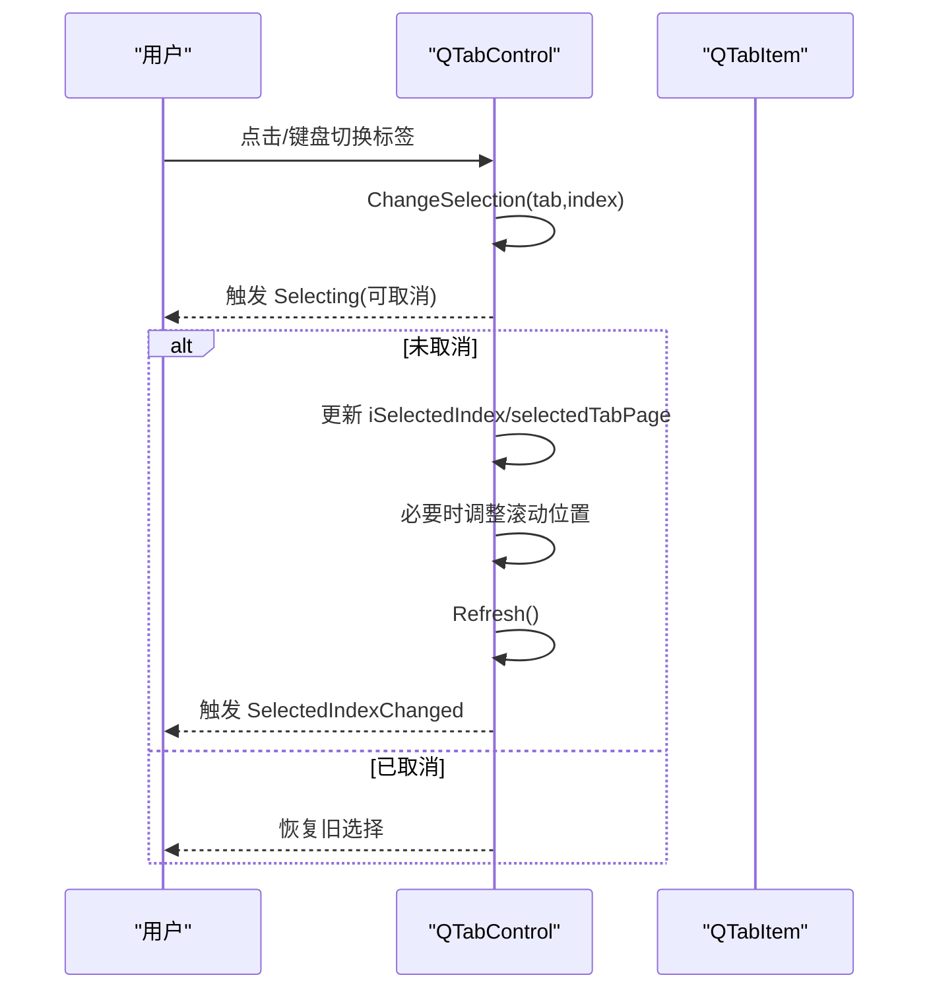
```mermaid
sequenceDiagram
participant User as "用户"
participant TabCtl as "QTabControl"
participant Item as "QTabItem"
User->>TabCtl : 点击/键盘切换标签
TabCtl->>TabCtl : ChangeSelection(tab,index)
TabCtl-->>User : 触发 Selecting(可取消)
alt 未取消
TabCtl->>TabCtl : 更新 iSelectedIndex/selectedTabPage
TabCtl->>TabCtl : 必要时调整滚动位置
TabCtl->>TabCtl : Refresh()
TabCtl-->>User : 触发 SelectedIndexChanged
else 已取消
TabCtl-->>User : 恢复旧选择
end
```

**图表来源**
- [QTabControl.cs:469-504](file://QTTabBar/QTabControl.cs#L469-L504)

章节来源
- [QTabControl.cs:469-504](file://QTTabBar/QTabControl.cs#L469-L504)

#### 多行布局算法（流程图）
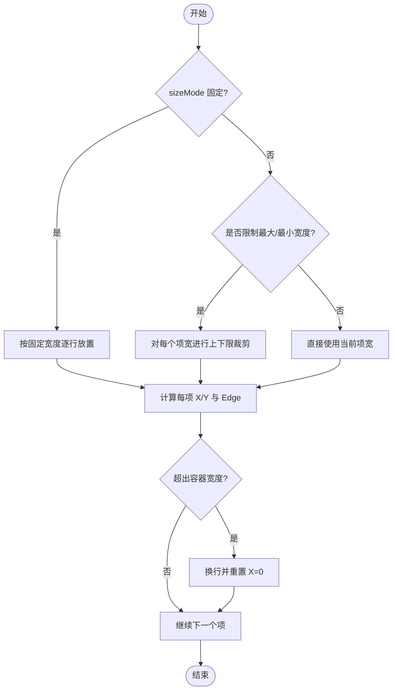
```mermaid
flowchart TD
Start(["开始"]) --> Mode{"sizeMode 固定?"}
Mode --> |是| Fixed["按固定宽度逐行放置"]
Mode --> |否| Limit{"是否限制最大/最小宽度?"}
Limit --> |是| Clamp["对每个项宽进行上下限裁剪"]
Limit --> |否| UseOrig["直接使用当前项宽"]
Fixed --> Place["计算每项 X/Y 与 Edge"]
Clamp --> Place
UseOrig --> Place
Place --> Overflow{"超出容器宽度?"}
Overflow --> |是| NewRow["换行并重置 X=0"]
Overflow --> |否| Next["继续下一个项"]
NewRow --> Next
Next --> End(["结束"])
```

**图表来源**
- [QTabControl.cs:332-464](file://QTTabBar/QTabControl.cs#L332-L464)

章节来源
- [QTabControl.cs:332-464](file://QTTabBar/QTabControl.cs#L332-L464)

#### 背景绘制与深色模式分支（流程图）
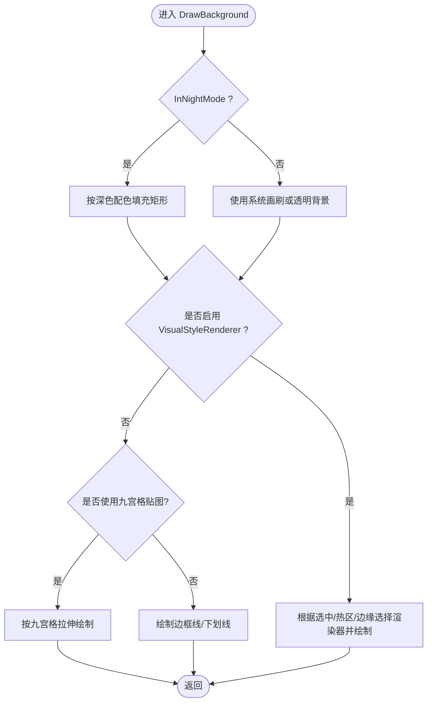
```mermaid
flowchart TD
Enter(["进入 DrawBackground"]) --> Night{"InNightMode ?"}
Night --> |是| DarkFill["按深色配色填充矩形"]
Night --> |否| LightFill["使用系统画刷或透明背景"]
DarkFill --> VS{"是否启用 VisualStyleRenderer ?"}
LightFill --> VS
VS --> |否| NinePatch{"是否使用九宫格贴图?"}
VS --> |是| Render["根据选中/热区/边缘选择渲染器并绘制"]
NinePatch --> |是| Stretch["按九宫格拉伸绘制"]
NinePatch --> |否| Lines["绘制边框线/下划线"]
Stretch --> Exit(["返回"])
Lines --> Exit
Render --> Exit
```

**图表来源**
- [QTabControl.cs:573-750](file://QTTabBar/QTabControl.cs#L573-L750)

章节来源
- [QTabControl.cs:573-750](file://QTTabBar/QTabControl.cs#L573-L750)

### 桌面提示框控制器架构

DesktopTooltipController 作为独立的控制器类，专门处理桌面提示框的所有复杂逻辑：
- **关注点分离**：将原本分散在 QTDesktopTool 中的提示框逻辑集中到一个专门的控制器中
- **委托模式**：QTDesktopTool 通过 `_tooltipController` 字段持有控制器实例，所有提示框操作都委托给控制器处理
- **生命周期管理**：控制器在 QTDesktopTool 初始化时创建，持有对拥有者的弱引用以避免循环引用

#### 核心功能模块
- **ShowSubDirTip**：处理子目录提示框的显示逻辑，包括焦点检查、路径解析、位置计算
- **HideSubDirTip**：统一处理提示框隐藏和状态清理
- **GetLVITEMRECT**：复杂的列表项矩形计算，支持多种视图模式和 Windows 版本兼容性

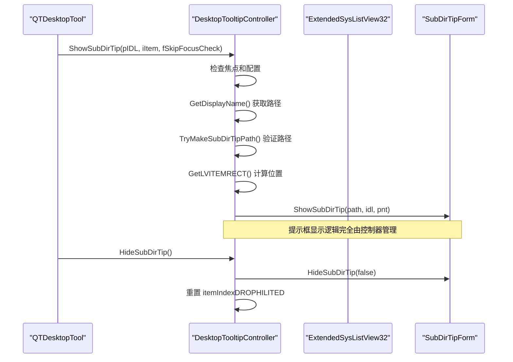
```mermaid
sequenceDiagram
participant QTDT as "QTDesktopTool"
participant Controller as "DesktopTooltipController"
participant ListView as "ExtendedSysListView32"
participant TipForm as "SubDirTipForm"
QTDT->>Controller : ShowSubDirTip(pIDL, iItem, fSkipFocusCheck)
Controller->>Controller : 检查焦点和配置
Controller->>Controller : GetDisplayName() 获取路径
Controller->>Controller : TryMakeSubDirTipPath() 验证路径
Controller->>Controller : GetLVITEMRECT() 计算位置
Controller->>TipForm : ShowSubDirTip(path, idl, pnt)
Note over Controller,TipForm : 提示框显示逻辑完全由控制器管理
QTDT->>Controller : HideSubDirTip()
Controller->>TipForm : HideSubDirTip(false)
Controller->>Controller : 重置 itemIndexDROPHILITED
```

**图表来源**
- [QTDesktopTool.TooltipController.cs:19-57](file://QTTabBar/QTDesktopTool.TooltipController.cs#L19-L57)
- [QTDesktopTool.cs:1212-1218](file://QTTabBar/QTDesktopTool.cs#L1212-L1218)

章节来源
- [QTDesktopTool.TooltipController.cs:12-152](file://QTTabBar/QTDesktopTool.TooltipController.cs#L12-L152)
- [QTDesktopTool.cs:64-65](file://QTTabBar/QTDesktopTool.cs#L64-L65)
- [QTDesktopTool.cs:1212-1218](file://QTTabBar/QTDesktopTool.cs#L1212-L1218)

### 高 DPI 支持增强

全面的 DPI 感知支持体系，包括多个专用组件和辅助方法：

#### DpiAwareForm 完整实现
DpiAwareForm 提供了最完整的 DPI 感知解决方案：
- **窗口创建前缩放**：ScaleBeforeHandleIsCreated 方法在句柄创建前进行预缩放
- **DPI 变更响应**：WndProc 中处理 WM_DPICHANGED 消息，自动调整窗口大小和控件布局
- **字体自适应**：UpdateFont 方法根据 DPI 变化动态调整字体大小
- **锚点控制处理**：智能处理 TabPage 中底部和右侧锚定控件的重新锚定

#### DpiAwareUserControl 和 DpiAwareTextBox
这两个轻量级基类为常用控件提供了简化的 DPI 感知支持：
- 继承 IDpiAwareObject 和 IObjectWithDpi 接口
- 提供 Dpi 属性和 Scaling 计算属性
- 在可见性变化时自动检测 DPI 并触发相应处理

#### Graphic 类 DPI 缩放辅助方法
专门的 DPI 缩放辅助方法：
- **ScaleBy**：根据窗口缩放比例计算目标高度，确保在不同 DPI 级别下保持一致的视觉效果
- **SelectValueByScaling**：根据缩放比例选择合适的数值，支持 96、120、144 DPI 三个档位
- **CreateDefaultFont**：创建默认字体，支持指定字号和样式

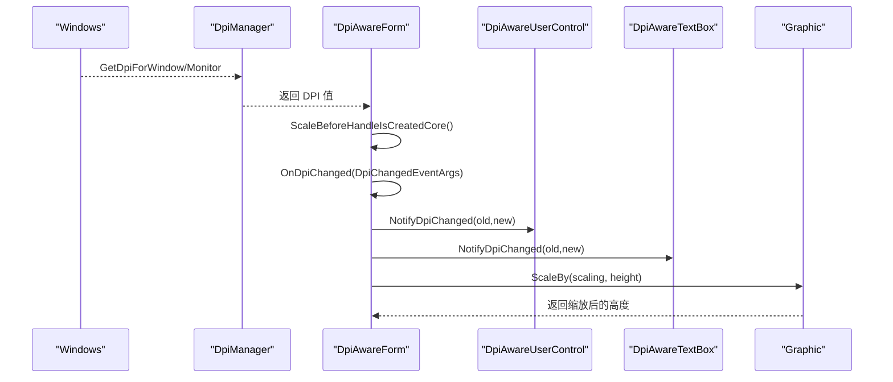
```mermaid
sequenceDiagram
participant OS as "Windows"
participant DpiMgr as "DpiManager"
participant Form as "DpiAwareForm"
participant UserControl as "DpiAwareUserControl"
participant TextBox as "DpiAwareTextBox"
participant Graphic as "Graphic"
OS-->>DpiMgr : GetDpiForWindow/Monitor
DpiMgr-->>Form : 返回 DPI 值
Form->>Form : ScaleBeforeHandleIsCreatedCore()
Form->>Form : OnDpiChanged(DpiChangedEventArgs)
Form->>UserControl : NotifyDpiChanged(old,new)
Form->>TextBox : NotifyDpiChanged(old,new)
Form->>Graphic : ScaleBy(scaling, height)
Graphic-->>Form : 返回缩放后的高度
```

**图表来源**
- [DpiManager.cs:50-87](file://BandObjectLib/Dpi/DpiManager.cs#L50-87)
- [DpiAwareForm.cs:20-86](file://BandObjectLib/Dpi/DpiAwareForm.cs#L20-86)
- [DpiAwareUserControl.cs:20-37](file://BandObjectLib/Dpi/DpiAwareUserControl.cs#L20-L37)
- [DpiAwareTextBox.cs:20-37](file://BandObjectLib/Dpi/DpiAwareTextBox.cs#L20-L37)
- [Graphic.cs:118-121](file://QTTabBar/Graphic.cs#L118-L121)

章节来源
- [DpiAwareForm.cs:20-86](file://BandObjectLib/Dpi/DpiAwareForm.cs#L20-86)
- [DpiAwareUserControl.cs:20-37](file://BandObjectLib/Dpi/DpiAwareUserControl.cs#L20-L37)
- [DpiAwareTextBox.cs:20-37](file://BandObjectLib/Dpi/DpiAwareTextBox.cs#L20-L37)
- [Graphic.cs:118-128](file://QTTabBar/Graphic.cs#L118-L128)

### 主题系统与样式定制（Fluent 与深色模式）
- 主题 Token：集中定义浅色/深色背景、描边、主次文本色与圆角常量，并提供从系统读取强调色的能力。
- WPF 主题管理器：基于 WPF UI 库应用 Mica/Accent，动态替换合并资源字典以切换 Fluent 主题。
- WinForms 渲染：QTabControl 在绘制时依据深色模式标志与配置色板进行差异化绘制。

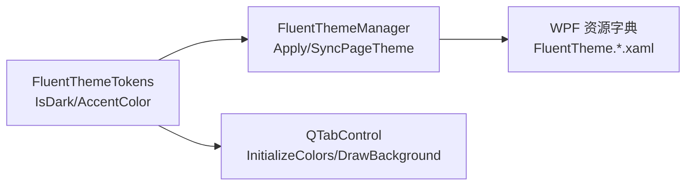
```mermaid
graph LR
Tokens["FluentThemeTokens<br/>IsDark/AccentColor"] --> Manager["FluentThemeManager<br/>Apply/SyncPageTheme"]
Manager --> WPFRes["WPF 资源字典<br/>FluentTheme.*.xaml"]
Tokens --> WinForms["QTabControl<br/>InitializeColors/DrawBackground"]
```

**图表来源**
- [FluentThemeTokens.cs:10-43](file://QTTabBar/FluentThemeTokens.cs#L10-L43)
- [FluentThemeManager.cs:10-41](file://QTTabBar/FluentThemeManager.cs#L10-L41)
- [QTabControl.cs:227-257](file://QTTabBar/QTabControl.cs#L227-L257)
- [QTabControl.cs:573-750](file://QTTabBar/QTabControl.cs#L573-L750)

章节来源
- [FluentThemeTokens.cs:10-43](file://QTTabBar/FluentThemeTokens.cs#L10-L43)
- [FluentThemeManager.cs:10-41](file://QTTabBar/FluentThemeManager.cs#L10-L41)
- [QTabControl.cs:227-257](file://QTTabBar/QTabControl.cs#L227-L257)
- [QTabControl.cs:573-750](file://QTTabBar/QTabControl.cs#L573-L750)

### 事件通信与状态同步
- QTabControl 暴露选择变更、关闭按钮点击、行计数变化、悬停标签变化等事件，供上层订阅。
- QTabItem 维护导航历史栈（前进/后退）、当前路径与 IDL、选中项快照、Shell 提示文本等，并在属性变化时触发父控件重绘。
- 子标题自动推导：当多个标签具有相同标题但不同路径时，自动从路径差异生成注释文本以提升可读性。
- DesktopTooltipController 通过事件机制与 SubDirTipForm 通信，处理菜单项点击和右键操作。
- **控制器架构** 通过事件机制实现松耦合通信：各控制器通过事件与主类和彼此进行通信，避免直接依赖。
- **重大增强的继承层次结构** 通过虚方法和抽象方法实现子类间的行为定制。
- **水印渲染器架构** 通过委托模式实现控制器与主类的松耦合通信。
- **列表视图消息控制器架构** 通过事件回调实现消息处理的松耦合。
- **子目录提示表单架构** 通过控制器间的委托调用实现功能分离。

章节来源
- [QTabControl.cs:112-123](file://QTTabBar/QTabControl.cs#L112-L123)
- [QTabControl.cs:469-504](file://QTTabBar/QTabControl.cs#L469-L504)
- [QTabItem.cs:117-144](file://QTTabBar/QTabItem.cs#L117-L144)
- [QTabItem.cs:225-275](file://QTTabBar/QTabItem.cs#L225-L275)
- [QTabItem.cs:351-390](file://QTTabBar/QTabItem.cs#L351-390)
- [QTDesktopTool.TooltipController.cs:33-41](file://QTTabBar/QTDesktopTool.TooltipController.cs#L33-L41)

### 高 DPI 适配增强

全面增强的 DPI 支持体系：

#### DpiManager 核心功能
- **每显示器 DPI 获取**：GetDpiFromPoint 和 GetDpiForWindow 方法支持 Windows 8.1+ 和 10+ API
- **缩放比例计算**：GetScalingFromPoint 和 GetScalingForWindow 提供统一的缩放因子计算
- **默认 DPI 查询**：DefaultDpi 属性兼容非每显示器 DPI 环境
- **最大 DPI 支持**：MaxDpi 和 MaxScaling 属性用于确定系统支持的最大缩放级别

#### DpiAwareControl 基类
- **DPI 变更通知**：NotifyDpiChanged 方法触发 OnDpiChanged 事件
- **自动 DPI 检测**：OnVisibleChanged 中自动检测并更新 DPI 值
- **Scaling 属性**：提供浮点数缩放因子，便于数学计算

#### 接口设计
- **IDpiAwareObject**：定义 DPI 变更通知接口
- **IObjectWithDpi**：定义 DPI 和 Scaling 属性接口
- **DpiChangedEventArgs**：封装 DPI 变更事件的参数，包括新旧 DPI 值和新的边界矩形

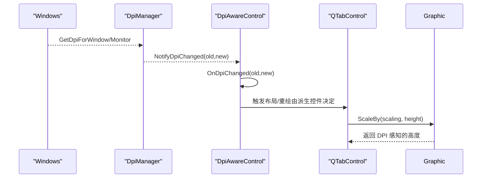
```mermaid
sequenceDiagram
participant OS as "Windows"
participant DpiMgr as "DpiManager"
participant Ctrl as "DpiAwareControl"
participant TabCtl as "QTabControl"
OS-->>DpiMgr : GetDpiForWindow/Monitor
DpiMgr-->>Ctrl : NotifyDpiChanged(old,new)
Ctrl->>Ctrl : OnDpiChanged(old,new)
Ctrl->>TabCtl : 触发布局/重绘由派生控件决定
TabCtl->>Graphic : ScaleBy(scaling, height)
Graphic-->>TabCtl : 返回 DPI 感知的高度
```

**图表来源**
- [DpiManager.cs:50-87](file://BandObjectLib/Dpi/DpiManager.cs#L50-87)
- [DpiAwareControl.cs:39-61](file://BandObjectLib/Dpi/DpiAwareControl.cs#L39-L61)
- [QTabControl.cs:141-147](file://QTTabBar/QTabControl.cs#L141-L147)
- [Graphic.cs:118-121](file://QTTabBar/Graphic.cs#L118-L121)

章节来源
- [DpiManager.cs:50-87](file://BandObjectLib/Dpi/DpiManager.cs#L50-87)
- [DpiAwareControl.cs:39-61](file://BandObjectLib/Dpi/DpiAwareControl.cs#L39-L61)
- [QTabControl.cs:141-147](file://QTTabBar/QTabControl.cs#L141-L147)
- [Graphic.cs:118-121](file://QTTabBar/Graphic.cs#L118-L121)

### WinForms 与 WPF 互操作要点
- 主题一致性：通过 FluentThemeTokens 将系统深色模式与强调色暴露给 WinForms 渲染与 WPF 主题应用两端。
- WPF 工具集：提供通用转换器、弱事件资源绑定、单选框数据绑定修复等，降低 WPF 侧复杂度与内存风险。
- 资源字典动态切换：FluentThemeManager 在运行时移除旧主题字典并插入新字典，确保即时生效。

章节来源
- [FluentThemeTokens.cs:40-43](file://QTTabBar/FluentThemeTokens.cs#L40-L43)
- [FluentThemeManager.cs:20-41](file://QTTabBar/FluentThemeManager.cs#L20-L41)
- [WPFUtils.cs:31-75](file://QTTabBar/WPFUtils.cs#L31-75)
- [WPFUtils.cs:156-285](file://QTTabBar/WPFUtils.cs#L156-L285)

## 控制器架构

**重大架构升级** QTTabBar-Next 实现了完整的控制器架构模式，包含18个专门控制器类，显著提升了UI系统的可维护性和模块化程度：

### 核心控制器组

#### 组件构建控制器（ComponentBuildController）
负责UI组件的统一创建和初始化：
- **组件生命周期管理**：统一管理QTabControl、QTabItem等核心组件的创建和销毁
- **配置应用**：根据用户配置动态调整组件行为和外观
- **事件绑定**：集中处理组件间的事件绑定和解绑
- **控制器初始化**：创建并初始化所有其他控制器类

#### 视图模式控制器（ViewModeController）
管理不同的视图模式和显示配置：
- **模式切换**：支持图标、缩略图、详细信息、平铺、缩略图条等多种视图模式
- **循环切换**：根据方向参数（fUp）在视图模式间循环切换
- **状态同步**：确保内部UI状态与Shell浏览器的视图模式保持一致

#### Shell UI控制器（ShellUiController）
协调Shell界面元素与内部UI组件的交互：
- **Shell集成**：处理Shell命令、上下文菜单等Shell特定功能
- **状态同步**：确保内部UI状态与Shell状态保持一致
- **界面控制**：管理文件夹树、搜索栏、置顶状态等Shell界面元素

#### 浏览器控制器模块（ExplorerControllerModule）
管理Explorer相关的功能和状态：
- **导航控制**：处理文件夹导航、历史记录、前进后退功能
- **事件处理**：处理Explorer COM事件和Windows消息
- **状态管理**：管理标签锁定、特殊文件夹处理、URL解析等复杂逻辑

### 管理控制器组

#### 菜单管理控制器（MenuController）
处理所有菜单相关的功能：
- **右键菜单**：动态生成系统菜单和标签菜单
- **事件分发**：处理菜单项点击事件和用户操作
- **插件集成**：动态加载和显示插件菜单项

#### 标签管理控制器（TabManager）
负责标签的所有操作：
- **标签生命周期**：创建、打开、关闭、克隆标签
- **启动恢复**：处理启动时的标签恢复和会话管理
- **用户交互**：处理拖放、双击、右键等标签相关操作

#### Band信息控制器（BandInfoController）
处理Windows Explorer Band对象的信息：
- **尺寸计算**：根据配置和DPI计算合适的Band尺寸
- **属性设置**：设置Band的各种属性如实际尺寸、最大尺寸、最小尺寸等
- **模式标志**：处理Band的显示模式和标志位

#### 关闭处理控制器（ShutdownController）
统一管理应用程序的关闭流程：
- **资源清理**：释放所有GDI对象、COM对象、事件处理器
- **状态保存**：保存锁定的标签、最近使用的文件、历史记录等
- **优雅退出**：确保Explorer窗口的正确关闭和资源释放

### 其他专业控制器

还包括以下专业控制器：
- **HookInputController**：处理全局钩子和输入事件
- **DragDropController**：管理拖放操作的各个阶段
- **FileToolsController**：提供文件工具功能如MD5计算
- **BindActionController**：处理用户绑定的动作和快捷键
- **ShellCommandController**：处理Shell命令和新文件创建
- **ListViewInputController**：处理列表视图的用户输入
- **KeyboardAcceleratorController**：管理键盘快捷键和加速键
- **ButtonBarClickController**：处理按钮栏的点击事件
- **BandLifecycleController**：管理Band的生命周期事件
- **ShellNavigationController**：处理Shell导航相关功能
- **TabTooltipController**：管理标签提示和工具提示
- **WindowManagementController**：管理窗口操作和状态
- **BandWindowController**：处理Band窗口相关的绘制和操作
- **DroppedFilesController**：处理文件拖放后的操作
- **FolderTreeController**：管理文件夹树的显示和交互
- **PluginMenuController**：处理插件菜单的注册和事件

```mermaid
classDiagram
class ComponentBuildController {
+属性 : _owner : QTTabBarClass
+方法 : Build()
+方法 : CreateAndConfigureTabControl()
+method : InitializeAllControllers()
+method : DisposeComponents()
}
class ViewModeController {
+属性 : _owner : QTTabBarClass
+method : ChangeViewMode(fUp)
+method : ApplyViewSettings()
+method : UpdateDisplayOptions()
+method : SwitchToThumbnailView()
+method : SwitchToListView()
}
class ShellUiController {
+属性 : _owner : QTTabBarClass
+method : RefreshOptions()
+method : ShowFolderTree(fShow)
+method : ShowSearchBar(fShow)
+method : ToggleTopMost()
}
class ExplorerControllerModule {
+属性 : _owner : QTTabBarClass
+method : BeforeNavigate(target, autonav)
+method : NavigateCurrentTab(fBack)
+method : Explorer_NavigateComplete2(pDisp, URL)
+method : explorerController_MessageCaptured(msg)
}
class MenuController {
+属性 : _owner : QTTabBarClass
+method : contextMenuSys_ItemClicked(sender, e)
+method : contextMenuTab_ItemClicked(sender, e)
+method : contextMenuSys_Opening(sender, e)
}
class TabManager {
+属性 : _owner : QTTabBarClass
+method : AddInsertTab(tab)
+method : OpenNewTab(path, blockSelecting, fForceNew)
+method : RestoreTabsOnInitialize(iIndex, openingPath)
}
class BandInfoController {
+属性 : _owner : QTTabBarClass
+method : GetBandInfo(dwBandID, dwViewMode, ref dbi)
}
class ShutdownController {
+属性 : _owner : QTTabBarClass
+method : CloseDW(dwReserved)
}
ComponentBuildController --> QTTabBarClass : "管理组件生命周期"
ViewModeController --> QTTabBarClass : "控制视图配置"
ShellUiController --> QTTabBarClass : "协调Shell集成"
ExplorerControllerModule --> QTTabBarClass : "管理浏览器功能"
MenuController --> QTTabBarClass : "处理菜单事件"
TabManager --> QTTabBarClass : "管理标签操作"
BandInfoController --> QTTabBarClass : "处理Band信息"
ShutdownController --> QTTabBarClass : "处理关闭流程"
```

**图表来源**
- [ComponentBuildController.cs:8-50](file://QTTabBar/QTTabBarClass.ComponentBuildController.cs#L8-L50)
- [ViewModeController.cs:10-45](file://QTTabBar/QTTabBarClass.ViewModeController.cs#L10-L45)
- [ShellUiController.cs:8-35](file://QTTabBar/QTTabBarClass.ShellUiController.cs#L8-L35)
- [ExplorerController.cs:57-120](file://QTTabBar/QTTabBarClass.ExplorerController.cs#L57-L120)
- [MenuController.cs:58-63](file://QTTabBar/QTTabBarClass.MenuController.cs#L58-L63)
- [TabManager.cs:58-63](file://QTTabBar/QTTabBarClass.TabManager.cs#L58-L63)
- [BandInfoController.cs:8-13](file://QTTabBar/QTTabBarClass.BandInfoController.cs#L8-L13)
- [ShutdownController.cs:12-17](file://QTTabBar/QTTabBarClass.ShutdownController.cs#L12-L17)

章节来源
- [ComponentBuildController.cs:8-50](file://QTTabBar/QTTabBarClass.ComponentBuildController.cs#L8-L50)
- [ViewModeController.cs:10-45](file://QTTabBar/QTTabBarClass.ViewModeController.cs#L10-L45)
- [ShellUiController.cs:8-35](file://QTTabBar/QTTabBarClass.ShellUiController.cs#L8-L35)
- [ExplorerController.cs:57-120](file://QTTabBar/QTTabBarClass.ExplorerController.cs#L57-L120)
- [MenuController.cs:58-63](file://QTTabBar/QTTabBarClass.MenuController.cs#L58-L63)
- [TabManager.cs:58-63](file://QTTabBar/QTTabBarClass.TabManager.cs#L58-L63)
- [BandInfoController.cs:8-13](file://QTTabBar/QTTabBarClass.BandInfoController.cs#L8-L13)
- [ShutdownController.cs:12-17](file://QTTabBar/QTTabBarClass.ShutdownController.cs#L12-L17)

### 组件构建流程（序列图）
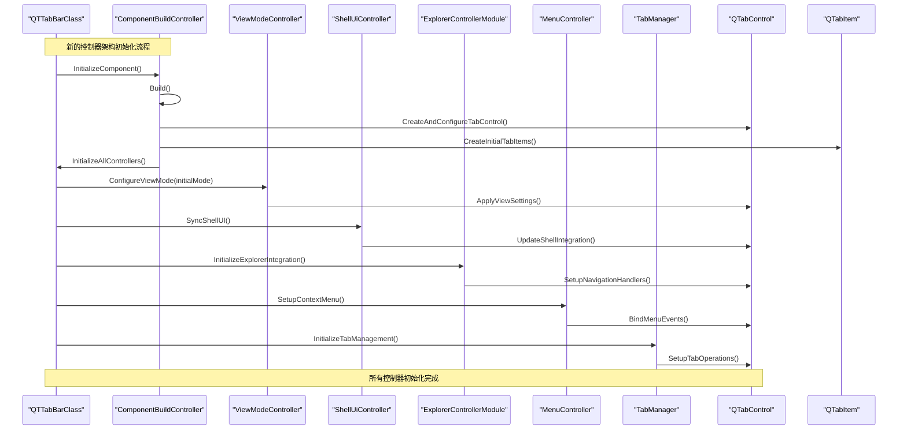
```mermaid
sequenceDiagram
participant Host as "QTTabBarClass"
participant BuildCtrl as "ComponentBuildController"
participant ViewCtrl as "ViewModeController"
participant ShellCtrl as "ShellUiController"
participant ExplorerCtrl as "ExplorerControllerModule"
participant MenuCtrl as "MenuController"
participant TabMgr as "TabManager"
participant TabCtl as "QTabControl"
participant TabItem as "QTabItem"
Note over Host,BuildCtrl : 新的控制器架构初始化流程
Host->>BuildCtrl : InitializeComponent()
BuildCtrl->>BuildCtrl : Build()
BuildCtrl->>TabCtl : CreateAndConfigureTabControl()
BuildCtrl->>TabItem : CreateInitialTabItems()
BuildCtrl->>Host : InitializeAllControllers()
Host->>ViewCtrl : ConfigureViewMode(initialMode)
ViewCtrl->>TabCtl : ApplyViewSettings()
Host->>ShellCtrl : SyncShellUI()
ShellCtrl->>TabCtl : UpdateShellIntegration()
Host->>ExplorerCtrl : InitializeExplorerIntegration()
ExplorerCtrl->>TabCtl : SetupNavigationHandlers()
Host->>MenuCtrl : SetupContextMenu()
MenuCtrl->>TabCtl : BindMenuEvents()
Host->>TabMgr : InitializeTabManagement()
TabMgr->>TabCtl : SetupTabOperations()
Note over Host,TabCtl : 所有控制器初始化完成
```

**图表来源**
- [ComponentBuildController.cs:16-115](file://QTTabBar/QTTabBarClass.ComponentBuildController.cs#L16-L115)
- [ViewModeController.cs:14-49](file://QTTabBar/QTTabBarClass.ViewModeController.cs#L14-L49)
- [ShellUiController.cs:16-54](file://QTTabBar/QTTabBarClass.ShellUiController.cs#L16-L54)
- [ExplorerController.cs:70-91](file://QTTabBar/QTTabBarClass.ExplorerController.cs#L70-L91)
- [MenuController.cs:65-107](file://QTTabBar/QTTabBarClass.MenuController.cs#L65-L107)
- [TabManager.cs:67-99](file://QTTabBar/QTTabBarClass.TabManager.cs#L67-L99)

章节来源
- [ComponentBuildController.cs:16-115](file://QTTabBar/QTTabBarClass.ComponentBuildController.cs#L16-L115)
- [ViewModeController.cs:14-49](file://QTTabBar/QTTabBarClass.ViewModeController.cs#L14-L49)
- [ShellUiController.cs:16-54](file://QTTabBar/QTTabBarClass.ShellUiController.cs#L16-L54)
- [ExplorerController.cs:70-91](file://QTTabBar/QTTabBarClass.ExplorerController.cs#L70-L91)
- [MenuController.cs:65-107](file://QTTabBar/QTTabBarClass.MenuController.cs#L65-L107)
- [TabManager.cs:67-99](file://QTTabBar/QTTabBarClass.TabManager.cs#L67-L99)

## 增强的继承层次结构与代码复用

**重大架构升级** QTTabBar-Next 引入了重大增强的继承层次结构，通过 TabBarBase 抽象基类及其多个部分类实现核心功能的代码复用，显著减少了重复代码：

### TabBarBase 抽象基类架构
TabBarBase 是所有标签栏类的共同基类，提供了大量共享功能和公共成员，并通过多个部分类文件组织不同功能模块：

#### 核心共享字段
- **UI组件引用**：tabControl1、rebarController、contextMenuSys、contextMenuTab 等
- **状态管理**：CurrentAddress、CurrentTab、BandHeight、ExplorerHandle 等
- **Shell集成**：ShellBrowser、TravelLog、listView 等
- **导航历史**：lstActivatedTabs、LogEntryDic、CurrentTravelLogIndex 等

#### 核心共享方法
- **DPI 处理**：ComputeBandHeight、ResolveDpiScale、GetBandDpiScale 等
- **导航辅助**：AddToHistory、SyncTravelState、NavigateToPastSpecialDir 等
- **UI 同步**：SyncToolbarTravelButton、SetBarRows 等
- **工具方法**：TryCallButtonBar、IsSearchResultFolder 等

### 重大增强的部分类架构

#### 窗口消息处理部分类（TabBarBase.WindowMessages.cs）
集中处理各种Windows消息和系统事件：
- **HandleSysColorChangeHookMessage**：处理系统颜色变更，自动切换深色/浅色模式
- **TryHandleHookCloseMessage**：处理Explorer窗口关闭消息，支持XP和非XP版本的差异处理
- **TryHandleHookCommandMessage**：处理命令消息，包括特殊的关闭命令处理

#### 鼠标事件处理部分类（TabBarBase.MouseHandlers.cs）
处理所有鼠标相关的交互逻辑：
- **拖放操作**：tabControl1_MouseDown、tabControl1_MouseMove、tabControl1_MouseUp 实现完整的拖放功能
- **双击处理**：tabControl1_MouseDoubleClick 支持双击标签执行绑定动作
- **中键处理**：支持中键点击标签执行配置的绑定动作
- **光标管理**：GetTabDragCursor 和 CreateDragCursor 提供自定义拖放光标

#### 绑定动作处理部分类（TabBarBase.BindActions.cs）
处理用户配置的绑定动作：
- **TryDoBindActionCore**：核心动作处理逻辑，支持标签切换、关闭、克隆等操作
- **动作类型支持**：NextTab、PreviousTab、FirstTab、LastTab、CloseCurrent、CloneCurrent 等
- **重复动作支持**：对某些动作支持重复执行（如后退、前进、透明度调节）

#### 标签克隆处理部分类（TabBarBase.TabCloning.cs）
- **CloneTabButtonCore**：统一的标签克隆逻辑，支持指定位置和选择状态

#### 关闭操作处理部分类（TabBarBase.Close.cs）
- **CloseAllTabsExcept**：关闭除指定标签外的所有标签
- **CloseLeftRight**：关闭当前标签左侧或右侧的所有标签
- **HandleCLOSE**：处理关闭按钮的不同行为模式

#### 加号按钮处理部分类（TabBarBase.PlusButton.cs）
- **tabControl1_PlusButtonClicked**：处理加号按钮点击，支持从剪贴板粘贴路径
- **openDefault**：打开默认位置的标签

#### 选择处理部分类（TabBarBase.Selection.cs）
- **SaveSelectedItems**：保存当前标签的选择状态
- **tabControl1_Deselecting/tabControl1_Selecting**：处理标签选择变更事件

#### 标签操作处理部分类（TabBarBase.TabOperations.cs）
- **AddInsertTab**：根据配置插入新标签的位置
- **CreateNewTab**：创建新标签并导航到指定路径
- **OpenNewTab**：打开新标签，支持多种路径格式和特殊文件夹处理
- **CloseTab/CloseTabs**：关闭单个或多个标签，支持复杂的关闭策略

#### 标签选择处理部分类（TabBarBase.TabSelection.cs）
- **tabControl1_SelectedIndexChanged**：处理标签选择变更，支持特殊文件夹的历史记录
- **TryNavigateOnTabSelect**：虚拟方法，允许子类自定义导航逻辑
- **UpdateActivatedTabs**：维护最近激活的标签历史

#### Explorer集成处理部分类（TabBarBase.ExplorerAttach.cs）
- **FinishExplorerAttached**：完成Explorer集成后的初始化
- **OnExplorerAttachActivate**：虚拟方法，允许子类自定义激活逻辑

### 继承层次结构

```mermaid
classDiagram
class BandObject {
<<抽象基类>>
+属性 : Handle, ReBarHandle, BandID
+方法 : ShowDW(fShow), GetBandInfo(...)
}
class TabBarBase {
<<抽象基类>>
+字段 : tabControl1, rebarController, CurrentTab
+方法 : ComputeBandHeight(), ResolveDpiScale()
+方法 : SyncTravelState(), SetBarRows()
+虚方法 : IsBottomBar(), IsVertical()
+抽象方法 : CalcBandHeight(count), IsTabSubFolderMenuVisible
}
class TabBarBase_WindowMessages {
+方法 : HandleSysColorChangeHookMessage()
+方法 : TryHandleHookCloseMessage()
+方法 : TryHandleHookCommandMessage()
}
class TabBarBase_MouseHandlers {
+方法 : tabControl1_CloseButtonClicked()
+方法 : tabControl1_MouseDoubleClick()
+方法 : tabControl1_MouseDown()
+方法 : tabControl1_MouseMove()
+方法 : tabControl1_MouseUp()
+方法 : GetTabDragCursor()
}
class TabBarBase_BindActions {
+方法 : TryDoBindActionCore()
}
class TabBarBase_TabCloning {
+方法 : CloneTabButtonCore()
}
class TabBarBase_Close {
+方法 : CloseAllTabsExcept()
+方法 : CloseLeftRight()
+方法 : HandleCLOSE()
}
class TabBarBase_PlusButton {
+方法 : tabControl1_PlusButtonClicked()
+方法 : openDefault()
}
class TabBarBase_Selection {
+方法 : SaveSelectedItems()
+方法 : tabControl1_Deselecting()
+方法 : tabControl1_Selecting()
}
class TabBarBase_TabOperations {
+方法 : AddInsertTab()
+方法 : CreateNewTab()
+方法 : OpenNewTab()
+方法 : CloseTab()
+方法 : CloseTabs()
}
class TabBarBase_TabSelection {
+方法 : tabControl1_SelectedIndexChanged()
+方法 : TryNavigateOnTabSelect()
+方法 : UpdateActivatedTabs()
}
class TabBarBase_ExplorerAttach {
+方法 : FinishExplorerAttached()
+方法 : OnExplorerAttachActivate()
}
class QTTabBarClass {
+属性 : PluginServer, Explorer
+方法 : OpenNewTab(), CloseTab()
+方法 : CloneTabButton(), AddInsertTab()
}
class QTSecondViewBar {
+属性 : viewContainer, controlContainer
+方法 : UpdateView(), RefreshRebarBand()
+重写 : ShowDW(), WndProc()
}
BandObject <|-- TabBarBase
TabBarBase <|-- TabBarBase_WindowMessages
TabBarBase <|-- TabBarBase_MouseHandlers
TabBarBase <|-- TabBarBase_BindActions
TabBarBase <|-- TabBarBase_TabCloning
TabBarBase <|-- TabBarBase_Close
TabBarBase <|-- TabBarBase_PlusButton
TabBarBase <|-- TabBarBase_Selection
TabBarBase <|-- TabBarBase_TabOperations
TabBarBase <|-- TabBarBase_TabSelection
TabBarBase <|-- TabBarBase_ExplorerAttach
TabBarBase <|-- QTTabBarClass
TabBarBase <|-- QTSecondViewBar
```

**图表来源**
- [TabBarBase.cs:20-403](file://QTTabBar/TabBarBase.cs#L20-L403)
- [TabBarBase.WindowMessages.cs:10-69](file://QTTabBar/TabBarBase.WindowMessages.cs#L10-L69)
- [TabBarBase.MouseHandlers.cs:11-269](file://QTTabBar/TabBarBase.MouseHandlers.cs#L11-L269)
- [TabBarBase.BindActions.cs:7-150](file://QTTabBar/TabBarBase.BindActions.cs#L7-L150)
- [TabBarBase.TabCloning.cs:2-34](file://QTTabBar/TabBarBase.TabCloning.cs#L2-L34)
- [TabBarBase.Close.cs:7-89](file://QTTabBar/TabBarBase.Close.cs#L7-L89)
- [TabBarBase.PlusButton.cs:8-70](file://QTTabBar/TabBarBase.PlusButton.cs#L8-L70)
- [TabBarBase.Selection.cs:6-33](file://QTTabBar/TabBarBase.Selection.cs#L6-L33)
- [TabBarBase.TabOperations.cs:10-273](file://QTTabBar/TabBarBase.TabOperations.cs#L10-L273)
- [TabBarBase.TabSelection.cs:5-87](file://QTTabBar/TabBarBase.TabSelection.cs#L5-L87)
- [TabBarBase.ExplorerAttach.cs:2-15](file://QTTabBar/TabBarBase.ExplorerAttach.cs#L2-L15)
- [QTSecondViewBar.cs:39-800](file://QTTabBar/QTSecondViewBar.cs#L39-L800)

### 代码复用优势
- **显著减少重复代码**：QTSecondViewBar.cs 从 1,882 行减少到 1,173 行（38% 减少），QTTabBarClass 也大幅精简
- **统一行为**：确保不同标签栏类型具有一致的用户体验
- **易于维护**：修改共享逻辑只需在基类中进行
- **扩展性强**：新增标签栏类型只需继承 TabBarBase 并重写必要方法
- **功能模块化**：每个部分类负责特定功能域，提高代码可读性

### 部分类组织优势
为了改善代码组织和可维护性，TabBarBase 被拆分为多个部分类文件：
- **TabBarBase.cs**：核心基类定义和共享字段
- **TabBarBase.WindowMessages.cs**：窗口消息处理，包括 HandleSysColorChangeHookMessage 和消息拦截逻辑
- **TabBarBase.MouseHandlers.cs**：鼠标事件处理，包含完整的拖放、双击、中键等交互逻辑
- **TabBarBase.BindActions.cs**：绑定动作处理，提供 TryDoBindActionCore 核心方法
- **TabBarBase.TabCloning.cs**：标签克隆相关功能
- **TabBarBase.Close.cs**：标签关闭相关功能，包括 CloseAllTabsExcept 和 HandleCLOSE 方法
- **TabBarBase.PlusButton.cs**：加号按钮相关功能，处理 tabControl1_PlusButtonClicked 和 openDefault 逻辑
- **TabBarBase.Selection.cs**：选择处理相关功能，包含 SaveSelectedItems 和选择变更事件处理
- **TabBarBase.TabOperations.cs**：标签操作相关功能，提供 AddInsertTab、CreateNewTab、OpenNewTab、CloseTab 等核心方法
- **TabBarBase.TabSelection.cs**：标签选择相关功能，处理 tabControl1_SelectedIndexChanged 和导航逻辑
- **TabBarBase.ExplorerAttach.cs**：Explorer 集成相关功能，提供 FinishExplorerAttached 和 OnExplorerAttachActivate 方法

章节来源
- [TabBarBase.cs:20-403](file://QTTabBar/TabBarBase.cs#L20-L403)
- [TabBarBase.WindowMessages.cs:10-69](file://QTTabBar/TabBarBase.WindowMessages.cs#L10-L69)
- [TabBarBase.MouseHandlers.cs:11-269](file://QTTabBar/TabBarBase.MouseHandlers.cs#L11-L269)
- [TabBarBase.BindActions.cs:7-150](file://QTTabBar/TabBarBase.BindActions.cs#L7-L150)
- [TabBarBase.TabCloning.cs:2-34](file://QTTabBar/TabBarBase.TabCloning.cs#L2-L34)
- [TabBarBase.Close.cs:7-89](file://QTTabBar/TabBarBase.Close.cs#L7-L89)
- [TabBarBase.PlusButton.cs:8-70](file://QTTabBar/TabBarBase.PlusButton.cs#L8-L70)
- [TabBarBase.Selection.cs:6-33](file://QTTabBar/TabBarBase.Selection.cs#L6-L33)
- [TabBarBase.TabOperations.cs:10-273](file://QTTabBar/TabBarBase.TabOperations.cs#L10-L273)
- [TabBarBase.TabSelection.cs:5-87](file://QTTabBar/TabBarBase.TabSelection.cs#L5-L87)
- [TabBarBase.ExplorerAttach.cs:2-15](file://QTTabBar/TabBarBase.ExplorerAttach.cs#L2-L15)
- [QTSecondViewBar.cs:39-800](file://QTTabBar/QTSecondViewBar.cs#L39-L800)

## 第二视图栏架构改进

**架构改进** QTTabBar-Next 对第二视图栏进行了重大架构重构，通过部分类分离组件构建和窗口消息处理逻辑，显著提升了代码的可维护性和清晰度：

### QTSecondViewBar.ComponentBuild.cs 部分类
负责第二视图栏的组件构建和初始化逻辑：
- **组件生命周期管理**：统一管理viewContainer、splitContainer、controlContainer等核心UI组件
- **ExplorerBrowser集成**：配置ExplorerBrowser控件的属性，包括导航面板、命令面板等的显示状态
- **标签控件初始化**：创建QTabControl实例，设置事件处理器和属性配置
- **布局管理**：处理SplitContainer的面板布局和Dock属性设置
- **上下文菜单初始化**：创建和配置右键菜单系统

#### 核心组件结构
- **viewContainer**：主视图容器，承载ExplorerBrowser控件
- **splitContainer**：分割容器，管理视图区域和控制区域的布局
- **controlContainer**：标签栏容器，承载QTabControl控件
- **addressBarContainer**：地址栏容器（预留扩展）

#### ExplorerBrowser配置
- **导航面板**：设置为隐藏状态，专注于标签栏功能
- **命令面板**：全部隐藏，简化用户界面
- **预览面板**：隐藏，避免界面复杂性

### QTSecondViewBar.SubclassHooks.cs 部分类
负责窗口子类化和消息处理逻辑：
- **窗口子类化**：使用WindowSubclass类实现对ReBar和BaseBar窗口的消息拦截
- **消息处理**：处理WM_PAINT、WM_ERASEBKGND、WM_WINDOWPOSCHANGING等关键消息
- **背景绘制**：根据垂直/水平模式绘制不同的背景颜色和边框
- **窗口尺寸管理**：处理窗口大小变化和位置调整
- **列表视图监控**：集成ListViewMonitor监控列表视图变化

#### 窗口子类化处理
- **baseBarSubclassProc**：处理BaseBar窗口消息，包括背景擦除和窗口位置变化
- **rebarSubclassProc**：处理ReBar窗口消息，包括绘制和背景处理
- **InstallHooks**：安装窗口子类化钩子，建立消息拦截机制

#### 消息处理特性
- **WM.ERASEBKGND**：自定义背景绘制，支持RTL布局和Windows 7边框效果
- **WM.WINDOWPOSCHANGING**：智能窗口尺寸调整，防止过度缩放
- **WM.PAINT**：重绘处理，确保界面一致性

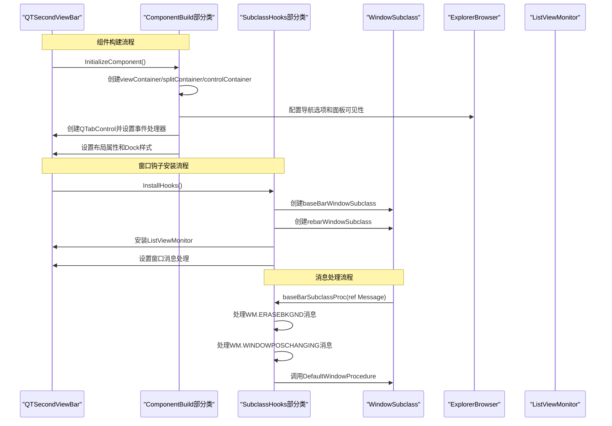
```mermaid
sequenceDiagram
participant SVB as "QTSecondViewBar"
participant CompBuild as "ComponentBuild部分类"
participant Hooks as "SubclassHooks部分类"
participant WindowSubclass as "WindowSubclass"
participant ExplorerBrowser as "ExplorerBrowser"
participant ListViewMonitor as "ListViewMonitor"
Note over SVB,CompBuild : 组件构建流程
SVB->>CompBuild : InitializeComponent()
CompBuild->>CompBuild : 创建viewContainer/splitContainer/controlContainer
CompBuild->>ExplorerBrowser : 配置导航选项和面板可见性
CompBuild->>SVB : 创建QTabControl并设置事件处理器
CompBuild->>SVB : 设置布局属性和Dock样式
Note over SVB,Hooks : 窗口钩子安装流程
SVB->>Hooks : InstallHooks()
Hooks->>WindowSubclass : 创建baseBarWindowSubclass
Hooks->>WindowSubclass : 创建rebarWindowSubclass
Hooks->>SVB : 安装ListViewMonitor
Hooks->>SVB : 设置窗口消息处理
Note over Hooks,WindowSubclass : 消息处理流程
WindowSubclass->>Hooks : baseBarSubclassProc(ref Message)
Hooks->>Hooks : 处理WM.ERASEBKGND消息
Hooks->>Hooks : 处理WM.WINDOWPOSCHANGING消息
Hooks->>WindowSubclass : 调用DefaultWindowProcedure
```

**图表来源**
- [QTSecondViewBar.ComponentBuild.cs:29-215](file://QTTabBar/QTSecondViewBar.ComponentBuild.cs#L29-L215)
- [QTSecondViewBar.SubclassHooks.cs:33-93](file://QTTabBar/QTSecondViewBar.SubclassHooks.cs#L33-L93)
- [QTSecondViewBar.SubclassHooks.cs:97-238](file://QTTabBar/QTSecondViewBar.SubclassHooks.cs#L97-L238)

章节来源
- [QTSecondViewBar.ComponentBuild.cs:27-263](file://QTTabBar/QTSecondViewBar.ComponentBuild.cs#L27-L263)
- [QTSecondViewBar.SubclassHooks.cs:27-262](file://QTTabBar/QTSecondViewBar.SubclassHooks.cs#L27-L262)

## IPC 类型化广播机制

**安全增强** QTTabBar-Next 实现了类型化的 IPC 广播机制，替代了不安全的 BinaryFormatter，提供了更安全可靠的跨进程通信：

### IpcCommandMessage 核心设计
- **协议头设计**：使用 "QTIP" 标识符 + 版本号 + 命令码 + 负载数据的固定格式
- **类型安全**：通过枚举定义命令类型，避免字符串匹配错误
- **向后兼容**：支持旧版本接收器忽略额外负载数据
- **内存安全**：避免反序列化漏洞，提升系统安全性

#### 支持的命令类型
- **SelectTab (1)**：选择指定标签页
- **OpenOptions (2)**：打开选项对话框
- **ReloadConfig (3)**：重新加载配置
- **ReloadGroups (4)**：重新加载分组
- **ReloadApps (5)**：重新加载应用程序
- **RefreshButtonBars (6)**：刷新按钮栏

#### 编码解码机制
- **Encode**：通用编码方法，支持任意命令和负载数据
- **TryParse**：安全解析方法，验证协议头和版本兼容性
- **专用编码器**：为特定命令提供优化的编码方法，如 EncodeRefreshButtonBars

### 架构测试覆盖
通过全面的测试套件确保 IPC 机制的正确性和安全性：

#### ArchitectureBatch4aTests
- **嵌套控制器验证**：确保 CommandDispatchController 和 SessionRestoreController 正确嵌套在 ExplorerControllerModule 中
- **方法存在性检查**：验证关键方法的公开性和可访问性
- **职责分离验证**：确保 DoFirstNavigation 方法正确委派给相应的控制器

#### ArchitectureReviewRemediationTests
- **配置广播版本递增**：确保 UpdateConfig 在广播前正确递增配置版本
- **主题同步顺序**：验证主题应用在副作用之前执行
- **初始化编排器**：确保初始化标志只在成功序列后设置

#### IpcTypedBroadcastTests
- **协议格式验证**：确保编码输出符合 QTIP 协议规范
- **命令分发**：验证客户端动作创建和分发的正确性
- **广播方法**：确保 InstanceManager 暴露正确的广播方法

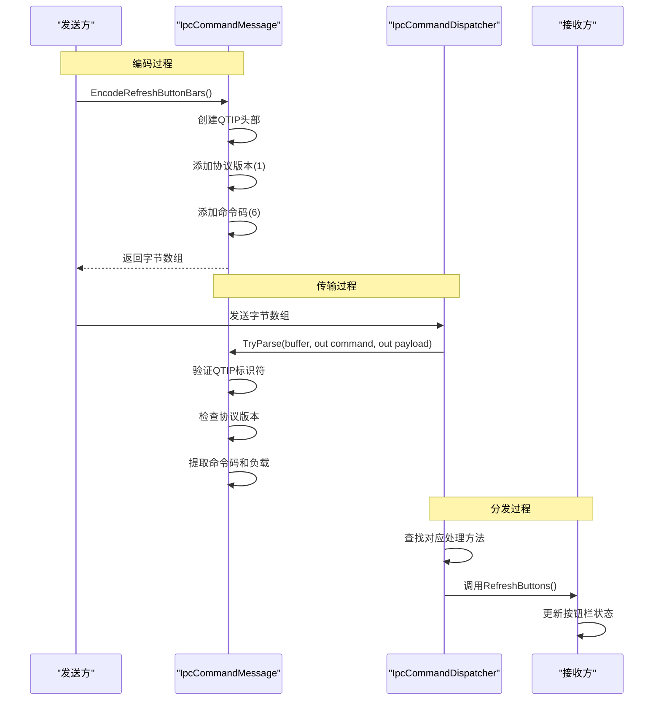
```mermaid
sequenceDiagram
participant Sender as "发送方"
participant IPC as "IpcCommandMessage"
participant Dispatcher as "IpcCommandDispatcher"
participant Receiver as "接收方"
Note over Sender,IPC : 编码过程
Sender->>IPC : EncodeRefreshButtonBars()
IPC->>IPC : 创建QTIP头部
IPC->>IPC : 添加协议版本(1)
IPC->>IPC : 添加命令码(6)
IPC-->>Sender : 返回字节数组
Note over IPC,Dispatcher : 传输过程
Sender->>Dispatcher : 发送字节数组
Dispatcher->>IPC : TryParse(buffer, out command, out payload)
IPC->>IPC : 验证QTIP标识符
IPC->>IPC : 检查协议版本
IPC->>IPC : 提取命令码和负载
Note over Dispatcher,Receiver : 分发过程
Dispatcher->>Dispatcher : 查找对应处理方法
Dispatcher->>Receiver : 调用RefreshButtons()
Receiver->>Receiver : 更新按钮栏状态
```

**图表来源**
- [IpcCommandMessage.cs:17-103](file://QTTabBar/IpcCommandMessage.cs#L17-L103)
- [IpcTypedBroadcastTests.cs:23-77](file://Tests\QTTtabBarTests\IpcTypedBroadcastTests.cs#L23-L77)

章节来源
- [IpcCommandMessage.cs:1-103](file://QTTabBar/IpcCommandMessage.cs#L1-L103)
- [ArchitectureBatch4aTests.cs:1-103](file://Tests\QTTtabBarTests\ArchitectureBatch4aTests.cs#L1-L103)
- [ArchitectureReviewRemediationTests.cs:1-184](file://Tests\QTTtabBarTests\ArchitectureReviewRemediationTests.cs#L1-L184)
- [IpcTypedBroadcastTests.cs:1-80](file://Tests\QTTtabBarTests\IpcTypedBroadcastTests.cs#L1-L80)

## 水印渲染器架构重构

**架构重构** QTTabBar-Next 对 ExtendedListViewCommon 类进行了重要的内部重构，将水印和背景渲染功能提取到专门的 WatermarkRenderer 控制器中，同时还将悬停处理逻辑提取到 ListViewHoverController 控制器中。这种重构遵循单一职责原则，显著提升了代码的可维护性和组织性：

### WatermarkRenderer 控制器架构
WatermarkRenderer 是一个私有嵌套类，专门负责水印和背景图像的渲染逻辑：
- **单一职责**：专注于水印图像的加载、缓存和设置，不包含任何列表视图的业务逻辑
- **反向引用**：通过 `_owner` 字段持有对 ExtendedListViewCommon 的引用，以便访问必要的属性和方法
- **向后兼容**：ExtendedListViewCommon 保留了 `RefreshViewWatermark` 公共方法作为门面，转发到 WatermarkRenderer 处理

#### 核心功能模块
- **RefreshViewWatermark**：根据 ViewPerceivedType 选择合适的 watermark 图像并应用到列表视图
- **SetWaterMarkImage**：底层水印图像设置方法，使用 LVBKIMAGE 结构体与 Windows API 交互
- **SetBackgroundImage/SetBackgroundImage2**：背景图像设置方法，支持水印和平铺模式

#### 水印图像缓存机制
- **BmpCacheKey 枚举**：定义了不同类型的水印图像键（General、Picture、Music、Movie、Document）
- **ResourceCache 泛型缓存**：线程安全的并发字典缓存，避免重复加载相同的图像资源
- **ViewPerceivedTypeResolver**：根据当前文件夹类型自动解析合适的 perceived type

### ListViewHoverController 控制器架构
ListViewHoverController 同样是一个私有嵌套类，专门处理子目录提示和缩略图预览的悬停逻辑：
- **悬停状态管理**：维护 subDirTip 和 thumbnailTooltip 的状态和生命周期
- **定时器控制**：管理悬停延迟和动画效果的 Timer 实例
- **事件委托**：通过事件机制与 ExtendedListViewCommon 进行通信

#### 核心功能模块
- **RefreshSubDirTip**：刷新子目录提示框，处理复杂的用户交互状态
- **ShowSubDirTip/ShowThumbnailTooltip**：显示不同类型的提示框
- **HideSubDirTip/HideThumbnailTooltip**：隐藏提示框并清理状态

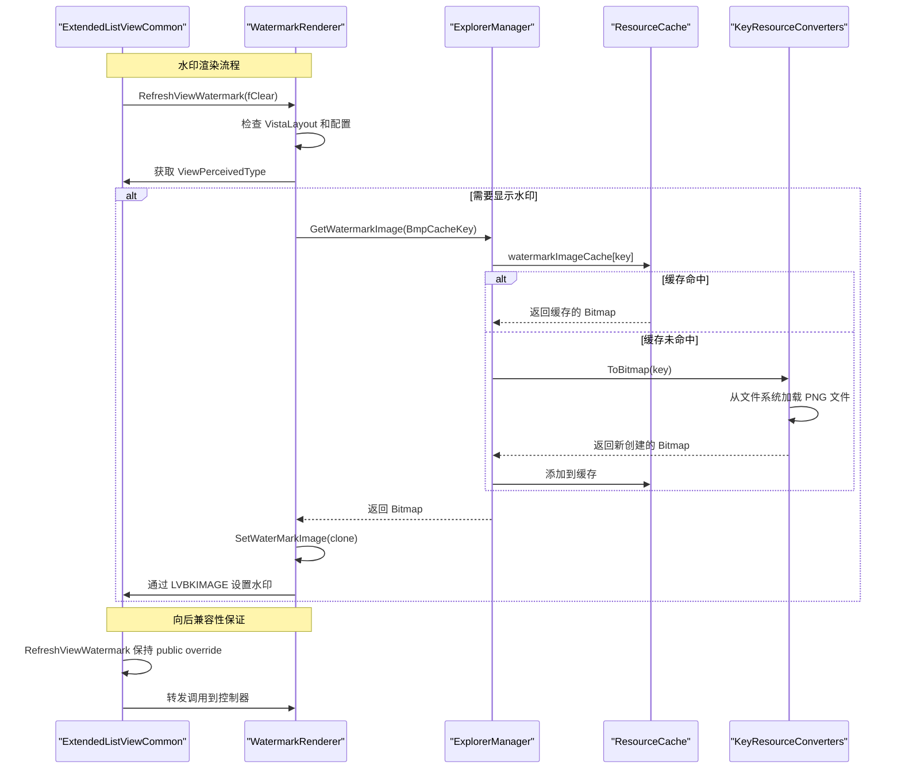
```mermaid
sequenceDiagram
participant ELVC as "ExtendedListViewCommon"
participant WatermarkRenderer as "WatermarkRenderer"
participant ExplorerMgr as "ExplorerManager"
participant Cache as "ResourceCache"
participant KeyConverter as "KeyResourceConverters"
Note over ELVC,WatermarkRenderer : 水印渲染流程
ELVC->>WatermarkRenderer : RefreshViewWatermark(fClear)
WatermarkRenderer->>WatermarkRenderer : 检查 VistaLayout 和配置
WatermarkRenderer->>ELVC : 获取 ViewPerceivedType
alt 需要显示水印
WatermarkRenderer->>ExplorerMgr : GetWatermarkImage(BmpCacheKey)
ExplorerMgr->>Cache : watermarkImageCache[key]
alt 缓存命中
Cache-->>ExplorerMgr : 返回缓存的 Bitmap
else 缓存未命中
ExplorerMgr->>KeyConverter : ToBitmap(key)
KeyConverter->>KeyConverter : 从文件系统加载 PNG 文件
KeyConverter-->>ExplorerMgr : 返回新创建的 Bitmap
ExplorerMgr->>Cache : 添加到缓存
end
ExplorerMgr-->>WatermarkRenderer : 返回 Bitmap
WatermarkRenderer->>WatermarkRenderer : SetWaterMarkImage(clone)
WatermarkRenderer->>ELVC : 通过 LVBKIMAGE 设置水印
end
Note over ELVC,WatermarkRenderer : 向后兼容性保证
ELVC->>ELVC : RefreshViewWatermark 保持 public override
ELVC->>WatermarkRenderer : 转发调用到控制器
```

**图表来源**
- [ExtendedListViewCommon.cs:134-136](file://QTTabBar/ExtendedListViewCommon.cs#L134-L136)
- [ExtendedListViewCommon.WatermarkRenderer.cs:42-77](file://QTTabBar/ExtendedListViewCommon.WatermarkRenderer.cs#L42-L77)
- [ExtendedListViewCommon.WatermarkRenderer.cs:79-96](file://QTTabBar/ExtendedListViewCommon.WatermarkRenderer.cs#L79-L96)
- [ExplorerManager.cs:12-14](file://QTTabBar/ExplorerManager.cs#L12-L14)
- [WatermarkCache.cs:312-348](file://QTTabBar/WatermarkCache.cs#L312-L348)

### 架构重构优势
- **代码组织性提升**：将复杂的渲染逻辑从主类中分离，减少 ExtendedListViewCommon 的代码量
- **单一职责原则**：每个控制器只负责特定的功能域，提高代码的可读性和可维护性
- **向后兼容性**：保持公共 API 不变，确保现有调用代码无需修改
- **测试友好性**：独立的控制器更容易进行单元测试和模拟
- **性能优化**：通过专门的缓存机制和懒加载策略提升性能

### 测试覆盖
通过专门的测试套件验证架构重构的正确性：

#### ArchitectureBatch6aWatermarkRendererTests
- **嵌套类型验证**：确保 WatermarkRenderer 嵌套类型正确提取
- **所有者引用检查**：验证 WatermarkRenderer 持有正确的 _owner 字段
- **方法迁移验证**：确认 SetBackgroundImage、SetBackgroundImage2、SetWaterMarkImage 等方法已移动到控制器中
- **门面方法保留**：确保 RefreshViewWatermark 公共方法仍然可用

#### ArchitectureBatch6bHoverControllerTests
- **悬停控制器提取**：验证 ListViewHoverController 嵌套类型的正确性
- **所有者引用验证**：检查 _owner 字段的类型和可见性
- **悬停方法迁移**：确认 ShowSubDirTip、ShowThumbnailTooltip 等方法已迁移
- **门面方法保留**：验证 HideSubDirTip、HideThumbnailTooltip、RefreshSubDirTip 等公共方法保持不变

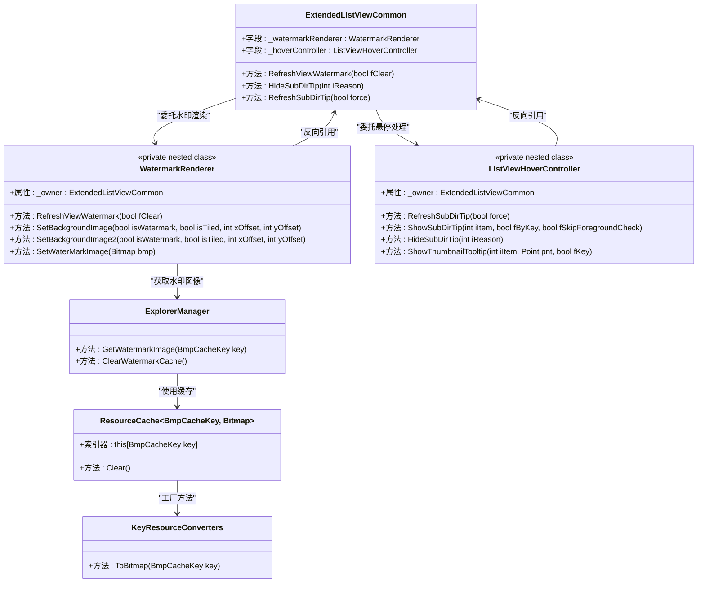
```mermaid
classDiagram
class ExtendedListViewCommon {
+字段 : _watermarkRenderer : WatermarkRenderer
+字段 : _hoverController : ListViewHoverController
+方法 : RefreshViewWatermark(bool fClear)
+方法 : HideSubDirTip(int iReason)
+方法 : RefreshSubDirTip(bool force)
}
class WatermarkRenderer {
<<private nested class>>
+属性 : _owner : ExtendedListViewCommon
+方法 : RefreshViewWatermark(bool fClear)
+方法 : SetBackgroundImage(bool isWatermark, bool isTiled, int xOffset, int yOffset)
+方法 : SetBackgroundImage2(bool isWatermark, bool isTiled, int xOffset, int yOffset)
+方法 : SetWaterMarkImage(Bitmap bmp)
}
class ListViewHoverController {
<<private nested class>>
+属性 : _owner : ExtendedListViewCommon
+方法 : RefreshSubDirTip(bool force)
+方法 : ShowSubDirTip(int iItem, bool fByKey, bool fSkipForegroundCheck)
+方法 : HideSubDirTip(int iReason)
+方法 : ShowThumbnailTooltip(int iItem, Point pnt, bool fKey)
}
class ExplorerManager {
+方法 : GetWatermarkImage(BmpCacheKey key)
+方法 : ClearWatermarkCache()
}
class ResourceCache~BmpCacheKey, Bitmap~ {
+索引器 : this[BmpCacheKey key]
+方法 : Clear()
}
class KeyResourceConverters {
+方法 : ToBitmap(BmpCacheKey key)
}
ExtendedListViewCommon --> WatermarkRenderer : "委托水印渲染"
ExtendedListViewCommon --> ListViewHoverController : "委托悬停处理"
WatermarkRenderer --> ExplorerManager : "获取水印图像"
ExplorerManager --> ResourceCache : "使用缓存"
ResourceCache --> KeyResourceConverters : "工厂方法"
WatermarkRenderer --> ExtendedListViewCommon : "反向引用"
ListViewHoverController --> ExtendedListViewCommon : "反向引用"
```

**图表来源**
- [ExtendedListViewCommon.cs:84-91](file://QTTabBar/ExtendedListViewCommon.cs#L84-L91)
- [ExtendedListViewCommon.WatermarkRenderer.cs:35-40](file://QTTabBar/ExtendedListViewCommon.WatermarkRenderer.cs#L35-L40)
- [ExtendedListViewCommon.ListViewHoverController.cs:31-54](file://QTTabBar/ExtendedListViewCommon.ListViewHoverController.cs#L31-L54)
- [ExplorerManager.cs:8-14](file://QTTabBar/ExplorerManager.cs#L8-L14)
- [WatermarkCache.cs:354-418](file://QTTabBar/WatermarkCache.cs#L354-L418)

章节来源
- [ExtendedListViewCommon.cs:84-91](file://QTTabBar/ExtendedListViewCommon.cs#L84-L91)
- [ExtendedListViewCommon.cs:134-136](file://QTTabBar/ExtendedListViewCommon.cs#L134-L136)
- [ExtendedListViewCommon.WatermarkRenderer.cs:29-96](file://QTTabBar/ExtendedListViewCommon.WatermarkRenderer.cs#L29-L96)
- [ExtendedListViewCommon.ListViewHoverController.cs:30-73](file://QTTabBar/ExtendedListViewCommon.ListViewHoverController.cs#L30-L73)
- [WatermarkCache.cs:17-29](file://QTTabBar/WatermarkCache.cs#L17-L29)
- [WatermarkCache.cs:354-418](file://QTTabBar/WatermarkCache.cs#L354-L418)
- [ExplorerManager.cs:8-14](file://QTTabBar/ExplorerManager.cs#L8-L14)
- [ArchitectureBatch6aWatermarkRendererTests.cs:27-70](file://Tests\QTTtabBarTests\ArchitectureBatch6aWatermarkRendererTests.cs#L27-L70)
- [ArchitectureBatch6bHoverControllerTests.cs:28-73](file://Tests\QTTtabBarTests\ArchitectureBatch6bHoverControllerTests.cs#L28-L73)

## 列表视图消息控制器架构重构

**架构重构** QTTabBar-Next 对 ExtendedListViewCommon 类进行了重要的内部重构，将复杂的 Windows 消息分发逻辑提取到专门的 ListViewMessageController 控制器中。这种重构遵循单一职责原则，显著提升了代码的可维护性和组织性：

### ListViewMessageController 控制器架构
ListViewMessageController 是一个私有嵌套类，专门负责 SysListView 和 ShellView 的消息分发逻辑：
- **单一职责**：专注于 Windows 消息的处理和分发，不包含任何列表视图的业务逻辑
- **反向引用**：通过 `_owner` 字段持有对 ExtendedListViewCommon 的引用，以便访问必要的属性和方法
- **向后兼容**：ExtendedListViewCommon 保留了 `ListViewController_MessageCaptured` 和 `ShellViewController_MessageCaptured` 受保护的虚方法作为门面，转发到 ListViewMessageController 处理

#### 核心功能模块
- **HandleListViewMessage**：处理 SysListView 窗口的各种消息，包括 WM_AFTERPAINT、WM_REGISTERDRAGDROP、WM.MOUSEWHEEL、WM.MOUSELEAVE 等
- **HandleShellViewMessage**：处理 ShellView 窗口的消息，包括 WM.MOUSEACTIVATE 和 WM.NOTIFY
- **ResetTrackMouseEvent**：重置鼠标跟踪事件，确保鼠标离开事件能正确触发

#### 消息处理特性
- **WM.AFTERPAINT**：在绘制完成后刷新子目录提示框
- **WM.REGISTERDRAGDROP**：处理拖放目标的注册和替换
- **WM.MOUSEWHEEL**：智能处理滚轮事件，支持下拉菜单的滚动
- **WM.MOUSELEAVE**：触发悬停控制器的鼠标离开处理

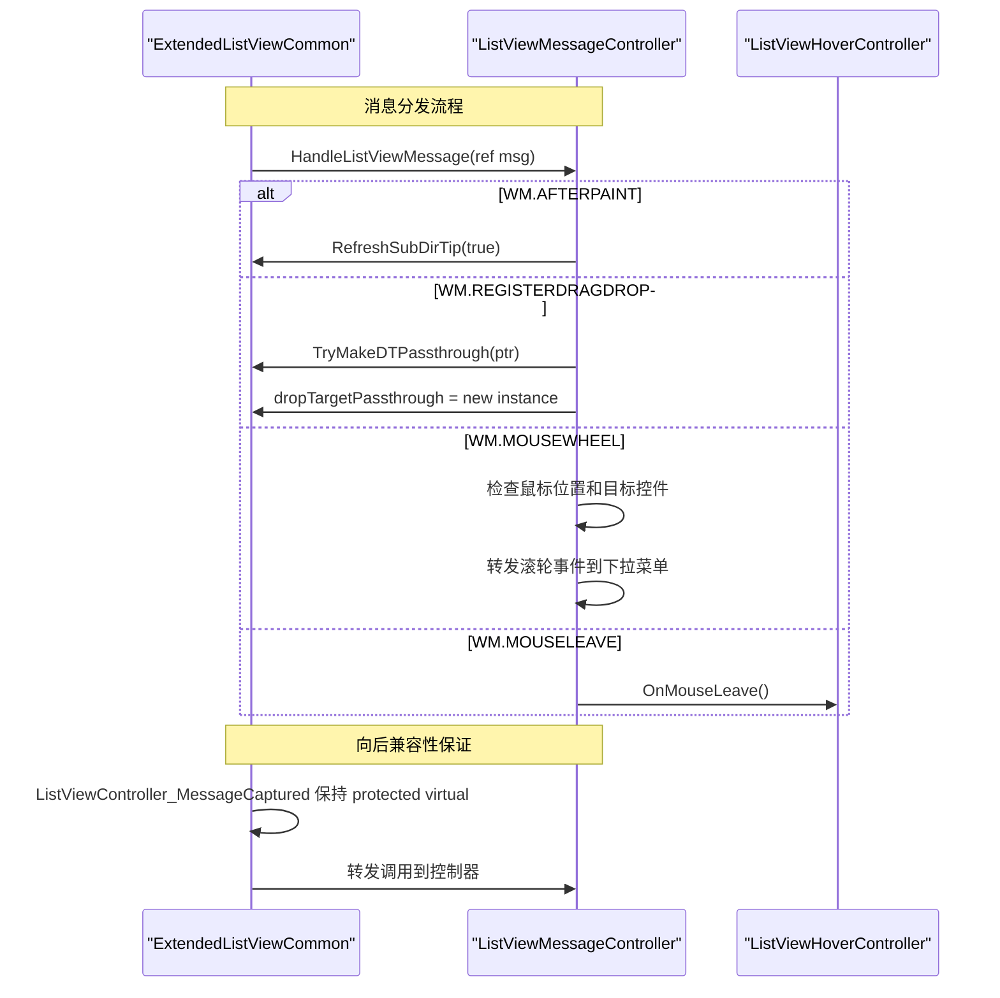
```mermaid
sequenceDiagram
participant ELVC as "ExtendedListViewCommon"
participant MessageController as "ListViewMessageController"
participant HoverController as "ListViewHoverController"
Note over ELVC,MessageController : 消息分发流程
ELVC->>MessageController : HandleListViewMessage(ref msg)
alt WM.AFTERPAINT
MessageController->>ELVC : RefreshSubDirTip(true)
else WM.REGISTERDRAGDROP
MessageController->>ELVC : TryMakeDTPassthrough(ptr)
MessageController->>ELVC : dropTargetPassthrough = new instance
else WM.MOUSEWHEEL
MessageController->>MessageController : 检查鼠标位置和目标控件
MessageController->>MessageController : 转发滚轮事件到下拉菜单
else WM.MOUSELEAVE
MessageController->>HoverController : OnMouseLeave()
end
Note over ELVC,MessageController : 向后兼容性保证
ELVC->>ELVC : ListViewController_MessageCaptured 保持 protected virtual
ELVC->>MessageController : 转发调用到控制器
```

**图表来源**
- [ExtendedListViewCommon.cs:277-279](file://QTTabBar/ExtendedListViewCommon.cs#L277-L279)
- [ExtendedListViewCommon.ListViewMessageController.cs:43-117](file://QTTabBar/ExtendedListViewCommon.ListViewMessageController.cs#L43-L117)

### 架构重构优势
- **代码组织性提升**：将复杂的消息处理逻辑从主类中分离，减少 ExtendedListViewCommon 的代码量
- **单一职责原则**：消息处理逻辑集中在一个专门的控制器中，提高代码的可读性和可维护性
- **向后兼容性**：保持受保护的虚方法不变，确保现有子类（ExtendedItemsView、ExtendedSysListView32）的覆盖功能正常工作
- **测试友好性**：独立的控制器更容易进行单元测试和模拟
- **性能优化**：通过集中的消息处理逻辑，减少不必要的条件判断和方法调用

### 测试覆盖
通过专门的测试套件验证架构重构的正确性：

#### ArchitectureBatch6cMessageControllerTests
- **嵌套类型验证**：确保 ListViewMessageController 嵌套类型正确提取
- **所有者引用检查**：验证 ListViewMessageController 持有正确的 _owner 字段
- **方法迁移验证**：确认 HandleListViewMessage、HandleShellViewMessage 等方法已移动到控制器中
- **门面方法保留**：确保 ListViewController_MessageCaptured 和 ShellViewController_MessageCaptured 虚方法仍然可用

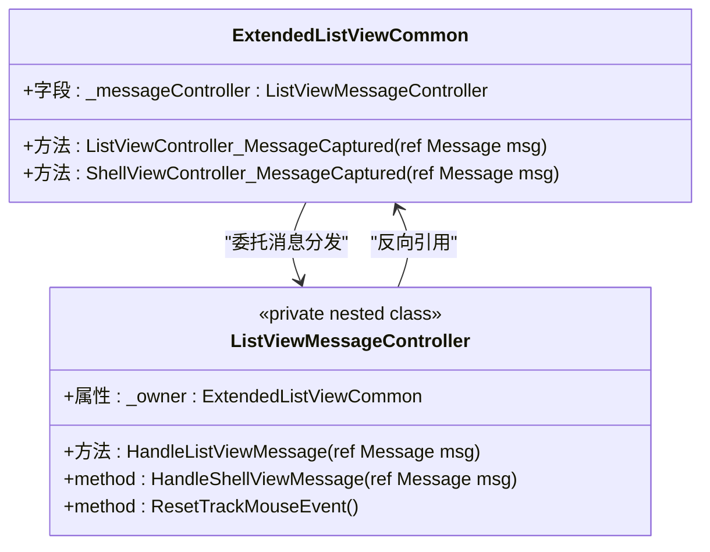
```mermaid
classDiagram
class ExtendedListViewCommon {
+字段 : _messageController : ListViewMessageController
+方法 : ListViewController_MessageCaptured(ref Message msg)
+方法 : ShellViewController_MessageCaptured(ref Message msg)
}
class ListViewMessageController {
<<private nested class>>
+属性 : _owner : ExtendedListViewCommon
+方法 : HandleListViewMessage(ref Message msg)
+method : HandleShellViewMessage(ref Message msg)
+method : ResetTrackMouseEvent()
}
ExtendedListViewCommon --> ListViewMessageController : "委托消息分发"
ListViewMessageController --> ExtendedListViewCommon : "反向引用"
```

**图表来源**
- [ExtendedListViewCommon.cs:84-91](file://QTTabBar/ExtendedListViewCommon.cs#L84-L91)
- [ExtendedListViewCommon.ListViewMessageController.cs:35-41](file://QTTabBar/ExtendedListViewCommon.ListViewMessageController.cs#L35-L41)

章节来源
- [ExtendedListViewCommon.cs:277-279](file://QTTabBar/ExtendedListViewCommon.cs#L277-L279)
- [ExtendedListViewCommon.ListViewMessageController.cs:35-145](file://QTTabBar/ExtendedListViewCommon.ListViewMessageController.cs#L35-L145)
- [ArchitectureBatch6cMessageControllerTests.cs:29-74](file://Tests\QTTtabBarTests\ArchitectureBatch6cMessageControllerTests.cs#L29-L74)

## 子目录提示表单架构重构

**架构重构** QTTabBar-Next 对 SubDirTipForm 类进行了全面的内部重构，将菜单生成、缩略图预览和拖放操作分别提取到专门的控制器中。这种重构遵循单一职责原则，显著提升了代码的可维护性和组织性：

### ShellMenuGenerator 控制器架构
ShellMenuGenerator 是一个私有嵌套类，专门负责子目录提示表单的菜单生成逻辑：
- **单一职责**：专注于菜单项的创建和配置，不包含任何表单的UI逻辑
- **反向引用**：通过 `_owner` 字段持有对 SubDirTipForm 的引用，以便访问必要的属性和方法
- **菜单类型支持**：支持目录菜单、IDL菜单和父级菜单的创建

#### 核心功能模块
- **CreateMenu**：从 DirectoryInfo 创建菜单项，支持文件和文件夹的区分处理
- **CreateMenuFromIDL**：从 IDL 包装器创建菜单项，支持 Shell 命名空间
- **CreateParentMenu**：创建父级菜单，支持递归构建菜单层次结构
- **CreateDirectoryItem**：创建目录菜单项，支持符号链接和图标处理

#### 菜单项特性
- **缩略图支持**：为文件项设置缩略图索引和路径
- **拖放支持**：为文件夹项设置拖放操作
- **虚拟化菜单**：支持延迟加载子菜单内容
- **图标管理**：智能处理系统图标和文件图标

### ThumbnailController 控制器架构
ThumbnailController 是一个私有嵌套类，专门处理缩略图预览的悬停逻辑：
- **悬停状态管理**：维护缩略图提示框的状态和生命周期
- **定时器控制**：管理按键驱动的缩略图预览定时器
- **预览逻辑**：根据配置和用户交互状态决定是否显示缩略图

#### 核心功能模块
- **ShowThumbnailTooltip**：显示缩略图预览，支持 Shift 键修饰
- **HideThumbnailTooltip**：隐藏缩略图预览，支持按键驱动的特殊处理
- **timerToolTipByKey_Tick**：处理按键驱动的缩略图预览定时器

### DragDropController 控制器架构
DragDropController 是一个私有嵌套类，专门处理拖放操作的相关逻辑：
- **拖放状态管理**：维护拖放操作的状态和进度
- **多选支持**：支持多个选中项目的批量拖放操作
- **中键操作**：支持中键点击在新标签中打开项目

#### 核心功能模块
- **tsmi_MouseDown/tsmi_MouseUp**：处理鼠标按下和释放事件，支持拖放和中键操作
- **DoDragDropCheckedItems**：执行选中项目的拖放操作
- **GetCheckedItems**：递归获取所有选中的项目

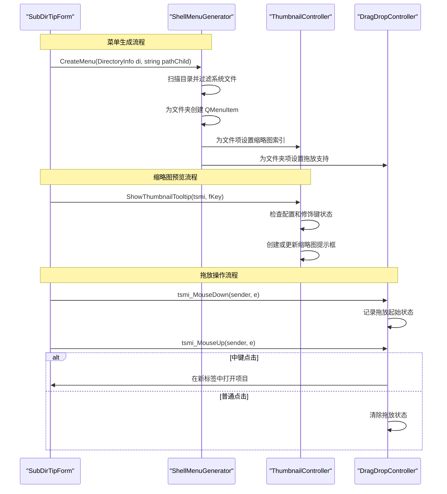
```mermaid
sequenceDiagram
participant SubDirTip as "SubDirTipForm"
participant ShellMenuGen as "ShellMenuGenerator"
participant ThumbCtrl as "ThumbnailController"
participant DragDropCtrl as "DragDropController"
Note over SubDirTip,ShellMenuGen : 菜单生成流程
SubDirTip->>ShellMenuGen : CreateMenu(DirectoryInfo di, string pathChild)
ShellMenuGen->>ShellMenuGen : 扫描目录并过滤系统文件
ShellMenuGen->>ShellMenuGen : 为文件夹创建 QMenuItem
ShellMenuGen->>ThumbCtrl : 为文件项设置缩略图索引
ShellMenuGen->>DragDropCtrl : 为文件夹项设置拖放支持
Note over SubDirTip,ThumbCtrl : 缩略图预览流程
SubDirTip->>ThumbCtrl : ShowThumbnailTooltip(tsmi, fKey)
ThumbCtrl->>ThumbCtrl : 检查配置和修饰键状态
ThumbCtrl->>ThumbCtrl : 创建或更新缩略图提示框
Note over SubDirTip,DragDropCtrl : 拖放操作流程
SubDirTip->>DragDropCtrl : tsmi_MouseDown(sender, e)
DragDropCtrl->>DragDropCtrl : 记录拖放起始状态
SubDirTip->>DragDropCtrl : tsmi_MouseUp(sender, e)
alt 中键点击
DragDropCtrl->>SubDirTip : 在新标签中打开项目
else 普通点击
DragDropCtrl->>DragDropCtrl : 清除拖放状态
end
```

**图表来源**
- [SubDirTipForm.ShellMenuGenerator.cs:62-206](file://QTTabBar/SubDirTipForm.ShellMenuGenerator.cs#L62-L206)
- [SubDirTipForm.ThumbnailController.cs:52-88](file://QTTabBar/SubDirTipForm.ThumbnailController.cs#L52-L88)
- [SubDirTipForm.DragDropController.cs:41-72](file://QTTabBar/SubDirTipForm.DragDropController.cs#L41-L72)

### 架构重构优势
- **代码组织性提升**：将复杂的业务逻辑从主类中分离，减少 SubDirTipForm 的代码量
- **单一职责原则**：每个控制器只负责特定的功能域，提高代码的可读性和可维护性
- **测试友好性**：独立的控制器更容易进行单元测试和模拟
- **性能优化**：通过专门的控制器实现更高效的资源管理和状态处理
- **扩展性增强**：可以轻松添加新的菜单类型或预览功能

### 测试覆盖
通过专门的测试套件验证架构重构的正确性：

#### ArchitectureBatch7MenuGeneratorTests
- **嵌套类型验证**：确保 ShellMenuGenerator 嵌套类型正确提取
- **所有者引用检查**：验证 ShellMenuGenerator 持有正确的 _owner 字段
- **方法迁移验证**：确认 CreateMenu、CreateMenuFromIDL、CreateParentMenu 等方法已移动到控制器中

#### ArchitectureBatch7ThumbnailControllerTests
- **缩略图控制器提取**：验证 ThumbnailController 嵌套类型的正确性
- **所有者引用验证**：检查 _owner 字段的类型和可见性
- **缩略图方法迁移**：确认 ShowThumbnailTooltip、HideThumbnailTooltip 等方法已迁移

#### ArchitectureBatch7DragDropControllerTests
- **拖放控制器提取**：验证 DragDropController 嵌套类型的正确性
- **所有者引用验证**：检查 _owner 字段的类型和可见性
- **拖放方法迁移**：确认 tsmi_MouseDown、tsmi_MouseUp、DoDragDropCheckedItems、GetCheckedItems 等方法已迁移

```mermaid
classDiagram
class SubDirTipForm {
+字段 : _menuGenerator : ShellMenuGenerator
+字段 : _thumbnailController : ThumbnailController
+字段 : _dragDropController : DragDropController
+方法 : ShowSubDirTip(string path, byte[] idl, Point pnt)
+method : HideSubDirTip(bool fForce)
}
class ShellMenuGenerator {
<<private nested class>>
+属性 : _owner : SubDirTipForm
+方法 : CreateMenu(DirectoryInfo di, string pathChild)
+method : CreateMenuFromIDL(IDLWrapper idlw, byte[] idlChild)
+method : CreateParentMenu(IDLWrapper idlw, QMenuItem[] lst)
+method : CreateDirectoryItem(DirectoryInfo diSub, string title, bool fIcon, bool fLink)
}
class ThumbnailController {
<<private nested class>>
+属性 : _owner : SubDirTipForm
+method : ShowThumbnailTooltip(ToolStripMenuItemEx tsmi, bool fKey)
+method : HideThumbnailTooltip()
+method : HideThumbnailTooltip(bool fKey)
+method : timerToolTipByKey_Tick(object sender, EventArgs e)
}
class DragDropController {
<<private nested class>>
+属性 : _owner : SubDirTipForm
+method : tsmi_MouseDown(object sender, MouseEventArgs e)
+method : tsmi_MouseUp(object sender, MouseEventArgs e)
+method : DoDragDropCheckedItems(DropDownMenuDropTarget ddmrt)
+method : GetCheckedItems(DropDownMenuReorderable ddmr, string[] paths, QMenuItem[] items, bool fDragDrop)
}
SubDirTipForm --> ShellMenuGenerator : "委托菜单生成"
SubDirTipForm --> ThumbnailController : "委托缩略图预览"
SubDirTipForm --> DragDropController : "委托拖放操作"
ShellMenuGenerator --> SubDirTipForm : "反向引用"
ThumbnailController --> SubDirTipForm : "反向引用"
DragDropController --> SubDirTipForm : "反向引用"
```

**图表来源**
- [SubDirTipForm.cs:72-76](file://QTTabBar/SubDirTipForm.cs#L72-L76)
- [SubDirTipForm.ShellMenuGenerator.cs:33-38](file://QTTabBar/SubDirTipForm.ShellMenuGenerator.cs#L33-L38)
- [SubDirTipForm.ThumbnailController.cs:30-35](file://QTTabBar/SubDirTipForm.ThumbnailController.cs#L30-L35)
- [SubDirTipForm.DragDropController.cs:34-39](file://QTTabBar/SubDirTipForm.DragDropController.cs#L34-L39)

章节来源
- [SubDirTipForm.cs:72-76](file://QTTabBar/SubDirTipForm.cs#L72-L76)
- [SubDirTipForm.ShellMenuGenerator.cs:33-436](file://QTTabBar/SubDirTipForm.ShellMenuGenerator.cs#L33-L436)
- [SubDirTipForm.ThumbnailController.cs:30-107](file://QTTabBar/SubDirTipForm.ThumbnailController.cs#L30-L107)
- [SubDirTipForm.DragDropController.cs:34-122](file://QTTabBar/SubDirTipForm.DragDropController.cs#L34-L122)
- [ArchitectureBatch7MenuGeneratorTests.cs:1-80](file://Tests\QTTtabBarTests\ArchitectureBatch7MenuGeneratorTests.cs#L1-L80)
- [ArchitectureBatch7ThumbnailControllerTests.cs:1-80](file://Tests\QTTtabBarTests\ArchitectureBatch7ThumbnailControllerTests.cs#L1-L80)
- [ArchitectureBatch7DragDropControllerTests.cs:28-67](file://Tests\QTTtabBarTests\ArchitectureBatch7DragDropControllerTests.cs#L28-L67)

## 依赖关系分析
- QTabControl 依赖：
  - 系统绘制与字体格式对象（StringFormat、Brush 等），需正确释放以避免 GDI 泄漏
  - 配置与 Shell 颜色（深色模式判断、强调色）
  - 可选 VisualStyleRenderer（线程静态缓存）提升绘制性能
  - Graphic 类的 DPI 缩放辅助方法
- QTabItem 依赖：
  - Shell 方法与 IDL 包装用于获取提示文本与图标键
  - 父控件引用用于刷新与度量
- DesktopTooltipController 依赖：
  - QTDesktopTool 拥有者引用用于访问宿主窗体和控件
  - ShellMethods 用于路径解析和 IDL 数据处理
  - SubDirTipForm 用于实际的提示框显示
- **控制器架构依赖**：
  - 所有控制器都持有对QTTabBarClass的引用，通过_owner字段访问宿主功能
  - ComponentBuildController 依赖所有其他控制器进行初始化
  - 控制器间通过事件机制通信，避免直接依赖
  - 主类通过委托方法暴露控制器功能，保持API简洁
- **重大增强的继承层次结构依赖**：
  - TabBarBase 继承自 BandObject，获得 Shell 集成能力
  - 多个部分类通过 partial class 机制组合成完整的 TabBarBase 功能
  - QTTabBarClass 和 QTSecondViewBar 继承 TabBarBase，获得共享功能
  - 通过虚方法和抽象方法实现行为定制
- **第二视图栏改进依赖**：
  - QTSecondViewBar.ComponentBuild 依赖 ExplorerBrowser 和 QTabControl
  - QTSecondViewBar.SubclassHooks 依赖 WindowSubclass 和 ListViewMonitor
  - 通过部分类机制实现功能分离和代码组织
- **水印渲染器架构重构依赖**：
  - ExtendedListViewCommon 依赖 WatermarkRenderer 和 ListViewHoverController 控制器
  - WatermarkRenderer 依赖 ExplorerManager 和 ResourceCache 进行水印图像管理
  - ListViewHoverController 依赖 SubDirTipForm 和 ThumbnailTooltipForm 进行提示框显示
  - 通过反向引用实现控制器与主类的松耦合通信
- **列表视图消息控制器架构重构依赖**：
  - ExtendedListViewCommon 依赖 ListViewMessageController 控制器
  - ListViewMessageController 依赖 HoverController 进行鼠标事件处理
  - 通过受保护的虚方法保持向后兼容性
  - 通过反向引用实现控制器与主类的松耦合通信
- **子目录提示表单架构重构依赖**：
  - SubDirTipForm 依赖 ShellMenuGenerator、ThumbnailController 和 DragDropController 控制器
  - ShellMenuGenerator 依赖 ShellMethods、IconManager 和 DropDownMenuDropTarget
  - ThumbnailController 依赖 ThumbnailTooltipForm 进行缩略图预览
  - DragDropController 依赖 TabInstanceRegistry 进行标签操作
  - 通过反向引用实现控制器与主类的松耦合通信
- **IPC 类型化广播依赖**：
  - IpcCommandMessage 提供安全的跨进程通信
  - 替代不安全的 BinaryFormatter，提升系统安全性
  - 通过枚举和固定协议格式确保类型安全
- 主题与 DPI：
  - FluentThemeTokens 依赖注册表读取强调色
  - DpiManager 依赖 P/Invoke 调用 Shcore/user32/gdi32
  - DpiAwareForm/UserControl/TextBox 依赖 DpiManager 和接口定义

```mermaid
graph TB
TabCtl["QTabControl"] --> Tokens["FluentThemeTokens"]
TabCtl --> VS["VisualStyleRenderer(线程静态)"]
TabCtl --> Config["配置/Shell颜色"]
TabCtl --> Graphic["Graphic(DPI 缩放辅助)"]
TabItem["QTabItem"] --> Shell["ShellMethods/IDLWrapper"]
TooltipCtrl["DesktopTooltipController"] --> QtDT["QTDesktopTool"]
TooltipCtrl --> Shell
TooltipCtrl --> SubDirTip["SubDirTipForm"]
CompBuildCtrl["ComponentBuildController"] --> QtDT
CompBuildCtrl --> TabCtl
CompBuildCtrl --> TabItem
ViewModeCtrl["ViewModeController"] --> QtDT
ViewModeCtrl --> TabCtl
ShellUiCtrl["ShellUiController"] --> QtDT
ShellUiCtrl --> TabCtl
ShellUiCtrl --> Shell
ExplorerCtrl["ExplorerControllerModule"] --> QtDT
ExplorerCtrl --> Shell
MenuCtrl["MenuController"] --> QtDT
MenuCtrl --> TabCtl
TabMgr["TabManager"] --> QtDT
TabMgr --> TabCtl
BandInfoCtrl["BandInfoController"] --> QtDT
ShutdownCtrl["ShutdownController"] --> QtDT
ThemeMgr["FluentThemeManager"] --> WPFRes["WPF 资源字典"]
DpiMgr["DpiManager"] --> PInv["P/Invoke"]
DpiForm["DpiAwareForm"] --> DpiMgr
DpiUserCtrl["DpiAwareUserControl"] --> DpiMgr
DpiTxtBox["DpiAwareTextBox"] --> DpiMgr
TabBarBase --> BandObject
TabBarBase_WM["TabBarBase.WindowMessages"] --> TabBarBase
TabBarBase_MH["TabBarBase.MouseHandlers"] --> TabBarBase
TabBarBase_BA["TabBarBase.BindActions"] --> TabBarBase
TabBarBase_TC["TabBarBase.TabCloning"] --> TabBarBase
TabBarBase_Close["TabBarBase.Close"] --> TabBarBase
TabBarBase_Plus["TabBarBase.PlusButton"] --> TabBarBase
TabBarBase_Sel["TabBarBase.Selection"] --> TabBarBase
TabBarBase_TO["TabBarBase.TabOperations"] --> TabBarBase
TabBarBase_TS["TabBarBase.TabSelection"] --> TabBarBase
TabBarBase_EA["TabBarBase.ExplorerAttach"] --> TabBarBase
QtTabBarClass --> TabBarBase
QtSecondViewBar --> TabBarBase
SVB_ComponentBuild["QTSecondViewBar.ComponentBuild"] --> QtSecondViewBar
SVB_ComponentBuild --> ExplorerBrowser
SVB_ComponentBuild --> QTabControl
SVB_SubclassHooks["QTSecondViewBar.SubclassHooks"] --> QtSecondViewBar
SVB_SubclassHooks --> WindowSubclass
SVB_SubclassHooks --> ListViewMonitor
IpcMsg["IpcCommandMessage"] --> IPC["跨进程通信"]
IpcMsg --> Security["安全通信协议"]
ELVC["ExtendedListViewCommon"] --> WatermarkRenderer
ELVC --> HoverController
ELVC --> MessageController
WatermarkRenderer --> ExplorerMgr
WatermarkRenderer --> WatermarkCache
HoverController --> ELVC
MessageController --> ELVC
ExplorerMgr --> ResourceCache
ResourceCache --> KeyConverter
SubDirTip["SubDirTipForm"] --> ShellMenuGen
SubDirTip --> ThumbCtrl
SubDirTip --> DragDropCtrl
ShellMenuGen --> SubDirTip
ThumbCtrl --> SubDirTip
DragDropCtrl --> SubDirTip
ShellMenuGen --> ShellMethods
ShellMenuGen --> IconManager
ShellMenuGen --> DropDownMenu
ThumbCtrl --> ThumbnailTooltip
DragDropCtrl --> TabInstanceRegistry
```

**图表来源**
- [QTabControl.cs:94-110](file://QTTabBar/QTabControl.cs#L94-L110)
- [QTabControl.cs:227-257](file://QTTabBar/QTabControl.cs#L227-L257)
- [QTabItem.cs:170-193](file://QTTabBar/QTabItem.cs#L170-L193)
- [QTDesktopTool.TooltipController.cs:13-16](file://QTTabBar/QTDesktopTool.TooltipController.cs#L13-L16)
- [ComponentBuildController.cs:8-50](file://QTTabBar/QTTabBarClass.ComponentBuildController.cs#L8-L50)
- [ViewModeController.cs:10-45](file://QTTabBar/QTTabBarClass.ViewModeController.cs#L10-L45)
- [ShellUiController.cs:8-35](file://QTTabBar/QTTabBarClass.ShellUiController.cs#L8-L35)
- [ExplorerController.cs:57-120](file://QTTabBar/QTTabBarClass.ExplorerController.cs#L57-L120)
- [MenuController.cs:58-63](file://QTTabBar/QTTabBarClass.MenuController.cs#L58-L63)
- [TabManager.cs:58-63](file://QTTabBar/QTTabBarClass.TabManager.cs#L58-L63)
- [BandInfoController.cs:8-13](file://QTTabBar/QTTabBarClass.BandInfoController.cs#L8-L13)
- [ShutdownController.cs:12-17](file://QTTabBar/QTTabBarClass.ShutdownController.cs#L12-L17)
- [FluentThemeManager.cs:20-41](file://QTTabBar/FluentThemeManager.cs#L20-L41)
- [DpiManager.cs:209-242](file://BandObjectLib/Dpi/DpiManager.cs#L209-L242)
- [Graphic.cs:118-128](file://QTTabBar/Graphic.cs#L118-L128)
- [DpiAwareForm.cs:16-178](file://BandObjectLib/Dpi/DpiAwareForm.cs#L16-L178)
- [DpiAwareUserControl.cs:12-38](file://BandObjectLib/Dpi/DpiAwareUserControl.cs#L12-L38)
- [DpiAwareTextBox.cs:12-38](file://BandObjectLib/Dpi/DpiAwareTextBox.cs#L12-L38)
- [TabBarBase.cs:20-403](file://QTTabBar/TabBarBase.cs#L20-L403)
- [TabBarBase.WindowMessages.cs:10-69](file://QTTabBar/TabBarBase.WindowMessages.cs#L10-L69)
- [TabBarBase.MouseHandlers.cs:11-269](file://QTTabBar/TabBarBase.MouseHandlers.cs#L11-L269)
- [TabBarBase.BindActions.cs:7-150](file://QTTabBar/TabBarBase.BindActions.cs#L7-L150)
- [TabBarBase.TabCloning.cs:2-34](file://QTTabBar/TabBarBase.TabCloning.cs#L2-L34)
- [TabBarBase.Close.cs:7-89](file://QTTabBar/TabBarBase.Close.cs#L7-L89)
- [TabBarBase.PlusButton.cs:8-70](file://QTTabBar/TabBarBase.PlusButton.cs#L8-L70)
- [TabBarBase.Selection.cs:6-33](file://QTTabBar/TabBarBase.Selection.cs#L6-L33)
- [TabBarBase.TabOperations.cs:10-273](file://QTTabBar/TabBarBase.TabOperations.cs#L10-L273)
- [TabBarBase.TabSelection.cs:5-87](file://QTTabBar/TabBarBase.TabSelection.cs#L5-L87)
- [TabBarBase.ExplorerAttach.cs:2-15](file://QTTabBar/TabBarBase.ExplorerAttach.cs#L2-L15)
- [QTSecondViewBar.cs:39-800](file://QTTabBar/QTSecondViewBar.cs#L39-L800)
- [QTSecondViewBar.ComponentBuild.cs:27-263](file://QTTabBar/QTSecondViewBar.ComponentBuild.cs#L27-L263)
- [QTSecondViewBar.SubclassHooks.cs:27-262](file://QTTabBar/QTSecondViewBar.SubclassHooks.cs#L27-L262)
- [IpcCommandMessage.cs:17-103](file://QTTabBar/IpcCommandMessage.cs#L17-L103)
- [ExtendedListViewCommon.cs:84-91](file://QTTabBar/ExtendedListViewCommon.cs#L84-L91)
- [ExtendedListViewCommon.WatermarkRenderer.cs:35-40](file://QTTabBar/ExtendedListViewCommon.WatermarkRenderer.cs#L35-L40)
- [ExtendedListViewCommon.ListViewHoverController.cs:31-54](file://QTTabBar/ExtendedListViewCommon.ListViewHoverController.cs#L31-L54)
- [ExtendedListViewCommon.ListViewMessageController.cs:35-41](file://QTTabBar/ExtendedListViewCommon.ListViewMessageController.cs#L35-L41)
- [ExplorerManager.cs:8-14](file://QTTabBar/ExplorerManager.cs#L8-L14)
- [WatermarkCache.cs:354-418](file://QTTabBar/WatermarkCache.cs#L354-L418)
- [SubDirTipForm.cs:72-76](file://QTTabBar/SubDirTipForm.cs#L72-L76)
- [SubDirTipForm.ShellMenuGenerator.cs:33-38](file://QTTabBar/SubDirTipForm.ShellMenuGenerator.cs#L33-L38)
- [SubDirTipForm.ThumbnailController.cs:30-35](file://QTTabBar/SubDirTipForm.ThumbnailController.cs#L30-L35)
- [SubDirTipForm.DragDropController.cs:34-39](file://QTTabBar/SubDirTipForm.DragDropController.cs#L34-L39)

章节来源
- [QTabControl.cs:94-110](file://QTTabBar/QTabControl.cs#L94-L110)
- [QTabControl.cs:227-257](file://QTTabBar/QTabControl.cs#L227-L257)
- [QTabItem.cs:170-193](file://QTTabBar/QTabItem.cs#L170-L193)
- [QTDesktopTool.TooltipController.cs:13-16](file://QTTabBar/QTDesktopTool.TooltipController.cs#L13-L16)
- [ComponentBuildController.cs:8-50](file://QTTabBar/QTTabBarClass.ComponentBuildController.cs#L8-L50)
- [ViewModeController.cs:10-45](file://QTTabBar/QTTabBarClass.ViewModeController.cs#L10-L45)
- [ShellUiController.cs:8-35](file://QTTabBar/QTTabBarClass.ShellUiController.cs#L8-L35)
- [ExplorerController.cs:57-120](file://QTTabBar/QTTabBarClass.ExplorerController.cs#L57-L120)
- [MenuController.cs:58-63](file://QTTabBar/QTTabBarClass.MenuController.cs#L58-L63)
- [TabManager.cs:58-63](file://QTTabBar/QTTabBarClass.TabManager.cs#L58-L63)
- [BandInfoController.cs:8-13](file://QTTabBar/QTTabBarClass.BandInfoController.cs#L8-L13)
- [ShutdownController.cs:12-17](file://QTTabBar/QTTabBarClass.ShutdownController.cs#L12-L17)
- [FluentThemeManager.cs:20-41](file://QTTabBar/FluentThemeManager.cs#L20-L41)
- [DpiManager.cs:209-242](file://BandObjectLib/Dpi/DpiManager.cs#L209-L242)
- [Graphic.cs:118-128](file://QTTabBar/Graphic.cs#L118-L128)
- [DpiAwareForm.cs:16-178](file://BandObjectLib/Dpi/DpiAwareForm.cs#L16-L178)
- [DpiAwareUserControl.cs:12-38](file://BandObjectLib/Dpi/DpiAwareUserControl.cs#L12-L38)
- [DpiAwareTextBox.cs:12-38](file://BandObjectLib/Dpi/DpiAwareTextBox.cs#L12-L38)
- [TabBarBase.cs:20-403](file://QTTabBar/TabBarBase.cs#L20-L403)
- [TabBarBase.WindowMessages.cs:10-69](file://QTTabBar/TabBarBase.WindowMessages.cs#L10-L69)
- [TabBarBase.MouseHandlers.cs:11-269](file://QTTabBar/TabBarBase.MouseHandlers.cs#L11-L269)
- [TabBarBase.BindActions.cs:7-150](file://QTTabBar/TabBarBase.BindActions.cs#L7-L150)
- [TabBarBase.TabCloning.cs:2-34](file://QTTabBar/TabBarBase.TabCloning.cs#L2-L34)
- [TabBarBase.Close.cs:7-89](file://QTTabBar/TabBarBase.Close.cs#L7-L89)
- [TabBarBase.PlusButton.cs:8-70](file://QTTabBar/TabBarBase.PlusButton.cs#L8-L70)
- [TabBarBase.Selection.cs:6-33](file://QTTabBar/TabBarBase.Selection.cs#L6-L33)
- [TabBarBase.TabOperations.cs:10-273](file://QTTabBar/TabBarBase.TabOperations.cs#L10-L273)
- [TabBarBase.TabSelection.cs:5-87](file://QTTabBar/TabBarBase.TabSelection.cs#L5-L87)
- [TabBarBase.ExplorerAttach.cs:2-15](file://QTTabBar/TabBarBase.ExplorerAttach.cs#L2-L15)
- [QTSecondViewBar.cs:39-800](file://QTTabBar/QTSecondViewBar.cs#L39-L800)
- [QTSecondViewBar.ComponentBuild.cs:27-263](file://QTTabBar/QTSecondViewBar.ComponentBuild.cs#L27-L263)
- [QTSecondViewBar.SubclassHooks.cs:27-262](file://QTTabBar/QTSecondViewBar.SubclassHooks.cs#L27-L262)
- [IpcCommandMessage.cs:17-103](file://QTTabBar/IpcCommandMessage.cs#L17-L103)
- [ExtendedListViewCommon.cs:84-91](file://QTTabBar/ExtendedListViewCommon.cs#L84-L91)
- [ExtendedListViewCommon.WatermarkRenderer.cs:35-40](file://QTTabBar/ExtendedListViewCommon.WatermarkRenderer.cs#L35-L40)
- [ExtendedListViewCommon.ListViewHoverController.cs:31-54](file://QTTabBar/ExtendedListViewCommon.ListViewHoverController.cs#L31-L54)
- [ExtendedListViewCommon.ListViewMessageController.cs:35-41](file://QTTabBar/ExtendedListViewCommon.ListViewMessageController.cs#L35-L41)
- [ExplorerManager.cs:8-14](file://QTTabBar/ExplorerManager.cs#L8-L14)
- [WatermarkCache.cs:354-418](file://QTTabBar/WatermarkCache.cs#L354-L418)
- [SubDirTipForm.cs:72-76](file://QTTabBar/SubDirTipForm.cs#L72-L76)
- [SubDirTipForm.ShellMenuGenerator.cs:33-38](file://QTTabBar/SubDirTipForm.ShellMenuGenerator.cs#L33-L38)
- [SubDirTipForm.ThumbnailController.cs:30-35](file://QTTabBar/SubDirTipForm.ThumbnailController.cs#L30-L35)
- [SubDirTipForm.DragDropController.cs:34-39](file://QTTabBar/SubDirTipForm.DragDropController.cs#L34-L39)

## 性能考虑
- 绘制优化
  - 启用双缓冲与全 WM_PAINT 控制，减少闪烁与多余擦除
  - 使用线程静态 VisualStyleRenderer 实例避免频繁创建销毁
  - 九宫格贴图按需绘制，避免无意义区域重绘
- 布局与度量
  - 文本度量结果缓存于 QTabItem，仅在必要属性变化时刷新
  - 多行布局增量计算，避免整表重排
  - 使用 Graphic.ScaleBy 方法进行高效的 DPI 感知高度计算
- 资源管理
  - Dispose 中释放 Brush、Font、Bitmap、StringFormat 等 GDI 对象
  - 使用弱事件与延迟加载策略降低 WPF 资源占用
- DPI 与缩放
  - 基于每显示器 DPI 计算缩放因子，避免位图模糊
  - 在 DPI 变更时仅重绘受影响区域
  - DpiAwareForm 的智能缩放策略，避免不必要的重绘
- **控制器架构性能优势**
  - 独立的生命周期管理，避免主类臃肿导致的性能问题
  - 专门的逻辑隔离，减少不必要的计算和状态检查
  - 更好的内存管理：每个控制器负责自己的资源清理
  - 并行初始化：多个控制器可以并行执行各自的初始化任务
  - 延迟加载：控制器可以根据需要懒加载其功能模块
- **重大增强的继承层次结构性能优势**
  - 代码复用减少内存占用：共享功能只加载一次
  - 虚方法调用开销小：现代 .NET 对虚方法调用进行了优化
  - 部分类编译优化：编译器会将部分类合并为单个类文件
  - 功能模块化：每个部分类只包含必要的功能，减少内存占用
  - 集中式消息处理：WindowMessages 部分类减少消息处理的分散开销
- **第二视图栏改进性能优势**
  - 部分类分离：组件构建和消息处理逻辑分离，减少类文件大小
  - 延迟初始化：ExplorerBrowser 和 ListViewMonitor 按需创建
  - 消息过滤：WindowSubclass 精确处理所需消息，避免不必要处理
  - 内存优化：合理的资源管理和垃圾回收
- **水印渲染器架构重构性能优势**
  - 单一职责：WatermarkRenderer 专注于水印渲染，避免主类臃肿
  - 缓存优化：ResourceCache 提供线程安全的图像缓存，避免重复加载
  - 懒加载：水印图像按需加载，减少初始内存占用
  - 内存管理：FreeBitmap 和 Dispose 模式确保 GDI 对象正确释放
  - 性能监控：通过日志记录水印加载和设置的性能指标
- **列表视图消息控制器架构重构性能优势**
  - 单一职责：ListViewMessageController 专注于消息分发，避免主类臃肿
  - 消息过滤：精确处理所需的 Windows 消息，避免不必要的处理
  - 事件优化：通过事件机制减少直接调用开销
  - 内存管理：控制器生命周期管理确保资源正确释放
  - 性能监控：通过日志记录消息处理的性能指标
- **子目录提示表单架构重构性能优势**
  - 单一职责：三个控制器分别专注于菜单生成、缩略图预览和拖放操作
  - 缓存优化：ShellMenuGenerator 使用延迟加载和缓存机制
  - 预览优化：ThumbnailController 智能管理缩略图预览的显示和隐藏
  - 拖放优化：DragDropController 高效处理多选拖放操作
  - 内存管理：控制器生命周期管理确保资源正确释放
- **IPC 类型化广播性能优势**
  - 固定协议格式：避免动态类型解析开销
  - 零拷贝传输：字节数组直接传输，减少内存分配
  - 类型安全：编译时检查，避免运行时类型转换开销
  - 向后兼容：旧版本接收器可以忽略额外负载，避免兼容性问题
- **高 DPI 性能优化**
  - 预缩放机制：ScaleBeforeHandleIsCreated 在句柄创建前完成缩放，减少后续调整开销
  - 增量更新：DPI 变更时只更新受影响的控件和区域
  - 字体缓存：CreateDefaultFont 方法提供字体创建优化

章节来源
- [QTabControl.cs:141-147](file://QTTabBar/QTabControl.cs#L141-L147)
- [QTabControl.cs:94-110](file://QTTabBar/QTabControl.cs#L94-L110)
- [QTabControl.cs:506-571](file://QTTabBar/QTabControl.cs#L506-L571)
- [QTabItem.cs:400-432](file://QTTabBar/QTabItem.cs#L400-L432)
- [WPFUtils.cs:156-285](file://QTTabBar/WPFUtils.cs#L156-L285)
- [DpiManager.cs:124-157](file://BandObjectLib/Dpi/DpiManager.cs#L124-L157)
- [DpiAwareForm.cs:20-86](file://BandObjectLib/Dpi/DpiAwareForm.cs#L20-L86)
- [Graphic.cs:118-128](file://QTTabBar/Graphic.cs#L118-L128)
- [ComponentBuildController.cs:16-115](file://QTTabBar/QTTabBarClass.ComponentBuildController.cs#L16-L115)
- [TabBarBase.cs:293-333](file://QTTabBar/TabBarBase.cs#L293-L333)
- [TabBarBase.WindowMessages.cs:11-19](file://QTTabBar/TabBarBase.WindowMessages.cs#L11-L19)
- [TabBarBase.MouseHandlers.cs:22-45](file://QTTabBar/TabBarBase.MouseHandlers.cs#L22-L45)
- [QTSecondViewBar.ComponentBuild.cs:29-215](file://QTTabBar/QTSecondViewBar.ComponentBuild.cs#L29-L215)
- [QTSecondViewBar.SubclassHooks.cs:61-93](file://QTTabBar/QTSecondViewBar.SubclassHooks.cs#L61-L93)
- [ExtendedListViewCommon.WatermarkRenderer.cs:42-77](file://QTTabBar/ExtendedListViewCommon.WatermarkRenderer.cs#L42-L77)
- [WatermarkCache.cs:354-418](file://QTTabBar/WatermarkCache.cs#L354-L418)
- [ExtendedListViewCommon.ListViewMessageController.cs:43-117](file://QTTabBar/ExtendedListViewCommon.ListViewMessageController.cs#L43-L117)
- [SubDirTipForm.ShellMenuGenerator.cs:62-206](file://QTTabBar/SubDirTipForm.ShellMenuGenerator.cs#L62-L206)
- [SubDirTipForm.ThumbnailController.cs:52-88](file://QTTabBar/SubDirTipForm.ThumbnailController.cs#L52-L88)
- [SubDirTipForm.DragDropController.cs:74-106](file://QTTabBar/SubDirTipForm.DragDropController.cs#L74-L106)
- [IpcCommandMessage.cs:43-56](file://QTTabBar/IpcCommandMessage.cs#L43-L56)

## 故障排查指南
- 绘制异常或闪烁
  - 检查是否启用了双缓冲与透明背景样式
  - 确认 VisualStyleRenderer 初始化与线程静态缓存是否生效
- 深色模式不生效
  - 验证 InNightMode 判定与 InitializeColors 调用时机
  - 检查 FluentThemeTokens.IsDark 与系统设置是否一致
  - 检查 TabBarBase.WindowMessages.HandleSysColorChangeHookMessage 是否正确调用
- DPI 缩放问题
  - 确认 DpiAwareControl.OnDpiChanged 被触发
  - 检查布局与度量是否在 DPI 变更后重新计算
  - 验证 DpiAwareForm 的 ScaleBeforeHandleIsCreated 是否正确执行
  - 检查 Graphic.ScaleBy 方法的缩放比例计算
- 资源泄漏
  - 审查 Dispose 路径是否释放所有 GDI 对象
  - 检查 WPF 弱事件是否正确解绑
- 桌面提示框相关问题
  - 验证 DesktopTooltipController 是否正确初始化
  - 检查 ShowSubDirTip 和 HideSubDirTip 方法的委托调用
  - 确认 GetLVITEMRECT 的位置计算逻辑
  - 验证 SubDirTipForm 的事件订阅是否正确建立
- **控制器架构相关问题**
  - 验证各个控制器是否正确初始化：检查ComponentBuildController.Build()方法
  - 检查控制器间的依赖注入是否正确：确认_owner字段是否正确设置
  - 确认控制器生命周期管理是否得当：检查Dispose和ReleaseHandle调用
  - 验证控制器事件处理是否正确注册和注销：检查事件订阅和取消订阅
  - 调试控制器间通信：确认事件机制是否正常工作
- **重大增强的继承层次结构相关问题**
  - 验证 TabBarBase 的虚方法是否正确重写：检查 IsBottomBar() 和 IsVertical() 方法
  - 检查抽象方法实现是否完整：确保 CalcBandHeight() 和 IsTabSubFolderMenuVisible 已实现
  - 确认共享字段初始化顺序：检查构造函数中的初始化逻辑
  - 验证部分类文件是否正确编译：检查所有 TabBarBase.*.cs 文件是否存在
  - 检查窗口消息处理：验证 HandleSysColorChangeHookMessage 和消息拦截逻辑
  - 验证鼠标事件处理：检查拖放、双击、中键等交互逻辑是否正确
  - 确认绑定动作处理：验证 TryDoBindActionCore 方法的功能完整性
- **第二视图栏架构问题**
  - 验证 ComponentBuild 部分类是否正确初始化组件：检查 InitializeComponent 方法
  - 检查 SubclassHooks 部分类的窗口子类化：确认 WindowSubclass 实例创建
  - 验证 ExplorerBrowser 配置：检查导航面板和命令面板的可见性设置
  - 确认消息处理逻辑：检查 baseBarSubclassProc 和 rebarSubclassProc 方法
  - 检查 ListViewMonitor 集成：验证列表视图监控是否正常
- **水印渲染器架构问题**
  - 验证 WatermarkRenderer 是否正确初始化：检查 ExtendedListViewCommon 构造函数中的实例化
  - 检查水印图像缓存：确认 ExplorerManager.GetWatermarkImage 方法正常工作
  - 验证反向引用：确认 WatermarkRenderer._owner 字段正确指向 ExtendedListViewCommon
  - 检查水印图像文件：确认 BG_IMG 路径下的水印 PNG 文件存在且可读
  - 验证 LVBKIMAGE 设置：检查 SetWaterMarkImage 方法中的 Windows API 调用
  - 确认 ListViewHoverController 初始化：检查悬停控制器的创建和定时器设置
  - 验证悬停状态管理：检查 subDirTip 和 thumbnailTooltip 的生命周期管理
- **列表视图消息控制器架构问题**
  - 验证 ListViewMessageController 是否正确初始化：检查 ExtendedListViewCommon 构造函数中的实例化
  - 检查消息分发逻辑：确认 HandleListViewMessage 和 HandleShellViewMessage 方法正常工作
  - 验证反向引用：确认 ListViewMessageController._owner 字段正确指向 ExtendedListViewCommon
  - 确认受保护虚方法：检查 ListViewController_MessageCaptured 和 ShellViewController_MessageCaptured 方法是否正确转发
  - 检查鼠标事件处理：验证 WM.MOUSEWHEEL 和 WM.MOUSELEAVE 消息处理逻辑
  - 验证拖放目标注册：确认 WM.REGISTERDRAGDROP 消息处理逻辑
- **子目录提示表单架构问题**
  - 验证 ShellMenuGenerator 是否正确初始化：检查 SubDirTipForm 构造函数中的实例化
  - 检查菜单生成逻辑：确认 CreateMenu、CreateMenuFromIDL、CreateParentMenu 方法正常工作
  - 验证缩略图控制器：确认 ThumbnailController 的缩略图预览功能正常
  - 检查拖放控制器：确认 DragDropController 的拖放操作功能正常
  - 验证反向引用：确认各控制器的 _owner 字段正确指向 SubDirTipForm
  - 检查菜单项创建：确认目录项和文件项的创建逻辑正确
  - 验证缩略图预览：确认缩略图的显示和隐藏逻辑正确
- **IPC 类型化广播问题**
  - 验证协议格式：检查 QTIP 标识符和版本号的正确性
  - 确认命令分发：检查 IpcCommandDispatcher 的方法映射
  - 检查负载数据：验证字节数组的编码和解码逻辑
  - 验证向后兼容性：确保旧版本接收器能正确处理新协议
- **高 DPI 相关问题排查**
  - DPI 变更未响应：检查控件是否正确继承 DpiAwareControl 或实现 IDpiAwareObject 接口
  - 字体大小不正确：验证 DpiAwareForm.UpdateFont 方法是否被调用
  - 控件布局错位：检查 TabPage 中锚定控件的重新锚定逻辑
  - 高度计算错误：确认使用 Graphic.ScaleBy 而非手动计算

章节来源
- [QTabControl.cs:141-147](file://QTTabBar/QTabControl.cs#L141-L147)
- [QTabControl.cs:227-257](file://QTTabBar/QTabControl.cs#L227-L257)
- [QTabControl.cs:506-571](file://QTTabBar/QTabControl.cs#L506-L571)
- [DpiAwareControl.cs:39-61](file://BandObjectLib/Dpi/DpiAwareControl.cs#L39-L61)
- [FluentThemeTokens.cs:40-43](file://QTTabBar/FluentThemeTokens.cs#L40-L43)
- [DpiAwareForm.cs:20-86](file://BandObjectLib/Dpi/DpiAwareForm.cs#L20-L86)
- [Graphic.cs:118-128](file://QTTabBar/Graphic.cs#L118-L128)
- [QTDesktopTool.TooltipController.cs:19-57](file://QTTabBar/QTDesktopTool.TooltipController.cs#L19-L57)
- [ComponentBuildController.cs:16-115](file://QTTabBar/QTTabBarClass.ComponentBuildController.cs#L16-L115)
- [TabBarBase.cs:60-68](file://QTTabBar/TabBarBase.cs#L60-L68)
- [TabBarBase.cs:92-93](file://QTTabBar/TabBarBase.cs#L92-L93)
- [TabBarBase.WindowMessages.cs:11-19](file://QTTabBar/TabBarBase.WindowMessages.cs#L11-L19)
- [TabBarBase.MouseHandlers.cs:47-269](file://QTTabBar/TabBarBase.MouseHandlers.cs#L47-L269)
- [TabBarBase.BindActions.cs:12-147](file://QTTabBar/TabBarBase.BindActions.cs#L12-L147)
- [QTSecondViewBar.ComponentBuild.cs:29-215](file://QTTabBar/QTSecondViewBar.ComponentBuild.cs#L29-L215)
- [QTSecondViewBar.SubclassHooks.cs:61-238](file://QTTabBar/QTSecondViewBar.SubclassHooks.cs#L61-L238)
- [ExtendedListViewCommon.cs:84-91](file://QTTabBar/ExtendedListViewCommon.cs#L84-L91)
- [ExtendedListViewCommon.WatermarkRenderer.cs:42-96](file://QTTabBar/ExtendedListViewCommon.WatermarkRenderer.cs#L42-L96)
- [ExtendedListViewCommon.ListViewHoverController.cs:31-73](file://QTTabBar/ExtendedListViewCommon.ListViewHoverController.cs#L31-L73)
- [ExtendedListViewCommon.ListViewMessageController.cs:43-117](file://QTTabBar/ExtendedListViewCommon.ListViewMessageController.cs#L43-L117)
- [SubDirTipForm.cs:72-76](file://QTTabBar/SubDirTipForm.cs#L72-L76)
- [SubDirTipForm.ShellMenuGenerator.cs:62-206](file://QTTabBar/SubDirTipForm.ShellMenuGenerator.cs#L62-L206)
- [SubDirTipForm.ThumbnailController.cs:52-88](file://QTTabBar/SubDirTipForm.ThumbnailController.cs#L52-L88)
- [SubDirTipForm.DragDropController.cs:41-72](file://QTTabBar/SubDirTipForm.DragDropController.cs#L41-L72)
- [IpcCommandMessage.cs:21-41](file://QTTabBar/IpcCommandMessage.cs#L21-L41)

## 结论
QTTabBar-Next 的 UI 组件体系以 QTabControl/QTabItem 为核心，结合 Fluent 主题 Token 与 WPF 主题管理器，实现了 WinForms 与 WPF 的一致外观与深色模式支持。**重大架构升级** 通过引入完整的控制器架构（包含18个专门控制器类）和重大增强的继承层次结构（通过 TabBarBase 基类及其多个部分类）显著提升了代码的可维护性和模块化程度，将复杂的UI组件初始化和管理工作从QTTabBarClass主类中分离出来，形成了清晰的MVC风格架构。**同时完善的高 DPI 支持体系** 通过 DpiAwareForm、DpiAwareUserControl、DpiAwareTextBox 等专业组件和 Graphic 类的缩放辅助方法，提供了全面的 DPI 感知解决方案。**最新的架构增强** 包括第二视图栏的部分类重构、IPC 类型化广播机制、水印渲染器架构重构、列表视图消息控制器重构以及子目录提示表单的全面重构，进一步提升了系统的可维护性、安全性和稳定性。**第二视图栏架构改进** 通过 ComponentBuild 和 SubclassHooks 部分类实现了更清晰的组件构建和窗口消息处理逻辑，**IPC 类型化广播机制** 提供了安全的跨进程通信，避免了 BinaryFormatter 的安全风险，**水印渲染器架构重构** 通过 WatermarkRenderer 和 ListViewHoverController 控制器遵循单一职责原则，提升了代码的组织性和可维护性，**列表视图消息控制器架构重构** 通过 ListViewMessageController 控制器实现了消息分发的单一职责，**子目录提示表单架构重构** 通过 ShellMenuGenerator、ThumbnailController 和 DragDropController 控制器实现了真正的功能分离。**完善的测试覆盖** 确保了架构重构的正确性和可靠性。通过现代化的控制器模式、重大增强的继承层次结构、第二视图栏架构改进、水印渲染器架构重构、列表视图消息控制器架构重构、子目录提示表单架构重构、IPC 类型化广播、DPI 感知与资源管理，系统在复杂 Shell 环境中保持了良好的性能、安全性和稳定性。建议后续在扩展与定制时遵循现有模式：以 Token 驱动颜色、以事件驱动状态同步、以控制器模式分离关注点、以重大增强的继承层次结构实现代码复用、以部分类组织复杂功能、以类型化 IPC 确保通信安全、以水印渲染器架构重构遵循单一职责原则、以列表视图消息控制器架构重构实现消息分发单一职责、以子目录提示表单架构重构实现功能领域分离、以 DPI 感知驱动布局与度量。

## 附录
- 扩展指南（自定义控件）
  - 继承 DpiAwareControl 以获得 DPI 变更通知
  - 对于复杂控件，考虑继承 DpiAwareForm 以获得完整的 DPI 处理能力
  - 复用 FluentThemeTokens 的颜色与圆角常量，保证与 WPF 端一致
  - 在属性变更时触发局部刷新，避免整表重绘
  - 使用 Graphic.ScaleBy 方法进行 DPI 感知的高度计算
  - 使用 Graphic.SelectValueByScaling 选择合适的数值档位
  - 对于复杂功能，考虑使用控制器模式进行关注点分离
- 主题制作（WPF）
  - 新增 FluentTheme.*.xaml 资源字典，并通过 FluentThemeManager.SyncPageTheme 动态插入
  - 使用 ApplicationThemeManager.Apply 统一应用 Accent 与 Mica 效果
- 可访问性与兼容性
  - 遵循标准事件模型，便于自动化框架识别
  - 针对 Windows 8.1+/10+ 的 DPI API 做降级处理，确保跨版本兼容
  - 利用 DpiManager.PerMonitorDpiIsSupported 检测每显示器 DPI 支持
- 高 DPI 开发最佳实践
  - 优先使用 DpiAwareForm 作为顶级容器
  - 在控件构造函数中设置合理的默认 DPI 值
  - 使用 Scaling 属性进行数学计算，避免硬编码像素值
  - 在 DPI 变更事件中只更新必要的布局和绘制逻辑
- **控制器模式开发指南**
  - 将复杂业务逻辑封装到独立的控制器类中
  - 通过构造函数注入依赖，避免循环引用
  - 提供清晰的公共接口，隐藏内部实现细节
  - 编写单元测试验证控制器行为的正确性
  - 使用事件机制实现控制器间的松耦合通信
  - 实现适当的生命周期管理，确保资源的正确释放
  - 遵循单一职责原则，每个控制器只负责一个功能域
  - 使用委托方法在主类中暴露控制器功能，保持API简洁
- **重大增强的继承层次结构设计指南**
  - 识别共享功能并提取到基类中
  - 使用虚方法允许子类行为定制
  - 使用抽象方法强制子类实现必要功能
  - 合理组织部分类文件以提高可维护性
  - 确保基类构造函数正确初始化共享字段
  - 避免过度继承导致类层次过深
  - 使用组合优于继承的原则处理复杂关系
  - 将相关功能分组到不同的部分类文件中
  - 利用部分类的编译优化特性提升性能
  - 通过集中式的消息处理和事件处理提高代码组织性
- **第二视图栏架构设计指南**
  - 使用部分类分离不同关注点的代码
  - 将组件构建逻辑放在 ComponentBuild 部分类中
  - 将窗口消息处理逻辑放在 SubclassHooks 部分类中
  - 合理使用 WindowSubclass 进行窗口子类化
  - 实现延迟初始化，按需创建重型组件
  - 使用事件机制实现组件间通信
  - 确保资源管理的正确性，避免内存泄漏
- **水印渲染器架构设计指南**
  - 遵循单一职责原则，将特定功能提取到独立的控制器中
  - 使用私有嵌套类封装内部实现细节
  - 通过反向引用实现控制器与主类的松耦合通信
  - 保持公共 API 的向后兼容性，提供门面方法转发
  - 实现适当的缓存机制，提升性能表现
  - 编写全面的单元测试，验证架构重构的正确性
  - 使用日志记录关键操作，便于问题诊断
  - 确保资源管理的正确性，避免内存泄漏
- **列表视图消息控制器架构设计指南**
  - 遵循单一职责原则，将消息分发逻辑提取到独立的控制器中
  - 使用私有嵌套类封装内部实现细节
  - 通过反向引用实现控制器与主类的松耦合通信
  - 保持受保护虚方法的向后兼容性，提供门面方法转发
  - 实现精确的消息过滤和处理逻辑
  - 编写全面的单元测试，验证消息分发的正确性
  - 使用日志记录关键消息处理，便于问题诊断
  - 确保资源管理的正确性，避免内存泄漏
- **子目录提示表单架构设计指南**
  - 遵循单一职责原则，将菜单生成、缩略图预览和拖放操作分别提取到独立的控制器中
  - 使用私有嵌套类封装内部实现细节
  - 通过反向引用实现控制器与主类的松耦合通信
  - 实现适当的缓存机制，提升性能表现
  - 编写全面的单元测试，验证各控制器的正确性
  - 使用日志记录关键操作，便于问题诊断
  - 确保资源管理的正确性，避免内存泄漏
- **IPC 类型化广播设计指南**
  - 使用固定协议格式，避免动态类型解析
  - 通过枚举定义命令类型，确保类型安全
  - 实现向后兼容，支持旧版本接收器
  - 提供专用的编码解码方法，提高性能
  - 使用字节数组传输，避免序列化开销
  - 实现协议验证，确保消息完整性
  - 提供完整的测试覆盖，确保功能正确性