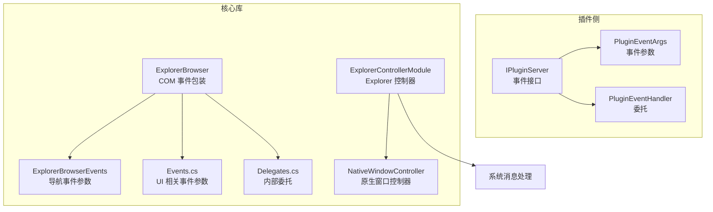
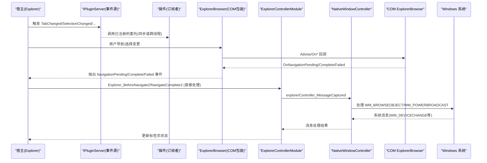
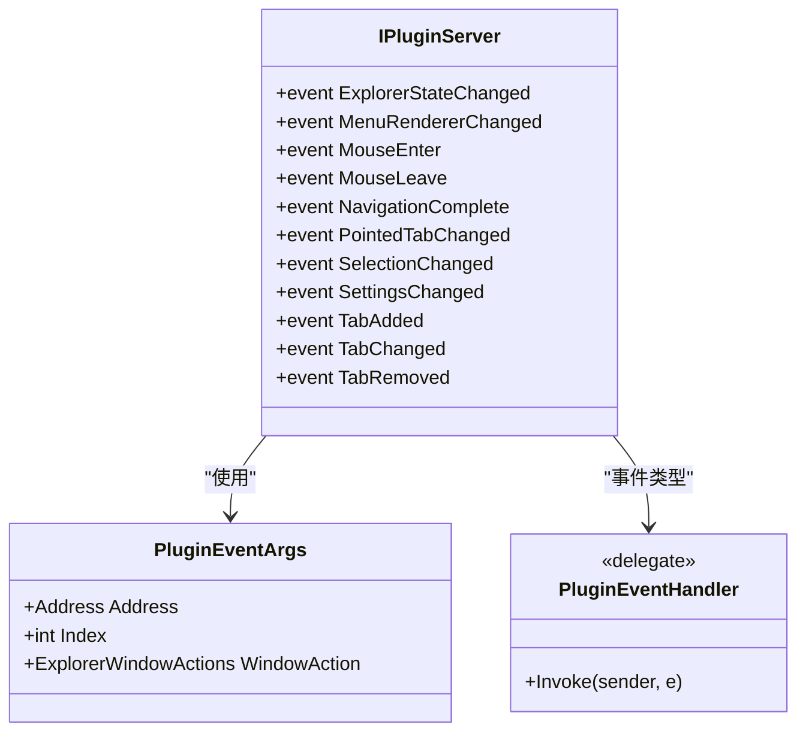
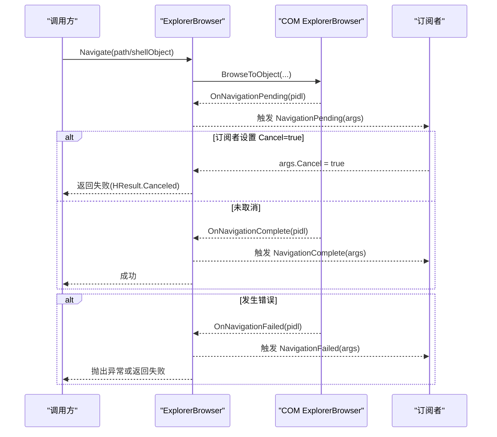
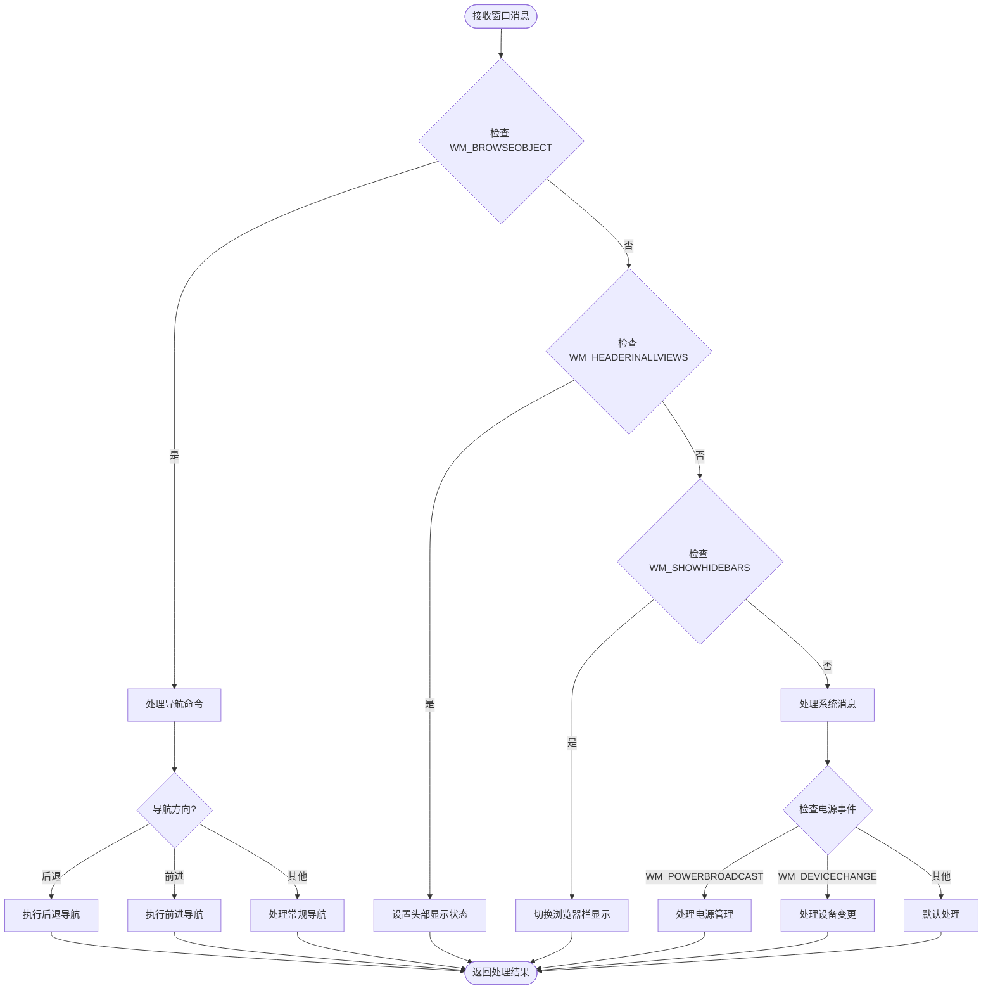
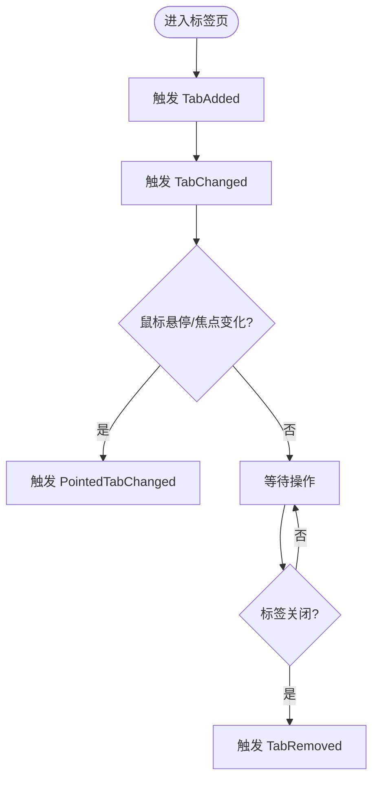
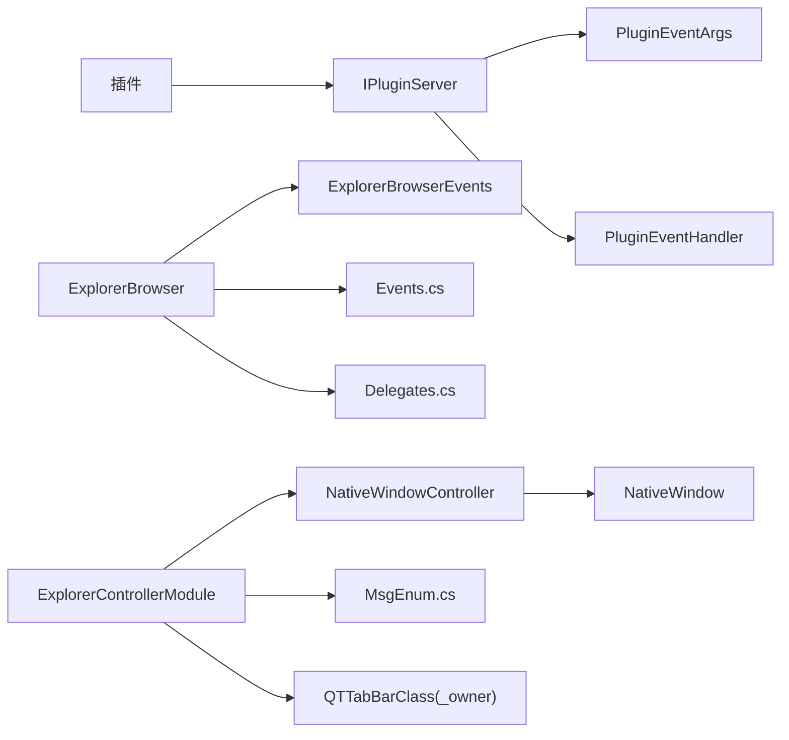

# 事件驱动架构

<cite>
**本文引用的文件**   
- [IPluginServer.cs](file://QTPluginLib/IPluginServer.cs)
- [PluginEventArgs.cs](file://QTPluginLib/PluginEventArgs.cs)
- [PluginEventHandler.cs](file://QTPluginLib/PluginEventHandler.cs)
- [Events.cs](file://QTTabBar/Events.cs)
- [Delegates.cs](file://QTTabBar/Delegates.cs)
- [ExplorerBrowser.cs](file://QTTabBar/ExplorerBrowser/ExplorerBrowser.cs)
- [ExplorerBrowserEvents.cs](file://QTTabBar/ExplorerBrowser/ExplorerBrowserEvents.cs)
- [QTTabBarClass.ExplorerController.cs](file://QTTabBar/QTTabBarClass.ExplorerController.cs)
- [NativeWindowController.cs](file://QTTabBar/NativeWindowController.cs)
- [MsgEnum.cs](file://QTTabBar/MsgEnum.cs)
- [QTSecondViewBar.cs](file://QTTabBar/QTSecondViewBar.cs)
- [QTTabBarClass.cs](file://QTTabBar/QTTabBarClass.cs)
</cite>

## 更新摘要
**所做更改**   
- 移除了导航事件处理中的中间层门面代码，简化了 Explorer_NavigateComplete2 方法的处理流程
- 更新了 ExplorerControllerModule 组件的架构说明，强调直接的事件处理模式
- 修正了导航事件传播流程图，反映新的无门面层架构设计
- 增强了代码可维护性和减少不必要抽象的说明

## 目录
1. [简介](#简介)
2. [项目结构](#项目结构)
3. [核心组件](#核心组件)
4. [架构总览](#架构总览)
5. [详细组件分析](#详细组件分析)
6. [依赖关系分析](#依赖关系分析)
7. [性能考虑](#性能考虑)
8. [故障排查指南](#故障排查指南)
9. [结论](#结论)
10. [附录](#附录)

## 简介
本文件围绕 QTTabBar-Next 的事件驱动架构进行系统化说明，重点覆盖以下方面：
- 事件系统的设计模式与实现原理（发布-订阅、消息路由）
- 核心事件的定义与传播流程（标签页切换、文件操作、系统状态变化等）
- 异步事件处理与线程安全机制
- 监听器注册与注销策略（含内存管理与性能优化）
- 面向插件的编程指南（自定义事件与处理器实现）
- 事件调试工具与性能监控方法
- 常见事件处理模式与最佳实践

**更新** 本次更新重点介绍了导航事件处理架构的改进，移除了中间层门面代码，使 Explorer_NavigateComplete2 方法直接在 ExplorerControllerModule 中处理，提高了代码可维护性并减少了不必要的抽象。

## 项目结构
从事件驱动视角看，本项目主要涉及三类事件体系：
- 插件侧事件接口：通过 IPluginServer 暴露给插件的事件集合，用于通知 Explorer 状态、导航、选择、设置、标签页生命周期等。
- 内部 UI/浏览控制事件：在 ExplorerBrowser 等控件中封装 COM 事件并向上层抛出 .NET 事件，如导航完成、失败、挂起、选择变更、内容变更等。
- **更新** Explorer 控制器事件：通过 ExplorerControllerModule 直接处理 Windows Explorer 的 COM 事件和系统级消息，包括导航事件、窗口状态变化和系统事件，无需中间门面层。



**图表来源**
- [IPluginServer.cs:24-45](file://QTPluginLib/IPluginServer.cs#L24-L45)
- [PluginEventArgs.cs:21-52](file://QTPluginLib/PluginEventArgs.cs#L21-L52)
- [PluginEventHandler.cs:18-20](file://QTPluginLib/PluginEventHandler.cs#L18-L20)
- [ExplorerBrowser.cs:84-110](file://QTTabBar/ExplorerBrowser/ExplorerBrowser.cs#L84-L110)
- [ExplorerBrowserEvents.cs:8-30](file://QTTabBar/ExplorerBrowser/ExplorerBrowserEvents.cs#L8-L30)
- [QTTabBarClass.ExplorerController.cs:58-63](file://QTTabBar/QTTabBarClass.ExplorerController.cs#L58-L63)
- [NativeWindowController.cs:22-28](file://QTTabBar/NativeWindowController.cs#L22-L28)

章节来源
- [IPluginServer.cs:24-45](file://QTPluginLib/IPluginServer.cs#L24-L45)
- [ExplorerBrowser.cs:84-110](file://QTTabBar/ExplorerBrowser/ExplorerBrowser.cs#L84-L110)
- [QTTabBarClass.ExplorerController.cs:58-63](file://QTTabBar/QTTabBarClass.ExplorerController.cs#L58-L63)

## 核心组件
- 插件事件接口 IPluginServer
  - 提供一组标准事件，包括：ExplorerStateChanged、MenuRendererChanged、MouseEnter/Leave、NavigationComplete、PointedTabChanged、SelectionChanged、SettingsChanged、TabAdded/Changed/Removed 等。
  - 这些事件是插件与宿主之间的"契约"，用于跨进程/跨模块通信。
- 插件事件参数与委托
  - PluginEventArgs：携带窗口动作、索引、地址等信息。
  - PluginEventHandler：统一的事件委托签名。
- 内部 UI 事件参数与委托
  - Events.cs 定义了右键菜单项点击、通用 Q 事件、标签取消等事件参数。
  - Delegates.cs 定义了若干内部委托，用于 UI 层回调与跨线程调用。
- ExplorerBrowser 控件
  - 封装 Windows Explorer Browser 的 COM 事件，将其转换为 .NET 事件（ItemsChanged、NavigationComplete/Failed/Pending、SelectionChanged、ViewEnumerationComplete、ViewSelectedItemChanged）。
  - 将 COM 回调中的 ShellObject 构造为事件参数，供上层订阅者使用。
- **更新** ExplorerControllerModule 组件
  - 作为嵌套内部类，持有对 QTTabBarClass 实例的引用，通过 _owner 访问外部成员。
  - 直接处理 Explorer 的 BeforeNavigate2 和 NavigateComplete2 事件，无需中间门面层。
  - 管理窗口消息捕获和处理，包括系统级消息如 WM_POWERBROADCAST 和 WM_DEVICECHANGE。
  - 提供导航控制方法，如 NavigateCurrentTab、NavigateToHistory 等。
- **新增** NativeWindowController 基类
  - 继承自 NativeWindow，提供 WndProc 重写以捕获窗口消息。
  - 通过 MessageCaptured 事件将消息传递给具体的处理器。
  - 支持消息消费机制，允许处理器决定是否消耗消息。

章节来源
- [IPluginServer.cs:24-45](file://QTPluginLib/IPluginServer.cs#L24-L45)
- [PluginEventArgs.cs:21-52](file://QTPluginLib/PluginEventArgs.cs#L21-L52)
- [PluginEventHandler.cs:18-20](file://QTPluginLib/PluginEventHandler.cs#L18-L20)
- [Events.cs:21-101](file://QTTabBar/Events.cs#L21-L101)
- [Delegates.cs:22-32](file://QTTabBar/Delegates.cs#L22-L32)
- [ExplorerBrowser.cs:84-110](file://QTTabBar/ExplorerBrowser/ExplorerBrowser.cs#L84-L110)
- [QTTabBarClass.ExplorerController.cs:58-63](file://QTTabBar/QTTabBarClass.ExplorerController.cs#L58-L63)
- [NativeWindowController.cs:22-28](file://QTTabBar/NativeWindowController.cs#L22-L28)

## 架构总览
下图展示了插件与宿主之间的事件通道，以及 ExplorerBrowser 对 COM 事件的桥接过程，同时包含了更新后的 ExplorerControllerModule 的直接消息处理流程，移除了中间门面层。



**图表来源**
- [IPluginServer.cs:24-45](file://QTPluginLib/IPluginServer.cs#L24-L45)
- [ExplorerBrowser.cs:337-392](file://QTTabBar/ExplorerBrowser/ExplorerBrowser.cs#L337-L392)
- [QTTabBarClass.ExplorerController.cs:188-206](file://QTTabBar/QTTabBarClass.ExplorerController.cs#L188-L206)
- [QTTabBarClass.ExplorerController.cs:407-410](file://QTTabBar/QTTabBarClass.ExplorerController.cs#L407-L410)
- [NativeWindowController.cs:30-32](file://QTTabBar/NativeWindowController.cs#L30-L32)

## 详细组件分析

### 插件事件接口与参数模型
- IPluginServer 事件清单
  - 状态类：ExplorerStateChanged、SettingsChanged
  - 交互类：MouseEnter、MouseLeave、MenuRendererChanged
  - 导航类：NavigationComplete
  - 选择类：SelectionChanged
  - 标签页类：TabAdded、TabChanged、TabRemoved、PointedTabChanged
- 事件参数
  - PluginEventArgs：包含 Address、Index、WindowAction 等上下文信息，便于插件定位目标标签与窗口动作。
- 事件委托
  - PluginEventHandler：统一的 (sender, e) 签名，简化插件侧订阅。



**图表来源**
- [IPluginServer.cs:24-45](file://QTPluginLib/IPluginServer.cs#L24-L45)
- [PluginEventArgs.cs:21-52](file://QTPluginLib/PluginEventArgs.cs#L21-L52)
- [PluginEventHandler.cs:18-20](file://QTPluginLib/PluginEventHandler.cs#L18-L20)

章节来源
- [IPluginServer.cs:24-45](file://QTPluginLib/IPluginServer.cs#L24-L45)
- [PluginEventArgs.cs:21-52](file://QTPluginLib/PluginEventArgs.cs#L21-L52)
- [PluginEventHandler.cs:18-20](file://QTPluginLib/PluginEventHandler.cs#L18-L20)

### ExplorerBrowser 导航事件流
ExplorerBrowser 将 COM 层的导航事件转换为 .NET 事件，支持"挂起-完成/失败"三段式流程，允许订阅者在 Pending 阶段取消导航。



**图表来源**
- [ExplorerBrowser.cs:185-232](file://QTTabBar/ExplorerBrowser/ExplorerBrowser.cs#L185-L232)
- [ExplorerBrowser.cs:337-392](file://QTTabBar/ExplorerBrowser/ExplorerBrowser.cs#L337-L392)
- [ExplorerBrowserEvents.cs:8-30](file://QTTabBar/ExplorerBrowser/ExplorerBrowserEvents.cs#L8-L30)

章节来源
- [ExplorerBrowser.cs:185-232](file://QTTabBar/ExplorerBrowser/ExplorerBrowser.cs#L185-L232)
- [ExplorerBrowser.cs:337-392](file://QTTabBar/ExplorerBrowser/ExplorerBrowser.cs#L337-L392)
- [ExplorerBrowserEvents.cs:8-30](file://QTTabBar/ExplorerBrowser/ExplorerBrowserEvents.cs#L8-L30)

### ExplorerControllerModule 组件分析
**更新** ExplorerControllerModule 是事件驱动架构中的关键组件，专门负责处理 Windows Explorer 的 COM 事件和系统消息，现在采用直接处理模式，移除了中间门面层。

#### 核心功能特性
- **直接 Explorer COM 事件处理**
  - Explorer_BeforeNavigate2：处理导航前事件，支持首次导航逻辑
  - Explorer_NavigateComplete2：处理导航完成事件，更新标签页状态和界面（直接处理，无门面层）
- **窗口消息捕获**
  - explorerController_MessageCaptured：统一的消息处理入口
  - 支持 WM_BROWSEOBJECT、WM_HEADERINALLVIEWS、WM_SHOWHIDEBARS 等自定义消息
- **系统级事件处理**
  - WM_POWERBROADCAST：处理电源管理事件（系统唤醒）
  - WM_DEVICECHANGE：处理设备变更事件（磁盘移除等）
- **导航控制**
  - NavigateCurrentTab：实现前进后退导航
  - NavigateToHistory：历史导航支持
  - BeforeNavigate：导航前的预处理逻辑

#### 消息处理流程


**图表来源**
- [QTTabBarClass.ExplorerController.cs:407-410](file://QTTabBar/QTTabBarClass.ExplorerController.cs#L407-L410)
- [QTTabBarClass.ExplorerController.cs:412-438](file://QTTabBar/QTTabBarClass.ExplorerController.cs#L412-L438)
- [QTTabBarClass.ExplorerController.cs:440-460](file://QTTabBar/QTTabBarClass.ExplorerController.cs#L440-L460)
- [QTTabBarClass.ExplorerController.cs:567-597](file://QTTabBar/QTTabBarClass.ExplorerController.cs#L567-L597)

章节来源
- [QTTabBarClass.ExplorerController.cs:58-63](file://QTTabBar/QTTabBarClass.ExplorerController.cs#L58-L63)
- [QTTabBarClass.ExplorerController.cs:188-206](file://QTTabBar/QTTabBarClass.ExplorerController.cs#L188-L206)
- [QTTabBarClass.ExplorerController.cs:407-410](file://QTTabBar/QTTabBarClass.ExplorerController.cs#L407-L410)
- [QTTabBarClass.ExplorerController.cs:567-597](file://QTTabBar/QTTabBarClass.ExplorerController.cs#L567-L597)

### 原生窗口控制器机制
**新增** NativeWindowController 提供了底层的窗口消息捕获机制，是整个事件系统的基石。

#### 核心设计模式
- **消息拦截模式**：通过重写 WndProc 方法拦截所有窗口消息
- **事件分发模式**：将捕获的消息通过 MessageCaptured 事件分发给处理器
- **消息消费模式**：处理器可以返回布尔值表示是否消耗了消息

#### 线程安全机制
- 异常隔离：在消息处理过程中捕获异常，防止影响主程序
- 句柄管理：在 ReleaseHandle 中清理事件委托和句柄引用
- 幂等性：支持重复调用的清理操作

章节来源
- [NativeWindowController.cs:22-28](file://QTTabBar/NativeWindowController.cs#L22-L28)
- [NativeWindowController.cs:30-32](file://QTTabBar/NativeWindowController.cs#L30-L32)
- [NativeWindowController.cs:100-103](file://QTTabBar/NativeWindowController.cs#L100-L103)

### 标签页与选择变更事件
- 标签页事件（插件侧）
  - TabAdded、TabChanged、TabRemoved、PointedTabChanged 由宿主在标签页生命周期与焦点变化时触发。
  - 插件通过 IPluginServer 订阅这些事件以更新自身 UI 或状态。
- 选择变更事件
  - SelectionChanged：当 Explorer 视图选择集发生变化时触发。
  - ExplorerBrowser.SelectionChanged：针对当前浏览器控件的选择变更。
- UI 层辅助事件参数
  - Events.cs 中的 QTabCancelEventArgs 可用于标签切换前的取消逻辑；ItemRightClickedEventArgs 用于右键菜单项点击场景。



**图表来源**
- [IPluginServer.cs:41-45](file://QTPluginLib/IPluginServer.cs#L41-L45)
- [Events.cs:87-101](file://QTTabBar/Events.cs#L87-L101)

章节来源
- [IPluginServer.cs:41-45](file://QTPluginLib/IPluginServer.cs#L41-L45)
- [Events.cs:87-101](file://QTTabBar/Events.cs#L87-L101)

### 内部委托与 UI 事件
- Delegates.cs 定义了若干内部委托，例如 ItemRightClickedEventHandler、QEventHandler、QTabCancelEventHandler 等，用于 UI 层事件分发与跨线程调用。
- Events.cs 定义了与之配套的事件参数，承载点击位置、方向、行数、可取消标志等上下文。

章节来源
- [Delegates.cs:22-32](file://QTTabBar/Delegates.cs#L22-L32)
- [Events.cs:21-101](file://QTTabBar/Events.cs#L21-L101)

## 依赖关系分析
- 插件侧依赖
  - 插件通过 IPluginServer 订阅事件，依赖 PluginEventArgs 与 PluginEventHandler 传递上下文与统一签名。
- 核心库依赖
  - ExplorerBrowser 依赖 COM 事件接口，并通过内部 Helper 将 ShellObject 等对象注入到事件参数中。
  - **更新** ExplorerControllerModule 直接依赖 NativeWindowController 进行底层消息捕获，移除了中间门面层。
  - **新增** 系统消息常量定义在 MsgEnum.cs 中，被多个组件共享使用。
- 耦合与内聚
  - IPluginServer 作为稳定契约，降低插件与宿主实现的耦合度。
  - ExplorerBrowser 将 COM 细节封装在内，对外仅暴露 .NET 事件，提升内聚性。
  - **更新** ExplorerControllerModule 通过 _owner 引用保持与主类的松耦合连接，但移除了不必要的门面抽象。



**图表来源**
- [IPluginServer.cs:24-45](file://QTPluginLib/IPluginServer.cs#L24-L45)
- [PluginEventArgs.cs:21-52](file://QTPluginLib/PluginEventArgs.cs#L21-L52)
- [PluginEventHandler.cs:18-20](file://QTPluginLib/PluginEventHandler.cs#L18-L20)
- [ExplorerBrowser.cs:84-110](file://QTTabBar/ExplorerBrowser/ExplorerBrowser.cs#L84-L110)
- [ExplorerBrowserEvents.cs:8-30](file://QTTabBar/ExplorerBrowser/ExplorerBrowserEvents.cs#L8-L30)
- [Events.cs:21-101](file://QTTabBar/Events.cs#L21-L101)
- [Delegates.cs:22-32](file://QTTabBar/Delegates.cs#L22-L32)
- [QTTabBarClass.ExplorerController.cs:58-63](file://QTTabBar/QTTabBarClass.ExplorerController.cs#L58-L63)
- [NativeWindowController.cs:22-28](file://QTTabBar/NativeWindowController.cs#L22-L28)
- [MsgEnum.cs:268-269](file://QTTabBar/MsgEnum.cs#L268-L269)

章节来源
- [IPluginServer.cs:24-45](file://QTPluginLib/IPluginServer.cs#L24-L45)
- [ExplorerBrowser.cs:84-110](file://QTTabBar/ExplorerBrowser/ExplorerBrowser.cs#L84-L110)
- [QTTabBarClass.ExplorerController.cs:58-63](file://QTTabBar/QTTabBarClass.ExplorerController.cs#L58-L63)

## 性能考虑
- 事件订阅数量控制
  - 避免在高频事件（如 SelectionChanged、NavigationPending）上注册过多处理器，必要时合并或节流。
- 异步与跨线程
  - 对于耗时处理，应在事件处理器中切换到后台线程执行，避免阻塞 UI 主线程。
  - **更新** ExplorerControllerModule 中的消息处理需要特别注意线程上下文，避免直接访问 UI 元素，且由于移除了门面层，减少了间接调用开销。
- 资源释放
  - 及时注销事件订阅，防止对象无法回收导致内存泄漏。
  - **新增** NativeWindowController 的 ReleaseHandle 方法确保事件委托链正确断开。
- 事件参数拷贝
  - 尽量保持事件参数轻量，避免在大对象间频繁复制。
- **更新** 系统消息处理优化
  - WM_POWERBROADCAST 和 WM_DEVICECHANGE 等系统消息频率较低，但仍需注意处理效率。
  - 设备变更处理中涉及的磁盘路径匹配操作应进行缓存优化。
  - 移除门面层后，导航事件处理的性能得到提升。

## 故障排查指南
- 导航被意外取消
  - 检查 NavigationPending 订阅者是否设置了 Cancel=true。
- 事件未触发
  - 确认订阅是否正确注册，是否在正确的生命周期内注销。
  - **更新** 检查 ExplorerControllerModule 是否正确初始化并直接注册消息处理器，无需验证门面层。
- 跨线程访问异常
  - 确保 UI 更新在 UI 线程执行，必要时使用 BeginInvoke/Invoke。
  - **新增** 在 NativeWindowController 的 WndProc 中捕获异常，避免影响主程序。
- 资源泄漏
  - 检查 ExplorerBrowser 销毁路径是否正确断开 COM 事件连接与 Unadvise。
  - **新增** 验证 NativeWindowController 的 ReleaseHandle 方法是否正确清理资源。
- **更新** 系统消息处理问题
  - 检查 WM_POWERBROADCAST 和 WM_DEVICECHANGE 消息是否正确处理。
  - 验证设备变更时的磁盘路径解析逻辑。
  - **新增** 由于移除了门面层，导航事件处理路径更直接，便于问题定位。

章节来源
- [ExplorerBrowser.cs:337-392](file://QTTabBar/ExplorerBrowser/ExplorerBrowser.cs#L337-L392)
- [ExplorerBrowser.cs:760-780](file://QTTabBar/ExplorerBrowser/ExplorerBrowser.cs#L760-780)
- [QTTabBarClass.ExplorerController.cs:567-597](file://QTTabBar/QTTabBarClass.ExplorerController.cs#L567-L597)
- [NativeWindowController.cs:80-86](file://QTTabBar/NativeWindowController.cs#L80-L86)
- [NativeWindowController.cs:100-103](file://QTTabBar/NativeWindowController.cs#L100-L103)

## 结论
QTTabBar-Next 的事件驱动架构通过稳定的插件事件接口与 COM 事件桥接，实现了松耦合、可扩展的消息传递机制。**更新** 通过移除导航事件处理中的中间门面层，ExplorerControllerModule 现在直接处理 Windows Explorer 的 COM 事件，提高了代码可维护性并减少了不必要的抽象。新增的 NativeWindowController 组件提供了底层的消息捕获机制。插件侧通过 IPluginServer 订阅关键状态与生命周期事件，核心库通过 ExplorerBrowser 将 COM 事件标准化为 .NET 事件，从而形成清晰的事件传播链。遵循本文的最佳实践与性能建议，可在保证稳定性的同时获得良好的用户体验。

## 附录

### 事件驱动的编程指南（插件侧）
- 订阅事件
  - 在插件初始化时订阅 IPluginServer 的相关事件（如 TabChanged、SelectionChanged、NavigationComplete）。
- 处理事件
  - 在事件处理器中读取 PluginEventArgs 提供的上下文（Address、Index、WindowAction），按需更新 UI 或业务状态。
- 取消导航
  - 若需要拦截导航，订阅 NavigationPending 并在适当条件下设置 Cancel=true。
- 清理资源
  - 在插件卸载或窗口销毁时注销所有事件订阅，避免内存泄漏。

章节来源
- [IPluginServer.cs:24-45](file://QTPluginLib/IPluginServer.cs#L24-L45)
- [PluginEventArgs.cs:21-52](file://QTPluginLib/PluginEventArgs.cs#L21-L52)
- [ExplorerBrowser.cs:337-392](file://QTTabBar/ExplorerBrowser/ExplorerBrowser.cs#L337-L392)

### 自定义事件与处理器实现（内部扩展）
- 定义事件参数
  - 参考 Events.cs 的模式，创建强类型的 EventArgs 子类，封装必要的上下文数据。
- 定义委托
  - 参考 Delegates.cs 的模式，定义符合 (sender, e) 签名的委托。
- 发布事件
  - 在合适的时机触发事件，注意线程上下文与异常隔离。
- 订阅与注销
  - 在组件生命周期开始时订阅，结束时注销，确保内存管理正确。
- **新增** 系统消息处理扩展
  - 继承 NativeWindowController 并重写 WndProc 方法。
  - 通过 MessageCaptured 事件注册消息处理器。
  - 在处理器中实现特定的消息处理逻辑。

章节来源
- [Events.cs:21-101](file://QTTabBar/Events.cs#L21-L101)
- [Delegates.cs:22-32](file://QTTabBar/Delegates.cs#L22-L32)
- [NativeWindowController.cs:22-28](file://QTTabBar/NativeWindowController.cs#L22-L28)
- [NativeWindowController.cs:30-32](file://QTTabBar/NativeWindowController.cs#L30-L32)

### 事件调试与性能监控
- 日志记录
  - 在关键事件处理器中加入日志输出，记录事件名称、参数摘要与耗时。
  - **更新** 在 ExplorerControllerModule 的消息处理中添加详细的日志记录，由于移除了门面层，日志路径更直接。
- 断点与堆栈
  - 在事件入口设置断点，结合调用堆栈定位问题来源。
- 性能采样
  - 对高频事件处理器进行采样统计，识别热点与瓶颈。
- **更新** 系统消息监控
  - 监控 WM_POWERBROADCAST 和 WM_DEVICECHANGE 的处理频率和响应时间。
  - 分析设备变更处理的性能开销。
  - **新增** 由于移除了门面层，导航事件处理的性能监控更加直接有效。

### ExplorerControllerModule 使用示例
**更新** 以下是如何使用 ExplorerControllerModule 处理系统事件的示例，现在采用直接处理模式：

```csharp
// 在组件初始化时注册消息处理器
explorerController.MessageCaptured += explorerController_MessageCaptured;

// 处理系统级消息
private bool explorerController_MessageCaptured(ref Message msg)
{
    // 处理电源管理事件
    if (msg.Msg == WM.POWERBROADCAST && msg.WParam.ToInt32() == 7)
    {
        // 系统唤醒后的处理逻辑
        owner.OnAwake();
        return true;
    }
    
    // 处理设备变更事件
    if (msg.Msg == WM.DEVICECHANGE && msg.WParam.ToInt32() == 0x8004)
    {
        // 处理磁盘移除等事件
        // ... 设备变更处理逻辑
        return true;
    }
    
    return false; // 让默认处理器继续处理
}
```

**章节来源**
- [QTTabBarClass.ExplorerController.cs:407-410](file://QTTabBar/QTTabBarClass.ExplorerController.cs#L407-L410)
- [QTTabBarClass.ExplorerController.cs:567-597](file://QTTabBar/QTTabBarClass.ExplorerController.cs#L567-L597)
- [NativeWindowController.cs:30-32](file://QTTabBar/NativeWindowController.cs#L30-L32)