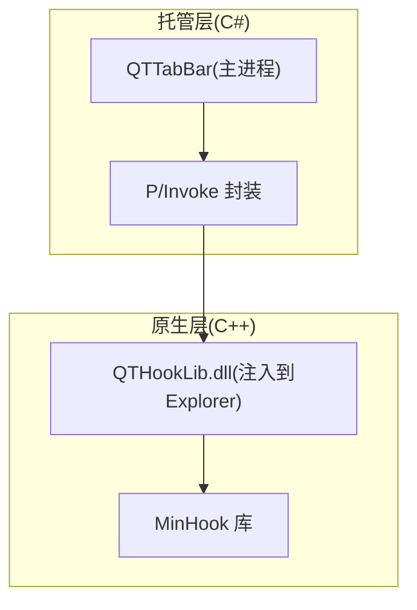
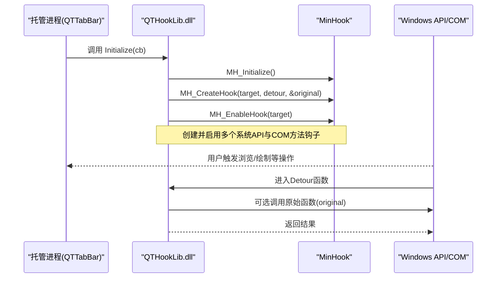
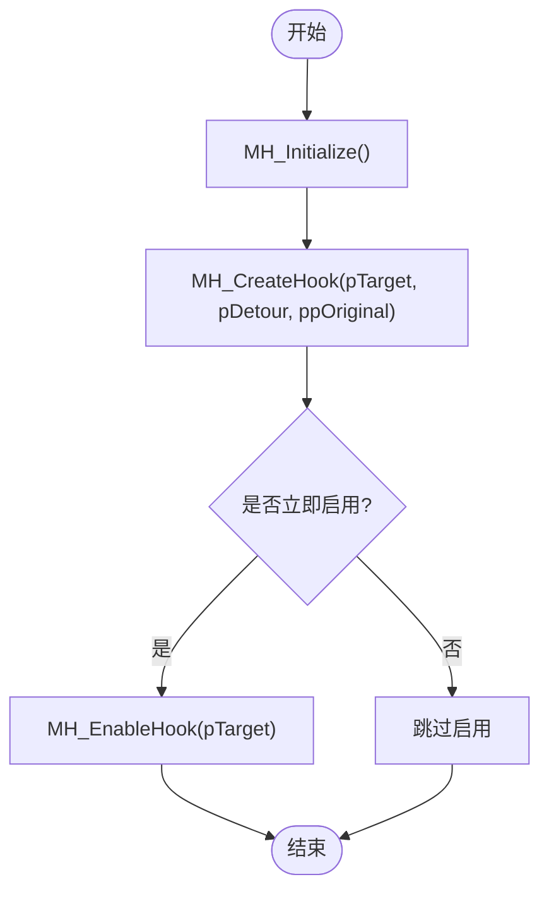
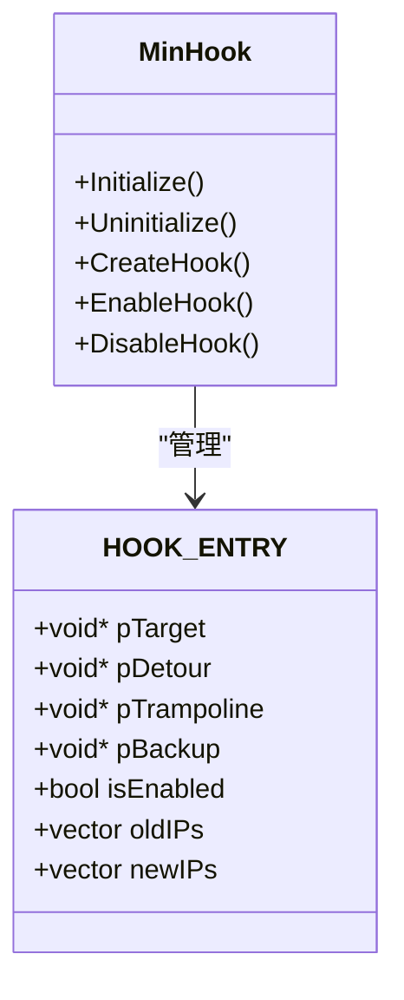
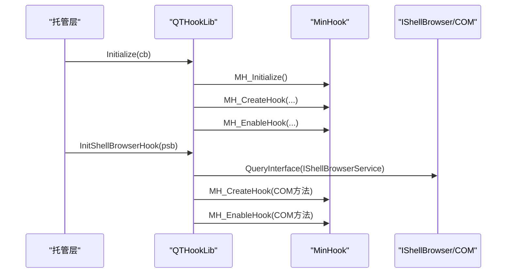
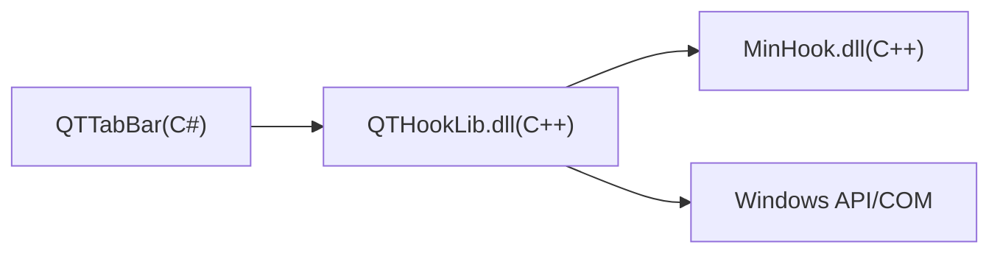

# 原生代码集成

<cite>
**本文引用的文件**   
- [MinHook.h](file://MinHook/MinHook.h)
- [hook.cpp](file://MinHook/src/hook.cpp)
- [trampoline.cpp](file://MinHook/src/trampoline.cpp)
- [main.cpp](file://QTHookLib/main.cpp)
</cite>

## 目录
1. [简介](#简介)
2. [项目结构](#项目结构)
3. [核心组件](#核心组件)
4. [架构总览](#架构总览)
5. [详细组件分析](#详细组件分析)
6. [依赖关系分析](#依赖关系分析)
7. [性能考虑](#性能考虑)
8. [故障排查指南](#故障排查指南)
9. [结论](#结论)
10. [附录](#附录)

## 简介
本技术文档面向 QTTabBar-Next 的原生代码集成，聚焦于 MinHook 库的集成与使用、API 钩子的实现原理与应用场景、C# 与 C++ 互操作（P/Invoke）最佳实践、进程间通信与共享内存机制、错误处理与崩溃恢复策略、调试与性能分析方法，以及安全性考量。文档以仓库中实际源码为依据，提供可追溯的代码级图示与路径引用，帮助读者快速理解并安全地扩展该项目的原生能力。

## 项目结构
本项目包含托管层（C#）与原生层（C++）两部分：
- 原生层：MinHook 钩子库与 QTHookLib 注入模块，负责在 Explorer 进程中拦截系统 API 与 COM 接口方法，完成 UI 增强与行为控制。
- 托管层：QTTabBar 主程序通过 P/Invoke 调用原生导出函数，管理钩子生命周期、消息注册与回调分发。

[此图为概念性结构图，不直接映射具体源文件]

## 核心组件
- MinHook 库：提供轻量级的 API Hook 能力，包括初始化、创建钩子、启用/禁用钩子、释放资源等。其内部通过指令重定位与跳转重写实现跨进程/跨模块的函数拦截。
- QTHookLib：作为注入到 Explorer 进程中的 DLL，负责：
  - 初始化 MinHook
  - 注册自定义窗口消息
  - 创建并启用对关键 API 与 COM 接口的钩子
  - 维护配置与资源（如背景图像）
  - 暴露 Initialize/Dispose/InitShellBrowserHook 等导出函数供托管层调用

章节来源
- [MinHook.h:1-106](file://MinHook/MinHook.h#L1-L106)
- [hook.cpp:91-335](file://MinHook/src/hook.cpp#L91-L335)
- [trampoline.cpp:92-262](file://MinHook/src/trampoline.cpp#L92-L262)
- [main.cpp:557-752](file://QTHookLib/main.cpp#L557-L752)

## 架构总览
下图展示了从托管层到原生层的调用链与钩子激活流程：

图表来源
- [main.cpp:590-690](file://QTHookLib/main.cpp#L590-L690)
- [hook.cpp:142-295](file://MinHook/src/hook.cpp#L142-L295)

章节来源
- [main.cpp:590-752](file://QTHookLib/main.cpp#L590-L752)
- [hook.cpp:91-335](file://MinHook/src/hook.cpp#L91-L335)

## 详细组件分析

### MinHook 库集成与使用
- 初始化与反初始化
  - 通过 MH_Initialize/MH_Uninitialize 进行全局初始化与清理，内部维护临界区与钩子表，确保线程安全。
- 创建与启用钩子
  - MH_CreateHook 会为目标函数生成 Trampoline（保留原函数入口片段），并在目标函数头部写入跳转至 Detour 或 Relay（x64）。
  - MH_EnableHook 将目标函数前若干字节改写为相对跳转；MH_DisableHook 则恢复备份。
- 异常与状态码
  - 返回 MH_STATUS 枚举值，涵盖未初始化、已存在、不可执行、内存保护失败等状态，便于上层统一处理。

图表来源
- [MinHook.h:79-100](file://MinHook/MinHook.h#L79-L100)
- [hook.cpp:142-295](file://MinHook/src/hook.cpp#L142-L295)

章节来源
- [MinHook.h:34-106](file://MinHook/MinHook.h#L34-L106)
- [hook.cpp:91-335](file://MinHook/src/hook.cpp#L91-L335)

### Trampoline 与指令重定位
- 指令扫描与复制
  - 解析目标函数起始段指令，遇到外部分支（CALL/JMP/Jcc）时记录临时地址，并在 Trampoline 中替换为绝对跳转或间接表访问。
- x64 特殊处理
  - 使用 RIP 相对寻址与绝对跳转表，避免长跳转限制。
- 终止条件
  - 当检测到 RET 或超出内部跳转范围时停止复制，保证 Trampoline 正确返回。

图表来源
- [hook.cpp:42-86](file://MinHook/src/hook.cpp#L42-L86)
- [hook.cpp:142-252](file://MinHook/src/hook.cpp#L142-L252)

章节来源
- [trampoline.cpp:92-262](file://MinHook/src/trampoline.cpp#L92-L262)
- [hook.cpp:339-399](file://MinHook/src/hook.cpp#L339-L399)

### QTHookLib 钩子应用
- 导出接口
  - Initialize：接收回调结构体，注册自定义消息，创建并启用一系列系统 API 与 COM 接口钩子。
  - Dispose：禁用所有钩子、释放资源、重置初始化标志。
  - InitShellBrowserHook：针对 IShellBrowser 实例动态创建 COM 钩子（如 BrowseObject、UpdateWindowList、TravelToEntry）。
- 典型钩子目标
  - CoCreateInstance、RegisterDragDrop、SHCreateShellFolderView、SHOpenFolderAndSelectItems、CreateWindowExW、DestroyWindow、BeginPaint、FillRect、CreateCompatibleDC 等。
- 回调机制
  - 通过 CallbackStruct 向托管层回传钩子创建结果，便于上层统一管理与日志记录。

图表来源
- [main.cpp:590-728](file://QTHookLib/main.cpp#L590-L728)

章节来源
- [main.cpp:557-752](file://QTHookLib/main.cpp#L557-L752)

### P/Invoke 最佳实践（数据类型映射、内存管理、异常处理）
- 数据类型映射
  - 指针与句柄：C++ void*/HANDLE 对应 IntPtr；字符串建议使用 string 配合 CharSet.Unicode 或显式编解码。
  - 结构体：保持字段顺序与对齐一致，必要时使用 StructLayout(LayoutKind.Sequential)。
  - 回调函数：使用委托并指定正确的调用约定（如 CallingConvention.StdCall）。
- 内存管理
  - 非托管内存分配由 C++ 负责，C# 侧不应重复释放；跨边界传递大对象时优先使用流或共享内存。
  - 对于需要长期持有的非托管资源，应在托管层显式调用 Dispose 类方法。
- 异常处理
  - 捕获 Win32Exception 与 MarshalDirectiveException，记录上下文信息（参数、返回值、当前线程）。
  - 对可能失败的 P/Invoke 调用进行返回值校验，结合 SetLastError 获取错误码。

[本节为通用指导，不直接分析具体文件]

### C# 与 C++ 互操作的架构设计（进程间通信与共享内存）
- 进程内互操作（推荐）
  - 通过 P/Invoke 直接调用注入到同一进程的 DLL 导出函数，延迟低、数据拷贝少。
- 进程间通信（IPC）
  - 命名管道、WM_COPYDATA、共享内存（MapViewOfFile）等。选择依据为吞吐、延迟与复杂度。
- 共享内存机制
  - 使用命名内核对象（如文件映射）建立共享区域，定义固定布局的数据契约，注意同步（事件/互斥量）与版本兼容。

[本节为概念性说明，不直接分析具体文件]

### 原生代码的错误处理与崩溃恢复策略
- 钩子生命周期
  - 始终先禁用再销毁：MH_DisableHook(NULL) 后 MH_Uninitialize()，避免悬挂指针与竞态。
- 状态码检查
  - 对 MH_CreateHook/MH_EnableHook 返回值进行检查，记录 MH_STATUS 并降级功能。
- 资源清理
  - 释放 GDI/Gdiplus 资源、关闭文件句柄、清空容器，防止泄漏。
- 崩溃恢复
  - 在关键路径添加结构化异常处理（SEH）或 try/catch 包装，记录堆栈与上下文；提供热重载或重启 Explorer 的能力。

章节来源
- [main.cpp:730-752](file://QTHookLib/main.cpp#L730-L752)
- [hook.cpp:107-140](file://MinHook/src/hook.cpp#L107-L140)

### 调试与性能分析工具
- 调试
  - Visual Studio 附加到 explorer.exe，设置断点于 Detour 函数与回调入口；使用 OutputDebugStringW 输出诊断信息。
- 性能分析
  - PerfView/ETW 采集系统调用与 GC 事件；对比启用/禁用钩子前后的热点差异。
- 稳定性验证
  - 自动化测试覆盖不同 Windows 版本与 Explorer 主题；模拟高并发导航与绘制场景。

[本节为通用指导，不直接分析具体文件]

### 安全性考虑（代码签名与完整性验证）
- 代码签名
  - 对 QTHookLib.dll 与相关原生组件进行强签名，确保加载信任链完整。
- 完整性验证
  - 启动时校验哈希与证书链，拒绝被篡改的二进制。
- 最小权限原则
  - 仅请求必要的系统 API 与 COM 接口；避免不必要的提权与全局钩子。

[本节为通用指导，不直接分析具体文件]

## 依赖关系分析
- 组件耦合
  - QTHookLib 依赖 MinHook 提供的钩子基础设施；托管层依赖 QTHookLib 的导出接口。
- 外部依赖
  - Windows API（GDI、Shell、UIAutomation）、COM 接口（IShellBrowser、ITravelLog 等）。
- 潜在循环依赖
  - 钩子回调应避免反向调用导致递归；必要时使用线程局部存储或队列异步处理。

图表来源
- [main.cpp:557-752](file://QTHookLib/main.cpp#L557-L752)
- [MinHook.h:79-106](file://MinHook/MinHook.h#L79-L106)

章节来源
- [main.cpp:557-752](file://QTHookLib/main.cpp#L557-L752)
- [MinHook.h:34-106](file://MinHook/MinHook.h#L34-L106)

## 性能考虑
- 钩子粒度
  - 仅对必要函数打钩，减少 Detour 开销；批量操作时使用批处理接口。
- 指令重写成本
  - 避免频繁启用/禁用钩子；缓存目标函数地址与 Trampoline 指针。
- 资源占用
  - 图片等资源按需加载与复用；及时释放 GDI 对象与流。
- 线程安全
  - 使用临界区/原子操作保护共享状态；避免在 Detour 中进行阻塞 IO。

[本节为通用指导，不直接分析具体文件]

## 故障排查指南
- 常见问题
  - 钩子未生效：检查 MH_CreateHook/MH_EnableHook 返回值与目标函数地址有效性。
  - 崩溃或死锁：确认 Detour 中未调用可能导致递归的 API；检查线程上下文与同步原语。
  - 资源泄漏：核对 Dispose 路径是否释放所有 GDI/Gdiplus 对象与文件句柄。
- 定位技巧
  - 使用 OutputDebugStringW 输出关键路径；结合 ETW/PerfView 分析热点。
  - 在托管层记录 P/Invoke 调用栈与参数，辅助复现问题。

章节来源
- [main.cpp:730-752](file://QTHookLib/main.cpp#L730-L752)
- [hook.cpp:107-140](file://MinHook/src/hook.cpp#L107-L140)

## 结论
通过将 MinHook 深度集成到 QTHookLib，并在托管层采用稳健的 P/Invoke 与 IPC 策略，QTTabBar-Next 能够在 Explorer 进程中高效、安全地实现 UI 增强与行为定制。遵循本文的最佳实践与排障建议，可显著提升系统的稳定性与可维护性。

## 附录
- 参考路径
  - MinHook 初始化与钩子管理：[MinHook.h:79-106](file://MinHook/MinHook.h#L79-L106)、[hook.cpp:91-335](file://MinHook/src/hook.cpp#L91-L335)
  - Trampoline 构建与地址解析：[trampoline.cpp:92-262](file://MinHook/src/trampoline.cpp#L92-L262)
  - QTHookLib 导出与钩子创建：[main.cpp:557-752](file://QTHookLib/main.cpp#L557-L752)