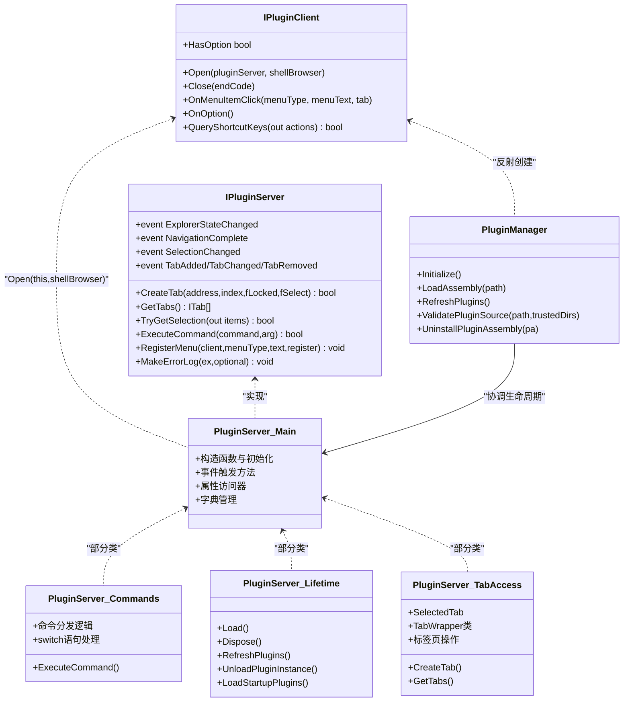
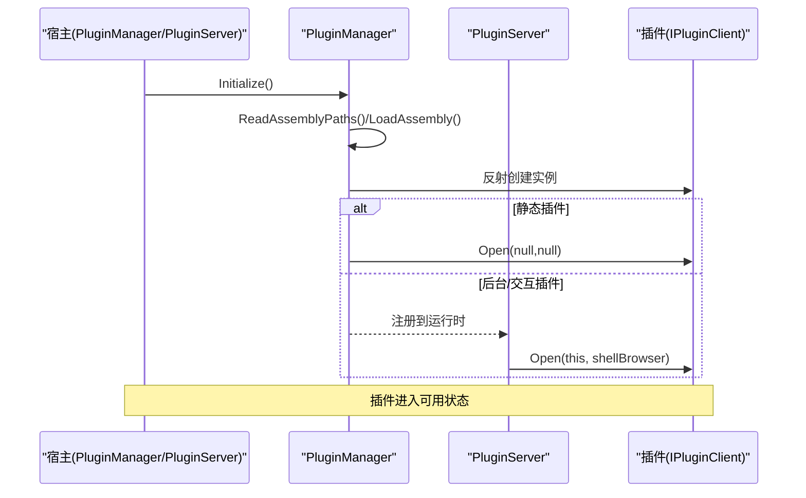
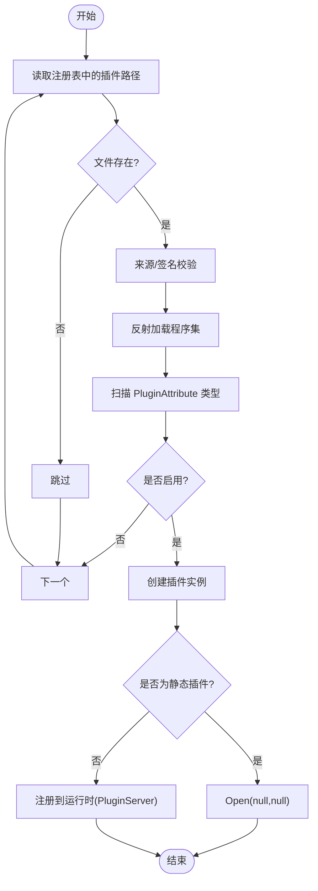
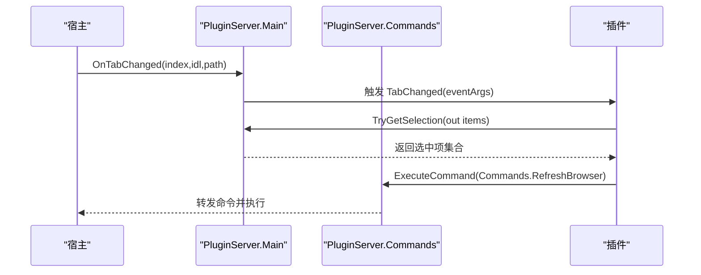
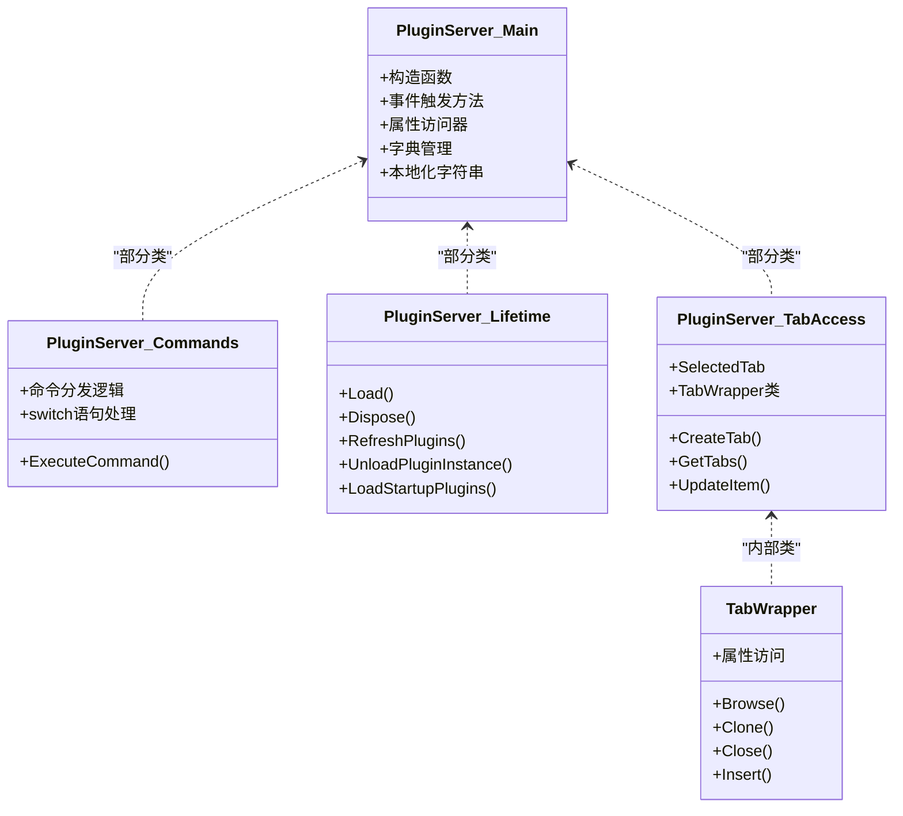
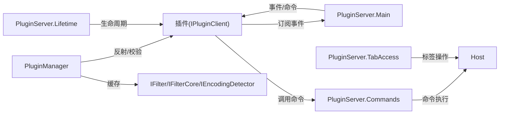
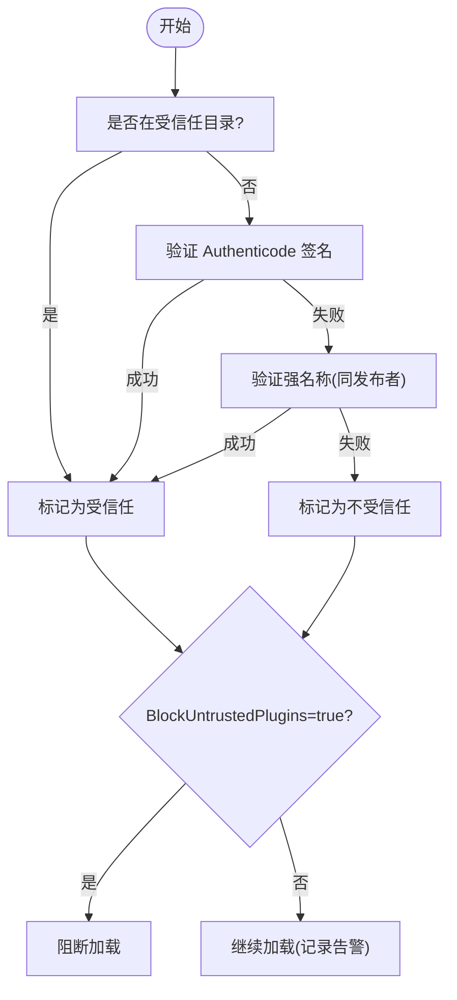

# 插件架构设计

<cite>
**本文引用的文件**   
- [README.md](file://README.md)
- [IPluginClient.cs](file://QTPluginLib/IPluginClient.cs)
- [IPluginServer.cs](file://QTPluginLib/IPluginServer.cs)
- [PluginType.cs](file://QTPluginLib/PluginType.cs)
- [PluginAttribute.cs](file://QTPluginLib/PluginAttribute.cs)
- [PluginEventArgs.cs](file://QTPluginLib/PluginEventArgs.cs)
- [PluginEventHandler.cs](file://QTPluginLib/PluginEventHandler.cs)
- [ITab.cs](file://QTPluginLib/ITab.cs)
- [IBarButton.cs](file://QTPluginLib/IBarButton.cs)
- [IBarCustomItem.cs](file://QTPluginLib/IBarCustomItem.cs)
- [IBarMultipleCustomItems.cs](file://QTPluginLib/IBarMultipleCustomItems.cs)
- [IFilter.cs](file://QTPluginLib/IFilter.cs)
- [IFilterCore.cs](file://QTPluginLib/IFilterCore.cs)
- [IEncodingDetector.cs](file://QTPluginLib/IEncodingDetector.cs)
- [PluginManager.cs](file://QTTabBar/PluginManager.cs)
- [PluginServer.cs](file://QTTabBar/PluginServer.cs)
- [PluginServer.Commands.cs](file://QTTabBar/PluginServer.Commands.cs)
- [PluginServer.Lifetime.cs](file://QTTabBar/PluginServer.Lifetime.cs)
- [PluginServer.TabAccess.cs](file://QTTabBar/PluginServer.TabAccess.cs)
</cite>

## 更新摘要
**所做更改**   
- 更新了插件服务器架构部分，反映 PluginServer.cs 的重构为三个独立的部分类文件
- 新增了详细的分文件架构说明和职责划分
- 更新了架构图以显示新的部分类结构
- 增强了代码组织和可维护性的分析

## 目录
1. [简介](#简介)
2. [项目结构](#项目结构)
3. [核心组件](#核心组件)
4. [架构总览](#架构总览)
5. [详细组件分析](#详细组件分析)
6. [依赖关系分析](#依赖关系分析)
7. [性能与资源管理](#性能与资源管理)
8. [安全与沙箱机制](#安全与沙箱机制)
9. [版本兼容性与错误恢复](#版本兼容性与错误恢复)
10. [插件开发指南](#插件开发指南)
11. [故障排查](#故障排查)
12. [结论](#结论)

## 简介
本设计文档面向 QTTabBar-Next 的插件系统，系统性阐述以下方面：
- IPluginClient 与 IPluginServer 接口契约与职责边界
- 插件类型体系（交互式、后台、静态）及其生命周期
- 插件发现、加载策略与注册流程
- 插件间通信协议与数据交换格式
- 插件安全机制、权限控制与受信任来源校验
- 版本兼容性处理与错误恢复策略
- 插件开发模板、实现示例与调试方法

## 项目结构
插件相关代码主要分布在两个工程：
- QTPluginLib：定义插件公共接口、事件与属性（供宿主与插件共同引用）
- QTTabBar：宿主侧实现，包含插件管理器与服务器

```mermaid
graph TB
subgraph "插件库(QTPluginLib)"
A["IPluginClient"]
B["IPluginServer"]
C["PluginType"]
D["PluginAttribute"]
E["ITab / IBarButton / IBarCustomItem / IBarMultipleCustomItems"]
F["IFilter / IFilterCore / IEncodingDetector"]
G["PluginEventArgs / PluginEventHandler"]
end
subgraph "宿主(QTTabBar)"
H["PluginManager"]
I["PluginServer (重构后)")
I1["PluginServer.cs (主类)"]
I2["PluginServer.Commands.cs (命令分发)"]
I3["PluginServer.Lifetime.cs (生命周期)"]
I4["PluginServer.TabAccess.cs (标签访问)"]
end
A --> H
B --> I
C --> H
D --> H
E --> H
F --> H
G --> I
```

**更新** 插件服务器已重构为四个独立的部分类文件，显著改善了代码组织和可维护性

章节来源
- [IPluginClient.cs:20-31](file://QTPluginLib/IPluginClient.cs#L20-L31)
- [IPluginServer.cs:23-77](file://QTPluginLib/IPluginServer.cs#L23-L77)
- [PluginType.cs:18-25](file://QTPluginLib/PluginType.cs#L18-L25)
- [PluginAttribute.cs:20-64](file://QTPluginLib/PluginAttribute.cs#L20-L64)
- [ITab.cs:18-40](file://QTPluginLib/ITab.cs#L18-L40)
- [IBarButton.cs:20-30](file://QTPluginLib/IBarButton.cs#L20-L30)
- [IBarCustomItem.cs:20-24](file://QTPluginLib/IBarCustomItem.cs#L20-L24)
- [IBarMultipleCustomItems.cs:20-30](file://QTPluginLib/IBarMultipleCustomItems.cs#L20-L30)
- [IFilter.cs:20-24](file://QTPluginLib/IFilter.cs#L20-L24)
- [IFilterCore.cs:22-26](file://QTPluginLib/IFilterCore.cs#L22-L26)
- [IEncodingDetector.cs:20-24](file://QTPluginLib/IEncodingDetector.cs#L20-L24)
- [PluginEventArgs.cs:20-53](file://QTPluginLib/PluginEventArgs.cs#L20-L53)
- [PluginEventHandler.cs:18-20](file://QTPluginLib/PluginEventHandler.cs#L18-L20)
- [PluginManager.cs:30-481](file://QTTabBar/PluginManager.cs#L30-L481)
- [PluginServer.cs:28-271](file://QTTabBar/PluginServer.cs#L28-L271)
- [PluginServer.Commands.cs:1-142](file://QTTabBar/PluginServer.Commands.cs#L1-L142)
- [PluginServer.Lifetime.cs:1-215](file://QTTabBar/PluginServer.Lifetime.cs#L1-L215)
- [PluginServer.TabAccess.cs:1-254](file://QTTabBar/PluginServer.TabAccess.cs#L1-L254)

## 核心组件
- IPluginClient：插件对外暴露的最小入口，用于宿主回调插件（打开、关闭、菜单点击、快捷键等）。
- IPluginServer：宿主向插件提供的服务总线，包括事件通知、标签页操作、选择项读写、命令执行、菜单注册、本地化字符串获取等。
- PluginType：插件类型枚举，区分交互型、后台型、多实例后台型与静态型。
- PluginAttribute：用于在插件类上声明元数据（名称、作者、版本、描述、类型），支持通过 LocalizedStringProvider 提供本地化信息。
- ITab：对标签页的抽象，允许插件浏览、克隆、插入、关闭、设置文本等。
- IBarButton / IBarCustomItem / IBarMultipleCustomItems：工具栏按钮或自定义控件扩展点。
- IFilter / IFilterCore：过滤引擎扩展点，支持正则查询与底层匹配。
- IEncodingDetector：编码检测扩展点，允许插件参与文本编码识别。
- PluginEventArgs / PluginEventHandler：事件参数与委托，承载索引、地址、窗口动作等信息。

章节来源
- [IPluginClient.cs:20-31](file://QTPluginLib/IPluginClient.cs#L20-L31)
- [IPluginServer.cs:23-77](file://QTPluginLib/IPluginServer.cs#L23-L77)
- [PluginType.cs:18-25](file://QTPluginLib/PluginType.cs#L18-L25)
- [PluginAttribute.cs:20-64](file://QTPluginLib/PluginAttribute.cs#L20-L64)
- [ITab.cs:18-40](file://QTPluginLib/ITab.cs#L18-L40)
- [IBarButton.cs:20-30](file://QTPluginLib/IBarButton.cs#L20-L30)
- [IBarCustomItem.cs:20-24](file://QTPluginLib/IBarCustomItem.cs#L20-L24)
- [IBarMultipleCustomItems.cs:20-30](file://QTPluginLib/IBarMultipleCustomItems.cs#L20-L30)
- [IFilter.cs:20-24](file://QTPluginLib/IFilter.cs#L20-L24)
- [IFilterCore.cs:22-26](file://QTPluginLib/IFilterCore.cs#L22-L26)
- [IEncodingDetector.cs:20-24](file://QTPluginLib/IEncodingDetector.cs#L20-L24)
- [PluginEventArgs.cs:20-53](file://QTPluginLib/PluginEventArgs.cs#L20-L53)
- [PluginEventHandler.cs:18-20](file://QTPluginLib/PluginEventHandler.cs#L18-L20)

## 架构总览
插件系统采用"宿主-插件"双向契约模式：
- 宿主通过 PluginManager 扫描并加载插件程序集，解析 PluginAttribute，创建插件实例，并根据类型进行初始化。
- 插件通过 IPluginServer 订阅事件、调用宿主能力；通过 IPluginClient 接收宿主回调。
- 静态插件在宿主启动时即创建并调用 Open(null, null)。
- 后台插件在宿主运行期按需加载，并可作为过滤器或编码检测器被宿主使用。
- 交互型插件在需要时由宿主创建并注入 IPluginServer 与 IShellBrowser。

**更新** 插件服务器现已重构为四个独立的部分类文件，每个文件负责特定的功能领域：



**图表来源**
- [IPluginClient.cs:20-31](file://QTPluginLib/IPluginClient.cs#L20-L31)
- [IPluginServer.cs:23-77](file://QTPluginLib/IPluginServer.cs#L23-L77)
- [PluginManager.cs:30-481](file://QTTabBar/PluginManager.cs#L30-L481)
- [PluginServer.cs:28-271](file://QTTabBar/PluginServer.cs#L28-L271)
- [PluginServer.Commands.cs:1-142](file://QTTabBar/PluginServer.Commands.cs#L1-L142)
- [PluginServer.Lifetime.cs:1-215](file://QTTabBar/PluginServer.Lifetime.cs#L1-L215)
- [PluginServer.TabAccess.cs:1-254](file://QTTabBar/PluginServer.TabAccess.cs#L1-L254)

## 详细组件分析

### 接口契约与数据模型
- IPluginClient：插件最小实现必须满足的回调入口，确保宿主可统一管理与调度。
- IPluginServer：插件访问宿主的唯一通道，避免直接耦合宿主内部类型。
- ITab：对标签页的封装，屏蔽具体 UI 细节，提供导航、历史、克隆等操作。
- 工具栏扩展：IBarButton/IBarCustomItem/IBarMultipleCustomItems 为不同粒度的工具栏集成方式。
- 过滤与编码：IFilter/IFilterCore/IEncodingDetector 提供可扩展的搜索与编码识别能力。
- 事件与参数：PluginEventArgs 携带 Index、Address、WindowAction 等上下文，便于插件响应状态变化。

章节来源
- [IPluginClient.cs:20-31](file://QTPluginLib/IPluginClient.cs#L20-L31)
- [IPluginServer.cs:23-77](file://QTPluginLib/IPluginServer.cs#L23-L77)
- [ITab.cs:18-40](file://QTPluginLib/ITab.cs#L18-L40)
- [IBarButton.cs:20-30](file://QTPluginLib/IBarButton.cs#L20-L30)
- [IBarCustomItem.cs:20-24](file://QTPluginLib/IBarCustomItem.cs#L20-L24)
- [IBarMultipleCustomItems.cs:20-30](file://QTPluginLib/IBarMultipleCustomItems.cs#L20-L30)
- [IFilter.cs:20-24](file://QTPluginLib/IFilter.cs#L20-L24)
- [IFilterCore.cs:22-26](file://QTPluginLib/IFilterCore.cs#L22-L26)
- [IEncodingDetector.cs:20-24](file://QTPluginLib/IEncodingDetector.cs#L20-L24)
- [PluginEventArgs.cs:20-53](file://QTPluginLib/PluginEventArgs.cs#L20-L53)

### 插件类型系统与生命周期
- 交互式插件：在需要时由宿主创建，Open 注入 IPluginServer 与 IShellBrowser，随宿主窗口生命周期管理。
- 后台插件：在宿主启动时加载，可作为过滤器或编码检测器被宿主使用；支持单例或多实例。
- 静态插件：在宿主初始化阶段创建并立即调用 Open(null, null)，常用于全局功能。



**图表来源**
- [PluginManager.cs:53-122](file://QTTabBar/PluginManager.cs#L53-L122)
- [PluginManager.cs:330-349](file://QTTabBar/PluginManager.cs#L330-L349)
- [PluginServer.Lifetime.cs:26-42](file://QTTabBar/PluginServer.Lifetime.cs#L26-L42)

章节来源
- [PluginType.cs:18-25](file://QTPluginLib/PluginType.cs#L18-L25)
- [PluginManager.cs:330-349](file://QTTabBar/PluginManager.cs#L330-L349)
- [PluginServer.Lifetime.cs:26-42](file://QTTabBar/PluginServer.Lifetime.cs#L26-L42)

### 插件发现与加载策略
- 发现路径：从用户配置读取程序集路径列表，仅当文件存在时纳入候选。
- 元数据解析：通过反射加载程序集，扫描带有 PluginAttribute 的类型，生成 PluginInformation。
- 启用策略：根据配置中的已启用插件 ID 列表，标记对应插件为启用。
- 静态实例：在初始化阶段预创建静态插件实例，并尝试绑定 IEncodingDetector。
- 刷新与卸载：支持动态刷新，移除不再存在的程序集，卸载未启用的插件实例。



**图表来源**
- [PluginManager.cs:351-364](file://QTTabBar/PluginManager.cs#L351-L364)
- [PluginManager.cs:124-143](file://QTTabBar/PluginManager.cs#L124-L143)
- [PluginManager.cs:575-639](file://QTTabBar/PluginManager.cs#L575-L639)
- [PluginManager.cs:330-349](file://QTTabBar/PluginManager.cs#L330-L349)

章节来源
- [PluginManager.cs:351-364](file://QTTabBar/PluginManager.cs#L351-L364)
- [PluginManager.cs:124-143](file://QTTabBar/PluginManager.cs#L124-L143)
- [PluginManager.cs:575-639](file://QTTabBar/PluginManager.cs#L575-L639)
- [PluginManager.cs:330-349](file://QTTabBar/PluginManager.cs#L330-L349)

### 插件间通信协议与数据交换格式
- 事件驱动：通过 IPluginServer 的事件（如 TabAdded、NavigationComplete、SelectionChanged 等）将宿主状态变更推送给插件。
- 事件参数：PluginEventArgs 携带 Index、Address、WindowAction，其中 Address 表示 Shell 地址（IDL+Path）。
- 命令式调用：插件通过 IPluginServer.ExecuteCommand 触发宿主行为（如导航、刷新、关闭窗口等）。
- 菜单注册：插件通过 RegisterMenu 向宿主注册菜单项，宿主负责渲染与分发。
- 本地化字符串：插件可通过 TryGetLocalizedStrings 获取按插件类型全名索引的多语言字符串数组。

**更新** 命令分发逻辑现已移至独立的 PluginServer.Commands.cs 文件中，提高了代码的可读性和维护性：



**图表来源**
- [PluginServer.cs:132-172](file://QTTabBar/PluginServer.cs#L132-L172)
- [PluginServer.Commands.cs:12-138](file://QTTabBar/PluginServer.Commands.cs#L12-L138)
- [PluginServer.Lifetime.cs:200-207](file://QTTabBar/PluginServer.Lifetime.cs#L200-L207)
- [PluginServer.cs:184-204](file://QTTabBar/PluginServer.cs#L184-L204)

章节来源
- [PluginEventArgs.cs:20-53](file://QTPluginLib/PluginEventArgs.cs#L20-L53)
- [PluginServer.cs:132-172](file://QTTabBar/PluginServer.cs#L132-L172)
- [PluginServer.Commands.cs:12-138](file://QTTabBar/PluginServer.Commands.cs#L12-L138)
- [PluginServer.Lifetime.cs:200-207](file://QTTabBar/PluginServer.Lifetime.cs#L200-L207)
- [PluginServer.cs:184-204](file://QTTabBar/PluginServer.cs#L184-L204)

### 工具栏与自定义项
- IBarButton：简单按钮，提供图像与文本，支持按钮点击事件。
- IBarCustomItem：返回 ToolStripItem，适合复杂控件。
- IBarMultipleCustomItems：批量生成多个条目，支持排序与命名。
- 宿主侧通过 UpdateItem 更新按钮状态与图像。

章节来源
- [IBarButton.cs:20-30](file://QTPluginLib/IBarButton.cs#L20-L30)
- [IBarCustomItem.cs:20-24](file://QTPluginLib/IBarCustomItem.cs#L20-L24)
- [IBarMultipleCustomItems.cs:20-30](file://QTPluginLib/IBarMultipleCustomItems.cs#L20-L30)
- [PluginServer.TabAccess.cs:70-75](file://QTTabBar/PluginServer.TabAccess.cs#L70-L75)

### 插件服务器重构架构

**新增** 插件服务器现已重构为四个独立的部分类文件，每个文件负责特定的功能领域：

#### 主类文件 (PluginServer.cs)
- 包含 PluginServer 类的核心定义和字段
- 事件声明和基础属性
- 构造函数和初始化逻辑
- 事件触发方法（OnTabChanged, OnSelectionChanged 等）
- 本地化字符串管理和菜单注册

#### 命令分发文件 (PluginServer.Commands.cs)
- 集中处理所有 ExecuteCommand 方法的命令分发逻辑
- 包含完整的 switch 语句处理各种 Commands 枚举值
- 处理导航、窗口操作、UI 控制等命令
- 提供统一的命令执行入口

#### 生命周期管理文件 (PluginServer.Lifetime.cs)
- 管理插件的完整生命周期：Load、Unload、Dispose
- 处理插件的启动、刷新和清理过程
- 管理插件实例的注册和注销
- 处理过滤器插件的特殊初始化逻辑

#### 标签页访问文件 (PluginServer.TabAccess.cs)
- 提供标签页相关的操作方法：CreateTab、GetTabs、SelectedTab
- 包含 TabWrapper 内部类实现 ITab 接口
- 处理标签页的创建、删除、选择和操作
- 管理标签页的状态和属性



**图表来源**
- [PluginServer.cs:28-256](file://QTTabBar/PluginServer.cs#L28-L256)
- [PluginServer.Commands.cs:10-142](file://QTTabBar/PluginServer.Commands.cs#L10-L142)
- [PluginServer.Lifetime.cs:10-215](file://QTTabBar/PluginServer.Lifetime.cs#L10-L215)
- [PluginServer.TabAccess.cs:12-254](file://QTTabBar/PluginServer.TabAccess.cs#L12-L254)

**章节来源**
- [PluginServer.cs:28-256](file://QTTabBar/PluginServer.cs#L28-L256)
- [PluginServer.Commands.cs:10-142](file://QTTabBar/PluginServer.Commands.cs#L10-L142)
- [PluginServer.Lifetime.cs:10-215](file://QTTabBar/PluginServer.Lifetime.cs#L10-L215)
- [PluginServer.TabAccess.cs:12-254](file://QTTabBar/PluginServer.TabAccess.cs#L12-L254)

## 依赖关系分析
- 插件对宿主：仅通过 IPluginServer 访问宿主能力，保持松耦合。
- 宿主对插件：通过反射与接口约束进行实例化与调用，避免强依赖具体类型。
- 过滤器与编码检测：宿主在后台插件中查找并缓存相应接口实例。

**更新** 重构后的依赖关系更加清晰，各部分类文件之间的依赖关系明确：



**图表来源**
- [PluginManager.cs:330-349](file://QTTabBar/PluginManager.cs#L330-L349)
- [PluginServer.Lifetime.cs:26-42](file://QTTabBar/PluginServer.Lifetime.cs#L26-L42)
- [PluginServer.Commands.cs:12-138](file://QTTabBar/PluginServer.Commands.cs#L12-L138)
- [PluginServer.TabAccess.cs:14-75](file://QTTabBar/PluginServer.TabAccess.cs#L14-L75)

**章节来源**
- [PluginManager.cs:330-349](file://QTTabBar/PluginManager.cs#L330-L349)
- [PluginServer.Lifetime.cs:26-42](file://QTTabBar/PluginServer.Lifetime.cs#L26-L42)
- [PluginServer.Commands.cs:12-138](file://QTTabBar/PluginServer.Commands.cs#L12-L138)
- [PluginServer.TabAccess.cs:14-75](file://QTTabBar/PluginServer.TabAccess.cs#L14-L75)

## 性能与资源管理
- 反射开销：程序集加载与类型扫描仅在初始化或刷新时执行，建议减少频繁刷新。
- 图像资源：工具栏按钮图像可能来自插件或宿主，注意释放旧图像以避免内存泄漏。
- 事件订阅：插件应在适当时机取消订阅，避免持有宿主对象导致无法回收。
- 静态插件：全局单例需谨慎管理资源，避免长时间占用。

**更新** 重构后的代码结构有利于更好的性能优化和资源管理：
- 命令分发逻辑集中在单一文件中，便于性能分析和优化
- 生命周期管理独立，便于监控插件资源使用情况
- 标签页操作分离，减少不必要的 UI 操作开销

## 安全与沙箱机制
- 来源校验：默认保守策略，仅当 BlockUntrustedPlugins 开启时才阻断不受信任的插件。
- 受信任目录：仅将主程序集所在目录视为受信任安装目录。
- 签名校验：优先验证 Authenticode 签名（证书链离线吊销检查，且要求与主程序集相同发布者指纹），其次回退到强名称（要求相同 PublicKeyToken）。
- 失败处理：校验失败会记录日志；保守模式下仍继续加载但告警。



**图表来源**
- [PluginManager.cs:154-166](file://QTTabBar/PluginManager.cs#L154-L166)
- [PluginManager.cs:215-259](file://QTTabBar/PluginManager.cs#L215-L259)
- [PluginManager.cs:299-328](file://QTTabBar/PluginManager.cs#L299-L328)

**章节来源**
- [PluginManager.cs:154-166](file://QTTabBar/PluginManager.cs#L154-L166)
- [PluginManager.cs:215-259](file://QTTabBar/PluginManager.cs#L215-L259)
- [PluginManager.cs:299-328](file://QTTabBar/PluginManager.cs#L299-L328)

## 版本兼容性与错误恢复
- 版本元数据：通过 PluginAttribute.Version 提供插件版本信息，便于宿主显示与管理。
- 异常隔离：插件加载、关闭、图像获取等关键路径均捕获异常并记录日志，避免影响宿主稳定性。
- 错误日志：统一通过 MakeErrorLog 输出，便于定位问题。
- 刷新容错：刷新过程中若某插件加载失败，将其标记为禁用，不影响其他插件。

**更新** 重构后的错误处理更加模块化：
- 命令执行异常在 PluginServer.Commands.cs 中统一处理
- 生命周期异常在 PluginServer.Lifetime.cs 中集中管理
- 标签页操作异常在 PluginServer.TabAccess.cs 中专门处理

**章节来源**
- [PluginAttribute.cs:20-64](file://QTPluginLib/PluginAttribute.cs#L20-L64)
- [PluginManager.cs:44-51](file://QTTabBar/PluginManager.cs#L44-L51)
- [PluginManager.cs:667-709](file://QTTabBar/PluginManager.cs#L667-709)
- [PluginServer.Lifetime.cs:26-42](file://QTTabBar/PluginServer.Lifetime.cs#L26-L42)
- [PluginServer.Commands.cs:12-138](file://QTTabBar/PluginServer.Commands.cs#L12-L138)

## 插件开发指南

### 项目模板与约定
- 目标框架：.NET Framework 4.8（参考构建说明）。
- 程序集：输出为 DLL，位于受信任目录或通过配置注册路径。
- 类约定：
  - 公开非抽象类，实现 IPluginClient。
  - 使用 PluginAttribute 标注类，指定类型、名称、作者、版本、描述。
  - 可选实现 IBarButton/IBarCustomItem/IBarMultipleCustomItems 以提供工具栏集成。
  - 可选实现 IFilter/IFilterCore/IEncodingDetector 以提供过滤或编码检测能力。

**章节来源**
- [README.md:26-47](file://README.md#L26-L47)
- [PluginAttribute.cs:20-64](file://QTPluginLib/PluginAttribute.cs#L20-L64)
- [IBarButton.cs:20-30](file://QTPluginLib/IBarButton.cs#L20-L30)
- [IBarCustomItem.cs:20-24](file://QTPluginLib/IBarCustomItem.cs#L20-L24)
- [IBarMultipleCustomItems.cs:20-30](file://QTPluginLib/IBarMultipleCustomItems.cs#L20-L30)
- [IFilter.cs:20-24](file://QTPluginLib/IFilter.cs#L20-L24)
- [IFilterCore.cs:22-26](file://QTPluginLib/IFilterCore.cs#L22-L26)
- [IEncodingDetector.cs:20-24](file://QTPluginLib/IEncodingDetector.cs#L20-L24)

### 接口实现要点
- IPluginClient.Open：保存 IPluginServer 引用，订阅必要事件，必要时创建 UI 或与宿主交互。
- IPluginClient.Close：释放资源、取消事件订阅。
- 工具栏按钮：实现 GetImage/InitializeItem/OnButtonClick 等，遵循宿主更新机制。
- 过滤引擎：实现 QueryRegex 或 IsMatch，保证性能与正确性。
- 编码检测：实现 GetEncoding，注意输入数据的可变性与线程安全。

**章节来源**
- [IPluginClient.cs:20-31](file://QTPluginLib/IPluginClient.cs#L20-L31)
- [IBarButton.cs:20-30](file://QTPluginLib/IBarButton.cs#L20-L30)
- [IFilter.cs:20-24](file://QTPluginLib/IFilter.cs#L20-L24)
- [IFilterCore.cs:22-26](file://QTPluginLib/IFilterCore.cs#L22-L26)
- [IEncodingDetector.cs:20-24](file://QTPluginLib/IEncodingDetector.cs#L20-L24)

### 调试方法
- 异常日志：利用 MakeErrorLog 输出详细堆栈与可选上下文。
- 事件追踪：在插件中订阅 IPluginServer 的关键事件，记录触发顺序与参数。
- 工具栏调试：通过 UpdateItem 观察按钮状态变化，确认宿主侧刷新逻辑。

**更新** 重构后的调试更加便捷：
- 命令执行问题可在 PluginServer.Commands.cs 中快速定位
- 生命周期问题可在 PluginServer.Lifetime.cs 中集中排查
- 标签页操作问题可在 PluginServer.TabAccess.cs 中专门分析

**章节来源**
- [PluginServer.cs:180-182](file://QTTabBar/PluginServer.cs#L180-L182)
- [PluginServer.TabAccess.cs:70-75](file://QTTabBar/PluginServer.TabAccess.cs#L70-L75)
- [PluginServer.Commands.cs:12-138](file://QTTabBar/PluginServer.Commands.cs#L12-L138)

## 故障排查
- 插件未加载：检查注册表路径是否存在、文件是否可读、是否启用、来源/签名校验结果。
- 插件崩溃：查看异常日志，关注插件加载、关闭、图像获取等关键路径。
- 菜单不生效：确认 RegisterMenu 调用是否正确，菜单类型与文本是否匹配。
- 过滤无效：检查 QueryRegex/IsMatch 实现，确认正则表达式与匹配逻辑。

**更新** 重构后的故障排查更加系统化：
- 命令执行问题：检查 PluginServer.Commands.cs 中的命令分发逻辑
- 生命周期问题：检查 PluginServer.Lifetime.cs 中的加载和卸载流程
- 标签页问题：检查 PluginServer.TabAccess.cs 中的标签操作实现

**章节来源**
- [PluginManager.cs:351-364](file://QTTabBar/PluginManager.cs#L351-L364)
- [PluginManager.cs:299-328](file://QTTabBar/PluginManager.cs#L299-L328)
- [PluginManager.cs:44-51](file://QTTabBar/PluginManager.cs#L44-L51)
- [PluginServer.Commands.cs:12-138](file://QTTabBar/PluginServer.Commands.cs#L12-L138)
- [PluginServer.Lifetime.cs:26-42](file://QTTabBar/PluginServer.Lifetime.cs#L26-L42)
- [PluginServer.TabAccess.cs:14-75](file://QTTabBar/PluginServer.TabAccess.cs#L14-L75)
- [IFilter.cs:20-24](file://QTPluginLib/IFilter.cs#L20-L24)
- [IFilterCore.cs:22-26](file://QTPluginLib/IFilterCore.cs#L22-L26)

## 结论
QTTabBar-Next 的插件架构以清晰的接口契约为基础，结合严格的来源与签名校验，实现了高内聚、低耦合的扩展生态。**经过重构后，插件服务器采用了更加模块化的架构设计，将原本庞大的单一类拆分为四个职责明确的部分类文件**。通过事件驱动与命令式调用，插件能够安全地访问宿主能力；同时，静态与后台插件的生命周期管理确保了系统的稳定与性能。开发者只需遵循约定与最佳实践，即可快速构建高质量的插件。

**重构带来的优势**：
- **代码组织改善**：每个部分类文件专注于特定功能领域，提高代码可读性
- **维护性增强**：修改特定功能时只需关注相关文件，降低出错风险
- **团队协作友好**：不同开发者可以并行处理不同的功能模块
- **测试便利性**：单元测试可以更精确地针对特定功能模块
- **性能优化**：便于对特定功能进行性能分析和优化