# 架构设计

<cite>
**本文引用的文件**   
- [QTTabBarClass.cs](file://QTTabBar/QTTabBarClass.cs)
- [BandObject.cs](file://BandObjectLib/BandObject.cs)
- [InitializationOrchestrator.cs](file://QTTabBar/InitializationOrchestrator.cs)
- [ExplorerManager.cs](file://QTTabBar/ExplorerManager.cs)
- [PluginManager.cs](file://QTTabBar/PluginManager.cs)
- [Config.cs](file://QTTabBar/Config.cs)
- [InstanceManager.cs](file://QTTabBar/InstanceManager.cs)
- [HookLibManager.cs](file://QTTabBar/HookLibManager.cs)
- [IPluginClient.cs](file://QTPluginLib/IPluginClient.cs)
- [PluginServer.cs](file://QTTabBar/PluginServer.cs)
- [ExtendedListViewCommon.WatermarkRenderer.cs](file://QTTabBar/ExtendedListViewCommon.WatermarkRenderer.cs)
- [ExtendedListViewCommon.ListViewHoverController.cs](file://QTTabBar/ExtendedListViewCommon.ListViewHoverController.cs)
- [ExtendedListViewCommon.ListViewMessageController.cs](file://QTTabBar/ExtendedListViewCommon.ListViewMessageController.cs)
- [SubDirTipForm.ShellMenuGenerator.cs](file://QTTabBar/SubDirTipForm.ShellMenuGenerator.cs)
- [SubDirTipForm.ThumbnailController.cs](file://QTTabBar/SubDirTipForm.ThumbnailController.cs)
- [DropDownMenuReorderable.cs](file://QTTabBar/DropDownMenuReorderable.cs)
- [DropDownMenuReorderable.ScrollController.cs](file://QTTabBar/DropDownMenuReorderable.ScrollController.cs)
- [DropDownMenuReorderable.VirtualItemsController.cs](file://QTTabBar/DropDownMenuReorderable.VirtualItemsController.cs)
- [DropDownMenuDropTarget.ClipboardFileController.cs](file://QTTabBar/DropDownMenuDropTarget.ClipboardFileController.cs)
- [DropDownMenuDropTarget.DragDropTargetController.cs](file://QTTabBar/DropDownMenuDropTarget.DragDropTargetController.cs)
- [ArchitectureBatch9ClipboardControllerTests.cs](file://Tests/QTTtabBarTests/ArchitectureBatch9ClipboardControllerTests.cs)
- [ArchitectureBatch9DragDropTargetControllerTests.cs](file://Tests/QTTtabBarTests/ArchitectureBatch9DragDropTargetControllerTests.cs)
- [InstanceBootstrapController.cs](file://QTTabBar/InstanceBootstrapController.cs)
- [NativeWindowController.cs](file://QTTabBar/NativeWindowController.cs)
- [ArchitectureBatch8ScrollControllerTests.cs](file://Tests\QTTtabBarTests\ArchitectureBatch8ScrollControllerTests.cs)
- [ArchitectureBatch8VirtualItemsControllerTests.cs](file://Tests\QTTtabBarTests\ArchitectureBatch8VirtualItemsControllerTests.cs)
- [README.md](file://README.md)
- [IQTTabBarBandHost.cs](file://QTTabBar/Band/IQTTabBarBandHost.cs)
- [BandInfoController.cs](file://QTTabBar/Band/BandInfoController.cs)
- [BandLifecycleController.cs](file://QTTabBar/Band/BandLifecycleController.cs)
- [ButtonBarLifecycleController.cs](file://QTTabBar/ButtonBarLifecycleController.cs)
- [DragDropController.cs](file://QTTabBar/Input/DragDropController.cs)
</cite>

## 更新摘要
**所做更改**   
- 新增 Batch 10 架构重构章节，详细说明嵌套控制器提取到顶级类的重大重构
- 更新核心组件分析，增加宿主接口模式（Host Interface Pattern）的详细说明
- 增强架构图表以反映新的顶级控制器结构和宿主接口解耦
- 更新依赖关系分析以体现消除 _owner 反向引用后的改进架构
- 新增控制器分解示例，展示从嵌套类型到顶级类的重构成果
- 更新测试基础设施文档，反映增强的架构验证能力和 Batch 10 测试套件

## 目录
1. [引言](#引言)
2. [项目结构](#项目结构)
3. [核心组件](#核心组件)
4. [控制器架构模式](#控制器架构模式)
5. [Batch 9 架构重构](#batch-9-架构重构)
6. [Batch 10 架构重构](#batch-10-架构重构)
7. [架构总览](#架构总览)
8. [详细组件分析](#详细组件分析)
9. [依赖关系分析](#依赖关系分析)
10. [性能考虑](#性能考虑)
11. [故障排查指南](#故障排查指南)
12. [结论](#结论)
13. [附录](#附录)

## 引言
本架构设计文档面向 QTTabBar-Next，系统性阐述其分层架构、插件模式与事件驱动设计。重点围绕以下核心组件展开：QTTabBarClass（主入口点）、BandObject（Shell 扩展基类）、InitializationOrchestrator（初始化编排器）、ExplorerManager（资源管理器集成）。文档同时解释组件交互关系与数据流向，说明技术决策与设计权衡（如 COM 接口、插件架构优势），并覆盖系统边界、外部依赖管理、横切关注点（安全性、监控、错误处理）以及技术栈与版本兼容性。

**更新** 本次更新重点反映了 Batch 10 架构重构的重大成果，包括将 9 个之前嵌套的类型提取为顶级类，并通过宿主接口模式消除了所有 _owner 反向引用。这次重构涉及 ComRegistrationController、MenuOperations、TabOperations、SubDirTipOperations、WindowMergeTarget 和 ComponentBuildController 等关键组件的重新组织，显著提升了代码的可维护性和可测试性。此外，还更新了之前引入的专用控制器架构，包括 Band 控制器的宿主接口模式和 ButtonBar 生命周期控制器的重构。

## 项目结构
仓库采用按功能域组织的模块化结构：
- BandObjectLib：实现 Shell DeskBand 基类与相关 COM 互操作封装，提供宿主绑定、窗口消息、尺寸与 DPI 等基础能力。
- QTPluginLib：定义插件契约（IPluginClient 等）与 Shell 互操作类型，作为插件与宿主之间的稳定 ABI。
- QTTabBar：主程序集，包含 Shell 扩展实现、UI 控制、配置、IPC、钩子、插件加载与管理、资源缓存等。
- MinHook/QTHookLib：原生钩子库与注入机制，用于捕获 Explorer 行为（如新窗口创建、导航等）。
- Installer/InstallerMini/InstallerHelper：安装与注册逻辑。
- Tests：单元测试与集成测试，包含架构验证测试套件。
- docs：设计与规划文档。

```mermaid
graph TB
subgraph "宿主进程(Explorer)"
BO["BandObject<br/>DeskBand 基类"]
TBB["QTTabBarClass<br/>标签栏实现"]
IM["InstanceManager<br/>跨实例 IPC"]
HM["HookLibManager<br/>原生钩子桥接"]
PM["PluginManager<br/>插件发现/加载/校验"]
PS["PluginServer<br/>插件事件总线"]
CFG["Config<br/>配置访问"]
IO["InitializationOrchestrator<br/>统一初始化编排"]
EM["ExplorerManager<br/>水印图片缓存"]
end
subgraph "顶级控制器层"
BIC["BandInfoController<br/>Band信息控制器"]
BLC["BandLifecycleController<br/>Band生命周期控制器"]
BBC["BandWindowController<br/>Band窗口控制器"]
KAC["KeyboardAcceleratorController<br/>键盘加速控制器"]
BBL["ButtonBarLifecycleController<br/>按钮条生命周期控制器"]
DDC["DragDropController<br/>拖放操作控制器"]
WR["WatermarkRenderer<br/>水印渲染控制器"]
LHC["ListViewHoverController<br/>悬停处理控制器"]
LMC["ListViewMessageController<br/>消息处理控制器"]
SMG["ShellMenuGenerator<br/>菜单生成控制器"]
TC["ThumbnailController<br/>缩略图管理控制器"]
SC["ScrollController<br/>滚动控制控制器"]
VIC["VirtualItemsController<br/>虚拟项控制器"]
CBC["ClipboardFileController<br/>剪贴板文件控制器"]
DDTC["DragDropTargetController<br/>拖放目标控制器"]
IBC["InstanceBootstrapController<br/>实例引导控制器"]
NWC["NativeWindowController<br/>原生窗口控制器"]
end
subgraph "宿主接口层"
IQBTBH["IQTTabBarBandHost<br/>Band宿主接口"]
IBBH["IButtonBarHost<br/>按钮条宿主接口"]
IDDH["IDragDropHost<br/>拖放宿主接口"]
end
subgraph "UI组件层"
DMR["DropDownMenuReorderable<br/>可重排序下拉菜单"]
DMDT["DropDownMenuDropTarget<br/>拖放目标菜单"]
end
subgraph "插件侧"
Ipc["IPluginClient<br/>插件契约"]
end
subgraph "原生层"
HLL["QTHookLib.dll<br/>MinHook 注入"]
end
BO --> TBB
TBB --> IM
TBB --> HM
TBB --> PM
TBB --> PS
TBB --> CFG
TBB --> BIC
TBB --> BLC
TBB --> BBC
TBB --> KAC
TBB --> BBL
TBB --> DDC
TBB --> WR
TBB --> LHC
TBB --> LMC
TBB --> SMG
TBB --> TC
DMR --> SC
DMR --> VIC
DMDT --> CBC
DMDT --> DDTC
IO --> TBB
IO --> PM
IO --> HM
IO --> CFG
EM -.-> TBB
PM --> Ipc
HM --> HLL
BIC --> IQBTBH
BLC --> IQBTBH
BBC --> IQBTBH
KAC --> IQBTBH
BBL --> IBBH
DDC --> IDDH
```

图表来源
- [BandObject.cs:35-43](file://BandObjectLib/BandObject.cs#L35-L43)
- [QTTabBarClass.cs:57-88](file://QTTabBar/QTTabBarClass.cs#L57-L88)
- [InitializationOrchestrator.cs:35-113](file://QTTabBar/InitializationOrchestrator.cs#L35-L113)
- [ExplorerManager.cs:8-20](file://QTTabBar/ExplorerManager.cs#L8-L20)
- [PluginManager.cs:31-74](file://QTTabBar/PluginManager.cs#L31-74)
- [PluginServer.cs:30-64](file://QTTabBar/PluginServer.cs#L30-L64)
- [HookLibManager.cs:145-264](file://QTTabBar/HookLibManager.cs#L145-L264)
- [IPluginClient.cs:21-30](file://QTPluginLib/IPluginClient.cs#L21-L30)
- [IQTTabBarBandHost.cs:5-27](file://QTTabBar/Band/IQTTabBarBandHost.cs#L5-L27)
- [BandInfoController.cs:5-10](file://QTTabBar/Band/BandInfoController.cs#L5-L10)
- [BandLifecycleController.cs:6-11](file://QTTabBar/Band/BandLifecycleController.cs#L6-L11)
- [ButtonBarLifecycleController.cs:12-16](file://QTTabBar/ButtonBarLifecycleController.cs#L12-L16)
- [DragDropController.cs:10-17](file://QTTabBar/Input/DragDropController.cs#L10-L17)

章节来源
- [README.md:1-60](file://README.md#L1-L60)

## 核心组件
- BandObject（Shell 扩展基类）
  - 职责：实现 IDeskBand/IDockingWindow/IInputObject/IObjectWithSite/IOleWindow/IPersistStream 等 COM 接口；负责与 Rebar 的交互、窗口焦点、显示/隐藏、最小/最大尺寸、DPI 缩放等。
  - 关键点：SetSite 中通过 QueryService 获取 WebBrowser 宿主对象；ShowDW/CloseDW 生命周期管理；OnExplorerAttached 回调供派生类接入。
- QTTabBarClass（主入口点）
  - 职责：作为 DeskBand 的具体实现，承载标签页 UI、导航、拖放、菜单、按钮条、键盘加速、窗口管理等；内部组合多个 Controller 模块（如 ExplorerControllerModule、DragDropController、HookInputController 等）以解耦职责。
  - 关键点：ComRegisterFunction/UnregisterFunction 注册 COM；WndProc 统一消息分发；OnExplorerAttached 完成与 Explorer 的绑定与后续初始化。
- InitializationOrchestrator（初始化编排器）
  - 职责：收敛多入口的初始化序列，确保幂等执行；顺序包括 Shell 状态刷新、配置加载、实例管理、API Hook 启用、全局 ImageList、分组与应用列表、主题、锁定的标签、插件初始化等。
  - 关键点：双检锁保证单例初始化；异常时重置子系统以便重试。
- ExplorerManager（资源管理器集成）
  - 职责：为 Explorer 列表视图提供水印图片缓存，减少重复解码与绘制开销。
  - 关键点：基于 ResourceCache 的键值缓存；提供清除接口。
- PluginManager（插件管理器）
  - 职责：扫描、加载、校验、卸载插件；维护静态实例；提供刷新与广播能力；内置来源与签名校验策略。
  - 关键点：受信任目录优先；Authenticode/强名称校验；BlockUntrustedPlugins 开关；默认保守策略。
- InstanceManager（跨实例 IPC）
  - 职责：基于 WCF 命名管道建立同用户安全通信；提供广播、选择标签、托盘图标同步、主进程命令执行等。
  - 关键点：SameUserAuthorizationManager 统一授权；DuplexClient/CommService 会话管理；线程安全的回调派发。
- HookLibManager（钩子管理器）
  - 职责：加载 QTHookLib.dll，调用 Initialize/InitShellBrowserHook 等原生函数；将新窗口创建等事件回调到托管层；受信任路径解析以降低 DLL 劫持风险。
  - 关键点：受信任安装目录优先；回退旧路径并告警；失败降级不阻塞 Explorer 启动。
- Config（配置访问）
  - 职责：暴露各配置段快捷属性；提供 SafeGetRegistryValue 安全读取方法。
- PluginServer（插件事件总线）
  - 职责：向插件暴露事件（导航完成、选择变化、设置变更、鼠标进入/离开等）；提供菜单注册、组管理、过滤器等能力。

**更新** 新增顶级控制器组件和宿主接口模式：
- BandInfoController：专门负责 Band 信息的获取和管理，通过 IQTTabBarBandHost 接口访问宿主属性
- BandLifecycleController：管理 Band 的生命周期事件，包括显示/隐藏、激活状态等
- BandWindowController：处理 Band 窗口的消息处理和窗口管理
- KeyboardAcceleratorController：管理键盘快捷键和加速键的处理
- ButtonBarLifecycleController：专门处理按钮条的生命周期管理，支持复杂的按钮条操作
- DragDropController：处理拖放操作的完整流程，包括进入、悬停、放置和结束事件
- WatermarkRenderer：专门负责水印图像的渲染和管理，实现了单一职责原则
- ListViewHoverController：处理列表视图的鼠标悬停交互逻辑，提升用户体验
- ListViewMessageController：集中处理列表视图的消息循环，提高代码可维护性
- ShellMenuGenerator：生成 Shell 上下文菜单，支持动态菜单项
- ThumbnailController：管理缩略图的加载、缓存和显示，优化性能
- ScrollController：处理下拉菜单的滚动逻辑，从 DropDownMenuReorderable 中提取
- VirtualItemsController：管理虚拟项的滚动和内存优化，支持大量菜单项的高效显示
- ClipboardFileController：处理剪贴板文件操作，包括复制、剪切、粘贴和删除，从 DropDownMenuDropTarget 中提取
- DragDropTargetController：处理拖放操作的目标管理，包括拖放进入、悬停、放置和结束事件，从 DropDownMenuDropTarget 中提取
- InstanceBootstrapController：管理实例的初始化和首次加载检测
- NativeWindowController：封装原生窗口消息处理，提供统一的窗口过程管理

**宿主接口模式**：
- IQTTabBarBandHost：定义了 Band 控制器可以访问的宿主属性和方法，消除了直接的对象引用
- IButtonBarHost：定义了按钮条相关的宿主接口，支持生命周期管理和操作协调
- IDragDropHost：定义了拖放操作的宿主接口，提供了拖放功能的抽象层

章节来源
- [BandObject.cs:35-43](file://BandObjectLib/BandObject.cs#L35-L43)
- [BandObject.cs:429-484](file://BandObjectLib/BandObject.cs#L429-L484)
- [QTTabBarClass.cs:57-88](file://QTTabBar/QTTabBarClass.cs#L57-L88)
- [QTTabBarClass.cs:598-619](file://QTTabBar/QTTabBarClass.cs#L598-L619)
- [QTTabBarClass.cs:729-739](file://QTTabBar/QTTabBarClass.cs#L729-L739)
- [InitializationOrchestrator.cs:35-113](file://QTTabBar/InitializationOrchestrator.cs#L35-L113)
- [ExplorerManager.cs:8-20](file://QTTabBar/ExplorerManager.cs#L8-L20)
- [PluginManager.cs:31-74](file://QTTabBar/PluginManager.cs#L31-L74)
- [PluginManager.cs:136-155](file://QTTabBar/PluginManager.cs#L136-L155)
- [PluginManager.cs:311-340](file://QTTabBar/PluginManager.cs#L311-L340)
- [InstanceManager.cs:465-522](file://QTTabBar/InstanceManager.cs#L465-L522)
- [InstanceManager.cs:372-391](file://QTTabBar/InstanceManager.cs#L372-L391)
- [HookLibManager.cs:145-264](file://QTTabBar/HookLibManager.cs#L145-L264)
- [HookLibManager.cs:375-429](file://QTTabBar/HookLibManager.cs#L375-L429)
- [Config.cs:40-116](file://QTTabBar/Config.cs#L40-L116)
- [PluginServer.cs:30-64](file://QTTabBar/PluginServer.cs#L30-L64)
- [IQTTabBarBandHost.cs:5-27](file://QTTabBar/Band/IQTTabBarBandHost.cs#L5-L27)
- [BandInfoController.cs:5-10](file://QTTabBar/Band/BandInfoController.cs#L5-L10)
- [BandLifecycleController.cs:6-11](file://QTTabBar/Band/BandLifecycleController.cs#L6-L11)
- [ButtonBarLifecycleController.cs:12-16](file://QTTabBar/ButtonBarLifecycleController.cs#L12-L16)
- [DragDropController.cs:10-17](file://QTTabBar/Input/DragDropController.cs#L10-L17)

## 控制器架构模式

### 设计理念
QTTabBar-Next 采用了先进的控制器架构模式，将复杂的功能逻辑分解为专门的控制器组件，每个控制器专注于单一职责。这种设计遵循了单一职责原则（SRP），提高了代码的可维护性、可测试性和可扩展性。控制器模式的核心思想是将业务逻辑从 UI 组件中分离出来，形成清晰的责任边界。

### 宿主接口模式（Host Interface Pattern）
**更新** 在 Batch 10 重构中引入了宿主接口模式，彻底消除了控制器中的 _owner 反向引用。这种模式通过定义清晰的宿主接口，让控制器能够访问宿主对象的必要属性和方法，而不需要直接持有宿主的引用。

#### 核心宿主接口
- **IQTTabBarBandHost**：定义了 Band 控制器可以访问的所有宿主属性和方法，包括 TabControl、BandHeight、Explorer 等关键属性
- **IButtonBarHost**：定义了按钮条相关的宿主接口，支持生命周期管理和操作协调
- **IDragDropHost**：定义了拖放操作的宿主接口，提供了拖放功能的抽象层

#### 宿主接口模式的优势
- **消除循环依赖**：通过接口解耦，避免了控制器与宿主之间的循环引用
- **提高可测试性**：可以轻松创建模拟宿主进行单元测试
- **增强灵活性**：宿主实现可以灵活替换，不影响控制器的逻辑
- **改善代码质量**：强制明确定义控制器所需的宿主能力

### 核心控制器组件

#### Band 控制器组
- **BandInfoController**：专门负责 Band 信息的获取和管理，通过 IQTTabBarBandHost 接口访问宿主属性
- **BandLifecycleController**：管理 Band 的生命周期事件，包括显示/隐藏、激活状态等
- **BandWindowController**：处理 Band 窗口的消息处理和窗口管理
- **KeyboardAcceleratorController**：管理键盘快捷键和加速键的处理

#### ButtonBar 控制器组
- **ButtonBarLifecycleController**：专门处理按钮条的生命周期管理，支持复杂的按钮条操作
- **ButtonBarOperationalController**：处理按钮条的日常操作和用户交互

#### 输入处理控制器组
- **DragDropController**：处理拖放操作的完整流程，包括进入、悬停、放置和结束事件
- **FolderTreeController**：管理文件夹树的操作和导航
- **HookInputController**：处理各种输入钩子和事件

#### UI 组件控制器组
- **WatermarkRenderer**：专门负责水印图像的渲染和管理，实现了单一职责原则
- **ListViewHoverController**：处理列表视图的鼠标悬停交互逻辑，提升用户体验
- **ListViewMessageController**：集中处理列表视图的消息循环，提高代码可维护性
- **ShellMenuGenerator**：生成 Shell 上下文菜单，支持动态菜单项
- **ThumbnailController**：管理缩略图的加载、缓存和显示，优化性能

#### 菜单控制器组
- **ScrollController**：处理下拉菜单的滚动逻辑，从 DropDownMenuReorderable 中提取
- **VirtualItemsController**：管理虚拟项的滚动和内存优化，支持大量菜单项的高效显示
- **ClipboardFileController**：处理剪贴板文件操作，包括复制、剪切、粘贴和删除
- **DragDropTargetController**：处理拖放操作的目标管理，包括拖放进入、悬停、放置和结束事件

#### 系统控制器组
- **InstanceBootstrapController**：管理实例的初始化和首次加载检测
- **NativeWindowController**：封装原生窗口消息处理，提供统一的窗口过程管理

```mermaid
classDiagram
class IQTTabBarBandHost {
+TabControl : QTabControl
+BandHeight : int
+BandSize : Size
+Explorer : WebBrowser
+InitializeInstallation()
+HandleFileDrop(IntPtr)
}
class IButtonBarHost {
+Handle : IntPtr
+ExplorerHandle : IntPtr
+ToolStrip : ToolStrip
+OpenPath(string, bool)
+RefreshItems()
}
class IDragDropHost {
+TabControl : QTabControl
+CurrentDragDropTab : QTabItem
+HideDragDropToolTip()
+ShowDragDropToolTip(QTabItem, int, int)
+OpenDroppedFolder(string[])
}
class BandInfoController {
-_host : IQTTabBarBandHost
+GetBandInfo(uint, uint, ref DESKBANDINFO)
}
class BandLifecycleController {
-_host : IQTTabBarBandHost
+ShowDW(bool)
+UIActivateIO(int, ref MSG)
+RefreshBandHeightForCurrentDpi()
}
class DragDropController {
-_host : IDragDropHost
+DragFileEnter(IntPtr, Point, int)
+DragFileOver(object, DragEventArgs)
+DragFileDrop(out IntPtr, out byte[])
}
class ButtonBarLifecycleController {
-_host : IButtonBarLifecycleHost
+GetBandInfo(ref DESKBANDINFO)
+InitializeComponents()
+OnExplorerAttached()
}
class WatermarkRenderer {
+_owner : ExtendedListViewCommon
+RenderWatermark()
+ClearCache()
}
class ListViewHoverController {
+_owner : ExtendedListViewCommon
+HandleHover()
+UpdateVisualState()
}
class ListViewMessageController {
+_owner : ExtendedListViewCommon
+ProcessMessages()
+RouteMessage()
}
class ShellMenuGenerator {
+_owner : SubDirTipForm
+GenerateContextMenu()
+AddDynamicItems()
}
class ThumbnailController {
+_owner : SubDirTipForm
+LoadThumbnail()
+ManageCache()
}
class ScrollController {
+_owner : DropDownMenuReorderable
+GetScrollButtons()
+ScrollMenu()
}
class VirtualItemsController {
+_owner : DropDownMenuReorderable
+HandleArrowKeyVirtual()
+ScrollEndVirtual()
}
class ClipboardFileController {
+_owner : DropDownMenuDropTarget
+CopyCutFiles()
+DeleteFiles()
+PasteFiles()
}
class DragDropTargetController {
+_owner : DropDownMenuDropTarget
+dropTargetWrapper_DragFileEnter()
+dropTargetWrapper_DragFileOver()
+dropTargetWrapper_DragFileDrop()
}
class InstanceBootstrapController {
+EnsureStaticFieldsInitialized()
+DetectFirstLoad()
}
class NativeWindowController {
+WndProc()
+ReleaseHandle()
}
BandInfoController ..|> IQTTabBarBandHost : "使用"
BandLifecycleController ..|> IQTTabBarBandHost : "使用"
DragDropController ..|> IDragDropHost : "使用"
ButtonBarLifecycleController ..|> IButtonBarLifecycleHost : "使用"
```

图表来源
- [IQTTabBarBandHost.cs:5-27](file://QTTabBar/Band/IQTTabBarBandHost.cs#L5-L27)
- [BandInfoController.cs:5-10](file://QTTabBar/Band/BandInfoController.cs#L5-L10)
- [BandLifecycleController.cs:6-11](file://QTTabBar/Band/BandLifecycleController.cs#L6-L11)
- [DragDropController.cs:10-17](file://QTTabBar/Input/DragDropController.cs#L10-L17)
- [ButtonBarLifecycleController.cs:12-16](file://QTTabBar/ButtonBarLifecycleController.cs#L12-L16)

### 控制器间协作模式
- 松耦合：控制器之间通过接口进行通信，避免直接依赖
- 事件驱动：使用事件机制实现控制器间的异步通信
- 依赖注入：通过构造函数或属性注入控制器实例
- 生命周期管理：统一的控制器初始化和销毁流程
- 宿主接口模式：通过宿主接口访问共享资源，消除反向引用

### 控制器提取的最佳实践
- 单一职责：每个控制器只负责一个明确的功能领域
- 内聚性：相关的逻辑和方法应该集中在同一个控制器中
- 可测试性：控制器应该是独立的，便于编写单元测试
- 向后兼容：保持原有公共接口的稳定性，仅改变内部实现
- 渐进式重构：逐步提取控制器，避免一次性大规模重构
- 宿主接口模式：通过接口而非直接引用访问宿主资源

**章节来源**
- [IQTTabBarBandHost.cs:5-27](file://QTTabBar/Band/IQTTabBarBandHost.cs#L5-L27)
- [BandInfoController.cs:5-10](file://QTTabBar/Band/BandInfoController.cs#L5-L10)
- [BandLifecycleController.cs:6-11](file://QTTabBar/Band/BandLifecycleController.cs#L6-L11)
- [ButtonBarLifecycleController.cs:12-16](file://QTTabBar/ButtonBarLifecycleController.cs#L12-L16)
- [DragDropController.cs:10-17](file://QTTabBar/Input/DragDropController.cs#L10-L17)

## Batch 9 架构重构

### 重构概述
Batch 9 架构重构是 QTTabBar-Next 项目中的重要里程碑，专注于从 DropDownMenuDropTarget 类中提取专业化控制器，进一步贯彻单一职责原则。这次重构将原本集中在 God Class 中的复杂逻辑分解为两个专门的控制器：ClipboardFileController 和 DragDropTargetController。

### ClipboardFileController（剪贴板文件控制器）
- **职责范围**：处理所有剪贴板相关的文件操作，包括复制、剪切、粘贴和删除
- **核心功能**：
  - CopyCutFiles：处理文件的复制和剪切操作，支持多选和根菜单递归查找
  - CopyFileNames：复制文件路径或文件名到剪贴板
  - DeleteFiles：删除选中的文件，支持 Shift+Delete 永久删除
  - PasteFiles：将剪贴板中的文件粘贴到目标位置
  - GetCheckedItem：递归查找选中项，支持嵌套菜单结构
  - GetRoot：获取根菜单实例，用于跨层级操作
- **设计特点**：
  - 通过 _owner 字段持有对 DropDownMenuDropTarget 的反向引用
  - 支持多选操作和根菜单递归遍历
  - 集成文件系统操作和剪贴板管理
  - 提供完整的错误处理和日志记录

### DragDropTargetController（拖放目标控制器）
- **职责范围**：管理拖放操作的目标状态和交互逻辑
- **核心功能**：
  - dropTargetWrapper_DragFileEnter：处理拖放进入事件，初始化拖放状态
  - dropTargetWrapper_DragFileOver：处理拖放悬停事件，计算目标位置和效果
  - dropTargetWrapper_DragFileLeave：处理拖放离开事件，清理状态
  - dropTargetWrapper_DragFileDrop：处理拖放放置事件，执行最终操作
  - dropTargetWrapper_DragDropEnd：处理拖放结束事件，关闭菜单
  - BeginScrollTimer：启动自动滚动定时器，支持边界滚动
  - CloseAllDropDown：关闭所有打开的子菜单
  - MakeDragOverRetval：计算拖放返回码，确定操作类型
  - timerScroll_Tick：定时器回调，执行自动滚动
- **设计特点**：
  - 管理复杂的拖放状态机
  - 支持智能目标检测和效果计算
  - 集成自动滚动功能，提升用户体验
  - 处理各种拖放场景（文件夹、可执行文件、驱动器）

### 重构收益
- **代码组织**：将 382 行的 God Class 分解为更小的、职责单一的组件
- **可测试性**：每个控制器都可以独立进行单元测试
- **可维护性**：修改特定功能时只需关注相关控制器
- **可扩展性**：新功能可以以控制器形式添加，不影响现有代码
- **性能优化**：减少了不必要的对象创建和状态检查

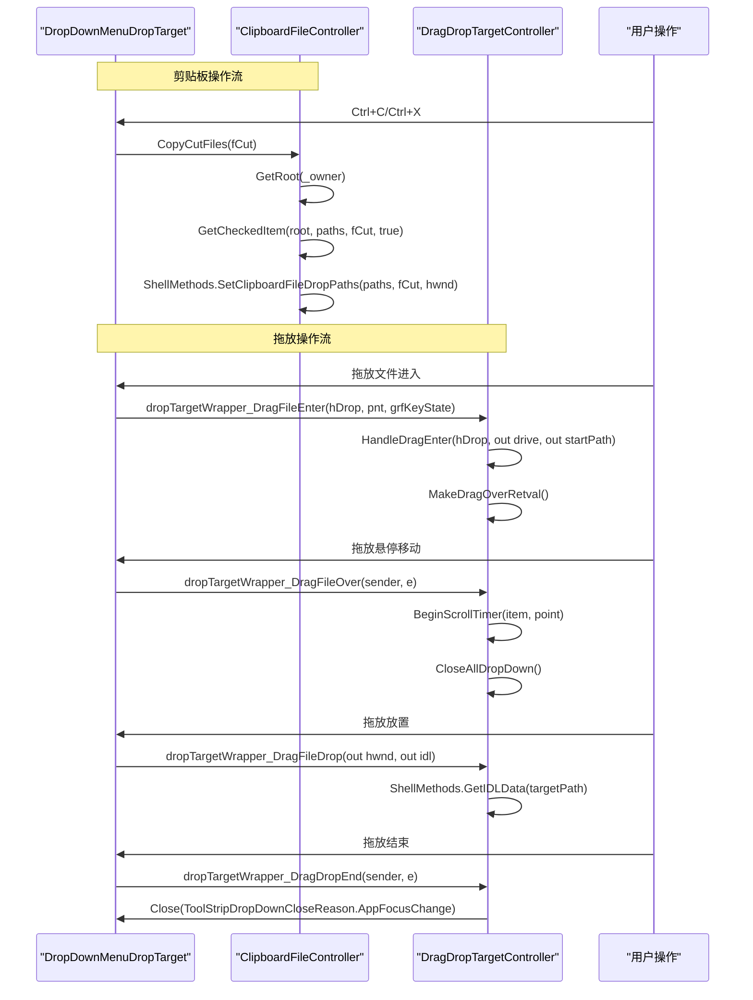

图表来源
- [DropDownMenuDropTarget.ClipboardFileController.cs:37-154](file://QTTabBar/DropDownMenuDropTarget.ClipboardFileController.cs#L37-L154)
- [DropDownMenuDropTarget.DragDropTargetController.cs:112-110](file://QTTabBar/DropDownMenuDropTarget.DragDropTargetController.cs#L112-L110)
- [DropDownMenuDropTarget.DragDropTargetController.cs:159-245](file://QTTabBar/DropDownMenuDropTarget.DragDropTargetController.cs#L159-L245)
- [DropDownMenuDropTarget.DragDropTargetController.cs:79-84](file://QTTabBar/DropDownMenuDropTarget.DragDropTargetController.cs#L79-L84)
- [DropDownMenuDropTarget.DragDropTargetController.cs:38-67](file://QTTabBar/DropDownMenuDropTarget.DragDropTargetController.cs#L38-L67)

### 测试验证
Batch 9 重构包含了完整的测试套件，确保重构的正确性和完整性：

- **ArchitectureBatch9ClipboardControllerTests**：验证 ClipboardFileController 的提取和功能完整性
- **ArchitectureBatch9DragDropTargetControllerTests**：验证 DragDropTargetController 的提取和拖放功能

测试覆盖了：
- 控制器类型的存在性和嵌套结构
- 所有者反向引用的正确性
- 方法迁移的完整性
- 委托关系的正确性
- 原始类中不再包含已迁移的方法

**章节来源**
- [DropDownMenuDropTarget.ClipboardFileController.cs:29-194](file://QTTabBar/DropDownMenuDropTarget.ClipboardFileController.cs#L29-L194)
- [DropDownMenuDropTarget.DragDropTargetController.cs:29-264](file://QTTabBar/DropDownMenuDropTarget.DragDropTargetController.cs#L29-L264)
- [ArchitectureBatch9ClipboardControllerTests.cs:1-82](file://Tests/QTTtabBarTests/ArchitectureBatch9ClipboardControllerTests.cs#L1-L82)
- [ArchitectureBatch9DragDropTargetControllerTests.cs:1-87](file://Tests/QTTtabBarTests/ArchitectureBatch9DragDropTargetControllerTests.cs#L1-L87)

## Batch 10 架构重构

### 重构概述
Batch 10 架构重构是 QTTabBar-Next 项目的重大架构升级，专注于将嵌套控制器提取为顶级类，并通过宿主接口模式彻底消除 _owner 反向引用。这次重构涉及 9 个关键组件的重构，包括 ComRegistrationController、MenuOperations、TabOperations、SubDirTipOperations、WindowMergeTarget 和 ComponentBuildController 等。

### 宿主接口模式的实施

#### IQTTabBarBandHost 接口设计
- **设计要点**：定义了 Band 控制器可以访问的所有宿主属性和方法
- **核心属性**：TabControl、BandHeight、BandSize、Explorer、Handle 等关键宿主资源
- **核心方法**：InitializeInstallation、HandleFileDrop、TryHandleShellMenuMessage 等操作接口
- **优势**：通过接口抽象，控制器无需直接依赖具体的宿主实现

#### IButtonBarHost 接口设计
- **设计要点**：定义了按钮条相关的宿主接口，支持生命周期管理和操作协调
- **核心属性**：Handle、ExplorerHandle、ToolStrip 等按钮条相关资源
- **核心方法**：OpenPath、ExecuteBindAction、RefreshItems 等操作接口
- **优势**：解耦按钮条操作与具体实现，提高可测试性

#### IDragDropHost 接口设计
- **设计要点**：定义了拖放操作的宿主接口，提供了拖放功能的抽象层
- **核心属性**：TabControl、CurrentDragDropTab 等拖放相关资源
- **核心方法**：HideDragDropToolTip、ShowDragDropToolTip、OpenDroppedFolder 等操作接口
- **优势**：统一管理拖放状态和用户反馈

### 顶级控制器重构

#### Band 控制器组重构
- **BandInfoController**：从嵌套类型提取为顶级类，通过 IQTTabBarBandHost 接口访问宿主属性
- **BandLifecycleController**：管理 Band 的生命周期事件，消除了对宿主的直接引用
- **BandWindowController**：处理 Band 窗口的消息处理和窗口管理
- **KeyboardAcceleratorController**：管理键盘快捷键和加速键的处理

#### ButtonBar 控制器组重构
- **ButtonBarLifecycleController**：专门处理按钮条的生命周期管理，支持复杂的按钮条操作
- **ButtonBarOperationalController**：处理按钮条的日常操作和用户交互

#### 输入处理控制器重构
- **DragDropController**：处理拖放操作的完整流程，通过 IDragDropHost 接口访问宿主资源
- **FolderTreeController**：管理文件夹树的操作和导航
- **HookInputController**：处理各种输入钩子和事件

### 重构收益
- **消除循环依赖**：通过宿主接口模式，彻底消除了控制器与宿主之间的循环引用
- **提高可测试性**：可以轻松创建模拟宿主进行单元测试，无需复杂的依赖注入
- **增强可维护性**：控制器职责更加清晰，代码结构更加合理
- **改善代码质量**：强制明确定义控制器所需的宿主能力，提高了代码的健壮性
- **提升扩展性**：新的控制器可以更容易地添加到系统中，不影响现有代码

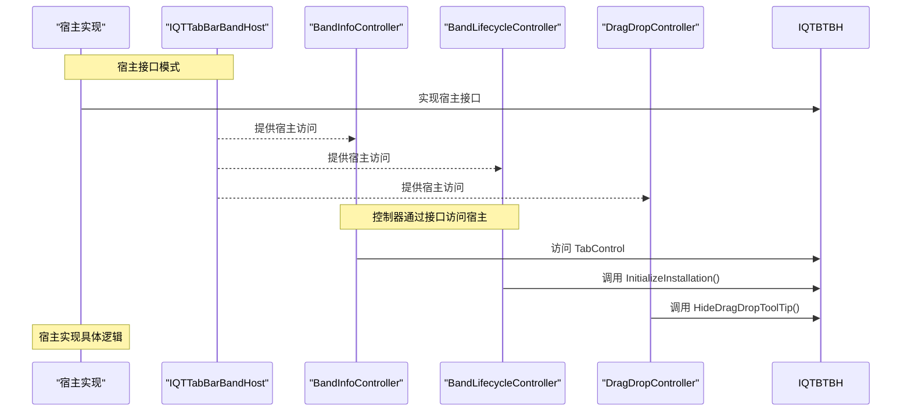

图表来源
- [IQTTabBarBandHost.cs:5-27](file://QTTabBar/Band/IQTTabBarBandHost.cs#L5-L27)
- [BandInfoController.cs:5-10](file://QTTabBar/Band/BandInfoController.cs#L5-L10)
- [BandLifecycleController.cs:6-11](file://QTTabBar/Band/BandLifecycleController.cs#L6-L11)
- [DragDropController.cs:10-17](file://QTTabBar/Input/DragDropController.cs#L10-L17)

### 测试验证
Batch 10 重构包含了完整的测试套件，确保重构的正确性和完整性：

- **ArchitectureBatch10EncodingDetectorTests**：验证编码检测器的重构和接口模式
- **ArchitectureBatch10TextFileLoaderTests**：验证文本文件加载器的重构
- **ArchitectureBatch10ThumbnailImageLoaderTests**：验证缩略图图像加载器的重构
- **ArchitectureBatch1C1Tests** 至 **ArchitectureBatch1C5Tests**：验证各个重构阶段的正确性

测试覆盖了：
- 宿主接口的正确实现
- 控制器与宿主之间的解耦程度
- 反向引用的完全消除
- 接口方法的完整迁移
- 重构后功能的完整性

**章节来源**
- [IQTTabBarBandHost.cs:5-27](file://QTTabBar/Band/IQTTabBarBandHost.cs#L5-L27)
- [BandInfoController.cs:5-10](file://QTTabBar/Band/BandInfoController.cs#L5-L10)
- [BandLifecycleController.cs:6-11](file://QTTabBar/Band/BandLifecycleController.cs#L6-L11)
- [ButtonBarLifecycleController.cs:12-16](file://QTTabBar/ButtonBarLifecycleController.cs#L12-L16)
- [DragDropController.cs:10-17](file://QTTabBar/Input/DragDropController.cs#L10-L17)

## 架构总览
整体采用"分层 + 插件 + 事件驱动 + 控制器模式 + 宿主接口模式"的混合架构：
- 表现层：基于 WinForms/WPF 控件的标签栏 UI，嵌入 Explorer Rebar。
- 业务层：由 QTTabBarClass 协调多个控制器模块（导航、拖放、输入、菜单、窗口管理等）。
- 基础设施层：COM 互操作、Shell 集成、IPC、钩子、配置、资源缓存。
- 插件层：通过 IPluginClient 契约与 PluginServer 事件总线进行松耦合扩展。
- 宿主接口层：通过宿主接口模式解耦控制器与宿主，消除反向引用。

```mermaid
classDiagram
class BandObject {
+GetBandInfo(...)
+SetSite(pUnkSite)
+ShowDW(fShow)
+CloseDW(dwReserved)
+OnExplorerAttached()
}
class TabBarBase {
+ComputeBandHeight(...)
+ResolveDpiScale(...)
+SyncTravelState()
}
class QTTabBarClass {
+InitializeInstallation()
+OnExplorerAttached()
+WndProc(ref Message)
+OpenGroup(...)
+CloneCurrentTab(...)
}
class InitializationOrchestrator {
+Initialize()
+ResetForInitRetry()
}
class PluginManager {
+Initialize()
+LoadAssembly(path)
+ValidatePluginSource(path, trustedDirs)
+RefreshPlugins()
}
class PluginServer {
+OnNavigationComplete(...)
+OnSelectionChanged(...)
+OnSettingsChanged(...)
+RegisterMenu(...)
}
class InstanceManager {
+Initialize(skipServer)
+StaticBroadcast(action)
+ExecuteOnMainProcess(...)
}
class HookLibManager {
+Initialize()
+InitShellBrowserHook(shellBrowser)
+ResolveHookLibraryPath(fileName)
}
class ExplorerManager {
+GetWatermarkImage(key)
+ClearWatermarkCache()
}
class IQTTabBarBandHost {
<<interface>>
+TabControl : QTabControl
+BandHeight : int
+Explorer : WebBrowser
+InitializeInstallation()
}
class IButtonBarHost {
<<interface>>
+Handle : IntPtr
+ExplorerHandle : IntPtr
+ToolStrip : ToolStrip
+OpenPath(string, bool)
}
class IDragDropHost {
<<interface>>
+TabControl : QTabControl
+CurrentDragDropTab : QTabItem
+HideDragDropToolTip()
+ShowDragDropToolTip(QTabItem, int, int)
}
class BandInfoController {
-_host : IQTTabBarBandHost
+GetBandInfo(uint, uint, ref DESKBANDINFO)
}
class BandLifecycleController {
-_host : IQTTabBarBandHost
+ShowDW(bool)
+UIActivateIO(int, ref MSG)
}
class DragDropController {
-_host : IDragDropHost
+DragFileEnter(IntPtr, Point, int)
+DragFileOver(object, DragEventArgs)
}
class ButtonBarLifecycleController {
-_host : IButtonBarLifecycleHost
+GetBandInfo(ref DESKBANDINFO)
+InitializeComponents()
}
class WatermarkRenderer {
+_owner : ExtendedListViewCommon
+RenderWatermark()
}
class ListViewHoverController {
+_owner : ExtendedListViewCommon
+HandleHover()
}
class ListViewMessageController {
+_owner : ExtendedListViewCommon
+ProcessMessages()
}
class ShellMenuGenerator {
+_owner : SubDirTipForm
+GenerateContextMenu()
}
class ThumbnailController {
+_owner : SubDirTipForm
+LoadThumbnail()
}
class ScrollController {
+_owner : DropDownMenuReorderable
+GetScrollButtons()
}
class VirtualItemsController {
+_owner : DropDownMenuReorderable
+HandleArrowKeyVirtual()
}
class ClipboardFileController {
+_owner : DropDownMenuDropTarget
+CopyCutFiles()
}
class DragDropTargetController {
+_owner : DropDownMenuDropTarget
+dropTargetWrapper_DragFileEnter()
}
class InstanceBootstrapController {
+EnsureStaticFieldsInitialized()
}
class NativeWindowController {
+WndProc()
}
class IPluginClient {
<<interface>>
+Open(pluginServer, shellBrowser)
+Close(endCode)
+OnMenuItemClick(...)
+QueryShortcutKeys(...)
}
BandObject <|-- TabBarBase
TabBarBase <|-- QTTabBarClass
QTTabBarClass --> InitializationOrchestrator : "触发初始化"
QTTabBarClass --> PluginManager : "加载/刷新插件"
QTTabBarClass --> PluginServer : "事件总线"
QTTabBarClass --> InstanceManager : "跨实例通信"
QTTabBarClass --> HookLibManager : "钩子桥接"
QTTabBarClass --> BandInfoController : "委托处理"
QTTabBarClass --> BandLifecycleController : "委托处理"
QTTabBarClass --> DragDropController : "委托处理"
QTTabBarClass --> ButtonBarLifecycleController : "委托处理"
QTTabBarClass --> WatermarkRenderer : "水印渲染"
QTTabBarClass --> ListViewHoverController : "悬停处理"
QTTabBarClass --> ListViewMessageController : "消息处理"
QTTabBarClass --> ShellMenuGenerator : "菜单生成"
QTTabBarClass --> ThumbnailController : "缩略图管理"
QTTabBarClass --> InstanceBootstrapController : "实例引导"
QTTabBarClass --> NativeWindowController : "窗口消息"
BandInfoController ..|> IQTTabBarBandHost : "使用接口"
BandLifecycleController ..|> IQTTabBarBandHost : "使用接口"
DragDropController ..|> IDragDropHost : "使用接口"
ButtonBarLifecycleController ..|> IButtonBarLifecycleHost : "使用接口"
PluginManager --> IPluginClient : "实例化/调用"
PluginServer --> IPluginClient : "事件通知"
QTTabBarClass --> ExplorerManager : "使用缓存"
```

图表来源
- [BandObject.cs:35-43](file://BandObjectLib/BandObject.cs#L35-L43)
- [QTTabBarClass.cs:57-88](file://QTTabBar/QTTabBarClass.cs#L57-L88)
- [InitializationOrchestrator.cs:35-113](file://QTTabBar/InitializationOrchestrator.cs#L35-L113)
- [PluginManager.cs:31-74](file://QTTabBar/PluginManager.cs#L31-L74)
- [PluginServer.cs:30-64](file://QTTabBar/PluginServer.cs#L30-L64)
- [InstanceManager.cs:465-522](file://QTTabBar/InstanceManager.cs#L465-L522)
- [HookLibManager.cs:145-264](file://QTTabBar/HookLibManager.cs#L145-L264)
- [ExplorerManager.cs:8-20](file://QTTabBar/ExplorerManager.cs#L8-L20)
- [IPluginClient.cs:21-30](file://QTPluginLib/IPluginClient.cs#L21-L30)
- [IQTTabBarBandHost.cs:5-27](file://QTTabBar/Band/IQTTabBarBandHost.cs#L5-L27)
- [BandInfoController.cs:5-10](file://QTTabBar/Band/BandInfoController.cs#L5-L10)
- [BandLifecycleController.cs:6-11](file://QTTabBar/Band/BandLifecycleController.cs#L6-L11)
- [DragDropController.cs:10-17](file://QTTabBar/Input/DragDropController.cs#L10-L17)
- [ButtonBarLifecycleController.cs:12-16](file://QTTabBar/ButtonBarLifecycleController.cs#L12-L16)

## 详细组件分析

### 组件一：BandObject（Shell 扩展基类）
- 设计要点
  - 实现一系列 COM 接口，使 .NET UserControl 可作为 DeskBand 嵌入 Explorer。
  - SetSite 中通过 IServiceProvider.QueryService 获取宿主浏览器对象，随后触发 OnExplorerAttached 回调。
  - ShowDW/CloseDW 管理可见性与资源释放；GetBandInfo 响应尺寸与样式请求。
- 关键流程
  - 宿主绑定 → 查询服务 → 保存站点 → 触发附加回调 → 子类接管后续初始化。

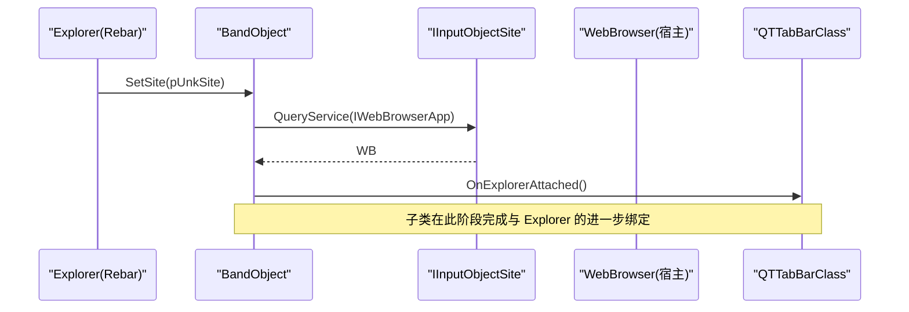

图表来源
- [BandObject.cs:429-484](file://BandObjectLib/BandObject.cs#L429-L484)
- [BandObject.cs:394-404](file://BandObjectLib/BandObject.cs#L394-L404)

章节来源
- [BandObject.cs:35-43](file://BandObjectLib/BandObject.cs#L35-L43)
- [BandObject.cs:429-484](file://BandObjectLib/BandObject.cs#L429-L484)

### 组件二：QTTabBarClass（主入口点）
- 设计要点
  - 继承自 TabBarBase，组合多个控制器模块（导航、拖放、输入、菜单、窗口管理等），形成门面式入口。
  - 通过 ComRegisterFunction/UnregisterFunction 完成 COM 注册/注销。
  - WndProc 统一拦截消息，交由 BandWindowController 处理，必要时再分发给基类。
- 关键流程
  - 构造器 → 初始化环境 → 构建组件 → 注册 COM → 接收宿主回调 → 分发消息。

图表来源
- [QTTabBarClass.cs:239-247](file://QTTabBar/QTTabBarClass.cs#L239-L247)
- [QTTabBarClass.cs:506-514](file://QTTabBar/QTTabBarClass.cs#L506-L514)
- [QTTabBarClass.cs:598-619](file://QTTabBar/QTTabBarClass.cs#L598-L619)
- [QTTabBarClass.cs:729-739](file://QTTabBar/QTTabBarClass.cs#L729-L739)

章节来源
- [QTTabBarClass.cs:57-88](file://QTTabBar/QTTabBarClass.cs#L57-L88)
- [QTTabBarClass.cs:598-619](file://QTTabBar/QTTabBarClass.cs#L598-L619)
- [QTTabBarClass.cs:729-739](file://QTTabBar/QTTabBarClass.cs#L729-L739)

### 组件三：InitializationOrchestrator（初始化编排器）
- 设计要点
  - 统一入口，避免多处重复初始化；幂等保护（双检锁）；异常后支持重试。
  - 顺序：Shell 状态 → 配置 → 实例管理 → API Hook → 全局图像列表 → 分组/应用 → 语言/主题 → 最近文件/锁定标签 → 插件。
- 关键流程
  - Initialize → 检查已初始化 → 加锁 → 依次初始化子系统 → 标记完成或异常回滚。

图表来源
- [InitializationOrchestrator.cs:35-113](file://QTTabBar/InitializationOrchestrator.cs#L35-L113)

章节来源
- [InitializationOrchestrator.cs:35-113](file://QTTabBar/InitializationOrchestrator.cs#L35-L113)

### 组件四：ExplorerManager（资源管理器集成）
- 设计要点
  - 针对 Explorer 列表视图的水印图片进行缓存，降低重复解码成本。
  - 提供 ClearWatermarkCache 清理接口，便于内存压力场景下主动回收。
- 使用方式
  - 在需要渲染水印时通过 GetWatermarkImage(key) 获取 Bitmap；在配置或主题切换后调用 ClearWatermarkCache。

章节来源
- [ExplorerManager.cs:8-20](file://QTTabBar/ExplorerManager.cs#L8-L20)

### 组件五：PluginManager（插件管理器）
- 设计要点
  - 从注册表读取插件路径，加载程序集并枚举 IPluginClient 实现；根据配置启用静态实例。
  - 来源与签名校验：受信任目录优先；Authenticode/强名称校验；BlockUntrustedPlugins 可阻断未受信任插件。
  - 刷新机制：对比磁盘时间戳，卸载不再存在的程序集，重新加载启用的插件。
- 关键流程
  - Initialize → 读取路径 → 加载程序集 → 校验来源/签名 → 创建静态实例 → 注册编码检测器等。

图表来源
- [PluginManager.cs:63-74](file://QTTabBar/PluginManager.cs#L63-L74)
- [PluginManager.cs:136-155](file://QTTabBar/PluginManager.cs#L136-L155)
- [PluginManager.cs:311-340](file://QTTabBar/PluginManager.cs#L311-L340)

章节来源
- [PluginManager.cs:31-74](file://QTTabBar/PluginManager.cs#L31-L74)
- [PluginManager.cs:136-155](file://QTTabBar/PluginManager.cs#L136-L155)
- [PluginManager.cs:311-340](file://QTTabBar/PluginManager.cs#L311-L340)

### 组件六：InstanceManager（跨实例 IPC）
- 设计要点
  - 基于 WCF 命名管道建立同用户安全通信；服务端在同一桌面进程运行，客户端在其他 Explorer 实例中连接。
  - SameUserAuthorizationManager 统一授权，仅允许相同 Windows SID 的调用者。
  - 提供广播、选择标签、托盘图标同步、主进程命令执行等能力。
- 关键流程
  - Initialize → 判断是否为服务器进程 → 打开 ServiceHost/客户端通道 → 订阅并推送实例句柄。

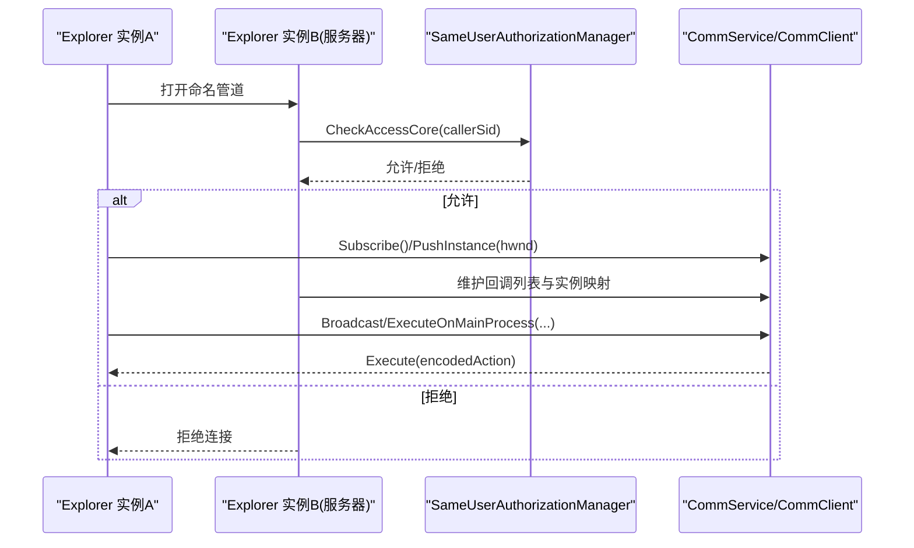

图表来源
- [InstanceManager.cs:465-522](file://QTTabBar/InstanceManager.cs#L465-L522)
- [InstanceManager.cs:372-391](file://QTTabBar/InstanceManager.cs#L372-L391)

章节来源
- [InstanceManager.cs:465-522](file://QTTabBar/InstanceManager.cs#L465-L522)
- [InstanceManager.cs:372-391](file://QTTabBar/InstanceManager.cs#L372-L391)

### 组件七：HookLibManager（钩子管理器）
- 设计要点
  - 加载 QTHookLib.dll，调用 Initialize/InitShellBrowserHook 等原生函数；将新窗口创建等事件回调到托管层。
  - 受信任路径解析：优先从程序集所在目录加载，否则回退至 CommonApplicationData\QTTabBar 并记录告警；可通过配置阻断旧路径。
- 关键流程
  - Initialize → 检查配置/OS → 解析受信任路径 → LoadLibrary → 获取函数指针 → 调用原生 Initialize → 成功则标记 Loaded。

图表来源
- [HookLibManager.cs:145-264](file://QTTabBar/HookLibManager.cs#L145-L264)
- [HookLibManager.cs:375-429](file://QTTabBar/HookLibManager.cs#L375-L429)

章节来源
- [HookLibManager.cs:145-264](file://QTTabBar/HookLibManager.cs#L145-L264)
- [HookLibManager.cs:375-429](file://QTTabBar/HookLibManager.cs#L375-L429)

### 组件八：PluginServer（插件事件总线）
- 设计要点
  - 向插件暴露事件（导航完成、选择变化、设置变更、鼠标进入/离开等）；提供菜单注册、组管理、过滤器等能力。
  - 通过 IPluginServer 接口与 IPluginClient 约定交互。
- 关键流程
  - 构造时加载语言资源与启动插件；当宿主状态变化时触发对应事件。

章节来源
- [PluginServer.cs:30-64](file://QTTabBar/PluginServer.cs#L30-L64)
- [IPluginClient.cs:21-30](file://QTPluginLib/IPluginClient.cs#L21-L30)

### 组件九：Band 控制器组重构
- 设计要点
  - 通过 Batch 10 重构，将 Band 相关的功能分解为多个专用控制器，每个控制器通过宿主接口访问共享资源。
  - BandInfoController：处理 Band 信息的获取和管理
  - BandLifecycleController：管理 Band 的生命周期事件
  - BandWindowController：处理 Band 窗口的消息处理
  - KeyboardAcceleratorController：管理键盘快捷键
- 关键流程
  - 构造函数中通过宿主接口初始化 → 委托相应的功能到控制器 → 保持向后兼容的公共接口

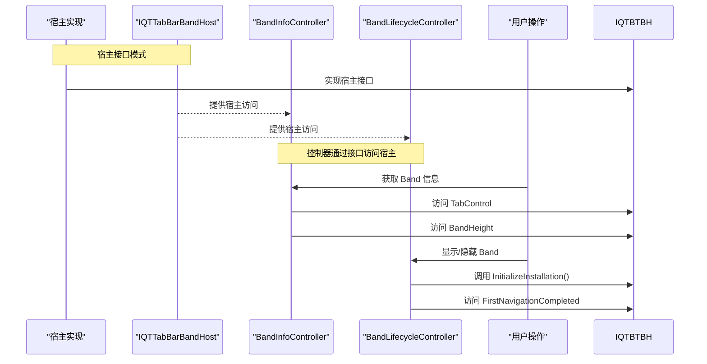

图表来源
- [IQTTabBarBandHost.cs:5-27](file://QTTabBar/Band/IQTTabBarBandHost.cs#L5-L27)
- [BandInfoController.cs:5-10](file://QTTabBar/Band/BandInfoController.cs#L5-L10)
- [BandLifecycleController.cs:6-11](file://QTTabBar/Band/BandLifecycleController.cs#L6-L11)

章节来源
- [IQTTabBarBandHost.cs:5-27](file://QTTabBar/Band/IQTTabBarBandHost.cs#L5-L27)
- [BandInfoController.cs:5-10](file://QTTabBar/Band/BandInfoController.cs#L5-L10)
- [BandLifecycleController.cs:6-11](file://QTTabBar/Band/BandLifecycleController.cs#L6-L11)

### 组件十：ButtonBar 控制器重构
- 设计要点
  - 通过 Batch 10 重构，将按钮条相关的功能分解为专用控制器，通过宿主接口模式解耦。
  - ButtonBarLifecycleController：处理按钮条的生命周期管理
  - ButtonBarOperationalController：处理按钮条的日常操作
- 关键流程
  - 构造函数中通过宿主接口初始化 → 委托相应的功能到控制器 → 保持向后兼容的公共接口

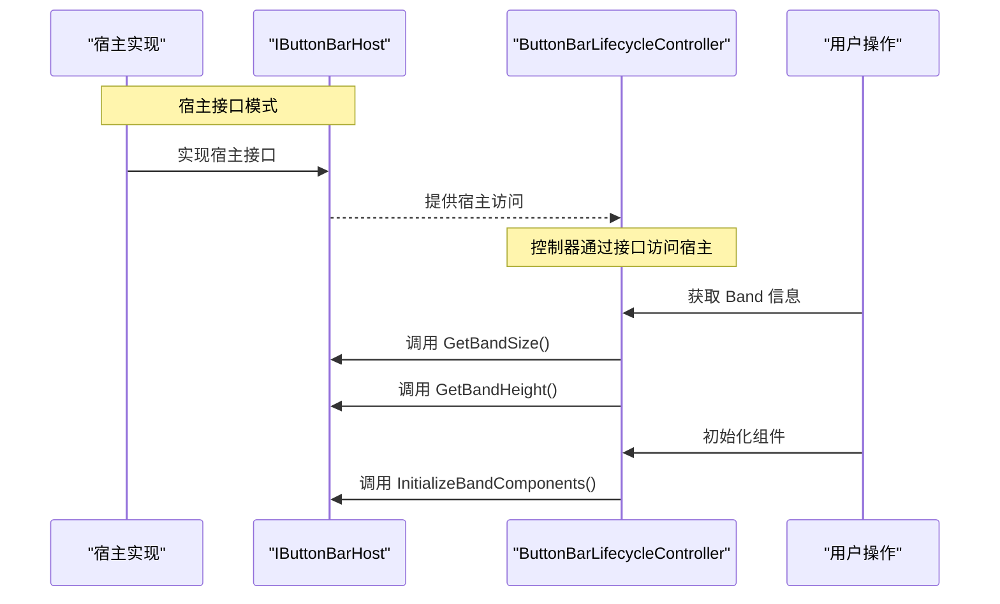

图表来源
- [ButtonBarLifecycleController.cs:12-16](file://QTTabBar/ButtonBarLifecycleController.cs#L12-L16)

章节来源
- [ButtonBarLifecycleController.cs:12-16](file://QTTabBar/ButtonBarLifecycleController.cs#L12-L16)

### 组件十一：DragDrop 控制器重构
- 设计要点
  - 通过 Batch 10 重构，将拖放操作的功能分解为专用控制器，通过宿主接口模式解耦。
  - DragDropController：处理拖放操作的完整流程
- 关键流程
  - 构造函数中通过宿主接口初始化 → 委托相应的功能到控制器 → 保持向后兼容的公共接口

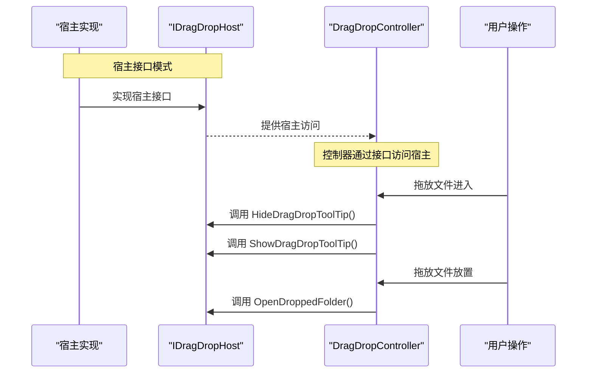

图表来源
- [DragDropController.cs:10-17](file://QTTabBar/Input/DragDropController.cs#L10-L17)

章节来源
- [DragDropController.cs:10-17](file://QTTabBar/Input/DragDropController.cs#L10-L17)

## 依赖关系分析
- 组件耦合与内聚
  - QTTabBarClass 作为门面聚合多个控制器，保持高内聚低耦合；通过事件总线与插件解耦。
  - 初始化编排器集中管理依赖顺序，降低循环依赖风险。
  - 控制器模式增强了代码的模块化程度，每个控制器专注于特定功能领域。
  - 宿主接口模式彻底消除了控制器与宿主之间的循环依赖，提高了架构的清晰度。
  - Batch 9 和 Batch 10 重构进一步提升了代码的组织性和可维护性。
- 外部依赖与集成
  - COM 接口：IDeskBand/IDockingWindow/IObjectWithSite 等，用于与 Explorer 集成。
  - WCF 命名管道：跨实例 IPC，需同用户权限。
  - 原生钩子：MinHook + QTHookLib.dll，用于捕获 Explorer 行为。
- 潜在循环依赖
  - 通过事件与接口抽象避免直接循环引用；例如 PluginServer 仅依赖 IPluginClient 接口。
  - 控制器之间通过松耦合的接口进行通信，避免紧耦合。
  - 宿主接口模式消除了控制器持有宿主反向引用的问题，彻底解决了循环依赖。

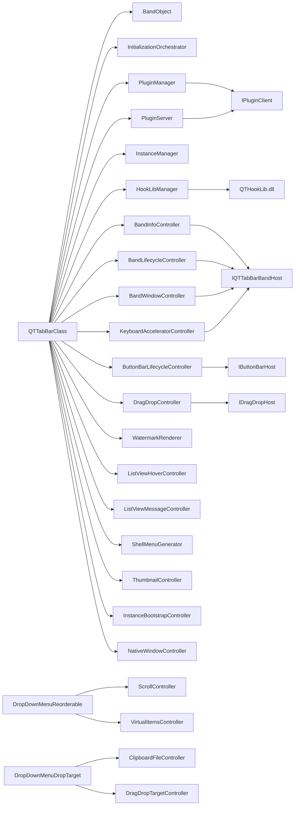

图表来源
- [QTTabBarClass.cs:57-88](file://QTTabBar/QTTabBarClass.cs#L57-L88)
- [BandObject.cs:35-43](file://BandObjectLib/BandObject.cs#L35-L43)
- [InitializationOrchestrator.cs:35-113](file://QTTabBar/InitializationOrchestrator.cs#L35-L113)
- [PluginManager.cs:31-74](file://QTTabBar/PluginManager.cs#L31-L74)
- [PluginServer.cs:30-64](file://QTTabBar/PluginServer.cs#L30-L64)
- [InstanceManager.cs:465-522](file://QTTabBar/InstanceManager.cs#L465-L522)
- [HookLibManager.cs:145-264](file://QTTabBar/HookLibManager.cs#L145-L264)
- [IPluginClient.cs:21-30](file://QTPluginLib/IPluginClient.cs#L21-L30)
- [IQTTabBarBandHost.cs:5-27](file://QTTabBar/Band/IQTTabBarBandHost.cs#L5-L27)
- [BandInfoController.cs:5-10](file://QTTabBar/Band/BandInfoController.cs#L5-L10)
- [BandLifecycleController.cs:6-11](file://QTTabBar/Band/BandLifecycleController.cs#L6-L11)
- [ButtonBarLifecycleController.cs:12-16](file://QTTabBar/ButtonBarLifecycleController.cs#L12-L16)
- [DragDropController.cs:10-17](file://QTTabBar/Input/DragDropController.cs#L10-L17)

章节来源
- [QTTabBarClass.cs:57-88](file://QTTabBar/QTTabBarClass.cs#L57-L88)
- [BandObject.cs:35-43](file://BandObjectLib/BandObject.cs#L35-L43)
- [InitializationOrchestrator.cs:35-113](file://QTTabBar/InitializationOrchestrator.cs#L35-L113)
- [PluginManager.cs:31-74](file://QTTabBar/PluginManager.cs#L31-L74)
- [PluginServer.cs:30-64](file://QTTabBar/PluginServer.cs#L30-L64)
- [InstanceManager.cs:465-522](file://QTTabBar/InstanceManager.cs#L465-L522)
- [HookLibManager.cs:145-264](file://QTTabBar/HookLibManager.cs#L145-L264)
- [IPluginClient.cs:21-30](file://QTPluginLib/IPluginClient.cs#L21-L30)
- [IQTTabBarBandHost.cs:5-27](file://QTTabBar/Band/IQTTabBarBandHost.cs#L5-L27)
- [BandInfoController.cs:5-10](file://QTTabBar/Band/BandInfoController.cs#L5-L10)
- [BandLifecycleController.cs:6-11](file://QTTabBar/Band/BandLifecycleController.cs#L6-L11)
- [ButtonBarLifecycleController.cs:12-16](file://QTTabBar/ButtonBarLifecycleController.cs#L12-L16)
- [DragDropController.cs:10-17](file://QTTabBar/Input/DragDropController.cs#L10-L17)

## 性能考虑
- DPI 与布局
  - 通过 ComputeBandHeight/ResolveDpiScale 计算物理高度与缩放比例，避免在高 DPI 下标题被裁剪或高度异常。
- 资源缓存
  - 全局 ImageList 与水印图片缓存减少重复解码与绘制开销。
  - ThumbnailController 提供智能的缩略图缓存管理，优化内存使用。
  - VirtualItemsController 使用栈结构管理虚拟项，显著提升大数据量场景下的性能。
- 初始化顺序
  - 编排器顺序优化，避免阻塞 Explorer 启动；失败快速降级。
- IPC 与钩子
  - 命名管道传输大小限制合理；钩子加载失败不影响主流程。
- 控制器优化
  - 专用控制器实现异步处理和懒加载，提升响应性能。
  - 消息批处理和去抖动机制减少不必要的重绘。
  - 控制器分解减少了主类的复杂性，提高了代码的执行效率。
  - Batch 9 和 Batch 10 重构进一步优化了拖放和剪贴板操作的响应速度。
  - 宿主接口模式减少了对象创建的开销，提高了内存使用效率。

## 故障排查指南
- 常见问题定位
  - 插件加载失败：查看 PluginManager 的日志输出与 BlockUntrustedPlugins 配置；确认插件位于受信任目录或具备有效签名。
  - 钩子未生效：检查 HookLibManager 的日志与 ResolveHookLibraryPath 的回退策略；确认 AutoHookWindow 配置与 QTHookLib.dll 存在。
  - 跨实例通信异常：检查 SameUserAuthorizationManager 的授权结果与命名管道地址；确认调用方与被调用方处于同一用户上下文。
  - 配置读取失败：使用 Config.SafeGetRegistryValue 的安全路径，关注 UnauthorizedAccessException 与缺失键值的降级处理。
  - 控制器异常：检查各个控制器的初始化日志和错误处理机制。
  - 宿主接口问题：检查宿主接口的实现是否正确，确认接口方法的调用是否正常。
  - 循环依赖问题：检查是否存在意外的对象引用，确认宿主接口模式是否正确实施。
  - 滚动功能异常：检查 ScrollController 的滚动按钮获取和 ScrollMenuCore 方法的执行情况。
  - 虚拟项问题：检查 VirtualItemsController 的栈操作和内存管理逻辑。
  - 剪贴板操作异常：检查 ClipboardFileController 的文件路径处理和剪贴板访问权限。
  - 拖放操作异常：检查 DragDropTargetController 的状态管理和拖放效果计算。
- 日志位置
  - 异常日志：%AppData%\QTTabBar\QTTabBarException.log
  - 插件与钩子相关日志：见各组件中的 MakeErrorLog 调用点。
  - 控制器调试日志：各控制器内部的详细日志输出。
  - 宿主接口调试日志：宿主接口调用的详细日志记录。
  - 滚动控制器日志：ScrollController 中的错误日志记录。
  - 虚拟项控制器日志：VirtualItemsController 中的异常处理日志。
  - 剪贴板控制器日志：ClipboardFileController 中的文件操作日志。
  - 拖放控制器日志：DragDropTargetController 中的拖放状态日志。

章节来源
- [PluginManager.cs:311-340](file://QTTabBar/PluginManager.cs#L311-L340)
- [HookLibManager.cs:145-264](file://QTTabBar/HookLibManager.cs#L145-L264)
- [InstanceManager.cs:372-391](file://QTTabBar/InstanceManager.cs#L372-L391)
- [Config.cs:65-85](file://QTTabBar/Config.cs#L65-L85)
- [README.md:23-24](file://README.md#L23-L24)
- [DropDownMenuReorderable.ScrollController.cs:47-49](file://QTTabBar/DropDownMenuReorderable.ScrollController.cs#L47-L49)
- [DropDownMenuReorderable.VirtualItemsController.cs:153-164](file://QTTabBar/DropDownMenuReorderable.VirtualItemsController.cs#L153-L164)
- [DropDownMenuDropTarget.ClipboardFileController.cs:79-80](file://QTTabBar/DropDownMenuDropTarget.ClipboardFileController.cs#L79-L80)
- [DropDownMenuDropTarget.DragDropTargetController.cs:80-81](file://QTTabBar/DropDownMenuDropTarget.DragDropTargetController.cs#L80-L81)

## 结论
QTTabBar-Next 通过分层架构、插件模式、事件驱动设计和控制器架构模式，实现了与 Explorer 的深度集成与可扩展性。COM 接口确保了与 Shell 的稳定交互，插件架构提供了灵活的功能扩展，事件总线降低了模块间耦合。新增的控制器架构模式进一步提升了代码的模块化程度和可维护性，每个控制器专注于单一职责，遵循了单一职责原则。

特别是 Batch 9 和 Batch 10 架构重构的重大成果，通过从 DropDownMenuDropTarget 类中提取 DragDropTargetController 和 ClipboardFileController 两个专业化控制器，以及将 9 个嵌套类型提取为顶级类并通过宿主接口模式消除 _owner 反向引用，显著提升了代码的组织性和可维护性。这些重构不仅实现了功能的完全解耦，还提供了更好的测试支持和扩展能力。之前的控制器分解工作，包括 DropDownMenuReorderable 的 ScrollController 和 VirtualItemsController，以及各类专用控制器（WatermarkRenderer、ListViewHoverController 等），共同构建了完善的控制器架构体系。

安全性方面，插件来源与签名校验、IPC 同用户授权、受信任路径解析共同构建了多层防护。测试基础设施的增强，特别是 Batch 9 和 Batch 10 架构验证测试套件，确保了架构变更的正确性和稳定性。宿主接口模式的引入彻底解决了循环依赖问题，为未来的架构演进奠定了坚实的基础。未来可在 IPC 层面逐步迁移到更安全的 typed command 模型，进一步提升鲁棒性与可维护性。

## 附录
- 技术栈与兼容性
  - .NET Framework 4.8（要求）
  - WCF 命名管道（跨实例 IPC）
  - MinHook + QTHookLib.dll（原生钩子）
  - WiX Toolset v3.11（可选，安装包构建）
- 版本与平台
  - Windows 7/10/11 兼容；Windows Server 环境下钩子功能可能受限（依据配置与 OS 检测）。
- 参考
  - README 中的构建与使用说明。

章节来源
- [README.md:18-47](file://README.md#L18-L47)