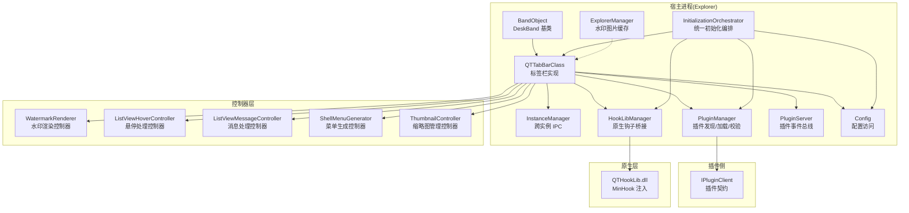
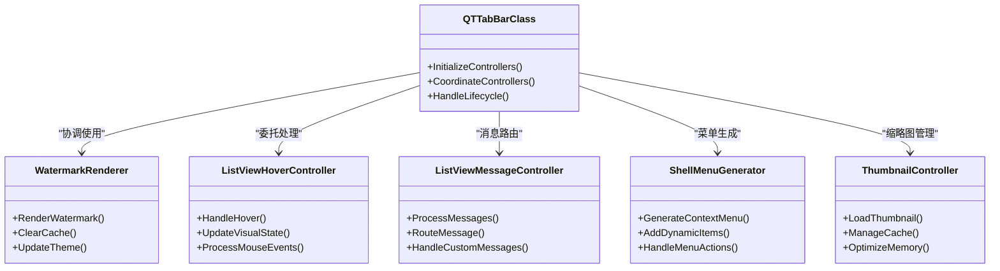
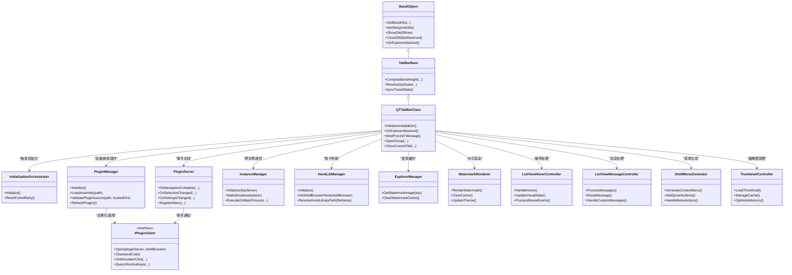
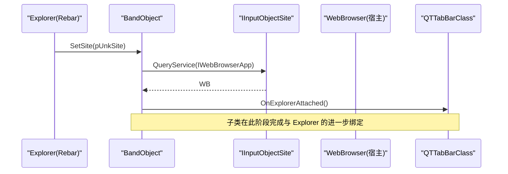
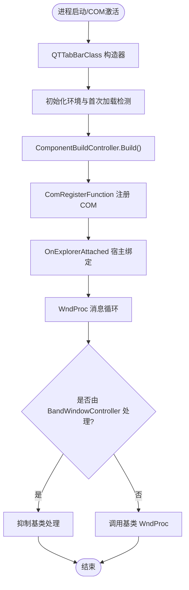
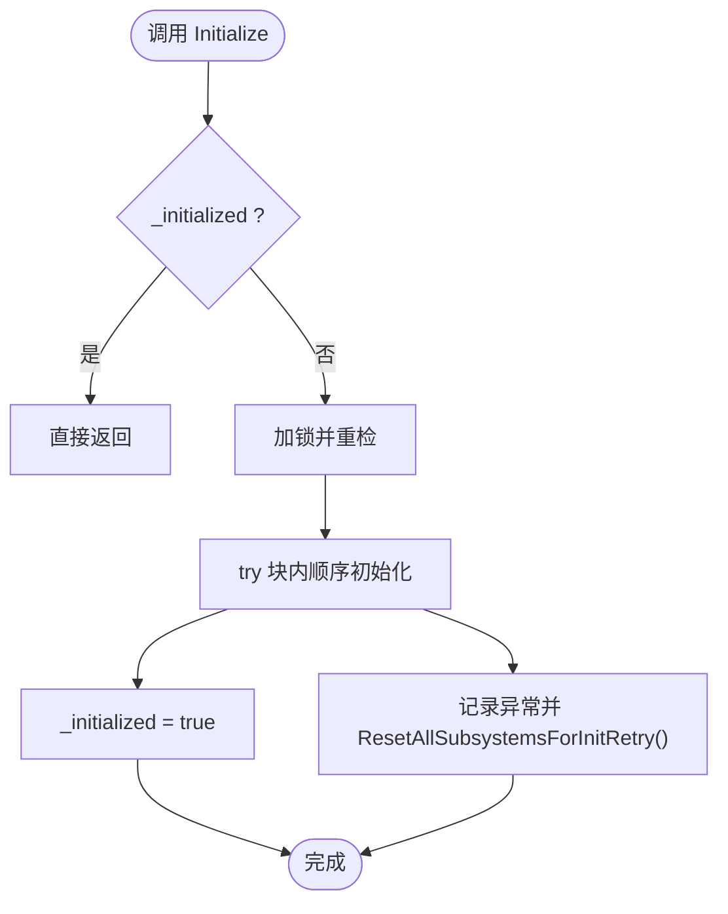
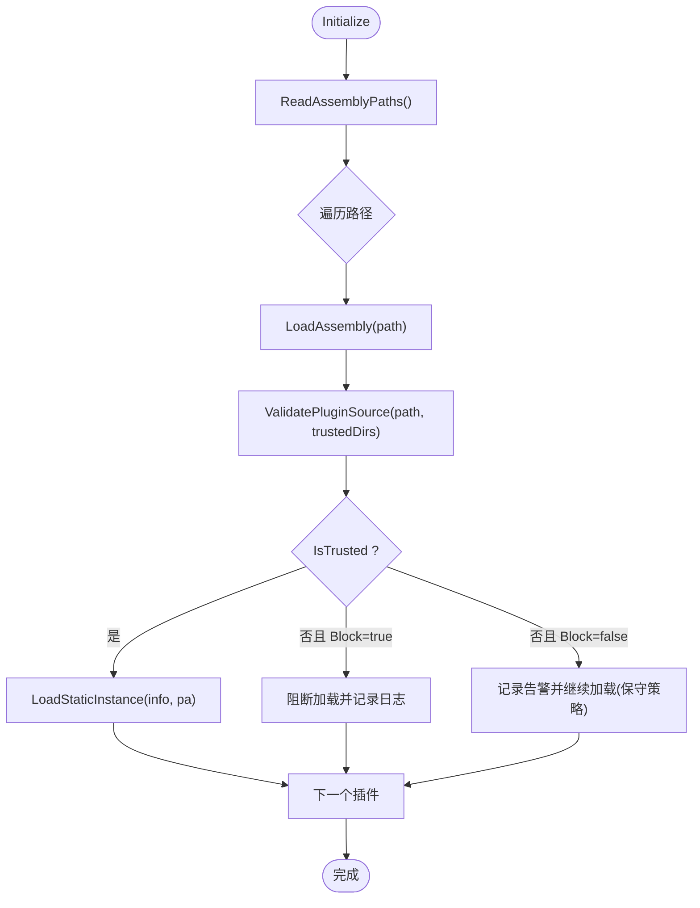
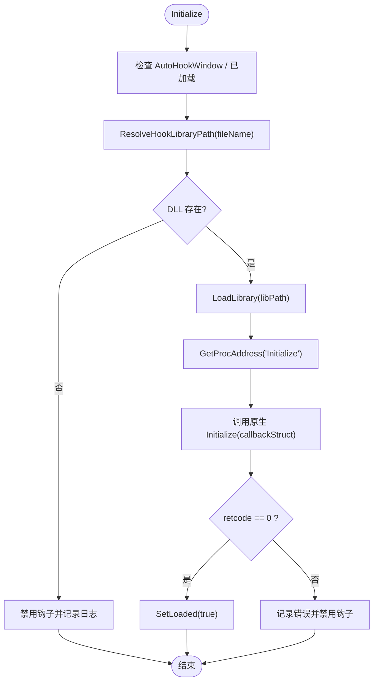
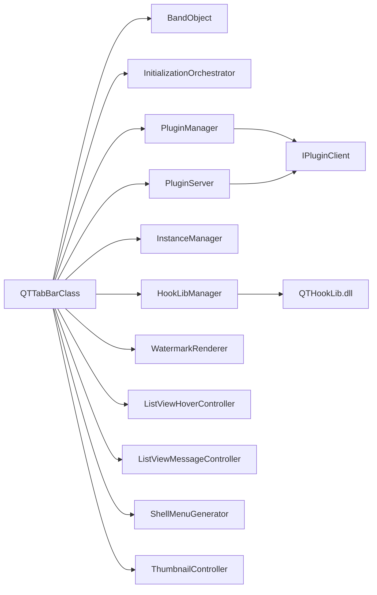

# 架构设计

<cite>
**本文引用的文件**   
- [QTTabBarClass.cs](file://QTTabBar/QTTabBarClass.cs)
- [BandObject.cs](file://BandObjectLib/BandObject.cs)
- [InitializationOrchestrator.cs](file://QTTabBar/InitializationOrchestrator.cs)
- [ExplorerManager.cs](file://QTTabBar/ExplorerManager.cs)
- [PluginManager.cs](file://QTTabBar/PluginManager.cs)
- [Config.cs](file://QTTabBar/Config.cs)
- [InstanceManager.cs](file://QTTabBar/InstanceManager.cs)
- [HookLibManager.cs](file://QTTabBar/HookLibManager.cs)
- [IPluginClient.cs](file://QTPluginLib/IPluginClient.cs)
- [PluginServer.cs](file://QTTabBar/PluginServer.cs)
- [ExtendedListViewCommon.WatermarkRenderer.cs](file://QTTabBar/ExtendedListViewCommon.WatermarkRenderer.cs)
- [ExtendedListViewCommon.ListViewHoverController.cs](file://QTTabBar/ExtendedListViewCommon.ListViewHoverController.cs)
- [ExtendedListViewCommon.ListViewMessageController.cs](file://QTTabBar/ExtendedListViewCommon.ListViewMessageController.cs)
- [SubDirTipForm.ShellMenuGenerator.cs](file://QTTabBar/SubDirTipForm.ShellMenuGenerator.cs)
- [SubDirTipForm.ThumbnailController.cs](file://QTTabBar/SubDirTipForm.ThumbnailController.cs)
- [README.md](file://README.md)
</cite>

## 更新摘要
**所做更改**   
- 新增控制器架构模式章节，详细说明专业化控制器的职责分离
- 更新核心组件分析，增加 WatermarkRenderer、ListViewHoverController、ListViewMessageController、ShellMenuGenerator、ThumbnailController 等专用控制器
- 增强架构图表以反映新的控制器分层结构
- 更新依赖关系分析以体现改进的代码模块化

## 目录
1. [引言](#引言)
2. [项目结构](#项目结构)
3. [核心组件](#核心组件)
4. [控制器架构模式](#控制器架构模式)
5. [架构总览](#架构总览)
6. [详细组件分析](#详细组件分析)
7. [依赖关系分析](#依赖关系分析)
8. [性能考虑](#性能考虑)
9. [故障排查指南](#故障排查指南)
10. [结论](#结论)
11. [附录](#附录)

## 引言
本架构设计文档面向 QTTabBar-Next，系统性阐述其分层架构、插件模式与事件驱动设计。重点围绕以下核心组件展开：QTTabBarClass（主入口点）、BandObject（Shell 扩展基类）、InitializationOrchestrator（初始化编排器）、ExplorerManager（资源管理器集成）。文档同时解释组件交互关系与数据流向，说明技术决策与设计权衡（如 COM 接口、插件架构优势），并覆盖系统边界、外部依赖管理、横切关注点（安全性、监控、错误处理）以及技术栈与版本兼容性。

**更新** 本次更新重点反映了控制器架构模式的增强实现，包括新增的专业化控制器：WatermarkRenderer（水印渲染）、ListViewHoverController（悬停处理）、ListViewMessageController（消息处理）、ShellMenuGenerator（菜单生成）和 ThumbnailController（缩略图管理）。这些重构展示了单一职责原则的高级应用和改进的代码模块化。

## 项目结构
仓库采用按功能域组织的模块化结构：
- BandObjectLib：实现 Shell DeskBand 基类与相关 COM 互操作封装，提供宿主绑定、窗口消息、尺寸与 DPI 等基础能力。
- QTPluginLib：定义插件契约（IPluginClient 等）与 Shell 互操作类型，作为插件与宿主之间的稳定 ABI。
- QTTabBar：主程序集，包含 Shell 扩展实现、UI 控制、配置、IPC、钩子、插件加载与管理、资源缓存等。
- MinHook/QTHookLib：原生钩子库与注入机制，用于捕获 Explorer 行为（如新窗口创建、导航等）。
- Installer/InstallerMini/InstallerHelper：安装与注册逻辑。
- Tests：单元测试与集成测试。
- docs：设计与规划文档。

图表来源
- [BandObject.cs:35-43](file://BandObjectLib/BandObject.cs#L35-L43)
- [QTTabBarClass.cs:57-88](file://QTTabBar/QTTabBarClass.cs#L57-L88)
- [InitializationOrchestrator.cs:35-113](file://QTTabBar/InitializationOrchestrator.cs#L35-L113)
- [ExplorerManager.cs:8-20](file://QTTabBar/ExplorerManager.cs#L8-L20)
- [PluginManager.cs:31-74](file://QTTabBar/PluginManager.cs#L31-74)
- [PluginServer.cs:30-64](file://QTTabBar/PluginServer.cs#L30-64)
- [HookLibManager.cs:145-264](file://QTTabBar/HookLibManager.cs#L145-264)
- [IPluginClient.cs:21-30](file://QTPluginLib/IPluginClient.cs#L21-30)
- [ExtendedListViewCommon.WatermarkRenderer.cs](file://QTTabBar/ExtendedListViewCommon.WatermarkRenderer.cs)
- [ExtendedListViewCommon.ListViewHoverController.cs](file://QTTabBar/ExtendedListViewCommon.ListViewHoverController.cs)
- [ExtendedListViewCommon.ListViewMessageController.cs](file://QTTabBar/ExtendedListViewCommon.ListViewMessageController.cs)
- [SubDirTipForm.ShellMenuGenerator.cs](file://QTTabBar/SubDirTipForm.ShellMenuGenerator.cs)
- [SubDirTipForm.ThumbnailController.cs](file://QTTabBar/SubDirTipForm.ThumbnailController.cs)

章节来源
- [README.md:1-60](file://README.md#L1-L60)

## 核心组件
- BandObject（Shell 扩展基类）
  - 职责：实现 IDeskBand/IDockingWindow/IInputObject/IObjectWithSite/IOleWindow/IPersistStream 等 COM 接口；负责与 Rebar 的交互、窗口焦点、显示/隐藏、最小/最大尺寸、DPI 缩放等。
  - 关键点：SetSite 中通过 QueryService 获取 WebBrowser 宿主对象；ShowDW/CloseDW 生命周期管理；OnExplorerAttached 回调供派生类接入。
- QTTabBarClass（主入口点）
  - 职责：作为 DeskBand 的具体实现，承载标签页 UI、导航、拖放、菜单、按钮条、键盘加速、窗口管理等；内部组合多个 Controller 模块（如 ExplorerControllerModule、DragDropController、HookInputController 等）以解耦职责。
  - 关键点：ComRegisterFunction/UnregisterFunction 注册 COM；WndProc 统一消息分发；OnExplorerAttached 完成与 Explorer 的绑定与后续初始化。
- InitializationOrchestrator（初始化编排器）
  - 职责：收敛多入口的初始化序列，确保幂等执行；顺序包括 Shell 状态刷新、配置加载、实例管理、API Hook 启用、全局 ImageList、分组与应用列表、主题、锁定的标签、插件初始化等。
  - 关键点：双检锁保证单例初始化；异常时重置子系统以便重试。
- ExplorerManager（资源管理器集成）
  - 职责：为 Explorer 列表视图提供水印图片缓存，减少重复解码与绘制开销。
  - 关键点：基于 ResourceCache 的键值缓存；提供清除接口。
- PluginManager（插件管理器）
  - 职责：扫描、加载、校验、卸载插件；维护静态实例；提供刷新与广播能力；内置来源与签名校验策略。
  - 关键点：受信任目录优先；Authenticode/强名称校验；BlockUntrustedPlugins 开关；默认保守策略。
- InstanceManager（跨实例 IPC）
  - 职责：基于 WCF 命名管道建立同用户安全通信；提供广播、选择标签、托盘图标同步、主进程命令执行等。
  - 关键点：SameUserAuthorizationManager 统一授权；DuplexClient/CommService 会话管理；线程安全的回调派发。
- HookLibManager（钩子管理器）
  - 职责：加载 QTHookLib.dll，调用 Initialize/InitShellBrowserHook 等原生函数；将新窗口创建等事件回调到托管层；受信任路径解析以降低 DLL 劫持风险。
  - 关键点：受信任安装目录优先；回退旧路径并告警；失败降级不阻塞 Explorer 启动。
- Config（配置访问）
  - 职责：暴露各配置段快捷属性；提供 SafeGetRegistryValue 安全读取方法。
- PluginServer（插件事件总线）
  - 职责：向插件暴露事件（导航完成、选择变化、设置变更、鼠标进入/离开等）；提供菜单注册、组管理、过滤器等能力。

**更新** 新增控制器组件：
- WatermarkRenderer：专门负责水印图像的渲染和管理，实现了单一职责原则
- ListViewHoverController：处理列表视图的悬停交互逻辑，提升用户体验
- ListViewMessageController：集中处理列表视图的消息循环，提高代码可维护性
- ShellMenuGenerator：生成 Shell 上下文菜单，支持动态菜单项
- ThumbnailController：管理缩略图的加载、缓存和显示，优化性能

章节来源
- [BandObject.cs:35-43](file://BandObjectLib/BandObject.cs#L35-L43)
- [BandObject.cs:429-484](file://BandObjectLib/BandObject.cs#L429-L484)
- [QTTabBarClass.cs:57-88](file://QTTabBar/QTTabBarClass.cs#L57-L88)
- [QTTabBarClass.cs:598-619](file://QTTabBar/QTTabBarClass.cs#L598-L619)
- [QTTabBarClass.cs:729-739](file://QTTabBar/QTTabBarClass.cs#L729-L739)
- [InitializationOrchestrator.cs:35-113](file://QTTabBar/InitializationOrchestrator.cs#L35-L113)
- [ExplorerManager.cs:8-20](file://QTTabBar/ExplorerManager.cs#L8-L20)
- [PluginManager.cs:31-74](file://QTTabBar/PluginManager.cs#L31-L74)
- [PluginManager.cs:136-155](file://QTTabBar/PluginManager.cs#L136-L155)
- [PluginManager.cs:311-340](file://QTTabBar/PluginManager.cs#L311-L340)
- [InstanceManager.cs:465-522](file://QTTabBar/InstanceManager.cs#L465-L522)
- [InstanceManager.cs:372-391](file://QTTabBar/InstanceManager.cs#L372-L391)
- [HookLibManager.cs:145-264](file://QTTabBar/HookLibManager.cs#L145-L264)
- [HookLibManager.cs:375-429](file://QTTabBar/HookLibManager.cs#L375-L429)
- [Config.cs:40-116](file://QTTabBar/Config.cs#L40-L116)
- [PluginServer.cs:30-64](file://QTTabBar/PluginServer.cs#L30-L64)

## 控制器架构模式

### 设计理念
QTTabBar-Next 采用了先进的控制器架构模式，将复杂的功能逻辑分解为专门的控制器组件，每个控制器专注于单一职责。这种设计遵循了单一职责原则（SRP），提高了代码的可维护性、可测试性和可扩展性。

### 核心控制器组件

#### WatermarkRenderer（水印渲染控制器）
- 职责：专门负责水印图像的渲染、缓存和管理
- 特点：独立的水印图像处理逻辑，支持多种格式和尺寸
- 优势：降低主类的复杂度，提高渲染性能

#### ListViewHoverController（悬停处理控制器）
- 职责：处理列表视图的鼠标悬停交互逻辑
- 特点：集中管理悬停状态、视觉效果和用户反馈
- 优势：改善用户体验，提供一致的悬停行为

#### ListViewMessageController（消息处理控制器）
- 职责：集中处理列表视图的 Windows 消息循环
- 特点：统一的消息路由和处理机制
- 优势：简化消息处理逻辑，提高代码可读性

#### ShellMenuGenerator（Shell 菜单生成控制器）
- 职责：动态生成 Shell 上下文菜单和相关功能
- 特点：支持条件菜单项、动态内容更新
- 优势：灵活的菜单定制能力，良好的扩展性

#### ThumbnailController（缩略图管理控制器）
- 职责：管理缩略图的加载、缓存、显示和清理
- 特点：异步加载、内存管理和性能优化
- 优势：提升大文件浏览的性能体验

图表来源
- [ExtendedListViewCommon.WatermarkRenderer.cs](file://QTTabBar/ExtendedListViewCommon.WatermarkRenderer.cs)
- [ExtendedListViewCommon.ListViewHoverController.cs](file://QTTabBar/ExtendedListViewCommon.ListViewHoverController.cs)
- [ExtendedListViewCommon.ListViewMessageController.cs](file://QTTabBar/ExtendedListViewCommon.ListViewMessageController.cs)
- [SubDirTipForm.ShellMenuGenerator.cs](file://QTTabBar/SubDirTipForm.ShellMenuGenerator.cs)
- [SubDirTipForm.ThumbnailController.cs](file://QTTabBar/SubDirTipForm.ThumbnailController.cs)
- [QTTabBarClass.cs:57-88](file://QTTabBar/QTTabBarClass.cs#L57-L88)

### 控制器间协作模式
- 松耦合：控制器之间通过接口进行通信，避免直接依赖
- 事件驱动：使用事件机制实现控制器间的异步通信
- 依赖注入：通过构造函数或属性注入控制器实例
- 生命周期管理：统一的控制器初始化和销毁流程

**章节来源**
- [ExtendedListViewCommon.WatermarkRenderer.cs](file://QTTabBar/ExtendedListViewCommon.WatermarkRenderer.cs)
- [ExtendedListViewCommon.ListViewHoverController.cs](file://QTTabBar/ExtendedListViewCommon.ListViewHoverController.cs)
- [ExtendedListViewCommon.ListViewMessageController.cs](file://QTTabBar/ExtendedListViewCommon.ListViewMessageController.cs)
- [SubDirTipForm.ShellMenuGenerator.cs](file://QTTabBar/SubDirTipForm.ShellMenuGenerator.cs)
- [SubDirTipForm.ThumbnailController.cs](file://QTTabBar/SubDirTipForm.ThumbnailController.cs)

## 架构总览
整体采用"分层 + 插件 + 事件驱动 + 控制器模式"的混合架构：
- 表现层：基于 WinForms/WPF 控件的标签栏 UI，嵌入 Explorer Rebar。
- 业务层：由 QTTabBarClass 协调多个控制器模块（导航、拖放、输入、菜单、窗口管理等）。
- 基础设施层：COM 互操作、Shell 集成、IPC、钩子、配置、资源缓存。
- 插件层：通过 IPluginClient 契约与 PluginServer 事件总线进行松耦合扩展。

图表来源
- [BandObject.cs:35-43](file://BandObjectLib/BandObject.cs#L35-L43)
- [QTTabBarClass.cs:57-88](file://QTTabBar/QTTabBarClass.cs#L57-L88)
- [InitializationOrchestrator.cs:35-113](file://QTTabBar/InitializationOrchestrator.cs#L35-L113)
- [PluginManager.cs:31-74](file://QTTabBar/PluginManager.cs#L31-L74)
- [PluginServer.cs:30-64](file://QTTabBar/PluginServer.cs#L30-L64)
- [InstanceManager.cs:465-522](file://QTTabBar/InstanceManager.cs#L465-L522)
- [HookLibManager.cs:145-264](file://QTTabBar/HookLibManager.cs#L145-L264)
- [ExplorerManager.cs:8-20](file://QTTabBar/ExplorerManager.cs#L8-L20)
- [IPluginClient.cs:21-30](file://QTPluginLib/IPluginClient.cs#L21-L30)
- [ExtendedListViewCommon.WatermarkRenderer.cs](file://QTTabBar/ExtendedListViewCommon.WatermarkRenderer.cs)
- [ExtendedListViewCommon.ListViewHoverController.cs](file://QTTabBar/ExtendedListViewCommon.ListViewHoverController.cs)
- [ExtendedListViewCommon.ListViewMessageController.cs](file://QTTabBar/ExtendedListViewCommon.ListViewMessageController.cs)
- [SubDirTipForm.ShellMenuGenerator.cs](file://QTTabBar/SubDirTipForm.ShellMenuGenerator.cs)
- [SubDirTipForm.ThumbnailController.cs](file://QTTabBar/SubDirTipForm.ThumbnailController.cs)

## 详细组件分析

### 组件一：BandObject（Shell 扩展基类）
- 设计要点
  - 实现一系列 COM 接口，使 .NET UserControl 可作为 DeskBand 嵌入 Explorer。
  - SetSite 中通过 IServiceProvider.QueryService 获取宿主浏览器对象，随后触发 OnExplorerAttached 回调。
  - ShowDW/CloseDW 管理可见性与资源释放；GetBandInfo 响应尺寸与样式请求。
- 关键流程
  - 宿主绑定 → 查询服务 → 保存站点 → 触发附加回调 → 子类接管后续初始化。

图表来源
- [BandObject.cs:429-484](file://BandObjectLib/BandObject.cs#L429-L484)
- [BandObject.cs:394-404](file://BandObjectLib/BandObject.cs#L394-L404)

章节来源
- [BandObject.cs:35-43](file://BandObjectLib/BandObject.cs#L35-L43)
- [BandObject.cs:429-484](file://BandObjectLib/BandObject.cs#L429-L484)

### 组件二：QTTabBarClass（主入口点）
- 设计要点
  - 继承自 TabBarBase，组合多个控制器模块（导航、拖放、输入、菜单、窗口管理等），形成门面式入口。
  - 通过 ComRegisterFunction/UnregisterFunction 完成 COM 注册/注销。
  - WndProc 统一拦截消息，交由 BandWindowController 处理，必要时再分发给基类。
- 关键流程
  - 构造器 → 初始化环境 → 构建组件 → 注册 COM → 接收宿主回调 → 分发消息。

图表来源
- [QTTabBarClass.cs:239-247](file://QTTabBar/QTTabBarClass.cs#L239-L247)
- [QTTabBarClass.cs:506-514](file://QTTabBar/QTTabBarClass.cs#L506-L514)
- [QTTabBarClass.cs:598-619](file://QTTabBar/QTTabBarClass.cs#L598-L619)
- [QTTabBarClass.cs:729-739](file://QTTabBar/QTTabBarClass.cs#L729-L739)

章节来源
- [QTTabBarClass.cs:57-88](file://QTTabBar/QTTabBarClass.cs#L57-L88)
- [QTTabBarClass.cs:598-619](file://QTTabBar/QTTabBarClass.cs#L598-L619)
- [QTTabBarClass.cs:729-739](file://QTTabBar/QTTabBarClass.cs#L729-L739)

### 组件三：InitializationOrchestrator（初始化编排器）
- 设计要点
  - 统一入口，避免多处重复初始化；幂等保护（双检锁）；异常后支持重试。
  - 顺序：Shell 状态 → 配置 → 实例管理 → API Hook → 全局图像列表 → 分组/应用 → 语言/主题 → 最近文件/锁定标签 → 插件。
- 关键流程
  - Initialize → 检查已初始化 → 加锁 → 依次初始化子系统 → 标记完成或异常回滚。

图表来源
- [InitializationOrchestrator.cs:35-113](file://QTTabBar/InitializationOrchestrator.cs#L35-L113)

章节来源
- [InitializationOrchestrator.cs:35-113](file://QTTabBar/InitializationOrchestrator.cs#L35-L113)

### 组件四：ExplorerManager（资源管理器集成）
- 设计要点
  - 针对 Explorer 列表视图的水印图片进行缓存，降低重复解码成本。
  - 提供 ClearWatermarkCache 清理接口，便于内存压力场景下主动回收。
- 使用方式
  - 在需要渲染水印时通过 GetWatermarkImage(key) 获取 Bitmap；在配置或主题切换后调用 ClearWatermarkCache。

章节来源
- [ExplorerManager.cs:8-20](file://QTTabBar/ExplorerManager.cs#L8-L20)

### 组件五：PluginManager（插件管理器）
- 设计要点
  - 从注册表读取插件路径，加载程序集并枚举 IPluginClient 实现；根据配置启用静态实例。
  - 来源与签名校验：受信任目录优先；Authenticode/强名称校验；BlockUntrustedPlugins 可阻断未受信任插件。
  - 刷新机制：对比磁盘时间戳，卸载不再存在的程序集，重新加载启用的插件。
- 关键流程
  - Initialize → 读取路径 → 加载程序集 → 校验来源/签名 → 创建静态实例 → 注册编码检测器等。

图表来源
- [PluginManager.cs:63-74](file://QTTabBar/PluginManager.cs#L63-L74)
- [PluginManager.cs:136-155](file://QTTabBar/PluginManager.cs#L136-L155)
- [PluginManager.cs:311-340](file://QTTabBar/PluginManager.cs#L311-L340)

章节来源
- [PluginManager.cs:31-74](file://QTTabBar/PluginManager.cs#L31-L74)
- [PluginManager.cs:136-155](file://QTTabBar/PluginManager.cs#L136-L155)
- [PluginManager.cs:311-340](file://QTTabBar/PluginManager.cs#L311-L340)

### 组件六：InstanceManager（跨实例 IPC）
- 设计要点
  - 基于 WCF 命名管道建立同用户安全通信；服务端在同一桌面进程运行，客户端在其他 Explorer 实例中连接。
  - SameUserAuthorizationManager 统一授权，仅允许相同 Windows SID 的调用者。
  - 提供广播、选择标签、托盘图标同步、主进程命令执行等能力。
- 关键流程
  - Initialize → 判断是否为服务器进程 → 打开 ServiceHost/客户端通道 → 订阅并推送实例句柄。

```mermaid
sequenceDiagram
participant Client as "Explorer 实例A"
participant Server as "Explorer 实例B(服务器)"
participant Auth as "SameUserAuthorizationManager"
participant Comm as "CommService/CommClient"
Client->>Server : 打开命名管道
Server->>Auth : CheckAccessCore(callerSid)
Auth-->>Server : 允许/拒绝
alt 允许
Client->>Comm : Subscribe()/PushInstance(hwnd)
Server->>Comm : 维护回调列表与实例映射
Client->>Comm : Broadcast/ExecuteOnMainProcess(...)
Comm-->>Client : Execute(encodedAction)
else 拒绝
Server-->>Client : 拒绝连接
end
```

图表来源
- [InstanceManager.cs:465-522](file://QTTabBar/InstanceManager.cs#L465-L522)
- [InstanceManager.cs:372-391](file://QTTabBar/InstanceManager.cs#L372-L391)

章节来源
- [InstanceManager.cs:465-522](file://QTTabBar/InstanceManager.cs#L465-L522)
- [InstanceManager.cs:372-391](file://QTTabBar/InstanceManager.cs#L372-L391)

### 组件七：HookLibManager（钩子管理器）
- 设计要点
  - 加载 QTHookLib.dll，调用 Initialize/InitShellBrowserHook 等原生函数；将新窗口创建等事件回调到托管层。
  - 受信任路径解析：优先从程序集所在目录加载，否则回退至 CommonApplicationData\QTTabBar 并记录告警；可通过配置阻断旧路径。
- 关键流程
  - Initialize → 检查配置/OS → 解析受信任路径 → LoadLibrary → 获取函数指针 → 调用原生 Initialize → 成功则标记 Loaded。

图表来源
- [HookLibManager.cs:145-264](file://QTTabBar/HookLibManager.cs#L145-L264)
- [HookLibManager.cs:375-429](file://QTTabBar/HookLibManager.cs#L375-L429)

章节来源
- [HookLibManager.cs:145-264](file://QTTabBar/HookLibManager.cs#L145-L264)
- [HookLibManager.cs:375-429](file://QTTabBar/HookLibManager.cs#L375-L429)

### 组件八：PluginServer（插件事件总线）
- 设计要点
  - 向插件暴露事件（导航完成、选择变化、设置变更、鼠标进入/离开等）；提供菜单注册、组管理、过滤器等能力。
  - 通过 IPluginServer 接口与 IPluginClient 约定交互。
- 关键流程
  - 构造时加载语言资源与启动插件；当宿主状态变化时触发对应事件。

章节来源
- [PluginServer.cs:30-64](file://QTTabBar/PluginServer.cs#L30-L64)
- [IPluginClient.cs:21-30](file://QTPluginLib/IPluginClient.cs#L21-L30)

## 依赖关系分析
- 组件耦合与内聚
  - QTTabBarClass 作为门面聚合多个控制器，保持高内聚低耦合；通过事件总线与插件解耦。
  - 初始化编排器集中管理依赖顺序，降低循环依赖风险。
  - 控制器模式增强了代码的模块化程度，每个控制器专注于特定功能领域。
- 外部依赖与集成
  - COM 接口：IDeskBand/IDockingWindow/IObjectWithSite 等，用于与 Explorer 集成。
  - WCF 命名管道：跨实例 IPC，需同用户权限。
  - 原生钩子：MinHook + QTHookLib.dll，用于捕获 Explorer 行为。
- 潜在循环依赖
  - 通过事件与接口抽象避免直接循环引用；例如 PluginServer 仅依赖 IPluginClient 接口。
  - 控制器之间通过松耦合的接口进行通信，避免紧耦合。

图表来源
- [QTTabBarClass.cs:57-88](file://QTTabBar/QTTabBarClass.cs#L57-L88)
- [BandObject.cs:35-43](file://BandObjectLib/BandObject.cs#L35-L43)
- [InitializationOrchestrator.cs:35-113](file://QTTabBar/InitializationOrchestrator.cs#L35-L113)
- [PluginManager.cs:31-74](file://QTTabBar/PluginManager.cs#L31-L74)
- [PluginServer.cs:30-64](file://QTTabBar/PluginServer.cs#L30-L64)
- [InstanceManager.cs:465-522](file://QTTabBar/InstanceManager.cs#L465-L522)
- [HookLibManager.cs:145-264](file://QTTabBar/HookLibManager.cs#L145-L264)
- [IPluginClient.cs:21-30](file://QTPluginLib/IPluginClient.cs#L21-L30)
- [ExtendedListViewCommon.WatermarkRenderer.cs](file://QTTabBar/ExtendedListViewCommon.WatermarkRenderer.cs)
- [ExtendedListViewCommon.ListViewHoverController.cs](file://QTTabBar/ExtendedListViewCommon.ListViewHoverController.cs)
- [ExtendedListViewCommon.ListViewMessageController.cs](file://QTTabBar/ExtendedListViewCommon.ListViewMessageController.cs)
- [SubDirTipForm.ShellMenuGenerator.cs](file://QTTabBar/SubDirTipForm.ShellMenuGenerator.cs)
- [SubDirTipForm.ThumbnailController.cs](file://QTTabBar/SubDirTipForm.ThumbnailController.cs)

章节来源
- [QTTabBarClass.cs:57-88](file://QTTabBar/QTTabBarClass.cs#L57-L88)
- [BandObject.cs:35-43](file://BandObjectLib/BandObject.cs#L35-L43)
- [InitializationOrchestrator.cs:35-113](file://QTTabBar/InitializationOrchestrator.cs#L35-L113)
- [PluginManager.cs:31-74](file://QTTabBar/PluginManager.cs#L31-L74)
- [PluginServer.cs:30-64](file://QTTabBar/PluginServer.cs#L30-L64)
- [InstanceManager.cs:465-522](file://QTTabBar/InstanceManager.cs#L465-L522)
- [HookLibManager.cs:145-264](file://QTTabBar/HookLibManager.cs#L145-L264)
- [IPluginClient.cs:21-30](file://QTPluginLib/IPluginClient.cs#L21-L30)

## 性能考虑
- DPI 与布局
  - 通过 ComputeBandHeight/ResolveDpiScale 计算物理高度与缩放比例，避免在高 DPI 下标题被裁剪或高度异常。
- 资源缓存
  - 全局 ImageList 与水印图片缓存减少重复解码与绘制开销。
  - ThumbnailController 提供智能的缩略图缓存管理，优化内存使用。
- 初始化顺序
  - 编排器顺序优化，避免阻塞 Explorer 启动；失败快速降级。
- IPC 与钩子
  - 命名管道传输大小限制合理；钩子加载失败不影响主流程。
- 控制器优化
  - 专用控制器实现异步处理和懒加载，提升响应性能。
  - 消息批处理和去抖动机制减少不必要的重绘。

## 故障排查指南
- 常见问题定位
  - 插件加载失败：查看 PluginManager 的日志输出与 BlockUntrustedPlugins 配置；确认插件位于受信任目录或具备有效签名。
  - 钩子未生效：检查 HookLibManager 的日志与 ResolveHookLibraryPath 的回退策略；确认 AutoHookWindow 配置与 QTHookLib.dll 存在。
  - 跨实例通信异常：检查 SameUserAuthorizationManager 的授权结果与命名管道地址；确认调用方与被调用方处于同一用户上下文。
  - 配置读取失败：使用 Config.SafeGetRegistryValue 的安全路径，关注 UnauthorizedAccessException 与缺失键值的降级处理。
  - 控制器异常：检查各个控制器的初始化日志和错误处理机制。
- 日志位置
  - 异常日志：%AppData%\QTTabBar\QTTabBarException.log
  - 插件与钩子相关日志：见各组件中的 MakeErrorLog 调用点。
  - 控制器调试日志：各控制器内部的详细日志输出。

章节来源
- [PluginManager.cs:311-340](file://QTTabBar/PluginManager.cs#L311-L340)
- [HookLibManager.cs:145-264](file://QTTabBar/HookLibManager.cs#L145-L264)
- [InstanceManager.cs:372-391](file://QTTabBar/InstanceManager.cs#L372-L391)
- [Config.cs:65-85](file://QTTabBar/Config.cs#L65-L85)
- [README.md:23-24](file://README.md#L23-L24)

## 结论
QTTabBar-Next 通过分层架构、插件模式、事件驱动设计和控制器架构模式，实现了与 Explorer 的深度集成与可扩展性。COM 接口确保了与 Shell 的稳定交互，插件架构提供了灵活的功能扩展，事件总线降低了模块间耦合。新增的控制器架构模式进一步提升了代码的模块化程度和可维护性，每个控制器专注于单一职责，遵循了单一职责原则。安全性方面，插件来源与签名校验、IPC 同用户授权、受信任路径解析共同构建了多层防护。未来可在 IPC 层面逐步迁移到更安全的 typed command 模型，进一步提升鲁棒性与可维护性。

## 附录
- 技术栈与兼容性
  - .NET Framework 4.8（要求）
  - WCF 命名管道（跨实例 IPC）
  - MinHook + QTHookLib.dll（原生钩子）
  - WiX Toolset v3.11（可选，安装包构建）
- 版本与平台
  - Windows 7/10/11 兼容；Windows Server 环境下钩子功能可能受限（依据配置与 OS 检测）。
- 参考
  - README 中的构建与使用说明。

章节来源
- [README.md:18-47](file://README.md#L18-L47)