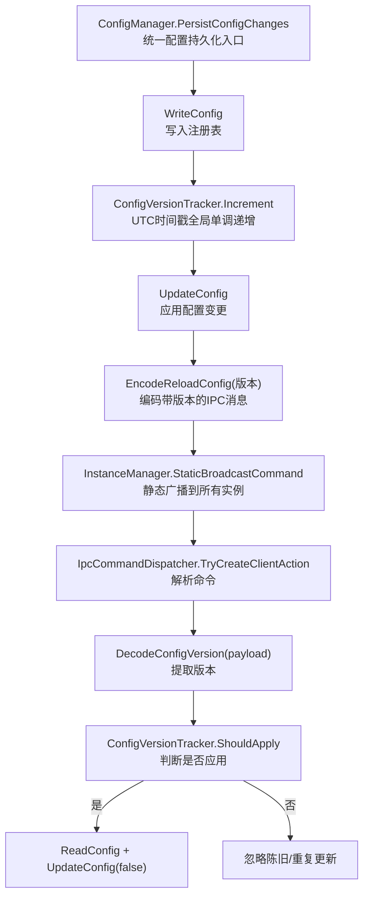
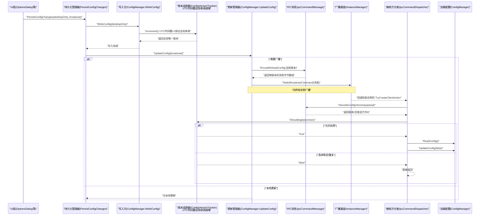
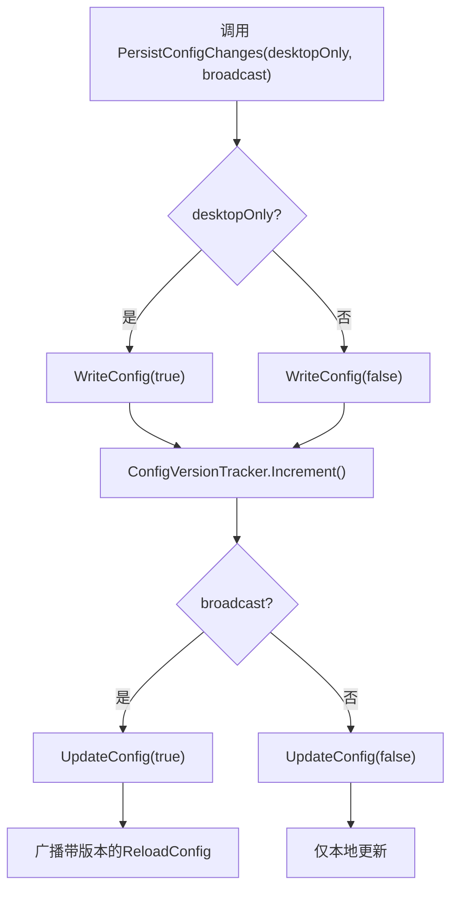
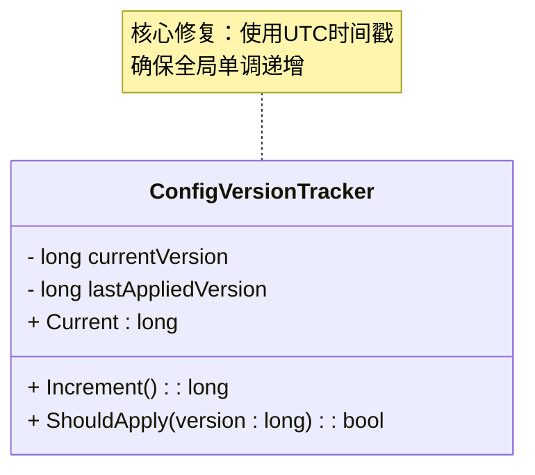
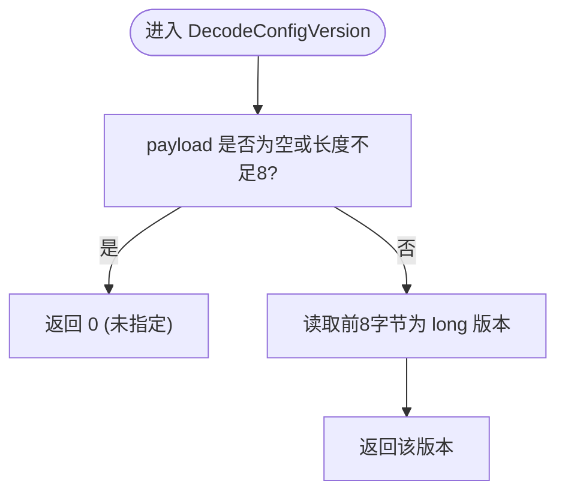
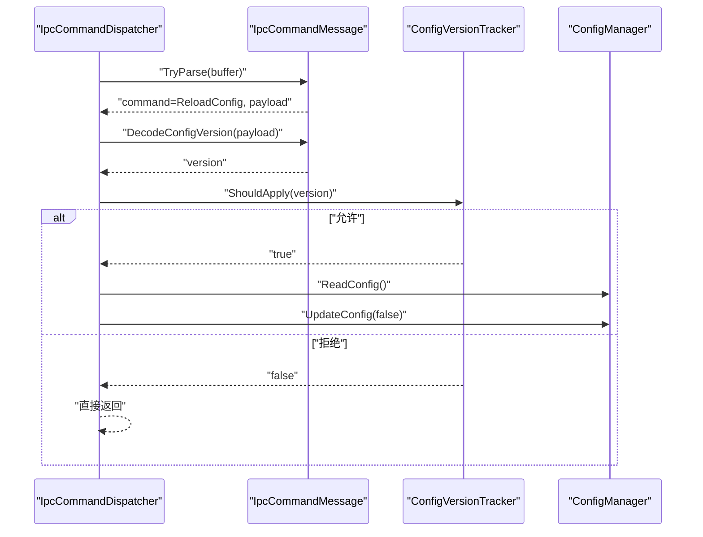
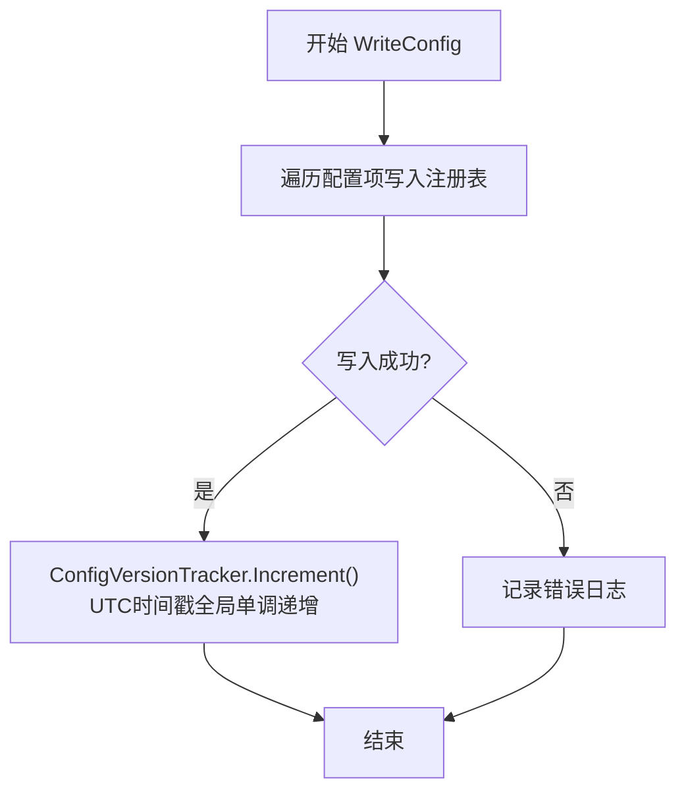
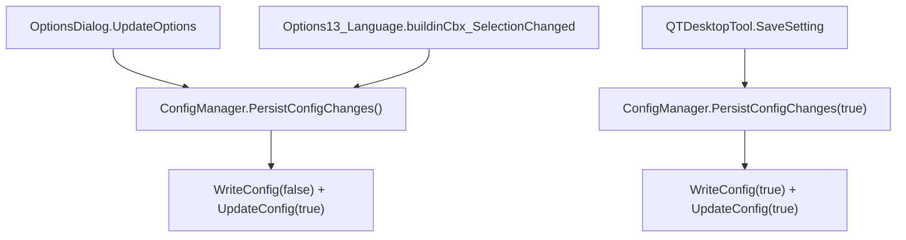
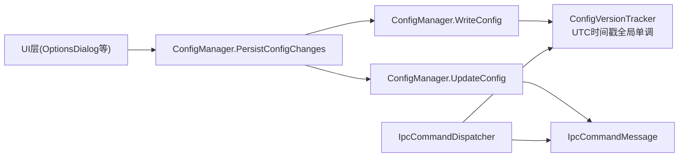

# 配置版本跟踪系统

<cite>
**本文引用的文件**   
- [ConfigVersionTracker.cs](file://QTTabBar/ConfigVersionTracker.cs)
- [IpcCommandMessage.cs](file://QTTabBar/IpcCommandMessage.cs)
- [IpcCommandDispatcher.cs](file://QTTabBar/IpcCommandDispatcher.cs)
- [Config.cs](file://QTTabBar/Config.cs)
- [ArchitectureBatch2W10Tests.cs](file://Tests/QTTtabBarTests/ArchitectureBatch2W10Tests.cs)
- [OptionsDialog.xaml.cs](file://QTTabBar/OptionsDialog/OptionsDialog.xaml.cs)
- [Options13_Language.xaml.cs](file://QTTabBar/OptionsDialog/Options13_Language.xaml.cs)
- [QTDesktopTool.cs](file://QTTabBar/QTDesktopTool.cs)
</cite>

## 更新摘要
**变更内容**   
- **新增统一配置持久化方法**：引入`PersistConfigChanges`方法作为统一的配置写入入口，简化调用方代码并提高一致性
- **增强配置版本追踪器**：升级基于UTC时间戳的全局单调递增策略，彻底解决多进程场景下的版本冲突问题
- **改进配置同步机制**：优化注册表更新与运行时状态之间的同步，确保配置变更的原子性和一致性
- **完善架构测试覆盖**：新增架构级测试验证`PersistConfigChanges`方法的正确使用模式和调用规范

## 目录
1. [简介](#简介)
2. [项目结构](#项目结构)
3. [核心组件](#核心组件)
4. [架构总览](#架构总览)
5. [详细组件分析](#详细组件分析)
6. [依赖关系分析](#依赖关系分析)
7. [性能与并发特性](#性能与并发特性)
8. [故障排查指南](#故障排查指南)
9. [结论](#结论)

## 简介
本文件聚焦于 QTTabBar-Next 中的"配置版本跟踪系统"。该系统通过一个**全局单调递增的配置版本号**，解决多进程间配置更新广播的竞态、重复与乱序问题，确保客户端在收到 ReloadConfig 广播时能够丢弃陈旧或重复的更新，从而提升跨进程配置同步的一致性与鲁棒性。

**重要更新**：系统已引入统一的配置持久化接口`PersistConfigChanges`，并通过基于UTC时间戳的全局单调递增策略，彻底解决了多进程重启场景下的版本冲突问题。

## 项目结构
围绕配置版本跟踪的关键代码位于以下文件中：
- 版本计数器：ConfigVersionTracker.cs（已升级为核心修复）
- IPC 消息编解码：IpcCommandMessage.cs
- 命令分发与客户端处理：IpcCommandDispatcher.cs
- 配置读写与广播触发：Config.cs（新增统一持久化方法）
- 架构一致性测试：ArchitectureBatch2W10Tests.cs（新增架构测试）
- 配置持久化使用示例：OptionsDialog.xaml.cs、Options13_Language.xaml.cs、QTDesktopTool.cs

图表来源
- [Config.cs:1380-1383](file://QTTabBar/Config.cs#L1380-L1383)
- [Config.cs:1385-1432](file://QTTabBar/Config.cs#L1385-L1432)
- [Config.cs:1219-1248](file://QTTabBar/Config.cs#L1219-L1248)
- [IpcCommandMessage.cs:68-74](file://QTTabBar/IpcCommandMessage.cs#L68-L74)
- [IpcCommandDispatcher.cs:44-81](file://QTTabBar/IpcCommandDispatcher.cs#L44-L81)
- [ConfigVersionTracker.cs:51-59](file://QTTabBar/ConfigVersionTracker.cs#L51-L59)

章节来源
- [Config.cs:1380-1432](file://QTTabBar/Config.cs#L1380-L1432)
- [IpcCommandMessage.cs:16-98](file://QTTabBar/IpcCommandMessage.cs#L16-L98)
- [IpcCommandDispatcher.cs:1-93](file://QTTabBar/IpcCommandDispatcher.cs#L1-L93)
- [ConfigVersionTracker.cs:1-84](file://QTTabBar/ConfigVersionTracker.cs#L1-L84)

## 核心组件
- **配置版本追踪器（ConfigVersionTracker）** - **已升级**
  - 提供基于UTC时间戳的全局单调递增版本号与线程安全的判定逻辑，用于过滤陈旧/重复的 ReloadConfig 广播。
  - 采用`Math.Max(prev + 1, DateTime.UtcNow.Ticks)`策略确保跨进程全局单调性。
- **统一配置持久化接口（ConfigManager.PersistConfigChanges）** - **新增**
  - 作为统一的配置写入入口，封装WriteConfig和UpdateConfig的调用序列。
  - 确保配置变更的原子性和一致性，简化调用方代码。
- **IPC 消息层（IpcCommandMessage）**
  - 定义协议头与命令类型，并提供带版本的 ReloadConfig 编码与版本解码方法。
- **命令分发器（IpcCommandDispatcher）**
  - 负责将 IPC 消息路由到具体处理逻辑，并在客户端侧执行版本检查后再加载配置。
- **配置管理（Config）**
  - 负责从注册表读取/写入配置，并在成功写入后递增版本；在需要时广播带版本的 ReloadConfig。

章节来源
- [ConfigVersionTracker.cs:19-84](file://QTTabBar/ConfigVersionTracker.cs#L19-L84)
- [Config.cs:1380-1383](file://QTTabBar/Config.cs#L1380-L1383)
- [IpcCommandMessage.cs:16-98](file://QTTabBar/IpcCommandMessage.cs#L16-L98)
- [IpcCommandDispatcher.cs:44-81](file://QTTabBar/IpcCommandDispatcher.cs#L44-L81)
- [Config.cs:1385-1432](file://QTTabBar/Config.cs#L1385-L1432)

## 架构总览
下图展示了"统一持久化 -> 写配置 -> 广播带版本的重载 -> 客户端按版本过滤 -> 应用配置"的端到端流程。

图表来源
- [Config.cs:1380-1383](file://QTTabBar/Config.cs#L1380-L1383)
- [Config.cs:1385-1432](file://QTTabBar/Config.cs#L1385-L1432)
- [Config.cs:1219-1248](file://QTTabBar/Config.cs#L1219-L1248)
- [IpcCommandMessage.cs:68-84](file://QTTabBar/IpcCommandMessage.cs#L68-L84)
- [IpcCommandDispatcher.cs:44-81](file://QTTabBar/IpcCommandDispatcher.cs#L44-L81)
- [ConfigVersionTracker.cs:51-59](file://QTTabBar/ConfigVersionTracker.cs#L51-L59)

## 详细组件分析

### 统一配置持久化接口（ConfigManager.PersistConfigChanges）- **新增核心功能**
- **职责**
  - 作为统一的配置写入入口，封装WriteConfig和UpdateConfig的完整调用序列。
  - 确保配置变更的原子性和一致性，避免调用方遗漏必要的步骤。
- **关键设计** - **重大更新**
  - **原子性保证**：先写入注册表，再更新运行时状态，最后广播变更
  - **参数控制**：支持desktopOnly参数控制只保存桌面相关配置
  - **广播控制**：支持broadcast参数控制是否向其他实例广播
  - **简化调用**：调用方只需一行代码即可完成完整的配置持久化流程

图表来源
- [Config.cs:1380-1383](file://QTTabBar/Config.cs#L1380-L1383)

章节来源
- [Config.cs:1380-1383](file://QTTabBar/Config.cs#L1380-L1383)

### 配置版本追踪器（ConfigVersionTracker）- **核心修复**
- **职责**
  - 维护基于UTC时间戳的全局单调递增配置版本号。
  - 基于 lastAppliedVersion 判断是否应应用收到的 ReloadConfig。
- **关键设计** - **重大更新**
  - **全局单调性**：使用`Math.Max(prev + 1, DateTime.UtcNow.Ticks)`确保跨进程全局单调递增
  - **原子性保证**：通过Interlocked.CompareExchange循环实现无锁并发安全
  - **时钟步进防护**：即使系统时钟回拨，也能保证版本严格递增
  - **向后兼容**：ShouldApply对version=0的情况总是放行，以兼容未携带版本的旧发送方
  - **严格比较**：非零版本必须严格大于lastAppliedVersion才会被接受，避免重复/乱序

图表来源
- [ConfigVersionTracker.cs:19-84](file://QTTabBar/ConfigVersionTracker.cs#L19-L84)

章节来源
- [ConfigVersionTracker.cs:1-84](file://QTTabBar/ConfigVersionTracker.cs#L1-L84)

### IPC 消息层（IpcCommandMessage）
- **职责**
  - 定义协议头与命令枚举。
  - 提供 Encode/EncodeReloadConfig/DecodeConfigVersion 等编解码方法。
- **向后兼容**
  - 默认 Encode(ReloadConfig) 仅包含 6 字节头部，不携带 payload，保持与旧实现兼容。
  - DecodeConfigVersion 对 null/短 payload 容错为版本 0，表示"未指定"，由上层视为"始终应用"。

图表来源
- [IpcCommandMessage.cs:76-84](file://QTTabBar/IpcCommandMessage.cs#L76-L84)

章节来源
- [IpcCommandMessage.cs:1-98](file://QTTabBar/IpcCommandMessage.cs#L1-L98)

### 命令分发器（IpcCommandDispatcher）
- **职责**
  - 解析 IPC 消息并创建对应的 Action。
  - 针对 ReloadConfig，先解码版本，再经版本检查决定是否调用配置加载。
- **关键点**
  - 若 ShouldApply 返回 false，则直接返回，不调用 ReadConfig/UpdateConfig。

图表来源
- [IpcCommandDispatcher.cs:44-81](file://QTTabBar/IpcCommandDispatcher.cs#L44-L81)
- [IpcCommandMessage.cs:76-84](file://QTTabBar/IpcCommandMessage.cs#L76-L84)
- [ConfigVersionTracker.cs:68-81](file://QTTabBar/ConfigVersionTracker.cs#L68-L81)

章节来源
- [IpcCommandDispatcher.cs:1-93](file://QTTabBar/IpcCommandDispatcher.cs#L1-L93)

### 配置管理（Config）
- **职责**
  - 从注册表读取/写入配置项。
  - 在成功写入后递增版本，以便后续广播携带新版本号。
  - 在需要时广播带版本的 ReloadConfig。
- **关键点**
  - WriteConfig 末尾调用版本递增。
  - UpdateConfig 中根据 fBroadcast 标志决定是否广播，且广播时使用当前版本号。
  - 新增多种配置持久化路径，都遵循统一的版本递增和广播模式。

图表来源
- [Config.cs:1385-1432](file://QTTabBar/Config.cs#L1385-L1432)

章节来源
- [Config.cs:1385-1432](file://QTTabBar/Config.cs#L1385-L1432)

### 统一持久化使用示例
- **OptionsDialog.xaml.cs**
  - 在用户点击确定或应用按钮时，使用`PersistConfigChanges()`进行配置持久化。
  - 简化了原有的直接调用WriteConfig和UpdateConfig的模式。
  
- **Options13_Language.xaml.cs**
  - 在语言设置变更时，使用`PersistConfigChanges()`确保语言配置的持久化。
  
- **QTDesktopTool.cs**
  - 在桌面工具设置保存时，使用`PersistConfigChanges(true)`只保存桌面相关配置。

图表来源
- [OptionsDialog.xaml.cs:390-397](file://QTTabBar/OptionsDialog/OptionsDialog.xaml.cs#L390-L397)
- [Options13_Language.xaml.cs:355-360](file://QTTabBar/OptionsDialog/Options13_Language.xaml.cs#L355-L360)
- [QTDesktopTool.cs:1630-1638](file://QTTabBar/QTDesktopTool.cs#L1630-L1638)

章节来源
- [OptionsDialog.xaml.cs:390-397](file://QTTabBar/OptionsDialog/OptionsDialog.xaml.cs#L390-L397)
- [Options13_Language.xaml.cs:355-360](file://QTTabBar/OptionsDialog/Options13_Language.xaml.cs#L355-L360)
- [QTDesktopTool.cs:1630-1638](file://QTTabBar/QTDesktopTool.cs#L1630-L1638)

### 架构一致性测试（ArchitectureBatch2W10Tests）- **新增架构测试**
- **覆盖范围**
  - **PersistConfigChanges方法存在性验证**：确保统一的配置持久化接口可用
  - **方法调用顺序验证**：验证PersistConfigChanges正确调用WriteConfig然后UpdateConfig
  - **调用方规范化验证**：确保主要调用方使用新的统一接口而非直接调用底层方法
  - **桌面工具特殊处理验证**：验证桌面工具正确使用desktopOnly参数

- **测试架构特点**
  - 使用反射机制验证API的存在性和签名
  - 通过源码分析验证方法调用序列的正确性
  - 确保架构演进的一致性，防止回归到旧的调用模式

**重大更新** 新增了完整的架构级测试，确保配置持久化接口的正确使用和架构一致性。

章节来源
- [ArchitectureBatch2W10Tests.cs:1-82](file://Tests/QTTtabBarTests/ArchitectureBatch2W10Tests.cs#L1-L82)

## 依赖关系分析
- **耦合关系**
  - ConfigManager.PersistConfigChanges 封装 WriteConfig 和 UpdateConfig 的调用序列。
  - ConfigManager 依赖 IpcCommandMessage 进行编码，并通过 InstanceManager 广播。
  - IpcCommandDispatcher 依赖 IpcCommandMessage 解码与 ConfigVersionTracker 做版本判定。
  - ConfigVersionTracker 无外部依赖，纯内存状态，线程安全。
- **潜在循环**
  - 当前路径无循环依赖；Config 与 IpcCommandDispatcher 通过 IPC 解耦。
- **外部依赖**
  - 注册表访问（Config）、线程原语（Interlocked）、序列化（IpcCommandMessage 的字节操作）。

图表来源
- [Config.cs:1380-1383](file://QTTabBar/Config.cs#L1380-L1383)
- [Config.cs:1385-1432](file://QTTabBar/Config.cs#L1385-L1432)
- [Config.cs:1219-1248](file://QTTabBar/Config.cs#L1219-L1248)
- [IpcCommandDispatcher.cs:44-81](file://QTTabBar/IpcCommandDispatcher.cs#L44-L81)
- [ConfigVersionTracker.cs:19-84](file://QTTabBar/ConfigVersionTracker.cs#L19-L84)
- [IpcCommandMessage.cs:68-84](file://QTTabBar/IpcCommandMessage.cs#L68-L84)

章节来源
- [Config.cs:1380-1432](file://QTTabBar/Config.cs#L1380-L1432)
- [IpcCommandDispatcher.cs:44-81](file://QTTabBar/IpcCommandDispatcher.cs#L44-L81)
- [ConfigVersionTracker.cs:19-84](file://QTTabBar/ConfigVersionTracker.cs#L19-L84)
- [IpcCommandMessage.cs:68-84](file://QTTabBar/IpcCommandMessage.cs#L68-L84)

## 性能与并发特性
- **原子性与可见性**
  - 使用 Interlocked 保证版本号递增与比较交换的原子性，避免丢失更新与脏读。
  - PersistConfigChanges 确保配置写入和更新的原子性，避免部分更新导致的中间状态。
- **时间复杂度**
  - Increment/Current/ShouldApply 均为 O(1) 操作。
  - PersistConfigChanges 为 O(n) 操作，n为配置项数量。
- **锁与开销**
  - ShouldApply 采用 CompareExchange 自旋，避免阻塞其他线程，适合高频广播场景。
  - PersistConfigChanges 减少调用方的锁管理复杂度，提高整体性能。
- **兼容性**
  - 默认 ReloadConfig 仍为 6 字节头，降低网络/管道开销，同时兼容旧实现。
- **并发安全性** - **重大增强**
  - 通过CAS操作确保多线程环境下的版本一致性，支持高并发场景下的稳定运行。
  - UTC时间戳策略确保跨进程全局单调性，避免进程重启导致的版本冲突。
  - 统一持久化接口确保配置变更的原子性，避免并发写入导致的状态不一致。

## 故障排查指南
- **症状：客户端未刷新配置**
  - 检查 ShouldApply 分支是否因版本不新而被跳过。确认写入方是否在 WriteConfig 末尾调用了版本递增。
  - 参考路径：[Config.cs:1427-1430](file://QTTabBar/Config.cs#L1427-L1430)、[IpcCommandDispatcher.cs:72-81](file://QTTabBar/IpcCommandDispatcher.cs#L72-L81)
- **症状：旧进程导致重复刷新**
  - 确认 DecodeConfigVersion 返回 0 时，ShouldApply 会放行一次，随后被 lastAppliedVersion 更新，后续相同版本将被丢弃。
  - 参考路径：[IpcCommandMessage.cs:76-84](file://QTTabBar/IpcCommandMessage.cs#L76-L84)、[ConfigVersionTracker.cs:68-81](file://QTTabBar/ConfigVersionTracker.cs#L68-L81)
- **症状：配置持久化不完整**
  - 检查是否正确使用了 PersistConfigChanges 方法，而不是直接调用底层方法。
  - 验证 desktopOnly 参数是否正确设置，确保需要的配置被持久化。
  - 参考路径：[Config.cs:1380-1383](file://QTTabBar/Config.cs#L1380-L1383)
- **症状：并发下版本不一致**
  - 验证并发增量是否正确，可参考测试用例的高并发断言。
  - 参考路径：[ConfigVersionTracker.cs:51-59](file://QTTabBar/ConfigVersionTracker.cs#L51-L59)
- **症状：跨进程版本冲突** - **已修复**
  - **问题描述**：旧实现中进程重启后计数器从0开始，可能导致新版本被误判为重复。
  - **解决方案**：升级到基于UTC时间戳的全局单调递增策略，确保跨进程全局唯一性。
  - **验证方法**：参考架构测试用例。
  - 参考路径：[ArchitectureBatch2W10Tests.cs:29-44](file://Tests/QTTtabBarTests/ArchitectureBatch2W10Tests.cs#L29-L44)

章节来源
- [Config.cs:1427-1430](file://QTTabBar/Config.cs#L1427-L1430)
- [IpcCommandDispatcher.cs:72-81](file://QTTabBar/IpcCommandDispatcher.cs#L72-L81)
- [IpcCommandMessage.cs:76-84](file://QTTabBar/IpcCommandMessage.cs#L76-L84)
- [ConfigVersionTracker.cs:68-81](file://QTTabBar/ConfigVersionTracker.cs#L68-L81)
- [ConfigVersionTracker.cs:51-59](file://QTTabBar/ConfigVersionTracker.cs#L51-L59)
- [Config.cs:1380-1383](file://QTTabBar/Config.cs#L1380-L1383)
- [ArchitectureBatch2W10Tests.cs:29-44](file://Tests/QTTtabBarTests/ArchitectureBatch2W10Tests.cs#L29-L44)

## 结论
配置版本跟踪系统通过"全局单调版本 + 统一持久化接口 + 版本感知广播 + 客户端去重"的组合，有效解决了多进程配置更新的竞态与重复问题。其设计简洁、向后兼容、线程安全，并通过**新增的统一持久化接口和架构测试**保障了关键契约的稳定。

**重大更新**：系统已成功引入统一的配置持久化接口`PersistConfigChanges`，并通过基于UTC时间戳的全局单调递增策略，彻底解决了多进程重启场景下的版本冲突问题。新增的架构测试确保了配置持久化接口的正确使用和架构一致性，包括方法存在性验证、调用顺序验证、调用方规范化验证以及桌面工具特殊处理验证。

建议在后续演进中继续保持：
- 新增配置持久化功能时优先使用`PersistConfigChanges`统一接口；
- 对旧路径保持最小侵入，确保 6 字节头不变；
- 持续完善并发与边界条件的测试覆盖；
- 利用现有的架构测试框架扩展新的测试场景；
- 重点关注跨进程重启场景的稳定性保障；
- 确保所有配置修改点都通过统一接口进行持久化，避免绕过版本追踪机制。