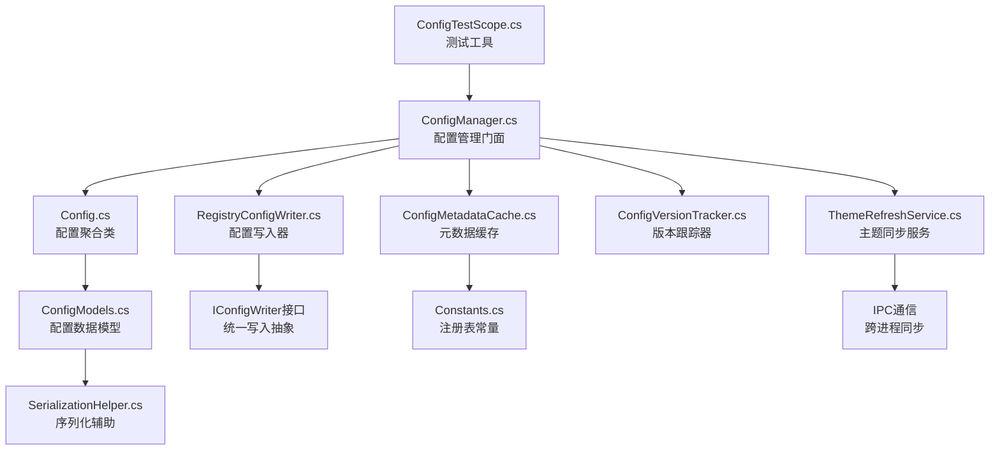
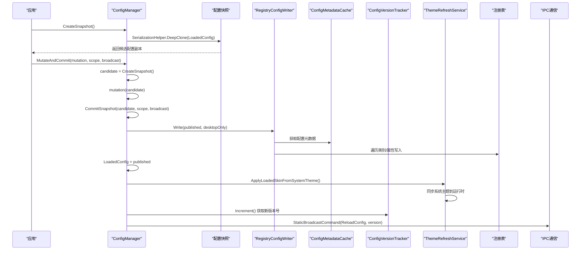
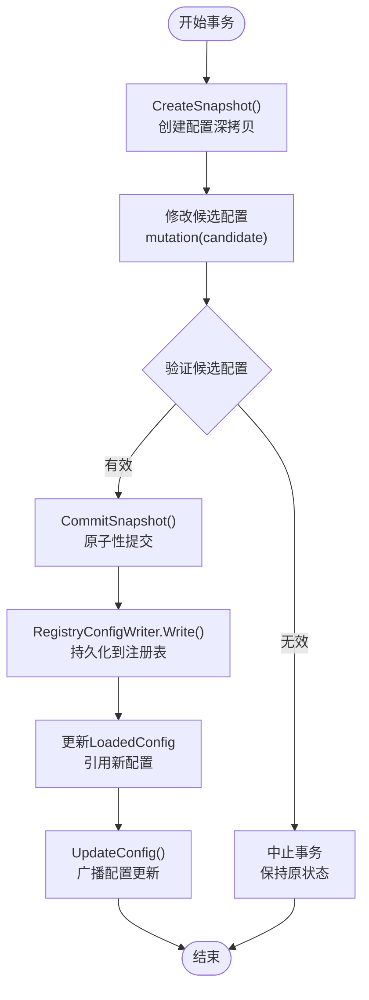
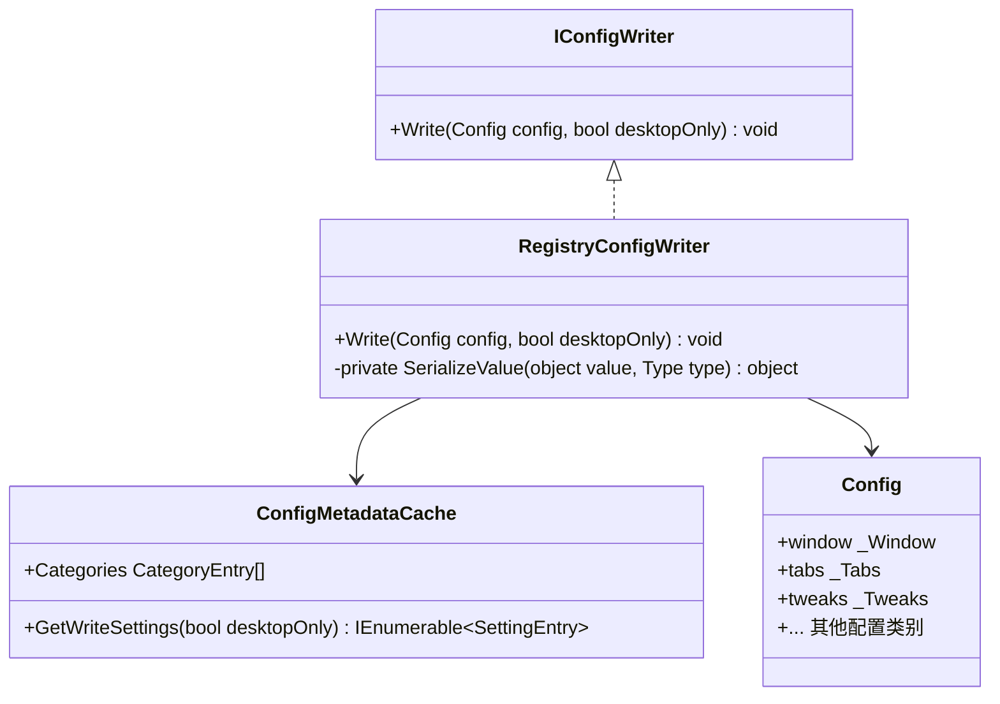
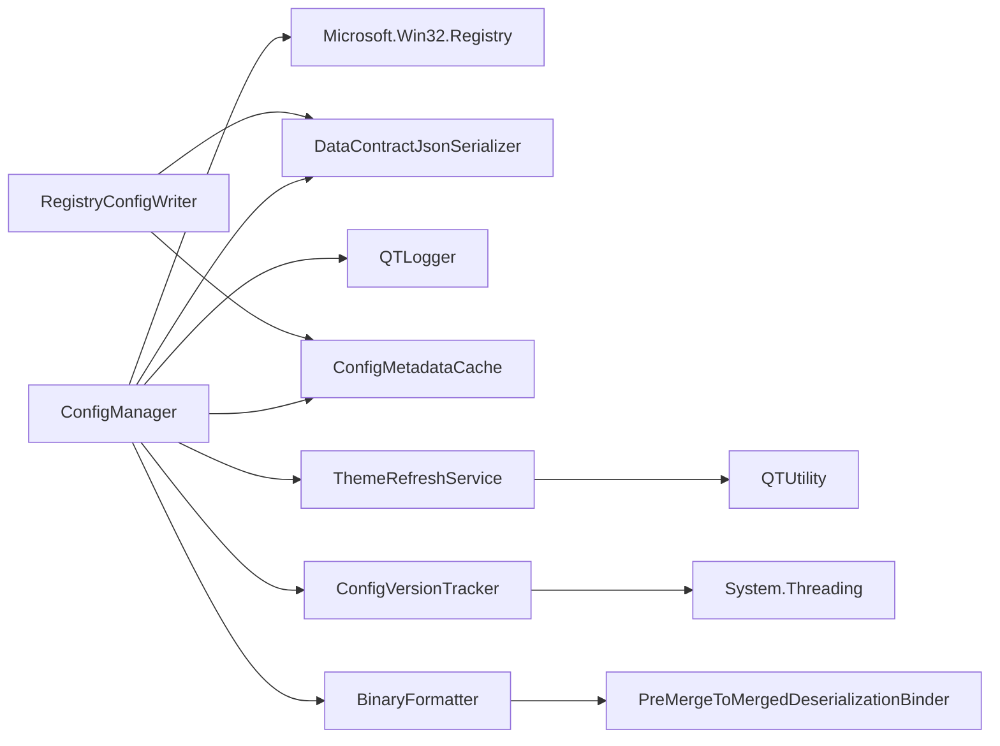

# 配置管理系统

<cite>
**本文引用的文件**   
- [ConfigManager.cs](file://QTTabBar/ConfigManager.cs)
- [RegistryConfigWriter.cs](file://QTTabBar/RegistryConfigWriter.cs)
- [ConfigMetadataCache.cs](file://QTTabBar/ConfigMetadataCache.cs)
- [ThemeRefreshService.cs](file://QTTabBar/ThemeRefreshService.cs)
- [ConfigVersionTracker.cs](file://QTTabBar/ConfigVersionTracker.cs)
- [Config.cs](file://QTTabBar/Config.cs)
- [ConfigModels.cs](file://QTTabBar/ConfigModels.cs)
- [SerializationHelper.cs](file://QTTabBar/SerializationHelper.cs)
- [Constants.cs](file://QTTabBar/Constants.cs)
- [PreMergeToMergedDeserializationBinder.cs](file://QTTabBar/PreMergeToMergedDeserializationBinder.cs)
- [ConfigTestScope.cs](file://Tests/QTTtabBarTests/ConfigTestScope.cs)
- [ConfigCommitTransactionTests.cs](file://Tests/QTTtabBarTests/ConfigCommitTransactionTests.cs)
</cite>

## 更新摘要
**变更内容**   
- **事务性配置系统**：引入基于快照的事务性配置提交机制，通过CreateSnapshot()、CommitSnapshot()、MutateAndCommit()方法确保原子性配置写入
- **IConfigWriter接口抽象**：新增RegistryConfigWriter类实现IConfigWriter接口，提供统一的配置写入抽象层
- **竞态条件消除**：通过深拷贝候选配置对象和原子性发布机制，消除多线程环境下的配置竞争条件
- **测试支持增强**：新增ConfigTestScope用于测试环境中的配置写入器替换和验证

## 目录
1. [简介](#简介)
2. [项目结构](#项目结构)
3. [核心组件](#核心组件)
4. [架构总览](#架构总览)
5. [详细组件分析](#详细组件分析)
6. [依赖关系分析](#依赖关系分析)
7. [性能考量](#性能考量)
8. [故障排除指南](#故障排除指南)
9. [结论](#结论)
10. [附录](#附录)

## 简介
本文件面向 QTTabBar-Next 的配置管理系统，系统性阐述配置的层次结构与存储策略、序列化框架设计、迁移与兼容性处理、热重载机制、API 使用指南、验证规则与默认值管理、备份恢复与排障方法。重点覆盖新的集中式配置管理门面（ConfigManager）、基于元数据的序列化优化、运行时主题同步机制以及单调版本跟踪系统。**本次重大更新引入了事务性配置系统，通过快照机制和原子性提交操作，显著提升了配置系统的线程安全性和数据一致性保证。**

## 项目结构
配置相关代码经过事务性重构后集中在以下核心文件中：
- **ConfigManager.cs**：**增强** 新增事务性配置操作方法，包括CreateSnapshot()、CommitSnapshot()、MutateAndCommit()
- **RegistryConfigWriter.cs**：**新增** 实现IConfigWriter接口的注册表配置写入器，提供统一的配置持久化抽象
- **ConfigMetadataCache.cs**：**保留** 配置元数据缓存，通过反射预构建配置类别和属性信息
- **ThemeRefreshService.cs**：**保留** 主题刷新服务，支持运行时主题同步
- **ConfigVersionTracker.cs**：**保留** 配置版本跟踪器，提供单调递增的版本号管理
- **Config.cs**：**保留** 配置聚合类和便捷访问属性
- **ConfigModels.cs**：**保留** 包含所有配置数据模型的独立文件
- **SerializationHelper.cs**：**增强** DeepClone方法用于事务性配置深拷贝
- **ConfigTestScope.cs**：**新增** 测试环境配置写入器替换和验证工具

**图表来源**
- [ConfigManager.cs:12-63](file://QTTabBar/ConfigManager.cs#L12-L63)
- [RegistryConfigWriter.cs:17-63](file://QTTabBar/RegistryConfigWriter.cs#L17-L63)
- [ConfigMetadataCache.cs:6-79](file://QTTabBar/ConfigMetadataCache.cs#L6-L79)
- [ThemeRefreshService.cs:2-28](file://QTTabBar/ThemeRefreshService.cs#L2-L28)
- [ConfigVersionTracker.cs:19-84](file://QTTabBar/ConfigVersionTracker.cs#L19-L84)
- [Config.cs:40-116](file://QTTabBar/Config.cs#L40-L116)
- [ConfigModels.cs:224-1027](file://QTTabBar/ConfigModels.cs#L224-L1027)
- [ConfigTestScope.cs:18-44](file://Tests/QTTtabBarTests/ConfigTestScope.cs#L18-L44)

## 核心组件
- **事务性配置管理层**
  - **增强** ConfigManager 新增事务性配置操作方法，提供原子性的配置提交机制
  - CreateSnapshot()：创建当前配置对象的深拷贝作为候选配置
  - CommitSnapshot()：将候选配置原子性地发布到持久化存储和内存状态
  - MutateAndCommit()：组合修改和提交的便捷方法，简化常见操作模式
- **配置写入抽象层**
  - **新增** IConfigWriter接口定义统一的配置写入契约
  - **新增** RegistryConfigWriter实现注册表持久化逻辑，封装复杂的类型转换和序列化过程
  - 支持桌面模式过滤，允许只提交特定类别的配置
- **配置元数据缓存层**
  - **保留** ConfigMetadataCache 通过反射预构建配置类别和属性的元数据
  - 避免重复反射开销，显著提升配置读写性能
- **主题同步服务层**
  - **保留** ThemeRefreshService 负责运行时主题同步，确保界面颜色与系统主题一致
- **版本跟踪层**
  - **保留** ConfigVersionTracker 提供单调递增的版本号管理，解决跨进程配置同步的竞态条件
- **配置数据模型层**
  - **保留** 配置数据模型已从Config.cs完全提取到ConfigModels.cs中
- **测试支持层**
  - **新增** ConfigTestScope提供测试环境配置写入器替换能力
  - RecordingConfigWriter用于记录配置写入操作，便于测试验证

**章节来源**
- [ConfigManager.cs:12-63](file://QTTabBar/ConfigManager.cs#L12-L63)
- [RegistryConfigWriter.cs:13-63](file://QTTabBar/RegistryConfigWriter.cs#L13-L63)
- [ConfigMetadataCache.cs:6-79](file://QTTabBar/ConfigMetadataCache.cs#L6-L79)
- [ThemeRefreshService.cs:2-28](file://QTTabBar/ThemeRefreshService.cs#L2-L28)
- [ConfigVersionTracker.cs:19-84](file://QTTabBar/ConfigVersionTracker.cs#L19-L84)
- [Config.cs:40-116](file://QTTabBar/Config.cs#L40-L116)
- [ConfigModels.cs:224-1027](file://QTTabBar/ConfigModels.cs#L224-L1027)
- [ConfigTestScope.cs:18-44](file://Tests/QTTtabBarTests/ConfigTestScope.cs#L18-L44)

## 架构总览
配置系统采用"事务性门面模式 + 元数据驱动 + 版本控制"的新架构，通过引入事务性配置提交机制显著提升了数据一致性：
- **启动阶段**：ConfigManager.Initialize() 创建默认配置对象，随后 ReadConfig() 从注册表按元数据缓存遍历所有类别与属性进行回填
- **事务提交阶段**：CreateSnapshot() 创建配置深拷贝，MutateAndCommit() 执行修改并原子性提交，CommitSnapshot() 完成最终发布
- **运行阶段**：UpdateConfig() 将内存中的配置应用到运行时子系统，并通过版本跟踪器确保跨进程同步的一致性
- **持久化阶段**：RegistryConfigWriter.Write() 通过元数据缓存遍历配置对象，将各属性序列化后写回注册表
- **主题同步**：ThemeRefreshService 在每次配置更新时自动同步系统主题到运行时
- **版本控制**：ConfigVersionTracker 提供单调递增的版本号，防止重复和过期的配置更新

**图表来源**
- [ConfigManager.cs:36-63](file://QTTabBar/ConfigManager.cs#L36-L63)
- [RegistryConfigWriter.cs:17-63](file://QTTabBar/RegistryConfigWriter.cs#L17-L63)
- [ConfigMetadataCache.cs:40-70](file://QTTabBar/ConfigMetadataCache.cs#L40-L70)
- [ThemeRefreshService.cs:7-10](file://QTTabBar/ThemeRefreshService.cs#L7-L10)
- [ConfigVersionTracker.cs:51-59](file://QTTabBar/ConfigVersionTracker.cs#L51-L59)

## 详细组件分析

### 事务性配置管理（重大增强）
**重大增强** ConfigManager 类新增事务性配置操作方法，提供原子性的配置提交机制：

- **核心事务方法**
  - CreateSnapshot()：创建当前配置对象的深拷贝，作为候选配置供修改
  - CommitSnapshot(Config, ConfigCommitScope, bool)：将候选配置原子性地发布到持久化存储和内存状态
  - MutateAndCommit(Action<Config>, ConfigCommitScope, bool)：组合修改和提交的便捷方法
- **事务特性**
  - 深拷贝保护：通过SerializationHelper.DeepClone确保候选配置与已发布配置隔离
  - 原子性发布：先持久化再更新内存状态，避免部分更新导致的中间状态
  - 错误隔离：候选配置的修改不会影响已发布的配置状态
- **设计优势**
  - 消除竞态条件：多线程环境下安全的配置修改和提交
  - 简化错误处理：事务失败不影响现有配置状态
  - 提高可测试性：易于模拟和验证配置提交行为

**图表来源**
- [ConfigManager.cs:36-63](file://QTTabBar/ConfigManager.cs#L36-L63)

**章节来源**
- [ConfigManager.cs:36-63](file://QTTabBar/ConfigManager.cs#L36-L63)

### 配置写入抽象层（新增）
**新增** IConfigWriter接口和RegistryConfigWriter实现，提供统一的配置写入抽象：

- **接口设计**
  - IConfigWriter接口定义统一的Write(Config, bool)方法契约
  - 支持桌面模式过滤参数，允许只提交特定类别的配置
- **RegistryConfigWriter实现**
  - 封装注册表写入逻辑，包括类型转换、JSON序列化和异常处理
  - 支持布尔值、字节值、枚举、Font等特殊类型的处理
  - 集成ConfigMetadataCache进行高效的配置遍历
- **设计优势**
  - 解耦配置写入逻辑，便于扩展其他持久化后端
  - 统一错误处理和日志记录
  - 支持测试环境中的模拟写入器

**图表来源**
- [RegistryConfigWriter.cs:13-63](file://QTTabBar/RegistryConfigWriter.cs#L13-L63)
- [ConfigMetadataCache.cs:24-38](file://QTTabBar/ConfigMetadataCache.cs#L24-L38)
- [Config.cs:87-99](file://QTTabBar/Config.cs#L87-L99)

**章节来源**
- [RegistryConfigWriter.cs:13-63](file://QTTabBar/RegistryConfigWriter.cs#L13-L63)

### 配置元数据缓存（保留）
**保留** ConfigMetadataCache 类通过反射预构建配置元数据，显著提升配置读写性能：

- **元数据结构**
  - SettingEntry：存储单个设置的键路径、名称、类型和属性引用
  - CategoryEntry：存储类别的键路径、属性引用和设置数组
- **缓存策略**
  - 线程安全的懒加载构建，确保只构建一次
  - 支持测试环境重置缓存
  - 提供扁平化设置列表，便于批量操作
- **性能优化**
  - 避免每次读写都进行反射遍历
  - 预计算注册表路径映射
  - 支持桌面模式过滤

**章节来源**
- [ConfigMetadataCache.cs:6-79](file://QTTabBar/ConfigMetadataCache.cs#L6-L79)

### 主题同步服务（保留）
**保留** ThemeRefreshService 类负责运行时主题同步，确保界面颜色与系统主题保持一致：

- **核心功能**
  - ApplyLoadedSkinFromSystemTheme()：将系统主题应用到当前配置
  - RefreshCacheOnly()：仅刷新主题缓存
  - ApplyPreviewTheme()：应用于预览模式的配置
  - ApplySystemTheme()：应用系统主题并触发配置更新
- **集成方式**
  - 在 ConfigManager.UpdateConfig() 中自动调用
  - 支持独立的主题刷新操作
  - 与 QTUtility 的主题检测机制集成

**章节来源**
- [ThemeRefreshService.cs:2-30](file://QTTabBar/ThemeRefreshService.cs#L2-L30)

### 配置版本跟踪器（保留）
**保留** ConfigVersionTracker 类提供单调递增的版本号管理，解决跨进程配置同步的竞态条件：

- **核心特性**
  - 基于 UTC 时间戳的全局单调递增版本
  - 线程安全的原子操作，使用 Interlocked 保证并发安全
  - 去重机制，防止重复和过期的配置更新
- **关键方法**
  - Increment()：生成新的版本号，考虑时钟漂移
  - ShouldApply()：判断是否应该应用某个版本的配置
  - Current：获取当前版本号
- **设计优势**
  - 解决进程重启后的版本冲突问题
  - 支持多线程环境下的安全访问
  - 向后兼容，version=0 表示未指定版本

**章节来源**
- [ConfigVersionTracker.cs:19-84](file://QTTabBar/ConfigVersionTracker.cs#L19-L84)

### 配置数据模型与层次结构（保留）
**保留** 配置系统的数据模型已从Config.cs完全提取到ConfigModels.cs中，实现了更好的模块化和可维护性：

- **重构后的结构**
  - ConfigModels.cs 包含所有配置数据模型类：_Window、_Tabs、_Tweaks、_Security、_Tips、_Misc、_Skin、_BBar、_Mouse、_Keys、_Plugin、_Lang、_Desktop
  - Config.cs 现在只保留配置聚合类和便捷访问属性，大幅精简了代码量
- **配置类别详解**
  - _Window：窗口行为配置，包括捕获新窗口、会话恢复、透明度等
  - _Tabs：标签行为配置，包括新标签位置、关闭行为、显示选项等
  - _Tweaks：系统调整配置，包括列标题显示、选择行为、网格线等
  - _Security：安全配置，包括插件签名验证、钩子DLL路径限制等
  - _Tips：预览提示配置，包括子目录提示、文件预览、字体设置等
  - _Misc：常规选项配置，包括历史记录、网络超时、日志设置等
  - _Skin：外观皮肤配置，包括标签样式、颜色主题、背景图片等
- **数据类型支持**
  - 支持bool、int、string、Color、Font、Padding、枚举、数组、字典等多种数据类型
  - 每个配置类别在构造函数中设置合理的默认值

**章节来源**
- [Config.cs:40-116](file://QTTabBar/Config.cs#L40-L116)
- [ConfigModels.cs:224-1027](file://QTTabBar/ConfigModels.cs#L224-L1027)

### 注册表持久化与双重存储说明（保留）
配置系统继续使用注册表作为主要持久化介质：
- **读取流程**：ReadConfig 通过 ConfigMetadataCache 获取预构建的元数据，然后遍历配置类别与属性，从注册表对应路径读取值并按类型转换回填
- **写入流程**：RegistryConfigWriter.Write 同样通过反射遍历，将简单类型直接写入，复杂类型先序列化为 JSON 字符串再写入
- **XML 双重持久化现状**：代码中存在 XML 语言包文件用于多语言资源，但配置本身并未实现 XML 持久化

**章节来源**
- [ConfigManager.ReadConfig.cs:13-72](file://QTTabBar/ConfigManager.ReadConfig.cs#L13-L72)
- [RegistryConfigWriter.cs:17-63](file://QTTabBar/RegistryConfigWriter.cs#L17-L63)

### 序列化框架设计与实现（保留）
配置系统保持原有的序列化机制：
- **JSON 序列化**：非基本类型（除 int/string/enum）在写入时使用 DataContractJsonSerializer 序列化为 JSON 字符串
- **Font 特殊处理**：Font 类型转换为 XmlSerializableFont 后再进行 JSON 序列化
- **安全与健壮性**：反序列化异常被捕获并记录错误日志，失败时降级返回空值，避免崩溃
- **事务性深拷贝**：SerializationHelper.DeepClone 使用二进制序列化实现配置对象的深拷贝

**章节来源**
- [RegistryConfigWriter.cs:37-57](file://QTTabBar/RegistryConfigWriter.cs#L37-L57)
- [SerializationHelper.cs:62-70](file://QTTabBar/SerializationHelper.cs#L62-L70)

### 配置迁移与版本兼容（保留）
配置系统增强了向后兼容性：
- **向后兼容**：读取时对缺失键跳过，不抛异常；对未知类型走通用 JSON 反序列化路径
- **平台差异适配**：根据操作系统版本（XP/Win7/Win11+）调整默认行为与可用特性
- **路径有效性校验**：使用 IDLWrapper 校验默认位置、图片路径等是否有效，无效则回退到默认值
- **键盘快捷键数组**：根据 BindAction 计数动态扩容，避免越界

**章节来源**
- [ConfigManager.ReadConfig.cs:74-141](file://QTTabBar/ConfigManager.ReadConfig.cs#L74-L141)

### 配置热重载与实时生效（保留）
配置系统实现了完善的热重载机制：
- **UpdateConfig 负责将内存配置应用到运行时**：
  - 更新文本资源字典与校验
  - 调整历史容量（标签/文件）
  - 初始化菜单渲染器
  - 刷新插件列表
  - 触发本地实例广播 RefreshOptions
  - 可选地向其他进程广播 ReloadConfig 命令，实现跨进程热重载
- **版本控制集成**：每次广播携带单调递增的版本号，防止重复和过期更新

**章节来源**
- [ConfigManager.cs:80-106](file://QTTabBar/ConfigManager.cs#L80-L106)

### 配置 API 使用指南与最佳实践（增强）
新的配置管理 API 更加简洁易用且支持事务性操作：
- **常用入口**
  - 初始化：ConfigManager.Initialize()
  - 读取：ConfigManager.ReadConfig()
  - 事务提交：ConfigManager.CommitSnapshot(Config, ConfigCommitScope, bool)
  - 事务修改提交：ConfigManager.MutateAndCommit(Action<Config>, ConfigCommitScope, bool)
  - 热重载：ConfigManager.UpdateConfig(fBroadcast=true)
  - 部分持久化：ConfigManager.PersistPartialWindowSetting(write, incrementVersion)
- **事务性操作模式**
  - 创建快照：var candidate = ConfigManager.CreateSnapshot();
  - 修改候选配置：candidate.tabs.ActivateNewTab = true;
  - 原子性提交：ConfigManager.CommitSnapshot(candidate);
  - 便捷模式：ConfigManager.MutateAndCommit(c => c.tabs.ActivateNewTab = true);
- **推荐做法**
  - 使用事务性方法确保配置更新的原子性
  - 批量修改后统一调用 CommitSnapshot 减少 I/O
  - 修改后立即调用 UpdateConfig 使变更即时生效
  - 涉及跨进程影响时开启 fBroadcast=true
  - 对路径类配置使用前用 IDLWrapper 校验可用性

**章节来源**
- [ConfigManager.cs:36-63](file://QTTabBar/ConfigManager.cs#L36-L63)
- [ConfigManager.cs:80-106](file://QTTabBar/ConfigManager.cs#L80-L106)
- [ConfigManager.cs:111-122](file://QTTabBar/ConfigManager.cs#L111-L122)

### 配置验证规则、默认值管理与用户偏好（保留）
配置系统保持完善的验证机制：
- **默认值**：各子类别构造函数内提供合理的默认值，确保首次安装即有良好体验
- **范围校验**：对预览宽高、历史数量、网络超时、标签高度/宽度、边距等进行最小/最大边界校验
- **平台相关默认**：针对 XP/Win7/Win11+ 的不同能力，动态调整默认行为
- **用户偏好**：语言选择依据系统 UI 区域自动推断；皮肤主题切换时可自动调整配色

**章节来源**
- [ConfigManager.ReadConfig.cs:74-141](file://QTTabBar/ConfigManager.ReadConfig.cs#L74-L141)

### 备份、恢复与故障排除（增强）
配置系统的故障排除更加系统化：
- **备份与恢复**：当前实现未内置 XML 备份/恢复。建议在外部工具层面导出/导入注册表分支
- **统一错误处理**：ConfigManager 集中处理各种异常情况，提供详细的错误日志
- **版本控制排查**：通过 ConfigVersionTracker 可以追踪配置更新的版本历史
- **主题同步问题**：ThemeRefreshService 提供独立的主题刷新功能，便于调试主题相关问题
- **事务性配置问题**：
  - 检查候选配置是否正确深拷贝
  - 验证提交过程中的异常处理
  - 确认LoadedConfig引用更新顺序
- **测试支持**：使用ConfigTestScope进行配置写入器的替换和验证

**章节来源**
- [ConfigManager.cs:224-227](file://QTTabBar/ConfigManager.cs#L224-L227)
- [ConfigManager.cs:264-266](file://QTTabBar/ConfigManager.cs#L264-L266)
- [ConfigTestScope.cs:18-44](file://Tests/QTTtabBarTests/ConfigTestScope.cs#L18-L44)

## 依赖关系分析
新的配置系统架构具有清晰的依赖关系：
- **模块耦合**
  - ConfigManager 强依赖注册表与序列化组件；同时依赖日志、校验、IDL 包装、插件与实例管理等运行时子系统
  - RegistryConfigWriter 依赖ConfigMetadataCache进行配置元数据访问
  - ConfigMetadataCache 依赖反射机制和配置类型定义
  - ThemeRefreshService 依赖 QTUtility 的主题检测功能
  - ConfigVersionTracker 提供线程安全的版本管理，被 ConfigManager 和 IPC 组件依赖
  - SerializationHelper 提供事务性深拷贝功能
- **外部依赖**
  - Microsoft.Win32.Registry：注册表操作
  - System.Runtime.Serialization.Json：JSON 序列化
  - System.Threading：线程安全和原子操作
  - System.Runtime.Serialization.Formatters.Binary：二进制序列化用于深拷贝
- **潜在风险**
  - 反射遍历配置属性带来一定性能开销，已通过元数据缓存优化
  - 二进制反序列化需严格白名单，已引入 Binder 降低风险
  - 多线程环境下需要确保版本跟踪的原子性
  - 事务性深拷贝可能带来额外的内存和CPU开销

**图表来源**
- [ConfigManager.cs:12-63](file://QTTabBar/ConfigManager.cs#L12-L63)
- [RegistryConfigWriter.cs:17-63](file://QTTabBar/RegistryConfigWriter.cs#L17-L63)
- [ConfigMetadataCache.cs:6-79](file://QTTabBar/ConfigMetadataCache.cs#L6-L79)
- [ThemeRefreshService.cs:2-30](file://QTTabBar/ThemeRefreshService.cs#L2-L30)
- [ConfigVersionTracker.cs:19-84](file://QTTabBar/ConfigVersionTracker.cs#L19-L84)
- [SerializationHelper.cs:62-70](file://QTTabBar/SerializationHelper.cs#L62-L70)

**章节来源**
- [ConfigManager.cs:12-63](file://QTTabBar/ConfigManager.cs#L12-L63)
- [RegistryConfigWriter.cs:17-63](file://QTTabBar/RegistryConfigWriter.cs#L17-L63)
- [ConfigMetadataCache.cs:6-79](file://QTTabBar/ConfigMetadataCache.cs#L6-L79)
- [ThemeRefreshService.cs:2-30](file://QTTabBar/ThemeRefreshService.cs#L2-L30)
- [ConfigVersionTracker.cs:19-84](file://QTTabBar/ConfigVersionTracker.cs#L19-L84)
- [SerializationHelper.cs:62-70](file://QTTabBar/SerializationHelper.cs#L62-L70)

## 性能考量
新架构显著提升了配置系统的性能：
- **反射遍历优化**：通过 ConfigMetadataCache 预构建配置元数据，避免重复反射开销
- **序列化成本**：JSON 序列化适用于中等大小对象；对于极大数据应考虑分块或流式处理
- **I/O 优化**：合并多次修改后统一写入，减少注册表写入次数
- **版本控制优化**：ConfigVersionTracker 使用无锁的 CAS 操作，避免线程阻塞
- **主题同步优化**：ThemeRefreshService 仅在必要时执行主题同步，减少不必要的计算
- **事务性深拷贝优化**：SerializationHelper.DeepClone 使用二进制序列化，适合配置对象的大小和复杂度
- **线程与并发**：配置更新可能触发 UI 刷新与插件重绘，应在主线程或合适的调度上下文中执行
- **内存管理**：事务性操作会产生临时配置对象，需要注意内存使用和垃圾回收

**章节来源**
- [ConfigMetadataCache.cs:40-70](file://QTTabBar/ConfigMetadataCache.cs#L40-L70)
- [ConfigVersionTracker.cs:51-59](file://QTTabBar/ConfigVersionTracker.cs#L51-L59)
- [SerializationHelper.cs:62-70](file://QTTabBar/SerializationHelper.cs#L62-L70)

## 故障排除指南
新架构提供了更好的故障排除能力：
- **症状：配置未生效**
  - 检查是否调用了 UpdateConfig；确认 fBroadcast 参数是否符合预期
  - 查看 ConfigVersionTracker 的版本号是否正确递增
  - 验证事务性提交是否正确执行
- **症状：崩溃或异常**
  - 查看错误日志，关注 ConfigManager 中的异常捕获信息
  - 检查序列化过程中的类型兼容性
  - 验证深拷贝过程中的对象图完整性
- **症状：性能问题**
  - 确认 ConfigMetadataCache 是否正确构建和缓存
  - 检查是否有频繁的反射操作未被缓存利用
  - 评估事务性深拷贝的性能影响
- **症状：主题不同步**
  - 检查 ThemeRefreshService 是否正确调用
  - 验证系统主题检测是否正常工作
- **症状：跨进程同步问题**
  - 检查 ConfigVersionTracker 的版本号是否单调递增
  - 验证 IPC 通信是否正常传递版本号
- **症状：事务性配置问题**
  - 检查候选配置是否正确深拷贝
  - 验证提交过程中的异常处理
  - 确认LoadedConfig引用更新顺序
- **症状：测试环境问题**
  - 使用ConfigTestScope正确替换配置写入器
  - 验证RecordingConfigWriter的记录结果

**章节来源**
- [ConfigManager.cs:224-227](file://QTTabBar/ConfigManager.cs#L224-L227)
- [ConfigManager.cs:264-266](file://QTTabBar/ConfigManager.cs#L264-L266)
- [ConfigVersionTracker.cs:68-81](file://QTTabBar/ConfigVersionTracker.cs#L68-L81)
- [ConfigTestScope.cs:18-44](file://Tests/QTTtabBarTests/ConfigTestScope.cs#L18-L44)

## 结论
QTTabBar-Next 的配置系统通过引入事务性配置管理机制进行了重大增强，显著提升了系统的线程安全性和数据一致性。**本次重大更新引入了基于快照的事务性配置提交机制，通过CreateSnapshot()、CommitSnapshot()、MutateAndCommit()方法确保原子性配置写入，消除了多线程环境下的竞态条件。** 新增的 IConfigWriter接口抽象层提供了统一的配置写入契约，RegistryConfigWriter实现封装了复杂的注册表持久化逻辑。这些改进使得配置系统在保持原有功能的基础上，获得了更好的线程安全性、数据一致性和可测试性。通过事务性深拷贝、原子性发布和完善的错误处理机制，系统在易用性与可靠性之间取得了更好的平衡。

## 附录
- **关键路径与命名约定**
  - 注册表根路径由 RegConst.Root + RegConst.Config 组合而成，各配置类别以子键形式组织
- **扩展点建议**
  - 在 ConfigManager 中添加新的事务性配置操作方法
  - 在 IConfigWriter接口中扩展支持的配置写入后端
  - 在 ConfigMetadataCache 中扩展支持的配置类型
  - 在 ThemeRefreshService 中添加更多主题同步选项
  - 在 ConfigVersionTracker 中增强版本历史记录功能
- **性能优化**
  - ConfigMetadataCache 通过预构建反射元数据，避免重复的类型扫描和属性反射
  - ConfigVersionTracker 使用无锁的 CAS 操作，确保高并发下的性能
  - ThemeRefreshService 按需执行主题同步，减少不必要的计算开销
  - SerializationHelper.DeepClone 使用二进制序列化，适合配置对象的深拷贝需求
- **事务性配置收益**
  - **线程安全**：消除多线程环境下的配置竞争条件
  - **数据一致性**：确保配置更新的原子性和完整性
  - **错误隔离**：事务失败不影响现有配置状态
  - **测试友好**：易于模拟和验证配置提交行为
  - **代码清晰**：明确区分候选配置和已发布配置的概念