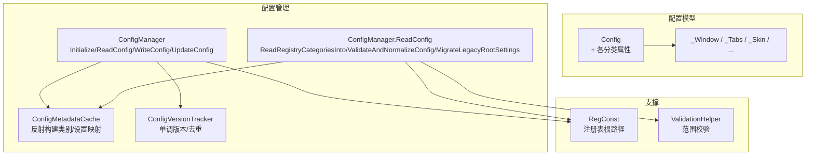
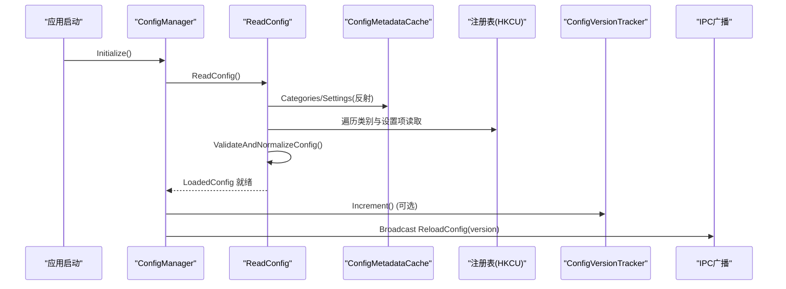
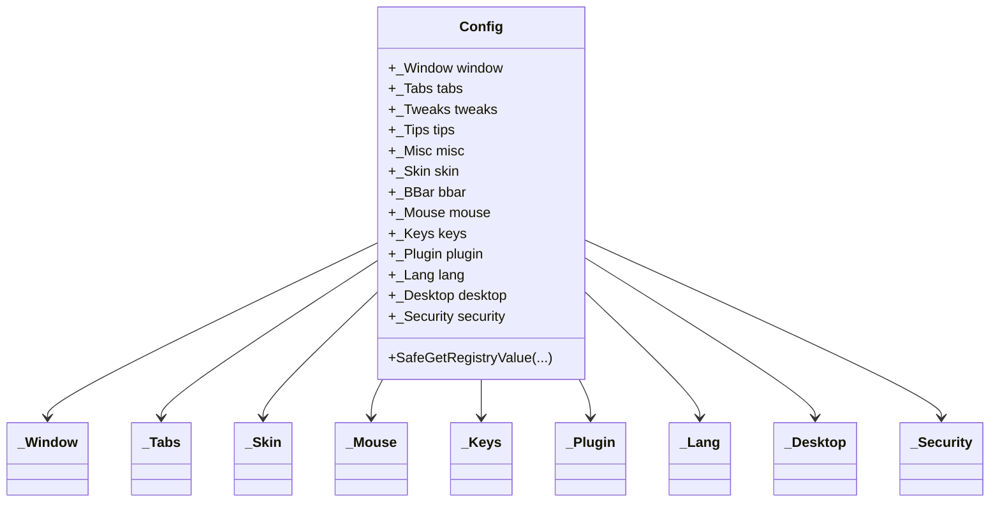
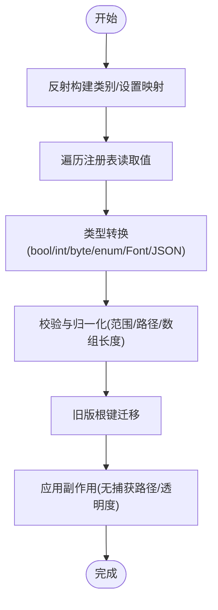
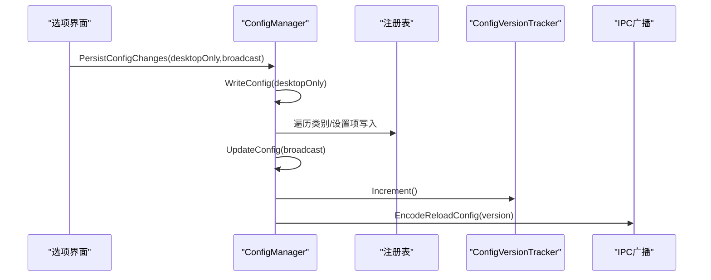
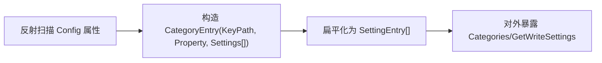
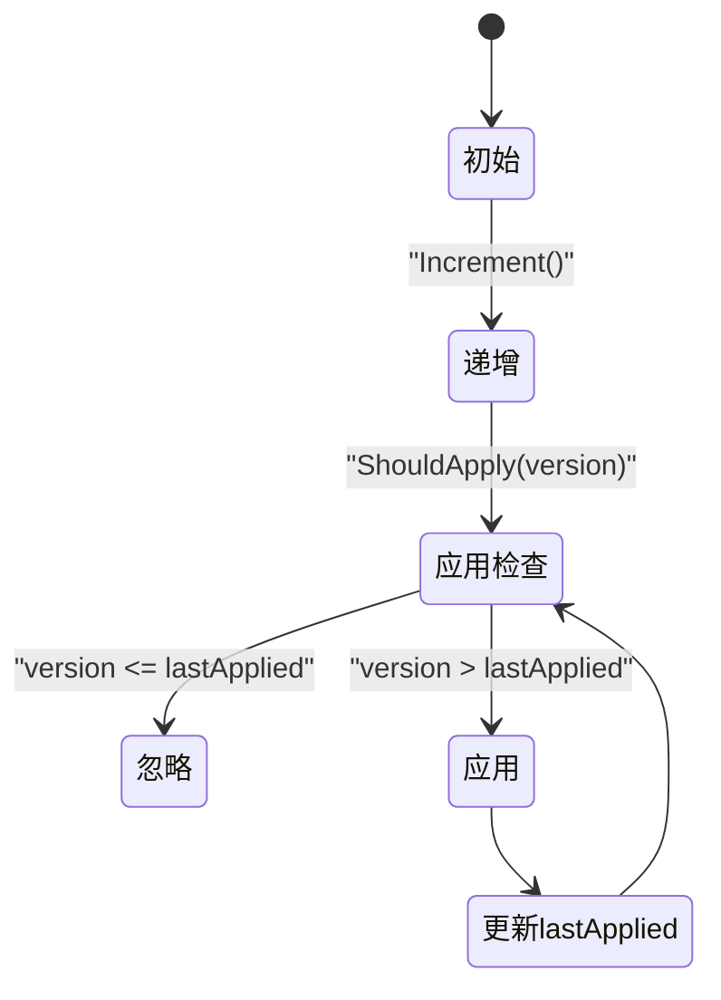
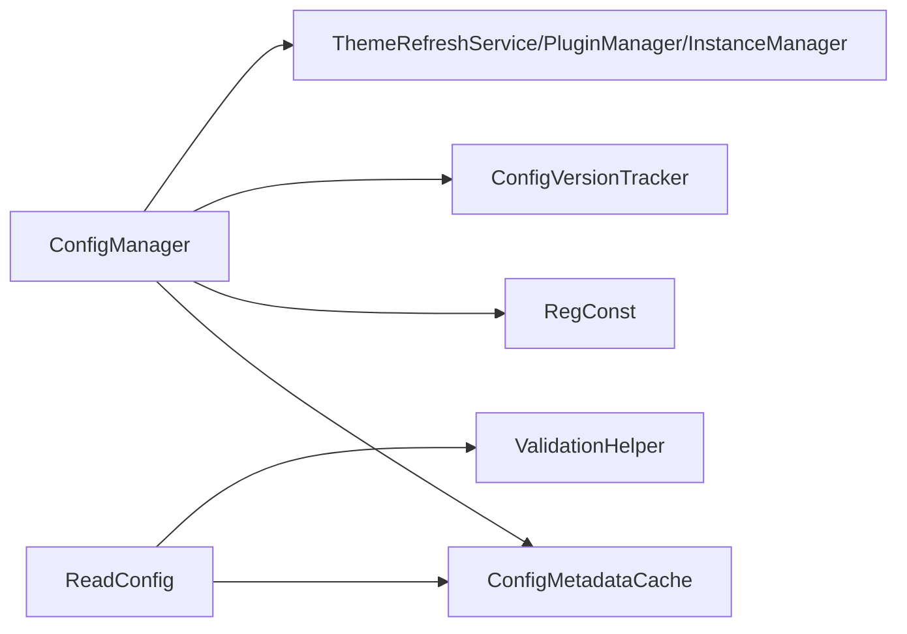

# 配置读取管理器

<cite>
**本文引用的文件**   
- [Config.cs](file://QTTabBar/Config.cs)
- [ConfigManager.cs](file://QTTabBar/ConfigManager.cs)
- [ConfigManager.ReadConfig.cs](file://QTTabBar/ConfigManager.ReadConfig.cs)
- [ConfigModels.cs](file://QTTabBar/ConfigModels.cs)
- [ConfigMetadataCache.cs](file://QTTabBar/ConfigMetadataCache.cs)
- [ConfigVersionTracker.cs](file://QTTabBar/ConfigVersionTracker.cs)
- [Constants.cs](file://QTTabBar/Constants.cs)
- [ValidationHelper.cs](file://QTTabBar/ValidationHelper.cs)
</cite>

## 目录
1. [简介](#简介)
2. [项目结构](#项目结构)
3. [核心组件](#核心组件)
4. [架构总览](#架构总览)
5. [详细组件分析](#详细组件分析)
6. [依赖关系分析](#依赖关系分析)
7. [性能考虑](#性能考虑)
8. [故障排查指南](#故障排查指南)
9. [结论](#结论)
10. [附录](#附录)

## 简介
本文件聚焦于 QTTabBar-Next 中的“配置读取管理器”，系统性梳理其数据模型、注册表读写、版本与广播机制、以及跨进程一致性保障。目标是帮助读者快速理解配置从磁盘到内存的完整链路，以及在多进程环境下的更新与同步策略。

## 项目结构
配置读取相关代码集中在 QTTabBar 工程内，采用“类拆分 + 元数据驱动”的方式组织：
- 配置数据模型：Config 及其子分类（_Window/_Tabs/_Skin 等）
- 配置加载/保存：ConfigManager（含 ReadConfig 拆分文件）
- 元数据缓存：ConfigMetadataCache（反射生成类别与设置项映射）
- 版本与广播：ConfigVersionTracker（单调递增版本号）
- 常量与校验：Constants（注册表路径）、ValidationHelper（数值范围校验）

图表来源
- [ConfigManager.cs:12-182](file://QTTabBar/ConfigManager.cs#L12-L182)
- [ConfigManager.ReadConfig.cs:13-172](file://QTTabBar/ConfigManager.ReadConfig.cs#L13-L172)
- [ConfigMetadataCache.cs:6-79](file://QTTabBar/ConfigMetadataCache.cs#L6-L79)
- [ConfigVersionTracker.cs:19-89](file://QTTabBar/ConfigVersionTracker.cs#L19-L89)
- [Constants.cs:22-34](file://QTTabBar/Constants.cs#L22-L34)
- [ValidationHelper.cs:4-22](file://QTTabBar/ValidationHelper.cs#L4-L22)

章节来源
- [Config.cs:38-118](file://QTTabBar/Config.cs#L38-L118)
- [ConfigManager.cs:12-182](file://QTTabBar/ConfigManager.cs#L12-L182)
- [ConfigManager.ReadConfig.cs:13-172](file://QTTabBar/ConfigManager.ReadConfig.cs#L13-L172)
- [ConfigMetadataCache.cs:6-79](file://QTTabBar/ConfigMetadataCache.cs#L6-L79)
- [ConfigVersionTracker.cs:19-89](file://QTTabBar/ConfigVersionTracker.cs#L19-L89)
- [Constants.cs:22-34](file://QTTabBar/Constants.cs#L22-L34)
- [ValidationHelper.cs:4-22](file://QTTabBar/ValidationHelper.cs#L4-L22)

## 核心组件
- Config：顶层配置对象，提供静态快捷访问器（如 Config.Window/Tabs/Skin 等），并封装安全的注册表读取方法。
- ConfigManager：配置生命周期入口，负责初始化、读取、写入、应用副作用（主题、语言、插件列表等）及跨进程广播。
- ConfigManager.ReadConfig：实现具体的注册表读取、旧版迁移、值域校验与默认值回退。
- ConfigMetadataCache：基于反射自动发现 Config 的分类与设置项，生成注册表键路径与类型信息，避免硬编码。
- ConfigVersionTracker：维护单调递增的版本号，用于跨进程去重和顺序保证。
- Constants.RegConst：集中定义注册表根路径与子路径。
- ValidationHelper：统一的数值范围校验工具。

章节来源
- [Config.cs:38-118](file://QTTabBar/Config.cs#L38-L118)
- [ConfigManager.cs:12-182](file://QTTabBar/ConfigManager.cs#L12-L182)
- [ConfigManager.ReadConfig.cs:13-172](file://QTTabBar/ConfigManager.ReadConfig.cs#L13-L172)
- [ConfigMetadataCache.cs:6-79](file://QTTabBar/ConfigMetadataCache.cs#L6-L79)
- [ConfigVersionTracker.cs:19-89](file://QTTabBar/ConfigVersionTracker.cs#L19-L89)
- [Constants.cs:22-34](file://QTTabBar/Constants.cs#L22-L34)
- [ValidationHelper.cs:4-22](file://QTTabBar/ValidationHelper.cs#L4-L22)

## 架构总览
配置读取流程分为“读入-校验-应用-持久化-广播”五个阶段，结合反射元数据与版本控制，确保一致性与可维护性。

图表来源
- [ConfigManager.cs:20-28](file://QTTabBar/ConfigManager.cs#L20-L28)
- [ConfigManager.ReadConfig.cs:13-26](file://QTTabBar/ConfigManager.ReadConfig.cs#L13-L26)
- [ConfigMetadataCache.cs:24-70](file://QTTabBar/ConfigMetadataCache.cs#L24-L70)
- [ConfigVersionTracker.cs:51-59](file://QTTabBar/ConfigVersionTracker.cs#L51-L59)

## 详细组件分析

### 配置数据模型（Config 与分类）
- 顶层 Config 聚合多个分类对象（窗口、标签、外观、鼠标、快捷键、插件、语言、桌面、安全等）。
- 每个分类包含若干可序列化的属性，支持基本类型、枚举、Font、Padding、数组/字典等复杂类型。
- 提供静态快捷访问器，简化上层调用。

图表来源
- [Config.cs:87-116](file://QTTabBar/Config.cs#L87-L116)
- [ConfigModels.cs:224-1027](file://QTTabBar/ConfigModels.cs#L224-L1027)

章节来源
- [Config.cs:38-118](file://QTTabBar/Config.cs#L38-L118)
- [ConfigModels.cs:224-1027](file://QTTabBar/ConfigModels.cs#L224-L1027)

### 配置读取与校验（ReadConfig）
- 通过反射获取所有分类与设置项，按注册表路径逐项读取。
- 类型转换：bool/int/byte/enum/Font/自定义序列化类型。
- 校验与归一化：对预览尺寸、历史计数、网络超时、标签尺寸、边距等进行范围限制；修复无效路径；补齐快捷键数组长度；清理空值。
- 旧版兼容：从根键迁移 BreakTabBar/NoCaptureAt/WindowAlpha 等字段。
- 异常保护：整体 try/catch，失败时保留上次已加载的配置。

图表来源
- [ConfigManager.ReadConfig.cs:28-72](file://QTTabBar/ConfigManager.ReadConfig.cs#L28-L72)
- [ConfigManager.ReadConfig.cs:74-141](file://QTTabBar/ConfigManager.ReadConfig.cs#L74-L141)
- [ConfigManager.ReadConfig.cs:143-169](file://QTTabBar/ConfigManager.ReadConfig.cs#L143-L169)
- [ValidationHelper.cs:4-22](file://QTTabBar/ValidationHelper.cs#L4-L22)

章节来源
- [ConfigManager.ReadConfig.cs:13-172](file://QTTabBar/ConfigManager.ReadConfig.cs#L13-L172)
- [ValidationHelper.cs:4-22](file://QTTabBar/ValidationHelper.cs#L4-L22)

### 配置写入与应用（WriteConfig/UpdateConfig）
- WriteConfig：遍历元数据，将当前内存配置写回注册表；特殊类型使用 JSON 序列化（Font 使用 XmlSerializableFont 包装）。
- UpdateConfig：应用运行时副作用（主题颜色、文本资源、插件列表、菜单渲染器、历史记录容量等），并通过 IPC 广播 ReloadConfig 通知其他进程。
- 部分持久化：PersistPartialWindowSetting 仅更新 Window 子项，减少不必要写入。

图表来源
- [ConfigManager.cs:115-118](file://QTTabBar/ConfigManager.cs#L115-L118)
- [ConfigManager.cs:120-164](file://QTTabBar/ConfigManager.cs#L120-L164)
- [ConfigManager.cs:45-71](file://QTTabBar/ConfigManager.cs#L45-L71)
- [ConfigVersionTracker.cs:51-59](file://QTTabBar/ConfigVersionTracker.cs#L51-L59)

章节来源
- [ConfigManager.cs:45-118](file://QTTabBar/ConfigManager.cs#L45-L118)
- [ConfigManager.cs:120-164](file://QTTabBar/ConfigManager.cs#L120-L164)

### 元数据缓存（ConfigMetadataCache）
- 基于反射扫描 Config 的所有可写属性作为“类别”，再扫描每个类别的可写属性作为“设置项”。
- 自动生成注册表键路径（根路径 + 类别名去掉前导下划线）与类型信息，供读写两端复用。
- 提供扁平化设置集合，便于批量写入或导出。

图表来源
- [ConfigMetadataCache.cs:40-70](file://QTTabBar/ConfigMetadataCache.cs#L40-L70)
- [Constants.cs:22-34](file://QTTabBar/Constants.cs#L22-L34)

章节来源
- [ConfigMetadataCache.cs:6-79](file://QTTabBar/ConfigMetadataCache.cs#L6-L79)
- [Constants.cs:22-34](file://QTTabBar/Constants.cs#L22-L34)

### 版本与广播（ConfigVersionTracker）
- 使用 Interlocked 维护单调递增的全局版本，避免并发丢失与重复处理。
- ShouldApply 用于客户端侧丢弃陈旧或重复的 ReloadConfig 消息，提升稳定性。
- ResetForInitRetry 在重试初始化时重置状态。

图表来源
- [ConfigVersionTracker.cs:51-86](file://QTTabBar/ConfigVersionTracker.cs#L51-L86)

章节来源
- [ConfigVersionTracker.cs:19-89](file://QTTabBar/ConfigVersionTracker.cs#L19-L89)

## 依赖关系分析
- ConfigManager 强依赖 ConfigMetadataCache（反射元数据）与 Constants.RegConst（注册表路径）。
- ReadConfig 依赖 ValidationHelper 进行数值范围校验。
- UpdateConfig 依赖 ThemeRefreshService、PluginManager、InstanceManager 等外部服务以应用副作用与广播。
- 配置模型（ConfigModels）为纯数据承载，不直接依赖 IO。

图表来源
- [ConfigManager.cs:45-118](file://QTTabBar/ConfigManager.cs#L45-L118)
- [ConfigManager.ReadConfig.cs:74-141](file://QTTabBar/ConfigManager.ReadConfig.cs#L74-L141)
- [ConfigMetadataCache.cs:40-70](file://QTTabBar/ConfigMetadataCache.cs#L40-L70)
- [Constants.cs:22-34](file://QTTabBar/Constants.cs#L22-L34)

章节来源
- [ConfigManager.cs:45-118](file://QTTabBar/ConfigManager.cs#L45-L118)
- [ConfigManager.ReadConfig.cs:74-141](file://QTTabBar/ConfigManager.ReadConfig.cs#L74-L141)
- [ConfigMetadataCache.cs:40-70](file://QTTabBar/ConfigMetadataCache.cs#L40-L70)
- [Constants.cs:22-34](file://QTTabBar/Constants.cs#L22-L34)

## 性能考虑
- 反射元数据仅在首次构建，后续复用，避免重复扫描。
- 写入时使用 DataContractJsonSerializer 对复杂类型进行序列化，注意 Font 的特殊包装以减少体积。
- 版本计数器使用无锁原子操作，降低广播路径开销。
- 建议：
  - 批量写入时合并注册表操作，减少 I/O 次数。
  - 对大对象（如图片路径、长字符串）增加变更检测，避免无意义重写。
  - 在 UpdateConfig 中按需刷新资源，避免全量重建。

[本节为通用指导，无需源码引用]

## 故障排查指南
- 读取失败回退：ReadConfig 捕获异常后保留上次 LoadedConfig，优先检查日志定位具体错误。
- 权限问题：SafeGetRegistryValue 对 UnauthorizedAccessException 进行记录并返回默认值，确认运行账户权限。
- 值域越界：若出现配置被“修正”，检查 ValidationHelper 的边界是否合理。
- 旧版兼容：若某些字段未生效，检查根键是否存在旧值并被迁移。
- 广播失效：确认 ConfigVersionTracker.Increment 与 IPC 广播是否成对执行，且接收端 ShouldApply 逻辑正常。

章节来源
- [ConfigManager.ReadConfig.cs:23-26](file://QTTabBar/ConfigManager.ReadConfig.cs#L23-L26)
- [Config.cs:65-85](file://QTTabBar/Config.cs#L65-L85)
- [ConfigManager.ReadConfig.cs:74-141](file://QTTabBar/ConfigManager.ReadConfig.cs#L74-L141)
- [ConfigManager.ReadConfig.cs:143-169](file://QTTabBar/ConfigManager.ReadConfig.cs#L143-L169)
- [ConfigVersionTracker.cs:72-86](file://QTTabBar/ConfigVersionTracker.cs#L72-L86)

## 结论
配置读取管理器通过“反射元数据 + 严格校验 + 版本广播”的组合，实现了高内聚、低耦合、可扩展的配置体系。该设计既保证了向后兼容与健壮性，又为跨进程一致性提供了可靠保障。建议在后续迭代中继续完善变更检测与增量写入，进一步提升性能与可观测性。

[本节为总结性内容，无需源码引用]

## 附录
- 注册表路径约定：HKCU\Software\QTTabBar\Config\<Category>\...
- 数据类型映射：
  - bool -> int(0/1)
  - byte -> int
  - enum -> string
  - Font -> Json(XmlSerializableFont)
  - 其他复杂类型 -> Json

章节来源
- [Constants.cs:22-34](file://QTTabBar/Constants.cs#L22-L34)
- [ConfigManager.ReadConfig.cs:41-68](file://QTTabBar/ConfigManager.ReadConfig.cs#L41-L68)
- [ConfigManager.cs:130-158](file://QTTabBar/ConfigManager.cs#L130-L158)