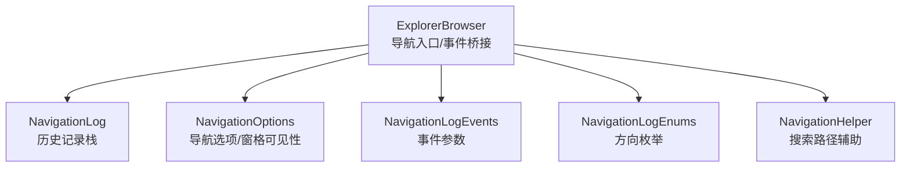
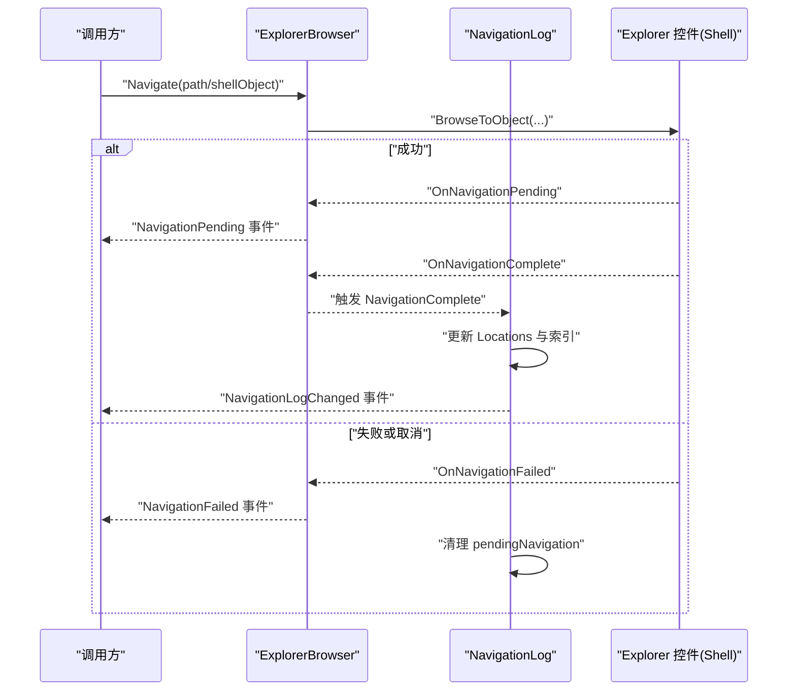
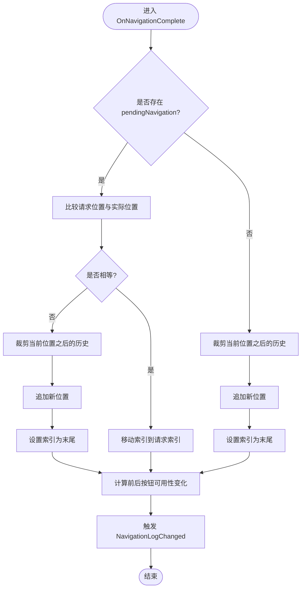
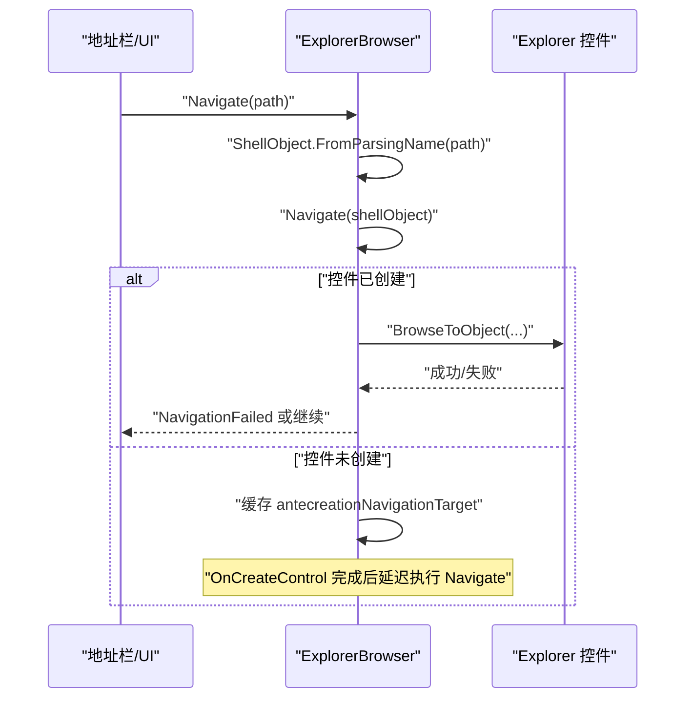
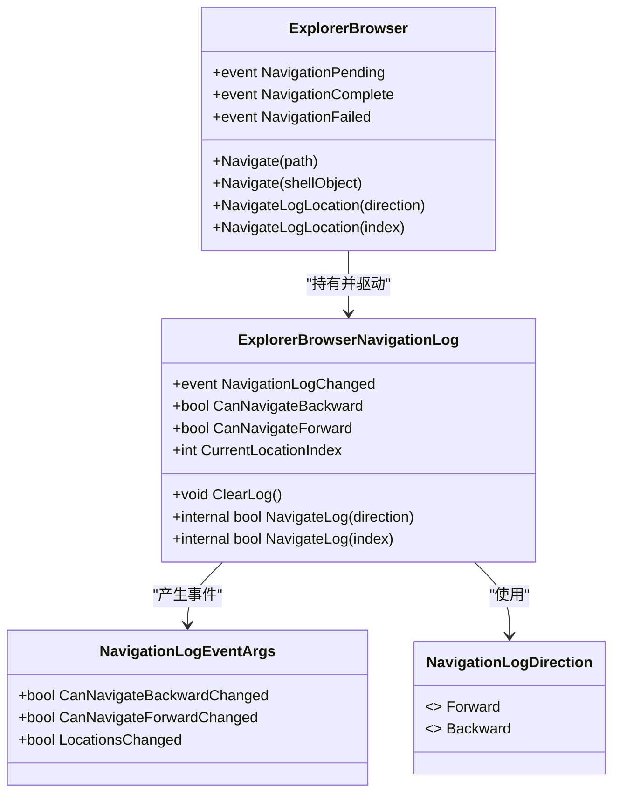
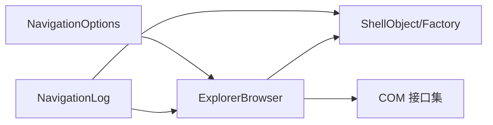

# 导航系统

<cite>
**本文引用的文件**   
- [ExplorerBrowser.cs](file://QTTabBar/ExplorerBrowser/ExplorerBrowser.cs)
- [NavigationLog.cs](file://QTTabBar/ExplorerBrowser/NavigationLog.cs)
- [NavigationOptions.cs](file://QTTabBar/ExplorerBrowser/NavigationOptions.cs)
- [NavigationLogEnums.cs](file://QTTabBar/ExplorerBrowser/NavigationLogEnums.cs)
- [NavigationLogEvents.cs](file://QTTabBar/ExplorerBrowser/NavigationLogEvents.cs)
- [NavigationHelper.cs](file://QTTabBar/NavigationHelper.cs)
</cite>

## 目录
1. [简介](#简介)
2. [项目结构](#项目结构)
3. [核心组件](#核心组件)
4. [架构总览](#架构总览)
5. [详细组件分析](#详细组件分析)
6. [依赖关系分析](#依赖关系分析)
7. [性能考量](#性能考量)
8. [故障排除指南](#故障排除指南)
9. [结论](#结论)
10. [附录](#附录)

## 简介
本文件聚焦于 QTTabBar-Next 的导航子系统，围绕前进/后退历史、路径导航、文件夹树集成、事件传播与监听器模式、与 Windows Explorer 原生导航的兼容与差异、跨进程通信与状态同步、以及调试与排障方法展开。文档以代码级事实为依据，结合可视化图示帮助读者理解实现原理与扩展方式。

## 项目结构
导航相关能力集中在 ExplorerBrowser 封装层及其配套的历史记录与选项配置模块中：
- ExplorerBrowser：对 Windows Explorer Browser 控件的 WinForms 封装，提供导航入口、事件桥接与视图操作。
- NavigationLog：维护访问过的 ShellObject 序列与当前索引，支持前进/后退与跳转。
- NavigationOptions：控制导航行为（如是否总是触发导航、仅一次导航等）及窗格可见性。
- NavigationLogEnums/NavigationLogEvents：定义方向枚举与历史记录变更事件参数。
- NavigationHelper：提供与搜索文件夹相关的辅助判断与常量路径获取。

图表来源
- [ExplorerBrowser.cs:14-50](file://QTTabBar/ExplorerBrowser/ExplorerBrowser.cs#L14-L50)
- [NavigationLog.cs:10-33](file://QTTabBar/ExplorerBrowser/NavigationLog.cs#L10-L33)
- [NavigationOptions.cs:8-16](file://QTTabBar/ExplorerBrowser/NavigationOptions.cs#L8-L16)
- [NavigationLogEnums.cs:5-13](file://QTTabBar/ExplorerBrowser/NavigationLogEnums.cs#L5-L13)
- [NavigationLogEvents.cs:7-18](file://QTTabBar/ExplorerBrowser/NavigationLogEvents.cs#L7-L18)
- [NavigationHelper.cs:9-27](file://QTTabBar/NavigationHelper.cs#L9-L27)

章节来源
- [ExplorerBrowser.cs:14-50](file://QTTabBar/ExplorerBrowser/ExplorerBrowser.cs#L14-L50)
- [NavigationLog.cs:10-33](file://QTTabBar/ExplorerBrowser/NavigationLog.cs#L10-L33)
- [NavigationOptions.cs:8-16](file://QTTabBar/ExplorerBrowser/NavigationOptions.cs#L8-L16)
- [NavigationLogEnums.cs:5-13](file://QTTabBar/ExplorerBrowser/NavigationLogEnums.cs#L5-L13)
- [NavigationLogEvents.cs:7-18](file://QTTabBar/ExplorerBrowser/NavigationLogEvents.cs#L7-L18)
- [NavigationHelper.cs:9-27](file://QTTabBar/NavigationHelper.cs#L9-L27)

## 核心组件
- ExplorerBrowser
  - 职责：封装 ExplorerBrowser 控件，暴露 Navigate(path/shellObject)、NavigateLogLocation(direction/index) 等导航 API；桥接 IExplorerBrowserEvents 回调为 .NET 事件；管理 Items/SelectedItems 集合与视图状态。
  - 关键点：在 OnCreateControl 阶段完成控件初始化、Advise 事件订阅、属性包设置与边框移除；通过 IMessageFilter 处理加速键翻译；在 BrowseToObject 失败时区分资源占用/取消与异常并触发相应事件。
- NavigationLog
  - 职责：维护 Locations 列表与 currentLocationIndex，提供 CanNavigateBackward/Forward、ClearLog、NavigateLog(direction/index)。
  - 关键点：在父控件的 NavigationComplete/NavigatioFailed 回调中更新历史栈与索引；当按日志导航但实际到达位置与请求不一致时，会裁剪后续历史并追加新项，保证“分支”后的历史正确。
- NavigationOptions
  - 职责：封装 ExplorerBrowser 的导航选项标志位与窗格可见性策略，影响后续导航行为。
- NavigationLogEnums/NavigationLogEvents
  - 职责：定义前进/后退方向与历史记录变更事件参数（是否可前进/后退变化、Locations 是否变化）。
- NavigationHelper
  - 职责：提供 IsSearchResultFolder 与 SearchFolderPath，用于识别搜索文件夹路径。

章节来源
- [ExplorerBrowser.cs:184-232](file://QTTabBar/ExplorerBrowser/ExplorerBrowser.cs#L184-L232)
- [ExplorerBrowser.cs:337-392](file://QTTabBar/ExplorerBrowser/ExplorerBrowser.cs#L337-L392)
- [ExplorerBrowser.cs:708-758](file://QTTabBar/ExplorerBrowser/ExplorerBrowser.cs#L708-L758)
- [NavigationLog.cs:10-106](file://QTTabBar/ExplorerBrowser/NavigationLog.cs#L10-L106)
- [NavigationLog.cs:108-207](file://QTTabBar/ExplorerBrowser/NavigationLog.cs#L108-L207)
- [NavigationOptions.cs:8-86](file://QTTabBar/ExplorerBrowser/NavigationOptions.cs#L8-L86)
- [NavigationLogEnums.cs:5-13](file://QTTabBar/ExplorerBrowser/NavigationLogEnums.cs#L5-L13)
- [NavigationLogEvents.cs:7-18](file://QTTabBar/ExplorerBrowser/NavigationLogEvents.cs#L7-L18)
- [NavigationHelper.cs:15-26](file://QTTabBar/NavigationHelper.cs#L15-L26)

## 架构总览
下图展示了从调用方到 Explorer 控件的事件流与历史记录更新过程。

图表来源
- [ExplorerBrowser.cs:184-232](file://QTTabBar/ExplorerBrowser/ExplorerBrowser.cs#L184-L232)
- [ExplorerBrowser.cs:337-392](file://QTTabBar/ExplorerBrowser/ExplorerBrowser.cs#L337-L392)
- [NavigationLog.cs:147-207](file://QTTabBar/ExplorerBrowser/NavigationLog.cs#L147-L207)

## 详细组件分析

### 前进/后退与历史记录栈
- 数据结构
  - Locations：List<ShellObject>，保存已访问的 ShellObject。
  - currentLocationIndex：当前指针，-1 表示空。
  - pendingNavigation：记录“按日志导航”的请求目标与索引，用于区分“由日志触发的导航”和“外部导航”。
- 关键流程
  - ClearLog：清空 Locations 与索引，并广播 LocationsChanged 与前后按钮可用性变化。
  - NavigateLog(direction/index)：计算目标索引，设置 pendingNavigation，委托父控件执行 Navigate。
  - OnNavigationComplete：若 pendingNavigation 存在且最终位置与请求不同，则裁剪当前位置之后的历史并追加新项；否则仅移动索引。随后比较前后按钮可用性变化并触发 NavigationLogChanged。
  - OnNavigationFailed：清除 pendingNavigation，避免状态残留。
- 复杂度
  - 插入/删除尾部：均摊 O(1)。
  - 分支后裁剪：O(k)，k 为被裁剪的历史长度。
  - 查询 CanNavigateBackward/Forward：O(1)。

图表来源
- [NavigationLog.cs:147-207](file://QTTabBar/ExplorerBrowser/NavigationLog.cs#L147-L207)

章节来源
- [NavigationLog.cs:10-106](file://QTTabBar/ExplorerBrowser/NavigationLog.cs#L10-L106)
- [NavigationLog.cs:108-207](file://QTTabBar/ExplorerBrowser/NavigationLog.cs#L108-L207)
- [NavigationLogEnums.cs:5-13](file://QTTabBar/ExplorerBrowser/NavigationLogEnums.cs#L5-L13)
- [NavigationLogEvents.cs:7-18](file://QTTabBar/ExplorerBrowser/NavigationLogEvents.cs#L7-L18)

### 路径导航机制（地址栏输入、验证与自动补全）
- 入口
  - ExplorerBrowser.Navigate(string path)：将字符串解析为 ShellObject，再走对象导航。
  - ExplorerBrowser.Navigate(ShellObject shellObject)：调用底层 BrowseToObject；若控件尚未创建，缓存目标并在创建后延迟执行。
- 验证与错误处理
  - 若 shellObject 为空，抛出参数异常。
  - 若控件未创建，缓存 antecreationNavigationTarget，稍后在 OnCreateControl 中执行。
  - 若返回失败码：
    - 资源占用或取消：触发 NavigationFailed 事件。
    - 其他错误：抛出通用控件异常。
- 自动补全
  - 仓库中未发现地址栏自动补全的实现逻辑。该功能通常由上层 UI（如地址栏控件）负责，不在当前导航核心代码范围内。
- 搜索文件夹识别
  - NavigationHelper.IsSearchResultFolder 与 SearchFolderPath 可用于识别搜索文件夹路径，便于在上层进行特殊处理（例如禁用某些导航规则）。

图表来源
- [ExplorerBrowser.cs:184-232](file://QTTabBar/ExplorerBrowser/ExplorerBrowser.cs#L184-L232)
- [ExplorerBrowser.cs:708-758](file://QTTabBar/ExplorerBrowser/ExplorerBrowser.cs#L708-L758)
- [NavigationHelper.cs:15-26](file://QTTabBar/NavigationHelper.cs#L15-L26)

章节来源
- [ExplorerBrowser.cs:184-232](file://QTTabBar/ExplorerBrowser/ExplorerBrowser.cs#L184-L232)
- [ExplorerBrowser.cs:708-758](file://QTTabBar/ExplorerBrowser/ExplorerBrowser.cs#L708-L758)
- [NavigationHelper.cs:15-26](file://QTTabBar/NavigationHelper.cs#L15-L26)

### 文件夹树视图集成（节点展开、搜索过滤、性能优化）
- 集成点
  - ExplorerBrowser 通过 IExplorerPaneVisibility 响应窗格可见性查询，从而控制“导航窗格”等区域显示。
  - 通过 ICommDlgBrowser3 接口参与对话框浏览器的生命周期与通知。
- 节点展开与搜索过滤
  - 仓库中未发现直接操作“文件夹树”节点展开/折叠或搜索过滤的代码。这些能力通常由 Explorer 自身或上层自定义树控件实现，不属于当前导航核心范围。
- 性能优化建议
  - 使用 NavigationOptions.Flags 控制不必要的重复导航。
  - 利用 ContentOptions 与 PaneVisibility 减少不必要的面板刷新。
  - 批量操作前考虑延迟刷新，避免频繁触发 ItemsChanged/SelectionChanged。

章节来源
- [ExplorerBrowser.cs:249-298](file://QTTabBar/ExplorerBrowser/ExplorerBrowser.cs#L249-L298)
- [ExplorerBrowser.cs:300-320](file://QTTabBar/ExplorerBrowser/ExplorerBrowser.cs#L300-L320)
- [NavigationOptions.cs:18-86](file://QTTabBar/ExplorerBrowser/NavigationOptions.cs#L18-L86)

### 导航事件传播与监听器模式
- 事件模型
  - NavigationPending：在开始导航前触发，允许监听者取消。
  - NavigationComplete：导航完成，携带 NewLocation。
  - NavigationFailed：导航失败或取消，携带 FailedLocation。
  - NavigationLogChanged：历史记录变化，包含 CanNavigateBackwardChanged/CanNavigateForwardChanged/LocationsChanged。
- 传播链路
  - Shell 回调 -> ExplorerBrowser 事件 -> 监听者（含 NavigationLog）。
  - NavigationLog 在收到 NavigationComplete/NavigatioFailed 后更新内部状态并再次发出 NavigationLogChanged。

图表来源
- [ExplorerBrowser.cs:84-106](file://QTTabBar/ExplorerBrowser/ExplorerBrowser.cs#L84-L106)
- [ExplorerBrowser.cs:234-242](file://QTTabBar/ExplorerBrowser/ExplorerBrowser.cs#L234-L242)
- [NavigationLog.cs:35-106](file://QTTabBar/ExplorerBrowser/NavigationLog.cs#L35-L106)
- [NavigationLogEvents.cs:7-18](file://QTTabBar/ExplorerBrowser/NavigationLogEvents.cs#L7-L18)
- [NavigationLogEnums.cs:5-13](file://QTTabBar/ExplorerBrowser/NavigationLogEnums.cs#L5-L13)

章节来源
- [ExplorerBrowser.cs:84-106](file://QTTabBar/ExplorerBrowser/ExplorerBrowser.cs#L84-L106)
- [ExplorerBrowser.cs:337-392](file://QTTabBar/ExplorerBrowser/ExplorerBrowser.cs#L337-L392)
- [NavigationLog.cs:35-106](file://QTTabBar/ExplorerBrowser/NavigationLog.cs#L35-L106)
- [NavigationLogEvents.cs:7-18](file://QTTabBar/ExplorerBrowser/NavigationLogEvents.cs#L7-L18)
- [NavigationLogEnums.cs:5-13](file://QTTabBar/ExplorerBrowser/NavigationLogEnums.cs#L5-L13)

### 与 Windows Explorer 原生导航的兼容性与差异
- 兼容性
  - 通过 IExplorerBrowserEvents 与 ICommDlgBrowser3 与 Explorer 控件交互，遵循其生命周期与事件约定。
  - 通过 IExplorerPaneVisibility 控制窗格可见性，确保与 Explorer 的行为一致。
- 差异与注意事项
  - 控件未创建时的导航会被缓存并在创建后执行，避免早期调用丢失。
  - 当按日志导航但实际结果与请求不一致时，会裁剪后续历史并追加新项，保持“分支”语义。
  - 某些 COM 接口（如 ICommDlgBrowser2）因封送问题被拒绝，以避免非托管侧异常。

章节来源
- [ExplorerBrowser.cs:708-758](file://QTTabBar/ExplorerBrowser/ExplorerBrowser.cs#L708-L758)
- [ExplorerBrowser.cs:434-481](file://QTTabBar/ExplorerBrowser/ExplorerBrowser.cs#L434-L481)
- [NavigationLog.cs:147-207](file://QTTabBar/ExplorerBrowser/NavigationLog.cs#L147-L207)

### 自定义导航规则与路径映射示例（思路）
说明：以下为基于现有接口的实现思路，不直接粘贴源码。
- 在调用 Navigate(path) 之前，先通过 NavigationHelper.IsSearchResultFolder 判断是否为搜索文件夹，若是则可应用不同的导航策略（例如跳过某些校验或启用只读模式）。
- 订阅 ExplorerBrowser.NavigationPending，在 PendingLocation 可用时对路径进行二次校验或重写（例如将虚拟路径映射为真实 ShellObject），并通过 args.Cancel 阻止非法导航。
- 订阅 ExplorerBrowser.NavigationComplete，根据 NewLocation 更新 UI 状态（如地址栏文本、面包屑、标签标题等）。
- 需要持久化“最近访问”或“书签”时，可在 NavigationComplete 中将 ShellObject 的标识信息写入配置或数据库，并在启动时恢复。

章节来源
- [NavigationHelper.cs:15-26](file://QTTabBar/NavigationHelper.cs#L15-L26)
- [ExplorerBrowser.cs:366-392](file://QTTabBar/ExplorerBrowser/ExplorerBrowser.cs#L366-L392)
- [ExplorerBrowser.cs:337-351](file://QTTabBar/ExplorerBrowser/ExplorerBrowser.cs#L337-L351)

### 跨进程通信与状态同步（方案）
说明：以下为实现方案建议，需结合上层 IPC 机制落地。
- 多实例/多进程场景
  - 主进程维护统一的 NavigationLog 与全局配置，子进程通过 IPC 请求导航或查询当前状态。
  - 使用唯一窗口消息或命名管道传递命令，命令体包含目标路径、动作类型（前进/后退/跳转）、时间戳等。
- 状态同步
  - 采用“事件驱动 + 版本号”的方式：每次导航成功后递增版本号，并将新版本号随事件下发，接收端忽略旧版本。
  - 对于冲突（两个进程同时发起导航），采用“最后写入优先”或“中心仲裁”策略。
- 可靠性
  - 发送端幂等：相同请求多次发送不会产生副作用。
  - 接收端去抖：短时间内合并多次导航请求。
  - 失败重试与回退：网络/IPC 失败时回滚本地状态并提示用户。

[本节为概念性方案说明，不涉及具体文件]

## 依赖关系分析
- ExplorerBrowser 依赖
  - Common 命名空间下的 ShellObject、ShellObjectFactory、HResult、CommonControlException 等。
  - Windows Forms 控件与 COM 互操作（IShellView、IFolderView2、IExplorerPaneVisibility、ICommDlgBrowser3 等）。
- NavigationLog 依赖
  - ExplorerBrowser 的 NavigationComplete/NavigatioFailed 事件。
  - ShellObject 的比较与工厂方法。
- NavigationOptions 依赖
  - ExplorerBrowser 的底层 Options 标志位与窗格可见性。

图表来源
- [ExplorerBrowser.cs:184-232](file://QTTabBar/ExplorerBrowser/ExplorerBrowser.cs#L184-L232)
- [NavigationLog.cs:147-207](file://QTTabBar/ExplorerBrowser/NavigationLog.cs#L147-L207)
- [NavigationOptions.cs:18-86](file://QTTabBar/ExplorerBrowser/NavigationOptions.cs#L18-L86)

章节来源
- [ExplorerBrowser.cs:184-232](file://QTTabBar/ExplorerBrowser/ExplorerBrowser.cs#L184-L232)
- [NavigationLog.cs:147-207](file://QTTabBar/ExplorerBrowser/NavigationLog.cs#L147-L207)
- [NavigationOptions.cs:18-86](file://QTTabBar/ExplorerBrowser/NavigationOptions.cs#L18-L86)

## 性能考量
- 避免重复导航：通过 NavigationOptions.AlwaysNavigate 控制是否强制触发导航，减少无意义刷新。
- 批量更新：在批量修改选择或内容时，尽量合并事件，降低 UI 重绘压力。
- 历史裁剪：当发生分支导航时，及时裁剪冗余历史，避免列表膨胀。
- 视图模式读取：仅在必要时获取 IFolderView2 并释放引用，防止 COM 引用泄漏。

[本节为通用指导，不涉及具体文件]

## 故障排除指南
- 常见问题
  - 导航失败：检查 BrowseToObject 返回码，区分资源占用/取消与其他错误；确认 ShellObject 是否有效。
  - 历史不同步：确认 NavigationComplete/NavigatioFailed 是否被正确处理；检查 pendingNavigation 是否在失败时被清理。
  - 控件未创建导致导航丢失：确认 antecreationNavigationTarget 是否正确缓存并在 OnCreateControl 后执行。
- 定位技巧
  - 订阅 NavigationPending/NavigationComplete/NavigationFailed，打印 PendingLocation/NewLocation/FailedLocation。
  - 在 NavigationLogChanged 中输出 CanNavigateBackward/Forward 的变化，验证历史栈一致性。
  - 使用日志工具（如 QTUtility2.log）记录关键路径与返回值。

章节来源
- [ExplorerBrowser.cs:184-232](file://QTTabBar/ExplorerBrowser/ExplorerBrowser.cs#L184-L232)
- [ExplorerBrowser.cs:337-392](file://QTTabBar/ExplorerBrowser/ExplorerBrowser.cs#L337-L392)
- [NavigationLog.cs:147-207](file://QTTabBar/ExplorerBrowser/NavigationLog.cs#L147-L207)

## 结论
QTTabBar-Next 的导航系统以 ExplorerBrowser 为核心，结合 NavigationLog 与 NavigationOptions 实现了稳健的前进/后退历史、灵活的导航选项与完善的错误处理。通过事件驱动的传播机制，上层可以方便地实现自定义导航规则、路径映射与跨进程状态同步。建议在复杂场景中结合 NavigationPending 做前置校验，并在 NavigationComplete 中统一更新 UI 与持久化状态，以获得一致的用户体验。

## 附录
- 术语
  - ShellObject：Windows Shell 对象的封装，代表文件或文件夹。
  - IExplorerBrowserEvents：Explorer 浏览器控件的事件回调接口。
  - ICommDlgBrowser3：对话框浏览器接口，用于与 Explorer 控件协作。
- 参考路径
  - 导航入口与错误处理：[ExplorerBrowser.cs:184-232](file://QTTabBar/ExplorerBrowser/ExplorerBrowser.cs#L184-L232)
  - 事件桥接与取消：[ExplorerBrowser.cs:337-392](file://QTTabBar/ExplorerBrowser/ExplorerBrowser.cs#L337-L392)
  - 历史记录更新与分支处理：[NavigationLog.cs:147-207](file://QTTabBar/ExplorerBrowser/NavigationLog.cs#L147-L207)
  - 导航选项与窗格可见性：[NavigationOptions.cs:18-86](file://QTTabBar/ExplorerBrowser/NavigationOptions.cs#L18-L86)
  - 搜索文件夹辅助：[NavigationHelper.cs:15-26](file://QTTabBar/NavigationHelper.cs#L15-L26)