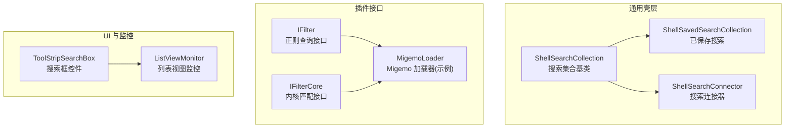
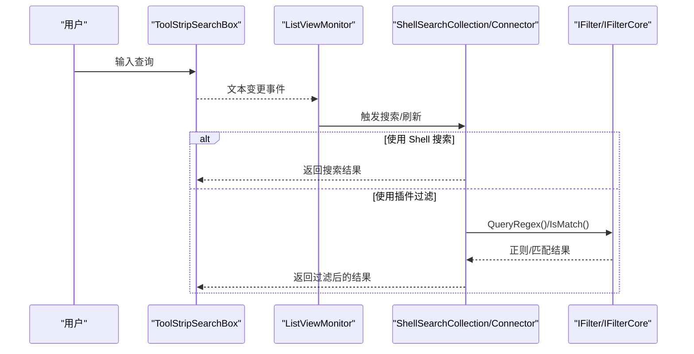
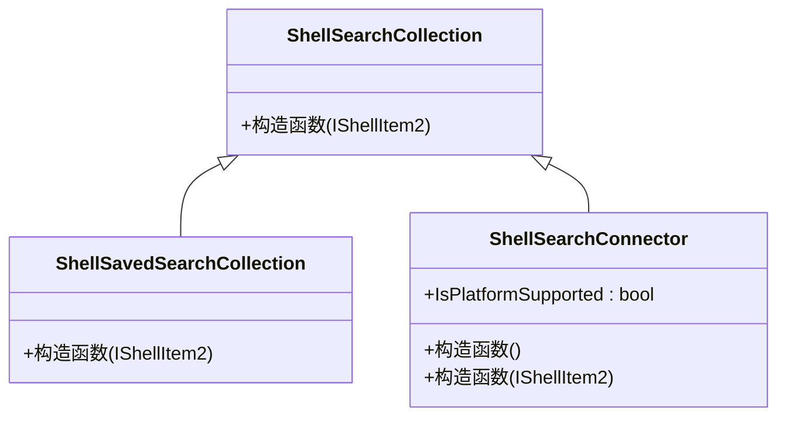
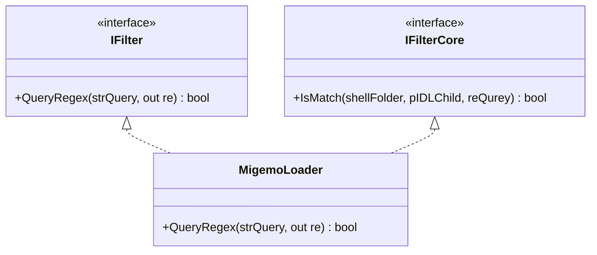
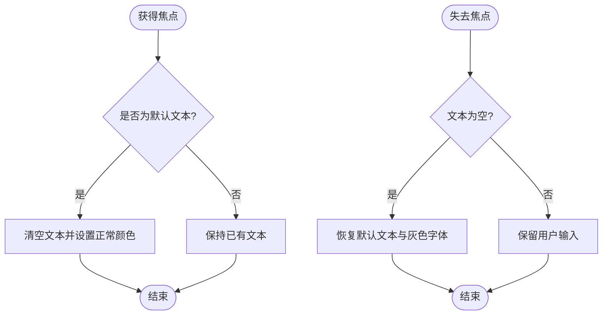
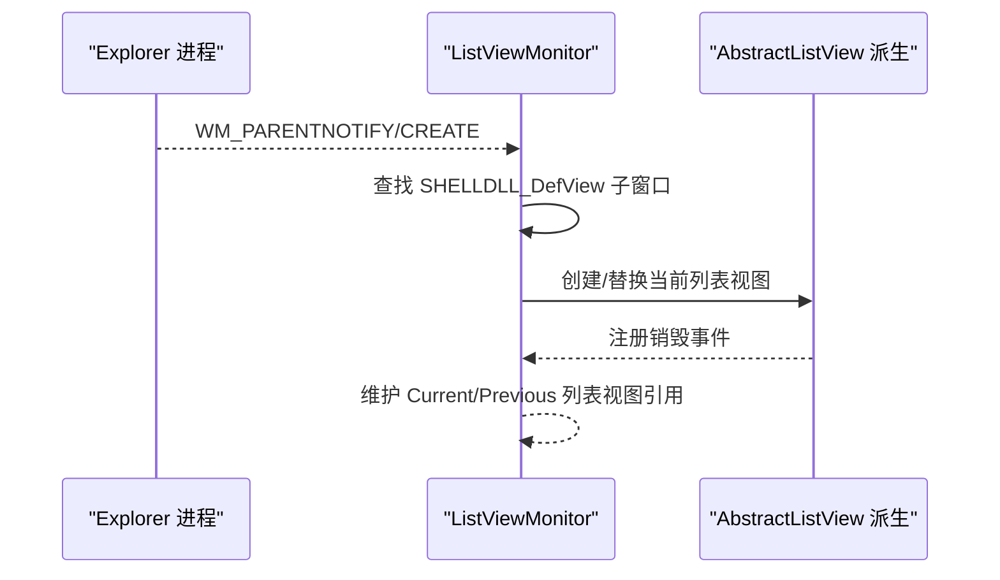
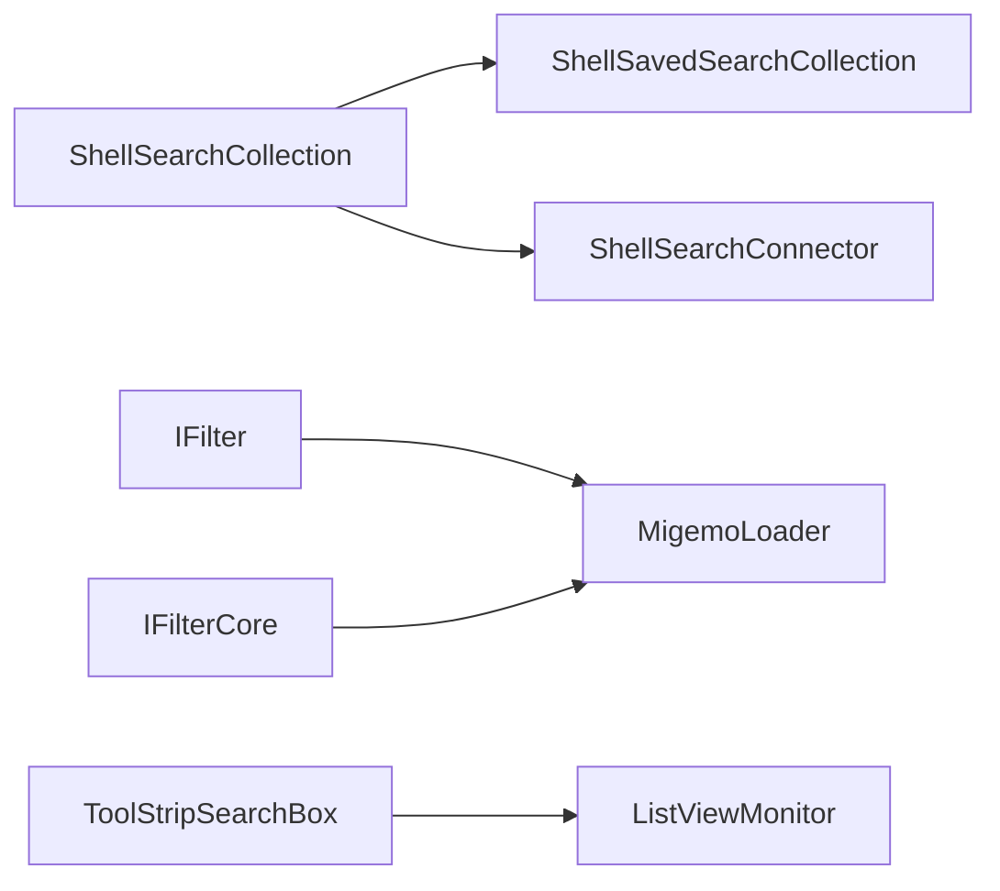

# 搜索和过滤功能

<cite>
**本文引用的文件**   
- [ShellSearchCollection.cs](file://QTTabBar/Common/ShellSearchCollection.cs)
- [ShellSavedSearchCollection.cs](file://QTTabBar/Common/ShellSavedSearchCollection.cs)
- [ShellSearchConnector.cs](file://QTTabBar/Common/ShellSearchConnector.cs)
- [IFilter.cs](file://QTPluginLib/IFilter.cs)
- [IFilterCore.cs](file://QTPluginLib/IFilterCore.cs)
- [MigemoLoader.cs](file://Plugins/MigemoLoader/MigemoLoader.cs)
- [ListViewMonitor.cs](file://QTTabBar/ListViewMonitor.cs)
- [ToolStripClasses.cs](file://QTTabBar/ToolStripClasses.cs)
</cite>

## 目录
1. [简介](#简介)
2. [项目结构](#项目结构)
3. [核心组件](#核心组件)
4. [架构总览](#架构总览)
5. [详细组件分析](#详细组件分析)
6. [依赖关系分析](#依赖关系分析)
7. [性能考虑](#性能考虑)
8. [故障排查指南](#故障排查指南)
9. [结论](#结论)
10. [附录](#附录)

## 简介
本章节聚焦 QTTabBar-Next 的“搜索与过滤”能力，围绕以下目标展开：
- 实时搜索算法的实现思路（索引构建、模糊匹配、性能优化）
- 高级过滤条件处理机制（日期范围、文件大小、文件类型等多维度筛选）
- 搜索结果高亮显示与快速定位
- 文件监控器工作原理（文件系统事件监听与增量更新）
- 搜索历史的保存与管理
- 自定义搜索规则与过滤器的实现方式
- 与 Windows Search 服务的集成与查询语法支持
- 搜索功能的性能调优与用户体验优化建议

说明：本文所有技术细节均基于仓库中现有代码与接口进行归纳与解读。对于未在源码中直接实现的特性，将以“概念性说明”标注，避免将未实现行为当作已实现功能。

## 项目结构
与搜索和过滤相关的代码主要分布在如下位置：
- Common 层：封装对 Windows Shell 搜索集合与连接器的访问
- PluginLib：定义插件侧过滤器接口，用于扩展正则与匹配逻辑
- UI 控件：提供搜索框输入体验
- 列表视图监控：捕获当前资源管理器列表视图变化，为增量刷新提供基础

图示来源
- [ShellSearchCollection.cs:1-16](file://QTTabBar/Common/ShellSearchCollection.cs#L1-L16)
- [ShellSavedSearchCollection.cs:1-15](file://QTTabBar/Common/ShellSavedSearchCollection.cs#L1-L15)
- [ShellSearchConnector.cs:1-30](file://QTTabBar/Common/ShellSearchConnector.cs#L1-L30)
- [IFilter.cs:1-25](file://QTPluginLib/IFilter.cs#L1-L25)
- [IFilterCore.cs:1-27](file://QTPluginLib/IFilterCore.cs#L1-L27)
- [MigemoLoader.cs:1-200](file://Plugins/MigemoLoader/MigemoLoader.cs#L1-L200)
- [ToolStripClasses.cs:140-290](file://QTTabBar/ToolStripClasses.cs#L140-L290)
- [ListViewMonitor.cs:1-166](file://QTTabBar/ListViewMonitor.cs#L1-L166)

章节来源
- [ShellSearchCollection.cs:1-16](file://QTTabBar/Common/ShellSearchCollection.cs#L1-L16)
- [ShellSavedSearchCollection.cs:1-15](file://QTTabBar/Common/ShellSavedSearchCollection.cs#L1-L15)
- [ShellSearchConnector.cs:1-30](file://QTTabBar/Common/ShellSearchConnector.cs#L1-L30)
- [IFilter.cs:1-25](file://QTPluginLib/IFilter.cs#L1-L25)
- [IFilterCore.cs:1-27](file://QTPluginLib/IFilterCore.cs#L1-L27)
- [MigemoLoader.cs:1-200](file://Plugins/MigemoLoader/MigemoLoader.cs#L1-L200)
- [ToolStripClasses.cs:140-290](file://QTTabBar/ToolStripClasses.cs#L140-L290)
- [ListViewMonitor.cs:1-166](file://QTTabBar/ListViewMonitor.cs#L1-L166)

## 核心组件
- ShellSearchCollection：搜索相关类的基类，统一继承自容器抽象，承载 Shell 搜索集合的通用能力。
- ShellSavedSearchCollection：表示“已保存搜索”，在 Vista 及以上平台可用。
- ShellSearchConnector：表示“搜索连接器”，在 Win7 及以上平台可用，并暴露平台支持检测。
- IFilter / IFilterCore：插件侧过滤器接口，分别提供“正则表达式解析”和“内核级匹配”能力。
- MigemoLoader：示例插件，演示如何实现 IFilter 以支持日文字符的模糊检索。
- ToolStripSearchBox：工具栏中的搜索框控件，负责用户输入、默认文本提示、拖拽调整宽度等交互。
- ListViewMonitor：监听 Explorer 列表视图创建/销毁，维护当前/上一个 AbstractListView 引用，为后续增量刷新提供基础。

章节来源
- [ShellSearchCollection.cs:1-16](file://QTTabBar/Common/ShellSearchCollection.cs#L1-L16)
- [ShellSavedSearchCollection.cs:1-15](file://QTTabBar/Common/ShellSavedSearchCollection.cs#L1-L15)
- [ShellSearchConnector.cs:1-30](file://QTTabBar/Common/ShellSearchConnector.cs#L1-L30)
- [IFilter.cs:1-25](file://QTPluginLib/IFilter.cs#L1-L25)
- [IFilterCore.cs:1-27](file://QTPluginLib/IFilterCore.cs#L1-L27)
- [MigemoLoader.cs:1-200](file://Plugins/MigemoLoader/MigemoLoader.cs#L1-L200)
- [ToolStripClasses.cs:140-290](file://QTTabBar/ToolStripClasses.cs#L140-L290)
- [ListViewMonitor.cs:1-166](file://QTTabBar/ListViewMonitor.cs#L1-L166)

## 架构总览
下图展示了搜索与过滤在整体系统中的角色与交互：
- 用户通过 ToolStripSearchBox 输入查询
- 系统根据配置选择使用 Shell 搜索（Windows Search）或本地过滤（插件 IFilter/IFilterCore）
- 列表视图由 ListViewMonitor 跟踪，以便在内容变化时触发增量更新
- 结果展示与高亮由上层 UI 渲染决定（具体高亮逻辑不在本节源码范围内）

图示来源
- [ToolStripClasses.cs:140-290](file://QTTabBar/ToolStripClasses.cs#L140-L290)
- [ListViewMonitor.cs:1-166](file://QTTabBar/ListViewMonitor.cs#L1-L166)
- [ShellSearchCollection.cs:1-16](file://QTTabBar/Common/ShellSearchCollection.cs#L1-L16)
- [ShellSearchConnector.cs:1-30](file://QTTabBar/Common/ShellSearchConnector.cs#L1-L30)
- [IFilter.cs:1-25](file://QTPluginLib/IFilter.cs#L1-L25)
- [IFilterCore.cs:1-27](file://QTPluginLib/IFilterCore.cs#L1-L27)

## 详细组件分析

### Shell 搜索集合与连接器
- ShellSearchCollection：作为搜索集合的基类，提供统一的构造入口与 ShellItem 绑定能力。
- ShellSavedSearchCollection：封装“已保存搜索”的 Shell 集合，要求 Vista 及以上。
- ShellSearchConnector：封装“搜索连接器”的 Shell 集合，要求 Win7 及以上，并提供 IsPlatformSupported 静态属性用于运行时能力检测。

图示来源
- [ShellSearchCollection.cs:1-16](file://QTTabBar/Common/ShellSearchCollection.cs#L1-L16)
- [ShellSavedSearchCollection.cs:1-15](file://QTTabBar/Common/ShellSavedSearchCollection.cs#L1-L15)
- [ShellSearchConnector.cs:1-30](file://QTTabBar/Common/ShellSearchConnector.cs#L1-L30)

章节来源
- [ShellSearchCollection.cs:1-16](file://QTTabBar/Common/ShellSearchCollection.cs#L1-L16)
- [ShellSavedSearchCollection.cs:1-15](file://QTTabBar/Common/ShellSavedSearchCollection.cs#L1-L15)
- [ShellSearchConnector.cs:1-30](file://QTTabBar/Common/ShellSearchConnector.cs#L1-L30)

### 插件过滤器接口与示例
- IFilter：提供 QueryRegex(string, out Regex)，用于将用户查询转换为正则表达式，便于前端或中间层进行模式匹配。
- IFilterCore：提供 IsMatch(IShellFolder, IntPtr, Regex)，用于在更底层对单个子项执行匹配判断。
- MigemoLoader：示例实现 IFilter，演示如何加载外部库以支持多语言字符的模糊匹配（如日文）。

图示来源
- [IFilter.cs:1-25](file://QTPluginLib/IFilter.cs#L1-L25)
- [IFilterCore.cs:1-27](file://QTPluginLib/IFilterCore.cs#L1-L27)
- [MigemoLoader.cs:1-200](file://Plugins/MigemoLoader/MigemoLoader.cs#L1-L200)

章节来源
- [IFilter.cs:1-25](file://QTPluginLib/IFilter.cs#L1-L25)
- [IFilterCore.cs:1-27](file://QTPluginLib/IFilterCore.cs#L1-L27)
- [MigemoLoader.cs:1-200](file://Plugins/MigemoLoader/MigemoLoader.cs#L1-L200)

### 搜索框控件与输入交互
- ToolStripSearchBox：封装 TextBox 的行为，包括默认文本提示、焦点切换时的文本清空/恢复、拖拽调整宽度、禁止重复触发文本变更等。
- 该控件是用户输入搜索关键词的直接入口，其文本变更事件可驱动上层搜索流程。

图示来源
- [ToolStripClasses.cs:140-290](file://QTTabBar/ToolStripClasses.cs#L140-L290)

章节来源
- [ToolStripClasses.cs:140-290](file://QTTabBar/ToolStripClasses.cs#L140-L290)

### 列表视图监控与增量更新
- ListViewMonitor：监听 Explorer 主窗口的消息，识别 SHELLDLL_DefView 及其子窗口 SysListView32/DirectUIHWND，动态创建/替换当前列表视图包装对象（ExtendedSysListView32 或 ExtendedItemsView），并在销毁时回退到上一个实例，保证稳定性。
- 该机制为“增量更新”提供了基础：当列表视图重建或内容变化时，上层可据此触发局部刷新而非全量重绘。

图示来源
- [ListViewMonitor.cs:1-166](file://QTTabBar/ListViewMonitor.cs#L1-L166)

章节来源
- [ListViewMonitor.cs:1-166](file://QTTabBar/ListViewMonitor.cs#L1-L166)

### 实时搜索算法与索引构建（概念性说明）
- 若采用 Shell 搜索（Windows Search）：
  - 索引构建：由 Windows 索引服务负责，QTTabBar 通过 ShellSearchCollection/ShellSearchConnector 发起查询。
  - 模糊匹配：由 Windows Search 引擎完成，支持丰富的查询语法（例如属性过滤、通配符、布尔组合等）。
  - 性能优化：利用系统索引缓存、分页枚举、延迟加载；结合 ListViewMonitor 做增量刷新。
- 若采用本地过滤（插件 IFilter/IFilterCore）：
  - 索引构建：可在应用启动时对关键路径建立轻量索引（如文件名哈希、前缀树、倒排索引等），以减少每次扫描成本。
  - 模糊匹配：通过 IFilter.QueryRegex 生成正则，再由 IFilterCore.IsMatch 对每个候选项执行匹配。
  - 性能优化：
    - 去抖（debounce）：合并短时间内多次输入，降低频繁计算。
    - 分片/并行：对大目录分批处理，必要时使用多线程并行匹配。
    - 短路策略：先按文件类型/大小/日期等快速预筛，再执行正则匹配。
    - 结果缓存：对相同查询与目录状态的结果进行缓存，目录变化时失效相应缓存。

[本节为概念性说明，不直接分析具体文件]

### 高级过滤条件处理（概念性说明）
- 日期范围：可通过 Windows Search 的 date: 语法或在本地过滤阶段读取文件属性后比较时间戳。
- 文件大小：可通过 size: 语法或本地读取文件大小字段进行区间筛选。
- 文件类型：可通过 ext: 或 type: 语法，或在本地过滤阶段按扩展名/已知类型分类。
- 组合条件：使用 AND/OR/NOT 等布尔操作符组合多个条件。
- 注意：上述语法与能力取决于是否启用 Windows Search 以及 Shell 搜索连接器是否可用。

[本节为概念性说明，不直接分析具体文件]

### 搜索结果高亮与快速定位（概念性说明）
- 高亮显示：在上层 UI 渲染层对匹配片段进行着色（例如在列表项文本中插入标记并绘制不同颜色）。
- 快速定位：当用户点击某条结果时，调用 Shell 提供的导航 API 定位到对应文件或文件夹，并滚动至可视区域。
- 性能建议：仅在可见区域内进行高亮绘制，避免全量重绘；对长列表使用虚拟化的列表控件。

[本节为概念性说明，不直接分析具体文件]

### 文件监控器与增量更新（概念性说明）
- 文件系统事件：可使用 .NET 的 FileSystemWatcher 或 Shell 通知机制监听目录变化（新增、删除、重命名、修改）。
- 增量更新：
  - 仅对受影响的路径重新计算匹配结果。
  - 维护版本/时间戳快照，避免重复处理。
  - 批量合并事件，减少抖动带来的频繁刷新。
- 与 ListViewMonitor 的结合：当列表视图重建时，触发一次全量校验，随后继续走增量路径。

[本节为概念性说明，不直接分析具体文件]

### 搜索历史保存与管理（概念性说明）
- 存储位置：注册表或配置文件（XML/JSON）。
- 数据结构：包含查询字符串、时间戳、命中数量、最近使用的目录上下文等。
- 管理策略：
  - 限制历史记录条目数，定期清理过期记录。
  - 支持导入/导出、去重、排序（按最近使用频率）。
  - 提供清除全部历史的功能。

[本节为概念性说明，不直接分析具体文件]

### 自定义搜索规则与过滤器（示例指引）
- 实现 IFilter：
  - 在 QueryRegex 中将用户输入转换为合适的正则表达式（例如忽略大小写、支持部分匹配、转义特殊字符）。
  - 可结合外部库（如 Migemo）提升多语言模糊匹配效果。
- 实现 IFilterCore：
  - 在 IsMatch 中读取 IShellFolder 与 PIDL 对应的属性（名称、类型、大小、日期等），结合传入的正则进行判定。
- 集成方式：
  - 在应用初始化时加载插件，注册 IFilter/IFilterCore 实现。
  - 在搜索流程中优先尝试 Shell 搜索，不可用时降级到本地过滤。

章节来源
- [IFilter.cs:1-25](file://QTPluginLib/IFilter.cs#L1-L25)
- [IFilterCore.cs:1-27](file://QTPluginLib/IFilterCore.cs#L1-L27)
- [MigemoLoader.cs:1-200](file://Plugins/MigemoLoader/MigemoLoader.cs#L1-L200)

### 与 Windows Search 的集成与查询语法（概念性说明）
- 集成方式：
  - 使用 ShellSearchCollection/ShellSearchConnector 作为 Shell 搜索入口。
  - 通过 IShellItem2 绑定目标目录，执行查询并枚举结果。
- 查询语法支持：
  - 基本关键字匹配、属性过滤（如 date:size:type）、布尔组合、通配符等。
  - 具体语法请参考 Windows 搜索文档；不同系统版本可能存在差异。
- 平台检测：
  - 使用 ShellSearchConnector.IsPlatformSupported 判断当前系统是否支持搜索连接器。

[本节为概念性说明，不直接分析具体文件]

## 依赖关系分析
- ShellSearchCollection 被 ShellSavedSearchCollection 与 ShellSearchConnector 继承，形成统一的搜索集合层次。
- IFilter 与 IFilterCore 为插件侧过滤器契约，MigemoLoader 作为示例实现。
- ToolStripSearchBox 提供输入交互，ListViewMonitor 提供列表视图生命周期监控，二者共同支撑搜索体验。

图示来源
- [ShellSearchCollection.cs:1-16](file://QTTabBar/Common/ShellSearchCollection.cs#L1-L16)
- [ShellSavedSearchCollection.cs:1-15](file://QTTabBar/Common/ShellSavedSearchCollection.cs#L1-L15)
- [ShellSearchConnector.cs:1-30](file://QTTabBar/Common/ShellSearchConnector.cs#L1-L30)
- [IFilter.cs:1-25](file://QTPluginLib/IFilter.cs#L1-L25)
- [IFilterCore.cs:1-27](file://QTPluginLib/IFilterCore.cs#L1-L27)
- [MigemoLoader.cs:1-200](file://Plugins/MigemoLoader/MigemoLoader.cs#L1-L200)
- [ToolStripClasses.cs:140-290](file://QTTabBar/ToolStripClasses.cs#L140-L290)
- [ListViewMonitor.cs:1-166](file://QTTabBar/ListViewMonitor.cs#L1-L166)

章节来源
- [ShellSearchCollection.cs:1-16](file://QTTabBar/Common/ShellSearchCollection.cs#L1-L16)
- [ShellSavedSearchCollection.cs:1-15](file://QTTabBar/Common/ShellSavedSearchCollection.cs#L1-L15)
- [ShellSearchConnector.cs:1-30](file://QTTabBar/Common/ShellSearchConnector.cs#L1-L30)
- [IFilter.cs:1-25](file://QTPluginLib/IFilter.cs#L1-L25)
- [IFilterCore.cs:1-27](file://QTPluginLib/IFilterCore.cs#L1-L27)
- [MigemoLoader.cs:1-200](file://Plugins/MigemoLoader/MigemoLoader.cs#L1-L200)
- [ToolStripClasses.cs:140-290](file://QTTabBar/ToolStripClasses.cs#L140-L290)
- [ListViewMonitor.cs:1-166](file://QTTabBar/ListViewMonitor.cs#L1-L166)

## 性能考虑
- 使用 Shell 搜索时：
  - 充分利用系统索引，避免重复扫描磁盘。
  - 合理设置查询范围，缩小搜索深度与广度。
  - 使用分页与延迟加载，减少一次性返回大量结果造成的卡顿。
- 使用本地过滤时：
  - 引入去抖与节流，避免高频输入导致的全量匹配。
  - 对大目录采用分片与并行处理，提高吞吐。
  - 预筛策略：先按类型/大小/日期等快速过滤，再进行正则匹配。
  - 结果缓存：对稳定目录的查询结果进行缓存，目录变化时失效相应缓存。
- UI 渲染：
  - 仅对可见区域进行高亮绘制，避免全量重绘。
  - 使用虚拟化列表控件，减少内存占用与绘制开销。

[本节为通用性能建议，不直接分析具体文件]

## 故障排查指南
- 搜索无结果：
  - 检查平台支持：确认 ShellSearchConnector.IsPlatformSupported 返回值。
  - 验证查询语法：确保符合 Windows Search 语法或本地过滤器的预期格式。
  - 查看日志：结合 QTUtility2.log 输出定位问题。
- 界面卡顿：
  - 检查是否存在频繁全量刷新，考虑引入去抖与增量更新。
  - 评估正则复杂度，必要时简化匹配规则。
- 列表视图异常：
  - 观察 ListViewMonitor 是否正确捕获 SHELLDLL_DefView 与子窗口。
  - 确认在列表销毁时正确释放与回退到 PreviousListView。

章节来源
- [ShellSearchConnector.cs:1-30](file://QTTabBar/Common/ShellSearchConnector.cs#L1-L30)
- [ListViewMonitor.cs:1-166](file://QTTabBar/ListViewMonitor.cs#L1-L166)

## 结论
QTTabBar-Next 的搜索与过滤能力建立在 Shell 搜索集合与插件过滤器两大支柱之上：
- Shell 搜索适合大规模、跨盘符的高性能检索，依赖 Windows 索引服务与查询语法。
- 插件过滤器提供灵活定制能力，适用于特定场景的模糊匹配与复杂规则。
- 配合 ListViewMonitor 的列表视图监控，可实现稳定的增量更新与良好的用户体验。
- 建议在工程实践中结合两者优势，按需选择或混合使用，并通过去抖、缓存、预筛等手段进一步优化性能。

[本节为总结性内容，不直接分析具体文件]

## 附录
- 术语说明：
  - Shell 搜索：通过 Windows Shell 提供的搜索集合与连接器访问系统索引。
  - 插件过滤器：通过 IFilter/IFilterCore 接口实现的自定义匹配逻辑。
  - 列表视图监控：监听 Explorer 列表视图生命周期，维持当前/上一个视图引用。
- 参考路径（用于进一步阅读源码）：
  - [ShellSearchCollection.cs](file://QTTabBar/Common/ShellSearchCollection.cs)
  - [ShellSavedSearchCollection.cs](file://QTTabBar/Common/ShellSavedSearchCollection.cs)
  - [ShellSearchConnector.cs](file://QTTabBar/Common/ShellSearchConnector.cs)
  - [IFilter.cs](file://QTPluginLib/IFilter.cs)
  - [IFilterCore.cs](file://QTPluginLib/IFilterCore.cs)
  - [MigemoLoader.cs](file://Plugins/MigemoLoader/MigemoLoader.cs)
  - [ToolStripClasses.cs](file://QTTabBar/ToolStripClasses.cs)
  - [ListViewMonitor.cs](file://QTTabBar/ListViewMonitor.cs)