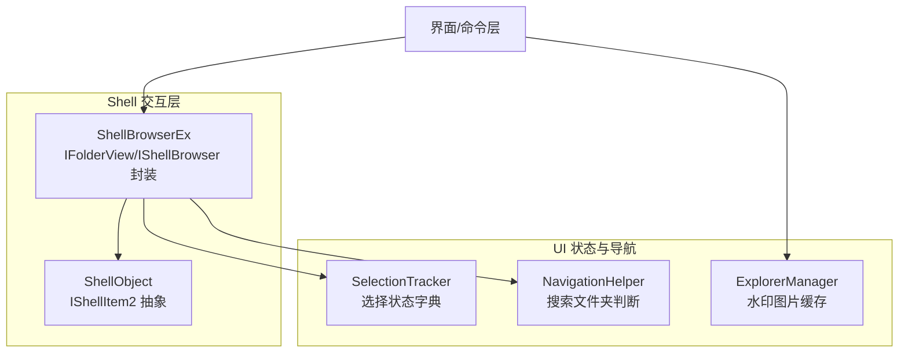
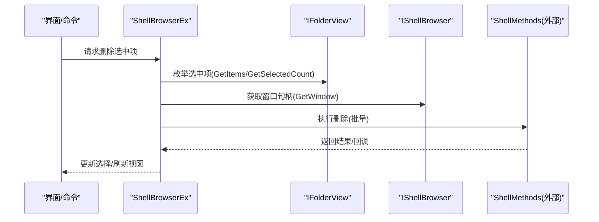
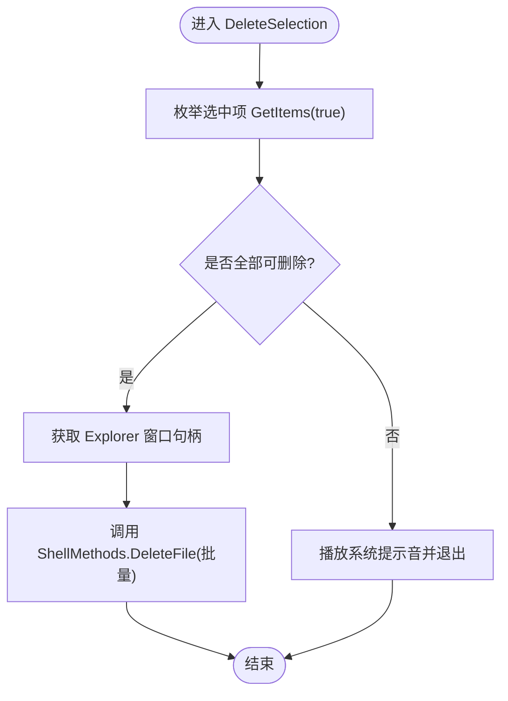
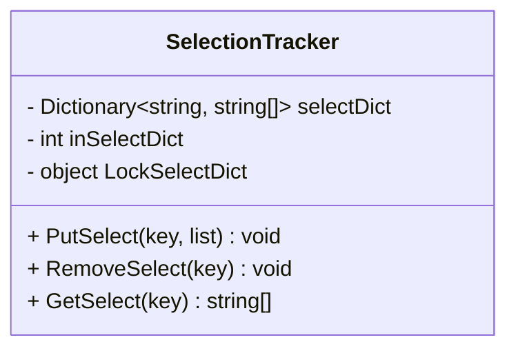
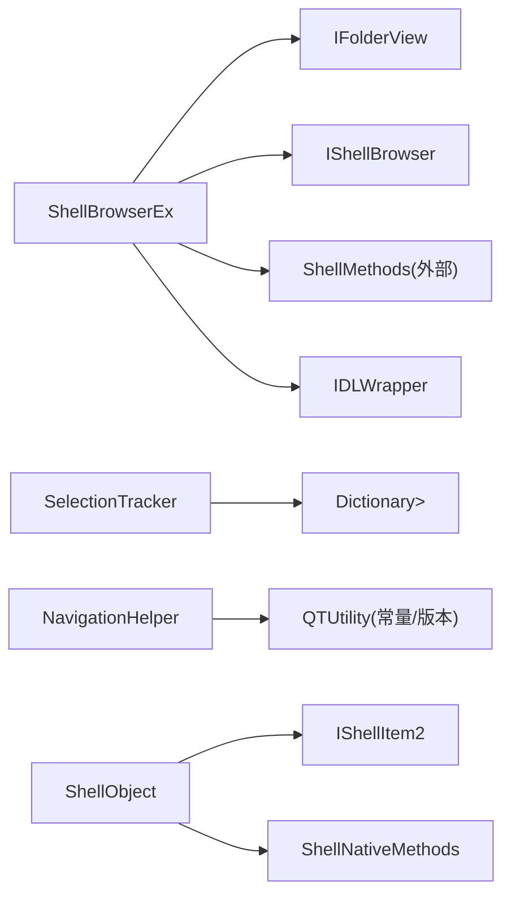

# 文件操作引擎

<cite>
**本文引用的文件**   
- [SelectionTracker.cs](file://QTTabBar/SelectionTracker.cs)
- [NavigationHelper.cs](file://QTTabBar/NavigationHelper.cs)
- [ShellBrowserEx.cs](file://QTTabBar/ShellBrowserEx.cs)
- [ExplorerManager.cs](file://QTTabBar/ExplorerManager.cs)
- [ShellObject.cs](file://QTTabBar/Common/ShellObject.cs)
</cite>

## 目录
1. [简介](#简介)
2. [项目结构](#项目结构)
3. [核心组件](#核心组件)
4. [架构总览](#架构总览)
5. [详细组件分析](#详细组件分析)
6. [依赖关系分析](#依赖关系分析)
7. [性能考虑](#性能考虑)
8. [故障排查指南](#故障排查指南)
9. [结论](#结论)
10. [附录](#附录)

## 简介
本文件聚焦于 QTTabBar-Next 的文件操作引擎，围绕以下目标展开：
- 解释复制、移动、删除、重命名等基础操作的封装与优化（以删除为主线，其余通过 Shell 集成点说明）
- 阐述批量处理机制中的进度跟踪、错误恢复与事务性操作思路
- 解析选择跟踪器的工作原理（多选、状态同步、并发安全）
- 说明导航辅助类的路径解析与 URL 处理
- 描述事件驱动与异步处理的实现方式
- 提供自定义文件操作扩展与类型支持的方法
- 解释与 Windows Shell 的集成与 COM 接口调用
- 给出性能调优建议与最佳实践

## 项目结构
与“文件操作引擎”直接相关的代码主要分布在如下位置：
- Shell 浏览器封装与选择项访问：ShellBrowserEx.cs
- 选择状态跟踪：SelectionTracker.cs
- 导航辅助：NavigationHelper.cs
- Shell 对象抽象基类：Common/ShellObject.cs
- 资源缓存（水印图）：ExplorerManager.cs

图表来源
- [ShellBrowserEx.cs:29-115](file://QTTabBar/ShellBrowserEx.cs#L29-L115)
- [SelectionTracker.cs:27-84](file://QTTabBar/SelectionTracker.cs#L27-L84)
- [NavigationHelper.cs:9-27](file://QTTabBar/NavigationHelper.cs#L9-L27)
- [ExplorerManager.cs:8-19](file://QTTabBar/ExplorerManager.cs#L8-L19)
- [ShellObject.cs:10-40](file://QTTabBar/Common/ShellObject.cs#L10-L40)

章节来源
- [ShellBrowserEx.cs:29-115](file://QTTabBar/ShellBrowserEx.cs#L29-L115)
- [SelectionTracker.cs:27-84](file://QTTabBar/SelectionTracker.cs#L27-L84)
- [NavigationHelper.cs:9-27](file://QTTabBar/NavigationHelper.cs#L9-L27)
- [ExplorerManager.cs:8-19](file://QTTabBar/ExplorerManager.cs#L8-L19)
- [ShellObject.cs:10-40](file://QTTabBar/Common/ShellObject.cs#L10-L40)

## 核心组件
- ShellBrowserEx：对 IShellBrowser/IFolderView 的封装，负责获取当前视图、枚举选中项、设置选择、导航、删除等操作。
- SelectionTracker：按键维护文件选择列表的线程安全字典，用于跨实例/线程的选择状态同步。
- NavigationHelper：提供与系统版本相关的搜索文件夹路径判断与常量获取。
- ShellObject：基于 IShellItem2 的 Shell 对象抽象，提供名称、父节点、属性、缩略图、PIDL 等能力。
- ExplorerManager：为资源管理器列表视图提供水印图像的缓存管理。

章节来源
- [ShellBrowserEx.cs:29-115](file://QTTabBar/ShellBrowserEx.cs#L29-L115)
- [SelectionTracker.cs:27-84](file://QTTabBar/SelectionTracker.cs#L27-L84)
- [NavigationHelper.cs:9-27](file://QTTabBar/NavigationHelper.cs#L9-L27)
- [ShellObject.cs:10-40](file://QTTabBar/Common/ShellObject.cs#L10-L40)
- [ExplorerManager.cs:8-19](file://QTTabBar/ExplorerManager.cs#L8-L19)

## 架构总览
整体采用“Shell 封装 + 选择状态 + 导航辅助 + Shell 对象抽象”的分层设计：
- 上层命令/界面触发文件操作
- ShellBrowserEx 协调 IFolderView/IShellBrowser 完成具体动作
- SelectionTracker 维护选择状态，保证多线程一致性
- NavigationHelper 提供路径/URL 相关判定
- ShellObject 作为通用 Shell 实体抽象，便于后续扩展

图表来源
- [ShellBrowserEx.cs:67-89](file://QTTabBar/ShellBrowserEx.cs#L67-L89)
- [ShellBrowserEx.cs:180-210](file://QTTabBar/ShellBrowserEx.cs#L180-L210)
- [ShellBrowserEx.cs:212-225](file://QTTabBar/ShellBrowserEx.cs#L212-L225)

## 详细组件分析

### ShellBrowserEx：Shell 交互与文件操作入口
- 职责
  - 获取并缓存 IFolderView，提供视图模式、焦点项、选中项集合、路径拼装等能力
  - 提供 DeleteSelection 批量删除入口，内部收集可删除项后委托给 ShellMethods.DeleteFile
  - 提供 TrySetSelection/TryGetSelection 进行选择状态的读写
  - 提供 Navigate 通过 IShellBrowser.BrowseObject 进行导航
- 关键流程
  - 删除流程：枚举选中项 -> 校验可删除 -> 获取 Explorer 窗口句柄 -> 调用 ShellMethods.DeleteFile -> 播放提示音或继续
  - 选择设置：根据 Address[] 构造 IDLWrapper，使用 SVSIF 标志控制选择、可见性与焦点
- 错误处理
  - 大量使用 MakeErrorLog 记录异常；对 COM 异常与无效对象异常进行捕获
- 资源释放
  - 在 Dispose/OnNavigateComplete 中释放 COM 引用，避免泄漏

图表来源
- [ShellBrowserEx.cs:67-89](file://QTTabBar/ShellBrowserEx.cs#L67-L89)
- [ShellBrowserEx.cs:180-210](file://QTTabBar/ShellBrowserEx.cs#L180-L210)

章节来源
- [ShellBrowserEx.cs:29-115](file://QTTabBar/ShellBrowserEx.cs#L29-L115)
- [ShellBrowserEx.cs:67-89](file://QTTabBar/ShellBrowserEx.cs#L67-L89)
- [ShellBrowserEx.cs:180-210](file://QTTabBar/ShellBrowserEx.cs#L180-L210)
- [ShellBrowserEx.cs:212-225](file://QTTabBar/ShellBrowserEx.cs#L212-L225)
- [ShellBrowserEx.cs:337-352](file://QTTabBar/ShellBrowserEx.cs#L337-L352)
- [ShellBrowserEx.cs:456-508](file://QTTabBar/ShellBrowserEx.cs#L456-L508)

### SelectionTracker：选择状态跟踪器
- 职责
  - 维护一个以“键”为索引的选择列表字典，供多实例/线程间共享选择状态
- 并发策略
  - 使用 Interlocked.Exchange 做快速互斥门控，配合 lock 保护字典写入/读取
  - 所有公共方法均包含 try/catch 并将异常记录到日志
- 典型用法
  - PutSelect/RemoveSelect/GetSelect 分别对应设置、移除、获取某键对应的选择列表

图表来源
- [SelectionTracker.cs:27-84](file://QTTabBar/SelectionTracker.cs#L27-L84)

章节来源
- [SelectionTracker.cs:27-84](file://QTTabBar/SelectionTracker.cs#L27-L84)

### NavigationHelper：导航辅助
- 职责
  - 判断给定路径是否为“搜索结果文件夹”，并提供当前系统的搜索文件夹路径常量
- 平台差异
  - 针对 XP 与非 XP 系统采用不同常量路径

章节来源
- [NavigationHelper.cs:9-27](file://QTTabBar/NavigationHelper.cs#L9-L27)

### ShellObject：Shell 对象抽象
- 职责
  - 统一封装 IShellItem2，提供 Name/ParsingName/Parent/Properties/Thumbnail/PIDL 等常用能力
  - 提供 FromParsingName 工厂方法与 Update 刷新机制
- 资源管理
  - 实现 IDisposable，正确释放 PIDL 与 COM 对象引用

章节来源
- [ShellObject.cs:10-40](file://QTTabBar/Common/ShellObject.cs#L10-L40)
- [ShellObject.cs:260-263](file://QTTabBar/Common/ShellObject.cs#L260-L263)
- [ShellObject.cs:383-396](file://QTTabBar/Common/ShellObject.cs#L383-L396)
- [ShellObject.cs:400-433](file://QTTabBar/Common/ShellObject.cs#L400-L433)

### ExplorerManager：资源管理器水印缓存
- 职责
  - 为 Explorer 列表视图提供水印位图的缓存与清理
- 适用场景
  - 减少重复加载开销，提升渲染性能

章节来源
- [ExplorerManager.cs:8-19](file://QTTabBar/ExplorerManager.cs#L8-L19)

## 依赖关系分析
- ShellBrowserEx 依赖
  - IFolderView/IShellBrowser：通过 COM 接口访问资源管理器视图与浏览器
  - ShellMethods.DeleteFile：外部静态方法执行实际删除（位于 Interop 层）
  - IDLWrapper：包装 PIDL，提供路径拼装与解析
- SelectionTracker 依赖
  - 标准库字典与锁原语，无外部 COM 依赖
- NavigationHelper 依赖
  - QTUtility 提供的系统常量与版本判断
- ShellObject 依赖
  - IShellItem2/ShellNativeMethods：通过 P/Invoke 与 Shell 交互

图表来源
- [ShellBrowserEx.cs:29-115](file://QTTabBar/ShellBrowserEx.cs#L29-L115)
- [SelectionTracker.cs:27-84](file://QTTabBar/SelectionTracker.cs#L27-L84)
- [NavigationHelper.cs:9-27](file://QTTabBar/NavigationHelper.cs#L9-L27)
- [ShellObject.cs:10-40](file://QTTabBar/Common/ShellObject.cs#L10-L40)

章节来源
- [ShellBrowserEx.cs:29-115](file://QTTabBar/ShellBrowserEx.cs#L29-L115)
- [SelectionTracker.cs:27-84](file://QTTabBar/SelectionTracker.cs#L27-L84)
- [NavigationHelper.cs:9-27](file://QTTabBar/NavigationHelper.cs#L9-L27)
- [ShellObject.cs:10-40](file://QTTabBar/Common/ShellObject.cs#L10-L40)

## 性能考虑
- 批量操作优先
  - 删除等写操作尽量聚合为一次 Shell 调用，减少多次 COM 往返与 UI 刷新
- 选择集最小化
  - 仅在必要时枚举选中项，避免全量遍历
- 资源及时释放
  - 对 COM 对象与 PIDL 严格遵循所有权语义，防止内存泄漏与二次释放
- 线程安全
  - 选择状态字典使用轻量级门控与锁，避免高并发下的竞争条件
- 视图刷新节流
  - 将多次选择变更合并后再一次性提交，降低 UI 抖动

[本节为通用指导，不直接分析具体文件]

## 故障排查指南
- 常见异常定位
  - 删除失败：检查 GetItems 是否返回空或存在不可删除项；确认 ShellMethods.DeleteFile 调用前的句柄获取是否成功
  - 选择设置失败：核对 TrySetSelection 中地址解析与 SVSIF 标志组合是否正确
  - 导航异常：关注 Navigate 中对 COMException 的记录与返回值
- 日志与诊断
  - 使用 MakeErrorLog 输出上下文信息，结合 QTUtility2.log 打印关键中间状态
- 资源泄漏排查
  - 检查 Dispose/OnNavigateComplete 是否释放了 folderView/shellBrowser 等 COM 引用
  - 确认 ILCombine 后的原始 PIDL 是否被正确释放

章节来源
- [ShellBrowserEx.cs:67-89](file://QTTabBar/ShellBrowserEx.cs#L67-L89)
- [ShellBrowserEx.cs:337-352](file://QTTabBar/ShellBrowserEx.cs#L337-L352)
- [ShellBrowserEx.cs:456-508](file://QTTabBar/ShellBrowserEx.cs#L456-L508)
- [ShellBrowserEx.cs:91-102](file://QTTabBar/ShellBrowserEx.cs#L91-L102)

## 结论
QTTabBar-Next 的文件操作引擎以 ShellBrowserEx 为核心，结合 SelectionTracker 的选择状态管理与 NavigationHelper 的路径辅助，形成稳定高效的 Shell 交互层。通过统一的 ShellObject 抽象，进一步提升了可扩展性与可维护性。建议在后续迭代中完善复制/移动/重命名的统一编排与事务回滚机制，并引入更细粒度的进度回调与错误恢复策略。

[本节为总结性内容，不直接分析具体文件]

## 附录

### 自定义文件操作扩展示例（概念性步骤）
- 新增操作入口
  - 在 ShellBrowserEx 中添加新方法，如 MoveSelection/CopySelection/RenameSelection
  - 复用 GetItems/GetSelectedCount 获取目标集合
- 调用 Shell 操作
  - 使用 Interop 层的 ShellMethods 对应 API（例如移动/复制/重命名）
  - 传入 Explorer 窗口句柄以显示系统进度与对话框
- 选择状态同步
  - 操作完成后调用 TrySetSelection 保持焦点与选择一致
- 事件与进度
  - 定义事件委托，向 UI 层推送进度与错误信息
  - 使用后台线程执行耗时操作，避免阻塞 UI

[本节为概念性指导，不直接分析具体文件]

### 与 Windows Shell 集成要点
- 关键接口
  - IShellBrowser：浏览容器、获取窗口句柄、设置状态文本
  - IFolderView：视图模式、枚举项、选择项、获取当前文件夹
  - IShellItem2：Shell 对象的统一抽象（由 ShellObject 封装）
- 资源管理
  - 严格遵循 AddRef/Release 语义，托管侧使用 ComReleaseHelper 或显式 ReleaseComObject
- 路径与 PIDL
  - 使用 IDLWrapper 与 ILCombine 拼装完整路径，注意所有权与释放时机

章节来源
- [ShellBrowserEx.cs:29-115](file://QTTabBar/ShellBrowserEx.cs#L29-L115)
- [ShellBrowserEx.cs:227-249](file://QTTabBar/ShellBrowserEx.cs#L227-L249)
- [ShellObject.cs:218-234](file://QTTabBar/Common/ShellObject.cs#L218-L234)