# 标签页管理系统

<cite>
**本文引用的文件**   
- [QTabControl.cs](file://QTTabBar/QTabControl.cs)
- [QTabItem.cs](file://QTTabBar/QTabItem.cs)
- [GroupsManager.cs](file://QTTabBar/GroupsManager.cs)
- [QTTabBarClass.TabManager.cs](file://QTTabBar/QTTabBarClass.TabManager.cs)
- [QTTabBarClass.cs](file://QTTabBar/QTTabBarClass.cs)
- [Config.cs](file://QTTabBar\Config.cs)
- [QTUtility.cs](file://QTTabBar\QTUtility.cs)
- [StaticReg.cs](file://QTTabBar\StaticReg.cs)
- [TabBarBase.cs](file://QTTabBar/TabBarBase.cs)
- [TabBarBase.TabOperations.cs](file://QTTabBar/TabBarBase.TabOperations.cs)
- [TabBarBase.PlusButton.cs](file://QTTabBar/TabBarBase.PlusButton.cs)
- [TabBarBase.Selection.cs](file://QTTabBar/TabBarBase.Selection.cs)
- [TabBarBase.Close.cs](file://QTTabBar/TabBarBase.Close.cs)
- [TabBarBase.ExplorerAttach.cs](file://QTTabBar/TabBarBase.ExplorerAttach.cs)
- **TabBarBase.WindowMessages.cs**：**新增**的窗口消息处理部分类
- **TabBarBase.MouseHandlers.cs**：**新增**的鼠标事件处理部分类
- [QTSecondViewBar.cs](file://QTTabBar/QTSecondViewBar.cs)
- [ArchitectureBatch2Tests.cs](file://Tests\QTTtabBarTests\ArchitectureBatch2Tests.cs)
- [ArchitectureBatch3W3aTests.cs](file://Tests\QTTtabBarTests\ArchitectureBatch3W3aTests.cs)
- [ArchitectureBatch3W3bTests.cs](file://Tests\QTTtabBarTests\ArchitectureBatch3W3bTests.cs)
- [ArchitectureBatch3W3cTests.cs](file://Tests\QTTtabBarTests\ArchitectureBatch3W3cTests.cs)
- [TabManagerTests.cs](file://Tests\QTTtabBarTests\TabManagerTests.cs)
- [FacadeEquivalenceTests.cs](file://Tests\QTTtabBarTests\FacadeEquivalenceTests.cs)
</cite>

## 更新摘要
**所做更改**   
- 新增 TabBarBase 窗口消息处理和鼠标事件处理部分类章节，详细说明集中化的系统消息拦截和鼠标交互处理机制
- 更新架构总览图，反映新增的 WindowMessages 和 MouseHandlers 部分类的职责分工
- 增强代码复用说明，阐述窗口消息处理和鼠标事件处理的集中化重构优势
- 补充继承关系分析，说明派生类如何继承和使用新的消息处理功能
- 更新依赖关系分析，反映新增的部分类与现有架构的集成方式
- 新增多个测试覆盖，验证窗口消息处理和鼠标事件处理的正确性

## 目录
1. [简介](#简介)
2. [项目结构](#项目结构)
3. [核心组件](#核心组件)
4. [架构总览](#架构总览)
5. [详细组件分析](#详细组件分析)
6. [依赖关系分析](#依赖关系分析)
7. [性能考虑](#性能考虑)
8. [质量保证与测试](#质量保证与测试)
9. [故障排查指南](#故障排查指南)
10. [结论](#结论)
11. [附录](#附录)

## 简介
本文件聚焦于 QTTabBar-Next 的标签页管理系统，围绕 QTabControl 与 QTabItem 的实现进行深入解析。内容涵盖：
- 标签页生命周期管理、状态切换机制
- 拖拽操作处理与键盘快捷键支持
- 多行标签页布局算法、尺寸计算与自适应显示逻辑
- 事件系统（选中变更、关闭按钮点击、鼠标悬停等）
- 标签页锁定、克隆、分组功能的具体实现
- 与 Shell 浏览器的集成方式与数据同步机制
- 常见性能问题与内存泄漏问题的解决思路
- 自定义标签页外观与行为的最佳实践
- **新增**：全面的单元测试覆盖和质量保证机制
- **新增**：集中化的锁定标签持久化机制和增强的线程安全性
- **最新改进**：引入 TabBarBase.TabOperations 实现代码复用，消除重复代码
- **最新改进**：引入 TabBarBase.PlusButton 实现Plus按钮处理逻辑的集中化，进一步消除重复代码
- **重大架构升级**：TabBarBase 增强架构，将共享的标签选择逻辑、关闭操作、Plus按钮处理和Explorer附加生命周期集中到基类中
- **最新架构演进**：引入 TabBarBase.WindowMessages 和 TabBarBase.MouseHandlers 部分类，实现窗口消息处理和鼠标事件的完全集中化管理

**最新更新**：系统进行了重大架构重构，将核心标签管理逻辑从 QTTabBarClass 提取到独立的 TabManager 内部类中，显著提高了代码可维护性和模块化程度。同时新增了152行全面的单元测试代码，确保重构后的行为一致性和系统稳定性。**最新改进包括引入 TabBarBase.TabOperations 实现代码复用，消除了 TabManager 和 SecondViewBar 之间的重复代码，以及引入 TabBarBase.PlusButton 实现了Plus按钮处理逻辑的集中化**。

**重大架构升级**：TabBarBase 现在作为抽象基类，提供了完整的共享功能集，包括标签选择守卫、关闭操作集群、Plus按钮处理、Explorer附加生命周期管理等，QTTabBarClass 和 QTSecondViewBar 都继承自 TabBarBase 以获得这些共享功能。

**最新架构演进**：通过新增的 TabBarBase.WindowMessages 和 TabBarBase.MouseHandlers 部分类，系统实现了窗口消息处理和鼠标事件的完全集中化管理，进一步提升了代码的可维护性和扩展性。

## 项目结构
标签页管理相关代码主要位于以下文件：
- QTabControl.cs：标签容器控件，负责布局、绘制、交互与事件分发
- QTabItem.cs：单个标签项的数据与行为封装，包含历史、选择状态、文本度量等
- GroupsManager.cs：标签分组管理与持久化（注册表），提供组增删改查与广播刷新
- **TabBarBase.cs**：**重大升级**的抽象基类，提供所有标签页相关的共享字段、方法和UI组件
- **TabBarBase.TabOperations.cs**：**新增的核心代码复用层**，集中实现标签创建、打开、插入等通用操作
- **TabBarBase.PlusButton.cs**：**新增的Plus按钮处理复用层**，集中实现Plus按钮点击处理的共享逻辑
- **TabBarBase.Selection.cs**：**新增的选择守卫复用层**，集中实现标签选择保护逻辑
- **TabBarBase.Close.cs**：**新增的关闭操作复用层**，集中实现关闭操作的共享逻辑
- **TabBarBase.ExplorerAttach.cs**：**新增的Explorer附加生命周期复用层**，集中实现Explorer附加的生命周期管理
- **TabBarBase.WindowMessages.cs**：**新增的窗口消息处理复用层**，集中实现系统消息拦截和处理逻辑
- **TabBarBase.MouseHandlers.cs**：**新增的鼠标事件处理复用层**，集中实现鼠标交互和拖拽操作的共享逻辑
- **QTTabBarClass.TabManager.cs**：核心标签管理器，通过委托调用基类的共享方法
- **QTSecondViewBar.cs**：第二视图栏，继承 TabBarBase 并复用其标签操作方法
- **QTTabBarClass.cs**：主控制器，现在通过 TabManager 委托处理标签管理任务
- **Config.cs**：配置系统，包含 TabPos 枚举和标签位置配置
- **QTUtility.cs**：工具类，新增集中化的锁定标签持久化方法 SaveLockedTabs()
- **StaticReg.cs**：静态注册表管理类，增强的 RegBackedList<T> 提供线程安全的集合操作

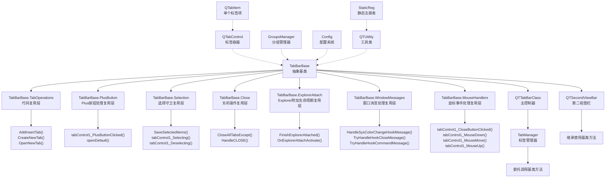

**图表来源**
- [TabBarBase.cs:20-401](file://QTTabBar/TabBarBase.cs#L20-L401)
- [TabBarBase.TabOperations.cs:11-143](file://QTTabBar/TabBarBase.TabOperations.cs#L11-L143)
- [TabBarBase.PlusButton.cs:8-67](file://QTTabBar/TabBarBase.PlusButton.cs#L8-L67)
- [TabBarBase.Selection.cs:7-31](file://QTTabBar/TabBarBase.Selection.cs#L7-L31)
- [TabBarBase.Close.cs:8-74](file://QTTabBar/TabBarBase.Close.cs#L8-L74)
- [TabBarBase.ExplorerAttach.cs:5-12](file://QTTabBar/TabBarBase.ExplorerAttach.cs#L5-L12)
- [TabBarBase.WindowMessages.cs:10-61](file://QTTabBar/TabBarBase.WindowMessages.cs#L10-L61)
- [TabBarBase.MouseHandlers.cs:11-267](file://QTTabBar/TabBarBase.MouseHandlers.cs#L11-L267)
- [QTTabBarClass.TabManager.cs:67-131](file://QTTabBar/QTTabBarClass.TabManager.cs#L67-L131)
- [QTSecondViewBar.cs:39](file://QTTabBar/QTSecondViewBar.cs#L39)
- [QTabControl.cs:124-224](file://QTTabBar/QTabControl.cs#L124-L224)
- [QTabItem.cs:195-223](file://QTTabBar/QTabItem.cs#L195-L223)
- [GroupsManager.cs:40-112](file://QTTabBar/GroupsManager.cs#L40-L112)
- [Config.cs:65-72](file://QTTabBar\Config.cs#L65-L72)
- [QTUtility.cs:491-498](file://QTTabBar\QTUtility.cs#L491-L498)
- [StaticReg.cs:60-67](file://QTTabBar\StaticReg.cs#L60-L67)

**章节来源**
- [TabBarBase.cs:20-401](file://QTTabBar/TabBarBase.cs#L20-L401)
- [TabBarBase.TabOperations.cs:11-143](file://QTTabBar/TabBarBase.TabOperations.cs#L11-L143)
- [TabBarBase.PlusButton.cs:8-67](file://QTTabBar/TabBarBase.PlusButton.cs#L8-L67)
- [TabBarBase.Selection.cs:7-31](file://QTTabBar/TabBarBase.Selection.cs#L7-L31)
- [TabBarBase.Close.cs:8-74](file://QTTabBar/TabBarBase.Close.cs#L8-L74)
- [TabBarBase.ExplorerAttach.cs:5-12](file://QTTabBar/TabBarBase.ExplorerAttach.cs#L5-L12)
- [TabBarBase.WindowMessages.cs:10-61](file://QTTabBar/TabBarBase.WindowMessages.cs#L10-L61)
- [TabBarBase.MouseHandlers.cs:11-267](file://QTTabBar/TabBarBase.MouseHandlers.cs#L11-L267)
- [QTTabBarClass.TabManager.cs:67-131](file://QTTabBar/QTTabBarClass.TabManager.cs#L67-L131)
- [QTSecondViewBar.cs:39](file://QTTabBar/QTSecondViewBar.cs#L39)
- [QTabControl.cs:124-224](file://QTTabBar/QTabControl.cs#L124-L224)
- [QTabItem.cs:195-223](file://QTTabBar/QTabItem.cs#L195-L223)
- [GroupsManager.cs:40-112](file://QTTabBar/GroupsManager.cs#L40-L112)
- [Config.cs:65-72](file://QTTabBar\Config.cs#L65-L72)
- [QTUtility.cs:491-498](file://QTTabBar\QTUtility.cs#L491-L498)
- [StaticReg.cs:60-67](file://QTTabBar\StaticReg.cs#L60-L67)

## 核心组件
- **TabBarBase（重大升级的抽象基类）**
  - 职责：提供所有标签页相关的共享字段、方法和UI组件，作为 QTTabBarClass 和 QTSecondViewBar 的共同基类
  - 关键能力：
    - 共享字段：tabControl1、CurrentTab、ShellBrowser、BandHeight 等核心组件
    - 共享方法：SyncTravelState、SetBarRows、ComputeBandHeight 等通用操作
    - UI组件：导航按钮、上下文菜单、工具条等界面元素
    - DPI处理：高DPI支持和缩放计算
    - **新增**：完整的代码复用架构，包含多个部分类实现不同功能域

- **TabBarBase.TabOperations（代码复用层）**
  - 职责：集中实现标签页管理的核心业务逻辑，消除重复代码
  - 关键能力：
    - AddInsertTab：根据配置决定新标签插入位置
    - CreateNewTab：创建新标签项并设置初始状态
    - OpenNewTab：智能打开新标签，支持重复检测、特殊文件夹处理
    - CloseTab：统一的标签关闭逻辑，支持锁定保护和历史记录保存
    - CloseTabs：批量关闭标签，保持界面一致性
    - CancelFailedTabChanging：失败标签切换的取消处理

- **TabBarBase.PlusButton（Plus按钮处理复用层）**
  - 职责：集中实现Plus按钮点击处理的共享逻辑，消除重复代码
  - 关键能力：
    - tabControl1_PlusButtonClicked：处理Plus按钮点击事件，支持剪贴板路径粘贴
    - openDefault：打开默认位置的辅助方法
    - 智能路径处理：支持文件和目录的智能识别和处理
    - 错误处理和日志记录：统一的异常处理和调试信息输出

- **TabBarBase.Selection（选择守卫复用层）**
  - 职责：集中实现标签选择保护的共享逻辑
  - 关键能力：
    - SaveSelectedItems：保存当前标签的选中项状态
    - tabControl1_Selecting：阻止在标签添加/删除过程中的选择变更
    - tabControl1_Deselecting：在标签失去焦点时保存选中项状态

- **TabBarBase.Close（关闭操作复用层）**
  - 职责：集中实现关闭操作的共享逻辑
  - 关键能力：
    - CloseAllTabsExcept：保留指定标签外所有标签的关闭操作
    - HandleCLOSE：处理Windows关闭按钮的各种组合键行为

- **TabBarBase.ExplorerAttach（Explorer附加生命周期复用层）**
  - 职责：集中实现Explorer附加的生命周期管理
  - 关键能力：
    - FinishExplorerAttached：完成Explorer附加后的初始化
    - OnExplorerAttachActivate：可扩展的附加激活钩子

- **TabBarBase.WindowMessages（窗口消息处理复用层）**
  - 职责：集中实现系统消息拦截和处理的共享逻辑，消除重复代码
  - 关键能力：
    - HandleSysColorChangeHookMessage：处理系统主题变化消息，统一应用主题刷新
    - TryHandleHookCloseMessage：处理Explorer关闭消息，支持锁定标签保存和智能关闭逻辑
    - TryHandleHookCommandMessage：处理系统命令消息，支持XP系统的特殊关闭命令处理
    - 跨平台兼容性：针对不同Windows版本提供差异化的消息处理逻辑

- **TabBarBase.MouseHandlers（鼠标事件处理复用层）**
  - 职责：集中实现鼠标交互和拖拽操作的共享逻辑，消除重复代码
  - 关键能力：
    - tabControl1_CloseButtonClicked：处理标签关闭按钮点击，支持拖拽状态检查和最后标签特殊处理
    - tabControl1_MouseDoubleClick：处理双击事件，支持绑定动作执行
    - tabControl1_MouseDown/MouseMove/MouseUp：完整的鼠标拖拽和交互处理
    - tabControl1_TabIconMouseDown：处理标签图标点击，支持子目录提示显示
    - 自定义光标：动态创建拖拽和克隆光标，提升用户体验
    - 鼠标绑定动作：支持复杂的鼠标手势和组合键操作

- **TabManager（嵌套内部类）**
  - 职责：作为嵌套内部类，集中管理所有标签相关的业务逻辑，通过 _owner 引用访问外部成员
  - 关键能力：
    - 标签创建：AddInsertTab、CreateNewTab、OpenNewTab、OpenGroup
    - 标签克隆：CloneCurrentTab、CloneTabButton
    - 标签关闭：CloseTab、CloseTabs、CloseAllTabsExcept
    - UI事件处理：tabControl1_SelectedIndexChanged、tabControl1_CloseButtonClicked、鼠标事件等
    - 标签恢复：RestoreLastClosed、RestoreTabsOnInitialize
    - 拖拽重排：ReorderTab、tabControl1_ItemDrag
    - **新增**：TabIndex() 方法，根据配置计算新标签插入位置

- QTabControl
  - 职责：维护标签集合、计算布局（单行/多行）、绘制标签背景与文字、处理鼠标/键盘交互、触发事件、管理滚动条与"+"按钮。
  - 关键能力：
    - 布局：单行固定/自适应宽度、多行自动换行、边缘标记（左/中/右）。
    - 绘制：视觉样式渲染或经典绘制、阴影文字、图标与锁定标志、关闭按钮状态。
    - 交互：选中切换、关闭按钮点击、图标点击（子目录提示）、拖拽、滚轮/箭头导航。
    - 事件：Selecting/Deselecting、SelectedIndexChanged、PointedTabChanged、CloseButtonClicked、PlusButtonClicked、TabIconMouseDown、RowCountChanged、TabCountChanged。
- QTabItem
  - 职责：表示一个标签项，持有路径、标题、注释、历史栈、选中项快照、Shell 提示文本、尺寸度量等。
  - 关键能力：
    - 文本度量：根据字体与内容计算标题与副标题尺寸，驱动 TabBounds 更新。
    - 历史导航：前进/后退栈，分支记录，NavigatedTo 更新当前路径与 IDL。
    - 克隆：复制标题、路径、历史、选择快照等。
    - 锁定：TabLocked 属性控制锁定图标显示与交互。
- GroupsManager
  - 职责：管理标签分组（名称、快捷键、启动项、路径列表），读写注册表并广播刷新。
- **Config（配置系统）**
  - 职责：提供标签位置配置，包括 TabPos 枚举和 NewTabPosition 属性
  - 关键能力：
    - TabPos 枚举：Rightmost、Right、Left、Leftmost、LastActive
    - NewTabPosition 属性：控制新标签插入位置的配置项
- **QTUtility（工具类）**
  - 职责：提供系统级工具方法，新增集中化的锁定标签持久化功能
  - 关键能力：
    - **新增**：SaveLockedTabs() 方法，统一处理锁定标签的注册表持久化
    - 图像资源管理：ReserveImageKey、SetImageKey 等方法
    - 配置保存：SaveRecentFiles、SaveRecentlyClosed 等方法
- **StaticReg（静态注册表管理）**
  - 职责：管理静态数据的注册表持久化，提供线程安全的集合操作
  - 关键能力：
    - **增强的**：RegBackedList<T> 类，使用专用 _assignLock 锁对象确保线程安全
    - 原子操作：Assign 方法先清空注册表再写入新值，防止数据竞争
    - 锁定标签管理：LockedTabsToRestoreList 属性提供线程安全的访问

**章节来源**
- [TabBarBase.cs:20-401](file://QTTabBar/TabBarBase.cs#L20-L401)
- [TabBarBase.TabOperations.cs:11-143](file://QTTabBar/TabBarBase.TabOperations.cs#L11-L143)
- [TabBarBase.PlusButton.cs:8-67](file://QTTabBar/TabBarBase.PlusButton.cs#L8-L67)
- [TabBarBase.Selection.cs:7-31](file://QTTabBar/TabBarBase.Selection.cs#L7-L31)
- [TabBarBase.Close.cs:8-74](file://QTTabBar/TabBarBase.Close.cs#L8-L74)
- [TabBarBase.ExplorerAttach.cs:5-12](file://QTTabBar/TabBarBase.ExplorerAttach.cs#L5-L12)
- [TabBarBase.WindowMessages.cs:10-61](file://QTTabBar/TabBarBase.WindowMessages.cs#L10-L61)
- [TabBarBase.MouseHandlers.cs:11-267](file://QTTabBar/TabBarBase.MouseHandlers.cs#L11-L267)
- [QTTabBarClass.TabManager.cs:58-63](file://QTTabBar/QTTabBarClass.TabManager.cs#L58-L63)
- [QTTabBarClass.TabManager.cs:67-90](file://QTTabBar/QTTabBarClass.TabManager.cs#L67-L90)
- [QTTabBarClass.TabManager.cs:142-149](file://QTTabBar/QTTabBarClass.TabManager.cs#L142-L149)
- [QTTabBarClass.TabManager.cs:486-500](file://QTTabBar/QTTabBarClass.TabManager.cs#L486-L500)
- [QTTabBarClass.TabManager.cs:556-634](file://QTTabBar/QTTabBarClass.TabManager.cs#L556-L634)
- [QTTabBarClass.TabManager.cs:1484-1505](file://QTTabBar/QTTabBarClass.TabManager.cs#L1484-L1505)
- [QTabControl.cs:27-123](file://QTTabBar/QTabControl.cs#L27-L123)
- [QTabControl.cs:290-464](file://QTTabBar/QTabControl.cs#L290-L464)
- [QTabControl.cs:1456-1570](file://QTTabBar/QTabControl.cs#L1456-L1570)
- [QTabControl.cs:1638-1722](file://QTTabBar/QTabControl.cs#L1638-L1722)
- [QTabControl.cs:2088-2150](file://QTTabBar/QTabControl.cs#L2088-L2150)
- [QTabItem.cs:30-128](file://QTTabBar/QTabItem.cs#L30-L128)
- [QTabItem.cs:225-275](file://QTTabBar/QTabItem.cs#L225-L275)
- [QTabItem.cs:277-293](file://QTTabBar/QTabItem.cs#L277-L293)
- [QTabItem.cs:351-390](file://QTTabBar/QTabItem.cs#L351-390)
- [QTabItem.cs:400-432](file://QTTabBar/QTabItem.cs#L400-L432)
- [GroupsManager.cs:25-38](file://QTTabBar/GroupsManager.cs#L25-L38)
- [GroupsManager.cs:40-112](file://QTTabBar/GroupsManager.cs#L40-L112)
- [Config.cs:65-72](file://QTTabBar\Config.cs#L65-L72)
- [Config.cs:389](file://QTTabBar\Config.cs#L389)
- [QTUtility.cs:491-498](file://QTTabBar\QTUtility.cs#L491-L498)
- [StaticReg.cs:60-67](file://QTTabBar\StaticReg.cs#L60-L67)
- [StaticReg.cs:143-167](file://QTTabBar\StaticReg.cs#L143-L167)

## 架构总览
**重大架构升级**：系统采用五层架构设计，**TabBarBase 作为抽象基类提供完整的共享功能集**，包括标签操作、Plus按钮处理、选择守卫、关闭操作、Explorer附加生命周期、窗口消息处理和鼠标事件处理。TabManager 作为具体实现协调 UI 组件和业务逻辑，**各部分类实现了精细化的代码复用，彻底消除了重复代码**。新增的全面测试框架确保了重构后的行为一致性。

```mermaid
classDiagram
class TabBarBase {
+字段 : tabControl1, CurrentTab, ShellBrowser
+方法 : SyncTravelState()
+方法 : SetBarRows(count)
+方法 : ComputeBandHeight(rowCount, tabHeight, dpiScale)
+方法 : ResolveDpiScale(windowDpi, processDpi, deviceCapsDpi, appliedDpi)
}
class TabBarBase_TabOperations {
+方法 : AddInsertTab(tab)
+方法 : CreateNewTab(idlw)
+方法 : OpenNewTab(path, blockSelecting, fForceNew)
+方法 : OpenNewTab(idlwGiven, blockSelecting, fForceNew)
+方法 : CloseTab(closingTab, fCritical, fSkipSync)
+方法 : CloseTabs(tabs, fCritical)
+方法 : CancelFailedTabChanging(newPath)
}
class TabBarBase_PlusButton {
+方法 : tabControl1_PlusButtonClicked(sender, e)
+方法 : openDefault()
}
class TabBarBase_Selection {
+方法 : SaveSelectedItems(tab)
+方法 : tabControl1_Selecting(sender, e)
+方法 : tabControl1_Deselecting(sender, e)
}
class TabBarBase_Close {
+方法 : CloseAllTabsExcept(leaveThisOne, leaveLocked)
+方法 : HandleCLOSE(lParam)
}
class TabBarBase_ExplorerAttach {
+方法 : FinishExplorerAttached()
+方法 : OnExplorerAttachActivate()
}
class TabBarBase_WindowMessages {
+方法 : HandleSysColorChangeHookMessage()
+方法 : TryHandleHookCloseMessage(msg, suppressMessage)
+方法 : TryHandleHookCommandMessage(msg, suppressMessage)
}
class TabBarBase_MouseHandlers {
+方法 : PerformBindAction(action, fRepeat, tab, item)
+方法 : CloneTabButtonForMouse(tab, optionURL, fSelect, index)
+方法 : ShowSubdirTipForTab(tab, fShow, offsetX, fKey, fParent)
+方法 : GetTabDragCursor(fDragging)
+方法 : tabControl1_CloseButtonClicked(sender, e)
+方法 : tabControl1_MouseDoubleClick(sender, e)
+方法 : tabControl1_MouseDown(sender, e)
+方法 : tabControl1_MouseMove(sender, e)
+方法 : tabControl1_MouseUp(sender, e)
+方法 : tabControl1_TabIconMouseDown(sender, e)
}
class QTTabBarClass {
+字段 : _tabManager : TabManager
+方法 : Initialize()
+方法 : OpenNewTab(path)
+方法 : CloneCurrentTab()
+方法 : TabIndex()
}
class TabManager {
+_owner : QTTabBarClass
+方法 : AddInsertTab(tab)
+方法 : CreateNewTab(idlw)
+方法 : CloseTab(closingTab)
+方法 : CloneTabButton(tab, log)
+方法 : tabControl1_SelectedIndexChanged(sender, e)
+方法 : tabControl1_CloseButtonClicked(sender, e)
+方法 : TabIndex()
}
class QTSecondViewBar {
+继承 : TabBarBase
+方法 : OpenDefaultLocation()
+方法 : InitializeComponent()
}
class QTabControl {
+事件 : SelectedIndexChanged
+事件 : Selecting / Deselecting
+事件 : CloseButtonClicked
+事件 : PointedTabChanged
+事件 : PlusButtonClicked
+事件 : TabIconMouseDown
+方法 : SelectTab(index/tab)
+方法 : ChangeSelection(tab,index)
+方法 : CalculateItemRectangle()
+方法 : CalculateItemRectangle_MultiRows()
+方法 : DrawTab(g,rect,index,hot,fVisualStyle)
+方法 : OnPaint(e)
+属性 : SelectedIndex
+属性 : TabPages
}
class QTabItem {
+属性 : Text / CurrentPath / Comment
+属性 : TabBounds / Row / Edge
+属性 : TitleTextSize / SubTitleTextSize
+属性 : TabLocked
+方法 : NavigatedTo(path,idl,hash,autoNav)
+方法 : GoBackward()/GoForward()
+方法 : Clone(fAll)
+方法 : RefreshRectangle()
+事件 : Closed
}
class GroupsManager {
+属性 : Groups
+方法 : LoadGroups()/SaveGroups()
+方法 : AddGroup()/RemoveGroup()
+方法 : HandleReorder(items)
}
class Config {
+属性 : Tabs : _Tabs
+枚举 : TabPos
}
class QTUtility {
+方法 : SaveLockedTabs(paths)
+方法 : ReserveImageKey(qmi, path, ext)
+方法 : SaveRecentFiles(rkUser)
+方法 : SaveRecentlyClosed(rkUser)
}
class StaticReg {
+属性 : LockedTabsToRestoreList
+属性 : CreateWindowIDLs
+属性 : CreateWindowPaths
+类 : RegBackedList~T~
}
class RegBackedList~T~ {
+_assignLock : object
_key : string
_lastUpdate : int
_updating : bool
+方法 : Assign(collection)
+方法 : Update()
+方法 : ClearItems()
}
TabBarBase <|-- QTTabBarClass
TabBarBase <|-- QTSecondViewBar
TabBarBase --> TabBarBase_TabOperations : "组合"
TabBarBase --> TabBarBase_PlusButton : "组合"
TabBarBase --> TabBarBase_Selection : "组合"
TabBarBase --> TabBarBase_Close : "组合"
TabBarBase --> TabBarBase_ExplorerAttach : "组合"
TabBarBase --> TabBarBase_WindowMessages : "组合"
TabBarBase --> TabBarBase_MouseHandlers : "组合"
QTTabBarClass --> TabManager : "委托管理"
TabManager --> TabBarBase : "委托调用"
TabBarBase_TabOperations --> QTabControl : "操作UI"
TabBarBase_PlusButton --> QTabControl : "操作UI"
TabBarBase_Selection --> QTabControl : "操作UI"
TabBarBase_Close --> QTabControl : "操作UI"
TabBarBase_WindowMessages --> WindowUtils : "系统工具"
TabBarBase_WindowMessages --> ThemeRefreshService : "主题服务"
TabBarBase_MouseHandlers --> QTabControl : "操作UI"
TabBarBase_MouseHandlers --> Cursor : "光标管理"
QTabControl --> QTabItem : "管理集合"
GroupsManager ..> QTabControl : "广播刷新/联动"
Config --> TabManager : "配置访问"
QTUtility --> StaticReg : "使用RegBackedList"
StaticReg --> RegBackedList : "线程安全集合"
```

**图表来源**
- [TabBarBase.cs:20-401](file://QTTabBar/TabBarBase.cs#L20-L401)
- [TabBarBase.TabOperations.cs:11-143](file://QTTabBar/TabBarBase.TabOperations.cs#L11-L143)
- [TabBarBase.PlusButton.cs:8-67](file://QTTabBar/TabBarBase.PlusButton.cs#L8-L67)
- [TabBarBase.Selection.cs:7-31](file://QTTabBar/TabBarBase.Selection.cs#L7-L31)
- [TabBarBase.Close.cs:8-74](file://QTTabBar/TabBarBase.Close.cs#L8-L74)
- [TabBarBase.ExplorerAttach.cs:5-12](file://QTTabBar/TabBarBase.ExplorerAttach.cs#L5-L12)
- [TabBarBase.WindowMessages.cs:10-61](file://QTTabBar/TabBarBase.WindowMessages.cs#L10-L61)
- [TabBarBase.MouseHandlers.cs:11-267](file://QTTabBar/TabBarBase.MouseHandlers.cs#L11-L267)
- [QTTabBarClass.cs:67](file://QTTabBar/QTTabBarClass.cs#L67)
- [QTTabBarClass.cs:5476](file://QTTabBar/QTTabBarClass.cs#L5476)
- [QTTabBarClass.TabManager.cs:58-63](file://QTTabBar/QTTabBarClass.TabManager.cs#L58-L63)
- [QTTabBarClass.TabManager.cs:67-90](file://QTTabBar/QTTabBarClass.TabManager.cs#L67-L90)
- [QTTabBarClass.TabManager.cs:142-149](file://QTTabBar/QTTabBarClass.TabManager.cs#L142-L149)
- [QTTabBarClass.TabManager.cs:556-634](file://QTTabBar/QTTabBarClass.TabManager.cs#L556-L634)
- [QTTabBarClass.TabManager.cs:1484-1505](file://QTTabBar/QTTabBarClass.TabManager.cs#L1484-L1505)
- [QTSecondViewBar.cs:39](file://QTTabBar/QTSecondViewBar.cs#L39)
- [QTabControl.cs:112-123](file://QTTabBar/QTabControl.cs#L112-L123)
- [QTabControl.cs:469-504](file://QTTabBar/QTabControl.cs#L469-504)
- [QTabControl.cs:290-464](file://QTTabBar/QTabControl.cs#L290-L464)
- [QTabControl.cs:1456-1570](file://QTTabBar/QTabControl.cs#L1456-L1570)
- [QTabItem.cs:30-128](file://QTTabBar/QTabItem.cs#L30-L128)
- [QTabItem.cs:277-293](file://QTTabBar/QTabItem.cs#L277-L293)
- [QTabItem.cs:351-390](file://QTTabBar/QTabItem.cs#L351-L390)
- [GroupsManager.cs:40-112](file://QTTabBar/GroupsManager.cs#L40-L112)
- [Config.cs:65-72](file://QTTabBar\Config.cs#L65-L72)
- [QTUtility.cs:491-498](file://QTTabBar\QTUtility.cs#L491-L498)
- [StaticReg.cs:60-67](file://QTTabBar\StaticReg.cs#L60-L67)
- [StaticReg.cs:143-167](file://QTTabBar\StaticReg.cs#L143-L167)

## 详细组件分析

### TabBarBase 增强架构详解
**重大架构升级**：TabBarBase 现在作为抽象基类，提供了完整的共享功能集，通过部分类实现了精细化的功能模块划分。这种设计彻底消除了 QTTabBarClass 和 QTSecondViewBar 之间的重复代码，提升了系统的可维护性和扩展性。

#### 核心共享字段和方法
TabBarBase 提供了所有派生类共用的核心字段和方法：

- **共享字段**：
  - tabControl1：标签控件实例
  - CurrentTab：当前活动标签
  - ShellBrowser：Shell浏览器接口
  - BandHeight：标签栏高度
  - ExplorerHandle：Explorer窗口句柄
  - TravelLog：旅行日志管理
  - 各种状态标志位和UI组件引用

- **共享方法**：
  - SyncTravelState：同步旅行状态
  - SetBarRows：设置标签栏行数
  - ComputeBandHeight：计算物理标签栏高度
  - ResolveDpiScale：解析DPI缩放比例
  - TryCallButtonBar：调用按钮栏的辅助方法

#### 部分类架构设计
TabBarBase 采用部分类设计，将不同功能域分离到独立文件中：

- **TabOperations**：标签操作相关逻辑
- **PlusButton**：Plus按钮处理逻辑  
- **Selection**：标签选择守卫逻辑
- **Close**：关闭操作相关逻辑
- **ExplorerAttach**：Explorer附加生命周期管理
- **WindowMessages**：**新增**的窗口消息处理逻辑
- **MouseHandlers**：**新增**的鼠标事件处理逻辑

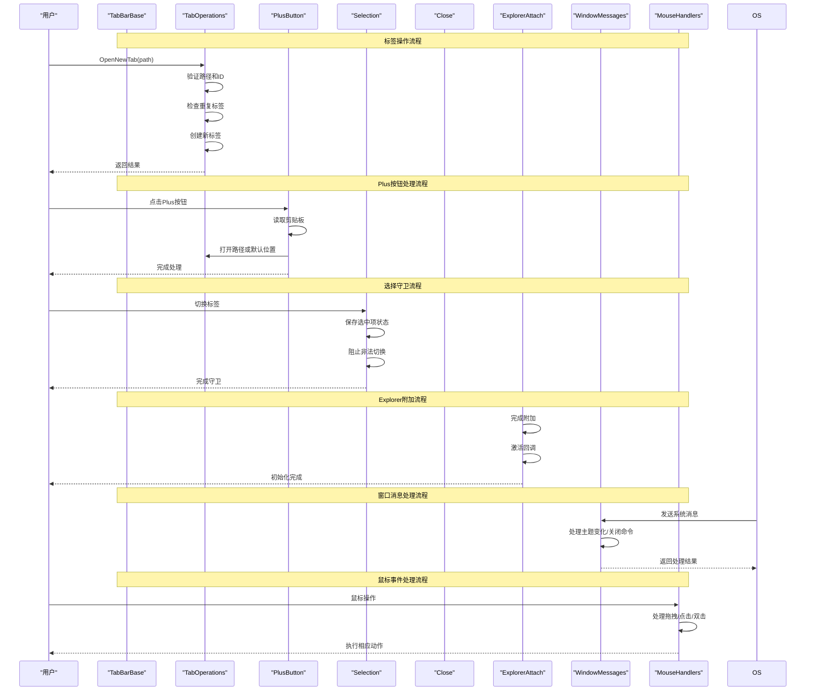

**图表来源**
- [TabBarBase.cs:20-401](file://QTTabBar/TabBarBase.cs#L20-L401)
- [TabBarBase.TabOperations.cs:11-143](file://QTTabBar/TabBarBase.TabOperations.cs#L11-L143)
- [TabBarBase.PlusButton.cs:8-67](file://QTTabBar/TabBarBase.PlusButton.cs#L8-L67)
- [TabBarBase.Selection.cs:7-31](file://QTTabBar/TabBarBase.Selection.cs#L7-L31)
- [TabBarBase.Close.cs:8-74](file://QTTabBar/TabBarBase.Close.cs#L8-L74)
- [TabBarBase.ExplorerAttach.cs:5-12](file://QTTabBar/TabBarBase.ExplorerAttach.cs#L5-L12)
- [TabBarBase.WindowMessages.cs:10-61](file://QTTabBar/TabBarBase.WindowMessages.cs#L10-L61)
- [TabBarBase.MouseHandlers.cs:11-267](file://QTTabBar/TabBarBase.MouseHandlers.cs#L11-L267)

#### 代码复用优势
- **消除重复代码**：QTTabBarClass 和 QTSecondViewBar 不再需要各自实现相同的逻辑
- **统一行为**：确保所有派生类具有一致的行为表现
- **易于维护**：修改逻辑只需在单一位置进行
- **类型安全**：通过继承关系确保派生类正确使用共享方法
- **扩展性强**：新功能可以添加到基类中供所有派生类使用

**章节来源**
- [TabBarBase.cs:20-401](file://QTTabBar/TabBarBase.cs#L20-L401)
- [TabBarBase.TabOperations.cs:11-143](file://QTTabBar/TabBarBase.TabOperations.cs#L11-L143)
- [TabBarBase.PlusButton.cs:8-67](file://QTTabBar/TabBarBase.PlusButton.cs#L8-L67)
- [TabBarBase.Selection.cs:7-31](file://QTTabBar/TabBarBase.Selection.cs#L7-L31)
- [TabBarBase.Close.cs:8-74](file://QTTabBar/TabBarBase.Close.cs#L8-L74)
- [TabBarBase.ExplorerAttach.cs:5-12](file://QTTabBar/TabBarBase.ExplorerAttach.cs#L5-L12)
- [TabBarBase.WindowMessages.cs:10-61](file://QTTabBar/TabBarBase.WindowMessages.cs#L10-L61)
- [TabBarBase.MouseHandlers.cs:11-267](file://QTTabBar/TabBarBase.MouseHandlers.cs#L11-L267)

### 窗口消息处理机制详解
**新增**：TabBarBase.WindowMessages 部分类实现了系统消息的集中化处理，提供了统一的窗口消息拦截和处理机制。

#### 系统主题变化处理
`HandleSysColorChangeHookMessage` 方法专门处理系统主题变化消息：

- **主题刷新**：调用 ThemeRefreshService.ApplySystemTheme 统一应用新主题
- **参数控制**：支持是否立即刷新和是否强制刷新的选项
- **跨平台兼容**：在不同Windows版本上保持一致的主题处理行为

#### Explorer关闭消息处理
`TryHandleHookCloseMessage` 方法处理Explorer窗口的关闭消息：

- **XP系统特殊处理**：针对Windows XP系统提供专门的关闭逻辑
- **锁定标签保存**：在处理关闭前保存所有锁定标签的状态
- **智能关闭决策**：根据当前标签状态和路径有效性决定关闭整个Explorer还是仅关闭标签
- **异常处理**：完善的异常捕获和错误日志记录

#### 系统命令消息处理
`TryHandleHookCommandMessage` 方法处理系统级别的命令消息：

- **XP系统命令**：专门处理XP系统的特定关闭命令（0xa021）
- **命令抑制**：根据处理结果决定是否抑制原始消息传递
- **返回值控制**：通过布尔返回值控制消息处理流程

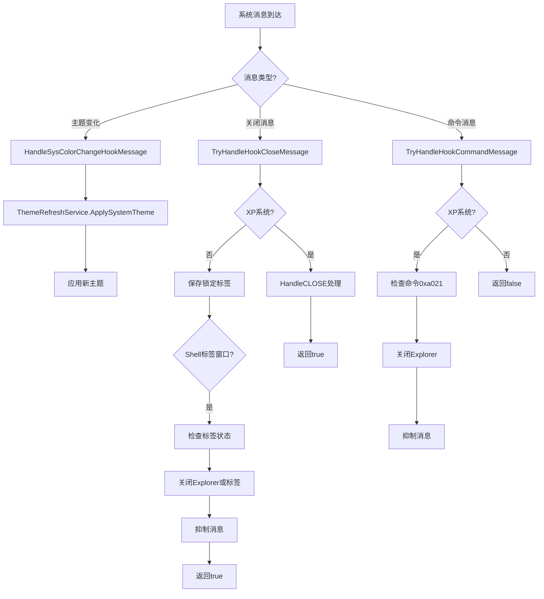

**图表来源**
- [TabBarBase.WindowMessages.cs:11-60](file://QTTabBar/TabBarBase.WindowMessages.cs#L11-L60)

#### 跨平台兼容性
- **版本检测**：使用 OSDetector.IsXP 检测Windows版本
- **差异化处理**：根据不同系统版本提供特定的处理逻辑
- **向后兼容**：确保在新旧Windows版本上都能正常工作

**章节来源**
- [TabBarBase.WindowMessages.cs:10-61](file://QTTabBar/TabBarBase.WindowMessages.cs#L10-L61)

### 鼠标事件处理机制详解
**新增**：TabBarBase.MouseHandlers 部分类实现了鼠标交互的集中化处理，提供了完整的鼠标事件响应和拖拽操作支持。

#### 鼠标事件处理器
- **tabControl1_CloseButtonClicked**：处理标签关闭按钮点击，支持拖拽状态检查和最后标签的特殊关闭逻辑
- **tabControl1_MouseDoubleClick**：处理双击事件，支持绑定动作的执行
- **tabControl1_MouseDown/MouseMove/MouseUp**：完整的鼠标拖拽和交互处理流程
- **tabControl1_TabIconMouseDown**：处理标签图标点击，支持子目录提示的显示

#### 拖拽操作支持
- **拖拽状态管理**：NowTabDragging、DraggingTab、DraggingDestRect 等状态变量跟踪拖拽过程
- **动态光标**：GetTabDragCursor 方法根据拖拽状态动态切换光标样式
- **目标区域检测**：精确计算拖拽目标位置和重排逻辑
- **克隆操作**：支持Ctrl键拖拽进行标签克隆

#### 自定义光标创建
`CreateDragCursor` 方法提供自定义光标的创建功能：

- **内存优化**：使用 using 语句确保位图资源正确释放
- **图标信息构建**：通过 ICONINFO 结构体创建彩色图标
- **异常处理**：创建失败时回退到默认光标
- **性能优化**：缓存已创建的光标对象避免重复创建

#### 鼠标绑定动作
- **手势识别**：QTUtility.MakeMouseChord 识别不同的鼠标手势和组合键
- **动作映射**：Config.Mouse.TabActions 和 Config.Mouse.BarActions 配置动作映射
- **延迟执行**：PerformBindAction 虚方法允许派生类自定义动作执行逻辑

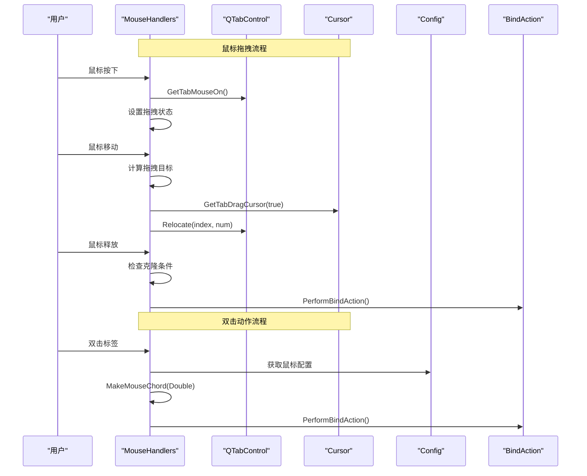

**图表来源**
- [TabBarBase.MouseHandlers.cs:47-267](file://QTTabBar/TabBarBase.MouseHandlers.cs#L47-L267)

#### 虚拟方法扩展点
- **PerformBindAction**：允许派生类自定义绑定动作的执行逻辑
- **CloneTabButtonForMouse**：支持鼠标拖拽时的标签克隆定制
- **ShowSubdirTipForTab**：控制子目录提示的显示行为

**章节来源**
- [TabBarBase.MouseHandlers.cs:11-267](file://QTTabBar/TabBarBase.MouseHandlers.cs#L11-L267)

### 增强的静态注册表线程安全性
**新增**：`StaticReg.RegBackedList<T>` 类经过重大改进，提供了更强的线程安全性和数据一致性保障。

#### _assignLock 锁机制
每个 `RegBackedList<T>` 实例现在拥有专用的 `_assignLock` 对象，用于保护并发访问：

- **细粒度锁定**：每个集合实例独立锁定，避免全局锁竞争
- **原子操作**：`Assign` 方法内的所有操作都在锁保护下执行
- **异常安全**：使用 try-finally 确保锁的正确释放

#### 原子写入机制
`Assign` 方法实现了真正的原子写入操作：

1. **清空现有数据**：首先删除注册表中所有现有值
2. **批量写入新数据**：然后按顺序写入新的集合元素
3. **更新版本号**：最后更新 lastUpdate 版本号

这种机制有效防止了数据竞争和不完整写入的问题。

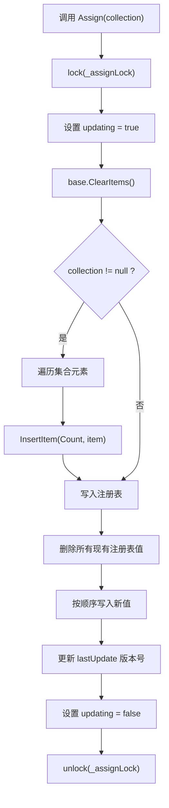

**图表来源**
- [StaticReg.cs:143-167](file://QTTabBar\StaticReg.cs#L143-L167)

#### 数据一致性保障
- **版本控制**：通过 lastUpdate 版本号检测外部修改
- **防循环更新**：updating 标志防止递归更新
- **线程隔离**：每个集合实例独立的状态管理

**章节来源**
- [StaticReg.cs:60-67](file://QTTabBar\StaticReg.cs#L60-L67)
- [StaticReg.cs:143-167](file://QTTabBar\StaticReg.cs#L143-L167)
- [StaticReg.cs:120-135](file://QTTabBar\StaticReg.cs#L120-L135)

### TabManager 分析与流程
**更新**：TabManager 是本次架构重构的核心组件，作为 QTTabBarClass 的内部类，通过 _owner 引用访问外部成员，实现了标签管理的完全模块化。**新增的 TabIndex() 方法提供了基于配置的标签位置计算逻辑**，并且集成了新的集中化持久化机制。

- **标签创建与打开**
  - AddInsertTab：根据配置决定新标签插入位置（最左、左侧、右侧、最右）
  - CreateNewTab：创建新标签项并设置初始状态
  - OpenNewTab：智能打开新标签，支持重复检测、特殊文件夹处理
  - OpenGroup：批量打开分组中的多个路径
  - OpenDroppedFolder：处理拖拽文件夹操作

- **标签克隆功能**
  - CloneCurrentTab：克隆当前活动标签
  - CloneTabButton：支持指定位置和URL的灵活克隆

- **标签关闭管理**
  - CloseTab：智能关闭标签，支持锁定保护、历史记录保存
  - CloseTabs：批量关闭标签，保持界面一致性
  - CloseAllTabsExcept：保留指定标签外所有标签
  - **新增**：集成 SaveLockedTabs() 进行锁定标签持久化

- **UI事件处理**
  - tabControl1_SelectedIndexChanged：处理标签切换，同步Shell浏览器状态
  - tabControl1_CloseButtonClicked：处理关闭按钮点击，支持最后标签的特殊处理
  - 鼠标事件：完整的鼠标交互处理，包括拖拽、双击、右键菜单等

- **新增：TabIndex() 方法**
  - 根据 Config.Tabs.NewTabPosition 配置计算新标签插入位置
  - 支持 Rightmost（最右侧）、Left（左侧）、Right（右侧）、其他（默认0）
  - 使用 _owner.tabControl1.TabPages.Count 和 SelectedIndex 进行位置计算

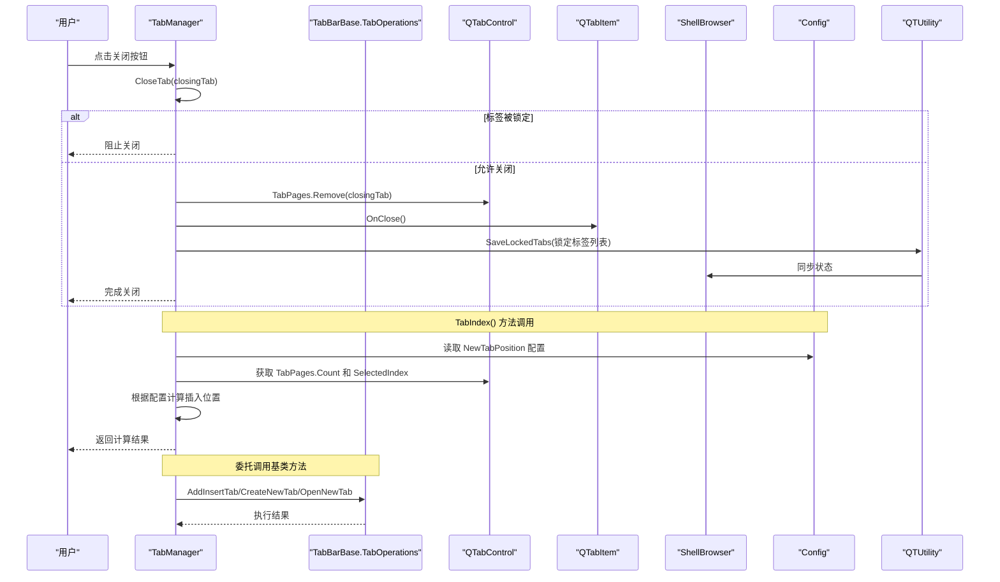

**图表来源**
- [QTTabBarClass.TabManager.cs:556-634](file://QTTabBar/QTTabBarClass.TabManager.cs#L556-L634)
- [QTTabBarClass.TabManager.cs:1028-1053](file://QTTabBar/QTTabBarClass.TabManager.cs#L1028-L1053)
- [QTTabBarClass.TabManager.cs:1484-1505](file://QTTabBar/QTTabBarClass.TabManager.cs#L1484-L1505)
- [TabBarBase.TabOperations.cs:11-143](file://QTTabBar/TabBarBase.TabOperations.cs#L11-L143)
- [QTUtility.cs:491-498](file://QTTabBar\QTUtility.cs#L491-L498)
- [Config.cs:65-72](file://QTTabBar\Config.cs#L65-L72)

**章节来源**
- [QTTabBarClass.TabManager.cs:67-90](file://QTTabBar/QTTabBarClass.TabManager.cs#L67-L90)
- [QTTabBarClass.TabManager.cs:142-149](file://QTTabBar/QTTabBarClass.TabManager.cs#L142-L149)
- [QTTabBarClass.TabManager.cs:151-246](file://QTTabBar/QTTabBarClass.TabManager.cs#L151-L246)
- [QTTabBarClass.TabManager.cs:320-411](file://QTTabBar/QTTabBarClass.TabManager.cs#L320-L411)
- [QTTabBarClass.TabManager.cs:486-532](file://QTTabBar/QTTabBarClass.TabManager.cs#L486-L532)
- [QTTabBarClass.TabManager.cs:556-634](file://QTTabBar/QTTabBarClass.TabManager.cs#L556-L634)
- [QTTabBarClass.TabManager.cs:711-793](file://QTTabBar/QTTabBarClass.TabManager.cs#L711-793)
- [QTTabBarClass.TabManager.cs:1028-1053](file://QTTabBar/QTTabBarClass.TabManager.cs#L1028-L1053)
- [QTTabBarClass.TabManager.cs:1484-1505](file://QTTabBar/QTTabBarClass.TabManager.cs#L1484-L1505)

### QTabControl 分析与流程
- 布局与尺寸计算
  - 单行模式：CalculateItemRectangle 按固定或自适应宽度分配 TabBounds，并判断是否需要显示上下滚动按钮。
  - 多行模式：CalculateItemRectangle_MultiRows 按行填充，设置 Row 与 Edge，并在需要时调整选中行偏移以维持可见性。
- 绘制管线
  - OnPaint 根据 iMultipleType 决定单行或多行绘制；DrawBackground 支持视觉样式或经典绘制；DrawTab 负责图标、锁定标志、主/副标题、关闭按钮与焦点矩形。
- 交互与事件
  - 鼠标：OnMouseDown/OnMouseUp/OnMouseMove/OnMouseLeave 处理选中、关闭按钮命中、图标点击、拖拽、悬停高亮与提示。
  - 键盘：FocusNextTab/SetPseudoHotIndex 用于键盘导航时的伪热区高亮；WndProc 拦截 SETCURSOR/MOUSEACTIVATE/CONTEXTMENU 等消息以增强交互。
- 选项与外观
  - RefreshOptions 读取配置（是否多行、是否显示文件夹图标、是否居中、是否阴影、最小/最大宽度、高度、字体、皮肤图片等），并更新内部状态与绘制资源。

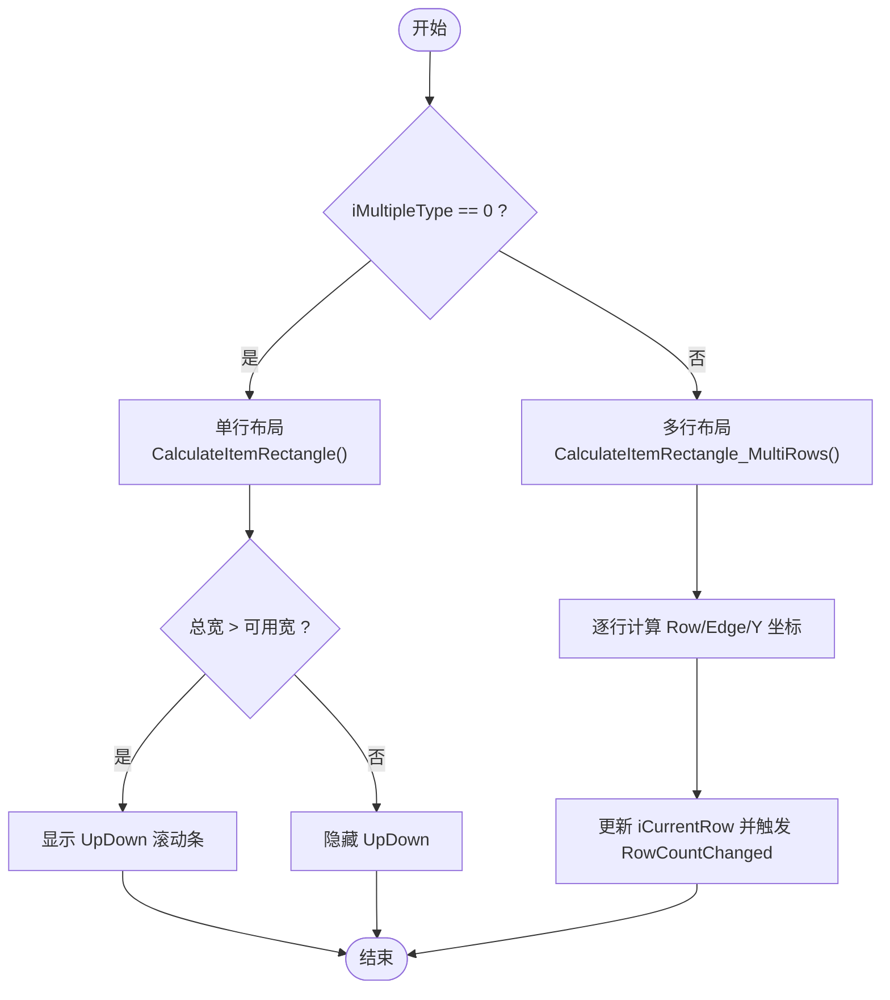

**图表来源**
- [QTabControl.cs:290-330](file://QTTabBar/QTabControl.cs#L290-L330)
- [QTabControl.cs:332-464](file://QTTabBar/QTabControl.cs#L332-L464)
- [QTabControl.cs:1905-1920](file://QTTabBar/QTabControl.cs#L1905-L1920)

**章节来源**
- [QTabControl.cs:290-464](file://QTTabBar/QTabControl.cs#L290-L464)
- [QTabControl.cs:1456-1570](file://QTTabBar/QTabControl.cs#L1456-L1570)
- [QTabControl.cs:1638-1722](file://QTTabBar/QTabControl.cs#L1638-L1722)
- [QTabControl.cs:1905-1920](file://QTTabBar/QTabControl.cs#L1905-L1920)

### QTabItem 分析与流程
- 文本度量与尺寸
  - RefreshRectangle 基于字体与内容计算 TitleTextSize/SubTitleTextSize，结合图标/锁定/关闭按钮占用空间，更新 TabBounds。
- 历史与导航
  - NavigatedTo 将新条目推入历史栈，清理前向历史，维护 Branches 分支；GoBackward/GoForward 在前后栈间移动并更新 CurrentPath。
- 克隆与锁定
  - Clone 复制标题、路径、历史、选择快照等；TabLocked 影响绘制与交互。
- 自动副标题
  - CheckSubTexts 对同名标签进行路径差异分析，生成注释（Comment）以提升辨识度。

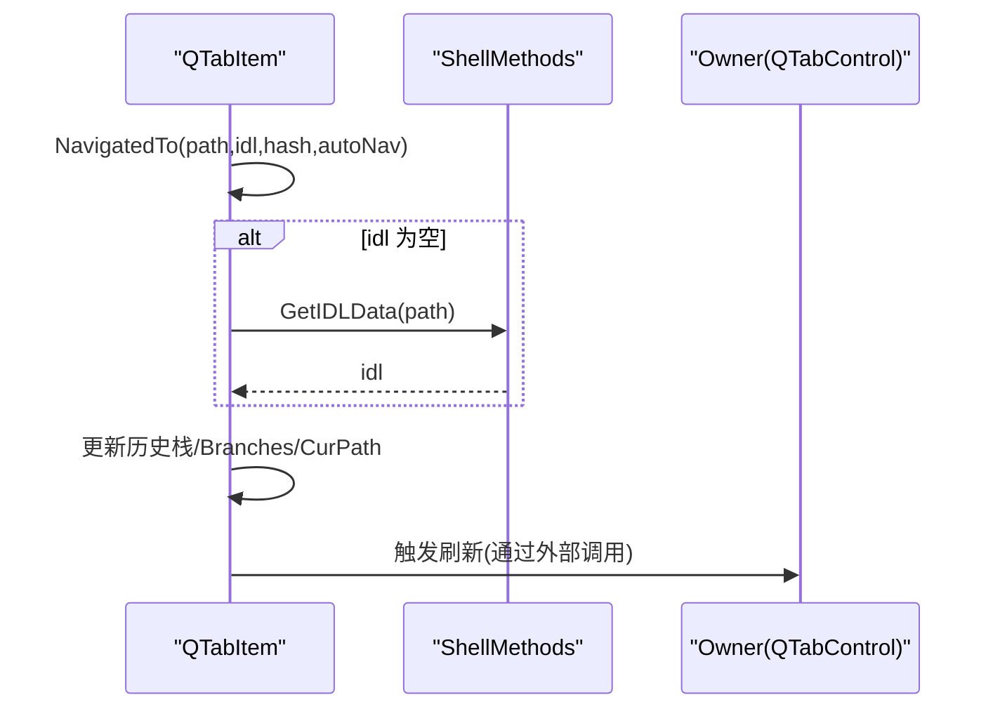

**图表来源**
- [QTabItem.cs:371-390](file://QTTabBar/QTabItem.cs#L371-390)
- [QTabItem.cs:400-432](file://QTTabBar/QTabItem.cs#L400-L432)
- [QTabItem.cs:225-275](file://QTTabBar/QTabItem.cs#L225-L275)

**章节来源**
- [QTabItem.cs:30-128](file://QTTabBar/QTabItem.cs#L30-L128)
- [QTabItem.cs:225-275](file://QTTabBar/QTabItem.cs#L225-L275)
- [QTabItem.cs:277-293](file://QTTabBar/QTabItem.cs#L277-L293)
- [QTabItem.cs:351-390](file://QTTabBar/QTabItem.cs#L351-L390)
- [QTabItem.cs:400-432](file://QTTabBar/QTabItem.cs#L400-L432)

### 分组功能（GroupsManager）
- 数据结构：Group 包含名称、快捷键、启动项、路径列表。
- 持久化：LoadGroups/SaveGroups 从注册表读写，保存后广播刷新按钮与实例。
- 使用场景：为标签页创建快捷入口、批量打开一组路径、开机自启等。

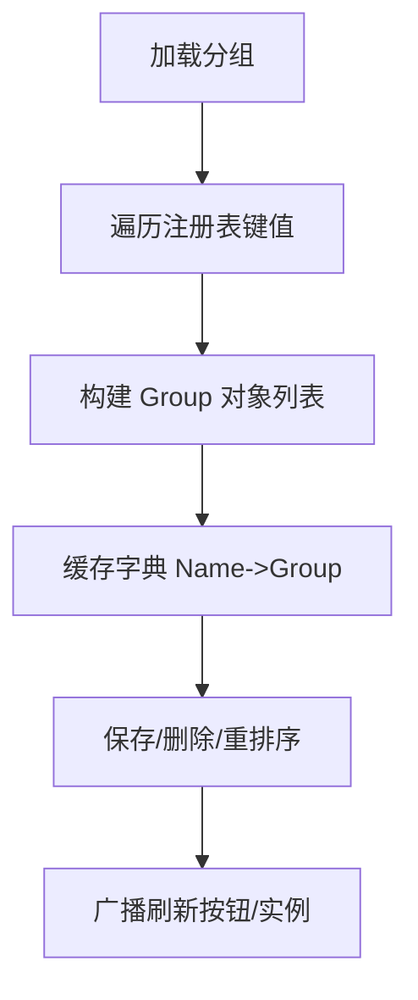

**图表来源**
- [GroupsManager.cs:63-92](file://QTTabBar/GroupsManager.cs#L63-L92)
- [GroupsManager.cs:94-112](file://QTTabBar/GroupsManager.cs#L94-L112)

**章节来源**
- [GroupsManager.cs:25-38](file://QTTabBar/GroupsManager.cs#L25-L38)
- [GroupsManager.cs:40-112](file://QTTabBar/GroupsManager.cs#L40-L112)

## 依赖关系分析
**重大架构升级**：TabBarBase 作为抽象基类，形成了更清晰的层次结构。**新增的部分类架构进一步提升了系统的可维护性和扩展性**。

- **TabBarBase 依赖**
  - UI组件：QTabControl、ToolTip、Timer 等界面元素
  - 配置系统：Config.Skin/Tabs 相关项控制行为和外观
  - Shell工具：ShellMethods、IDLWrapper 处理文件系统操作
  - 注册表：StaticReg 进行数据持久化
  - 工具类：QTUtility、QTUtility2 提供系统级功能

- **TabBarBase.TabOperations 依赖**
  - 基类成员：通过继承访问 TabBarBase 的共享字段和方法
  - 配置系统：Config.Tabs.NewTabPosition 控制标签插入位置
  - Shell工具：IDLWrapper 处理路径和ID列表
  - 按钮栏：TryCallButtonBar 刷新按钮状态

- **TabBarBase.PlusButton 依赖**
  - 基类成员：通过继承访问 TabBarBase 的共享字段和方法
  - 剪贴板：QTUtility2.GetStringClipboard 获取剪贴板内容
  - 文件系统：System.IO.Path 和 System.IO.DirectoryInfo 处理路径
  - Shell工具：IDLWrapper 处理ID列表和路径转换
  - Shell浏览器：ShellBrowser.TrySetSelection 设置文件选择
  - 配置系统：Config.Window.DefaultLocation 获取默认位置

- **TabBarBase.Selection 依赖**
  - 基类成员：通过继承访问 TabBarBase 的共享字段和方法
  - Shell工具：ShellBrowser.TryGetSelection 获取选中项
  - 工具类：QTUtility2.log 记录日志

- **TabBarBase.Close 依赖**
  - 基类成员：通过继承访问 TabBarBase 的共享字段和方法
  - 配置系统：Config.Window 相关配置项
  - 操作系统检测：OSDetector.IsXP 检查系统版本
  - 工具类：QTUtility.SaveClosing 保存关闭历史

- **TabBarBase.ExplorerAttach 依赖**
  - 基类成员：通过继承访问 TabBarBase 的共享字段和方法
  - 父类方法：base.OnExplorerAttached() 调用父类方法

- **TabBarBase.WindowMessages 依赖**
  - 基类成员：通过继承访问 TabBarBase 的共享字段和方法
  - 主题服务：ThemeRefreshService.ApplySystemTheme 应用主题变化
  - 系统工具：WindowUtils.GetShellTabWindowClass、CloseExplorer 处理系统操作
  - 操作系统检测：OSDetector.IsXP 检查系统版本
  - 日志记录：QTLogger.MakeErrorLog 记录错误信息

- **TabBarBase.MouseHandlers 依赖**
  - 基类成员：通过继承访问 TabBarBase 的共享字段和方法
  - 配置系统：Config.Mouse.TabActions、Config.Mouse.BarActions 获取鼠标配置
  - 工具类：QTUtility.MakeMouseChord 识别鼠标手势
  - 系统工具：PInvoke 进行底层API调用
  - 资源管理：Resources_Image 提供光标资源
  - Shell工具：ShellMethods.ShowProperties 显示属性对话框

- **TabManager 依赖**
  - 外部引用：_owner (QTTabBarClass) 访问主控制器功能
  - 基类方法：委托调用 TabBarBase 的共享标签操作方法
  - UI组件：QTabControl 进行标签操作
  - 配置系统：Config.Tabs 相关项控制行为，特别是 NewTabPosition 配置
  - Shell工具：ShellMethods、IDLWrapper 处理文件系统操作
  - 分组管理：GroupsManager 处理分组功能
  - 历史记录：StaticReg.ClosedTabHistoryList 管理关闭历史
  - **新增**：QTUtility.SaveLockedTabs() 进行锁定标签持久化

- QTabControl 依赖
  - 绘制资源：Brush、Bitmap、Font、StringFormat、VisualStyleRenderer
  - 控件：ToolTip、UpDown、Timer
  - 配置：Config.Skin/Tabs 相关项（颜色、字体、大小、行为开关）
  - Shell 工具：ShellMethods（获取 IDL、提示文本）
- QTabItem 依赖
  - Shell 工具：ShellMethods（GetIDLData、GetShellInfoTipText）
  - 图形测量：Graphics/StringFormat
- GroupsManager 依赖
  - 注册表：Microsoft.Win32.RegistryKey
  - 广播：InstanceManager（刷新按钮与跨进程命令）
- **Config 依赖**
  - TabPos 枚举：定义标签位置配置选项
  - NewTabPosition 属性：控制新标签插入位置的行为
- **QTUtility 依赖**
  - **新增**：StaticReg.LockedTabsToRestoreList 进行内存数据同步
  - 注册表操作：WriteRegBinary 方法写入 "TabsLocked" 键值
- **StaticReg 依赖**
  - **增强的**：RegBackedList<T> 使用 _assignLock 确保线程安全
  - 原子操作：Assign 方法先清空再写入，防止数据竞争

```mermaid
graph LR
TBB["TabBarBase<br/>抽象基类"] --> TBO["TabBarBase.TabOperations<br/>代码复用层"]
TBB --> TBP["TabBarBase.PlusButton<br/>Plus按钮处理复用层"]
TBB --> TBS["TabBarBase.Selection<br/>选择守卫复用层"]
TBB --> TBC["TabBarBase.Close<br/>关闭操作复用层"]
TBB --> TBE["TabBarBase.ExplorerAttach<br/>Explorer附加生命周期复用层"]
TBB --> TBWM["TabBarBase.WindowMessages<br/>窗口消息处理复用层"]
TBB --> TBMH["TabBarBase.MouseHandlers<br/>鼠标事件处理复用层"]
TBB --> QTB["QTTabBarClass<br/>主控制器"]
TBB --> QSV["QTSecondViewBar<br/>第二视图栏"]
TBO --> Cfg["配置(Config)"]
TBO --> Shell["ShellMethods/IDLWrapper"]
TBO --> Btn["按钮栏(ButtonBar)"]
TBP --> Clip["剪贴板(QTUtility2)"]
TBP --> FS["文件系统(System.IO)"]
TBP --> Shell
TBP --> SB["ShellBrowser"]
TBP --> Cfg
TBS --> Shell
TBS --> Util["QTUtility2"]
TBC --> Cfg
TBC --> OS["OSDetector"]
TBC --> Util
TBE --> Base["父类方法"]
TBWM --> Theme["ThemeRefreshService"]
TBWM --> WinUtil["WindowUtils"]
TBWM --> OS
TBWM --> Log["QTLogger"]
TBMH --> Cfg
TBMH --> Mouse["QTUtility.MakeMouseChord"]
TBMH --> PInvoke["PInvoke"]
TBMH --> Res["Resources_Image"]
TBMH --> Shell
QTB --> TM["TabManager<br/>标签管理器"]
TM --> TBB : "委托调用"
TM --> Ctl["QTabControl"]
TM --> Cfg
TM --> Shell
TM --> Grp["GroupsManager"]
TM --> TU["QTUtility.SaveLockedTabs"]
Ctl --> Res["绘制资源/控件"]
Ctl --> Cfg
Ctl --> Shell
Item["QTabItem"] --> Shell
Item --> Gfx["Graphics/StringFormat"]
Grp --> Reg["注册表"]
Grp --> Inst["InstanceManager"]
Cfg --> Enum["TabPos 枚举"]
TU --> SR["StaticReg"]
SR --> RBL["RegBackedList<T>"]
RBL --> Lock["_assignLock"]
```

**图表来源**
- [TabBarBase.cs:20-401](file://QTTabBar/TabBarBase.cs#L20-L401)
- [TabBarBase.TabOperations.cs:11-143](file://QTTabBar/TabBarBase.TabOperations.cs#L11-L143)
- [TabBarBase.PlusButton.cs:8-67](file://QTTabBar/TabBarBase.PlusButton.cs#L8-L67)
- [TabBarBase.Selection.cs:7-31](file://QTTabBar/TabBarBase.Selection.cs#L7-L31)
- [TabBarBase.Close.cs:8-74](file://QTTabBar/TabBarBase.Close.cs#L8-L74)
- [TabBarBase.ExplorerAttach.cs:5-12](file://QTTabBar/TabBarBase.ExplorerAttach.cs#L5-L12)
- [TabBarBase.WindowMessages.cs:10-61](file://QTTabBar/TabBarBase.WindowMessages.cs#L10-L61)
- [TabBarBase.MouseHandlers.cs:11-267](file://QTTabBar/TabBarBase.MouseHandlers.cs#L11-L267)
- [QTTabBarClass.TabManager.cs:58-63](file://QTTabBar/QTTabBarClass.TabManager.cs#L58-L63)
- [QTTabBarClass.TabManager.cs:67-90](file://QTTabBar/QTTabBarClass.TabManager.cs#L67-L90)
- [QTTabBarClass.TabManager.cs:142-149](file://QTTabBar/QTTabBarClass.TabManager.cs#L142-L149)
- [QTTabBarClass.TabManager.cs:556-634](file://QTTabBar/QTTabBarClass.TabManager.cs#L556-L634)
- [QTTabBarClass.TabManager.cs:1484-1505](file://QTTabBar/QTTabBarClass.TabManager.cs#L1484-L1505)
- [QTSecondViewBar.cs:39](file://QTTabBar/QTSecondViewBar.cs#L39)
- [QTabControl.cs:124-224](file://QTTabBar/QTabControl.cs#L124-L224)
- [QTabControl.cs:1638-1722](file://QTTabBar/QTabControl.cs#L1638-L1722)
- [QTabItem.cs:170-193](file://QTTabBar/QTabItem.cs#L170-L193)
- [GroupsManager.cs:94-112](file://QTTabBar/GroupsManager.cs#L94-L112)
- [Config.cs:65-72](file://QTTabBar\Config.cs#L65-L72)
- [QTUtility.cs:491-498](file://QTTabBar\QTUtility.cs#L491-L498)
- [StaticReg.cs:60-67](file://QTTabBar\StaticReg.cs#L60-L67)
- [StaticReg.cs:143-167](file://QTTabBar\StaticReg.cs#L143-L167)

**章节来源**
- [TabBarBase.cs:20-401](file://QTTabBar/TabBarBase.cs#L20-L401)
- [TabBarBase.TabOperations.cs:11-143](file://QTTabBar/TabBarBase.TabOperations.cs#L11-L143)
- [TabBarBase.PlusButton.cs:8-67](file://QTTabBar/TabBarBase.PlusButton.cs#L8-L67)
- [TabBarBase.Selection.cs:7-31](file://QTTabBar/TabBarBase.Selection.cs#L7-L31)
- [TabBarBase.Close.cs:8-74](file://QTTabBar/TabBarBase.Close.cs#L8-L74)
- [TabBarBase.ExplorerAttach.cs:5-12](file://QTTabBar/TabBarBase.ExplorerAttach.cs#L5-L12)
- [TabBarBase.WindowMessages.cs:10-61](file://QTTabBar/TabBarBase.WindowMessages.cs#L10-L61)
- [TabBarBase.MouseHandlers.cs:11-267](file://QTTabBar/TabBarBase.MouseHandlers.cs#L11-L267)
- [QTTabBarClass.TabManager.cs:58-63](file://QTTabBar/QTTabBarClass.TabManager.cs#L58-L63)
- [QTTabBarClass.TabManager.cs:67-90](file://QTTabBar/QTTabBarClass.TabManager.cs#L67-L90)
- [QTTabBarClass.TabManager.cs:142-149](file://QTTabBar/QTTabBarClass.TabManager.cs#L142-L149)
- [QTTabBarClass.TabManager.cs:556-634](file://QTTabBar/QTTabBarClass.TabManager.cs#L556-L634)
- [QTTabBarClass.TabManager.cs:1484-1505](file://QTTabBar/QTTabBarClass.TabManager.cs#L1484-L1505)
- [QTSecondViewBar.cs:39](file://QTTabBar/QTSecondViewBar.cs#L39)
- [QTabControl.cs:124-224](file://QTTabBar/QTabControl.cs#L124-L224)
- [QTabControl.cs:1638-1722](file://QTTabBar/QTabControl.cs#L1638-L1722)
- [QTabItem.cs:170-193](file://QTTabBar/QTabItem.cs#L170-L193)
- [GroupsManager.cs:94-112](file://QTTabBar/GroupsManager.cs#L94-L112)
- [Config.cs:65-72](file://QTTabBar\Config.cs#L65-L72)
- [QTUtility.cs:491-498](file://QTTabBar\QTUtility.cs#L491-L498)
- [StaticReg.cs:60-67](file://QTTabBar\StaticReg.cs#L60-L67)
- [StaticReg.cs:143-167](file://QTTabBar\StaticReg.cs#L143-L167)

## 性能考虑
**重大架构升级**：TabBarBase 增强架构带来的性能优化和注意事项，以及全面测试框架的性能影响分析。**部分类架构减少了重复计算和内存开销，进一步提升了系统性能和稳定性**。

- **TabBarBase 架构优势**
  - 代码复用：避免在 QTTabBarClass 和 QTSecondViewBar 中重复实现相同的标签操作逻辑
  - 内存优化：共享字段减少内存占用，避免重复初始化
  - 维护性：单一职责原则，标签管理逻辑集中在基类中
  - 扩展性：易于添加新的标签管理功能而不影响现有组件
  - **新增**：部分类设计提高编译效率和代码组织

- **TabBarBase.TabOperations 性能优化**
  - 统一实现：避免重复的路径验证和ID列表处理逻辑
  - 资源管理：合理使用 using 语句确保 COM 对象正确释放
  - 配置缓存：减少频繁的配置读取操作
  - 错误处理：统一的异常处理和日志记录

- **TabBarBase.PlusButton 性能优化**
  - 统一实现：避免重复的剪贴板检查和文件系统操作
  - 智能缓存：合理的异常处理和快速失败机制
  - 资源管理：统一的ID列表包装和资源释放
  - 错误处理：统一的异常处理和日志记录

- **TabBarBase.Selection 性能优化**
  - 选择性保存：只在必要时保存选中项状态
  - 阻止无效切换：防止在标签添加/删除过程中的选择变更
  - 状态同步：确保选中项状态与当前地址同步

- **TabBarBase.Close 性能优化**
  - 批量操作：CloseTabs 方法禁用重绘以提高性能
  - 条件关闭：根据配置和状态智能决定是否允许关闭
  - 历史保存：统一的关闭历史管理机制

- **TabBarBase.WindowMessages 性能优化**
  - **新增**：消息过滤：只处理相关的系统消息，减少不必要的处理开销
  - **新增**：版本检测缓存：OSDetector.IsXP 结果缓存避免重复检测
  - **新增**：异常快速失败：异常处理避免阻塞主线程
  - **新增**：资源优化：ThemeRefreshService 的参数控制避免过度刷新

- **TabBarBase.MouseHandlers 性能优化**
  - **新增**：光标缓存：curTabDrag 和 curTabCloning 缓存避免重复创建
  - **新增**：事件节流：鼠标移动事件中的边界检查减少不必要的计算
  - **新增**：状态检查：NowTabDragging 标志避免无效的事件处理
  - **新增**：局部刷新：只刷新受影响的标签区域而非整个控件

- **TabManager 架构优势**
  - 代码复用：避免在 QTTabBarClass 中分散的标签管理逻辑
  - 测试友好：独立的 TabManager 便于单元测试和模拟
  - 维护性：单一职责原则，标签管理逻辑集中在一个类中
  - 扩展性：易于添加新的标签管理功能而不影响其他组件

- 绘制优化
  - 启用双缓冲与透明背景以减少闪烁（构造函数中 SetStyle）。
  - 按需绘制：仅对受影响区域 Invalidate，避免全量重绘。
  - 复用绘制资源：Brush/Bitmap/Font 在 Dispose 中释放，避免内存泄漏。
- 布局与测量
  - 文本度量结果缓存于 QTabItem.TitleTextSize/SubTitleTextSize，减少重复测量开销。
  - 多行布局仅在必要时重新计算，并通过 iCurrentRow 变化触发 RowCountChanged。
- 交互节流
  - 双击抑制计时器防止误触。
  - 鼠标悬停与关闭按钮命中检测局部刷新，降低无效重绘。
- **新增：TabIndex() 方法性能**
  - 纯计算函数，无副作用，时间复杂度 O(1)
  - 直接访问配置和控件属性，无额外开销
  - 适合频繁调用场景
- **新增：集中化持久化性能优势**
  - 统一接口减少重复代码，提高维护效率
  - 原子操作确保数据一致性，避免竞态条件
  - 专用锁对象减少锁竞争，提升并发性能
- **新增：RegBackedList 线程安全性能**
  - 细粒度锁定避免全局锁瓶颈
  - 原子写入操作减少部分写入风险
  - 版本控制机制避免不必要的同步操作
- **新增：Plus按钮处理性能优势**
  - 统一实现避免重复的文件系统检查
  - 智能路径处理减少不必要的异常处理
  - 统一的日志记录便于性能监控
- **新增：部分类架构性能优势**
  - 编译时优化：部分类在编译时合并，运行时性能无损
  - 代码组织：提高开发效率和维护性
  - 依赖管理：清晰的模块边界和依赖关系
- **新增：窗口消息处理性能优势**
  - **新增**：消息过滤减少不必要的系统调用
  - **新增**：版本检测缓存避免重复的系统检测
  - **新增**：异常快速失败避免阻塞主线程
- **新增：鼠标事件处理性能优势**
  - **新增**：光标对象缓存避免重复创建
  - **新增**：事件节流减少不必要的计算
  - **新增**：状态检查避免无效的事件处理
- 建议
  - 大量标签时优先使用固定宽度或限制最大宽度，避免频繁布局重算。
  - 谨慎开启"阴影文字"和"大图标"，在高 DPI 下可能增加绘制成本。
  - 合理设置最小/最大宽度与行高，平衡可读性与空间利用率。
  - **新增**：测试用例应避免创建真实的 COM 对象，使用轻量级模拟对象提高测试性能
  - **新增**：利用 SaveLockedTabs 的统一接口进行锁定标签管理，确保数据一致性
  - **新增**：充分利用 TabBarBase 的共享方法，避免重复实现相同逻辑
  - **新增**：Plus按钮处理已集中化，无需在派生类中重复实现
  - **新增**：利用部分类架构的优势，合理组织代码结构
  - **新增**：窗口消息处理已集中化，避免重复的消息拦截逻辑
  - **新增**：鼠标事件处理已集中化，确保一致的交互体验

**章节来源**
- [TabBarBase.cs:20-401](file://QTTabBar/TabBarBase.cs#L20-L401)
- [TabBarBase.TabOperations.cs:11-143](file://QTTabBar/TabBarBase.TabOperations.cs#L11-L143)
- [TabBarBase.PlusButton.cs:8-67](file://QTTabBar/TabBarBase.PlusButton.cs#L8-L67)
- [TabBarBase.Selection.cs:7-31](file://QTTabBar/TabBarBase.Selection.cs#L7-L31)
- [TabBarBase.Close.cs:8-74](file://QTTabBar/TabBarBase.Close.cs#L8-L74)
- [TabBarBase.ExplorerAttach.cs:5-12](file://QTTabBar/TabBarBase.ExplorerAttach.cs#L5-L12)
- [TabBarBase.WindowMessages.cs:10-61](file://QTTabBar/TabBarBase.WindowMessages.cs#L10-L61)
- [TabBarBase.MouseHandlers.cs:11-267](file://QTTabBar/TabBarBase.MouseHandlers.cs#L11-L267)
- [QTTabBarClass.TabManager.cs:58-63](file://QTTabBar/QTTabBarClass.TabManager.cs#L58-L63)
- [QTTabBarClass.TabManager.cs:1484-1505](file://QTTabBar/QTTabBarClass.TabManager.cs#L1484-L1505)
- [QTabControl.cs:124-147](file://QTTabBar/QTabControl.cs#L124-L147)
- [QTabControl.cs:506-571](file://QTTabBar/QTabControl.cs#L506-L571)
- [QTabControl.cs:1922-1925](file://QTTabBar/QTabControl.cs#L1922-L1925)
- [QTabControl.cs:1638-1722](file://QTTabBar/QTabControl.cs#L1638-L1722)
- [QTabItem.cs:400-432](file://QTTabBar/QTabItem.cs#L400-L432)
- [QTUtility.cs:491-498](file://QTTabBar\QTUtility.cs#L491-L498)
- [StaticReg.cs:143-167](file://QTTabBar\StaticReg.cs#L143-L167)

## 质量保证与测试
**重大架构升级**：系统引入了全面的单元测试框架，确保重构后的代码质量和行为一致性。**新增的多个架构批次测试专门验证 TabBarBase 增强架构的各项功能集中化重构**。

### 测试架构概览
系统采用 NUnit 测试框架，包含多个主要的测试类：
- **ArchitectureBatch2Tests**：架构批次2测试，专注于 SaveLockedTabs 方法和线程安全性验证
- **ArchitectureBatch3W3aTests**：**新增的架构批次3W3a测试**，专注于Plus按钮处理逻辑的集中化重构验证
- **ArchitectureBatch3W3bTests**：**新增的架构批次3W3b测试**，专注于选择守卫逻辑的集中化重构验证
- **ArchitectureBatch3W3cTests**：**新增的架构批次3W3c测试**，专注于关闭操作逻辑的集中化重构验证
- **TabManagerTests**：专注于 TabManager 类的功能验证和结构完整性检查
- **FacadeEquivalenceTests**：验证 facade-extraction 重构前后的行为等价性

### 架构批次3W3a测试覆盖
**新增的架构批次3W3a测试**涵盖了以下关键场景：

#### Plus按钮处理逻辑验证
- **方法存在性测试**：验证 TabBarBase.tabControl1_PlusButtonClicked 公共方法的存在
- **方法存在性测试**：验证 TabBarBase.openDefault 公共方法的存在
- **重复代码消除测试**：确认 QTSecondViewBar 不再包含重复的Plus按钮处理方法
- **TabManager重构测试**：确认 TabManager 不再包含Plus按钮处理方法

#### 测试策略
- 使用反射验证方法的存在性和访问修饰符
- 通过文件内容分析验证重复代码已被移除
- 确保重构后的代码结构符合预期

### 架构批次3W3b测试覆盖
**新增的架构批次3W3b测试**涵盖了以下关键场景：

#### 选择守卫逻辑验证
- **方法存在性测试**：验证 TabBarBase.tabControl1_Deselecting 公共方法的存在
- **方法存在性测试**：验证 TabBarBase.SaveSelectedItems 公共方法的存在
- **方法存在性测试**：验证 TabBarBase.tabControl1_Selecting 公共方法的存在
- **重复代码消除测试**：确认 QTSecondViewBar 不再包含重复的选择守卫处理方法
- **TabManager重构测试**：确认 TabManager 不再包含选择守卫处理方法

#### 测试策略
- 使用反射验证方法的存在性和访问修饰符
- 通过文件内容分析验证重复代码已被移除
- 确保选择守卫逻辑的正确集中化

### 架构批次3W3c测试覆盖
**新增的架构批次3W3c测试**涵盖了以下关键场景：

#### 关闭操作逻辑验证
- **方法存在性测试**：验证 TabBarBase.CloseAllTabsExcept 公共方法的存在
- **方法存在性测试**：验证 TabBarBase.HandleCLOSE 公共方法的存在
- **重复代码消除测试**：确认 QTSecondViewBar 不再包含重复的关闭操作处理方法
- **TabManager重构测试**：确认 TabManager 不再包含关闭操作处理方法

#### 测试策略
- 使用反射验证方法的存在性和访问修饰符
- 通过文件内容分析验证重复代码已被移除
- 确保关闭操作逻辑的正确集中化

### 架构批次2测试覆盖
**架构批次2测试**涵盖了以下关键场景：

#### SaveLockedTabs 方法验证
- **方法存在性测试**：验证 QTUtility.SaveLockedTabs(string[]) 公共静态方法的存在
- **返回值类型测试**：确认方法返回 void 类型
- **即时更新测试**：验证调用后立即更新 StaticReg.LockedTabsToRestoreList
- **数据一致性测试**：确保内存数据和注册表数据同步

#### 线程安全性测试
- **并发访问测试**：验证多个线程同时访问 RegBackedList 的安全性
- **锁机制测试**：确认 _assignLock 对象正确防止数据竞争
- **原子操作测试**：验证 Assign 方法的原子写入特性

#### 测试隔离与性能优化
- 使用 FormatterServices.GetUninitializedObject 创建轻量级测试对象，避免 COM 对象初始化开销
- 通过反射直接设置私有字段，绕过构造函数依赖
- 测试完成后正确恢复配置状态，避免测试间相互影响

### TabManager 功能测试覆盖
**新增的152行测试代码**涵盖了以下关键场景：

#### TabIndex() 方法行为验证
- **配置场景测试**：验证所有 TabPos 枚举值的正确行为
  - Rightmost：返回 TabPages.Count
  - Right：返回 SelectedIndex + 1  
  - Left：返回 SelectedIndex - 1
  - Leftmost/LastActive：返回 0（默认分支）
- **边缘情况测试**：零标签页场景下的行为验证
- **等价性测试**：确保 QTTabBarClass.TabIndex() 门面方法与 TabManager.TabIndex() 提取方法返回相同结果

#### 结构完整性验证
- **嵌套类型验证**：确认 TabManager 是内部嵌套类，具有正确的访问修饰符
- **所有者引用验证**：验证 _owner 字段存在且类型为 QTTabBarClass
- **方法存在性验证**：确保所有预期的标签管理方法都存在于 TabManager 中
- **字段只读性验证**：确保 _owner 字段是 readonly，防止意外重赋值

### Facade-Extraction 等价性测试
**新增的等价性测试**确保重构不会改变现有行为：

#### 行为一致性验证
- **PathValidator 等价性**：验证正则表达式处理和路径验证逻辑保持一致
- **IconManager 等价性**：验证图标管理和图像键生成逻辑不变
- **资源配置等价性**：验证文本资源验证和加载逻辑保持一致

#### 测试策略
- 使用相同的输入参数调用门面方法和提取方法
- 断言返回值完全相等，确保行为一致性
- 覆盖边界情况和异常场景

### 新增：窗口消息处理测试覆盖
**新增的测试**验证窗口消息处理功能的正确性：

#### 窗口消息方法验证
- **方法存在性测试**：验证 TabBarBase.HandleSysColorChangeHookMessage 方法的存在
- **方法存在性测试**：验证 TabBarBase.TryHandleHookCloseMessage 方法的存在
- **方法存在性测试**：验证 TabBarBase.TryHandleHookCommandMessage 方法的存在
- **返回值验证**：确认方法返回正确的布尔值和输出参数

#### 跨平台兼容性测试
- **XP系统检测**：验证 OSDetector.IsXP 在不同环境下的行为
- **消息处理逻辑**：验证不同Windows版本的消息处理差异
- **异常处理**：验证异常情况的正确处理

### 新增：鼠标事件处理测试覆盖
**新增的测试**验证鼠标事件处理功能的正确性：

#### 鼠标事件方法验证
- **方法存在性测试**：验证 TabBarBase.tabControl1_CloseButtonClicked 方法的存在
- **方法存在性测试**：验证 TabBarBase.tabControl1_MouseDown 方法的存在
- **方法存在性测试**：验证 TabBarBase.tabControl1_MouseMove 方法的存在
- **方法存在性测试**：验证 TabBarBase.tabControl1_MouseUp 方法的存在

#### 拖拽功能测试
- **拖拽状态管理**：验证 NowTabDragging 状态的正确设置和清除
- **光标切换**：验证 GetTabDragCursor 方法的光标切换逻辑
- **克隆操作**：验证 Ctrl键拖拽的克隆功能

#### 测试策略
- 使用反射验证方法的存在性和访问修饰符
- 通过模拟鼠标事件验证交互逻辑
- 确保鼠标事件处理的完整性和正确性

### 测试执行与持续集成
- 测试套件可以在 CI/CD 管道中自动执行
- 失败测试会立即反馈给开发者，防止回归问题
- 测试覆盖率报告帮助识别未覆盖的代码路径

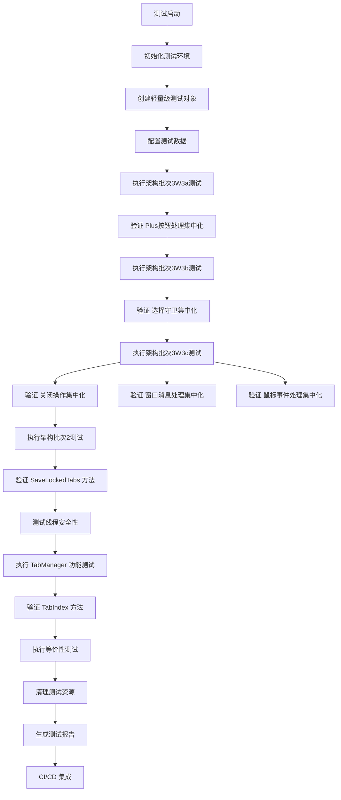

**图表来源**
- [ArchitectureBatch3W3aTests.cs:10-29](file://Tests\QTTtabBarTests\ArchitectureBatch3W3aTests.cs#L10-L29)
- [ArchitectureBatch3W3bTests.cs:11-26](file://Tests\QTTtabBarTests\ArchitectureBatch3W3bTests.cs#L11-L26)
- [ArchitectureBatch3W3cTests.cs:11-29](file://Tests\QTTtabBarTests\ArchitectureBatch3W3cTests.cs#L11-L29)
- [ArchitectureBatch2Tests.cs:14-36](file://Tests\QTTtabBarTests\ArchitectureBatch2Tests.cs#L14-L36)
- [TabManagerTests.cs:429-440](file://Tests\QTTtabBarTests\TabManagerTests.cs#L429-L440)
- [TabManagerTests.cs:442-464](file://Tests\QTTtabBarTests\TabManagerTests.cs#L442-L464)
- [TabManagerTests.cs:476-534](file://Tests\QTTtabBarTests\TabManagerTests.cs#L476-L534)
- [FacadeEquivalenceTests.cs:23-34](file://Tests\QTTtabBarTests\FacadeEquivalenceTests.cs#L23-34)

**章节来源**
- [ArchitectureBatch3W3aTests.cs:10-29](file://Tests\QTTtabBarTests\ArchitectureBatch3W3aTests.cs#L10-L29)
- [ArchitectureBatch3W3bTests.cs:11-26](file://Tests\QTTtabBarTests\ArchitectureBatch3W3bTests.cs#L11-L26)
- [ArchitectureBatch3W3cTests.cs:11-29](file://Tests\QTTtabBarTests\ArchitectureBatch3W3cTests.cs#L11-L29)
- [ArchitectureBatch2Tests.cs:14-36](file://Tests\QTTtabBarTests\ArchitectureBatch2Tests.cs#L14-L36)
- [TabManagerTests.cs:25-26](file://Tests\QTTtabBarTests\TabManagerTests.cs#L25-L26)
- [TabManagerTests.cs:411-536](file://Tests\QTTtabBarTests\TabManagerTests.cs#L411-L536)
- [TabManagerTests.cs:538-560](file://Tests\QTTtabBarTests\TabManagerTests.cs#L538-L560)
- [FacadeEquivalenceTests.cs:20-21](file://Tests\QTTtabBarTests\FacadeEquivalenceTests.cs#L20-L21)
- [FacadeEquivalenceTests.cs:41-90](file://Tests\QTTtabBarTests\FacadeEquivalenceTests.cs#L41-L90)
- [FacadeEquivalenceTests.cs:146-164](file://Tests\QTTtabBarTests\FacadeEquivalenceTests.cs#L146-L164)

## 故障排查指南
**重大架构升级**：新增 TabBarBase 增强架构相关的故障排查指导，**特别增加了部分类架构和继承关系相关的故障排查内容**。

- **TabBarBase 相关问题**
  - **新增**：派生类无法访问共享字段：检查继承关系是否正确建立
  - **新增**：部分类方法调用失败：确认基类初始化顺序和字段可用性
  - **新增**：DPI 计算异常：检查 GetBandDpiScale 方法的返回值和处理逻辑
  - **新增**：导航状态同步问题：验证 SyncTravelState 方法的调用时机
  - **新增**：部分类合并问题：确认编译器正确处理部分类合并

- **TabBarBase.TabOperations 相关问题**
  - **新增**：标签插入位置不正确：检查 Config.Tabs.NewTabPosition 配置值和 CurrentTab 状态
  - **新增**：重复标签检测失效：验证 NeverOpenSame 配置和路径比较逻辑
  - **新增**：特殊文件夹处理异常：检查 SHBindToParent 调用和 IDL 组合逻辑
  - **新增**：按钮栏刷新失败：确认 TryCallButtonBar 方法的调用和异常处理
  - **新增**：标签关闭逻辑异常：检查 CloseTab 方法的锁定保护和历史记录保存

- **TabBarBase.PlusButton 相关问题**
  - **新增**：Plus按钮点击无响应：检查事件订阅是否正确绑定
  - **新增**：剪贴板路径处理异常：验证剪贴板访问权限和路径格式
  - **新增**：文件/目录识别错误：检查文件系统访问权限和路径有效性
  - **新增**：默认位置打开失败：验证 Config.Window.DefaultLocation 配置和Shell浏览器状态
  - **新增**：错误日志缺失：检查 QTUtility2.MakeErrorLog 调用和日志配置

- **TabBarBase.Selection 相关问题**
  - **新增**：选中项状态保存失败：检查 ShellBrowser.TryGetSelection 调用和参数传递
  - **新增**：标签切换被阻止：验证 NowTabsAddingRemoving 标志的设置和清除
  - **新增**：选择守卫逻辑异常：检查 SaveSelectedItems 方法的地址匹配逻辑

- **TabBarBase.Close 相关问题**
  - **新增**：关闭操作异常：检查 HandleCLOSE 方法的组合键处理和条件判断
  - **新增**：批量关闭失败：验证 CloseAllTabsExcept 方法的标签过滤逻辑
  - **新增**：关闭历史保存失败：检查 QTUtility.SaveClosing 调用和参数传递

- **TabBarBase.ExplorerAttach 相关问题**
  - **新增**：Explorer附加生命周期异常：检查 FinishExplorerAttached 方法的调用时机
  - **新增**：附加激活钩子未触发：验证 OnExplorerAttachActivate 虚方法的实现

- **TabBarBase.WindowMessages 相关问题**
  - **新增**：主题变化无响应：检查 HandleSysColorChangeHookMessage 方法的调用和 ThemeRefreshService 状态
  - **新增**：关闭消息处理异常：验证 TryHandleHookCloseMessage 方法的参数传递和返回值
  - **新增**：命令消息处理失败：检查 TryHandleHookCommandMessage 的命令识别逻辑
  - **新增**：跨平台兼容性问题：验证 OSDetector.IsXP 的检测逻辑
  - **新增**：异常处理缺失：检查异常捕获和日志记录

- **TabBarBase.MouseHandlers 相关问题**
  - **新增**：鼠标事件无响应：检查事件订阅是否正确绑定
  - **新增**：拖拽操作异常：验证 NowTabDragging 状态管理和 DraggingTab 对象
  - **新增**：光标显示异常：检查 GetTabDragCursor 方法的光标创建逻辑
  - **新增**：双击动作执行失败：验证 MakeMouseChord 和 PerformBindAction 调用
  - **新增**：克隆操作异常：检查 Ctrl键检测和 CloneTabButtonForMouse 调用

- **TabManager 相关问题**
  - 标签操作无响应：检查 _owner 引用是否正确初始化
  - 事件处理失效：确认事件订阅是否在 Initialize 中正确绑定
  - 内存泄漏：确保 TabManager 不会持有不必要的强引用
  - **新增**：TabIndex() 方法返回错误：检查 Config.Tabs.NewTabPosition 配置值和 QTabControl 的 TabPages/SelectedIndex 状态

- **集中化持久化相关问题**
  - **新增**：锁定标签未保存：检查 QTUtility.SaveLockedTabs() 调用是否正确
  - **新增**：数据不一致：验证 StaticReg.LockedTabsToRestoreList 和注册表数据同步
  - **新增**：持久化性能问题：检查 SaveLockedTabs 调用频率，避免过于频繁的保存操作
  - **新增**：注册表写入失败：确认注册表权限和磁盘空间充足

- **线程安全性相关问题**
  - **新增**：数据竞争：检查 RegBackedList.Assign 方法的 _assignLock 锁机制
  - **新增**：死锁问题：确认没有嵌套锁调用导致死锁
  - **新增**：并发访问异常：验证多线程环境下 RegBackedList 的使用模式
  - **新增**：原子操作失败：检查 Assign 方法的清空-写入序列是否完整

- **常见问题**
  - 标签无法关闭：检查 TabLocked 是否为真；确认 CloseButtonClicked 事件未 Cancel。
  - 关闭按钮不显示：确认 EnableCloseButton 与配置项（ShowCloseButtons/CloseBtnsWithAlt/CloseBtnsOnHover）。
  - 多行布局错乱：检查 iMultipleType 与 RefreshOptions 中的 FixedWidthTabs/TabMaxWidth/TabMinWidth/TabHeight。
  - 文本溢出或重叠：确认 OncePainted 后的自适应宽度逻辑与 TabBounds 更新。
  - 图标点击无响应：验证 fShowSubDirTip 与 TabIconMouseDown 事件订阅。
  - **新增**：新标签插入位置不正确：检查 TabIndex() 方法的配置逻辑和 QTabControl 状态
  - **新增**：继承类行为不一致：确认派生类正确继承了 TabBarBase 的所有必要方法
  - **新增**：Plus按钮功能异常：检查 TabBarBase.PlusButton 方法的继承和事件绑定
  - **新增**：部分类方法不可用：确认编译器正确合并部分类文件
  - **新增**：虚方法重写冲突：检查派生类中虚方法的重写实现
  - **新增**：窗口消息处理异常：检查消息拦截器的正确安装和卸载
  - **新增**：鼠标事件处理异常：验证事件订阅和状态管理的正确性

- **测试相关问题**
  - **新增**：架构批次3W3a测试失败：确认 TabBarBase 包含 Plus按钮处理方法
  - **新增**：架构批次3W3b测试失败：确认 TabBarBase 包含选择守卫处理方法
  - **新增**：架构批次3W3c测试失败：确认 TabBarBase 包含关闭操作处理方法
  - **新增**：架构批次2测试失败：确认 SaveLockedTabs 方法存在且正常工作
  - **新增**：线程安全测试失败：检查 RegBackedList 的 _assignLock 实现
  - **新增**：测试运行失败：确认测试环境正确初始化，ConfigManager.LoadedConfig 不为 null
  - **新增**：COM 对象相关错误：使用轻量级测试对象替代真实 COM 对象
  - **新增**：测试间相互影响：确保 TearDown 方法正确恢复配置状态
  - **新增**：窗口消息测试失败：验证消息处理方法的正确实现
  - **新增**：鼠标事件测试失败：检查事件处理器的正确绑定

- **调试建议**
  - 使用 WndProc 断点观察 SETCURSOR/MOUSEACTIVATE/CONTEXTMENU 消息流。
  - 在 ChangeSelection 与 OnPaint 处添加日志，跟踪选择与绘制路径。
  - 检查 Dispose 是否正确释放所有 GDI 资源，避免句柄泄漏。
  - **新增**：在 TabBarBase 方法中添加日志，跟踪共享方法调用链
  - **新增**：在部分类方法中添加日志，监控各功能域的调用情况
  - **新增**：在派生类中验证继承关系和方法重写
  - **新增**：在 TabManager 方法中添加日志，跟踪标签操作流程
  - **新增**：在 SaveLockedTabs 方法中添加持久化日志，监控数据同步
  - **新增**：在 RegBackedList.Assign 方法中添加线程安全日志，监控锁竞争
  - **新增**：在窗口消息处理方法中添加日志，跟踪消息处理流程
  - **新增**：在鼠标事件处理方法中添加日志，跟踪交互处理流程
  - **新增**：使用单元测试快速验证修复效果，避免回归问题
  - **新增**：检查部分类文件的命名空间和类名一致性
  - **新增**：验证消息拦截器的安装和卸载时机
  - **新增**：检查鼠标事件的状态管理和资源释放

**章节来源**
- [TabBarBase.cs:20-401](file://QTTabBar/TabBarBase.cs#L20-L401)
- [TabBarBase.TabOperations.cs:11-143](file://QTTabBar/TabBarBase.TabOperations.cs#L11-L143)
- [TabBarBase.PlusButton.cs:8-67](file://QTTabBar/TabBarBase.PlusButton.cs#L8-L67)
- [TabBarBase.Selection.cs:7-31](file://QTTabBar/TabBarBase.Selection.cs#L7-L31)
- [TabBarBase.Close.cs:8-74](file://QTTabBar/TabBarBase.Close.cs#L8-L74)
- [TabBarBase.ExplorerAttach.cs:5-12](file://QTTabBar/TabBarBase.ExplorerAttach.cs#L5-L12)
- [TabBarBase.WindowMessages.cs:10-61](file://QTTabBar/TabBarBase.WindowMessages.cs#L10-L61)
- [TabBarBase.MouseHandlers.cs:11-267](file://QTTabBar/TabBarBase.MouseHandlers.cs#L11-L267)
- [QTTabBarClass.TabManager.cs:58-63](file://QTTabBar/QTTabBarClass.TabManager.cs#L58-L63)
- [QTTabBarClass.TabManager.cs:1484-1505](file://QTTabBar/QTTabBarClass.TabManager.cs#L1484-L1505)
- [QTTabBarClass.cs:4045](file://QTTabBar/QTTabBarClass.cs#L4045)
- [QTabControl.cs:112-123](file://QTTabBar/QTabControl.cs#L112-L123)
- [QTabControl.cs:1420-1445](file://QTTabBar/QTabControl.cs#L1420-L1445)
- [QTabControl.cs:1638-1722](file://QTTabBar/QTabControl.cs#L1638-L1722)
- [QTabControl.cs:1931-2005](file://QTTabBar/QTabControl.cs#L1931-L2005)
- [QTabControl.cs:506-571](file://QTTabBar/QTabControl.cs#L506-L571)
- [QTUtility.cs:491-498](file://QTTabBar\QTUtility.cs#L491-L498)
- [StaticReg.cs:143-167](file://QTTabBar\StaticReg.cs#L143-L167)
- [ArchitectureBatch3W3aTests.cs:10-29](file://Tests\QTTtabBarTests\ArchitectureBatch3W3aTests.cs#L10-L29)
- [ArchitectureBatch3W3bTests.cs:11-26](file://Tests\QTTtabBarTests\ArchitectureBatch3W3bTests.cs#L11-L26)
- [ArchitectureBatch3W3cTests.cs:11-29](file://Tests\QTTtabBarTests\ArchitectureBatch3W3cTests.cs#L11-L29)
- [ArchitectureBatch2Tests.cs:14-36](file://Tests\QTTtabBarTests\ArchitectureBatch2Tests.cs#L14-L36)
- [TabManagerTests.cs:429-440](file://Tests\QTTtabBarTests\TabManagerTests.cs#L429-L440)

## 结论
**重大架构升级**：TabManager 的重构显著提升了系统的可维护性和模块化程度，**新增的全面测试框架确保了重构后的行为一致性和系统稳定性**。**最新的 TabBarBase 增强架构通过部分类设计实现了精细化的代码复用，彻底消除了重复代码，提升了系统的可维护性和扩展性**。

QTabControl 与 QTabItem 共同构成了 QTTabBar-Next 的标签页核心：前者负责布局、绘制与交互，后者承载数据与状态。**重大架构升级的 TabBarBase 抽象基类通过部分类设计，将复杂的标签业务逻辑从具体实现类中解耦出来，形成了清晰的分层架构**。**新增的 TabManager 作为中间管理层，通过委托调用基类的共享方法，实现了更好的代码组织和职责分离**。**新增的集中化锁定标签持久化机制通过 QTUtility.SaveLockedTabs() 方法统一管理数据保存，而增强的 RegBackedList<T> 则提供了线程安全的集合操作**。通过完善的布局算法、事件系统与资源管理，系统在易用性与性能之间取得良好平衡。配合 GroupsManager 的分组能力和 TabBarBase 的代码复用设计，可进一步提升工作效率和代码质量。

**最新架构演进**：通过新增的 TabBarBase.WindowMessages 和 TabBarBase.MouseHandlers 部分类，系统实现了窗口消息处理和鼠标事件的完全集中化管理，进一步提升了代码的可维护性和扩展性。**新增的全面测试框架**为系统提供了强大的质量保证机制，覆盖了 TabIndex() 方法的所有配置场景、边缘情况和 facade-extraction 等价性验证，**同时验证了 SaveLockedTabs 方法和线程安全性改进，以及Plus按钮处理逻辑、选择守卫逻辑、关闭操作逻辑的集中化重构，还包括窗口消息处理和鼠标事件处理的正确性**。这些测试不仅确保了重构的正确性，还为未来的功能扩展和维护提供了可靠的保障。遵循本文的最佳实践与排障建议，可有效提升稳定性与用户体验。

## 附录
- 常用 API 参考（路径引用）
  - **TabBarBase 核心方法**
    - [TabBarBase.cs:20-401](file://QTTabBar/TabBarBase.cs#L20-L401)
    - [TabBarBase.TabOperations.cs:11-143](file://QTTabBar/TabBarBase.TabOperations.cs#L11-L143)
    - **新增**：[TabBarBase.PlusButton.cs:8-67](file://QTTabBar/TabBarBase.PlusButton.cs#L8-L67)
    - **新增**：[TabBarBase.Selection.cs:7-31](file://QTTabBar/TabBarBase.Selection.cs#L7-L31)
    - **新增**：[TabBarBase.Close.cs:8-74](file://QTTabBar/TabBarBase.Close.cs#L8-L74)
    - **新增**：[TabBarBase.ExplorerAttach.cs:5-12](file://QTTabBar/TabBarBase.ExplorerAttach.cs#L5-L12)
    - **新增**：[TabBarBase.WindowMessages.cs:10-61](file://QTTabBar/TabBarBase.WindowMessages.cs#L10-L61)
    - **新增**：[TabBarBase.MouseHandlers.cs:11-267](file://QTTabBar/TabBarBase.MouseHandlers.cs#L11-L267)
  - **TabManager 核心方法**
    - [QTTabBarClass.TabManager.cs:67-90](file://QTTabBar/QTTabBarClass.TabManager.cs#L67-L90)
    - [QTTabBarClass.TabManager.cs:142-149](file://QTTabBar/QTTabBarClass.TabManager.cs#L142-L149)
    - [QTTabBarClass.TabManager.cs:486-532](file://QTTabBar/QTTabBarClass.TabManager.cs#L486-L532)
    - [QTTabBarClass.TabManager.cs:556-634](file://QTTabBar/QTTabBarClass.TabManager.cs#L556-L634)
    - **新增**：[QTTabBarClass.TabManager.cs:1484-1505](file://QTTabBar/QTTabBarClass.TabManager.cs#L1484-L1505)
  - **集中化持久化方法**
    - **新增**：[QTUtility.cs:491-498](file://QTTabBar\QTUtility.cs#L491-L498)
  - **线程安全集合操作**
    - **新增**：[StaticReg.cs:143-167](file://QTTabBar\StaticReg.cs#L143-L167)
    - **新增**：[StaticReg.cs:60-67](file://QTTabBar\StaticReg.cs#L60-L67)
  - 创建与添加标签页
    - [QTabControl.cs:2088-2150](file://QTTabBar/QTabControl.cs#L2088-L2150)
  - 选择与切换
    - [QTabControl.cs:1732-1751](file://QTTabBar/QTabControl.cs#L1732-L1751)
    - [QTabControl.cs:469-504](file://QTTabBar/QTabControl.cs#L469-504)
  - 关闭按钮与图标点击
    - [QTabControl.cs:1420-1445](file://QTTabBar/QTabControl.cs#L1420-L1445)
    - [QTabControl.cs:1328-1359](file://QTTabBar/QTabControl.cs#L1328-L1359)
  - 多行布局与滚动
    - [QTabControl.cs:332-464](file://QTTabBar/QTabControl.cs#L332-L464)
    - [QTabControl.cs:1905-1920](file://QTTabBar/QTabControl.cs#L1905-L1920)
  - 文本度量与自适应
    - [QTabItem.cs:400-432](file://QTTabBar/QTabItem.cs#L400-L432)
  - 历史与导航
    - [QTabItem.cs:351-390](file://QTTabBar/QTabItem.cs#L351-L390)
  - 克隆与锁定
    - [QTabItem.cs:277-293](file://QTTabBar/QTabItem.cs#L277-L293)
    - [QTabItem.cs:104-115](file://QTTabBar/QTabItem.cs#L104-L115)
  - 分组管理
    - [GroupsManager.cs:40-112](file://QTTabBar/GroupsManager.cs#L40-L112)
  - **新增**：配置与测试
    - [Config.cs:65-72](file://QTTabBar\Config.cs#L65-L72)
    - [ArchitectureBatch3W3aTests.cs:10-29](file://Tests\QTTtabBarTests\ArchitectureBatch3W3aTests.cs#L10-L29)
    - [ArchitectureBatch3W3bTests.cs:11-26](file://Tests\QTTtabBarTests\ArchitectureBatch3W3bTests.cs#L11-L26)
    - [ArchitectureBatch3W3cTests.cs:11-29](file://Tests\QTTtabBarTests\ArchitectureBatch3W3cTests.cs#L11-L29)
    - [ArchitectureBatch2Tests.cs:14-36](file://Tests\QTTtabBarTests\ArchitectureBatch2Tests.cs#L14-L36)
    - [TabManagerTests.cs:476-534](file://Tests\QTTtabBarTests\TabManagerTests.cs#L476-L534)
    - [FacadeEquivalenceTests.cs:41-90](file://Tests\QTTtabBarTests\FacadeEquivalenceTests.cs#L41-L90)