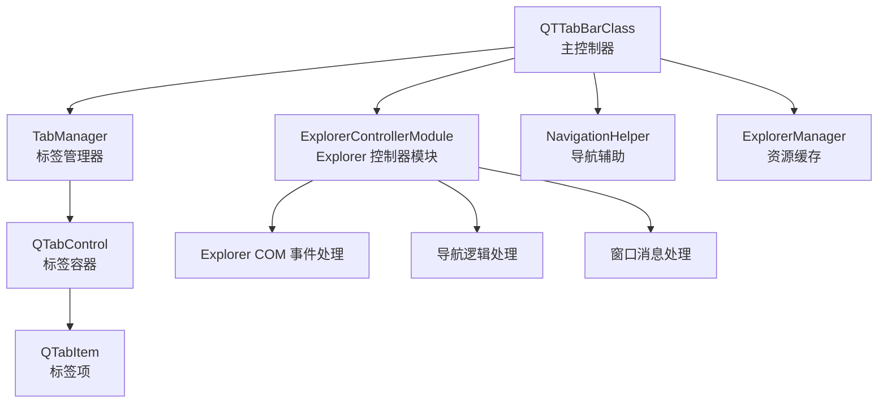
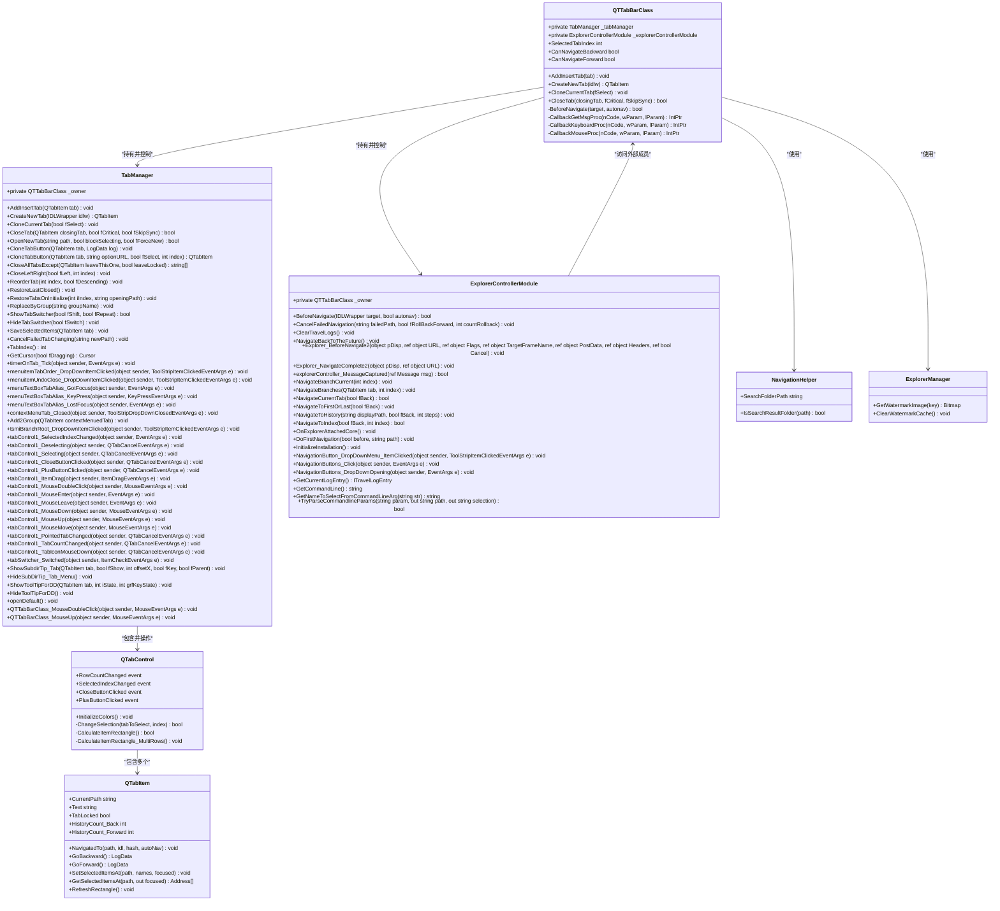
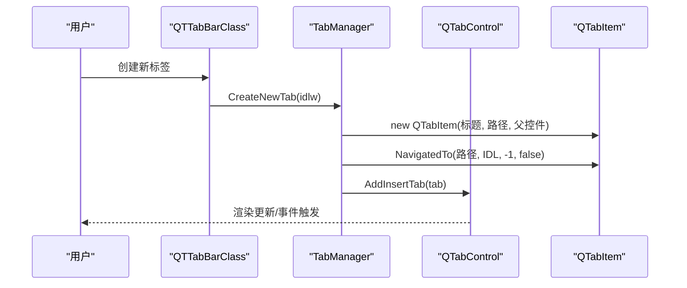
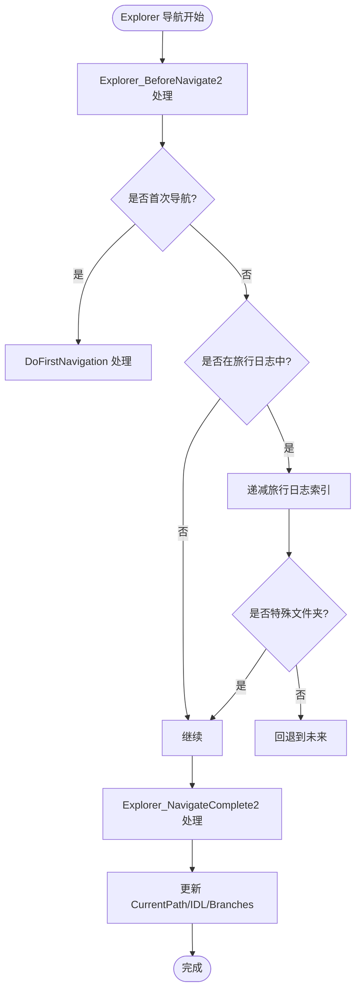
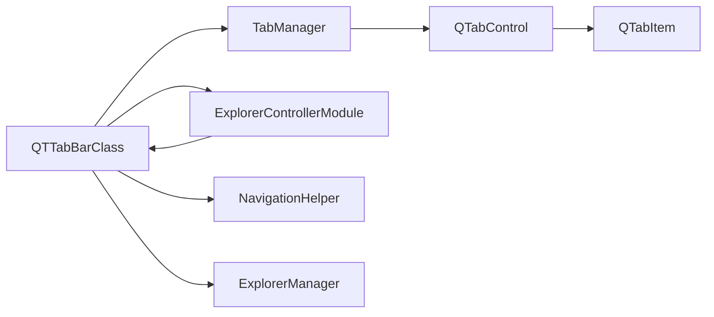

# 核心功能

<cite>
**本文引用的文件**   
- [QTabControl.cs](file://QTTabBar/QTabControl.cs)
- [QTabItem.cs](file://QTTabBar/QTabItem.cs)
- [QTTabBarClass.cs](file://QTTabBar/QTTabBarClass.cs)
- [QTTabBarClass.TabManager.cs](file://QTTabBar/QTTabBarClass.TabManager.cs)
- [QTTabBarClass.ExplorerController.cs](file://QTTabBar/QTTabBarClass.ExplorerController.cs)
- [NavigationHelper.cs](file://QTTabBar/NavigationHelper.cs)
- [ExplorerManager.cs](file://QTTabBar/ExplorerManager.cs)
</cite>

## 更新摘要
**变更内容**   
- 移除了 QTTabBarClass 中已废弃的 Explorer_NavigateComplete2 门面方法，该方法仅委托调用 _explorerControllerModule.Explorer_NavigateComplete2，在运行时不再使用
- 事件订阅现在直接调用 ExplorerControllerModule 中的方法，消除了中间层调用的开销
- 添加了注释说明该方法现在完全位于 ExplorerControllerModule 中
- 保持了对外 API 和行为完全不变，确保向后兼容性

## 目录
1. [简介](#简介)
2. [项目结构](#项目结构)
3. [核心组件](#核心组件)
4. [架构总览](#架构总览)
5. [详细组件分析](#详细组件分析)
6. [依赖关系分析](#依赖关系分析)
7. [性能考虑](#性能考虑)
8. [故障排查指南](#故障排查指南)
9. [结论](#结论)
10. [附录](#附录)

## 简介
本文件聚焦 QTTabBar-Next 的核心功能，围绕以下能力进行深入说明：
- 标签页管理系统：生命周期、状态管理、拖拽操作与键盘快捷键支持（已重构）
- **导航系统**：前进后退、路径导航与历史记录（已重构，新增 ExplorerControllerModule）
- 预览系统：文件夹预览缩略图生成与缓存策略（概念性说明）
- 搜索与过滤：实时搜索与高级过滤条件（概念性说明）
- 文件操作引擎：批量处理、进度跟踪与错误恢复（概念性说明）
- 与其他组件的集成关系、常见问题与性能优化建议

为便于理解，文档在涉及具体实现时提供"章节来源"和"图示来源"，并在需要处给出代码片段路径。

## 项目结构
本项目采用分层与模块化组织方式，核心 UI 与业务逻辑集中在 QTTabBar 工程内：
- QTabControl/QTabItem：标签控件与标签项，负责渲染、布局、选择、历史等
- QTTabBarClass：Shell 扩展主类，承载窗口消息钩子、鼠标/键盘事件、标签创建与导航协调
- **TabManager（新增）**：内部标签管理器类，封装所有标签相关操作和UI事件处理
- **ExplorerControllerModule（新增）**：内部 Explorer 控制器模块，封装 Explorer COM 事件处理、导航逻辑和窗口消息处理
- NavigationHelper：导航相关纯逻辑辅助方法
- ExplorerManager：资源缓存（如水印图像）管理

**图示来源** 
- [QTTabBarClass.cs:67-68](file://QTTabBar/QTTabBarClass.cs#L67-L68)
- [QTTabBarClass.TabManager.cs:58-63](file://QTTabBar/QTTabBarClass.TabManager.cs#L58-L63)
- [QTTabBarClass.ExplorerController.cs:57-63](file://QTTabBar/QTTabBarClass.ExplorerController.cs#L57-L63)
- [QTabControl.cs:1-120](file://QTTabBar/QTabControl.cs#L1-L120)
- [QTabItem.cs:1-120](file://QTTabBar/QTabItem.cs#L1-L120)
- [NavigationHelper.cs:1-29](file://QTTabBar/NavigationHelper.cs#L1-L29)
- [ExplorerManager.cs:1-21](file://QTTabBar/ExplorerManager.cs#L1-L21)

**章节来源**
- [QTTabBarClass.cs:67-68](file://QTTabBar/QTTabBarClass.cs#L67-L68)
- [QTTabBarClass.TabManager.cs:58-63](file://QTTabBar/QTTabBarClass.TabManager.cs#L58-L63)
- [QTTabBarClass.ExplorerController.cs:57-63](file://QTTabBar/QTTabBarClass.ExplorerController.cs#L57-L63)
- [QTabControl.cs:1-120](file://QTTabBar/QTabControl.cs#L1-L120)
- [QTabItem.cs:1-120](file://QTTabBar/QTabItem.cs#L1-L120)
- [NavigationHelper.cs:1-29](file://QTTabBar/NavigationHelper.cs#L1-L29)
- [ExplorerManager.cs:1-21](file://QTTabBar/ExplorerManager.cs#L1-L21)

## 核心组件
- **ExplorerControllerModule（新增）**：内部 Explorer 控制器模块，持有对 QTTabBarClass 的引用，封装所有 Explorer 交互和导航相关操作，包括 Explorer_BeforeNavigate2、Explorer_NavigateComplete2、explorerController_MessageCaptured 等核心方法，以及完整的导航逻辑处理
- **TabManager（新增）**：内部标签管理器类，持有对 QTTabBarClass 的引用，封装所有标签相关操作，包括 AddInsertTab、CreateNewTab、CloneCurrentTab、CloseTab 等方法，以及完整的 UI 事件处理机制
- 标签控件 QTabControl：负责多行/单行布局、选中切换、滚动、关闭按钮、图标绘制、颜色主题、事件分发（选择变更、行数变化、关闭点击等）
- 标签项 QTabItem：维护当前路径、标题、副标题、锁定状态、历史栈（前进/后退）、分支列表、选中项与焦点项快照、Shell 提示文本、尺寸计算等
- 主控制器 QTTabBarClass：注册全局消息钩子、处理鼠标/键盘事件、创建/插入/删除标签、保存/恢复会话、与 Shell 交互、驱动导航流程
- 导航辅助 NavigationHelper：判断是否为搜索结果文件夹、获取搜索文件夹路径
- 资源缓存 ExplorerManager：对水印位图等资源进行缓存与清理

**章节来源**
- [QTTabBarClass.ExplorerController.cs:57-63](file://QTTabBar/QTTabBarClass.ExplorerController.cs#L57-L63)
- [QTTabBarClass.TabManager.cs:58-63](file://QTTabBar/QTTabBarClass.TabManager.cs#L58-L63)
- [QTabControl.cs:120-225](file://QTTabBar/QTabControl.cs#L120-L225)
- [QTabItem.cs:195-224](file://QTTabBar/QTabItem.cs#L195-L224)
- [QTTabBarClass.cs:253-336](file://QTTabBar/QTTabBarClass.cs#L253-L336)
- [NavigationHelper.cs:9-27](file://QTTabBar/NavigationHelper.cs#L9-L27)
- [ExplorerManager.cs:8-20](file://QTTabBar/ExplorerManager.cs#L8-L20)

## 架构总览
整体架构以 QTTabBarClass 为中心，通过新增的 TabManager 内部类协调 QTabControl/QTabItem 完成标签管理与用户交互；通过新增的 ExplorerControllerModule 内部类处理 Explorer COM 事件和导航逻辑；通过 NavigationHelper 识别特殊路径类型；借助 ExplorerManager 管理共享资源缓存。

**图示来源**
- [QTTabBarClass.cs:67-68](file://QTTabBar/QTTabBarClass.cs#L67-L68)
- [QTTabBarClass.TabManager.cs:58-63](file://QTTabBar/QTTabBarClass.TabManager.cs#L58-L63)
- [QTTabBarClass.ExplorerController.cs:57-63](file://QTTabBar/QTTabBarClass.ExplorerController.cs#L57-L63)
- [QTabControl.cs:469-504](file://QTTabBar/QTabControl.cs#L469-L504)
- [QTabItem.cs:351-390](file://QTTabBar/QTabItem.cs#L351-390)
- [NavigationHelper.cs:15-26](file://QTTabBar/NavigationHelper.cs#L15-L26)
- [ExplorerManager.cs:12-18](file://QTTabBar/ExplorerManager.cs#L12-L18)

## 详细组件分析

### 标签页管理系统（已重构）
**更新** 标签管理系统已重构为内部 TabManager 类，但对外 API 和行为保持不变

- **架构重构**
  - 新增 `internal class TabManager` 作为嵌套内部类，持有对 QTTabBarClass 的 `_owner` 引用
  - 通过 `_tabManager` 字段在 QTTabBarClass 中实例化和管理 TabManager 实例
  - 所有标签相关方法从 QTTabBarClass 迁移到 TabManager，保持相同的方法签名和行为

- **生命周期管理**
  - 创建：TabManager.CreateNewTab 构造 QTabItem 并调用 NavigatedTo 记录初始导航日志
  - 插入：根据配置决定插入位置（最左/右侧/紧邻当前）
  - 销毁：Dispose 中遍历所有标签项执行 OnClose，释放资源

- **状态管理**
  - 选中切换：QTabControl.ChangeSelection 触发 Deselecting/Selecting/SelectedIndexChanged 事件，必要时调整滚动偏移
  - 锁定状态：QTabItem.TabLocked 影响绘制与交互
  - 文本与尺寸：QTabItem.RefreshRectangle 基于字体与副标题计算宽度，QTabControl 支持固定/自适应/限制最大最小宽度模式

- **拖拽操作**
  - 标签拖拽由 TabManager 中的鼠标事件处理器与内部字段（DraggingTab、NowTabDragging 等）协同完成，结合 QTabControl 的事件（ItemDrag）与重绘

- **键盘快捷键**
  - 全局键盘钩子 CallbackKeyboardProc 捕获按键组合，处理 Shift、Ctrl+Tab 切换器、Alt 显示关闭按钮等行为
  - 鼠标钩子 CallbackMouseProc 处理滚轮与侧键绑定动作

**图示来源**
- [QTTabBarClass.cs:340-345](file://QTTabBar/QTTabBarClass.cs#L340-L345)
- [QTTabBarClass.TabManager.cs:142-149](file://QTTabBar/QTTabBarClass.TabManager.cs#L142-L149)
- [QTabItem.cs:371-390](file://QTTabBar/QTabItem.cs#L371-L390)
- [QTabControl.cs:338-361](file://QTTabBar/QTabControl.cs#L338-L361)

**章节来源**
- [QTTabBarClass.TabManager.cs:58-63](file://QTTabBar/QTTabBarClass.TabManager.cs#L58-L63)
- [QTTabBarClass.cs:67](file://QTTabBar/QTTabBarClass.cs#L67)
- [QTTabBarClass.TabManager.cs:67-90](file://QTTabBar/QTTabBarClass.TabManager.cs#L67-L90)
- [QTTabBarClass.TabManager.cs:142-149](file://QTTabBar/QTTabBarClass.TabManager.cs#L142-L149)
- [QTTabBarClass.TabManager.cs:486-532](file://QTTabBar/QTTabBarClass.TabManager.cs#L486-L532)
- [QTTabBarClass.TabManager.cs:556-634](file://QTTabBar/QTTabBarClass.TabManager.cs#L556-L634)
- [QTabControl.cs:469-504](file://QTTabBar/QTabControl.cs#L469-L504)
- [QTabItem.cs:351-390](file://QTTabBar/QTabItem.cs#L351-L390)
- [QTabItem.cs:400-432](file://QTTabBar/QTabItem.cs#L400-L432)
- [QTTabBarClass.cs:690-746](file://QTTabBar/QTTabBarClass.cs#L690-L746)
- [QTTabBarClass.cs:748-793](file://QTTabBar/QTTabBarClass.cs#L748-L793)

### 导航系统与历史记录（已重构）
**更新** 导航系统已重构为 ExplorerControllerModule 模块，增强了 Explorer 集成能力，并移除了冗余的门面方法

- **ExplorerControllerModule 架构**
  - 新增 `internal class ExplorerControllerModule` 作为嵌套内部类，持有对 QTTabBarClass 的 `_owner` 引用
  - 通过 `_explorerControllerModule` 字段在 QTTabBarClass 中实例化和管理 ExplorerControllerModule 实例
  - 封装所有 Explorer COM 事件处理和导航逻辑，包括 BeforeNavigate、NavigateComplete2、消息处理等

- **COM 事件处理优化**
  - **Explorer_BeforeNavigate2**：处理 Explorer 导航前事件，支持首次导航和窗口捕获逻辑
  - **Explorer_NavigateComplete2**：处理导航完成事件，更新标签状态、历史记录、特殊文件夹处理
  - **explorerController_MessageCaptured**：处理窗口消息，包括浏览对象、前进后退、系统命令等
  - **事件订阅优化**：现在直接订阅到 ExplorerControllerModule 中的方法，消除了中间层调用的开销

- **导航逻辑增强**
  - **BeforeNavigate**：统一的导航前处理，保存选中项、处理旅行日志索引、标记自动导航标志
  - **NavigateCurrentTab**：增强的前进后退逻辑，支持锁定标签克隆、特殊文件夹处理
  - **NavigateBranches**：分支导航支持，支持 Ctrl/Shift 修饰键的不同行为
  - **NavigateToHistory**：历史记录导航，支持边界检查和错误恢复

- **门面方法清理**
  - 移除了 QTTabBarClass 中已废弃的 Explorer_NavigateComplete2 门面方法
  - 该门面方法仅委托调用 _explorerControllerModule.Explorer_NavigateComplete2，在运行时不再使用
  - 添加了注释说明该方法现在完全位于 ExplorerControllerModule 中

- **历史记录模型**
  - QTabItem 维护两个栈：stckHistoryBackward（后退）与 stckHistoryForward（前进），以及 Branches（分支）用于记录分叉路径
  - 特殊路径识别：NavigationHelper.IsSearchResultFolder 与 SearchFolderPath 用于识别 Windows 搜索结果文件夹

**图示来源**
- [QTTabBarClass.ExplorerController.cs:188-206](file://QTTabBar/QTTabBarClass.ExplorerController.cs#L188-L206)
- [QTTabBarClass.ExplorerController.cs:208-401](file://QTTabBar/QTTabBarClass.ExplorerController.cs#L208-L401)
- [QTTabBarClass.ExplorerController.cs:70-91](file://QTTabBar/QTTabBarClass.ExplorerController.cs#L70-L91)
- [QTabItem.cs:371-390](file://QTTabBar/QTabItem.cs#L371-L390)
- [QTabItem.cs:351-369](file://QTTabBar/QTabItem.cs#L351-L369)
- [NavigationHelper.cs:15-26](file://QTTabBar/NavigationHelper.cs#L15-L26)

**章节来源**
- [QTTabBarClass.ExplorerController.cs:57-63](file://QTTabBar/QTTabBarClass.ExplorerController.cs#L57-L63)
- [QTTabBarClass.ExplorerController.cs:188-206](file://QTTabBar/QTTabBarClass.ExplorerController.cs#L188-L206)
- [QTTabBarClass.ExplorerController.cs:208-401](file://QTTabBar/QTTabBarClass.ExplorerController.cs#L208-L401)
- [QTTabBarClass.ExplorerController.cs:70-91](file://QTTabBar/QTTabBarClass.ExplorerController.cs#L70-L91)
- [QTTabBarClass.ExplorerController.cs:700-739](file://QTTabBar/QTTabBarClass.ExplorerController.cs#L700-L739)
- [QTTabBarClass.ExplorerController.cs:662-698](file://QTTabBar/QTTabBarClass.ExplorerController.cs#L662-L698)
- [QTTabBarClass.ExplorerController.cs:754-803](file://QTTabBar/QTTabBarClass.ExplorerController.cs#L754-L803)
- [QTTabBarClass.cs:2111-2112](file://QTTabBar/QTTabBarClass.cs#L2111-L2112)
- [QTabItem.cs:371-390](file://QTTabBar/QTabItem.cs#L371-L390)
- [QTabItem.cs:351-369](file://QTTabBar/QTabItem.cs#L351-L369)
- [NavigationHelper.cs:15-26](file://QTTabBar/NavigationHelper.cs#L15-L26)
- [QTTabBarClass.cs:3845-3868](file://QTTabBar/QTTabBarClass.cs#L3845-L3868)

### 预览系统（概念性说明）
- 目标：在标签或工具提示中展示文件夹/文件的缩略图或水印信息，提升浏览效率
- 关键策略：
  - 按需生成：仅在可见区域或悬停时触发
  - 缓存复用：使用资源缓存（如 ExplorerManager 的水印位图缓存）避免重复生成
  - 异步加载：后台线程生成大图，UI 线程仅负责呈现
- 与现有组件的关系：
  - 可结合 QTabItem.ShellToolTip 与 QTabControl 的绘制流程，在合适时机请求缩略图
  - 利用 ExplorerManager 的缓存接口减少 I/O 与解码开销

[本节为概念性说明，不直接分析具体文件]

### 搜索与过滤（概念性说明）
- 实时搜索：监听输入框变化，按文件名/属性进行增量匹配，优先命中当前视图
- 高级过滤：支持大小、类型、修改时间、自定义表达式等条件
- 与 Shell 集成：可结合搜索结果文件夹路径（NavigationHelper.SearchFolderPath）构建查询范围
- 性能要点：防抖、分页结果、延迟加载详情

[本节为概念性说明，不直接分析具体文件]

### 文件操作引擎（概念性说明）
- 批量处理：队列化任务，支持复制/移动/删除/重命名等
- 进度跟踪：统一进度回调，支持暂停/取消/重试
- 错误恢复：失败重试、断点续传、事务式提交（可选）
- 与 Shell 协作：通过 Shell 接口执行操作，确保元数据一致性

[本节为概念性说明，不直接分析具体文件]

## 依赖关系分析
- QTTabBarClass 通过 `_tabManager` 字段依赖 TabManager 完成标签 UI 与状态管理
- QTTabBarClass 通过 `_explorerControllerModule` 字段依赖 ExplorerControllerModule 完成 Explorer 交互和导航
- TabManager 持有对 QTTabBarClass 的 `_owner` 引用，访问外部成员
- ExplorerControllerModule 持有对 QTTabBarClass 的 `_owner` 引用，访问外部成员
- TabManager 依赖 QTabControl/QTabItem 完成标签操作
- NavigationHelper 被用于识别特殊路径类型
- ExplorerManager 提供资源缓存能力，降低重复成本

**图示来源**
- [QTTabBarClass.cs:67-68](file://QTTabBar/QTTabBarClass.cs#L67-L68)
- [QTTabBarClass.TabManager.cs:58-63](file://QTTabBar/QTTabBarClass.TabManager.cs#L58-L63)
- [QTTabBarClass.ExplorerController.cs:57-63](file://QTTabBar/QTTabBarClass.ExplorerController.cs#L57-L63)
- [QTabControl.cs:469-504](file://QTTabBar/QTabControl.cs#L469-L504)
- [QTabItem.cs:351-390](file://QTTabBar/QTabItem.cs#L351-L390)
- [NavigationHelper.cs:15-26](file://QTTabBar/NavigationHelper.cs#L15-L26)
- [ExplorerManager.cs:12-18](file://QTTabBar/ExplorerManager.cs#L12-L18)

**章节来源**
- [QTTabBarClass.cs:67-68](file://QTTabBar/QTTabBarClass.cs#L67-L68)
- [QTTabBarClass.TabManager.cs:58-63](file://QTTabBar/QTTabBarClass.TabManager.cs#L58-L63)
- [QTTabBarClass.ExplorerController.cs:57-63](file://QTTabBar/QTTabBarClass.ExplorerController.cs#L57-L63)
- [QTabControl.cs:469-504](file://QTTabBar/QTabControl.cs#L469-L504)
- [QTabItem.cs:351-390](file://QTTabBar/QTabItem.cs#L351-L390)
- [NavigationHelper.cs:15-26](file://QTTabBar/NavigationHelper.cs#L15-L26)
- [ExplorerManager.cs:12-18](file://QTTabBar/ExplorerManager.cs#L12-L18)

## 性能考虑
- 双缓冲与绘制优化：QTabControl 启用 OptimizedDoubleBuffer 与 AllPaintingInWmPaint，减少闪烁
- 夜间模式与主题切换：QTTabBarClass 响应 SYSCOLORCHANGE，动态刷新颜色与重绘
- 历史栈与分支管理：NavigatedTo 维护 Branches 与前后栈，避免不必要的重建
- 资源缓存：ExplorerManager 对位图等资源进行缓存，减少重复生成与 I/O
- **重构优化**：TabManager 的内部化减少了方法调用开销，提高了代码局部性
- **Explorer 集成优化**：ExplorerControllerModule 集中处理 COM 事件，减少跨层调用开销
- **消息处理优化**：explorerController_MessageCaptured 统一处理窗口消息，提高响应速度
- **门面方法移除优化**：移除了冗余的 Explorer_NavigateComplete2 门面方法，消除了不必要的委托调用开销

**章节来源**
- [QTabControl.cs:141-147](file://QTTabBar/QTabControl.cs#L141-L147)
- [QTTabBarClass.cs:613-621](file://QTTabBar/QTTabBarClass.cs#L613-L621)
- [QTabItem.cs:371-390](file://QTTabBar/QTabItem.cs#L371-L390)
- [ExplorerManager.cs:8-20](file://QTTabBar/ExplorerManager.cs#L8-L20)
- [QTTabBarClass.ExplorerController.cs:407-652](file://QTTabBar/QTTabBarClass.ExplorerController.cs#L407-L652)
- [QTTabBarClass.cs:2111-2112](file://QTTabBar/QTTabBarClass.cs#L2111-L2112)

## 故障排查指南
- 标签无法关闭或异常退出
  - 检查 TabManager.CloseTab 处理逻辑与标签锁定状态
  - 参考 TabManager 的消息钩子中对 CLOSE 的处理
- 主题切换后界面未刷新
  - 确认 SYSCOLORCHANGE 消息是否被捕获，并触发 InitializeColors 与重绘
- 历史记录不一致
  - 检查 NavigatedTo 的 AutoNav 分支逻辑与 Branches 维护
- 拖拽行为异常
  - 查看 NowTabDragging 与 DraggingTab 的状态流转，确认鼠标钩子与事件订阅
- **重构相关问题**
  - 检查 `_tabManager` 字段是否正确初始化
  - 验证 TabManager 构造函数是否正确接收 owner 引用
  - 确认所有委托绑定是否正确指向 TabManager 方法
- **ExplorerControllerModule 相关问题**
  - 检查 `_explorerControllerModule` 字段是否正确初始化
  - 验证 ExplorerControllerModule 构造函数是否正确接收 owner 引用
  - 确认 COM 事件绑定是否正确：`_owner.Explorer.BeforeNavigate2 += Explorer_BeforeNavigate2`
  - 检查消息钩子绑定：`explorerController.MessageCaptured += _explorerControllerModule.explorerController_MessageCaptured`
  - 验证导航方法转发是否正确：`NavigateCurrentTab`、`NavigateBranches` 等门面方法
- **门面方法移除相关问题**
  - 确认 Explorer_NavigateComplete2 方法现在完全位于 ExplorerControllerModule 中
  - 检查事件订阅是否直接指向 ExplorerControllerModule 中的方法
  - 验证是否有其他代码仍在尝试调用已移除的门面方法

**章节来源**
- [QTTabBarClass.TabManager.cs:556-634](file://QTTabBar/QTTabBarClass.TabManager.cs#L556-L634)
- [QTTabBarClass.cs:613-621](file://QTTabBar/QTTabBarClass.cs#L613-L621)
- [QTabItem.cs:371-390](file://QTTabBar/QTabItem.cs#L371-L390)
- [QTTabBarClass.cs:748-793](file://QTTabBar/QTTabBarClass.cs#L748-L793)
- [QTTabBarClass.cs:4044-4045](file://QTTabBar/QTTabBarClass.cs#L4044-L4045)
- [QTTabBarClass.ExplorerController.cs:905-907](file://QTTabBar/QTTabBarClass.ExplorerController.cs#L905-L907)
- [QTTabBarClass.cs:3425-3426](file://QTTabBar/QTTabBarClass.cs#L3425-L3426)
- [QTTabBarClass.cs:3845-3868](file://QTTabBar/QTTabBarClass.cs#L3845-L3868)
- [QTTabBarClass.cs:2111-2112](file://QTTabBar/QTTabBarClass.cs#L2111-L2112)

## 结论
QTTabBar-Next 的核心围绕标签管理与导航展开，经过重构后的架构通过新增的 TabManager 内部类和 ExplorerControllerModule 内部类提供了更清晰的职责分离和更好的可维护性。TabManager 专门处理标签 UI 与用户交互，ExplorerControllerModule 专注于 Explorer COM 事件处理和导航逻辑，两者共同协调 QTabControl/QTabItem 完成完整的功能。配合 NavigationHelper 与 ExplorerManager，系统在特殊路径识别与资源缓存方面具备良好基础。最近的面板方法移除进一步优化了性能，消除了不必要的委托调用开销。对于预览、搜索与文件操作等高级能力，可在现有架构上以插件化或扩展模块的方式逐步完善。

## 附录
- API 使用模式示例（路径引用）
  - 创建标签：[QTTabBarClass.cs:340-345](file://QTTabBar/QTTabBarClass.cs#L340-L345)
  - 标签管理器初始化：[QTTabBarClass.cs:4044-4045](file://QTTabBar/QTTabBarClass.cs#L4044-L4045)
  - Explorer 控制器初始化：[QTTabBarClass.cs:3064-3139](file://QTTabBar/QTTabBarClass.cs#L3064-L3139)
  - 导航记录：[QTabItem.cs:371-390](file://QTTabBar/QTabItem.cs#L371-L390)
  - 前进后退：[QTabItem.cs:351-369](file://QTTabBar/QTabItem.cs#L351-L369)
  - 特殊路径识别：[NavigationHelper.cs:15-26](file://QTTabBar/NavigationHelper.cs#L15-L26)
  - 资源缓存访问：[ExplorerManager.cs:12-18](file://QTTabBar/ExplorerManager.cs#L12-L18)
  - 标签管理器核心方法：[QTTabBarClass.TabManager.cs:67-90](file://QTTabBar/QTTabBarClass.TabManager.cs#L67-L90)
  - Explorer 控制器核心方法：[QTTabBarClass.ExplorerController.cs:70-91](file://QTTabBar/QTTabBarClass.ExplorerController.cs#L70-L91)
  - COM 事件处理：[QTTabBarClass.ExplorerController.cs:188-206](file://QTTabBar/QTTabBarClass.ExplorerController.cs#L188-L206)
  - 消息处理：[QTTabBarClass.ExplorerController.cs:407-652](file://QTTabBar/QTTabBarClass.ExplorerController.cs#L407-L652)
  - 门面方法移除注释：[QTTabBarClass.cs:2111-2112](file://QTTabBar/QTTabBarClass.cs#L2111-L2112)