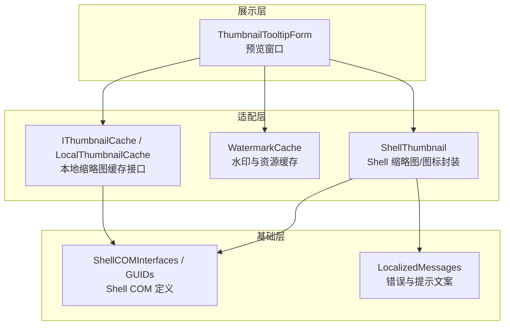
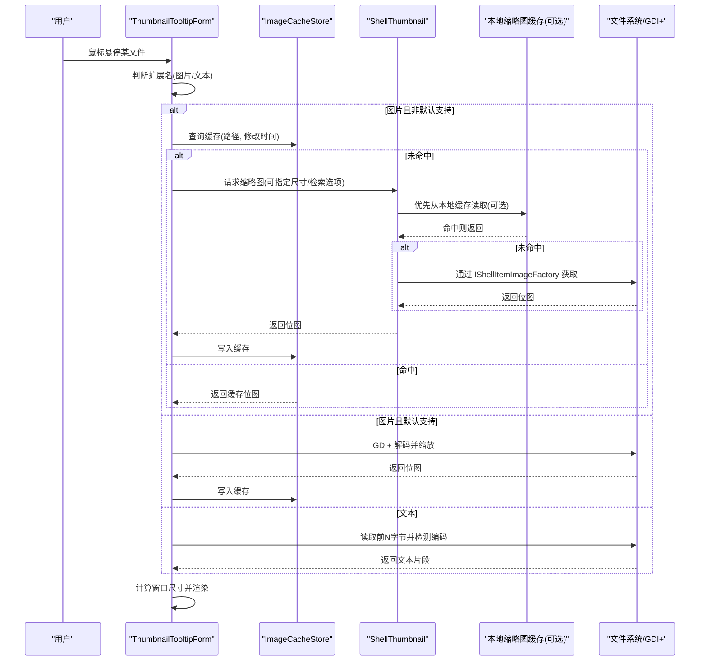
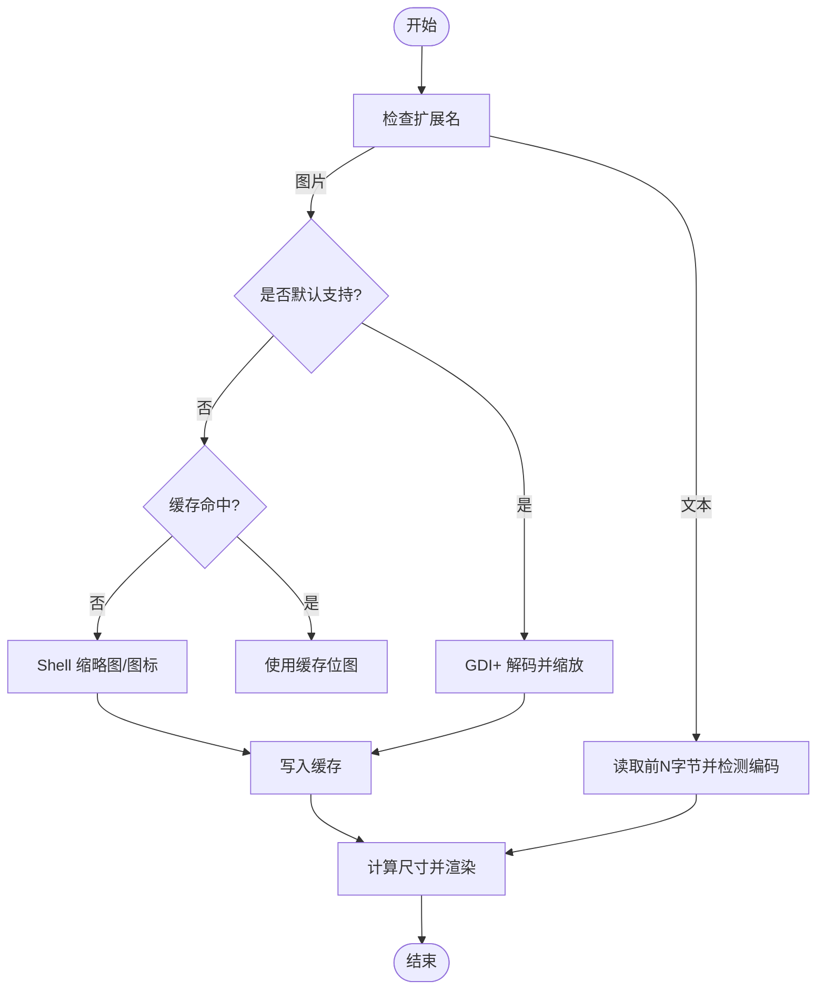
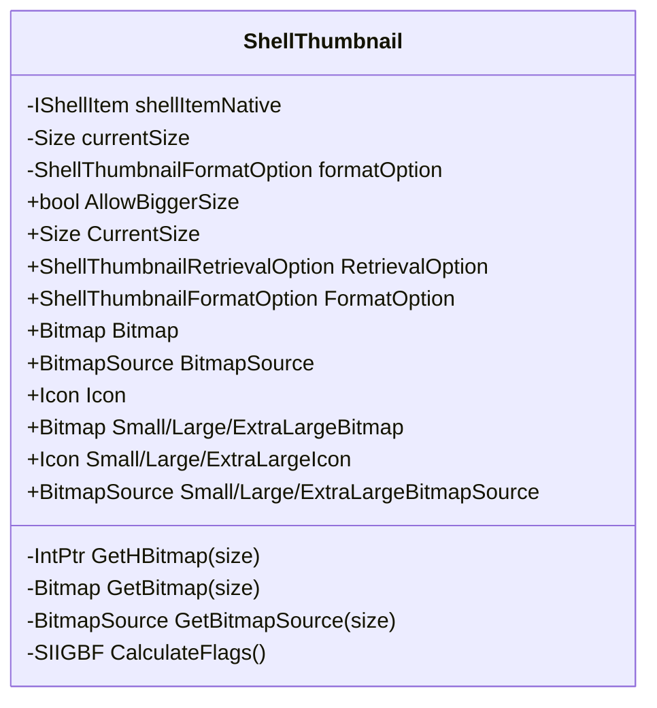
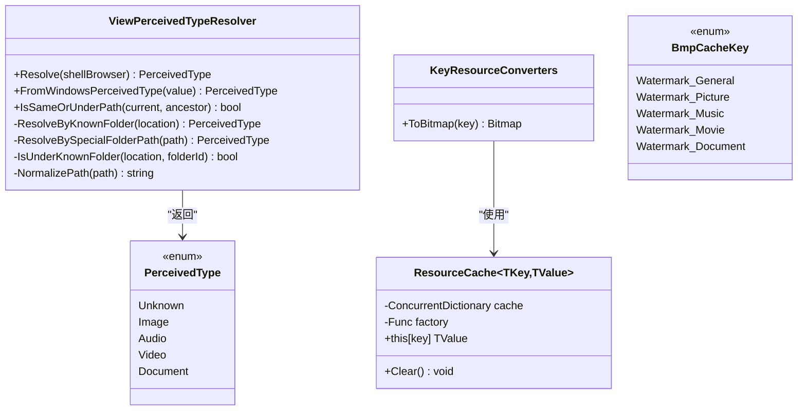
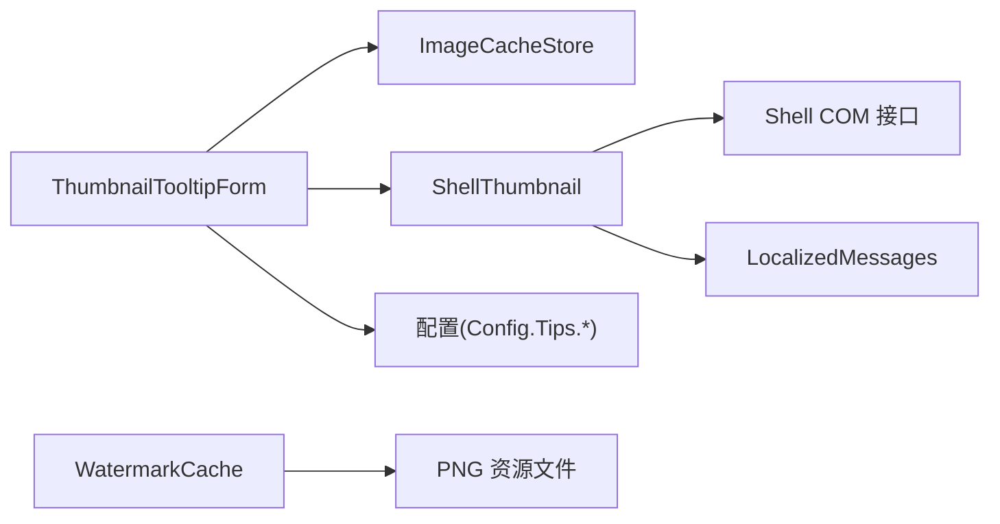

# 预览系统

<cite>
**本文引用的文件**   
- [ThumbnailTooltipForm.cs](file://QTTabBar/ThumbnailTooltipForm.cs)
- [ShellThumbnail.cs](file://QTTabBar/Common/ShellThumbnail.cs)
- [WatermarkCache.cs](file://QTTabBar/WatermarkCache.cs)
- [IThumbnailCache.cs](file://QTTabBar/Interop/IThumbnailCache.cs)
- [LocalThumbnailCache.cs](file://QTTabBar/Interop/LocalThumbnailCache.cs)
- [ShellCOMInterfaces.cs](file://QTTabBar/Common/ShellCOMInterfaces.cs)
- [ShellCOMGuids.cs](file://QTTabBar/Common/ShellCOMGuids.cs)
- [LocalizedMessages.Designer.cs](file://QTTabBar/Common/LocalizedMessages.Designer.cs)
</cite>

## 目录
1. [简介](#简介)
2. [项目结构](#项目结构)
3. [核心组件](#核心组件)
4. [架构总览](#架构总览)
5. [详细组件分析](#详细组件分析)
6. [依赖关系分析](#依赖关系分析)
7. [性能考量](#性能考量)
8. [故障排查指南](#故障排查指南)
9. [结论](#结论)
10. [附录](#附录)

## 简介
本文件面向 QTTabBar-Next 的“预览系统”，聚焦以下目标：
- 文件夹预览缩略图的生成机制，包括图像缓存策略、异步加载与内存管理
- 水印缓存系统的工作原理（缓存键、过期与清理）
- 缩略图处理的优化技术（缩放、格式转换、质量控制）
- 预览窗口的渲染引擎与动画效果实现
- 不同文件类型的预览适配器与扩展机制
- 新增文件类型预览支持的实践路径
- 与 Windows Shell 缩略图服务的集成方式与性能优化
- 预览系统的配置项与自定义指南

## 项目结构
预览系统涉及三层：
- 展示层：预览窗口（Tooltip 形式），负责 UI 渲染、布局与交互
- 适配层：缩略图/图标获取与文本预览逻辑，封装对 Shell 和 GDI+ 的调用
- 基础层：Windows Shell 接口封装、本地缓存与资源缓存

图表来源
- [ThumbnailTooltipForm.cs:103-115](file://QTTabBar/ThumbnailTooltipForm.cs#L103-L115)
- [ShellThumbnail.cs:25-33](file://QTTabBar/Common/ShellThumbnail.cs#L25-L33)
- [WatermarkCache.cs:354-418](file://QTTabBar/WatermarkCache.cs#L354-L418)
- [IThumbnailCache.cs](file://QTTabBar/Interop/IThumbnailCache.cs)
- [LocalThumbnailCache.cs](file://QTTabBar/Interop/LocalThumbnailCache.cs)
- [ShellCOMInterfaces.cs:821-823](file://QTTabBar/Common/ShellCOMInterfaces.cs#L821-L823)
- [ShellCOMGuids.cs:74](file://QTTabBar/Common/ShellCOMGuids.cs#L74)
- [LocalizedMessages.Designer.cs:1920-1957](file://QTTabBar/Common/LocalizedMessages.Designer.cs#L1920-L1957)

章节来源
- [ThumbnailTooltipForm.cs:103-115](file://QTTabBar/ThumbnailTooltipForm.cs#L103-L115)
- [ShellThumbnail.cs:25-33](file://QTTabBar/Common/ShellThumbnail.cs#L25-L33)
- [WatermarkCache.cs:354-418](file://QTTabBar/WatermarkCache.cs#L354-L418)
- [ShellCOMInterfaces.cs:821-823](file://QTTabBar/Common/ShellCOMInterfaces.cs#L821-L823)
- [ShellCOMGuids.cs:74](file://QTTabBar/Common/ShellCOMGuids.cs#L74)
- [LocalizedMessages.Designer.cs:1920-1957](file://QTTabBar/Common/LocalizedMessages.Designer.cs#L1920-L1957)

## 核心组件
- 预览窗口 ThumbnailTooltipForm
  - 负责根据文件扩展名选择处理分支（图片/文本等）
  - 维护 ImageCacheStore 进行缩略图缓存，控制最大尺寸与失败重试列表
  - 计算并设置窗口大小、信息标签、图片显示模式
- ShellThumbnail
  - 封装 IShellItemImageFactory，统一获取缩略图或图标
  - 支持多种返回格式（Bitmap/Icon/BitmapSource）、多种尺寸、检索选项（缓存/内存/仅缓存）
  - 通过 CalculateFlags 组合 SIIGBF 标志位，控制行为
- WatermarkCache
  - 提供基于 ConcurrentDictionary 的资源缓存通用容器 ResourceCache<TKey,TValue>
  - 按感知类型（图片/音乐/视频/文档）解析当前浏览上下文，用于选择对应的水印资源
  - KeyResourceConverters 从公共数据目录加载 PNG 资源为 Bitmap
- Shell 缩略图缓存接口
  - IThumbnailCache 与 LocalThumbnailCache 提供本地缩略图缓存访问能力
  - ShellThumbnail 可通过 RetrievalOption 控制是否优先使用缓存

章节来源
- [ThumbnailTooltipForm.cs:103-115](file://QTTabBar/ThumbnailTooltipForm.cs#L103-L115)
- [ThumbnailTooltipForm.cs:113-310](file://QTTabBar/ThumbnailTooltipForm.cs#L113-L310)
- [ShellThumbnail.cs:252-348](file://QTTabBar/Common/ShellThumbnail.cs#L252-L348)
- [WatermarkCache.cs:49-298](file://QTTabBar/WatermarkCache.cs#L49-L298)
- [WatermarkCache.cs:302-350](file://QTTabBar/WatermarkCache.cs#L302-L350)
- [WatermarkCache.cs:354-418](file://QTTabBar/WatermarkCache.cs#L354-L418)
- [IThumbnailCache.cs](file://QTTabBar/Interop/IThumbnailCache.cs)
- [LocalThumbnailCache.cs](file://QTTabBar/Interop/LocalThumbnailCache.cs)
- [ShellCOMInterfaces.cs:821-823](file://QTTabBar/Common/ShellCOMInterfaces.cs#L821-L823)
- [ShellCOMGuids.cs:74](file://QTTabBar/Common/ShellCOMGuids.cs#L74)

## 架构总览
预览系统的关键流程如下：
- 用户悬停触发预览窗口创建/更新
- 根据扩展名判断是否为图片/文本等类型
- 图片类型：
  - 若为默认支持图像，直接由 GDI+ 解码并缩放
  - 否则尝试通过 Shell 缩略图服务获取（LoadThumbnail/LoadThumbnail2），必要时回退到 LoadImageFile
- 文本类型：
  - 读取前若干字节，检测编码后解码显示
- 所有生成的缩略图进入 ImageCacheStore，按路径与修改时间命中
- 窗口根据实际尺寸与信息标签自动调整布局

图表来源
- [ThumbnailTooltipForm.cs:113-310](file://QTTabBar/ThumbnailTooltipForm.cs#L113-L310)
- [ShellThumbnail.cs:282-348](file://QTTabBar/Common/ShellThumbnail.cs#L282-L348)
- [IThumbnailCache.cs](file://QTTabBar/Interop/IThumbnailCache.cs)
- [LocalThumbnailCache.cs](file://QTTabBar/Interop/LocalThumbnailCache.cs)

## 详细组件分析

### 缩略图生成与缓存（ThumbnailTooltipForm）
- 缓存策略
  - 使用 ImageCacheStore 保存 ImageData，键为路径，校验 LastWriteTime 保证一致性
  - 当最大宽高配置变化时清空缓存与失败列表，避免不一致
  - 记录失败路径集合，防止重复尝试导致抖动
- 异步与并发
  - 文本读取采用异步 FileStream 参数，减少阻塞
  - 缩略图获取本身是同步 IO，但可在上层调度线程池以避免 UI 卡顿（建议）
- 内存管理
  - 成功加载后将位图存入缓存；窗口隐藏/销毁时释放缓存
  - 对于 GIF 等可动画图像，先拷贝到 MemoryStream 再构造新 Bitmap，避免原流占用
- 质量控制与缩放
  - 超过最大宽高时按比例缩放，保持纵横比
  - 若原始尺寸小于等于最大尺寸，则不缩放，避免劣化

图表来源
- [ThumbnailTooltipForm.cs:113-310](file://QTTabBar/ThumbnailTooltipForm.cs#L113-L310)
- [ThumbnailTooltipForm.cs:417-457](file://QTTabBar/ThumbnailTooltipForm.cs#L417-L457)

章节来源
- [ThumbnailTooltipForm.cs:103-115](file://QTTabBar/ThumbnailTooltipForm.cs#L103-L115)
- [ThumbnailTooltipForm.cs:113-310](file://QTTabBar/ThumbnailTooltipForm.cs#L113-L310)
- [ThumbnailTooltipForm.cs:417-457](file://QTTabBar/ThumbnailTooltipForm.cs#L417-L457)

### Shell 缩略图封装（ShellThumbnail）
- 功能要点
  - 通过 IShellItemImageFactory.GetImage 获取位图句柄，再转换为 Bitmap/Icon/BitmapSource
  - 支持 AllowBiggerSize、RetrievalOption、FormatOption 等选项控制行为
  - 严格校验 CurrentSize 范围，避免超出 Shell 限制
- 错误处理
  - 针对无缩略图、无处理器、非法尺寸等场景抛出明确异常，并使用本地化消息
- 性能优化
  - 使用 RetrievalOption=CacheOnly/MemoryOnly 减少磁盘 IO
  - 按需选择 IconOnly/ThumbnailOnly，避免不必要的解码

图表来源
- [ShellThumbnail.cs:25-33](file://QTTabBar/Common/ShellThumbnail.cs#L25-L33)
- [ShellThumbnail.cs:252-348](file://QTTabBar/Common/ShellThumbnail.cs#L252-L348)

章节来源
- [ShellThumbnail.cs:25-33](file://QTTabBar/Common/ShellThumbnail.cs#L25-L33)
- [ShellThumbnail.cs:252-348](file://QTTabBar/Common/ShellThumbnail.cs#L252-L348)
- [LocalizedMessages.Designer.cs:1920-1957](file://QTTabBar/Common/LocalizedMessages.Designer.cs#L1920-L1957)

### 水印缓存系统（WatermarkCache）
- 感知类型解析
  - ViewPerceivedTypeResolver 根据当前浏览位置（已知库/特殊文件夹）推断感知类型（图片/音频/视频/文档）
  - 支持从 Windows PerceivedType 映射
- 资源缓存
  - ResourceCache<TKey,TValue> 基于 ConcurrentDictionary 提供线程安全的懒加载与清理
  - KeyResourceConverters.ToBitmap 将 PNG 资源文件转为 Bitmap 并加入缓存
- 缓存键与过期
  - 键类型为 BmpCacheKey（如 Watermark_Picture 等）
  - 当前实现未内置过期策略，需外部调用 Clear 或重建工厂以刷新

图表来源
- [WatermarkCache.cs:49-298](file://QTTabBar/WatermarkCache.cs#L49-L298)
- [WatermarkCache.cs:302-350](file://QTTabBar/WatermarkCache.cs#L302-L350)
- [WatermarkCache.cs:354-418](file://QTTabBar/WatermarkCache.cs#L354-L418)

章节来源
- [WatermarkCache.cs:49-298](file://QTTabBar/WatermarkCache.cs#L49-L298)
- [WatermarkCache.cs:302-350](file://QTTabBar/WatermarkCache.cs#L302-L350)
- [WatermarkCache.cs:354-418](file://QTTabBar/WatermarkCache.cs#L354-L418)

### 与 Windows Shell 缩略图服务的集成
- 接口与 GUID
  - IThumbnailCache 与 LocalThumbnailCache 提供本地缩略图缓存访问
  - ShellThumbnail 通过 IShellItemImageFactory 获取缩略图/图标
- 检索选项
  - RetrievalOption 支持 InCacheOnly/MemoryOnly，结合 AllowBiggerSize 与 FormatOption 控制行为
- 错误与提示
  - 无缩略图/无处理器/尺寸越界等错误通过本地化消息反馈

章节来源
- [IThumbnailCache.cs](file://QTTabBar/Interop/IThumbnailCache.cs)
- [LocalThumbnailCache.cs](file://QTTabBar/Interop/LocalThumbnailCache.cs)
- [ShellThumbnail.cs:252-348](file://QTTabBar/Common/ShellThumbnail.cs#L252-L348)
- [ShellCOMInterfaces.cs:821-823](file://QTTabBar/Common/ShellCOMInterfaces.cs#L821-L823)
- [ShellCOMGuids.cs:74](file://QTTabBar/Common/ShellCOMGuids.cs#L74)
- [LocalizedMessages.Designer.cs:1920-1957](file://QTTabBar/Common/LocalizedMessages.Designer.cs#L1920-L1957)

### 预览窗口渲染与动画
- 渲染
  - PictureBox 居中或缩放显示，信息标签在底部显示元数据
  - 根据内容动态计算窗口尺寸，避免裁剪
- 动画
  - 对可动画图像（如 GIF）先复制到内存流再生成新 Bitmap，确保动画帧正常播放
- 交互
  - HideToolTip 隐藏窗口并触发可见性事件，便于父控件联动

章节来源
- [ThumbnailTooltipForm.cs:376-415](file://QTTabBar/ThumbnailTooltipForm.cs#L376-L415)
- [ThumbnailTooltipForm.cs:362-374](file://QTTabBar/ThumbnailTooltipForm.cs#L362-L374)
- [ThumbnailTooltipForm.cs:417-457](file://QTTabBar/ThumbnailTooltipForm.cs#L417-L457)

### 不同文件类型的预览适配器与扩展机制
- 图片类型
  - 默认支持：由 GDI+ 解码器决定，内部缓存已支持格式列表
  - 非默认支持：走 Shell 缩略图服务
- 文本类型
  - 读取前 N 字节，尝试多路编码检测（BOM、UTF-8 校验、MultiLanguage API）
- 扩展点
  - 扩展图片支持：向 Config.Tips.ImageExt 添加扩展名，或在默认支持列表中注册
  - 扩展文本支持：向 Config.Tips.TextExt 添加扩展名
  - 自定义缩略图：在 Shell 侧注册缩略图处理器，或通过 IExtractImage 兼容

章节来源
- [ThumbnailTooltipForm.cs:317-334](file://QTTabBar/ThumbnailTooltipForm.cs#L317-L334)
- [ThumbnailTooltipForm.cs:347-360](file://QTTabBar/ThumbnailTooltipForm.cs#L347-L360)
- [ThumbnailTooltipForm.cs:587-643](file://QTTabBar/ThumbnailTooltipForm.cs#L587-L643)
- [ThumbnailTooltipForm.cs:645-777](file://QTTabBar/ThumbnailTooltipForm.cs#L645-L777)

### 新增文件类型预览支持示例（步骤）
- 目标：为 .xyz 文件启用文本预览
  1. 在配置中将 .xyz 加入文本扩展列表（Config.Tips.TextExt）
  2. 验证文本读取与编码检测能正确解析 .xyz 的前 N 字节
  3. 如需缩略图，在 Shell 中为 .xyz 注册缩略图处理器，或在代码中将其加入图片扩展列表（Config.Tips.ImageExt）
- 目标：为 .abc 文件启用图片缩略图
  1. 将 .abc 加入图片扩展列表（Config.Tips.ImageExt）
  2. 若 GDI+ 不支持，确保 Shell 为该类型提供缩略图处理器
  3. 测试缓存命中与失败重试逻辑

章节来源
- [ThumbnailTooltipForm.cs:317-334](file://QTTabBar/ThumbnailTooltipForm.cs#L317-L334)
- [ThumbnailTooltipForm.cs:347-360](file://QTTabBar/ThumbnailTooltipForm.cs#L347-L360)

## 依赖关系分析
- 组件耦合
  - ThumbnailTooltipForm 依赖 ImageCacheStore、ShellThumbnail、配置项
  - ShellThumbnail 依赖 Shell COM 接口与本地化消息
  - WatermarkCache 提供通用缓存与感知类型解析，供其他模块复用
- 外部依赖
  - Windows Shell（IShellItemImageFactory、IThumbnailCache）
  - GDI+（ImageCodecInfo、Bitmap）
  - MultiLanguage（编码检测）

图表来源
- [ThumbnailTooltipForm.cs:103-115](file://QTTabBar/ThumbnailTooltipForm.cs#L103-L115)
- [ShellThumbnail.cs:252-348](file://QTTabBar/Common/ShellThumbnail.cs#L252-L348)
- [WatermarkCache.cs:302-350](file://QTTabBar/WatermarkCache.cs#L302-L350)

章节来源
- [ThumbnailTooltipForm.cs:103-115](file://QTTabBar/ThumbnailTooltipForm.cs#L103-L115)
- [ShellThumbnail.cs:252-348](file://QTTabBar/Common/ShellThumbnail.cs#L252-L348)
- [WatermarkCache.cs:302-350](file://QTTabBar/WatermarkCache.cs#L302-L350)

## 性能考量
- 缓存命中率
  - 合理设置最大宽高，避免过大位图占用内存
  - 利用 ImageCacheStore 的修改时间校验，减少重复解码
- Shell 缩略图优化
  - 使用 RetrievalOption=CacheOnly/MemoryOnly 降低 IO
  - 仅在需要时请求 ThumbnailOnly/IconOnly，避免多余解码
- 文本预览
  - 异步读取前 N 字节，限制最大长度，避免大文件阻塞
- 资源释放
  - 窗口隐藏/销毁时及时清空缓存，释放位图句柄与托管对象

[本节为通用指导，无需特定文件引用]

## 故障排查指南
- 常见错误
  - “当前 ShellObject 没有缩略图”：确认该类型是否注册了缩略图处理器，或改用图标模式
  - “无处理器”：检查 Shell 缩略图处理器是否正确注册
  - “尺寸不能为 0/超出范围”：调整 CurrentSize 至允许范围
- 定位方法
  - 查看错误日志输出（MakeErrorLog）
  - 检查失败路径列表，避免频繁重试
  - 确认配置项（最大宽高、扩展名列表）是否符合预期

章节来源
- [LocalizedMessages.Designer.cs:1920-1957](file://QTTabBar/Common/LocalizedMessages.Designer.cs#L1920-L1957)
- [ThumbnailTooltipForm.cs:173-184](file://QTTabBar/ThumbnailTooltipForm.cs#L173-L184)

## 结论
QTTabBar-Next 的预览系统通过分层设计实现了高效、可扩展的缩略图与文本预览能力。其关键优势在于：
- 清晰的职责划分（展示/适配/基础）
- 完善的缓存策略与资源管理
- 灵活的 Shell 集成与错误处理
- 易于扩展的文件类型适配机制

[本节为总结，无需特定文件引用]

## 附录
- 配置项参考（示例）
  - Tips.PreviewMaxWidth/Tips.PreviewMaxHeight：预览最大宽高
  - Tips.ImageExt：图片扩展名列表
  - Tips.TextExt：文本扩展名列表
  - Tips.ShowPreviewInfo：是否显示预览信息
  - Tips.PreviewFont：文本预览字体

章节来源
- [ThumbnailTooltipForm.cs:54-56](file://QTTabBar/ThumbnailTooltipForm.cs#L54-L56)
- [ThumbnailTooltipForm.cs:317-334](file://QTTabBar/ThumbnailTooltipForm.cs#L317-L334)
- [ThumbnailTooltipForm.cs:376-415](file://QTTabBar/ThumbnailTooltipForm.cs#L376-L415)