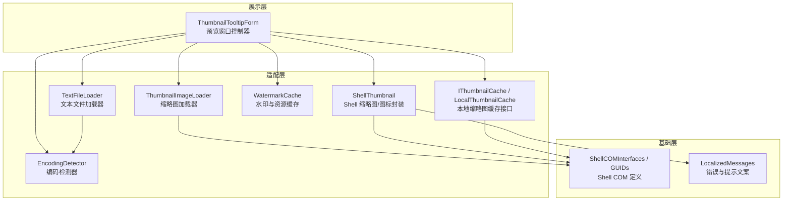
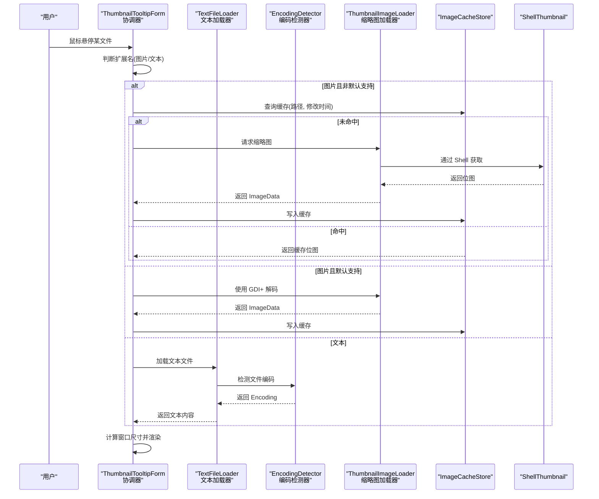
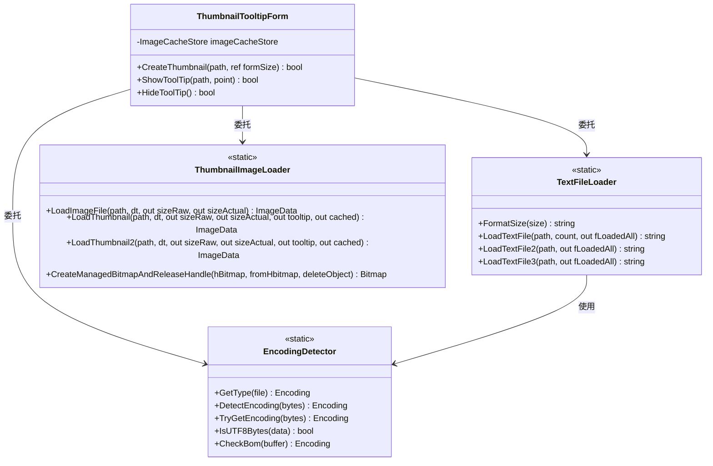
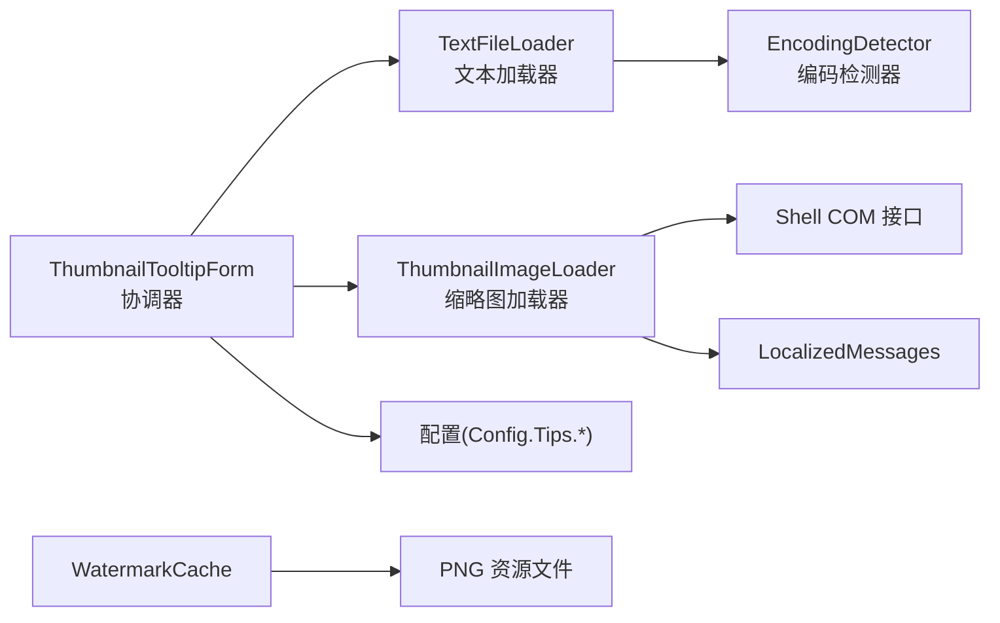

# 预览系统

<cite>
**本文引用的文件**   
- [ThumbnailTooltipForm.cs](file://QTTabBar/ThumbnailTooltipForm.cs)
- [ThumbnailTooltipForm.TextFileLoader.cs](file://QTTabBar/ThumbnailTooltipForm.TextFileLoader.cs)
- [ThumbnailTooltipForm.EncodingDetector.cs](file://QTTabBar/ThumbnailTooltipForm.EncodingDetector.cs)
- [ThumbnailTooltipForm.ThumbnailImageLoader.cs](file://QTTabBar/ThumbnailTooltipForm.ThumbnailImageLoader.cs)
- [ShellThumbnail.cs](file://QTTabBar/Common/ShellThumbnail.cs)
- [WatermarkCache.cs](file://QTTabBar/WatermarkCache.cs)
- [IThumbnailCache.cs](file://QTTabBar/Interop/IThumbnailCache.cs)
- [LocalThumbnailCache.cs](file://QTTabBar/Interop/LocalThumbnailCache.cs)
- [ShellCOMInterfaces.cs](file://QTTabBar/Common/ShellCOMInterfaces.cs)
- [ShellCOMGuids.cs](file://QTTabBar/Common/ShellCOMGuids.cs)
- [LocalizedMessages.Designer.cs](file://QTTabBar/Common/LocalizedMessages.Designer.cs)
</cite>

## 更新摘要
**所做更改**   
- 更新了架构总览和详细组件分析章节，反映 ThumbnailTooltipForm 的重大重构
- 新增了三个静态嵌套类的详细说明：TextFileLoader、EncodingDetector、ThumbnailImageLoader
- 更新了依赖关系分析和架构图表，展示新的分层结构
- 保持了向后兼容性的说明和现有功能的完整性

## 目录
1. [简介](#简介)
2. [项目结构](#项目结构)
3. [核心组件](#核心组件)
4. [架构总览](#架构总览)
5. [详细组件分析](#详细组件分析)
6. [依赖关系分析](#依赖关系分析)
7. [性能考量](#性能考量)
8. [故障排查指南](#故障排查指南)
9. [结论](#结论)
10. [附录](#附录)

## 简介
本文件面向 QTTabBar-Next 的"预览系统"，聚焦以下目标：
- 文件夹预览缩略图的生成机制，包括图像缓存策略、异步加载与内存管理
- 水印缓存系统的工作原理（缓存键、过期与清理）
- 缩略图处理的优化技术（缩放、格式转换、质量控制）
- 预览窗口的渲染引擎与动画效果实现
- 不同文件类型的预览适配器与扩展机制
- 新增文件类型预览支持的实践路径
- 与 Windows Shell 缩略图服务的集成方式与性能优化
- 预览系统的配置项与自定义指南

**最新更新**：预览系统经历了重大架构重构，从单一的巨型类分解为三个职责明确的静态嵌套类，提升了代码可维护性和模块化程度。

## 项目结构
预览系统经过重构后采用三层架构设计：
- **展示层**：预览窗口（ThumbnailTooltipForm），负责 UI 渲染、布局与交互控制
- **适配层**：三个独立的静态嵌套类，分别处理文本加载、编码检测和缩略图获取
- **基础层**：Windows Shell 接口封装、本地缓存与资源缓存

**图表来源**
- [ThumbnailTooltipForm.cs:39-584](file://QTTabBar/ThumbnailTooltipForm.cs#L39-L584)
- [ThumbnailTooltipForm.TextFileLoader.cs:27-173](file://QTTabBar/ThumbnailTooltipForm.TextFileLoader.cs#L27-L173)
- [ThumbnailTooltipForm.EncodingDetector.cs:40-851](file://QTTabBar/ThumbnailTooltipForm.EncodingDetector.cs#L40-L851)
- [ThumbnailTooltipForm.ThumbnailImageLoader.cs:31-213](file://QTTabBar/ThumbnailTooltipForm.ThumbnailImageLoader.cs#L31-L213)

**章节来源**
- [ThumbnailTooltipForm.cs:39-584](file://QTTabBar/ThumbnailTooltipForm.cs#L39-L584)
- [ThumbnailTooltipForm.TextFileLoader.cs:27-173](file://QTTabBar/ThumbnailTooltipForm.TextFileLoader.cs#L27-L173)
- [ThumbnailTooltipForm.EncodingDetector.cs:40-851](file://QTTabBar/ThumbnailTooltipForm.EncodingDetector.cs#L40-L851)
- [ThumbnailTooltipForm.ThumbnailImageLoader.cs:31-213](file://QTTabBar/ThumbnailTooltipForm.ThumbnailImageLoader.cs#L31-L213)

## 核心组件
- **预览窗口 ThumbnailTooltipForm**
  - 作为协调器，根据文件扩展名选择相应的处理分支（图片/文本等）
  - 维护 ImageCacheStore 进行缩略图缓存，控制最大尺寸与失败重试列表
  - 计算并设置窗口大小、信息标签、图片显示模式
  - 通过静态嵌套类委托具体功能实现，保持向后兼容

- **TextFileLoader（文本文件加载器）**
  - 专门处理文本文件的读取和格式化
  - 提供 FormatSize 方法用于文件大小格式化
  - 实现多种文本加载策略：LoadTextFile、LoadTextFile2、LoadTextFile3
  - 支持异步文件流操作，减少 UI 阻塞

- **EncodingDetector（编码检测器）**
  - 853行的大型编码检测工具类，纯静态实现
  - 支持多种编码格式检测：UTF-8、UTF-16、UTF-32、ASCII 等
  - 提供 BOM 检测、UTF-8 有效性验证、多语言 API 集成
  - 包含多种检测算法：TryGetEncoding、DetectInputCodepage、CheckUtf8 等

- **ThumbnailImageLoader（缩略图加载器）**
  - 专门处理图片和缩略图的加载与处理
  - 实现 LoadImageFile、LoadThumbnail、LoadThumbnail2 三种加载策略
  - 处理 GDI+ 位图创建和非托管资源释放
  - 支持动画图像处理和智能缩放

- **ShellThumbnail**
  - 封装 IShellItemImageFactory，统一获取缩略图或图标
  - 支持多种返回格式（Bitmap/Icon/BitmapSource）、多种尺寸、检索选项
  - 通过 CalculateFlags 组合 SIIGBF 标志位，控制行为

- **WatermarkCache**
  - 提供基于 ConcurrentDictionary 的资源缓存通用容器 ResourceCache<TKey,TValue>
  - 按感知类型（图片/音乐/视频/文档）解析当前浏览上下文
  - KeyResourceConverters 从公共数据目录加载 PNG 资源为 Bitmap

**章节来源**
- [ThumbnailTooltipForm.cs:39-584](file://QTTabBar/ThumbnailTooltipForm.cs#L39-L584)
- [ThumbnailTooltipForm.TextFileLoader.cs:27-173](file://QTTabBar/ThumbnailTooltipForm.TextFileLoader.cs#L27-L173)
- [ThumbnailTooltipForm.EncodingDetector.cs:40-851](file://QTTabBar/ThumbnailTooltipForm.EncodingDetector.cs#L40-L851)
- [ThumbnailTooltipForm.ThumbnailImageLoader.cs:31-213](file://QTTabBar/ThumbnailTooltipForm.ThumbnailImageLoader.cs#L31-L213)
- [ShellThumbnail.cs:252-348](file://QTTabBar/Common/ShellThumbnail.cs#L252-L348)
- [WatermarkCache.cs:49-298](file://QTTabBar/WatermarkCache.cs#L49-L298)

## 架构总览
重构后的预览系统采用清晰的职责分离架构：

**图表来源**
- [ThumbnailTooltipForm.cs:83-280](file://QTTabBar/ThumbnailTooltipForm.cs#L83-L280)
- [ThumbnailTooltipForm.TextFileLoader.cs:63-119](file://QTTabBar/ThumbnailTooltipForm.TextFileLoader.cs#L63-L119)
- [ThumbnailTooltipForm.EncodingDetector.cs:318-364](file://QTTabBar/ThumbnailTooltipForm.EncodingDetector.cs#L318-L364)
- [ThumbnailTooltipForm.ThumbnailImageLoader.cs:74-135](file://QTTabBar/ThumbnailTooltipForm.ThumbnailImageLoader.cs#L74-L135)

## 详细组件分析

### 重构后的架构设计（重要更新）

**ThumbnailTooltipForm 主类**
- 作为协调器和门面类，大幅简化了原有逻辑
- 通过静态嵌套类委托具体功能实现
- 保持向后兼容性，外部调用接口不变
- 维护 UI 状态和缓存管理

**TextFileLoader 静态嵌套类**
- 专注于文本文件加载逻辑，完全独立于表单实例状态
- 提供 FormatSize 方法进行文件大小格式化
- 实现三种文本加载策略：
  - `LoadTextFile`：标准 StreamReader 加载
  - `LoadTextFile2`：带插件编码检测的加载
  - `LoadTextFile3`：异步文件流加载，支持大文件
- 内部使用 EncodingDetector 进行编码检测

**EncodingDetector 静态嵌套类（853行）**
- 纯静态工具类，无任何表单实例依赖
- 支持多种编码格式检测算法：
  - BOM 检测：UTF-8、UTF-16、UTF-32
  - UTF-8 有效性验证：IsUTF8Bytes 方法
  - 多语言 API 集成：IMultiLanguage2 接口
  - 启发式检测：TryGetEncoding、DetectInputCodepage
- 包含详细的编码检测注释和错误处理

**ThumbnailImageLoader 静态嵌套类**
- 专注于图像和缩略图加载逻辑
- 实现三种加载策略：
  - `LoadImageFile`：GDI+ 直接解码
  - `LoadThumbnail`：Windows Shell 缩略图缓存
  - `LoadThumbnail2`：IExtractImage 接口兼容
- 处理非托管资源释放，防止 GDI 句柄泄漏
- 支持动画图像处理和智能缩放算法

**图表来源**
- [ThumbnailTooltipForm.cs:39-584](file://QTTabBar/ThumbnailTooltipForm.cs#L39-L584)
- [ThumbnailTooltipForm.TextFileLoader.cs:27-173](file://QTTabBar/ThumbnailTooltipForm.TextFileLoader.cs#L27-L173)
- [ThumbnailTooltipForm.EncodingDetector.cs:40-851](file://QTTabBar/ThumbnailTooltipForm.EncodingDetector.cs#L40-L851)
- [ThumbnailTooltipForm.ThumbnailImageLoader.cs:31-213](file://QTTabBar/ThumbnailTooltipForm.ThumbnailImageLoader.cs#L31-L213)

**章节来源**
- [ThumbnailTooltipForm.cs:39-584](file://QTTabBar/ThumbnailTooltipForm.cs#L39-L584)
- [ThumbnailTooltipForm.TextFileLoader.cs:27-173](file://QTTabBar/ThumbnailTooltipForm.TextFileLoader.cs#L27-L173)
- [ThumbnailTooltipForm.EncodingDetector.cs:40-851](file://QTTabBar/ThumbnailTooltipForm.EncodingDetector.cs#L40-L851)
- [ThumbnailTooltipForm.ThumbnailImageLoader.cs:31-213](file://QTTabBar/ThumbnailTooltipForm.ThumbnailImageLoader.cs#L31-L213)

### 缩略图生成与缓存（重构后）
- **缓存策略保持不变**
  - 使用 ImageCacheStore 保存 ImageData，键为路径，校验 LastWriteTime 保证一致性
  - 当最大宽高配置变化时清空缓存与失败列表，避免不一致
  - 记录失败路径集合，防止重复尝试导致抖动
- **委托模式实现**
  - 图片加载委托给 ThumbnailImageLoader.LoadImageFile
  - 缩略图加载委托给 ThumbnailImageLoader.LoadThumbnail/LoadThumbnail2
  - 文本加载委托给 TextFileLoader.LoadTextFile3
- **异步与并发优化**
  - 文本读取采用异步 FileStream 参数，减少阻塞
  - 缩略图获取本身是同步 IO，但可在上层调度线程池以避免 UI 卡顿

**章节来源**
- [ThumbnailTooltipForm.cs:83-280](file://QTTabBar/ThumbnailTooltipForm.cs#L83-L280)
- [ThumbnailTooltipForm.ThumbnailImageLoader.cs:32-72](file://QTTabBar/ThumbnailTooltipForm.ThumbnailImageLoader.cs#L32-L72)
- [ThumbnailTooltipForm.TextFileLoader.cs:63-119](file://QTTabBar/ThumbnailTooltipForm.TextFileLoader.cs#L63-L119)

### Shell 缩略图封装（重构后）
- **ThumbnailImageLoader 中的实现**
  - LoadThumbnail：使用 IThumbnailCache 优先从本地缓存读取
  - LoadThumbnail2：使用 IExtractImage 接口兼容旧系统
  - CreateManagedBitmapAndReleaseHandle：安全的非托管资源管理
- **功能要点保持不变**
  - 通过 IShellItemImageFactory.GetImage 获取位图句柄
  - 支持 AllowBiggerSize、RetrievalOption、FormatOption 等选项控制行为
  - 严格校验 CurrentSize 范围，避免超出 Shell 限制

**章节来源**
- [ThumbnailTooltipForm.ThumbnailImageLoader.cs:74-193](file://QTTabBar/ThumbnailTooltipForm.ThumbnailImageLoader.cs#L74-L193)
- [ShellThumbnail.cs:252-348](file://QTTabBar/Common/ShellThumbnail.cs#L252-L348)

### 文本文件加载与编码检测（重构后）
- **TextFileLoader 的职责分离**
  - FormatSize：文件大小格式化（字节/KB/MB）
  - LoadTextFile：标准 StreamReader 加载
  - LoadTextFile2：带插件编码检测的加载
  - LoadTextFile3：异步文件流加载，支持大文件预览
- **EncodingDetector 的专业化实现**
  - GetType：基于文件流的编码检测
  - DetectEncoding：使用 MultiLanguage API 检测
  - TryGetEncoding：综合多种检测算法
  - IsUTF8Bytes：UTF-8 序列有效性验证
  - CheckBom：BOM 标记检测

**章节来源**
- [ThumbnailTooltipForm.TextFileLoader.cs:28-171](file://QTTabBar/ThumbnailTooltipForm.TextFileLoader.cs#L28-L171)
- [ThumbnailTooltipForm.EncodingDetector.cs:78-849](file://QTTabBar/ThumbnailTooltipForm.EncodingDetector.cs#L78-L849)

### 水印缓存系统（保持不变）
- **感知类型解析**
  - ViewPerceivedTypeResolver 根据当前浏览位置推断感知类型
  - 支持从 Windows PerceivedType 映射
- **资源缓存**
  - ResourceCache<TKey,TValue> 基于 ConcurrentDictionary 提供线程安全的懒加载与清理
  - KeyResourceConverters.ToBitmap 将 PNG 资源文件转为 Bitmap 并加入缓存
- **缓存键与过期**
  - 键类型为 BmpCacheKey（如 Watermark_Picture 等）
  - 当前实现未内置过期策略，需外部调用 Clear 或重建工厂以刷新

**章节来源**
- [WatermarkCache.cs:49-298](file://QTTabBar/WatermarkCache.cs#L49-L298)
- [WatermarkCache.cs:302-350](file://QTTabBar/WatermarkCache.cs#L302-L350)
- [WatermarkCache.cs:354-418](file://QTTabBar/WatermarkCache.cs#L354-L418)

### 与 Windows Shell 缩略图服务的集成（重构后）
- **ThumbnailImageLoader 中的集成**
  - LoadThumbnail：使用 LocalThumbnailCache 和 IThumbnailCache
  - LoadThumbnail2：使用 IExtractImage 接口
  - 统一的 CreateManagedBitmapAndReleaseHandle 方法处理资源释放
- **接口与 GUID 保持不变**
  - IThumbnailCache 与 LocalThumbnailCache 提供本地缩略图缓存访问
  - ShellThumbnail 通过 IShellItemImageFactory 获取缩略图/图标
- **检索选项保持不变**
  - RetrievalOption 支持 InCacheOnly/MemoryOnly，结合 AllowBiggerSize 与 FormatOption 控制行为

**章节来源**
- [ThumbnailTooltipForm.ThumbnailImageLoader.cs:74-193](file://QTTabBar/ThumbnailTooltipForm.ThumbnailImageLoader.cs#L74-L193)
- [IThumbnailCache.cs](file://QTTabBar/Interop/IThumbnailCache.cs)
- [LocalThumbnailCache.cs](file://QTTabBar/Interop/LocalThumbnailCache.cs)
- [ShellThumbnail.cs:252-348](file://QTTabBar/Common/ShellThumbnail.cs#L252-L348)

### 预览窗口渲染与动画（保持不变）
- **渲染逻辑保持不变**
  - PictureBox 居中或缩放显示，信息标签在底部显示元数据
  - 根据内容动态计算窗口尺寸，避免裁剪
- **动画处理保持不变**
  - 对可动画图像（如 GIF）先复制到内存流再生成新 Bitmap，确保动画帧正常播放
- **交互逻辑保持不变**
  - HideToolTip 隐藏窗口并触发可见性事件，便于父控件联动

**章节来源**
- [ThumbnailTooltipForm.cs:336-375](file://QTTabBar/ThumbnailTooltipForm.cs#L336-L375)
- [ThumbnailTooltipForm.cs:413-483](file://QTTabBar/ThumbnailTooltipForm.cs#L413-L483)

### 不同文件类型的预览适配器与扩展机制（重构后）
- **图片类型处理**
  - 默认支持：由 ThumbnailImageLoader.LoadImageFile 通过 GDI+ 解码
  - 非默认支持：走 ThumbnailImageLoader.LoadThumbnail/LoadThumbnail2 通过 Shell 服务
- **文本类型处理**
  - 由 TextFileLoader.LoadTextFile3 读取前 N 字节
  - 内部使用 EncodingDetector 进行多路编码检测
- **扩展点保持不变**
  - 扩展图片支持：向 Config.Tips.ImageExt 添加扩展名
  - 扩展文本支持：向 Config.Tips.TextExt 添加扩展名
  - 自定义缩略图：在 Shell 侧注册缩略图处理器

**章节来源**
- [ThumbnailTooltipForm.cs:287-304](file://QTTabBar/ThumbnailTooltipForm.cs#L287-L304)
- [ThumbnailTooltipForm.TextFileLoader.cs:63-119](file://QTTabBar/ThumbnailTooltipForm.TextFileLoader.cs#L63-L119)
- [ThumbnailTooltipForm.ThumbnailImageLoader.cs:32-72](file://QTTabBar/ThumbnailTooltipForm.ThumbnailImageLoader.cs#L32-L72)

### 新增文件类型预览支持示例（重构后）
- **目标：为 .xyz 文件启用文本预览**
  1. 在配置中将 .xyz 加入文本扩展列表（Config.Tips.TextExt）
  2. 验证 TextFileLoader.LoadTextFile3 能正确解析 .xyz 的前 N 字节
  3. 如需缩略图，在 Shell 中为 .xyz 注册缩略图处理器，或在代码中将其加入图片扩展列表
- **目标：为 .abc 文件启用图片缩略图**
  1. 将 .abc 加入图片扩展列表（Config.Tips.ImageExt）
  2. 若 GDI+ 不支持，确保 Shell 为该类型提供缩略图处理器
  3. 测试 ThumbnailImageLoader 的缓存命中与失败重试逻辑

**章节来源**
- [ThumbnailTooltipForm.cs:287-304](file://QTTabBar/ThumbnailTooltipForm.cs#L287-L304)
- [ThumbnailTooltipForm.TextFileLoader.cs:63-119](file://QTTabBar/ThumbnailTooltipForm.TextFileLoader.cs#L63-L119)
- [ThumbnailTooltipForm.ThumbnailImageLoader.cs:32-72](file://QTTabBar/ThumbnailTooltipForm.ThumbnailImageLoader.cs#L32-L72)

## 依赖关系分析（重构后）
- **组件耦合优化**
  - ThumbnailTooltipForm 作为协调器，依赖三个静态嵌套类而非直接实现
  - TextFileLoader 依赖 EncodingDetector 进行编码检测
  - ThumbnailImageLoader 依赖 Shell COM 接口和本地化消息
  - 各嵌套类之间职责清晰，无循环依赖
- **外部依赖保持不变**
  - Windows Shell（IShellItemImageFactory、IThumbnailCache、IExtractImage）
  - GDI+（ImageCodecInfo、Bitmap）
  - MultiLanguage（编码检测）

**图表来源**
- [ThumbnailTooltipForm.cs:39-584](file://QTTabBar/ThumbnailTooltipForm.cs#L39-L584)
- [ThumbnailTooltipForm.TextFileLoader.cs:27-173](file://QTTabBar/ThumbnailTooltipForm.TextFileLoader.cs#L27-L173)
- [ThumbnailTooltipForm.EncodingDetector.cs:40-851](file://QTTabBar/ThumbnailTooltipForm.EncodingDetector.cs#L40-L851)
- [ThumbnailTooltipForm.ThumbnailImageLoader.cs:31-213](file://QTTabBar/ThumbnailTooltipForm.ThumbnailImageLoader.cs#L31-L213)

**章节来源**
- [ThumbnailTooltipForm.cs:39-584](file://QTTabBar/ThumbnailTooltipForm.cs#L39-L584)
- [ThumbnailTooltipForm.TextFileLoader.cs:27-173](file://QTTabBar/ThumbnailTooltipForm.TextFileLoader.cs#L27-L173)
- [ThumbnailTooltipForm.EncodingDetector.cs:40-851](file://QTTabBar/ThumbnailTooltipForm.EncodingDetector.cs#L40-L851)
- [ThumbnailTooltipForm.ThumbnailImageLoader.cs:31-213](file://QTTabBar/ThumbnailTooltipForm.ThumbnailImageLoader.cs#L31-L213)

## 性能考量（重构后）
- **缓存命中率保持不变**
  - 合理设置最大宽高，避免过大位图占用内存
  - 利用 ImageCacheStore 的修改时间校验，减少重复解码
- **Shell 缩略图优化保持不变**
  - 使用 RetrievalOption=CacheOnly/MemoryOnly 降低 IO
  - 仅在需要时请求 ThumbnailOnly/IconOnly，避免多余解码
- **文本预览优化增强**
  - TextFileLoader.LoadTextFile3 使用异步 FileStream，提升大文件处理性能
  - 限制最大长度，避免大文件阻塞
- **资源释放优化**
  - ThumbnailImageLoader.CreateManagedBitmapAndReleaseHandle 确保非托管资源正确释放
  - 窗口隐藏/销毁时及时清空缓存，释放位图句柄与托管对象
- **代码复用提升**
  - 静态嵌套类可被其他模块复用，减少重复代码
  - 编码检测逻辑集中管理，便于维护和测试

## 故障排查指南（重构后）
- **常见错误保持不变**
  - "当前 ShellObject 没有缩略图"：确认该类型是否注册了缩略图处理器，或改用图标模式
  - "无处理器"：检查 Shell 缩略图处理器是否正确注册
  - "尺寸不能为 0/超出范围"：调整 CurrentSize 至允许范围
- **定位方法增强**
  - 查看错误日志输出（MakeErrorLog）
  - 检查失败路径列表，避免频繁重试
  - 确认配置项（最大宽高、扩展名列表）是否符合预期
  - 检查静态嵌套类的异常处理日志
- **重构相关的新问题**
  - 如果某个功能失效，检查对应的静态嵌套类是否正确实现
  - 验证委托调用链是否正常：ThumbnailTooltipForm → 静态嵌套类 → 底层实现

**章节来源**
- [LocalizedMessages.Designer.cs:1920-1957](file://QTTabBar/Common/LocalizedMessages.Designer.cs#L1920-L1957)
- [ThumbnailTooltipForm.cs:150-154](file://QTTabBar/ThumbnailTooltipForm.cs#L150-L154)
- [ThumbnailTooltipForm.TextFileLoader.cs:93-97](file://QTTabBar/ThumbnailTooltipForm.TextFileLoader.cs#L93-L97)
- [ThumbnailTooltipForm.ThumbnailImageLoader.cs:114-116](file://QTTabBar/ThumbnailTooltipForm.ThumbnailImageLoader.cs#L114-L116)

## 结论
QTTabBar-Next 的预览系统通过重大架构重构实现了更高效、更可维护的设计。关键改进在于：
- **职责分离**：从单一巨型类分解为三个专业的静态嵌套类
- **代码复用**：静态嵌套类可被其他模块复用，提升代码利用率
- **可测试性**：每个嵌套类都可独立测试，提升代码质量
- **向后兼容**：保持现有 API 不变，确保升级平滑
- **性能优化**：异步文件操作和资源管理得到增强

重构后的系统保持了原有的高效、可扩展特性，同时显著提升了代码的可维护性和可测试性。

## 附录
- **配置项参考（保持不变）**
  - Tips.PreviewMaxWidth/Tips.PreviewMaxHeight：预览最大宽高
  - Tips.ImageExt：图片扩展名列表
  - Tips.TextExt：文本扩展名列表
  - Tips.ShowPreviewInfo：是否显示预览信息
  - Tips.PreviewFont：文本预览字体

**章节来源**
- [ThumbnailTooltipForm.cs:54-56](file://QTTabBar/ThumbnailTooltipForm.cs#L54-L56)
- [ThumbnailTooltipForm.cs:287-304](file://QTTabBar/ThumbnailTooltipForm.cs#L287-L304)
- [ThumbnailTooltipForm.cs:336-375](file://QTTabBar/ThumbnailTooltipForm.cs#L336-L375)