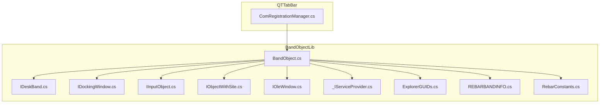
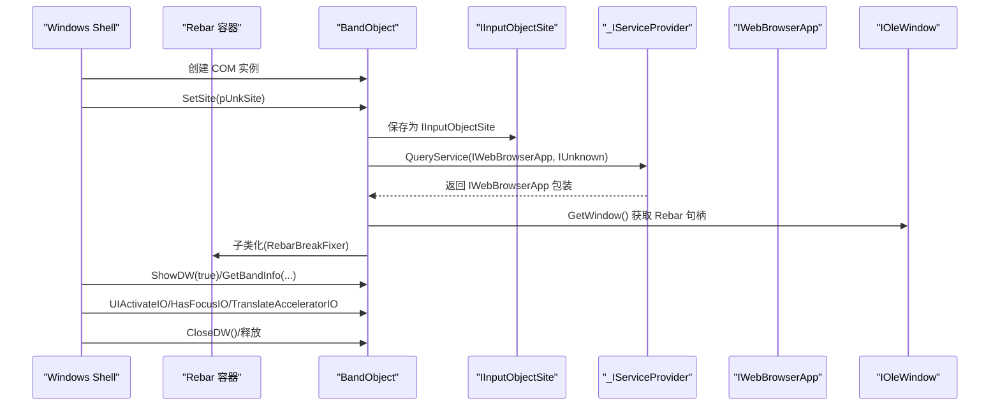
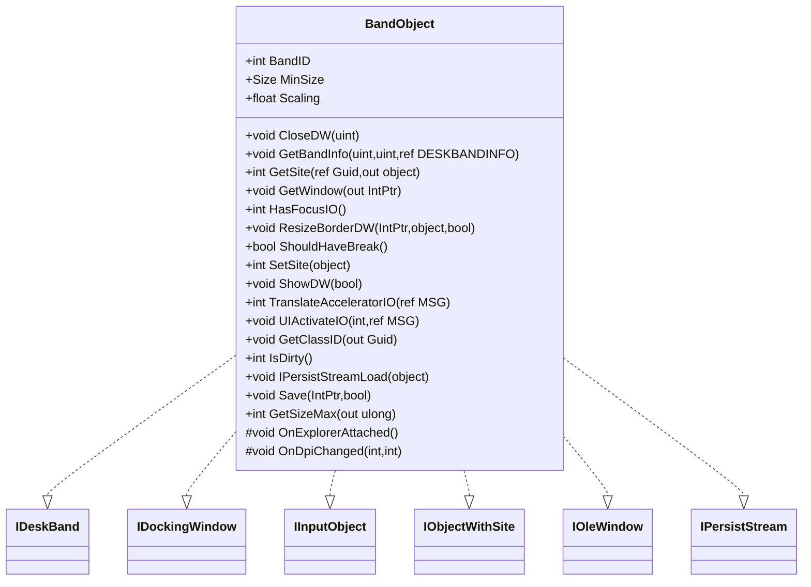
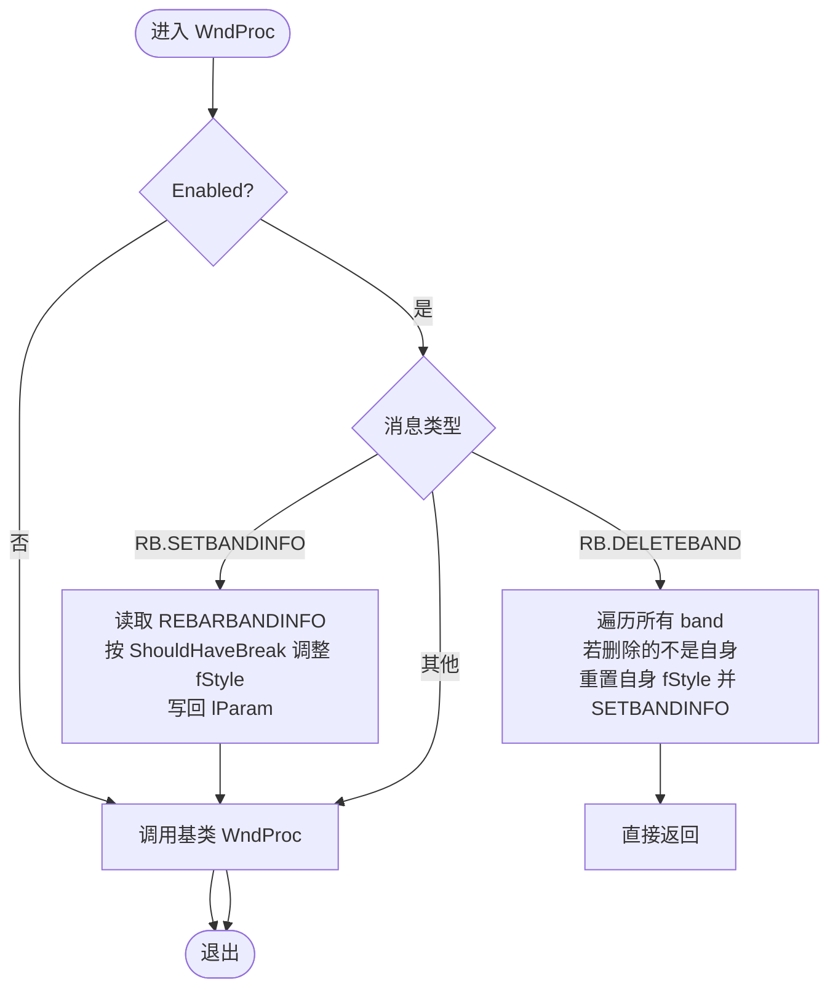
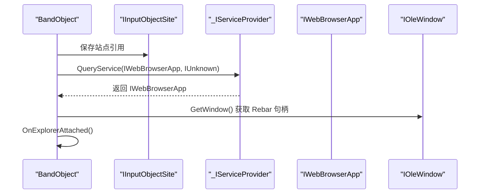
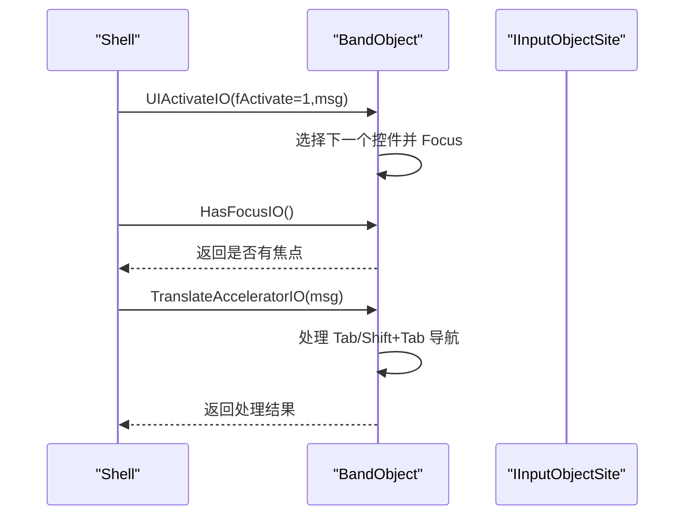
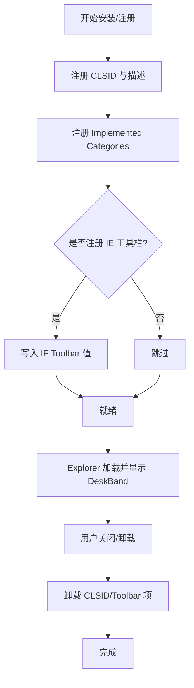
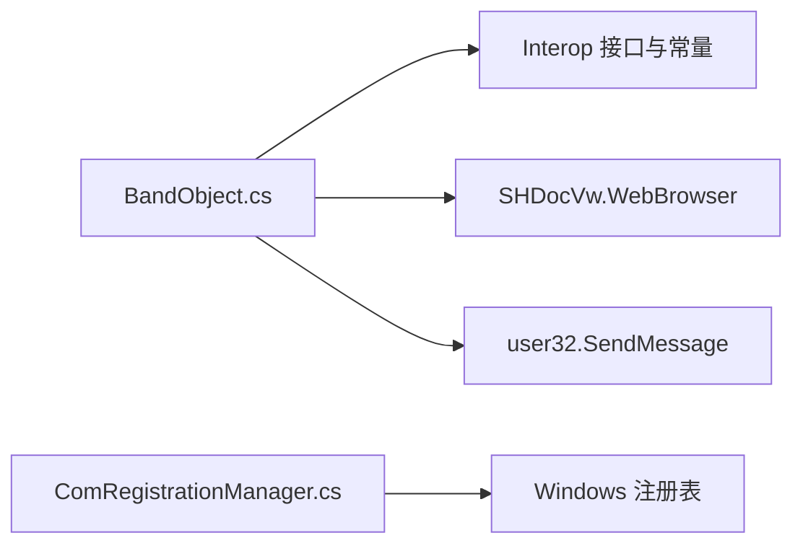

# Shell 扩展集成

<cite>
**本文引用的文件**   
- [BandObject.cs](file://BandObjectLib/BandObject.cs)
- [IDeskBand.cs](file://BandObjectLib/Interop/IDeskBand.cs)
- [IDockingWindow.cs](file://BandObjectLib/Interop/IDockingWindow.cs)
- [IInputObject.cs](file://BandObjectLib/Interop/IInputObject.cs)
- [IObjectWithSite.cs](file://BandObjectLib/Interop/IObjectWithSite.cs)
- [IOleWindow.cs](file://BandObjectLib/Interop/IOleWindow.cs)
- [_IServiceProvider.cs](file://BandObjectLib/Interop/_IServiceProvider.cs)
- [ExplorerGUIDs.cs](file://BandObjectLib/Interop/ExplorerGUIDs.cs)
- [REBARBANDINFO.cs](file://BandObjectLib/Interop/REBARBANDINFO.cs)
- [RebarConstants.cs](file://BandObjectLib/Interop/RebarConstants.cs)
- [ComRegistrationManager.cs](file://QTTabBar/ComRegistrationManager.cs)
</cite>

## 目录
1. [简介](#简介)
2. [项目结构](#项目结构)
3. [核心组件](#核心组件)
4. [架构总览](#架构总览)
5. [详细组件分析](#详细组件分析)
6. [依赖关系分析](#依赖关系分析)
7. [性能考虑](#性能考虑)
8. [故障排查指南](#故障排查指南)
9. [结论](#结论)

## 简介
本技术文档聚焦于 QTTabBar-Next 的 Shell 扩展集成功能，重点解析 BandObject 基类对 IDeskBand、IDockingWindow、IInputObject、IObjectWithSite、IOleWindow 等 COM 接口的实现细节；阐述 Windows Shell 扩展从注册到卸载的生命周期管理；说明 Explorer 进程集成机制（SetSite 中 IWebBrowserApp 服务的获取与使用）；解释 Rebar 控件子类化与 RB_SETBANDINFO 消息处理及样式修复；详述窗口消息处理系统（焦点管理、键盘加速器、UI 激活）；总结 COM 对象内存管理与资源清理最佳实践；并提供调试技巧与常见问题解决方案。

## 项目结构
与 Shell 扩展集成相关的代码主要分布在两个工程：
- BandObjectLib：提供 BandObject 基类及其 COM 接口定义、Rebar 常量与数据结构、服务发现辅助接口等。
- QTTabBar：提供统一的 COM 注册/卸载工具（ComRegistrationManager），用于将 BandObject 以 DeskBand 类别注册到系统。

图表来源
- [BandObject.cs:1-773](file://BandObjectLib/BandObject.cs#L1-L773)
- [IDeskBand.cs:1-33](file://BandObjectLib/Interop/IDeskBand.cs#L1-L33)
- [IDockingWindow.cs:1-32](file://BandObjectLib/Interop/IDockingWindow.cs#L1-L32)
- [IInputObject.cs:1-31](file://BandObjectLib/Interop/IInputObject.cs#L1-L31)
- [IObjectWithSite.cs:1-33](file://BandObjectLib/Interop/IObjectWithSite.cs#L1-L33)
- [IOleWindow.cs:1-29](file://BandObjectLib/Interop/IOleWindow.cs#L1-L29)
- [_IServiceProvider.cs:1-31](file://BandObjectLib/Interop/_IServiceProvider.cs#L1-L31)
- [ExplorerGUIDs.cs:1-42](file://BandObjectLib/Interop/ExplorerGUIDs.cs#L1-L42)
- [REBARBANDINFO.cs:1-46](file://BandObjectLib/Interop/REBARBANDINFO.cs#L1-L46)
- [RebarConstants.cs:1-96](file://BandObjectLib/Interop/RebarConstants.cs#L1-L96)
- [ComRegistrationManager.cs:1-108](file://QTTabBar/ComRegistrationManager.cs#L1-L108)

章节来源
- [BandObject.cs:1-773](file://BandObjectLib/BandObject.cs#L1-L773)
- [ComRegistrationManager.cs:1-108](file://QTTabBar/ComRegistrationManager.cs#L1-L108)

## 核心组件
- BandObject 基类：继承自 WinForms UserControl，并实现多个 Shell/COM 接口，负责与 Explorer 的 Rebar 容器交互、生命周期管理、输入焦点与键盘加速、DPI 缩放信息暴露等。
- COM 接口定义：IDeskBand、IDockingWindow、IInputObject、IObjectWithSite、IOleWindow 等，作为与 Shell 通信的契约。
- Rebar 相关：通过 REBARBANDINFO 结构与 RB_* 常量，配合子类化拦截 RB_SETBANDINFO/RB_DELETEBAND 消息，修复 BREAK 样式问题。
- 服务发现：通过 _IServiceProvider.QueryService 获取 IWebBrowserApp（SHDocVw.WebBrowser）实例，便于后续与 Explorer 进行更高级交互。
- 注册工具：ComRegistrationManager 提供统一的 CLSID、Implemented Categories、IE Toolbar 项的注册/卸载方法。

章节来源
- [BandObject.cs:35-43](file://BandObjectLib/BandObject.cs#L35-L43)
- [IDeskBand.cs:23-31](file://BandObjectLib/Interop/IDeskBand.cs#L23-L31)
- [IDockingWindow.cs:23-30](file://BandObjectLib/Interop/IDockingWindow.cs#L23-L30)
- [IInputObject.cs:22-29](file://BandObjectLib/Interop/IInputObject.cs#L22-L29)
- [IObjectWithSite.cs:23-31](file://BandObjectLib/Interop/IObjectWithSite.cs#L23-L31)
- [IOleWindow.cs:23-27](file://BandObjectLib/Interop/IOleWindow.cs#L23-L27)
- [_IServiceProvider.cs:23-29](file://BandObjectLib/Interop/_IServiceProvider.cs#L23-L29)
- [ExplorerGUIDs.cs:21-40](file://BandObjectLib/Interop/ExplorerGUIDs.cs#L21-L40)
- [REBARBANDINFO.cs:22-44](file://BandObjectLib/Interop/REBARBANDINFO.cs#L22-L44)
- [RebarConstants.cs:18-95](file://BandObjectLib/Interop/RebarConstants.cs#L18-L95)
- [ComRegistrationManager.cs:10-106](file://QTTabBar/ComRegistrationManager.cs#L10-L106)

## 架构总览
Shell 扩展在 Explorer 中以 DeskBand 形式嵌入 Rebar 容器。BandObject 通过 IObjectWithSite.SetSite 获得站点（IInputObjectSite），并通过 QueryService 尝试获取 IWebBrowserApp 服务；同时通过 IOleWindow.GetWindow 获取 Rebar 句柄，子类化后修正 BREAK 样式。输入焦点与键盘事件由 IInputObject 系列方法协调。

图表来源
- [BandObject.cs:429-484](file://BandObjectLib/BandObject.cs#L429-L484)
- [BandObject.cs:378-385](file://BandObjectLib/BandObject.cs#L378-L385)
- [BandObject.cs:507-515](file://BandObjectLib/BandObject.cs#L507-L515)
- [BandObject.cs:387-392](file://BandObjectLib/BandObject.cs#L387-L392)
- [BandObject.cs:500-505](file://BandObjectLib/BandObject.cs#L500-L505)
- [BandObject.cs:178-196](file://BandObjectLib/BandObject.cs#L178-L196)
- [IDeskBand.cs:24-31](file://BandObjectLib/Interop/IDeskBand.cs#L24-L31)
- [IObjectWithSite.cs:26-31](file://BandObjectLib/Interop/IObjectWithSite.cs#L26-L31)
- [IOleWindow.cs:24-27](file://BandObjectLib/Interop/IOleWindow.cs#L24-L27)
- [_IServiceProvider.cs:24-29](file://BandObjectLib/Interop/_IServiceProvider.cs#L24-L29)
- [ExplorerGUIDs.cs:39-39](file://BandObjectLib/Interop/ExplorerGUIDs.cs#L39-L39)

## 详细组件分析

### BandObject 基类与 COM 接口实现
- 继承与职责
  - 继承 WinForms UserControl，承载 UI 内容。
  - 实现 IDeskBand、IDockingWindow、IInputObject、IObjectWithSite、IOleWindow、IPersistStream（部分未实现）。
- 关键成员
  - BandObjectSite：IInputObjectSite，用于焦点切换通知。
  - Explorer：IWebBrowserApp 包装，通过 QueryService 获取。
  - ReBarHandle：Rebar 容器句柄，用于发送消息与子类化。
  - RebarSubclass：RebarBreakFixer，子类化修复 BREAK 样式。
- 重要方法
  - SetSite：接收站点对象，保存 IInputObjectSite，QueryService 获取 IWebBrowserApp，获取 Rebar 句柄，触发 OnExplorerAttached。
  - GetBandInfo：响应容器对尺寸、模式标志等的查询。
  - ShowDW/CloseDW：显示/关闭带区，初始化 Rebar 子类化，释放资源。
  - UIActivateIO/HasFocusIO/TranslateAcceleratorIO：输入焦点与 Tab 键导航。
  - ResizeBorderDW：边框空间变更回调（空实现）。
  - ShouldHaveBreak：是否初始换行（可重写）。
  - GetClassID/IsDirty/IPersistStream*：持久化占位实现。

图表来源
- [BandObject.cs:35-43](file://BandObjectLib/BandObject.cs#L35-L43)
- [BandObject.cs:317-345](file://BandObjectLib/BandObject.cs#L317-L345)
- [BandObject.cs:429-484](file://BandObjectLib/BandObject.cs#L429-L484)
- [BandObject.cs:486-498](file://BandObjectLib/BandObject.cs#L486-L498)
- [BandObject.cs:500-515](file://BandObjectLib/BandObject.cs#L500-L515)
- [BandObject.cs:178-196](file://BandObjectLib/BandObject.cs#L178-L196)
- [BandObject.cs:546-564](file://BandObjectLib/BandObject.cs#L546-L564)
- [IDeskBand.cs:24-31](file://BandObjectLib/Interop/IDeskBand.cs#L24-L31)
- [IDockingWindow.cs:24-30](file://BandObjectLib/Interop/IDockingWindow.cs#L24-L30)
- [IInputObject.cs:23-29](file://BandObjectLib/Interop/IInputObject.cs#L23-L29)
- [IObjectWithSite.cs:26-31](file://BandObjectLib/Interop/IObjectWithSite.cs#L26-L31)
- [IOleWindow.cs:24-27](file://BandObjectLib/Interop/IOleWindow.cs#L24-L27)
- [BandObject.cs:554-564](file://BandObjectLib/BandObject.cs#L554-L564)

章节来源
- [BandObject.cs:35-43](file://BandObjectLib/BandObject.cs#L35-L43)
- [BandObject.cs:317-345](file://BandObjectLib/BandObject.cs#L317-L345)
- [BandObject.cs:429-484](file://BandObjectLib/BandObject.cs#L429-L484)
- [BandObject.cs:486-498](file://BandObjectLib/BandObject.cs#L486-L498)
- [BandObject.cs:500-515](file://BandObjectLib/BandObject.cs#L500-L515)
- [BandObject.cs:178-196](file://BandObjectLib/BandObject.cs#L178-L196)
- [BandObject.cs:546-564](file://BandObjectLib/BandObject.cs#L546-L564)

### Rebar 子类化与样式修复机制
- 目标：修复 Windows 7 下首次加载时错误设置 RBBS_BREAK 的问题，并在删除其他 band 后恢复自身样式。
- 实现要点
  - 通过 NativeWindow 子类化 Rebar 窗口过程。
  - 拦截 RB.SETBANDINFO：根据 ShouldHaveBreak 决定是否保留 BREAK 样式，并写回 lParam。
  - 拦截 RB.DELETEBAND：当删除非自身 band 时，重新 SETBANDINFO 恢复自身 fStyle。
  - 通过 GETBANDCOUNT/GETBANDINFO 枚举当前 band 列表定位自身。
- 关键常量与结构
  - RB.*：SETBANDINFO、DELETEBAND、GETBANDCOUNT、GETBANDINFO 等消息常量。
  - RBBIM.*：fMask 字段，如 STYLE、CHILD。
  - RBBS.*：BREAK 等样式标志。
  - REBARBANDINFO：包含 hwndChild、fStyle、cbSize、fMask 等字段。

图表来源
- [BandObject.cs:82-160](file://BandObjectLib/BandObject.cs#L82-L160)
- [RebarConstants.cs:18-95](file://BandObjectLib/Interop/RebarConstants.cs#L18-L95)
- [REBARBANDINFO.cs:22-44](file://BandObjectLib/Interop/REBARBANDINFO.cs#L22-L44)

章节来源
- [BandObject.cs:82-160](file://BandObjectLib/BandObject.cs#L82-L160)
- [BandObject.cs:162-176](file://BandObjectLib/BandObject.cs#L162-L176)
- [RebarConstants.cs:18-95](file://BandObjectLib/Interop/RebarConstants.cs#L18-L95)
- [REBARBANDINFO.cs:22-44](file://BandObjectLib/Interop/REBARBANDINFO.cs#L22-L44)

### Explorer 进程集成与服务获取
- SetSite 流程
  - 保存 pUnkSite 为 IInputObjectSite。
  - 通过 _IServiceProvider.QueryService 请求 IID_IWebBrowserApp，得到 SHDocVw.WebBrowser 包装。
  - 通过 IOleWindow.GetWindow 获取 Rebar 句柄。
  - 调用 OnExplorerAttached 钩子供派生类执行初始化。
- 注意事项
  - 在非 Explorer 宿主环境下，GetWindow 返回空句柄以避免误用。
  - 捕获 COMException 并记录错误日志，避免崩溃。

图表来源
- [BandObject.cs:429-484](file://BandObjectLib/BandObject.cs#L429-L484)
- [BandObject.cs:378-385](file://BandObjectLib/BandObject.cs#L378-L385)
- [_IServiceProvider.cs:24-29](file://BandObjectLib/Interop/_IServiceProvider.cs#L24-L29)
- [ExplorerGUIDs.cs:39-39](file://BandObjectLib/Interop/ExplorerGUIDs.cs#L39-L39)

章节来源
- [BandObject.cs:429-484](file://BandObjectLib/BandObject.cs#L429-L484)
- [BandObject.cs:378-385](file://BandObjectLib/BandObject.cs#L378-L385)
- [_IServiceProvider.cs:24-29](file://BandObjectLib/Interop/_IServiceProvider.cs#L24-L29)
- [ExplorerGUIDs.cs:39-39](file://BandObjectLib/Interop/ExplorerGUIDs.cs#L39-L39)

### 窗口消息处理与输入焦点
- 焦点管理
  - OnGotFocus/OnLostFocus：通过 BandObjectSite.OnFocusChangeIS 通知容器当前焦点状态变化。
- 键盘加速器
  - TranslateAcceleratorIO：处理 Tab/Shift+Tab 在控件树中的导航。
- UI 激活
  - UIActivateIO：激活时将焦点移动到下一个可用控件并 Focus。

图表来源
- [BandObject.cs:398-412](file://BandObjectLib/BandObject.cs#L398-L412)
- [BandObject.cs:500-515](file://BandObjectLib/BandObject.cs#L500-L515)
- [IInputObject.cs:23-29](file://BandObjectLib/Interop/IInputObject.cs#L23-L29)

章节来源
- [BandObject.cs:398-412](file://BandObjectLib/BandObject.cs#L398-L412)
- [BandObject.cs:500-515](file://BandObjectLib/BandObject.cs#L500-L515)
- [IInputObject.cs:23-29](file://BandObjectLib/Interop/IInputObject.cs#L23-L29)

### Shell 扩展生命周期管理（注册到卸载）
- 注册阶段
  - 通过 ComRegistrationManager.RegisterBand 写入 CLSID 显示名、菜单文本、帮助文本。
  - 通过 RegisterImplementedCategory 注册 Implemented Categories（DeskBand/InfoBand/CommBand）。
  - 可选：RegisterToolbar 注册 IE 工具栏条目。
- 运行阶段
  - Explorer 加载 COM 对象，调用 SetSite、ShowDW、GetBandInfo、UIActivateIO 等。
- 卸载阶段
  - UnregisterAll 移除 IE Toolbar 项与 CLSID 树；或单独 UnregisterClsid。
  - 运行时 CloseDW 释放 Explorer、BandObjectSite、RebarSubclass 等资源。

图表来源
- [ComRegistrationManager.cs:15-33](file://QTTabBar/ComRegistrationManager.cs#L15-L33)
- [ComRegistrationManager.cs:61-81](file://QTTabBar/ComRegistrationManager.cs#L61-L81)
- [ComRegistrationManager.cs:86-105](file://QTTabBar/ComRegistrationManager.cs#L86-L105)
- [BandObject.cs:178-196](file://BandObjectLib/BandObject.cs#L178-L196)

章节来源
- [ComRegistrationManager.cs:15-33](file://QTTabBar/ComRegistrationManager.cs#L15-L33)
- [ComRegistrationManager.cs:61-81](file://QTTabBar/ComRegistrationManager.cs#L61-L81)
- [ComRegistrationManager.cs:86-105](file://QTTabBar/ComRegistrationManager.cs#L86-L105)
- [BandObject.cs:178-196](file://BandObjectLib/BandObject.cs#L178-L196)

## 依赖关系分析
- 内部依赖
  - BandObject 依赖 Interop 层接口与常量，以及 SHDocVw.WebBrowser 包装。
  - Rebar 修复逻辑依赖 REBARBANDINFO 与 RB/RBBIM/RBBS 常量。
- 外部依赖
  - Windows Shell/Rebar 子系统。
  - Internet Explorer COM 服务（IWebBrowserApp）。
- 耦合与内聚
  - BandObject 集中了 Shell 集成、消息处理、资源管理，内聚性高；建议将复杂逻辑下沉至专用模块以提升可维护性。
- 循环依赖
  - 未见明显循环导入；COM 接口为单向契约。

图表来源
- [BandObject.cs:65-66](file://BandObjectLib/BandObject.cs#L65-L66)
- [BandObject.cs:457-462](file://BandObjectLib/BandObject.cs#L457-L462)
- [ComRegistrationManager.cs:15-33](file://QTTabBar/ComRegistrationManager.cs#L15-L33)

章节来源
- [BandObject.cs:65-66](file://BandObjectLib/BandObject.cs#L65-L66)
- [BandObject.cs:457-462](file://BandObjectLib/BandObject.cs#L457-L462)
- [ComRegistrationManager.cs:15-33](file://QTTabBar/ComRegistrationManager.cs#L15-L33)

## 性能考虑
- 避免在高频消息路径中进行阻塞操作（如磁盘 I/O、网络请求）。
- Rebar 子类化仅在 ShowDW 时启用，减少不必要的消息拦截开销。
- 使用 Marshal.ReleaseComObject 显式释放 COM 引用，防止泄漏。
- 日志输出应谨慎开启，避免影响性能。

[本节为通用指导，不直接分析具体文件]

## 故障排查指南
- 常见问题
  - 首次加载出现换行异常：检查 RebarBreakFixer 是否正确拦截 RB_SETBANDINFO 与 RB_DELETEBAND。
  - 无法获取 IWebBrowserApp：确认 QueryService 调用与 IID_IWebBrowserApp 是否正确，捕获 COMException 并查看错误日志。
  - 焦点丢失或 Tab 导航无效：检查 HasFocusIO 与 TranslateAcceleratorIO 返回值逻辑。
  - 资源泄漏：确保 CloseDW/SetSite(null) 路径释放 Explorer、BandObjectSite、RebarSubclass。
- 调试技巧
  - 启用 Util2.bandLog 输出，观察关键生命周期点。
  - 使用 MakeErrorLog 记录异常堆栈与环境信息。
  - 在 SetSite 与 ShowDW 处断点，验证 Rebar 句柄与子类化状态。
  - 使用 Process Monitor 跟踪注册表读写，确认 CLSID 与 Categories 已正确写入。

章节来源
- [BandObject.cs:82-160](file://BandObjectLib/BandObject.cs#L82-L160)
- [BandObject.cs:429-484](file://BandObjectLib/BandObject.cs#L429-L484)
- [BandObject.cs:387-392](file://BandObjectLib/BandObject.cs#L387-L392)
- [BandObject.cs:500-505](file://BandObjectLib/BandObject.cs#L500-L505)
- [BandObject.cs:178-196](file://BandObjectLib/BandObject.cs#L178-L196)
- [BandObject.cs:646-771](file://BandObjectLib/BandObject.cs#L646-L771)

## 结论
BandObject 基类为 QTTabBar-Next 的 Shell 扩展提供了完整的 COM 集成能力，涵盖与 Explorer Rebar 容器的交互、输入焦点与键盘处理、服务发现与 Rebar 样式修复等关键环节。通过 ComRegistrationManager 统一注册/卸载，结合完善的日志与错误记录机制，开发者可以高效构建稳定的 DeskBand 扩展。建议在保持内聚性的同时，逐步拆分复杂逻辑，提升可测试性与可维护性。