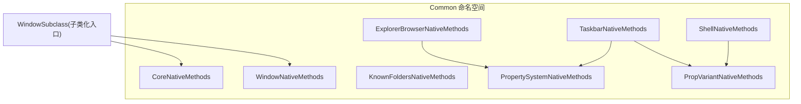
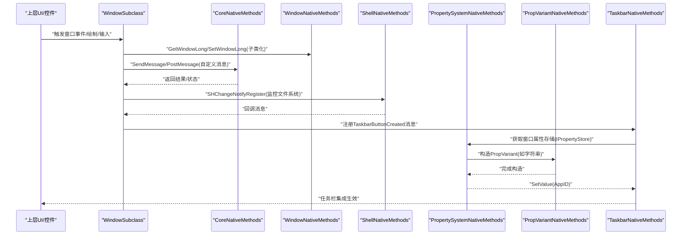
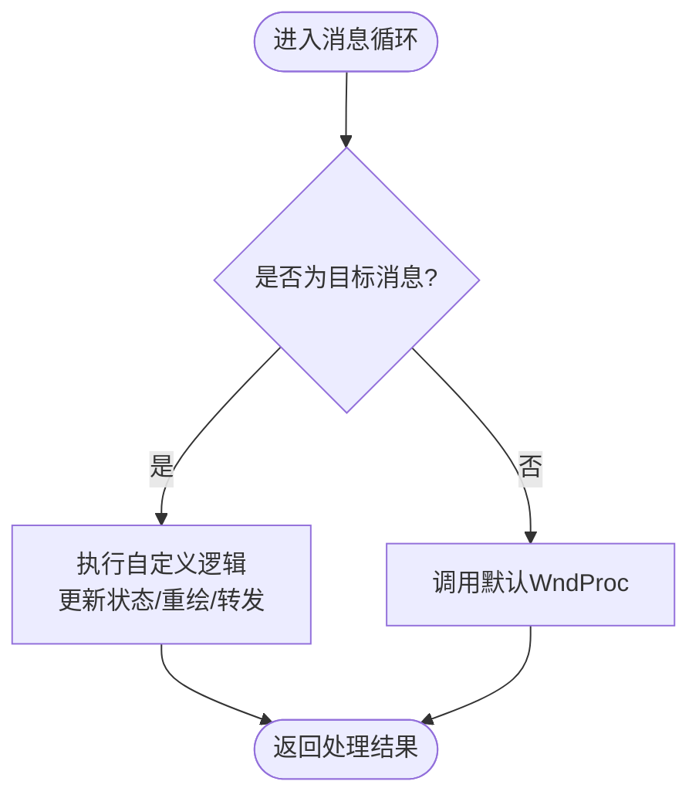
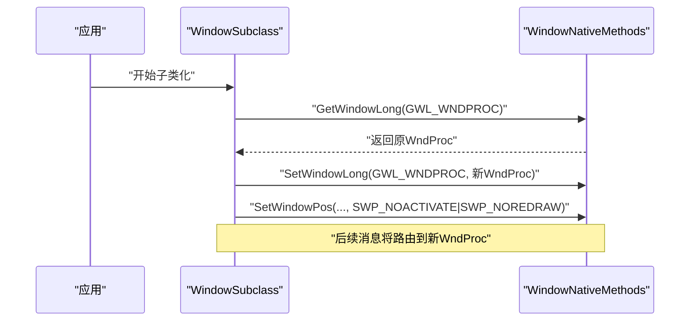
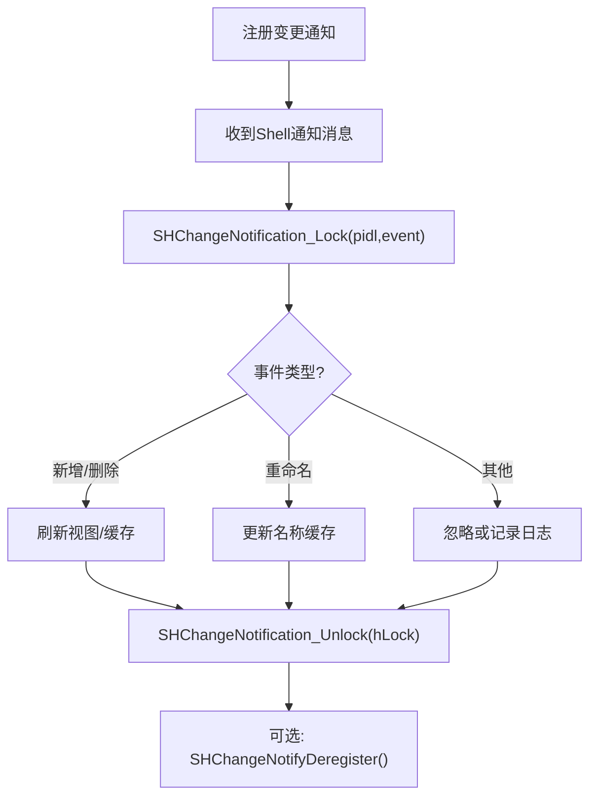
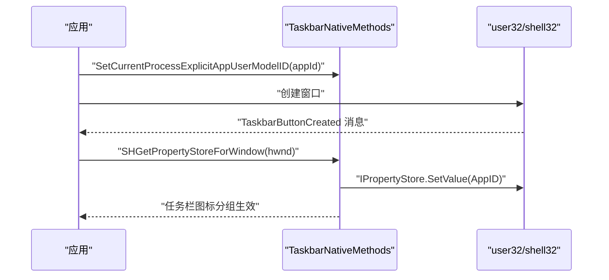
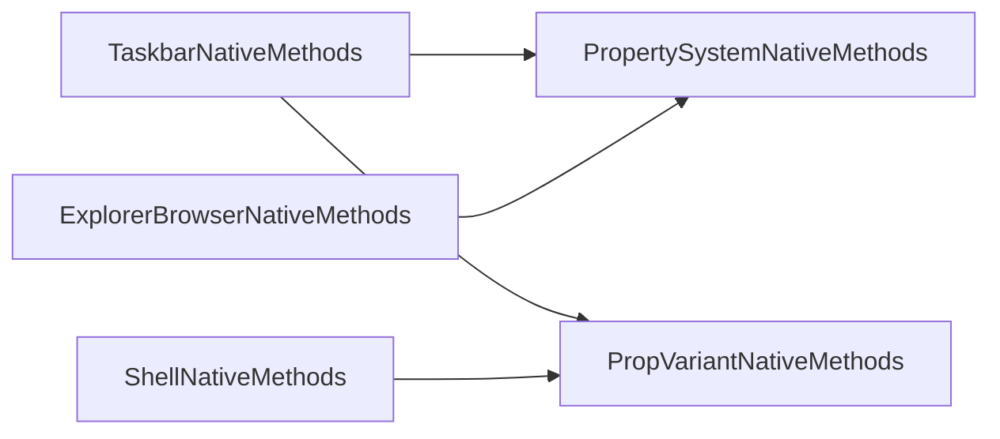

# Windows API 交互

<cite>
**本文引用的文件**   
- [CoreNativeMethods.cs](file://QTTabBar/Common/CoreNativeMethods.cs)
- [WindowNativeMethods.cs](file://QTTabBar/Common/WindowNativeMethods.cs)
- [ShellNativeMethods.cs](file://QTTabBar/Common/ShellNativeMethods.cs)
- [ExplorerBrowserNativeMethods.cs](file://QTTabBar/Common/ExplorerBrowserNativeMethods.cs)
- [KnownFoldersNativeMethods.cs](file://QTTabBar/Common/KnownFoldersNativeMethods.cs)
- [PropertySystemNativeMethods.cs](file://QTTabBar/Common/PropertySystemNativeMethods.cs)
- [PropVariantNativeMethods.cs](file://QTTabBar/Common/PropVariantNativeMethods.cs)
- [TaskbarNativeMethods.cs](file://QTTabBar/Common/TaskbarNativeMethods.cs)
- [WindowSubclass.cs](file://QTTabBar/QTTabBar/WindowSubclass.cs)
</cite>

## 目录
1. [简介](#简介)
2. [项目结构](#项目结构)
3. [核心组件](#核心组件)
4. [架构总览](#架构总览)
5. [详细组件分析](#详细组件分析)
6. [依赖关系分析](#依赖关系分析)
7. [性能与内存管理](#性能与内存管理)
8. [故障排查指南](#故障排查指南)
9. [结论](#结论)
10. [附录](#附录)

## 简介
本技术文档聚焦于 QTTabBar-Next 的 Windows API 交互层，系统性梳理 P/Invoke 封装架构、窗口消息系统、窗口子类化、剪贴板与文件系统相关 API、高 DPI 支持、错误码映射与异常转换机制，以及性能优化与内存管理最佳实践。目标是帮助开发者快速理解并安全扩展该交互层。

## 项目结构
交互层主要分布在 Common 命名空间下的多个 NativeMethods 类中，按功能域划分：
- CoreNativeMethods：通用用户界面与消息发送、基础 GDI/图标销毁等
- WindowNativeMethods：窗口属性与位置设置、子类化所需 GWL_* 常量
- ShellNativeMethods：Shell 对象、路径解析、缩略图、变更通知等
- ExplorerBrowserNativeMethods：浏览器连接点与站点绑定（性能关键）
- KnownFoldersNativeMethods：已知文件夹定义结构体
- PropertySystemNativeMethods：属性系统接口与描述查询
- PropVariantNativeMethods：PropVariant 构造与 SafeArray 操作
- TaskbarNativeMethods：任务栏集成、AppID、最近文档等

图表来源
- [CoreNativeMethods.cs:1-254](file://QTTabBar/Common/CoreNativeMethods.cs#L1-L254)
- [WindowNativeMethods.cs:1-69](file://QTTabBar/Common/WindowNativeMethods.cs#L1-L69)
- [ShellNativeMethods.cs:1-595](file://QTTabBar/Common/ShellNativeMethods.cs#L1-L595)
- [ExplorerBrowserNativeMethods.cs:1-27](file://QTTabBar/Common/ExplorerBrowserNativeMethods.cs#L1-L27)
- [KnownFoldersNativeMethods.cs:1-34](file://QTTabBar/Common/KnownFoldersNativeMethods.cs#L1-L34)
- [PropertySystemNativeMethods.cs:1-52](file://QTTabBar/Common/PropertySystemNativeMethods.cs#L1-L52)
- [PropVariantNativeMethods.cs:1-106](file://QTTabBar/Common/PropVariantNativeMethods.cs#L1-L106)
- [TaskbarNativeMethods.cs:1-188](file://QTTabBar/Common/TaskbarNativeMethods.cs#L1-L188)
- [WindowSubclass.cs](file://QTTabBar/QTTabBar/WindowSubclass.cs)

章节来源
- [CoreNativeMethods.cs:1-254](file://QTTabBar/Common/CoreNativeMethods.cs#L1-L254)
- [WindowNativeMethods.cs:1-69](file://QTTabBar/Common/WindowNativeMethods.cs#L1-L69)
- [ShellNativeMethods.cs:1-595](file://QTTabBar/Common/ShellNativeMethods.cs#L1-L595)
- [ExplorerBrowserNativeMethods.cs:1-27](file://QTTabBar/Common/ExplorerBrowserNativeMethods.cs#L1-L27)
- [KnownFoldersNativeMethods.cs:1-34](file://QTTabBar/Common/KnownFoldersNativeMethods.cs#L1-L34)
- [PropertySystemNativeMethods.cs:1-52](file://QTTabBar/Common/PropertySystemNativeMethods.cs#L1-L52)
- [PropVariantNativeMethods.cs:1-106](file://QTTabBar/Common/PropVariantNativeMethods.cs#L1-L106)
- [TaskbarNativeMethods.cs:1-188](file://QTTabBar/Common/TaskbarNativeMethods.cs#L1-L188)
- [WindowSubclass.cs](file://QTTabBar/QTTabBar/WindowSubclass.cs)

## 核心组件
- CoreNativeMethods
  - 提供 PostMessage/SendMessage 重载，统一消息投递与同步调用；包含 GetHiWord/GetLoWord 工具方法；封装 DeleteObject/DestroyIcon/DestroyWindow 等资源释放；LoadLibrary/LoadString 等基础加载能力。
- WindowNativeMethods
  - SetWindowPosFlags、WindowLongFlags 常量；FindWindowEx/GetWindowLong/SetWindowLong/SetWindowPos 等窗口属性与布局 API。
- ShellNativeMethods
  - 大量 Shell 枚举与标志位（SFGAO、SIIGBF、ThumbnailOptions 等）；SHChangeNotify* 变更通知注册/解锁/注销；SHCreateItemFromParsingName/SHGetPathFromIDListW 路径解析；ILFree/ILGetSize 等 PIDL 操作。
- ExplorerBrowserNativeMethods
  - ConnectToConnectionPoint/IUnknown_SetSite 等连接点与站点绑定，标记为性能关键且使用 SuppressUnmanagedCodeSecurity。
- KnownFoldersNativeMethods
  - NativeFolderDefinition 结构体，用于已知文件夹定义。
- PropertySystemNativeMethods
  - PSGetNameFromPropertyKey/PSGetPropertyDescription/PSGetPropertyDescriptionListFromString/PSGetPropertyKeyFromName 等属性系统接口。
- PropVariantNativeMethods
  - InitPropVariantFrom* 系列向量/标量初始化；SafeArray 创建/访问/边界获取；PropVariantClear 清理。
- TaskbarNativeMethods
  - 任务栏按钮消息常量、RegisterWindowMessage("TaskbarButtonCreated")；SetCurrentProcessExplicitAppUserModelID/GetCurrentProcessExplicitAppUserModelID；SHAddToRecentDocs；通过 SHGetPropertyStoreForWindow 获取窗口属性存储并写入 AppID。

章节来源
- [CoreNativeMethods.cs:1-254](file://QTTabBar/Common/CoreNativeMethods.cs#L1-L254)
- [WindowNativeMethods.cs:1-69](file://QTTabBar/Common/WindowNativeMethods.cs#L1-L69)
- [ShellNativeMethods.cs:1-595](file://QTTabBar/Common/ShellNativeMethods.cs#L1-L595)
- [ExplorerBrowserNativeMethods.cs:1-27](file://QTTabBar/Common/ExplorerBrowserNativeMethods.cs#L1-L27)
- [KnownFoldersNativeMethods.cs:1-34](file://QTTabBar/Common/KnownFoldersNativeMethods.cs#L1-L34)
- [PropertySystemNativeMethods.cs:1-52](file://QTTabBar/Common/PropertySystemNativeMethods.cs#L1-L52)
- [PropVariantNativeMethods.cs:1-106](file://QTTabBar/Common/PropVariantNativeMethods.cs#L1-L106)
- [TaskbarNativeMethods.cs:1-188](file://QTTabBar/Common/TaskbarNativeMethods.cs#L1-L188)

## 架构总览
交互层采用“按领域拆分”的 NativeMethods 组织方式，上层业务通过强类型枚举、结构体和少量包装方法调用底层 Win32/COM 接口。消息子系统由 CoreNativeMethods 提供统一的 Send/Post 通道；窗口子类化在 WindowSubclass 中结合 WindowNativeMethods 完成 WndProc 替换与消息拦截；Shell 与属性系统通过 ShellNativeMethods、PropertySystemNativeMethods、PropVariantNativeMethods 协同工作；任务栏集成由 TaskbarNativeMethods 负责。

图表来源
- [CoreNativeMethods.cs:84-195](file://QTTabBar/Common/CoreNativeMethods.cs#L84-L195)
- [WindowNativeMethods.cs:42-68](file://QTTabBar/Common/WindowNativeMethods.cs#L42-L68)
- [ShellNativeMethods.cs:476-488](file://QTTabBar/Common/ShellNativeMethods.cs#L476-L488)
- [TaskbarNativeMethods.cs:111-180](file://QTTabBar/Common/TaskbarNativeMethods.cs#L111-L180)
- [PropertySystemNativeMethods.cs:26-51](file://QTTabBar/Common/PropertySystemNativeMethods.cs#L26-L51)
- [PropVariantNativeMethods.cs:10-44](file://QTTabBar/Common/PropVariantNativeMethods.cs#L10-L44)

## 详细组件分析

### P/Invoke 封装与调用约定
- 调用约定与字符集
  - user32/shell32/shlwapi/propsys/OleAut32 等库广泛使用 CharSet.Auto/Unicode，部分函数显式指定 CallingConvention.Winapi 或 StdCall。
  - 对频繁调用的关键路径（如 ExplorerBrowserNativeMethods）使用 SuppressUnmanagedCodeSecurity 减少安全检查开销。
- 参数封送与返回值
  - 字符串多采用 LPWStr/LPWStr StringBuilder；指针与句柄使用 IntPtr；COM 接口以 IUnknown/Interface 形式传入传出。
  - 部分函数 PreserveSig=false，直接抛出 HRESULT 对应的 .NET 异常；另一些 SetLastError=true，需配合 Marshal.GetLastWin32Error 处理。
- 资源释放
  - GDI 对象通过 DeleteObject 释放；图标通过 DestroyIcon；窗口通过 DestroyWindow；PIDL 通过 ILFree；PropVariant 通过 PropVariantClear。

章节来源
- [CoreNativeMethods.cs:84-212](file://QTTabBar/Common/CoreNativeMethods.cs#L84-L212)
- [ExplorerBrowserNativeMethods.cs:10-26](file://QTTabBar/Common/ExplorerBrowserNativeMethods.cs#L10-L26)
- [ShellNativeMethods.cs:451-463](file://QTTabBar/Common/ShellNativeMethods.cs#L451-L463)
- [PropVariantNativeMethods.cs:46-105](file://QTTabBar/Common/PropVariantNativeMethods.cs#L46-L105)

### 窗口消息系统与自定义消息
- 内置消息常量
  - UserMessage=0x0400 作为自定义消息基线；EnterIdleMessage、DWMNCRP_*、DWMWA_* 等常量用于非客户区渲染控制。
- 消息投递
  - PostMessage 异步投递；SendMessage 同步等待处理完成，并提供多种重载（uint/message enum、string/lparam、StringBuilder/lparam）。
- 自定义消息处理
  - 上层可通过 RegisterWindowMessage 注册全局唯一消息（例如任务栏按钮创建），并在 WndProc 中捕获处理。

图表来源
- [CoreNativeMethods.cs:30-195](file://QTTabBar/Common/CoreNativeMethods.cs#L30-L195)
- [TaskbarNativeMethods.cs:111-139](file://QTTabBar/Common/TaskbarNativeMethods.cs#L111-L139)

章节来源
- [CoreNativeMethods.cs:30-195](file://QTTabBar/Common/CoreNativeMethods.cs#L30-L195)
- [TaskbarNativeMethods.cs:111-139](file://QTTabBar/Common/TaskbarNativeMethods.cs#L111-L139)

### 窗口子类化与 WndProc 重写
- 子类化流程
  - 使用 GetWindowLong 读取原 WndProc 地址，SetWindowLong 替换为新过程；必要时保存旧地址以便回退。
  - 通过 SetWindowPos 调整窗口层级与显示状态，配合 SWP_* 标志避免不必要的重绘与激活。
- 消息拦截策略
  - 在自定义 WndProc 中优先处理自定义消息与关键系统消息，再转发至原始 WndProc，确保兼容性。

图表来源
- [WindowNativeMethods.cs:42-68](file://QTTabBar/Common/WindowNativeMethods.cs#L42-L68)
- [WindowSubclass.cs](file://QTTabBar/QTTabBar/WindowSubclass.cs)

章节来源
- [WindowNativeMethods.cs:26-68](file://QTTabBar/Common/WindowNativeMethods.cs#L26-L68)
- [WindowSubclass.cs](file://QTTabBar/QTTabBar/WindowSubclass.cs)

### 剪贴板与数据格式转换（概述）
- 本项目未在本仓库范围内发现直接的剪贴板 P/Invoke 声明。若需实现剪贴板操作，建议：
  - 使用 System.Windows.Forms.Clipboard 或 System.Windows.DataObject 进行托管侧操作。
  - 对于复杂格式（CF_HDROP、CF_UNICODETEXT、自定义格式），可结合 Shell 的 IDataObject/IDropTarget 体系进行桥接。
  - 注意线程模型：剪贴板通常在 UI 线程访问；跨线程应使用 PostMessage/SendMessage 将请求投递到目标线程。

[本节为概念性说明，不直接分析具体文件]

### 文件系统 API：监控、路径解析与权限检查
- 变更通知
  - 通过 SHChangeNotifyRegister 注册监听，指定源与事件掩码，收到消息后使用 SHChangeNotification_Lock/Unlock 解析 PIDL 与事件类型，最后 SHChangeNotifyDeregister 注销。
- 路径解析
  - SHParseDisplayName 将显示名解析为 PIDL 并输出 SFGAO 属性；SHGetPathFromIDListW 将 PIDL 转为路径；SHCreateItemFromParsingName 从路径创建 IShellItem/IShellItem2。
- 权限与能力
  - 通过 SFGAO_* 标志判断可复制/移动/删除/只读/隐藏/共享等能力；结合 Shell 属性系统进一步获取详细信息。

图表来源
- [ShellNativeMethods.cs:476-488](file://QTTabBar/Common/ShellNativeMethods.cs#L476-L488)
- [ShellNativeMethods.cs:466-474](file://QTTabBar/Common/ShellNativeMethods.cs#L466-L474)
- [ShellNativeMethods.cs:540-546](file://QTTabBar/Common/ShellNativeMethods.cs#L540-L546)
- [ShellNativeMethods.cs:537-537](file://QTTabBar/Common/ShellNativeMethods.cs#L537-L537)

章节来源
- [ShellNativeMethods.cs:466-546](file://QTTabBar/Common/ShellNativeMethods.cs#L466-L546)

### 高 DPI 支持与界面适配（概述）
- 仓库内存在 DpiAwareControl/Form/UserControl 等组件，但本次分析聚焦于 Common 层的 P/Invoke。建议在 UI 层：
  - 使用 DpiManager/DpiAwareObject 接口获取缩放因子并动态调整字体与尺寸。
  - 在 WM_DPICHANGED 消息中重新计算布局并重绘。
  - 对图标/缩略图按需选择不同分辨率资源。

[本节为概念性说明，不直接分析具体文件]

### 错误码映射与异常转换
- HRESULT 到异常
  - 多处 Declare 使用 PreserveSig=false，自动将失败 HRESULT 转换为 .NET 异常；成功路径则返回正常值。
- Win32 错误
  - 对 SetLastError=true 的函数，可在失败时调用 Marshal.GetLastWin32Error 获取扩展信息。
- 常见错误码
  - ResultInvalidArgument、ResultNotFound、StatusAccessDenied 等常量用于语义化错误分类。

章节来源
- [CoreNativeMethods.cs:36-44](file://QTTabBar/Common/CoreNativeMethods.cs#L36-L44)
- [PropVariantNativeMethods.cs:10-47](file://QTTabBar/Common/PropVariantNativeMethods.cs#L10-L47)
- [TaskbarNativeMethods.cs:123-170](file://QTTabBar/Common/TaskbarNativeMethods.cs#L123-L170)

### 任务栏集成与窗口属性
- 任务栏按钮创建消息
  - 通过 RegisterWindowMessage("TaskbarButtonCreated") 注册，窗口创建后接收通知。
- 应用标识与最近文档
  - SetCurrentProcessExplicitAppUserModelID/GetCurrentProcessExplicitAppUserModelID 设置进程级 AppID；
  - SHAddToRecentDocs 添加最近文档项；
  - 通过 SHGetPropertyStoreForWindow 获取窗口属性存储，写入 System.AppUserModel.ID。

图表来源
- [TaskbarNativeMethods.cs:111-180](file://QTTabBar/Common/TaskbarNativeMethods.cs#L111-L180)

章节来源
- [TaskbarNativeMethods.cs:111-180](file://QTTabBar/Common/TaskbarNativeMethods.cs#L111-L180)

## 依赖关系分析
- 模块耦合
  - TaskbarNativeMethods 依赖 PropertySystemNativeMethods 与 PropVariantNativeMethods 完成窗口属性写入。
  - ShellNativeMethods 与 PropVariantNativeMethods 共同支撑属性与缩略图相关操作。
  - ExplorerBrowserNativeMethods 独立承担连接点与站点绑定，降低主流程复杂度。
- 外部依赖
  - user32.dll、shell32.dll、shlwapi.dll、propsys.dll、OleAut32.dll、gdi32.dll、kernel32.dll。

图表来源
- [TaskbarNativeMethods.cs:123-170](file://QTTabBar/Common/TaskbarNativeMethods.cs#L123-L170)
- [PropertySystemNativeMethods.cs:26-51](file://QTTabBar/Common/PropertySystemNativeMethods.cs#L26-L51)
- [PropVariantNativeMethods.cs:10-47](file://QTTabBar/Common/PropVariantNativeMethods.cs#L10-L47)
- [ShellNativeMethods.cs:451-546](file://QTTabBar/Common/ShellNativeMethods.cs#L451-L546)
- [ExplorerBrowserNativeMethods.cs:10-26](file://QTTabBar/Common/ExplorerBrowserNativeMethods.cs#L10-L26)

章节来源
- [TaskbarNativeMethods.cs:123-170](file://QTTabBar/Common/TaskbarNativeMethods.cs#L123-L170)
- [PropertySystemNativeMethods.cs:26-51](file://QTTabBar/Common/PropertySystemNativeMethods.cs#L26-L51)
- [PropVariantNativeMethods.cs:10-47](file://QTTabBar/Common/PropVariantNativeMethods.cs#L10-L47)
- [ShellNativeMethods.cs:451-546](file://QTTabBar/Common/ShellNativeMethods.cs#L451-L546)
- [ExplorerBrowserNativeMethods.cs:10-26](file://QTTabBar/Common/ExplorerBrowserNativeMethods.cs#L10-L26)

## 性能与内存管理
- 性能优化技巧
  - 对高频 P/Invoke 使用 SuppressUnmanagedCodeSecurity（如 ExplorerBrowserNativeMethods）以减少安全检查开销。
  - 批量消息处理：合并多次重绘请求，使用 SWP_NOREDRAW/SWP_DEFERERASE 减少闪烁。
  - 延迟加载：仅在需要时创建 IPropertyStore/IShellItem，避免启动阶段阻塞。
- 内存管理最佳实践
  - 严格配对释放：DeleteObject/DestroyIcon/DestroyWindow/ILFree/PropVariantClear。
  - SafeArray 访问遵循 AccessData/UnaccessData 成对调用，避免越界与泄漏。
  - COM 对象使用完成后及时 ReleaseComObject，避免悬挂引用。
- 线程与消息
  - 长耗时操作不在 UI 线程执行，通过 PostMessage 将结果回传 UI 线程更新。
  - 对 SendMessage 的使用要谨慎，避免死锁与长时间阻塞。

[本节提供通用指导，不直接分析具体文件]

## 故障排查指南
- 常见问题定位
  - 任务栏按钮未出现：确认已注册 TaskbarButtonCreated 消息并在窗口创建后处理。
  - 属性写入失败：检查 SHGetPropertyStoreForWindow 返回值与 IPropertyStore.SetValue 的 HRESULT。
  - 变更通知无回调：核对 SHChangeNotifyRegister 的 sources/events/hwnd 参数，并确保消息循环可用。
- 调试建议
  - 使用 GetLastError 获取 Win32 错误码；对 PreserveSig=false 的调用，捕获抛出的异常并记录 HRESULT。
  - 对 PIDL/PropVariant/SafeArray 的生命周期增加断点，确保释放路径可达。

章节来源
- [TaskbarNativeMethods.cs:111-180](file://QTTabBar/Common/TaskbarNativeMethods.cs#L111-L180)
- [ShellNativeMethods.cs:476-488](file://QTTabBar/Common/ShellNativeMethods.cs#L476-L488)
- [PropVariantNativeMethods.cs:46-105](file://QTTabBar/Common/PropVariantNativeMethods.cs#L46-L105)

## 结论
QTTabBar-Next 的 Windows API 交互层通过清晰的模块化 NativeMethods 设计，实现了消息、窗口、Shell、属性系统与任务栏集成的稳定桥接。遵循严格的封送与资源释放规范、合理的错误码映射与异常转换策略，并结合性能敏感路径的优化手段，可为上层插件与 UI 提供高效可靠的系统能力支撑。

## 附录
- 术语
  - P/Invoke：平台调用，托管代码调用非托管 API 的机制。
  - HRESULT：Windows 错误码标准格式。
  - PIDL：Shell 项目标识符列表。
  - PropVariant：属性系统通用数据类型。
- 参考路径
  - 消息与窗口：[CoreNativeMethods.cs](file://QTTabBar/Common/CoreNativeMethods.cs)、[WindowNativeMethods.cs](file://QTTabBar/Common/WindowNativeMethods.cs)
  - Shell 与属性：[ShellNativeMethods.cs](file://QTTabBar/Common/ShellNativeMethods.cs)、[PropertySystemNativeMethods.cs](file://QTTabBar/Common/PropertySystemNativeMethods.cs)、[PropVariantNativeMethods.cs](file://QTTabBar/Common/PropVariantNativeMethods.cs)
  - 任务栏集成：[TaskbarNativeMethods.cs](file://QTTabBar/Common/TaskbarNativeMethods.cs)
  - 浏览器连接点：[ExplorerBrowserNativeMethods.cs](file://QTTabBar/Common/ExplorerBrowserNativeMethods.cs)
  - 已知文件夹：[KnownFoldersNativeMethods.cs](file://QTTabBar/Common/KnownFoldersNativeMethods.cs)
  - 子类化入口：[WindowSubclass.cs](file://QTTabBar/QTTabBar/WindowSubclass.cs)