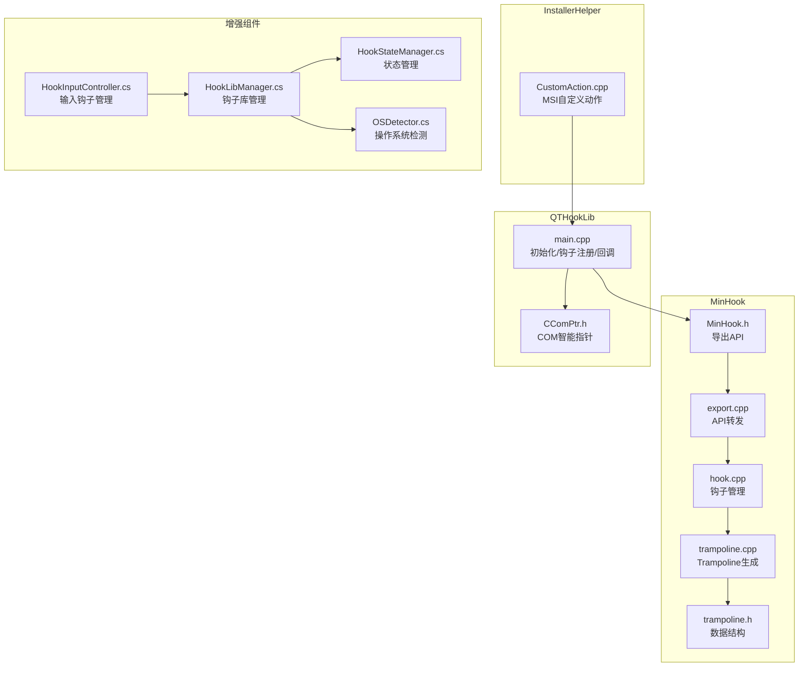
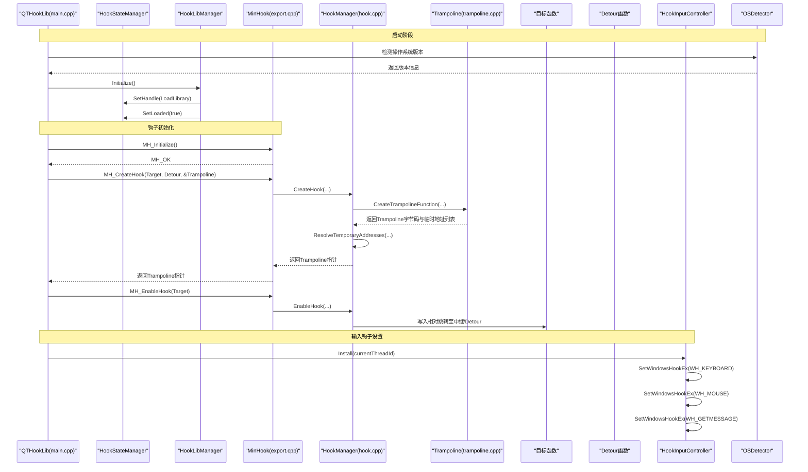
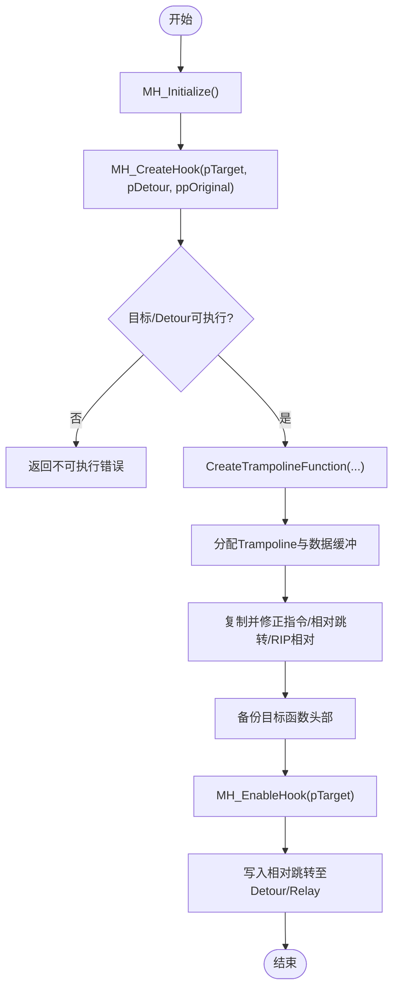
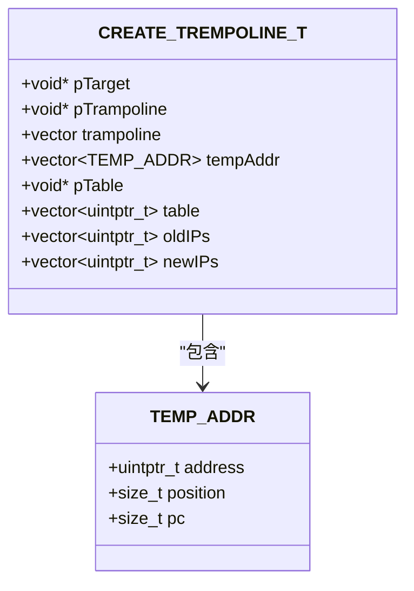
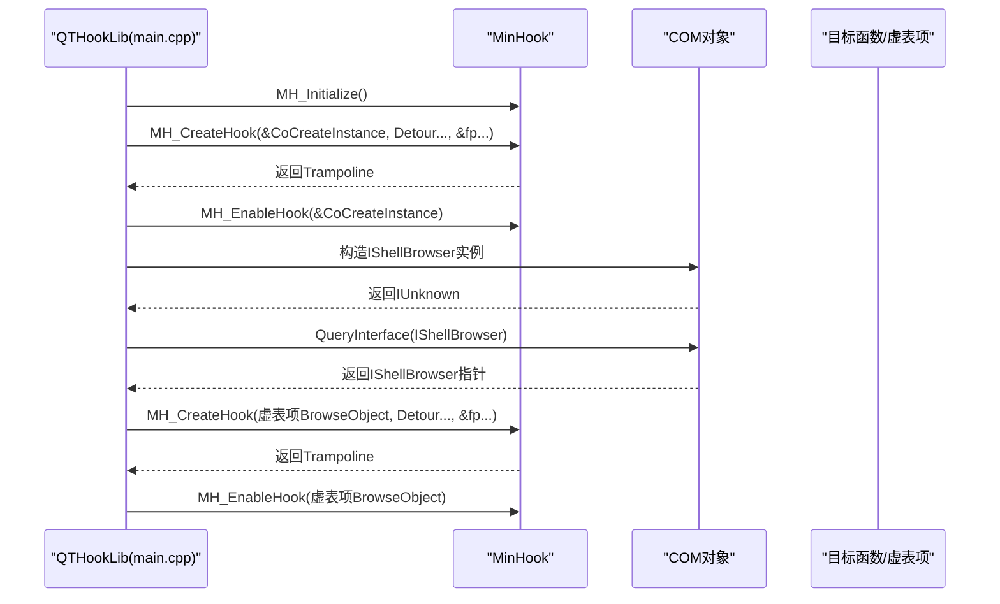
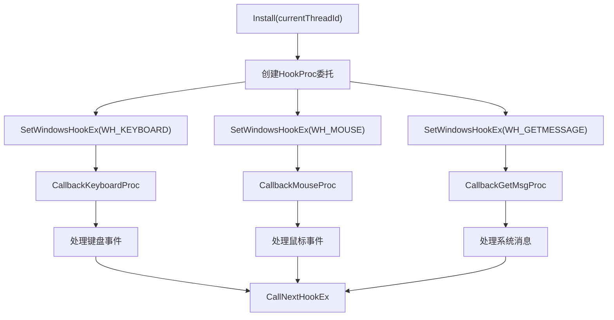
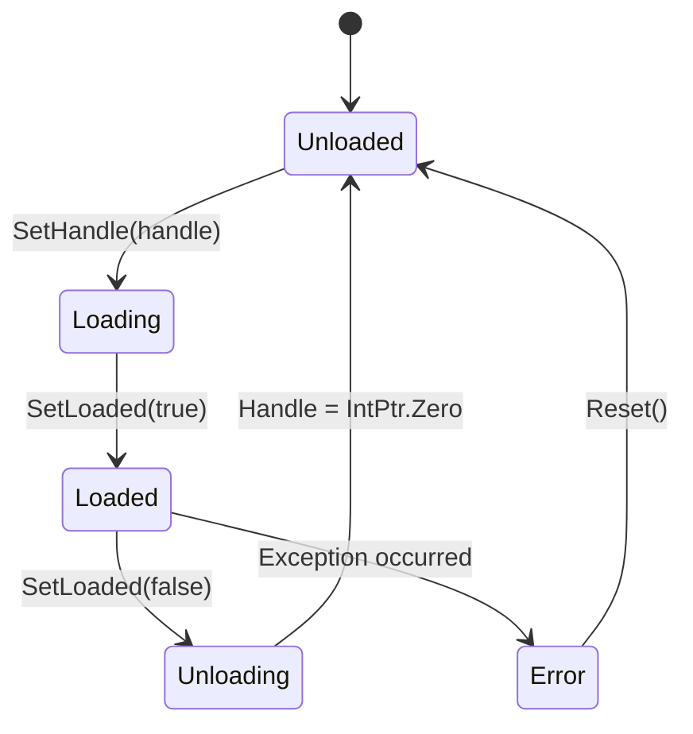
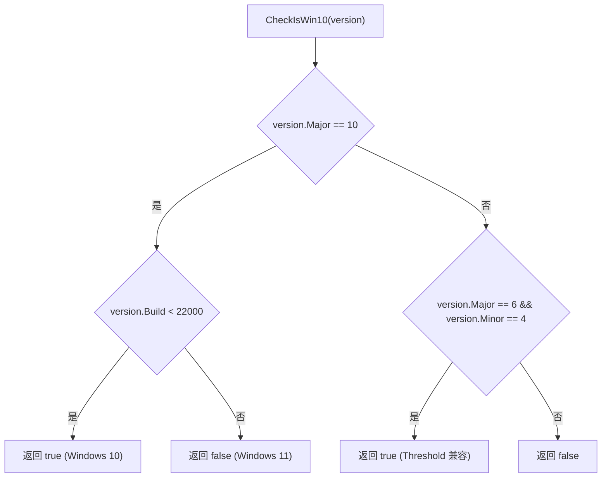
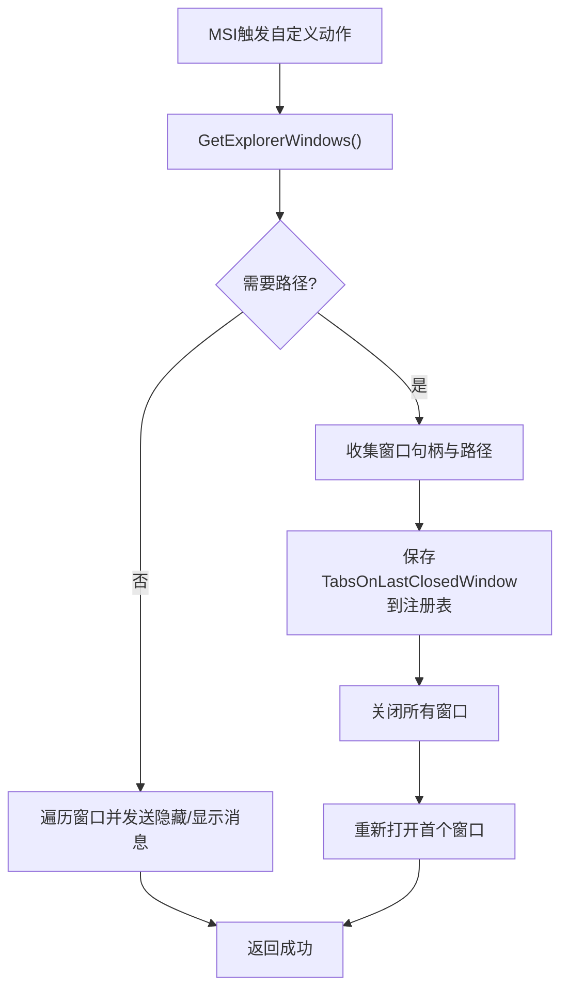
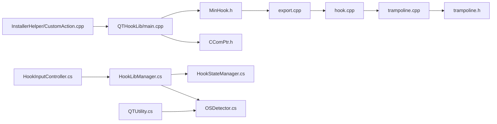

# 原生代码集成

<cite>
**本文引用的文件**   
- [MinHook.h](file://MinHook/MinHook.h)
- [export.cpp](file://MinHook/src/export.cpp)
- [hook.h](file://MinHook/src/hook.h)
- [hook.cpp](file://MinHook/src/hook.cpp)
- [trampoline.h](file://MinHook/src/trampoline.h)
- [trampoline.cpp](file://MinHook/src/trampoline.cpp)
- [main.cpp](file://QTHookLib/main.cpp)
- [CComPtr.h](file://QTHookLib/CComPtr.h)
- [CustomAction.cpp](file://InstallerHelper/CustomAction.cpp)
- [HookInputController.cs](file://QTTabBar/QTTabBarClass.HookInputController.cs)
- [OSDetector.cs](file://QTTabBar/OSDetector.cs)
- [HookStateManager.cs](file://QTTabBar/HookStateManager.cs)
- [HookLibManager.cs](file://QTTabBar/HookLibManager.cs)
- [QTUtility.cs](file://QTTabBar/QTUtility.cs)
</cite>

## 更新摘要
**变更内容**   
- 增强了 HookInputController 的 Windows 钩子管理功能，包括键盘、鼠标和消息钩子的统一管理和异常处理
- 改进了 OSDetector 的操作系统检测功能，提供更精确的 Windows 版本识别和兼容性检查
- 新增了 HookStateManager 统一管理钩子状态，解决了多标志同步问题
- 增强了 HookLibManager 的安全性和可靠性，包括受信任路径解析和错误处理

## 目录
1. [简介](#简介)
2. [项目结构](#项目结构)
3. [核心组件](#核心组件)
4. [架构总览](#架构总览)
5. [详细组件分析](#详细组件分析)
6. [依赖关系分析](#依赖关系分析)
7. [性能考虑](#性能考虑)
8. [故障排查指南](#故障排查指南)
9. [结论](#结论)
10. [附录](#附录)

## 简介
本技术文档聚焦于 QTTabBar-Next 的原生代码集成功能，重点覆盖以下主题：
- MinHook 库的集成与使用：API 钩子的安装、启用/禁用与管理机制。
- Trampoline 技术的实现原理：函数跳转与参数传递机制。
- P/Invoke 最佳实践（概念性指导）：结构体定义、调用约定与错误处理。
- C++ 自定义安装动作的实现：MSI 扩展与 Windows Installer 集成。
- 跨语言数据交换机制：字符串编码转换与内存共享策略（概念性指导）。
- 异常处理与安全考量：原生代码中的内存管理与指针操作。
- 性能优化技巧与调试方法：反汇编分析与内存泄漏检测（概念性指导）。
- **新增**：增强的 Windows 钩子管理系统和操作系统检测功能。

## 项目结构
本项目中与"原生代码集成"直接相关的模块包括：
- MinHook：轻量级 API Hook 库，提供创建/启用/禁用钩子以及 trampoline 生成能力。
- QTHookLib：基于 MinHook 的注入/钩子实现，用于拦截 Explorer 相关 API 与 COM 接口。
- InstallerHelper：Windows Installer 自定义动作，负责在卸载/更新时优雅关闭并重启 Explorer 窗口等。
- **新增**：HookInputController：统一的 Windows 输入钩子管理器，处理键盘、鼠标和消息钩子。
- **新增**：OSDetector：操作系统检测和版本识别工具类。
- **新增**：HookStateManager：统一的钩子状态管理器，解决多标志同步问题。

**图表来源**
- [MinHook.h:79-100](file://MinHook/MinHook.h#L79-L100)
- [export.cpp:35-58](file://MinHook/src/export.cpp#L35-L58)
- [hook.cpp:142-335](file://MinHook/src/hook.cpp#L142-L335)
- [trampoline.h:35-58](file://MinHook/src/trampoline.h#L35-L58)
- [trampoline.cpp:92-262](file://MinHook/src/trampoline.cpp#L92-L262)
- [main.cpp:590-752](file://QTHookLib/main.cpp#L590-L752)
- [CComPtr.h:22-111](file://QTHookLib/CComPtr.h#L22-L111)
- [CustomAction.cpp:92-167](file://InstallerHelper/CustomAction.cpp#L92-L167)
- [HookInputController.cs:14-462](file://QTTabBar/QTTabBarClass.HookInputController.cs#L14-L462)
- [OSDetector.cs:8-31](file://QTTabBar/OSDetector.cs#L8-L31)
- [HookStateManager.cs:10-85](file://QTTabBar/HookStateManager.cs#L10-L85)
- [HookLibManager.cs:28-446](file://QTTabBar/HookLibManager.cs#L28-L446)

## 核心组件
- MinHook 导出层：将内部命名空间函数以 WINAPI 形式暴露为 C 风格 API，供上层调用。
- 钩子管理层：维护目标函数、Detour、Trampoline、备份指令、线程安全锁、启用状态等。
- Trampoline 生成器：对目标函数前若干条指令进行反汇编与复制，处理相对跳转、RIP 相对寻址、条件分支等，生成可执行代码块以回调原函数。
- QTHookLib：封装 MinHook 的使用，完成初始化、批量创建与启用钩子、释放资源；并通过 COM 接口动态获取虚表地址进行 COM 钩子。
- InstallerHelper：通过 MSI 自定义动作枚举 Explorer 窗口、发送消息、保存/恢复状态、清理插件路径等。
- **新增**：HookInputController：统一管理 Windows 输入钩子，包括键盘、鼠标和消息钩子的安装、卸载和回调处理。
- **新增**：OSDetector：提供操作系统版本检测和兼容性判断，支持 Windows XP 到 Windows 11 的精确识别。
- **新增**：HookStateManager：集中管理钩子状态，确保 IsLoaded、Handle、ShellBrowserHooked 等标志的一致性。

**章节来源**
- [export.cpp:35-58](file://MinHook/src/export.cpp#L35-L58)
- [hook.cpp:142-335](file://MinHook/src/hook.cpp#L142-L335)
- [trampoline.cpp:92-262](file://MinHook/src/trampoline.cpp#L92-L262)
- [main.cpp:590-752](file://QTHookLib/main.cpp#L590-L752)
- [CustomAction.cpp:92-167](file://InstallerHelper/CustomAction.cpp#L92-L167)
- [HookInputController.cs:14-462](file://QTTabBar/QTTabBarClass.HookInputController.cs#L14-L462)
- [OSDetector.cs:8-31](file://QTTabBar/OSDetector.cs#L8-L31)
- [HookStateManager.cs:10-85](file://QTTabBar/HookStateManager.cs#L10-L85)

## 架构总览
下图展示了从应用侧到 MinHook 再到目标函数的完整调用链，以及 Trampoline 的作用，同时包含了新增的钩子状态管理和输入钩子系统。

**图表来源**
- [main.cpp:590-752](file://QTHookLib/main.cpp#L590-L752)
- [export.cpp:35-58](file://MinHook/src/export.cpp#L35-L58)
- [hook.cpp:142-335](file://MinHook/src/hook.cpp#L142-L335)
- [trampoline.cpp:92-262](file://MinHook/src/trampoline.cpp#L92-L262)
- [HookInputController.cs:27-49](file://QTTabBar/QTTabBarClass.HookInputController.cs#L27-L49)
- [HookLibManager.cs:145-264](file://QTTabBar/HookLibManager.cs#L145-L264)
- [HookStateManager.cs:41-82](file://QTTabBar/HookStateManager.cs#L41-L82)
- [OSDetector.cs:8-31](file://QTTabBar/OSDetector.cs#L8-L31)

## 详细组件分析

### MinHook 集成与使用
- 生命周期管理
  - 初始化：调用 MH_Initialize 完成内部缓冲区与全局状态初始化。
  - 销毁：调用 MH_Uninitialize 前需确保所有钩子已禁用，内部会遍历并尝试禁用已启用的钩子。
- 钩子创建与启用
  - MH_CreateHook：校验目标与 Detour 是否可执行，分配 Trampoline 与必要的数据缓冲，记录旧指令备份，并在 x64 下准备绝对跳转表。
  - MH_EnableHook：修改目标函数首字节为相对跳转，指向 Detour 或中继函数；x64 下通过绝对跳转表间接跳转。
  - MH_DisableHook：将目标函数头部恢复为备份指令，保持 Trampoline 以便复用。
- 错误码
  - 包含未初始化、已存在、不可执行、内存保护失败等状态，便于上层定位问题。

**图表来源**
- [MinHook.h:79-100](file://MinHook/MinHook.h#L79-L100)
- [export.cpp:35-58](file://MinHook/src/export.cpp#L35-L58)
- [hook.cpp:142-335](file://MinHook/src/hook.cpp#L142-L335)

**章节来源**
- [MinHook.h:79-100](file://MinHook/MinHook.h#L79-L100)
- [export.cpp:35-58](file://MinHook/src/export.cpp#L35-L58)
- [hook.cpp:142-335](file://MinHook/src/hook.cpp#L142-L335)

### Trampoline 技术原理
- 指令扫描与复制
  - 使用 HDE 反汇编引擎解析目标函数指令，逐条复制到 Trampoline 中。
  - 遇到相对跳转/调用时，若跳向外部则改写为绝对跳转/调用，并记录临时地址待最终解析。
- RIP 相对寻址处理（x64）
  - 识别 ModR/M 字段为 RIP 相对寻址的指令，仅替换偏移量，保持指令长度不变。
- 条件分支处理
  - 将短条件分支转换为长条件分支，必要时插入无条件跳转以适配长度变化。
- 终止条件
  - 当检测到 RET 或超出内部跳转范围时停止复制，确保 Trampoline 只包含必要的指令片段。
- 地址解析
  - 根据记录的临时地址与 PC 值，计算最终相对偏移并回填到 Trampoline 字节码中。

**图表来源**
- [trampoline.h:35-58](file://MinHook/src/trampoline.h#L35-L58)
- [trampoline.cpp:92-262](file://MinHook/src/trampoline.cpp#L92-L262)

**章节来源**
- [trampoline.h:35-58](file://MinHook/src/trampoline.h#L35-L58)
- [trampoline.cpp:92-262](file://MinHook/src/trampoline.cpp#L92-L262)

### QTHookLib 钩子注册与 COM 钩子
- 初始化流程
  - 调用 MH_Initialize 后，注册自定义窗口消息，批量创建系统 API 钩子（如 CoCreateInstance、RegisterDragDrop、SHCreateShellFolderView 等），并立即启用。
- COM 钩子
  - 通过 IUnknown 派生接口构造实例，QueryInterface 获取具体接口指针，再取其虚表项地址作为目标进行 MH_CreateHook/MH_EnableHook。
- 资源释放
  - Dispose 中先禁用全部钩子，再 Uninitialize，最后释放 GDI/Gdiplus 资源与图像列表。

**图表来源**
- [main.cpp:590-752](file://QTHookLib/main.cpp#L590-L752)
- [CComPtr.h:22-111](file://QTHookLib/CComPtr.h#L22-L111)

**章节来源**
- [main.cpp:590-752](file://QTHookLib/main.cpp#L590-L752)
- [CComPtr.h:22-111](file://QTHookLib/CComPtr.h#L22-L111)

### 增强的 Windows 钩子管理系统

#### HookInputController 输入钩子管理
- 统一的钩子安装和卸载
  - 支持键盘钩子 (WH_KEYBOARD)、鼠标钩子 (WH_MOUSE) 和消息钩子 (WH_GETMESSAGE) 的统一管理。
  - 提供 Install 和 Uninstall 方法，确保钩子句柄的正确初始化和清理。
- 键盘事件处理
  - 处理 Shift 键状态变化，支持组合键操作。
  - 处理 Tab 键切换标签页，支持 Ctrl+Tab 快捷键。
  - 处理 Alt 键显示/隐藏关闭按钮。
- 鼠标事件处理
  - 处理滚轮事件，支持文件夹间导航。
  - 处理 XButton1/XButton2 侧键，支持自定义绑定操作。
- 消息钩子处理
  - 处理 WM_NEWTREECONTROL 消息，动态注册树视图控件。
  - 处理 WM_CLOSE 消息，保存锁定标签页状态。
  - 处理 SYSCOLORCHANGE 消息，响应系统主题变化。

**图表来源**
- [HookInputController.cs:27-49](file://QTTabBar/QTTabBarClass.HookInputController.cs#L27-L49)
- [HookInputController.cs:181-237](file://QTTabBar/QTTabBarClass.HookInputController.cs#L181-L237)
- [HookInputController.cs:239-275](file://QTTabBar/QTTabBarClass.HookInputController.cs#L239-L275)
- [HookInputController.cs:51-179](file://QTTabBar/QTTabBarClass.HookInputController.cs#L51-L179)

#### HookStateManager 状态管理
- 统一的钩子状态管理
  - 使用 Interlocked 操作确保线程安全的状态读写。
  - 提供 IsLoaded、Handle、ShellBrowserHooked 三个核心状态的统一管理。
- 状态一致性保证
  - SetLoaded 方法确保 loaded 和 handle 状态的一致性。
  - Reset 方法一次性重置所有状态，避免状态不同步问题。
- 错误处理和降级
  - 在加载失败时自动清理状态，确保系统稳定性。

**图表来源**
- [HookStateManager.cs:10-85](file://QTTabBar/HookStateManager.cs#L10-L85)

**章节来源**
- [HookInputController.cs:14-462](file://QTTabBar/QTTabBarClass.HookInputController.cs#L14-L462)
- [HookStateManager.cs:10-85](file://QTTabBar/HookStateManager.cs#L10-L85)

### 增强的操作系统检测功能

#### OSDetector 操作系统识别
- 精确的版本检测
  - 支持 Windows XP (Version <= 5.x) 到 Windows 11 (Build >= 22000) 的精确识别。
  - 提供 IsWin7、IsWin8、IsWin10、IsWin11、IsThanWin11 等布尔属性。
- 兼容性处理
  - CheckIsWin10 方法正确处理 Windows 10 Threshold 兼容模式 (6.4)。
  - 区分 Windows 10 和 Windows 11，避免误判。
- 路径常量管理
  - 根据操作系统版本提供不同的网络邻居和搜索文件夹路径常量。

**图表来源**
- [OSDetector.cs:27-31](file://QTTabBar/OSDetector.cs#L27-L31)

#### HookLibManager 安全增强
- 受信任路径解析
  - 优先从程序集所在目录加载 DLL，降低 DLL 劫持风险。
  - 支持回退到用户可写目录，但记录安全警告。
- 服务器环境检测
  - 通过注册表查询 ProductName 检测服务器版本，避免在不支持的环境中加载钩子。
- 错误处理和日志记录
  - 详细的异常捕获和错误日志记录。
  - 用户友好的错误提示对话框。

**章节来源**
- [OSDetector.cs:8-31](file://QTTabBar/OSDetector.cs#L8-L31)
- [HookLibManager.cs:145-264](file://QTTabBar/HookLibManager.cs#L145-L264)
- [HookLibManager.cs:380-434](file://QTTabBar/HookLibManager.cs#L380-L434)

### 自定义安装动作（MSI 扩展）
- 功能概述
  - HideBars：向现有 Explorer 窗口发送消息以隐藏/显示工具栏。
  - CloseAndReopen：关闭所有 Explorer 窗口，保存当前标签页路径，重新打开第一个窗口。
  - CloseAndReopenAndDeletePlugins：同上，同时删除插件路径配置。
  - CheckOldVersion：检查是否存在旧版本残留，设置属性以提示用户。
- 关键实现要点
  - 使用 ShellWindows 枚举浏览器窗口，结合 IServiceProvider/IShellBrowser/IFolderView 获取当前路径。
  - 通过 SendMessage 与窗口通信，避免强制终止进程导致状态丢失。
  - 使用 RegSetValueEx 持久化状态，支持回滚模式判断。

**图表来源**
- [CustomAction.cpp:92-167](file://InstallerHelper/CustomAction.cpp#L92-L167)

**章节来源**
- [CustomAction.cpp:92-167](file://InstallerHelper/CustomAction.cpp#L92-L167)

### P/Invoke 最佳实践（概念性指导）
- 结构体定义
  - 使用 StructLayout 控制布局与对齐，确保与原生结构体一致；对于可变长度数组，采用 MarshalAs 指定 SizeConst 或使用固定大小数组。
- 调用约定
  - 明确指定 CallingConvention（通常为 StdCall 或 WinApi），返回值与参数类型与原生签名严格匹配。
- 错误处理
  - 捕获 HRESULT 或 LastWin32Error，结合 Marshal.GetLastWin32Error 与 Marshal.ThrowExceptionForHR 抛出托管异常。
- 内存管理
  - 避免在托管堆上持有大对象引用过久；必要时使用 Pinning 或 NativeMemory，及时释放非托管资源。

[本节为通用指导，不直接分析具体源文件]

### 跨语言数据交换机制（概念性指导）
- 字符串编码转换
  - 使用 System.Text.Encoding 在 UTF-8/UTF-16 之间转换；注意 BOM 与空终止符处理。
- 内存共享策略
  - 小数据：通过参数传递与返回值；大数据：使用共享内存（CreateFileMapping）或管道（Named Pipe）；注意同步与版本兼容。
- 序列化协议
  - 选择紧凑且稳定的格式（如 Protobuf、MessagePack），避免强耦合于特定运行时版本。

[本节为通用指导，不直接分析具体源文件]

## 依赖关系分析
- MinHook 内部依赖
  - export.cpp 转发 API 到 hook.cpp 的命名空间实现。
  - hook.cpp 依赖 trampoline.cpp 生成 Trampoline，并使用 buffer/thread 辅助（在本仓库中可见头文件引用）。
- QTHookLib 依赖
  - main.cpp 依赖 MinHook.h 提供的 API，使用 CComPtr.h 简化 COM 生命周期管理。
- InstallerHelper 依赖
  - CustomAction.cpp 依赖 Windows Shell COM 接口与注册表 API，与主程序通过消息与注册表交互。
- **新增依赖关系**
  - HookInputController 依赖 HookLibManager 进行钩子库管理。
  - HookLibManager 依赖 HookStateManager 进行状态管理。
  - HookLibManager 依赖 OSDetector 进行操作系统检测。
  - QTUtility 通过代理方式访问 OSDetector 的功能。

**图表来源**
- [export.cpp:35-58](file://MinHook/src/export.cpp#L35-L58)
- [hook.cpp:142-335](file://MinHook/src/hook.cpp#L142-L335)
- [trampoline.cpp:92-262](file://MinHook/src/trampoline.cpp#L92-L262)
- [trampoline.h:35-58](file://MinHook/src/trampoline.h#L35-L58)
- [MinHook.h:79-100](file://MinHook/MinHook.h#L79-L100)
- [main.cpp:590-752](file://QTHookLib/main.cpp#L590-L752)
- [CComPtr.h:22-111](file://QTHookLib/CComPtr.h#L22-L111)
- [CustomAction.cpp:92-167](file://InstallerHelper/CustomAction.cpp#L92-L167)
- [HookInputController.cs:14-462](file://QTTabBar/QTTabBarClass.HookInputController.cs#L14-L462)
- [HookLibManager.cs:28-446](file://QTTabBar/HookLibManager.cs#L28-L446)
- [HookStateManager.cs:10-85](file://QTTabBar/HookStateManager.cs#L10-L85)
- [OSDetector.cs:8-31](file://QTTabBar/OSDetector.cs#L8-L31)
- [QTUtility.cs:60-76](file://QTTabBar/QTUtility.cs#L60-L76)

**章节来源**
- [export.cpp:35-58](file://MinHook/src/export.cpp#L35-L58)
- [hook.cpp:142-335](file://MinHook/src/hook.cpp#L142-L335)
- [trampoline.cpp:92-262](file://MinHook/src/trampoline.cpp#L92-L262)
- [trampoline.h:35-58](file://MinHook/src/trampoline.h#L35-L58)
- [MinHook.h:79-100](file://MinHook/MinHook.h#L79-L100)
- [main.cpp:590-752](file://QTHookLib/main.cpp#L590-L752)
- [CComPtr.h:22-111](file://QTHookLib/CComPtr.h#L22-L111)
- [CustomAction.cpp:92-167](file://InstallerHelper/CustomAction.cpp#L92-L167)
- [HookInputController.cs:14-462](file://QTTabBar/QTTabBarClass.HookInputController.cs#L14-L462)
- [HookLibManager.cs:28-446](file://QTTabBar/HookLibManager.cs#L28-L446)
- [HookStateManager.cs:10-85](file://QTTabBar/HookStateManager.cs#L10-L85)
- [OSDetector.cs:8-31](file://QTTabBar/OSDetector.cs#L8-L31)
- [QTUtility.cs:60-76](file://QTTabBar/QTUtility.cs#L60-L76)

## 性能考虑
- 钩子粒度
  - 尽量缩小钩子范围，仅在关键路径安装，减少 Detour 开销。
- Trampoline 生成
  - 避免频繁重建 Trampoline，缓存结果并按需启用/禁用。
- 内存访问
  - 最小化 VirtualProtect 调用次数，批量修改页面权限。
- 线程安全
  - 使用细粒度锁保护共享状态，避免在高频路径中使用重型同步原语。
- **新增性能优化**
  - HookStateManager 使用 Interlocked 操作避免锁竞争。
  - OSDetector 在静态构造函数中预计算版本信息，避免重复检测。
  - HookInputController 使用 try-catch 包裹钩子回调，防止异常传播影响系统稳定性。

[本节为通用指导，不直接分析具体源文件]

## 故障排查指南
- 常见问题
  - 初始化失败：确认 MH_Initialize 返回码，检查是否重复初始化。
  - 创建钩子失败：检查目标地址是否可执行，是否为内联汇编或特殊指令序列。
  - 启用失败：检查页面保护权限，确保写入权限正确设置。
- 调试建议
  - 使用输出调试字符串与日志记录关键路径。
  - 在反汇编器中验证 Trampoline 生成的指令是否正确，关注相对跳转与 RIP 相对寻址。
  - 使用内存查看器检查目标函数头部是否被正确修补。
- **新增故障排查**
  - Hook 状态不一致：检查 HookStateManager 的状态同步逻辑。
  - 操作系统检测错误：验证 OSDetector.CheckIsWin10 的版本判断逻辑。
  - 输入钩子失效：检查 HookInputController 的钩子句柄是否正确安装和卸载。
  - DLL 加载失败：确认 HookLibManager.ResolveHookLibraryPath 的路径解析逻辑。

**章节来源**
- [main.cpp:590-752](file://QTHookLib/main.cpp#L590-L752)
- [hook.cpp:142-335](file://MinHook/src/hook.cpp#L142-L335)
- [HookStateManager.cs:78-82](file://QTTabBar/HookStateManager.cs#L78-L82)
- [OSDetector.cs:27-31](file://QTTabBar/OSDetector.cs#L27-L31)
- [HookInputController.cs:36-49](file://QTTabBar/QTTabBarClass.HookInputController.cs#L36-L49)
- [HookLibManager.cs:380-434](file://QTTabBar/HookLibManager.cs#L380-L434)

## 结论
通过对 MinHook 的深入集成与 Trampoline 机制的理解，配合新增的增强组件，QTTabBar-Next 能够在不影响系统稳定性的前提下实现对 Explorer 关键路径的透明增强。HookInputController 提供了统一的输入钩子管理，OSDetector 确保了准确的操作系统识别，HookStateManager 解决了状态同步问题，这些改进显著提升了系统的可靠性和可维护性。配合 InstallerHelper 的优雅升级流程，整体方案兼顾了功能性与用户体验。建议在后续迭代中持续优化钩子粒度与资源管理，进一步提升稳定性与性能。

[本节为总结，不直接分析具体源文件]

## 附录
- 术语
  - Detour：替代目标函数的用户自定义函数。
  - Trampoline：由库生成的中间函数，用于回调到原始目标函数。
  - RIP 相对寻址：x64 模式下基于指令指针的相对地址计算方式。
  - WH_KEYBOARD：Windows 键盘钩子类型。
  - WH_MOUSE：Windows 鼠标钩子类型。
  - WH_GETMESSAGE：Windows 消息钩子类型。
- 参考
  - MinHook 官方文档与源码注释。
  - Windows SDK 关于 Shell 扩展与 COM 接口的说明。
  - Windows API 关于钩子函数的文档。

[本节为补充信息，不直接分析具体源文件]