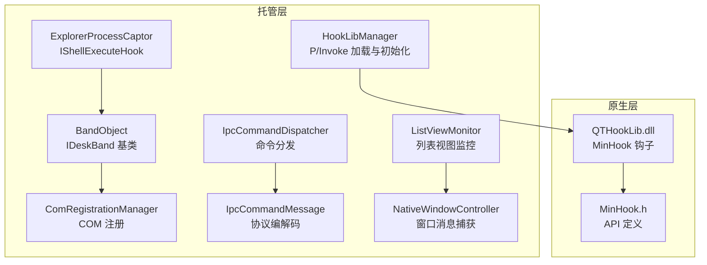
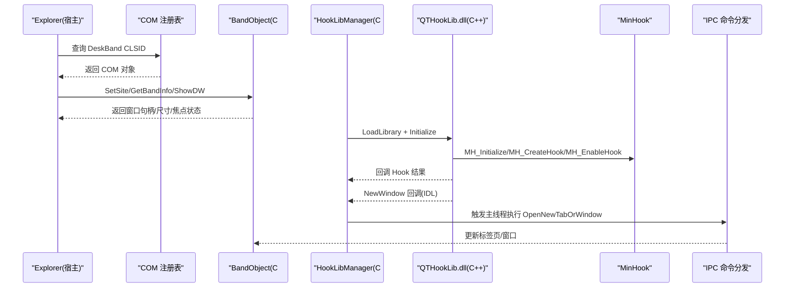
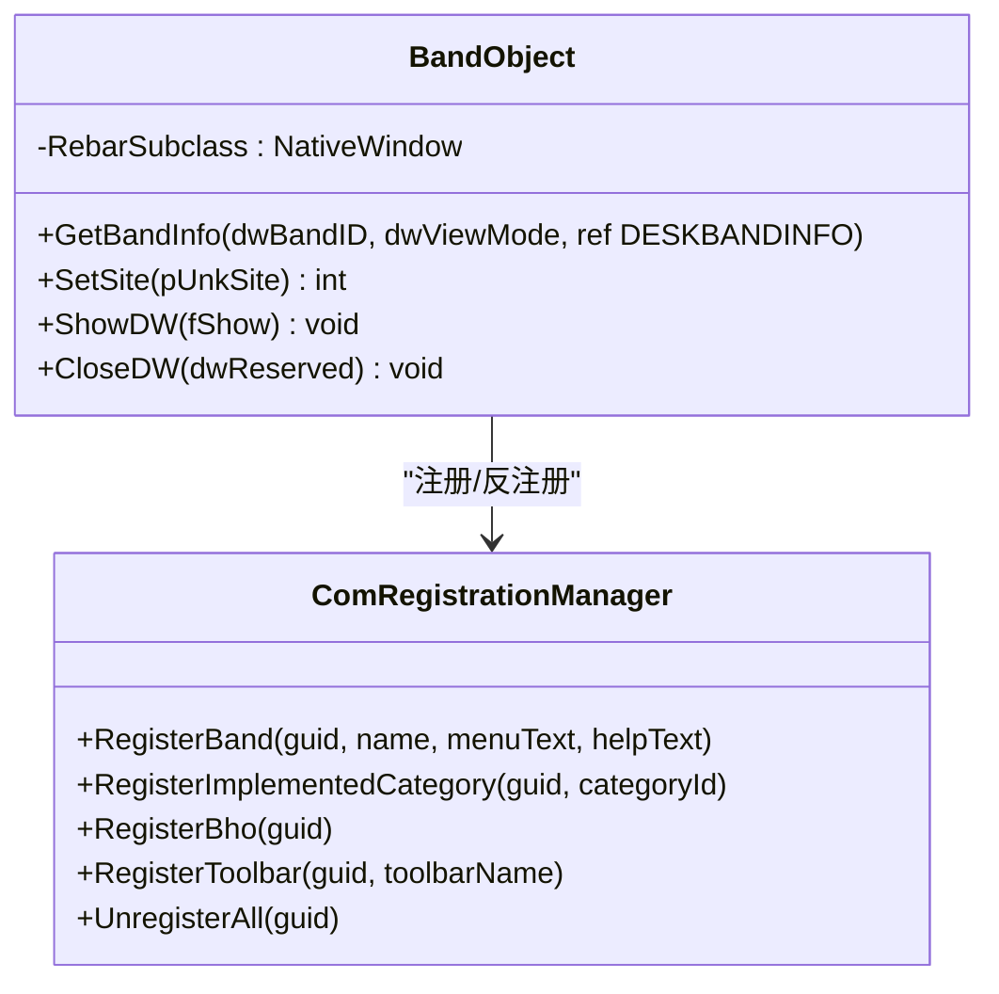
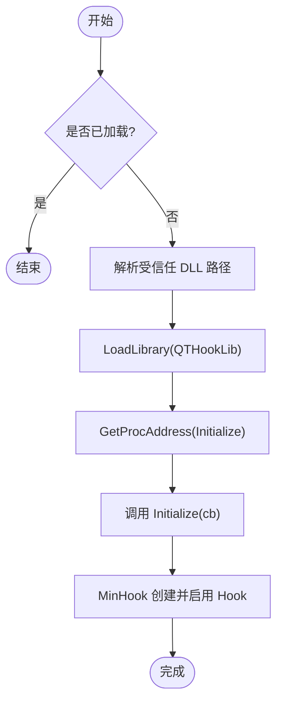
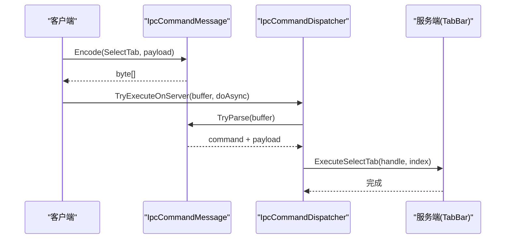
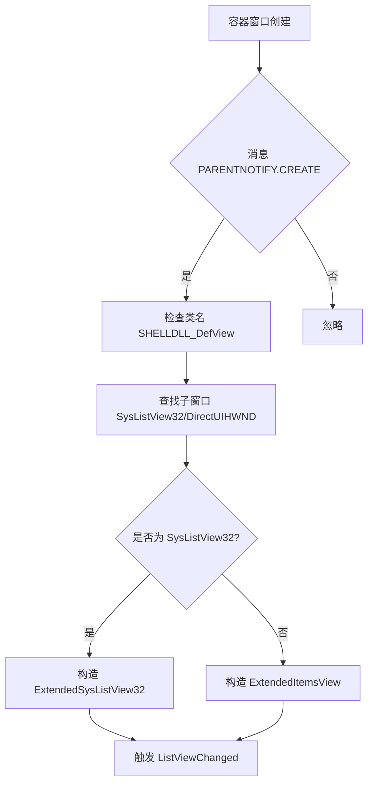
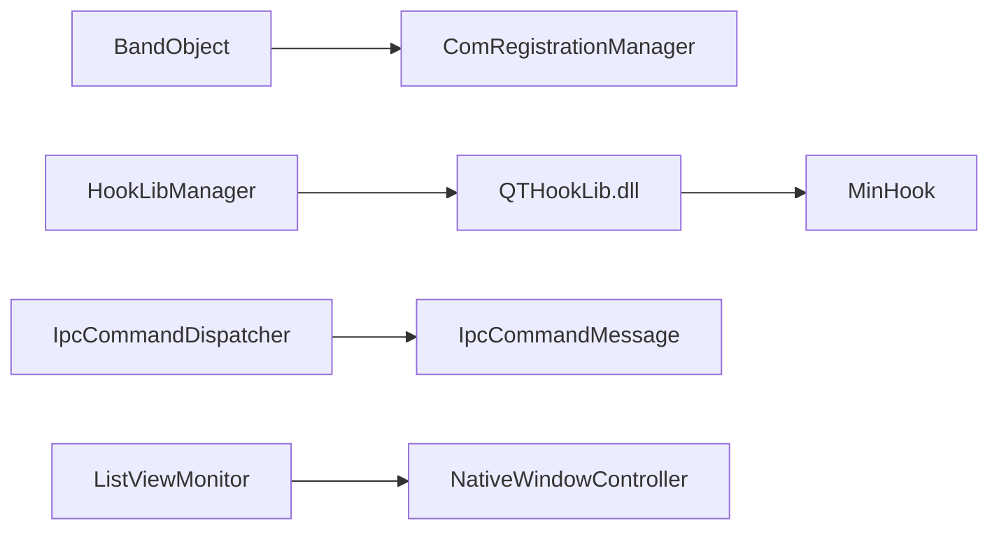

# 系统集成

<cite>
**本文引用的文件**   
- [BandObject.cs](file://BandObjectLib/BandObject.cs)
- [ComRegistrationManager.cs](file://QTTabBar/ComRegistrationManager.cs)
- [MinHook.h](file://MinHook/MinHook.h)
- [main.cpp](file://QTHookLib/main.cpp)
- [HookLibManager.cs](file://QTTabBar/HookLibManager.cs)
- [IpcCommandDispatcher.cs](file://QTTabBar/IpcCommandDispatcher.cs)
- [IpcCommandMessage.cs](file://QTTabBar/IpcCommandMessage.cs)
- [ExplorerProcessCaptor.cs](file://QTTabBar/ExplorerProcessCaptor.cs)
- [ListViewMonitor.cs](file://QTTabBar/ListViewMonitor.cs)
- [NativeWindowController.cs](file://QTTabBar/NativeWindowController.cs)
</cite>

## 目录
1. [简介](#简介)
2. [项目结构](#项目结构)
3. [核心组件](#核心组件)
4. [架构总览](#架构总览)
5. [详细组件分析](#详细组件分析)
6. [依赖关系分析](#依赖关系分析)
7. [性能考虑](#性能考虑)
8. [故障排查指南](#故障排查指南)
9. [结论](#结论)
10. [附录](#附录)

## 简介
本技术文档聚焦 QTTabBar-Next 的系统集成功能，围绕以下主题展开：
- Windows Shell 扩展集成：IDeskBand 接口实现、COM 注册机制与消息处理系统
- 原生代码集成：MinHook 库使用、P/Invoke 最佳实践与内存管理策略
- 进程间通信（IPC）：消息传递、数据序列化与线程同步
- 文件系统监控与事件监听：窗口消息捕获与列表视图切换
- 与 Windows API 的交互：窗口管理、图标处理与剪贴板操作
- 错误处理、异常恢复与资源清理策略
- 调试技巧与性能分析方法

## 项目结构
本项目采用“托管层 + 原生钩子库”的分层架构：
- 托管层（C#）负责 COM 对象生命周期、Shell 扩展宿主绑定、UI 与业务逻辑、IPC 编解码与调度、窗口子类化与事件分发
- 原生层（C++）通过 MinHook 对 Explorer 关键函数进行 Hook，建立跨进程回调通道，驱动托管侧行为

**图示来源**
- [BandObject.cs:1-120](file://BandObjectLib/BandObject.cs#L1-L120)
- [ComRegistrationManager.cs:1-108](file://QTTabBar/ComRegistrationManager.cs#L1-L108)
- [HookLibManager.cs:1-120](file://QTTabBar/HookLibManager.cs#L1-L120)
- [IpcCommandDispatcher.cs:1-86](file://QTTabBar/IpcCommandDispatcher.cs#L1-L86)
- [IpcCommandMessage.cs:1-80](file://QTTabBar/IpcCommandMessage.cs#L1-L80)
- [ListViewMonitor.cs:1-166](file://QTTabBar/ListViewMonitor.cs#L1-L166)
- [NativeWindowController.cs:1-110](file://QTTabBar/NativeWindowController.cs#L1-L110)
- [ExplorerProcessCaptor.cs:1-126](file://QTTabBar/ExplorerProcessCaptor.cs#L1-L126)
- [MinHook.h:1-106](file://MinHook/MinHook.h#L1-L106)
- [main.cpp:590-728](file://QTHookLib/main.cpp#L590-L728)

**章节来源**
- [BandObject.cs:1-120](file://BandObjectLib/BandObject.cs#L1-L120)
- [ComRegistrationManager.cs:1-108](file://QTTabBar/ComRegistrationManager.cs#L1-L108)
- [HookLibManager.cs:1-120](file://QTTabBar/HookLibManager.cs#L1-L120)
- [IpcCommandDispatcher.cs:1-86](file://QTTabBar/IpcCommandDispatcher.cs#L1-L86)
- [IpcCommandMessage.cs:1-80](file://QTTabBar/IpcCommandMessage.cs#L1-L80)
- [ListViewMonitor.cs:1-166](file://QTTabBar/ListViewMonitor.cs#L1-L166)
- [NativeWindowController.cs:1-110](file://QTTabBar/NativeWindowController.cs#L1-L110)
- [ExplorerProcessCaptor.cs:1-126](file://QTTabBar/ExplorerProcessCaptor.cs#L1-L126)
- [MinHook.h:1-106](file://MinHook/MinHook.h#L1-L106)
- [main.cpp:590-728](file://QTHookLib/main.cpp#L590-L728)

## 核心组件
- BandObject：实现 IDeskBand/IDockingWindow/IInputObject/IObjectWithSite/IOleWindow/IPersistStream，提供与 Explorer Rebar 容器的绑定、尺寸与焦点管理、Rebar 子类化修复等能力
- ComRegistrationManager：集中管理 CLSID、Implemented Categories、BHO、IE Toolbar 等注册项的增删改
- HookLibManager：负责在托管端动态加载 QTHookLib.dll，调用其 Initialize/InitShellBrowserHook，并通过回调将结果回传至托管侧
- QTHookLib（原生）：基于 MinHook 创建并启用多个系统级 Hook，注册自定义消息，维护与托管端的回调结构体
- IpcCommandMessage/IpcCommandDispatcher：定义轻量二进制协议（前缀+版本+命令+负载），在客户端与服务端之间分发命令
- ListViewMonitor/NativeWindowController：通过子类化容器窗口捕获 PARENTNOTIFY/CREATE 等消息，识别 SHELLDLL_DefView/SysListView32/DirectUIHWND，动态切换当前列表视图封装
- ExplorerProcessCaptor：实现 IShellExecuteHook，拦截 Explorer 启动参数，解析 root/select 等选项

**章节来源**
- [BandObject.cs:35-120](file://BandObjectLib/BandObject.cs#L35-L120)
- [ComRegistrationManager.cs:10-108](file://QTTabBar/ComRegistrationManager.cs#L10-L108)
- [HookLibManager.cs:28-120](file://QTTabBar/HookLibManager.cs#L28-L120)
- [main.cpp:590-728](file://QTHookLib/main.cpp#L590-L728)
- [IpcCommandMessage.cs:1-80](file://QTTabBar/IpcCommandMessage.cs#L1-L80)
- [IpcCommandDispatcher.cs:1-86](file://QTTabBar/IpcCommandDispatcher.cs#L1-L86)
- [ListViewMonitor.cs:23-166](file://QTTabBar/ListViewMonitor.cs#L23-L166)
- [NativeWindowController.cs:22-110](file://QTTabBar/NativeWindowController.cs#L22-L110)
- [ExplorerProcessCaptor.cs:10-126](file://QTTabBar/ExplorerProcessCaptor.cs#L10-L126)

## 架构总览
下图展示从托管到原生的整体集成路径：托管端完成 COM 注册与对象实例化；在 Explorer 中作为 DeskBand 运行；通过 QTHookLib 注入并 Hook Explorer 内部函数；利用自定义消息和回调桥接两进程；最终由 IPC 命令驱动 UI 与配置刷新。

**图示来源**
- [BandObject.cs:429-515](file://BandObjectLib/BandObject.cs#L429-L515)
- [HookLibManager.cs:145-264](file://QTTabBar/HookLibManager.cs#L145-L264)
- [main.cpp:590-728](file://QTHookLib/main.cpp#L590-L728)
- [IpcCommandDispatcher.cs:5-86](file://QTTabBar/IpcCommandDispatcher.cs#L5-L86)

## 详细组件分析

### Shell 扩展集成（IDeskBand 与 COM 注册）
- BandObject 实现了完整的 DeskBand 生命周期：SetSite 获取站点与 Rebar 句柄、GetBandInfo 响应尺寸与模式标志、ShowDW 控制可见性、CloseDW 释放 COM 引用与子类化对象
- 针对 Rebar 的 BREAK 样式问题，通过子类化 Rebar 窗口过程拦截 RB_SETBANDINFO/RB_DELETEBAND 并修正样式
- COM 注册由 ComRegistrationManager 统一封装，支持注册 CLSID、Implemented Categories、BHO、IE Toolbar 以及卸载流程

**图示来源**
- [BandObject.cs:317-515](file://BandObjectLib/BandObject.cs#L317-L515)
- [ComRegistrationManager.cs:10-108](file://QTTabBar/ComRegistrationManager.cs#L10-L108)

**章节来源**
- [BandObject.cs:80-160](file://BandObjectLib/BandObject.cs#L80-L160)
- [BandObject.cs:317-515](file://BandObjectLib/BandObject.cs#L317-L515)
- [ComRegistrationManager.cs:10-108](file://QTTabBar/ComRegistrationManager.cs#L10-L108)

### 原生代码集成（MinHook 与 P/Invoke）
- HookLibManager 负责安全地解析 DLL 路径（优先受信任安装目录，必要时回退旧路径并记录告警），LoadLibrary 后通过 GetProcAddress 获取 Initialize/InitShellBrowserHook 入口，并以 Cdecl 委托类型进行调用
- QTHookLib 在 Initialize 中调用 MH_Initialize，随后批量 CREATE_HOOK 系统函数（如 CoCreateInstance、RegisterDragDrop、SHCreateShellFolderView、CreateWindowExW、BeginPaint、FillRect 等），并注册自定义消息
- InitShellBrowserHook 针对具体 IShellBrowser 实例创建 COM 方法 Hook（BrowseObject、UpdateWindowList、TravelToEntry 等）

**图示来源**
- [HookLibManager.cs:145-264](file://QTTabBar/HookLibManager.cs#L145-L264)
- [main.cpp:590-728](file://QTHookLib/main.cpp#L590-L728)
- [MinHook.h:79-106](file://MinHook/MinHook.h#L79-L106)

**章节来源**
- [HookLibManager.cs:28-120](file://QTTabBar/HookLibManager.cs#L28-L120)
- [HookLibManager.cs:345-434](file://QTTabBar/HookLibManager.cs#L345-L434)
- [main.cpp:590-728](file://QTHookLib/main.cpp#L590-L728)
- [MinHook.h:34-106](file://MinHook/MinHook.h#L34-L106)

### 进程间通信（IPC）机制
- 协议设计：固定前缀“QTIP”，版本号 1，命令字节，后续为负载；避免落入 BinaryFormatter，提升安全性
- 编解码：IpcCommandMessage 提供 Encode/TryParse/TryDecodeSelectTab 等方法，确保跨进程边界的数据一致性
- 分发：IpcCommandDispatcher 根据命令选择对应 Action，支持同步或异步执行；例如 SelectTab 通过 TabInstanceRegistry 定位目标并设置 SelectedTabIndex

**图示来源**
- [IpcCommandMessage.cs:16-78](file://QTTabBar/IpcCommandMessage.cs#L16-L78)
- [IpcCommandDispatcher.cs:5-86](file://QTTabBar/IpcCommandDispatcher.cs#L5-L86)

**章节来源**
- [IpcCommandMessage.cs:1-80](file://QTTabBar/IpcCommandMessage.cs#L1-L80)
- [IpcCommandDispatcher.cs:1-86](file://QTTabBar/IpcCommandDispatcher.cs#L1-L86)

### 文件系统监控与事件监听
- ListViewMonitor 通过 NativeWindowController 子类化 Shell 容器窗口，监听 PARENTNOTIFY/CREATE 消息，识别 SHELLDLL_DefView 及其子控件 SysListView32/DirectUIHWND
- 当检测到新列表视图时，构造对应的 ExtendedSysListView32 或 ExtendedItemsView 包装器，并触发 ListViewChanged 事件供上层订阅
- Dispose 时正确反订阅事件并释放引用，避免悬挂指针与内存泄漏

**图示来源**
- [ListViewMonitor.cs:48-111](file://QTTabBar/ListViewMonitor.cs#L48-L111)
- [NativeWindowController.cs:30-90](file://QTTabBar/NativeWindowController.cs#L30-L90)

**章节来源**
- [ListViewMonitor.cs:23-166](file://QTTabBar/ListViewMonitor.cs#L23-L166)
- [NativeWindowController.cs:22-110](file://QTTabBar/NativeWindowController.cs#L22-L110)

### 与 Windows API 的交互（窗口管理、图标处理、剪贴板）
- 窗口管理：BandObject 通过 IOleWindow.GetWindow 获取 Rebar 句柄，并使用 SendMessage 与 Rebar 通信；NativeWindowController 子类化窗口以捕获消息
- 图标处理：QTHookLib 使用 GDI+/GDI 加载位图并在 BeginPaint/FillRect/CreateCompatibleDC 等绘制阶段进行背景渲染（示例路径见 main.cpp）
- 剪贴板：项目中存在相关互操作定义（如 DROPFILES、BITMAPINFO 等），用于拖放与图像传输场景（参考 Interop 命名空间下的结构体）

**章节来源**
- [BandObject.cs:378-484](file://BandObjectLib/BandObject.cs#L378-L484)
- [main.cpp:755-800](file://QTHookLib/main.cpp#L755-L800)

### 错误处理、异常恢复与资源清理
- 托管侧：HookLibManager.Initialize 捕获 DllNotFoundException、SecurityException、UnauthorizedAccessException 等，降级禁用钩子并记录日志；BandObject.CloseDW 释放 COM 引用与 Rebar 子类化对象
- 原生侧：Dispose 中先 MH_DisableHook(NULL) 再 MH_Uninitialize，释放 GDI/Gdiplus 资源，重置初始化标志
- IPC：TryParse 失败直接返回 false，避免进入未知分支；SelectTab 解码失败记录错误日志并终止执行

**章节来源**
- [HookLibManager.cs:241-264](file://QTTabBar/HookLibManager.cs#L241-L264)
- [BandObject.cs:178-196](file://BandObjectLib/BandObject.cs#L178-L196)
- [main.cpp:730-752](file://QTHookLib/main.cpp#L730-L752)
- [IpcCommandMessage.cs:20-40](file://QTTabBar/IpcCommandMessage.cs#L20-L40)

## 依赖关系分析
- 托管层依赖：
  - BandObject 依赖 COM 接口与 Win32 消息机制
  - HookLibManager 依赖 P/Invoke 与配置文件（安全策略、自动钩子开关）
  - IpcCommandDispatcher 依赖 IpcCommandMessage 与 UI 线程调度
  - ListViewMonitor 依赖 NativeWindowController 与窗口类名匹配
- 原生层依赖：
  - QTHookLib 依赖 MinHook 与 Windows SDK（ShObjIdl、UIAutomationCore、GdiPlus）
  - 通过回调结构体与托管层通信，避免跨进程消息丢失

**图示来源**
- [BandObject.cs:35-120](file://BandObjectLib/BandObject.cs#L35-L120)
- [HookLibManager.cs:145-264](file://QTTabBar/HookLibManager.cs#L145-L264)
- [main.cpp:590-728](file://QTHookLib/main.cpp#L590-L728)
- [IpcCommandDispatcher.cs:1-86](file://QTTabBar/IpcCommandDispatcher.cs#L1-L86)
- [ListViewMonitor.cs:23-166](file://QTTabBar/ListViewMonitor.cs#L23-L166)

**章节来源**
- [BandObject.cs:35-120](file://BandObjectLib/BandObject.cs#L35-L120)
- [HookLibManager.cs:145-264](file://QTTabBar/HookLibManager.cs#L145-L264)
- [main.cpp:590-728](file://QTHookLib/main.cpp#L590-L728)
- [IpcCommandDispatcher.cs:1-86](file://QTTabBar/IpcCommandDispatcher.cs#L1-L86)
- [ListViewMonitor.cs:23-166](file://QTTabBar/ListViewMonitor.cs#L23-L166)

## 性能考虑
- 延迟初始化与条件加载：HookLibManager 在服务器版系统或用户关闭自动钩子时快速退出，避免不必要的 LoadLibrary 与 Hook 创建
- 最小化跨进程开销：IPC 使用轻量二进制协议，避免反射与复杂序列化
- 减少 UI 线程阻塞：可选异步执行（RunMaybeAsync），将耗时操作移至后台线程
- 资源复用：QTHookLib 在 Initialize 中一次性创建 Hook，避免重复分配；Dispose 中集中释放 GDI/Gdiplus 资源

[本节为通用指导，不直接分析具体文件]

## 故障排查指南
- 钩子未生效：
  - 检查 HookLibManager.Initialize 的日志输出与错误码；确认 DLL 路径解析是否命中受信任目录
  - 查看 QTHookLib 的 MH_STATUS 返回值，定位 MH_CreateHook/MH_EnableHook 失败原因
- 列表视图无响应：
  - 确认 ListViewMonitor 是否正确捕获 PARENTNOTIFY/CREATE 消息，类名匹配是否成功
  - 检查 NativeWindowController 的事件订阅与 ReleaseHandle 行为
- IPC 命令无效：
  - 验证 IpcCommandMessage 的前缀与版本是否一致；检查负载长度与字段布局
  - 查看 IpcCommandDispatcher 的错误日志，确认命令是否在支持列表中
- Explorer 启动参数未解析：
  - 检查 ExplorerProcessCaptor 的命令行正则解析逻辑与 root/select 分支

**章节来源**
- [HookLibManager.cs:241-264](file://QTTabBar/HookLibManager.cs#L241-L264)
- [main.cpp:590-728](file://QTHookLib/main.cpp#L590-L728)
- [ListViewMonitor.cs:48-111](file://QTTabBar/ListViewMonitor.cs#L48-L111)
- [NativeWindowController.cs:92-110](file://QTTabBar/NativeWindowController.cs#L92-L110)
- [IpcCommandMessage.cs:20-40](file://QTTabBar/IpcCommandMessage.cs#L20-L40)
- [IpcCommandDispatcher.cs:12-59](file://QTTabBar/IpcCommandDispatcher.cs#L12-L59)
- [ExplorerProcessCaptor.cs:79-123](file://QTTabBar/ExplorerProcessCaptor.cs#L79-L123)

## 结论
QTTabBar-Next 的系统集成通过清晰的托管/原生分层、稳健的 COM 注册与 DeskBand 实现、安全的 P/Invoke 与 MinHook 集成、轻量的 IPC 协议以及可靠的窗口消息监控，构建了高可用、可扩展的 Explorer 增强方案。建议在部署时严格遵循受信任路径策略，结合日志与测试用例持续优化稳定性与性能。

[本节为总结性内容，不直接分析具体文件]

## 附录
- 调试建议：
  - 使用 OutputDebugStringW 与日志文件联合定位原生层问题
  - 在托管侧启用 bandLog 与异常日志，记录 PID/TID/时间戳
- 性能分析工具：
  - PerfView/ETW 采集 Explorer 与 QTHookLib 的调用栈
  - Visual Studio Profiler 分析托管侧热点与 GC 压力
- 安全加固：
  - 强制 BlockLegacyHookDllPath 以避免用户可写目录被劫持
  - 校验 IPC 协议头与版本，拒绝未知命令

[本节为通用指导，不直接分析具体文件]